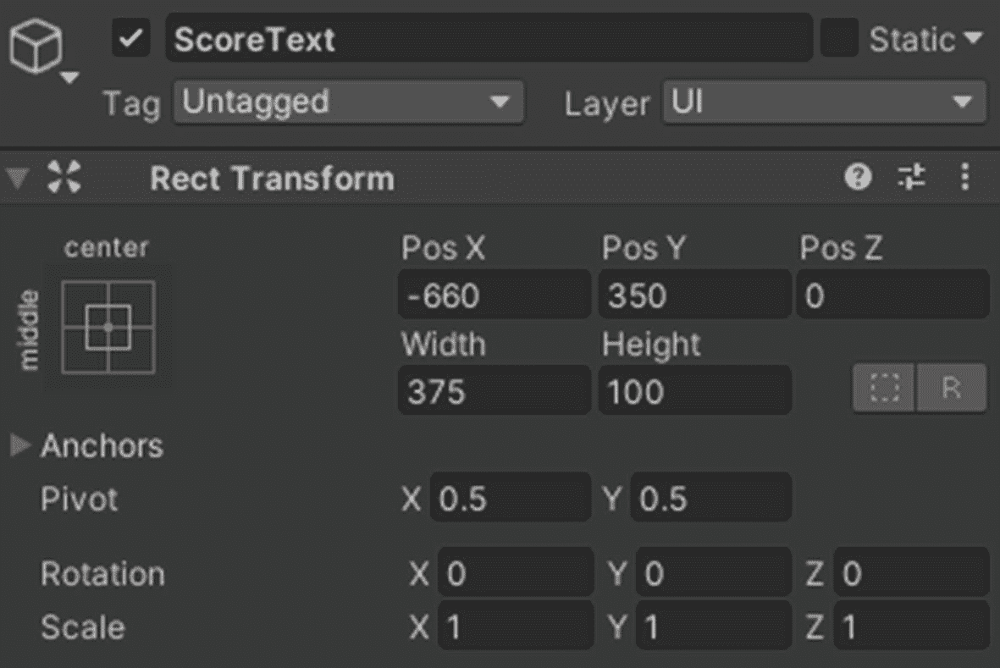
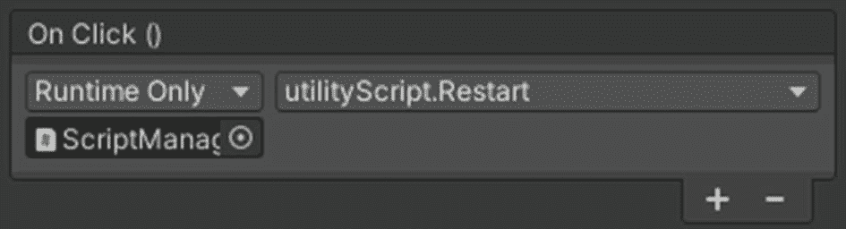

# 6.改进和建立球形射手

虽然从技术上来说，游戏可以按照上一章的配置来玩，但在这一章，我们将增加几个新的机制和特性。最后，我将讨论游戏中可以包含的其他功能，如果你希望继续开发它并触发一个版本，以便我们有一个可以安装在 Android 设备上的独立应用程序。

## 6.1 产卵的敌人

一个敌人很好，但如果我们有更多的敌人，游戏会更好。在这一节中，我们将在场景中定义的位置放置空的游戏对象，并在设定的延迟时间内，在定义的随机位置实例化(繁殖)敌人。

创建一个空的游戏对象，命名为 SpawnPoints，放在(0，1.15，0)的位置。它的旋转和缩放已经设置为(0，0，0)和(1，1，1)。我们可以将其标记为静态，但这不会有什么不同。

创建四个空的游戏对象作为 SpawnPoints 的子对象(图 [6-1](#Fig1) )。你想怎么命名就怎么命名，分别放在(0，0，15)，(15，0，0)，(0，0，-15)，和(-15，0，0)。


图 6-1

产卵点游戏对象

接下来，将敌人游戏对象从场景中拖放到项目窗口的预设文件夹中，并将其从场景中删除。

创建一个新的脚本，将其命名为 enemySpawner，等待它编译，将其放置在场景中的 SpawnPoints 游戏对象上，然后打开它。这就是在我们的场景中滋生敌人的原因。

```java
public float delay;
public GameObject enemy;

```

我们将在一个名为`delay`的公共浮动变量中存储生成敌人之间的延迟，并在`enemy`中存储对敌人预设游戏对象的引用。

```java
void SpawnEnemy() {
    int randomPos = (int)Random.Range(0, transform.childCount);
    Instantiate(enemy, transform.GetChild(randomPos).position, enemy.transform.rotation);
}

```

为了制造敌人，我们将使用一个名为`SpawnEnemy`的函数。在这个函数中，我们要做的第一件事是随机选取一个游戏对象的子对象的索引。有四个可能的产卵点可用，所以我们将最小值(`0`)和最大值(`transform.childCount`)传递给`Random.Rage`函数，以随机选择一个。通过这样做，我们可以添加尽可能多的种子点，而不用每次都编辑代码。由于将要返回的值将是一个浮点数，我们将其转换为一个整数(强制转换)并存储在本地变量`randomPos`中。在下一步中，我们在刚刚得到的索引处找到 SpawnPoints 的子对象，并在该位置和敌人的旋转处实例化一个敌人的游戏对象。

```java
void Start() {
    InvokeRepeating("SpawnEnemy", 0.0f, delay);
}

```

最后，一旦游戏开始，每隔`<delay>`秒就会调用`SpawnEnemy`函数，使用`InvokeRepeating`函数，它有以下三个参数:

1.  要调用的函数

2.  开始时间

3.  应该多久调用一次函数

```java
using System.Collections;
using System.Collections.Generic;
using UnityEngine;

public class enemySpawner : MonoBehaviour {
   public float delay;
   public GameObject enemy;

   void Start() {
       InvokeRepeating("SpawnEnemy", 0.0f, delay);
   }

   void SpawnEnemy() {
       int randomPos = (int)Random.Range(0, transform.childCount);
       Instantiate(enemy, transform.GetChild(randomPos).position, enemy.transform.rotation);
   }
}

```

只需设置一个你选择的延迟值，然后把敌人的预设拖回编辑器的敌人区域。测试敌人是否正在繁殖，向玩家坦克移动，并被消灭(图 [6-2](#Fig2) )。


图 6-2

作为组件的`enemySpawner`脚本

## 6.2 评分

现在，当我们杀死一个敌人时，它就会被摧毁并消失。然而，如果我们能保留一个类似分数的东西，并随着敌人被杀而递增，那就太好了。

首先，在 Canvas GameObject 下创建一个 UI 文本元素。将其命名为 ScoreText，放置在(-660，350，0)，并分别赋予其宽度和高度 375 和 100(图 [6-3](#Fig3) )。



图 6-3

ScoreText UI 元素的 Rect 转换组件

对于文本组件本身，我们不会使用 Best Fit，因为随着我们的游戏进行，游戏中的文本 UI 元素似乎变得更大/更小，这看起来有点尴尬。因此，我们将字体大小设置为一个最大值，该值预计足以容纳我们希望存储在该 UI 元素中的所有信息。

我还添加了虚拟文本，并将字体设置为粗体。此外，我将文本水平对齐设置为左侧，垂直对齐设置为中间，并赋予黄色(图 [6-4](#Fig4) )。


图 6-4

coretext ui 元素的文本组件

我们将希望我们的敌人发送一个调用，每次他们被子弹击中时增加分数，并相应地更新 ScoreText UI 元素。正如我之前提到的，我们不能直接引用场景中的东西到项目窗口中的预设。这是介绍实例的好时机。使用静态属性并使它们在场景中可公开访问，可以从场景中的任何地方访问和调用类和函数。

为了演示这一点，创建一个新的 GameObject，将其命名为 ScriptManager，并创建和打开一个名为 scoreManager 的脚本。将`using UnityEngine.UI`行添加到脚本中，以便我们能够稍后修改`scoreText`的`text`值。

```java
public static scoreManager instance;
public Text scoreText;
int score;

```

我们将使用三个变量。第一个将被命名为`instance`,它实际上对应于我们脚本的一个实例，可以从其他脚本中调用这个实例。另外两个变量，`scoreText`和`score`，分别引用我们之前创建和配置的 UI 文本元素，并存储当前得分。

```java
void UpdateScore() {
    scoreText.text = "Score: " + score.ToString();
}

```

我们也将有一个函数来更新`scoreText`的内容，这样我们就不必使用一种形式的`Update()`函数来不断地检查或更新。请注意，score 变量中的内容必须转换为字符串格式。

```java
void Awake() {
    if (instance) {
        Destroy(this.gameObject);
    } else {
        instance = this;
    }
    UpdateScore();
}

public void IncreaseScore(int amount) {
    score += amount;
    UpdateScore();
}

```

在 Awake 函数中，我们将在场景中初始化其他脚本之前为该脚本创建实例。我们首先检查这个脚本的实例是否已经存在，如果存在，我们销毁当前的实例。否则，我们将场景中的脚本实例设置为当前实例。最后，我们更新了我们的`scoreText`，这样它就不会保留我们的虚拟文本。

```java
public void IncreaseScore(int amount) {
    score += amount;
    UpdateScore();
}

```

我们还会有一个`last`函数，这样我们就可以改变分数值。我们可以向该函数传递一个值来指定分数的增量。我们只需要更新`scoreText`就可以了。

```java
using System.Collections;
using System.Collections.Generic;
using UnityEngine;
using UnityEngine.UI;

public class scoreManager : MonoBehaviour {
   public static scoreManager instance;
   public Text scoreText;
   int score;

   void Awake() {
       if (instance) {
           Destroy(this.gameObject);
       } else {
           instance = this;
       }
       UpdateScore();
   }

   public void IncreaseScore(int amount) {
       score += amount;
       UpdateScore();
   }

   void UpdateScore() {
       scoreText.text = "Score: " + score.ToString();
   }
}

```

回到编辑器中，我们将脚本放在 ScriptManager 游戏对象上，并将实际的 ScoreText UI 元素拖动到脚本的`scoreText`字段中(图 [6-5](#Fig5) )。


图 6-5

作为组件的 scoreManager 脚本

如果你进入游戏模式，当你杀死敌人时不会有太大变化。这是因为敌人还没有做任何与增加分数相关的事情。打开敌人脚本，并在负责销毁与敌人碰撞的子弹的脚本后添加以下行:

```java
scoreManager.instance.IncreaseScore(1);

```

这一行将导致敌人访问场景中的`scoreManager`实例并调用`IncreaseScore`函数，传入一个值`1`，这将使分数增加 1。

```java
void OnCollisionEnter(Collision col) {
     if (col.gameObject.CompareTag(bulletTag))  {
         Destroy(col.gameObject);
         scoreManager.instance.IncreaseScore(1);
     }
}

```

保存脚本，这次进入播放模式，每杀死一个敌人分数就要加 1(图 [6-6](#Fig6) )。如果和你相撞的是敌人，什么都不会改变。


图 6-6

杀死两个敌人后分数显示应该是什么样子

## 6.3 制作菜单

在这一部分，我们将构建玩家可以与之交互的三个菜单。第一个会在游戏开始时显示，另一个会在玩家失败时显示，最后一个会在玩家暂停游戏时显示。然而，我们将首先编码我们将需要这些菜单的 UI 按钮执行的一切。

### 6.3.1 所需的编码工具

创建并打开名为 utilityScript 的脚本。因为 UI 按钮已经可以做很多事情了，比如禁用游戏对象，我们不需要编写所有我们需要的行为。将行`using UnityEngine.SceneManagement;`添加到脚本中，以便我们稍后可以调用相关的方法/函数。

```java
public void Restart() {
  SceneManager.LoadScene(SceneManager.GetActiveScene().name);
}

```

第一个功能将允许玩家在失败时重新开始游戏。使用 Unity 的 SceneManager，我们只需再次加载当前场景。我们通过使用`LoadScene`函数并传递当前场景的名称作为参数来实现。

下一个函数是关于退出游戏的。我们用`Application.Quit()`。

```java
public void Quit() {
    Application.Quit();
}

```

为了暂停和取消暂停游戏，我们将`Time.timeScale`值设置为 0 或 1。值为 0 将使所有东西都无法移动。

```java
public void Pause() {
    Time.timeScale = 0.0f;
}

public void UnPause() {
    Time.timeScale = 1.0f;
}

```

最后，我们在游戏开始时暂停游戏，以便我们可以在第一个菜单上选择要做的事情。

```java
void Start() {
    Pause();
}

```

以下是完整的代码:

```java
using System.Collections;
using System.Collections.Generic;
using UnityEngine;
using UnityEngine.SceneManagement;

public class utilityScript : MonoBehaviour {
   void Start() {
       Pause();
   }

   public void Restart() {    SceneManager.LoadScene(SceneManager.GetActiveScene().name);
   }

   public void Quit() {
       Application.Quit();
   }

   public void Pause() {
       Time.timeScale = 0.0f;
   }

   public void UnPause() {
       Time.timeScale = 1.0f;
   }
}

```

将脚本放在 ScriptManager 游戏对象本身上。

### 开始菜单

每当加载场景时，都会显示该菜单。在场景中，禁用 SpawnPoints 游戏对象(选中时，在检查器中取消选中其名称左侧的复选框)。我们不希望在我们点击播放按钮之前就有敌人出现。

在 Canvas 下，创建一个新的名为 StartMenu 的空游戏对象。确保它位于层次结构中画布子元素列表的底部，以便它显示在所有其他元素的顶部。

使名为 Background 的 UI 图像成为 StartMenu 的子图像。给它一个比你在游戏窗口中使用的分辨率更大的宽度和高度。我使用的是 1920 × 1080 的分辨率，所以我将宽度指定为 2500，高度指定为 1250。如果你愿意，给 UI 图像组件一个你选择的颜色，并降低它的不透明度。我使用的是有点青色的颜色，不透明度为 190(图 [6-7](#Fig7) )。


图 6-7

背景用户界面元素

接下来，您可以将一个文本 UI 元素作为 StartMenu 的子元素(图 [6-8](#Fig8) )。命名为 Title。它将被用作我们游戏名称的标签。使用最佳拟合将其调至您想要的大小，并在两个轴的中心对齐(图 [6-9](#Fig9) )。


图 6-9

标题 UI 元素的文本组件


图 6-8

标题 UI 元素的 Rect 转换组件

我们现在只需要两个按钮。创建一个 UI 按钮元素，仍然作为 StartMenu 的子元素，并将其命名为 PlayButton。我已经为 PlayButton 的图像组件选择了绿色，并将其设为 400 单位宽，100 单位高，并将其放置在(0，-180，0)(图 [6-10](#Fig10) )。


图 6-10

PlayButton UI 元素

在 PlayButton 按钮组件的 OnClick()部分(图 [6-11](#Fig11) ，点击三次加号图标(+)。在第一个槽中，拖放开始菜单并选择`GameObject.SetActive(bool)`功能，同时确保将要出现的复选框保持未选中状态。在第二个例子中，做类似的事情，除了这次使用 SpawnPoints 游戏对象，并确保复选框被选中。最后，在 ScriptManager 中拖动并选择`utilityScript.UnPause()`。


图 6-11

PlayButton 的按钮组件的`OnClick`功能

要完成 playButton 元素，请选择它的子元素(名为 Text)，使它显示 Play，并根据需要更改它的颜色。使用加粗字体并勾选最佳匹配(图 [6-12](#Fig12) )。


图 6-12

PlayButton 的子级的文本组件

我们现在只需要退出按钮。复制 PlayButton，把新元素命名为 ExitButton，给它一个红色，放在(0，-315，0)，给它的 Text UI 元素子元素一个 Exit 的值(图 [6-13](#Fig13) )。


图 6-13

ExitButton 子级的文本组件

在 ExitButton 的 OnClick()中，引用 ScriptManager 并调用`utilityScript.Quit()`函数(图 [6-14](#Fig14) )。


图 6-14

ExitButton 的按钮组件的`OnClick()`功能

你的层级应该包含以下元素和游戏对象作为画布游戏对象的子对象(图 [6-15](#Fig15) ):


图 6-15

当前构成画布中的子对象的游戏对象

请注意，在编辑器中单击 Exit 按钮不会有任何作用。您可以进入播放模式并确保按钮现在工作(图 [6-16](#Fig16) )。


图 6-16

开始菜单的外观

### 6.3.3 暂停菜单

在我们制作真正的暂停菜单之前，让我们制作一个可以在游戏中按下的暂停按钮。首先禁用开始菜单游戏对象，这样我们可以在游戏/场景视图中更容易地预览我们所做的一切。在项目窗口的纹理文件夹中下载并导入如下图片: [`https://raw.githubusercontent.com/EdgeKing810/SphereShooter/master/Asseimg/Pause.png`](https://raw.githubusercontent.com/EdgeKing810/SphereShooter/master/Asseimg/Pause.png) 。选择它并在检查器中将其标记为 Sprite2D，然后点击应用(图 [6-17](#Fig17) )。


图 6-17

导入 PauseButton 的纹理

接下来，创建一个 UI 按钮元素作为 Canvas GameObject 的子元素，并将其放在 StartMenu GameObject 之上或所有子元素的顶部。命名为 PauseButton。复制开始菜单游戏对象，命名新实例 PauseMenu，并启用它的游戏对象(图 [6-18](#Fig18) )。


图 6-18

当前构成画布中的子对象的游戏对象

删除 PauseButton 的子级文本 UI 元素。除非禁用开始菜单和暂停菜单的游戏对象，否则您可能看不到暂停按钮。将 PauseButton 放置在(0，400，0)处，并使其宽度和高度都为 100。在其图像组件中，确保它使用暂停精灵作为源图像(图 [6-19](#Fig19) )。


图 6-19

PauseButton 的矩形和图像组件

其按钮组件的`OnClick`函数应该禁用自己的 GameObject，启用实际 PauseMenu 的 game object，并从 ScriptManager 上的 utilityScript 调用`Pause`函数(图 [6-20](#Fig20) )。


图 6-20

暂停按钮的按钮组件的`OnClick`功能

如果您禁用了 PauseMenu 游戏对象，现在重新启用它，同时保持开始菜单禁用。如果你愿意，PauseMenu 的背景可以换成另一种颜色。接下来，将标题改为暂停，并删除退出按钮游戏对象。重命名 PlayButton ResumeButton，给它一个蓝色，文本 Resume 在里面。也可以将它向底部移动一点(图 [6-21](#Fig21) )。


图 6-21

当前构成画布中的子对象的游戏对象

ResumeButton 的 OnClick 应该启用 PauseButton 的 GameObject，禁用 PauseMenu 的 game object，从 ScriptManager 上的 utilityScript 调用`UnPause`函数(图 [6-22](#Fig22) )。


图 6-22

ResumeButton 的按钮组件的`OnClick`功能

最后要做的是在场景中禁用 PauseMenu 游戏对象，并启用 StartMenu 的游戏对象。我们做了相反的事情，只是为了能够预览它会是什么样子。下面是我在玩游戏时点击暂停按钮时我的暂停菜单的样子(图 [6-23](#Fig23) ):


图 6-23

PauseMenu 看起来怎么样

### 游戏结束菜单

你应该已经猜到这个菜单的用途了。复制 StartMenu，将新实例命名为 GameOverMenu，并禁用 StartMenu 和 PauseMenu 的 GameObjects。更改背景游戏对象的图像组件的颜色，改为在标题文本中显示游戏结束，并删除 PlayButton。重命名 ExitButton RestartButton，更改其颜色，并将其文本命名为子显示重新启动。最后，让它在 OnClick()中调用 ScriptManager 上的 utilityScript 的`Restart`函数(图 [6-24](#Fig24) )。



图 6-24

RestartButton 按钮组件的`OnClick`功能

创建一个新的文本 UI 元素作为 GameOverMenu 的子元素，并将其命名为 ScoreLabel。将其放置在(-200，-25，0)处，宽度和高度分别为 365 和 80。让它显示分数:，水平左对齐，垂直底部对齐。给它 65 的字体大小，标记为粗体，改变颜色(图 [6-25](#Fig25) )。


图 6-25

ScoreLabel 的 Rect 转换和文本组件

复制文本 UI 元素，将其命名为 Value，并使其成为 ScoreLabel 子元素。更改其颜色，将其水平右对齐，使其使用正常字体样式，并更改其 Rect Transform 属性，使其位置为(465，0，0)，宽度和高度分别为 250 和 80(图 [6-26](#Fig26) )。


图 6-26

值的矩形转换和文本组件

复制 ScoreLabel GameObject，将新实例重命名为 HighScoreLabel，使其位置为(-200，-125，0)，将其文本值改为 High Score:，并更改其颜色(图 [6-27](#Fig27) )。


图 6-27

HighScoreLabel 的 Rect 转换和文本组件

对于 GameOverMenu 游戏对象的子对象，我的层级窗口如下所示(图 [6-28](#Fig28) ):


图 6-28

GameOverMenu 的子游戏对象

这是我的 GameOverMenu 之后的样子，当健康机制实现后，玩家输了一局(图 [6-29](#Fig29) ):


图 6-29

GameOverMenu 看起来怎么样

同样，禁用 PauseMenu 和 GameOverMenu 的游戏对象，启用 StartMenu 的游戏对象。

## 6.4 添加健康

我们将采取类似的方法来实现对玩家健康的评分。玩家坦克上有一个独特的脚本实例，它有一个功能，所以敌人可以呼叫来降低它的生命值。我们还将实例化一个玩家失败时的爆炸，并创建必要的东西来给游戏菜单更多的上下文。

首先，复制 ScoreText UI 元素，并将其命名为 HealthText。更改文本组件的颜色，将其文本更改为 Health:，并将其放置在(-660，450，0)。确保 HealthText GameObject 与 ScoreText 的索引在同一个索引附近，这样它就不会出现在不需要的元素的下面或上面。创建一个名为 healthManager 的新脚本，将其放在 Player GameObject 上，然后打开它。将`using UnityEngine.UI;`行添加到脚本中，以便我们能够修改稍后将使用的文本元素的文本值。

```java
public static healthManager instance;
public Text healthText;

public Text scoreText;
public Text highScoreText;

int health = 5;

public GameObject explosionPrefab;

```

同样，我们创建的第一个变量将对应于我们脚本的一个实例，这样就可以从其他脚本中调用它。`healthText`稍后将引用我们 HealthText 游戏对象的文本组件。至于`scoreText`和`highScoreText`，会对应 GameOverMenu 中对应游戏对象的文本组件。整数变量`health`将记录玩家坦克当前的生命值。它最初的值为 5。最后，当玩家死亡时，我们将引用一个爆炸预置来实例化。

```java
void Awake() {
    if (instance) {
        Destroy(this.gameObject);
    } else {
        instance = this;
    }
    UpdateHealth();
}

```

在我们脚本的`Awake`函数中，我们将确保场景中只有它的一个实例。如果您不理解这段代码，请参考第 6.2 节(“评分”)。

```java
void UpdateHealth() {
    if (health <= 0) { GameOver(); return; }
    healthText.text = "Health: " + health.ToString();
}

```

在名为`UpdateHealth`的函数中，我们将更新在`healthText`变量中引用的文本，以显示玩家的健康状况。如果健康小于或等于 0，我们将调用一个函数来执行游戏结束。

```java
public void ChangeHealth(int amount) {
    health += amount;
    UpdateHealth();
}

```

我们也将有另一个公开的功能，这样敌人就可以造成伤害。当然，敌人在调用这个函数时会传递一个负值，比如-1。

```java
void GameOver() {
    healthText.text = "Health: 0";
    Instantiate(explosionPrefab, transform.position, explosionPrefab.transform.rotation);
    Destroy(this.gameObject);

    scoreText.transform.parent.parent.gameObject.SetActive(true);

    int score = scoreManager.instance.GetCurrentScore();
    scoreText.text = score.ToString();

    int highScore = PlayerPrefs.GetInt("HighScore", 0);
    if (score > highScore) {
        highScore = score;
        PlayerPrefs.SetInt("HighScore", highScore);
    }
    highScoreText.text = highScore.ToString();
}

```

在`GameOver`函数中，简而言之，我们将不得不销毁玩家，并在`GameOverMenu`变量中更新相应游戏对象的分数/高分文本。

我们要做的第一件事是设置`healthText`文本值来显示生命值为 0，在玩家的位置产生爆炸，并摧毁玩家坦克游戏对象。你应该熟悉这些语法。

接下来，为了显示实际的 GameOverMenu 屏幕，我们使用带有参数`true`的`gameObject.SetActive`方法作为 scoreText 转换本身的父转换的父 GameObject。如果你看看你的层次结构，你会看到 GameOverMenu 是 ScoreLabel 的父，它本身是 Value 的父，也就是我们的 scoreText。我们可以使用变量直接引用 GameOverMenu GameObject，但是这种方法对你很有用。

然后，我们将创建一个名为`score`的局部整数变量，我们将把从 scoreManager 实例(我们将在接下来的步骤中实现)调用的函数返回的值赋给它，以获得分数。我们将在`scoreText`变量中引用的文本组件中显示这一点。

对于高分，我们将首先创建另一个局部变量。对于这个变量，我们将获取并存储以前的高分。我们通过使用 PlayerPrefs 来做到这一点，即使在游戏关闭时，player prefs 也能够存储数据。取整数数据的语法是`PlayerPrefs.GetInt(<ID>, <defaultValue>)`。在我们的例子中，ID 是 HighScore。`PlayerPrefs`将搜索并返回与该 ID 相关联的存储值。如果该 ID 不存在，或者没有使用该 ID 保存数据，将返回默认值 0 并存储在`highScore`变量中。

然后，我们将检查我们在刚刚玩的游戏中的当前分数是否大于最高分数。如果是，我们将把与 HighScore ID 对应的变量`highScore`和`PlayerPref`的值都设置为`score`的值。最后，我们更新在`highScoreText`变量中引用的文本组件的值。

完整的脚本如下:

```java
using System.Collections;
using System.Collections.Generic;
using UnityEngine;
using UnityEngine.UI;

public class healthManager : MonoBehaviour {
   public static healthManager instance;
   public Text healthText;

   public Text scoreText;
   public Text highScoreText;

   int health = 5;

   public GameObject explosionPrefab;

   void Awake() {
       if (instance) {
           Destroy(this.gameObject);
       } else {
           instance = this;
       }
       UpdateHealth();
   }

   public void ChangeHealth(int amount) {
       health += amount;
       UpdateHealth();
   }

   void UpdateHealth() {
       if (health <= 0) { GameOver(); return; }
       healthText.text = "Health: " + health.ToString();
   }

   void GameOver() {
       healthText.text = "Health: 0";
       Instantiate(explosionPrefab, transform.position, explosionPrefab.transform.rotation);
       Destroy(this.gameObject);

       scoreText.transform.parent.parent.gameObject.SetActive(true);

       int score = scoreManager.instance.GetCurrentScore();
       scoreText.text = score.ToString();

       int highScore = PlayerPrefs.GetInt("HighScore", 0);
       if (score > highScore) {
           highScore = score;
           PlayerPrefs.SetInt("HighScore", highScore);
       }
       highScoreText.text = highScore.ToString();
   }
}

```

为了让脚本正确编译和运行，我们必须首先在我们的 scoreManager 脚本中创建`GetCurrentScore`函数。

```java
public int GetCurrentScore() {
  return score;
}

```

该函数可以被公开调用，并将返回保存在变量`score`中的整数值`;`。

保存这两个脚本。回到编辑器中，将相应的组件分配给 healthManager 的字段。别忘了这个脚本应该在你的玩家游戏对象上(图 [6-30](#Fig30) )。


图 6-30

作为组件的 healthManager 脚本

健康文本将对应于您在本节开始时创建的 Health Text 游戏对象的文本组件。分数文本和高分文本将分别对应于名为 Value 的游戏对象的文本组件，它是 ScoreLabel 和 HighScoreLabel 游戏对象的子对象。作为爆炸预设，我使用的是来自简单 FX ➤预设的 FX 爆炸碎石预设。

此外，我们必须修改敌人的脚本，这样敌人就可以造成伤害。编辑`OnCollisionEnter`函数，验证碰撞的物体是否是玩家，如果是，调用`healthManager`实例上的`ChangeHealth`函数。

```java
  if (col.gameObject.CompareTag(playerTag))  {
      healthManager.instance.ChangeHealth(-1);
  }

```

我还修改了`OnCollisionEnter`函数，因此代码重复少了一点，整体看起来更整洁。但是，您不需要这样做。

```java
void OnCollisionEnter(Collision col) {
     if (col.gameObject.CompareTag(bulletTag))  {
         Destroy(col.gameObject);
         scoreManager.instance.IncreaseScore(1);
         DestroyEnemy();
     }

     if (col.gameObject.CompareTag(playerTag))  {
         healthManager.instance.ChangeHealth(-1);
         DestroyEnemy();
     }
 }

```

现在，如果你玩这个游戏，你会看到当敌人与你碰撞时，健康文本会更新。当你的生命值达到 0 时，将会看到一个爆炸，并显示正确的`score`和`highScore`值。

当你输的时候你也会注意到错误(图 [6-31](#Fig31) )。


图 6-31

cameraFollow 脚本导致的错误

这些与 cameraFollow 脚本在玩家坦克被摧毁时无法跟随它有关，因为它对应的是一个值`null`。编辑 cameraFollow 脚本，并添加一个检查，以防止当玩家坦克被摧毁，因此不存在时出现该错误。

```java
void LateUpdate() {
  if (player) {
    this.transform.position = new Vector3(player.position.x, height, player.position.z);
  }
}

```

## 6.5 新的敌人

虽然目前的敌人做得很好，但让我们介绍一个需要三枪才能被摧毁的新敌人。如果和玩家碰撞也会造成更大的伤害。

从复制项目窗口中的敌人预设开始。将新实例命名为 EnemyBig，原始实例命名为 EnemySmall。双击打开 EnemyBig 预置(图 [6-32](#Fig32) )。给它一个(3，3，3)的比例，并通过使用新的材质来改变它的颜色和它的轨迹渲染器子对象的颜色。我还将使用 0.75 的宽度使轨迹渲染器更宽。最后，我们还想把敌人游戏对象上敌人脚本的最大速度值降低到 3，并使用另一个爆炸预设。为此，我将使用简单 FX ➤预设 fx _ 烟花 _ 蓝色 _ 大，但用橙色。


图 6-32

新敌人游戏对象上的组件

现在让我们修改负责产生敌人的脚本，enemySpawner，这样它可以随机产生我们的两个敌人预置中的任何一个。我们要做的第一件事是将`public GameObject enemy`语句转换成一个引用带有标识符“敌人”的游戏对象数组的语句:`public GameObject[] enemies`。

然后，在包含 instantiate 指令的代码行之前添加一行代码，创建一个名为`enemy`的本地 GameObject 变量，该变量将从`enemies`数组中随机分配一个`(enemy)` GameObject。

```java
void SpawnEnemy() {
    int randomPos = (int)Random.Range(0, transform.childCount);
    GameObject enemy = enemies[(int)Random.Range(0, enemies.Length)];
    Instantiate(enemy, transform.GetChild(randomPos).position, enemy.transform.rotation);
}

```

回到编辑器中，将两个敌人预设拖到 SpawnPoints 游戏对象上的 enemySpawner 组件的相应槽中(图 [6-33](#Fig33) )。


图 6-33

更新的 enemySpawner 脚本作为一个组件

你现在应该可以看到新的敌人在你玩的时候被实例化了，但是它的行为仍然和原来的一样。打开敌方脚本。是时候做些改变了。

我们将使用两个新变量:`health`和`damageToCause`。这两个变量都是全局整型变量，可以公开访问，默认值为 1。

```java
public int health = 1;
public int damageToCause = 1;

```

保存脚本，然后在项目窗口中的 EnemyBig 预置上，将这两个变量的值都设置为 3(图 [6-34](#Fig34) )。


图 6-34

EnemyBig 游戏对象组件的最终属性

然后，修改`OnCollisionEnter`函数，这样当敌人与子弹相撞时，这减少其生命值一(`health--`)，而不是调用`DestroyEnemy`函数。如果敌人与玩家发生碰撞，它应该会造成相当于保存在`damageToCause`变量中的值的伤害，所以只需将传递给 healthManager 脚本实例的`ChangeHealth`函数的`-1`值替换为`-damageToCause`。最后加一个 check，这样敌人的生命值小于等于 0 就调用`DestroyEnemy`函数。

```java
void OnCollisionEnter(Collision col) {
     if (col.gameObject.CompareTag(bulletTag))  {
         Destroy(col.gameObject);
         scoreManager.instance.IncreaseScore(1);
         health--;
     }

     if (col.gameObject.CompareTag(playerTag))  {
   healthManager.instance.ChangeHealth(-damageToCause);
         DestroyEnemy();
     }

     if (health <= 0) {
         DestroyEnemy();
     }
 }

```

保存脚本，并前往播放模式。你应该看到敌人的游戏对象需要三发子弹才能被摧毁，如果他们与玩家坦克相撞，会造成 3 点伤害。

为了完成这一部分，让我们在敌人的脚本中添加更多的东西，这样敌人会随着时间的推移变得更快，让游戏不那么无聊(不是说它是，但无论如何)。

敌方脚本的`Start`函数的第一行，除了速度变量，还要加上`(Time.time / 25)`的值。我们调用的第一个方法将返回秒数，因为游戏开始了，简而言之，我们要确保被繁殖的敌人的速度每 25 秒增加 1。

```java
void Start() {
 speed = Random.Range(minSpeed, maxSpeed) + (Time.time / 25);
 audioSource = GetComponent<AudioSource>();
 player = GameObject.FindWithTag(playerTag);
}

```

## 6.6 健康盒子

这是我们将对游戏进行修改的最后一部分。我将会介绍一个小立方体，它将会沿着地面游戏对象的区域以确定的间隔随机产生。如果玩家坦克撞上了这些小立方体中的一个，我们将称之为生命盒，我们将增加他们的生命值。

### 6.6.1 制作健康盒子

在你的场景中，创建一个 3D 对象➤立方体游戏对象。将其命名为 healthBox，并赋予其位置为(0，1，3)，旋转为(0，0，0)，缩放为(0.4，0.4，0.4)。您也可以为其指定绿色材质。然后，检查其箱式碰撞器组件的`isTrigger`属性(图 [6-35](#Fig35) )。


图 6-35

健康盒游戏对象上的组件

由于我们让健康盒游戏对象有一个 isTrigger 碰撞器，敌人可以直接通过它，而不需要我们弄乱标签和层属性。我们的玩家坦克也可以捡起它，继续它的路线，不受我们想要它去的方向的影响，因为没有碰撞发生。

### 添加健康

现在，如果你玩，玩家坦克只是通过健康盒游戏对象，真的没有更多的事情发生。为了使坦克具有交互性，并赋予它在游戏中的意义，我们必须编写一个脚本来定义应该发生什么。创建一个脚本，命名为 healthBox，并打开它。

我们将需要一个函数在发生 isTrigger 碰撞时运行，如果这是玩家坦克的碰撞器导致的，我们必须调用该函数来增加玩家的生命值并摧毁生命盒的游戏对象。如果我们不执行这最后一步，玩家可以不断地进出同一个生命盒来增加他们的寿命。我们还会增加玩家的生命值 2，但是你可以选择另一个值。

完整的脚本如下。保存它，并将其放置在场景中的健康盒游戏对象上。您还会注意到，我们使用的`OnTriggerEnter`函数带有一个作为参数传递的碰撞器类型引用。该函数的执行方式与我们一直使用的著名的`OnCollisionEnter`函数类似，但这次是为了处理触发冲突。

```java
using System.Collections;
using System.Collections.Generic;
using UnityEngine;

public class healthBox : MonoBehaviour {
   void OnTriggerEnter(Collider col) {
       if (col.gameObject.CompareTag("Player")) {
           healthManager.instance.ChangeHealth(2);
           Destroy(this.gameObject);
       }
   }
}

```

当你现在进入游戏模式时，你应该会注意到 healthBox GameObject 被破坏，当你与它“碰撞”时，你的生命值增加 2(或你在上一步中选择的值)。

### 6.6.3 沿地图生成生命盒

在一个预设中转动健康盒游戏对象，并将其从你的场景中删除(图 [6-36](#Fig36) )。


图 6-36

生命盒游戏对象在预置中被打开后

创建另一个脚本，将其命名为 healthBoxSpawner，并打开它。我们将使用三个变量，分别用于引用健康盒预设的游戏对象，我们场景中地面游戏对象的转换，并保存一个值，该值将定义以何种间隔生成健康盒游戏对象，与 enemySpawner 脚本类似。

```java
public GameObject healthBox;
public Transform ground;
public float delay = 3.0f;

```

就像 enemySpawner 脚本中的`Start`函数一样，我们必须每隔 x 秒调用一次函数，正如 delay 变量中定义的那样，以实例化一个 healthBox 游戏对象。

```java
void Start() {
    InvokeRepeating("SpawnHealthBox", 0.0f, delay);
}

```

由于我们的地面游戏对象沿其 x 和 z 轴的比例为 150，原点(0，0，0)位于其中心，因此任何位于其边缘的游戏对象的 x 和/或 z 位置都必须为 75 或-75。因此，我们将在 75 到-75 之间为 x 和 y 值选择一个随机值，我们希望在`SpawnHealthBox`函数中实例化一个健康盒。

例如，要获得沿 x 轴位置的随机值，我们将使用以下代码:

```java
float xPos = Random.Range(-1.0f, 1.0f) * (ground.localScale.x / 2);

```

游戏对象的比例总是局部表示的。除以 2 将得到 75，我们只需将其乘以-1 到 1 之间的一个随机值。

我们将做同样的事情来获得 z 轴的值。y 轴值将为 1。然后，只需要创建一个`Vector3`变量，并在那个位置实例化一个 healthBox。`Quaternion.identity`可以解释为沿所有轴 0°旋转。

```java
void SpawnHealthBox() {
    float xPos = Random.Range(-1.0f, 1.0f) * (ground.localScale.x / 2);
    float zPos = Random.Range(-1.0f, 1.0f) * (ground.localScale.z / 2);

    Vector3 spawnPos = new Vector3(xPos, 1, zPos);

    Instantiate(healthBox, spawnPos, Quaternion.identity);
}

```

这是完整的脚本，以防你漏掉了什么。保存它并将其拖动到场景中的 SpawnPoints 游戏对象上，因为我们希望它只在我们玩游戏时运行(而不是在玩家单击“玩”、暂停游戏或失败之前)。

```java
using System.Collections;
using System.Collections.Generic;
using UnityEngine;

public class healthBoxSpawner : MonoBehaviour {

   public GameObject healthBox;
   public Transform ground;
   public float delay = 3.0f;

   void Start() {
       InvokeRepeating("SpawnHealthBox", 0.0f, delay);
   }

   void SpawnHealthBox() {
       float xPos = Random.Range(-1.0f, 1.0f) * (ground.localScale.x / 2);
       float zPos = Random.Range(-1.0f, 1.0f) * (ground.localScale.z / 2);

       Vector3 spawnPos = new Vector3(xPos, 1, zPos);

       Instantiate(healthBox, spawnPos, Quaternion.identity);
   }
}

```

将生命盒预置拖放到生命盒区域，将地面游戏对象拖放到地面区域。您可以为延迟设置另一个值，而不是 3(图 [6-37](#Fig37) )。


图 6-37

作为组件的 healthBoxSpawner 脚本

## 6.7 将游戏导出为。apk 文件

我们现在有了一个全功能的游戏！让我们做一个。apk 文件，这样我们就可以把它安装在我们的 Android 手机上，并向我们的朋友炫耀！

如果你按照这本书，从我们从 Hub 下载一个版本的 Unity 编辑器并安装 Android 模块开始，你的编辑➤首选项➤外部工具标签应该是这样的(图 [6-38](#Fig38) ):


图 6-38

用于构建 Android 平台的工具

保存场景和项目。进入构建设置窗口(文件➤构建设置，或 Ctrl+Shift+B)。要做的第一件事是添加您希望出现在中的所有场景。apk(图 [6-39](#Fig39) )。我们只有一个场景，所以单击添加开放场景。如果我们有多个场景，我们会把它们都拖进来，第一个场景是我们希望玩家在游戏打开时看到的场景(图 [6-39](#Fig39) )。


图 6-39

“构件设置”窗口

点按该窗口左下角的“播放器设置”按钮。在点击 Build 之前，我们将首先修改一些设置。项目设置窗口将出现，你将在播放器标签。玩家是我们为 Unity 构建的最终游戏定制各种选项的地方。我们将只关注构建 Android 游戏最常用的选项。我们可以做的第一件事是设置一个公司名(也许是你作为开发者的名字)，一个产品名(我们游戏的名字)，并设置一个版本号(比如 1，2，3.5 等。).这些可以设置成你想要的任何值。

您已经知道如何从我们为暂停按钮导入纹理的步骤中导入纹理(第 6.3.3 节，“暂停菜单”)。然后我们可以给游戏分配一个图标和一个光标。默认情况下，如果留空，图标将是 Unity 的标志，光标将是空白的(图 [6-40](#Fig40) )。


图 6-40

播放器选项卡中的第一个选项

我不会讨论图标下的设置，但是，简而言之，你可以指定不同分辨率的纹理来匹配不同手机上的最终图标大小。它会相应地缩放我们在默认图标属性中添加的图像，如果没有调整的话，所以这不是你必须做的事情。

在分辨率和显示(图 [6-41](#Fig41) )下，您可以个性化您希望游戏在手机上显示的方式。这些选项非常简单易懂。我们不会改变这一部分的任何东西，除了我们希望我们的游戏只能在风景模式下玩。我们可以将默认分辨率设置为自动旋转，但取消下面的纵向模式，或者只选择另一个选项而不是自动旋转。通过将鼠标光标停留在一个设置上几秒钟，您也可以了解许多设置的作用。


图 6-41

播放器设置中的分辨率和演示

在 Splash Image 标签页(图 [6-42](#Fig42) )下，你可以选择在用户进入你的游戏时显示一些东西，比如你的游戏开发商公司的封面图片等等。您不能将其设置为在个人版中不显示由 Unity 制造的徽标。您可以设置闪屏样式或动画，甚至设置背景(而不是纯色)，以定制您的闪屏。


图 6-42

播放器设置中的启动画面

如果您想要显示其他图像，请将它们添加到徽标列表中，并注明您希望它们在屏幕上显示的时间。

在其他设置下，我们首先有一些关于渲染和图形的设置，我们真的不用乱来(图 [6-43](#Fig43) )。我们也有我们游戏的包名，这将是我们手机上游戏的完整标识符。没有游戏或应用程序应该有相同的包名。虽然版本是用来识别你的游戏版本的，但你对你的游戏所做的每一次更新都应该有一个比你的 Android 手机上一次更新更高的捆绑版本号，以避免出现错误并安装它。最低和目标 API 级别代表了游戏可以安装的 Android 手机版本的范围。如果您尝试安装。Android 版本不在此范围内的 Android 手机上的 apk 将会失败。


图 6-43

其他环境中的识别和配置

至于配置部分，您必须切换到 IL2CPP 脚本后端，以具有 ARM64 架构的目标设备(在目标架构下；请参见图 [6-43](#Fig43) )如果您希望您的游戏稍后被接受(如果您提交)到 Google 的 Play Store。我们的游戏将会有很好的表现；没有必要调整任何其他选项。

最后，我们可以制作一个 Keystore 并“签名”我们的游戏，这样它就有了制作它的人的身份。手机和 Play Store 也将拒绝更新游戏/应用程序，如果使用的密钥不是提交的第一个版本所用的密钥。

单击 Keystore Manager 按钮，创建一个新的 keystone，填写详细信息，然后单击 Add Key 按钮(图 [6-44](#Fig44) )。


图 6-44

密钥库管理器窗口

然后，在播放器的发布设置部分输入相同的详细信息(图 [6-45](#Fig45) )。


图 6-45

在播放器中发布设置

如果以后你做的游戏建成后有。占用超过 100MB 的 apk 文件，您必须勾选 Split Application Binary，这将创建一个额外的扩展文件(OBB 文件)并减少文件的大小。apk 文件，以便 Google Play 接受它。

最后，在 Build Settings 窗口中单击 Build，并指定。将要生成的 apk 文件(图 [6-46](#Fig46) )。然后，就等着吧。如果构建失败，检查控制台窗口中的错误，然后简单地搜索它们。


图 6-46

单击“构建”时运行的进程之一

Windows 上的一个常见错误与 Android SDK 模块的许可证没有被接受有关。要解决这个问题，您必须转到下载/安装 Android SDK 的位置，并在 CMD 窗口中执行以下命令。用您自己的版本替换 Unity Editor 版本。

```java
cd "Program Files\Unity\Hub\Editor\2019.3.0b12\Editor\Data\PlaybackEngines\AndroidPlayer\SDK\tools\bin"

sdkmanager.bat --licenses

```

如果您得到任何其他错误，只需搜索并尝试找到解决方案。如果你仍然不能让你的游戏正常运行，下载并手动安装 Android SDK、NDK、JDK 和 Gradle，然后在编辑➤首选项窗口中将 Unity 指向它们的位置。

Note

下面是我的外部工具选项卡在 Linux 上的样子(图 [6-47](#Fig47) )。我无法让它与我在 Hub 中随 Unity 下载的内置 Android 工具一起工作，所以我手动解压/安装了所有这些工具，现在我的游戏可以正常运行了。如果你进行到这一步，你可以跟着不太过时的论坛帖子，很容易找到文章。请注意，对于一些工具，如 JDK 和 NDK，Unity 支持非常具体的版本。


图 6-47

我的外部工具窗口

一旦你有了。apk 文件，发到你手机上。在手机上的文件管理器应用程序中，只需浏览到。apk 文件并安装它(图 [6-48](#Fig48) )。你现在可以玩你做的游戏，并展示给你的朋友看！


图 6-48

决赛。apk 文件

如果你想建立你的技能，做出一个更好的游戏，在 Sphere Shooter 中还有很多事情可以做。这里有一个简短的列表:

*   添加更多的音效和粒子系统。

*   实现一个功能，允许玩家从地面游戏物体的纹理中选择一对外观。

*   增加更多的敌人:一个更小更快的，一个在被杀死时产生更小的敌人，一个可以粘住玩家并降低他们的最大速度的。

*   向游戏中添加硬币，允许玩家为他们的坦克购买更多的炮塔。

*   玩家存活的时间越长，增加杀死的价值。

*   添加更多带有激光、射弹和火焰喷射器的坦克。

*   在游戏中实现类似挑战的东西，完成后有奖励。

你也可以参考一个叫球和炮塔的游戏，它的核心是球体射手。在 Google Play 上找到。

我希望你像我写这本书一样喜欢它！我们看了几个游戏开发的概念，以及如何使用 Unity 提供的许多功能。我们甚至制作了一个演示游戏，可以对其进行大量改进和构建。如果你在读完这本书后考虑从事游戏开发，我会很高兴。请不要犹豫，了解更多的主题，并建立伟大和有趣的游戏。与我分享。我很想看看你的作品。