# 四、用户界面

通常，用户界面(UI)是指用户与计算机系统交互的方式。在我们的例子中，这个术语主要指游戏中的 UI 元素，比如按钮和操纵杆，它们允许玩家与我们的游戏进行交互。此外，本章还将讨论其他类型的 UI 元素，如文本、滑块和图像，播放器不能与之交互，但可以用来显示重要信息或提供更好的用户体验。对于本章，建议您使用 2D 视图。你可以点击场景窗口顶部标有 2D 的小按钮(图 4-1 )。此外，我们将使用 Rect 工具(图 4-2 )。

图 4-1 和 4-2

2D 视图按钮(左)和矩形工具(右)

## 4.1 画布

在 Unity 中，2D UI 元素必须是一个叫做 Canvas 的游戏对象的子元素。默认情况下，当你在编辑器中创建一个 UI 元素时，Unity 会创建一个画布，如果还没有创建画布的话，它会使元素成为画布的子元素。现在，让我们看看一个空画布游戏对象上的多个组件。这可以通过在层次窗口中右键单击并从 UI 中选择 Canvas 来创建。您可能还注意到，在场景中创建了另一个名为 EventSystem 的游戏对象。我将首先分析 Canvas GameObject 上的不同组件。如果在场景视图中缩小，画布应该看起来像下面的截图。请注意，你也可以双击 UI 元素，或者任何游戏对象，将它们完全显示在视图中(图 4-3 )。

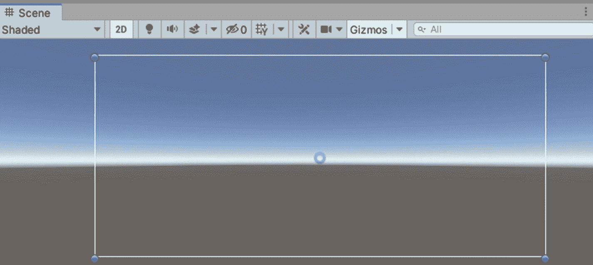

图 4-3

在 2D 视图的“场景”窗口中显示的画布

如前所述，UI 元素需要是 Canvas GameObject 的子元素，以便可见和/或可交互。但是，例如，如果一个画布有四个与子元素大小相同的 UI 元素，并且位于相同的确切位置，则第一个元素将首先在屏幕上绘制，最后一个元素将在它们之上绘制(在 4.3 节“文本”中演示)。

### 画布组件

画布组件中有三种呈现元素的模式(图 4-4 )。

图 4-4

画布组件

在第一种默认模式“屏幕空间-覆盖”中，画布将与屏幕大小相同，因此与屏幕分辨率相匹配。如果勾选了像素完美，则渲染 UI 时不会消除锯齿以提高精确度。如果在场景中使用了具有相同模式的多个画布组件，则排序顺序值最高的组件将被渲染。更改目标显示允许您在编辑器中测试多个画布或视图。我不会真的去详细说明这个选项或者附加的着色器通道。

如果模式设置为屏幕空间-相机(图 4-5 )，画布及其子元素将根据指定的相机游戏对象进行渲染。

图 4-5

画布组件设置为屏幕空间—相机渲染模式

另一种说法是，画布可以被认为是一个平面。您可以在“平面距离”字段中设置它与相机的距离。虽然您不会看到画布大小的变化，例如，如果您正在使用 3D 游戏对象，那么画布与相机的渲染距离将会有明显的差异。图 4-6 展示了这一点。

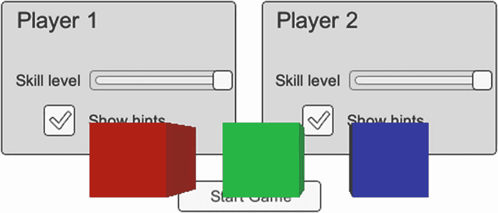

图 4-6

带有相机屏幕空间模式和 3D 对象的画布示例

第三个也是最后一个模式，世界画布，使画布在游戏中表现为 3D 平面。使用这种模式可以让你在一个场景中拥有尽可能多的画布游戏对象，它们都将由指定的摄像机渲染。例如，在一个游戏中，这种模式可以用来制作漂浮在敌人身上的生命值条。因此，画布将与其子滑块所代表的敌人处于相同的 3D 位置和旋转。图 4-7 举例说明。

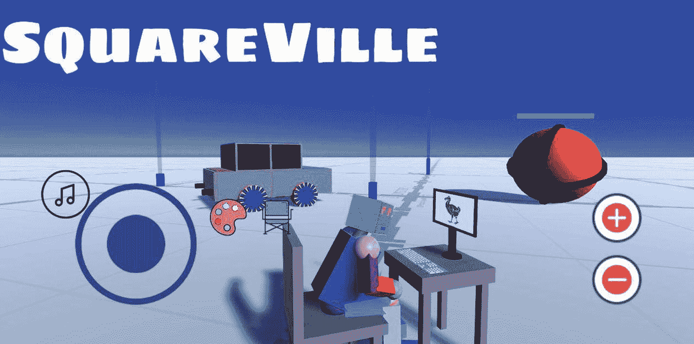

图 4-7

世界空间中带有健康栏的画布

监视器的屏幕也使用了一个世界空间画布游戏对象。

### 画布缩放器

画布缩放器(图 4-8 )是一个非常有用的组件，它允许我们指定画布应该如何根据不同的屏幕尺寸进行渲染。它仅适用于前一组件的屏幕空间模式。

图 4-8

画布缩放组件

在第一种模式下，画布将始终保持相同的大小。例如，如果你为一个 720p 屏幕制作一个游戏，并相应地调整你的元素的大小以匹配它，当分辨率加倍时，所有的元素将仍然是相同的物理大小，因此，看起来小两倍，假设屏幕大小对于 720p 和 1440p 屏幕是恒定的(图 4-9 )。增加比例因子将使画布按比例变大。最后一个选项适用于精灵，我们不会使用它，因为我们更关心 2D 游戏。

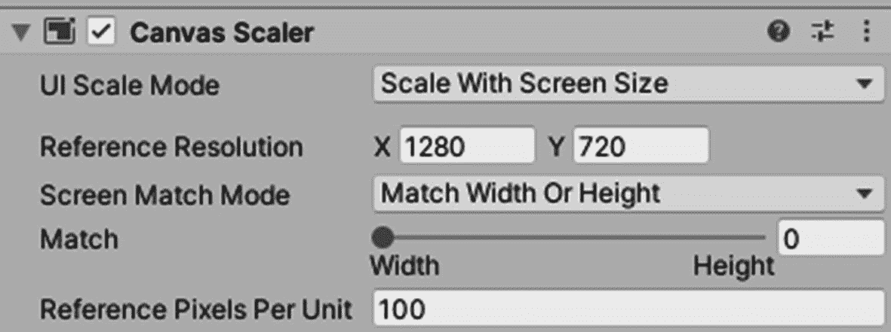

图 4-9

画布缩放组件设置为随屏幕大小缩放

您可以设置一个参考分辨率，以此作为开发游戏的目标。然后，您可以选择让画布匹配屏幕的宽度或高度，或者相应地收缩或扩展。对于前者，您可以将画布设置为仅匹配屏幕的宽度或高度。例如，将滑块一直拉到最左边，无论屏幕尺寸的像素高度是否增加，画布都不会发生变化，而宽度保持不变。但是，在这种情况下，如果以像素为单位的屏幕宽度发生变化，画布将按相等的比例缩放。

最后，在最后一种模式中，恒定物理大小，您可以根据厘米、毫米、英寸、磅或十二点活字来设置画布的实际物理大小。这就是你需要知道的全部。

由于这本书旨在帮助你开发手机游戏，特别是 Android 平台，如果我们在创建一个风景游戏，画布缩放器通常设置为匹配高度。例如，如果我们有一部分辨率为 1920 × 1080 的手机，并且游戏将以横向(水平)模式运行，则最终的屏幕高度将对应于值 1080。通常，屏幕在垂直方向比水平方向变得更大。我们的声明试图传达这样的信息，例如，如果我们的手机长宽比为 16:9、18:9 或 21:9，我们的按钮和其他元素将保持相同的大小，除非屏幕实际上更大而不是更长。因此，我们的游戏将能够在这些设备上全屏播放，而不会影响我们的元素的布局，例如它们的大小。现在，如果我们的游戏是在一个更大屏幕的设备上玩，而不仅仅是一个更长的屏幕，它将缩放并仍然正常显示。根据你想做的游戏，这并不总是你想做的，你可能会追求另一个选择。

### 图形光线投射仪

该组件(图 4-10 )主要用于确定画布上的元素是否被点击。

图 4-10

图形光线投射器组件

我不会详细讨论这些属性，因为您很少与这个组件交互。如你所知，它们用于调整什么物体应该能够阻挡光线投射。

## 4.2 直肠变换

这是一个你会在所有 UI 类型的游戏对象上看到的组件(图 4-11 )。它相当于 3D 游戏对象上的转换组件，但是对于 UI 元素，有一些额外的选项和属性。对于画布游戏对象，该组件中的值可能被锁定。

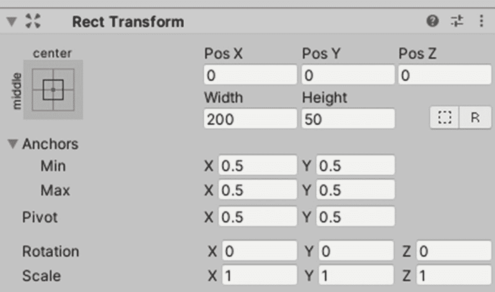

图 4-11

矩形转换组件

位置 X、Y 和 Z 对应于变换组件的典型位置`Vector3`。相同的逻辑适用于旋转和缩放字段。改变`Width`或`Height`值是不言自明的。请注意，如果您更改 Pos Z 中保存的值，这实际上不会有什么不同，除非两个或更多元素重叠，在这种情况下，具有最高 Pos Z 值的元素将是可见的元素。例如，如果有许多空的 2D 方块(图像)，每个都具有相同的大小，并且正好位于相同的位置，但是每个都具有不同的颜色，则该组中具有最高位置 Z 的那个将是可见的。然而，这条规则也有例外。还要注意，根据所选的锚类型，字段的名称和数量会有所不同。

锚点指定 UI 元素的位置相对于其父元素的矩形变换和位置的点。就 X 和 Y 坐标轴而言，每个最小值和最大值可以在 0 到 1 的范围内。值 0 对应于画布的最左侧位置，而值 1 对应于最右侧位置。类似地，对于`Y`值，该范围从画布的最高位置到最低位置。通常`Vector2`的最小值和最大值是相同的。

虽然定位点与元素相对于其父元素本身的定位有关，但支点则是相对于元素本身移动 UI 元素的中心。同样，`X`和`Y`的值从 0 到 1，但是这一次，它们表示基于自身宽度和高度的 UI 元素枢轴的位置。例如，如果`X`枢轴值设置为 0，并且您试图增加元素的宽度，枢轴将在最左端，并且如果该值为 0.5，元素将仅从其右侧缩放，而不像从其中心在两个水平方向缩放，即在元素的中心。

你也可以通过点击 Rect Transform 组件左上角看起来像网格的东西来改变元素的锚点和枢轴(图 4-12 )。

图 4-12

锚点预设

单击这些预设中的任何一个都会自动将其锚点值分配给元素。此外，如果在执行此操作的同时还按住 Shift 按钮，则 pivot 值也会以类似的方式进行修改。如果在这个过程中按住 Alt 键，不管是否按住 Shift 键，元素也将移动到锚位置，因此有一个(0，0)的`Vector2`位置。在了解了其他 Canvas UI 元素之后，您将能够测试所有这些元素。

## 4.3 文本

要创建 UI 元素，只需右键单击层次结构窗口中的空白区域，转到 UI，然后选择所需的元素。在本节中，我们将关注名为 Text 的 UI 元素。确保它是画布游戏对象的子对象。双击该元素将使其可见并位于场景窗口的中心(图 4-13 )。

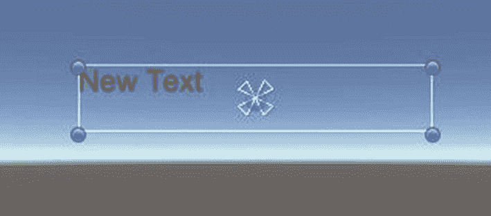

图 4-13

文本用户界面元素

当然，您可以沿着文本元素的边缘拖动，使其占据更大的区域，或者手动修改其 Rect Transform 组件的值(图 4-14 )。

图 4-14

文本组件

修改文本组件上默认写入“新文本”的字段会直接改变元素上实际写入的内容。

接下来，如果在项目中导入了字体文件，您可以指定要使用的字体。您可以为文本元素选择普通、粗体和/或斜体字体样式，并指定字体大小和行距。例如，较大的字体大小值会使文本看起来更大，而较小的行距值会减少段落中各行之间的距离。勾选富文本允许您在文本中设置特定的单词，例如将它们放在类似 HTML 的标签之间。

接下来，您可以将文本左对齐、居中对齐或右对齐，以及在其 Rect Transform 组件占据的区域的顶部、中间或底部对齐。勾选“按几何图形对齐”将执行一些小的更改，使文本更多地反映您之前的选择，就其实际几何图形而言。

对于水平溢出，您可以选择在一行的字数超过 Rect 转换的宽度时让文本在新的一行上继续(换行)，或者忽略 Rect 转换的宽度并在同一行上继续(溢出)。

对于垂直溢出，您可以选择截断或溢出。以类似的方式，在后一种情况下，文本将继续在 Rect 变换高度的边缘之前，并且只占用它所需要的空间，而在前一种情况下，在达到 Rect 变换可以容纳的最大行数之后，其余的文本或行将被丢弃，并且不可见。

勾选最佳匹配允许您设置文本字体大小的最小和最大值。这些值将覆盖以前的字体大小字段。只要 Rect 变换具有足够容纳所有文本的区域，文本的字体大小就不会小于最小值，并且倾向于尽可能接近最大值。如果 Rect 转换可以轻松容纳最小值的所有文本，字体大小将在内部增加到一个更高的值，但小于或等于最大值设置，而 Rect 转换可以容纳全部文本。

请注意，如果在不使用溢出模式的情况下，指定大于 Rect 转换所能容纳的字体大小或最小字体大小，则文本中的部分或全部字符可能不可见。

接下来，如果您希望文本具有某种效果，如水平渐变，您可以更改文本的颜色并指定一种材质。

勾选 Raycast 目标允许您稍后通过脚本添加事件，例如，当您希望在单击文本 UI 元素时发生一些事情。

## 4.4 图像

请记住，位于画布子元素列表底部的 UI 元素会呈现在列表中位于它们上方的元素之上。如果我们创建一个 UI 图像元素，并将其放在画布子元素列表中的文本元素之前，会发生什么情况(图 4-15 ):

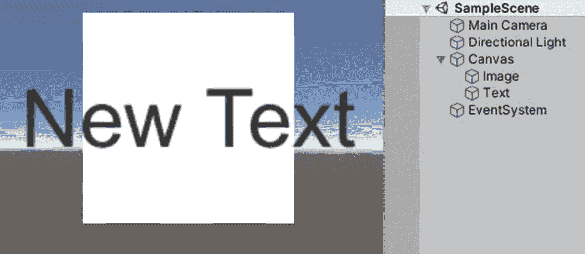

图 4-15

在文本 UI 元素上呈现图像

然而，如果文本和图像元素交换位置，图像将位于文本元素的前面或顶部(图 4-16 )。

图 4-16

在图像 UI 元素上呈现文本

该组件可用于向用户显示非交互式图像。您可以将此用于装饰或图标等元素(图 4-17 )。

图 4-17

图像组件

图像可以设置为显示实际的图片图形。请注意，图像将被缩放以匹配 Rect 变换的尺寸。您可以将图像素材标记为 Sprite 2D 类型，这样您就可以将它分配给 UI 图像组件的 Source Image 属性，以便它显示该图像。要将导入的图像标记为精灵 2D 类型，您只需在项目窗口中选择它，并在检查器中将其纹理类型更改为精灵(2D 和用户界面)(图 4-18 )。在第六章中，我们将为暂停按钮使用雪碧 2D 纹理。

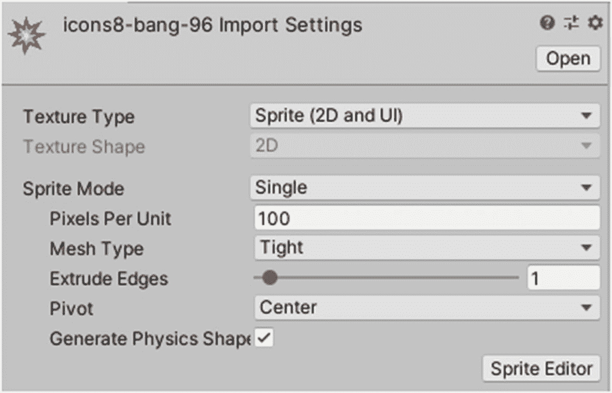

图 4-18

标记为 2D 雪碧的纹理

在图像组件上设置另一种颜色可以看作是在图像上放置一个颜色过滤器。Material 属性可用于在要渲染的最终图像上应用其他效果。勾选光线投射目标让 Unity 考虑光线投射的图像。

## 4.5 原始图像

与图像不同，只有纹理类型的图像才能在原始图像组件上渲染(图 4-19 )。

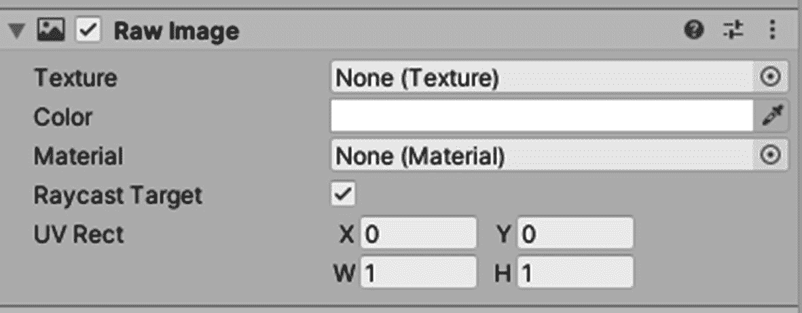

图 4-19

原始图像组件

颜色和材质属性的工作方式与图像组件中的类似。至于`Vector2`值`X`和`Y`以及`W`和`H`，它们分别对应于所分配纹理的位置和大小，相对于矩形变换组件。修改`X`和`Y`值将使纹理从矩形变换的中心偏移`X`和`Y`的量，并且修改`W`和`H`值将相应地改变纹理相对于矩形变换的实际宽度和高度的宽度和高度。

## 4.6 滑块

Slider UI 元素在各种情况下都很有用。它们可以用来轻松地为敌人和/或玩家制作生命条，或者是可交互的，以便改变一些游戏内的值，例如音量(图 4-20 和 4-21 )。

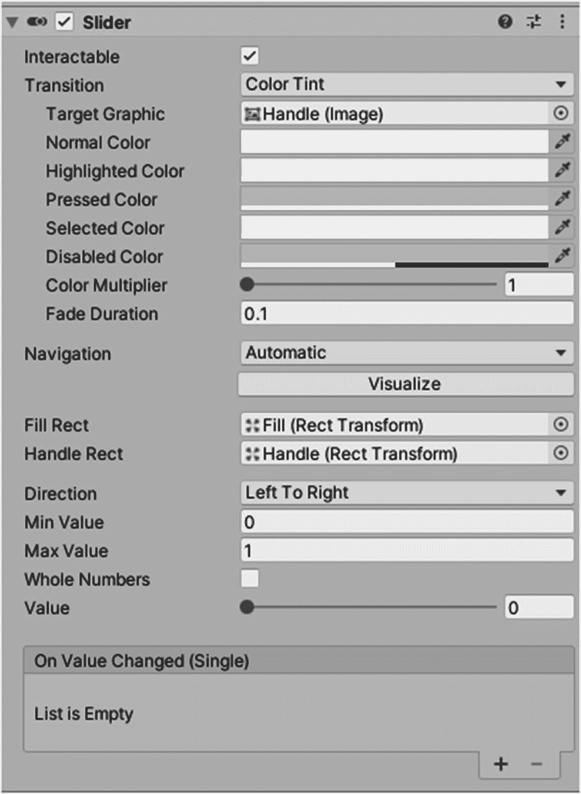

图 4-21

滑块组件

图 4-20

滑块

如果互动保持勾选，你将可以在游戏进行的时候拖动和调整滑块的旋钮。过渡允许您根据滑块的值或旋钮的状态设定视觉反馈。

例如，使用色调过渡允许您为旋钮设定定义的颜色，这取决于旋钮是被停用还是被按下。以类似的方式，子画面交换导致正在使用的子画面发生定义的变化，并且动画将相应地触发设置动画。当然，如果转换被设置为无，则不会有任何变化。

导航中的选项允许您通过键盘按键控制滑块。如果不希望滑块的值发生变化，请使用键盘按键将该属性设置为 None。Fill Rect 和 Handle Rect 是必须指定的 Rect 变换组件，以便滑块知道它的填充和手柄在哪里。

方向直观地定义了滑块的最小值和最大值所在的位置。如果设置为从右到左，滑块可以容纳的最小值将在滑块的最右端可见。

在 Direction 属性的正下方，有两个字段允许您设置滑块可以容纳的最小值和最大值。如果旋钮位于滑块的任意一端，它将代表我刚才讨论的字段中设置的最小值或最大值，这取决于方向属性。

勾选整数将确保滑块代表的值仅为整数。当此选项被勾选时，带有小数/分数部分的数字不会出现。

通过调整值滑块所做的更改也将通过场景和游戏窗口中的滑块反映出来。此值滑块从最小值(左)设置一直到最大值(右)设置。

最后，您可以设置滑块在它的值改变时做一些事情。例如，当滑块的值改变时，你可以让滑块调用游戏对象的某个脚本中的函数。我们稍后将利用这一点。

接下来，让我们快速看一下默认情况下组成 Slider GameObject 一部分的子对象(图 4-22 )。

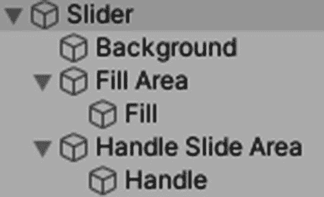

图 4-22

典型的 Slider UI 元素的子游戏对象

背景有一个图像组件，是一个完整大小的滑块游戏对象。更改该组件的属性将直接改变滑块的背景。

填充区域只是一个空的游戏对象，但是它是滑块填充正常工作所必需的。接下来，填充游戏对象的工作方式类似于背景游戏对象。由于滑块的值更接近其最大值，填充将占据更大的区域并覆盖背景。

手柄填充区域表示滑块手柄可以移动的区域。最后，句柄只是一个图像组件(带有 Rect 转换),默认情况下使用一个普通的白色圆形精灵。如果你决定改变游戏中滑块的值，手柄就是你要与之交互的可视组件。

## 4.7 按钮

按钮可以被认为是在游戏中为了做某些事情而与之交互点击组件。按钮的一个很好的例子是看起来像箭头的东西，当你按下它时，它会让你的角色跳起来。默认情况下，按钮在创建时看起来如下(图 4-23 ):

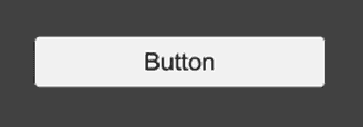

图 4-23

一个按钮

要改变按钮的大小，只需在游戏对象的 Rect Transform 组件中编辑适当的值。要更改其默认外观，根据需要编辑其游戏对象上的图像组件(图 4-24 )。

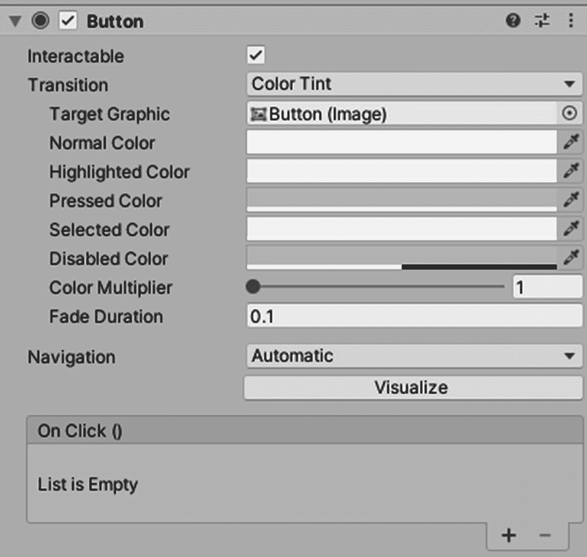

图 4-24

按钮组件

前几个属性的作用与 Slider 组件的相同。如果未勾选可交互，您将无法与按钮交互。转换基本上定义了按钮的外观，这取决于按钮被按下或禁用时的状态。

渐隐持续时间值越小，反映的变化越快。例如，如果按钮被按下，并且正在使用色彩过渡，则如果“淡化持续时间”值设置为 0(秒)，按钮将立即过渡到“按下的颜色”中指定的颜色。

同样，可以将按钮设置为执行某些操作，如该组件底部的 OnClick()列表中所定义的。

默认情况下，按钮也有一个文本游戏对象作为子对象。然而，如果你不需要它，你可以安全地删除或销毁它。

## 4.8 输入字段

输入字段实际上只是一个文本框。点击它将调出移动设备上的默认键盘，并允许您键入一些内容。作为子元素，它有两个文本 UI 元素。第一个称为占位符，它将包含一些虚拟文本，而没有输入任何内容。另一个文本 UI 元素将包含您键入的文本。您可以修改这些文本 UI 元素的属性，以获得您想要的样式(图 4-25 )。

图 4-25

输入字段

在输入字段组件上，您将再次发现交互、转换和导航属性。这些将做与按钮和滑块相同的事情。

与文本相关的属性分别表示用于显示键入内容的文本 UI 元素、直接映射到该文本 UI 元素的文本属性的字段以及该输入字段可以容纳的最大字符数。请注意，占位符文本将会消失，除非在 text 属性中没有设置任何内容。如果不为空，用户输入的数据前面将会有我们设置的文本。

为要输入的数据类型选择适当的内容类型有助于定义如何显示输入的数据(图 4-26 )。例如，如果设置为 Password，当用户在输入字段中输入内容时，所有字符将自动替换为星号。请访问 InputField 的文档，了解许多内容类型选项之间的区别。

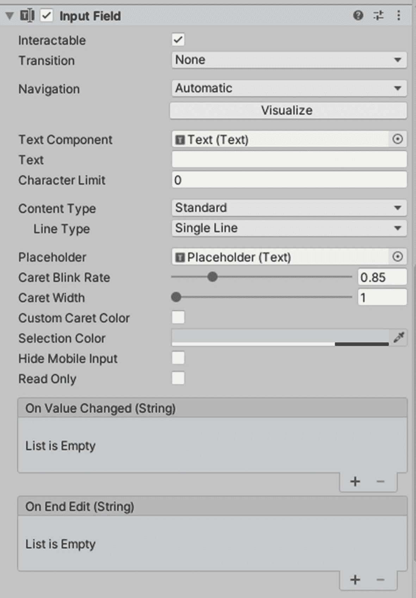

图 4-26

输入字段组件

根据您在“内容类型”中设置的值，您可能还有一个“行类型”属性，该属性允许您选择是否只能在一行中设置数据格式(单行)，是否可以跨多行设置数据格式，或者用户是否可以通过按 Enter/Return 键(多行换行)或不按下 Enter/Return 键(多行提交)来跨越一个新行。使用后一个选项，文本将在需要时自动跨多行。

默认情况下，Placeholder 属性只引用输入字段的第一个子字段，作为包含占位符文本的文本 UI 元素。

脱字符号闪烁速率中的值定义脱字符号每秒闪烁的次数。插入符号宽度中包含的较高值将使插入符号更宽，您也可以通过勾选自定义插入符号颜色并选择一种颜色来为插入符号选择自定义颜色。

选择颜色是字符被选中时的突出显示颜色。勾选隐藏移动输入将在 iOS 设备上隐藏屏幕键盘上的原生输入栏。

如果勾选了只读复选框，将无法在输入字段中输入更多字符。

最后，您可以向 OnValueChanged()和 OnEndEdit()列表添加操作。只要输入字段中保存的值发生变化，就会执行前一个选项中的操作。例如，如果您进入播放模式并输入三个字符，OnValueChanged()将被调用三次，任何操作集将被执行三次。至于 OnEndEdit()，每次用户完成编辑文本内容时，都会执行在那里分配的操作，无论是提交内容还是单击某处将焦点从输入字段移开。

## 4.9 切换

Toggle 与 Button 非常相似，工作方式基本相同。唯一的基本区别是 Toggle 在特定时间有一个`True`或`False`值(图 4-27 )。每次单击或触摸切换按钮时，它都会在这两个值之间交替变化。如果它在被点击/触摸之前是`True`，它将有一个`False`值；否则，它将有一个`True`值。

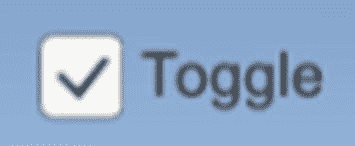

图 4-27

一个开关

在一个 Toggle 组件上(图 4-28 ，IsOn 表示 Toggle UI 元素的`True` / `False`状态。勾选此项时，切换处于真实状态。

切换过渡属性允许您设置用户与切换 UI 元素交互时的视觉效果。

图 4-28

肘节组件

图形被设置为具有图像组件的游戏对象。这个图形将代表切换 UI 元素的`True` / `False`状态。

至于组属性，你可以在这里分配一个带有切换组组件的游戏对象。切换组基本上是切换 UI 元素的集合。例如，一次只有一个 toggle 处于`True`状态，有时会很有用。这就是为什么切换组可能会派上用场，但它们超出了本书的范围。

和前面介绍的大多数 UI 元素一样，当 toggle 的值改变时，可以执行一些动作。

默认情况下，一个切换游戏对象有两个子对象(图 4-29 )。

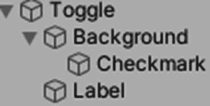

图 4-29

典型切换 UI 元素的子游戏对象

第一个子元素是 Background，默认情况下它有一个图像组件。这个游戏对象本身有另一个图像 UI 元素作为子元素，名为 Checkmark。这个对号游戏对象激活或去激活，取决于开关的`True` / `False`状态。

两个子元素中的另一个名为 Label，它只是切换 UI 元素的背景/复选标记旁边的文本。它不是切换 UI 元素的基本部分，可以安全地删除。

## 4.10 下拉菜单

想象一下，创建一个定义好的选项列表，用户可以从中选择一个。这也正是下拉 UI 元素存在于 Unity 中的原因(图 4-30 )。

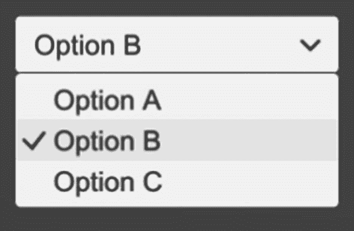

图 4-30

下拉菜单

当触摸/单击下拉菜单时，会显示一个包含所有预定义选项的扩展菜单。如果选项的数量要求显示比已经为下拉菜单定义的区域更大的区域，滚动条将显示在选项列表的右侧。选择一个选项后，下拉列表将折叠回其初始状态，显示当前选择的选项。

下拉 UI 元素有一个很长的子元素列表，但是由于它们的精确名称，通过使用 Rect 工具，你可以很容易地理解它们的用途(图 4-31 )。在本节中，我们将只研究 Dropdown 组件中的新属性。

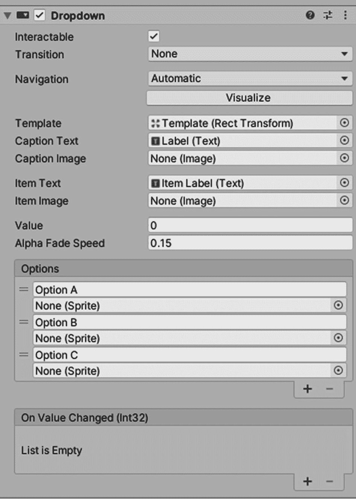

图 4-31

下拉组件

模板、标题文本和标题图像分别是对矩形转换、文本和图像组件的引用。默认情况下，Template 是包含许多子对象的 GameObject，这些子对象构成了当单击/触摸下拉菜单时出现的列表的一部分。标题文本表示将写入当前所选选项名称的文本组件。Caption Image 不是必需的，但它代表的是代表当前所选选项的图像的图像组件。

项目文本和项目图像的工作方式与标题文本和标题图像完全相同，但这一次通常表示下拉列表中的选项。

Value 是选项列表中当前选定选项的索引。它从 0 到列表中的项目数减 1。

Alpha 渐变速度是转换到完全不透明的下拉列表或完全透明的下拉列表所需的秒数。

最后，您拥有预定义选项的实际列表，您可以从中添加或删除选项。对于每个选项，您可以更改名称，指定一个精灵来代表它，并在选项列表中对它进行重新排序。

## 4.11 滚动条

滚动条(图 4-32 )非常类似于滑块。主要的区别是滚动条为它们的句柄提供了更多的调整，但是没有可以设置的最小值或最大值，它们只能有一个从 0 到 1 的值。

图 4-32

滚动条

如果滚动条的值为 0，滚动条的手柄将位于其左边缘附近，如果值为 1，则位于右边缘附近。

你可以参考关于滑块的部分来理解滚动条组件提供的大多数属性(图 4-33 )。仅有的两个新属性是大小和步数。

图 4-33

滚动条组件

大小滑块的值总是介于 0 和 1 之间。值为 1 将使控制柄的宽度和高度等于 Rect Transform 组件的宽度和高度。步数将定义滚动条在其手柄被拖动时可能停止的次数。例如，如果该属性的值设置为 4，当您进入播放模式并拖动滑块时，在滚动条的整个宽度上，一次只能有四个位置可以放置手柄。默认值 0 允许控制柄沿该宽度自由定位。

## 4.12 Scrollview

Scrollview UI 元素有一个 viewport(图 4-34 )。您可以在其中放置几个 UI 元素，比如文本、图像或按钮。默认情况下，它还带有水平和垂直滚动条。您可以使用它们在放置在其视口中的元素之间滚动。

图 4-34

卷轴检视

使用 scrollview 是一种在移动游戏的定义区域放置多个元素的优雅解决方案，因为与通常在比手机屏幕更大的屏幕上玩的 PC 或主机游戏不同，移动游戏开发人员通常必须显示多个元素，这些元素通常不能太小，因为最终用户会发现很难与所显示的内容进行交互，或者无法正确感知所显示的内容。scrollview 也可以用来滚动一个大的图像或文本元素。

Content 表示 scrollview 的子视图的 Rect 变换，它将包含您放置在其视口中的所有元素(图 4-35 )。

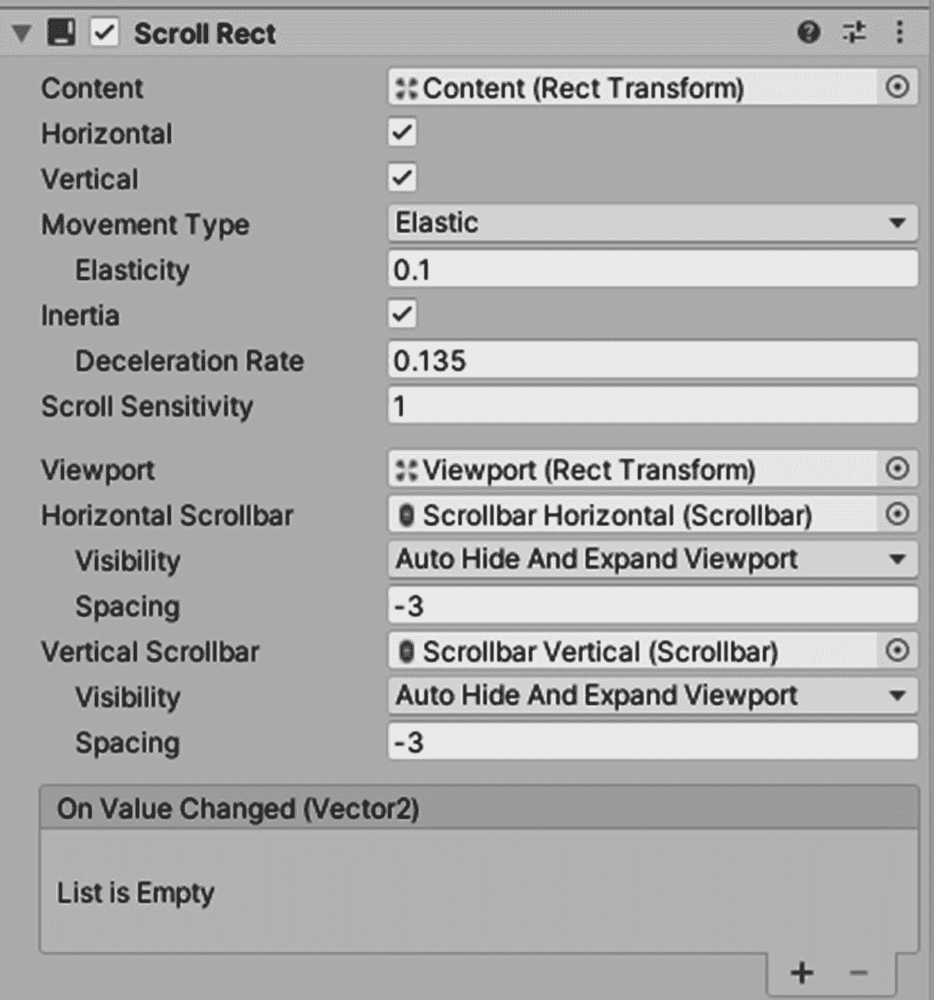

图 4-35

Scrollview 组件

不勾选水平或垂直将在运行时禁用相应的滚动条。移动类型可以设置为无限制、弹性或夹紧。使用最后两个选项将使内容保持在滚动矩形的范围内。但是，当内容到达滚动矩形的边缘时，Elastic 会反弹内容。后者的反弹量将由弹性属性决定。

如果勾选了惯性，拖动后释放手柄，内容将继续移动。否则，内容只会在拖动时移动。如果设置了惯性，减速率将决定内容停止移动的速度。速率为 0 将立即停止运动，而速率为 1 将使运动永不减速。

滚动敏感度是使用滚轮和触控板事件进行滚动的敏感度。其他一些属性只是用来将滚动条指向视口和滚动条。滚动条有一个可见性属性。将该属性设置为 Permanent 将防止滚动条被隐藏，而 Auto Hide 和 Expand Viewport 将在不需要时隐藏内容。发生这种情况时，后一种情况也会导致视口扩展。间距是滚动条和滚动条右下角之间的距离。

## 4.13 面板

面板只是一个具有一定透明度的图像，它的矩形变换沿着其父对象的整个宽度和高度伸展。也就是说，如果您使一个面板 UI 元素成为设置为“屏幕空间-覆盖”的画布元素的子元素，它将在播放模式下占据您屏幕的整个可视区域(图 4-36 )。

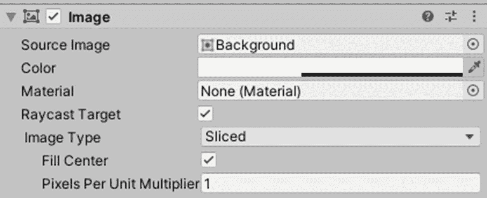

图 4-36

面板组件

## 4.14 事件系统

事件系统是控制与 UI 系统的所有交互的组件，接收来自键盘、鼠标、触摸屏等的输入。，并将它们转换成与底层 UI 元素的交互(图 4-37 )。

图 4-37

事件系统组件

它计算出用户与哪个画布和控件进行了交互，并相应地激活它。如果没有事件系统，UI 将仅仅在屏幕上绘制，什么也不做。

此外，事件系统允许 UI 控件(支持事件，如复选框和按钮)在用户与它们交互时通知 Unity 项目。例如，一个用户点击一个按钮，然后按钮激活或停用另一个游戏对象。如果使用正确，这可能是一个非常强大的系统。

第一次选择对应于运行时第一次选择的游戏对象。勾选发送导航事件允许 EventSystem 发送导航事件，如移动、提交和取消。拖动阈值对应于拖动的软区域，以像素为单位。

独立输入模块(图 4-38 )是实际检测输入(键盘按键、鼠标指针点击、触摸)并向游戏发送相应事件的组件。没有这个组件，你将无法与你的游戏互动。

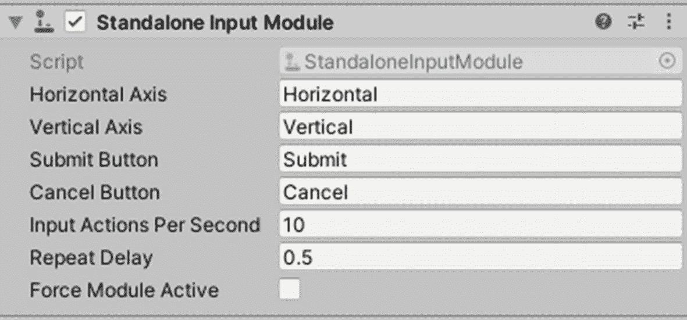

图 4-38

独立输入模块组件

带有`String`值的属性正好对应于代表游戏中一些常见输入的轴。每秒输入操作中保存的值表示每秒允许的输入数，重复延迟是每秒输入操作重复率生效之前的延迟秒数。勾选强制模块激活将强制独立输入模块激活。

在我们将要制作的游戏中，我们不需要编辑事件系统中任何组件的任何属性。

## 4.15 输入轴介绍

由于我们将专注于制作手机游戏，对于许多类型的游戏来说，了解 axes 如何工作是很重要的。要与冒险 3D 手机游戏互动，您可能需要使用操纵杆来移动玩家。这个操纵杆很可能会使用一个或多个轴。

像下面这样的操纵杆(图 4-39 )可以用来在 3D 游戏中向各个方向移动玩家的角色。玩家可以握住游戏杆的手柄，向他们喜欢的方向移动。

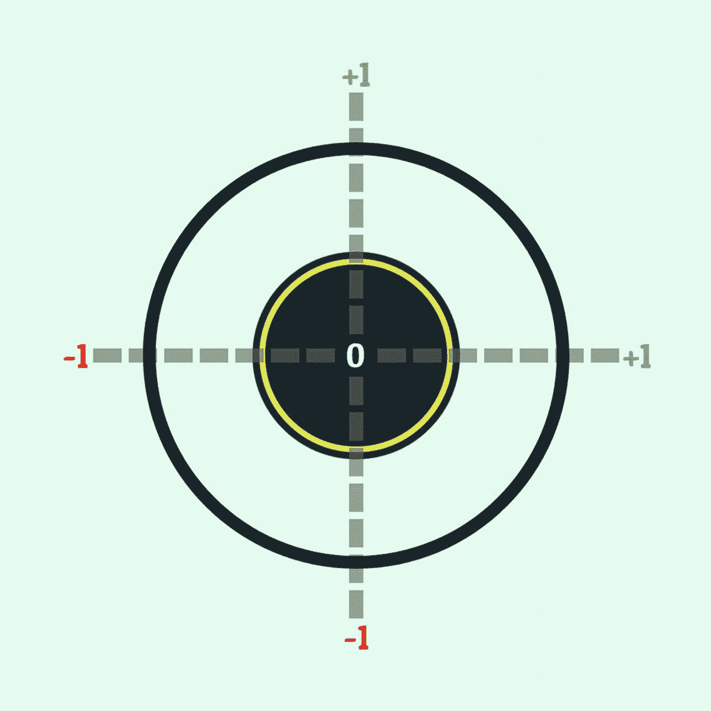

图 4-39

操纵杆轴的典型图示

所示的操纵杆利用了两个轴:水平轴和垂直轴。当手柄未按下时，它位于操纵杆总面积的中间。在这个位置，它的两个轴的值都为 0。参考上图，如果手柄被推到左上角，它将有一个近似值-0.5 来表示其水平轴，另一个近似值+0.5 或 0.5 来表示其垂直轴。

你将很快学会在手机游戏中使用操纵杆，以及如何映射它们来触发角色的动作。操纵杆允许我们做的另一件有趣的事情是根据一个轴的值来修改角色的速度。例如，如果我们将角色的最大速度设置为 10 单位/秒，我们可以将它乘以操纵杆纵轴的当前值，这样我们就可以通过不完全向上推操纵杆手柄来使角色走得更慢。