# 五、构建我们的第一款 Android 游戏：球形射手游戏

就这样，我们现在准备在 Unity 中构建一个真正的 3D 手机游戏！在这一章，我们要做一个简单的游戏。基本上，我们的游戏角色将是一个有炮塔的立方体(我们称之为坦克)。使用两个操纵杆，玩家可以移动坦克和发射子弹。接下来，我们要制造一个敌人，并产生它的副本。敌人将试图与玩家的坦克走在同一方向，游戏的目的是在他们成功之前摧毁他们。

## 5.1 渲染管道

将图形绘制到屏幕(或渲染纹理)的过程称为渲染。这个过程是影响游戏性能的关键因素之一。默认情况下，Unity 中的主摄像头会将其视图渲染到屏幕上。

最近，Unity 发布了可脚本化渲染管道(SRP)。SRP 旨在允许开发人员通过脚本控制渲染，从而提供高度的定制化。

在许多可以使用 SRP 创建的渲染管道中，Unity 提供了两个预建的 SRP:高清渲染管道(HDRP)和通用渲染管道(URP)。

虽然 HDRP 可以让你为高端平台创建尖端的高保真图形，但我们不会用它来制作手机游戏，因为它的性能成本很高。

### 5.1.1 通用渲染管道(URP)

URP 是制作手机游戏的一个非常优雅的解决方案。它提供了几个图形/质量选项，可以很容易地进行调整，在许多类型的游戏中，它被证明比 Unity 用于制作新项目的默认渲染管道提供了明显的性能提升。

您可以创建一个默认使用 URP 的新项目，但是为了解释如何将它添加到现有项目中，我们将选择标准选项(图 [5-1](#Fig1) )。

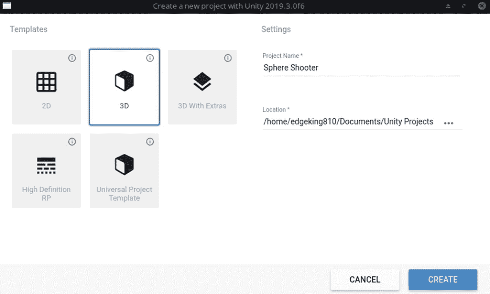

图 5-1

制作新项目

首先，我将为我们将要制作的游戏设定 1920 × 1080 的分辨率或 16:9 的纵横比(图 [5-2](#Fig2) )。

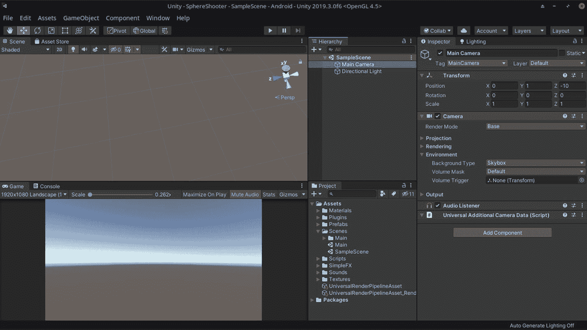

图 5-2

我的编辑器的布局

最后，对于这一部分，我们将添加 URP 包到我们的游戏和切换我们的游戏项目，以利用它。前往➤窗口软件包管理器。在长长的软件包列表加载之前，您可能需要等待一段时间。如果看起来所有的东西都已经被加载了，但没有出现这种情况，请在包管理器窗口中点击。

滚动或搜索通用 RP 包。完成后，点击它。点击 install 并等待所有东西被导入(图 [5-3](#Fig3) )。完成后，您可以关闭软件包管理器窗口，因为我们不再需要任何软件包。

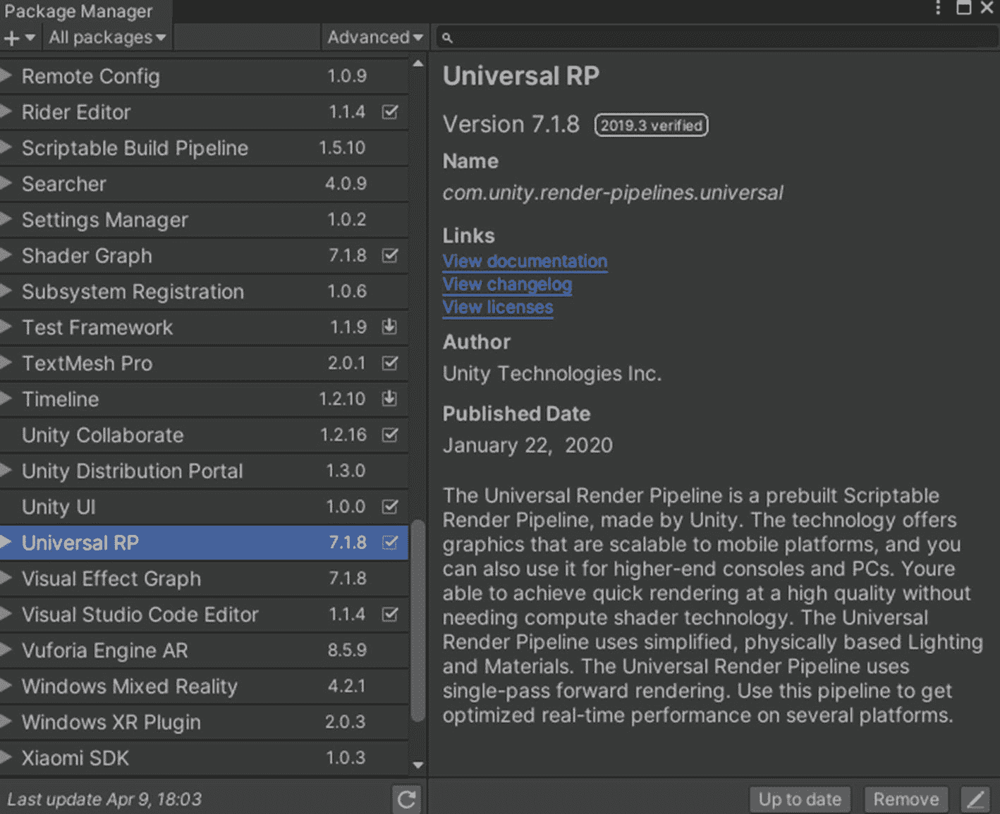

图 5-3

从软件包管理器窗口安装通用 RP 软件包

最后，要允许我们的项目使用 URP，我们必须告诉它这样做。首先，右键单击项目窗口中的任意位置，然后单击“创建➤渲染➤通用渲染管道➤管道资源(正向渲染器)”。这将为 URP 创造一个素材，许多属性可以调整，以轻松地改变我们的游戏的图形/质量。两个新素材应该出现在您的项目窗口中(图 [5-4](#Fig4) )。

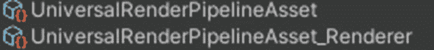

图 5-4

URP 管道素材

此时，您必须知道不同属性的作用。我们现在剩下要做的就是将我们刚刚创建的 URP 管道素材拖放到编辑➤项目设置➤图形中的可脚本化渲染管道设置选项卡(图 [5-5](#Fig5) )中。

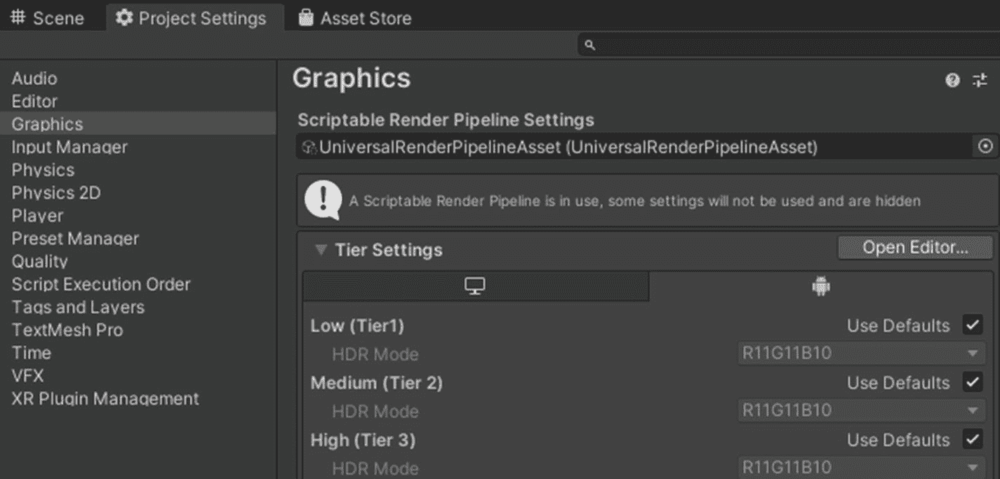

图 5-5

在项目设置的图形部分添加 SRP

要记住的一件重要事情是，如果您正在处理一个项目，并且您决定切换其渲染管道，您必须确保您正在处理的所有材质都使用与您要使用的新渲染管道兼容的着色器。否则，你的场景/游戏窗口中的所有东西都将呈现粉红色。幸运的是，Unity 提供了一个简单的解决方案。

如果您要切换到的新渲染管道是 URP(您必须为 HDRP 做类似的事情)，除了我在本节前面讨论的所有内容，您还必须单击编辑➤渲染管道➤通用渲染管道➤升级项目材质到通用 RP 材质。这样做将自动升级项目中的所有材质，以使用 URP 提供的等效着色器。您也可以选择第二个选项，即根据您的需要，仅升级您选择的材质。

要完成这一部分并开始有趣的部分，只需将项目的构建平台切换到 Android。打开构建设置(Ctrl+Shift+B 或文件➤构建设置)，单击 Android 选项，确保它高亮显示，并点击切换平台(在左下角附近找到)。一个 Unity 的 logo 应该会出现在它右边的 Android 标签旁边，你可以关闭构建设置窗口(图 [5-6](#Fig6) )。通常，如果切换到不同平台的步骤是在游戏开发的后期完成的，许多素材，如精灵或纹理，将不得不再次进行，这将花费相当多的时间。这就是为什么最好在游戏开发的早期阶段就切换平台，如果你确定你主要开发什么平台的话。

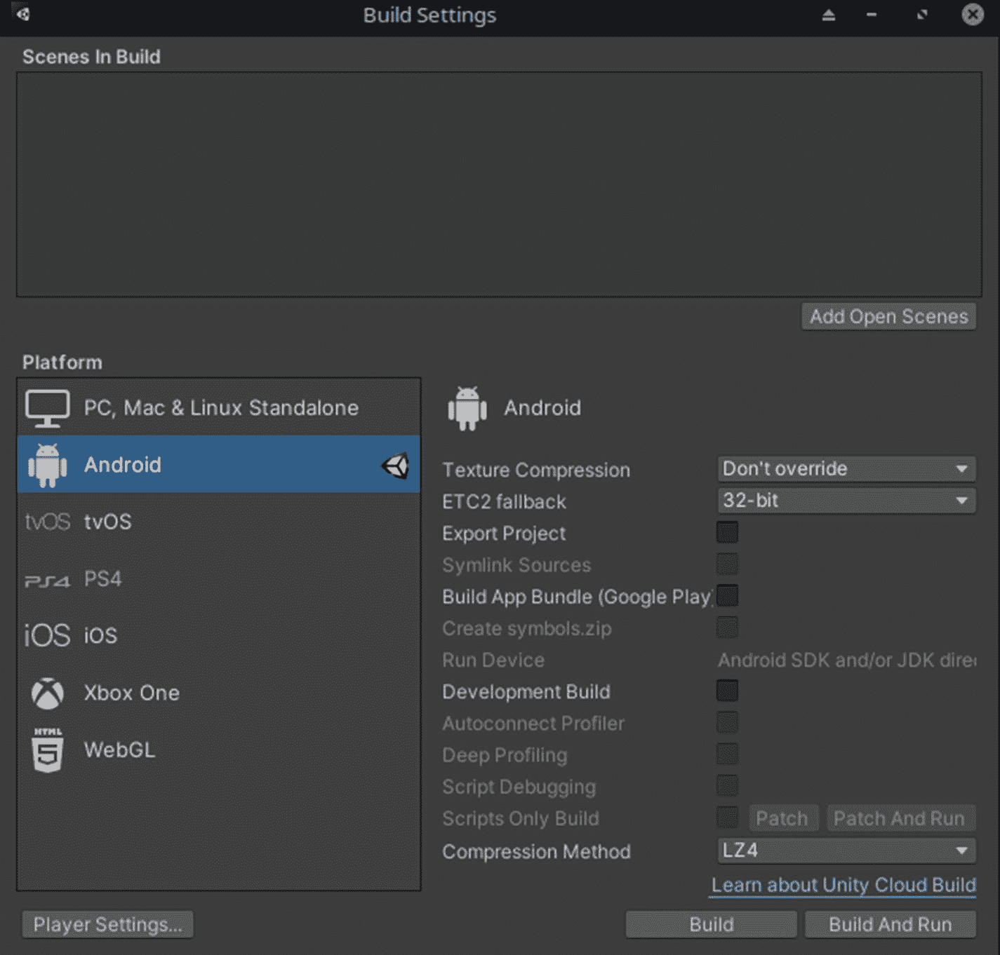

图 5-6

切换到 Android 构建平台

## 5.2 环境

目前，这款游戏只会有一个地面和一些看不见的墙。地面本身只会是一个大立方体。右键单击等级选项卡，然后单击 3D 对象➤立方体。选择后者后，确保在“检查器”标签中将它的位置和旋转设定为(0，0，0)。给它一个(150，0，150)的标度。图 [5-7](#Fig7) 显示了它的转换应该是什么样子。

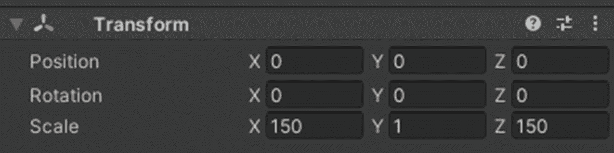

图 5-7

地面游戏对象的变换组件

接下来，前往编辑➤项目设置➤标签和层，并创建一个地面标签。将平面重命名为 Ground，并为其指定该标签。您也可以将其标记为静态(图 [5-8](#Fig8) )。

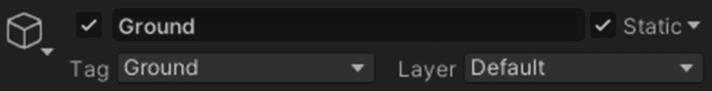

图 5-8

将地面游戏对象标记为静态

对于不可见的墙，创建一个空的游戏对象，将其命名为墙，并重置其变换组件，使其位置和旋转为(0，0，0)，比例为(1，1，1)。您也可以将其标记为静态(图 [5-9](#Fig9) )。

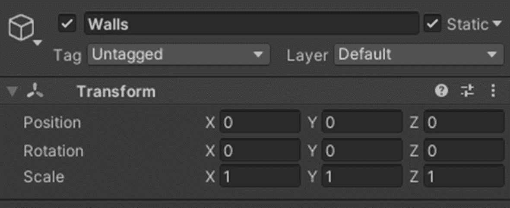

图 5-9

墙壁游戏对象的变换组件

创建一个新的立方体游戏对象作为墙的子对象，并将其命名为墙 1。给它一个位置(0，0，-75)，一个旋转(0，0，0)，一个刻度(150，50，1)。如果你看着你的场景窗口，立方体通常应该在你地面的前沿(图 [5-10](#Fig10) )。

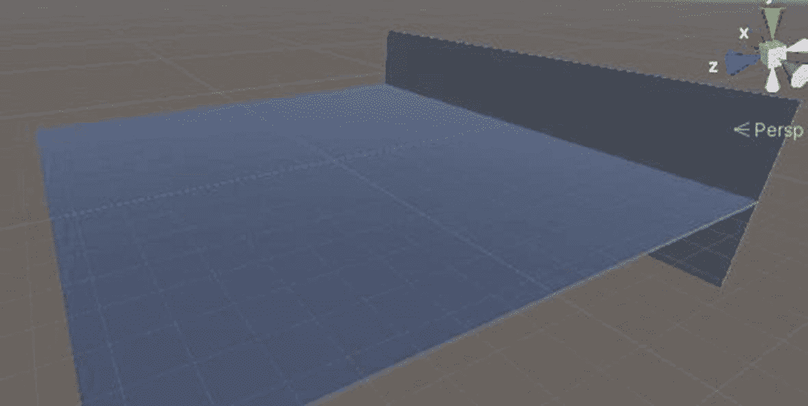

图 5-10

场景中的地面和墙壁 1 游戏对象

在 Wall 1 游戏对象上，禁用它的网格渲染器组件(勾选网格渲染器标签旁边的复选框)，这样墙实际上是不可见的。图 [5-11](#Fig11) 显示了我们在第一面墙上发现的所有组件。

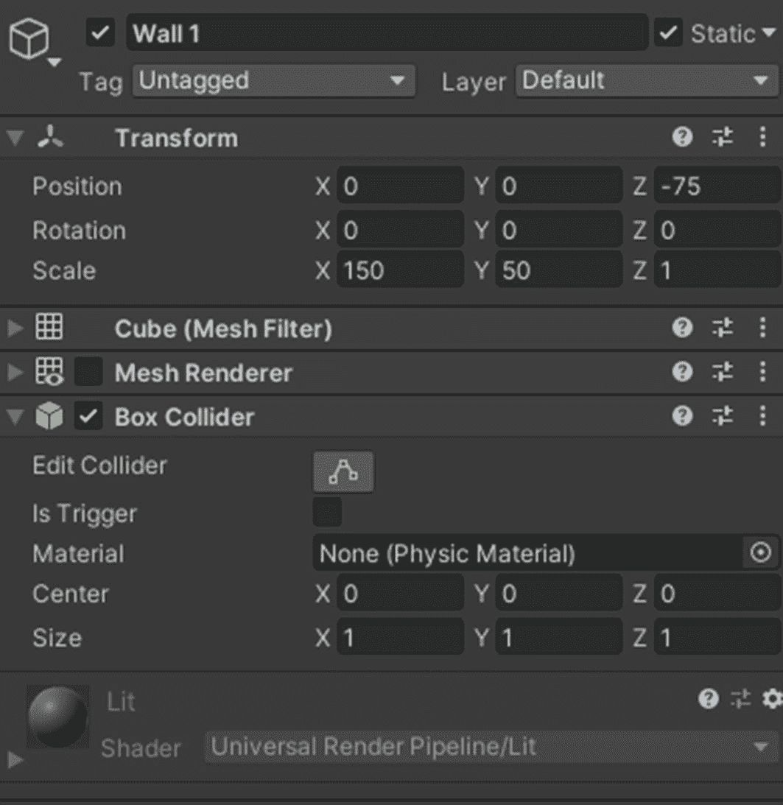

图 5-11

墙上的组件 1 游戏对象

现在，简单地复制(Ctrl+D)墙 1 游戏对象三次，并将新的实例放置在地面的剩余边缘。下表将为您提供必要的转换值。

<colgroup><col class="tcol1 align-left"> <col class="tcol2 align-left"> <col class="tcol3 align-left"> <col class="tcol4 align-left"></colgroup> 
| 

名字

 | 

位置

 | 

循环

 | 

规模

 |
| --- | --- | --- | --- |
| 墙壁 1 | (0, 0, -75) | (0, 0, 0) | (150, 50, 1) |
| 墙壁 2 | (-75, 0, 0) | (0, 90, 0) | (150, 50, 1) |
| 墙壁 3 | (0, 0, 75) | (0, 0, 0) | (150, 50, 1) |
| 墙壁 4 | (75, 0, 0) | (0, 90, 0) | (150, 50, 1) |

到目前为止，我们的层级应该是这样的(图 [5-12](#Fig12) ):

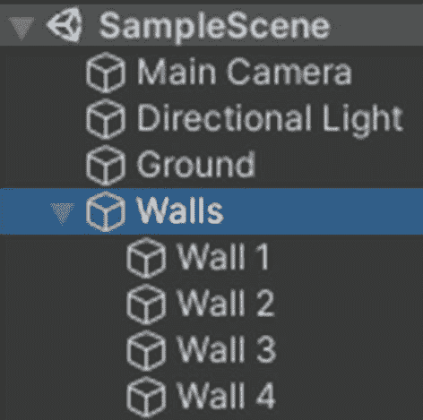

图 5-12

当前出现在场景中的游戏对象，如层级中所示

如果你选择了墙壁游戏对象或者所有真实的 3D 墙壁，你的场景应该是这样的(图 [5-13](#Fig13) ):

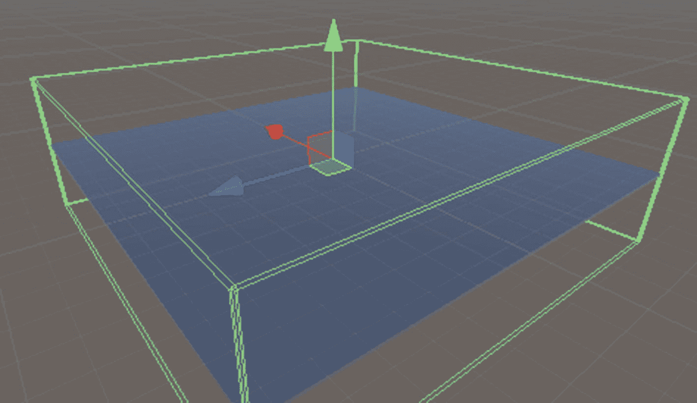

图 5-13

预览地面和不可见的墙壁游戏对象

为了完成这一节，我们只需要添加一些其他类型的材质到我们的地面。如果它保持这样，玩家可能很难察觉他们的坦克在移动(如果屏幕上只有地面和坦克)。作为一个解决方案，我们可以使用网格纹理的材质。为了让游戏看起来更有趣，让我们使用一个卡通风格的石头纹理。

在项目窗口中，创建两个新文件夹:一个名为 Materials，另一个名为 Textures。然后，前往素材商店(Ctrl+9 或窗口➤素材商店)，搜索石材地板，按价格排序(从低到高)，下载并导入如图 [5-14](#Fig14) 所示的素材。

如果该素材不再可用，请从以下链接下载: [`https://raw.githubusercontent.com/EdgeKing810/SphereShooter/master/Assets/Textures/Stone_floor_09.png`](https://raw.githubusercontent.com/EdgeKing810/SphereShooter/master/Assets/Textures/Stone_floor_09.png) 。通过将它从文件管理器拖放到项目窗口的 Unity 窗口，将其导入编辑器。然后，将导入的纹理放在名为 Textures 的文件夹中。

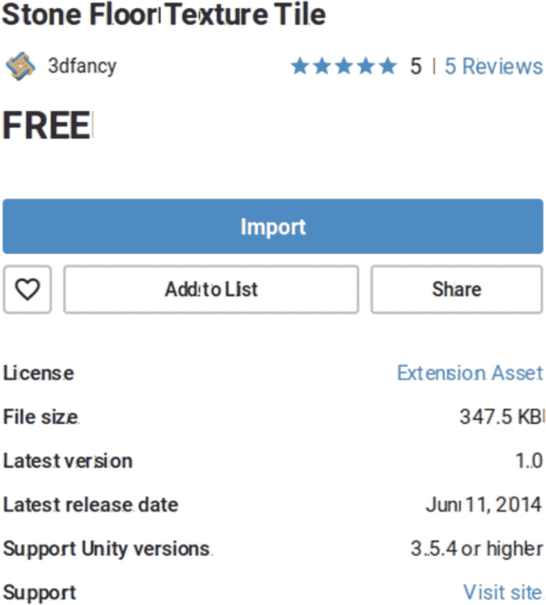

图 5-14

素材商店中的石材地面纹理瓷砖素材

当您从商店导入素材时，名为 stone_floor_texture 的新文件夹一定已经形成。将 Stone_floor_09 纹理(看起来像正方形的)移动到您在上一步中创建的纹理文件夹中(拖放),并删除 stone_floor_texture 文件夹。

在您的材质文件夹中，右键单击并点击创建➤材质。命名为地面。将 Stone_floor_09 纹理拖放到地面材质上底图标签旁边的小方块中，或者单击同一标签旁边的圆形图标并选择该纹理。将底图的颜色设置为 RGBA (255，255，255，255)或十六进制 FFFFFF。金属和平滑滑块都应该设置为 0，这样游戏会有更好的外观。最后，将两个耕作值(`X`和`Y`)设置为 15(图 [5-15](#Fig15) )。这将使纹理在我们的地面上水平和垂直重复 15 次。只需在场景或层级窗口中拖放地面游戏对象上的材质并保存即可。

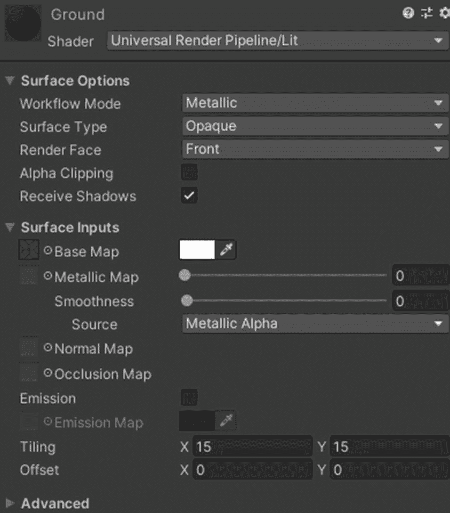

图 5-15

地面游戏物体的材质

地面现在应该如图 [5-16](#Fig16) 所示。恭喜你，我们简单的游戏环境已经准备好了！

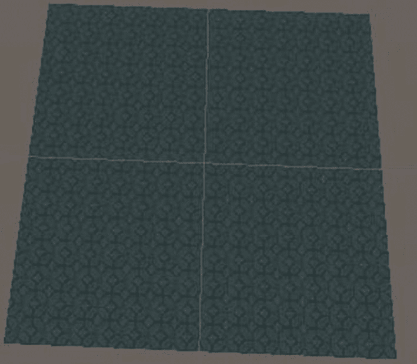

图 5-16

你的地面游戏对象应该是什么样子

## 5.3 我们的玩家(坦克)

在这一部分，我们将用一个立方体、一个球体和一个圆柱体来创建我们的玩家坦克。我们还将编写我们的第一个脚本，允许我们的坦克移动，瞄准，并用双操纵杆设置射击。

### 制造水箱

参考图 [5-22](#Fig22) 来了解一下我们玩家的坦克会是什么样子。

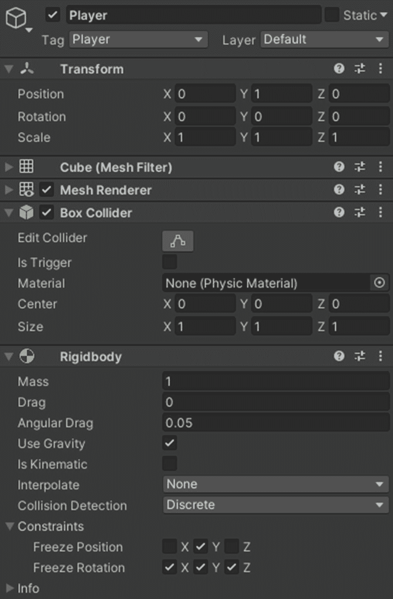

图 5-17

玩家游戏对象上的组件

1.  让我们从做一个立方体开始。将其命名为 Player，并赋予其位置(0，1，0)。其旋转和缩放将分别为默认值(0，0，0)和(1，1，1)。

2.  给它分配玩家标签。(默认已经存在。)

3.  不要将玩家坦克标记为静态，因为这将阻止它以后移动。

4.  制作两个新材质，随心所欲的命名，给它们一个自己选择的底图颜色。我将制作一个青色(0，110，255)和一个黄色(255，255，255)材质，并将它们的金属色和平滑度滑块降低到 0。

5.  在玩家游戏对象上拖放你创建的两个材质中的一个(在我的例子中，是青色的那个)。

6.  给玩家添加一个刚体组件，并检查所有约束(除了位置`X`和`Z`)，这样玩家坦克就不会在我们不希望的轴上旋转或移动(图 [5-17](#Fig17) )。

现在，创建一个球体作为玩家游戏对象的子对象。贴上旋转体的标签。在接下来的步骤中，它将收到一个模仿坦克炮塔的圆柱体，当玩家(你)试图瞄准时，它将成为旋转的对象。给它一个位置(0，0.5，0)，一个旋转(0，0，0)，一个刻度(0.75，0.75，0.75)。移除它的球体碰撞器组件，让它使用我们之前创建的两种材质中的第二种。在我的情况下，我会给它黄色的材质(图 [5-18](#Fig18) )。

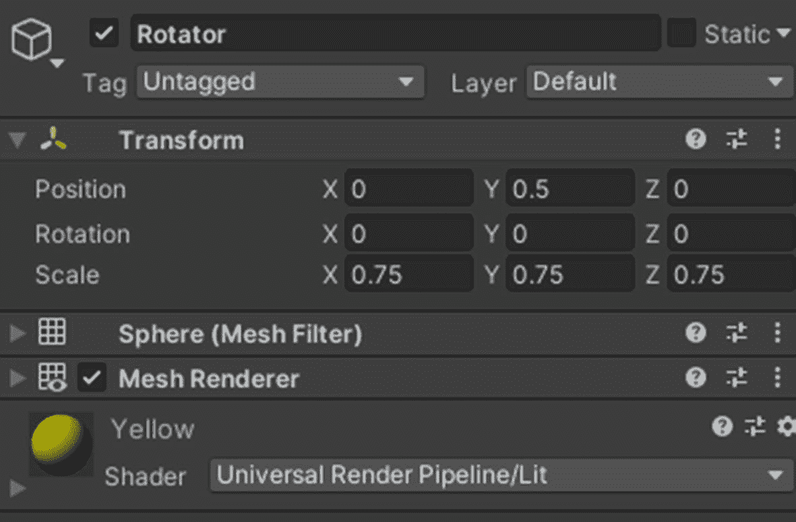

图 5-18

旋转体游戏对象上的组件

要制作炮塔，请创建一个圆柱体对象作为旋转体的子对象，并将其命名为炮塔。再次，删除它的碰撞器组件(在这种情况下，胶囊碰撞器一)，并给它相同的材质是用在旋转器上，使这两个物体看起来是一个单一的。刀架的位置必须为(0，0.2，0.8)，旋转角度必须为(90，0，0)，刻度必须为(0.4，0.8，0.4)(图 [5-19](#Fig19) )。

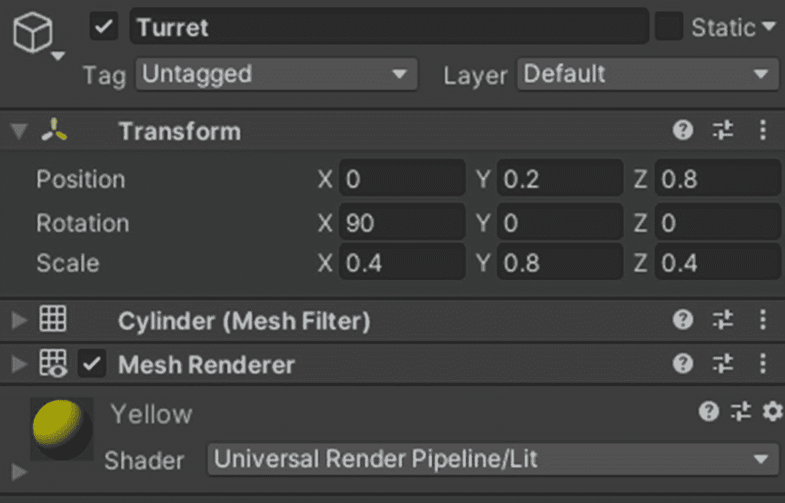

图 5-19

炮塔游戏对象上的组件

我们的子弹需要从炮塔顶端射出。我们将稍后对此进行编码，但现在，只需创建一个空的游戏对象作为炮塔的子对象。它的位置为(0，1，0)，旋转角度为(-90，0，0)，刻度为(1，1，1)。将其命名为 bulletEnd(图 [5-20](#Fig20) )。

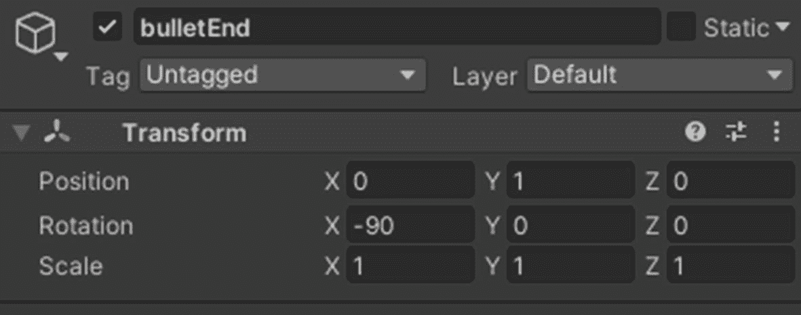

图 5-20

bulletEnd 游戏对象的变换组件

此时，您的层级窗口应该如下所示(图 [5-21](#Fig21) ):

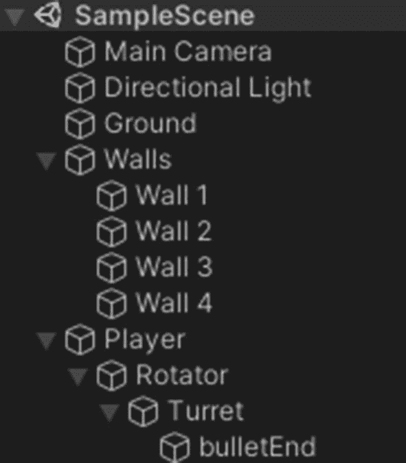

图 5-21

在我们的场景中当前出现的游戏对象，如层级中所见

您为玩家坦克选择的颜色可能会有所不同，但在此阶段它应该类似于图 [5-22](#Fig22) 。

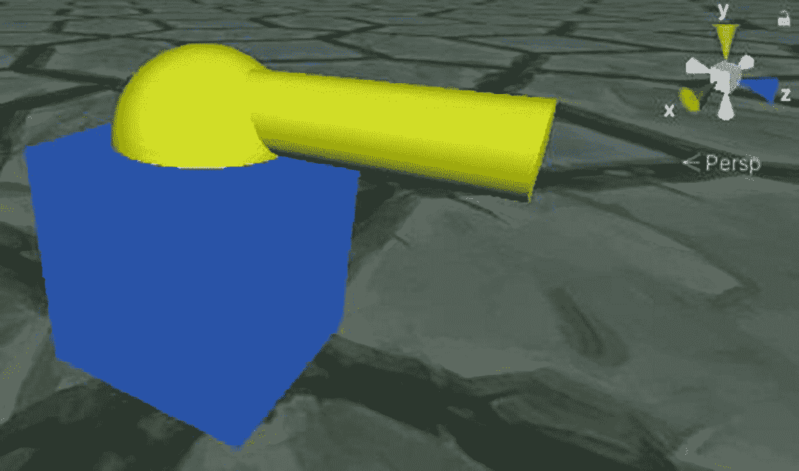

图 5-22

玩家坦克游戏对象的外观

### 设置我们的场景

在我们的游戏中实现操纵杆相关行为的一个快速而优雅的解决方案是从素材存储中导入简单的输入系统素材(图 [5-23](#Fig23) )。

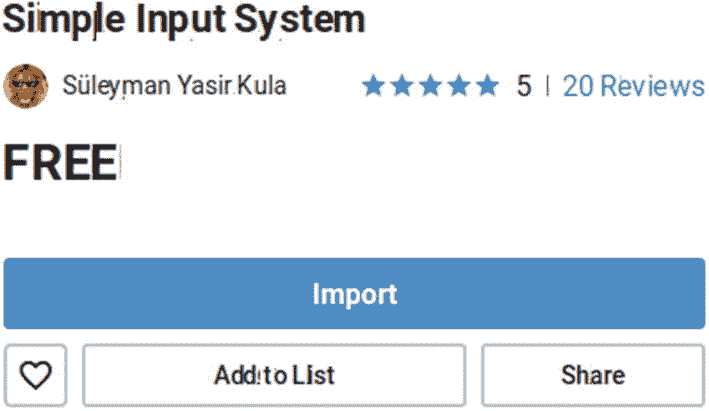

图 5-23

导入简单输入系统素材

接下来，我们希望游戏中有两个操纵杆:一个用于移动我们的坦克，另一个用于瞄准它的炮塔。创建一个 UI ➤画布。将其 Canvas Scaler 组件设置为具有屏幕大小 UI 缩放模式的缩放。您可以自由使用您选择的参考分辨率和屏幕匹配模式，但我将使用 1920 × 1080 的分辨率，并且只匹配高度(1080)(图 [5-24](#Fig24) )。

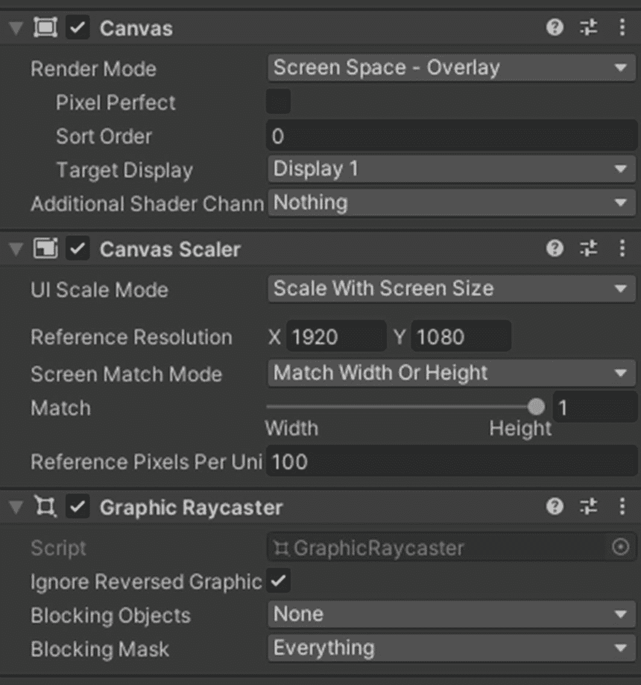

图 5-24

画布游戏对象的组件

从你的项目窗口，拖放插件➤简单输入➤预置➤操纵杆预置在你的场景中，作为画布的孩子。你会注意到，在你的层次窗口中，新操纵杆的标签带有蓝色。这是因为它目前仍然是一个预置。您对预设(项目窗口中的实例)所做的任何更改都将应用于它在任何其他地方的任何实例，例如，在您的场景中。但是，我们不需要这种能力。你可以在你的场景中右键点击游戏杆，然后点击“解包预设”或“完全解包预设”。它会像一个普通的游戏对象那样运作。重命名为移动操纵杆。

将移动操纵杆的矩形变换的宽度和高度设置为 300。将其位置设置为(300，300)。它的孩子命名为 Thumb，应该有 150 的宽度和高度(图 [5-25](#Fig25) )。同样，你可以自由选择其他值。

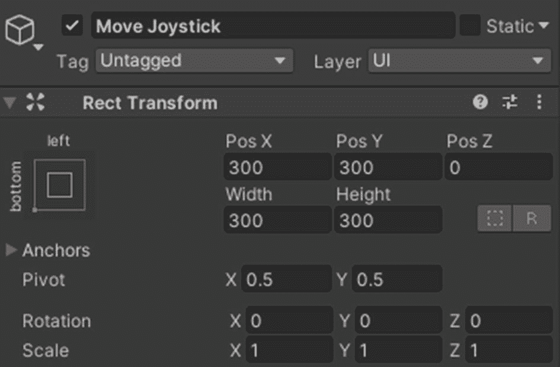

图 5-25

移动操纵杆的矩形变换

不需要更改任何其他属性，例如图像组件颜色的轴心点/锚点。您可能还会注意到游戏杆上有一个同名的脚本。这是一个脚本，它将负责使游戏杆具有交互性，并将我们的动作转化为游戏中的输入(图 [5-26](#Fig26) )。

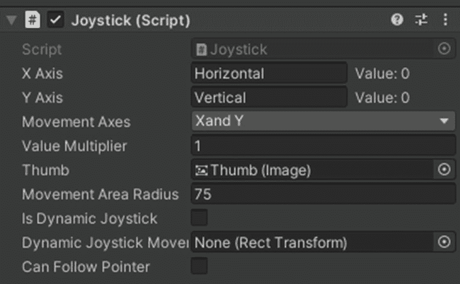

图 5-26

移动游戏杆的游戏杆脚本

X 轴和 Y 轴字段转换为轴的名称，用于分别表示操纵杆水平和垂直方向的-1 到 1 值。值标签将显示其数值。在运动轴中选择的选项将定义操纵杆将作用于哪些轴。价值乘数是不言自明的。如果设置为 5，操纵杆沿一个轴的数值范围将为-5 到 5。Thumb 表示操纵杆的子对象，该对象将移动以提供玩家指向操纵杆的方向的视觉反馈。移动区域半径是拇指可以移动到的离操纵杆中心的最大距离。动态操纵杆选项只是在一定的延迟后使操纵杆不可见，没有交互，并允许玩家使操纵杆出现在他们触摸屏幕的任何地方(或定义的区域)。

我们将保留这些选项，因为它们适用于移动操纵杆。复制移动操纵杆游戏对象，将新实例命名为 Look 操纵杆，并将其定位在相同的 Y 位置，但在不同的 X 位置，这等于移动操纵杆从屏幕左边缘到屏幕右边缘的距离。这些操纵杆游戏对象在左下角有一个枢轴点，使它们的 X 和 Y 位置相对于画布上的那个点。因为我已经将屏幕宽度设置为 1920(在画布缩放器中)，所以我的 Look 操纵杆的新 X 位置将是 1920–300，等于 1620。只需将 Look 操纵杆上脚本的轴更改为 X 轴的 MouseX 和 Y 轴的 MouseY 即可(图 [5-27](#Fig27) )。

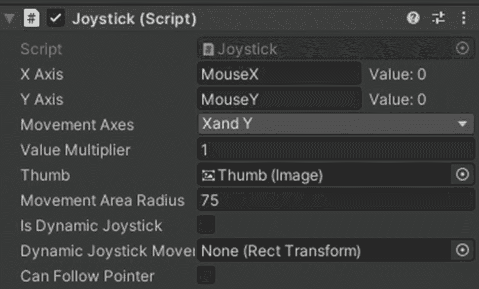

图 5-27

Look 操纵杆的操纵杆脚本

我们的游戏将遵循自上而下的摄像机视角。要做到这一点，把你的主相机游戏物体放在你的坦克上面，旋转它，让它看起来向下。我的主摄像头的位置是(0，12.5，0)，旋转是(90，0，0)，缩放是(1，1，1)。其其他组件上的所有其他属性都设置为默认值。我还将在环境下为它的相机组件设置一个纯色，这样当坦克到达地面边缘时，就有了一个更合适的背景。我使用的是(60，70，60，255)的颜色，十六进制为 3C463C(图 [5-28](#Fig28) )。

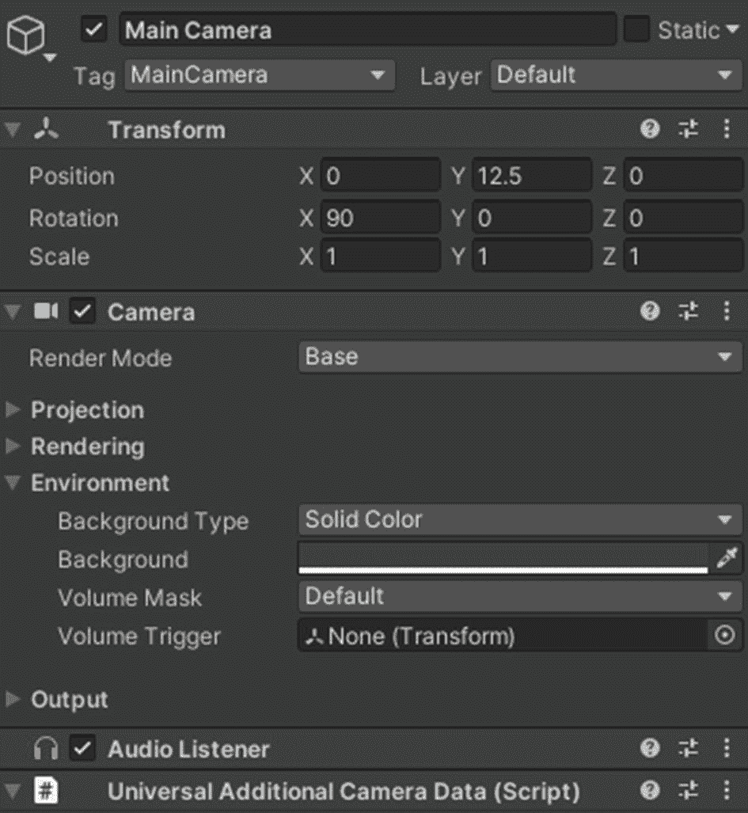

图 5-28

主相机游戏对象上的组件

我还旋转了我的方向灯，让地面上形成的阴影看起来更适合我(图 [5-29](#Fig29) )。然而，这不是必需的。

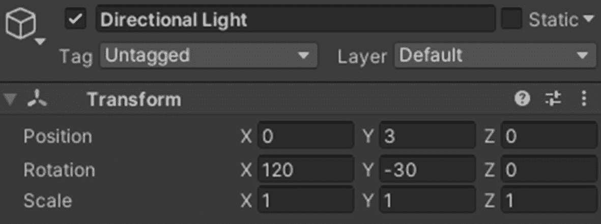

图 5-29

我的平行光游戏物体上的变换组件

你的游戏窗口应该看起来像下面的截图(图 [5-30](#Fig30) )，添加了操纵杆，相机在这一点上重新定位/旋转。

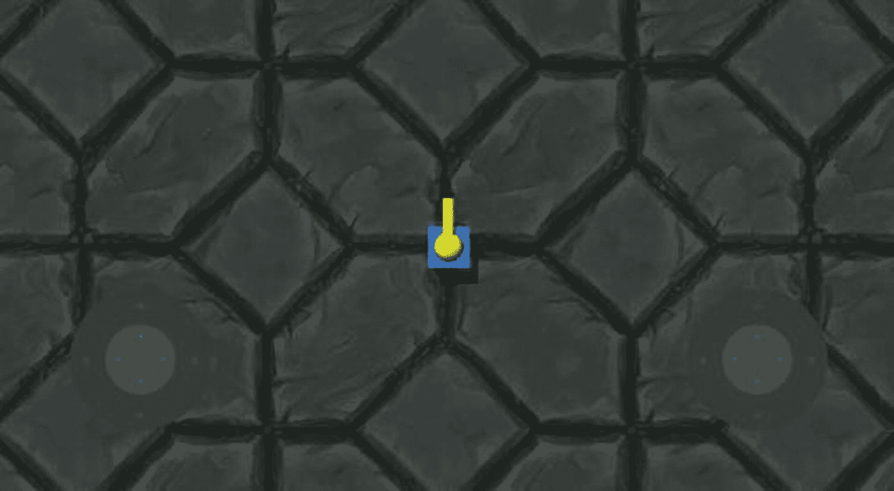

图 5-30

游戏窗口当前应该是什么样子

### 球员移动

是时候让我们的玩家坦克动起来了！为了保持我们的资源有组织，在项目窗口中创建一个名为 Scripts 的新文件夹。在该文件夹中，右键单击并创建一个 C#脚本。命名为 playerMovement。同样，如果你想选择另一个应用来编辑脚本，前往编辑➤首选项➤外部工具，并选择一个你想要的。然后，双击脚本将其打开。

在第 [3](03.html) 章的最后一节，我讨论了空白 Unity C#脚本中所有内容的用途，所以我不再赘述。首先，在第四行添加行`using SimpleInputNamespace;`，就在`using UnityEngine;`之后。这将使我们能够将操纵杆轴上的输入与游戏中的实际动作相匹配。

正如我们对 playerMovement 类中的第一行所做的那样，我们将创建一些变量来保存值或引用其他组件。此外，我们不会使用`void Update() {}`，我们将删除所有评论。使您的代码看起来像下面这样:

```cs
using System.Collections;
using System.Collections.Generic;
using UnityEngine;
using SimpleInputNamespace;

public class playerMovement : MonoBehaviour {
 public Transform rotator;
 private Rigidbody cubeRb;

 public float speed = 5.0f;

 private Vector2 input;

 void Start() {

 }
}

```

`rotator`变量将引用一个变换组件，我们稍后将基于输入旋转它，这样我们的坦克可以用它的炮塔瞄准。由于它被标记为 public，我们可以稍后在检查器中自己将它可视化地分配给我们的脚本。`cubeRb`是私有变量，在检查器中不可见。我们将从脚本本身给它分配玩家坦克的刚体组件。虽然在游戏中有许多移动角色的方法，但是我们将使用的一种方法是根据移动操纵杆的输入来修改坦克(其刚体)的速度。

`speed`变量将包含一个浮点值，并在检查器中可见。我们将把操纵杆的输入值乘以这个值，使玩家的坦克移动得更快或更慢。

最后，我们将把我们的输入存储在一个`Vector2`变量中。因为我们的坦克只是沿着 X 和 Z 轴移动，所以我们不需要使用`Vector3`变量。注意，花括号也可以放在新的一行上(默认情况下是这样的)。当涉及到编码时，个人偏好有很多。

该脚本将被附加到我们的球员坦克，并将作为一个组件稍后。它将执行的许多移动或炮塔旋转将与我们玩家坦克的刚体有关，这将在`CubeRb`变量中引用。为了实现这一点，我们可以在我们的`Start`函数中添加一行，这样当游戏开始时，`cubeRb`就会被引用。

```cs
void Start() {
 cubeRb = GetComponent<Rigidbody>();
}

```

这一行可以解释为“获取当前游戏对象上的刚体组件，并在我们的`cubeRb`变量中引用它。”现在，每次我们对`cubeRb`变量做什么，都会直接影响到我们玩家坦克上的刚体组件。不一定要用变量，但是比每次都输入`GetComponent<Rigidbody>()`要方便。我们还通过在当前系统中缓存 MonoBehaviour 组件来节省性能。

为了保持我们的代码有组织和干净，我们将利用许多功能，并有一个更加模块化的方法。为了获得操纵杆输入，我们将使用下面的函数。你可以把它加在`Start`后面。

```cs
bool GetInput(string horizontal, string vertical) {
 input.x = SimpleInput.GetAxisRaw(horizontal) * speed;
 input.y = SimpleInput.GetAxisRaw(vertical) * speed;

 return (Mathf.Abs(input.x) > 0.01f) || (Mathf.Abs(input.y) > 0.01f);
}

```

基本上，我们正在创建一个名为`GetInput`的函数。我们将向它传递两个字符串，每个字符串分别对应于操纵杆的水平轴和垂直轴。

然后，我们将使用`SimpleInput.GetAxisRaw(<axisName>)`获取这些轴的当前数值，将它们乘以速度变量中保存的浮点值，并将它们存储在`input`的 X 或 Y 位置；，我们的`Vector2`变了。

此外，该函数将返回一个布尔值。如果我们的`Vector2`变量`input`的两个值中至少有一个值大于或小于但不等于 0，它将返回`true`。返回的值`true`可以被解释为“操纵杆正在被交互”，因为简单输入操纵杆在没有被保持/触摸时，其两个轴的值都是 0。

由于操纵杆轴输入可以小于 0 (-1 到 1)，我们可以制定一个公式，例如“如果水平轴小于 0 或水平轴大于 0 或垂直轴小于 0 或垂直轴大于 0，则返回`true`，否则返回 false”，在 UnityScript 中，该公式可以写成:

```cs
if (input.x < 0 || input.x > 0 || input.y < 0 || input.y > 0) {
 return true;
} else {
 return false;
}

```

也许你已经注意到了，`if`语句中的条件本身会给出一个`true`或`false`值，所以我们可以自己返回这个值，而不是生成一个又长又大的`if-else`语句。现在整个陈述已经简化为

```cs
return (input.x < 0 || input.x > 0 || input.y < 0 || input.y > 0);

```

我们可以通过使用已经可用的`Mathf.Abs()`函数来进一步简化。`Abs`部分代表“绝对”。这意味着，对于传递给该函数的任何数字，它都将返回其绝对值。如果你给它传递一个正值，将不会有任何变化，但如果你传递一个负值，它将被转换成一个正数。例如，向函数一次传递一个值 0、-9.88、12.5 和-78.489 将返回 0、9.88、12.5 和 78.489。这就是我如何获得前面图片中的 return 语句。请随意使用任意数量的括号，以保持代码的整洁。

为了真正移动玩家，我们将再次创建并使用另一个函数。

```cs
void MovePlayer() {
 cubeRb.velocity = Vector3.Normalize(new Vector3(input.x, 0, input.y)) * speed;
}

```

简而言之，我们将设置玩家坦克刚体的速度(通过使用引用它的`cubeRb`变量)来匹配我们的水平和垂直输入。由于我们的刚体需要一个`Vector3`的速度值(在 3D 轴上)，我们的`Vector2`变量`input`的`Y`值将对应于这里的 Z 轴。我们还将使我们的`Vector3`值正常化，这样玩家坦克在对角移动时不会跑得更快。这将迫使我们的`Vector3`的大小为 1，所以我们将再次乘以速度变量中的值。你还会注意到我们不退还任何东西。这是因为我们的函数被标记为`void`。

对于上下文，我们将再次获取输入，但稍后将它们存储在输入`Vector2`变量中，用于负责旋转刀架的轴。`rotator`是一个引用带有转换组件的游戏对象的变量(我们立方体上的球体)。我们想让它绕 Y 轴旋转。默认情况下，旋转以四元数格式表示，而不是以`Vector3`格式表示。因此，要使用它们的变换组件根据`Vector3`旋转游戏对象，我们需要修改它们的`eulerAngles`属性。

```cs
void RotateTurret() {
 rotator.eulerAngles = new Vector3(0, Mathf.Atan2(input.x, input.y) * 180 / Mathf.PI, 0);
}

```

如果你学过一点三角学，你就会知道，为了求出两条线之间的角度，我们用 tan。我们正在做完全相同的事情:找到 X 和 Y 操纵杆输入之间的角度。因为我们要获得的角度是弧度形式的，我们必须把它转换成度。我们可以将该值乘以 180，然后除以 pi ( `Mathf.PI`)或者只乘以`Mathf.Rad2Deg`，本质上做的是同样的事情。最后，在获得以度为单位的角度后，我们只需创建一个新的`Vector3`变量，赋予它的`Y`值一个与我们的角度相等的值，并将其赋给我们希望旋转的游戏对象的变换的`eulerAngles`属性——在我们的例子中，是我们的旋转体。

为了完成这个脚本，我们必须调用我们的函数，以便使用它们。之前，我们讨论了一个名为`Update()`的游戏循环，它运行每一帧并执行放在其花括号内的代码。因为我们现在正在处理刚体，因此，物理相关的东西，最好利用另一个名为`FixedUpdate()`的函数，它每隔一段时间运行一次，而不是每帧运行一次。这会让我们的游戏看起来更流畅。

```cs
void FixedUpdate() {
 if (GetInput("Horizontal", "Vertical")) {
  MovePlayer();
}

 if (GetInput("MouseX", "MouseY")) {
  RotateTurret();
 }
}

```

在第一行，我们使用了`GetInput`函数，传递了`"Horizontal"`和`"Vertical"`轴。输入变量`Vector2`将保存这两个轴的当前值。`if`语句将确保`MovePlayer()`函数仅在玩家当前正在与移动操纵杆交互时被调用。

类似地，我们再次调用`GetInput`函数，但是这一次，传递 Look 操纵杆的轴。如果玩家与后者互动，那么只有炮塔(旋转体)才会旋转。如果我们没有这个检查，那么每次我们放开 Look 操纵杆时，炮塔都会跳回原来的位置(指向上)，这有点破坏游戏性。

如果你被困在某个地方，这里有完整的代码。但是，总是建议您自己键入代码。函数不必在另一个函数之前或之后键入。

```cs
using System.Collections;
using System.Collections.Generic;
using UnityEngine;
using SimpleInputNamespace;

public class playerMovement : MonoBehaviour {
 public Transform rotator;
 private Rigidbody cubeRb;
 public float speed = 5.0f;
 private Vector2 input;

 void Start() {
  cubeRb = GetComponent<Rigidbody>();
 }

 void FixedUpdate() {
  if (GetInput("Horizontal", "Vertical")) {
   MovePlayer();
  }

  if (GetInput("MouseX", "MouseY")) {
   RotateTurret();
  }
 }

 bool GetInput(string horizontal, string vertical) {
  input.x = SimpleInput.GetAxisRaw(horizontal) * speed;
  input.y = SimpleInput.GetAxisRaw(vertical) * speed;

  return (Mathf.Abs(input.x) > 0.01f) || (Mathf.Abs(input.y) > 0.01f);
 }

 void MovePlayer() {
  cubeRb.velocity = Vector3.Normalize(new Vector3(input.x, 0, input.y)) * speed;
 }

 void RotateTurret() {
  rotator.eulerAngles = new Vector3(0, Mathf.Atan2(input.x, input.y) * 180 / Mathf.PI, 0);
 }
}

```

完成后，只需保存脚本并返回 Unity 编辑器。将脚本拖放到玩家坦克上或添加组件➤玩家移动。当玩家坦克被选中时，从脚本的 rotator 字段的层次中拖放 Rotator 游戏对象。进入游戏模式，并尝试与移动和查看操纵杆互动。一个应该使玩家坦克移动并向指定的方向前进，而另一个应该使炮塔看起来在旋转。

### 摄像机定位

在测试上一部分的游戏时，你可能已经注意到玩家坦克会离开屏幕。这不是我们想要的，所以，在这一节中，我们将配置主摄像机平滑地跟随玩家坦克。这一次，创建一个名为 cameraFollow 的脚本并打开它。

我们将只使用两个变量:一个名为`player`的转换变量，它将引用我们的玩家坦克的转换，以及一个浮点变量`height`。

```cs
public Transform player;
public float height = 12.5f;

```

为了让摄像机跟随玩家，我们必须使用一个函数，比如`Update()`，将摄像机的位置设置为玩家的位置，除了`Y`值，我们将把它设置为保存在`height`变量中的值，这样我们就可以有一个自上而下的视图。

```cs
void LateUpdate() {
 this.transform.position = new Vector3(player.position.x, height, player.position.z);
}

```

代替传统的`Update()`，我们将使用`LateUpdate()`，它非常类似，但是在其他更新循环运行之后运行。将与摄像机运动相关的代码放入其中是一个很好的做法，因为这意味着在摄像机必须移动之前，所有与运动相关的代码已经被首先执行了。这是完整的代码:

```cs
using System.Collections;
using System.Collections.Generic;
using UnityEngine;

public class cameraFollow : MonoBehaviour {

 public Transform player;
 public float height = 12.5f;

 void LateUpdate() {
  this.transform.position = new Vector3(player.position.x, height, player.position.z);
 }
}

```

保存脚本，将它添加到主相机游戏对象中，将玩家游戏对象从层级中拖放到脚本的玩家字段中，然后点击播放按钮。相机现在应该跟随玩家坦克。

### 5.3.5 让玩家射出子弹

本节分为两部分:制作子弹和射击。要制作子弹，首先在你的层级中创建一个球体(3D 物体➤球体)游戏物体。将其命名为 Bullet，并赋予其位置为(0，1，2)，旋转为(0，0，0)，缩放为(0.3，0.3，0.3)。接下来，制作一个名为 Bullet 的标签，并将其分配给游戏对象。此外，在子弹游戏对象的网格渲染器组件中的照明属性下，将投射阴影设置为关闭，以便子弹看起来没有阴影(图 [5-31](#Fig31) )。


图 5-31

子弹游戏对象#1 上的组件

保持球体碰撞器属性不变，然后给子弹游戏对象添加一个刚体组件。取消勾选使用重力，仅勾选限制条件下的冻结位置 Y。此时，您可能还想为子弹游戏对象创建/添加一个材质。我将使用浅绿色的(图 [5-32](#Fig32) )。

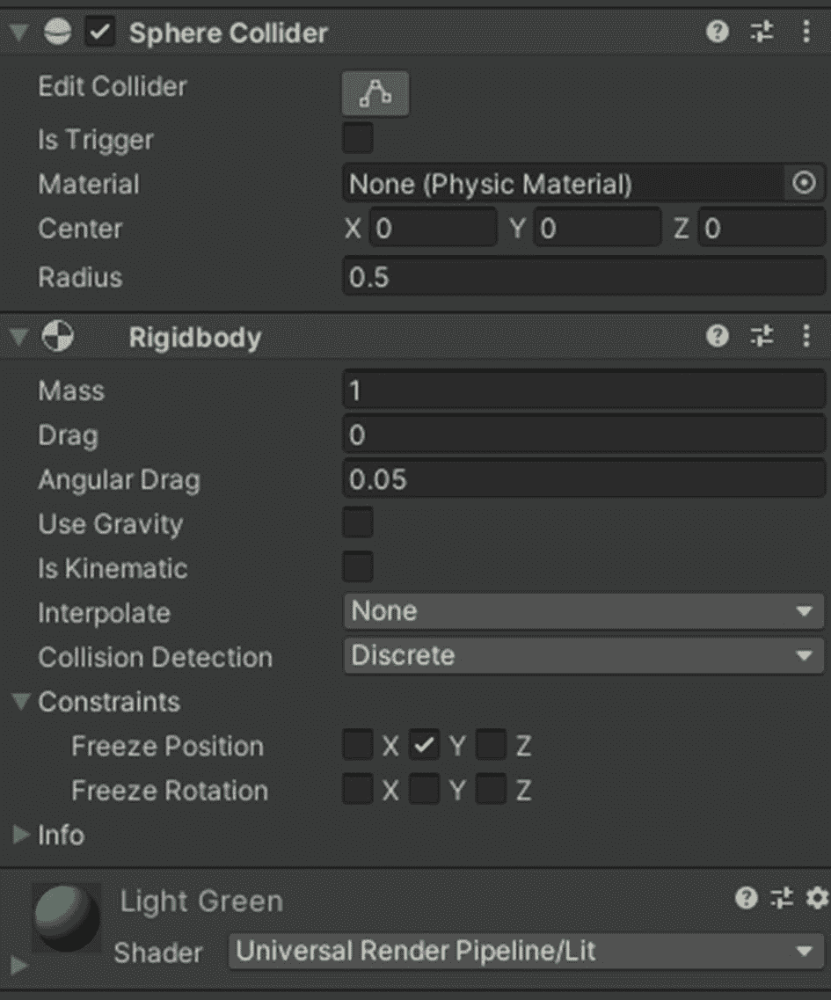

图 5-32

子弹游戏对象#2 上的组件

最后，我们希望我们的子弹最终被销毁，这样它们就不会一直留在我们的游戏中，导致游戏性能下降。为此，创建一个名为 destroyer 的脚本，等待它完成编译(见右下角的小加载图标)，然后将其添加到 Bullet 组件上。打开脚本。以下是完整的代码:

```cs
using System.Collections;
using System.Collections.Generic;
using UnityEngine;

public class destroyer : MonoBehaviour {
 public float delay = 3.0f;

 void Start() {
  Destroy(this.gameObject, delay);
 }
}

```

在第一行，在类内部，我们创建了一个新的名为`delay`的公共 float 变量，并赋予它一个初始值`3`。然后，在我们脚本的`Start`函数中，我们告诉 Unity 给`Destroy`这个脚本所附加的游戏对象，在对应于当前保存在`delay`变量中的值的几秒钟之后。如果我们不向`Destroy`函数传递任何第二个参数，它会在游戏一开始就立即破坏我们的 GameObject。最后，在你的项目窗口中，创建一个名为 Prefabs 的文件夹，并将子弹游戏对象从你的层级中拖放到该文件夹中。您已经成功制作了一个预制组件！你现在可以安全地从你的场景中摧毁子弹游戏物体。

在接下来的步骤中，您还需要在发射子弹时播放声音效果。你可以从 [`https://raw.githubusercontent.com/EdgeKing810/SphereShooter/master/Assets/Sounds/fireBullets.wav`](https://raw.githubusercontent.com/EdgeKing810/SphereShooter/master/Assets/Sounds/fireBullets.wav) 下载我要用的那个(右击另存为)。创建一个名为 Sounds 或 Sound Effects 的文件夹，并将`.wav`文件或您将要使用的声音文件从文件管理器拖放到 Unity 编辑器中。接下来，将一个音频源组件添加到你的玩家坦克游戏对象中，取消勾选“唤醒时播放”，并在 AudioClip 属性中分配你刚刚导入的音频文件(图 [5-33](#Fig33) )。

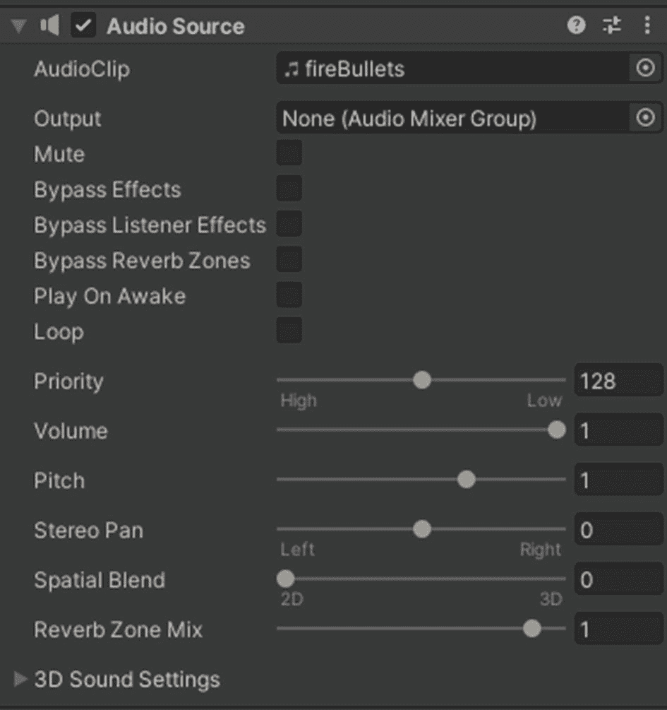

图 5-33

玩家游戏对象上的音频源组件

是时候给我们的玩家坦克发射子弹的能力了！创建一个名为 bulletSystem 的新脚本并打开它。现在与 Look 操纵杆交互只会导致旋转器旋转，从而将炮塔瞄准我们想要的方向。然而，如果我们想要拍摄，操纵杆的手柄(拇指)必须离操纵杆的中心超过一个规定的距离。接下来，我们要检查从玩家最后一次射击开始是否已经过了足够的时间，以便能够再次射击。最后，如果满足这两个条件，我们只需在 bulletEnd 位置实例化(生成)一颗子弹(空的游戏对象，是我们炮塔的子对象)，给子弹一个力，推动它向前，并发出射击声。

首先，将`Using SimpleInputNamespace;`行添加到脚本中，因为我们稍后也将获取操纵杆输入。以下是我们将在该脚本中使用的变量:

```cs
public Transform bulletEnd;
public Rigidbody bulletPrefab;

public float force = 500.0f;

float currentTime;
public float delay = 0.5f;

AudioSource audioSource;

```

将引用我们的炮塔游戏对象的子对象的变换组件，在那里项目符号应该被实例化。不出所料，`bulletPrefab`将参考我们创建的子弹预制体。`force`变量中的浮点值将定义已经实例化的子弹的推进力。`currentTime`和`delay`分别代表从游戏开始发射最后一颗子弹的秒数和玩家必须等待发射另一颗子弹的秒数。最后，`audioSource private`变量将引用玩家坦克上的音源，稍后播放指定的音效。

```cs
void Start() {
 audioSource = GetComponent<AudioSource>();
}

```

在`Start`函数中，我们将在`audioSource`变量中引用脚本附加到的游戏对象(我们的玩家坦克)上的音频源。

由于我们的脚本必须处理施加力，因此，物理，我们将使用`FixedUpdate`。

```cs
 void FixedUpdate() {
  if (((Mathf.Abs(SimpleInput.GetAxisRaw("MouseX")) > 0.75f) ||
       (Mathf.Abs(SimpleInput.GetAxisRaw("MouseY")) > 0.75f)) &&
     ((Time.time - currentTime > delay) || (currentTime < 0.01f))) {

    currentTime = Time.time;
    audioSource.Play();

    Rigidbody bulletInstance = Instantiate(bulletPrefab, bulletEnd.position, bulletEnd.rotation) as Rigidbody;
    bulletInstance.AddForce(bulletEnd.forward * force);
  }
 }
}

```

让我们首先分析一下，如果只有`true`，允许`FixedUpdate`循环中所有指令运行的条件。

```cs
((Mathf.Abs(SimpleInput.GetAxisRaw("MouseX")) > 0.75f) || (Mathf.Abs(SimpleInput.GetAxisRaw("MouseY")) > 0.75f))

```

只有当`MouseX`和/或`MouseY`当前具有大于 0.75 或小于 0.75 的值时，该语句才会产生`true`。在前面几节中，我已经解释了 playerMovement 脚本的类似语句。接下来，我们将从该语句中获得的布尔值与下面的一个链接起来:

```cs
((Time.time - currentTime > delay) || (currentTime < 0.01f))

```

只有当从最后一次发射子弹起已经过了比 delay 变量中保存的值更多的秒数，或者如果`currentTime`小于 0.01，这意味着这是我们第一次发射子弹(所以不需要等待)，这个条件才会返回`true`。如果这两个条件都是`true`(因此有了`&&`符号)，只有这样我们才会在`if`语句中运行代码。

将运行的前两行将把自游戏开始以来经过的秒数的值赋给 currentTime 变量，以指示子弹最后一次发射的时间是现在，并播放在 AudioSource 组件中分配的音频剪辑。

最后，我们正在创建一个名为`bulletInstance`的新刚体变量，当我们在场景中的`bulletEnd`位置和旋转实例化(克隆)子弹预设时，我们将其分配给该变量。`bulletInstance`，它现在在场景中拿着我们的子弹预制的副本，将被给予一个力，该力等于在类似命名的变量中存在的值，并且在我们炮塔的向前方向上(或者在这种情况下是`bulletEnd`)。

以下是完整的代码，如果你错过了什么。保存脚本并返回 Unity 编辑器。

```cs
using System.Collections;
using System.Collections.Generic;
using UnityEngine;
using SimpleInputNamespace;

public class bulletSystem : MonoBehaviour {
 public Transform bulletEnd;
 public Rigidbody bulletPrefab;

 public float force = 500.0f;

 float currentTime;
 public float delay = 0.5f;

 AudioSource audioSource;

 void Start() {
 audioSource = GetComponent<AudioSource>();
 }

 void FixedUpdate() {
 if (((Mathf.Abs(SimpleInput.GetAxisRaw("MouseX")) > 0.75f) || (Mathf.Abs(SimpleInput.GetAxisRaw("MouseY")) > 0.75f)) &&
 ((Time.time - currentTime > delay) || (currentTime < 0.01f))) {

   currentTime = Time.time;
   audioSource.Play();

   Rigidbody bulletInstance = Instantiate(bulletPrefab, bulletEnd.position, bulletEnd.rotation) as Rigidbody;
   bulletInstance.AddForce(bulletEnd.forward * force);
  }
 }
}

```

将脚本分配给玩家坦克游戏对象。在层次中展开玩家游戏对象的子对象，并将 bulletEnd 游戏对象拖放到玩家游戏对象上脚本实例的 bulletEnd 字段中。以类似的方式，从项目窗口的项目符号预置字段中拖放项目符号游戏对象。进入播放模式，测试一切正常。你现在应该会射子弹了。

## 5.4 敌人

在本节中，我们将制作一个球形敌人，在游戏中实例化它的副本，并使这些副本以我们的玩家坦克为目标并向其移动。当敌人与玩家或子弹相撞时，也应该被消灭。让我们马上迈出第一步。

### 5.4.1 树敌

首先创建一个球体。创建并给它分配一个敌人的标签，并将这个新的球体游戏对象命名为敌人。把它放在(0，1.15，10)的位置，给它一个(0，0，0)的旋转，一个(1.5，1.5，1.5)的刻度。它的网格渲染器或球体碰撞器组件不需要修改任何属性。接下来，添加一个刚体组件，取消选中使用重力，并从约束选项卡冻结游戏对象的 Y 位置。

此外，添加一个音频源组件，并取消勾选唤醒时播放。这个音频源组件将会播放敌人被消灭的声音。下载以下音频文件，并将其导入到项目先前创建的声音文件夹中:

[`https://github.com/EdgeKing810/SphereShooter/blob/master/Assets/Sounds/explosion0.wav`](https://github.com/EdgeKing810/SphereShooter/blob/master/Assets/Sounds/explosion0.wav) 。

在音频源的音频片段栏中分配“爆炸 0”。此时，你可能还想在敌人的游戏对象上创建/放置一个材质。我将创建和使用一个红色的(图 [5-34](#Fig34) 和 [5-35](#Fig35) )。

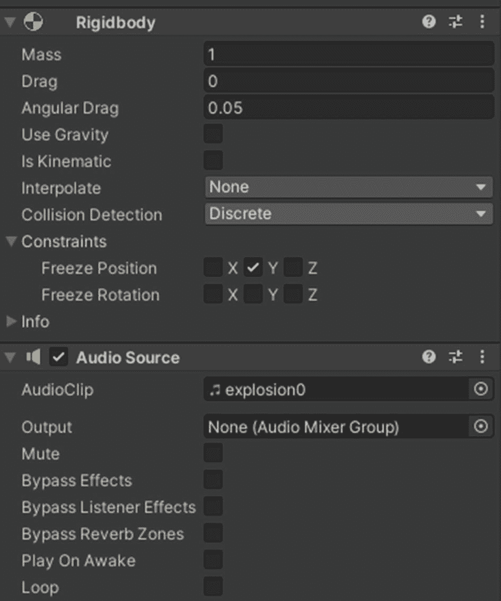

图 5-35

敌人游戏对象#2 上的组件

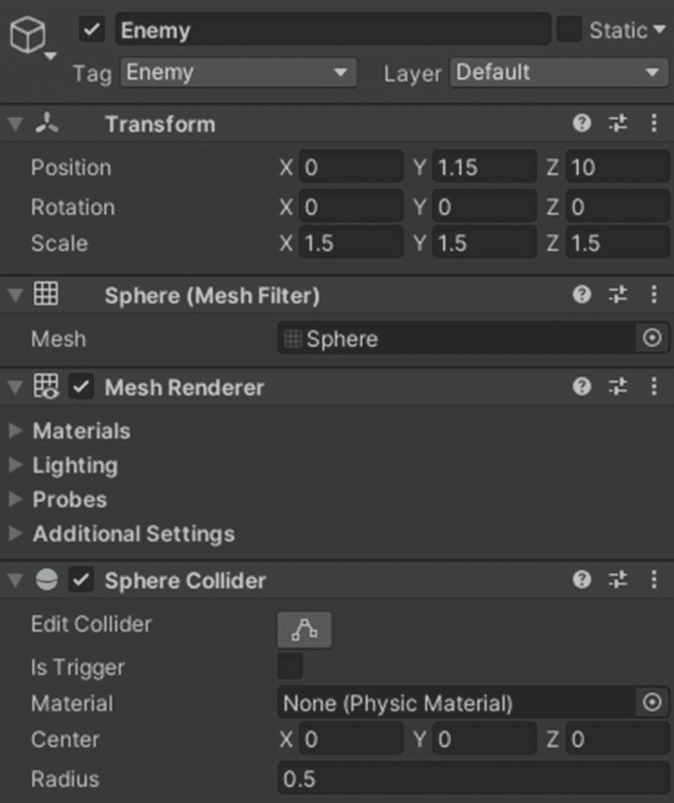

图 5-34

敌人游戏对象#1 上的组件

为了让我们的游戏看起来更有趣，让我们给敌人添加一个轨迹渲染器。出于某种原因，我将在稍后的脚本阶段解释，创建一个新的空游戏对象作为我们的敌人游戏对象的子对象，并将其命名为 Trail Renderer。仅编辑其变换组件，并将其放置在(0，0，0)的位置。如果我们把它放得太高，轨迹渲染器会在玩家坦克的顶部渲染。

向子 GameObject 添加一个 Trail Renderer 组件。尝试在看起来像图形的东西上设置一个大约 0.35 的宽度值(首先右键单击，以设置精确的值)，在“材质”下的元素 0 位置为其指定一个您选择的材质，并将“投射阴影”设置为“关闭”，在“照明”下(图 [5-36](#Fig36) 和 [5-37](#Fig37) )。

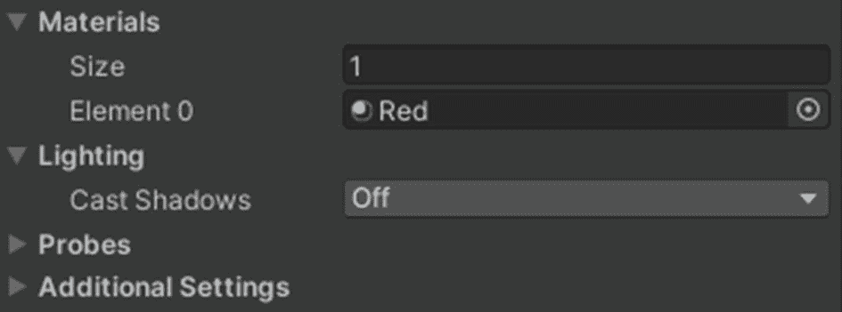

图 5-37

轨迹渲染器游戏对象#2 上的组件

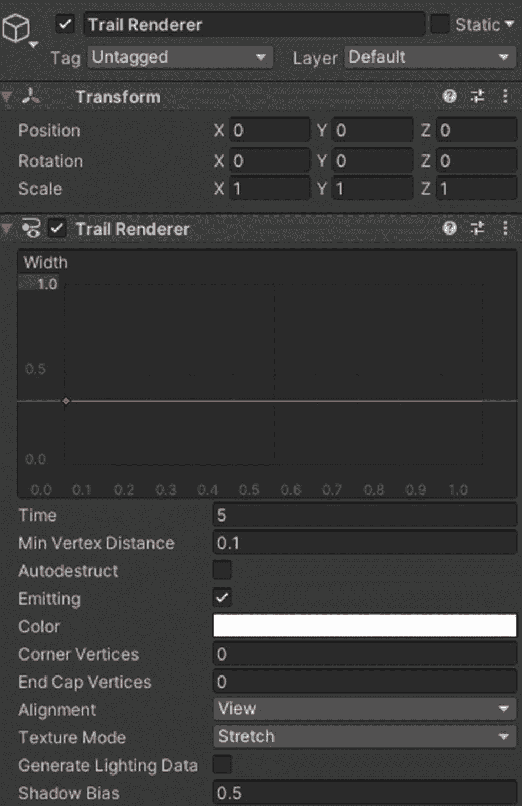

图 5-36

轨迹渲染器游戏对象#1 上的组件

### 5.4.2 从商店导入另一项素材

当我们的敌人与我们的玩家或子弹相撞时，我们会想要摧毁它(我们已经可以使用`Destroy()`做到这一点)。我们还可以添加一些视觉效果，比如一个爆炸粒子系统。幸运的是，素材商店里有一个包，可以提供我们需要的一切。下载并导入简单外汇素材(图 [5-38](#Fig38) )。


图 5-38

素材存储中的简单 FX-卡通粒子素材

### 5.4.3 使我们的敌人移动并爆炸

敌人需要能够处理和做的一切都将被放入一个脚本中。从脚本文件夹中创建并打开一个名为“敌人”的脚本。我们会制造和使用许多变量。

```cs
const string playerTag = "Player";
const string bulletTag = "Bullet";
public float minSpeed = 1.0f;
public float maxSpeed = 6.0f;
float speed;
GameObject player;
public GameObject enemyExplosionPrefab;
AudioSource audioSource;

```

我们的玩家和项目符号使用的标签将存储在两个字符串常量中，分别标识为`playerTag`和`bulletTag`。因为我们将在我们的代码中进一步使用这些常量，所以从长远来看使用这些常量会更容易引用它们，因为如果我们将来改变这些游戏对象的标签，我们将只拥有保存在这些常量中的值，而不是我们代码中的所有引用。

我们要做的另一件事是让我们的敌人以随机速度移动，让游戏更有趣。这个随机速度将在包含在`minSpeed`和`maxSpeed`变量中的两个浮点值的范围内，并存储在一个名为`speed`的变量中，以备后用。

玩家游戏对象变量将被用来包含对我们的玩家坦克游戏对象的引用。由于敌人将使用预设来制造，并在我们的场景中进行实例化，所以将玩家变量设为公共变量是没有用的，因为我们无法将玩家从我们的场景拖放到我们项目中的敌人预设中。这样做是没有意义的，例如，如果一个不同的场景被打开，一个预置不能从那个场景中引用一个游戏对象。取而代之的是，我们将编写一些东西，当它被实例化时，敌人可以自动找到玩家。

下一个游戏对象变量是`enemyExplosionPrefab`，它将被用来引用我们之前导入的简单 FX 素材中的爆炸预设。

`audioSource`只是一个变量，它将引用敌人上的音频源组件来播放我们在其音频剪辑字段中分配给它的爆炸声音。

我们将在我们的`Start`函数中放置一些代码，这样它只被执行一次，在我们的敌人游戏对象生命周期的开始。

```cs
void Start() {
 speed = Random.Range(minSpeed, maxSpeed);
 audioSource = GetComponent<AudioSource>();
 player = GameObject.FindWithTag(playerTag);
}

```

首先，我们将从我们设置的最小和最大值计算一个随机速度，并使用`Random.Range`函数将该浮点值存储在`speed`变量中。`Random.Range`将返回一个大于等于`minSpeed`但小于`maxSpeed`的随机值。

接下来，我们将在`audioSource`变量中存储一个对当前游戏对象(在我们的例子中，是我们的敌人)的音频源组件的引用。我们还使用了`GameObject.FindWithTag`函数，将`playerTag`常量中的字符串作为参数传递，以引用玩家坦克中的游戏对象。将搜索一个带有我们作为参数传递的标签的游戏对象，一旦找到一个符合标准的，它将返回它。

对于游戏循环，我们可以利用`Update`或者`FixedUpdate`。

```cs
void FixedUpdate() {
 if (player) {
  transform.position = Vector3.MoveTowards(transform.position, player.transform.position, speed * Time.deltaTime);
 } else {
  GetComponent<Rigidbody>().velocity = new Vector3(0, 0, 0);
 }
}

```

在 e 中，我们将执行两个动作中的一个，这取决于我们的场景中是否有玩家坦克游戏对象。例如，如果我们的玩家坦克游戏对象在当前场景中被摧毁，`player`变量将保存一个值`null`，而不是一个实际的游戏对象引用。

检查“如果`player`变量当前正在引用一个游戏对象”的方法可以是`if (player != null)`或简单的`if (player)`。从逻辑上讲，如果`player`变量没有`null`值，那么它必须对应于一个游戏对象，在我们的例子中是玩家坦克，因为它是唯一一个使用`playerTag`常量中的值作为标签的游戏对象。

因此，如果`player`变量实际上对应于某个东西，我们希望敌人向其变换组件中的位置移动。要做到这一点，我们可以简单地将敌人游戏对象的变换位置值设置为等于由`Vector3.MoveTowards`函数返回的`Vector3`值。在我们的例子中，`Vector3.MoveTowards`使用了三个参数。第一个是 a `Vector3`值(我们敌人的当前位置)，我们想把它逐渐变成作为第二个参数传递的值(玩家坦克的位置)。第三个值定义了我们希望第一个值变成第二个值的速率或速度；因此，我们传递了`speed`变量。每次`FixedUpdate`运行时，将返回一个更接近玩家位置的`Vector3`值。当使用`Update`运行每一帧时，将该值乘以`Time.deltaTime`会使过渡更加线性和平滑。在`FixedUpdate`不会有什么影响。

否则，如果我们的`player`变量对应于`null`，我们将希望让我们的敌人游戏对象停止移动并留在原地。如果我们一开始没有包含那个`if`语句，那么如果玩家坦克游戏对象被摧毁，我们会收到很多错误，因为脚本会试图将敌人移动到`null`的位置，这是无效的。

我们还将利用另外两个函数。接下来是`OnCollisionEnter`，当敌人与任何东西发生碰撞时，它会在我们的脚本中自动运行。我们传递给这个函数的参数对应于游戏对象的碰撞器与脚本所在的游戏对象的碰撞器所造成的碰撞。在我们的例子中，该参数将等于任何游戏对象的碰撞器与我们的敌人游戏对象(的碰撞器)所造成的碰撞。我们将把 Collider 引起的碰撞称为局部变量`col`。

```cs
void OnCollisionEnter(Collision col) {
 if (col.gameObject.CompareTag(bulletTag)) {
  Destroy(col.gameObject);
 }

 if (col.gameObject.CompareTag(playerTag) ||
     col.gameObject.CompareTag(bulletTag)) {
  DestroyEnemy();
 }
}

```

第一个`if`条件检查与我们的敌人相撞的游戏对象是否是子弹游戏对象。我们通过访问导致碰撞的碰撞器的游戏对象，然后使用保存在`bulletTag`常量中的字符串值作为参数，检查它是否与子弹游戏对象具有相同的标签。我们也可以编写`if (col.gameObject.tag == bulletTag)`，但是我的编写方式是推荐的方式，这也提供了一些性能上的好处。

如果是这种情况，我们将希望摧毁刚刚碰撞的子弹游戏对象。在下一个`if`条件中，我们检查敌人的游戏对象是否与子弹或玩家的坦克相撞。如果发生了这种情况，我们希望调用一个名为`DestroyEnemy`的函数，它将决定当敌人“死亡”时应该发生什么。

```cs
void DestroyEnemy() {
 GameObject explosionInstance = Instantiate(enemyExplosionPrefab, transform.position, enemyExplosionPrefab.transform.rotation);
 Destroy(explosionInstance, 5.0f);

 audioSource.Play();

 Transform trailRenderer = transform.GetChild(0);
 if (trailRenderer) {
  trailRenderer.parent = null;
  Destroy(trailRenderer.gameObject,   trailRenderer.GetComponent<TrailRenderer>().time);
 }

Destroy(this.gameObject);
}

```

在`DestroyEnemy`函数中，我们要做的第一件事是从简单的 FX 实例化敌人的爆炸预设游戏对象，在`enemyExplosionPrefab`变量中引用，在敌人游戏对象的位置，但是在爆炸预设本身的旋转，并且在一个新的本地`GameObject`变量中存储一个引用，我们将创建这个引用并命名为`explosionInstance`。

在爆炸粒子系统被实例化并在场景中运行后，我们将在五秒钟后销毁爆炸粒子系统的游戏对象，而不是用许多无用的游戏对象来膨胀我们的场景(这只是系统完全运行的充足时间)。然后，我们将播放敌方音源组件中持有的音频片段(`explosion0`)。

因为我们想让我们的轨迹渲染器自动消失，而不是在敌人“死亡”时立即被摧毁，所以我们在一个名为`trailRenderer`的新变换变量中创建了对它的引用。调用`transform.GetChild(0)`返回当前游戏对象(我们的敌人游戏对象)变换的第一个子对象(0 是第一个索引)。

接下来，如果敌人有一个子游戏对象，`trailRenderer`不应该等于`null`。只有这样，我们才会将`trailRenderer`游戏对象的父对象或敌人游戏对象的第一个子对象设置为等于`null`。这将使游戏对象没有父对象，因此，不再是任何游戏对象的子对象。然而，正如我之前所讨论的，对于爆炸游戏对象的实例，我们也将销毁`trailRenderer`的游戏对象，但是这一次，不是考虑并给出一个合适的值，我们将获取轨迹渲染器组件本身清除其轨迹所需的时间，或者换句话说， 轨迹达到长度/宽度为 0 所需的时间，并将其作为第二个参数传递给`Destroy`函数，这将导致轨迹渲染器的游戏对象在轨迹长度/宽度为 0 时立即被销毁。 请记住，默认情况下，轨迹会随着时间的推移自动销毁自己的一部分。现在，你可能明白为什么我们之前为轨迹渲染器组件制作了一个新的游戏对象，而不是把它放在主要的敌人游戏对象上。

最后，我们立即摧毁敌人的游戏对象。以下是完整的脚本:

```cs
using System.Collections;
using System.Collections.Generic;
using UnityEngine;

public class enemy : MonoBehaviour {
 const string playerTag = "Player";
 const string bulletTag = "Bullet";
 public float minSpeed = 1.0f;
 public float maxSpeed = 6.0f;
 float speed;
 GameObject player;
 public GameObject enemyExplosionPrefab;
 AudioSource audioSource;

 void Start() {
  speed = Random.Range(minSpeed, maxSpeed);
  audioSource = GetComponent<AudioSource>();
  player = GameObject.FindWithTag(playerTag);
 }

 void FixedUpdate() {
  if (player) {
   transform.position = Vector3.MoveTowards(transform.position, player.transform.position, speed * Time.deltaTime);
 } else {
   GetComponent<Rigidbody>().velocity = new Vector3(0, 0, 0);
  }
 }

 void OnCollisionEnter(Collision col) {
  if (col.gameObject.CompareTag(bulletTag)) {
   Destroy(col.gameObject);
  }

  if (col.gameObject.CompareTag(playerTag) ||
      col.gameObject.CompareTag(bulletTag)) {
   DestroyEnemy();
  }
 }

 void DestroyEnemy() {
  GameObject explosionInstance = Instantiate(enemyExplosionPrefab, transform.position, enemyExplosionPrefab.transform.rotation);
  Destroy(explosionInstance, 5.0f);

  audioSource.Play();

  Transform trailRenderer = transform.GetChild(0);
  if (trailRenderer) {
   trailRenderer.parent = null;
   Destroy(trailRenderer.gameObject,   trailRenderer.GetComponent<TrailRenderer>().time);
  }

  Destroy(this.gameObject);
 }
}

```

保存脚本。当你回到 Unity 编辑器时，把脚本放到敌人的游戏对象上，在脚本的 enemyExplosionPrefab 字段中拖放 SimpleFX ➤预设➤ FX_Fireworks_Blue_Small 预设，或者一个类似的。如果你点击 Play，你应该会看到我们场景中唯一的敌人会向玩家坦克移动，并发出声音，当它被摧毁时会产生爆炸，无论是被子弹击中还是与玩家游戏对象碰撞。在第 [6](06.html) 章中，我们将通过在设定的繁殖点随机繁殖一些敌人来改进游戏，增加(玩家的)生命值和高分，为游戏开始和玩家失败制作菜单，等等。