# 六、反编译实现

现在，您已经学会了处理单个字节码，并将操作码反编译成部分语句和表达式，最终(无论如何，这是计划)，返回完整的源代码块。

如果我对我的读者判断正确的话，这一章，可能还有第五章会吸引大量的读者。这是如何使用 ANTLR 构建的解析器实现反编译器的核心问题。

为了使本章尽可能实用，我们使用了一个简单程序的测试套件，每个程序都有不同的语言结构。对于每一个程序，你都要逐步重建原始源代码，在进行过程中构建反编译器。每个程序都是先编译再反汇编。然后查看 Java 源代码和相应的方法字节码，并为每个示例创建一个解析器规范，将字节码转换回源代码。

因为`classes.dex`文件不仅仅是方法字节码，您还需要能够将剩余的信息合并到类文件中，以便从文件的非数据部分恢复导入语句、包名和变量名。

通过完成第三章中的 DexToXML 的实现，您可以开始更加熟悉 ANTLR。DexToXML 是一个基本的 ANTLR 解析器，没有额外的功能。之后，查看 DexToSource(反编译器)将字节码指令反编译回 Java 源代码。

### 德克斯托 XML

DexToXML 是 ANTLR 解析的简单介绍。它使用 ANTLR 作为解析器技术。这本书的早期版本使用了 JLex 和 CUP，它们很难工作，甚至更难调试——您可能会花费数小时试图找出为什么向规则添加一个简单的更改会破坏整个解析器。自 2004 年以来发生了很多变化，ANTLR 现在提供了与 Eclipse 以及 ANTLRWorks 的出色集成，ANTLRWorks 是一个独立的 ANTLR 工具，它将创建解析器的艺术转变为更简单的编码任务。

ANTLR 也是一种优秀的技术，可以为各种领域特定语言(DSL)工具创建自己的解析器。这些通常是一次性的微型编程语言、规则引擎、绘图工具等等，它们是为解决特定问题而创建的；当 grep、sed 和 awk 等脚本工具不能胜任工作时，通常会用到它们。

让我们首先看看解析`dex.log`，它是 dedexer 工具的输出之一。Dedexer 是一个 dex 文件反汇编程序，通常用于在 DDX 文件中生成类似 smali 的反汇编程序输出，但也可以在`dex.log`文件中给出`classes.dex`的完整输出。您也可以使用 Android SDK 中的 dexdump 文件的输出，但是我个人更喜欢更简单的`dex.log`文件的输出。

#### 解析 dex.log 输出

`dex.log`是在编译版本的`Casting.java`文件上运行以下 dedexer 命令时创建的日志文件:

`c:\temp>java -jar ddx1.18.jar -o -d c:\temp casting\classes.dex`

`dex.log`是一个`classes.dex`文件的原始输出，它允许你在没有解析字节开销的情况下进行反编译，这正是你想要的。清单 6-1 显示了`classes.dex`文件头的输出。

**清单 6-1。** *类的头*

`00000000 : 64 65 78 0A
30 33 35 00
magic: dex\n035\0
00000008 : 62 8B 44 18
checksum
0000000C : DA A9 21 CA
9C 4F B4 C5
21 D7 77 BC
2A 18 4A 38` `0D A2 AA FE
signature
00000020 : 50 04 00 00
file size: 0x00000450
00000024 : 70 00 00 00
header size: 0x00000070
00000028 : 78 56 34 12
00 00 00 00
link size: 0x00000000
00000030 : 00 00 00 00
link offset: 0x00000000
00000034 : A4 03 00 00
map offset: 0x000003A4
00000038 : 1A 00 00 00
string ids size: 0x0000001A
0000003C : 70 00 00 00
string ids offset: 0x00000070
00000040 : 0A 00 00 00
type ids size: 0x0000000A
00000044 : D8 00 00 00
type ids offset: 0x000000D8
00000048 : 07 00 00 00
proto ids size: 0x00000007
0000004C : 00 01 00 00
proto ids offset: 0x00000100
00000050 : 03 00 00 00
field ids size: 0x00000003
00000054 : 54 01 00 00
field ids offset: 0x00000154
00000058 : 09 00 00 00
method ids size: 0x00000009
0000005C : 6C 01 00 00
method ids offset: 0x0000016C
00000060 : 01 00 00 00
class defs size: 0x00000001` `00000064 : B4 01 00 00
class defs offset: 0x000001B4
00000068 : 7C 02 00 00
data size: 0x0000027C
0000006C : D4 01 00 00
data offset: 0x000001D4`

让我们先来看看幻数部分，它在文件的开头；参见清单 6-2 。

**清单 6-2。** *幻数*

`00000000 : 64 65 78 0A
30 33 35 00` `magic: dex\n035\0`

所有`classes.dex`文件的格式都是一样的。目标是解析幻数和输出

`<root><header><magic>dex\n035\0</magic></header></root>`

使用这些信息:

*   八个十六进制数字，文件中的地址
*   一个冒号
*   两组八个十六进制数字
*   `magic`关键字
*   另一个冒号
*   `classes.dex`神奇的数字

##### 工作中的 ANTLR

ANTLR 的工作方式是首先对输入进行标记，然后通过一系列解析规则，产生所需的输出。第一步是将信息分解成令牌。一个显而易见的标记是一个十六进制数字(`HEX_DIGIT`)以及您希望解析器忽略的`WS`或空格。用于标记幻数头信息的 ANTLR 解析器如清单 6-3 所示。语法、选项、`@header`和`@lexer`分别告诉解析器语法的名称、生成解析器的语言以及解析器和词法分析器的包名。

**清单 6.3。**ANTLR 幻数解析器

`grammar DexToXML;
options {language = Java;}
@header {package com.riis.decompiler;}
@lexer::header {package com.riis.decompiler;}

rule : header
;

header : magic
;

magic: address eight_hex eight_hex *IDENT* ':' *MAGIC_NUM*
;

hex_address: '0x' eight_hex` `;

address
: eight_hex ':'
;

eight_hex
: *DIGIT* *DIGIT* *DIGIT* *DIGIT* *DIGIT* *DIGIT* *DIGIT* *DIGIT*
;

*IDENT*: ('a'..'z')+;
*MAGIC_NUM*: 'dex\\n035\\0';
*DIGIT* : ('0'..'9'|'A'..'F');
*WS*: (' ' | '\t' | '\n' | '\r' | '\f' | ',')+ {$channel = HIDDEN;};`

在清单 6-3 中，从下往上看，`WS`定义了发送到隐藏通道并被忽略的空白是什么意思。`DIGIT`将十六进制数字定义为 0–f。`MAGIC_NUM`是`dex\n035\0`的转义版本；最后，`IDENT`是任何字符串。解析器规则接受这些标记，并将它们排列成预期的模式。例如，从清单 6-2 中可以知道，十六进制数字被分成八组，分别代表地址和幻数。地址后面有一个冒号。清单 6-2 被标记后看起来有点像清单 6-4 。

**清单 6-4。** *记号化的幻数*

`address eight_hex
eight_hex` `IDENT MAGIC_NUM`

##### 规则

在 ANTLR 中，和所有解析器一样，您需要一个`rule`来告诉解析器从哪里开始解析。`rule`表示传入的文件由一个`header`组成；而那只`header`，目前有一个神奇的数字。`magic`规则期望传入文件的格式如清单 6-4 中的所示。关于如何在 Eclipse 中建立 ANTLR 项目的指导，请参见`[`vimeo.com/8001326`](http://vimeo.com/8001326)`。使用 Eclipse，来自清单 6-2 的的输入令牌被解析，如图 6-1 中的所示。

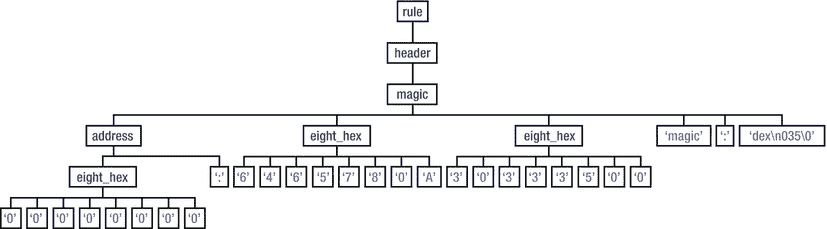

**图 6-1。**??【幻数解析规则】??

既然已经成功解析了幻数，下一步就是以正确的格式输出它。

##### 输出幻数

清单 6-5 用`System.out.println`语句更新。使用`@init`和`@after` ANTLR 语句以正确的顺序打印`<root>`和`<header>`语句。如果您不喜欢解析器中所有多余的 Java 代码，也可以使用 ANTLR `StringTemplate` s 删除所有的`println`语句。

**清单 6-5。** *DexToXML 幻数解析器*

`**grammar** DexToXML;
**options** {language = Java;}
@header {**package** com.riis.decompiler;}
@lexer::header {**package** com.riis.decompiler;}` 
`rule
@init {System.out.println(**"<root>"**);}
@after {System.out.println(**"</root>"**);}
: header
;

header
@init {System.out.println(**"<header>"**);}
@after {System.out.println(**"</header>"**);}
: magic
;

magic: address eight_hex eight_hex *IDENT* ':' id=*MAGIC_NUM*
{System.out.println(**"<magic>"** + id.getText() + **"</magic>"**);}
;` `hex_address: '0x' eight_hex
;

address
: eight_hex ':'
;

eight_hex
: *DIGIT* *DIGIT* *DIGIT* *DIGIT* *DIGIT* *DIGIT* *DIGIT* *DIGIT*
;

*IDENT*: ('a'..'z')+;
*MAGIC_NUM*: 'dex\\n035\\0';
*DIGIT* : ('0'..'9'|'A'..'F');
*WS*: (' ' | '\t' | '\n' | '\r' | '\f' | ',')+ {$channel = HIDDEN;};`

清单 6-6 有从 Eclipse 外部的命令行调用 ANTLR 代码所必需的 Java 代码。这从`c:\temp\input.log`获取输入。

**清单 6-6。**??`DexToXML.java`

`package com.riis.decompiler;

import java.io.*;

import org.antlr.runtime.ANTLRInputStream;
import org.antlr.runtime.CommonTokenStream;
import org.antlr.runtime.RecognitionException;
import org.antlr.runtime.TokenStream;` 

`public class DexToXML {

public static void main(String[] args) throws RecognitionException,
IOException {
DexToXMLLexer lexer = new DexToXMLLexer(new
ANTLRInputStream(System.in));
TokenStream tokenStream = new CommonTokenStream(lexer);
DexToXMLParser parser = new DexToXMLParser(tokenStream);

parser.rule();
}

}`

使用以下命令编译`com\riis\decompiler`目录中的代码，确保 ANTLR v3.4 库在您的类路径中。第一个命令生成 lexer 和解析器，第二个命令编译 DexToXML 代码:

`java org.antlr.Tool DexToXML.g
javac DexToXMLLexer.java DexToXMLParser.java DexToXML.java`

将清单 6-2 保存为`magic.log`，在顶层目录中运行下面的命令，得到如清单 6-7 所示的 DexToXML 输出:

`java com.riis.decompiler.DexToXML < magic.log`

**清单 6-7。** *DexToXML 输出*

`<root>
<header>
<magic>dex\n035\0</magic>
</header>
</root>`

接下来，为报头的其余部分创建语法。最初，您可以设置规则来拆分标题，如清单 6-8 中的所示。

**清单 6-8。** *表头规则*

`header
@init {System.out.println("<header>");}
@after {System.out.println("</header>");}
: magic
checksum
signature
file_size` `header_size
link_size
link_offset
map_offset
string_ids_size
string_ids_offset
type_ids_size
type_ids_offset
proto_ids_size
proto_ids_offset
fields_ids_size
fields_ids_offset
method_ids_size
method_ids_offset
class_defs_size
class_defs_offset
data_size
data_offset
;`

但是许多模式是重复的——例如，大小和偏移量非常相似，所以您可以通过提取节点的名称来重构解析器。你可以把这些模式放在一起，如清单 6-9 所示，它匹配不同的头条目。

**清单 6-9。**重构了`header_entry`规则

`header_entry
: address eight_hex *IDENT*
| address eight_hex xml_id ':' hex_address
| address eight_hex eight_hex xml_id ':' hex_address
;`

将这些代码放到修改后的解析器中，您会得到清单 6-10 中所示的完整头部。

**清单 6-10。** *重构的 DexToXML 头语法*

`grammar DexToXML;
options {language = Java;}
@header {package com.riis.decompiler;}
@lexer::header {package com.riis.decompiler;}

rule
: header
;

header` `: magic
header_entry
signature
header_entry+
;

magic: address eight_hex eight_hex *IDENT* ':' *MAGIC_NUM*
;

header_entry
: address eight_hex *IDENT*
| address eight_hex xml_id ':' hex_address
| address eight_hex eight_hex xml_id ':' hex_address
;

xml_id
: *IDENT IDENT*
| *IDENT IDENT IDENT*
;

signature: address signature_hex 'signature'` `;` 
`signature_hex: eight_hex eight_hex eight_hex eight_hex eight_hex
;

hex_address: '0x' eight_hex
;

address
: eight_hex ':'
;

eight_hex
: *DIGIT* *DIGIT* *DIGIT* *DIGIT* *DIGIT* *DIGIT* *DIGIT* *DIGIT*
;

*IDENT*: ('a'..'z')+;
*MAGIC_NUM*: 'dex\\n035\\0';
*DIGIT* : ('0'..'9'|'A'..'F');
*WS*: (' ' | '\t' | '\n' | '\r' | '\f' | ',')+ {$channel = HIDDEN;};`

清单 6-11 中的解析了文件的更多内容，一直到`code_item`部分。我还包含了输出 XML 的代码，所以您可以看到这是如何完成的。

**清单 6-11。** *DexToXML ANTLR 语法*

`grammar DexToXML;

options {
language = Java;
}

@header {
package com.riis.decompiler;
}

@lexer::header {
package com.riis.decompiler;
}

rule
@init {System.out.println("<root>");}
@after {System.out.println("</root>");}
: header
string_ids
type_ids
proto_ids
field_ids
method_ids
class_defs
data` `;` 
`header
@init {System.out.println("<header>");}
@after {System.out.println("</header>");}
: magic
header_entry
signature
header_entry+
;

magic: address eight_hex eight_hex *IDENT* ':' id=*MAGIC_NUM*
{System.out.println("<magic>" + id.getText() +
"</magic>");}
;

header_entry
: address id1=eight_hex id2=*IDENT*
{System.out.println("<" + $id2.text + ">" + $id1.text
+ "</" + $id2.text + ">");}
| address eight_hex id3=xml_id ':' id4=hex_address
{System.out.println("<" + $id3.result + ">" +
$id4.text + "</" + $id3.result + ">");}
| address eight_hex eight_hex id5=xml_id ':'
id6=hex_address
{System.out.println("<" + $id5.result + ">" +
$id6.text + "</" + $id5.result + ">");}
;

xml_id returns [String result]
: id1=*IDENT* id2=*IDENT*
{$result = id1.getText() + "_" + id2.getText();}
| id1=*IDENT* id2=*IDENT* id3=*IDENT*
{$result = id1.getText() + "_" + id2.getText() + "_"
+ id3.getText();}
;

signature: address id=signature_hex 'signature'
{System.out.println("<signature>" + $id.text +
"</signature>");}
;

signature_hex: eight_hex eight_hex eight_hex eight_hex eight_hex
;

string_ids
@init {System.out.println("<string_ids>");}
@after {System.out.println("</string_ids>");}
: string_address+
;` 
`string_address
: address eight_hex *IDENT* id1=array_digit ':' 'at'
id2=hex_address
{System.out.println("<string>\n<id>" + $id1.result +` 
`"</id>\n<address>" + $id2.text + "</address>\n</string>");}
;

type_ids
@init {System.out.println("<type_ids>");}
@after {System.out.println("</type_ids>");}
: type_address+
;

type_address
: address eight_hex *IDENT* id1=array_digit 'index:'
id2=eight_hex '(' id3=proto_type_string ')'
{int addr = Integer.parseInt($id2.text,16);
System.out.println("<type>\n<id>" + $id1.result +
"</id>\n<string_id>"
+ addr + "</string_id>\n<string>"
+ $id3.text + "<string>\n</type>");}
;

proto_ids
@init {System.out.println("<proto_ids>");}
@after {System.out.println("</proto_ids>");}
: proto_address+
;

proto_address
: address eight_hex eight_hex eight_hex *IDENT*
id1=array_digit ':'
'short signature:' id2=proto_type_string ';'
'return type:' id3=proto_type_string ';'
'parameter block offset:' eight_hex
{System.out.println("<proto>\n<id>" + $id1.result +
"</id>\n<string>"
+ $id3.text + "</string>\n<signature>" + $id2.text +
"<signature>\n</proto>");}
;

field_ids
@init {System.out.println("<field_ids>");}
@after {System.out.println("</field_ids>");}
: field_address+
;

field_address
: address eight_hex eight_hex *IDENT* id1=array_digit ':'
id2=proto_type_string id3=proto_type_string
{System.out.println("<field>\n<id>" + $id1.result +
"</id>\n<name>"
+ $id2.text + "</name>\n<type>" + $id3.text +` 
`"<type>\n</field>");}

;

method_ids
@init {System.out.println("<method_ids>");}
@after {System.out.println("</method_ids>");}
: method_address+
;

method_address
: address eight_hex eight_hex *IDENT* id1=array_digit ':'
id2=proto_type_string '(' id3=proto_type_string ')'
{System.out.println("<method>\n<id>" + $id1.result +
"</id>\n<name>"
+ $id2.text + "</name>\n<proto>" + $id3.text +
"<proto>\n</method>");}
;

class_defs
@init {System.out.println("<classes>");}
@after {System.out.println("</classes>");}
: class_address+
;

class_address
: address id1=eight_hex id2=eight_hex id3=eight_hex
id4=eight_hex id5=eight_hex id6=eight_hex id7=eight_hex
id8=eight_hex id9=*IDENT* id10=*IDENT*
{System.out.println("<class>\n"
+"<class_id>" + $id9.text + " " +
$id10.text + "</class_id>\n"
+"<type_id>" + $id1.text +
"</type_id>\n"

+"<access_flags>" + $id2.text +
"</access_flags>\n"
+"<superclass_id>" + $id3.text +
"<superclass>\n"
+"<interfaces_offset>" + $id4.text +
"<interfaces_offset>\n"
+"<source_file_id>" + $id5.text +
"<source_file_id>\n"
+"<annotations_offset>" + $id6.text +
"<annotations_offset>\n"
+"<class_data_offset>" + $id7.text +
"<class_data_offset>\n"
+"<static_values_offset>" + $id8.text +` `+"<static_values_offset>\n" +
"</class>");}
;

data
@init {System.out.println("<data>");}
@after {System.out.println("</data>");}
: class_+
;

class_
@init {System.out.println("<class>");}
@after {System.out.println("</class>");}
: class_data_items
;

class_data_items
@init {System.out.println("<class_data_items>");}
@after {System.out.println("</class_data_items>");}
: class_data_item
;

class_data_item
@init {System.out.println("<class_data_item>");}
@after {System.out.println("</class_data_item>");}
: class_data_item_header static_fields //instance_methods
direct_methods // virtual_methods
encoded_arrays
;

class_data_item_header
: address *HEX_DOUBLE* 'static fields size:' id1=*DIGIT*
address *HEX_DOUBLE* 'instance fields size:' id2=*DIGIT*
address *HEX_DOUBLE* 'direct methods size:' id3=*DIGIT*
address *HEX_DOUBLE* 'virtual methods size:' id4=*DIGIT*
{System.out.println("<static_field_size>" +
$id1.getText()
+ "</static_field_size>\n"
+"<instance_field_size>" + $id2.getText() +
"</instance_field_size>\n"
+"<direct_methods_size>" + $id3.getText() +
"</direct_methods_size>\n"
+"<virtual_methods_size>" + $id4.getText() +
"</virtual_methods_size>");}
;

static_fields
@init {System.out.println("<static_fields>");}
@after {System.out.println("</static_fields>");}` `: static_field+
;

static_field
@init {System.out.println("<static_field>");}
@after {System.out.println("</static_field>");}
: address id1=*HEX_DOUBLE* id2=*HEX_DOUBLE*
{System.out.println("<field_id>" + $id1.getText() +
"</field_id>\n"
+"<access_flags>" + $id2.getText() +
"</access_flags>");}
;

direct_methods
@init {System.out.println("<direct_methods>");}
@after {System.out.println("</direct_methods>");}
: direct_method+
;

direct_method
@init {System.out.println("<direct_method>");}
@after {System.out.println("</direct_method>");}
: address id1=*HEX_DOUBLE* id2=*HEX_DOUBLE*
id3=*HEX_DOUBLE* id4=*HEX_DOUBLE* id5=*HEX_DOUBLE* id6=*HEX_DOUBLE*
{System.out.println("<method_id>" + $id1.getText() +
"</method_id>\n"
+"<access_flags>" + $id2.getText() + $id3.getText()
+ $id4.getText()
+ "</access_flags>\n"
+"<address>0x" + $id5.getText() + $id6.getText() +
"</address>");}
| address id1=*HEX_DOUBLE* id2=*HEX_DOUBLE* id3=*HEX_DOUBLE*
id4=*HEX_DOUBLE*
{System.out.println("<method_id>" + $id1.getText() +
"</method_id>\n"
+"<access_flags>" + $id2.getText() +
"</access_flags>\n"
+"<address>0x" + $id3.getText() +
$id4.getText() + "</address>");}
;

encoded_arrays
: address *HEX_DOUBLE* 'array item count:' *DIGIT*
encoded_array+
;

encoded_array
: address *HEX_DOUBLE* *HEX_DOUBLE* *IDENT* *IDENT* array_digit ':'
'"' *IDENT* '"'` `;

proto_type_string
: *IDENT*
| *IDENT* ';'
| *IDENT* '.' *IDENT*
| *IDENT* '/' *IDENT*
| *IDENT* '/' '<' *IDENT* '>'
| '<' *IDENT* '>' '()' *IDENT*
| *IDENT* '/' *IDENT* '/' *IDENT* ';'
| '[' *IDENT* '/' *IDENT* '/' *IDENT* ';'
| *IDENT* '()' *IDENT* '/' *IDENT* '/' *IDENT* ';'

| *IDENT* '/' *IDENT* '/' *IDENT* '.' *IDENT*
| *IDENT* '/' *IDENT* '/' *IDENT* '/' *IDENT*

| *IDENT* '/' *IDENT* '/' *IDENT* '/' '<' *IDENT* '>'
| *IDENT* '(' *IDENT* '/' *IDENT* '/' *IDENT* ';' ')' *IDENT*
| *IDENT* '(' '[' *IDENT* '/' *IDENT* '/' *IDENT* ';' ')' *IDENT*
| *IDENT* '(' *IDENT* ')' *IDENT* '/' *IDENT* '/' *IDENT* ';'
| *IDENT* '(' *IDENT* '/' *IDENT* '/' *IDENT* ';' ')' *IDENT* '/'
*IDENT* '/' *IDENT* ';'

hex_address: '0x' eight_hex
;

address
: eight_hex ':'
;

eight_hex
: *HEX_DOUBLE* *HEX_DOUBLE* *HEX_DOUBLE* *HEX_DOUBLE*
;

array_digit returns [String result]
: id=*ELEMENT*
{String str = id.getText(); $result =
str.substring(1, str.length()-1);}
;

*HEX_DOUBLE*:
('0'..'9')('0'..'9')|('0'..'9')('A'..'F')|('A'..'F')('0'..'9')|('A
'..'F')('A'..'F');
*MAGIC_NUM*: 'dex\\n035\\0';
*IDENT*: ('a'..'z'|'A'..'Z')+;
*DIGIT*: ('0'..'9');
*ELEMENT*: ('[')('0'..'9')+(']');
*CONST_4*: 'const/4';` `*CONST_16*: 'const/16';
*CONST_HIGH_16*: 'const/high16';
*COMMENT*: '//' ~( '\r' | '\n' )* {$channel = HIDDEN;};
*WS*: (' ' | '\t' | '\n' | '\r' | '\f' | ',' | '-' | '*')+ {$channel = HIDDEN;};`

清单 6-12 显示了来自清单 6-11 的语法的 XML 输出。这并不包括所有的 XML 节点，因为我们已经在第三章中介绍过了，而且篇幅很长..解析所有`classes.dex`文件而不仅仅是`Casting.java`的更大更完整的 DexToXML 可以在 Apress 网站(`[www.apress.com](http://www.apress.com)`)的源代码中找到。

**清单 6-12。** *DexToXML 输出*

`<root>
<header>
<magic>dex\n035\0</magic>
<checksum>62 8B 44 18</checksum>
<signature>DA A9 21 CA 9C 4F B4 C5
21 D7 77 BC
2A 18 4A 38
0D A2 AA FE</signature>
<file_size>0x00000450</file_size>
<header_size>0x00000070</header_size>
<link_size>0x00000000</link_size>
<link_offset>0x00000000</link_offset>
<map_offset>0x000003A4</map_offset>
<string_ids_size>0x0000001A</string_ids_size>
<string_ids_offset>0x00000070</string_ids_offset>
<type_ids_size>0x0000000A</type_ids_size>
<type_ids_offset>0x000000D8</type_ids_offset>
<proto_ids_size>0x00000007</proto_ids_size>
<proto_ids_offset>0x00000100</proto_ids_offset>
<field_ids_size>0x00000003</field_ids_size>
<field_ids_offset>0x00000154</field_ids_offset>
<method_ids_size>0x00000009</method_ids_size>
<method_ids_offset>0x0000016C</method_ids_offset>
<class_defs_size>0x00000001</class_defs_size>
<class_defs_offset>0x000001B4</class_defs_offset>
<data_size>0x0000027C</data_size>
<data_offset>0x000001D4</data_offset>
</header>
<string_ids>
<string>
<id>0</id>
<address>0x00000272</address>
</string>
<string>
<id>1</id>` `<address>0x0000027F</address>
</string>
<string>
<id>2</id>
<address>0x00000287</address>
</string>
<string>
<id>3</id>
<address>0x0000028A</address>
</string>
<string>
<id>4</id>
<address>0x00000298</address>
</string>
<string>
<id>5</id>
<address>0x0000029B</address>
</string>
<string>
<id>6</id>
<address>0x0000029E</address>
</string>
<string>
<id>7</id>
<address>0x000002A2</address>
</string>
<string>
<id>8</id>
<address>0x000002AD</address>
</string>
<string>
<id>9</id>
<address>0x000002B1</address>
</string>
<string>
<id>10</id>
<address>0x000002B5</address>
</string>
<string>
<id>11</id>
<address>0x000002CC</address>
</string>
<string>
<id>12</id>
<address>0x000002E0</address>
</string>
<string>
<id>13</id>
<address>0x000002F4</address>` `</string>
<string>
<id>14</id>
<address>0x0000030F</address>
</string>
<string>
<id>15</id>
<address>0x00000323</address>
</string>
<string>
<id>16</id>
<address>0x00000326</address>
</string>
<string>
<id>17</id>
<address>0x0000032A</address>
</string>
<string>
<id>18</id>
<address>0x0000033F</address>
</string>
<string>
<id>19</id>
<address>0x00000347</address>
</string>
<string>
<id>20</id>
<address>0x0000034F</address>
</string>
<string>
<id>21</id>
<address>0x00000357</address>
</string>
<string>
<id>22</id>
<address>0x0000035F</address>
</string>
<string>
<id>23</id>
<address>0x00000365</address>
</string>
<string>
<id>24</id>
<address>0x0000036A</address>
</string>
<string>
<id>25</id>
<address>0x00000373</address>
</string>` `</string_ids>
<type_ids>
<type>
<id>0</id>
<string_id>2</string_id>
<string>C<string>
</type>
<type>
<id>1</id>
<string_id>4</string_id>
<string>I<string>
</type>
<type>
<id>2</id>
<string_id>7</string_id>
<string>LCasting;<string>
</type>
<type>
<id>3</id>
<string_id>10</string_id>
<string>Ljava/io/PrintStream;<string>
</type>
<type>
<id>4</id>
<string_id>11</string_id>
<string>Ljava/lang/Object;<string>
</type>
<type>
<id>5</id>
<string_id>12</string_id>
<string>Ljava/lang/String;<string>
</type>
<type>
<id>6</id>
<string_id>13</string_id>
<string>Ljava/lang/StringBuilder;<string>
</type>
<type>
<id>7</id>
<string_id>14</string_id>
<string>Ljava/lang/System;<string>
</type>
<type>
<id>8</id>
<string_id>15</string_id>
<string>V<string>
</type>
<type>
<id>9</id>` `<string_id>17</string_id>
<string>Ljava/lang/String;<string>
</type>
</type_ids>
<proto_ids>
<proto>
<id>0</id>
<string>Ljava/lang/String;</string>
<signature>L<signature>
</proto>
<proto>
<id>1</id>
<string>Ljava/lang/StringBuilder;</string>
<signature>LC<signature>
</proto>
<proto>
<id>2</id>
<string>Ljava/lang/StringBuilder;</string>
<signature>LI<signature>
</proto>
<proto>
<id>3</id>
<string>Ljava/lang/StringBuilder;</string>
<signature>LL<signature>
</proto>
<proto>
<id>4</id>
<string>V</string>
<signature>V<signature>
</proto>
<proto>
<id>5</id>
<string>V</string>
<signature>VL<signature>
</proto>
<proto>
<id>6</id>
<string>V</string>
<signature>VL<signature>
</proto>
</proto_ids>
<field_ids>
<field>
<id>0</id>
<name>Casting.ascStr</name>
<type>Ljava/lang/String;<type>
</field>
<field>
<id>1</id>` `<name>Casting.chrStr</name>
<type>Ljava/lang/String;<type>
</field>
<field>
<id>2</id>
<name>java/lang/System.out</name>
<type>Ljava/io/PrintStream;<type>
</field>
</field_ids>
</root>`

### 地塞米松资源

为了实现 Android 反编译器 DexToSource，这一节看三个例子，说明代码是如何编译到`classes.dex`文件中的；然后将它逆向工程回 Java，并编写 ANTLR 解析器来自动化这个过程。这三个例子是来自[第二章和第三章的`Casting.java`代码；Hello World 安卓；以及来自 WordPress Android 应用(一个开源 Android 应用)的`if`声明，可在`[`android.svn.wordpress.org/trunk/src/org/wordpress/android/`](http://android.svn.wordpress.org/trunk/src/org/wordpress/android/)`获得。

对每个例子的分析都从原始字节码开始，然后分解并解析成类似于原始 Java 源代码的东西。在分离字节码时，有两个资源非常有用:Google 在`[www.netmite.com/android/mydroid/dalvik/docs/dalvik-bytecode.html](http://www.netmite.com/android/mydroid/dalvik/docs/dalvik-bytecode.html)`为 Dalvik 虚拟机(DVM)提供的字节码；Gabor Paller 在他的博客中发表了精彩的“Dalvik 操作码”论文，你可以在`[`pallergabor.uw.hu/androidblog/dalvik_opcodes.html`](http://pallergabor.uw.hu/androidblog/dalvik_opcodes.html)`找到。

### 例 1:Casting.java

每个例子都从原始 Java 代码开始，然后是您想要从`classes.dex`逆向工程的字节码、解析器，最后是逆向工程的 Java 源代码。关于`Casting.java`代码，参见清单 6-13 。

**清单 6-13。**??`Casting.java`

`public class Casting {

static final String ascStr = "ascii ";
static final String chrStr = " character ";

public static void main(String args[]){

for(char c=0; c < 128; c++) {
System.out.println(ascStr + (int)c + chrStr + c);
}
}
}`

将`Casting.java`编译成`classes.dex`并通过 dedexer 运行它会产生如清单 6-14 所示的字节码。

**清单 6-14。***`Casting.ddx`*

`.class public Casting
.super java/lang/Object
.source Casting.java

.field static final ascStr Ljava/lang/String; = "ascii "
.field static final chrStr Ljava/lang/String; = " character "

.method public <init>()V
.limit registers 1
; this: v0 (LCasting;)
.line 1
invoke-direct {v0},java/lang/Object/<init> ; <init>()V
return-void
.end method

.method public static main([Ljava/lang/String;)V
.limit registers 5
; parameter[0] : v4 (Ljava/lang/String;)
.line 8
const/4 v0,0
l1fe:
const/16 v1,128
if-ge v0,v1,l252
.line 9
sget-object v1,java/lang/System.out
Ljava/io/PrintStream;
new-instance v2,java/lang/StringBuilder
invoke-direct {v2},java/lang/StringBuilder/<init> ;
<init>()V
const-string v3,"ascii "
invoke-virtual
{v2,v3},java/lang/StringBuilder/append ;
append(Ljava/lang/String;)Ljava/lang/StringBuilder;
move-result-object v2
invoke-virtual
{v2,v0},java/lang/StringBuilder/append ;
append(I)Ljava/lang/StringBuilder;
move-result-object v2
const-string v3," character "
invoke-virtual
{v2,v3},java/lang/StringBuilder/append ;
append(Ljava/lang/String;)Ljava/lang/StringBuilder;
move-result-object v2
invoke-virtual
{v2,v0},java/lang/StringBuilder/append ;
append(C)Ljava/lang/StringBuilder;
move-result-object v2` `invoke-virtual
{v2},java/lang/StringBuilder/toString ;
toString()Ljava/lang/String;
move-result-object v2
invoke-virtual {v1,v2},java/io/PrintStream/println
; println(Ljava/lang/String;)V
.line 8
add-int/lit8 v0,v0,1
int-to-char v0,v0
goto l1fe
l252:
.line 11
return-void
.end method`

#### 字节码分析

在开始编写解析器之前，您需要理解字节码。[表 6-1 显示了原始字节码以及相应的操作码和操作数，以及程序计数器(PC)、v0、v1、v2 和 v3 DVM 寄存器中的运行计数。

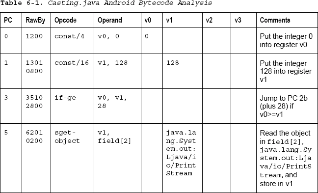
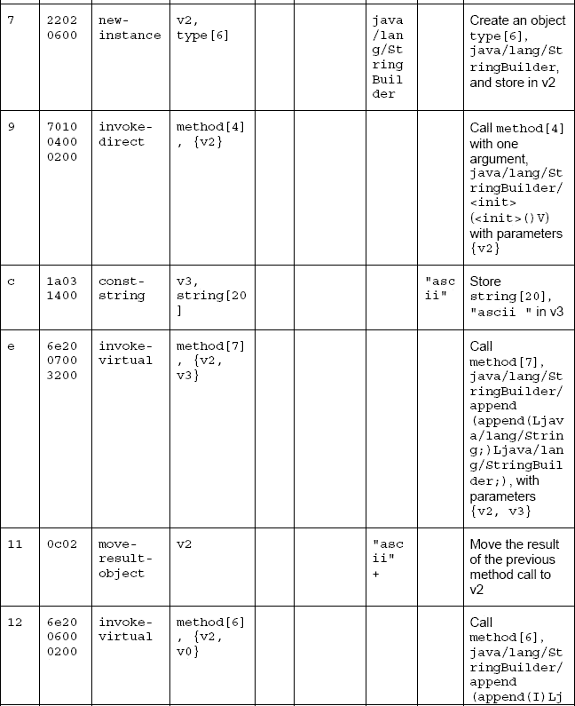
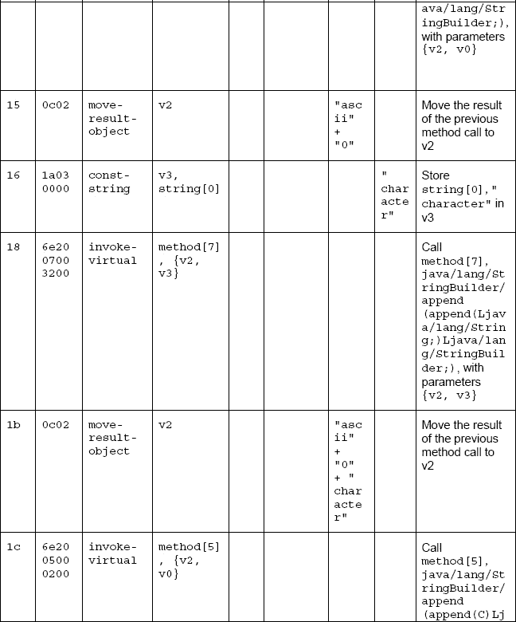
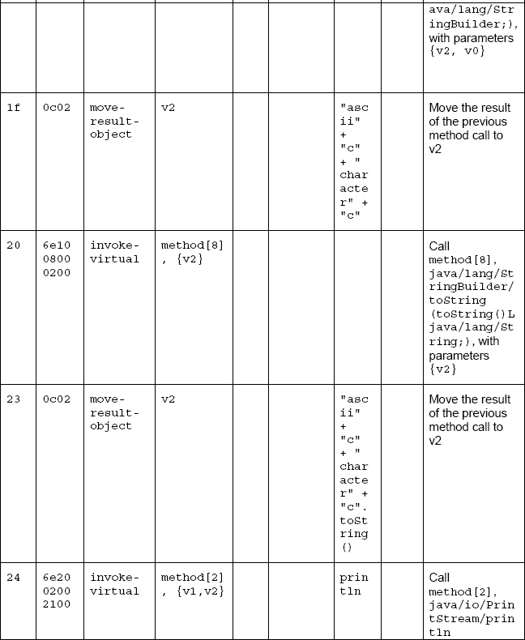
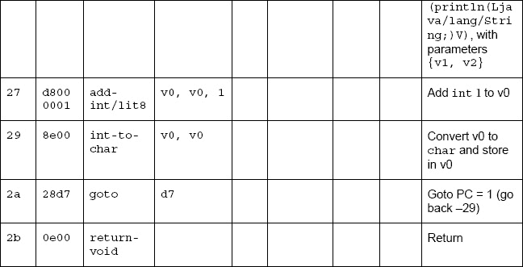

#### 解析器

Java 代码的大部分外壳，比如类名、字符串名、方法名、字段名等等，见`Casting.ddx`文件。6-14 中的清单可以使用清单 6-15 中的解析器进行转换。输出如清单 6-16 中的所示。

**清单 6-15。** *`Casting.java`没有字节码解析器*

`grammar DexToSource;

options {language = Java;}
@header {package com.riis.decompiler;}
@lexer::header {package com.riis.decompiler;}
@members{String flag_result = "";}

rule
@after {System.out.println("}");}
: class_name super_ source fields methods+
;

class_name
: *CLASS* f1=flags id2=*IDENT*
{System.out.println($f1.text + " class " + $id2.text
+ " {");}` `;

super_: *SUPER* package_;
source: *SOURCE* *IDENT* '.java';

fields: field+ ;

methods: method_start method_end;

field: *FIELD* f1=flags id2=*IDENT* p1=package_ ';' '=' '"' id4=*IDENT*
'"'
{System.out.println($f1.text + " " + $p1.result + " " +
$id2.text + " = \"" + $id4.text + "\"" );}
;

method_start: *METHODSTRT* f1=flags *INIT* p1=params r1=return_
{System.out.println($f1.text + " " + $r1.result + " init "
+ $p1.result + " {");}
| *METHODSTRT* f1=flags id1=*IDENT* p1=params r1=return_
{System.out.println($f1.text + " " + $r1.result + " " +
$id1.text + " (" + $p1.result + ") {");}
;

method_end
@after {System.out.println("}");}
: *METHODEND*
;

flags: flag+;

flag returns [String flag_result]
: f1='public' {flag_result += $f1.text;}
| f1='static' {flag_result += $f1.text;}
| f1='final' {flag_result += $f1.text;}
;

params returns [String result]
: '(' ')' {$result = "()";}
| '(' '[L' id1=package_ ';' ')' {$result = $id1.result + "
args[]";} //([Ljava/lang/String;)
;

package_ returns [String result]
: *IDENT* '/' *IDENT* '/' id1=*IDENT* {$result = id1.getText();}
;

return_ returns [String result]
: 'V' {$result = "void";}` `;

*CLASS*: '.class';
*PUBLIC*: 'public';
*STATIC*: 'static';
*FINAL*: 'final';
*SUPER*: '.super';
*SOURCE*: '.source';
*FIELD*: '.field';
*METHODSTRT*: '.method';
*METHODEND*: '.end method';
*INIT*: '<init>';
*IDENT*: ('a'..'z'|'A'..'Z')+;
*COMMENT*: '//' ~( '\r' | '\n' )* {$channel = HIDDEN;};
*WS*: (' ' | '\t' | '\n' | '\r' | '\f' | ',')+ {$channel = HIDDEN;};`

在解析任何字节码之前，文件的结构如清单 6-16 所示。

**清单 6-16。** *`Casting.java`不带 Pytecode*

`public class Casting {
static final String ascStr = "ascii"
static final String chrStr = "character"
public void init () {
}
public static void main (String args[]) {
}
}`

但是 Java 代码的核心逻辑在 DDX 文件末尾的操作码中。看表 6-1 ，操作码如何映射到目标 Java 代码`Casting.java`应该更清楚了；参见清单 6-13 ，这是你在整本书中一直使用的。

方法代码有两部分:`for`循环和`for`循环中的`System.out.println`语句。从解析器的角度来看，您可以创建`for`循环，如清单 6-17 所示。注意，保留的关键字如`return`有一个下划线，所以生成的 ANTLR 代码编译时没有任何错误。

**清单 6-17。** *`for`循环解析器*

`rule: class_name super_ source fields methods+ ;

class_name : CLASS flags IDENT ;

super_: SUPER package_;` 
`source: SOURCE IDENT '.java';

fields: field+ ;

field: FIELD flags IDENT package_ ';' '=' '"' IDENT '"';

methods: method_start scrap* method_end
| method_start scrap* for_start for_body scrap* for_end
method_end
;

method_start: METHODSTRT flags INIT params return_
| METHODSTRT flags IDENT params return_
;

method_end: METHODEND;

for_start : put_in_reg label put_in_reg if_ge scrap*;

const_string: CONST_STRING reg ddx_string;

ddx_string: '"' IDENT '"';

for_end : add_int int_to_char goto_ label scrap*;

new_instance: NEW_INSTANCE reg package_ scrap*;

add_int: ADD_INT reg reg DIGIT;

int_to_char: INT_TO_CHAR reg reg;

goto_: GOTO label;

if_ge: IF_GE reg reg label;

put_in_reg: const_ reg DIGIT;

reg_args: '{' reg+ '}';

label: LABEL
| LABEL ':'
;

invoke_direct: INVOKE_DIRECT regs package_ ;

flags: flag+;

flag : f1='public'` `| f1='static'
| f1='final'
;

params : '(' ')'
| '(' '[L' package_ ';' ')'
| '(' IDENT ';' ')'
| IDENT '(' package_ ';' ')'
| IDENT '(' IDENT ')'
| IDENT '(' ')'
;

package_
: IDENT '/' IDENT '/' IDENT
| IDENT '/' IDENT '/' IDENT '/' IDENT
| IDENT '/' IDENT '/' IDENT '.' IDENT
| IDENT '/' IDENT '/' IDENT '/' '<init>'
| 'L' IDENT '/' IDENT '/' IDENT
;

return_ : 'V';

regs: '{' reg+ '}';

reg : 'v' DIGIT;

const_ : CONST_4
| CONST_16
| CONST_HIGH_16
;

scrap: LIMIT REGISTERS DIGIT
| ';' 'this:' reg params
| LINE DIGIT+
| invoke_direct ';' '<init>' params return_
| RETURN_VOID
| ';' 'parameter[' DIGIT ']' ':' reg params
;

CLASS: '.class';
PUBLIC: 'public';
STATIC: 'static';
FINAL: 'final';
SUPER: '.super';
SOURCE: '.source';
FIELD: '.field';
METHODSTRT: '.method';
METHODEND: '.end method';
INIT: '<init>';` `LIMIT: '.limit';
REGISTERS: 'registers';
LINE: '.line';
INVOKE_DIRECT: 'invoke-direct';
RETURN_VOID: 'return-void';
IF_GE: 'if-ge';
ADD_INT: 'add-int/lit8';
INT_TO_CHAR: 'int-to-char';
GOTO: 'goto';
CONST_STRING: 'const-string';
CONST_4: 'const/4';
CONST_16: 'const/16';
CONST_HIGH_16: 'const/high16';
DIGIT: ('0'..'9')+;
IDENT: ('a'..'z'|'A'..'Z')+;
LABEL: 'l' ('0'..'9'|'a'..'f')('0'..'9'|'a'..'f')('0'..'9'|'a'..'f');
COMMENT: '//' ~( '\r' | '\n' )* {$channel = HIDDEN;};
WS: (' ' | '\t' | '\n' | '\r' | '\f' | ',')+ {$channel = HIDDEN;};`

lexer 标记是大写的，解析器规则是小写的。`for_start`是一个大于或等于条件，后跟一个标签，如果条件为真，则跳转到该标签。正如您在细分表中看到的，`for_end`规则给变量`c`加 1，然后跳回到`for_start`条件。注意，这不是通用的:它不适用于任何其他 for 循环。我展示它是为了让您了解如何组装解析器。

接下来，您需要为`System.out.println`或`for_body`语句添加解析器代码，将它们放在`for_loop`规则的`for_start`和`for_end`部分之间；参见清单 6-18 。

**清单 6-18。** *`Casting.java`解析器*

`for_body: sget stmt_builder invoke_virtual;

stmt_builder returns : new_instance invoke_move+;

invoke_move
: invoke_virtual move_result
| const_string invoke_virtual move_result
;` 
`move_result: MOVE_RESULT_OBJECT reg;

const_string: CONST_STRING reg ddx_string;

ddx_string: '"' IDENT '"';

new_instance: NEW_INSTANCE reg package_ scrap*;

sget : SGET_OBJECT reg package_ package_ ';';

invoke_virtual
: INVOKE_VIRTUAL reg_args package_ ';' params 'V'
| INVOKE_VIRTUAL reg_args package_ ';' params package_ ';'
;`

现在可以解析操作码了，您可以添加自己的`println`语句来输出 Java 代码；参见清单 6-19 。尽管这个清单很长，但它是所提供的最完整的解析器之一，因此完整地回顾它是很重要的。

**清单 6-19。** *`Casting.ddx`解析器*

`grammar DexToSource;

options {language = Java;}
@header {package com.riis.decompiler;}
@lexer::header {package com.riis.decompiler;}
@members{String flag_result = "";}

rule
@after {System.out.println("}");}
: class_name super_ source fields methods+
;

class_name
: *CLASS* f1=flags id2=*IDENT*
{System.out.println($f1.text + " class " + $id2.text
+ " {");}
;

super_: *SUPER* package_;
source: *SOURCE* *IDENT* '.java';
fields: field+ ;

field: *FIELD* f1=flags id2=*IDENT* p1=package_ ';' '=' '"' id4=*IDENT*
'"'
{System.out.println($f1.text + " " + $p1.result + " " +
$id2.text + " = \"" + $id4.text + "\"" );}
;` 
`methods: method_start scrap* method_end
| method_start scrap* for_start for_body scrap* for_end
method_end
;

method_start: *METHODSTRT* f1=flags *INIT* p1=params r1=return_
{System.out.println($f1.text + " " + $r1.result + " init "
+ $p1.result + " {");}
| *METHODSTRT* f1=flags id1=*IDENT* p1=params r1=return_
{System.out.println($f1.text + " " + $r1.result + " " +
$id1.text + " (" + $p1.result + ") {");}
;

method_end
@after {System.out.println("}");}
: *METHODEND*

for_start : id1=put_in_reg label id2=put_in_reg if_ge scrap*
{System.out.println("for(a=" + $id1.result + "; a < "
+ $id2.result + "; a++){");}
;

for_body: id1=sget id3=stmt_builder id2=invoke_virtual
{System.out.println($id1.result + "." + $id2.result +
"(" + $id3.result);}
;

stmt_builder returns [String result]
: new_instance id1=invoke_move id2=invoke_move
id3=invoke_move
id4=invoke_move id5=invoke_move
{$result = "\"" + $id1.result + "\" + " + $id2.result + " + \"" +
$id3.result + "\" +" + $id4.result + ")";}
;

invoke_move returns [String result]
: id1=invoke_virtual move_result
{$result = $id1.result;}
| id1=const_string invoke_virtual move_result
{$result = $id1.result;}
;

move_result: *MOVE_RESULT_OBJECT* reg
;

const_string returns [String result]` `: *CONST_STRING* reg id1=ddx_string {$result = $id1.result;}
;

ddx_string returns [String result]
: '"' id1=*IDENT* '"' {$result = $id1.getText();}
;

for_end : add_int int_to_char goto_ label scrap*
{System.out.println("}");}
;

new_instance: *NEW_INSTANCE* reg package_ scrap*;

sget returns [String result]
: *SGET_OBJECT* reg id1=package_ id2=package_ ';' {$result =
$id1.result;}
;

invoke_virtual returns [String result]
: *INVOKE_VIRTUAL* reg_args id1=package_ ';' params 'V'
{$result = $id1.result;}
| *INVOKE_VIRTUAL* reg_args package_ ';' id1=params package_
';' {if ($id1.result.compareTo("I") == 0) { $result = "(int)a"; }
else {$result = "(char)a";}}
;

add_int: *ADD_INT* reg reg *DIGIT*
;

int_to_char: *INT_TO_CHAR* reg reg
;

goto_: *GOTO* label
;

if_ge: *IF_GE* reg reg label
;

put_in_reg returns [String result]
: const_ reg id1=*DIGIT* {$result = $id1.getText();}
;

reg_args: '{' reg+ '}'
;

label: *LABEL*
| *LABEL* ':'
;` 
`invoke_direct: *INVOKE_DIRECT* regs package_
;

flags: flag+;

flag returns [String flag_result]
: f1='public' {flag_result += $f1.text;}
| f1='static' {flag_result += $f1.text;}
| f1='final' {flag_result += $f1.text;}
;

params returns [String result]
: '(' ')' {$result = "()";}
| '(' '[L' id1=package_ ';' ')' {$result = $id1.result + "
args[]";}
| '(' id2=*IDENT* ';' ')' {$result = $id2.getText();}

| *IDENT* '(' id3=package_ ';' ')' {$result=$id3.result;}

| *IDENT* '(' id4=*IDENT* ')' {$result = $id4.getText();}

| *IDENT* '(' ')' {$result = "()";}
;

package_ returns [String result]
: *IDENT* '/' *IDENT* '/' id1=*IDENT* {$result =
id1.getText();}
| *IDENT* '/' *IDENT* '/' *IDENT* '/' id1=*IDENT* {$result =
id1.getText();}
| *IDENT* '/' *IDENT* '/' id1=*IDENT* '.' id2=*IDENT*{$result =
id1.getText() + "." + id2.getText();}
| *IDENT* '/' *IDENT* '/' *IDENT* '/' '<init>' {$result =
"init";}
| 'L' *IDENT* '/' *IDENT* '/' id1=*IDENT* {$result =
$id1.getText();}
;

return_ returns [String result]
: 'V' {$result = "void";}
;

regs: '{' reg+ '}';

reg : 'v' *DIGIT*;

const_ : *CONST_4*
| *CONST_16*` `| *CONST_HIGH_16*
;

scrap: *LIMIT* *REGISTERS* *DIGIT*
| ';' 'this:' reg params
| *LINE* *DIGIT*+
| invoke_direct ';' '<init>' params return_
| *RETURN_VOID*
| ';' 'parameter[' *DIGIT* ']' ':' reg params
;

*CLASS*: '.class';
*PUBLIC*: 'public';
*STATIC*: 'static';
*FINAL*: 'final';
*SUPER*: '.super';
*SOURCE*: '.source';
*FIELD*: '.field';
*METHODSTRT*: '.method';
*METHODEND*: '.end method';
*INIT*: '<init>';
*LIMIT*: '.limit';
*REGISTERS*: 'registers';
*LINE*: '.line';
*INVOKE_DIRECT*: 'invoke-direct';
*INVOKE_VIRTUAL*: 'invoke-virtual';
*MOVE_RESULT_OBJECT*: 'move-result-object';
*NEW_INSTANCE*: 'new-instance';
*RETURN_VOID*: 'return-void';
*IF_GE*: 'if-ge';
*SGET_OBJECT*: 'sget-object';
*ADD_INT*: 'add-int/lit8';
*INT_TO_CHAR*: 'int-to-char';
*GOTO*: 'goto';
*CONST_STRING*: 'const-string';
*CONST_4*: 'const/4';
*CONST_16*: 'const/16';
*CONST_HIGH_16*: 'const/high16';
*DIGIT*: ('0'..'9')+;
*IDENT*: ('a'..'z'|'A'..'Z')+;
*LABEL*: 'l' ('0'..'9'|'a'..'f')('0'..'9'|'a'..'f')('0'..'9'|'a'..'f');
*COMMENT*: '//' ~( '\r' | '\n' )* {$channel = HIDDEN;};
*WS*: (' ' | '\t' | '\n' | '\r' | '\f' | ',')+ {$channel = HIDDEN;};`

#### Java

生成的 Java 代码如清单 6-20 所示。注意，dedexer 对操作码做了一些细微的修改，因此您丢失了`print`语句中的变量。Java 代码也需要一些标签来提高可读性，但是您应该看到`classes.dex`已经被转换回 Java。

**清单 6-20。** *生成`Casting.java`*

`public class Casting {
static final String ascStr = "ascii"
static final String chrStr = "character"
public void init () {
}
public static void main (String args[]) {
for(a=0; a < 128; a++){
System.out.println("ascii" + (int)a + "character" +(char)a)
}
}
}`

### 例 2: Hello World

Android SDK 附带了一个简单的 Hello World 应用，如图 6-2 所示。下一个例子获取代码并对其进行逆向工程。

**图 6-2。**你好安卓屏幕

原始的 Java 代码如清单 6-21 所示。

**清单 6-21。**??`Hello.java`

`package org.example.Hello;

import android.app.Activity;
import android.os.Bundle;

public class Hello extends Activity {
/** Called when the activity is first created. */
@Override
public void onCreate(Bundle savedInstanceState) {
super.onCreate(savedInstanceState);
setContentView(R.layout.*main*);
}
}`

相应的 DDX 文件如列表 6-22 所示。

**清单 6-22。**??`HelloWorld.ddx`

`.class public org/example/Hello/Hello
.super android/app/Activity
.source Hello.java` 
`.method public <init>()V
.limit registers 1
; this: v0 (Lorg/example/Hello/Hello;)
.line 6
invoke-direct {v0},android/app/Activity/<init> ; <init>()V
return-void
.end method

.method public onCreate(Landroid/os/Bundle;)V
.limit registers 3
; this: v1 (Lorg/example/Hello/Hello;)
; parameter[0] : v2 (Landroid/os/Bundle;)
.line 10
invoke-super {v1,v2},android/app/Activity/onCreate ;
onCreate(Landroid/os/Bundle;)V
.line 11
const/high16 v0,32515
invoke-virtual
{v1,v0},org/example/Hello/Hello/setContentView ;
setContentView(I)V
.line 12` `return-void
.end method`

#### 字节码分析

表 6-2 解释了来自清单 6-22 的每个字节码段的含义，并给出了 v0、v1 和 v2 DVM 寄存器中值的运行计数。

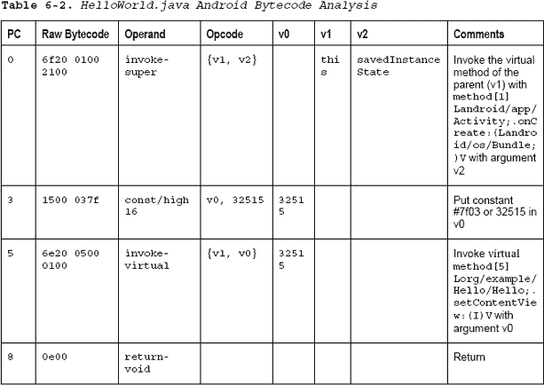

#### 解析器

为了解析`HelloWorld`，您需要添加对`invoke-super`和`new const16/high`关键字以及`contentView`结构的支持。解析器如清单 6-23 所示。

**清单 6-23。** *Hello World 和 Casting Parser*

`rule : for_loop return_` `| super_stmt return_
;

super_stmt : invoke_super invoke_virtual_content
;` 
`for_loop : put_in_reg+ for_start println for_end
;

for_start: 'if-ge' reg reg *HEX_DIGIT*+
;

for_end: add_int int_to_char goto_
;

put_in_reg : const_ reg *HEX_DIGIT*+
;

reg : 'v' *HEX_DIGIT*
;

const_ : *CONST_4*
| *CONST_16*
| *CONST_HIGH_16*
;

add_int : *ADD_INT* reg reg *HEX_DIGIT*
;

int_to_char: 'int-to-char' reg reg
;

goto_: 'goto' *HEX_DIGIT*+
;

return_: 'return-void'
;

println: sget new_instance invoke_direct const_string
invoke_virtual_move+
;

sget: *SGET* reg obj
;

new_instance: *NEW_INSTANCE* reg obj
;

invoke_direct: *INVOKE_DIRECT* obj param
;

invoke_super: *INVOKE_SUPER* param
;

invoke_virtual_move: invoke_virtual` `| invoke_virtual move_result_object` `| invoke_virtual move_result_object const_string
;

invoke_virtual_content: content_view invoke_virtual
;

content_view: const_ reg *HEX_DIGIT*+
;

invoke_virtual: *INVOKE_VIRTUAL* obj param
| *INVOKE_VIRTUAL* param
;

move_result_object: *MOVE_RESULT_OBJECT* reg
;

const_string: *CONST_STRING* reg obj
;

obj : *IDENT* '[' *HEX_DIGIT*+ ']'
;

param : '{' reg '}'
| '{' reg reg '}'
;

*INVOKE_DIRECT*: 'invoke-direct';
*INVOKE_SUPER*: 'invoke-super';
*INVOKE_VIRTUAL*: 'invoke-virtual';
*NEW_INSTANCE*: 'new-instance';
*MOVE_RESULT_OBJECT*: 'move-result-object';
*SGET*: 'sget-object';
*CONST_STRING*: 'const-string';
*HEX_DIGIT*: ('0'..'9'|'A'..'F'|'a'..'f');
*IDENT*: ('a'..'z')+;
*ADD_INT*: 'add-int/lit8';
*CONST_4*: 'const/4';
*CONST_16*: 'const/16';
*CONST_HIGH_16*: 'const/high16';`

#### Java

生成的 Java 代码如清单 6-24 所示。`classes.dex`告诉你当方法第一次被调用时`savedInstanceState`在 v2 中，并且`setContentView`正在调用`R.layout.Main`的数值。

**清单 6-24。** *生成`HelloWorld.java`*

`super.onCreate(savedInstanceState);
setContentView(32515);`

### 例 3: if 语句

为了完成这些例子，你需要一个`if`语句。WordPress 的开源 Android 应用是一个很好的资源，因为它是一个专业的应用，可以让你访问源代码。`escapeHTML.java`中的清单 6-25 有一个简单的`if`条件。

**清单 6-25。** *`escapeHTML`法*

`public static void escapeHtml(Writer writer, String string) throws
IOException {
if (writer == null ) {
throw new IllegalArgumentException ("The Writer must not
be null.");
}
if (string == null) {
return;
}
Entities.HTML40_escape.escape(writer, string);
}`

来自 dex 文件的字节码如清单 6-26 中的所示。

**清单 6-26。**??`escapeHTML.ddx`

`.method public static
escapeHtml(Ljava/io/Writer;Ljava/lang/String;)V
.throws Ljava/io/IOException;
.limit registers 4
; parameter[0] : v2 (Ljava/io/Writer;)
; parameter[1] : v3 (Ljava/lang/String;)
.line 27
if-nez v2,l7ba4c
.line 28
new-instance v0,java/lang/IllegalArgumentException
const-string v1,"The Writer must not be null."
invoke-direct
{v0,v1},java/lang/IllegalArgumentException/<init> ;
<init>(Ljava/lang/String;)V
throw v0
l7ba4c:
.line 30` `if-nez v3,l7ba52
l7ba50:
.line 34
return-void
l7ba52:
.line 33
sget-object
v0,org/wordpress/android/util/Entities.HTML40_escape
Lorg/wordpress/android/util/Entities;
invoke-virtual
{v0,v2,v3},org/wordpress/android/util/Entities/escape;
escape(Ljava/io/Writer;Ljava/lang/String;)V
goto l7ba50
.end method`

#### 字节码分析

表 6-3 解释了清单 6-23 中每个字节码段的含义，以及 v0、v1、v2 和 v3 DVM 寄存器中值的运行计数。字节码逆向工程中唯一真正的难题是最后一条指令:`28fa`。`28`操作码翻译成带有操作数`fa`的`goto`。操作数以二进制补码格式存储(更多信息见`[`en.wikipedia.org/wiki/Twos_complement`](http://en.wikipedia.org/wiki/Twos_complement)`)。要获得地址，您需要将每个十六进制数字转换为二进制，翻转这些位，然后加 1。在这个例子中，`fa` = 11111010，当比特翻转时，它变成 00000101。如果加上 1，数字就是 00000110 或十进制 6。回溯六个单词，你就有了你的地址:000c。

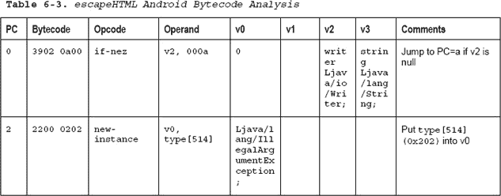
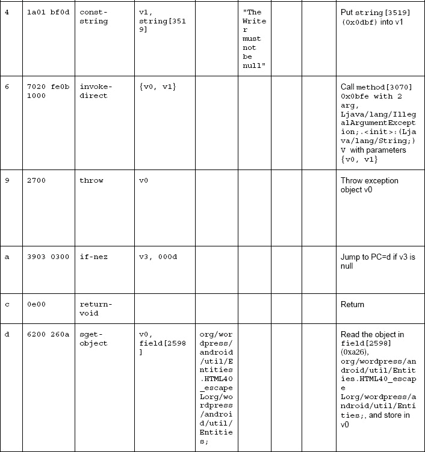
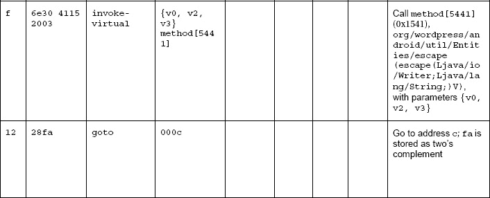

#### 解析器

为了解析`if not equal then`分支和`goto`语句，您需要将它们添加到解析器中。你还需要给`invoke-virtual`语句添加更多的参数选项；参见清单 6-27 。

**清单 6-27。** *Hello World、Casting 和 If 解析器*

`rule : for_loop return_
| super_stmt return_
| if_stmt+
;

if_stmt: if_ new_instance const_string invoke_direct throw_
| if_ return_ goto_stmt
;

goto_stmt: sget invoke_virtual goto_
;

if_ : *IF_NEZ* reg *HEX_DIGIT*+
;

throw_ : *THROW* reg
;` 
`super_stmt : invoke_super invoke_virtual_content
;

for_loop : put_in_reg+ for_start println for_end
;

for_start: 'if-ge' reg reg *HEX_DIGIT*+
;

for_end: add_int int_to_char goto_
;

put_in_reg : const_ reg *HEX_DIGIT*+
;

reg : 'v' *HEX_DIGIT*
;

const_ : *CONST_4*
| *CONST_16*
| *CONST_HIGH_16*
;

add_int : *ADD_INT* reg reg *HEX_DIGIT*
;

int_to_char: 'int-to-char' reg reg
;

goto_: 'goto' *HEX_DIGIT*+
;

return_: 'return-void'
;

println: sget new_instance invoke_direct const_string
invoke_virtual_move+
;

sget: *SGET* reg obj
;

new_instance: *NEW_INSTANCE* reg obj
;

invoke_direct: *INVOKE_DIRECT* obj param
| *INVOKE_DIRECT* param
;` 
`invoke_super: *INVOKE_SUPER* param
;

invoke_virtual_move: invoke_virtual
| invoke_virtual move_result_object
| invoke_virtual move_result_object const_string
;

invoke_virtual_content: content_view invoke_virtual
;

content_view: const_ reg *HEX_DIGIT*+
;

invoke_virtual: *INVOKE_VIRTUAL* obj param
| *INVOKE_VIRTUAL* param
| *INVOKE_VIRTUAL* param obj
;

move_result_object: *MOVE_RESULT_OBJECT* reg
;

const_string: *CONST_STRING* reg obj
;

obj : *IDENT* '[' *HEX_DIGIT*+ ']'
;

param : '{' reg '}'
| '{' reg reg '}'
| '{' reg reg reg '}'
;

*CONST_STRING*: 'const-string';
*IF_NEZ*: 'if-nez';
*INVOKE_DIRECT*: 'invoke-direct';
*INVOKE_SUPER*: 'invoke-super';
*INVOKE_VIRTUAL*: 'invoke-virtual';
*NEW_INSTANCE*: 'new-instance';
*MOVE_RESULT_OBJECT*: 'move-result-object';
*SGET*: 'sget-object';
*THROW*: 'throw';
*HEX_DIGIT*: ('0'..'9'|'A'..'F'|'a'..'f');
*IDENT*: ('a'..'z')+;
*ADD_INT*: 'add-int/lit8';
*CONST_4*: 'const/4';
*CONST_16*: 'const/16';
*CONST_HIGH_16*: 'const/high16';` `*WS*: (' ' | '\t' | '\n' | '\r' | '\f' | ',')+ {$channel = HIDDEN;};`

#### Java

生成的 Java 代码如清单 6-28 所示。

**清单 6-28。** *生成`escapeHTML.java`*

`if (writer == null ) {
throw new IllegalArgumentException ("The Writer must not be
null.");
}
if (string == null) {
return;
}
Entities.HTML40_escape.escape(writer, string);`

### 重构

当您构建解析器时，很快就可以清楚地看到，您需要将指令放入不同的系列中。否则，解析器可能会变得不可管理，您也将不得不对结构进行硬编码以匹配输入文件。没有一些重构，你永远不会有一个通用的解决方案来逆向工程 Android APKs。Gabor Paller 对指令进行了拆分，如表 6-4 所示。

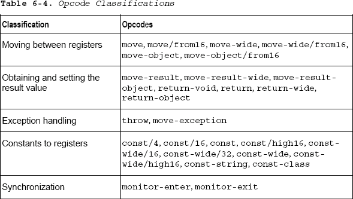

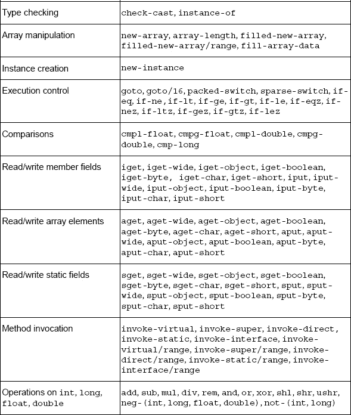

重构后的解析器如清单 6-29 所示。现在您已经有了示例中的一个小型测试代码套件，您可以用它来测试是否有任何更改破坏了解析器。

**清单 6-29。**重构的解析器

`rule : for_loop return_
| stmt return_
| stmt+
;

for_loop : put_in_reg+ for_start stmt for_end
;

stmt : if_stmt
| super_stmt
| println
;

if_stmt: if_ new_instance const_string invoke throw_
| if_ return_ goto_stmt
;

println: sget new_instance invoke const_string invoke_move+
;

super_stmt : invoke invoke_content
;

goto_stmt: sget invoke goto_
;

for_start: 'if-ge' reg reg *HEX_DIGIT*+
;

for_end: add_int int_to_char goto_
;

put_in_reg : const_ reg *HEX_DIGIT*+
;

add_int : *ADD_INT* reg reg *HEX_DIGIT*
;

int_to_char: 'int-to-char' reg reg
;

invoke_move: invoke
| invoke move_result_object
| invoke move_result_object const_string
;` 
`invoke_content: content_view invoke
;

invoke : invoke_virtual
| invoke_direct
| invoke_super
;` 
`invoke_virtual: *INVOKE_VIRTUAL* obj param
| *INVOKE_VIRTUAL* param
| *INVOKE_VIRTUAL* param obj
;

invoke_direct: *INVOKE_DIRECT* obj param
| *INVOKE_DIRECT* param
;

invoke_super: *INVOKE_SUPER* param
;

content_view: const_ reg *HEX_DIGIT*+
;

sget: *SGET* reg obj
;

new_instance: *NEW_INSTANCE* reg obj
;

if_ : *IF_NEZ* reg *HEX_DIGIT*+
;

reg : 'v' *HEX_DIGIT*
;

const_ : *CONST_4*
| *CONST_16*
| *CONST_HIGH_16*
;

move_result_object: *MOVE_RESULT_OBJECT* reg
;

const_string: *CONST_STRING* reg obj
;

obj : *IDENT* '[' *HEX_DIGIT*+ ']'
;

//helper functions
param : '{' reg+ '}'
;

goto_: 'goto' *HEX_DIGIT*+
;

throw_ : *THROW* reg` `;

return_: 'return-void'
;

*CONST_STRING*: 'const-string';
*IF_NEZ*: 'if-nez';
*INVOKE_DIRECT*: 'invoke-direct';
*INVOKE_SUPER*: 'invoke-super';
*INVOKE_VIRTUAL*: 'invoke-virtual';
*NEW_INSTANCE*: 'new-instance';
*MOVE_RESULT_OBJECT*: 'move-result-object';
*SGET*: 'sget-object';
*THROW*: 'throw';
*HEX_DIGIT*: ('0'..'9'|'A'..'F'|'a'..'f');
*IDENT*: ('a'..'z')+;
*ADD_INT*: 'add-int/lit8';
*CONST_4*: 'const/4';
*CONST_16*: 'const/16';
*CONST_HIGH_16*: 'const/high16';
*WS*: (' ' | '\t' | '\n' | '\r' | '\f' | ',')+ {$channel = HIDDEN;};`

目前，解析器只处理 3 个简单的程序结构，没有涵盖所有 Dalvik 字节码。如果包括在内的话，这一章会比书的其余部分更长。但是对于那些想了解更多的人来说，完整的反编译器可以在 Apress 网站(`[www.apress.com](http://www.apress.com)`)上找到，还有一个更大的测试套件和如何运行它的说明。

### 总结

在本章中，您已经使用 dedexer 输出创建了 DexToXML 和 DexToSource，这两个输出都可以在 Apress 网站上找到。这些可以用来将`classes.dex`文件分别分解成 XML 和 Java 源代码。对于更复杂的测试套件示例，网站上的 DexToSource 代码使用 AST 和`StringTemplate` s。

下一章以支持和反对混淆的案例研究以及使用开源或商业混淆器混淆代码的最佳实践来结束本书。