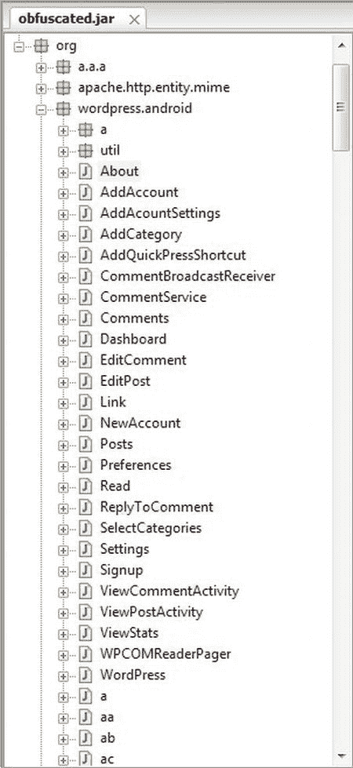
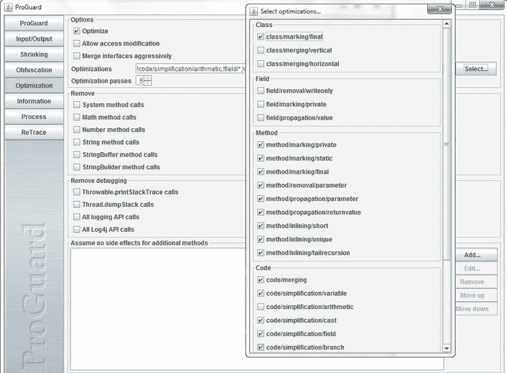
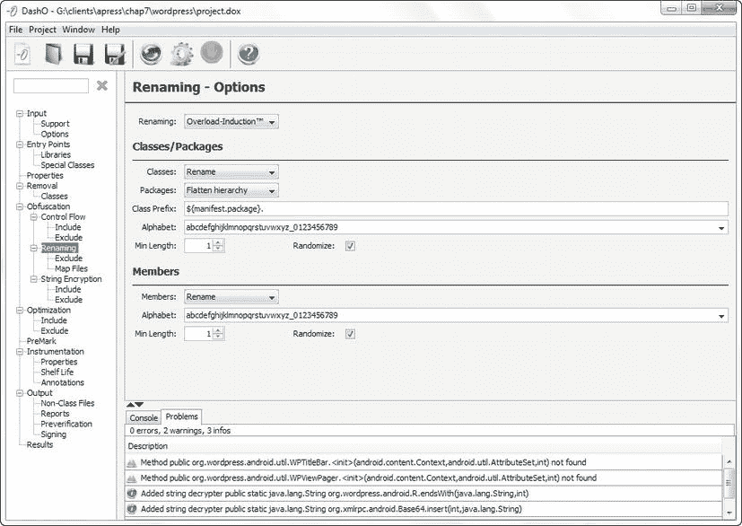
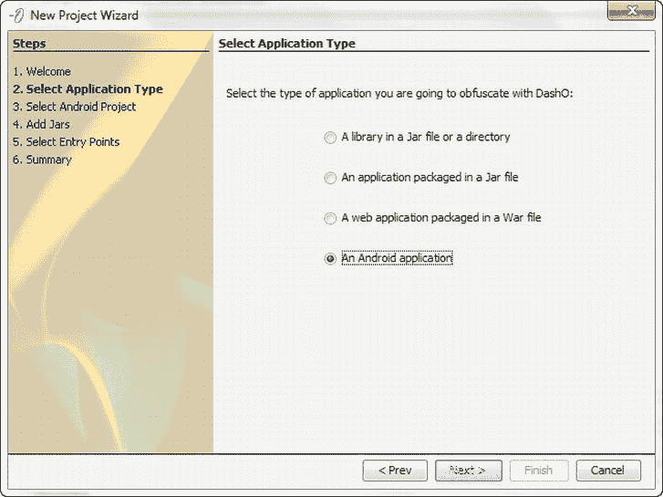

# 七、非礼勿听、非礼勿视：案例研究

你现在几乎已经到了旅程的终点。到目前为止，您应该对如何反编译以及如何尝试保护代码的总体原则有了很好的理解。话虽如此，我从与客户和同事的合作中发现，即使你理解了反编译和模糊处理的真正含义，它也不能帮助你弄清楚可以采取什么实际措施来保护你的代码。一知半解往往能创造出更多的问题而不是答案。

正如 Java 能力中心(JCC)在其 deCaf 网站 FAQ 上所说:

> 真的没有人能够反编译我的无咖啡因保护应用吗？不。脱咖啡因不会使反编译成为不可能。这使得真的没有人能够反编译我的无咖啡因保护的应用变得很困难。让反编译不可能是不可能的。

本书的目标是帮助提高门槛，让任何人都更难反编译你的代码。目前在 Android 世界里，似乎有一种“听不到邪恶，看不到邪恶”的反编译方法，但这迟早会改变。读完这本书后，你应该预先得到警告，更重要的是，在给定的具体情况下，你应该预先准备好保护代码的最佳实用方法。

本章通过一个案例研究来帮助解决这个难题。几乎每个试图保护自己代码的人都会使用某种混淆工具。案例研究更详细地研究了这种方法，以帮助您得出如何最好地保护代码的结论。它具有以下格式:

*   问题描述
*   神话
*   建议的解决方案:ProGuard 和 DashO

### 混淆案例研究

对于许多人来说，担心有人反编译他们的 Android 应用远不是他们最担心的事情。它的排名远远低于安装最新版本的 Maven 或 Ant。当然，他们想防止反编译，但是没人有时间——而且 ProGuard 不处理这个问题吗？

在这种情况下有两个简单的选择:使用模糊处理来保护应用，或者忽略反编译，就好像这不是问题一样。当然，由于显而易见的原因，后者并不是一个值得推荐的选择。

### 神话

这些年来，我听到了许多不同的关于保护你的代码是否有意义的争论。今天最常见的一条是，如果你创建了一个好的 Android 应用，并继续改进它，这将保护你免受任何人反编译你的代码。人们普遍认为，如果你编写了好的应用，源代码会自我保护——升级和良好的支持是比使用模糊处理或本书中讨论的任何其他技术更好的保护代码的方式。

其他的争论是软件开发是关于你如何应用你的知识，而不是使用别人的应用。如今的原始代码可能来自一个描述良好的设计模式，所以没人在乎它是否被黑了。所有的开发人员(无论如何是好的)在事情完成后总能想到更好的方法，所以为什么要担心呢？很有可能，如果有人缺乏想象力，不得不求助于窃取您的代码，他们将无法在代码的基础上进行构建，并将其转化为有用的东西。而且你也不可能在自己的代码开发出来六个月后阅读它，那么其他人又如何理解它呢？

混乱的代码也很难调试。来自现场的错误报告需要追溯到正确的方法，以便开发人员可以调试和修复代码。如果处理不当，这可能会成为维护的噩梦，并使支持变得困难。

但问题肯定是有人破解了程序——这在 iOS 和 Android 上都可能发生。报纸上并不全是关于人们反编译一个产品并把它重新包装成他们自己的产品的报道；我们总是听到最新的微软漏洞，所以这不成问题。对我来说，这个论点对运行在 web 服务器上的代码有效，但对运行在 Android 设备上的代码无效。在第四章中，您看到了在 APK 中获取代码和资源是多么容易。如果它包含任何访问后端系统的线索，比如 API 密钥或数据库登录，或者如果您的应用有任何需要保护的客户信息，那么您有责任为您的客户采取基本步骤来保护您的代码。

如果使用正确，模糊处理会显著提高门槛，阻止大多数人恢复您的源代码。本章的案例研究使用了上一章中的开源 WordPress Android 应用作为一个很好的混淆示例应用。因为它是开源的，所以你有原始的源代码，你可以和混淆后的代码进行比较，看看混淆是否有效。案例研究考察了 ProGuard(Android SDK 附带的)和 DashO(一个商业混淆器)如何管理类文件。

从`[`android.svn.wordpress.org/`](http://android.svn.wordpress.org/)`下载 WordPress 源代码。案例研究使用了 2012 年 3 月 17 日的版本。

使用`android update project`为您的环境更新项目:

`android update project -t android-15 -p ./`

### 解决方案 1:Prog guard

默认情况下，ProGuard 不打开。要为混淆启用 ProGuard，请编辑`project.properties`文件并添加以下行:

`proguard.config=proguard.cfg`

我们将在本章后面更详细地介绍`proguard.cfg`中的设置。只有生产或发布的 apk 会被混淆，所以确保在`AndroidManifest.xml`文件中`android:debuggable`标志被设置为`false`。使用`ant release`命令编译应用，假设 Ant 是您的构建工具。

#### SDK 输出

ProGuard 在 Java jar 文件被转换成`classes.dex`文件之前对其进行模糊处理。如果你使用 Ant，原始文件和混淆文件可以在`bin\proguard`文件夹中找到；如果你使用 Eclipse，可以在`project`文件夹下找到`\proguard`。

ProGuard 还输出以下文件:

*   `dump.txt`
*   `seeds.txt`
*   `usage.txt`
*   `mapping.txt`

有用的是一个类似于代码覆盖工具的混淆覆盖工具，向您显示有多少代码被混淆。但是这样的工具还不存在，所以这些文件是最接近你拥有的覆盖工具。

包含类文件中所有信息的输出，不像 Java 类文件反汇编器；这对你的目的没有多大帮助。`seeds.txt`列出没有混淆的类和方法。理解为什么一些代码是模糊的而另一些代码不是非常重要；稍后在“复查你的工作”部分会有更多的介绍。但是你需要检查，例如，带有你的 API 键的方法不在`seeds.txt`中，因为否则它们将不会受到任何保护。

ProGuard 不仅会混淆 jar 文件，还会通过删除任何日志文件、类或在原始代码中但从未被调用过的代码来缩小 jar 文件，等等。`usage.txt`列出从原始 jar 中去除的所有不必要的信息。因为存储在 Android 设备上非常珍贵，这本身就是在代码上使用混淆器的一个很好的理由。但是要小心，它不会删除您可能想要保留的代码。

`mapping.txt`可能是这个目录中最有用的文件，因为它将原始方法名映射到模糊的方法名。与大多数混淆器一样，ProGuard 大量重命名方法；如果您需要在字段中进行任何调试，那么`mapping.txt`就有必要追溯到最初的方法。您将在下一节中使用它来看看模糊处理对 WordPress 应用有多有效。

清单 7-1 ，使用 ProGuard 4.4，显示了构建期间的`Ant`输出；这对于查看 ProGuard 做了多少工作也很有用。如果`obfuscate`部分是空白的，你可以确定 ProGuard 没有被正确地调用。如果您自己尝试这样做，不要担心数字是否略有不同:您可能使用的是更高版本的 ProGuard 和/或 WordPress 代码。

**清单 7-1。** *蚂蚁输出*

`-obfuscate:
[mkdir] Created dir:
G:\clients\apress\chap7\wordpress\bin\proguard
[jar] Building jar:
G:\clients\apress\chap7\wordpress\bin\proguard\original.jar
[proguard] ProGuard, version 4.4
[proguard] ProGuard is released under the GNU General Public
License. The authors of all
[proguard] programs or plugins that link to it (com.android.ant,
...) therefore
[proguard] must ensure that these programs carry the GNU General
Public License as well.
[proguard] Reading input...
[proguard] Reading program jar
[G:\clients\apress\chap7\wordpress\bin\proguard\original.jar]
[proguard] Reading program jar
[G:\clients\apress\chap7\wordpress\libs\CWAC-AdapterWrapper.jar]
[proguard] Reading program jar
[G:\clients\apress\chap7\wordpress\libs\CWAC-Bus.jar]
[proguard] Reading program jar
[G:\clients\apress\chap7\wordpress\libs\CWAC-Task.jar]
[proguard] Reading program jar
[G:\clients\apress\chap7\wordpress\libs\android-support-v4.jar]
[proguard] Reading program jar
[G:\clients\apress\chap7\wordpress\libs\httpmime-4.1.2.jar]
[proguard] Reading program jar
[G:\clients\apress\chap7\wordpress\libs\tagsoup-1.2.1.jar]
[proguard] Reading library jar [C:\Program Files
(x86)\Android\android-sdk\platforms\android-14\android.jar]
[proguard] Initializing...
[proguard] Note: the configuration refers to the unknown class
'com.android.vending.licensing.ILicensingService'
[proguard] Note: there were 1 references to unknown classes.
[proguard] You should check your configuration for typos.
[proguard] Ignoring unused library classes...
[proguard] Original number of library classes: 3133
[proguard] Final number of library classes: 888
[proguard] Printing kept classes, fields, and methods...
[proguard] Shrinking...
[proguard] Printing usage to
[G:\clients\apress\chap7\wordpress\bin\proguard\usage.txt]...
[proguard] Removing unused program classes and class elements...
[proguard] Original number of program classes: 644`
`[proguard] Final number of program classes: 469
[proguard] Optimizing...
[proguard] Number of finalized classes: 331
[proguard] Number of vertically merged classes: 0
(disabled)
[proguard] Number of horizontally merged classes: 0
(disabled)
[proguard] Number of removed write-only fields: 0
(disabled)
[proguard] Number of privatized fields: 520
(disabled)
[proguard] Number of inlined constant fields: 1196
(disabled)
[proguard] Number of privatized methods: 163
[proguard] Number of staticized methods: 61
[proguard] Number of finalized methods: 1062
[proguard] Number of removed method parameters: 98
[proguard] Number of inlined constant parameters: 61
[proguard] Number of inlined constant return values: 15
[proguard] Number of inlined short method calls: 9
[proguard] Number of inlined unique method calls: 169
[proguard] Number of inlined tail recursion calls: 2
[proguard] Number of merged code blocks: 6
[proguard] Number of variable peephole optimizations: 1434
[proguard] Number of arithmetic peephole optimizations: 0
(disabled)
[proguard] Number of cast peephole optimizations: 31
[proguard] Number of field peephole optimizations: 3
[proguard] Number of branch peephole optimizations: 416
[proguard] Number of simplified instructions: 196
[proguard] Number of removed instructions: 1074
[proguard] Number of removed local variables: 184
[proguard] Number of removed exception blocks: 8
[proguard] Number of optimized local variable frames: 493
[proguard] Shrinking...
[proguard] Removing unused program classes and class elements...
[proguard] Original number of program classes: 469
[proguard] Final number of program classes: 455`

#### 再次检查你的工作

为了了解 ProGuard 有多有效，让我们看看它对你在第六章中使用的`EscapeUtils.java`方法做了什么。清单 7-2 显示了原始的 WordPress 源代码。

**清单 7-2。** *原文`EscapeUtils.java`代号*

`package org.wordpress.android.util;`

`import java.io.IOException;
import java.io.StringWriter;
import java.io.Writer;

public class EscapeUtils
{
public static String escapeHtml(String str) {
if (str == null) {`

`return null;
}
try {
StringWriter writer = new StringWriter
((int)(str.length() * 1.5));
escapeHtml(writer, str);
return writer.toString();
} catch (IOException e) {
//assert false;
//should be impossible
e.printStackTrace();
return null;
}
}

public static void escapeHtml(Writer writer, String
string) throws IOException {
if (writer == null ) {
throw new IllegalArgumentException ("The Writer
must not be null.");
}
if (string == null) {
return;
}
Entities.HTML40_escape.escape(writer, string);
}

public static String unescapeHtml(String str) {
if (str == null) {
return null;
}
try {
StringWriter writer = new StringWriter
((int)(str.length() * 1.5));
unescapeHtml(writer, str);
return writer.toString();
} catch (IOException e) {
//assert false;
//should be impossible
e.printStackTrace();
return null;
}
}

public static void unescapeHtml(Writer writer, String string)
throws IOException {
if (writer == null ) {`
`throw new IllegalArgumentException ("The Writer must
not be null.");
}`
`if (string == null) {
return;
}
Entities.HTML40.unescape(writer, string);
}

}`

清单 7-3 显示了由 JD-GUI 反编译的非模糊代码。查看模糊处理效果的最佳方式是，在 jar 文件被转换成`classes.dex`文件之前，首先查看来自 jar 文件的反编译代码。这消除了 dx 过程引入的任何意外混淆。你可以看到它和原始代码是一样的。唯一不同的是反编译版本中没有注释。

**清单 7-3。***`EscapeUtils.java`*

`package org.wordpress.android.util;

import java.io.IOException;
import java.io.StringWriter;
import java.io.Writer;

public class EscapeUtils
{
public static String escapeHtml(String str)
{
if (str == null)
return null;
try
{
StringWriter writer = new StringWriter((int)(str.length() *
1.5D));
escapeHtml(writer, str);
return writer.toString();
}
catch (IOException e)
{
e.printStackTrace();
}return null;
}

public static void escapeHtml(Writer writer, String string)
throws IOException
{
if (writer == null) {
throw new IllegalArgumentException("The Writer must not be
null.");
}`
`if (string == null) {
return;
}
Entities.HTML40_escape.escape(writer, string);
}

public static String unescapeHtml(String str) {
if (str == null)
return null;
try
{
StringWriter writer = new StringWriter((int)(str.length() *
1.5D));
unescapeHtml(writer, str);
return writer.toString();
}
catch (IOException e)
{
e.printStackTrace();
}return null;
}

public static void unescapeHtml(Writer writer, String string)
throws IOException
{
if (writer == null) {
throw new IllegalArgumentException("The Writer must not be
null.");
}
if (string == null) {
return;
}
Entities.HTML40.unescape(writer, string);
}
}`

清单 7-4 显示了被 ProGuard 混淆的代码。我用`mapping.txt`文件得到了混淆文件的名字，是`t.java`。文件名的选择有一定的随机性，如果你自己混淆了 WordPress 代码，它很可能不会是`t.java`。

**清单 7-4。** *装糊涂`t.java` ( `EscapeUtils.java` )*

`package org.wordpress.android.util;

import java.io.IOException;
import java.io.StringWriter;

public final class t`
`{
public static String a(String paramString)
{
if (paramString == null)
return null;
try
{
StringWriter localStringWriter;
String str = paramString;
paramString = localStringWriter = new
StringWriter((int)(paramString.length() * 1.5D));
if (str != null)
r.b.a(paramString, str);
return localStringWriter.toString();
}
catch (IOException localIOException)
{
localIOException.printStackTrace();
}
return null;
}

public static String b(String paramString)
{
if (paramString == null)
return null;
try
{
StringWriter localStringWriter;
String str = paramString;
paramString = localStringWriter = new
StringWriter((int)(paramString.length() * 1.5D));
if (str != null)
r.a.b(paramString, str);
return localStringWriter.toString();
}
catch (IOException localIOException)
{
localIOException.printStackTrace();
}
return null;
}
}`

`public static String escapeHtml(String str)`和`public static String unescapeHtml(String str)`方法看起来与原始方法非常相似。但是`public static void escapeHtml(Writer writer, String string)`和`public static void unescapeHtml(Writer writer, String string)` 方法已经被推送到一个单独的文件`r.java`中，让人不知所云(参见清单 7-5 )。

**清单 7-5。** *`r.java`类*

`package org.wordpress.android.util;

import java.io.Writer;

final class r
{
private static final String[][] c = { { "quot", "34" }, { "amp",
"38" }, { "lt", "60" }, { "gt", "62" } };
private static final String[][] d = { { "apos", "39" } };
private static String[][] e = { { "nbsp", "160" }, { "iexcl",
"161" }, { "cent", "162" }, { "pound", "163" }, { "curren", "164"
}, { "yen", "165" }, { "brvbar", "166" }, { "sect", "167" }, {
"uml", "168" }, { "copy", "169" }, { "ordf", "170" }, { "laquo",
"171" }, { "not", "172" }, { "shy", "173" }, { "reg", "174" }, {
"macr", "175" }, { "deg", "176" }, { "plusmn", "177" }, { "sup2",
"178" }, { "sup3", "179" }, { "acute", "180" }, { "micro", "181"
}, { "para", "182" }, { "middot", "183" }, { "cedil", "184" }, {
"sup1", "185" }, { "ordm", "186" }, { "raquo", "187" }, {
"frac14", "188" }, { "frac12", "189" }, { "frac34", "190" }, {
"iquest", "191" }, { "Agrave", "192" }, { "Aacute", "193" }, {
"Acirc", "194" }, { "Atilde", "195" }, { "Auml", "196" }, {
"Aring", "197" }, { "AElig", "198" }, { "Ccedil", "199" }, {
"Egrave", "200" }, { "Eacute", "201" }, { "Ecirc", "202" }, {
"Euml", "203" }, { "Igrave", "204" }, { "Iacute", "205" }, {
"Icirc", "206" }, { "Iuml", "207" }, { "ETH", "208" }, { "Ntilde",
"209" }, { "Ograve", "210" }, { "Oacute", "211" }, { "Ocirc",
"212" }, { "Otilde", "213" }, { "Ouml", "214" }, { "times", "215"
}, { "Oslash", "216" }, { "Ugrave", "217" }, { "Uacute", "218" },
{ "Ucirc", "219" }, { "Uuml", "220" }, { "Yacute", "221" }, {
"THORN", "222" }, { "szlig", "223" }, { "agrave", "224" }, {
"aacute", "225" }, { "acirc", "226" }, { "atilde", "227" }, {
"auml", "228" }, { "aring", "229" }, { "aelig", "230" }, {
"ccedil", "231" }, { "egrave", "232" }, { "eacute", "233" }, {
"ecirc", "234" }, { "euml", "235" }, { "igrave", "236" }, {
"iacute", "237" }, { "icirc", "238" }, { "iuml", "239" }, { "eth",
"240" }, { "ntilde", "241" }, { "ograve", "242" }, { "oacute",
"243" }, { "ocirc", "244" }, { "otilde", "245" }, { "ouml", "246"
}, { "divide", "247" }, { "oslash", "248" }, { "ugrave", "249" },
{ "uacute", "250" }, { "ucirc", "251" }, { "uuml", "252" }, {
"yacute", "253" }, { "thorn", "254" }, { "yuml", "255" } };
private static String[][] f = { { "fnof", "402" }, { "Alpha",
"913" }, { "Beta", "914" }, { "Gamma", "915" }, { "Delta", "916"
}, { "Epsilon", "917" }, { "Zeta", "918" }, { "Eta", "919" }, {
"Theta", "920" }, { "Iota", "921" }, { "Kappa", "922" }, {
"Lambda", "923" }, { "Mu", "924" }, { "Nu", "925" }, { "Xi", "926"
}, { "Omicron", "927" }, { "Pi", "928" }, { "Rho", "929" }, {
"Sigma", "931" }, { "Tau", "932" }, { "Upsilon", "933" }, { "Phi",`
`"934" }, { "Chi", "935" }, { "Psi", "936" }, { "Omega", "937" }, {
"alpha", "945" }, { "beta", "946" }, { "gamma", "947" }, {
"delta", "948" }, { "epsilon", "949" }, { "zeta", "950" }, {
"eta", "951" }, { "theta", "952" }, { "iota", "953" }, { "kappa",
"954" }, { "lambda", "955" }, { "mu", "956" }, { "nu", "957" }, {
"xi", "958" }, { "omicron", "959" }, { "pi", "960" }, { "rho",
"961" }, { "sigmaf", "962" }, { "sigma", "963" }, { "tau", "964"
}, { "upsilon", "965" }, { "phi", "966" }, { "chi", "967" }, {
"psi", "968" }, { "omega", "969" }, { "thetasym", "977" }, {
"upsih", "978" }, { "piv", "982" }, { "bull", "8226" }, {
"hellip", "8230" }, { "prime", "8242" }, { "Prime", "8243" }, {
"oline", "8254" }, { "frasl", "8260" }, { "weierp", "8472" }, {
"image", "8465" }, { "real", "8476" }, { "trade", "8482" }, {
"alefsym", "8501" }, { "larr", "8592" }, { "uarr", "8593" }, {
"rarr", "8594" }, { "darr", "8595" }, { "harr", "8596" }, {
"crarr", "8629" }, { "lArr", "8656" }, { "uArr", "8657" }, {
"rArr", "8658" }, { "dArr", "8659" }, { "hArr", "8660" }, {
"forall", "8704" }, { "part", "8706" }, { "exist", "8707" }, {
"empty", "8709" }, { "nabla", "8711" }, { "isin", "8712" }, {
"notin", "8713" }, { "ni", "8715" }, { "prod", "8719" }, { "sum",
"8721" }, { "minus", "8722" }, { "lowast", "8727" }, { "radic",
"8730" }, { "prop", "8733" }, { "infin", "8734" }, { "ang", "8736"
}, { "and", "8743" }, { "or", "8744" }, { "cap", "8745" }, {
"cup", "8746" }, { "int", "8747" }, { "there4", "8756" }, { "sim",
"8764" }, { "cong", "8773" }, { "asymp", "8776" }, { "ne", "8800"
}, { "equiv", "8801" }, { "le", "8804" }, { "ge", "8805" }, {
"sub", "8834" }, { "sup", "8835" }, { "sube", "8838" }, { "supe",
"8839" }, { "oplus", "8853" }, { "otimes", "8855" }, { "perp",
"8869" }, { "sdot", "8901" }, { "lceil", "8968" }, { "rceil",
"8969" }, { "lfloor", "8970" }, { "rfloor", "8971" }, { "lang",
"9001" }, { "rang", "9002" }, { "loz", "9674" }, { "spades",
"9824" }, { "clubs", "9827" }, { "hearts", "9829" }, { "diams",
"9830" }, { "OElig", "338" }, { "oelig", "339" }, { "Scaron",
"352" }, { "scaron", "353" }, { "Yuml", "376" }, { "circ", "710"
}, { "tilde", "732" }, { "ensp", "8194" }, { "emsp", "8195" }, {
"thinsp", "8201" }, { "zwnj", "8204" }, { "zwj", "8205" }, {
"lrm", "8206" }, { "rlm", "8207" }, { "ndash", "8211" }, {
"mdash", "8212" }, { "lsquo", "8216" }, { "rsquo", "8217" }, {
"sbquo", "8218" }, { "ldquo", "8220" }, { "rdquo", "8221" }, {
"bdquo", "8222" }, { "dagger", "8224" }, { "Dagger", "8225" }, {
"permil", "8240" }, { "lsaquo", "8249" }, { "rsaquo", "8250" }, {
"euro", "8364" } };
private static r g;
private static r h;
public static final r a;
public static final r b;
private s i = new ag();

private void a(String[][] paramArrayOfString)`
`{
for (int j = 0; j < paramArrayOfString.length; j++)
{
int k = Integer.parseInt(paramArrayOfString[j][1]);
String str = paramArrayOfString[j][0];
this.i.a(str, k);
}
}

public final void a(Writer paramWriter, String paramString)
{
int j = paramString.length();
for (int k = 0; k < j; k++)
{
int m = paramString.charAt(k);
int n = m;
String str;
if ((str = this.i.a(n)) == null)
{
if (m > 127)
{
paramWriter.write("&#");
paramWriter.write(Integer.toString(m, 10));
paramWriter.write(59);
}
else
{
paramWriter.write(m);
}
}
else
{
paramWriter.write(38);
paramWriter.write(str);
paramWriter.write(59);
}
}
}

public final void b(Writer paramWriter, String paramString)
{
int j;
if ((j = paramString.indexOf('&')) < 0)
{
paramWriter.write(paramString);
return;
}
int k = j;
String str1 = paramString;`
`paramString = paramWriter;
paramWriter = this;
paramString.write(str1, 0, k);
int m = str1.length();
while (k < m)
{
int n;
String str2;
if ((n = str1.charAt(k)) == '&')
{
int i1 = k + 1;
String str4;
if ((str4 = str1.indexOf(';', i1)) == -1)
{
paramString.write(n);
}
else
{
int i2;
if (((i2 = str1.indexOf('&', k + 1)) != -1) && (i2 <
str4))
{
paramString.write(n);
}
else
{
str2 = str1.substring(i1, str4);
n = -1;
if ((i1 = str2.length()) > 0)
if (str2.charAt(0) == '#')
{
if (i1 > 1)
{
n = str2.charAt(1);
try
{
switch (n)
{
case 88:
case 120:
n = Integer.parseInt(str2.substring(2), 16);
break;
default:
n = Integer.parseInt(str2.substring(1), 10);
}
if (n > 65535)
n = -1;
}`
`catch (NumberFormatException
localNumberFormatException)
{
n = -1;
}
}
}
else
{
String str3 = str2;
n = paramWriter.i.a(str3);
}
if (n == -1)
{
paramString.write(38);
paramString.write(str2);
paramString.write(59);
}
else
{
paramString.write(n);
}
str2 = str4;
}
}
}
else
{
paramString.write(n);
}
str2++;
}
}

static
{
(r.g = new r()).a(c);
g.a(d);
(r.h = new r()).a(c);
h.a(e);
r localr;
(localr = r.a = new r()).a(c);
localr.a(e);
localr.a(f);
b = new r();
(localr = a).a(e);
localr.a(f);
}
}`

从第四章中，你可以看到 ProGuard 通过重命名变量来使用布局混淆，这只是稍微有效。但是它也采用了一些令人印象深刻的数据混淆技术，通过分割变量和将静态数据转换成过程数据。第一轮晋级。

看图 7-1 中左边的菜单，显示了在 JD-GUI 中打开的混淆的 jar 文件。大量的类名没有被混淆。这些方法有一些布局混淆，但是类名包含的信息使人们很容易理解这些方法在做什么。默认情况下，`manifest.xml`文件中列出的所有`Activity`、`Application`、`Service`、`BroadcastReceiver`和`ContentProvider`类都不会被 ProGuard 混淆。最好的解决方案是尽量减少这种类型的类。

**图 7-1。**混淆了 JD-GUI 中的 WordPress jar 文件

#### 配置

ProGuard 在`proguard.cfg`文件中配置。默认配置文件如清单 7-6 所示。最简单的是，该文件告诉 ProGuard 不要使用大小写混合的类名(当 jar 文件被解压缩时，这会在 Windows 上引起问题)；不执行预验证步骤；保留`Activity`、`Application`、`Service`、`BroadcastReceiver`和`ContentProvider`类的类名；不删除任何本机类；还有更多。

**清单 7-6。** *`proguard.cfg`文件为 WordPress App*

`-optimizationpasses 5
-dontusemixedcaseclassnames
-dontskipnonpubliclibraryclasses
-dontpreverify
-verbose
-optimizations !code/simplification/arithmetic,!field/*,!class/merging/*

-keep public class * extends android.app.Activity
-keep public class * extends android.app.Application
-keep public class * extends android.app.Service
-keep public class * extends android.content.BroadcastReceiver
-keep public class * extends android.content.ContentProvider
-keep public class * extends android.app.backup.BackupAgentHelper
-keep public class * extends android.preference.Preference
-keep public class com.android.vending.licensing.ILicensingService

-keepclasseswithmembernames class * {
native <methods>;
}

-keepclasseswithmembers class * {
public <init>(android.content.Context,
android.util.AttributeSet);
}

-keepclasseswithmembers class * {
public <init>(android.content.Context,
android.util.AttributeSet, int);
}

-keepclassmembers class * extends android.app.Activity {
public void *(android.view.View);
}

-keepclassmembers enum * {
public static **[] values();`
`public static ** valueOf(java.lang.String);
}

-keep class * implements android.os.Parcelable {
public static final android.os.Parcelable$Creator *;
}`

在`[`proguard.sourceforge.net/manual/examples.html#androidapplication`](http://proguard.sourceforge.net/manual/examples.html#androidapplication)`可以找到一个很好的 Android APKs 配置设置资源，它反映了许多这些设置。这是非常有用的，特别是如果你的 APK 在使用 ProGuard 后在你的设备上失败了。

一个更简单的选择是使用 ProGuard GUI，它会带您浏览配置设置，并提供更多解释。例如，`proguard.cfg`中的优化设置很神秘，但是在 GUI 中更容易理解和设置(见图 7-2 )。

**图 7-2。** *ProGuard GUI*

要启动 GUI，首先要确保你已经在`[`proguard.sourceforge.net`](http://proguard.sourceforge.net)`从 SourceForge 下载了。解压缩它并在`lib`文件夹中执行下面的命令，假设您已经将目标`proguard.cfg`文件复制到了`proguard\lib`文件夹中。你应该看到许多优化选项直接来自第四章的模糊转换:

`java -jar proguardgui.jar proguard.cfg`

#### 调试

你可能会发现你的 APK 在被混淆后在战场上失败了。调试代码很困难，因为许多方法的名称都被 ProGuard 更改了。幸运的是，ProGuard 有一个`retrace`选项，可以让你回到原来的名字。该命令如下所示:

`java -jar retrace.jar mapping.txt stackfile.trace`

`mapping.txt`在`bin\proguard`文件夹中，`stackfile.trace`是应用崩溃时保存的堆栈跟踪。

### 解决方案 2: DashO

ProGuard 不是你唯一的混淆选项。商业混淆器，如抢先的 DashO，可在`[www.preemptive.com](http://www.preemptive.com)`获得，是有价值的替代品，比 ProGuard 做更多的控制流和字符串加密混淆。图 7-3 显示了 DashO 界面，包括控制流、重命名和字符串加密混淆选项。

**图 7-3。** *妫办公会*

控制流选项对字节码进行重新排序，目的是使其不可能被反编译。String Encryption 选项对许多字符串进行加密，这对于防止有人窃取 API 密钥或密码非常有用。重载归纳(重命名选项之一)是一种更强烈的类重命名形式:可以将多个类命名为`a()`或`b()`，因为这样做是合法的 Java，只要这些类具有不同的方法参数。

在 DashO 中混淆 Android 项目最简单的方法是使用 DashO 向导(见图 7-4 )。稍后，您可以使用 GUI 来调整您想要设置的任何选项。

**图 7-4。** *巫师办公会*

#### 输出

DashO 输出一个项目报告文件和一个`mapreport`或映射文件到`ant-bin\dasho-results`文件夹。例如，`mapreport`文件告诉我`EscapeUtils.class`已经改名为`i_:`

`org.wordpress.android.i_ public
org.wordpress.android.util.EscapeUtils`

清单 7-7 显示了反编译后的 JD-GUI 输出。

**清单 7-7。** *`EscapeUtils`，被办公会搞得晕头转向*

`package org.wordpress.android;

import java.io.IOException;
import java.io.StringWriter;
import java.io.Writer;`

`public class i_
{
public static String e(String paramString)
{
if (paramString != null);
try
{
StringWriter localStringWriter = new
StringWriter((int)(paramString.length() * 1.5D));
o(localStringWriter, paramString);
return localStringWriter.toString();
return null;
}
catch (IOException localIOException)
{
localIOException.printStackTrace();
}
return null;
}

public static void o(Writer paramWriter, String paramString)
throws IOException
{
if (paramWriter == null)
break label24;
do
return;
while (paramString == null);
xd.v.v(paramWriter, paramString);
return;
label24: throw new IllegalArgumentException(R.endsWith("Rom)]yeyk}0|g``5xxl9x~<sksl/"
, 554 / 91));
}

// ERROR //
public static String f(String paramString)
{
// Byte code:
// 0: aload_0
// 1: ifnonnull +16 -> 17
// 4: goto +10 -> 14
// 7: astore_1
// 8: aload_1
// 9: invokevirtual 33 java/io/IOException:printStackTrace
()V
// 12: aconst_null
// 13: areturn
// 14: aconst_null`
`// 15: areturn
// 16: areturn
// 17: new 7 java/io/StringWriter
// 20: dup
// 21: aload_0
// 22: invokevirtual 29 java/lang/String:length ()I
// 25: i2d
// 26: ldc2_w 3
// 29: dmul
// 30: d2i
// 31: invokespecial 30 java/io/StringWriter:<init> (I)V
// 34: astore_1
// 35: aload_1
// 36: aload_0
// 37: invokestatic 37 org/wordpress/android/i_:d
(Ljava/io/Writer;Ljava/lang/String;)V
// 40: aload_1
// 41: invokevirtual 32
java/io/StringWriter:toString()Ljava/lang/String;
// 44: goto -28 -> 16
//
// Exception table:
// from to target type
// 17 477 java/io/IOException
}

public static void d(Writer paramWriter, String paramString)
throws IOException
{
if (paramWriter != null)
{
if (paramString != null)
{
xd.t.h(paramWriter, paramString);
return;
}
}
else
throw new IllegalArgumentException(d9.insert(49 * 25,
"\035\".l\032<&$4 s9 %#x75/|?;• .4./j"));
}
}`

代码中最明显的是`escapeHTML`或`unescapeHTML`方法无法反编译。Java 还有一些有趣的用途，比如变量名标签和字符串加密。下面的代码片段是使用 JD-GUI 反编译时令人困惑的代码的一个很好的例子:

`label24: throw new
IllegalArgumentException(R.endsWith("Rom)]yeyk}0|g``5xxl9x~<sksl/"
, 554 / 91));`

重新编译这段代码需要一些努力。第二回合达索获胜。

### 回顾案例研究

我希望这个案例研究向您展示了 JD-GUI 可以从未受保护的代码中恢复多少代码，以及这些代码与原始源代码有多接近。在本章的随机样本中，两个源文件之间唯一的区别是缺少注释。ProGuard 和 DashO 使得任何反编译的代码更加难以理解。最起码，你要把`proguard.config=proguard.cfg`加到你的`project.properties`文件里；商业混淆器可以提供额外的保护。

始终仔细检查任何敏感信息是否已通过下载生产 APK 并反编译得到保护。如果你有任何后端系统的 API 密钥或用户名，并且它们没有被 ProGuard 或 DashO 隐藏到令你满意的程度，你可能要考虑使用 Android 原生开发工具包(NDK；更多信息见第四章。

### 总结

当构思这本书的时候，Java 反编译似乎是一个重要的问题。但这从未发生过。当然，有一些桌面应用；但是大部分代码是为 web 服务器编写的，jar 文件被牢牢地锁在防火墙后面。

公平地说，有了 Android，Java 已经超越了它早期的根基。Android APKs 在用户的设备上很容易访问，并且首先为 Java 开发的反编译技术现在使得恢复任何未受保护的 apk 变得非常容易。这些 apk 通常足够小，程序员或黑客可以很快理解它们是如何工作的。如果你想在 APK 藏东西，你需要保护它。

这种情况在不久的将来会改变吗？如果 DVM、JVM 和 Java 代码之间仍然存在链接，就不会这样。我预测工具将会转移到 DVM 上，如果有什么不同的话，情况可能会变得更糟。混淆和反编译之间的军备竞赛将会以很快的速度进行，复制过去 10 年中发生的许多相同的步骤——但这次是在 DVM 上。

这本书的前提是向个人用户展示如何从`classes.dex`文件反编译代码，有哪些保护方案，以及它们的含义。一般来说，人们的好奇心比欺诈性强得多，而且不太可能有人会使用反编译器来窃取软件公司的皇冠上的宝石。相反，他们只是想看一眼，看看它们是如何组合在一起的——Java 反编译器使普通程序员能够更深入地了解通常是黑箱的东西。这本书帮助你越过那个边缘。

从这里开始尝试的事情包括使用 ANTLR 和扩展代码，如果它不能反编译您的特定`classes.dex`文件的话。网上也有一些开源的反编译器——比如 JODE，可以在`[`jode.sourceforge.net`](http://jode.sourceforge.net)`找到——它们提供了丰富的信息。位于`[`code.google.com/p/smali/`](http://code.google.com/p/smali/)`的 Smali 和 baksmali 也是你开始研究的绝佳地点。

我尽了最大努力使这本书易于阅读。我有意识地决定让它更实用，而不是理论上的，同时努力避免它成为傻瓜的 Android 反编译器。我希望你我的努力是值得的。请记住，这里的事情变化很快，所以请关注 Apress 网站的更新。