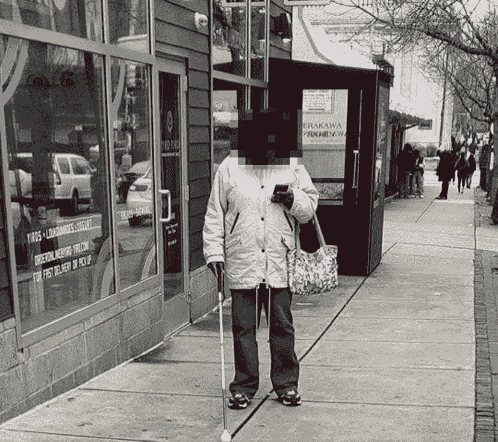

# 1.易接近

我对可访问性的兴趣始于 2010 年，当时我是一家小型苹果经销商的经理。在科技零售行业工作的一个很大的好处是，你可以在科技之旅的不同阶段接触到各种各样的人。有些客户会问一些原创性的问题，需要进行大量的研究才能找到正确的答案。其他人以前从未接触过你或我可能称之为“计算机”的任何东西，并且是从最开始开始。

2010 年 6 月，苹果发布了 iPhone 4。从那以后，我开始注意到，到店里来的顾客中，使用英国手语(BSL)作为第一语言的人数显著增加。从与其中一些客户的互动中，可以清楚地看出这是为什么:随着 iPhone 4 的发布，苹果也发布了一个全新的功能——face time。

FaceTime 和其他类似的视频通话功能对我们使用 BSL 的客户来说是一个不可思议的可用性改进。FaceTime 只是现代智能手机和之前的座机电话众多辅助功能中的一个。

## 电话和无障碍创新

包容性技术的一个目标是为所有用户创造可比较的体验，这个话题我们将在第 [2](02.html) 章中再次讨论。亚历山大·格雷厄姆·贝尔没有包容性思维的优势来指导他的发明。因此，环境还没有准备好让他在设计电话时将可访问性放在首位。在接下来的几年里，我们必须努力增加辅助技术。许多技术已经被添加进来，比如我们很快会谈到的聋人电信设备。短消息服务(或 SMS)、语音识别系统和视频通话都是电话的进步。虽然这些辅助技术为残疾人带来了改善，但这些增加并不是无缝的。这款手机有着悠久的历史，它让有特殊需求的人更容易使用。今天，手机仍然引领无障碍创新。

自从将近 150 年前发明电话以来，我们大多数人已经能够按计划使用电话与隔壁房间、隔壁国家或全球各地的朋友、家人、企业通话。考虑一下，如果这还不是事实的话，你主要的，或者唯一的交流方式是手语。这立即使电话变得无用。电话是一项无处不在的发明，但它以一种单一的媒介——音频——来呈现内容。创新帮助我们这些听不见的人让手机变得更容易使用。

### 聋人用电信设备

聋人电信设备通常也称为 TDD、TTY、文本电话或迷你通信。它是一个 QUERTY 键盘和电传打字机显示器，发明于 20 世纪 60 年代，连接到固定电话(图 [1-1](#Fig1) )。有了这些附加功能，TDD 允许语言或听力受限的人输入他们的对话。对话可以被引导到其他 TDD 用户，或者被引导到将对话转发给非 TDD 用户的运营商。

图 1-1

聋人用电信设备的一个例子

虽然 TDD 对许多人来说是一个必不可少的工具，但它并不等同于电话。如果你曾经使用过这些服务中的一种，你会知道与标准电话相比，这种交互更慢、更笨拙，就像你通过口译员用外语进行对话一样。TDD 是可访问的，但它不是包容性的。

### 视频通话

如今，FaceTime 是一项我们都认为理所当然的技术。我们大多数参与软件开发的人几乎每天都会使用某种形式的视频通话系统——Skype、Google Hangouts、Zoom 或任何其他系统。但是，十年前，能够以高质量的视频即时看到世界上任何地方的任何人，并与他们交谈是非常开创性的。然而，对于我们的聋人和重听客户来说，这不仅仅是突破性的。这对他们的交流能力是一种转变。签署对话的能力最终使电话成为一种可比拟的体验。

FaceTime 之所以没有成为苹果的产品，是因为苹果打算为手语用户提供一个优秀的辅助工具。苹果开始创造一款适合所有人的伟大产品。通过确保它为每个人工作，并在整个项目中考虑可访问性，苹果为一个特定的受众提供了超级服务。

### 移动创新

手机里充满了像 FaceTime 这样的辅助功能。谷歌助手和 Siri 快捷键降低了对准确性的要求。这有助于有学习困难的人。它还减少了帮助解决运动问题所需的触摸次数。屏幕时间和 Safari Reader 有助于最大限度地减少分心——非常适合注意力缺陷障碍患者或有精神健康问题的人，他们可以在焦点中找到解脱。听写、拼写纠正、预测文本、语音备忘录、提醒振动、第三方键盘和外部键盘支持都是辅助技术的例子。您很有可能每天都在使用这些工具，而从来没有考虑过它们是一个辅助功能。

考虑一下我们之前讨论过的用于聋人的电信设备。发明者需要某种方法来允许数字文本通过电线传输。他们的最终发明是调制解调器。没有调制解调器，我们的许多现代数字社会就根本不可能存在。下一次，当你带着一个滚轮箱或一辆童车出现在街道的拐角处时——下降的路缘最初是为了帮助轮椅使用者而设置的，这意味着你不必将沉重的物品举到街道的高度。强大的可访问性不应该是一个只有少数人使用的模糊特性。在最好的情况下，易访问性应该是你正在创建的产品或服务的一等公民，应该让每个人受益。

显然，无障碍不仅仅是让残疾人受益的事情。它为所有用户提供了更广泛的可定制性。虽然残疾用户可能受益最大，但是您的每一个用户都会从您给予可访问性的考虑中受益。在最好的情况下，可访问性是对您的每一位客户的包容。我们将在第 [2](02.html) 章中详细介绍这一点。现在，让我们对我们所说的残疾，尤其是数字环境中的残疾，有一个更深入的了解。

## 什么是残疾？

2019 年 1 月，一张照片在社交媒体上被广泛分享(图 [1-2](#Fig2) )。这张照片展示了一个平常的女人走在市中心的街道上，忙着自己的事情。然而，这位女士有两个特点引起了脸书用户的评论。这位女士用的是智能手机，没什么不寻常的，但这位女士也有一根白色的拐杖来帮助她在城市中导航。

图 1-2

一个人使用拐杖和智能手机。发布到脸书，标题是“如果你能看到问题所在，就说我看到了”

自第一次世界大战以来，白手杖一直被用作帮助盲人和部分失明者的工具，许多人使用它来帮助他们通过感觉周围的街道来寻找障碍和线索，如触觉铺路，从而在建筑环境中导航。然而，手杖的主要用途之一，对于我们这些不使用它的人来说，可能不会立即显而易见；暗示就在手杖的颜色里。白色手杖的确是白色的。因为它们是白色的，对我们这些看到它的人来说，它们是一个明确的指示，持有它的人可能看不到我们。这给了我们一个提示，作为司机，我们要格外小心，作为行人，我们要确保给行人留出通过的空间。

也许这就是张贴到脸书的照片中的女士的情况。也许她视力不好，使用拐杖主要是为了向其他行人暗示她可能看不到他们。可能她确实使用她的拐杖来感觉她周围的建筑环境，因为她看不到远处的物品，但她的眼睛仍然具有更近的视觉，因此可以继续使用她的电话。

我不认为任何阅读这本书的人会像许多脸书用户一样，质疑这位女士的能力或缺乏能力，主要是因为你可能在移动领域工作，知道她可以做出大量的显示调整来改善她的体验，并允许她使用她的智能手机。也许她启用了大文本或缩放功能。也许她正在使用反转的颜色或增强的对比度。她甚至可能根本没有看屏幕——她可能正在使用屏幕阅读器，并且屏幕幕布已经打开，这只是使用手机时的自然方式。不去问别人，是不可能理解别人的经历的。如果你想真正了解别人是如何使用你的应用的，这正是我的建议——问他们。

所有这些都是在说——残疾并不像生活中的任何事情一样，仅仅是一种二元状态。不可能把世界分成两类——残疾人和健全人；或者，在我们的先例中，失明和视力正常。介于两者之间的是很大一部分人——从我们这些不得不戴老花镜完成特定任务的人，到我们这些因白内障、色盲和其他疾病而完全没有光感的人。随着时间的推移，视力障碍因人而异，所有的残疾也是如此。我相信我们都知道，并不是所有的残疾都是可见的。

那么，如果残疾是一个广泛的范围，我们如何定义它？强调我认为残疾的含义的最佳方式是使用世界卫生组织的定义。1980 年，世卫组织对残疾的定义如下:

> *在健康体验的背景下，残疾是指以人类认为正常的方式或在正常范围内从事某项活动的任何限制或能力缺乏(由损伤导致)。* [1](#Fn1)
> 
> 世界卫生组织，1980 年

换句话说，他们将残疾定义为一个人的特征，一种使残疾人不同于我们其他人的东西，并且不能做我们合理期望“正常”人能够做的事情。我认为我们可以将残疾定义为“能力的限制或缺乏”但最后一部分出现了问题——“被认为是人类正常的范围。”这里的“正常”一词提出的问题比它回答的问题更多——什么是正常人？我们会期望这个虚构的正常人做什么？谁决定什么是正常的？如果我不符合正常的定义，我应该担心吗？所有这些问题的答案都很简单——没有这样的事情。人类是没有“正常”的。我不想听起来像学龄前儿童电视节目——我们都有自己独特的方式。

今天访问世界卫生组织的网站，你会看到一个更新的定义:

> 残疾不仅仅是一个健康问题。这是一个复杂的现象，反映了一个人的身体特征和他或她所生活的社会特征之间的相互作用。克服残疾人面临的困难需要采取干预措施，消除环境和社会障碍。 [2](#Fn2)
> 
> 世界卫生组织

这个定义认为残疾不是人的问题，而是我们所建立的社会的问题。这个定义承认每个人都是不同的，有不同的能力、知识和技能，不同是正常的。因此，如果有人与我们社会的某个方面作斗争，这不是这个人的问题。相反，这是允许这种情况发生的文化问题。这一定义还承认，残疾不在于某人能否使用台阶进入建筑物。相反，它是关于我们赖以建立社会的系统，例如，如果我们让有学习障碍的人填写一个大表格，我们可能会让他们感觉如何，或者有心理健康问题的人可能会觉得被一个规定的系统所困。这被称为残疾的社会模式。

### 主要少数派

被认为有残疾的人是少数。但是他们一起构成了欧洲和北美最大的少数民族之一。在美国，估计有 27%的人有残疾，也就是 8530 万人。这使得残疾人数量相当于人口最多的三个州的总和。在英国，22%的人报告有残疾，接近 1400 万人。 [4](#Fn4) 全球有超过 10 亿人患有残疾，约占全球人口的 15%。 [5](#Fn5) 贵组织的设备支持政策很有可能涵盖市场份额远低于残疾客户总数的设备。

读到这里，我希望我已经让你相信了考虑不同能力的用户的重要性。因此，我敢肯定，你个人工作的可及性质量会高得多。然而，对残疾客户的最大影响将会发生，因为您的企业和您的同事与您一样坚信创造良好的无障碍体验。在接下来的部分中，我们将介绍实现这一点的方法。

## 易访问性的商业案例

最终，可访问性的理由很简单——这是应该做的事情。因为你的客户的能力而歧视他们是错误的。但是，我意识到，如果你是一个经理，或者你正在为一个业务经理的可访问性增加关注的案例，那么你需要包括其他的考虑。

美国国家残疾人组织估计，残疾人的可自由支配支出超过 2000 亿美元。 [6](#Fn6) 在英国，残疾人及其家庭的消费能力被称为“紫镑”紫色英镑被认为是企业的一项重要支出。有证据表明，不考虑数字无障碍的公司会因为让残疾人选择替代服务而失败。在英国，紫色英镑价值约为 2650 亿英镑或 3360 亿美元。 [8](#Fn8)

如果额外的 2000 亿美元市值对你的企业来说还不够，还有一个相当大的法律大棒，可能会导致巨额罚款和长期的声誉损害。

### 无障碍法律

与任何法律一样，各国在无障碍法律上的差异也很大。许多国家根本没有关于无障碍的法律。即使有法律，也往往只涉及政府或公共部门。有时，这些将是前数字法律通过公约粗略调整，以适应数字渠道。许多法规没有明确关注数字无障碍；相反，它们是更普遍的不歧视法律。你应该寻求法律建议，以确定哪些规则适用于你所在的市场，以及如何适用。

在这一节中，我将介绍两个主要地区的数字无障碍法律，我们大多数创建移动应用的人都必须遵守这些法律。本节旨在提供高水平的概述，而非法律建议，因此如果你认为这些法律可能适用于你的企业，我建议你寻求专业意见。

#### 美国

美国拥有世界上最古老的无障碍法律之一。1990 年出台的《美国残疾人法案》(简称 ADA)。[10](#Fn10)T3】

《美国残疾人法案》涵盖了政府确保供应商和政府提供的服务(如学校)无障碍的要求。私营部门包括有形的“公共住宿场所”——餐馆、剧院和你我的商店。ADA 对数字内容并不明确。但是支持《美国残疾人法案》的司法部坚持认为《美国残疾人法案》也足够宽泛，可以管理数字体验。在 2019 年的一个标志性案件中，达美乐披萨选择挑战这一论断。达美乐向最高法院提起诉讼，声称 ADA 不适用于他们的披萨订购应用。最高法院驳回了达美乐的诉讼。这开创了一个先例，意味着对移动可访问性的法律要求不是一个灰色地带。其他家喻户晓的名字，如国家篮球协会、网飞和碧昂斯都违反了 DOJ 法院对美国残疾人协会的裁决。

#### 欧洲

2018 年制定的欧洲无障碍法案 [11](#Fn11) 是一部更加现代化的立法。EAA 将整个欧洲的无障碍立法作为参考。它也从美国反倾销协定中得到启示。目的是在全欧洲实现数字无障碍的无障碍要求标准化。

EAA 没有明确规定移动或数字服务的整体无障碍标准。它坚持定义类别的移动可访问性标准。其中包括电子商务、银行、与客运相关的软件服务，以及作为智能手机或智能手机操作系统一部分的软件。

要求因应用的业务类别而异。总之，一些共同的要求包括

*   提供灵活的放大倍率、对比度和颜色。

*   提供精细电机控制的替代方案。

*   通过一个以上的感官渠道提供信息。或者以设备可以在替代的感觉通道中呈现的格式提供信息。

*   为非文本内容提供替代内容。

*   为辅助技术提供一致的互操作性。

## 倡导无障碍

提高应用可访问性的最佳方式之一是在组织内倡导可访问性。当 UX 给你发送新的设计，产品要求一个新的特性，或者你的团队正在提炼故事，所有这些都是提倡的好时机。

不要批评别人的工作。从我的经验来看，同事们确实很在意可及性，希望做得更好。有时他们缺乏这样做的知识和专业技能。当你看到可访问性已经被考虑时，支持工作；当你知道某样东西将很好地满足不同需求的用户时，祝贺工作。提出一些小建议，这些小建议将有助于改善体验。随着时间的推移，你会发现你的团队会接受这一点，并开始从易访问性优先的方法来考虑。

如果您的组织有多个面向客户的软件团队，您可以考虑建立一个易访问性倡导者网络。鼓励每组中的某个人参与进来。包括 UX、产品，也许还包括管理。通过空闲频道分享知识和问题。在某些情况下，找到培训预算是可能的，这提供了您可以向您的团队逐级传达的洞察力。根据你所学到的知识，考虑为其他同事举办培训课程。分享下一节中的一些活动有助于打破僵局。

### 展示可访问性

让同事和经理相信可访问性很重要，并让他们明白为什么它对您的客户很重要的一个有效方法是模拟您的客户可能正在经历的一些情况。通过这种方式，同事可以直接体验使用不同功能体验您的应用可能会是什么样子。不过，做这些练习时要小心。目的是让您对客户的体验有所了解。人们从这些练习中得到的有时是对残疾的怜悯和恐惧。

我收集了一些练习，提供了某些能力的粗略估计。对于这些活动，选择不同的日常智能手机任务。或者，为了使其与您的组织更相关，从您的应用中选择一个广泛使用的流程。要知道，你可能已经对你的应用更熟悉了，因为它是你做的。每次都让任务变得不同，以避免过于熟悉流程。

Simulating Blindness

iOS 有一个辅助功能，可以与其内置的屏幕阅读器 VoiceOver 一起使用，允许阅读器的用户维护隐私。这项功能被称为“屏幕幕帘”,它可以关闭显示屏上的图像，同时保持触摸屏处于活动状态。由于屏幕阅读器用户已经大声朗读了他们个人设备的内容，这可以防止他们无意中以可视方式共享个人内容。弱视或失明的用户可能意识不到私人内容是可见的，因此保持屏幕打开几乎没有好处。此外，禁用它可以增加隐私和电池寿命。Screen Curtain 为我们提供了一个绝佳的机会，让我们了解在没有视觉反馈的情况下使用智能手机会是什么样子。

在这项活动中，选择一项你可能用手机完成的日常任务。添加日历事件是一个不错的选择，或者为了使其与您的组织更加相关，您可以从您的应用中选择一个典型的流程。启用 VoiceOver–执行此操作之前，请阅读第 [6](06.html) 章中的“使用 voice over 导航”一节。然后用三个手指轻敲屏幕三次来启用屏幕幕帘。

现在，使用屏幕阅读器来导航手机并完成任务，而无需查看屏幕上的内容。虽然那些每天使用屏幕阅读器的人可能比一般的工程团队更熟练，但这应该会让你了解当语音是唯一的反馈时，智能手机使用的哪些方面更难。如果你是作为一个小组练习来做的，这也会让你了解嘈杂的环境是如何让屏幕阅读器的使用变得令人沮丧的。这相当于屏幕阅读器用户在你的屏幕上挥手。

股票 Android 没有一个等效的功能。但一些三星设备有一个名为黑屏的设置，这与启用对讲有相同的效果。

Simulating Attention Disorders

对于这项任务，你需要一些小气球或软球。从智能手机或应用的标准流程中选择一项你每天都要做的工作。你的任务是完成这个流程，同时保持气球或球在空中。虽然这种类比可能有点夸张，但这应该会让你了解到，对于有注意力缺陷障碍的客户，或者作为小孩子的父母，使用你的应用是多么容易。

Simulating Visual Impairments

来自英国的皇家国家盲人研究所制作了一款名为 EYEWARE 的应用。苹果应用商店 [12](#Fn12) 或谷歌 Play 商店都有免费提供。EYEWARE 与谷歌 Cardboard 配合使用效果最佳，但如果你手头没有的话，它也能工作。

RNIB 和有视觉障碍的人一起开发了 EYEWARE，以模拟有视觉障碍的人体验世界的感觉。该应用允许你从几种不同类型的损伤中进行选择——从色盲到白内障、青光眼等等，包括每一种的变体。尝试这些设置，并以不同的视觉水平完成您选择的一项或多项任务。例如，考虑一下色盲对颜色的使用是如何变化的，以及对于白内障来说，较大的文本是如何重要的。

## 摘要

*   有时候，我们制造的技术会排斥有特殊能力的人。我们可以通过添加辅助功能来改善这些。但是这些附加品往往感觉就是附加品；它们不是无缝的。

*   在下一章，我们将讨论数字包容。这是可访问性的最终目标——让技术对每个人都有宾至如归的感觉。

*   残疾不是一种二元状态。我们都有能力，也有能力的极限。当我们建造的东西不适合拥有特殊技能的人时，残疾就发生了。

*   在构建你的应用时，考虑人们的不同能力有一个很大的商业案例，一个 2000 亿美元的商业案例。这还只是在美国。您的业务也将受到国际无障碍立法的约束。如果你不遵守这些法律，你将受到巨额罚款和名誉损害。

我们将在下一章继续关注无障碍技术的背景。但是我们将不再把可访问性作为额外的考虑。相反，我们会考虑包容性，以及如何让所有用户都感受到自己是我们应用的一部分。

<aside aria-label="Footnotes" class="FootnoteSection" epub:type="footnotes">Footnotes [1](#Fn1_source)

[T2`https://download.microsoft.com/download/b/0/d/b0d4bf87-09ce-4417-8f28-d60703d672ed/inclusive_toolkit_manual_final.pdf`](https://download.microsoft.com/download/b/0/d/b0d4bf87-09ce-4417-8f28-d60703d672ed/inclusive_toolkit_manual_final.pdf)

  [2](#Fn2_source)

[T2`www.who.int/topics/disabilities/en/`](http://www.who.int/topics/disabilities/en/)

  [3](#Fn3_source)

[T2`www.census.gov/content/dam/Census/library/publications/2018/demo/p70-152.pdf`](http://www.census.gov/content/dam/Census/library/publications/2018/demo/p70-152.pdf)

  [4](#Fn4_source)

[T2`www.gov.uk/government/collections/family-resources-survey--2`](http://www.gov.uk/government/collections/family-resources-survey%252D%252D2)

  [5](#Fn5_source)

[T2`www.who.int/disabilities/infographic/en/`](http://www.who.int/disabilities/infographic/en/)

  [6](#Fn6_source)

[T2`www.dol.gov/odep/pubs/fact/diverse.htm`](http://www.dol.gov/odep/pubs/fact/diverse.htm)

  [7](#Fn7_source)

[T2`http://clickawaypound.com/cap16finalreport.html`](http://clickawaypound.com/cap16finalreport.html)

  [8](#Fn8_source)

[T2`www.barclayscorporate.com/client-experience/client-benefits/supporting-economic-growth/`](http://www.barclayscorporate.com/client-experience/client-benefits/supporting-economic-growth/)

  [9](#Fn9_source)

[T2`www.w3.org/WAI/policies/`](http://www.w3.org/WAI/policies/)

  [10](#Fn10_source)

[T2`www.ada.gov`](http://www.ada.gov)

  [11](#Fn11_source)

[T2`https://eur-lex.europa.eu/legal-content/EN/TXT/?uri=COM:2015:0615:FIN`](https://eur-lex.europa.eu/legal-content/EN/TXT/%253Furi%253DCOM:2015:0615:FIN)

  [12](#Fn12_source)

[T2`https://apps.apple.com/us/app/eyeware/id1169994271`](https://apps.apple.com/us/app/eyeware/id1169994271)

  [13](#Fn13_source)

[T2`https://play.google.com/store/apps/details?id=com.transportsystemscatapult.EyeWarePro&hl=en_US`](https://play.google.com/store/apps/details%253Fid%253Dcom.transportsystemscatapult.EyeWarePro%2526hl%253Den_US)

 </aside>