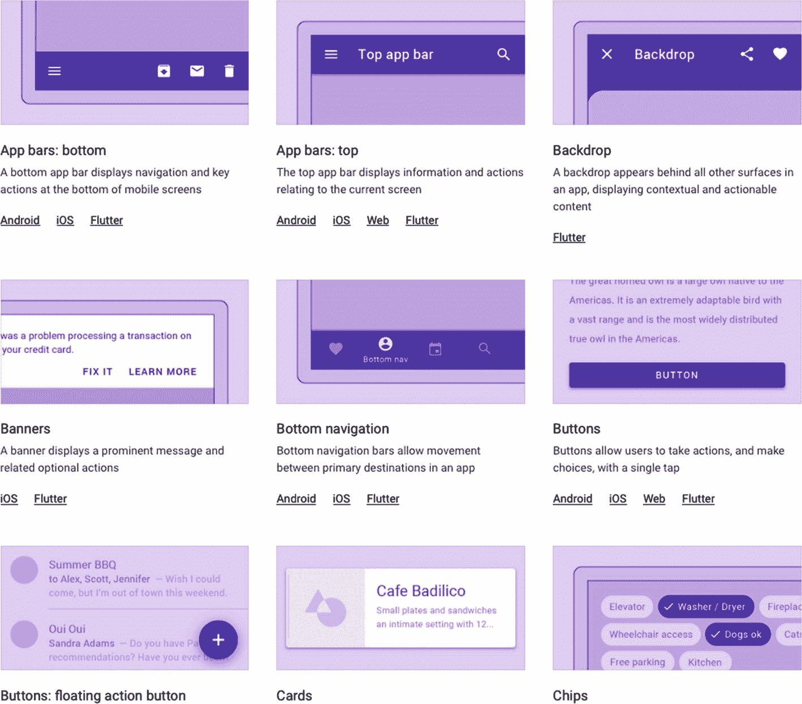
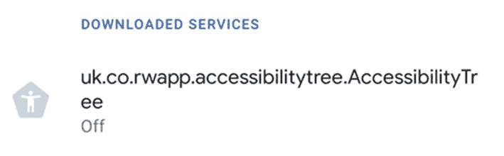
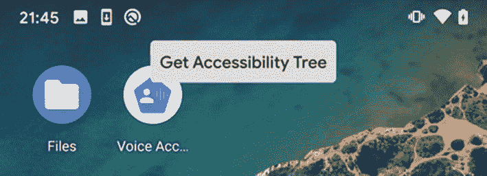
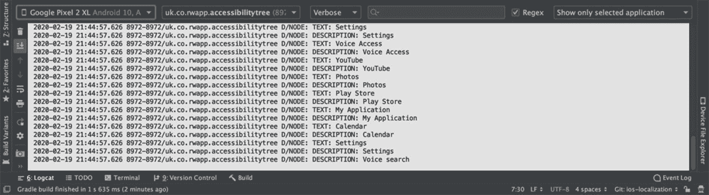
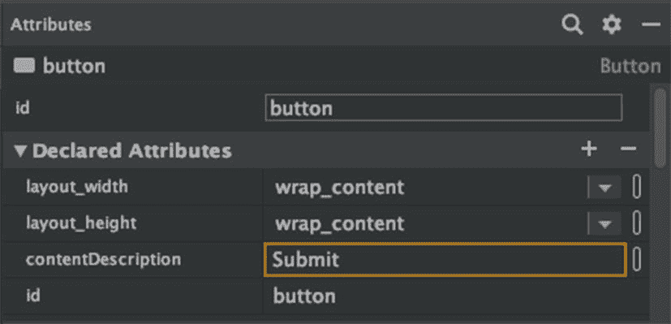
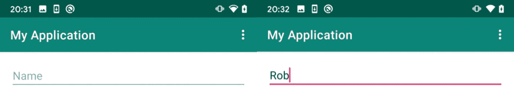
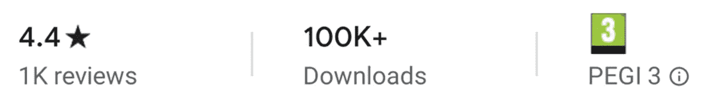
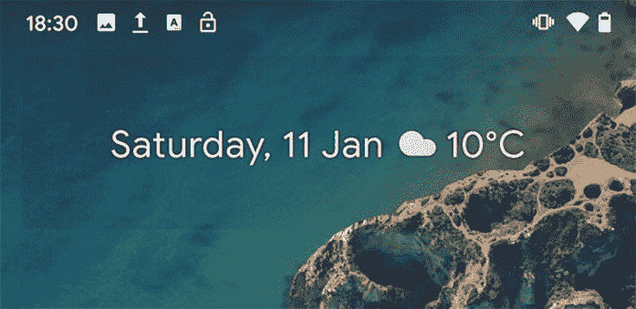
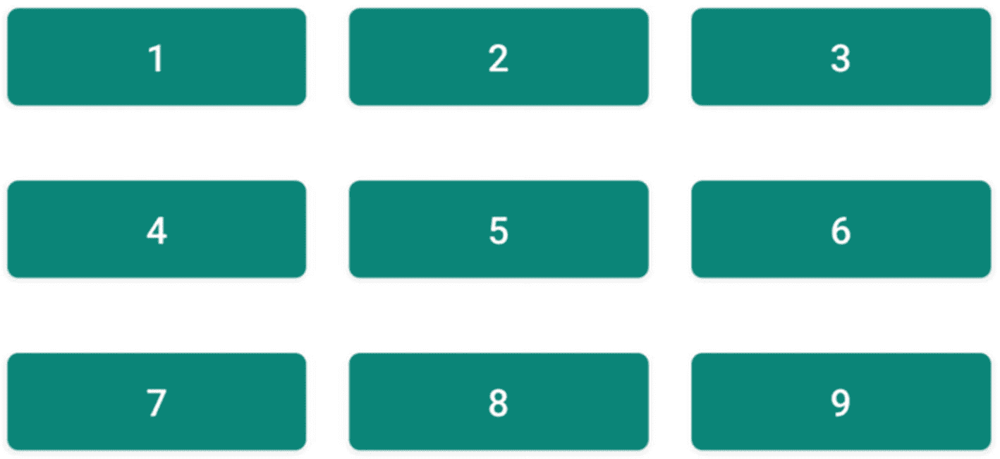
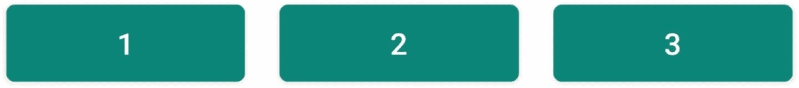

# 4.Android 可访问性模型

与平台的其他部分一样，Android 可访问性是高度可定制的。可访问性的很大一部分是关于可定制性的，所以 Android 在这方面有巨大的优势。如果 Android 没有一个适合特定需求的系统设置，那么任何开发者都可以创建一个定制的可访问性服务来满足这个需求。我们将在后面的“查看可访问性树”活动中粗略地看一下这个。由于手机和可用软件版本的差异很大，为了避免疑问，我使用的是运行 Android 10 的谷歌 Pixel 设备。

Google 的设计系统 Material Design <sup>[1](#Fn1)</sup> 贯穿于 Android 系统 app 中，是你创建 app 的基础。谷歌开发材料设计时考虑了高标准的可访问性，并遵循用户界面设计的最佳实践。使用 Android 的内置控件(图 [4-1](#Fig1) ) <sup>[2](#Fn2)</sup> )并遵循材料设计原则将意味着你的应用程序是一致的——不仅与 Android 系统一致，还与你的应用程序的其他部分一致。 <sup>[3](#Fn3)</sup> 这将帮助您的所有用户在使用您的应用程序时有宾至如归的感觉，并帮助您保持高水平的可访问性。



图 4-1

material.io 中的材料设计组件

Material design 的指南很好地介绍了如何使用 Android 的工具来创造无障碍体验。通读谷歌关于材料设计原则 <sup>[4](#Fn4)</sup> 和材料设计可及性 <sup>[5](#Fn5)</sup> 的介绍，以获得最佳实践。材料设计指南中的大多数信息都与制作 Android 应用程序的任何人相关，而不仅仅是设计师。

## 可访问性树

在我们介绍 Android 上可用的可访问性特性之前，让我们先了解一下 Android 可访问性模型是如何为辅助技术服务的。当使用 Android 应用程序时，您将熟悉 Android 从 XML 中扩展出来的控件和视图。创建一个你可以与之互动的用户界面。但是如何将这些视觉元素转换成辅助技术可以使用的格式呢？

Android 创建了一个被称为可访问性树的东西，它是呈现在屏幕上的元素的分层表示。辅助服务可以使用此辅助功能树来确定如何显示信息。Android 对你的用户界面以及如何向辅助技术表示做出了一些合理的假设。大多数情况下，这将提供一个可访问的功能体验。有时你可能需要调整这个树来呈现一个更好的体验。本章将为你提供实现这一目标的工具和技术。

### 辅助功能节点

Android 以可访问性节点树的形式向可访问性服务提供数据。辅助功能节点是屏幕上元素的表示。它们包含关于辅助技术可以执行的元素和操作的内容和元数据。

辅助功能节点和屏幕元素之间的区别是至关重要的。Android 并没有通过屏幕元素来呈现辅助技术，而是一个代理对象，包含与可访问性相关的信息。一旦可访问性服务接收到一个节点，这个节点就是不可变的。对视图的更改不会透露给可访问性服务，直到该服务下次请求该节点。

“辅助功能”节点包含对辅助技术有用的元素信息，例如，文本和描述等属性，以及元素是否可滚动或是否还包含标题等信息。元素在屏幕上的位置及其层次结构的细节也是如此。

Viewing The Accessibility Tree

Android 允许任何开发者创建可访问性服务。该服务可用于在屏幕上呈现内容、控制屏幕或设备，或者您可能期望辅助技术执行的任何其他任务。我们不会在这本书里讨论创建这样一个服务的来龙去脉，尽管 Android 确实提供了一个指南。我们将触及一些基础知识来说明可及性树是如何工作的。

如果你还没有，克隆这本书的 GitHub repo。导航至文件夹练习 4-1。在 Android Studio 中打开这个示例代码，然后单击 Run。

在您的设备或模拟器上，打开“设置”并找到“辅助功能”。在顶部，您应该会看到新的辅助功能服务列在下载的服务下面(图 [4-2](#Fig2) )。打开服务，并启用它。



图 4-2

我们设备辅助功能设置中的新辅助功能服务

辅助功能服务将在屏幕顶部覆盖一个“获取辅助功能树”按钮(图 [4-3](#Fig3) )。



图 4-3

“获取可访问性树”按钮覆盖在我们屏幕的顶部

在 Android Studio 中打开 Logcat 标签。单击新的“获取可访问性树”按钮。您将看到打印的一组输出(图 [4-4](#Fig4) )。这些是屏幕上所有当前元素的文本描述和标签。尝试导航到不同的屏幕，并再次点按该按钮，以查看以不同布局呈现给辅助功能服务的内容。



图 4-4

Android 应用程序启动器的可访问性树输出

有关可访问性服务可用属性的完整列表，请查看 Android 文档。 <sup>[7](#Fn7)</sup> 考虑查询不同的值(清单 [4-1](#PC1) )比如`isHeading`，看看每个屏幕如何报告自己的可访问性。例如，请参见下面的清单。

```java
if (node.isClickable) {
    Log.d("NODE", "is Clickable")
}

Listing 4-1Printing to the console if an element is clickable

```

## 辅助功能 API

Android 的可访问性 API 负责管理呈现给可访问性服务的视图。Google 在创建他们的标准控件时做了一些合理的假设。坚持使用 Android 类的控件，你的可访问性就没问题了。但是有时候你需要做一些调整来改善我们呈现给可访问性用户的内容。当您创建自己的自定义控件时尤其如此。如果你改变了 Android 的内置控件，你必须确认你没有删除任何辅助功能。我们将看看您可能需要考虑在这里设置的一些属性。

### 内容描述

对于像 TalkBack 这样的向用户呈现元素的辅助技术，该技术需要文本表示来呈现。默认情况下,`contentDescription`被设置为视图的文本值。对于没有文本值的元素，或者辅助技术提供的文本值不起作用的元素，您应该设置`contentDescription`值(列表 [4-2](#PC2) 和列表 [4-3](#PC3) )。

`contentDescription`应该是一个简洁的、描述性的标签。通常一个词就足够了，比如“提交”不要包含诸如“按钮”这样的控件类型，因为 Android 会为您添加。不要重复描述，保留这些独特的辅助导航。

```java
submitButton.contentDescription = "Submit"

Listing 4-3Setting a contentDescription in code

```

```java
<Button
    ...
    android:contentDescription="Submit" />

Listing 4-2Setting a contentDescription in a layout XML file

```

与所有可以在布局文件中设置的属性一样，该值也可以在设计模式下在属性窗格中设置，如图 [4-5](#Fig5) 所示。



图 4-5

在“属性”窗格中更改属性

### 对于可访问性很重要

如果一个元素纯粹是装饰性的，比如一个伴随文本的图标，那么将这个元素添加到你的可访问性树中意味着对对讲用户的额外的不必要的点击。在这种情况下，我们不应该向辅助技术提供这种元素。你可以通过设置`importantForAccessibility`到`no`(列表 [4-4](#PC4) 和列表 [4-5](#PC5) )来实现。或者，如果通常隐藏的元素提供上下文，您可以将该值设置为 yes。

```java
textIcon.importantForAccessibility =
      IMPORTANT_FOR_ACCESSIBILITY_NO

Listing 4-5Setting a view inaccessible in code

```

```java
<TextView
     ...
     android:importantForAccessibility="no" />

Listing 4-4Setting a view inaccessible in XML

```

### 暗示

提示值是元素的文本表示，独立于元素的文本值(清单 [4-6](#PC6) )。Android 以不同的方式使用这些值，这取决于您的元素是否有另一个文本值。

对于没有文本值的元素，提示显示为占位符值。提示也被 TalkBack 作为文本标签读取。这对于`EditText`元素向用户提供应该输入什么信息的提示很有用。出于这些目的，您的提示应该简短且具有描述性，遵循与上面的`contentDescription`相同的队列。

对于具有文本值的元素，不显示提示。TalkBack 读取元素文本值或`contentDescription`和元素类型后的提示。如果提示有助于用户浏览您的 UI，您可以使用它来为用户提供更多的上下文。例如，一个理想的用途是对按下按钮的后果进行简短描述。带有文本“发送”的按钮可能有“发送您的消息”的提示这使得将要执行的操作和预期的结果变得很清楚。作为编写提示的一般指南，想象一下向一个朋友解释这个控件是做什么的。

```java
<EditText
    ...
    android:hint="Email Address" />

Listing 4-6Setting a hint in a layout XML file

```

### 可访问性标题

当使用 TalkBack 导航屏幕时，没有视力或视力很差的用户通过在屏幕上从左向右滑动来导航。TalkBack 从左上到右下依次关注屏幕上的每个元素。对于有大量内容的屏幕，这意味着你的客户需要浏览大量不相关的内容才能找到他们想要的信息。这样标记你的标题(列表 [4-7](#PC7) 和列表 [4-8](#PC8) )允许对讲用户跳过内容浏览标题。

```java
headingLabel.isAccessibilityHeading = true

Listing 4-8Setting an element as a heading in code

```

```java
<TextView
        ...
        android:accessibilityHeading="true" />

Listing 4-7Setting an element as a heading in a layout XML file

```

### 最小尺寸

所有交互式元素，如按钮、复选框、开关和其他控件，必须至少为 44 个相对像素的正方形，以符合 WCAG 指南。Android 建议使用最少 48 个相对像素。

Android 提供了一种简单的方法来确保始终如此。无论设备或用户界面的其他部分如何，都将保持这种状态。针对任何交互控件设置`minWidth`和`minHeight`值(列表 [4-9](#PC9) 和列表 [4-10](#PC10) )。养成习惯，让它成为你添加到 UI 中的任何控件的标准属性。

```java
imageButton.minWidth = 48
imageButton.minHeight = 48

Listing 4-10Setting a minimum size for an image button in Kotlin

```

```java
<ImageButton
      ...
      android:minHeight="48dp"
      android:minWidth="48dp" />

Listing 4-9Setting a minimum size for an image button in XML

```

### 的标签

假设我们向客户展示一个表单，其中有一些`EditText`字段供他们填写。我们的客户如何知道在哪个字段输入什么数据？一种常见的方法是给我们的`EditText`添加一个提示值。Android 将此显示为该字段的占位符(图 [4-6](#Fig6) )。



图 4-6

编辑带提示的文本控件(左)和带内容的同一控件(右)。注意内容提示是隐藏的

当该字段是空的时，这很好地工作。一旦该字段输入了值，该占位符就消失了(图 [4-6](#Fig6) )，并且不再清楚该字段的用途。对于注意力或记忆力有问题的人来说，这是一次糟糕的经历。`labelFor`允许我们将一个`TextView`元素绑定到一个`EditText`或其他控件上。无论控件处于何种状态，该标签都保持可见(图 [4-7](#Fig7) )。不幸的是，这种技术确实给对讲用户增加了额外的不必要的刷卡，但总的来说，我相信使用`labelFor`属性会给你的客户带来更多的好处，而不是带来不便。


图 4-7

带有关联标签的 EditText 控件(左)。即使输入了内容，标签仍然可见(右图)

在作为参数提供的控件的“标签”的`TextView`上设置了`labelFor`属性(清单 [4-11](#PC11) 和清单 [4-12](#PC12) )。提供您想要将此标签绑定到的视图的`id`。

```java
textView.labelFor = editText.id

Listing 4-12Setting a label for an EditText control in Kotlin

```

```java
<LinearLayout
      ...
      >

      <TextView
           ...
           android:layout_marginBottom="0dp"
           android:labelFor="@+id/editText"
           android:text="@string/name" />

      <EditText
           ...
           android:id="@+id/editText"
           android:layout_marginTop="0dp"
           android:text="" />

</LinearLayout>

Listing 4-11Setting a text label for an edit text control in XML

```

### 遍历顺序

可访问性树是按照自然阅读顺序构建的。这意味着对讲和其他辅助技术将从最左上角的项目移动到最右下角的项目。这通常是正确的行为。但是有些设计，比如交错排列的元素，可能与视觉用户的阅读方式不同。这种布局的一个例子可以在谷歌 Play 商店看到，一个应用的下载量直接垂直显示在“下载”的标题下

在这种情况下，我们可能希望通过告诉 Android 当一个可访问性服务导航我们的 UI 时，哪个元素应该出现在下一个或上一个来改进我们的可访问性树。Android 有两种不同的方式来指定遍历顺序，这取决于客户使用的技术类型。如果您发现 Android 为您确定的遍历顺序不理想，那么我们需要确保我们设置了这两个选项。

#### 可访问性遍历顺序

我们可以使用`accessibilityTraversalAfter`和`accessibilityTraversalBefore`属性来做到这一点。就我个人而言，我发现从它们的名字中理解这些属性的行为很有挑战性。设置该属性的元素是“之前”和“之后”所指的元素。让我们在图 [4-8](#Fig8) 中对此进行说明，以阐明其含义。

假设我们有三个按钮。为了清楚起见，我们将它们标为“1”、“2”和“3”。我们希望保证这些元素以正确的数字升序被遍历。为此，我们将 after 和 before 值设置为 2。2 的`accessibilityTraversalBefore`值将是 1，因为我们希望 1 在 2 之前被*遍历。所以这使得 2 的`accessibilityTraversalAfter`值为 3，因为我们希望 3 在* 2 之后*到来。创建它的 XML 可以在清单 [4-13](#PC13) 中看到。*

```java
<Button
      ...
      android:id="@+id/button1"
      android:text="@string/one" />

<Button
      ...
      android:id="@+id/button2"
      android:accessibilityTraversalAfter="@id/ button3"
      android:accessibilityTraversalBefore="@id/ button1"
      android:text="@string/two" />

<Button
      ...
      android:id="@+id/button3"
      android:text="@string/three" />

Listing 4-13Setting accessibility traversal order in XML

```

您也可以在代码中用`setAccessibilityTraversalAfter()`和`setAccessibilityTraversalBefore()`方法设置这些，并传递您想在之前/之后访问的视图的`id`，如清单 [4-14](#PC14) 所示。

```java
two.setAccessibilityTraversalAfter(one.id)
two.setAccessibilityTraversalBefore(three.id)

Listing 4-14Setting accessibility traversal order in Kotlin

```

#### 方向控制

在可访问性遍历顺序中，我们需要设置焦点顺序。当用户使用方向键、遥控器或键盘箭头键导航用户界面时，Android 使用焦点顺序。我们将这些设置在一个元素上，以指定当用户按下特定方向的键时，下一个应该关注哪个元素。处理箭头键输入的属性有`nextFocusDown`、`nextFocusUp`、`nextFocusLeft`和`nextFocusRight`，处理 tab 输入的属性有`nextFocusForward`。

对于这个例子，假设我们有一个编号为 1 到 9 的 3 乘 3 的元素网格(图 [4-9](#Fig9) )。如果我们在中心元素，5 号呢？我们需要保证上移到 2，下移到 8，左移到 4，右移到 6，向前也移到 6。我们的中心元素(编号 5)的 XML 如清单 [4-15](#PC15) 所示。

```java
<Button
      android:id="@+id/button5"
      android:nextFocusUp="@id/button2"
      android:nextFocusDown="@id/button8"
      android:nextFocusLeft="@id/button4"
      android:nextFocusRight="@id/button6"
      android:nextFocusForward="@id/button6"
      android:text="@string/five" />

Listing 4-15Setting directional focus in XML

```

或者，如果我们需要在我们的应用程序代码中改变这一点(清单 [4-16](#PC16) ，我们也可以在这里设置这些值，传递我们希望在每个方向下一次聚焦的视图的`id`。

```java
button5.nextFocusUpId(button2.id)
button5.nextFocusDownId(button8.id)
button5.nextFocusLeftId(button4.id)
button5.nextFocusRightId(button6.id)
button5.nextFocusForwardId(button6.id)

Listing 4-16Setting directional focus in Kotlin

```

对于方向控制，我们还需要考虑另一个问题。在 Android 的这个功能的标准实现中，默认的焦点高亮不容易区分(图 [4-10](#Fig10) )，这意味着我们必须添加自己的。

最好的方法是在 styles.xml 文件中覆盖应用主题的`colorControlHighlight`，如清单 [4-17](#PC17) 所示。

```java
<style name="AppTheme" parent="Theme.MaterialComponents.DayNight">
      ...
      <item name="android:colorControlHighlight">@color/colorAccent</item>
</style>

Listing 4-17Setting our app’s theme’s control highlight color to our accent color

```

### 自定义控件

如果你坚持在应用程序中使用 Android 提供的控件，Android 会为你处理可访问性事件。如果您想要自定义控件，请选择与您想要实现的功能最接近的现有控件，并在其上构建。虽然有时你别无选择，只能从头开始建立控制。虽然从可访问性的角度来看不建议这样做，但是对于复杂的元素来说，这有时是必需的。如果您选择这样做，那么用不同的可访问性服务彻底测试您的控件是非常必要的。

首先，您需要确保您已经实现了本章中介绍的大多数属性。一旦你设置了这些值，Android 提供了关于你可能需要在你的控件上覆盖的其他功能的完整文档。 <sup>[8](#Fn8)</sup> 你需要实现哪些方法将取决于你的控制，但是我们将在这里讨论一些最重要的。

#### 辅助功能操作

`AccessibilityNodeInfo`也是我们需要告诉 Android 辅助技术可以在我们的视图上执行的操作的地方。这是我们向客户提供更多信息的机会，让他们了解我们的控制能够做什么以及如何做。

如果你把焦点放在一个有对讲功能的按钮上，一旦该元素的值被读取，对讲功能就会显示“双击激活”。这是一个可访问性操作，由两部分组成。这个按钮告诉 Android 它能够处理一个`onClick`事件。从这条信息中，Android 添加了“双击以”那么“激活”就是按钮提供的一个字符串。我们需要模仿这个来控制自己。假设我们有一个新的控件，它在一个点击事件上打开一个细节视图，并在一个长按上显示一个选项菜单。我们的代码如清单 [4-18](#PC18) 所示。

```java
class MyView: View {

    constructor(context: Context, attrs: AttributeSet): super(context, attrs)

    override fun onInitializeAccessibilityNodeInfo(info: AccessibilityNodeInfo?) {
        super.onInitializeAccessibilityNodeInfo(info)

        val click = AccessibilityNodeInfo.AccessibilityAction(AccessibilityNodeInfo.ACTION_CLICK, "open")

        val longClick = AccessibilityNodeInfo.AccessibilityAction(AccessibilityNodeInfo.ACTION_LONG_CLICK, "show options")

        info?.addAction(click)
        info?.addAction(longClick)
    }
}

Listing 4-18Adding accessibility actions to a custom view

```

#### 事件处理

虽然在视图中添加一个`setOnClickListener()`可能会使它在客户点击屏幕时正常工作，但这并不能保证您的视图会正确响应语音访问、对讲或其他辅助服务。你应该测试你是否需要覆盖`sendAccessibilityEvent()`或者`sendAccessibilityEventUnchecked()`函数。这些方法在每次视图上触发辅助功能事件时被触发，包括聚焦和点击。

根据您的视图是如何创建的，Android 可能已经如您所料为您处理了激活事件。对于像关注具有可访问服务的元素这样的事件，您可能需要对视图进行更改，例如添加高亮显示。您可以通过检查事件是否与可访问性焦点相关来做到这一点，如清单 [4-19](#PC19) 所示。

```java
class MyView: View {

    constructor(context: Context, attrs: AttributeSet): super(context, attrs)

    override fun sendAccessibilityEvent(eventType: Int) {
        super.sendAccessibilityEvent(eventType)

        when (eventType) {
             AccessibilityEvent.TYPE_VIEW_ACCESSIBILITY_FOCUS_CLEARED ->
                background = Color.BLACK.toDrawable()

             AccessibilityEvent.TYPE_VIEW_FOCUSED ->
                background =
                Color.RED.toDrawable()
        }
    }
}

Listing 4-19Setting the background color of a view red when it receives accessibility focus. Black when focus leaves the view

```

##### 文本更改事件

每当控件的文本值改变时，辅助功能服务都需要知道这一点。这有助于 Android 确保呈现给辅助功能用户的内容与屏幕上显示的内容相同。为此，您的定制视图必须通过发布一个`TYPE_VIEW_TEXT_CHANGED`的可访问性事件(清单 [4-20](#PC20) )来通知 Android 值已经更改。

```java
sendAccessibilityEvent(AccessibilityEvent.TYPE_VIEW_TEXT_CHANGED)

Listing 4-20Informing accessibility about a text change on our custom view

```

#### 节点信息

为了知道如何将你的视图呈现给可访问性用户，Android 收集了关于你的视图及其当前状态的信息。这包括视图的大小和位置。当 Android 请求这些信息时，它在您的视图上调用`onInitializeAccessibilityNodeInfo()`，传递一个初始化的`AccessibilityNodeInfo`供您填充(清单 [4-21](#PC21) )。你应该总是在这里调用 super 来让 Android 填充一些明智的默认值。然后，您可以添加控件需要的任何其他属性。这可能包括像`isHeading`或`isCheckable`这样的属性。

```java
class MyView: View {

    constructor(context: Context, attrs: AttributeSet): super(context, attrs)

    override fun onInitializeAccessibilityNodeInfo(info: AccessibilityNodeInfo?) {
        super.onInitializeAccessibilityNodeInfo(info)

             // Accessibility services will treat your view as toggleable.
        info?.isCheckable = true
    }
}

Listing 4-21Adding properties to our custom view’s accessibility info

```

#### 代表

如果您选择使用提供的 Android 控件，但是希望对每个控件的可访问性如何工作有更细粒度的控制，那么您可以使用一个`AccessibilityDelegate`类。创建一个扩展`AccessibilityDelegate`的类；然后将其设置为视图上的代表(列表 [4-22](#PC22) )。委托可以覆盖我们之前介绍过的相同的可访问性方法。

```java
class MyAccessibilityDelegate : View.AccessibilityDelegate() {

    override fun onInitializeAccessibilityNodeInfo(host: View,
       info: AccessibilityNodeInfo) {
        super.onInitializeAccessibilityNodeInfo(host, info)

        // add custom actions
    }
}

class MyActivity : Activity() {

    override fun onCreate(savedInstanceState: Bundle?) {
        super.onCreate(savedInstanceState)
        setContentView(R.layout.my_activity)

        val accessibilityDelegate = MyAccessibilityDelegate()

        button.accessibilityDelegate = accessibilityDelegate
       }
}

Listing 4-22Setting an accessibility delegate

```

## 语义视图

创建语义视图是一种强大的高级技术，可以创建最容易访问的应用程序。语义视图将两个或更多有关联意义的元素联系在一起。Android 然后将它们作为一个元素呈现给可访问性用户。这可以减少噪音，让你的应用导航更加简单、快速、轻松。如果你真的想给你的可访问性用户最好的体验，你需要使用这种技术。

谷歌在谷歌 Play 商店使用了这种技术。当查看一个应用程序或游戏的列表页面时，我们会在该应用程序的图标下看到三个框(图[4-11](#Fig11))——该应用程序的评级、下载次数和年龄评级。第一项，应用程序的评级，显示“4.4 ⭑”，然后在新的一行“1K 评论”此外，评级文本和年龄评级文本是按钮。如果您在启用 TalkBack 的情况下访问这些元素，而不更改可访问性树，则 TalkBack 将读取以下内容:



图 4-11

谷歌 Play 商店应用信息



图 4-10

突出日期的键盘导航——你可能看不出日期周围有方框



图 4-9

由九个按钮组成的网格。我们希望确保从数字 5 开始，方向导航就像预期的那样工作



图 4-8

三个按钮。我们希望确保它们按数字顺序导航

*   “四点四星。双击以激活。”刷卡。

*   " 100 K 加"游啊游啊游啊游啊游啊游啊游啊游啊游啊游啊游啊游啊游啊游啊游啊游啊游啊游啊游啊游啊游啊游啊游啊游。

*   “1 K 评论。”刷卡。

*   "下载。"刷卡。

*   “PEGI 3 号。双击以激活。”

刷的真多。刷一下，我们只听到“下载”这个词 100K 指的是什么？幸运的是，这不是 TalkBack 展示这一观点的方式。谷歌 Play 商店开发人员已经改进了他们的可访问性树，以提供更好的体验。相反，这是互动:

*   “一千条评论平均评分四点四星。双击以激活。”刷卡。

*   “下载了十万多次。”刷卡。

*   “内容分级 PEGI 3。双击以激活。”

将这些元素组合在一起有几个好处。首先，需要更少的刷卡次数，从五次减少到三次。意味着导航更快更简单。与分组相关的元素，如应用评论值和评论数量，提供了每个值的含义。通过将“100，000 plus”改为“100，000 plus ”,该文本也被修改为对对讲客户更有意义虽然从视觉上可以清楚地看到 K 代表千，但我们很少大声说出 K 代表千。

### 可聚焦容器

实现这一点的最简单的方法之一是使用可聚焦的容器。布局容器如`LinearLayout`和`RelativeLayout`是不可见的，并且不包含任何内容。但是它们包含属性，我们可以设置这些属性，使它们出现在诸如 TalkBack 之类的可访问性服务中。以谷歌 Play 商店的应用评级为例。如果我们想要实现类似的东西，我们可以使用垂直线性布局，如清单 [4-23](#PC23) 所示。

```java
<LinearLayout
      ...
      android:orientation="vertical">

      <TextView
           ...
           android:text="@string/rating” />

      <TextView
           ...
           android:text="@string/number_of_reviews" />
</LinearLayout>

Listing 4-23A vertical linear layout with text

```

目前，这个视图需要两次滑动才能进行对讲导航，可能不清楚等级值指的是什么。为了清楚起见，让可访问性服务把这个视图看作一个单独的元素。为此，我们可以将线性布局的 focusable 属性设置为 true。你可以用代码(清单 [4-24](#PC24) )或者直接用我们的 XML(清单 [4-25](#PC25) )来实现。

```java
<LinearLayout
      ...
      android:focusable="true"
      android:orientation="vertical">

      ...

</LinearLayout>

Listing 4-25Setting a linear layout focusable in XML

```

```java
linearLayout.focusable = View.FOCUSABLE

Listing 4-24Setting a linear layout focusable in Kotlin

```

这里的结果是每个单独的文本视图不再显示为对讲。相反，线性布局是重点，Android 已经将文本视图的值传递给线性布局。这是一个惊人的改进，但是我们仍然有一个关于读取信息的问题。我们的客户听到的不是“10 万条评论”，而是“10 万条评论”因此，让我们删除可聚焦的值，代之以将内容描述传递给线性布局。我们将在本章前面的内容描述部分介绍如何做到这一点。不要只是连接两个可视的字符串，而是生成一个新的可访问的字符串，在大声朗读时更有意义。有了内容描述，我们的线性布局已经自动隐藏了其子元素。相反，布局元素是重点，我们的新内容描述朗读。

## 摘要

*   Android 的可访问性服务使用一种称为可访问性树的技术来理解你的应用程序的 UI。这是为您构建的，但您需要调整它，以确保它对您的客户有意义。

*   尽可能坚持使用 Android 提供的视图和控件。创建自己的控件时，可访问性很复杂。Android 已经为你做了很多艰苦的工作。

*   将连接的视图组合成语义视图。这将使你的应用程序使用起来更快，更容易理解。

在这一章中，我们讨论了 Android 的可访问性系统是如何在底层工作的。您现在对如何制作一个与辅助技术共生的界面有了更清晰的想法。让我们仔细看看 Android 为我们的客户提供的一些辅助功能。我们还将讨论作为开发人员需要做出的一些决定，以便为依赖他们的用户提供最好的支持。

<aside aria-label="Footnotes" class="FootnoteSection" epub:type="footnotes">Footnotes [1](#Fn1_source)

[T2`https://material.io`](https://material.io)

  [2](#Fn2_source)

[T2`https://material.io/components/`](https://material.io/components/)

  [3](#Fn3_source)

谷歌也为 iOS 提供了材料设计，但这是错误的一致性类型。在 iOS 上使用材料设计意味着用户在进入/离开你的应用程序时有更大的上下文切换。在 iOS 上使用材质设计会导致 app 的易用性降低。谷歌在 Material Design 的可访问性指南中对此提出了警告，同时鼓励 Material Design 在 iOS 上的使用。☺

  [4](#Fn4_source)

[T2`https://material.io/design/introduction/`](https://material.io/design/introduction/)

  [5](#Fn5_source)

[T2`https://material.io/design/usability/accessibility.html`](https://material.io/design/usability/accessibility.html)

  [6](#Fn6_source)

[T2`https://developer.android.com/guide/topics/ui/accessibility/service`](https://developer.android.com/guide/topics/ui/accessibility/service)

  [7](#Fn7_source)

[T2`https://developer.android.com/reference/android/view/accessibility/AccessibilityNodeInfo.html`](https://developer.android.com/reference/android/view/accessibility/AccessibilityNodeInfo.html)

  [8](#Fn8_source)

[T2`https://developer.android.com/guide/topics/ui/accessibility/custom-views`](https://developer.android.com/guide/topics/ui/accessibility/custom-views)

 </aside>