# 5.Android 辅助功能

在这一章中，我们将看看 Android 的辅助功能。这不是一个详尽的指南；我们将把重点放在可能影响你作为开发人员的特性上，因为你需要提供支持，为特性的工作做出一些决定，或者因为它可能以某种方式改变你的应用的外观或感觉。有关更多以消费者为中心的可用功能介绍，请查看谷歌的支持页面。 <sup>[1](#Fn1)</sup>

Android 的辅助功能因设备和供应商而异，平台上的许多功能也是如此。还可以通过谷歌 Play 商店添加第三方辅助工具。可访问性的一个主要方面是可定制性。对于用户来说，能够选择具有适合他们的功能的设备，然后根据需要添加和定制这些功能是一种优势。但是这确实意味着您的开发目标是一个移动的目标，所以跨设备的手动测试是必不可少的。作为本章的参考设备，我使用的是运行 Android 10 的谷歌 Pixel。

## 特征

设备的辅助功能设置是“系统设置”应用中的顶级选项。当你切换它的时候，Android 立即启用这个菜单中的每个选项。大多数都提供了一个简短的文本描述，说明定制做了什么以及如何做。许多网站提供了一个你正在做的改变的可视化例子，有些甚至是一个教程。这些设置都不是破坏性的，您可以通过关闭来再次禁用它们。所以我建议花几分钟时间熟悉一下这些设置的内容。尝试启用每一个；反过来，打开设置导航你的应用，看看它给你的体验带来了什么变化。你的应用还能像你期望的那样工作吗？也许你会发现，在启用这些考虑因素的情况下，你可以通过使用你的应用快速取胜。其中一些设置，如对讲，会改变您与设备的交互方式。有必要先了解一下这些特性。但如果你想陷进去，Android 会在你第一次切换 TalkBack 时给你一个全面的教程。这些辅助功能设置都是关于可定制性的，因此您可能会找到想要在自己的设备上启用的设置。

### 音量键快捷键

音量键快捷键是测试你的应用的绝佳工具。它允许您快速启用和禁用选定的辅助功能服务。立即在您设备的设置中启用此服务。当我们讨论不同的服务时，请在服务设置中更改此快捷方式切换的服务。这样，无论您身在何处，都可以顺畅地访问该服务，而无需在设置间来回导航。启用后，按住设备的两个音量键 3 秒钟，以切换您选择的辅助功能服务。

可用选项因设备而异，但包括设备上安装的大多数辅助功能服务。我们将在本章的后面讨论这些特性。现在，我建议切换到对讲。这样，您就有了一个快速、简单的方法来为可访问性测试启用对讲。这将有助于使屏幕阅读器设备测试成为开发流程中的常规部分。

### 对讲系统

当我们谈论移动设备的可访问性时，我们经常用可访问性这个词来代表屏幕阅读器导航服务，比如 TalkBack。如果你知道一个 Android 可访问性服务，它很有可能是 TalkBack。

Tip

启用该服务前，请阅读对讲导航部分。

TalkBack 是 Android 内置的屏幕阅读器服务。它使盲人和弱视用户能够听到屏幕上的内容，但它不仅仅是一个屏幕阅读器。通过宣布控件并允许用户通过定义的手势与它们交互，TalkBack 允许您的客户导航他们的整个设备，而不必看到屏幕(图 [5-1](#Fig1) )。您的应用已经与 TalkBack 兼容，无需您进行任何设置。但是你的应用和 TalkBack 配合的如何是一个不同的问题。Android 的内置控件都是在考虑 TalkBack 的情况下创建的。因此，如果您已经使用这些控件作为基础，您可能会发现它的效果比您在做出任何改进之前可能预期的要好。

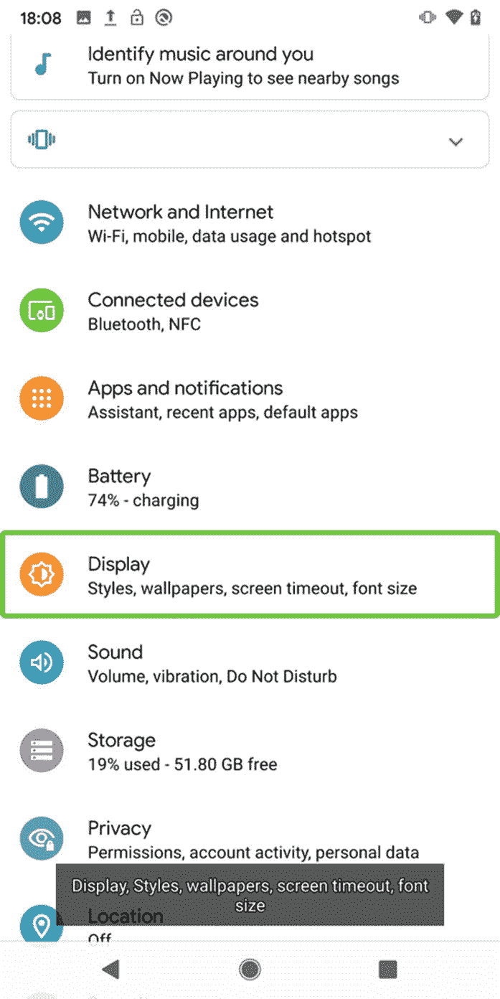

图 5-1

对讲突出显示显示设置并读取控制内容

TalkBack 要求元素具有文本表示，以便客户可以阅读该元素。对讲系统读取的信息及其顺序因元件而异。默认情况下，如果元素有文本值，TalkBack 将读取它。如果你的元素的文本很短，它可能缺少视觉用户从它周围的元素中得到的上下文。如果元素的文本很长，对于对讲用户来说可能太冗长了。在这种情况下，内容描述，一个简短的描述可访问性的字符串，可能会更好。如果存在，Android TalkBack 读取内容描述而不是文本值。TalkBack 遵循文本或内容描述，在出现时带有提示或角色；顺序取决于元素的状态和类型。我们在前一章中已经详细介绍了这些。虽然 TalkBack 只是一种可访问性服务，但它使用的可访问性树与其他服务一样。一般来说，如果你的应用和 TalkBack 配合得很好，你会发现其他辅助服务也可以。

出于测试和学习的目的，我还建议启用显示语音输出设置。你可以在开发者设置下的对讲设置中找到。这将在屏幕上显示一段当前正在朗读的祝酒辞。这将有助于您准确理解您向客户展示的内容。

Android 提供了一种简单的方法来检测可能影响应用功能的典型屏幕阅读器功能。TalkBack 允许用户与屏幕上的元素进行交互，而无需激活它们。这是通过在屏幕或特定元素上点击或执行触摸手势来完成的。这意味着这些手势不会传递到你的应用，元素的激活方式也不同。因此，了解您客户的设备是否启用了此功能可能会很有用，因为您可能需要调整您的应用如何使用触摸手势。你可以通过查询 Android 的`AccessibilityManager`(清单 [5-1](#PC1) )上的`isTouchExplorationEnabled`属性来实现。

```java
val a11yManager = getSystemService(Context.ACCESSIBILITY_SERVICE) as AccessibilityManager
val isExploreByTouchEnabled = a11yManager.isTouchExplorationEnabled

Listing 5-1Determining if explore by touch is enabled

```

有关检测对讲或其他辅助功能服务是否启用的详细信息，请参阅本章后面的“检测辅助功能服务”一节。

#### 更新内容

即使有一个完美的可访问性树，你可能会发现有些情况下你需要提醒对讲用户屏幕上的视觉变化。这可能是通知您的客户有新消息到达，一个长期运行的任务已经完成，或者一个游戏的分数已经改变。有两种方法可以做到这一点。但是在您决定添加任何一个功能之前，请考虑您是在为您的客户增加价值还是仅仅增加噪音。

#### 宣布可访问性

在任何时候你都可以告诉 TalkBack 用`announceForAccessibility()`方法宣布你传递的任何字符串(列表 [5-2](#PC2) )。此方法在任何视图上都可用。

```java
myView.announceForAccessibility("New message received")

Listing 5-2Making TalkBack announce the screen has changed

```

#### 实时区域

实时区域是屏幕上更新内容与对讲用户交互分开显示的区域。一个例子可以是显示的过滤的搜索结果的数量的计数器。在搜索字段中键入时，客户会想知道他们键入的每个字符返回的结果是多了还是少了，但是在搜索字段中输入和输出每个字母会很费力。

在这些情况下，您可以将结果计数器标记为活动区域(清单 [5-3](#PC3) 和清单 [5-4](#PC4) )。实时区域将在每次更新时宣布其内容，无需您的客户进行任何进一步的交互。实时区域有两种可能的模式:`polite`和`assertive`。`polite`将在任何当前话语结束后阅读内容。`assertive`将中断任何现有的公告；除非绝对必要，否则避免这些。

```java
resultsCounter.accessibilityLiveRegion = View.ACCESSIBILITY_LIVE_REGION_POLITE

Listing 5-4Creating a live region in Kotlin

```

```java
<TextView
     ...
     android:accessibilityLiveRegion="polite" />

Listing 5-3Creating a live region in XML

```

Navigating With Talkback

TalkBack 改变了与应用交互的模式。一旦您在设备的可访问性设置中启用了此服务，TalkBack 即开始运行。因此，你必须了解它对你与你的设备交互方式的改变，尤其是当你完成时，你可以关闭这个功能！

TalkBack 以自然的方向导航你的用户界面的所有可读元素——在大多数语言中是从左上到右下——在前进的过程中用一个边框高亮显示每个元素。您可以通过点击来选择元素；一次点击将不再激活控件。向右滑动屏幕上的任意位置以导航到下一个元素，或者向左滑动以导航到上一个元素。要激活控件，您现在必须双击。

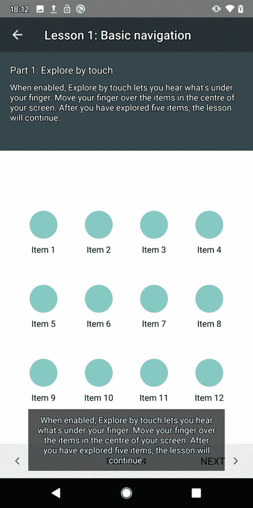

图 5-2

安卓的 TalkBack 教程应用

幸运的是，TalkBack 有一个奇妙的教程应用，允许你练习使用屏幕阅读器的功能。如果这是第一次在该设备上激活 TalkBack，只要您打开该服务，TalkBack 就会启动其教程(图 [5-2](#Fig2) )。如果之前已经启用对讲，可以手动开始本教程。在列表底部的对讲设置中找到它。要导航到那里，请记住–点击一次以选择一个元素；双击以激活该元素。在滚动视图上向右然后向左滑动以向下翻页。在尝试使用 TalkBack 之前，请先完成教程；会让你以后少受很多挫折。

### 选择发言

与 TalkBack 相比，Select to Speak 是一个更“传统”的屏幕阅读器。选择朗读将按照文本内容出现的顺序朗读屏幕上出现的任何文本内容。“选择说话”不提供任何导航或与应用交互的帮助。这使得它成为那些因为视力低下、诵读困难或识字率低而难以阅读的人的理想工具。

与 TalkBack 相比，Select to Speak 在阅读内容、阅读方式和阅读时间方面有所不同。这个工具的目的是帮助处理大量的文本，例如一篇文章或电子书，或者更大篇幅的文本。选择朗读不是为了帮助导航或暗示布局的含义。因此，选择朗读会读取屏幕上显示的内容，忽略您对辅助功能树所做的任何更改。这包括忽略分组的元素和内容描述，除非具有内容描述的元素没有其他文本表示。例如，在谷歌 Play 商店上，TalkBack 会将应用的评级读作“来自 1200 万条评论的四点二星”，Select to Speak 会读作“四点二星”。十二 M 评论。”

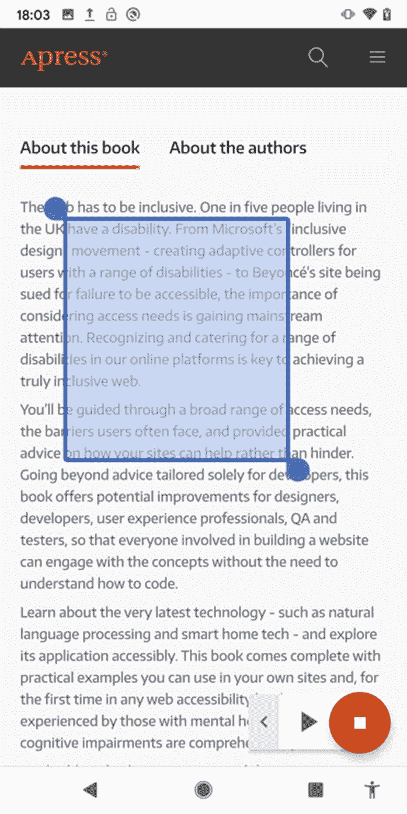

图 5-3

选择以启用朗读，同时选择一个区域进行阅读

选择“朗读”会在屏幕的右下角添加一个辅助功能按钮。点击它，用户有两种选择:按下播放按钮以自然阅读方向阅读整个可见屏幕，或者在屏幕的一个区域上拖动手指(图 [5-3](#Fig3) )。第二个选项绘制一个边界框；选择朗读朗读边界框区域内的任何元素。

### 字体大小

Android 原生支持全局缩放字体大小，以适应您客户的偏好(图 [5-4](#Fig4) )。选项的数量因供应商而异，但谷歌的 Pixel 设备支持四种设置，从小到大。

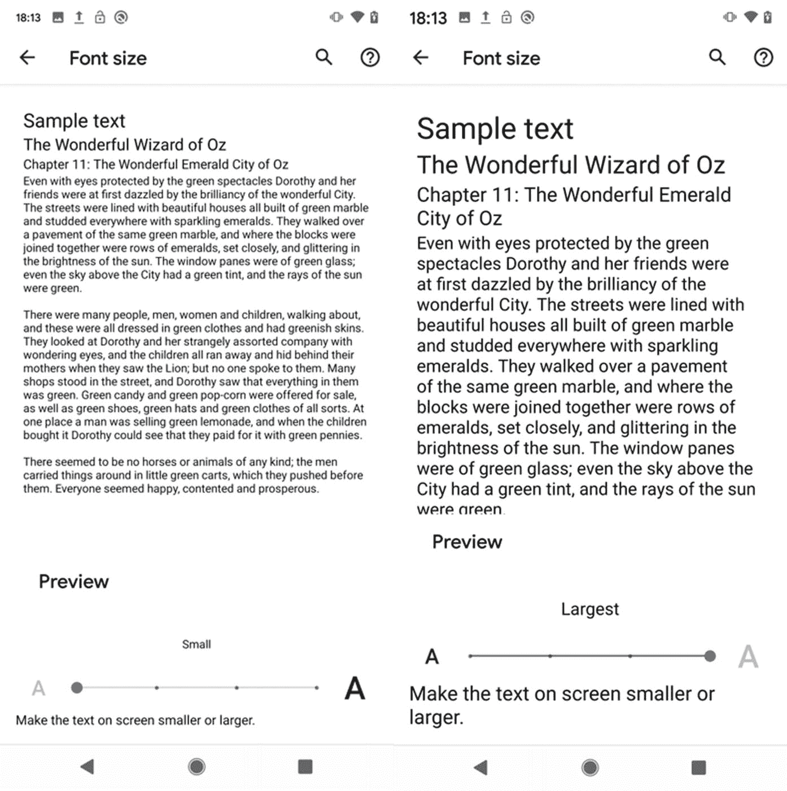

图 5-4

Android 的最小(左)和最大(右)字体大小。外观因设备而异

你可以使用与缩放无关的像素在你的应用中实现自动字体缩放；你会在布局文件中看到这些“sp”单元(列表 [5-5](#PC5) )。SP 单位代表像素，但有一些可变元素。这允许设计者指定字体大小，比如 14px 然后我们可以将它作为 14sp 输入到 XML 中。在标准文本大小下，这将显示为相当于 14px。

```java
<TextView
      ...
      android:textSize="14sp"
      android:layout_width="wrap_content"
      android:layout_height="wrap_content"  />

Listing 5-5Setting text size by scale-independent pixels

```

sp 单元的可变元素首先是屏幕密度。1sp 在 160 dpi(每英寸点数)屏幕上的默认文本大小相当于 1 个像素。具有更高或更低 dpi 的屏幕被适当地放大或缩小。一个固定的像素数字在不同的 dpi 中会显得更大或更小，而一个 sp 单位看起来应该大致相同。第二，sp 单位由用户选择的字体大小设置按比例缩放。这意味着确保所有文本都设置为 SP 单位将保持视图的外观，同时支持辅助功能。

为了充分支持用户不同的文本大小和屏幕密度，一个相关的考虑因素是您为显示文本的元素提供的大小。避免使用固定的高度或宽度尺寸，而是提供`wrap_content`。使用和组合布局，如线性布局和约束布局，将允许文本元素-编辑文本，按钮，文本视图等。–根据需要进行扩展和收缩，同时保持您的预期设计。任何包含文本的元素都应该显示在滚动视图中。这将确保用户使用任何给定的文本大小、屏幕大小、屏幕密度等组合。仍然可以阅读您的所有内容。

### 显示尺寸

Android 支持各种屏幕形状和尺寸的能力使其能够无摩擦地支持另一个辅助功能:可调显示屏尺寸(图 [5-5](#Fig5) )。这对于你的应用来说是无缝的，只要你遵循一些简单的设计准则:避免固定大小的元素，更喜欢`wrap_content`。使用灵活的布局，如约束布局。将文本内容放在滚动视图中，并使用相对单位而不是固定单位。

例如，像素的物理大小在不同的屏幕分辨率下会有所不同，而毫米在不同的设备上具有固定的大小，但在屏幕上占据的空间大小会有所不同。相反，如果您使用 sp 单位(与比例无关的像素)为文本大小定义所有布局尺寸，使用 dp 单位(与密度无关的像素)为非文本值定义所有布局尺寸，效果会更好(清单 [5-6](#PC6) )。这些值根据环境变量按比例缩放。这些变量包括客户对文本大小和显示大小的设置，以及他们设备的像素密度。

```java
<Button
      ...
      android:layout_width="wrap_content"
      android:layout_height="wrap_content"
      android:textSize="24sp"
      android:padding="16dp" />

Listing 5-6Defining a button’s text size and padding using sp and dp units

```

使用 sp 和 dp 单元将在用户的各种设备上保持您的屏幕布局，并支持缩放的屏幕尺寸和缩放的文本，从而在保持高标准设计的同时帮助您的客户。

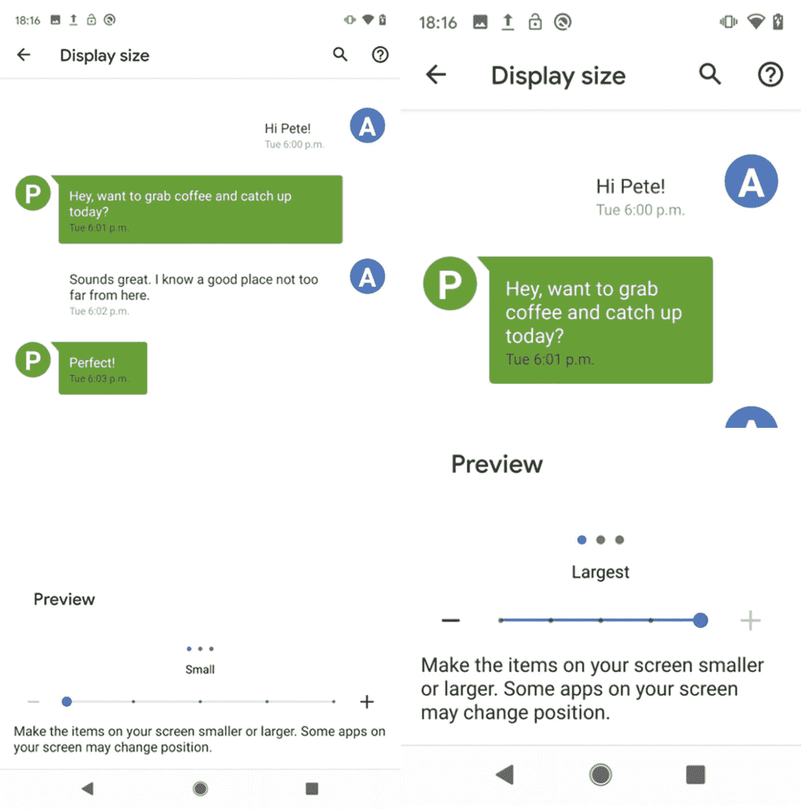

图 5-5

Android 的最小(左)和最大(右)显示屏尺寸。外观因设备而异

### 黑暗主题

Android 10 的新主题是黑暗主题。我知道很多开发者喜欢有黑暗主题的界面。因为我们要花几个小时看屏幕，如果没有白光照射，我们的眼睛会有很大的不同。另外，它看起来真的很酷。但是深色主题也是一个重要的辅助功能。大量明亮的光线对于患有特定视力问题(如白内障)的人来说可能是一个问题，因为光线会导致不适，并破坏人的其余视力。深色主题的高对比度也可以让色觉减退或视力模糊的人更容易区分元素。因此，虽然很容易认为深色主题很好，但对许多人来说，这是一个基本的可访问性特性。

支持黑暗主题需要对你的应用进行一些更改。首先，如果你还没有，你需要编译 API 级。支持黑暗主题的最快方法是通过将清单 [5-7](#PC7) 中的代码行添加到 styles.xml 文件中的应用主题中来强制应用支持黑暗模式。

```java
<style name="AppTheme"
      parent="Theme.MaterialComponents.Light.DarkActionBar">
      ...
      <item name="android:forceDarkAllowed">true</item>
</style>

Listing 5-7Forcing dark theme support for an app style

```

你可能会发现这适用于你的应用，但这是一个相当生硬的工具。我们正在使用我们的原始主题结合 Android 的默认黑暗主题行为。我们无法控制我们的应用如何处理黑暗主题。我们有可能需要对事物的外观进行更精细的控制。

Android 让我们能够为调色板中定义的每种颜色定义黑暗或夜晚的变化。在 Android Studio 中，在项目导航器中找到 *res* 目录。点击右键，选择新建➤安卓资源文件。将文件命名为颜色——我们已经有了一个同名的文件，这没关系；我们在做一个夜间变体。在可用限定符下找到夜间模式(图 [5-6](#Fig6) ，并按下添加按钮选择它。在现在出现的夜间模式下拉框中，将值更改为“Night”，然后按 OK。

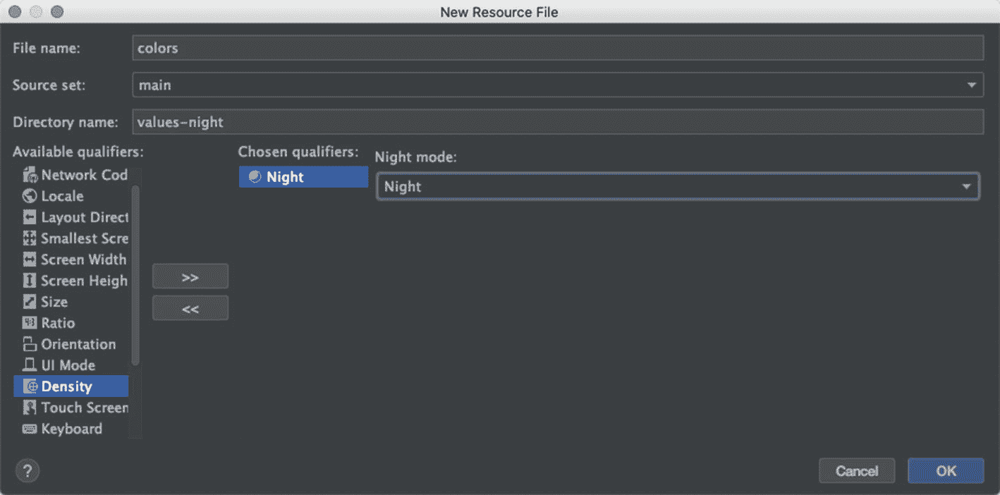

图 5-6

创建夜间模式颜色文件变体

然后你会发现你现在有两个颜色文件出现在你的项目导航器中。一个后缀为*(夜)*。(图 [5-7)](#Fig7)

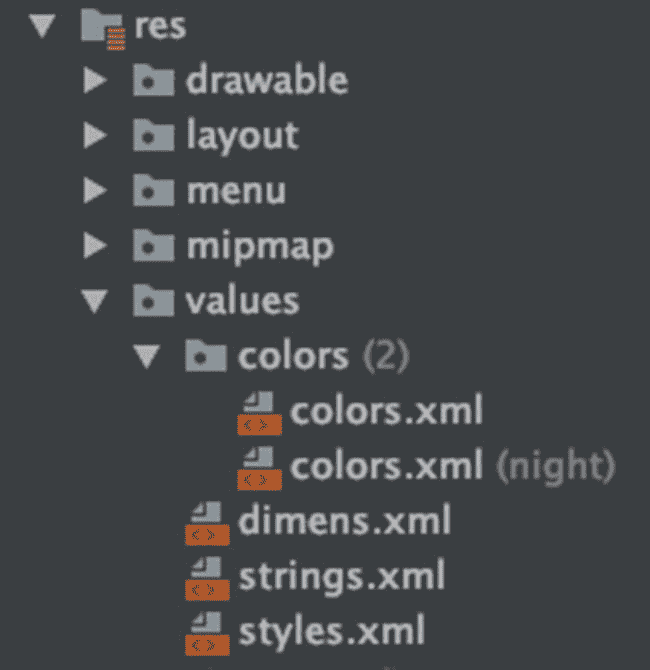

图 5-7

Android Studio 的项目导航器中的两个颜色值 XML 文件。一个是夜间变体

appear in your project navigator. One with the suffix “

在这个新的 night variant 文件中，您可以从需要深色主题变量的原始颜色值文件中复制任何颜色值。例如，如果你的标准背景颜色是`<color name="background_color">#FFFFFF</color>`，你可以把它作为`<color name="background_color">#FF808080</color>`添加到你的夜间模式文件中。这将使你的背景在黑暗模式下变成深灰色，而不是 Android 默认的黑色。任何你不抄袭安卓的颜色都会为你调整。为了做到这一点，我们需要确保我们没有在任何布局 XML 文件或应用代码中使用任何硬编码的颜色值。总是在你的 colors.xml 文件中定义颜色，然后通过名称引用这个定义的颜色，如清单 [5-8](#PC8) 和清单 [5-9](#PC9) 所示。

```java
val color = getColor(R.color.background_color)

Listing 5-9Referencing our background color value in code

```

```java
<LinearLayout
      ...
      android:background="@color/background_color" >

Listing 5-8Referencing our background color value in a layout

```

### 放大

Android 有两个放大服务。放大的结果是一样的；区别在于它们是如何被触发的。顾名思义，你可以通过在屏幕上的任何地方点击三次来切换放大。使用快捷方式放大(图 [5-8](#Fig8) )在屏幕右下角添加一个辅助功能快捷按钮，作为导航栏的一部分。轻按按钮一次，打开或关闭放大功能。

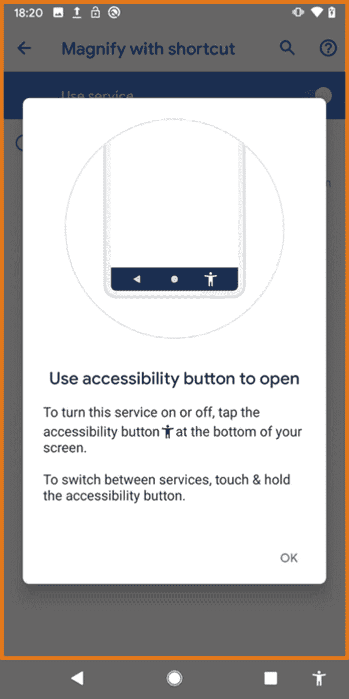

图 5-8

通过辅助功能按钮启用快捷方式放大

Android 开发人员需要注意放大有两个原因，第一个原因可能会影响任何应用。由于文本是从左到右书写的，任何放大用户通常会从屏幕的左侧向下扫描(或者在从右到左语言的情况下从右侧向下扫描)。这意味着如果你有不自然(左)对齐的内容，放大用户通常会错过这一点。例如，如果您在表格的某一行旁边添加一个表示状态的图标，如果您的图标位于文本的右侧，放大用户可能不会注意到状态图标(图 [5-9](#Fig9) )。在可能的情况下，保持任何有意义的内容自然对齐。

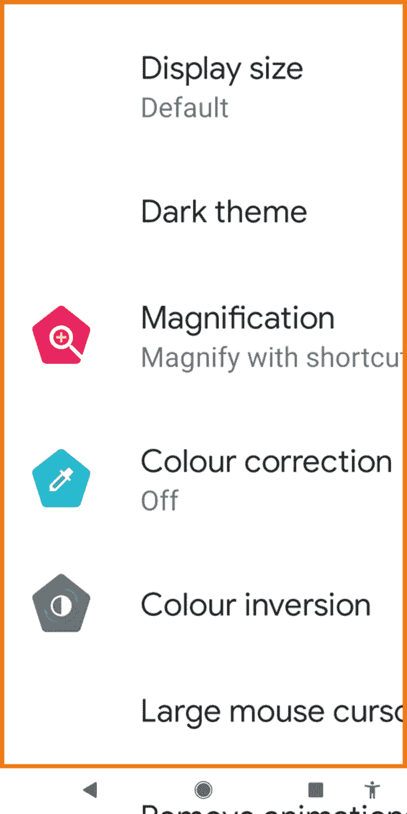

图 5-9

启用放大功能导航辅助功能设置。任何右对齐的内容都可能会丢失

开发人员应该注意的另一个放大功能是使用的手势。三次点击放大将覆盖您的应用侦听的任何三次点击事件，这意味着如果启用放大，您的应用将不会接收到任何三次点击手势，即使您的用户没有激活取景器。激活后，放大功能使用两个手指滑动来移动取景器，两个手指挤压手势来放大和缩小。这意味着一旦放大功能激活，您的应用将不会收到两个手指滑动或挤压手势。解决这一问题的理想方法是，在适当启用或激活放大功能后，修改应用使用的手势。不幸的是，就目前情况来看，我还没有找到一种方法来检测这些放大服务是否处于活动状态。本章后面提到的检测放大服务的方法似乎没有返回这些服务中的任何一个。对于希望手势在你的应用中工作的放大用户来说，这可能意味着令人沮丧的体验。这只是为什么你应该为你的应用使用的任何触摸手势提供替代品的一个原因。

### 颜色校正

色彩校正提供了一系列滤镜，旨在帮助有色彩缺陷的用户。这些滤光器有助于增加对比度，并使颜色远离那些不足会导致区分问题的颜色。Android 通过全局覆盖来实现这一点，因此开发人员不需要做任何工作来支持颜色校正。

然而，你应该尝试应用中可用的每个滤镜，以确定每个滤镜的对比度是否仍然足够高，并看看是否仍然有可能在需要的地方从颜色使用中获得意义。你应该避免把颜色作为传达意思的唯一方式，也不要把文字和形状结合起来。一个很好的例子就是状态指示器；用绿色圆圈和红色感叹号代替红色或绿色圆圈。

### 颜色反转

反转颜色对几种损伤有好处。它可以减少眩光，提高对比度。这意味着光敏感、色弱或视力下降的人都可以受益于这一功能。颜色反转反转屏幕上的所有颜色。这与它们在哪里或如何使用以及应用如何设置无关。这包括图像和视频。一些用户会从倒置的图像中受益，但对许多人来说，它看起来很奇怪。如果可能的话，对你的客户来说更好的体验是支持黑暗主题。使用前面提到的深色主题，你可以选择应用反转的颜色以及反转的方式，从而在保持应用美观的同时，获得可靠的可访问体验。

### 移除动画

动画会引发平衡障碍患者的眩晕和恶心。对于有某些学习困难或障碍(如注意力障碍、自闭症和焦虑)的人来说，动画也可能令人担忧和分心。出于这些原因，有必要听取这个设置，并使用它来确定您是否应该减少或删除动画。启用此设置后，您应该查看应用中具有快速动画、多平面动画、缩放动画和自动播放视频的地方。

没有友好的布尔值来确定您的用户是否启用了该设置，但是如果该设置为 on，则`ANIMATOR_DURATION_SCALE`设置将返回浮点值 0。因此，我们可以使用清单 [5-10](#PC10) 中的代码将它转换成我们可以在代码中使用的布尔值。

```java
private fun areSystemAnimationsEnabled(): Boolean {
      val animationDuration = try {
           Settings.Global.getFloat(contentResolver,
      Settings.Global.ANIMATOR_DURATION_SCALE)
      }
      catch (e: Settings.SettingNotFoundException) {
           0f
      }

      return animationDuration != 0f
}

Listing 5-10A method returning false if the user has requested animations removed

```

### 切换访问

Switch access 是一项辅助功能服务，旨在通过允许您的用户使用外部硬件设备来导航和控制您的界面，从而帮助运动能力有限的人。开关可以是许多东西，例如，一个普通的键盘。也可以购买专门为此目的设计的第三方交换机。

Tip

在启用该服务之前，请阅读有关使用交换机访问进行导航的章节。

切换访问用边界框依次突出显示每个交互元素。然后，用户可以按下一个开关，跳到下一个元素或激活当前选定的元素。使用一个按钮进行导航非常耗时，这意味着交换机访问用户通常最容易受到应用超时的影响。尽可能考虑延长或取消超时。

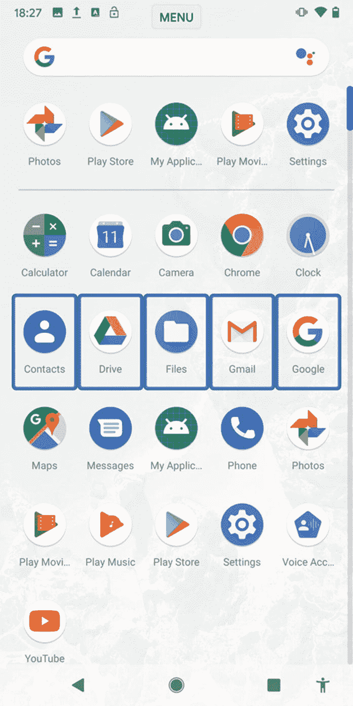

图 5-10

切换访问突出显示一行应用

为了实现这种控制，交换机访问可访问性服务使用第 [4](04.html) 章中讨论的可访问性树。这与 TalkBack 等其他服务使用的可访问性树相同。因此，如果你的应用与 TalkBack 配合得很好，那么它与 Switch Access 配合得也很好。与 TalkBack 相比，Switch Access 只关注交互元素(图 [5-10](#Fig10) )。因此，您的交互元素必须正确设置。使用 Android 的内置控件，如按钮和编辑文本控件，在需要的地方进行扩展，而不是实现自己的控件。例如，如果您使用一个图像并添加了一个`onTouchListener`，切换访问将不会访问这个触摸监听器。请改用图像按钮控件。

Navigating With Switch Access

第一次启用交换机访问时，Android 会向您呈现一个设置指南(图 [5-11](#Fig11) )。该应用将带您完成交换机访问配置，然后为您提供一个测试区域，让您习惯交换机访问如何使与您的设备的交互变得不同。

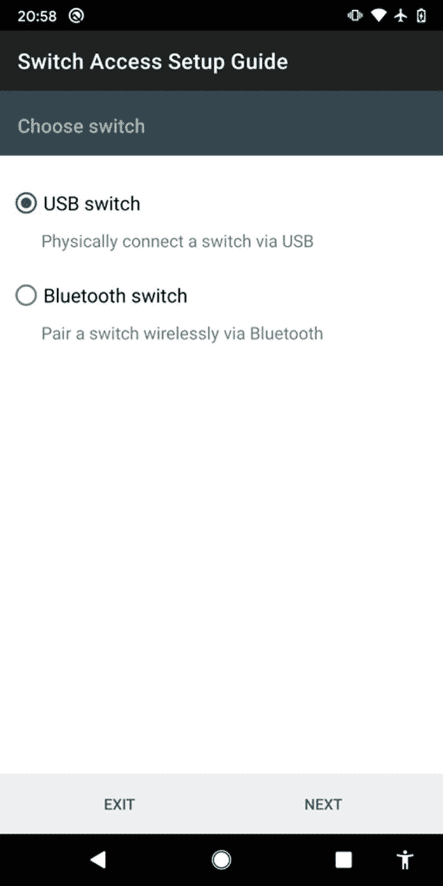

图 5-11

交换机访问设置指南

首先，连接一个开关。虽然有专门用于开关访问的开关，但我建议使用键盘进行测试；无论是 USB 还是蓝牙都是最好的入门方式。

根据您想要使用的开关数量选择控制模式(图 [5-12](#Fig12) )。我建议尝试这两种模式，这样你就可以了解你的 Switch Access 用户会如何体验你的应用。

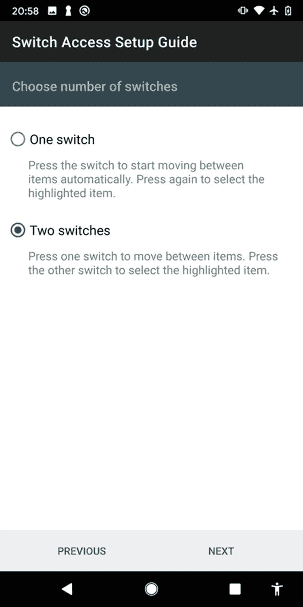

图 5-12

选择可用于交换机访问的交换机数量

选择一个开关，按一下开关开始扫描屏幕。边界框高亮将在交互元素之间自动移动。按下一个元件上的开关来激活它。这种形式的互动需要很长时间，但对于行动最受限的人来说是必不可少的。

两个开关是更直接、更快速的导航模式，因为它完全按照用户的节奏来完成。一个开关导航到下一个交互元素，第二个开关激活该元素。暂时选择此选项。

接下来，选择您的扫描模式(图 [5-13](#Fig13) )。线性扫描 <sup>[2](#Fn2)</sup> 从左上到右下依次高亮显示每一个交互元素。这种模式可能会慢一些，因为我们必须访问屏幕上的每个元素，但它可以防止一些意外的按压。行-列扫描将按行对元素进行分组。这使得浏览某些屏幕更快。按下“下一个”开关将导航到下一行元素，而不是下一个元素。如果您想要激活该行中的某个元素，请按下选择开关。然后使用“Next”开关导航到该行中您想要激活的元素。

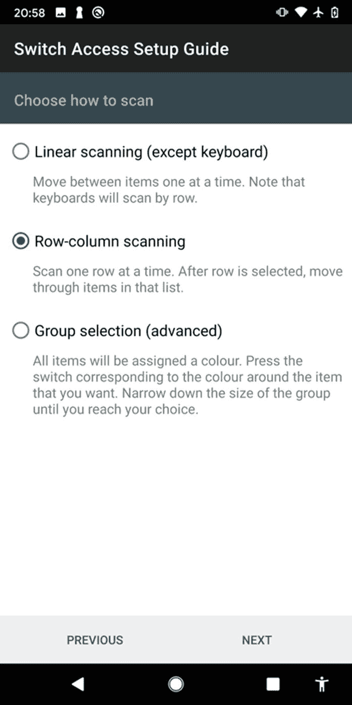

图 5-13

在交换机访问设置中选择扫描模式

接下来的两个屏幕包括选择您的两个开关。在你的键盘上选择任意两个键，但是我建议两个相邻的键。

最后，我们会看到一个井字游戏来帮助我们练习(图 [5-14](#Fig14) )。按下分配给你的“下一步”键开始扫描。如果你坚持使用这个设置导航，或者想尝试一些不同的东西，请按“上一步”(屏幕仍然可以使用常规触摸输入)并重新配置。在禁用开关访问之前，请记住也使用它来导航您的应用。

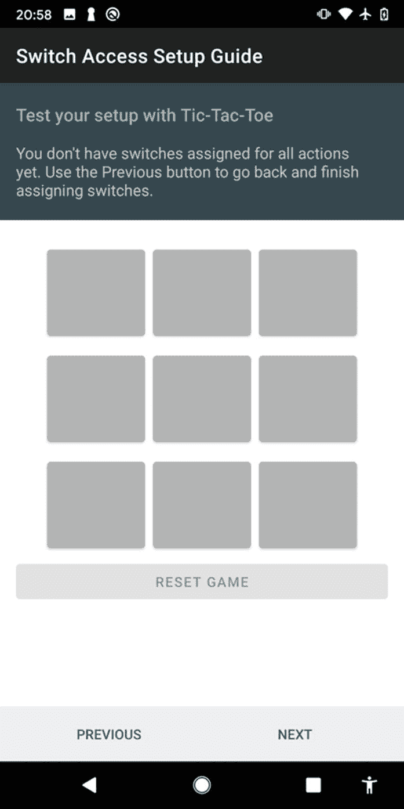

图 5-14

用井字游戏练习交换机访问

如果你喜欢冒险，试试开关访问设置中的其他选项。它们对你的应用界面呈现给用户的方式都有显著的影响。我建议查看以下内容:

*   语音、声音和振动

    在此菜单中启用语音反馈。这种模式通过大声读出所有可表示文本的元素，将对讲功能与开关访问功能结合起来。这意味着切换控制将在导航时关注所有元素，而不仅仅是交互元素。

*   自动扫描

    当开关访问配置为一个按钮时，自动扫描会以秒为间隔自动从一个元素导航到下一个元素。

*   点扫描

    A horizontal line scans from the top of the screen to the bottom; press Select to stop (Figure [5-15](#Fig15)). A vertical line then moves from left to right. Press Select when the crosshairs are over the element you want to activate.

    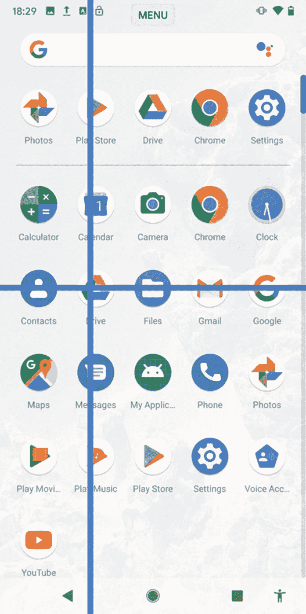

    图 5-15

    在点扫描模式下切换访问，选择驱动程序

### 触摸并保持延迟

触摸并保持延迟调整触发长按事件所需的时间。这有助于控制意外按压。如果您使用`onLongClickListener`确定长按，该设置将被考虑在内。使用这个监听器，而不是尝试自己为长点击计时。

### 是时候采取行动了

采取行动的时间，也称为可访问性超时，给用户额外的时间来查看临时的可视元素，并在需要时对它们采取行动。辅助功能用户浏览应用的速度通常比非辅助功能用户慢。有时候这是因为他们的能力；其他人，这是他们选择的辅助技术的功能。

该功能提供了从 10 秒到 2 分钟的各种选项。任何随后的烤面包或小吃店将显示用户选择的时间长度，覆盖您在代码中设置的值。如果您已经实现了自己的小吃店类型的控制，您不会得到这种行为。

### 字幕

Android 原生支持带有`VideoView`控件的字幕。用户可以在可访问性设置中全局启用这些选项，以及选择尺寸和颜色等选项(图 [5-16](#Fig16) )。作为一名开发者，你可以将字幕嵌入到视频轨道中，或者通过 vtt 格式的输入流单独提供——vtt 字幕轨道通常以. srt 扩展名结尾(清单 [5-11](#PC11) )。一旦你这样做了，`VideoView`将根据你的用户的喜好来处理这些渲染。

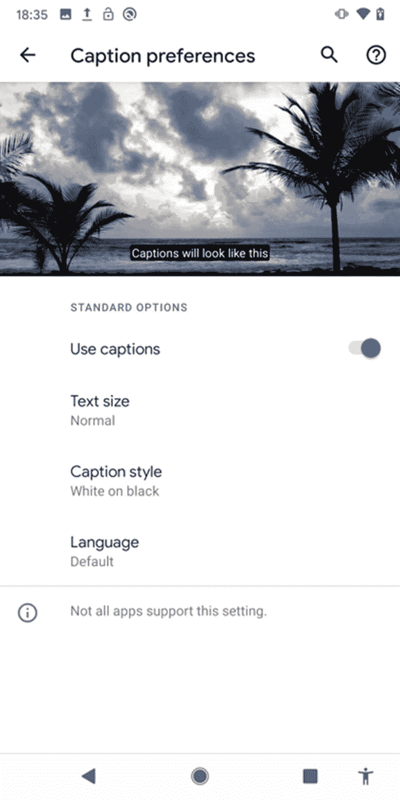

图 5-16

Android 的字幕偏好

```java
val subtitlesEN = getResources().openRawResource(R.raw.subs_en_vtt) // this could also be an InputStream instance loaded from a network resource.

videoView.addSubtitleSource(subtitlesEN,
      MediaFormat.createSubtitleFormat("text/vtt",
      Locale.ENGLISH.getLanguage()))

Listing 5-11Loading a subtitles file from resources and adding these subtitles to a VideoView instance

```

如果您在 VideoView 之外的控件中显示视频，您需要自己负责显示和呈现字幕。您可以使用清单 [5-12](#PC12) 中的`CaptioningManager`类来检索客户的设置。

```java
val captioningManager = getSystemService(Context.CAPTIONING_SERVICE) as CaptioningManager
val captionsEnabled = captioningManager.isEnabled
val captionStyle = captioningManager.userStyle
val textScale = captioningManager.fontScale

Listing 5-12Accessing caption settings from the system’s captioning manager

```

如上所示，`CaptioningManager`类提供了一个返回`CaptionStyle`类对象的`userStyle`值。这个类提供了诸如字体、前景色和背景色等信息。查看 Android 开发人员文档，了解完整的值范围。 <sup>[3](#Fn3)</sup> 你应该尽可能遵循这些偏好，因为你的顾客会选择这种字体、大小、颜色等的组合。是有原因的。

此外，您应该倾听客户字幕设置的变化。`CaptioningManager`允许我们设置一个`CaptioningChangeListener`(列表 [5-13](#PC13) )，这样我们就可以在客户更改设置时得到通知。

```java
class MyCaptionListener:
      CaptioningManager.CaptioningChangeListener() {
      override fun onEnabledChanged(enabled: Boolean) {
                 // remove captions from your view
      }
}

class MainActivity : AppCompatActivity() {
    override fun onCreate(savedInstanceState: Bundle?) {
        super.onCreate(savedInstanceState)
      val captioningManager = getSystemService(Context.CAPTIONING_SERVICE) as

      captioningManager.addCaptioningChangeListener(MyCaptionListener())
      }
}

Listing 5-13Using a CaptioningChangeListener to detect changes in captioning settings

```

### 高对比度文本

高对比度文本使文本变成黑色或白色，这取决于文本的原始颜色。然后添加一个相反颜色的边框(图 [5-17](#Fig17) )。这是使用 Android 的常规文本渲染系统完成的，因此在大多数情况下会为您进行处理。`AccessibilityManager`确实有一个值来检测此功能是否启用。但是，由于不清楚的原因，它对公共接口是隐藏的。因此，如果您选择使用`isHighTextContrastEnabled`方法，请小心操作。


图 5-17

标准文本(左)和高对比度文本(右)

### 语音接入

语音访问并不包含在 Android 的标准辅助工具套件中，而是一项辅助工具服务，可以通过搜索语音访问从谷歌 Play 商店免费下载。语音访问允许完全免提访问和控制设备。如果你在开车，这是一个有用的功能，但对于行动不便的人来说，尤其是那些行动最受限但能说话的人来说，这是无价的。语音访问仅使用语音不仅可以执行简单的任务，如谷歌助手，还可以完全控制设备。作为一个重要的辅助功能，语音访问使用起来非常有趣，所以请从 Google Play 下载并查看它。

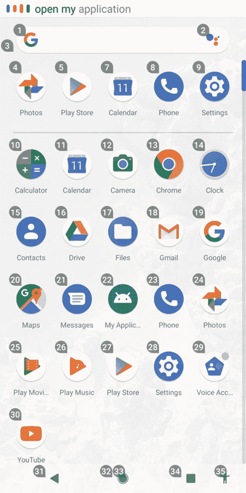

图 5-18

启用语音访问。用户请求“打开我的应用”

像 Android 上的其他可访问性服务一样，语音访问使用我们在第 [4](04.html) 章中讨论的可访问性树。为简单起见，语音控制将在每个交互元素旁边显示数字(图 [5-18](#Fig18) )，但这些也可以由屏幕上显示的名称触发。TalkBack 将读取元素文本值上的元素内容描述，而 Voice Access 将响应元素的文本值，但不会响应内容描述，因为内容描述是不可见的。与开关访问一样，如果您向通常不是控件的元素(例如图像)添加点击或点击监听器，语音访问将不会将其识别为可以与之交互的元素。尽可能坚持使用 Android 的标准控件；在这种情况下，请始终使用`ImageButton`。

### 本地化

Android 的本地化支持是全面和完善的，以至于开发一个可以本地化的应用可能比不可以本地化的更简单。Android Lint 还会提醒你，如果你编写的代码还没有做好本地化的准备。虽然您的应用可能只在一个地区可用，但无论如何，创建一个本地化的应用都是一种很好的做法。将来当你想修改字符串或其他资源时，这会节省你很多精力。此外，本地化选项为您的业务开拓了新的市场。即使在一个市场，你会发现比你预期的更多的人更喜欢你的应用以另一种语言提供给他们。美国人口普查局发现，近 22%的美国人，大约 7000 万人，在家里说英语以外的语言。 <sup>[4](#Fn4)</sup>

当创建一个新的应用时，Android Studio 会为你创建一个 strings.xml 文件(清单 [5-14](#PC14) )。作为一个好习惯，总是在这里添加用户界面中使用的任何字符串。给字符串一个名称值；这是您将在代码中用来引用您的字符串，然后将您的字符串添加到`<string>`标记之间。虽然本节讨论的是本地化的字符串，但是您可以用同样的方式本地化任何其他资源，包括布局、绘图、维度等等。

```java
<resources>
      <string name="app_name">My Application</string>
      <string name="action_settings">Settings</string>
</resources>

Listing 5-14A strings.xml file as generated by Android Studio

```

要在应用中使用这些字符串资源，请通过您在字符串值中提供的名称来引用它们。考虑我们的`action_settings`字符串。我们可以在使用`@string/action_settings`(清单 [5-15](#PC15) )的布局 XML 文件中引用它，或者在使用`R.string.action_settings`(清单 [5-16](#PC16) )的代码中引用它。

```java
val string = getString(R.string.action_settings)

Listing 5-16Accessing a string resource in code

```

```java
<item
      ...
      android:title="@string/action_settings" />

Listing 5-15Accessing a string resource in a layout xml file

```

#### 翻译您的应用

不要试图使用自动化服务来生成翻译。这些服务不理解你的应用的上下文，经常会给你的客户带来无意义和混乱的信息。谷歌通过 Google Play 开发者控制台提供翻译服务。虽然翻译会因应用的大小和你选择的语言而异，但谷歌建议每个应用的翻译价格通常在 50 美元左右。

在我们发送应用进行翻译之前，请花些时间注释您现有的 strings.xml 文件的内容。在字符串上方添加注释，解释字符串的使用位置及其用途。包括您对该字符串的任何限制或要求。这将有助于你的翻译为每种用法选择最合适的单词或短语。

要创建字符串的本地化版本，请选择文件➤新➤值资源文件。调用文件字符串以匹配原始字符串，并在左侧列表中选择区域设置修饰符(图 [5-19](#Fig19) )。按添加按钮。一个新的 Android 支持的区域列表出现。选择您要本地化的区域设置-您可以在此列表中键入内容进行筛选-然后按“确定”。你会看到在项目导航器中有两个 strings.xml 文件，一个是你的原始文件，另一个是你新本地化的文件(图 [5-20](#Fig20) )。

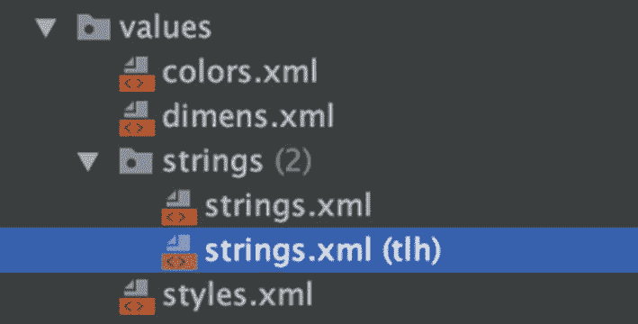

图 5-20

我们的项目导航器中有两个字符串文件，一个作为“tlh”本地化变体

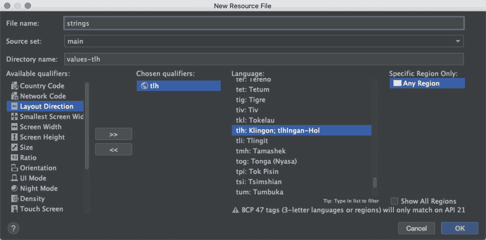

图 5-19

创建新的本地化 strings.xml 文件

在新的字符串文件中，复制任何需要翻译的 XML 字符串条目，并将`<string>`标记之间的值更改为新翻译的值。您选择不在此本地化的任何字符串都将恢复为原始 strings.xml 文件的值。

### 键盘导航

Android 支持通过键盘或遥控器进行全面导航(图 [5-21](#Fig21) )。事实上，某些 Android 应用，如为 Android TV 开发的应用，需要这一功能。将 USB 或蓝牙键盘连接到您的手机，除了打字，您还可以使用 tab 或箭头键在元素之间导航。Android 将使用你的应用的可访问性树来决定呈现元素的顺序，但有时需要一些提示。因此，有必要连接一个键盘，看看你的屏幕导航是否如你所愿。

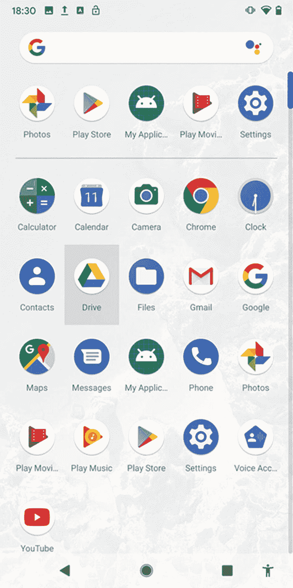

图 5-21

选择驱动器时的键盘导航

## 检测辅助功能服务

Android 的`AccessibilityManager`(列表 [5-17](#PC17) )服务将为你提供一系列关于运行你的应用的设备的可访问性环境的信息。

```java
val a11yManager = getSystemService(Context.ACCESSIBILITY_SERVICE) as AccessibilityManager

Listing 5-17Getting the accessibility service

```

通过查询这个管理器，我们可以发现关于可用的可访问性服务、当前正在运行的服务以及这些服务可以为我们的客户提供什么的更多信息。为了获得所有已安装的可访问性服务的列表，我们可以请求`installedAccessibilityServiceList`(列表 [5-18](#PC18) )。

```java
val a11yManager = getSystemService(Context.ACCESSIBILITY_SERVICE) as AccessibilityManager

val installedServices = a11yManager.installedAccessibilityServiceList

Listing 5-18Getting a list of all currently installed accessibility services

```

### 运行服务

虽然已安装服务的列表会告诉我们您客户的设备能够提供什么功能，但这并不意味着这些服务中的任何一项正在使用中。可访问性管理器提供一个布尔值，告诉我们当前是否有一个或多个服务正在运行(清单 [5-19](#PC19) )。

```java
val a11yManager = getSystemService(Context.ACCESSIBILITY_SERVICE) as AccessibilityManager

val isAccessibilityEnabled = a11yManager.isEnabled

Listing 5-19Detecting

an accessibility service. Returns true if any service is running

```

现在我们知道了一个可访问性服务正在运行，我们可能想要更深入地挖掘正在运行的服务的类型。要了解我们是否需要做出改变，我们需要知道服务的功能是什么。我们可以通过查询可访问性管理器来做到这一点。没有检测对讲是否启用的直接请求，例如，您的客户可能正在使用其手机供应商的屏幕阅读器或谷歌 Play 商店的第三方屏幕阅读器。相反，我们基于服务的能力进行查询。Android 然后返回给我们一个列表，列出所有运行的具有该功能的服务。对于当前启用的可访问性服务的列表，我们可以使用`AccessibilityManager`的`getEnabledAccessibilityServiceList`方法(列表 [5-20](#PC20) )。我们需要传递一个常量来表示我们想要了解的服务类型。

```java
val a11yManager = getSystemService(Context.ACCESSIBILITY_SERVICE) as AccessibilityManager

val screenReaders = a11yManager.getEnabledAccessibilityServiceList(AccessibilityServiceInfo.FEEDBACK_SPOKEN)

Listing 5-20Getting a list of all running screen readers

```

作为参数传递给该方法的`FEEDBACK_SPOKEN`常量返回任何能够提供语音反馈的服务，比如 TalkBack。我们可以向该方法传递不同的常数，以根据需要返回不同类型的服务。这些常量根据服务提供给用户的反馈类型或辅助功能服务所具有的功能来划分。要返回能够提供任何类型反馈的任何服务，请传递`AccessibilityServiceInfo.FEEDBACK_ALL_MASK`。要返回任何正在运行的服务，不管其功能或反馈类型如何，请传递`AccessibilityServiceInfo.DEFAULT`。我们将在这里讨论所有的常量值。

#### 反馈

这些常量描述了服务如何向用户提供反馈。根据服务可以提供的反馈类型获取服务意味着服务当前正在运行。这并不一定意味着反馈类型目前已启用或处于活动状态。服务可以分为多种反馈类型。

*   `FEEDBACK_ALL_MASK`

    向您的客户提供任何类型的可访问性反馈的所有服务。

*   `FEEDBACK_AUDIBLE`

    提供听觉而非口语反馈的服务。

*   `FEEDBACK_SPOKEN`

    诸如 TalkBack 之类的口语服务。

*   `FEEDBACK_BRAILLE`

    盲文服务。

*   `FEEDBACK_GENERIC`

    不属于其他反馈类别的服务的总括属性。

*   `FEEDBACK_HAPTIC`

    提供触觉反馈的服务。

*   `FEEDBACK_VISUAL`

    视觉服务，如叠加、滤色器等。

#### 能力

这些常量允许我们请求按能力分组的可访问性服务。根据服务的能力获取服务并不一定意味着这个能力当前是启用的或活动的。服务可以分为多个功能类别。

*   `CAPABILITY_CAN_CONTROL_MAGNIFICATION`

    可以控制屏幕缩放级别的辅助功能服务。

*   `CAPABILITY_CAN_PERFORM_GESTURES`

    一种能够在设备屏幕上模仿触摸手势的服务。

*   `CAPABILITY_CAN_REQUEST_FILTER_KEY_EVENTS`

    任何可以请求过滤您的应用从 keys 收到的事件的服务。这包括设备硬件按键，如相机按钮，也包括连接的设备，如键盘和游戏手柄。

*   `CAPABILITY_CAN_REQUEST_FINGERPRINT_GESTURES`

    辅助功能服务可以从设备的指纹传感器捕捉事件和手势。

*   `CAPABILITY_CAN_REQUEST_TOUCH_EXPLORATION`

    辅助功能服务，比如 TalkBack，允许用户通过点击来浏览 UI 元素，而不需要激活它们。如果正在运行，此功能还可以防止某些触摸手势被传递到您的应用。

*   `CAPABILITY_CAN_RETRIEVE_WINDOW_CONTENT`

    这些服务可以访问当前活动窗口中显示的应用内容。

*   `DEFAULT`

    如果服务没有提供其他功能，则为默认值。传递它将返回任何正在运行的服务。

## 摘要

*   Android 辅助功能因设备和供应商而异。额外的无障碍服务可以从谷歌 Play 商店下载。

*   总是使用 Android 提供的 UI 元素，在需要的地方扩展它们。避免创建自己的控件，因为几乎不可能匹配标准控件的辅助功能。

*   倾听客户的喜好，并尊重他们；不这样做可能会引起顾客的愤怒。

*   尝试您的设备上可用的辅助功能；最坏的情况会是什么？你可能会找到对你有益的东西。

本章向我们概述了 Android 手机上可用的辅助功能和服务。我们还讨论了我们开发人员如何更好地支持它们，这些特性如何影响我们的应用，以及我们如何检测和响应客户的偏好。在下一章，我们将转移到 iOS，并开始研究 iOS 的可访问性系统是如何工作的。

<aside aria-label="Footnotes" class="FootnoteSection" epub:type="footnotes">Footnotes [1](#Fn1_source)

[T2`https://support.google.com/accessibility/android`](https://support.google.com/accessibility/android)

  [2](#Fn2_source)

Android 确实警告说线性扫描模式不适用于键盘，尽管我从未发现这种情况。

  [3](#Fn3_source)

[T2`https://developer.android.com/reference/kotlin/android/view/accessibility/CaptioningManager.CaptionStyle.html`](https://developer.android.com/reference/kotlin/android/view/accessibility/CaptioningManager.CaptionStyle.html)

  [4](#Fn4_source)

“新的美国社区调查统计数据，包括各州和当地的收入、贫困和医疗保险，”美国人口普查局，2017 年 9 月 14 日。 [`https://www.census.gov/newsroom/press-releases/2017/acs-single-year.html`](https://www.census.gov/newsroom/press-releases/2017/acs-single-year.html) 。

 </aside>