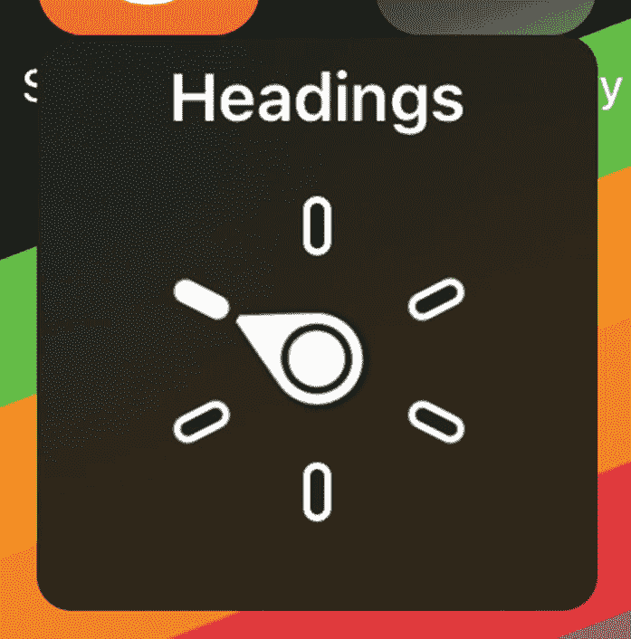

# 8.iOS 辅助功能-视觉

以下功能是 Apple 主要为帮助有视觉障碍的人而设计的。这些功能帮助盲人和低视力用户，包括远视、低视力、色觉障碍、失明等。有些配置对患有认知障碍、多动症、识字率低的人，或者喜欢文本大一点或颜色柔和一点的人也有帮助。有些人启用灰度彩色滤镜只是因为它看起来很酷。视觉因素构成了目前 iOS 上可用的最大一组辅助功能。

## 画外音

开发者最熟悉的 iOS 辅助功能是 VoiceOver。VoiceOver 是苹果的内置屏幕阅读器，在所有基于屏幕的平台上都有，可以与你的应用配合使用，而不需要开发者启用它的使用。VoiceOver 不仅仅是一个基本的屏幕阅读器；它还可以作为弱视用户的导航工具，使他们不仅能够知道屏幕上有什么文本，还能知道他们可以使用什么按钮或动作。iOS 还具有更基本的屏幕阅读器，仅用于阅读内容；这种屏幕阅读器在 iOS 中被称为语音内容，我们将在本章后面的“朗读选择”和“朗读屏幕”部分对此进行介绍

Caution

在您阅读“使用 VoiceOver 导航”之前，请不要启用 VoiceOver

VoiceOver 将改变你的应用的功能，因为你的用户将采用一系列的滑动来以自然的方向导航你的应用(在英语中是从左上角到右下角)。在屏幕上绘制一个边界框，为当前选择的元素增加一个视觉亮点(图 [8-1](#Fig1) )。选择后，VoiceOver 会按以下顺序向用户朗读元素信息:辅助功能标签➤辅助功能值➤辅助功能特征➤辅助功能提示。这四个值中的每一个都是为你确定的，作为你的应用的辅助功能用户界面的一部分，在第 [6](06.html) 章中有所涉及，如果 iOS 不能确定理想的，或者实际上任何一个值，你都可以定制。


图 8-1

VoiceOver 选择放大镜。双击屏幕上的任意位置来激活此控件

虽然 VoiceOver 会为您做大量的工作，但创建与 VoiceOver 不理想兼容的界面是很容易的。常见的陷阱包括缺少或不正确的可访问性值、标签或特征；以非逻辑顺序访问的元素；VoiceOver 无法通过滑动访问或离开元素的陷阱；和 VoiceOver 与您的用户界面不同步。由于这些原因，在创建屏幕时使用 VoiceOver 检查屏幕是非常重要的，以确保您可以按预期导航。也请记住，VoiceOver 用户不会像视力正常的人那样拥有全屏环境；它们唯一的上下文是当前选中的元素，所以每个元素必须有自己的意义。第 [6](06.html) 章中涉及的语义视图是这个上下文问题的一个很好的解决方案。

您可以通过检查`isVoiceOverRunning`来检查 VoiceOver 当前是否正在运行，并根据清单 [8-1](#PC1) 中的示例通过监听`voiceOverStatusDidChangeNotification`来确定此状态是否发生变化。

```java
import UIKit

class MyViewController: UIViewController {

    var voiceOverStatus: Bool {
        get{
           return UIAccessibility.isVoiceOverRunning }
    }

    override func viewDidLoad() {
        super.viewDidLoad()

        NotificationCenter.default.addObserver(self, selector: #selector(voiceOverChanged), UIAccessibility.voiceOverStatusDidChangeNotification, object: nil)
    }

    @objc
    func voiceOverChanged() {
      // check voiceOverStatus for the current status.
    }
}

Listing 8-1Detecting VoiceOver status and changes

```

### 屏幕更新

UIKit 中一个常见的 VoiceOver 陷阱是在 iOS 将屏幕推至视图层次后更新屏幕上的元素。VoiceOver 并不总是知道您的视图已经更改，因此它可能不会找到新元素或可能会阅读旧内容。在 SwiftUI 中，这不再是一个考虑因素，但是对于 UIKit，您应该总是向`UIAccessibility`发布通知。收到此通知后，可访问性 API 将重新构建可访问的用户界面，以将更改考虑在内。如果你改变了一个元素，发布`layoutChanged`通知(列表 [8-3](#PC3) ，或者，对于屏幕的更大区域，发布`screenChanged`(列表 [8-2](#PC2) )。对于这些通知中的每一个，您都可以包含一个参数。此参数可以是 VoiceOver 要宣布的字符串，也可以是 VoiceOver 应该关注的元素。

```java
func deleteItem(item: Item) {
     // handle removing the item from your screen.

     ...

     // VoiceOver announces "One item removed" and the accessibility user interface is recreated to reflect this.
     // VoiceOver focus is unchanged, unless the focus was on the removed element.
     UIAccessibility.post(notification: .layoutChanged, argument: "One item removed")
}

Listing 8-3Posting VoiceOver Change Notification for a screen layout change

```

```java
func updateSearchResults(results: Results) {
      // update your table view.

      ...

      let firstCell = tableView.cellForRow(at: IndexPath(row: 0, section: 0))

      // Focuses VoiceOver on the first cell.
      UIAccessibility.post(notification: .screenChanged, argument: firstCell)
}

Listing 8-2Posting VoiceOver Change Notification for a major screen change

```

也可以在 UI 不变的情况下，直接向 VoiceOver 发送公告来响应事件。例如，在清单 [8-4](#PC4) 中，一个通常不会打断用户的警告或错误，比如你可以选择在哪里显示一个 toast。

```java
func reachabilityFailed() {
     // display a toast informing of poor network connectivity.

     ...

     // VoiceOver announces "Warning: Poor network connectivity detected".
     // No changes are made to the accessibility user interface or VoiceOver focus.
     UIAccessibility.post(notification: .announcement,
     argument: "Warning: Poor network connectivity detected")
}

Listing 8-4Posting a VoiceOver announcement

```

以这种方式发布通知将会中断任何当前的发言。所以如果你只在绝对必要的时候使用这种技术是最好的。另一种方法是，我们可以告诉 VoiceOver，我们希望它仅在使用属性字符串(清单 [8-5](#PC5) )完成当前发言后发出通知。

```java
func reachabilityFailed() {
     // display a toast informing of poor network connectivity.

     ...

     let announcement = NSAttributedString(string: "Warning: Poor network connectivity detected", attributes: [.accessibilitySpeechQueueAnnouncement: true])

        UIAccessibility.post(notification: .announcement, argument: announcement)

Listing 8-5Posting a queued announcement

```

作为回报，`UIAccessibility`在阅读完您的公告后，会向`notificationCenter`发送一个名为`UIAccessibility.announcementDidFinishNotification`的通知。

### 属性化可访问性字符串

就像可视化显示富文本的属性化字符串一样，我们也可以向可访问性字符串添加属性。这些属性不是控制颜色和下划线之类的东西，而是控制说话时是否包含标点之类的东西。组成可访问性用户界面的每个标签、提示和值都可以有属性。这些属性是`accessibilityAttributedLabel`、`accessibilityAttributedHint`和`accessibilityAttributedValue`。我们还可以将属性字符串传递给我们上面提到的 VoiceOver 通知。我们可以添加的属性如下。

#### 投

`accessibilitySpeechPitch`(列表 [8-6](#PC6) )键允许我们提供一个从 0.0 到 2.0 的`NSNumber`浮点值。此值调整 VoiceOver 用来朗读此文本的音高。1.0 代表用户选择的画外音音高，< 1.0 降低音高，> 1.0 提高音高。这对于强调一段话很有用。

```java
let attributedString = NSMutableAttributedString(string: "This is the best app on the App Store!")

// Always localize your strings and perform proper range calculations. I'm hard-coding values here for brevity.
let range = NSRange(location: 12, length: 4)
        attributedString.addAttributes([.accessibilitySpeechPitch: 1.5], range: range)

appDescription?.accessibilityAttributedLabel = attributedString

Listing 8-6Adjusting VoiceOver pitch for emphasis

```

#### 语言

这个键`accessibilitySpeechLanguage`(列表 [8-7](#PC7) ，允许我们指定一个 BCP 47 <sup>[1](#Fn1)</sup> 语言键来定义用于发音字符串的语言规则。这可以用于为非本地单词提供更准确的发音。

```java
spanishGreeting?.accessibilityAttributedLabel = NSAttributedString(string: "Hola!", attributes: [.accessibilitySpeechLanguage: "es-419"])

Listing 8-7Setting VoiceOver language for an foreign language word

```

#### 拼出

单独读出字符串中的每个字符。从我自己的测试来看，这个在 iOS 13 上用大写的单词玩的并不好。

当您的应用包含账号或电话号码等数字时，`accessibilitySpeechSpellOut`(列表 [8-8](#PC8) )键非常有用。当 VoiceOver 遇到数字时，它会决定是将这些数字读为整数还是数字；根据我的经验，这个决定并不总是正确的。应用此属性意味着 VoiceOver 将始终单独朗读每个插图。

```java
let attributedString = NSMutableAttributedString(string: "Your account number is 12345678")

// Always localize your strings and perform proper range calculations. I'm hard-coding values here for brevity.
let range = NSRange(location: 23, length: 8)
        attributedString.addAttributes([.accessibilitySpeechSpellOut: true], range: range)

accountNumber?.accessibilityAttributedLabel = attributedString

Listing 8-8Telling VoiceOver to read an account number as digits

```

#### 注音符号

VoiceOver 并不总是每个单词都有正确的发音，例如，如果这个单词是一个品牌名称，就更是如此。使用国际音标，或国际音标，我们可以指定画外音如何发音。这里的关键是`accessibilitySpeechIPANotation`(列表 [8-9](#PC9) )。

```java
brandName.accessibilityAttributedLabel = NSMutableAttributedString(string: "[air-bee-an-bee]", attributes: [.accessibilitySpeechIPANotation: true])

Listing 8-9Using IPA notation to specify pronunciation of AirBnB

```

#### 标点

如果您的应用包含代码或其他一些标点符号很重要的文本，您可以使用`accessibilitySpeechPunctuation`(列表 [8-10](#PC10) )来强制 VoiceOver 读出每个标点符号。

```java
helloWorld.accessibilityAttributedLabel = NSMutableAttributedString(string: "print(\"Hello, World!\")", attributes: [.accessibilitySpeechPunctuation: true])

Listing 8-10Requesting VoiceOver to announce punctuation for code

```

### 神奇水龙头

Magic Tap 是辅助功能用户快速访问屏幕上重要操作的一种方式。例如，在计时器应用中，Magic Tap 启动或停止计时器。VoiceOver 用户通过用两个手指双击屏幕上的任何位置来执行神奇的点击。您可以在视图控制器或子视图中添加一个神奇的 Tap。将它添加到一个子视图意味着只有当这个视图被聚焦时才执行这个动作。魔术 Tap 的标准用法是将它添加到视图控制器中；这样，无论焦点中的元素是什么，操作都将被执行。

通过覆盖`accessibilityPerformMagicTap()`函数来支持魔术点击手势(清单 [8-11](#PC11) )。然后你应该调用你认为你的屏幕的主要目的。然后返回 true 或 false，如果这不可能的话。

```java
override func accessibilityPerformMagicTap() -> Bool {
      // perform your screen's main action

      return true // return false if the action failed
}

Listing 8-11Supporting Magic Tap

```

Navigating With Voiceover

VoiceOver 不需要先启用；一旦您在“设置”中打开此选项，VoiceOver 就会被激活。VoiceOver 改变了 iPhone 的导航方式，因此在不知道如何先禁用它的情况下，不要打开它并四处轻敲，这一点很重要。很多次，当我在苹果经销商处工作时，客户会带来几天没用的 iPhones，因为闲置的拇指让他们启用了 VoiceOver，但他们无法再次关闭它。我甚至听说有人为了让手机失效而彻底擦拭手机。

Voiceover 会按照用户语言设置的自然顺序(英语为从左上方到右下方)检测辅助元素，并一次高亮显示一个元素。单次点击不再激活项目，就像你在点击按钮时期望的那样，而是点击导致元素被读取。屏幕也可以通过滑动来导航，因为元素可能不总是可见或足够大，以至于弱视的人无法准确点击。因此，向右滑动会移至右下方的下一个元素；向左滑动将会向左上方导航。该元素将被激活并被读取。

激活一个元素——拨动开关，点击按钮等。–手势现在变成双击。无论您点击屏幕上的哪个位置，也无论您点击时手指下面是什么，按钮都会对双击做出响应。这对于有视觉障碍的人来说是有益的，因为他们可能很难确定点击目标的准确位置——因此消除这一要求意味着更精确的控制激活。它也方便了纱窗的使用。屏幕幕布完全遮住了 iPhone 的屏幕，所以在其他人看来，这款手机就像睡着了一样。除了节省电池，这还为盲人和视力受损的用户提供了额外的隐私。除了大声朗读他们的个人内容，盲人用户可能不知道屏幕的全部内容。这最终可能会无意中向周围的人显示敏感的个人信息。



图 8-2

VoiceOver 转子控制选择标题

转子控制(图 [8-2](#Fig2) )可用于配置辅助 VoiceOver 手势的行为方式。垂直滑动而不是水平滑动将执行转子上选择的功能。最常见的用途之一是标题选项，当在屏幕上垂直滑动时，该功能将跳过内容，只阅读带有标题可访问性特征的元素。这有助于浏览屏幕内容，而不必浏览每个元素。其他转子控制可让您通过辅助操作、容器来导航，控制语速，或通过朗读单个字符或单词来拆分文本。

## 一款云视频会议软件

屏幕缩放对那些视野狭窄的人很有用。但是，如果您的动态文本支持不够，或者 voiceover 不清楚屏幕上的内容，您可能会发现其他人也在使用它。当您执行用户测试时，如果您发现有视觉障碍的参与者在特定的屏幕上启动缩放，您可能会发现这是因为您需要在这里进行其他的可访问性改进。


图 8-3

在窗口模式下启用缩放

变焦可用于两种模式中的一种:首先是窗口变焦，取景器出现在屏幕上，放大下面的内容(图 [8-3](#Fig3) )。这类似于在屏幕上使用放大镜，但不会显示您在现实世界中使用放大镜看到的底层 RGB 像素。其次，全屏缩放，即整个屏幕被缩放，不再适合整个设备的显示。

这是让它成为一些视障用户的第二选择的原因——这两种模式都可以有效地将显示给客户的内容减少到全屏显示的四分之一左右。这意味着四分之三的屏幕内容不再可见，最明显的是非自然一侧的内容(右为英语)。要使用缩放，你需要在屏幕上移动手指来跟随内容，这使得元素很容易被错过，并且可以看到的内容失去了上下文。内容也会变得像素化和模糊，因此更难确定。

缩放还具有 HUD(图 [8-4](#Fig4) )功能，可以轻松控制缩放区域——全屏或窗口，轻松定位缩放区域，能够更改缩放级别，并可以选择仅向缩放区域添加颜色滤镜。对于那些发现彩色滤镜有助于他们查看内容，但不要求滤镜总是处于启用状态的人来说，最终选择是最佳选择。


图 8-4

缩放 HUD 选项

默认情况下，屏幕缩放将跟随屏幕上的焦点，这意味着如果您的客户正在填写表单，缩放将随着光标的移动而移动到下一个文本字段。有时，特别是如果您使用自定义控件，这可能不会像您希望的那样无缝地发生。在这种情况下，您可以使用`zoomFocusChanged(zoomType: .insertionPoint, toFrame: myCGRect, in: myUIView)`(列表 [8-12](#PC12) )通知 Zoom 应该将焦点改变到您屏幕的某个区域，其中`myCGRect`是要聚焦的区域。

```java
import UIKit

Class MyViewController: UIViewController {

   @IBOutlet private var myCustomView: CustomView!

   override func viewDidAppear(_ animated: Bool) {
      super.viewDidAppear(animated)

      UIAccessibility.zoomFocusChanged(zoomType: .insertionPoint, toFrame: myCustomView.frame, in: view)
   }
}

Listing 8-12Moving Zoom focus to a view on viewDidAppear

```

要在屏幕上移动缩放区域，需要使用三指滑动，这意味着如果你在应用中使用三指手势，这些手势不会被 zoom 使用，也不会传递到你的应用。与大多数辅助功能不同，Apple 没有为您的应用提供属性来确定缩放是否已启用，以及在需要时更改行为。相反，你可以使用屏幕上的`registerGestureConflictWithZoom()`来提示 iOS 呈现系统警告(图 [8-5](#Fig5) )，通知你的客户缩放可能会与你的应用的功能冲突；此警报允许您的用户禁用缩放。


图 8-5

当调用`registerGestureConflictWithZoom()`且用户启用缩放时，出现缩放手势冲突对话框

## 粗体文本

粗体文本如其在锡上所言(图 [8-6](#Fig6) )。如果你正在使用`UIFontTextStyles`，你的文本将免费获得这个。如果你已经选择不使用苹果的文本样式，你应该听听`isBoldTextEnabled`和`boldTextStatusDidChangeNotification`(列表 [8-13](#PC13) )并切换到粗体字体或根据要求添加粗体属性。您可能还想考虑切换任何资源或增加边框的粗细，以使元素更加突出。


图 8-6

带有标准文本(左)和粗体文本(右)的 iOS 文本样式

```java
import UIKit

class MyViewController: UIViewController {

    var boldTextStatus: Bool {
        get{
            return UIAccessibility.isBoldTextEnabled
        }
    }

    override func viewDidLoad() {
        super.viewDidLoad()

        NotificationCenter.default.addObserver(self, selector: #selector(boldTextChanged), name: UIAccessibility.boldTextStatusDidChangeNotification, object: nil)
    }

    @objc
    func boldTextChanged() {
      // check boldTextStatus for current status.
      // switch to bold fonts or assets as appropriate
    }
}

Listing 8-13Detecting Bold Text status changes

```

## 较大的文本或动态类型

更大的文本是我们作为开发人员称之为动态类型的友好的可读名称。动态类型允许用户将文本大小调整到更适合他们使用设备的大小(图 [8-7](#Fig7) )。从最佳辅助功能的角度来看，这不仅仅是关于需要更大的文本来阅读屏幕的人，而是关于定制。此功能允许文本大小低于默认大小，从而无需滚动即可在屏幕上显示更多内容。范围从正文大小为 14pt 的 xSmall (extra small)到正文大小为 53 的 AX5 (accessibility size 5)。参见表 [8-1](#Tab1) 了解正文字体大小的完整范围。

表 8-1

动态文字大小

<colgroup><col class="tcol1 align-left"> <col class="tcol2 align-left"></colgroup> 
| 

动态字体大小

 | 

正文大小(磅)

 |
| --- | --- |
| **xSmall** | Fourteen |
| **小** | Fifteen |
| **中等** | Sixteen |
| **大(默认)** | Seventeen |
| **xLarge** | Nineteen |
| **xx 大** | Twenty-one |
| **大** | Twenty-three |
| ax 1 | Twenty-eight |
| ax 2 | Thirty-three |
| ax 3 | Forty |
| ax4 | Forty-seven |
| **AX5** | Fifty-three |

作为 HIG 的一部分，可提供与文本样式匹配的各种动态文本大小。 <sup>[2](#Fn2)</sup>

动态字体与 iOS 的内置文本样式配合使用时效果最佳。这些样式告诉 iOS 和动态类型系统特定文本的语义用法是什么，这意味着您的所有文本都按照苹果推荐的间隔按比例缩放。这里显示了不同大小设置的文本样式的完整选项。


图 8-7

标准尺寸(左)、最小尺寸(中)和最大辅助功能尺寸(右)的动态文字样式

作为一般规则，你的所有文本应该使用这些内置文本样式之一，清单 [8-14](#PC14) 展示了如何在 UIKit 中实现这一点。在 SwiftUI 中，所有文本都支持动态类型，默认样式为`body`。可以使用`.font()`修饰符(列表 [8-15](#PC15) )选择其他样式，并传递一个动态类型样式。传递一个定义好的大小，比如`.system(size: 17)`，会禁用动态类型，防止缩放，所以应该避免。

```java
// For body style, no font modifier is required.
Text("Example text").font(.headline)

Listing 8-15Creating labels with Dynamic Type in SwiftUI

```

```java
let label = UILabel()
label.font = UIFont.preferredFont(forTextStyle: .body)
label.adjustsFontForContentSizeCategory = true

Listing 8-14Creating labels with Dynamic Type in UIKit

```

要在界面构建器中启用动态类型(图 [8-8](#Fig8) ，打开属性检查器，并在字体属性框中选择“T”图标。然后单击出现的新字体下拉菜单，选择您选择的文本样式。最后，选中下面标有“自动调整字体”的框


图 8-8

在界面构建器中选择动态文字样式

### 自定义样式

如果您的设计需要一种不同于 iOS 默认字体 San Francisco 的字体，该怎么办？或者，如果您希望您的标准正文文本大小大于 17 呢？我们可以使用 iOS' `UIFontMetrics`(清单 [8-16](#PC16) )来做到这一点。我不会在这里介绍给你的应用添加自定义字体，但是苹果在他们的开发者文档中提供了一个简单的指南。准备好自定义字体后，在代码中创建一个字体实例，当文本设置为标准大小时，使用您希望的字体和大小。创建一个使用该字体的文本样式的`UIFontMetrics`实例，然后将你的自定义字体实例传递给你的`UIFontMetrics`实例。

```java
let font = UIFont(name: myCustomFontName, size: defaultSize)
let bodyMetrics = UIFontMetrics(forTextStyle: .body)
label.font = bodyMetrics.scaledFont(for: font)
label.adjustsFontForContentSizeCategory = true

Listing 8-16Creating a dynamic text style with a custom font

```

以这种方式创建文本样式可确保您尊重客户选择的文本大小。此外，Apple 会为您配置行距、段落间距和其他指标，确保您的文本始终可读。

## 按钮形状

按钮形状通过添加不同的轮廓、背景或带下划线的文本(图 [8-9](#Fig9) )来帮助使按钮点击目标更加可见。对于没有视觉障碍的人来说，按钮形状也使得确定屏幕上的哪些区域可以进行交互变得更加简单。如果您以任何方式自定义了按钮，有时可能会发现文本或按钮形状没有对齐。有必要启用这些功能来检查你的应用看起来是否正常，按钮标签是否可读。如果你使用一个没有从`UIButton`子类化的元素作为按钮，你不会得到这种行为。


图 8-9

启用按钮形状的后退导航按钮

## 开/关标签

对于 iOS 的开关或切换控制，苹果的设计只使用颜色来指示用户开关是开还是关，这意味着任何有视觉障碍的人都很难区分颜色，很难理解这种控制。因此，苹果公司提供了一种设置来为开关添加标签——I 在打开位置，O 在关闭位置，如图 [8-10](#Fig10) 所示。


图 8-10

启用开/关标签的开关控制

当创建你自己的定制控件时，你也应该考虑这一点，如果你选择默认不使用标签，听听`isOnOffSwitchLabelsEnabled`和`onOffSwitchLabelsDidChangeNotification`(列表 [8-17](#PC17) )来决定什么时候添加额外的信息。

```java
import UIKit

class MyViewController: UIViewController {

    var switchLabelStatus: Bool {
        get{
            return UIAccessibility.isOnOffSwitchLabelsEnabled
        }
    }

    override func viewDidLoad() {
        super.viewDidLoad()

        NotificationCenter.default.addObserver(self, selector: #selector(switchLabelsChanged), name: UIAccessibility.onOffSwitchLabelsDidChangeNotification, object: nil)
    }

    @objc
    func switchLabelsChanged() {
      // check switchLabelStatus for current status
      // add on/off labels to your controls as needed.
    }
}

Listing 8-17Detecting changes in switch label status

```

## 降低透明度

降低透明度是一些弱视用户的基本特征；对于那些视力已经模糊的人来说，在原本透明的背景上添加模糊会使区分前景和背景变得很困难。如果在构建时没有定义背景，透明度也会导致对比度低于可接受的值。

这一点最明显的用途是跳板上的文件夹(图 [8-11](#Fig11) )。这些都是一个很好的例子，说明了如何使一个可访问性特性具有可比较的体验，而不是二等的体验。禁用此功能后，文件夹的背景为浅灰色透明。轻敲文件夹，透明的灰色文件夹 squircle 后面的背景是一个未打印的模糊跳板。启用这个设置，当访问一个文件夹时，跳板内容被删除，保留一个暗淡的跳板背景图像。文件夹呈现较暗的灰色外观，没有透明度，但是灰色背景颜色暗示了其背后的跳板背景图像的颜色。


图 8-11

跳板文件夹(左)。透明度降低的跳板文件夹(右)

默认情况下，不会像许多文本调整一样为您启用降低透明度，因为 Apple 无法根据您的 UI 设计明确决定如何降低透明度。如果你在你的设计中使用透明，你必须决定是否以及如何响应这个设置。如果您的透明图层位于一种纯色之上，并且您可以保证这种颜色在构建时不会改变，则可能根本不需要响应。在所有其他情况下，应该做出一些妥协。一个简单的决定是用纯色代替透明色；一个更好的选择可能是制作一个类似的体验，比如苹果的跳板文件夹，其中使用了背景图像的色调。

为了确定是否响应这个设置，使用 iOS 的 Accessibility API，访问`isReduceTransparencyEnabled`变量，并监听`reduceTransparencyStatusDidChangeNotification`，如下面的清单 [8-18](#PC18) 所示。

```java
import UIKit

class MyViewController: UIViewController {

    var reduceTransparencyStatus: Bool {
        get{
            return UIAccessibility.isReduceTransparencyEnabled
        }
    }

    override func viewDidLoad() {
        super.viewDidLoad()

        NotificationCenter.default.addObserver(self, selector: #selector(reduceTransparencyChanged), name: UIAccessibility.reduceTransparencyStatusDidChangeNotification, object: nil)
    }

    @objc
    func reduceTransparencyChanged() {
      // check reduceTransparencyStatus for current status.
      // add opacity to views as needed.
    }
}

Listing 8-18Detecting changes in Reduce Transparency status

```

## 增加对比度

增加对比度是`UIAccessibility`的较暗系统颜色选项的用户友好名称。然而，更暗的系统颜色是这个选项实际作用的一个更具描述性的名称——内置的苹果应用将使颜色变暗，特别是文本后面的颜色，以增加对比度(图 [8-12](#Fig12) )。在“设置”中切换此选项，并查看顶部“后退”按钮的色调变化。另外，导航到消息并注意消息气泡颜色的差异。


图 8-12

增加信息的对比度(左)并关闭该功能(右)。请注意消息撰写栏中的深色文本和消息气泡上的深色背景

为了确定是否响应这个设置，使用 iOS 的 Accessibility API，访问`isDarkerSystemColorsEnabled`变量，并监听`darkerSystemColorsStatusDidChangeNotification`(列表 [8-19](#PC19) )。从 iOS 13 开始，这个设置也可以通过带有`accessibilityContrast`属性的视图特征集合来确定(清单 [8-20](#PC20) )。该特征返回一个值为`normal`或`high`的枚举，反映客户的设置。

```java
let contrast = traitCollection.accessibilityContrast
// returns an enum value of .high or .normal.

Listing 8-20Determining high-contrast status from a view’s trait collection

```

```java
import UIKit

class MyViewController: UIViewController {

    var darkerColorsStatus: Bool {
        get{
            return UIAccessibility.isDarkerSystemColorsEnabled
        }
    }

    override func viewDidLoad() {
        super.viewDidLoad()

        NotificationCenter.default.addObserver(self, selector: #selector(darkerColorsChanged), name: UIAccessibility.darkerSystemColorsStatusDidChangeNotification, object: nil)
    }

    @objc
    func darkerColorsChanged() {
      // check darkerColorsStatus for current status
      // replace colors/assets for high contrast alternatives
    }
}

Listing 8-19Detecting if increase contrast is enabled

```

只要你为你的应用提供了高对比度的变体，iOS 就会为你处理颜色的切换。存储在资产目录中的图像和颜色资产都可以提供高对比度变体(图 [8-13](#Fig13) )。打开 xcassets 文件，选择要为其创建高对比度变体的颜色或图像资源。从右侧的属性检查器中，切换“高对比度”复选框。对于每个选定的资产价值，将出现第二个变量。iOS 将根据您客户的设置自动为您选择合适的资产。在确定清单 [8-11](#PC11) 中的设置状态后，任何没有存储在资产目录中的颜色或图像都需要在您的代码中进行切换。


图 8-13

资产目录中的普通和高对比度颜色变体

## 没有颜色区分

一些损伤，如色盲，会阻碍我们感知颜色的能力。因此，WCAG 的一个重要特点是以多种冗余形式向您的客户提供信息。例如，一个包含感叹号的红色警告三角形，与标签“错误”组合在一起，以三种方式向您的客户提供信息-形状、颜色和文本。

有时你的设计可能需要单独使用颜色，比如给文本标签或背景着色来暗示不同的状态。如果你的应用以这种方式使用颜色，它的意义很容易被任何对颜色有不同体验的人所遗忘。 <sup>[4](#Fn4)</sup>

为了确定你是否应该提供额外的形式来提供这些信息，请听`shouldDifferentiateWithoutColor`和`differentiateWithoutColorDidChangeNotification`，参见清单 [8-21](#PC21) 。

```java
import UIKit

class MyViewController: UIViewController {

    var differentiateWithoutColorStatus: Bool {
        get{
            return UIAccessibility.shouldDifferentiateWithoutColor
        }
    }

    override func viewDidLoad() {
        super.viewDidLoad()

        NotificationCenter.default.addObserver(self, selector: #selector(differentiateWithoutColorChanged), name: NSNotification.Name(rawValue: UIAccessibility.differentiateWithoutColorDidChangeNotification), object: nil)
    }

    @objc
    func differentiateWithoutColorChanged() {
      // check differentiateWithoutColorStatus for current status.
      // Add shapes or text to add meaning.
    }
}

Listing 8-21Detecting changes in differentiate without color status

```

## 反转颜色

反转颜色有助于提高对比度，因为大多数应用通常会在浅色背景上显示深色文本；翻转在深色背景上提供较亮的文本，使文本突出显示(图 [8-14](#Fig14) )。它也被那些对光或颜色敏感的人使用，因为它具有减少屏幕上亮色的效果。

经典反转改变了一切，这意味着你的图像通常会看起来完全错误。通过智能反转，iOS 使用对屏幕上出现的内容的一些判断来决定是否反转颜色。一般来说，文本内容和背景是反转的，而图像和视频保持标准颜色。iOS 在这方面并不是 100%成功；一般来说，如果你把内容放在图像上，图像通常会被反转。有些屏幕根本没有变化，还有一些浅色。为了更好地了解 Smart Invert 的功能，我建议您启用该功能，并在设备上导航一段时间。注意特定图像、色调等的差异。，而许多保持不变。


图 8-14

智能反转–文本和背景反转；图像保持其原始颜色

如果您发现应用的某些部分在不反转的情况下会工作得更好，UIView 包含了一个用于`accessibilityIgnoresInvertColors`(列表 [8-22](#PC22) )的属性。此属性可以设置为 true，以确保无论用户的设备设置如何，您的颜色都保持不变。属性将防止设置此属性的视图及其所有子视图发生反转。明智地使用这个属性；在每个视图上将此设置为真可能会让设计者高兴，但可能会激怒选择启用此设置来帮助他们使用您的应用的客户。使用该属性是为了可用性，而不是为了设计。

```java
// heroImage is a reference to a UIImageView on our screen
heroImage.accessibilityIgnoresInvertColors = true

Listing 8-22Setting an image to ignore the inverted color setting

```

## 颜色过滤器

颜色过滤器允许您的客户调整某些或所有颜色的显示方式，使那些可能在对比度或颜色方面有困难的人更容易确定不同的颜色。这些过滤器也可以用来减少颜色的活力或完全关闭颜色。不需要对您的应用进行更改，也不需要设置监听来检测这些过滤器，但值得注意的是，您的一些客户可能会选择使用这些过滤器，它们会改变您的应用的外观。

如果启用了大多数滤镜，它们不会向您的应用报告，但可以使用`isGrayscaleEnabled`和`grayscaleStatusDidChangeNotification`检测灰度(列表 [8-23](#PC23) )。

```java
import UIKit

class MyViewController: UIViewController {

    var grayscaleStatus: Bool {
        get{
            return UIAccessibility.isGrayscaleEnabled
        }
    }

    override func viewDidLoad() {
        super.viewDidLoad()

        NotificationCenter.default.addObserver(self, selector: #selector(grayscaleChanged), name: UIAccessibility.grayscaleStatusDidChangeNotification, object: nil)
    }

    @objc
    func grayscaleChanged() {
      // check grayscaleStatus for current status.
      // Add shapes or text to add meaning.
    }
}

Listing 8-23Detecting changes in Grayscale status

```

## 减少白点

减少白点减少颜色的强度，给它们添加灰色元素；这可以减轻眼睛疲劳，减少眩光，但可能会对您的一些 UX 或图像的外观产生轻微的变化。差别是微妙的，所以如果你已经确保你的设计有足够的对比度，这不应该有负面影响。

## 减少运动

“减少运动”选项对于受运动影响的人来说是必不可少的，因为特定的动画可能会引发头晕和恶心。这对患有焦虑症、多动症和自闭症的人来说也是无价的。有了这些损伤，大量的运动，尤其是外围的运动，会让人分心和心烦意乱。要了解可以触发的动画类型，请在手机上启用此选项。当你使用手机时，留意苹果禁用了哪些动画，比如启动应用时的缩放动画。快速动画、多个平面中的动画和缩放动画都可以产生效果，因此如果您利用这些，请考虑在触发动画之前收听`isReduceMotionEnabled`，并使用替代的演示形式。该设置更改时发布的通知为`reduceMotionStatusDidChangeNotification`(列表 [8-24](#PC24) )。

```java
import UIKit

class MyViewController: UIViewController {

    var reduceMotionStatus: Bool {
        get{
            return UIAccessibility.isReduceMotionEnabled
        }
    }

    override func viewDidLoad() {
        super.viewDidLoad()

        NotificationCenter.default.addObserver(self, selector: #selector(reduceMotionChanged), name: UIAccessibility.reduceMotionStatusDidChangeNotification, object: nil)
    }

    @objc
    func reduceMotionChanged() {
      // check reduceMotionStatus for current status.
      // stop or reduce the intensity of animation.
    }
}

Listing 8-24Detecting if Reduce Motion is enabled

```

## 朗读选择

当长按单词或文本选择时，朗读选择会在弹出功能区中添加一个额外的选项。除了复制、查找等标准选项之外。，出现一个发言按钮(图 [8-15](#Fig15) )。轻按它，Siri 将只读取高亮显示的单词或选择。您可以使用`isSpeakSelectionEnabled`检查这是否被启用，并使用`speakSelectionStatusDidChangeNotification`监听该设置的变化(列表 [8-25](#PC25) )。


图 8-15

朗读选择

```java
import UIKit

class MyViewController: UIViewController {

    var speakSelectionStatus: Bool {
        get{
            return UIAccessibility.isSpeakSelectionEnabled
        }
    }

    override func viewDidLoad() {
        super.viewDidLoad()

        NotificationCenter.default.addObserver(self, selector: #selector(speakSelectionChanged), name: UIAccessibility.speakSelectionStatusDidChangeNotification, object: nil)
    }

    @objc
    func speakSelectionChanged() {
      // check speakSelectionStatus for current status.
      // pause any audio or video playing.
    }
}

Listing 8-25Detecting changes in Speak Selection status

```

## 朗读屏幕

Speak Screen 是苹果对 iOS 内置屏幕阅读器使用的友好名称。Speak Screen 比 VoiceOver 笨得多，因为它没有任何导航或控制功能。启用时，可以用两个手指从屏幕顶部向下滑动来激活 Speak Screen(图 [8-16](#Fig16) )。然后，Speak Screen 会识别屏幕的内容部分，并从左上至右下阅读它们，忽略任何导航栏或标签栏按钮或标题。


图 8-16

朗读屏幕

“朗读屏幕”遵循 VoiceOver 使用的相同的`isAccessibilityElement`属性，因此将跳过相同的视图和控制。该行为不同于 VoiceOver，因为用户无法控制阅读的内容和时间，这意味着他们不能选择跳过或重复章节。值得在你的应用上启用 Speak Screen，并在每个屏幕上激活它，以确定你的内容在以这种方式阅读时是否有意义。

可以在设置中启用朗读屏幕，而无需对设备的外观或行为进行任何更改。您可以通过检查`isSpeakScreenEnabled`来确定该设置是否已启用。请注意，该属性返回 true 并不意味着在您的任何屏幕上都激活了 Speak Screen`speakScreenStatusDidChangeNotification`可用于确定您的用户在使用您的应用时是否更改了该设置(列表 [8-26](#PC26) )。

```java
import UIKit

class MyViewController: UIViewController {

    var speakScreenStatus: Bool {
        get{
            return UIAccessibility.isSpeakScreenEnabled
        }
    }

    override func viewDidLoad() {
        super.viewDidLoad()

        NotificationCenter.default.addObserver(self, selector: #selector(speakScreenChanged), name: UIAccessibility.speakScreenStatusDidChangeNotification, object: nil)
    }

    @objc
    func speakScreenChanged() {
      // check speakScreenStatus for current status.
      // pause any audio or video playing.
    }
}

Listing 8-26Detecting changes in Speak Screen status

```

朗读屏幕将继续阅读屏幕上的所有可用内容，直到它到达底部；然后，它会尝试滚动以找到更多要阅读的内容。如果不能滚动，则尝试在父视图上滚动，依此类推，直到没有进一步的父视图；在这一点上，阅读停止。任何自然滚动的 UIKit 元素都会为您实现这种滚动。如果你通过任何其他方式滚动——比如在电子书中翻页或者在一系列入职屏幕中从右向左滑动，你应该实现清单 [8-27](#PC27) 中的`accessibilityScroll(_ direction: UIAccessibilityScrollDirection)`函数。如果滚动成功，您必须返回`true`并发布`pageScrolled`可访问性通知。

```java
import UIKit

class MyViewController: UIViewController {

    override func accessibilityScroll(_ direction: UIAccessibilityScrollDirection) -> Bool {
        if lastPage() {
            return false
        }

        present(nextPage(), animated: true) {
            UIAccessibility.post(notification: .pageScrolled,
                                 argument: nil)
        }

        return true
    }

    func nextPage() -> UIViewController {
        // return your next content view controller
        return NextViewController()
    }

    func lastPage() -> Bool {
        // return true if this is the last page of this content
       if isLastPage {
          return true
       }

       return false
    }
}

Listing 8-27Accessibility Scrolling

```

## 音频描述

`AVFoundation`包含内置支持音频描述音轨。当您的客户启用此设置时，为您的媒体使用`AVPlayer`实例将免费为您提供此功能，前提是您确保您的视频中嵌入了音频描述。任何好的视频编辑软件都允许你为描述添加辅助音轨。

## 深色模式

黑暗模式是 iOS 13 的新功能。您的应用开箱即可支持黑暗模式，无需任何更改。但是如果你没有做出改变，你的应用可能会在启用黑暗模式时看起来有点奇怪。黑暗模式虽然看起来整洁并节省电池寿命，但对于对光敏感的人来说是一个基本的辅助功能，更高的对比度有助于改善一些视觉障碍，如色彩不足和视觉模糊。

您可以通过显示和亮度下的设置应用切换黑暗模式(图 [8-17](#Fig17) )。现在切换黑暗模式，测试你的应用，看看你可能需要做出改变。您可能需要添加一些颜色和图像资源的深色变体。我们将在下面讨论这个问题。


图 8-17

亮模式(左)和暗模式(右)下的显示和亮度设置

可以将颜色和图像的暗(或亮)变型添加到存储在资产目录中的任何资产。选择您想要添加深色变体的颜色或图像，然后在“属性”检查器的“外观”部分中选取“任何，深色”(图 [8-18](#Fig18) )“任何”资产是 iOS 13 之前的设备上 iOS 将使用的值，其中黑暗模式不是一个功能。通常，这与“灯光”选项相同，但是如果需要指定灯光选项以及传统资源，请选择“任何，灯光，黑暗”选项。


图 8-18

资产目录中的深色和任何颜色变体

如果你需要基于颜色模式做进一步的 UI 修改，你可以查询你的视图的特征集合(清单 [8-28](#PC28) )。`userInterfaceStyle`将返回一个枚举值`.light`、`.dark`或。`.unspecified`针对 13 以下 iOS 版本。

```java
let darkMode = traitCollection.userInterfaceStyle
// Returns .light, .dark, or .unspecified as an enum value.

Listing 8-28Checking Dark Mode status on a view

```

## 摘要

*   视觉因素是目前为止 iOS 辅助功能中最大的选择，所以试图支持所有这些功能可能会令人生畏。但坚持良好实践——使用 iOS 提供的控制、布局约束和资产目录——将大有裨益。

*   当您第一次使用 VoiceOver 时，它可能会让人感到困惑，但您会很快学会基础知识，并使它成为您开发工作流程的一部分。

*   动态类型是任何现代 iOS 应用必不可少的一部分。如果你不支持它，你的应用在 iOS 上不会有宾至如归的感觉，你的客户也会注意到。

在下一章，我们将继续关注 iOS 的辅助功能。我们将继续讨论 iOS 为行动受限的人所做的考虑，并讨论作为一名开发人员，你可以做些什么来让这些客户在你的应用中有宾至如归的感觉。

<aside aria-label="Footnotes" class="FootnoteSection" epub:type="footnotes">Footnotes [1](#Fn1_source)

[T2`http://www.rfc-editor.org/rfc/bcp/bcp47.txt`](http://www.rfc-editor.org/rfc/bcp/bcp47.txt)

  [2](#Fn2_source)

[T2`https://developer.apple.com/design/human-interface-guidelines/ios/visual-design/typography/`](https://developer.apple.com/design/human-interface-guidelines/ios/visual-design/typography/)

  [3](#Fn3_source)

[T2`https://developer.apple.com/documentation/uikit/text_display_and_fonts/adding_a_custom_font_to_your_app`](https://developer.apple.com/documentation/uikit/text_display_and_fonts/adding_a_custom_font_to_your_app)

  [4](#Fn4_source)

还要记住，如果你以这种方式改变背景或文本颜色，每种可能的颜色组合都应该通过 WGAG 规定的至少 4.5:1 的对比度。

 </aside>