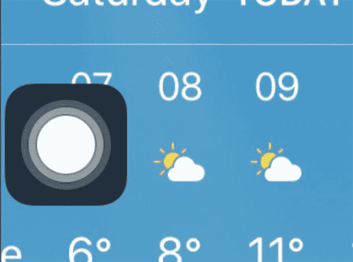
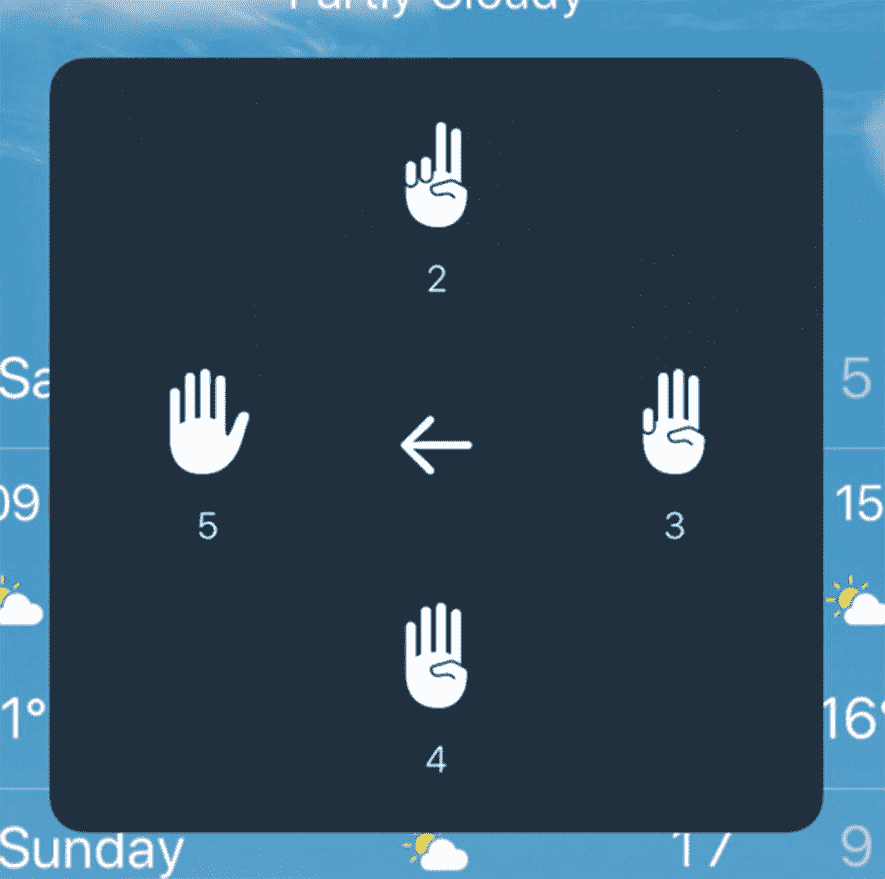
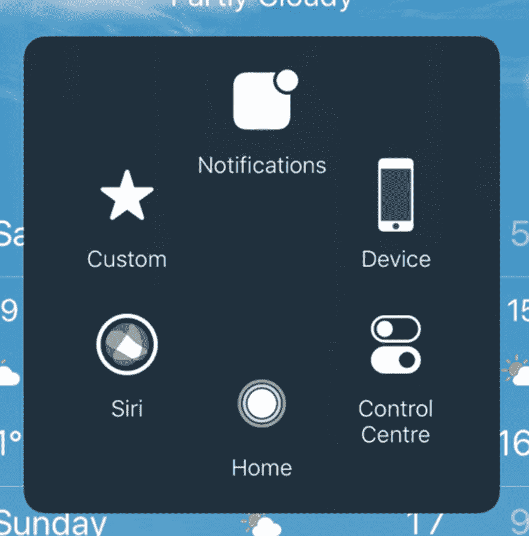
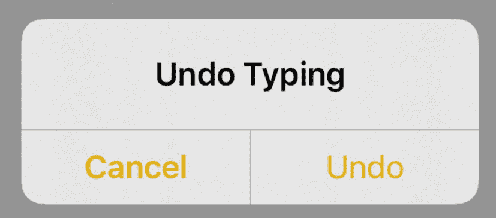
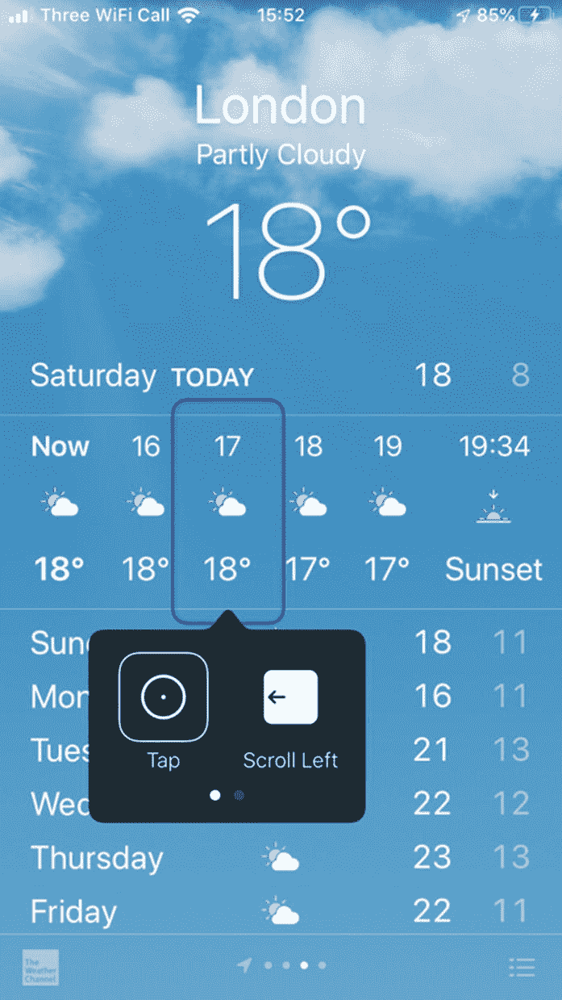
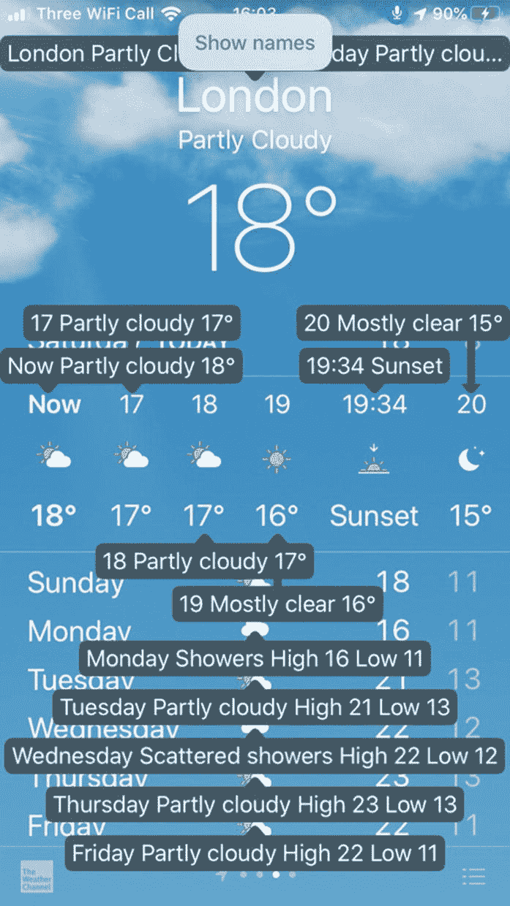

# 9.iOS 辅助功能–物理和运动

身体和运动方面的考虑帮助那些与多点触摸手势斗争的人；例如，如果有人有三个手指，他们可能需要帮助才能做出四个手指的手势。对于那些几乎没有运动控制的人来说，开关控制或语音控制可以帮助他们充分利用用户的运动。

## 辅助触摸

辅助触摸在屏幕上呈现一个小的可移动的 home 按钮状的轻击目标(图 [9-1](#Fig1) ，该目标扩展到轻击上的更多选项(图 [9-2](#Fig2) 和图 [9-3](#Fig3) )。例如，这个功能对于有运动障碍的人来说非常好，他们可能很难滑动控制中心，或者缺少手指的人可能很难做捏手势。这个按钮的存在不会影响你的应用程序的功能，但是你也许应该意识到，有了这个按钮，你的屏幕上会有一小块区域被辅助触摸按钮遮挡。



图 9-1

辅助触摸部分遮挡内容

更值得考虑的是你使用可能需要精细运动技能的手势，如多指轻拍、轻扫、捏和其他触摸手势。如果你的应用程序利用了这些，考虑监控`isAssistiveTouchRunning`，并提供一个替代方案。您可以通过监听`assistiveTouchStatusDidChangeNotification`(列表 [9-1](#PC1) )来检测该设置的变化。



图 9-3

辅助触摸，提供对多手指手势的单击访问



图 9-2

辅助触摸提供对功能的单次点击访问

```java
import UIKit

class MyViewController: UIViewController {

    var assistiveTouchStatus: Bool {
        get{
            return UIAccessibility.isAssistiveTouchRunning
        }
    }

    override func viewDidLoad() {
        super.viewDidLoad()

        NotificationCenter.default.addObserver(self, selector: #selector(assistiveTouchChanged), name: UIAccessibility.assistiveTouchStatusDidChangeNotification, object: nil)
    }

    @objc
    func assistiveTouchChanged() {
      // check assistiveTouchStatus for current status.
      // increase the prominence of gesture alternatives
    }
}

Listing 9-1Detecting changes in Assistive Touch status

```

## 摇动以撤销

摇动撤销是一个系统范围的撤销命令(图 [9-4](#Fig4) )，相当于 Mac 上的⌘ + Z 或编辑➤撤销。对于那些在运动技能方面有困难的人来说，这个功能可能是困难的，因为他们的手可能缺少运动来完成这个手势。此外，许多人发现他们无意中触发了“摇动以撤销”，例如患有帕金森氏症的人。



图 9-4

iOS 的标准摇动撤销确认对话框。如果意外触发，这种模式对话框可能会令人沮丧

您的客户可以禁用此功能，以防止意外触发对话框而造成的挫折。如果撤销功能对你的应用程序来说是一个重要的特性，比如说如果你提供了文本编辑功能，你可能会希望添加一个替代的撤销机制，或者最好是增加它的重要性。你可以查询`isShakeToUndoEnabled`来确定是否可以摇动撤销，你可以监听`shakeToUndoDidChangeNotification`来改变(列表 [9-2](#PC2) )。

```java
import UIKit

class MyViewController: UIViewController {

    var shakeToUndoStatus: Bool {
        get{
            return UIAccessibility.isShakeToUndoEnabled
        }
    }

    override func viewDidLoad() {
        super.viewDidLoad()

        NotificationCenter.default.addObserver(self, selector: #selector(shakeToUndoChanged), name: UIAccessibility.shakeToUndoDidChangeNotification, object: nil)
    }

    @objc
    func shakeToUndoChanged() {
      // check shakeToUndoStatus for current status.
      // increase the prominence of undo features.
    }
}

Listing 9-2Detecting changes in Shake to Undo status

```

## 开关控制

开关控制是为那些有更严重运动障碍的人设计的。虽然辅助触摸可以使某些手势更容易，但开关控制是为那些很难触摸或点击的人设计的。

Caution

在您阅读“使用开关控制导航”之前，请不要启用开关控制

使用 iOS 为您的应用程序生成的辅助功能用户界面，Switch Control 将自动扫描屏幕，用边框突出显示辅助功能元素，类似于 VoiceOver 的外观。与 VoiceOver 的不同之处在于，它不是依次高亮显示每个可访问的元素，而是将元素自动分组到有意义的区域，以减少访问任何给定元素所需的按压次数。仅包含内容的元素也被排除在外，因为该开关控件旨在作为允许控制的工具；只有可以交互的元素才会突出显示。选择一个元素后，该元素的可用动作会在下拉列表中显示(图 [9-5](#Fig5) )。如果您使用 iOS 的内置控件，如`UIButton`，这些操作将为您填充。但是如果你想添加一个手势的替代，一个很好的选择是在这里添加一个可访问性自定义动作。这些细节可在第 [6 章](06.html)中找到。



图 9-5

开关控制

这种导航方法的目的是让行动受到严重限制的用户能够只使用一个手势来导航他们的设备。但是，根据用户的能力，可以添加更多的手势。有问题的开关可以是很多东西。您设备的屏幕可以制作一个单独的开关，或者可以使用为 iPhone 制作的开关或开关控制器来连接外部物理开关。这些可以通过蓝牙或 MIDI 通过 USB 连接到 lightning 适配器。对于缺乏按下或点击这些物理开关之一的运动能力的用户，可以使用设备的摄像头来检测头部运动，允许向左或向右的头部运动来控制设备的不同方面。

以这种方式导航界面可能非常耗时。因此，启用了交换机控制的用户最有可能受到超时的影响。

您可以通过监听`switchControlStatusDidChangeNotification`或查询`isSwitchControlRunning`(列表 [9-3](#PC3) )来检测开关控制的状态。

```java
import UIKit

class MyViewController: UIViewController {

    var switchControlStatus: Bool {
        get{
            return UIAccessibility.isSwitchControlRunning
        }
    }

    override func viewDidLoad() {
        super.viewDidLoad()

        NotificationCenter.default.addObserver(self, selector: #selector(switchControlChanged), name: UIAccessibility.switchControlStatusDidChangeNotification, object: nil)
    }

    @objc
    func switchControlChanged() {
      // check switchControlStatus for current status.
      // increase the prominence of gesture alternatives.
    }
}

Listing 9-3Detecting changes in Switch Control status

```

### 导航风格

当开关控制突出显示元素时，它们通常是单独完成的。取决于布局，开关控制可以确定将元素分组在一起是合乎逻辑的，比如在分组的表格视图中。我们可以调整我们的可访问性接口来告诉 Switch Control，它应该总是将元素作为一个组或者单独处理(图 [9-6](#Fig6) )。对元素进行分组可以更快地导航到 UI 的其他区域。当控制很重要时，单独处理它们是合适的。在这种情况下取得平衡可能很困难，理想的情况是通过对每天使用开关控制的参与者进行一些用户测试来判断。


图 9-6

使用开关控制导航。元素分别导航(左)和组合导航(右)

每个视图都有一个属性`accessibilityNavigationStyle`；我们可以将它设置为`.separate`或`.combined`(列表 [9-4](#PC4) )，这取决于我们想要的结果。

```java
buttonStackView.accessibilityNavigationStyle = .combined

Listing 9-4Setting the Switch Control navigation style to group elements presented in a Stack View

```

Navigating With Switch Control

在启用交换机控制之前，您需要将交换机添加到您的设备中。你的屏幕可能是在测试环境中使用的最简单的选择，尽管我也建议使用头部运动和前置摄像头来尝试一下。在辅助功能设置的开关控制菜单下，点击开关➤添加新开关… ➤屏幕➤全屏➤选择项目。

现在通过辅助功能设置启用开关控制，或者在将来通过激活我们在本节开始时设置的辅助功能快捷方式来启用开关控制。你会看到一个蓝色的边界框出现在屏幕的顶部；一秒钟后，这个框将在屏幕上向下移动到下一组可选元素；再过一秒钟，盒子就会再跳一次，以此类推。要激活突出显示的区域，请点击设备屏幕上的任意位置。如果该突出显示包含一组项目，扫描仪将开始在元素间循环。开关控制以秒为间隔完成此操作。

使用开关控制激活单个元素后，会出现一个可能操作的下拉菜单。这些操作以与屏幕本身相同的方式循环，这意味着您可以点击屏幕上的任何位置来执行高亮显示的操作，或者聚焦于高亮显示的组来导航到不同的操作。突出显示的第一个操作是“始终点击”,这意味着在没有启用开关控制的情况下使用设备时，双击元素实际上等同于直接点击元素。

禁用开关控制，方法是轻按设备上的主屏幕按钮或睡眠按钮三次以激活辅助功能快捷方式，然后在突出显示开关控制后轻按屏幕两次。

## 口声控制

语音控制是 iOS 13 的一项新功能，允许只使用语音来完全控制你的应用程序，这使它成为行动最受限的人的理想选择。语音控制使用与 VoiceOver 相同的辅助功能用户界面、开关控制和不同的辅助技术，这意味着您的应用程序默认支持它。和其他辅助技术一样。由 UIKit 确定的可访问用户界面可能并不总是理想的，或者确实是准确的，因此可能需要一些定制。

可以使用辅助功能快捷方式启用语音控制。但激活它最直接的方式可能是说“嘿 Siri，打开语音控制”，要禁用它，你可以简单地说“关闭语音控制”，然后点击“执行”来确认。导航通常并不复杂，因为您将使用的最常见的命令是“点击”,然后是按钮的标签。如果你不确定按钮的标签，说“显示名称”(图 [9-7](#Fig7) )来显示每个控件的辅助功能标签。



图 9-7

语音控制显示姓名

请确保您的控件的可访问性标签准确而简短，因为这将是您的语音控制客户用来激活有问题的控件的短语。使用“显示名称”命令可以清楚地显示标签是否太长，是否遗漏了标签，或者标签是否不容易从图像中识别出来。

如果你的元素包含大量的内容或者用户不容易理解的内容，那么，一般来说，这应该作为`accessibilityValue`而不是`accessibilityLabel`提供。您还可以提供一组更短的或者用户可能会说的替代标签，通过向您的元素`accessibilityUserInputLabels`属性(清单 [9-5](#PC5) )提供一个字符串数组，确保首先给出默认标签。

```java
playButton?.accessibilityUserInputLabels = ["Play", "Play song", "Play \(song.title)"]

Listing 9-5Providing friendly labels for Voice Control to listen for to activate a “play” control

```

## 摘要

*   确保您的可访问用户界面是准确的，将确保开关控制和语音控制如您的客户所期望的那样工作。

*   如果你的应用程序使用触摸手势，确保你提供一个不需要手势的替代方案。此外，将这些作为辅助功能操作添加到您的辅助功能用户界面中。

*   语音控制是一个很好的工具，可以快速直观地判断你的用户界面是否合理。而且用起来很好玩。

下一章是我们对 iOS 辅助功能的总结。我们将介绍 iOS 为有听力障碍的人提供的注意事项。