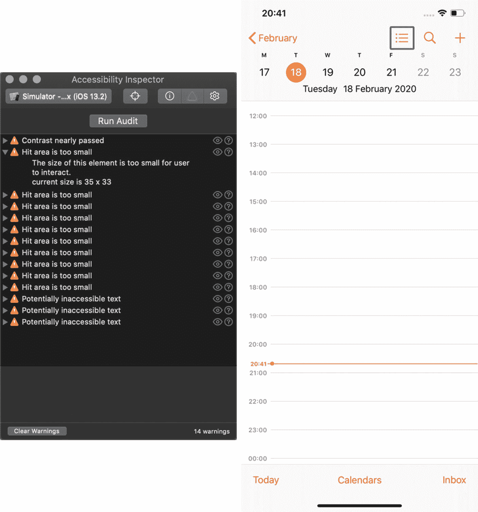
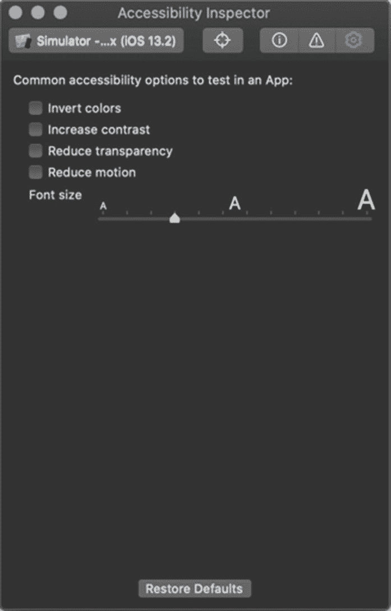
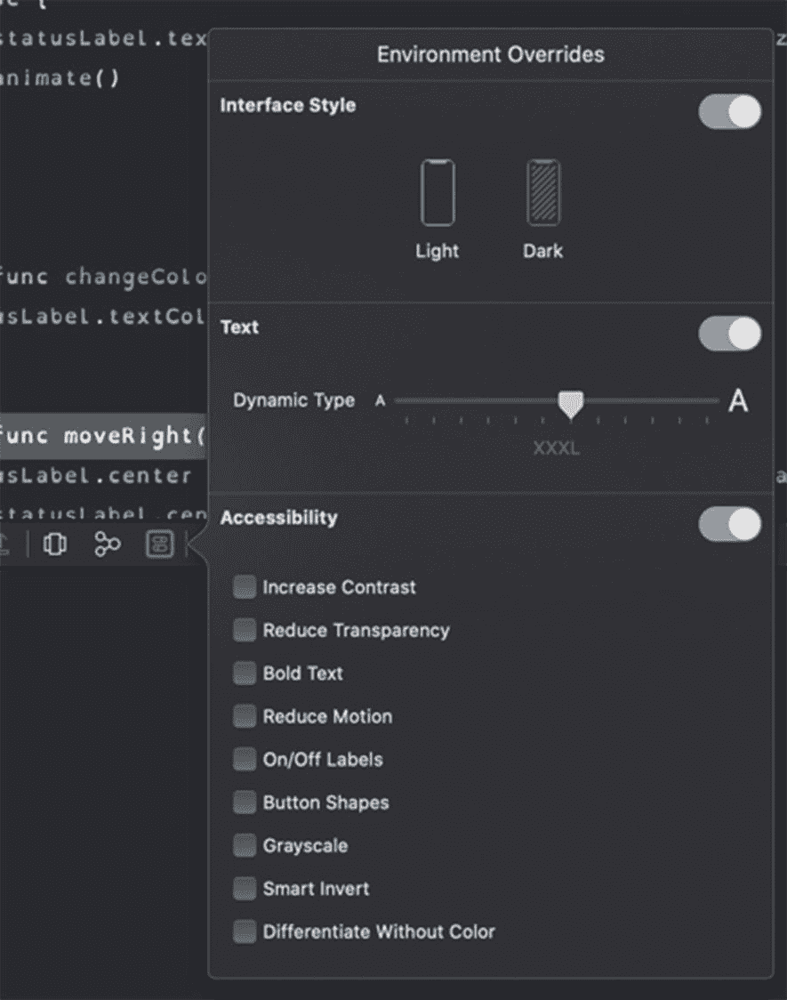
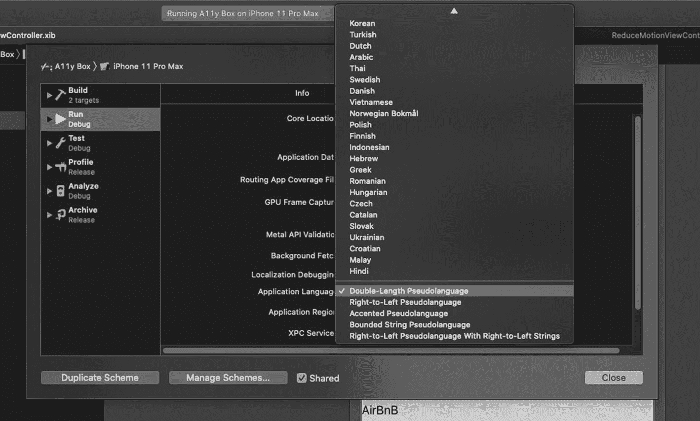
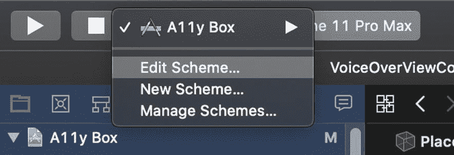
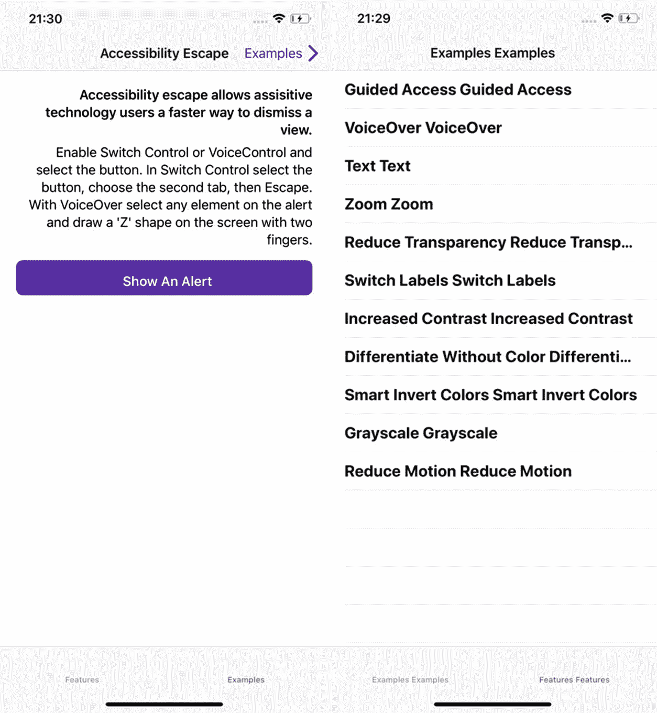
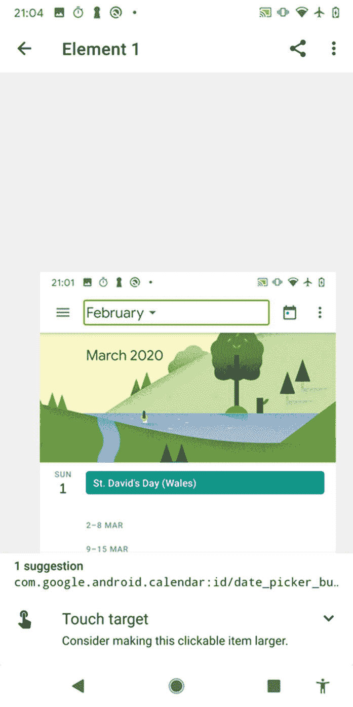
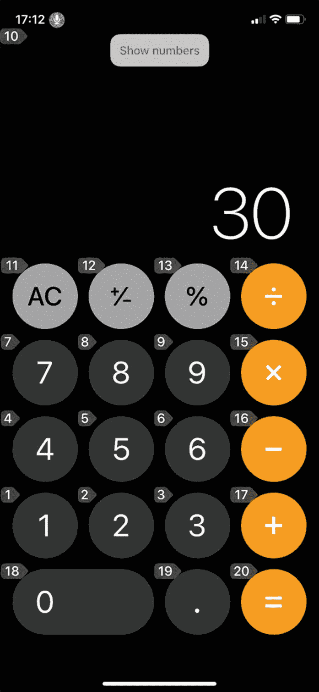
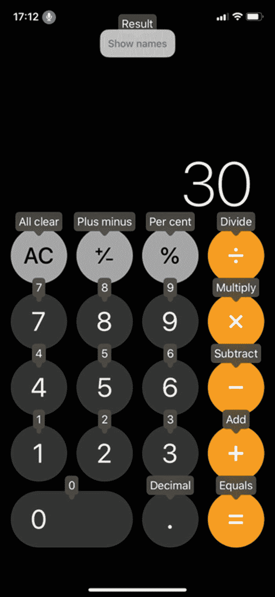

# 11.可访问性测试

这本书会给你一大堆工具和实用技巧，你可以在创建你的应用时使用，从设计、编码到整个服务。你如何在你的应用程序中使用这些知识，必须基于你的团队对它如何最适合你试图实现的目标的考虑。然而，除非你检查你的工作，否则这些工具没有一个能产生真实的人所需要的影响。

不要认为易访问性测试是额外的。和编码一样，你应该把易访问性作为你工作流程的一部分。将可访问性测试的考虑因素作为现有测试计划的一部分。因此，我不打算教你制定测试策略的基础知识；相反，我会提供应该成为第二天性的提示和工具。

## 自动化测试

有几个自动测试工具可以检查你的应用程序是否符合可访问的标准。将其中之一包含到您现有的持续集成套件中，将有助于确保您的可访问性标准始终保持较高水平。拥有这样一个可访问性质量关也将鼓励开发人员考虑高标准的可访问性，因为他们知道如果不这样，他们将无法发布他们的代码。

请记住，可访问性是关于你的客户如何体验你的应用，而不是复选框。自动化易访问性测试只能检查某些东西。一些商业工具已经被创建为法规遵从性工具，用于在需要时提供证据，证明您已经遵循了可访问性指南。如果你的主要目标不是因为糟糕的可访问性而被起诉，这是非常好的。我觉得防止基于可访问性的法律纠纷的更好方法是创建一个更易访问的应用程序。使用这些工具作为防止回归的方法，但是它们不能代替手工测试或者用户测试。

诸如此类的工具的主要好处是，您可以将它们集成到您现有的 CI/CD 管道中。通过这种方式，它们在发布前充当质量关。任何没有达到你的可访问性标准的提交都不会被发布给你的客户。

### Google GTXiLib

Google 为 iOS 提供了一个开源的自动化可访问性测试工具。GTXiLib， <sup>[1](#Fn1)</sup> 或 Google Toolbox for Accessibility，适用于 XCTest UI 测试框架，如 Google 自己的 EarlGrey。

GTXiLib 确保你的元素有一个合适的点击目标大小，有一个没有标点符号的可访问性标签，如果是按钮的话不会以“button”结尾。检查标签及其背景之间的冲突可访问性特征和对比。对比度检查只适用于标签，不适用于其他元素，比如按钮。

### 世界空间证明

Deque 为数字无障碍提供一系列服务，如培训和评估。他们的网站还提供了大量关于数字无障碍的博客和资源。

德克的世界空间证明 <sup>[2](#Fn2)</sup> 产品是一个用于 iOS、Android 和 Web 的可访问性测试工具包。对于移动设备，这是通过在你的应用程序中包含一个框架来实现的。然后，您可以将测试集成到 Android 或 iOS 上现有的单元测试套件中。实例化一个视图，然后将它传递给 Attest 函数，以便在出现可访问性问题时产生测试失败。

测试包括检查可动态调整大小的文本、按钮大小、滚动视图外显示的文本元素以及重叠控件。

### XCUI 测试

iOS 的第一方 UI 测试框架 XCUI 通过检查应用程序的可访问性树来执行测试。这意味着任何编写良好的 XCUI 测试也是一个可访问性测试。这也意味着易访问的应用程序更容易编写自动化测试。

在 XCUITests 中按标签查找元素是必须的(清单 [11-1](#PC1) )。替代方法，比如通过可访问性标识符查找元素，虽然它们确实保证了屏幕上有一个元素，但是不能保证您已经为它设置了内容或者您的内容是正确的。如果找不到某个元素，这可能是因为您已将该元素设置为“可访问性隐藏”。同时，不要试图为了测试而让元素具有可访问性，因为这会给用户带来不好的体验。

```java
let myButton = XCUIApplication().buttons["My Button"]

Listing 11-1Finding a button element from its label “My Button”

```

一旦有了一个元素，就有可能对它执行一些可访问性健全性检查。这些检查的形式可以是断言按钮是大写的，并且不以句号结尾，或者交互元素最小为 44px x 44px(清单 [11-2](#PC2) )。我在下面提供了一些你可以使用的示例测试(清单 [11-2](#PC2) 和清单 [11-3](#PC3) )。我提供的进一步测试在一个名为 A11yUITests <sup>[3](#Fn3)</sup> 的库中，您可以将其作为 XCUITests 的依赖项。

```java
import XCTest

class AccessibilityTests: XCTestCase {

     let app = XCUIApplication()

     override func setUp() {
        app.launch()
     }

     func test_buttonAllButtons() {
          // Navigate to the screen you want to check

          let buttons = app.buttons.allElementsBoundByIndex

          for button in buttons {
             check(button: button)
          }
     }

     func check(button: XCUIElement) {
          XCTAssert(button.frame.size.height >= 44)
          XCTAssert(button.frame.size.width >= 44)
          XCTAssertTrue(button.label.count <= 40)
          XCTAssert(button.label.first!.isUppercase
     }
}

Listing 11-2Checking all buttons on screen have a large enough tap target

```

```java
import XCTest

class AccessibilityTests: XCTestCase {

     let app = XCUIApplication()

    override func setUp() {
        app.launch()
    }

    func test_imageName() {
    // Navigate to the screen you want to check

         let images = app.images.allElementsBoundByIndex

         for image in images {

              XCTAssertFalse(image.label.contains("image"))
         }
    }
}

Listing 11-3Checking image’s

accessibility label doesn’t contain the word “image”

```

### 浓缩咖啡测试

Android 的 Espresso 测试框架包括一类可访问性检查。通过导入`AccessibilityChecks`来包含这些测试，并使用清单 [11-4](#PC4) 中的代码来启用它们。

```java
import androidx.test.espresso.contrib.AccessibilityChecks

@RunWith(AndroidJUnit4::class)
@LargeTest
class MyWelcomeWorkflowIntegrationTest {
    companion object {
        @Before @JvmStatic
        fun enableAccessibilityChecks() {
            AccessibilityChecks.enable()
        }
    }
}

Listing 11-4Enabling accessibility tests in Espresso

```

每当在视图上执行一个动作时，测试将自动在该视图及其子视图上执行。或者，您可以通过在`enable()`调用后添加`setRunChecksFromRootView(true)`来指示 Espresso 在根视图上运行测试套件。

`AccessibilityChecks`包含对许多常见可访问性问题的测试，如冗余标签、可访问性标签存在和点击目标大小。它还能够检查其他工具无法检查的可访问性问题，例如遍历顺序和图像对比度。

## 验证工具

可访问性验证工具是自动化测试和手动测试之间的中间地带。在某些方面，它们可以提供比自动化测试更多的细节，但是需要手工操作来运行检查。

### google 扫描仪

GSCX， <sup>[4](#Fn4)</sup> 或 Google Scanner for Accessibility，是 Google 的 GTXiLib for iOS 之上的一个库。您可以将 GSCX 包含在您的内部测试应用中。这里它在你的应用程序屏幕上覆盖了一个“执行扫描”按钮。按下此按钮时，GSCX 会突出显示任何违规元素。点击这些突出显示提供了失败原因列表和解释。由于 GSCX 在引擎盖下使用 GTXiLib，因此它具有相同的检查套件。

如果您正在使用 GTXiLib 进行自动化测试，这是一个友好的额外工具，可以帮助可访问的开发。

### 世界空间证明

如果你已经在 iOS 或 Android 上购买了 Deque 测试工具的许可证，这也带有手动模式。手动检查通过导航您的应用程序进行，该应用程序附带有 Attest companion 应用程序。然后，附加的应用程序可以对您的应用程序的可访问性树进行快照，并为您提供发现的任何问题的详细报告，在出现故障的屏幕截图上突出显示。

### Apple 辅助功能检查器

辅助功能检查器是 Xcode 工具套件的一部分。您可以从 Xcode 菜单➤ Open Developer Tool 中的 Xcode 内启动它。然后，您可以在设备上或模拟器上以两种模式之一对您的应用程序运行辅助功能检查器。

Quicklook 允许您将模拟器中的用户界面元素作为目标，以查看元素的可访问性属性，如标签、特征和提示(图 [11-1](#Fig1) )。快速查看视图的顶部会显示 VoiceOver 遇到元素时读取的字符串。按下旁边的扬声器按钮会让 VoiceOver 朗读字符串。


图 11-1

快速查看模式下的辅助功能检查器(左)显示 iOS 日历图标的辅助功能属性，高亮显示(右)

这里的大播放按钮将在屏幕上的每个可访问元素之间循环。“辅助功能检查器”会按照 VoiceOver 导航屏幕的顺序来执行此操作。“辅助功能检查器”会像 VoiceOver 一样为您朗读元素。这使得验证技术比使用 VoiceOver 本身要快得多。

审计模式对整个当前视图进行检查，并报告发现的任何可访问性问题(图 [11-2](#Fig2) )。报告包括验证失败原因的更详细描述、位置失败的元素的屏幕截图，以及如何修复失败的提示。测试包括对比度、动态文本、点击目标大小和对大图像的描述。



图 11-2

审核模式下的辅助功能检查器报告(左)。审计创建屏幕截图，突出显示屏幕上可能存在问题的区域(右图)

辅助功能检查器还提供了使用设置选项卡切换某些辅助功能的快速访问(图 [11-3](#Fig3) )。您可以在这里调整动态文本的大小。您还可以切换反转颜色、增加对比度、降低透明度和减少运动。



图 11-3

“辅助功能检查器设置”标签提供对某些辅助功能的控制

### Xcode 环境覆盖

Xcode 为当前运行的应用程序提供了一个环境覆盖菜单。这在模拟器和设备上都有效。你可以在编辑器底部的调试器工具栏上找到这个按钮(图 [11-4](#Fig4) )。在这里，您可以毫不费力地在明暗模式之间切换，并调整动态字体大小。您还可以切换几个辅助功能:增加对比度、降低透明度、粗体文本、减少运动、开/关标签、按钮形状、灰度、智能反转和无颜色区分。



图 11-4

Xcode 环境覆盖

### Xcode 应用语言

Xcode 还提供了用不同语言测试应用程序的覆盖，包括伪语言。通过点击 Xcode 左上角的应用名称来编辑你的应用的构建方案(图 [11-5](#Fig5) )。在运行和选项下，你会发现一个应用语言的下拉选项。在这里，您可以选择 iOS 支持的任何语言来检查您的本地化。列表底部还提供了各种伪语言选项(图 [11-6](#Fig6) )。



图 11-6

在 Xcode 的方案编辑器中选择一种伪语言



图 11-5

在 Xcode 中编辑目标的方案

伪语言是模仿具有不同属性的语言的合成语言。这个列表中最有用的是从右向左的伪语言和双倍长度的伪语言(图 [11-7](#Fig7) )。从右到左的伪语言模仿了你的应用程序在阿拉伯语中的显示方式，这种语言的阅读方向与大多数语言相反。双倍长度的伪语言复制你的字符串。这允许您检查您的布局是否足够灵活，以支持比您的开发语言占用更多空间的语言。在布局中提供足够的灵活性也有助于支持动态文本大小。



图 11-7

从右向左的伪语言(左)和双倍长度的伪语言(右)

### 谷歌无障碍扫描仪

谷歌的无障碍扫描仪是一个应用程序，可以从谷歌 Play 商店免费下载。 <sup>[5](#Fn5)</sup> 当被请求时，可访问性扫描器将对你的应用程序运行审计，捕捉屏幕截图并突出显示将从改进中受益的元素(图 [11-8](#Fig8) )。该报告为您提供了失败视图的标识符，以及元素失败原因和如何修复错误的描述。



图 11-8

谷歌无障碍扫描器提出改善无障碍的建议

## 人工测试

虽然自动化工具和检查器在防止回归和突出不太明显的可访问性错误方面非常出色，但是存在自动化测试永远无法识别的可访问性问题。其中最常见的是确定您向客户展示的可访问性树是否合理和有意义。虽然在我们的可视化用户界面中，我们有设计师来为我们做这些，但是一旦我们将设计转化为代码，他们的辛勤工作并不总是转化为有用的可访问性树。检验这一点的唯一方法是亲自尝试。

### 屏幕阅读器测试

创建新屏幕或对屏幕进行重大更改时，请在启用 VoiceOver 或 TalkBack 的情况下浏览屏幕。虽然这些屏幕阅读器仅构成一种辅助技术，但由于它们都使用相同的可访问性树，因此体验应该是相似的。

一旦您熟悉了这些屏幕阅读器的工作方式，这个测试应该会成为您常规开发工作流程中快速且必要的一部分。随着你对这个测试越来越熟悉，试着启用黑屏或幕帘。这些功能会关闭显示屏，这意味着您与设备的唯一交互是通过手势和设备语音反馈。对你来说，在没有任何视觉提示的情况下关注你的应用有多简单？

#### 需要注意什么

当使用屏幕阅读器执行手动测试时，当您导航时，有几个问题要问。

1.  每个元素都是按照逻辑顺序呈现的吗？

    元素应该以有意义的方式相互跟随，为控件提供上下文。例如，不要在要购买的商品名称前显示“购买”按钮。

2.  是否缺少任何元素？

    元素可能对辅助技术隐藏，但在屏幕上仍然可见。当我滑动浏览时，屏幕上的所有内容和控件都被读取了吗？

3.  有我不希望出现的元素吗？

    如果您在屏幕上隐藏了元素，根据您隐藏它们的方式，它们可能仍然可用于辅助技术。这可能会导致您向客户提供不正确的信息，或者让您的客户进入无效状态。

4.  浏览这个屏幕很费力吗？

    你必须经常在元素间滑动吗？元素或控件是否重复？信息是重复的吗，就像给一个按钮命名为“button”并设置一个“button”特征？也许有些元素可以隐藏起来，以便在不失去意义的情况下改进导航。考虑使用语义视图。

### 语音控制测试

iOS 13 的新语音控制功能首先是一个辅助功能，是为那些努力敲击屏幕的人设计的。但是它也隐藏了第二个非常有价值的功能，作为一个快速的可访问性测试工具。

通过说“嘿，Siri，启用语音控制”来启用语音控制启用后，说出“显示数字”iOS 会在每个交互元素旁边显示编号气泡(图 [11-9](#Fig9) )。这个数字代表 VoiceOver 访问每个元素的 tab 键顺序。快速浏览这些数字将会确认您是否缺少元素或者有您不期望出现的元素。它还将帮助您验证每个元素的顺序在屏幕的上下文中是否有意义。



图 11-9

语音控制显示辅助功能选项卡顺序

接下来，说“显示姓名”iOS 会将这些编号的气泡替换为带有每个交互元素可访问性标签的命名气泡(图 [11-10](#Fig10) )。这允许您验证标签是否存在以及是否有意义。



图 11-10

显示辅助功能标签的语音控制

## 用户反馈

考虑在您的应用程序中添加一个选项，让您的客户联系您并提供反馈。AppleVis 是一个由盲人和低视力苹果用户组成的在线社区，它建议其成员在遇到可访问性问题时联系应用程序开发者，以概述问题。许多发现易访问性问题的人就是这么做的。现实情况是，许多开发人员对可访问性了解不够，不知道可能存在问题。做电子邮件反馈的人往往会发现他们从中获得了好的结果。但是即使你遵循了这本书里的所有内容，你仍然不会有你的客户在使用你的应用时的体验。反馈选项是一种低成本、低工作量但有效的用户测试方式。

作为移动开发人员，我们有一个好处，尽管这可能并不总是一个好处，那就是我们以应用程序评论的形式收到客户的反馈。定期查看这些，并确定趋势。留意那些抱怨你的应用程序缺少某个功能的人。这不是你的用户没有发现这一点的错；你的特征要么不够直观，要么不够明显。

## 用户测试

在本书的前面，我强调了移情在软件工程中的重要性。同理心对于任何软件工匠来说都是一项非常有价值的技能。但同理心有时会把我们引向错误的道路——认为必须做一些事情，但不考虑我们选择做的事情是否有我们想要的效果。提高应用程序可访问性的一个原因确实是因为帮助他人让你感觉良好，但这不应该是主要原因。设计战略家 Liz Jackson 要求我们重新思考移情策略。

> *【同理心】具体化阶级和权力结构。你总是有移情者，然后你总是有移情者，对吗？移情者是救世主，移情者永远是接受者，这些角色永远不会改变。*

> *【感同身受】让接受者保持沉默。你应该感激为你做的一切。*
> 
> ——莉兹·杰克森，移情具体化残疾污名 <sup>[7](#Fn7)</sup>

无障碍顾问和手语使用者 Marie van Driessche 告诉我们，从她的经历来看，同理心被用作不和残疾人交谈的借口。

> 大多数人对与残疾人交谈不感兴趣，他们更喜欢感同身受。但是同理心并没有帮助我们。
> 
> -玛丽·范·德里斯切<sup>t1[8]T2</sup>号

我的观点是，如果你没有和残疾用户一起测试你的应用程序，你就没有做到可访问性。你只是在浪费你的发展时间来提升你的自我。

有许多专门讨论用户测试的书籍，它们会涵盖如何用比我更多的专业知识来做这件事，所以我不会涉及如何建立用户测试会议或实验室。但是我想表达让你的用户测试会议的参与者多样化是多么的重要。确保包括残疾人，以及来自不同背景和各种技术能力的人。最重要的是，倾听他们的反馈。可能是这样的情况，你所做的一个认为会提高可访问性的改变反而使它变得更糟。残疾人没有义务感谢你为他们考虑。相反，作为开发人员，你的职责是处理他们的反馈。

## 摘要

*   和软件的其他方面一样，如果你不测试它，你怎么知道它能工作呢？

*   最准确和最有用的易访问性测试形式是对具有不同能力的人进行用户测试。一定要倾听和相信他们的经历。

*   用户测试可能是耗时且昂贵的，所以考虑将自动化测试作为标准发布过程的一部分。然而，您不应该过于依赖自动化测试，因为它们的范围是有限的。

<aside aria-label="Footnotes" class="FootnoteSection" epub:type="footnotes">Footnotes [1](#Fn1_source)

[T2`https://github.com/google/GTXiLib`](https://github.com/google/GTXiLib)

  [2](#Fn2_source)

[T2`www.deque.com/tools/worldspace-attest/`](http://www.deque.com/tools/worldspace-attest/)

  [3](#Fn3_source)

[T2`https://github.com/rwapp/A11yUITests`](https://github.com/rwapp/A11yUITests)

  [4](#Fn4_source)

[T2`https://github.com/google/GSCXScanner`](https://github.com/google/GSCXScanner)

  [5](#Fn5_source)

[T2`https://play.google.com/store/apps/details?id=com.google.android.apps.accessibility.auditor`](https://play.google.com/store/apps/details%253Fid%253Dcom.google.android.apps.accessibility.auditor)

  [6](#Fn6_source)

[T2`https://applevis.com/apps`](https://applevis.com/apps)

  [7](#Fn7_source)

杰克逊莉兹。 [`https://vimeo.com/319388683`](https://vimeo.com/319388683) 谓移情使残疾污名具体化

  [8](#Fn8_source)

范·德瑞斯彻，玛丽。推特帖子。2019 年 9 月 4 日<sup>日</sup>。[T4`https://twitter.com/marievandries/status/1169242121108369409`](https://twitter.com/marievandries/status/1169242121108369409)

 </aside>