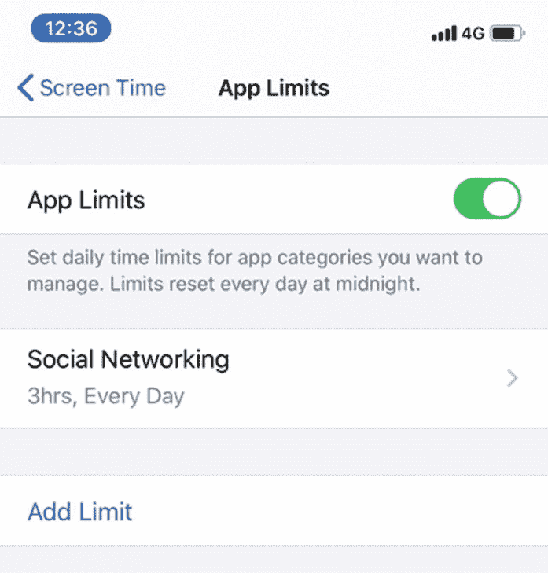

# 十二、让您的应用具有包容性

到目前为止，我希望我已经说服了你，为什么可访问性和包容性是必不可少的。我们还介绍了每个平台的功能和原因。但是，你应该何时以及如何使用谷歌和苹果为你创造的每一个工具呢？在这一章中，我们将讨论一些你可以用来为不同的人改善你的应用体验的技术。没有特定的顺序，我们将涵盖不同的人群，并讨论一些让你的应用更具包容性的方法。我们将结合平面设计、服务设计和移动编程的元素。

最终目标是让我们的应用成为真正的包容性体验。当你通读时，你可能会注意到一些主题出现了。这不是偶然的。把你的应用定位于某一群人，这不是包容，而是排斥。通过坚持围绕设计、灵活性和尊重客户的原则，我们可以创建对每个人都更好的软件。

## 诵读困难、自闭症和学习困难

符合这一类别的人，以及患有其他疾病的人，如多动症、双相情感障碍等，通常被称为神经多样性。我喜欢这个词提供的框架；它改变了神经多样化的人需要克服某些东西的想法。认为自己神经多样化的人觉得他们的大脑以不同于我们其他人的方式工作。我有阅读障碍，虽然这确实给我带来了问题，即阅读和数学，但我觉得大脑处理信息的方式给我提供了独特的视角。这花了我很多年，我会一直学习新的东西，但我觉得我已经掌握了如何利用这些差异作为优势。你可以做一些事情，让包括我在内的神经多样化的人对你的应用有更愉快的体验。

### 设计简单

坚持合理的设计原则将对许多有学习困难的人产生重大影响。保持你的设计一致、简单、干净、整洁。坚持平台规范以增加一致性。

任何移动或动画内容都必须包含一个让您的客户暂停动画的机制，包括视频，但不包括过渡。移动内容应该只在响应用户操作时触发。

### 排印

不要使用太多的字体、字号或颜色。有太多的变化会让你的应用看起来混乱和不一致。但是对于一些有学习困难的人来说，太多的差异会使阅读变得更加困难。避免粗体、下划线、斜体和全部大写的文本。

对于正文，在浅色背景上使用黑色文本，而不是白色。如果可能的话，允许用户选择背景颜色是最理想的。正文应该总是自然对齐(在大多数语言中是左对齐)。如果您的设计要求文本居中或右对齐，这是可以的，但要避免完全对齐的文本，因为这会创建一堵难以解读的文本墙。

### 清晰的书面内容

保持书面内容简洁和描述性。明确任何行为的后果。对按钮和其他控件使用这些相同的原则。避免使用习语、首字母缩略词和缩写词，因为这些很难理解。

简明英语运动在他们的网站 [1](#Fn1) 上提供免费的建议，让你用清晰的英语写作，既能表达你的信息，又能引人入胜。海明威( [`www.hemingwayapp.com`](http://www.hemingwayapp.com) ，见图 [12-1](#Fig1) )是一个伟大的免费网络应用，它会检查你的语法，并为你的文本提供美国学校阅读评分，突出需要改进的地方。

图 12-1

海明威强调我可以提高我的写作可读性的领域。老实说，这本书的大部分内容没有这一段突出红色

### 文本的替代

不要只展示基于文本的信息。以图像、图表或视频的形式提供冗余。对于较大的文本组，或者对于不容易转换成可视形式的文本，请提供录音。

iOS 和 Android 都提供屏幕阅读器——在 Android 上选择朗读，在 iOS 上选择朗读和朗读屏幕。注意，这些与画外音和回话是不一样的。VoiceOver 和 TalkBack 包含一个导航元素，是为有视觉障碍的用户设计的。屏幕阅读器只读文本内容。它们不读取或促进与控件的交互。您应该在启用屏幕阅读器的情况下测试您的应用，以确保它以有意义和可理解的方式阅读您的内容。您可能需要更改应用的可访问性树，以提供最佳体验。

### 颜色

对于一些有学习困难的人来说，特定的颜色组合会使文本显得杂乱或闪烁。避免明亮、鲜艳的颜色，尤其是在内容周围。文本使用黑色，而不是灰色或其他颜色，不管这种颜色有多接近黑色。文本内容的背景应为浅色；柔和的颜色很好。避免白色或其他亮色。理想情况下，允许客户选择适合他们的背景颜色。

### 准确

不要坚持书面输入的准确性。相反，提供选项。在有限的选项中，允许您的客户从微调按钮或按下按钮进行选择。在选项范围较广的地方，如文本框，提供自动完成的机会或减少键入量的建议。尽可能确保这些建议不需要完美的拼写就能出现。

对于较长的段落，允许通过听写输入文本。默认情况下，两个平台都支持听写，但如果您的应用提供了自己的键盘，则可以禁用听写，因此尽可能使用系统键盘。对任何标准文本条目启用自动更正。在您的用户提交之前，请始终让他们有机会检查和编辑他们输入的任何内容。

### 完全公开

用户体验专家 Harry Brignull 在 2010 年创造了一个短语“黑暗模式”,用来识别那些旨在让用户做他们不想做的事情的敌对设计模式。哈利在他的网站 darkpatterns.org 上定义了一些常见的黑暗模式。 [2](#Fn2) 这些包括但不限于，诱骗提问、确认羞辱、误导。康奈尔大学 2019 年的研究在流行的在线购物网站中共发现了 15 种不同类型的黑暗模式。研究人员发现，超过 11%的排名最高的商业网站至少有一个例子。让我们明确这一点:旨在欺骗你的用户的黑暗模式是对所有用户的蔑视，并且总是不道德的。对于有学习困难的客户来说，这些陷阱更加令人不安和困惑。

清楚执行一个行为的后果，不要在没有明确同意的情况下改变后果。例如，如果你正在收集 2FA 的电话号码，不要用它来发送垃圾短信。未知原因的意外消息的突然到来可能会令人担忧。

## 焦虑与心理健康

许多头条都在报道智能手机对健康的影响:“放下手机可能有助于你活得更久，” [4](#Fn4) 无休止的观点文章，如“我如何抛弃了我的手机，打破了我的大脑， [5](#Fn5) 以及大量的健康指南，如“你的手机影响你焦虑的 5 种方式”。看到这些标题，人们可能会很容易相信我们移动开发者创造了一个怪物。

对信息过载和新技术的恐慌比技术本身还要古老。大约在公元前 360 年，苏格拉底警告说，书面文字会“造成健忘”，读者会很难区分幻想和现实。网络成瘾或手机成瘾确实存在，而且其危害性不亚于任何其他成瘾。过度使用智能手机会导致压力、抑郁、睡眠问题、焦虑和孤独，这也是事实。8[8](#Fn8)T7】

虽然过度使用技术是心理健康不佳的一个指标，但技术使用不足也是如此。Bélanger 和他的同事在 2010 年的一项研究中发现了互联网使用和心理健康之间的“U 型关联”。他们经常被引用的研究发现，那些很少或不使用互联网的人因感到孤独而导致的抑郁程度增加了。因此，虽然我们选择的平台可能会对某些人产生上面列出的影响，但对大多数人来说，它会产生完全相反的影响。通过创造身临其境的体验，我们让人们丰富他们的生活，找到归属感。这是我们应该庆祝的事情。

确定智能手机使用的哪些领域是精神健康的风险因素几乎是不可能的。我们可以在智能手机上执行的广泛任务，加上大量使用智能手机是一种社会规范的事实，使得识别模式非常困难。 [10](#Fn10) 但是我们可以对心理健康风险因素进行一些更为一般性的研究，从而制定一些指导方针。

### 向导

迷失或受困的感觉可能是焦虑的催化剂。在移动领域，这种情况经常发生，迫使您的客户在我们选择的时间执行操作，例如，显示一个间隙，而不是让我们的客户在他们准备好的时候做出决定。我经常看到的另一种模式是，试图通过隐藏替代选项来让用户选择我们喜欢的结果。

你可以通过指引和路标来对抗迷失感。当客户执行任务时，向他们展示他们的进度，以重申他们已经完成的任务以及还剩下多少。 [11](#Fn11) 让你的客户按照自己的进度前进。如果可能的话，允许您的客户按照他们的顺序前进，根据需要跳过或返回到步骤。

当你的客户完成一项任务后，在他们提交之前，给他们一个机会检查他们做了什么。让他们有机会根据需要改变自己的回答。如果任何行为会对服务产生显著影响，例如破坏性行为，在允许客户做出承诺之前，以易于理解的方式解释其后果。我们的目标通常是加快我们的应用中客户的互动，但是如果你的流程可能导致重大变化或负面结果，请考虑使用积极的摩擦。积极的摩擦提供了一个停顿，让你的客户有机会再次检查他们的行动。 [12](#Fn12)

确保你的应用的外观和感觉是一致的，尽可能坚持系统控制，以帮助与平台保持一致。事情运作方式的变化，尤其是意想不到的变化，会引起不适的感觉，并增加焦虑。

### 通讯

可见性对于焦虑来说至关重要，与客户进行清晰及时的沟通会产生积极的效果。投资一个好的文案会给你的应用的清晰性带来显著的好处。在用户采取行动之前，就行动的后果进行简单明了的交流是至关重要的。如果您要对服务进行更改，例如重新设计，请确保提前进行沟通。 [14](#Fn14)

如果你的应用以应用内购买或订阅的形式提供付费服务，不要隐藏任何费用。让付费服务的任何选项都变得透明，并明确服务包括什么和不包括什么。允许你的客户在任何时候取消，而不需要经过重重关卡。就像在你的客户开始付费服务之前通知他们一样，确保你清楚如果他们取消的话会失去什么。暂停付费服务的选项是一个很好的补充。 [十五](#Fn15)

目标是做到这一切，同时记住不要用信息轰炸你的客户。为他们提供清晰易懂的相关信息，但要保持简短，一目了然。如果您的客户需要更多信息，请指引他们到他们可以访问的地方。理想情况下，用一个真人来提供支持。对支持可以提供什么、何时可用以及需要多长时间做出响应设定期望值。 [16](#Fn16)

### 自制力

许多患有焦虑症、精神障碍或学习困难的人通常会发现给自己增加限制的能力是一种积极的行为。诺和他的同事在 2019 年的一项研究中发现，不提供内容定义端点的应用，例如无限滚动，可能会导致智能手机成瘾。强制停止使用智能手机可以让我们休息一下，重新集中注意力。根据应用的用途，在应用中实现这些控件会有很大的不同。我在这里列举了一些例子来激发灵感。

允许客户管理自己的一个很好的例子来自英国挑战者银行 Monzo。Monzo 在其应用中对某些交易进行了阻止，为客户提供了一个禁止任何与在线赌博相关的交易的设置。苹果还在 iOS 中实现了一些带屏幕时间的自控功能(图 [12-2](#Fig2) 和图 [12-3](#Fig3) )。这项功能允许我们限制我们在某些应用、类别或手机上花费的时间。当我们只希望某些基本应用可用时，我们也可以设置停机时间。

图 12-3

使用 iOS 的屏幕时间功能设置夜间停机时间

图 12-2

通过 iOS 的屏幕时间功能限制社交媒体的使用

### 社会的相互影响

数字服务是让人们变得社会化并找到归属感的无价工具。在你的应用中加入社交元素是志趣相投的人发现彼此的好方法，对他们的精神健康大有裨益。

但是正如我们在下面关于性别和性行为的章节中所提到的，用户之间的任何互动方式都会对你的客户和你的业务造成损害。对于用户之间的任何形式的交互，为客户提供一个阻止内容和用户的机制是非常重要的，最好是一个审核系统。

### 游戏化

在最好的情况下，游戏化是推动理论的数字体验分叉。推动理论是行为科学领域，研究使用积极强化来鼓励积极的行动。最常被引用的例子是在阿姆斯特丹史基浦机场的小便池中添加家蝇的图像。通过在便池的正确位置添加苍蝇，发现男性的瞄准能力显著提高，溢出量减少了 80%。游戏化可以作为一种让体验变得更积极的手段，并被证明对严重精神疾病患者有效。 [19](#Fn19)

语言学习应用 Duolingo(图 [12-4](#Fig4) )利用游戏化成为 app store 上下载量和使用量最大的学习应用。它通过结合小的、可实现的、渐进的目标、可视化的进展以及返回并保持参与的提示来做到这一点。 [20](#Fn20)

图 12-4

多林哥的成就

虽然我们当然可以批评当你没有给予足够的关注时，Duolingo 发送的越来越需要、令人焦虑的推送通知；在很大程度上，Duolingo 是一个游戏化做得很好的例子。它丰富多彩，友好，有趣，重要的是不会迫使用户付费。

游戏化往往是心理操纵的委婉说法，让你的用户做一些他们本来不会做的事情，比如花钱、执行任务、分享个人数据或许多其他例子中的一个。这两个应用商店都充满了“免费增值”游戏，糖果粉碎和部落冲突就是著名的例子。许多这样的游戏，虽然看起来是免费的，但需要大量的真钱投资才能取得重大进展。

英国移动网络 GiffGaff 已经取代了他们的一些核心业务运营，如客户支持和销售，或者 GiffGaff 称之为“社区成员”。每完成一项任务都会获得积分，比如在应用中回复一位客户的支持查询。GiffGaff 以较低的价格为每个人奖励社区成员。获得的任何积分都可以兑换成客户账单上的积分。为积极的客户行为提供奖励是提高客户忠诚度的一个好方法，可以鼓励你的应用需要的实践，让你的体验更愉快。但对我来说，将核心业务职能外包给你的客户跨越了道德劳动边界。

在用游戏化吸引你的客户和播种坏习惯之间，这是一条微妙但重要的线。诺和他的同事认为，在线与朋友竞争的游戏化可能是智能手机成瘾的一个原因。 [21](#Fn21) 诺伊的团队使用了 Snapchat 的 Snapstreak 功能的例子。Snapstreak 用一个火表情符号和连续记录保持的天数奖励定期发帖。鼓励用户保持这种势头。但这可能会导致用户感到发帖的压力，并可能导致高度的压力和焦虑。

## 经济困难

一台电脑、一台平板电脑或一部智能手机以及一个互联网连接不是一笔微不足道的财务支出，也是一笔经常性支出。对于大约 20%的互联网用户来说，智能手机是他们访问互联网的唯一途径。仅使用智能手机的互联网用户更有可能生活在贫困地区。40%的人说他们使用智能手机的原因是因为其他选择的成本。

然后，作为移动开发者，我们有责任确保我们保持与桌面体验同等的功能。围绕我们支持的设备，也需要达成微妙的平衡。放弃对旧设备和操作系统的支持可以给我们带来好处，比如降低复杂性和令人兴奋的新功能。但我们可能会离开没有应用的用户通常是那些最弱势的用户，他们可能很难升级。

还要考虑到残疾人通常比正常人有更大的成本负担——英国残疾人慈善机构 Scope 估计每月要多支付 750 美元。 [23](#Fn23) 残疾人也更容易失业。美国的就业率为 3.7%；在残疾人中，这一比例上升至 8%。 [24](#Fn24) 因此，残疾人更容易陷入经济困难的境地。

## 数字素养

你是专家。虽然我们在软件工程方面都有自己的专长，但你仍然是专家。对许多人来说，任何数码产品都是一个谜，也许是因为他们缺乏经济来源。也许他们成长在计算机还没有普及的时代，没有找到学习的理由。作为一个经常性的、长期的数字公民，很容易忘记或看不起许多不使用互联网的人，甚至可能是害怕互联网的人。但对网上银行的担忧是真实的，80%的人都有这种担忧。 [25](#Fn25)

### 基本数字技能

英国政府与亚马逊(Amazon)和微软(Microsoft)等集团协商，编制了一份基本数字技能清单。政府认为这些技能是任何人能够胜任使用互联网的基准。

当你在读这本书的时候，我想你可以掌握所有这些重要的数字技能。事实上，它们中的许多看起来是如此的基本，以至于几乎不值得一提。然而，对英国的许多人来说，现实是他们不能做这些我们认为显而易见的事情。21%的英国成年人口，1130 万人，不具备这些技能。更令人担忧的是，8%的英国成年人口，430 万人，不具备这些技能中的任何一项——一项都没有。我总结了一些关键技能和一些与移动最相关的技能。

#### 交流

沟通、协作和共享信息所需的技能，包括以下技能

*   我可以在 WhatsApp 或 Messenger 等消息平台上建立一个群组，与朋友或家人聊天。

*   我可以在社交媒体上适当发帖，并访问和发帖到 Mumsnet 或 Reddit 等论坛。

*   我可以将照片和其他文件作为电子邮件附件发送给朋友和家人。

*   我理解安全交流的重要性。

#### 处理信息和内容

安全地查找、管理和存储数字信息和内容所需的技能包括

*   我明白并非我看到的所有在线信息和内容都是可靠的。

*   我可以使用搜索引擎查找信息，并利用搜索词产生更好的结果。

*   我知道云是我可以在远程位置存储信息和内容的一种方式。

*   我可以从 Spotify 或 Apple Music 等合法网站上下载音乐，或者从网飞或亚马逊 Prime 等合法网站上观看流媒体电影。

#### 交易

注册和申请服务、购买和销售商品和服务以及管理在线交易需要以下技能:

*   我可以为公共服务建立在线账户。

*   我可以为政府服务和零售商建立在线账户，以便通过亚马逊或易贝等在线订购和支付商品。

*   我可以使用旅游网站和应用来订票。

*   我可以安全地管理我的在线资金和交易。

#### 解决问题

使用数字工具和在线服务寻找问题解决方案所需的技能:

*   我可以使用在线教程、常见问题解答和建议论坛来解决问题，并提高我使用设备、软件和应用的技能。

*   我可以通过使用像 YouTube 上的教程视频来找到如何做某事。

*   我可以使用互联网查找与需要执行的生活任务相关的特定信息，例如，查找食谱或帮助计划旅行的信息。

#### 在线安全合法

在生活和工作中保持在线安全、合法和自信所需的技能包括

*   我对网站和帐户使用不同的安全密码来保护我用来访问我的在线帐户的信息，并确保我不会与任何人共享这些信息。

*   我可以识别电子邮件、网站、社交媒体消息和弹出窗口中的可疑链接，并且知道单击这些链接或下载不熟悉的附件可能会使我和我的计算机面临风险。

*   我了解开展在线活动的风险和威胁，以及安全工作的重要性。

*   我理解保持我的计算机系统和安全软件最新的重要性，并且我允许它们在提示时更新。

#### 调查的结果

在上述五个领域中，技能最高的领域是处理信息和内容。91%的人口拥有这方面的足够技能。然而，21%的受访者无法下载或保存他们在网上找到的照片。

尽管我们与数字化组织的互动越来越多，但在 2015 年至 2018 年期间，这些技能仅增长了 1-2%左右。只有 87%的人能够完成在线申请表，85%的人能够在线购买商品或服务。我们在移动领域特别感兴趣的是，只有 76%的人能够在他们的设备上安装应用。

### 你≠你的用户

> 在过去的 25 年里，我们主要是为设计[软件]的人设计[软件]。
> 
> —vasilis van gemert，独家设计[【28】](#Fn28)

作为以这种或那种方式靠电脑谋生的人，我们很容易忘记，在知道如何使用我们创造的产品时，我们处于一种特殊的地位。现实中，我们的客户和我们不一样；他们甚至不太可能像我们的朋友。

我相信我们都能想到一个不使用技术的家庭成员。如果他们今天需要拿起设备来完成任务，他们会知道煎锅图标意味着他们可以搜索吗？他们会在意你给事物起的可爱名字吗，比如当你指的是存储时的“云”吗？我记得在苹果经销商工作的一段时间。一位顾客认为 AirPort 是苹果 Wi-Fi 的品牌名称，这意味着他们只能在飞机上使用 Wi-Fi。

我们不能在那里握住客户的手。我认为我们或我们的客户也不希望这样。思考我们的客户有能力做什么和屈尊俯就之间有一条细微的界限。避免行话，无论是书面的还是视觉的，都是很好的第一步。为了在其他方面取得成功，我们需要更多地了解我们的用户。

### 用户测试

开发任何产品时，了解市场和你的客户群是很重要的。当我们在创建软件时，这有什么不同呢？作为开发人员，我们没有理由不能与用户交流。除此之外，我们中的许多人更喜欢尽可能少的人际交往。

用户测试既耗时又昂贵。但对于任何规模的企业来说，这可能是成功产品和失败产品的区别。产品经理可能对识别产品及其市场的用户测试感兴趣。但是作为开发者，我们可以使用用户测试来识别我们市场的技能。这正是重要的数字技能发挥作用的地方。

英国政府开发了前面列出的基本数字技能作为用户测试工具。在邀请人们体验他们的软件之后，在动手之前，他们向参与者提问，以确定他们的数字技能。然后，参与者被标绘在一个标尺上(图 [12-5](#Fig5) )，从 0 开始，从来没有也永远不会使用互联网。移动到 4，这意味着参与者可以做到上述基本数字技能之一。7 表示参与者可以执行所有必要的数字技能。9 点结束，你和我会坐在那里，这意味着我们是以数字为生的专家。

图 12-5

英国政府的数字包容性量表

您可以通过两种方式使用该秤。如果你真的有信心准确了解你的应用的用户群，作为研究参与者，你可以使用这个量表来了解你的参与者的技能。规模将帮助您了解如何先进和冒险，你可以使您的功能。只要相信你的用户会追随你就行了。

或者，你可以使用这种尺度来确保你的应用简单易懂。检查一下，对于那些数字技能较低的人，他们可以通过你的应用引导自己，而无需你光顾他们。

## 年龄

科技有代沟。99%的 11-18 岁青少年可以上网；其中 96%的人每天都使用互联网。60 岁以上的人有 28%根本不上网。 [29](#Fn29) 这是一代人之间的巨大差距。我们中的许多人是伴随着无处不在的计算成长起来的。其他人可能从未听说过计算机，或者知道计算机是一种他们永远不会使用的晦涩的工业工具。如果这突然成为我们日常生活的一部分，我们当中没有在农场长大的人会有信心，甚至喜欢在 30 多岁时学习复杂的农业机械的复杂细节？在前面关于数字技能的章节中，我们在更广泛的背景下讨论了许多问题。

虽然这种技能差距正在逐渐缩小，但我们无法回避的是，世界人口正在老龄化，随着年龄的增长，我们的身体也会发生变化。随着预期寿命的增长，众所周知，我们中的大多数人将会看到我们的身体开始让我们失望。因此，尽管你现在可能不会使用辅助技术，但在未来，当你的眼睛、认知、运动能力或任何其他身体方面开始衰竭时，你会开始欣赏它们的存在。这对你的客户也是一样的。

### 文本大小是通向可访问性的大门

age 的“网关”辅助功能是改变文本大小的能力。在 iOS 上支持动态类型并在 Android 上使用可扩展的磅值是任何应用中可访问性的必备第一步。可调整的文本大小通常是客户可能使用的第一个辅助功能，通常不认为它是一个辅助功能。

可定制的文本大小介于我们可能认为的辅助功能和定制之间。因此，支持这些有助于规范辅助功能的使用。它还可以教育你的用户，在他们的设备上也可以考虑可访问性。

没有具体的考虑使老年人比一般人受益。但是老年人更有可能从无障碍功能中受益。确保你已经遵循了本书其他地方的指导方针，将意味着你的应用为老年用户提供了更好的体验。

## 性别与性

记得高中的时候学过基本数据类型。这个练习是为了创建一个数据捕获表单，供人们注册一个聚会。尽管要求在 Excel 电子表格中注册聚会的人不太可能有很多客人。我们将年龄存储为整数，将姓名存储为字符串，将性别存储为布尔值。从工程的角度来看，以这种方式存储性别从来都不是使用布尔值的好例子。

我们通常不应该将任何真实世界的值表示为布尔值。生活很少是二元的选择或决定。将自己限制在两个选项之内会限制未来重构的范围。虽然我见过用枚举来表示一个人的生活状态，但这是一个极端的例子。虽然这意味着一旦冬天不可避免地来临，重构夜王的死亡之军就不再是一个项目了。对于除了生与死之外的任何事情，我会推荐一个 enum，允许未来的变化。

其次，对于任何涉及身份的事情，只允许两种选择意味着对使用你的应用的人做出假设。无论你是主动还是被动做出这个选择，都是如此。这种对你的客户的假设可能是不正确的，你的许多用户不会因此而感谢你。

### 性别

性别是一个很好的例子，说明为什么使用布尔值来表示真实世界的值是一个坏主意。性别不是，也从来不是一个二元选择，但就在不久前，作为一个社会，我们认为它是这样的。因为这种社会规范，我们创造了许多软件来接受男性或女性的二元选择。

不管你个人的观点如何，有一个压倒一切的技术软件工程师的观点告诉我们这是一个糟糕的选择。通过将所有这些系统编程为使用不灵活的布尔值，当我们不可避免地改变我们系统的工作方式时，我们产生了大量的技术债务。在性别认同的例子中，社会要求我们改变系统的运作方式。这种变化现在需要后端数据库迁移和前端重新设计，以允许这种扩展的选择。

这里软件工匠的观点是，通过限制只有两个选择，我们排除了那些不区分性别的人。我们增加了他们被排斥的感觉，为他们参与社会制造了障碍。许多性别非二胎的人在青少年或年轻成年时被他们的家庭排斥，因此，在开始生活时就认为他们没有归属感。多达 48%的非未成年人承认试图自杀。允许人们在生活中向我们的软件表明自己的身份不仅仅是数据类型之间的决定。这是一个明确的信号，每个人都欢迎做真实的自己，不管是谁，他们都是我们社会的重要成员。这并不能阻止你的用户选择自己的性别。

#### 存储性别

作为一个工程问题，在维护数据有效性的同时，一个解决方案是将性别存储为一个枚举。作为最基本的要求，我建议男性、女性和非二胎。

一个更具包容性的解决方案是将这些选项和更多选项作为自动完成建议显示在文本字段中。因此，我们允许人们输入他们自己的选项。

不要提供“其他”的第三个选项，或者在“其他”选项后面隐藏选项。“其他”是一个明确的信号，表明你认为不认同男性或女性的人不那么重要。当然，确保你的系统有一个选项来改变性别选项。

第三，也是更可取的选择，是考虑你为什么要捕捉性别。除非你的应用涵盖健康，否则我很难想出一个真正的理由来要求获取这些数据。

重要的是，记住性别≠代词。

#### 代词

不要假设他/他和她/她的代词分别代表男性和女性。如果你遵循了我上面的建议，无论如何你都不会做出这样的假设。代词最好的选择可能是询问你是否需要它们。但是如果你的应用用代词指代你的客户，确保你提供的选项和性别选项是分开的。提供“他们/他们”选项，并允许您的客户根据需要更改他们的代词。

#### 标题

当你的顾客认同时，提及他们是对他们最基本的尊重。这当然也适用于名称和代词，但对于标题，也有其他选择。

就我个人而言，我不喜欢被称为先生，更喜欢被直呼其名。许多人认为使用头衔是礼貌的，尤其是在你和你所称呼的人不友好的情况下。许多人理所当然地获得了博士、先生、上尉等头衔。，不允许这些选项可能是不尊重。不幸的是，由于产生这些头衔的现在有些过时的阶级制度，许多头衔是有性别区分的。对于那些没有性别区分的，确保不要假设性别。包括一个非性别的 Mx，也可能没有标题的选项。

#### 首选名称

软件的一个常见要求是存储一个合法的或出生时的名字。例如，我们预计在人力资源、银行或政府服务的软件中需要“真实”的名字。但是对于我们来说，想要以不同的方式为人所知并不罕见。我喜欢别人叫我罗伯，但我的护照上写的是罗伯特。这可能会给我在通过工作预订国际旅行时带来问题，因为系统会自动以 Rob 的名义预订所有东西。

对我来说，能够将我的名字和我喜欢的名字分开，只是一种便利。我既不用让同事叫我罗伯，也不用修改旅行预订来匹配我的护照。但对许多人来说，这是他们身份的重要组成部分。对于任何已经或正在改变身份的人来说，被一个他们不再认同的名字所知会令人非常不安。

代词项目的 Chelsea Hostetter 观察到“实名”政策会增加歧视，特别是在某人可能倾向于一个群体而不是另一个群体的情况下。脸书对他们认为没有使用“真实”姓名的账户进行标记的政策会让那些被标记的人感觉像是骗子。

允许你的客户用他们觉得舒服的名字来称呼，并允许他们在需要的时候改变这个名字。可能有些应用需要出生或法定姓名，但只在必要时收集和使用这些信息。

### 骚扰

这一部分同样适用于社会中的任何少数群体，实际上也适用于本书中的任何类别。我选择把它放在这里，因为性别和性，不幸的是，提供了技术如何使骚扰成为可能的最鲜明的例子。

同性恋交友应用 Grindr 被专制政权用来识别，在某些情况下，追捕 LGBTQ+社区的成员。 [33](#Fn33) 在英国，Grindr 等 app 被连环杀手斯蒂芬·波特用来引诱他的受害者。 [34](#Fn34)

现实是严峻而简单的。如果你的应用为你的用户提供了任何与他人互动的方式，你的应用可以，也将会被用于骚扰，不管你的应用的主要目的是什么。有这样的例子，像 Square [35](#Fn35) 和 PayPal [36](#Fn36) 这样的金融应用被用来通过发送小额资金和短信来骚扰人们。在任何可能进行个人交互的地方，阻塞机制都是必不可少的。你可能还需要一个审核和报告系统。所有这些都意味着我们需要彻底考虑在我们的应用中增加用户交互的决定及其后果。

## 耳聋和听力损伤

智能手机主要是一种视觉媒介。因此，在开发应用时，很容易忘记考虑听力障碍。尤其是如果你的应用不使用音频，你可能会认为听力障碍根本不是你要考虑的问题。但是这里有一些事情需要考虑。

### 清除内容

语言是复杂的，在人脑中是相互联系的。我们没有，也可能永远不会完全意识到我们对语言的使用和理解是如何发展的。这就是说，耳聋的人可以通过其他方式进行补偿，例如，高标准的文化水平，这可能是一种常见的误解。由于几个原因，情况往往不是这样。失去听力语言的语境会阻碍学习读写技能。还要记住，对于喜欢手语的聋人来说，口语或书面语永远是第二语言。因此，你应该总是喜欢清晰，简洁的语言，有逻辑的布局，没有成语和谚语。

### 字幕

如果你的应用以任何方式使用音频，你应该总是以一种形式提供标题。你可以以最简单的方式提供字幕作为单独可用的抄本。理想情况下，在你的视频中嵌入隐藏字幕，就像我们在前面章节中提到的那样。

请记住，这同样适用于音频内容，而不仅仅是视频。举例来说，如果你的应用包括语音旁白，比如一个游戏，你也应该给这些加上标题。此外，最适合游戏，不要依赖您的客户来确定音频发出的方向。如果你的游戏向左移动声音来暗示左边有坏人，也要提供视觉提示。

## 身体和运动技能

正如我们所提到的每一种损伤一样，身体和运动损伤涵盖了各种各样的能力。这包括从丢失一个手指从而使多点触摸手势变得更难，到只有最小的移动。在晚年，斯蒂芬·霍金只能通过一块脸颊肌肉活动，但却能操作电脑，这是出了名的。像任何用户一样，您的身体有障碍的客户会喜欢您的用户界面的简单性。

### 精确

不要坚持你的客户的准确性；所有交互元素在每个方向的最小尺寸都应该是 44 像素。谷歌建议 Android 上的交互元素至少应为 48 像素。重要的是，记住也要分开交互元素，这样可以防止意外输入。

### 键盘和开关访问

测试您的应用是否适合每个平台的交换机访问功能。有两个常见的陷阱需要注意。

不幸的是，网络上的一个普遍现象是“键盘陷阱”使用 tab 键导航时会出现键盘陷阱。可以导航到某个项目，但不能再次导航离开。我还没有在移动平台上常见到这种情况，但它确实发生了。在手机上，这也可能发生在开关控制和屏幕阅读器上。

第二，保证元素的逻辑导航顺序。当您在没有启用切换控制的情况下通读页面上的元素时，您是按照切换控制功能的顺序通读的吗？可访问性差的应用会导致键盘高亮在屏幕上跳来跳去。这种随机的运动充其量是令人沮丧的。

这两个平台都可以通过外部键盘输入进行导航，无需客户进行任何激活。然而，iOS 确实需要一些标准功能的帮助，比如分页。开源项目 KeyboardKit [38](#Fn38) 应该对此有所帮助。在可能的情况下，也实现键盘快捷键。

### 超时设定

有运动障碍的人可能会因为许多原因而难以与他们的设备进行交互。双手稳定地使用智能手机几乎总是比任何形式的灵活性下降的人都快，无论是手指或四肢缺失，帕金森氏症等导致颤抖的情况，还是使用开关或语音控制的严重受限时刻的人。要求客户在特定时间内采取行动将给有汽车问题的客户带来巨大压力。

取消任何不必要的时间限制。例如，当您需要为客户的安全设置时间限制或防止拒绝服务时，请确保在维护安全性的同时尽可能延长时间限制。如果时间限制即将到期，保存进度并通知您的客户时间限制即将结束。向他们提供延长或更新时间限制的选项，并从他们停止的地方开始。

### 快捷指令

尽可能提供快捷方式。快捷方式可以绕过应用的公共区域，或者是填写表单的更直接的方式。举个例子，如果你的应用处理电子商务，你需要每个订单的送货和账单地址。让你的客户为他们的每个订单完整地填写这两个地址是失去任何回头客的最好方法。但是对于那些觉得与你的应用交互是一件苦差事的人来说，这不仅仅是一个小挫折。此处的解决方案包括让您的客户复制帐单和送货地址，使用邮政编码或邮政编码查找工具，以及允许回头客保存地址以备后用。

### 自动化

对于身体有缺陷的人来说，任何运动都是昂贵的。根据个人的障碍，这可能包括从穿过房间到打开电灯开关，再到在智能手机屏幕上导航。因此，任何减少运动需求的东西都是可取的。自动化是一个非常好的工具。除了自动化智能家居之外，我们还可以利用自动化让我们的应用内和应用间的日常任务无需触摸。

在 Android 中，谷歌提供了应用操作。应用操作允许特定类别的应用连接到谷歌助手，这意味着只需一个语音命令就可以快速访问日常活动。

对于 iOS，苹果通过 Siri 快捷方式为此提供了一个梦幻般的框架。Siri 的意图是让你的客户不仅可以通过单一的语音命令控制你的应用，还可以通过快捷方式应用将活动链接在一起。然后，客户可以通过一次点击、语音命令甚至外部触发(如时间、位置或点击 NFC 标签)来触发快捷方式。

## 视觉障碍

可调整的文本大小和屏幕阅读器支持对于包含有视觉障碍的人是必不可少的。支持客户选择的文本大小是任何移动应用的重中之重。如果你没有听这个设置，或者如果你正在以较大的尺寸截断或重叠文本，你需要重新考虑你的一些开发过程。假设你已经支持这一点，其他声音设计原则将有助于包括那些有任何类型的视觉障碍。

### 小心使用颜色

颜色是一种快速传达意义的强大方式，但不是每个人都以同样的方式体验它。有些人对颜色的感知有缺陷，很难区分。一些视力模糊或受损的人会发现相近的颜色会相互融合。在应用中选择何时、何地、如何以及使用什么颜色是至关重要的，你选择的颜色要足够不同，以便于确定。万维网联盟的网页内容可访问性指南(第 [3](03.html) 章)建议文本与其背景的对比度应为 4.5:1，或者对于 18pt 左右或更大的大文本为 3:1。为了更好地符合 WCAG，目标是 7:1 的对比度。

记住不要仅仅依靠颜色来传达意思。虽然这是展示地位的好方法，但绿色或红色的高光并不是每个人都能看到的。还要记住，不同的颜色在不同的文化中有不同的含义。总是将颜色与形状或文本结合起来，这样你就有了一种冗余的方式来呈现信息。记得给对讲和画外音加个有意义的标签。

有许多检查对比度的在线工具，但我推荐从 Paciello Group 下载免费的彩色对比度分析器(CCA)(图 [12-6](#Fig6) )应用。 [39](#Fn39) CCA 允许您以多种格式输入颜色，包括十六进制和 RGB，或者您可以使用吸管工具选择一种颜色，并使用滑块调整它们。然后，CCA 将向您展示一个您选择的文本和图标颜色组合的示例，并指出您的组合符合哪个 WCAG 规则。然而，检查你与真人的对比是至关重要的，因为即使是一些及格的组合对一些人来说也不够高。此外，文本越小，所需的比率越高。

图 12-6

Paciello 集团的免费色彩对比分析软件

### 逻辑布局

为你的应用设计一个好的 UX 会给有视觉障碍的人带来很大的不同——以流畅、逻辑、线性的布局呈现内容。目标是保持内容以自然的方向呈现——对于大多数语言来说是从左到右。缩放或放大用户将从自然阅读侧导航您的应用，这意味着他们可能会错过任何从右侧呈现的内容。如果您在文本旁边显示状态图标，请考虑这一点。如果你的图标在文本的右边，放大用户可能永远不会意识到这个状态指示器的存在。

使用我们在 Android 的第 [4](04.html) 章和 iOS 的第 [6](06.html) 章中讨论的语义视图技术将相关控件链接在一起。链接元素将有助于增加控件的上下文，同时使导航更加直观。

## 种族和国籍

种族是一个很好的例子，说明了为什么在我们的发展过程中让不同背景的人参与进来是很重要的。确保您的团队包括来自不同国家和文化的优秀工程师。这样，你会更多地了解你对使用你的应用的人的无意识假设。

### 机器学习

不幸的是，机器学习为我们提供了一些缺乏多样化思维可能适得其反的鲜明例子。机器学习是另一种适合我们在本章讨论的任何类别的技术。但是种族显然是一个领域，机器学习已经被证明是麻烦的。

2017 年，人工智能自拍应用 FaceApp 因使用未经检查的刻板印象而陷入了几次争议。他们提供的一个过滤器改变了你的脸，让你看起来像一个不同的种族。虽然我们大多数人可能会质疑这种形式的数字黑脸是不是一个好主意，但直到用户告诉他们之后，FaceApp 才知道。

在更早的一次事件中，FaceApp 取消了一个旨在让其用户看起来更有吸引力的过滤器。所谓的热度过滤器是一种机器学习模型，可以对你的脸进行变换。该模型将这些转变建立在它对被告知“性感”的人的了解上。这导致模型使人们的肤色变亮。FaceApp 首席执行官雅罗斯拉夫·冈查罗夫告诉 TechCrunch:

> 这是由训练集偏差引起的底层神经网络的不幸副作用，而不是有意的行为。
> 
> —FaceApp CEO 雅罗斯拉夫·冈查罗夫，TechCrunch [41](#Fn41)

机器学习模型确实是一个令人担忧的原因。但这不能怪模特。尽管大肆宣传，机器学习和任何其他计算机系统一样，是我们输入的产物。因此，机器学习模型的一个重要功能是揭示我们的偏见。在 FaceApp 的案例中，训练模特的小组根据欧洲的理想选择了美女。

虽然 FaceApp 的例子引起了苦恼和冒犯，但有些例子更进一步。美国法院使用的机器学习系统通常会建议对黑人罪犯判处比白人罪犯更长的刑期。 [42](#Fn42) 机器学习模型的黑箱性质加剧了这个问题。测试或审计为什么一个模型会做出它所拥有的决定是不可能的。

机器学习也是一项令人难以置信的技术，它帮助推动了移动应用中许多最令人兴奋的新功能。如果没有它，我们在 FaceApp、Snapchat 和 Instagram 中看到的图像处理过滤器就不可能实现，自然语言处理也不可能实现语音控制和语音访问等辅助功能。如果你选择在你的应用中使用机器学习模型，请仔细考虑应用。对你的数据有信心，并在开始之前尝试理解你的数据的偏差。尽可能多地测试，以发现你的模型在哪里检测到了你隐含的、无意识的偏见。你的模型甚至可以帮助你改进你的数据收集。

### 本地化

本地化是一个巨大的话题。我们在前面的章节中介绍了本地化语言应用的基础知识。但是本地化是一本新书的主题。除了翻译文本，记住从右到左语言要求你考虑应用的布局，包括 UX 设计和如何在应用中构建设计。使用流动布局来适应不同的元素大小会有所帮助。请记住，不同地区的格式是不同的。生活在英国，我经常在预订去美国的旅行时感到困惑，不得不反复检查我是否输入了正确的日期月份和日期顺序。如果预订应用检测到我的位置，这将减少我的预订体验的压力。

即使你的应用只在单一市场可用，我们生活在一个全球化的社会中。2017 年，美国人口普查局发现，近 22%的美国人在家里说英语以外的语言。大约有 7000 万美国人可能会发现，如果你的应用有另一种语言可供他们使用，使用起来就不会那么复杂。

## 发展无障碍和包容性

我真诚地感谢你选择拿起我的书，不仅因为这本书对我个人意义重大，还因为当人们想了解更多关于移动可访问性和包容性的信息时，我总是很兴奋。作为塑造现代世界运作和进步方式的人，我们拥有特殊的地位。我们有其他领域的同事没有的机会。如果一座只有台阶的建筑发现人们无法进入，更换台阶是一项大工程。在软件中，我们可以快速识别和修复类似的问题。然后，我们可以在应用审查所需的时间内将改进后的软件交到客户手中。

希望有了这些新知识，你可以开始识别应用中潜在的可访问性问题。当你获得更多的知识时，请在你获得自信时把它传递下去。安排研讨会，或者在午餐和学习会议上发言。对于较大的团队，考虑开始一个实践项目的可访问性社区。分享潜在问题和解决方案只会为您的客户带来更好的结果。

从我的经验来看，我们的大多数开发伙伴都对可访问性感兴趣，并希望做正确的事情。他们有时只是缺乏如何做到这一点的知识。

### A11y 社区

就像整个 iOS 和 Android 社区一样，有一个充满活力和专注的数字无障碍社区。这个社区一般使用缩写 A11y。我们从 accessibility 中取出 A 和 Y，11 指的是中间的 11 个字母。这也为 ally 创造了一个令人愉快的谐音。这个首字母缩略词也有助于区分热衷于无障碍技术的人和使用无障碍功能的人。如果你想了解更多关于无障碍技术社区的信息，试着在 Twitter 或 LinkedIn 上搜索#A11y。我有一个 Twitter 账号@MobileA11y，用来分享与移动相关的可访问性内容。

### 聚会和会议

A11y 社区举办了一系列讨论最佳实践和进步的会议。当你遇到一个特别棘手的可访问性 bug 时，这些地方是扩展你的知识和会见专家询问更多信息的好地方。我还在一次活动中获得了学习英国手语的机会。

世界各地有许多关于无障碍的聚会和会议，但我参加过，并强烈推荐英国的无障碍伦敦 [44](#Fn44) 和无障碍诺丁汉 [45](#Fn45) 。虽然我没有机会参加，但移动辅助功能专家 Paul J. Adam 是德克萨斯州奥斯汀市奥斯汀辅助功能和包容性设计会议的组织者。移动无障碍专家 Jon Gibbins 是英国布里斯托尔布里斯托尔包容性设计和开发会议的组织者。

在英国爱丁堡，有一个为期一天的无障碍会议，会上有一些发人深省的演讲。你可以在他们的博客上找到这些演讲的视频、文字记录和幻灯片。 [49](#Fn49)

<aside aria-label="Footnotes" class="FootnoteSection" epub:type="footnotes">Footnotes [1](#Fn1_source)

“如何用简明英语写作”，简明英语运动。 [`http://www.plainenglish.co.uk/how-to-write-in-plain-english.html`](http://www.plainenglish.co.uk/how-to-write-in-plain-english.html) 。2019 年 11 月 20 日访问。

  [2](#Fn2_source)

“暗图案的类型”，暗图案。 [`https://www.darkpatterns.org/types-of-dark-pattern`](https://www.darkpatterns.org/types-of-dark-pattern) 。2019 年 11 月 20 日接入。

  [3](#Fn3_source)

Mathur，Arunesh 等人《大规模的黑暗模式》美国计算机学会人机交互会议录 3。CSCW (2019 年)。 [`https://arxiv.org/pdf/1907.07032.pdf`](https://arxiv.org/pdf/1907.07032.pdf) 。

  [4](#Fn4_source)

普莱斯凯瑟琳。“放下手机可能有助于长寿”。《纽约时报》2019 年 4 月 24 日。 [`www.nytimes.com/2019/04/24/well/mind/putting-down-your-phone-may-help-you-live-longer.html`](http://www.nytimes.com/2019/04/24/well/mind/putting-down-your-phone-may-help-you-live-longer.html) 。

  [5](#Fn5_source)

凯文·卢斯，“请勿打扰:我是如何扔掉手机和打破我的大脑的”。《纽约时报》2019 年 2 月 23 日。[T2`https://www.nytimes.com/2019/02/23/business/cell-phone-addiction.html`](https://www.nytimes.com/2019/02/23/business/cell-phone-addiction.html)

  [6](#Fn6_source)

埃莉诺·琼斯，“手机影响焦虑的 5 种方式”。Cosmopolitan，2018 年 2 月 14 日。[T2`www.cosmopolitan.com/uk/body/health/a17851630/mobile-phone-affecting-anxiety-mental-health/`](http://www.cosmopolitan.com/uk/body/health/a17851630/mobile-phone-affecting-anxiety-mental-health/)

  [7](#Fn7_source)

柏拉图，Phaedrus。雅典，360 欧洲央行。 [`http://classics.mit.edu/Plato/phaedrus.html`](http://classics.mit.edu/Plato/phaedrus.html)

  [8](#Fn8_source)

noi，Beryl 等人，“通过用户-应用交互识别智能手机成瘾指标”。人类行为中的计算机，第 99 卷。2019 年 10 月第 56-65 页。[T2`www.sciencedirect.com/science/article/pii/S0747563219301712`](http://www.sciencedirect.com/science/article/pii/S0747563219301712)

  [9](#Fn9_source)

Bélanger，Richard E .等人，“互联网使用强度和青少年健康之间的 U 型关系”。《儿科》,第 127 卷，第 2 期。2011 年 2 月。[T2`https://pediatrics.aappublications.org/content/127/2/e330`](https://pediatrics.aappublications.org/content/127/2/e330)

  [10](#Fn10_source)

noi，“通过用户-应用交互识别智能手机成瘾指标”

  [11](#Fn11_source)

“突出人在哪里”，为心理健康设计模式。2019 年 11 月 20 日接入。[T2`www.designpatternsformentalhealth.org/pattern-library/highlight-where-people-are`](http://www.designpatternsformentalhealth.org/pattern-library/highlight-where-people-are)

  [12](#Fn12_source)

“Monzo:将良好的心理健康设计到我们的银行方式中”，设计委员会。2019 年 11 月 20 日访问。[T2`www.designcouncil.org.uk/news-opinion/monzo-designing-good-mental-health-way-we-bank`](http://www.designcouncil.org.uk/news-opinion/monzo-designing-good-mental-health-way-we-bank)

  [13](#Fn13_source)

“Monzo:将良好的心理健康设计到我们的银行方式中”，设计委员会。

  [14](#Fn14_source)

“积极更新”，为心理健康设计模式。2019 年 11 月 20 日访问。[T2`www.designpatternsformentalhealth.org/pattern-library/positive-update`](http://www.designpatternsformentalhealth.org/pattern-library/positive-update)

  [15](#Fn15_source)

“不附带任何条件”，为心理健康设计模式。2019 年 11 月 20 日日访问。[T4`www.designpatternsformentalhealth.org/pattern-library/no-strings-attached`](http://www.designpatternsformentalhealth.org/pattern-library/no-strings-attached)

  [16](#Fn16_source)

“即时支持”，心理健康设计模式。2019 年 11 月 20 日日访问。[T4`www.designpatternsformentalhealth.org/pattern-library/immediate-support`](http://www.designpatternsformentalhealth.org/pattern-library/immediate-support)

  [17](#Fn17_source)

noi，“通过用户-应用交互识别智能手机成瘾指标”

  [18](#Fn18_source)

理查德. h .泰勒卡斯. r .桑斯坦。"推动:改善关于健康、财富和幸福的决定."2009.

  [19](#Fn19_source)

约翰·布朗利，“为患有严重精神疾病的人设计一个应用。”快公司，2016 年 3 月 17 日。[T2`www.fastcompany.com/3057872/designing-an-app-for-people-with-severe-mental-illness`](http://www.fastcompany.com/3057872/designing-an-app-for-people-with-severe-mental-illness)

  [20](#Fn20_source)

Draycott，Richard，“游戏化是 Duolingo 成功的关键，产品经理 Gilani 在 Canvas 会议上说”。鼓，2016 年 10 月 26 日。[T2`www.thedrum.com/news/2017/10/26/gamification-the-key-duolingo-success-says-product-manager-gilani-canvas-conference`](http://www.thedrum.com/news/2017/10/26/gamification-the-key-duolingo-success-says-product-manager-gilani-canvas-conference)

  [21](#Fn21_source)

诺，“通过用户-应用交互识别智能手机成瘾的指标。”

  [22](#Fn22_source)

“被锁在外面:智能手机赤字”，苏格兰公民建议。2018 年 8 月。[T2`www.cas.org.uk/publications/locked-out-smartphone-deficit`](http://www.cas.org.uk/publications/locked-out-smartphone-deficit)

  [23](#Fn23_source)

约翰埃文。托马斯格雷格。，和 Touchet，Anel。“2019 年残疾价格标签”2019 年 2 月。[T2`www.scope.org.uk/campaigns/extra-costs/disability-price-tag/`](http://www.scope.org.uk/campaigns/extra-costs/disability-price-tag/)

  [24](#Fn24_source)

“残疾人:劳动力特征总结”美国劳动局。2019 年 2 月 26 日。统计数据。[T2`www.bls.gov/news.release/disabl.nr0.htm`](http://www.bls.gov/news.release/disabl.nr0.htm)

  [25](#Fn25_source)

“劳埃德银行英国消费者数字指数 2018”劳埃德银行。2018 年 5 月。[T2`https://www.lloydsbank.com/assets/media/pdfs/banking_with_us/whats-happening/LB-Consumer-Digital-Index-2018-Report.pdf`](https://www.lloydsbank.com/assets/media/pdfs/banking_with_us/whats-happening/LB-Consumer-Digital-Index-2018-Report.pdf)

  [26](#Fn26_source)

“基本数字技能框架”，教育部。2019 年 4 月 23 日。[T2`www.gov.uk/government/publications/essential-digital-skills-framework/essential-digital-skills-framework`](http://www.gov.uk/government/publications/essential-digital-skills-framework/essential-digital-skills-framework)

  [27](#Fn27_source)

“劳埃德银行英国消费者数字指数 2018”劳埃德银行。

  [28](#Fn28_source)

凡·格默特，瓦西里斯，“独家设计”。2019 年 11 月 20 日接入。[T2`https://exclusive-design.vasilis.nl`](https://exclusive-design.vasilis.nl)

  [29](#Fn29_source)

“劳埃德银行英国消费者数字指数 2018”劳埃德银行。

  [30](#Fn30_source)

“老龄化”，联合国。2019 年 11 月 20 日接入。[T2`www.un.org/en/sections/issues-depth/ageing/`](http://www.un.org/en/sections/issues-depth/ageing/)

  [31](#Fn31_source)

哈萨宁，罗基亚。"新的研究揭示了跨性别青少年中令人震惊的自杀未遂率."人权运动。2018 年 9 月 12 日。[T2`www.hrc.org/blog/new-study-reveals-shocking-rates-of-attempted-suicide-among-trans-adolescen`](http://www.hrc.org/blog/new-study-reveals-shocking-rates-of-attempted-suicide-among-trans-adolescen)

  [32](#Fn32_source)

霍斯特，切尔西。代词项目“为所有性别设计”。2018 年 3 月 4 日。[the prounprojec t . com/blog/2018/3/4/design-for-all-gender](http://thepronounproject.com/blog/2018/3/4/designing-for-all-genders)

  [33](#Fn33_source)

约瑟夫·麦考密克。“埃及警方用 Grindr 引诱男同性恋去酒店房间”，Pink News。2017 年 10 月 29 日。[T2`www.pinknews.co.uk/2017/10/29/egyptian-police-use-grindr-to-lure-gay-men-to-hotel-rooms/`](http://www.pinknews.co.uk/2017/10/29/egyptian-police-use-grindr-to-lure-gay-men-to-hotel-rooms/)

  [34](#Fn34_source)

“斯蒂芬·波特:谋杀四人的连环杀手”，BBC 新闻。2016 年 11 月 23 日[`www.bbc.co.uk/news/uk-england-38077859`T2】](http://www.bbc.co.uk/news/uk-england-38077859)

  [35](#Fn35_source)

安娜·玛丽·克利夫顿。推特帖子。2016 年 10 月 22 日。[T2`https://twitter.com/TweetAnnaMarie/status/789957313649967104`](https://twitter.com/TweetAnnaMarie/status/789957313649967104)

  [36](#Fn36_source)

九个。推特帖子。2016 年 10 月 4 日。[T2`https://twitter.com/supernowoczesna/status/790359673702457344`](https://twitter.com/supernowoczesna/status/790359673702457344)

  [37](#Fn37_source)

对聋人教育中基于证据的读写能力研究的检查,《美国聋人年鉴》,第 150 卷，第 5 期。2005/2005.[T2`www.uv.es/infabra/Luckner%202005%2006%20AN%20EXAMINATION%20OF%20THE%20EVIDENCE-BASED.pdf`](http://www.uv.es/infabra/Luckner%25202005%252006%2520AN%2520EXAMINATION%2520OF%2520THE%2520EVIDENCE-BASED.pdf)

  [38](#Fn38_source)

[T2`https://github.com/douglashill/KeyboardKit`](https://github.com/douglashill/KeyboardKit)

  [39](#Fn39_source)

可在 [`https://developer.paciellogroup.com/resources/contrastanalyser/`](https://developer.paciellogroup.com/resources/contrastanalyser/) 下载 Mac 或 PC 版。

  [40](#Fn40_source)

赫恩，亚历克斯。“FaceApp 被迫删除允许‘数字黑脸’的‘种族主义’过滤器”。《卫报》，2017 年 8 月 10 日。[T2`www.theguardian.com/technology/2017/aug/10/faceapp-forced-to-pull-racist-filters-digital-blackface`](http://www.theguardian.com/technology/2017/aug/10/faceapp-forced-to-pull-racist-filters-digital-blackface)

  [41](#Fn41_source)

娜塔莎·洛马斯。“FaceApp 为构建种族主义 AI 道歉”Tech Crunch，2017 年 4 月 25 日。[T2`https://techcrunch.com/2017/04/25/faceapp-apologises-for-building-a-racist-ai/`](https://techcrunch.com/2017/04/25/faceapp-apologises-for-building-a-racist-ai/)

  [42](#Fn42_source)

利普塔克亚当。“被一个软件程序的秘密算法送进监狱”。《纽约时报》。2017 年 5 月 1 日。[T2`www.nytimes.com/2017/05/01/us/politics/sent-to-prison-by-a-software-programs-secret-algorithms.html`](http://www.nytimes.com/2017/05/01/us/politics/sent-to-prison-by-a-software-programs-secret-algorithms.html)

  [43](#Fn43_source)

美国人口普查局，“各州和地方收入、贫困和健康保险的新美国社区调查统计”。2017 年 9 月 14 日。[T2`www.census.gov/newsroom/press-releases/2017/acs-single-year.html`](http://www.census.gov/newsroom/press-releases/2017/acs-single-year.html)

  [44](#Fn44_source)

[T2`www.meetup.com/London-Accessibility-Meetup/`](http://www.meetup.com/London-Accessibility-Meetup/)

  [45](#Fn45_source)

[T2`www.accessibilitynottingham.co.uk`](http://www.accessibilitynottingham.co.uk)

  [46](#Fn46_source)

[T2`www.meetup.com/a11yATX/`](http://www.meetup.com/a11yATX/)

  [47](#Fn47_source)

[T2`www.meetup.com/Bristol-Inclusive-Design-and-Development/`](http://www.meetup.com/Bristol-Inclusive-Design-and-Development/)

  [48](#Fn48_source)

[T2`https://accessibility.scot`](https://accessibility.scot)

  [49](#Fn49_source)

[T2`https://accessibility.scot/blog/`](https://accessibility.scot/blog/)

 </aside>