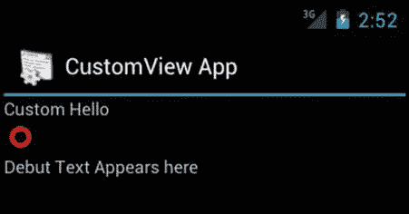
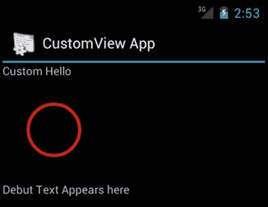
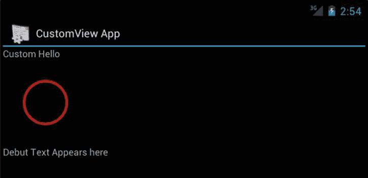

# 一、探索自定义视图

Abstract

直到你掌握了 Android 的视图架构，你对 Android SDK 的理解才算轰轰烈烈。因此，我们通过探索 Android 自定义视图的能力来开始专家 Android 是合适的。在这一章和接下来的两章中，我们的目标是通过定制来解开 Android 视图的架构。在 Android 中，你可以通过三种方式定制视图:

直到你掌握了 Android 的视图架构，你对 Android SDK 的理解才算轰轰烈烈。因此，我们通过探索 Android 自定义视图的能力来开始专家 Android 是合适的。在这一章和接下来的两章中，我们的目标是通过定制来解开 Android 视图的架构。在 Android 中，你可以通过三种方式定制视图:

*   自定义视图(通过扩展`View`类)
*   复合视图/控件(通过扩展一个现有的`Layout`类来组合其他现有的控件)(注意，在本章和接下来的几章中，我们将自定义视图和自定义组件作为同义词使用)
*   自定义布局(通过扩展`ViewGroup`类)

在研究这些话题的过程中，我们学到了很多。我们渴望与您分享在本章和接下来的两章中介绍的关于定制组件的信息。我们相信定制组件是释放 Android SDK 全部潜力的关键。

我们从介绍自定义视图开始这一章。这一章也是后面两章的基础:复合视图/控件和自定义布局。

为了演示自定义视图，在本章中，我们:

*   创建一个名为`CircleView`的定制视图，并解释定制一个`View`的理论和机制。
*   呈现`CircleView`的全部源代码，以便指导您编写自己的自定义视图。
*   展示如何在任何 Android 布局中嵌入`CircleView`。
*   通过改变圆圈的大小展示`CircleView`如何响应触摸事件。(请注意，在本书的大部分内容中，我们将“点击”和“触摸”作为同义词使用！)
*   展示`CircleView`在旋转设备时如何记住状态(如圆圈的大小)。
*   展示如何在布局文件中使用自定义属性来初始化`CircleView`。

## 规划自定义视图

在我们解释像`CircleView`这样的定制视图的实现之前，让我们向您展示一下`CircleView`的预期外观、感觉和行为。我们相信，这将使你更容易理解随后的解释和代码。

让我们从检查图 1-1 中的`CircleView`开始。在图 1-1 中，`CircleView`在线性布局的两个文本视图之间。视图的宽度设置为`match_parent`。`CircleView`的高度设置为`wrap_content`。

图 1-1。

Custom CircleView with wrap_content

当我们设计这个`CircleView`时，我们使用自定义属性使圆笔画颜色和宽度在布局文件中可配置。为了测试对事件的响应，我们使用 click 事件来扩展圆圈并重新绘制。图 1-2 显示了点击几次后`CircleView`的样子。每点击一次，圆圈就会扩大 20%。

图 1-2。

Custom CircleView expanded with clicks

然后，我们对`CircleView`实现状态管理，这样当我们将设备翻转到横向时，视图保持其放大倍数。图 1-3 为旋转后的装置`CircleView`保持膨胀。

图 1-3。

Custom CircleView retaining state after rotation

让我们开始并涵盖关于自定义视图的所有基本内容(有很多)，这样您就可以设计并编码图 1-1 、 1-2 和 1-3 中所示的`CircleView`。

## Android 中绘画的本质

要了解如何在 Android 中绘图，您必须了解以下类的架构:

`View`

`ViewParent (interface)`

`ViewGroup (extends View and implements ViewParent)`

`ViewRoot (implements ViewParent)`

是 Android 中所有可见组件的基础类。它定义了许多回调来定制它的行为，比如定义大小、绘制和保存状态的能力。

一个`ViewParent`为任何想要扮演其他视图的父角色的对象(包括另一个视图)定义协议。父母有两个重要的观点。其中，`ViewGroup`是关键的一个。除了作为一个`ViewParent`，一个`ViewGroup`也定义了子视图集合的协议。像 Android SDK 中的`FrameLayout`和`LinearLayout`这样的布局都扩展了这个类`ViewGroup`。`ViewGroup`在定义 XML 文件的布局和将控件(视图)放在正确的位置上起着核心作用。一个`ViewGroup`也控制它的子视图的背景和动画。

另一个键`ViewParent`,`ViewRoot`是以实现为中心的，不是公共 API。在一些版本中，它被称为`ViewRoot`，在一些实现中，它被称为`ViewRootImplementation—`，甚至可能在未来被改为其他名称。然而，这个类对于理解在 Android 中如何画图是很重要的。

我们建议您记下这三个类(View、ViewGroup、ViewParent)的源代码，以备不时之需。例如，如果你想查找`View.java`的源代码，用谷歌搜索这个名字，你会在网上看到很多有这个源代码的地方。源代码可能与最新版本不匹配，但是对于理解这个类的作用来说，这已经足够了。我倾向于下载最新的`android.jar`源代码并保存在 eclipse 中，然后使用 CTRL-SHIFT-R (R 代表“资源”)在源代码中快速定位一个文件。

作为活动中所有视图的根父级，`ViewRoot`调度所有视图的遍历，以便首先以正确的大小将它们布置在正确的位置；这被称为布局阶段。然后`ViewRoot`遍历视图层次来绘制它们；这个阶段被称为绘图阶段。我们现在将讨论其中的每一个阶段。

### 布局阶段:测量和布局

布局阶段的目标是了解父视图(如`ViewRoot`)所拥有的视图层次结构中每个视图的位置和大小。为了计算每个视图的位置和大小，`ViewRoot`启动一个布局阶段。然而，在布局阶段，视图根只遍历那些报告或请求布局变化的视图。这种有条件的测量是为了节省资源和提高响应时间。

启动布局阶段的触发可能来自多个事件。一次触发可能是所有东西第一次被抽取。或者其中一个视图在对点击或触摸等事件做出反应时，可以报告其大小已经改变。在这种情况下，被点击的视图调用方法`requestLayout`()。这个调用沿着链向上，到达根视图(`ViewRoot`)。然后根视图在主线程的队列上调度一个布局遍历消息。

布局阶段有两个阶段:测量阶段和布局阶段。测量过程由`View`类的`measure`()函数实现。这个函数的特征是

`public final void measure(int widthMeasureSpec, int heightMeasureSpec)`

记下此方法的签名。这个签名将帮助您在大型`View.java`源文件的源代码中轻松定位这个方法`measure`()。这个方法，`measure`()，做一些内务处理，并调用派生视图的`onMeasure`()。派生的视图需要通过调用`setMeasuredDimension()`来设置它们的尺寸。在每个视图上设置的这些测量尺寸随后将用于布局通道。在这种情况下，您的主要优先选项是`View.onMeasure()`。请记住，`onMeasure()`有一个默认的实现。`onMeasure`()的默认实现根据布局文件的建议决定视图的大小，包括传入的精确大小。我们将在本章的后面讨论这一点。

虽然当你创建一个像`CircleView`一样的自定义视图时，你关心的是`onMeasure`()但是有时候`measure`()也很重要。如果继承的定制视图是其他视图的集合，比如在`ViewGroup`中，那么您需要在您的`onMeasure`()方法中调用子视图上的`measure`()。前面的`measure`()的签名清楚地支持了这样一个观点，即你不能通过成为 final 来覆盖它，但是你应该通过成为 public 来调用它。我们将在本章后面使用`onMeasure()`时讨论`measure`()方法参数`widthMeasureSpec`和`heightMeasureSpec`。

度量通过后，每个视图都知道它的维度。然后，控制传递到布局阶段。这个布局传递在`layout`()方法中实现，其在基类`View`中的签名是:

`public void layout(int left, int top, int right, int bottom)`

同样，我们给出了`layout`()方法的完整签名，因为这个签名将帮助您在基本`View`类源文件中定位这个方法。与`measure`()方法非常相似，`layout`()方法为基础`View`执行一个内部协议，并导致调用清单 1-1 中被覆盖的方法。

清单 1-1。视图的 Layout()方法调用的重写方法

`protected void onSizeChanged(int w, int h, int oldw, int oldh);`

`protected void onLayout(boolean changed, int left, int top, int right, int bottom)`

在`layout`()中实现的布局通道将考虑测量通道测量的尺寸，并给出每个视图的起始位置和每个视图需要使用的尺寸。基本的`layout`()方法实际上是在调用它的视图上设置这些维度。如果大小或位置确实发生了变化，它就会调用`onSizeChanged`()。`onSizeChanged`()的默认实现存在于`View`类中，但它是无操作的

在调用了`onSizeChanged`()方法之后，`layout`()方法调用`onLayout`()来允许类似视图组的东西调用其子对象上的`layout`()方法。对于`onLayout`()的默认实现是存在的，但它是不可操作的。要将它应用到我们的`CircleView`，我们不需要在`onLayout`()中做任何事情，因为我们的位置和维度已经固定，并且我们没有子元素通过调用它们的`layout`()方法来建议它们的布局。

一旦完成了布局阶段的两个阶段，由视图根发起的遍历将移动到绘图阶段。

### 绘图阶段:奥德劳力学

绘制遍历是在`View's draw`()方法中实现的。通过这种方法实现的协议是:

`Draw the background`

`Draw view's content by delegating to onDraw()`

`Draw children by delegating to dispatchDraw()`

`Draw decorations such as scroll bars`

因为绘制遍历发生在布局遍历之后，所以您已经知道了视图的位置和大小。如果你的视图像`CircleView`一样没有子视图，你就不太关心`dispatchDraw`()。基类`View`中该方法的默认实现存在，但为空。

您可能会问:如果我的自定义视图有子视图，为什么我不选择在`onDraw`中绘制它们？或许是因为，在一个框架中，`draw`()的基类`View's`固定协议可能会在你的`onDraw`()和你的孩子的`onDraw`()之间选择做一些事情。因此，`View`的`dispatchDraw`()提示程序员，`View`的绘图已经完成，派生的实现可以选择任何需要的。

从某种意义上说，程序员甚至可以把`dispatchDraw`()当做 post `onDraw`()。我们建议您检查一下`View`类的`draw`()方法的源代码。您可以使用下面的方法签名在`View`类的源代码中搜索它。

`public void draw(...)`

虽然`draw`()是一个你可以覆盖的公共方法，但是你不应该这样做。它实现了由 base `View`定义的协议和契约。您的选择是覆盖其建议的方法:

`public void onDraw(...)`

`public void dispatchDraw(...)`

这种`dispatch` …模式的想法在 Android 中经常被用来在你为自己做了事情之后为孩子们做事情。

由于布局阶段的触发器是`requestLayout()`，绘制阶段的触发器是`invalidate`()。当您使一个视图无效时，它沿着链向上，导致从视图根开始的遍历的调度。如果一个视图没有请求无效，或者如果它的位置和大小没有改变，那么`onDraw`()可能不会被那个`View`调用。

但是，如果视图的大小或位置发生了变化，基本视图将对该视图调用 invalidate。所以大概没必要把你`onSizeChanged`()里的东西作废。当您有疑问时，在一个`requestlayout`()之后调用`invalidate`()因为对性能的影响是最小的，因为所有这些调用在当前主线程周期结束时聚集起来进行遍历。

让我们回顾一下，看看定制视图的可用方法:

`onMeasure`

`onSizeChanged`

`onLayout`

`onDraw`

`dispatchDraw`

这些都是回调。特别有意思的是`onMeasure()`、`onLayout()`、`onDraw()`。这三种方法都有对应的“协议”或“模板”方法:`measure()`、`layout()`、`draw()`。

这种模式通常被称为模板/钩子。例如，`draw`()是模板方法，它以某种方式固定行为，同时依靠钩子`onDraw()`来专门化自己。从另一个角度来看，模板方法就像是一个“带有替换填充物的 HTML 模板”,一个或多个钩子是数据，它们在那里被替换以完成整个网页。

您甚至可以进一步将这种模式称为模板/钩子/子对象。这个想法是:

`measure()`

`onMeasure()`

`for(child in children) child.measure()`

或者

`template()`

`hook()`

`for(child in children) child.hook()`

所以，`draw`()稍微打破了这个模式，但是`measure()`和`layout()`还是跟着这个模式走。这是一个很好的经验法则，可以避免在定制组件时迷失在回调名称的海洋中。

当您自定义没有任何子视图的视图时，通常被覆盖的方法有:

`onMeasure(...)`

`onDraw(...)`

偶尔也可能被覆盖的方法是`onSizeChanged`()。

这就结束了关于如何在 Android 中画图的报道。为了快速总结以便引导您进入下一部分，请注意我们已经建立了以下内容:

*   有一个布局阶段，在这个阶段会进行一次度量，我们需要覆盖`onMeasure`()。
*   有一个绘图阶段，我们需要实现`onDraw()`。

现在让我们向您展示实现`onMeasure`()的机制。

## 实施措施通过

在测量过程中，自定义视图需要返回它在后续绘制过程中绘制时想要(或指定)的大小。视图需要在覆盖的`onMeasure`()中设置其尺寸。设置视图的大小并不简单。您的视图大小取决于您的视图与其他视图的匹配程度。这不是说你的视图是 400 像素乘 200 像素那么简单。Android 将一个名为`mode`的位传递给`onMeasure`()以给出计算视图大小的上下文。

该模式位可以是以下三位之一:`AT_MOST, UNSPECIFIED`和`EXACT`。例如，如果模式位是`EXACT`，你的视图应该使用传入的大小，不需要计算。本节结束时，您将对这些模式位有一个全面的了解。

`onMeasure`()的主要职责是识别它是如何被调用的(模式)，然后计算视图大小，如果这是一个选项(基于模式)，然后使用`setMeasuredDimension()`设置该大小。`onMeasure`()的另一个问题是，它可能被多次调用，这取决于父布局如何为所有子布局协调空间。在这个方法中需要实现一个简短的协商协议。在本节结束时，您也将了解该协议。

有时，您可以使用基类`View`的默认实现`onMeasure`()。但是首先我们将解释我们在这个方法中做了什么，然后进入为什么我们没有为`CircleView`使用默认的实现。清单 1-2 展示了我们如何实现`onMeasure`()。

清单 1-2。如何覆盖 Views onMeasure()方法

`protected void onMeasure(int widthMeasureSpec, int heightMeasureSpec)`

`{`

`logSpec(MeasureSpec.getMode(widthMeasureSpec));`

`Log.d(tag, "size:" + MeasureSpec.getSize(widthMeasureSpec));`

`setMeasuredDimension(getImprovedDefaultWidth(widthMeasureSpec)`，

`getImprovedDefaultHeight(heightMeasureSpec));`

`}`

让我们逐点详细说明清单 1-2 中的`onMeasure`()方法的实现。注意，清单 1-2 中的实现依赖于我们已经专门化的另外两个方法，即:`getImprovedDefaultWidth`()和`getImprovedDefaultHeight`()。我们将很快介绍它们。

让我们从清单 1-2 中的参数开始:宽度和高度测量规范。我们知道我们的`CircleView`可能是布局的一部分。这意味着开发人员可以在一个布局文件中以三种不同的方式指定像高度这样的尺寸。清单 1-3 提供了一个布局文件的例子。

清单 1-3。在布局文件中提供可能影响测量的布局尺寸

`<com.androidbook.custom.CircleView`

`android:id="@+id/circle_view_id"`

`android:layout_width="match_parent"`

`android:layout_height="wrap_content"`

`circleViewPkg:strokeWidth="5"`

`circleViewPkg:strokeColor="@android:color/holo_red_dark"`

`/>`

参数`android:layout_height`可以是以下之一:

`wrap_content`

`match_parent`

`or exact width in pixels like: 30dp`

在每种情况下，`onMeasure`()被不同地调用。`widthMeasureSpec`实际上是两个参数组合成一个整数。封装这种行为的类是`View.MeasureSpec`。

清单 1-4 显示了如何找到它们各自的部分。

清单 1-4。通过测量解密

`int inputMeasureSpec;`

`int specMode = MeasureSpec.getMode(inputMeasureSpec);`

`int specSize= MeasureSpec.getSize(inputMeasureSpec);`

清单 1-5 显示了如何打印一个度量规范的各种模式。

清单 1-5。了解 MeasureSpec 模式

`private void logSpec(int specMode)`

`{`

`if (specMode == MeasureSpec.UNSPECIFIED) {`

`Log.d(tag,"mode: unspecified");`

`return;`

`}`

`if (specMode == MeasureSpec.AT_MOST) {`

`Log.d(tag,"mode: at most");`

`return;`

`}`

`if (specMode == MeasureSpec.EXACTLY) {`

`Log.d(tag,"mode: exact");`

`return;`

`}`

`}`

如果布局规范说`match_parent`，那么`onMeasure`()将被调用，规范为`EXACT`。大小将等于父对象的大小。然后，`onMeasure`()将需要通过调用`setMeasuredDimension`来获取那个精确的大小并将其设置在同一个视图上(如清单 1-2 所示)

如果布局规范说的是精确的像素，那么将使用规范`EXACT`调用`onMeasure`()。大小将等于指定像素的大小。然后`onMeasure`()会用`setMeasuredDimension`设置这个大小。

现在是更难的模式。如果将尺寸设置为`wrap_content`，则模式将为`AT_MOST`。传递的大小可能会大得多，会占用剩余的空间。所以它可能会说，“我有 411 像素。告诉我你不超过 411 像素的尺寸。”程序员的问题是:我应该返回什么？

在你的圆里，你可以把所有给你的尺寸都拿出来，画一个足够大的圆。但是如果这样做，其余的视图将没有任何空间。(我们不确定 Android 为什么要这么做，但事情就是这样。)所以，你要给一个“合理”的尺寸。在我们的例子中，我们选择返回最小尺寸，就像一个发送现金的善意保守者。

为了了解我们如何处理这些测量模式，让我们回到清单 1-5 中引用的`getImprovedDefaultHeight`()和`getImprovedDefaultWidth`()中。清单 1-6 展示了这些方法的实现，展示了它们如何处理`onMeasure`()模式。

清单 1-6。正确实现 onMeasure()

`private int getImprovedDefaultHeight(int measureSpec) {`

`int specMode = MeasureSpec.getMode(measureSpec);`

`int specSize =  MeasureSpec.getSize(measureSpec);`

`switch (specMode) {`

`case MeasureSpec.UNSPECIFIED:`

`return hGetMaximumHeight();`

`case MeasureSpec.EXACTLY:`

`return specSize;`

`case MeasureSpec.AT_MOST:`

`return hGetMinimumHeight();`

`}`

`//you shouldn't come here`

`Log.e(tag,"unknown specmode");`

`return specSize;`

`}`

`private int getImprovedDefaultWidth(int measureSpec) {`

`.... identical to getImprovedDefaultHeight`

`.... but of course uses the width as opposed to height`

`}`

`//Override these methods to provide a maximum size`

`//"h" stands for hook pattern`

`abstract protected int hGetMaximumHeight();`

`abstract protected int hGetMaximumWidth();`

`protected int hGetMinimumHeight() {`

`return this.getSuggestedMinimumHeight();`

`}`

`protected int hGetMinimumWidth() {`

`return this.getSuggestedMinimumWidth();`

`}`

注意我们是如何从基类`View`调用`getSuggestedMinimumHeight`()来获得这个视图的最小尺寸的。这意味着派生的视图必须调用`setMinimumHeight`()和`setMinimumWidth`()。如果像`CircleView`这样的派生视图在其构造函数中调用这些 set 方法，那么`wrap_content`的小部件的大小将使用最小维度。如果您的目的是返回平均宽度，而不是最小宽度，请相应地更改此代码。

从清单 1-6 中，你还可以看到我们对`UNSPECIFIED`模式使用了最大尺寸。那么这个什么时候被调用呢？文档中说，当布局想要知道真正的大小是多少时，会传递这个模式。真实的大小可以有多大就有多大；布局可能会滚动它。带着这个想法，我们返回了我们的圆的最大尺寸。当我们在本章后面向您展示`CircleView`的完整源代码时，您将会看到这一点。

还要注意，为了满足`onMeasure`()(在清单 1-2 和 1-6 中)，我们使用了两个内置函数:

`setMeasuredDimension()     //from view class`

`getSuggestedMinimumWidth() //from view class`

现在让我们看看`onMeasure`()的默认实现是做什么的(清单 1-7)以及为什么我们没有选择它。

清单 1-7。View 类对 onMeasure()的默认实现

`protected void onMeasure(int widthMeasureSpec, int heightMeasureSpec) {`

`setMeasuredDimension(getDefaultSize(getSuggestedMinimumWidth(), widthMeasureSpec)`，

`getDefaultSize(getSuggestedMinimumHeight(), heightMeasureSpec));`

`}`

`public static int getDefaultSize(int size, int measureSpec) {`

`int result = size;`

`int specMode = MeasureSpec.getMode(measureSpec);`

`int specSize = MeasureSpec.getSize(measureSpec);`

`switch (specMode) {`

`case MeasureSpec.UNSPECIFIED:`

`result = size;`

`break;`

`case MeasureSpec.AT_MOST:`

`case MeasureSpec.EXACTLY:`

`result = specSize;`

`break;`

`}`

`return result;`

`}`

请注意，当模式为`wrap_content`时，该实现将导致占用整个剩余空间！这就是我们重写该类的原因。如果您没有在您的小部件上添加`wrap_content`(意味着它没有自然大小)，那么您可以使用默认实现，并且不允许在布局文件中使用`wrap_content`。

理解定制视图的大部分工作是在度量过程中，以及如何实现`onMeasure`()。现在已经过去了，让我们转向`onDraw`()。

## 通过 onDraw()实现绘图

不像`onMeasure`()，没有关于`onDraw`()的困惑。首先，默认实现什么都不做。画画是你的工作。下面是我们如何在清单 1-8 中实现它的:

清单 1-8。覆盖 onDraw()

`...`

`private int defRadius;`

`private int strokeWidth;`

`private int strokeColor;`

`...`

`//Called by the constructor`

`public void initCircleView()`

`{`

`//Set the minimum width and height`

`this.setMinimumHeight(defRadius * 2);`

`this.setMinimumWidth(defRadius * 2);`

`//Say we respond to clicks`

`this.setOnClickListener(this);`

`this.setClickable(true);`

`//allow for statmanagement`

`this.setSaveEnabled(true);`

`}`

`//we don't use the defRadius variable here`

`//we just use the dimensions that are passed`

`//defRadius is used to set the minimum dimension`

`@Override`

`public void onDraw(Canvas canvas) {`

`super.onDraw(canvas);`

`Log.d(tag,"onDraw called");`

`int w = this.getWidth();`

`int h = this.getHeight();`

`int t = this.getTop();`

`int l = this.getLeft();`

`int ox = w/2;`

`int oy = h/2;`

`int rad = Math.min(ox,oy)/2;`

`canvas.drawCircle(ox, oy, rad, getBrush());`

`}`

`private Paint getBrush()`

`{`

`Paint p = new Paint();`

`p.setAntiAlias(true);`

`p.setStrokeWidth(strokeWidth);`

`p.setColor(strokeColor);`

`p.setStyle(Paint.Style.STROKE);`

`return p;`

`}`

很简单。你去拿画布。您向视图询问宽度、高度、左侧和顶部。左侧和顶部相对于父视图，从 0 开始。宽度和高度也包括填充。使用`getPadding` …()系列方法获得填充坐标，如果您选择使用它们的话。

在清单 1-8 中，没有任何惊喜。当然，当你开始创造性地使用画布时，你就进入了 2D 图形的奇妙世界。但是本章的重点是定制视图的管道，而不是不顾重力的 2D 图形编程。

为了启动和运行基本的定制视图，只需要重写两个方法`onMeasure`()和`onDraw`()。只要稍加思考，您就可以继续对整个定制组件类使用相同的`onMeasure`()实现。一旦理解了这些方法的基础，编写一个绘制到画布上的自定义视图就变得轻而易举了。

## 响应事件

作为自定义视图的下一步，我们想要练习`requestLayout`()和`invalidate`()方法。为了在清单 1-9 中演示这两种方法，我们让我们的圆对触摸做出响应。

清单 1-9。响应事件的自定义视图

`public class CircleView`

`extends implements OnClickListener` `{`

`....other stuff`

`public void initCircleView() {`

`...other stuff`

`this.setOnClickListener(this);`

`this.setClickable(true);`

`...other stuff`

`}`

`....other stuff`

`public void onClick(View v)` `{`

`//increase the radius`

`defRadius *= 1.2;`

`adjustMinimumHeight();`

`requestLayout();`

`invalidate();`

`}`

`private void adjustMinimumHeight() {`

`this.setMinimumHeight(defRadius * 2);`

`this.setMinimumWidth(defRadius * 2);`

`}`

`....other stuff`

`}`

为了响应点击，我们的自定义控件实现了点击监听器并覆盖了`onClick`方法。它还告诉基类`View`这是点击监听器，并且为这个视图启用了点击。在`onClick`()方法中，我们增加默认半径，并使用该半径来改变最小高度和宽度。

因为`onClick`事件导致了维度的改变，我们的视图需要变得更大，占据更多的空间。我们如何向 Android 表达这种需求？嗯，我们`requestLayout`()。该方法沿着链向上，标记需要重新测量的每个视图父视图。当最终的父节点收到这个请求(视图根节点)时，父节点安排一次布局遍历。一个布局遍历可能会也可能不会导致`onDraw`，尽管在这种情况下应该会这样。作为一个良好的编程实践，我们也调用`invalidate`()来确保绘制阶段。

有可能特定的事件将检测不到尺寸的变化，而只是检测到圆的颜色；在这种情况下，我们只需要做`invalidate`()而不调用`requestLayout`()。

如果您处于布局阶段，您不应该调用可能导致`requestLayout`()的方法。比方说，你在`onSizeChanged`()里加了一张背景图。你不应该从同一个相位再次呼叫`requestLayout`。它不会生效，因为视图根在当前周期结束时重置这些标志。但是你可以在绘画阶段这样做。或者，您可以向调用`requestLayout`()的队列发送一个事件。

视图上还有另一个方法叫做`forceLayout`()。这与`requestLayout`()的区别在于，后者沿着链向上，导致布局通道的调度。没有什么比查看`View`类中这两个方法的源代码(取自 API 14)更清楚的了(如清单 1-10 所示):

清单 1-10。forceLayout()和 requestLayout()之间的区别

`public void forceLayout() {`

`mPrivateFlags |= FORCE_LAYOUT;`

`mPrivateFlags |= INVALIDATED;`

`}`

`public void requestLayout() {`

`if (ViewDebug.TRACE_HIERARCHY) {`

`ViewDebug.trace(this, ViewDebug.HierarchyTraceType.REQUEST_LAYOUT);`

`}`

`mPrivateFlags |= FORCE_LAYOUT;`

`mPrivateFlags |= INVALIDATED;`

`if (mParent != null) {`

`if (mLayoutParams != null) {`

`mLayoutParams.resolveWithDirection(getResolvedLayoutDirection());`

`}`

`if (!mParent.isLayoutRequested()) {`

`mParent.requestLayout();`

`}`

`}`

`}`

请注意，清单 1-10 中的方法是内部方法，不是公共 API 的一部分，所以它们可能会随着新版本的发布而改变。然而，基础协议将保持不变。

在清单 1-10 中，首先说明什么是`forceLayout`()更容易。它就像构建环境中的触摸命令。通常当一个文件没有改变时，构建依赖项会忽略它。因此，您通过“触摸”来强制编译该文件，从而更新其时间戳。就像 touch 一样，`forceLayout`()本身不会调用任何构建命令(除非您的构建环境过于复杂，无法立即启动)。touch 的效果是，当请求构建时，您不会忽略这个文件。

所以，当你`forceLayout`()一个视图时，你是在标记那个视图(仅仅是那个)作为测量的候选。如果一个视图没有被标记，那么它的`onMeasure`()将不会被调用。您可以在视图的`measure`()方法中看到这一点。`measure`()方法检查这个视图是否被标记为布局。

`requestLayout`()的行为(只是)略有不同。一个`requestlayout`像`forceLayout`()一样接触当前视图，但是它也沿着链向上移动，接触这个视图的每个父视图，直到到达`ViewRoot`。`ViewRoot`覆盖此方法并安排一次布局。因为它只是一个要运行的时间表，所以它不会立即开始布局传递。它等待主线程完成它的杂务并加入消息队列。

你可能想知道，当我使用`forceLayout` `()`的时候，请解释给我听！我理解`requestLayout()`，因为我最终安排了一个通行证。我拿着`forceLayout()`在做什么？显然，如果你在一个视图上调用`requestLayout`，在那个视图上调用`forceLayout`是没有意义的。“力”到底是什么？

回想一下,“力”就像是构建的“接触”!所以，你是在“强迫”文件编译。虽然它看起来像是要马上运行布局通道，但它并没有。

当一个视图的`requestLayout`被调用时，它的兄弟和子视图都不会被触动。他们没有升起这面旗帜。因此，如果被触摸的视图是一个视图组(当您删除一个视图或添加一个视图时)，视图组不需要计算其子视图的大小，因为它们的大小没有改变。称他们为`onMeasure`毫无意义。但是如果由于某种原因，视图组决定需要测量这些孩子，它将对他们每个人调用`forceLayout`，然后是`measure`()，现在正确地调用`onmeasure`()。它不会在孩子身上调用`requestLayout`，因为当你在当前关中间时，不需要触发另一个关。(这是一种“在我打断你的时候不要打断我”的交易。)

这就引出了第一次会发生什么的问题。是谁从一开始就触及了所有的观点，使它们得到了衡量？当一个视图被添加到一个视图组时，该视图组确保该视图被标记为测量，并为该视图调用一个请求布局。更重要的是，什么时候调用这些方法？

开发人员通常有更多的机会调用`requestLayout`。例如，当你点击一个视图来增加它的尺寸时，你这样做，然后在那个视图上说`requestLayout`。不管出于什么原因，如果这不起任何作用，你会倾向于称之为`forceLayout`，因为这个名字很容易让人误解。根据我们所知，这相当于喊了两次。如果第一声大喊不行，第二声也会得到同样的回应。

如果一个目标视图正在改变大小，并且如果你认为你的兄弟视图的大小将会受到影响，那么对你自己调用`requestLayout`，对你的兄弟调用`forceLayout`。当然，你也可以调用兄弟姐妹`requestLayout`，但是这增加了 CPU 的周期；如果你知道自己在做什么，一个更简单的`forceLayout`就能搞定。这在衍生自视图组的复杂布局中也很常见，其中对单个同级的更改可能需要对其同级进行测量，因此您希望明确决定它们是否需要再次测量。

## 保存视图状态

到目前为止，你已经知道在 Android 上工作的感受了:当你翻转手机或设备时，你会从纵向切换到横向，或者反过来。总的来说，这被称为对设备的配置改变。配置更改将停止并删除该活动，并使用新配置重新创建一个新实例。因此，活动持有的所有内存变量都消失了，并被重新创建。

如果您有一个包含局部变量的视图，它们也会消失并被重新初始化。如果您有自视图初始化以来创建的临时数据，并且没有写入永久存储，那么这些数据也将消失。

为了保持瞬时状态，可以使用活动或片段来保存和恢复实例数据。“实例数据”是指由`Activity`、`Fragment`或`View`等类维护的局部变量。`Activity`和`Fragment`有一个预定义的协议来管理这种方法。我们不打算在本章中详细讨论这个问题；我们的重点是如何管理视图的实例状态。

管理视图状态有三种方式:

*   让`Activity`使用保存和恢复实例方法显式调用视图来保存和恢复其状态。
*   使用`View`的内置功能来保存和恢复其状态。
*   使用`View`的内置功能来保存和恢复其状态，如上面的项目，但使用`BaseSavedState`协议。

我们将讨论每种方法的优缺点，并推荐第三种方法最适合工业级组件。

### 依靠活动方法

清单 1-11 中的伪代码展示了`Activity`如何定位并调用`View`来保存和恢复瞬态。

清单 1-11。通过活动查看状态管理

`YourActivity`

`{`

`@Override`

`protected void onSaveInstanceState(Bundle savedInstanceState) {`

`super.onRestoreInstanceState(savedInstanceState);`

`//locate your view component`

`CircleView cv = findViewById(R.id.circle_view_id);`

`//call a custom method and get a bundle`

`Bundle b = cv.saveState();`

`//Put the bundle to be saved`

`savedInstanceState.putBundle("circle_view_bundle",b);`

`}`

`@Override`

`protected void onRestoreInstanceState(Bundle savedInstanceState) {`

`super.onRestoreInstanceState(savedInstanceState);`

`//locate your view component`

`CircleView cv = findViewById(R.id.circle_view_id);`

`//call a custom method`

`cv.restoreState(savedInstanceState.getBundle("circle_view_bundle"));`

`}`

`}`

这是一些 Android SDK API 示例中使用的方法，比如`SnakeView`。清单 1-12 显示了来自`SnakeView`示例的源代码片段:

清单 1-12。保存和恢复状态的示例

`public Bundle saveState() {`

`Bundle map = new Bundle();`

`map.putIntArray("mAppleList", coordArrayListToArray(mAppleList));`

`map.putInt("mDirection", Integer.valueOf(mDirection));`

`....more`

`return map;`

`}`

`public void restoreState(Bundle icicle) {`

`mAppleList = coordArrayToArrayList(icicle.getIntArray("mAppleList"));`

`mDirection = icicle.getInt("mDirection");`

`....more`

`mSnakeTrail = coordArrayToArrayList(icicle.getIntArray("mSnakeTrail"));`

`}`

这种做法真的很简单，这就是它的魅力所在。然而，如果活动包含许多视图，那么我们必须保存和恢复清单 1-12 中每个视图的状态。我们还必须为每个视图定义字符串常量，并确保它们不会冲突。那将会有很多代码，更不用说还有点容易出错。尽管如此，清单 1-12 所示的方法对于简单的场景还是有用的。

### 启用自我状态管理视图

如果您可以让视图进行自己的状态管理，那么您就不需要在更高级别的组件中记账，比如片段和活动。您可以通过调用以下命令告诉 Android 视图自己进行状态管理:

`view.setSaveEnabled();`

这将在视图上调用下面的方法，如清单 1-13 所示(只要布局文件中的视图定义定义了惟一的 ID；这是对视图管理其自身状态的限制和要求)。

清单 1-13。覆盖视图的保存和恢复状态方法

`@Override`

`protected void onRestoreInstanceState(Parcelable p)`

`{`

`//Code for these two methods are presented a little later`

`this.onRestoreInstanceStateSimple(p);`

`this.initCircleView();`

`}`

`@Override`

`protected Parcelable onSaveInstanceState()`

`{`

`//Code for this method is presented a little later`

`return this.onSaveInstanceStateSimple(p);`

`}`

这种方法的警告是视图必须有一个惟一的 ID 来触发这两种方法。当像`CircleView`这样的视图独立存在并且独立地与布局挂钩时，这不是问题。但是如果`CircleView`成为一个复合组件的一部分，并且如果该复合组件在一个布局中被多次指定，那么 id 将会冲突。在下一章，当我们告诉你如何编写复合控件时，我们将更详细地讨论这个主题。

在清单 1-13 中，我们只展示了视图调用什么方法来保存和恢复状态。我们还没有展示如何真正拯救国家。有一个简单的方法，也有一个标准的方法。我们将首先介绍简单的方法，如清单 1-14 所示。

清单 1-14。管理视图状态的简单方法

`private Parcelable onSaveInstanceStateSimple()`

`{`

`Parcelable p = super.onSaveInstanceState();`

`Bundle b = new Bundle();`

`b.putInt("defRadius",defRadius);`

`b.putParcelable("super",p);`

`return b;`

`}`

`private void onRestoreInstanceStateSimple(Parcelable p)`

`{`

`if (!(p instanceof Bundle))`

`{`

`throw new RuntimeException("unexpected bundle");`

`}`

`Bundle b = (Bundle)p;`

`defRadius = b.getInt("defRadius");`

`Parcelable sp = b.getParcelable("super");`

`super.onRestoreInstanceState(sp);`

`}`

在清单 1-14 所示的方法中，超类`View`在`onSave`期间传递一个对象，并希望在`onRestore`期间取回它。如果对象不匹配，超类`View`将抛出一个异常。为了解决这个问题，我们在保存期间将传入的对象放入我们自己的包中，然后在恢复期间将其解包并发送回。

这是一个折中的解决方案，也很简单，适合于演示目的。主要的缺点是，如果您希望您的视图被继承，那么这些包可能会有冲突的名称，必须进行管理。我们现在将讨论正确的方法。

### BaseSavedState 模式

为了保存内置 UI 控件的状态，Android 使用了一种基于`View`的`BaseSavedState`类的模式。这有点绕弯，需要大量代码。不过，好消息是，您可以复制这段代码，并对每个派生视图做一些修改，这样您就有了一个坚如磐石的框架，可以很好地与视图的核心状态管理一起工作。

在这种方法中，在您最衍生的定制视图中，比如`CircleView`，您需要创建一个内部静态类，如清单 1-15 所示。

清单 1-15。实现特定于视图的 SavedState 类以管理视图状态

`public class CircelView extends View`

`{`

`....other stuff`

`public static class SavedState extends BaseSavedState {`

`int defRadius;`

`SavedState(Parcelable superState) {`

`super(superState);`

`}`

`@Override`

`public void writeToParcel(Parcel out, int flags) {`

`super.writeToParcel(out, flags);`

`out.writeInt(defRadius);`

`}`

`//Read back the values`

`private SavedState(Parcel in) {`

`super(in);`

`defRadius = in.readInt();`

`}`

`@Override`

`public String toString() {`

`return "CircleView defRadius:" + defRadius;`

`}`

`@SuppressWarnings("hiding")`

`public static final Parcelable.Creator<SavedState> CREATOR`

`= new Parcelable.Creator<SavedState>() {`

`public SavedState createFromParcel(Parcel in) {`

`return new SavedState(in);`

`}`

`public SavedState[] newArray(int size) {`

`return new SavedState[size];`

`}`

`};`

`}//eof-state-class`

`....other stuff`

`}//eof-custom-view-class`

这个内部`SavedState`类对于每个派生视图的唯一不同之处是您保存的内部变量。这种情况下就是`defRadius`。这个`SavedState`类最终衍生自`Parcelable`。因此，根据那个类`Parcelable`的契约，`SavedState`需要一个静态创建者对象来从包流中创建这些`SavedState`可打包对象。清单 1-15 中显示的这段代码是每一个想要管理其状态的派生视图的标准模板。

在`SavedState`中，还需要覆盖`writeToParcel() method`将局部变量写到包中。您可以在您的`SavedState`构造函数中从传入的包中读回它们。

一旦有了这个内部`SavedState`类，清单 1-16 显示了如何使用这个内部类`SavedState`来保存和恢复`CircleView`的状态。参见清单 1-13，了解如何从`View`的保存和恢复回调中调用清单 1-16 中的方法。

清单 1-16。使用特定于视图的 SavedState 对象维护视图状态

`private Parcelable onSaveInstanceStateStandard()`

`{`

`Parcelable superState = super.onSaveInstanceState();`

`SavedState ss = new SavedState(superState);`

`ss.defRadius = this.defRadius;`

`return ss;`

`}`

`private void onRestoreInstanceStateStandard(Parcelable state)`

`{`

`//If "state" object is not yours doesn't mean it is BaseSavedState`

`//You may have a parent in your hierarchy that has their own`

`//state derived from BaseSavedState.`

`//It is like peeling an onion or opening a Russian doll`

`if (!(state instanceof SavedState)) {`

`super.onRestoreInstanceState(state);`

`return;`

`}`

`//it is our state`

`SavedState ss = (SavedState)state;`

`//Peel it and give the child to the super class`

`super.onRestoreInstanceState(ss.getSuperState());`

`defRadius = ss.defRadius;`

`}`

这种采用`SavedState`模式的方法消除了为保存和恢复本地变量而发明字符串名称的需要。这个模式还有一个协议，可以从属于继承层次结构中超级视图的包中识别出视图的包。

## 自定义属性

这就把我们带到了自定义视图实现的最后一个细节。比方说，您的自定义视图有您想要读取的特殊属性。清单 1-17 显示了一个线性布局，在这里你可以指定我们正在画的圆的自定义属性:`strokeWidth`和`strokeColor`。

清单 1-17。指定自定义属性

`<LinearLayout xmlns:android="`[`http://schemas.android.com/apk/res/android`](http://schemas.android.com/apk/res/android)

`xmlns:circleViewPkg="`[`http://schemas.android.com/apk/res/com.androidbook.custom`](http://schemas.android.com/apk/res/com.androidbook.custom)

`....`

`<com.androidbook.custom.CircleView`

`android:id="@+id/circle_view_id"`

`android:layout_width="wrap_content"`

`android:layout_height="wrap_content"`

`circleViewPkg:strokeWidth="5"`

`circleViewPkg:strokeColor="@android:color/holo_red_dark"`

`/>`

`</LinearLayout>`

注意清单 1-17 中的两个自定义属性:

`strokeWidth`

`strokeColor`

为了能够在布局中放置这些自定义变量(如清单 1-17 所示)，您需要在`/res/values/attrs.xml`文件中向 Android 声明这些自定义属性，如清单 1-18 所示。

清单 1-18。在 attrs.xml 中定义自定义属性

`<resources>`

`<declare-styleable name="CircleView">`

`<attr name="strokeWidth" format="integer"/>`

`<attr name="strokeColor" format="color|reference" />`

`</declare-styleable>`

`</resources>`

文件名`attrs.xml`可以是任何东西，但是惯例是使用那个名字。关于清单 1-18 中的属性，有几点值得注意。首先，对于您的整个包，您的属性必须是唯一的。如果你有另一个名为`CircleView1`的组件，你不能这样做，如清单 1-19 所示。

清单 1-19。在包级别显示定制属性的唯一性

`<resources>`

`<declare-styleable name="``CircleView`

`<attr name="``strokeWidth`

`<attr name="strokeColor" format="color|reference" />`

`</declare-styleable>`

`<declare-styleable name="``CircleView1`

`<attr name="``strokeWidth`

`<attr name="strokeColor" format="color|reference" />`

`</declare-styleable>`

`</resources>`

您将得到错误消息，指出这些属性名称已经被使用。所以，属性的名称空间就是你的整个包！`attrs.xml`中的样式名`CircleView`仅仅是一个约定；你可以用任何名字。你也可以在一个可样式化的组之外定义属性，比如`CircleView`。(参见清单 1-20。)

清单 1-20。显示自定义属性可以在 Styleable 标记之外定义

`<resources>`

`<declare-styleable name="CircleView">`

`<attr name="strokeWidth" format="integer"/>`

`<attr name="strokeColor"/>`

`</declare-styleable>`

`<attr name="strokeColor" format="color|reference" />`

`</resources>`

其次，清单 1-20 展示了属性可以被定义为独立的，并且可以独立于`declare-styleable`分组；`declare-styleable`仅仅是一组属性。只要不重新定义属性的格式，也可以将属性分成多个组。你可以在清单 1-20 中看到，我们重用了`strokeColor`。

第三，如果属性可以独立定义，那么我们为什么要把它们分组到`declare-styleable`中，并给它起名叫`CircleView`？因为这种分组便于`CircleView`读取这些自定义属性。分组完成后，`CircleView`类会说“从布局文件中读取该组中的所有变量！”

我们留下了一个关于自定义属性使用的细节，如清单 1-17 所示。在该清单中，我们已经声明了`strokeWidth:`的名称空间

`xmlns:` `circleViewPkg` `="` [`http://schemas.android.com/apk/res/com.androidbook.custom`](http://schemas.android.com/apk/res/com.androidbook.custom) `"`

虽然名称空间值是任意的，但是 Android 中的工具希望您的结尾部分`/apk/res/com.androidbook.custom`匹配您的包名。这就是它为您的属性定位和分配 id 的方式。

给定清单 1-18 中的`attrs.xml`, Android 生成以下 id:

`R.attr.strokeWidth (int)`

`R.attr.srokeColor (int)`

`R.styleable.CircelView (an array of ints)`

`R.styleable.CircleView_strokeWidth (offset into the array)`

`R.styleable.CircelView_strokeColor (offset into the array)`

我们使用这些常量，如清单 1-21 所示，从布局 XML 文件中读取自定义属性值。

清单 1-21。使用 TypedArrays 读取自定义属性

`public CircleView(Context context, AttributeSet attrs, int defStyle) {`

`super(context, attrs, defStyle);`

`//Use the array constant to read the bag once`

`TypedArray t = context.obtainStyledAttributes(attrs`，

`R.styleable.CircleView`，

`defStyle, //if any values are in the theme`

`0); //Do you have your own style group`

`//Use the offset in the bag to get your value`

`strokeColor = t.getColor(R.styleable.CircleView_strokeColor, strokeColor);`

`strokeWidth = t.getInt(R.styleable.CircleView_strokeWidth, strokeWidth);`

`//Recycle the typed array`

`t.recycle();`

`//Go ahead and initialize your class.`

`initCircleView();`

`}`

在 Android 中，属性、样式、风格和主题是联系在一起的。要完全理解如何读取布局和初始化自定义属性，您必须理解这种联系。虽然您可以机械地重复这种读取定制属性的模式，但是最好知道您为什么以这种方式读取这些定制属性。关于这种联系的快速入门是必要的。

正如您在这里看到的，属性是绑定到一个包的一组唯一的名称。比如说，`TextView`这样的对象会挑选一些属性供其使用。`Styleable`(正如您在这里看到的)是一个给定定制组件的分组，用于选择它所关心的属性。一个`style`是一组属性名的命名集合(包)。您可以将`style`连接到`Activity`或`View`。当您这样做时，调用`obtainStyledAttributes`将沿着链向上走，并提取该组件关心的所有属性。(我们在本章末尾的参考资料中包含了作者关于自定义属性、样式和主题的注释的 URL。)

考虑到所有这些，清单 1-22 显示了一个定制视图类是如何构造的。

清单 1-22。为自定义视图设计构造函数

`public class CircleView extends View implements OnClickListener`

`{`

`//Local variables`

`public static String tag="CircleView";`

`private int defRadius = 20;`

`private int strokeColor = 0xFFFF8C00;`

`private int strokeWidth = 10;`

`//for using it from java cdoe`

`public CircleView(Context context) {`

`super(context);`

`initCircleView();`

`}`

`//for using it from java cdoe`

`public CircleView(Context context, int inStrokeWidth, int inStrokeColor) {`

`super(context);`

`strokeColor = inStrokeColor;`

`strokeWidth = inStrokeWidth;`

`initCircleView();`

`}`

`//Invoked by layout inflater`

`public CircleView(Context context, AttributeSet attrs) {`

`//Delegate this to a more general method.`

`//we don't have any default style we care about`

`//so set it to 0.`

`this(context, attrs,0);`

`}`

`//Meant for derived classes to call if they care about defStyle`

`//Not called by the layout inflater`

`public CircleView(Context context, AttributeSet attrs, int defStyle) {`

`super(context, attrs, defStyle);`

`TypedArray t = context.obtainStyledAttributes(attrs,R.styleable.CircleView, defStyle,0);`

`strokeColor = t.getColor(R.styleable.CircleView_strokeColor, strokeColor);`

`strokeWidth = t.getInt(R.styleable.CircleView_strokeWidth, strokeWidth);`

`t.recycle();`

`initCircleView();`

`}`

`//See how all constructors swoop in on this one initialization`

`public void initCircleView()`

`{`

`this.setMinimumHeight(defRadius * 2);`

`this.setMinimumWidth(defRadius * 2);`

`this.setOnClickListener(this);`

`this.setClickable(true);`

`this.setSaveEnabled(true);`

`}`

`...You will see other methods when we present the full source code`

`...very soon after this section.`

`}//eof-class`

阅读清单 1-22 中的注释，了解构造函数方法如何结合在一起，以及如何用于从布局文件中读取定制属性。

## 自定义视图的完整源代码

我们已经讨论了编写生产就绪的定制视图所需的所有理论(和代码片段)。在这一节中，我们将向您展示`CircleView`的完整源代码。这解决了我们认为不太重要，但是您可能希望在完整实现的上下文中看到的任何遗留问题。

`CircleView`的实现在这里被分成了两个类。第一个是一个基础抽象类，您可以在其他定制视图中重用它。第二个是`CircleView`本身，专门化基础抽象`View`类来完成实现。我们还将展示任何依赖于实现的文件，比如`attrs.xml`。

### 实现基本抽象视图类

我们不想直接编码`CircleView`,而是首先想要创建一个基类，它概述了视图中哪些方法是可重写的。我们列出了一个`View`的每一个方法，并评论了重写它的意义。如果有一个有意义的默认行为，我们也在这个基类中实现。例如，我们知道我们可以更好地完成`onMeasure`()的工作，并从派生类中减轻这种责任，比如`CircleView`。

这个抽象的基本视图类如清单 1-23 所示。到目前为止，我们已经介绍了所有内容，尽管是分段介绍，但您应该能够通读评论，而无需进一步解释。现在，所有代码都在一个地方了。

清单 1-23。实现 AbstractBaseView

`public abstract class AbstractBaseView`

`extends View`

`{`

`public static String tag="AbstractBaseView";`

`public AbstractBaseView(Context context) {`

`super(context);`

`}`

`public AbstractBaseView(Context context, AttributeSet attrs) {`

`super(context, attrs);`

`}`

`public AbstractBaseView(Context context, AttributeSet attrs, int defStyle) {`

`super(context, attrs, defStyle);`

`}`

`@Override`

`protected void onMeasure(int widthMeasureSpec, int heightMeasureSpec)`

`{`

`logSpec(MeasureSpec.getMode(widthMeasureSpec));`

`Log.d(tag, "size:" + MeasureSpec.getSize(widthMeasureSpec));`

`setMeasuredDimension(getImprovedDefaultWidth(widthMeasureSpec)`，

`getImprovedDefaultHeight(heightMeasureSpec));`

`}`

`private void logSpec(int specMode) {`

`if (specMode == MeasureSpec.UNSPECIFIED) {`

`Log.d(tag,"mode: unspecified");`

`return;`

`}`

`if (specMode == MeasureSpec.AT_MOST) {`

`Log.d(tag,"mode: at most");`

`return;`

`}`

`if (specMode == MeasureSpec.EXACTLY) {`

`Log.d(tag,"mode: exact");`

`return;`

`}`

`}`

`@Override`

`protected void onSizeChanged(int w, int h, int oldw, int oldh) {`

`super.onSizeChanged(w,h,oldw,oldh);`

`}`

`@Override`

`protected void onLayout (boolean changed, int left`，

`int top, int right, int bottom)`

`{`

`Log.d(tag,"onLayout");`

`super.onLayout(changed, left, top, right, bottom);`

`}`

`@Override`

`public void onDraw(Canvas canvas) {`

`super.onDraw(canvas);`

`Log.d(tag,"onDraw called");`

`}`

`@Override`

`protected void onRestoreInstanceState(Parcelable p) {`

`Log.d(tag,"onRestoreInstanceState");`

`super.onRestoreInstanceState(p);`

`}`

`@Override`

`protected Parcelable onSaveInstanceState() {`

`Log.d(tag,"onSaveInstanceState");`

`Parcelable p = super.onSaveInstanceState();`

`return p;`

`}`

`private int getImprovedDefaultHeight(int measureSpec) {`

`//int result = size;`

`int specMode = MeasureSpec.getMode(measureSpec);`

`int specSize =  MeasureSpec.getSize(measureSpec);`

`switch (specMode) {`

`case MeasureSpec.UNSPECIFIED:`

`return hGetMaximumHeight();`

`case MeasureSpec.EXACTLY:`

`return specSize;`

`case MeasureSpec.AT_MOST:`

`return hGetMinimumHeight();`

`}`

`//you shouldn't come here`

`Log.e(tag,"unknown specmode");`

`return specSize;`

`}`

`private int getImprovedDefaultWidth(int measureSpec) {`

`//int result = size;`

`int specMode = MeasureSpec.getMode(measureSpec);`

`int specSize =  MeasureSpec.getSize(measureSpec);`

`switch (specMode) {`

`case MeasureSpec.UNSPECIFIED:`

`return hGetMaximumWidth();`

`case MeasureSpec.EXACTLY:`

`return specSize;`

`case MeasureSpec.AT_MOST:`

`return hGetMinimumWidth();`

`}`

`//you shouldn't come here`

`Log.e(tag,"unknown specmode");`

`return specSize;`

`}`

`//Override these methods to provide a maximum size`

`//"h" stands for hook pattern`

`abstract protected int hGetMaximumHeight();`

`abstract protected int hGetMaximumWidth();`

`//For minimum height use the View's methods`

`protected int hGetMinimumHeight() {`

`return this.getSuggestedMinimumHeight();`

`}`

`protected int hGetMinimumWidth() {`

`return this.getSuggestedMinimumWidth();`

`}`

`}`

### CircleView 实现

清单 1-24 显示了扩展了`AbastractBaseView`的`CircleView`的完整实现(见前面的清单 1-23)。

清单 1-24。自定义 CircleView 实现的源代码

`public class CircleView`

`extends AbstractBaseView`

`implements OnClickListener`

`{`

`public static String tag="CircleView";`

`private int defRadius = 20;`

`private int strokeColor = 0xFFFF8C00;`

`private int strokeWidth = 10;`

`public CircleView(Context context) {`

`super(context);`

`initCircleView();`

`}`

`public CircleView(Context context, int inStrokeWidth, int inStrokeColor) {`

`super(context);`

`strokeColor = inStrokeColor;`

`strokeWidth = inStrokeWidth;`

`initCircleView();`

`}`

`public CircleView(Context context, AttributeSet attrs) {`

`this(context, attrs,0);`

`}`

`//Meant for derived classes to call`

`public CircleView(Context context, AttributeSet attrs, int defStyle) {`

`super(context, attrs, defStyle);`

`TypedArray t = context.obtainStyledAttributes(attrs,R.styleable.CircleView, defStyle,0);`

`strokeColor = t.getColor(R.styleable.CircleView_strokeColor, strokeColor);`

`strokeWidth = t.getInt(R.styleable.CircleView_strokeWidth, strokeWidth);`

`t.recycle();`

`initCircleView();`

`}`

`public void initCircleView()    {`

`this.setMinimumHeight(defRadius * 2);`

`this.setMinimumWidth(defRadius * 2);`

`this.setOnClickListener(this);`

`this.setClickable(true);`

`this.setSaveEnabled(true);`

`}`

`@Override`

`public void onDraw(Canvas canvas) {`

`super.onDraw(canvas);`

`Log.d(tag,"onDraw called");`

`int w = this.getWidth();`

`int h = this.getHeight();`

`int t = this.getTop();`

`int l = this.getLeft();`

`int ox = w/2;`

`int oy = h/2;`

`int rad = Math.min(ox,oy)/2;`

`canvas.drawCircle(ox, oy, rad, getBrush());`

`}`

`private Paint getBrush() {`

`Paint p = new Paint();`

`p.setAntiAlias(true);`

`p.setStrokeWidth(strokeWidth);`

`p.setColor(strokeColor);`

`p.setStyle(Paint.Style.STROKE);`

`return p;`

`}`

`@Override`

`protected int hGetMaximumHeight() {`

`return defRadius * 2;`

`}`

`@Override`

`protected int hGetMaximumWidth() {`

`return defRadius * 2;`

`}`

`public void onClick(View v) {`

`//increase the radius`

`defRadius *= 1.2;`

`adjustMinimumHeight();`

`requestLayout();`

`invalidate();`

`}`

`private void adjustMinimumHeight() {`

`this.setMinimumHeight(defRadius * 2);`

`this.setMinimumWidth(defRadius * 2);`

`}`

`/*`

`* ***************************************************************`

`* Save and restore work`

`* ***************************************************************`

`*/`

`@Override`

`protected void onRestoreInstanceState(Parcelable p) {`

`this.onRestoreInstanceStateStandard(p);`

`this.initCircleView();`

`}`

`@Override`

`protected Parcelable onSaveInstanceState() {`

`return this.onSaveInstanceStateStandard();`

`}`

`private void onRestoreInstanceStateStandard(Parcelable state) {`

`//If it is not yours doesn't mean it is BaseSavedState`

`//You may have a parent in your hierarchy that has their own`

`//state derived from BaseSavedState`

`//It is like peeling an onion or a Russian doll`

`if (!(state instanceof SavedState)) {`

`super.onRestoreInstanceState(state);`

`return;`

`}`

`//it is our state`

`SavedState ss = (SavedState)state;`

`//Peel it and give the child to the super class`

`super.onRestoreInstanceState(ss.getSuperState());`

`defRadius = ss.defRadius;`

`}`

`private Parcelable onSaveInstanceStateStandard() {`

`Parcelable superState = super.onSaveInstanceState();`

`SavedState ss = new SavedState(superState);`

`ss.defRadius = this.defRadius;`

`return ss;`

`}`

`/*`

`* ***************************************************************`

`* Saved State inner static class`

`* ***************************************************************`

`*/`

`public static class SavedState extends BaseSavedState {`

`int defRadius;`

`SavedState(Parcelable superState) {`

`super(superState);`

`}`

`@Override`

`public void writeToParcel(Parcel out, int flags) {`

`super.writeToParcel(out, flags);`

`out.writeInt(defRadius);`

`}`

`//Read back the values`

`private SavedState(Parcel in) {`

`super(in);`

`defRadius = in.readInt();`

`}`

`@Override`

`public String toString() {`

`return "CircleView defRadius:" + defRadius;`

`}`

`@SuppressWarnings("hiding")`

`public static final Parcelable.Creator<SavedState> CREATOR`

`= new Parcelable.Creator<SavedState>() {`

`public SavedState createFromParcel(Parcel in) {`

`return new SavedState(in);`

`}`

`public SavedState[] newArray(int size) {`

`return new SavedState[size];`

`}`

`};`

`}//eof-state-class`

`}//eof-main-view class`

清单 1-24 中的所有代码在本章前面已经介绍过了。现在把它们都放在一个地方，应该会给你一个实现的环境。

### 为 CircleView 定义自定义属性

清单 1-25 显示了这段代码的`attrs.xml`。

清单 1-25。自定义 CircleView 的 Attrs.xml

`<resources>`

`<declare-styleable name="CircleView">`

`<attr name="strokeWidth" format="integer"/>`

`<attr name="strokeColor" format="color|reference" />`

`</declare-styleable>`

`</resources>`

### 在布局中使用圆形视图

清单 1-26 展示了如何在线性布局中使用`CircleView`自定义组件来生成图 1-1 中的图像。

清单 1-26。在线性布局中使用 CircleView

`<?xml version="1.0" encoding="utf-8"?>`

`<LinearLayout xmlns:android="`[`http://schemas.android.com/apk/res/android`](http://schemas.android.com/apk/res/android)

`xmlns:circleViewPkg="`[`http://schemas.android.com/apk/res/com.androidbook.custom`](http://schemas.android.com/apk/res/com.androidbook.custom)

`android:orientation="vertical"`

`android:layout_width="fill_parent"`

`android:layout_height="match_parent">`

`<TextView`

`android:id="@+id/text1"`

`android:layout_width="fill_parent"`

`android:layout_height="wrap_content"`

`android:text="Custom Hello" />`

`<com.androidbook.custom.CircleView`

`android:id="@+id/circle_view_id"`

`android:layout_width="wrap_content"`

`android:layout_height="wrap_content"`

`circleViewPkg:strokeWidth="5"`

`circleViewPkg:strokeColor="@android:color/holo_red_dark"/>`

`<TextView`

`android:id="@+id/text1"`

`android:layout_width="fill_parent"`

`android:layout_height="wrap_content"`

`android:text="Debut Text Appears here" />`

`</LinearLayout>`

## 参考

我们有很多很好的参考资料来补充本章提供的信息。你会发现下面的这些资源非常有用。

*   我们对定制组件的研究日志。不仅包括我们的研究，还包括你在这一章看到的所有其他参考资料。你还会在这里看到 ViewRoot.java、ViewRoot.java 和 ViewRoot.java 的源代码链接: [`http://androidbook.com/item/4148`](http://androidbook.com/item/4148) 。
*   我们对定制组件的完整研究系列文章: [`http://androidbook.com/customcomponents.`](http://androidbook.com/customcomponents)
*   本章完整代码片段: [`http://androidbook.com/item/4330`](http://androidbook.com/item/4330) 。
*   关于自定义组件的 Android SDK 文档: [`http://developer.android.com/guide/topics/ui/custom-components.html.`](http://developer.android.com/guide/topics/ui/custom-components.html)
*   Android SDK 文档关于如何在视图中绘图: [`http://developer.android.com/guide/topics/ui/how-android-draws.html.`](http://developer.android.com/guide/topics/ui/how-android-draws.html)
*   Android 图形开发人员 Romain Guy 和 Chet Haase 制作了一个关于自定义布局的优秀视频: [`http://www.parleys.com/#st=5&id=2191&sl=3`](http://www.parleys.com/) 。
*   来自陈秋琪的关于定制组件的精彩演示: [`http://www.sqisland.com/talks/android-custom-components`](http://www.sqisland.com/talks/android-custom-components) 。
*   关键 API 链接:`View`类的 API 文档在: [`http://developer.android.com/reference/android/view/View.html`](http://developer.android.com/reference/android/view/View.html) 。按照这种模式，要查找的其他关键 API 链接是 ViewGroup、Paint 和 Canvas。
*   其中一位作者手边放着一些特定于 Android 的快速代码片段: [`http://androidbook.com/item/3838`](http://androidbook.com/item/3838) 。
*   来自 Java2s 的 Android 代码片段: [`http://www.java2s.com/Code/Android/CatalogAndroid.htm`](http://www.java2s.com/Code/Android/CatalogAndroid.htm) 。
*   管理视图状态的技术和方法: [`http://androidbook.com/item/4327`](http://androidbook.com/item/4327) 。
*   了解自定义属性。在这个链接中，你还可以找到如何在 Android SDK 层面定义属性、风格和主题的链接: [`http://androidbook.com/item/4169`](http://androidbook.com/item/4169) 。
*   了解安卓风格和主题: [`http://androidbook.com/item/3864`](http://androidbook.com/item/3864) 。
*   在 [`www.androidbook.com/expertandroid/projects`](http://www.androidbook.com/expertandroid/projects) 下载本章专用的测试项目。ZIP 文件的名称是 Expert `Android_Ch01_CustomViews.zip`。

## 摘要

了解定制组件拓宽了您使用 Android SDK 的范围。这让你更有信心从别人那里借用和下载定制组件。我们已经向您展示了如何测量组件。我们还向您展示了如何正确管理视图状态。我们已经解释了`requestLayout`()、`forceLayout`()、`invalidate`()之间的区别。我们已经全面介绍了定制属性及其与样式和主题的关系。这一章不仅为接下来的两章打下了坚实的基础，也为你进一步学习 Android 打下了坚实的基础。

## 复习问题

以下问题应进一步作为确定您在本章中学到了什么的里程碑:

What are the differences between `requestLayout`(  ), `invalidate`(  ), and `forceLayout`(  )?   Why is `ViewRoot` important?   What is meant by scheduling of a traversal?   What is a template/hook/child pattern?   What do you do in `onMeasure`(  )?   What methods do you use to override for a custom view?   How do you correctly manage view state?   What are the limitations of view state management in Android?   What constructor method is called from the layout inflater?   What is the name space for attributes?   How are attributes, styles, and themes connected?   What are measure spec modes and how do they correlate to layout sizes?