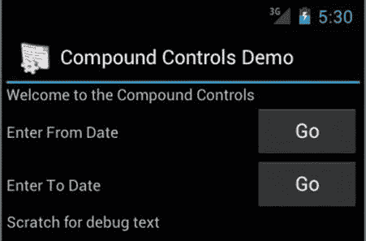
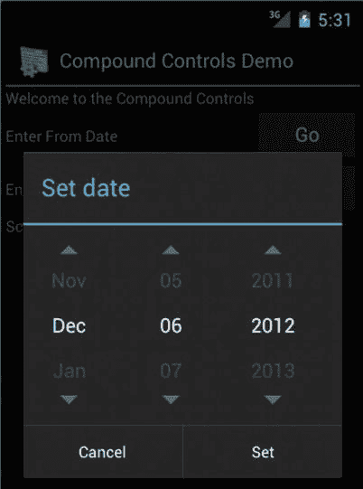
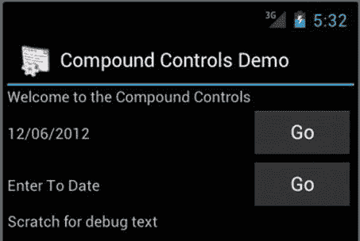
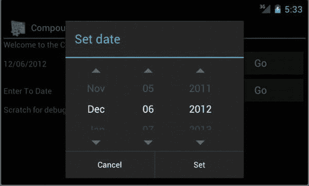
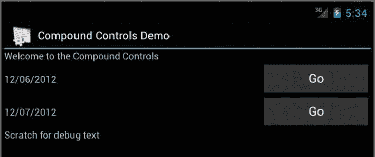
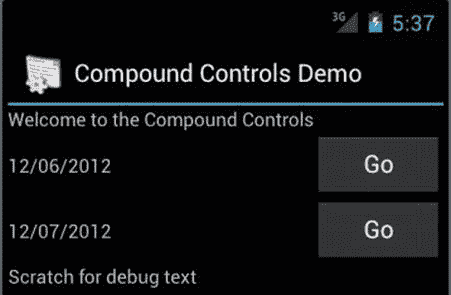

# 二、探索复合控件

Abstract

在第一章中，我们说过在 Android 中定制视图的方法之一是将现有控件组合(或放在一起)为一个新的复合控件。在本章中，我们将讨论如何创建这些自定义复合控件。

在第一章中，我们说过在 Android 中定制视图的方法之一是将现有控件组合(或放在一起)为一个新的复合控件。在本章中，我们将讨论如何创建这些自定义复合控件。

编写定制的复合控件(本章的主题)和直接定制一个独立的视图(正如我们在第一章中所做的)有许多相似之处。在这两种类型的自定义中，管理自定义属性是相同的。但是，与自定义视图相比，在管理自定义复合控件的视图状态方面存在细微但重要的差异。此外，与您自己绘制的自定义视图不同，在复合控件中，您不需要处理测量、布局或绘制。这是因为您正在使用现有的控件和那些控件(如文本视图、按钮等。)知道如何测量和绘制自己。

除了自定义视图和复合控件之间的这些高级异同，您将了解到创建行为良好的复合控件包括以下步骤。

Derive the custom compound control from an existing layout like `LinearLayout`, `RelativeLayout`, etc.   Place the child controls you want to compose in a layout XML file. Then load that layout XML file in the constructor of the custom compound control as its layout.   Use `merge` as the root node of your custom layout XML file so that the composed child components in the layout XML file become the direct children of the custom control.   If you intend to invoke fragment dialogs from your child controls (like clicking or touching a button), you might need to assume your context for the fragment dialog as an activity.   From step 4, you will be able to derive a fragment manager and use fragment dialogs.   If you are going to use a fragment dialog, you need to create a fragment class to work with your fragment dialog.   When using fragment dialogs, to allow for device rotation, you need to pass the view ID of the parent compound control in the argument bundle of the fragment dialog. This ID is needed so that your fragment dialog can communicate with the parent compound control.   On device rotation, you need to restore view pointers to the parent compound control in your dialog fragments in the fragment method `onActivityCreated`(  ).   To overcome the “ID” dependence of the views for view state management, the compound control needs to take over view state management for child views.   Of course, as in Chapter 1, you can use custom attributes.  

我们将用带注释的代码片段来解释每一个步骤。首先，我们展示我们用来说明所有这些步骤的自定义复合控件。

## 计划工期复合控制

对于我们的自定义复合控件，我们将使用两个日期，并查看这两个日期之间的天数或周数。图 2-1 显示了这个控件嵌入到活动布局中时的样子。

图 2-1。

A compound control: DurationControl

我们的自定义持续时间组件嵌入在两个文本控件之间，一个以“欢迎…”开始，另一个在底部以“调试开始…”开始

我们在这个控件上有两个日期:一个“从”日期和一个“到”日期。当我们针对 from 日期按 GO 时，我们调用一个日期选择器对话框(片段对话框),并用“From”日期替换文本“Enter From Date”。当我们按 GO 到 to 日期时，我们调用同一个日期选择器对话框，并用“To”日期替换文本“Enter To Date”。然后，compound `DurationControl`可以计算天数或周数(基于自定义属性)。

图 2-2 显示了当你点击 GO 时，日期选择器片段对话框在纵向模式下的样子。

图 2-2。

Invoking a fragment dialog from a compound control

一旦你从图 2-2 中选择了一个日期，该日期将被填充到日期文本框中，如图 2-3 所示。

图 2-3。

Saving the date from a date picker fragment dialog

在图 2-3 中，注意“从”日期文本被替换为选择的日期。此时，您需要确保翻转设备时数据保持完整。比方说，你从纵向模式的日期对话框开始。你把手机翻到横向。然后，图 2-4 显示了这个对话框应该是什么样子。如果设备翻转，您不必重新单击“转到”来查看此对话框。

图 2-4。

Demonstrating device rotation with fragment dialogs

在设备翻转时保留对话框并不是那么简单。我们将在本章后面讨论如何做好这一点。图 2-5 显示了当您从图 2-4 中选择日期并设置“至”日期时，大院`DurationControl`的景观。

图 2-5。

DurationControl state in landscape mode

现在，您希望翻转设备以确保复合控件可以保持其状态(两个选定的日期及其值)。图 2-6 显示了翻转回纵向后的`DurationControl`视图。

图 2-6。

Duration control state in portrait mode

现在，您已经完全理解了定制化合物`DurationControl`，让我们开始探索实现本章开头列出的全套功能所需的每个步骤。

## 从现有布局驱动

清单 2-1 显示了创建自定义复合控件的第一步。在这个清单中，我们将让我们的`DurationControl`扩展`LinearLayout`以产生图 2-1 中的布局。

清单 2-1。duration 控制扩展现有布局

`public class DurationControl`

`extends LinearLayout`

`implements android.view.View.OnClickListener`

`{`

`...`

除了扩展`LinearLayout`，控件还实现了一个`onclick`监听器。这个`listener`在那里监听两个按钮并启动片段对话框来收集日期。

## 为复合控件创建布局文件

清单 2-2 显示了产生如图 2-1 所示的`DurationControl`布局所需的布局文件。如图 2-1 所示，该列表具有(a)两个显示所选日期值的文本视图，以及(b)两个调用日期选择器对话框的按钮。我们使用了两个内部`LinearLayouts`来完成`DurationControl`视图，如图 2-1 所示。或许你可以发挥创意，使用一个`RelativeLayout`来完成或达到图 2-1 中的布局。(`RelativeLayout`是与生产代码的嵌套`LinearLayouts`相比的首选机制。)

清单 2-2。DurationControl 自定义布局文件

`<?xml version="1.0" encoding="utf-8"?>`

`<!--/res/layout/duration_view_layout.xml -->`

`<merge xmlns:android="`[`http://schemas.android.com/apk/res/android`](http://schemas.android.com/apk/res/android)

`<LinearLayout`

`android:orientation="horizontal"`

`android:layout_width="fill_parent"`

`android:layout_height="wrap_content"`

`>`

`<TextView`

`android:id="@+id/fromDate"`

`android:layout_width="0dp"`

`android:layout_height="wrap_content"`

`android:text="Enter From Date"`

`android:layout_weight="70"`

`/>`

`<Button`

`android:id="@+id/fromButton"`

`android:layout_width="0dp"`

`android:layout_height="wrap_content"`

`android:text="Go"`

`android:layout_weight="30"`

`/>`

`</LinearLayout>`

`<LinearLayout`

`android:orientation="horizontal"`

`android:layout_width="fill_parent"`

`android:layout_height="wrap_content"`

`>`

`<TextView`

`android:id="@+id/toDate"`

`android:layout_width="0dp"`

`android:layout_height="wrap_content"`

`android:text="Enter To Date"`

`android:layout_weight="70"`

`/>`

`<Button`

`android:id="@+id/toButton"`

`android:layout_width="0dp"`

`android:layout_height="wrap_content"`

`android:text="Go"`

`android:layout_weight="30"`

`/>`

`</LinearLayout>`

`</merge>`

您需要将这个布局放在布局资源目录下的 XML 文件中。这将生成布局 ID，您将在`DurationControl`的构造函数中使用它来读取这个自定义布局。我们将很快向您展示这是如何完成的。

注意，这个布局文件的根不是`<LinearLayout>`，而是`<merge>`。这一点很重要，因为定制控件已经是一个`LinearLayout`(见清单 2-1)，你想让清单 2-2 中的子控件直接附加到`DurationControl`，?? 本身是一个`LinearLayout`。如果你不这样做，而是在清单 2-2 中放置一个`LinearLayout`作为根节点，你的`DurationControl`将会有一个额外的不必要的`LinearLayout`作为它的子节点。当你看到清单 2-3 中的`DurationControl`的构造函数，将清单 2-2 的这些节点作为父视图附加到它自身时，这就变得很明显了。

清单 2-3。在 DurationControl 构造函数中加载自定义布局

`//Constructor for Java`

`public DurationControl(Context context) {`

`super(context);`

`initialize(context);`

`}`

`...other constructors that are there to read custom attributes`

`...Which also call initialize(context)`

`private void initialize(Context context)  {`

`//Get the layout inflater`

`LayoutInflater lif = (LayoutInflater)`

`context.getSystemService(Context.LAYOUT_INFLATER_SERVICE);`

`//inflate the custom layout of listing 2-2`

`//Use the second argument to attach the layout`

`//as a child of this layout`

`lif.inflate(R.layout.duration_view_layout, this);`

`//Initialize the buttons`

`Button b = (Button)this.findViewById(R.id.fromButton);`

`b.setOnClickListener(this);`

`b = (Button)this.findViewById(R.id.toButton);`

`b.setOnClickListener(this);`

`//Allow view state management`

`this.setSaveEnabled(true);`

`}`

清单 2-3 是复合控件加载自定义布局的典型例子。

所有继承视图，包括从布局继承的视图，都有多个构造函数。你已经在第一章中看到了。有一个构造函数用于直接从 Java 实例化该类。Android 使用另外两个构造函数来实例化视图，作为展开布局的一部分。在清单 2-3 中，我们只展示了一个构造函数来演示`DurationControl`如何加载它的自定义布局。在本章的后面，当我们讨论这个类的自定义属性时，我们将展示这个类中其余的构造函数。

不管怎样，`DurationControl`的所有这些构造函数最终都会调用清单 2-3 中的`initialize()`方法。这个初始化方法从 activity 中获取一个布局生成器，并使用它来加载清单 2-2 中的布局，使用为这个自定义布局文件生成的 ID。假设清单 2-2 中的布局在文件`/res/layout/duration_view_layout`中，我们将使用的 ID 是`R.layout.duration_view_layout`。

清单 2-3 的初始化例程在清单 2-2 的自定义布局中定位按钮，并将`DurationControl`设置为它们的`onClicks`的目标。

您现在有了一个自定义布局(清单 2-2)。您已经在您的`DurationControl`构造函数中加载了自定义布局(清单 2-3)。现在让我们看看自定义`DurationControl`是如何在活动的布局中使用的。这是充分体会`merge`在自定义布局文件中的效果的重要一点。

## 在活动布局中指定持续时间控制

注意清单 2-2 中的`merge`除了`xmlns`规范之外没有其他属性。你说布局清单 2-2(或图 1-1 )中的控件需要垂直布局在哪里？这不是在`merge`节点完成的，而是在活动的布局中指定`DurationControl`时完成的，如清单 2-4 所示。清单 2-4 是您在图 1-1 所示的活动中看到的布局。

清单 2-4 活动布局中的持续时间控件

`<?xml version="1.0" encoding="utf-8"?>`

`<LinearLayout xmlns:android="`[`http://schemas.android.com/apk/res/android`](http://schemas.android.com/apk/res/android)

`xmlns:cc="`[`http://schemas.android.com/apk/res/com.androidbook.compoundControls`](http://schemas.android.com/apk/res/com.androidbook.compoundControls)

`android:orientation="vertical"`

`android:layout_width="fill_parent"  android:layout_height="match_parent">`

`<TextView`

`android:id="@+id/text2"`

`android:layout_width="fill_parent" android:layout_height="wrap_content"`

`android:text="Welcome to the Compound Controls"/>`

`/>`

`<com.androidbook.compoundControls.DurationControl`

`android:id="@+id/durationControlId"` `android:orientation="vertical"`

`android:layout_width="fill_parent" android:layout_height="wrap_content"`

`cc:durationUnits="weeks"`

`/>`

`<TextView`

`android:id="@+id/text1"`

`android:layout_width="fill_parent" android:layout_height="wrap_content"`

`android:text="Scratch for debug text"`

`/>`

`</LinearLayout>`

注意这个布局中的第二个节点是您的定制控件`DurationControl`。看看`DurationControl`节点是如何被指定的，就像线性布局一样。

到目前为止，您已经获得了我们的自定义控件的外观和感觉，使其与图 1-1 中的内容相匹配。我们现在将关注它的行为。这就引出了对片段对话框的讨论，因为我们需要它们来捕获“从”和“到”的日期。

## 使用片段对话框

碰巧我们的复合控件使用类似于`date picker`的片段对话框来计算“从”和“到”的日期。如果您想在一个视图中隔离这个功能，以便在复合定制视图之外隐藏这个行为，那么使用片段管理器并不是那么简单。在这一节中，我们将一步一步地展示如何从一个自包含的复合控件(如`DurationControl`)中使用片段对话框。

### 访问片段管理器

我们知道我们想要调用一个`date picker`对话框。Android 中调用对话框的新方法是使用片段。要使用这些对话片段，您需要访问片段管理器。但是因为视图不能直接访问片段管理器，所以您需要一个活动来获取与该活动相关联的片段管理器。即使这样做——从视图中获取活动——也没有直接的方法。

视图只能访问其上下文，而不能访问活动。虽然活动是一种上下文，但是视图可能在不是活动的上下文中操作。所以，如果你想使用片段对话框，你需要做一些假设。这个特殊的控件严重依赖于片段对话框。如果你得不到一个片段管理器，那根本不行。所以你假设你只在一个活动的上下文中工作。一旦你使用了这个参数，清单 2-5 显示了如何从视图中获得一个片段管理器。

清单 2-5。访问片段管理器

`Public class DurationControl...{`

`private FragmentManager getFragmentManager() {`

`Context c = getContext();`

`if (c instanceof Activity) {`

`return ((Activity)c).getFragmentManager();`

`}`

`throw new RuntimeException("Activity context expected instead");`

`}`

`...} //end-of-class DurationControl`

在设计自定义复合控件时，可能需要也可能不需要使用片段对话框。这取决于复合控制的需要和性质。在这一章中，我们将讨论使用片段对话框的更困难的情况。因为这个组件使用片段对话框，所以我们处于这样的困境:假设在`View`类中可用的上下文是一个活动。你可以有一个不调用片段对话框的复合控件，你不需要做这样的假设；那样的话，就不需要做这种不必要的假设了。

## 调用片段对话框

既然您已经有了获取片段管理器的方法，那么您可以使用清单 2-6 中的代码来调用片段对话框。当触摸/按下图 1-1 中的任何 GO 按钮时，清单 2-6 中的`onclick`将被调用。根据按下的按钮，调用`date picker`片段对话框，并传递按钮 ID。该按钮 ID 允许`date picker`对话框将按钮 ID 发送回`DurationControl`以知道要设置哪个日期(“从”或“到”)。

清单 2-6。调用片段对话框

`public class DurationControl {`

`...`

`public void onClick(View v)`

`{`

`Button b = (Button)v;`

`if (b.getId() == R.id.fromButton)`

`{`

`DialogFragment newFragment = new DatePickerFragment(this,R.id.fromButton);`

`newFragment.show(getFragmentManager(), "com.androidbook.tags.datePicker");`

`return;`

`}`

`//Otherwise – to button`

`DialogFragment newFragment = new DatePickerFragment(this,R.id.toButton);`

`newFragment.show(getFragmentManager(), "com.androidbook.tags.datePicker");`

`return;`

`}//eof-onclick`

`...`

`}//eof-class DurationControl`

如果你在看清单 2-6，你会注意到我们没有向你展示片段对话框`DatePickerFragment`的代码。然而，你会看到`DatePickerFragment`需要一个片段管理器来工作(参见清单 2-6 中对`show`()方法的调用)。在上一节中，我们展示了如何通过合理的假设获得片段管理器。我们现在展示`DatePickerFragment`类。

### 正在创建 DatePickerFragment 类

清单 2-7 显示了`DatePickerFragment`的代码。这个定制类封装了 SDK 提供的`DatePickerDialog`。它是在新的 Android SDK 中显示对话框的标准机制(从 Android release 3 开始)。

清单 2-7。DatePickerFragment 的源代码

`public class DatePickerFragment extends DialogFragment`

`implements DatePickerDialog.OnDateSetListener`

`{`

`public static String tag = "DatePickerFragment";`

`private DurationControl parent;`

`private int buttonId;`

`public DatePickerFragment(DurationControl inParent, int inButtonId)`

`{`

`parent = inParent;`

`buttonId = inButtonId;`

`Bundle argsBundle = this.getArguments();`

`if (argsBundle == null)`

`{`

`argsBundle = new Bundle();`

`}`

`argsBundle.putInt("parentid", inParent.getId());`

`argsBundle.putInt("buttonid", buttonId);`

`this.setArguments(argsBundle);`

`}`

`//Default constructor for device rotation`

`public DatePickerFragment(){}`

`@Override`

`public Dialog onCreateDialog(Bundle savedInstanceState)`

`{`

`//this.establishParent();`

`// Use the current date as the default date in the picker`

`final Calendar c = Calendar.getInstance();`

`int year = c.get(Calendar.YEAR);`

`int month = c.get(Calendar.MONTH);`

`int day = c.get(Calendar.DAY_OF_MONTH);`

`// Create a new instance of DatePickerDialog and return it`

`return new DatePickerDialog(getActivity(), this, year, month, day);`

`}`

`public void onDateSet(DatePicker view, int year, int month, int day) {`

`// Do something with the date chosen by the user`

`parent.onDateSet(buttonId, year, month, day);`

`}`

`@Override`

`public void onActivityCreated(Bundle savedInstanceState) {`

`super.onActivityCreated(savedInstanceState);`

`Log.d(tag,"DatePickerFragment onActivity created called");`

`this.establishParent();`

`}`

`private void establishParent()   {`

`if (parent != null) return;`

`Log.d(tag, "establishing parent");`

`int parentid = this.getArguments().getInt("parentid");`

`buttonId =  this.getArguments().getInt("buttonid");`

`View x = this.getActivity().findViewById(parentid);`

`if (x == null)    {`

`throw new RuntimeException("Sorry not able to establish parent on restart");`

`}`

`parent = (DurationControl)x;`

`}`

`} //eof-class-DatePickerFragment`

虽然这是显示对话框的标准方法，但是我们已经做了一些事情来使这些片段对话框很好地为像我们这样的自定义复合控件工作。正如我们在本章开始时指出的，当这个片段对话框显示时，设备可以旋转。我们需要设计`DatePickerFragment`类，以便它考虑到设备旋转。

### 构造日期选择器片段

参考清单 2-8，让我们重点看看`DatePickerFragment`的构造函数。我们有几件事要指出来。

清单 2-8。在片段构造函数中使用包

`public DatePickerFragment(DurationControl inParent, int inButtonId)`

`{`

`parent = inParent;`

`buttonId = inButtonId;`

`Bundle argsBundle = this.getArguments();`

`if (argsBundle == null)  {`

`argsBundle = new Bundle();`

`}`

`argsBundle.putInt("parentid", inParent.getId());`

`argsBundle.putInt("buttonid", buttonId);`

`this.setArguments(argsBundle);`

`}`

`//Default constructor for device rotation`

`public DatePickerFragment(){}`

因为`DatePickerFragment`是一个对话框片段，它需要告诉调用者(我们的自定义复合视图，`DurationControl`)这个对话框已经完成了日期的选择。为了便于与`DurationControl`的交流，我们在`DatePickerFragment`的构建过程中通过`parent`参数传递了对`DurationControl`的引用。

然后，`DatePickerFragment`将这个引用保存为一个局部变量。这个`parent`引用稍后用于在对话结束时回调对话片段。我们还将按钮 ID 作为`DatePickerFragment`构造函数的输入。我们将把按钮 ID 传递给回调函数，以便`DurationControl`知道要设置哪个日期字段。

一旦我们将`DurationControl`和按钮 ID 作为本地变量存储在`DatePickerFragment`中，我们就做了一些有趣的事情，至少是不典型的(尤其是如果你是 Android 和 fragments 的新手！).我们获取`DurationControl`的视图 ID 和传入的按钮 ID，并将它们填充到`DatePickerFragment`的参数包中。

Note

参考关于碎片的文献，包括我们自己的 Pro Android 4，当设备旋转时，参数包如何管理它们的状态。

您还会注意到清单 2-8 中片段对话框的默认构造函数。什么时候调用默认构造函数？为什么这个默认构造函数是空的？调用默认构造函数时，所有重要的局部变量`parent`和`buttonid`会发生什么？谁设定的？我们将在下一节回答这些问题。

### 还原对话片段状态

当设备旋转时，调用清单 2-8 中对话框片段的默认构造函数。Android 删除活动及其所有片段，并重新实例化它们。Android 在这个重新实例化阶段调用默认的构造函数。它依靠大量与状态相关的回调来重新初始化这些对象。

当调用这个默认构造函数时，有一个不完整的对话框片段类:对`DurationControl`的父引用和按钮 ID 还没有填充。要设置这些变量，您需要在 dialog fragment 类上寻找一个回调，它会告诉您活动中的所有视图何时被重新创建。你要找的片段上的回调是`onActivityCreated`()。尽管一个片段在重新初始化阶段有许多回调，但是正是这个`onActivityCreated`()方法保证了所有的视图都已经被创建。

当一个片段被重新创建时，它会记住您最初在这个片段上设置的参数包。在`onActivityCreated`回调中，您将使用来自参数包的 ID，通过使用其视图 ID 来定位父`DurationControl`。清单 2-9 显示了这是如何做到的。

清单 2-9。在片段再生期间重新建立指针

`@Override`

`public void onActivityCreated(Bundle savedInstanceState) {`

`super.onActivityCreated(savedInstanceState);`

`this.establishParent();`

`}`

`private void establishParent()`

`{`

`if (parent != null) return;`

`//get parent view id from the arguments bundle`

`int parentid = this.getArguments().getInt("parentid");`

`buttonId =  this.getArguments().getInt("buttonid");`

`//Look for the parent view in the activity`

`View x = this.getActivity().findViewById(parentid);`

`if (x == null) {`

`throw new RuntimeException("Sorry not able to establish parent on restart");`

`}`

`//Get back our DurationControl parent`

`parent = (DurationControl)x;`

`}`

### 给父母回电

一旦日期选择器对话框片段重新建立了父级，如清单 2-9 所示，该对话框片段就处于良好的构造状态。它可以访问按钮 ID 和父视图`DurationControl`。现在如果从日期选择器对话框中选择一个日期(如图 2-4 )，那么`DatePickerFragment`将调用父节点的`onDateSet`方法。下面是清单 2-10 所示的`DurationControl`的回调方法。

清单 2-10。在复合控件中实现片段对话框回调

`public class DurationControl...{`

`...`

`public void onDateSet(int buttonId, int year, int month, int day)   {`

`Calendar c = getDate(year,month,day);`

`if (buttonId == R.id.fromButton) {`

`setFromDate(c);`

`return;`

`}`

`setToDate(c);`

`}`

`private void setFromDate(Calendar c)   {`

`if (c == null) return;`

`this.fromDate = c;`

`TextView tc = (TextView)findViewById(R.id.fromDate);`

`tc.setText(getDateString(c));`

`}`

`private void setToDate(Calendar c)   {`

`if (c == null) return;`

`this.toDate = c;`

`TextView tc = (TextView)findViewById(R.id.toDate);`

`tc.setText(getDateString(c));`

`}`

`private Calendar getDate(int year, int month, int day)   {`

`Calendar c = Calendar.getInstance();`

`c.set(year,month,day);`

`return c;`

`}`

`public static String getDateString(Calendar c)   {`

`if(c == null) return "null";`

`SimpleDateFormat df = new SimpleDateFormat("MM/dd/yyyy");`

`df.setLenient(false);`

`String s = df.format(c.getTime());`

`return s;`

`}`

`...more`

`}//eof-class-DurationControl`

清单 2-10 突出显示了`DurationControl`的这个键回调方法`onDateSet`。现在，您可以看到为什么我们努力将按钮 ID 传递给对话框片段。在这个`onDateSet`回调方法中，我们询问调用片段对话框的按钮是“从”日期按钮还是“到”日期按钮。在清单 2-10 中，还可以看到我们如何定位属于相应日期控件的文本视图并设置它的文本。

这就总结了在复合控件中使用基于片段的对话框的复杂性。总而言之，(a)你必须得到一个片段管理器，(b)你必须将回调对象传递给片段对话框，(c)你必须使用参数束来保存状态，以及(d)你必须使用`onActivityCreated`来重新建立回调指针。至此，我们转向复合控件的下一个主题:管理视图状态。

## 管理复合控件的视图状态

当我们谈到自定义视图时，我们在第一章中详细讨论了视图状态管理。管理复合控件的视图状态是相似的，但也有一些不同。

如果在一个活动中多次使用类似于`DurationControl`的复合控件，那么文本视图和按钮视图的 id 就会重复。这对于基于 Android 的视图类所设计的协议来管理他们自己的视图状态是不可行的，Android 的视图类在给定活动的上下文中需要一个唯一的视图 id。

为了克服这个问题，您可以使用一个复合控件来阻止其子控件管理它们的视图状态，而代之以为它们管理它们的状态。为了理解这种视图状态管理的方法，您需要理解来自`ViewGroup`类的四个基类方法。这些如清单 2-11 所示。

清单 2-11。视图组视图状态管理的相关 API

`dispatchSaveInstanceState`

`dispatchFreezeSelfOnly`

`dispatchRestoreInstanceState`

`dispatchThawSelfOnly`

一个`ViewGroup`使用`dispatchSaveInstanceState`首先通过调用超级(视图的)`dispatchSaveInstanceState`来保存它自己的状态，这又在它自己身上触发`onSaveInstanceState`，然后为它的每个孩子调用`dispatchSaveInstanceState`。如果孩子是普通的`views`而不是`ViewGroups`，这将导致调用他们的`onSaveInstanceState`。清单 2-12 展示了这些关键方法是如何结合在一起的伪代码。

清单 2-12。关于分派存储实例如何工作的伪代码

`ViewGroup.dispatchSaveInstanceState() {`

`View.dispatchSaveInstanceState()`

`...ends up calling its own ViewGroup.onSaveInstanceState()`

`Children.dispatchSaveInstanceState()`

`...ends up calling children's onSaveInstanceState()`

`}`

`View.dispatchSaveInstanceState() {`

`onSaveInstanceState()`

`}`

`ViewGroup.dispatchFreezeSelfOnly() {`

`View.dispatchSaveInstanceState()`

`...ends up calling ViewGroup.onSaveInstanceState()`

`}`

注意这里`dispatchFreezeSelfOnly`的褶皱。`ViewGroup`上的这个方法只是调用为自己保存状态的语义，因为它最终调用了当前视图组的`onSaveInstanceState`。在使用等效方法的恢复阶段也会发生同样的事情。

知道了这个复杂的协议，你可以覆盖清单 2-13 中所示的`ViewGroup`的适当方法来抑制子视图的状态保存，并在视图组本身中实现状态管理。

清单 2-13。重写复合控件的 dispatchSaveInstanceState

`@Override`

`protected void dispatchSaveInstanceState(SparseArray<Parcelable> container)`

`{`

`//Don't call this so that children won't be explicitly saved`

`//super.dispatchSaveInstanceState(container);`

`//Call your self onsavedinstancestate`

`super.dispatchFreezeSelfOnly(container);`

`}`

当你这样做时，你是在召唤自己，而不是你的孩子。您对`dispatchRestoreInstanceState`做同样的事情，如清单 2-14 所示。

清单 2-14。为复合控件重写 dispatchRestorInstanceState

`@Override`

`protected void dispatchRestoreInstanceState(`

`SparseArray<Parcelable> container)`

`{`

`//Don't call this so that children won't be explicitly saved`

`//super.dispatchRestoreInstanceState(container);`

`super.dispatchThawSelfOnly(container);`

`}`

通过覆盖这两个方法(清单 2-13 和 2-14)，您已经支持了子状态管理。我们现在向您展示我们的`DurationControl`上的`onSaveInstanceState`和`onRestoreInstanceState`的代码，它负责管理它的四个子节点的状态:两个文本视图和两个按钮。当然，按钮没有状态，但是两个文本视图有。然而，在向您展示`onSaveInstanceState`和`onRestoreInstanceState`的代码之前，我们向您展示这个`DurationControl`如何实现它自己的`SavedState`类，这是这两个方法所需要的。(参见第一章了解这种类型的`BaseSavedState`保存状态模式。)

### 为 DurationControl 实现 SavedState 类

清单 2-15 显示了保存`DurationControl`及其子节点状态的`SavedState`类。它遵循第一章的“BaseSavedState 模式”一节中的相同模式。我们感兴趣保存的两个变量是两个日期:“从”日期和“到”日期。

清单 2-15。自定义 DurationControl 的 SavedState 类实现

`public static class SavedState extends BaseSavedState {`

`//null values are allowed`

`private Calendar fromDate;`

`private Calendar toDate;`

`SavedState(Parcelable superState) {`

`super(superState);`

`}`

`SavedState(Parcelable superState, Calendar inFromDate, Calendar inToDate) {`

`super(superState);`

`fromDate = inFromDate;`

`toDate = inToDate;`

`}`

`@Override`

`public void writeToParcel(Parcel out, int flags) {`

`super.writeToParcel(out, flags);`

`if (fromDate != null) {`

`out.writeLong(fromDate.getTimeInMillis());`

`}`

`else {`

`out.writeLong(-1L);`

`}`

`if (fromDate != null) {`

`out.writeLong(toDate.getTimeInMillis());`

`}`

`else {`

`out.writeLong(-1L);`

`}`

`}`

`@Override`

`public String toString() {`

`StringBuffer sb  = new StringBuffer("fromDate:"`

`+ DurationControl.getDateString(fromDate));`

`sb.append("fromDate:" + DurationControl.getDateString(toDate));`

`return sb.toString();`

`}`

`@SuppressWarnings("hiding")`

`public static final Parcelable.Creator<SavedState> CREATOR`

`= new Parcelable.Creator<SavedState>() {`

`public SavedState createFromParcel(Parcel in) {`

`return new SavedState(in);`

`}`

`public SavedState[] newArray(int size) {`

`return new SavedState[size];`

`}`

`};`

`//Read back the values`

`private SavedState(Parcel in) {`

`super(in);`

`//Read the from date`

`long lFromDate = in.readLong();`

`if (lFromDate == -1) {`

`fromDate = null;`

`}`

`else {`

`fromDate = Calendar.getInstance();`

`fromDate.setTimeInMillis(lFromDate);`

`}`

`//Read the from date`

`long lToDate = in.readLong();`

`if (lFromDate == -1) {`

`toDate = null;`

`}`

`else {`

`toDate = Calendar.getInstance();`

`toDate.setTimeInMillis(lToDate);`

`}`

`}`

`}//eof-state-class`

我们将需要保存和恢复的两个日期表示为 Java 日历对象。当我们将它们存储在`parcelable`中时，我们以`longs`(毫秒)的形式存储它们，以`longs`的形式检索它们，并将它们转换回日历对象。除此之外，清单 2-15 的代码与第一章中给出的非常相似。现在让我们看看如何使用这个`SavedState`类来恢复子文本视图。

### 代表子视图实现保存和恢复状态

清单 2-16 显示了我们的`DurationControl`的`save`和`restore`方法的实现，使用了清单 2-15 中设计的`SavedState`类。您从`SavedState` parcelable 中检索日期，并使用 set 方法设置文本视图的值。日期在`SavedState`类(清单 2-15)中作为公共变量提供。在`DurationControl`上设置日期的方法在`DurationControl`类中可用。我们还没有向您展示这两个`setdate`方法，但是我们在本章末尾展示的`DurationControl`的整个源代码中包含了它们(清单 2-19)。清单 2-16 中的方法`onRestoreInstanceState`和`onSaveInstatanceState`也在`DurationControl`类中。这两个状态方法最初是在基类`ViewGroup`上定义的，在清单 2-16 中，你在`DurationControl`类中覆盖了这些方法。您还可以在清单 2-19 中看到这些方法的完整上下文。

清单 2-16。使用 SavedState 管理子视图状态

`@Override`

`protected void onRestoreInstanceState(Parcelable state) {`

`if (!(state instanceof SavedState)) {`

`super.onRestoreInstanceState(state);`

`return;`

`}`

`//it is our state`

`SavedState ss = (SavedState)state;`

`//Peel it and give the child to the super class`

`super.onRestoreInstanceState(ss.getSuperState());`

`this.setFromDate(ss.fromDate);`

`this.setToDate(ss.toDate);`

`}`

`@Override`

`protected Parcelable onSaveInstanceState() {`

`Parcelable superState = super.onSaveInstanceState();`

`SavedState ss = new SavedState(superState);`

`ss.fromDate = this.fromDate;`

`ss.toDate = this.toDate;`

`//Or you can do this`

`//SavedState ss = new SavedState(superState,fromDate,toDate);`

`return ss;`

`}`

这将我们带到创建自定义复合控件中的最后一个主题:定义和使用自定义属性。我们现在讨论这个问题。

## 为 DurationControl 创建自定义属性

定义和使用自定义属性与我们在第一章中介绍的自定义视图相同。清单 2-17 显示了我们为这个类定义的单个自定义属性。

清单 2-17。attrs.xml for DurationControl

`<resources>`

`<declare-styleable name="DurationComponent">`

`<attr name="durationUnits">`

`<enum name="days" value="1"/>`

`<enum name="weeks" value="2"/>`

`</attr>`

`</declare-styleable>`

`</resources>`

自定义属性`durationUnits`表示您希望自定义控件返回天数还是周数。(我们同意；这是一个蹩脚的自定义属性，但我们只是想向您展示这是如何做到的，并且您有一个编写自己的自定义属性的示例可以遵循。)

一旦定义了自定义属性，清单 2-18 显示了如何在`DurationControl`的构造函数中读取该属性。

清单 2-18。用自定义属性初始化 DurationControl

`public DurationControl(Context context) {`

`super(context);`

`initialize(context);`

`}`

`public DurationControl(Context context, AttributeSet attrs, int defStyle) {`

`super(context, attrs, defStyle);`

`TypedArray t = context.obtainStyledAttributes(attrs`，

`R.styleable.DurationComponent,0,0);`

`durationUnits = t.getInt(`

`R.styleable.DurationComponent_durationUnits, durationUnits);`

`t.recycle();`

`initialize(context);`

`}`

`public DurationControl(Context context, AttributeSet attrs) {`

`this(context, attrs,0);`

`}`

`private void initialize(Context context)  {`

`LayoutInflater lif = (LayoutInflater)`

`context.getSystemService(Context.LAYOUT_INFLATER_SERVICE);`

`lif.inflate(R.layout.duration_view_layout, this);`

`Button b = (Button)this.findViewById(R.id.fromButton);`

`b.setOnClickListener(this);`

`b = (Button)this.findViewById(R.id.toButton);`

`b.setOnClickListener(this);`

`this.setSaveEnabled(true);`

`}`

我们对创建定制复合控件的细节的介绍到此结束。参见本章后面的“DurationControl 的实现细节”一节，了解在一个地方实现`DurationControl`所需的所有源代码。

## 扩展现有视图

我们到目前为止所介绍的内容以及我们在第一章中所介绍的内容为创建自定义视图或扩展现有视图奠定了良好的基础。此外，在本章中，我们展示了如何扩展布局视图。然而，我们还没有展示如何扩展像`TextView`这样更简单的已有视图。知道你现在做什么，这应该是在公园散步。扩展现有视图如`TextView`的步骤如下:

Extend from `TextView`. `TextView` will take care of measuring, drawing, etc.   In the constructor, read any custom attributes you may have defined in `attrs.xml`.   Implement any view state that you want to manage yourself in addition to `TextView` or just delegate that to the `TextView`.  

我们将把这项工作留给你，作为测试你对主题掌握程度的练习。

## 持续控制的实施细节

如果你对我们在这一章中讨论的所有内容都很熟悉，你可以自己动手整理，你不需要阅读这一节，在这一节中，我们将向你展示所有相关的代码文件。其中一些档案已经完整呈现；对于这些文件，我们只是简单地引用它们以前的清单。对于某些文件，我们在下面复制了它们，这样这些文件的完整源代码就在一个地方。我们从初级类`DurationControl.java`的源代码开始。

### DurationControl.java

清单 2-19 中的类`DurationControl`承担了大部分的实现负担。

清单 2-19。DurationControl.java

`public class DurationControl extends LinearLayout`

`implements    android.view.View.OnClickListener`

`{`

`private static final String tag = "DurationControl";`

`private Calendar fromDate = null;`

`private Calendar toDate = null;`

`// 1: days, 2: weeks`

`private static int ENUM_DAYS = 1;`

`private static int ENUM_WEEKS = 1;`

`private int durationUnits = 1;`

`// public interface`

`public long getDuration() {`

`if (validate() == false)`

`return -1;`

`long fromMillis = fromDate.getTimeInMillis();`

`long toMillis = toDate.getTimeInMillis();`

`long diff = toMillis - fromMillis;`

`long day = 24 * 60 * 60 * 1000;`

`long diffInDays = diff / day;`

`long diffInWeeks = diff / (day * 7);`

`if (durationUnits == ENUM_WEEKS) {`

`return diffInDays;`

`}`

`return diffInWeeks;`

`}`

`public boolean validate() {`

`if (fromDate == null || toDate == null) {`

`return false;`

`}`

`if (toDate.after(fromDate)) {`

`return true;`

`}`

`return false;`

`}`

`public DurationControl(Context context) {`

`super(context);`

`initialize(context);`

`}`

`public DurationControl(Context context, AttributeSet attrs, int defStyle) {`

`super(context, attrs, defStyle);`

`TypedArray t = context.obtainStyledAttributes(attrs`，

`R.styleable.DurationComponent, 0, 0);`

`durationUnits = t.getInt(R.styleable.DurationComponent_durationUnits`，

`durationUnits);`

`t.recycle();`

`initialize(context);`

`}`

`public DurationControl(Context context, AttributeSet attrs) {`

`this(context, attrs, 0);`

`}`

`private void initialize(Context context) {`

`LayoutInflater lif = (LayoutInflater) context`

`.getSystemService(Context.LAYOUT_INFLATER_SERVICE);`

`lif.inflate(R.layout.duration_view_layout, this);`

`Button b = (Button) this.findViewById(R.id.fromButton);`

`b.setOnClickListener(this);`

`b = (Button) this.findViewById(R.id.toButton);`

`b.setOnClickListener(this);`

`this.setSaveEnabled(true);`

`}`

`private FragmentManager getFragmentManager() {`

`Context c = getContext();`

`if (c instanceof Activity) {`

`return ((Activity) c).getFragmentManager();`

`}`

`throw new RuntimeException("Activity context expected instead");`

`}`

`public void onClick(View v) {`

`Button b = (Button) v;`

`if (b.getId() == R.id.fromButton) {`

`DialogFragment newFragment = new DatePickerFragment(this`，

`R.id.fromButton);`

`newFragment.show(getFragmentManager()`，

`"com.androidbook.tags.datePicker");`

`return;`

`}`

`// Otherwise`

`DialogFragment newFragment = new DatePickerFragment(this, R.id.toButton);`

`newFragment.show(getFragmentManager()`，

`"com.androidbook.tags.datePicker");`

`return;`

`}// eof-onclick`

`public void onDateSet(int buttonId, int year, int month, int day) {`

`Calendar c = getDate(year, month, day);`

`if (buttonId == R.id.fromButton) {`

`setFromDate(c);`

`return;`

`}`

`setToDate(c);`

`}`

`private void setFromDate(Calendar c) {`

`if (c == null)`

`return;`

`this.fromDate = c;`

`TextView tc = (TextView) findViewById(R.id.fromDate);`

`tc.setText(getDateString(c));`

`}`

`private void setToDate(Calendar c) {`

`if (c == null)`

`return;`

`this.toDate = c;`

`TextView tc = (TextView) findViewById(R.id.toDate);`

`tc.setText(getDateString(c));`

`}`

`private Calendar getDate(int year, int month, int day) {`

`Calendar c = Calendar.getInstance();`

`c.set(year, month, day);`

`return c;`

`}`

`public static String getDateString(Calendar c) {`

`if (c == null)`

`return "null";`

`SimpleDateFormat df = new SimpleDateFormat("MM/dd/yyyy");`

`df.setLenient(false);`

`String s = df.format(c.getTime());`

`return s;`

`}`

`@Override`

`protected void dispatchSaveInstanceState(SparseArray<Parcelable> container) {`

`// Don't call this so that children won't be explicitly saved`

`// super.dispatchSaveInstanceState(container);`

`// Call your self onsavedinstancestate`

`super.dispatchFreezeSelfOnly(container);`

`Log.d(tag, "in dispatchSaveInstanceState");`

`}`

`@Override`

`protected void dispatchRestoreInstanceState(`

`SparseArray<Parcelable> container) {`

`// Don't call this so that children won't be explicitly saved`

`// .super.dispatchRestoreInstanceState(container);`

`super.dispatchThawSelfOnly(container);`

`Log.d(tag, "in dispatchRestoreInstanceState");`

`}`

`@Override`

`protected void onRestoreInstanceState(Parcelable state) {`

`Log.d(tag, "in onRestoreInstanceState");`

`if (!(state instanceof SavedState)) {`

`super.onRestoreInstanceState(state);`

`return;`

`}`

`// it is our state`

`SavedState ss = (SavedState) state;`

`// Peel it and give the child to the super class`

`super.onRestoreInstanceState(ss.getSuperState());`

`// this.fromDate = ss.fromDate;`

`// this.toDate= ss.toDate;`

`this.setFromDate(ss.fromDate);`

`this.setToDate(ss.toDate);`

`}`

`@Override`

`protected Parcelable onSaveInstanceState() {`

`Log.d(tag, "in onSaveInstanceState");`

`Parcelable superState = super.onSaveInstanceState();`

`SavedState ss = new SavedState(superState);`

`ss.fromDate = this.fromDate;`

`ss.toDate = this.toDate;`

`return ss;`

`}`

`/*`

`* ***************************************************************`

`* Saved State inner static class`

`* ***************************************************************`

`*/`

`public static class SavedState extends BaseSavedState {`

`//null values are allowed`

`private Calendar fromDate;`

`private Calendar toDate;`

`SavedState(Parcelable superState) {`

`super(superState);`

`}`

`@Override`

`public void writeToParcel(Parcel out, int flags) {`

`super.writeToParcel(out, flags);`

`if (fromDate != null) {`

`out.writeLong(fromDate.getTimeInMillis());`

`} else {`

`out.writeLong(-1L);`

`}`

`if (fromDate != null) {`

`out.writeLong(toDate.getTimeInMillis());`

`} else {`

`out.writeLong(-1L);`

`}`

`}`

`@Override`

`public String toString() {`

`StringBuffer sb = new StringBuffer("fromDate:"`

`+ DurationControl.getDateString(fromDate));`

`sb.append("fromDate:" + DurationControl.getDateString(toDate));`

`return sb.toString();`

`}`

`@SuppressWarnings("hiding")`

`public static final Parcelable.Creator<SavedState> CREATOR`

`= new Parcelable.Creator<SavedState>() {`

`public SavedState createFromParcel(Parcel in) {`

`return new SavedState(in);`

`}`

`public SavedState[] newArray(int size) {`

`return new SavedState[size];`

`}`

`};`

`// Read back the values`

`private SavedState(Parcel in) {`

`super(in);`

`// Read the from date`

`long lFromDate = in.readLong();`

`if (lFromDate == -1) {`

`fromDate = null;`

`} else {`

`fromDate = Calendar.getInstance();`

`fromDate.setTimeInMillis(lFromDate);`

`}`

`// Read the from date`

`long lToDate = in.readLong();`

`if (lFromDate == -1) {`

`toDate = null;`

`} else {`

`toDate = Calendar.getInstance();`

`toDate.setTimeInMillis(lToDate);`

`}`

`}`

`}// eof-state-class`

`}// eof-class`

我们已经在本章前面讨论和辩论了这个代码的所有方面。然而，我们给这段代码添加了一个新方法，叫做`validate`()。这允许活动查看该活动中的所有视图是否都处于良好状态。这是你可以自己设计的，但是在这里只是作为一个建议。

### /layout/duration _ view _ layout . XML

这是清单 2-19 中控件`DurationControl`的自定义布局文件。一个定制的布局文件，它被加载到清单 2-19 的构造函数中。清单 2-2 中已经给出了完整的布局 XML 文件。

### datepicker 片段. java

这是我们用来显示日期选择器对话框的对话框片段类。这个类的源代码如清单 2-7 所示。

### 主活动 XML 文件

这是我们在线性活动布局中放置`DurationControl`的文件。清单 2-4 给出了这个文件。

### /values/attrs.xml

这是我们定义自定义属性的地方。清单 2-17 给出了这个文件。

我们还包含了一个链接，可以让您下载整个项目，您可以使用它在参考资料中构建 eclipse。

## 参考

第一章中引用的大部分资料也适用于本章。因此，我们在此仅列出本章特有的参考文献。

*   我们研究日志上的复合成分: [`http://androidbook.com/item/4338`](http://androidbook.com/item/4338) 。
*   本章完整代码片段: [`http://androidbook.com/item/4341`](http://androidbook.com/item/4341) 。
*   关于自定义组件包括复合组件的 Android SDK 文档: [`http://developer.android.com/guide/topics/ui/custom-components.html`](http://developer.android.com/guide/topics/ui/custom-components.html) 。
*   一篇关于拯救国家的优秀而简洁的文章出自查尔斯·哈雷: [`http://www.charlesharley.com/2012/programming/views-saving-instance-state-in-android/`](http://www.charlesharley.com/2012/programming/views-saving-instance-state-in-android/) 。
*   在 [`www.androidbook.com/expertandroid/projects`](http://www.androidbook.com/expertandroid/projects) 下载本章专用的测试项目。ZIP 文件的名称是`ExpertAndroid_Ch02_CompoundControls.zip`。

## 摘要

在本章中，我们介绍了如何通过聚合现有组件来创建复合组件。我们展示了如何扩展一个现有的视图组，如 linear layout，以拥有自定义的子视图，以及如何将它专用于特定的行为。我们展示了如何将这种方法与片段对话框集成。重要的是，我们展示了如何恢复片段对话框的回调指针。我们还展示了复合控件的视图状态管理的细微差异。

## 复习问题

以下问题有助于巩固你在本章中所学的知识。

What classes do you extend to create compound controls?   What is `merge` node in XML layouts?   How do you load layout XML files in the constructor of a compound control?   How do you use fragment dialogs from custom compound controls?   How do you reestablish callback views for fragment dialogs?   How do you manage state for a custom compound control?   What is `dispatchFreezeSelfOnly` and why do you care?   How do you define and use custom attributes for a compound control?