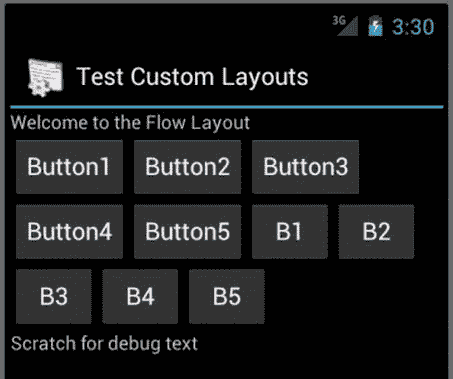
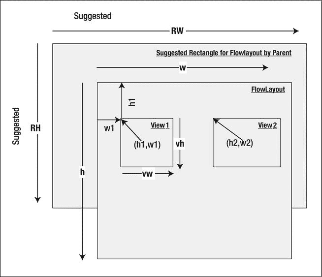

# 三、自定义布局的原则和实践

Abstract

在前两章中，我们介绍了如何创建和使用自定义视图和复合控件。我们现在处于视图定制之旅的第三站:创建和使用定制布局。前三章的内容显然是相关的。该材料依赖于与第一章中所述相同的视图基础架构。然而，每一章都表达了视图架构的不同方面。

在前两章中，我们介绍了如何创建和使用自定义视图和复合控件。我们现在处于视图定制之旅的第三站:创建和使用定制布局。前三章的内容显然是相关的。该材料依赖于与第一章中所述相同的视图基础架构。然而，每一章都表达了视图架构的不同方面。

## 对比自定义布局

让我们花点时间来比较和对比 Android UI 框架中定制控件的三种方法:定制视图、复合控件和定制布局。这种比较有助于我们关注定制布局的特殊材料:从`ViewGroup`开始扩展，测量子视图，布置子视图。

### 自定义视图

当我们设计定制视图时，主要关注的是`onMeasure`()和`onDraw`()。自定义视图没有子视图。所以像`onLayout`()这样的方法并不适用，因为`onLayout`()是给孩子用的。视图的基础`layout`()方法负责这一点。另外，`onMeasure`()非常简单，因为您只处理一个视图。你的注意力主要转移到`onDraw`()以及如何使用画布上。

当然，在这三种方法中，定义和读取定制属性的方式非常相似。因为自定义视图没有子视图，所以布局参数在自定义视图中不起作用，但在自定义布局中起重要作用。在定制视图中，我们还担心使用`BaseSavedState`模式保存视图的状态。总之，在定制视图时，您必须考虑以下事项:

*   扩展`View`
*   覆盖`onMeasure`()
*   覆盖`onDraw`()
*   使用`BaseSavedState`模式保存状态
*   使用自定义属性
*   理解和应用 requestLayout 和 invalidate

相反，在创建自定义视图时，您可以忽略以下细节:

*   覆盖`onLayout`()
*   实施和使用`LayoutParams`

### 复合控件

对于复合控件，主要关注的是如何使用现有的布局，如线性布局和相对布局，来组成具有特定行为的合并组件。

因为我们使用的是现有的布局，所以不需要测量、布局或绘图。我们在复合控件中的主要焦点是使用`BaseSavedState`模式为复合控件本身及其子控件保存视图状态。当然，我们也可以使用自定义属性。所以对于复合控件，你需要担心:

*   扩展现有布局
*   使用`BaseSavedState`模式保存状态
*   控制其子视图的保存状态
*   使用自定义属性

虽然你可以忽略:

*   覆盖`onMeasure`()
*   覆盖`onDraw`()
*   覆盖`onLayout`()
*   担心`requestLayout()`和`invalidate()`
*   实施和使用`LayoutParams`

### 自定义布局

现在，您可以将上述两种方法与实现自定义布局所需的以下步骤进行对比(第三种方法):

Inherit from `ViewGroup`   Override `onMeasure()`   Override `onLayout()`   Implement custom `LayoutParams` with any additional layout attributes   Override layout parameters construction methods in the custom layout class  

我们解释了每一个步骤，并提供了一个带注释的示例代码。首先，我们展示了我们计划编写的自定义布局，作为一个示例来说明所有指示的步骤。

## 规划简单的流程布局

为了记录像线性布局这样的自定义布局的创建，我们使用流布局作为示例。为了演示流布局，我们将一组按钮水平放置，当水平空间用完时，将它们绕到下一行。图 3-1 显示了我们将要设计的流程布局，布置在一个活动中。

图 3-1。

A set of buttons encapsulated in a custom flow layout

在图 3-1 中，整个活动呈线性布局。流布局位于中间，在显示“欢迎使用流布局”的文本视图和底部显示“调试文本暂存”的文本视图之间您可以看到流布局采用了许多大小不同的按钮，并将它们包裹起来。

到本章结束时，你会对如何做好这一点有一个清晰的想法，也将有基础来编写你自己的自定义布局。自定义布局有点棘手，但是对于简化 UI 设计来说很实用。我们在这里的目的是让你拥有自信地使用定制布局所需的一切。

现在你已经有了一个`FlowLayout`的心理图像，我们开始探索实现它所需的每个步骤。

## 从 ViewGroup 类派生

正如在内置的`LinearLayout, FlowLayout`中扩展了`ViewGroup`。清单 3-1 显示了`FlowLayout`如何扩展一个`ViewGroup`。该清单还显示了 a)?? 如何使用构造函数读取其特定的定制属性，以及 b)适当地初始化超类 ??。

清单 3-1。从视图组扩展的 FlowLayout

`public class FlowLayout`

`extends ViewGroup`

`{`

`private int hspace=10;`

`private int vspace=10;`

`public FlowLayout(Context context) {`

`super(context);`

`initialize(context);`

`}`

`public FlowLayout(Context context, AttributeSet attrs, int defStyle) {`

`super(context, attrs, defStyle);`

`TypedArray t = context.obtainStyledAttributes(attrs`，

`R.styleable.FlowLayout, 0, 0);`

`hspace = t.getDimensionPixelSize(R.styleable.FlowLayout_hspace, hspace);`

`vspace = t.getDimensionPixelSize(R.styleable.FlowLayout_vspace, vspace);`

`t.recycle();`

`initialize(context);`

`}`

`public FlowLayout(Context context, AttributeSet attrs) {`

`this(context, attrs, 0);`

`}`

`private void initialize(Context context) {`

`//Do any common initializations you may have`

`//It is empty in our implementation`

`}`

清单 3-1 中的代码很像第一章和第二章中讨论的自定义视图的任何其他扩展:扩展一个基类(`View`，或者一个现有的布局，比如`LinearLayout`，或者这里的`ViewGroup`)。在所有情况下，您都可以拥有自定义属性；我们在`attrs.xml`中定义自定义属性，并在构造函数中读取它们。在`FlowLayout`的情况下，自定义属性是“`hspace`”(水平间距)和“`vspace`”(垂直间距)，用于子视图和换行时的新行。现在让我们看看清单 3-1 中构造函数代码的`attrs.xml`。

### 在 Attrs.xml 中为 FlowLayout 定义自定义属性

清单 3-2 显示了我们自定义的`FlowLayout`的`attrs.xml`。这个文件需要在“`/res/values`”子目录中。

清单 3-2。为 FlowLayout 定义自定义属性

`<resources>`

`<declare-styleable name="``FlowLayout`

`<attr name="hspace" format="dimension"/>`

`<attr name="vspace" format="dimension" />`

`</declare-styleable>`

`<declare-styleable name="``FlowLayout_Layout`

`<attr name="``layout_space`

`</declare-styleable>`

`</resources>`

清单 3-2 中的 styleable `FlowLayout`定义了两个定制属性:`hspace`和`vspace`。可样式化的`FlowLayout_Layout`自定义属性是为需要由`FlowLayout`定义为内部类的`LayoutParams`对象定义的。(我们很快会谈到这一点。)这些后来的定制布局参数代表父布局类存储在每个子视图中，如`FlowLayout`，以允许子视图在必要时覆盖任何父属性。

按照惯例，我们通过布局的名称来调用属于主布局的样式——在本例中是“`FlowLayout.`”同样按照惯例，我们用布局名称后跟“`layout.`来调用属于`LayoutParams`的样式。在清单 3-2 中，这个名称是“`FlowLayout_layout.`”

在本章的后面你会看到这两种类型的属性是如何在布局文件中被赋值的(未来的清单 3-8)。你已经在清单 3-1 中看到了如何读取样式。稍后您将看到如何读取`FlowLayout_layout` styleables(未来的清单 3-5)。

## 使用 onMeasure()

以下是当你使用像`FlowLayout`这样的自定义布局时`onMeasure()`的关键方面。

当您扩展一个`ViewGroup`时，您需要首先度量子元素，并添加这些度量以作为`ViewGroup`的度量返回。在第一章的中，我们说过一个视图有一个名为“`measure`()”的方法，它将被视图的父视图调用，作为父视图的`onMeasure`()的一部分。在`FlowLayout`的情况下，`FlowLayout`是父代。图 3-1 中的按钮是子视图。所以`FlowLayout`需要在它的`onMeasure`()中调用每个子`Button`控件的`measure`()方法。

然而，有一个问题。你会渴望使用`child.measure`()。但是不要。相反，您需要使用`ViewGroup.measureChild()`，然后将这些度量值相加，得到您的总尺寸。这是因为`measureChild`()是一种聪明的方法，它考虑到了`ViewGroup` ( `AT_MOST`、`UNSPECIFIED`、`EXACT`)的测量规格，并在需要时用不同的测量规格适当地询问孩子。如果你调用`child.measure()`，那么你就要自己做这个逻辑。我们在本章末尾包含了源代码`ViewGroup.measureChild()`来帮助你理解这一点。(我们认为在这里包含冗长的代码会分散您对本节主要内容的注意力。)

一旦有了`FlowLayout`的总大小，也就是它所有子元素的总和，就调用预制方法`resolveSize`()来计算出流布局的最终测量大小。让我们进一步解释一下`resolveSize`()吧。假设你有很多孩子。子级的总测量大小可能超过流布局的父级为流布局建议的大小。当流布局的测量规格为`UNSPECIFIED`时，可以返回较大的尺寸。但是如果测量规格是`AT_MOST`，那么您需要返回建议的尺寸，并且不能超过它。测量规格也可以说`EXACT`。在这种情况下，也不能超过建议的精确大小。所有这些逻辑都由内置方法`resolveSize`()处理。该`resolveSize`()考虑了测量规格的变化，并将可能较大的测量尺寸裁剪为与`onMeasure`()的测量规格中指定的尺寸一致的适当尺寸。

一旦这个度量过程完成，您需要在需要定位子视图的地方覆盖`onLayout`()。此练习与测量相同，因为您需要知道每个视图的大小，以便可以一个接一个地放置视图，并在每个视图之间留出足够的垂直和水平空间。那么为什么要测量两次呢？如果您还能在测量过程中记住每个子视图的原点，那么您可以在`onLayout`()中使用该原点和每个视图的维度。要存储每个视图的原点，可以使用 layout parameters 对象，它代表父视图`FlowLayout.`与每个视图一起持有

这就结束了应该如何为`FLowLayout`实现`onMeasure`()的理论。在我们进入`onMeasure`()的实现之前，我们想要呈现一个建议尺寸、流布局的测量尺寸、子尺寸的测量尺寸以及它们如何相互关联的图形表示(图 3-2 )。我们还使用图 3-2 解释测量算法。

图 3-2。

Measuring a compound control: DurationControl

让我们快速浏览一下图 3-2 。值`RW`和`RH`代表“实际宽度”和“实际高度”这是从`FlowLayout`的父节点建议的宽度和高度。我们从传递给`onMeasure`()方法的`measurespec`中接收这些值。当然，`RH`和`RW`只对`AT_MOST`和`EXACT`有效。在`UNSPECIFIED`的情况下，像`FlowLayout`这样的子节点可以返回它的最大值，而不用考虑传入的大小。

在下一级，`w`和`h`是`FlowLayout`的测量宽度和高度，通过结合子视图的测量宽度(`vw` =视图宽度)和测量高度(`vh` =视图高度)来确定。当我们浏览`FlowLayout`的每个子视图时，我们将相应地增加`h`和`w`。

在逻辑上，我们依赖于子视图的来源。在图 3-2 中，我们使用点(`h1,w1`)作为当前视图的原点。然后我们通过计算(`h2,w2`)来计算下一个视图的原点。当我们计算这个(`h2,w2)`)时，我们考虑了水平和垂直方向上有多少可用空间。一旦我们测量了手头的当前视图并记录了它的原点，我们就移动到下一个视图并将(`h2,w2`)设置回(`h1,w1`)作为新的原点，并且重复这个过程直到我们穷尽所有的视图。(清单 3-3 给出了执行这个逻辑的实际源代码。)

在图 3-2 中，当我们浏览每个视图时，不难看出何时增加`w`以及何时增加`h`(当前需要的总宽度和高度)。宽度随着我们向右移动而增加；当我们检测到一个新的行时，高度增加。当前原点宽度(`w1`)与当前子宽度(`VW`)相加，并且加在一起超过了可用的实际宽度(`RW`，这就是一个新行。

给定这个逻辑的图示(图 3-2 ，清单 3-3 展示了我们是如何为`FlowLayout`实现`onMeasure`()的。

清单 3-3。实施 onMeasure()

`//This is very basic`

`//doesn't take into account padding`

`//You can easily modify it to account for padding`

`@Override`

`protected void onMeasure(int widthMeasureSpec, int heightMeasureSpec)`

`{`

`//********************`

`//Initialize`

`//********************`

`int rw = MeasureSpec.getSize(widthMeasureSpec);`

`int rh = MeasureSpec.getSize(heightMeasureSpec);`

`int h = 0; //current height`

`int w = 0; //current width`

`int h1 = 0, w1=0; //Current point to hook the child to`

`//********************`

`//Loop through children`

`//********************`

`int numOfChildren = this.getChildCount();`

`for (int i=0; i < numOfChildren; i++ )`

`{`

`//********************`

`//Front of the loop`

`//********************`

`View child = this.getChildAt(i);`

`this.measureChild(child,widthMeasureSpec, heightMeasureSpec);`

`int vw = child.getMeasuredWidth();`

`int vh = child.getMeasuredHeight();`

`if (w1 + vw > rw)`

`{`

`//new line: max of current width and current width position`

`//when multiple lines are in play w could be maxed out`

`//or in uneven sizes is the max of the right side lines`

`//all lines don't have to have the same width`

`//some may be larger than others`

`w = Math.max(w,w1);`

`//reposition the point on the next line`

`w1 = 0; //start of the line`

`h1 = h1 + vh; //add view height to the current heigh`

`}`

`//********************`

`//Middle of the loop`

`//********************`

`int w2 = 0, h2 = 0; //new point for the next view`

`w2 = w1 + vw;`

`h2 = h1;`

`//latest height: current point + height of the view`

`//however if the previous height is larger use that one`

`h = Math.max(h,h1 + vh);`

`//********************`

`//Save the current origin coords for the view`

`//in its layout`

`//********************`

`LayoutParams lp = (LayoutParams)child.getLayoutParams();`

`lp.x = w1;`

`lp.y = h1;`

`//********************`

`//Restart the loop`

`//********************`

`w1=w2;`

`h1=h2;`

`}`

`//********************`

`//End of for`

`//********************`

`w = Math.max(w1,w);`

`//h = h;`

`setMeasuredDimension(`

`resolveSize(w, widthMeasureSpec)`，

`resolveSize(h,heightMeasureSpec));`

`};`

正如我们在`onMeasure`()的解释中指出的，点(`h1,w1`)代表每个子视图的原点。为了帮助布局阶段，清单 3-3 中的`onMeasure`()代码将这个原点存放在子视图持有的布局参数对象中。一个`ViewGroup`的每个子视图保证有一个`LayoutParams`对象。在这种情况下，像`FlowLayout`这样的自定义布局可以专门化这个基础`LayoutParms`对象，使其具有像原点这样的附加参数。在清单 3-3 中，我们检索这个布局参数对象`LayoutParams`并为该视图设置原点。我们突出显示了清单 3-3 中的代码，以显示视图原点的设置。

同样，为了让清单 3-3 中的逻辑清晰明了，我们没有使用我们在清单 3-2 的`attrs.xml`中定义的间距布局参数。但是您可以使用下面的代码读取这个间距参数，方法是将它放在清单 3-2 的`onMeasure`()方法中的任何地方。参见清单 3-5 中的`FlowLayout.LayoutParams`内部类定义。

`LayoutParams lp = (LayoutParams)child.getLayoutParams();`

`int spacing = lp.spacing;`

`//Adjust your widths based on this spacing.`

在我们继续描述`onLayout`()之前，让我们总结一下关于`onMeasure`()的几个事实:

Each child is measured independently of its siblings in a view group.   You have to alter the `measurespec` passed to the `FlowLayout` before measuring the children. This is evident when you consider `EXACT` coming into `FlowLayout` becomes `AT_MOST` when applied to children; otherwise, each child will take all the space given to the `FlowLayout`. This alteration is done by the `ViewGroup.measureChild()`. So unless you have a reason not to, you should call this method to measure children.   It is perfectly okay to add all the children’s measurements. No need to worry about the total size being too large (exceeding the suggested height or width) because the `resolveSize`(  ) will clip the final reported size for the `FlowLayout`.   `FlowLayout` is not playing favorites and distributing the available space by itself. It relies on well-behaved children to claim space on a first come, first served basis. It is possible that a misbehaving view could take most of the space!   A layout like `FlowLayout` first forms a full picture of all its children in a best-case scenario, and could be larger than what is suggested. It is the `resolveSize`(  ) that cuts its size down as appropriate. So when you are envisioning your layout, imagine its full picture and not a constrained one by the input size.  

现在来说说`onLayout`。

## 实现 onLayout()

在第一章的中，我们介绍了测量通道和布局通道。测量通道用于测量儿童。它不关心每个孩子的安置。相反，这是在布局过程中完成的。布局路径在`onLayout`()方法中定义。

在我们的`FlowLayout's onMeasure`()中，我们已经存储了每个视图的布局原点，`onLayout`()的实现变得非常简单。遍历每个子对象并检索其`LayoutParams`对象。从该对象中，获得`x`和`y`位置。利用这些`x`和`y`的位置和测量出的孩子的宽度和高度，在孩子身上调用`layout`()。这就是你在清单 3-4 中看到的。

清单 3-4。实现 onLayout()

`@Override`

`protected void onLayout(boolean arg0, int arg1, int arg2, int arg3, int arg4)`

`{`

`//Call layout() on children`

`int numOfChildren = this.getChildCount();`

`for (int i=0; i < numOfChildren; i++ )`

`{`

`View child = this.getChildAt(i);`

`LayoutParams lp = (LayoutParams)child.getLayoutParams();`

`child.layout(lp.x`，

`lp.y`，

`lp.x + child.getMeasuredWidth()`，

`lp.y + child.getMeasuredHeight());`

`}`

`}`

## 定义自定义 LayoutParams

正如我们已经指出的，`LayoutParams`是一个对象，它保存了一些特定于像`FlowLayout`这样的布局的参数。它们与`FlowLayout`的其他局部变量分开的原因是这些`LayoutParams`是由子视图创建和保存的。然而，是`FlowLayout`定义了这些是什么，如何阅读它们，以及如何解释它们。

清单 3-5 显示了我们如何为类`FlowLayout`定义布局参数。`LayoutParams`类定义了一个名为`spacing`的变量来表示一个视图相对于它的兄弟视图需要多少间距。这类似于清单 3-1 中的“`hspace`”。不同之处在于:`hspace`定义了所有视图的间距，而`LayoutParams`中的间距特定于每个视图。所以清单 3-5 中的`spacing`有机会覆盖`hspace`的布局级别设置。

清单 3-5。定义自定义 FlowLayout LayoutParams 类

`//*********************************************************`

`//Custom Layout Definition`

`//*********************************************************`

`public static class LayoutParams extends ViewGroup.MarginLayoutParams {`

`public int spacing = -1;`

`public int x =0;`

`public int y =0;`

`public LayoutParams(Context c, AttributeSet attrs) {`

`super(c, attrs);`

`TypedArray a =`

`c.obtainStyledAttributes(attrs, R.styleable.FlowLayout_Layout);`

`spacing = a.getDimensionPixelSize(R.styleable.FlowLayout_Layout_layout_space, 0);`

`a.recycle();`

`}`

`public LayoutParams(int width, int height) {`

`super(width, height);`

`spacing = 0;`

`}`

`public LayoutParams(ViewGroup.LayoutParams p) {`

`super(p);`

`}`

`public LayoutParams(MarginLayoutParams source) {`

`super(source);`

`}`

`}//eof-layout-param`

清单 3-5 展示了如何从 XML 布局文件中读取间距变量。这种方法与我们在第一章和第二章中使用定制属性的方法非常相似:在`attrs.xml`中定义变量名(见清单 3-2)，然后通过构造函数中的类型化属性读取它。

除了布局参数，我们还为`FlowLayout`的`LayoutParams`类分配了一个额外的职责。参见布局参数类上的`x`和`y`公共成员。我们使用这些公共变量在测量过程中存储子视图的原点，并在布局过程中重用它。

### 重写自定义 LayoutParams 构造

子视图，如`Textview`或`Buttonview`，可以嵌入到任何父布局中，如`LinearLayout`或`FlowLayout`。子视图如何知道如何构造和持有与父布局相关的`LayoutParams`对象？这不能硬编码到视图中，因为视图在编译时不知道它的父视图是什么。

为了解决这一困境，Android SDK 在`ViewGroup`(所有布局的父级)上提供了许多需要被覆盖的标准方法。当一个视图被放入一个视图组时，这些标准方法被调用来构造派生的`LayoutParams`并将其关联到视图。清单 3-6 显示了这些构建派生的`FlowLayout.LayoutParams`的`ViewGroup`标准方法。

清单 3-6。覆盖 LayoutParams 创建

`//*********************************************************`

`//Layout Param Support`

`//*********************************************************`

`@Override`

`public LayoutParams generateLayoutParams(AttributeSet attrs) {`

`return new FlowLayout.LayoutParams(getContext(), attrs);`

`}`

`@Override`

`protected LayoutParams generateDefaultLayoutParams() {`

`return new LayoutParams(LayoutParams.WRAP_CONTENT, LayoutParams.WRAP_CONTENT);`

`}`

`@Override`

`protected LayoutParams generateLayoutParams(ViewGroup.LayoutParams p) {`

`return new LayoutParams(p);`

`}`

`// Override to allow type-checking of LayoutParams.`

`@Override`

`protected boolean checkLayoutParams(ViewGroup.LayoutParams p) {`

`return p instanceof FlowLayout.LayoutParams;`

`}`

调用第一个方法来实例化派生布局的布局参数类。如果我们不覆盖它，那么基本视图组将实例化它的实现`MarginLayoutParams`。这个人不会有 x 和 y，也不会读取自定义的"`spacing`"变量。

其余的方法在不同的时间被适当地调用。清单 3-6 是一组标准的方法，可以复制并粘贴到您的自定义 latouts 中，就像我们在这里对`FlowLayout`所做的一样。

## FlowLayout 的源代码

清单 3-7 显示了`FlowLayout;`的全部源代码，在这里你可以看到我们到目前为止在一个地方为定制布局覆盖的所有步骤:(a)扩展视图组，(b)读取定制属性，(c) `onMeasure`()，(d) `onLayout`，(e)实现`FlowLayout.LayoutParams`，以及(f)实现定制布局参数的支持方法。为了能够编译和运行这个文件，你还需要清单 3-2 所示的`attrs.xml`文件，放在`/res/values`子目录中。

清单 3-7。FlowLayout 的完整源代码

`public class FlowLayout`

`extends ViewGroup`

`{`

`private int hspace=10;`

`private int vspace=10;`

`public FlowLayout(Context context) {`

`super(context);`

`initialize(context);`

`}`

`public FlowLayout(Context context, AttributeSet attrs, int defStyle) {`

`super(context, attrs, defStyle);`

`TypedArray t = context.obtainStyledAttributes(attrs`，

`R.styleable.FlowLayout, 0, 0);`

`hspace = t.getDimensionPixelSize(R.styleable.FlowLayout_hspace`，

`hspace);`

`vspace = t.getDimensionPixelSize(R.styleable.FlowLayout_vspace`，

`vspace);`

`t.recycle();`

`initialize(context);`

`}`

`public FlowLayout(Context context, AttributeSet attrs) {`

`this(context, attrs, 0);`

`}`

`private void initialize(Context context) {`

`}`

`//This is very basic`

`//doesn't take into account padding`

`//You can easily modify it to account for padding`

`@Override`

`protected void onMeasure(int widthMeasureSpec, int heightMeasureSpec)`

`{`

`//********************`

`//Initialize`

`//********************`

`int rw = MeasureSpec.getSize(widthMeasureSpec);`

`int rh = MeasureSpec.getSize(heightMeasureSpec);`

`int h = 0; //current height`

`int w = 0; //current width`

`int h1 = 0, w1=0; //Current point to hook the child to`

`//********************`

`//Loop through children`

`//********************`

`int numOfChildren = this.getChildCount();`

`for (int i=0; i < numOfChildren; i++ )`

`{`

`//********************`

`//Front of the loop`

`//********************`

`View child = this.getChildAt(i);`

`this.measureChild(child,widthMeasureSpec, heightMeasureSpec);`

`int vw = child.getMeasuredWidth();`

`int vh = child.getMeasuredHeight();`

`if (w1 + vw > rw)`

`{`

`//new line: max of current width and current width position`

`//when multiple lines are in play w could be maxed out`

`//or in uneven sizes is the max of the right side lines`

`//all lines don't have to have the same width`

`//some may be larger than others`

`w = Math.max(w,w1);`

`//reposition the point on the next line`

`w1 = 0; //start of the line`

`h1 = h1 + vh; //add view height to the current height`

`}`

`//********************`

`//Middle of the loop`

`//********************`

`int w2 = 0, h2 = 0; //new point for the next view`

`w2 = w1 + vw;`

`h2 = h1;`

`//latest height: current point + height of the view`

`//however if the previous height is larger use that one`

`h = Math.max(h,h1 + vh);`

`//********************`

`//Save the current coords for the view`

`//in its layout`

`//********************`

`LayoutParams lp = (LayoutParams)child.getLayoutParams();`

`lp.x = w1;`

`lp.y = h1;`

`//********************`

`//Restart the loop`

`//********************`

`w1=w2;`

`h1=h2;`

`}`

`//********************`

`//End of for`

`//********************`

`w = Math.max(w1,w);`

`//h = h;`

`setMeasuredDimension(`

`resolveSize(w, widthMeasureSpec)`，

`resolveSize(h,heightMeasureSpec));`

`};`

`@Override`

`protected void onLayout(boolean arg0, int arg1, int arg2, int arg3, int arg4)`

`{`

`//Call layout() on children`

`int numOfChildren = this.getChildCount();`

`for (int i=0; i < numOfChildren; i++ )`

`{`

`View child = this.getChildAt(i);`

`LayoutParams lp = (LayoutParams)child.getLayoutParams();`

`child.layout(lp.x`，

`lp.y`，

`lp.x + child.getMeasuredWidth()`，

`lp.y + child.getMeasuredHeight());`

`}`

`}`

`//*********************************************************`

`//Layout Param Support`

`//*********************************************************`

`@Override`

`public LayoutParams generateLayoutParams(AttributeSet attrs) {`

`return new FlowLayout.LayoutParams(getContext(), attrs);`

`}`

`@Override`

`protected LayoutParams generateDefaultLayoutParams() {`

`return new LayoutParams(LayoutParams.WRAP_CONTENT, LayoutParams.WRAP_CONTENT);`

`}`

`@Override`

`protected LayoutParams generateLayoutParams(ViewGroup.LayoutParams p) {`

`return new LayoutParams(p);`

`}`

`// Override to allow type-checking of LayoutParams.`

`@Override`

`protected boolean checkLayoutParams(ViewGroup.LayoutParams p) {`

`return p instanceof FlowLayout.LayoutParams;`

`}`

`//*********************************************************`

`//Custom Layout Definition`

`//*********************************************************`

`public static class LayoutParams extends ViewGroup.MarginLayoutParams {`

`public int spacing = -1;`

`public int x =0;`

`public int y =0;`

`public LayoutParams(Context c, AttributeSet attrs) {`

`super(c, attrs);`

`TypedArray a =`

`c.obtainStyledAttributes(attrs, R.styleable.FlowLayout_Layout);`

`spacing = a.getDimensionPixelSize(R.styleable.FlowLayout_Layout_layout_space, 0);`

`a.recycle();`

`}`

`public LayoutParams(int width, int height) {`

`super(width, height);`

`spacing = 0;`

`}`

`public LayoutParams(ViewGroup.LayoutParams p) {`

`super(p);`

`}`

`public LayoutParams(MarginLayoutParams source) {`

`super(source);`

`}`

`}//eof-layout-params`

`}// eof-class`

### 运行中的流程布局

你现在可能急于学习如何在活动布局文件中使用`FlowLayout`来查看如图 1-1 所示的视图。下面是清单 3-8 中产生图 1-1 的布局文件:

清单 3-8。为活动使用流程布局

`<?xml version="1.0" encoding="utf-8"?>`

`<LinearLayout xmlns:android="`[`http://schemas.android.com/apk/res/android`](http://schemas.android.com/apk/res/android)

`xmlns:cl="`[`http://schemas.android.com/apk/res/com.androidbook.customLayouts`](http://schemas.android.com/apk/res/com.androidbook.customLayouts)

`android:orientation="vertical"`

`android:layout_width="fill_parent"`

`android:layout_height="match_parent"`

`>`

`<TextView`

`android:id="@+id/text2"`

`android:layout_width="fill_parent"`

`android:layout_height="wrap_content"`

`android:text="Welcome to the Compound Controls"`

`/>`

`<com.androidbook.customLayouts.FlowLayout`

`android:id="@+id/durationControlId"`

`android:layout_width="fill_parent"`

`android:layout_height="wrap_content"`

`cl:hspace="10dp"`

`cl:vspace="10dp">`

`<Button android:text="Button1"`

`android:layout_width="wrap_content"`

`android:layout_height="wrap_content"`

`cl:layout_space="20dp"`

`/>`

`<Button android:text="Button2"`

`android:layout_width="wrap_content"`

`android:layout_height="wrap_content"`

`/>`

`<Button android:text="Button3"`

`android:layout_width="wrap_content"`

`android:layout_height="wrap_content"`

`/>`

`<Button android:text="Button4"`

`android:layout_width="wrap_content"`

`android:layout_height="wrap_content"`

`/>`

`<Button android:text="Button5"`

`android:layout_width="wrap_content"`

`android:layout_height="wrap_content"`

`/>`

`<Button android:text="B1"`

`android:layout_width="wrap_content"`

`android:layout_height="wrap_content"`

`/>`

`<Button android:text="B2"`

`android:layout_width="wrap_content"`

`android:layout_height="wrap_content"`

`/>`

`<Button android:text="B3"`

`android:layout_width="wrap_content"`

`android:layout_height="wrap_content"`

`/>`

`<Button android:text="B4"`

`android:layout_width="wrap_content"`

`android:layout_height="wrap_content"`

`/>`

`<Button android:text="B5"`

`android:layout_width="wrap_content"`

`android:layout_height="wrap_content"`

`/>`

`</com.androidbook.customLayouts.FlowLayout>`

`<TextView`

`android:id="@+id/text1"`

`android:layout_width="fill_parent"`

`android:layout_height="wrap_content"`

`android:text="Scratch for debug text"`

`/>`

`</LinearLayout>`

请特别注意我们是如何使用我们自己的定制名称空间“`cl`”(定制布局)来指示定制属性的。

### 了解 ViewGroup.getChildMeasureSpec

在覆盖`onMeasure`()时，我们已经表示使用`ViewGroup.measureChild()`，不直接使用`child.measure()`。当您看到清单 3-9 中的`ViewGroup.getChildMeasureSpec()`(由`ViewGroup.measureChild()`触发)的实现时，这变得非常清楚。清单 3-9 中的代码直接取自 Android 源代码中的`ViewGroup`类。

清单 3-9 中需要注意的关键是如何更仔细地查看`FlowLayout'` s(或`ViewGroup'` s)度量规格，并且如果必要的话，将不同的度量规格传递给孩子以测量孩子的尺寸。

清单 3-9。找出正确的子度量规格

`public static int getChildMeasureSpec(int spec, int padding, int childDimension)`

`{`

`int specMode = MeasureSpec.getMode(spec);`

`int specSize = MeasureSpec.getSize(spec);`

`int size = Math.max(0, specSize - padding);`

`int resultSize = 0;`

`int resultMode = 0;`

`switch (specMode) {`

`// Parent has imposed an exact size on us`

`case MeasureSpec.EXACTLY:`

`if (childDimension >= 0) {`

`resultSize = childDimension;`

`resultMode = MeasureSpec.EXACTLY;`

`} else if (childDimension == LayoutParams.MATCH_PARENT) {`

`// Child wants to be our size. So be it.`

`resultSize = size;`

`resultMode = MeasureSpec.EXACTLY;`

`} else if (childDimension == LayoutParams.WRAP_CONTENT) {`

`// Child wants to determine its own size. It can't be`

`// bigger than us.`

`resultSize = size;`

`resultMode = MeasureSpec.AT_MOST;`

`}`

`break;`

`// Parent has imposed a maximum size on us`

`case MeasureSpec.AT_MOST:`

`if (childDimension >= 0) {`

`// Child wants a specific size... so be it`

`resultSize = childDimension;`

`resultMode = MeasureSpec.EXACTLY;`

`} else if (childDimension == LayoutParams.MATCH_PARENT) {`

`// Child wants to be our size, but our size is not fixed.`

`// Constrain child to not be bigger than us.`

`resultSize = size;`

`resultMode = MeasureSpec.AT_MOST;`

`} else if (childDimension == LayoutParams.WRAP_CONTENT) {`

`// Child wants to determine its own size. It can't be`

`// bigger than us.`

`resultSize = size;`

`resultMode = MeasureSpec.AT_MOST;`

`}`

`break;`

`// Parent asked to see how big we want to be`

`case MeasureSpec.UNSPECIFIED:`

`if (childDimension >= 0) {`

`// Child wants a specific size... let him have it`

`resultSize = childDimension;`

`resultMode = MeasureSpec.EXACTLY;`

`} else if (childDimension == LayoutParams.MATCH_PARENT) {`

`// Child wants to be our size... find out how big it should`

`// be`

`resultSize = 0;`

`resultMode = MeasureSpec.UNSPECIFIED;`

`} else if (childDimension == LayoutParams.WRAP_CONTENT) {`

`// Child wants to determine its own size.... find out how`

`// big it should be`

`resultSize = 0;`

`resultMode = MeasureSpec.UNSPECIFIED;`

`}`

`break;`

`}`

`return MeasureSpec.makeMeasureSpec(resultSize, resultMode);`

`}`

## 参考

第一章和第二章中列出的大部分参考资料对本章也是有效的。因此，我们在这里只添加了几个本章特有的参考文献。

*   我们研究日志上的复合成分: [`http://androidbook.com/item/4349`](http://androidbook.com/item/4349)
*   本章完整代码片段: [`http://androidbook.com/item/4359`](http://androidbook.com/item/4359)
*   自定义版面上的罗曼盖伊: [`http://www.parleys.com/#st=5&id=2191&sl=3`](http://www.parleys.com/)
*   关于自定义组件的 Android SDK 文档，包括自定义布局: [`http://developer.android.com/guide/topics/ui/custom-components.html`](http://developer.android.com/guide/topics/ui/custom-components.html)
*   下载本章专用的测试项目: [`www.androidbook.com/expertandroid/projects`](http://www.androidbook.com/expertandroid/projects) 。ZIP 文件的名称是`ExpertAndroid_ch03_CustomLayouts.zip`。

## 摘要

在第一章中，我们展示了视图的基本架构，以及如何定制一个开放式视图对象和如何直接使用画布。在《??》第二章中，我们谈到了通过扩展现有布局来构建用户级控件。在本章中，我们介绍了如何通过直接扩展视图组来创建自定义布局。在这三种方法中，我们认为您最有机会使用自定义布局。例如，流布局的需求是必不可少的，但它不在原生 SDK 中。举个例子，我们正在做一个文字游戏，我们需要把单词的字母排列成一个流动的布局。在同一个游戏中，我们希望将一组菜单图标呈现为一个旋转的表格。你可以在 Google Play 中看到这个名为解读专家的游戏。或者，您可能想要创建一个图像滚轴平台，如相册。这些都是自定义布局的例子。考虑到这一点，我们在这里详细介绍了`onMeasure`()和`onLayout`()以便帮助您进行自定义布局。

## 复习问题

以下一组详细的问题应该可以巩固您在本章中学到的内容:

What classes do you extend to create custom layouts?   Can you use custom attributes for the custom layout?   What are `LayoutParams`?   Who implements the `LayoutParams` class?   Who has methods to construct a `LayoutParams` class?   Why do views hold `LayoutParams` on behalf of a parent layout?   Why should you use `resolveSize`(  )?   Why should you use `ViewGroup.measureChild()` and not `child.measure()`?   What would be wrong if a layout passes its measure spec as is to each of its children?   What happens if the total measured size of the children exceeds the suggested size of the parent layout?   How do you define and read layout parameters from `attrs.xml`?