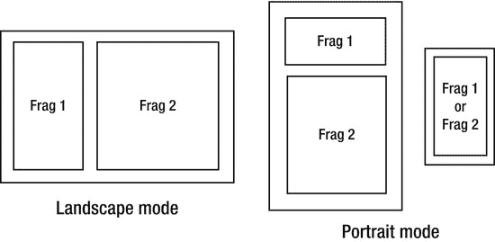

# 五、多设备编程

Abstract

Android 的一个奇妙之处是有如此多的设备运行它。从手机到平板电脑，从电视到相机到跑步机，Android 作为各种电子设备的软件平台非常受欢迎。这对应用开发人员来说也是一个巨大的挑战。设备之间的差异可能很多，从不同尺寸的屏幕到不同的屏幕密度，从不同的硬件功能到不同版本的 Android。优雅地处理所有这些差异是可能的，而且可能比你想象的更容易。

Android 的一个奇妙之处是有如此多的设备运行它。从手机到平板电脑，从电视到相机到跑步机，Android 作为各种电子设备的软件平台非常受欢迎。这对应用开发人员来说也是一个巨大的挑战。设备之间的差异可能很多，从不同尺寸的屏幕到不同的屏幕密度，从不同的硬件功能到不同版本的 Android。优雅地处理所有这些差异是可能的，而且可能比你想象的更容易。

随着 Android 的发展，开发人员也有了更多的选择。本章将探讨设备差异以及如何处理它们，这样一个应用就可以在你想要的任意多的设备上运行。

## 不同的屏幕密度

你需要完全理解的第一个概念是屏幕密度。在这个领域有很多术语，也有一些常见的误解。首先，表 5-1 列出了一些术语及其真实含义。

表 5-1。

Density Terms and Their Meanings

<colgroup><col> <col> <col></colgroup> 
| 学期 | 定义 | 意义 |
| --- | --- | --- |
| 像素 | 图像中的一个颜色点 | 像素可以是屏幕上的实体，也可以是构成数字图像的点(在文件中或内存中) |
| 像素 | Android 屏幕像素 | 视频屏幕上显示颜色的微小物理点。你也可以称之为绝对像素。术语 px 在 Android 中与维度一起使用。 |
| 像素 | 每英寸像素 | 每英寸显示器的实际物理显示像素数 |
| （灰）点/英寸 （扫描仪的清晰度参数） | 每英寸点数 | DPI 最初是一个打印概念，但有时也用于描述视频显示。然而，视频像素通常由多种颜色的点组成，因此 DPI 在视频显示方面会令人困惑。避免使用这个术语。 |
| 数据处理 | 密度无关像素 | 最好称之为虚拟像素，因为它不存在于现实世界中。但 Android 使用这些作为应用中图形对象的测量单位。一个 dp 大约相当于一个 160 PPI 的像素。 |
| Sp | 与比例无关的像素 | 非常类似于 dp，但仅用于字体。 |

### 关于像素的一切

屏幕是物理对象，其表面由物理像素组成。像素的产生方式会因屏幕技术的不同而不同；例如，一些使用不同颜色的多个点来产生一个像素。当一个屏幕的 1 英寸表面上有很多像素时，我们说像素密度高。确切的数值是屏幕的 PPI。例如，谷歌 Nexus 10 平板电脑的 PPI 为 300。这意味着 1 英寸是 300 像素宽。换句话说，谷歌 Nexus 10 像素是 1/300 英寸宽。最初的摩托罗拉 Xoom 平板电脑的 PPI 为 149，即每英寸 149 个物理像素。然而，这两款平板电脑的整体物理尺寸大致相同。Nexus 10 的像素密度(PPI)高于 Xoom。这意味着 Nexus 10 可以在 1 英寸见方的屏幕上显示比 Xoom 更多的细节。

Note

一个常见的误解是大屏幕具有更高的屏幕密度(PPI)。这是完全不正确的，谷歌 Nexus 10 和摩托罗拉 Xoom 平板电脑的比较就说明了这一点。

位图、图标、字形等图形图像也是由像素组成的，但是是按颜色的行和列排列的。行数代表图像的高度，列数代表宽度。但是图像的尺寸不是用英寸来表示的；它们的尺寸只是宽度和高度。

如果您决定将 96x96 位图图形 1 图像像素对 1 屏幕像素映射到 Nexus 10 平板电脑的屏幕上，它将占用 96 屏幕像素的宽度和 96 屏幕像素的高度，或者大约 0.32 英寸乘 0.32 英寸的屏幕。同样的位图以同样的方式显示在 Xoom 平板电脑上，每个维度也将占用 96 个像素，但那将是 0.64 英寸乘 0.64 英寸。这似乎不是一个很大的区别(每边只多 0.32 英寸)，但它是。Xoom 上的位图看起来要大四倍！这是一个问题，因为您希望在总体大小相同的设备上保持应用外观的一致性。

### 将视图映射到密度

无论平板电脑的制造商是谁，平板电脑应用中的按钮看起来都应该差不多。如果您为 Xoom 创建的图形文件版本的大小是 96x96 图像的四分之一(即 48x48)，那么它在 Xoom 上显示时的大小将与在 Nexus 10 上显示的 96x96 相同。或者，如果有人动态地将图形缩放到 Xoom 的四分之一大小，那也是可行的。坚持这样的想法，因为你稍后会回到这个问题上。

然而事情变得更加复杂，因为真实的屏幕有许多不同的 PPI 值。Android 团队不希望开发人员不得不处理将图形转换成每一种密度大小的数学问题，以便它在不同的屏幕密度上看起来都正确。为所有可用设备上的每个 PPI 创建唯一的图形文件也没有意义。因此，他们决定了四个密度大小的桶，称为 ldpi、mdpi、hdpi 和 xhdpi(代表低、中、高和超高)，它们分别对应于 120、160、240 和 320 的 PPI。设备制造商选择他们的设备属于哪个类别，然后为该设备配置 Android，告诉应用它是这些 dpi 值之一。

设备的真实 PPI 可能与规定的密度大小(即桶大小)不同，但这没关系。在上面提到的两个片剂中，没有一个与这些值中的一个完全相同。Xoom 被归类为 mdpi 设备，因为 149 最接近 160。谷歌 Nexus 10 平板电脑被归类为 xhdpi 设备，因为 300 最接近 320。作为开发者，你不需要知道或者关心设备的实际 PPI 您将只处理设备的屏幕密度-大小桶 PPI 值。

上面提到的可能解决方案——缩放图形以适应设备的实际 PPI，并为不同的屏幕密度创建多个版本的图形——都适用于 Android。制造商处理规定的屏幕密度和设备的真实 PPI 之间的调整，开发人员负责创建每个图形文件的版本，每个版本对应应用支持的每个密度大小的存储桶。这意味着在为应用创建图形文件时，您只需担心四个 PPI 值。事实上，如果你愿意，Android 甚至可以处理桶之间的缩放。

### 密度比例因子

事实证明，桶大小之间的比例因子是很好的简单值。如果我们说 mdpi 是 1.0，那么 ldpi 是那个的 0.75，hdpi 是那个的 1.5，xhdpi 是那个的 2.0。如果您希望 200x200 的图形在不同的设备上以相同的大小呈现给用户，那么您可以为 ldpi 设备制作 75x75 的版本，为 mdpi 制作 100x100 的版本，为 hdpi 制作 150x150 的版本，为 xhdpi 制作 200x200 的版本。最佳实践是以尽可能高的密度创建您的原创作品，或者更好的是，使用矢量图形包，然后从那里为 Android 密度桶生成图形。这样做的原因是，你想要尽可能多的细节。从较小的尺寸开始并将图形放大到较大的尺寸会导致像素化或块化，即在图像中看到块而不是平滑曲线和渐变的效果。

另一种方法是只为 mdpi 提供一个 100x100 的文件，Android 会相应地为其他密度进行缩放。但是，如果您选择这种方法，从 mdpi 自动缩放到 xhdpi 的图形可能看起来不像您希望的那样清晰。

从技术上讲，还有另一个非常高端的密度:xxhdpi。这对应于大约 480 PPI 的密度和 3.0 的比例因子。谷歌表示，不要担心提供这种密度的图形文件，但随着市场上出现这种密度的设备，如果这会影响到你，不要感到惊讶。您可能需要提供额外的图形文件，这将增加应用的整体大小，并可能对性能和应用限制产生其他影响。

Android 团队定义了另一个屏幕密度-尺寸桶，那就是 tvdpi。它的可比 PPI 约为 213，位于 mdpi 和 hdpi 之间，旨在用于谷歌电视应用。建议不要担心智能手机或平板电脑应用的密度。但是，如果您确实想创建这种密度的图形，您可以为 mdpi 创建 100x100 的图形，并为 tvdpi 创建 133x133 的版本。

### 资源目录

在 Android 应用的应用文件中，ldpi、mdpi、hdpi、xhdpi 和 xxhdpi 的图形文件(也称为 drawables)有单独的目录。例如，ldpi 可绘制文件位于 res 目录下的 drawable-ldpi 目录中。基于运行应用的设备的屏幕密度设置(即 ldpi、mdpi、hdpi、xhdpi 或 xxhdpi)，Android 将从适当的目录中选择适当的图形文件。如果 Android 无法在设备的屏幕密度大小桶的相应资源目录中找到命名的 drawable，它将在默认的 drawable 目录(/res/drawable)中查找 drawable 文件，或者从另一个 drawable 目录中选择一个并适当地缩放它。Android 通过选择在缩放时产生最佳结果的目录来决定其他可绘制目录的最佳选择。

如果你创建一个新的 Android 项目并查看初始的 drawable 目录，你应该会看到名为 ic_launcher.png 的默认图标文件(或者类似的文件)。请注意，每个目录中的文件名都是相同的。这很重要；您将使用文件名在布局文件中指定图像，因此不同密度的文件名必须相同——否则 Android 将无法找到它。如前所述，您实际上不需要为每个目录提供每个图形文件。Android 将选择一个，并根据运行该应用的设备的需要进行缩放。

### 使用 dp 指定尺寸

您已经了解到，不同的屏幕密度被简化为五个密度大小的桶，开发人员应该为属于这些桶的设备提供不同版本的图形文件。但是，Android 应用的 UI 中的图形元素的规范是怎样的呢？Android 如何知道使用哪个图形？你如何简单地设计一个用户界面？

这就是密度无关像素发挥作用的地方。使用缩写“dp”，您应该使用与密度无关的像素大小来指定图形元素的大小。与密度无关的像素大约相当于 160 PPI 屏幕上物理像素的大小。通过使用“dp”指定可绘制的大小，Android 将确定用于在运行应用的设备上绘制可绘制内容的实际物理像素数量。如果该设备被分类为 mdpi 设备，所使用的物理像素的数量将与 dps 的数量大致相同。如果设备是 xhdpi，那么使用的物理像素数将是 dps 的两倍。这意味着图形在任一设备上的尺寸将大致相同，并且布局指令将使用相同数量的 DP。例如，如果您在 UI 中用以下命令指定一个`ImageView`:

`android:layout_width="96dp"   android:layout_height="96dp"`

那么当在 mdpi 屏幕上并使用 mdpi 可绘制文件时，图像将是大约 96×96 像素。它在 ldpi 屏幕上将是 72x72 像素并使用 ldpi 可绘制文件，在 hdpi 屏幕上将是 144x144 像素并使用 hdpi 可绘制文件，在 xhdpi 屏幕上将是 192x192 像素并使用 xhdpi 可绘制文件。即 72 是 96 的 0.75 倍；144 是 96 的 1.5 倍；192 是 96 的 2 倍。

一个真正是 216 PPI 的设备，如谷歌 Nexus 7 平板电脑，很可能在 hdpi (240 PPI)桶中，Nexus 7 也是如此。在幕后，调整正在发生。如果你的应用为一个正方形图形指定了 480x480dp，那将计算出每边大约 3 英寸的距离。(请记住，dp 大约相当于 160 PPI 像素，每英寸 480 除以 160 像素等于 3。)在谷歌 Nexus 7 的情况下，图形不会是每边 2 英寸(480 除以 240)，也不会是每边 2.222 英寸(480 除以 216)。Android 正在进行调整，以便图形每边 3 英寸，或每边约 648 个谷歌 Nexus 7 像素。然而，由于这里正在进行调整，图形也可能不是每边 3 英寸。如果你认为一个图形会以一个绝对尺寸出现在屏幕上，实际上可能会有一点不同。

关于 Android 的另一个误解是，你可以确定屏幕的实际 PPI。不幸的是，(到目前为止)还没有可靠的 API 调用返回这些信息。文档中说要使用`DisplayMetrics`(详见本章末尾的参考文献)和属性`xdpi`和`ydpi`。然而，在某些情况下，检索到的数据甚至与事实不符。不要试图在 Android 屏幕上绘制东西，因为你需要绘制的图像具有精确的尺寸——除非你将你的应用绑定到一个设备上，在这个设备上你确切地知道你在屏幕上处理什么，以及如何进行缩放和调整。但这严重限制了你的应用。

## 不同的屏幕尺寸

您的应用很可能会根据显示它的屏幕的整体大小进行不同的布局，而不考虑屏幕的实际物理像素分辨率。如果你的目标是 10 英寸的平板电脑，你几乎肯定会有相同的按钮、标签、输入栏、图像等排列。，平板电脑是低密度(ldpi)还是超高密度(xhdpi)并不重要。密度将影响哪个图形图像文件用于屏幕上的`ImageView`,但不影响它对用户显示的大小或它在屏幕上的位置。

### 筛网尺寸桶

值得重申的是，设备的屏幕尺寸与其屏幕密度并不对应。屏幕密度与要在屏幕上显示的图形文件的外观以及显示细节的能力密切相关，但是很有可能大屏幕密度低，小屏幕密度高。表 5-2 显示了截至 2013 年 5 月 1 日的已知设备组合，包括其尺寸和密度。

表 5-2。

Known Device Sizes and Densities (as of May 1, 2013)

<colgroup><col> <col> <col> <col> <col> <col> <col></colgroup> 
|   | ldpi(消歧义) | mdpi(mdpi) | tvdpi | hdpi | xhdpi | xxhdpi |
| --- | --- | --- | --- | --- | --- | --- |
| 小的 | 9.8% |   |   |   |   |   |
| 标准 | 0.1% | 16.1% |   | 37.3% | 24.9% | 1.3% |
| 大的 | 0.6% | 2.9% | 1.0% | 0.4% | 0.7% |   |
| 品牌介绍 | 0.2% | 4.5% |   | 0.1% | 0.1% |   |

正如你在表 5-2 中看到的，一些设备似乎确实证明了尺寸和密度是相辅相成的，一些小屏幕是 ldpi，一些超大屏幕是 xhdpi。但是绝大多数平板(大屏和超大屏)是 mdpi 密度，绝大多数手机(普通屏)是 hdpi 或 xhdpi 密度。这再次证明了屏幕尺寸与屏幕密度无关。

屏幕尺寸与你一次能向用户显示多少内容有关。屏幕越大，可以显示的内容就越多。这里，制造商又制造了许多屏幕尺寸可供选择，对于一个应用来说，单独处理每一个可能的精确屏幕尺寸几乎是不可能的。因此，Android 团队选择了四个屏幕大小的桶进行选择:小、普通、大和 xlarge。前两种一般是手机，后两种一般是平板。大尺寸最初是为 7 英寸平板电脑设计的，而 xlarge 是为 10 英寸平板电脑设计的。

事实证明，电视属于大型类别，尽管它们明显大于 10 英寸。其原因是电视是从远处观看的，因此屏幕上的对象必须占据更多的物理像素才能被正确地看到。如果电视被视为超大，则项目可能太小，观众无法阅读。当然，有些电视很大，所以这些桶不一定是找出如何布置屏幕的最佳方式。你很快就会发现还有另一种方法。

### 重访布局

布局通常是你在应用的用户界面中指定一切的方式。它们表示为 XML 文件，包含按钮、标签、输入字段、图像、片段和其他用户界面对象的标签。这些视图对象排列在布局标记内。

如果显示器是平板电脑，常见的布局模式是主/细节，其中屏幕一侧的列表允许用户进行选择，并且关于该选择的详细信息可以同时出现在屏幕另一侧。许多电子邮件应用在平板电脑上就是这样工作的。但是在较小的屏幕上，比如手机，没有足够的空间来同时显示列表和细节。因此，列表是单独显示的，如果用户单击列表中的某个项目，就会在列表活动的顶部显示一个详细活动。然后，用户按 Back 键返回到项目列表。见图 5-1 。

图 5-1。

Tablet vs. phone screen layout

在图 5-1 中，左边和中间的布局代表了上面有碎片的平板电脑。右边的布局代表智能手机屏幕，从本质上来说，它更小。智能手机使用片段，但一次只能看到一个片段。想象一下，如果你愿意，这是所有三个设备上的相同应用。平板电脑横向模式的布局不同于平板电脑纵向模式的布局，智能手机纵向模式的布局也不同。从功能的角度来看，Frag 中的列表会发生什么。1 对三者都是一样的。也就是说，适配器会将数据拉进一个列表，并在右边显示一个滚动条。当用户点击列表中的一个条目时，列表条目的详细信息将显示在 Frag 中。2(可能与片段中的列表同时可见，也可能不可见。1).你想尽可能多地重复使用碎片。1，以及背后的代码，同时因为设备不同而容纳不同的布局。现在让我们来看看如何管理不同设备的不同布局。

### 使用布局处理屏幕尺寸

应用活动的布局将根据屏幕大小而有所不同。根据设备是处于横向模式还是纵向模式，它们也会有所不同。当你的应用显示用户界面时，Android 会根据设备的屏幕大小和创建活动时设备的方向找到合适的布局。布局文件中包含布局和控件定义。

和以前/res 下不同的目录用于不同密度的图形文件一样，Android 在/res 下有不同的目录用于不同的布局。在这种情况下，可以有很多不同的目录。不仅可以有不同的大小和方向布局(最常见的)，还可以根据国家、语言、夜间模式和许多其他条件有不同的布局。当 Android 需要定位一个命名的布局资源文件时，它会根据可用的同名布局资源文件选择最佳的一个，然后使用布局目录名称上的其他限定符来与设备的属性和当前配置进行比较。

指定布局目录的最简单方法如下:

`/res/layout-normal-land`

这代表正常尺寸屏幕上的横向布局。您可以为小、大、超大屏幕以及端口(纵向)模式创建替代布局目录。您将在您的应用项目中找到一个默认的`/res/layout`目录；如果 Android 找不到更好的东西可以使用，它就会去那里寻找。您也可以将布局文件存储在默认目录中，以包含在其他目录中的其他布局文件中。这允许您创建部分布局，并在应用中的任何地方使用它们，而只需维护它们一次。

你不应该根据设备的屏幕密度(PPI)创建布局目录。对于布局，你真的不关心密度是多少。你确实关心你要处理多少屏幕空间。在这里，Android 更喜欢使用密度独立像素(dp)规格的屏幕尺寸。屏幕尺寸(通常以英寸表示)不如 dps 中的屏幕尺寸重要。表 5-3 显示了不同筛网尺寸的铲斗与 dp 尺寸的关系。

表 5-3。

Screen-size bucket specs in dps

<colgroup><col> <col></colgroup> 
| 屏幕大小的存储桶名称 | 至少应该是这样(以 dp 表示) |
| --- | --- |
| 小的 | 426 x 320 |
| 标准 | 470 x 320 |
| 大的 | 640 x 480 |
| 品牌介绍 | 960 x 720 |

屏幕尺寸用高度和宽度表示，其中高度大于宽度。这与设备的正常使用方式无关(即，横向模式还是纵向模式)。现在我们可以介绍指定布局目录的另一种方法。

Android 团队发现屏幕大小的桶是不够的。从 Android 3.2 开始，他们根据 dp 宽度和 dp 高度为布局资源目录添加了一些额外的限定符。由于大多数用户界面会垂直滚动，对用户来说很自然，所以很少看到布局资源目录使用高度限定符。所以，宽度是你会最感兴趣的限定词。这里，Android 团队有两个选项:最小宽度和当前宽度。最小宽度是一个系统值，表示屏幕尺寸的两个维度中较短的一个，与设备的方向无关。当前宽度是器件在当前方向上的宽度。布局资源目录名中的限定符将分别是`–sw<N>dp`或`–w<N>dp`，其中`<N>`是您想要指定的宽度的最小尺寸。例如，使用`/res/layout-sw600dp`或`/res/layout–w720dp`指定 600 个或更多密度无关像素的最短宽度，或 720 dp 或更多的当前宽度。

您的应用中可能有多个带有`–w<N>dp`限定符的布局目录，根据设备的方向选择最大的一个。例如，如果你的应用运行在一个 10 英寸的平板电脑上，并且你有一个`–w600dp`和一个`–w1000dp`布局资源目录，当 10 英寸的平板电脑处于纵向模式时，将选择`–w600dp`布局；当平板电脑处于横向模式时，将选择`–w1000dp`布局。

如果使用`–sw<N>dp`限定符，情况就不一样了。该器件的最小宽度为<n>或更大，或者没有。布局文件选择不会因方向而改变。因此，如果您正在使用</n> `–sw<N>dp`限定符，并且您想要不同的纵向和横向布局，您需要添加`–land`和/或`–port`作为另一个限定符，以便为您的应用选择预期的布局文件。

根据你运行的 ADT 版本的不同，当你创建一个新的 Android 项目时，Google 可能会默认提供`/res/values–sw600dp`和`/res/values–sw720dp-land`资源目录。但是，对于布局，默认只是默认的布局资源目录。查看默认的布局 XML 文件，您会发现一些边距规格，这些规格引用存储在这些默认值资源目录下的维度。尺寸文件名为 dimens.xml。在这些文件中，你会发现`<dimen>`标签覆盖了布局 xml 文件中的尺寸。这是另一种针对不同设备和方向定制布局的技术，无需创建大量不同的布局 XML 文件。在运行时，布局的值将基于设备的当前配置来自不同的值资源文件。

## 屏幕之外的不同限定符

我们已经讨论了与可绘制性和布局有关的限定符，但是 Android 还有许多其他限定符，您可以利用它们在您的应用中提供最佳的用户体验。虽然有许多限定词与键和键盘、夜晚与白天等等有关，但让我们简要地讨论一下语言。您可能不认为语言会对您的布局产生影响，但是您可能还没有见过按钮和标签被翻译成另一种语言的用户界面。填满按钮、占据标签空间的翻译单词可以极大地改变用户界面的外观。按钮可以更宽或更窄；标签也是如此。这可能会迫使您为其他语言创建替代布局。

## 不同的硬件特性

Android 设备可以有许多不同的硬件功能。一些设备具有陀螺仪、GPS、光传感器、磁力计、相机、蓝牙等，而其他设备几乎没有附加的硬件功能。因为把你的应用安装到一个没有你的应用正常运行所需硬件的设备上是没有意义的，所以 Android 提供了一种机制，让你可以声明你的应用需要什么硬件。通过这种方式，Google Play 将从没有该硬件的设备上的用户那里过滤掉您的应用。例如，如果您的应用需要前置摄像头，则使用没有前置摄像头的设备的用户将无法在 Google Play 中看到您的应用。

### 使用<uses-feature>标签</uses-feature>

应用的`AndroidManifest.xml`文件应该包含应用使用的每个硬件特性的`<uses-feature>`标签。标签的语法如下:

`<uses-feature android:name="name.of.feature" android:required="true" android:glEsVersion="#" />`

其中`name.of.feature`将被替换为特性的适当字符串名称，例如`android.hardware.camera.front`。这个标签应该在`<manifest>`里面，在`<application>`之前。必需的属性可以是 true 或 false，因此可以指定您的应用可以使用一个硬件特性(如果它存在的话),但这不是必需的。如果`android:required`被设置为`false`，你的应用实际上将在 Google Play 中对不支持该硬件功能的用户可见。这也意味着当硬件特性不存在时，您的应用需要是优雅的。在您的应用中，您可以执行以下操作:

`boolean hasFrontCamera =`

`getPackageManager()`

`.hasSystemFeature(PackageManager.FEATURE_CAMERA_FRONT);`

然后，当`hasFrontCamera`为`false`时，采取适当的步骤以正常运行。

当您的应用需要高级版本的 OpenGL 库时，可以选择使用最后一个属性(`android:glEsVersion`)。所有的机器人都支持 1.1 版，所以如果你只需要这个属性或者你的应用不使用 OpenGL，你就不需要指定这个属性。如果需要 2.0 版本，那么将值设置为“0x 00020000”；对于 2.1 版，将该值设置为“0x00020001”高 16 位代表主版本号，低 16 位代表次版本号。

我们不要忘记，访问设备上的摄像头也需要权限(`android.permission.CAMERA`)，并且用户必须在安装应用时授予权限。那么`<uses-permission>`如何与`<uses-feature>`合作呢？清单文件中必须有`<uses-permission>`标签，用于您的应用使用的任何需要权限的内容。`<uses-permission>`标记没有必需的属性；没有办法使许可成为可选的。对于与硬件特性相关的`<uses-permission>`标签，Android 将隐含地假设一个相应的`<uses-feature>`标签，required 设置为 true。这个规则的例外是蓝牙；更多详情请参见`<uses-feature>`的在线参考文档。

最佳实践是始终指定应用需要的所有`<uses-feature>`标签。但是如果您的应用不需要这个特性，您必须指定一个`<uses-feature>`标签(将`android:required`设置为`false`)。否则，`<uses-permission>`将导致您的应用对没有该硬件特性的设备隐藏。

如果您的应用需要某个硬件功能的权限，但该功能不是必需的，则在安装时，即使该功能在该设备上不存在，用户仍会看到正在请求权限。你可能想在 Google Play 上的应用描述中加入一些东西，向用户解释这一点，这样他们就不会混淆。

### 使用<compatible-screens>和<supports-screens>标签</supports-screens></compatible-screens>

值得指出的是，屏幕尺寸是一种硬件特性，但是使用的标签不是`<compatible-screens>`就是`<supports-screens>`。使用这些标记类型之一，您可以指定应用可以在哪些类型的设备屏幕上运行。在第一种情况下，在<compatible-screens>中，您将提供单独的<screen>标签，列出适用于您的应用的筛桶尺寸和筛桶密度的组合。Google Play 将使用这些组合对不具备所列组合之一的设备隐藏您的应用。如果你不列出一个具体的组合，Google Play 就不会用那样的设备向用户展示你的应用。例如:</screen></compatible-screens>

`<compatible-screens>`

`<screen android:screenSize="normal" android:screenDensity="mdpi" />`

`<screen android:screenSize="normal" android:screenDensity="hdpi" />`

`</compatible-screens>`

将导致您的应用仅对具有正常屏幕尺寸和中高像素密度的用户可见。这也意味着当新的 xxhdpi 屏幕出现时，它们将看不到您的应用。这可能是一件好事，也可能是一件坏事，取决于你的观点。

Note

`<compatible-screens>`仅由 Google Play 和相关服务使用。它从不在设备上使用或被设备使用。

相比之下，下面的例子:

`<supports-screens android:smallScreens="false"`

`android:normalScreens="false"`

`android:largeScreens="true"`

`android:xlargeScreens="true"`

`android:requiresSmallestWidthDp="600" />`

说明您的应用可以在最小边长至少为 600dp 的大型或超大屏幕设备上运行。然而，这个标签实际上是告诉 Google Play 支持的最小屏幕尺寸。任何大于第一个且属性值为 true 的屏幕尺寸也将在 Google Play 中看到该应用。如果您将 normalScreens 属性值设置为 true，并将 largeScreens 和 xlarge screens 属性值设置为 false，您的应用在 Google Play 中对于大屏幕和 xlargeScreens 设备仍然可见。Android 认为可以在更大的屏幕上调整应用的大小；如果不希望调整大小，请将`android:resizeable`属性指定为 false。如果你真的想精确地控制哪些设备可以接收你的应用，那就坚持使用`<compatible-screens>`。

## 不同版本的 Android

在这最后一节，我们将介绍如何处理“在野外”存在的所有不同版本的 Android。成为这么多不同设备上的流行操作系统是福也是祸。当谷歌发布新的操作系统时，大多数制造商和运营商不会迅速为他们的所有设备升级 Android 操作系统。有些从未升级。其他人在几个月后获得一次升级，然后再也没有获得另一次升级。其结果是许多设备在野生运行弗罗育(2.2)，姜饼(2.3)，冰淇淋三明治(4.0)，和果冻豆(4.1，4.2 和 4.3)。还有其他设备运行 Donut (1.6)、éclair(2.1)和 Honeycomb (3.x)，但它们现在很少。

Android 的每一个新版本都有新的特性，一些类和/或方法被弃用，所以它们不应该再被使用。一些特性甚至在不同版本之间改变它们的含义(例如，Froyo 之后的 MotionEvent 中的指针 id 和指针索引)。在某些情况下，Android 编程的主要概念会被移植回兼容性库中的旧版本。开发者该怎么做？

### <uses-sdk>标签</uses-sdk>

首先，清单文件中的<uses-sdk>标签可以而且应该用来指定与 Android 版本的兼容性。它的语法是:</uses-sdk>

`<uses-sdk android:minSdkVersion="integer"`

`android:targetSdkVersion="integer"`

`android:maxSdkVersion="integer" />`

其中 minSdkVersion 告诉 Google Play 将运行该应用的最老版本是什么，maxSdkVersion 告诉 Google Play 将运行该应用的最新版本是什么。整数值是对应于更常见的 Android OS 版本的 API 级别。例如，Android Froyo 版的 SdkVersion 编号为 8。maxSdkVersion 值与设备本身没有关系，因此，如果应用安装在设备上，并且设备随后接收到超过 maxSdkVersion 的操作系统更新，则应用仍将存在于设备上，并且用户仍将被允许运行它。Android 团队表示，Android 的未来版本是向后兼容的，只要开发者遵循最佳实践，新的操作系统将负责让应用工作。

如果操作系统的版本比 targetSdkVersion 新，Android 的内置兼容性行为就会发挥作用。如果设备的操作系统版本与 targetSdkVersion 匹配，则认为应用已经过全面测试，不需要操作系统进行特殊处理。

因此，理论上，您可以为您的应用创建单独的 apk，每个版本的 Android 一个，并相应地设置`<uses-sdk>`标签。你甚至可以为 Google Play 中的单个应用列表上传多个 apk，这样用户会觉得这是一个应用，而实际上可能有很多。但是，不要这样。您已经看到，设备上的操作系统更新会导致应用 APK 与操作系统不匹配。如果你开始针对下一个更高版本的操作系统测试你的应用 apk，你会发疯的。你还会发现，无论如何，你的大部分应用在不同版本的 Android 之间是相同的。所以你不妨换一种方式。

您仍然需要使用<uses-sdk>标签来指定 SDK 的最低版本和目标版本。设置最大值并不重要，事实上谷歌也不鼓励这样做。基于您的应用所需的特性和 Android APIs，您希望选择适合您和您的用户的最低版本的 Android。这就是您将用于 minSdkVersion 属性值的内容。然后，您希望为您认为最受欢迎的版本指定 targetSdkVersion，或者使您的生活最轻松的版本。这同样可以基于该版本 Android 中可用的 API。选择一个缺少您的应用可以使用的东西的 minSdkVersion 是很好的，只要您的应用在没有该东西的情况下仍然可以运行。您很快就会看到，您将在代码中容纳缺失的项目。</uses-sdk>

在代码中处理 Android 版本的一个最简单的方法是询问设备它运行的是什么版本，并据此采取行动。`Build.VERSION.SDK_INT` static int 以整数值的形式保存设备的 API 级别。所以使用起来非常简单:

`if (Build.VERSION.SDK_INT >= 14) { ...`

然后你就可以做以前只能在 Android 4.0 及以上版本上做的事情了。要查看最终的值列表，请查看`Build.VERSION_CODES`上的文档。

您还可以使用 Java 反射来查看某个类或类方法是否存在，如果存在，您可以使用它，如果不存在，则不使用它。如果您的应用依赖于某些特定于制造商的 API，而这些 API 不会存在于某个版本的 Android 的所有设备中，那么您也可以使用这种方法。关于以这种方式使用反射的例子，请参见第八章(高级调试)中的“旧 Android 版本的严格模式”一节。

### 兼容性库

当 Android 在 Honeycomb 中引入片段时，它代表了如何构建 Android 应用的一个重要新概念。Android 团队没有创建以前版本的 Android 操作系统的新版本，而是创建了一个兼容性库，其中包含用于旧操作系统的片段、加载器和其他几个代码。现在有几个版本的库，并在此过程中添加了额外的功能。通过在您的应用中包含 Android 支持库，并以 11 或更高的 Android API 级别为目标，您可以相当容易地使用片段和其他现代功能，同时支持 Android 的旧版本。

Note

如果您在使用高 targetSDK 构建应用时遇到问题，Google 建议您尝试将 targetSDK 设置为与 minSDK 相同的版本。

库 jar 文件位于 Android SDK 中的`extras/support/android`下。然而，包含库的最简单方法是在 Eclipse 中右键单击您的项目名称，选择 Android Tools 菜单，然后选择菜单项 Add Support Library。这为你设置好了一切。现在是警告。。。

为了让兼容性库既能支持不支持新功能的旧版本 Android，也能支持新版本 Android，你必须在代码中做一些改动。第一个主要的是用一个`FragmentActivity`代替一个`Activity;`，用`FragmentActivity.getSupportFragmentManager()`代替`FragmentActivity.getFragmentManager();`，用`FragmentActivity.getSupportLoaderManager()`代替`FragmentActivity.getLoaderManager()`。与以前不同的是，您检查 Android 的版本，为一个或另一个版本的 Android 执行不同的代码，您只需为所有版本的 Android 使用兼容性库类，在幕后，一切都适用于您的应用运行的任何版本的 Android。

为 Honeycomb 或更高版本编写应用和用兼容性库编写应用的另一个很大的区别是兼容性库中不支持`ActionBar`。关于蜂巢的想法发生了转变，从在应用上使用菜单到使用`ActionBar`。当你的应用运行在一个有`ActionBar`的 Android 版本上时，你希望它能被正确使用。当您的应用运行在旧版本上时，您会看到一个选项菜单。您需要做的是为 Options 菜单编写代码，但是为您在`ActionBar`上想要的每个菜单项调用一个特殊的兼容性库实用程序方法。在运行时，会出现正确的行为。清单 5-1 显示了菜单 XML 文件的样子，后面是正确实例化`ActionBar`或选项菜单的 Java 代码。

清单 5-1。兼容菜单和动作栏的 XML 和 Java

`<!-- This file is /res/menu/options.xml -->`

`<menu xmlns:android="`[`http://schemas.android.com/apk/res/android`](http://schemas.android.com/apk/res/android)

`<item android:id="@+id/menu_item1"`

`android:title="Item1"`

`android:icon="@android:drawable/ic_media_previous"`

`android:orderInCategory="0" />`

`<item android:id="@+id/menu_item2"`

`android:title="Item2"`

`android:icon="@android:drawable/ic_media_next"`

`android:orderInCategory="1" />`

`<item android:id="@+id/menu_item3"`

`android:title="Item3"`

`android:icon="@android:drawable/ic_menu_compass"`

`android:orderInCategory="1" />`

`</menu>`

`@Override`

`public boolean onCreateOptionsMenu(Menu menu) {`

`MenuInflater inflater = getMenuInflater();`

`inflater.inflate(R.menu.options, menu);`

`MenuItemCompat.setShowAsAction(menu.findItem(R.id.menu_item1)`，

`MenuItemCompat.SHOW_AS_ACTION_ALWAYS);`

`MenuItemCompat.setShowAsAction(menu.findItem(R.id.menu_item2)`，

`MenuItemCompat.SHOW_AS_ACTION_ALWAYS);`

`MenuItemCompat.setShowAsAction(menu.findItem(R.id.menu_item3)`，

`MenuItemCompat.SHOW_AS_ACTION_NEVER);`

`return true;`

`}`

这个清单采用了一些快捷方式，比如在 XML 文件中硬编码菜单项的文本，这是您通常不会做的。我们借用安卓图标，而不是创造自己的图标。但是这样更容易演示。菜单看起来很标准。变化出现在`Activity`中的`onCreateOptionsMenu()`代码中。一旦创建了菜单，不管你是在蜂窝系统之前的 Android 还是更新的 Android 上，你都可以使用`MenuItemCompat.setShowAsAction()`方法并指定该项目应该如何出现在`ActionBar`上。兼容性库将这种方法视为没有`ActionBar`的旧版本 Android 的禁用方法，因此没有必要做任何特殊处理。对于支持`ActionBar`的 Android 版本，这个方法调用将设置`ActionBar`而不是选项菜单。

Note

清单 5-1 中的代码包含在我们网站的可下载 zip 文件中。有关更多信息，请参阅本章末尾的参考资料。

兼容性库中有很多类和方法，我们无法在本章中介绍。要查看所有可用的内容，请访问在线 Android 参考文档，并开始搜索 android.support。当您在搜索字段中键入该内容时，您将看到兼容性库中的软件包选择。如果你很好奇，你也可以通过 Android SDK 管理器把源代码下载到兼容库，它会把它和 jar 文件一起安装在 Android SDK 目录的`extras/android/support`下。大部分来源在`extras/android/support/v4/src/java/android/support/v4/app`下。

## 参考

以下是一些对您可能希望进一步探索的主题有帮助的参考:

*   [`http://www.androidbook.com/expertandroid/projects`](http://www.androidbook.com/expertandroid/projects) :您可以从我们的网站下载 expert Android _ Ch05 _ multiple . zip，其中包含 Android 应用来演示本章包含的一些概念。
*   [`http://developer.android.com/guide/practices/screens_support.html`](http://developer.android.com/guide/practices/screens_support.html) :支持多屏的开发者文档。讨论密度和屏幕尺寸，但可能仍然是旧的和不完整的。
*   [`http://developer.android.com/about/dashboards/index.html`](http://developer.android.com/about/dashboards/index.html) :野外设备指标仪表盘。表 5-2 出自本页。
*   [`http://developer.android.com/guide/topics/manifest/uses-feature-element.html`](http://developer.android.com/guide/topics/manifest/uses-feature-element.html) :针对`AndroidManifest.xml`的`<uses-feature>`标签的开发者文档。包括可用的标准功能列表。请注意，除了这些功能之外，设备制造商还可以有自己的功能。参见`PackageManager`下的功能列表。
*   [`http://developer.android.com/training/basics/supporting-devices/platforms.html`](http://developer.android.com/training/basics/supporting-devices/platforms.html) :支持不同版本 Android 的开发者文档。

## 摘要

本章介绍了以下内容:

*   屏幕密度以及物理像素和与密度无关的像素之间的差异
*   屏幕密度与图像在尺寸和质量方面的关系
*   屏幕尺寸和四个桶的描述
*   解释屏幕尺寸与布局的关系
*   Android 3.2 新增布局资源限定符(`-sw<N>dp`和`–w<N>dp`)
*   语言限定符及其对布局的影响
*   如何指定应用可能需要或使用的硬件特性，包括屏幕
*   处理不同版本 Android 的几种方法，包括兼容性库

## 复习问题

以下是一些你可以问自己的问题，以巩固你对这个话题的理解:

True or false? The more pixels on a device’s display, the bigger the display is.   True or false? An image file that is 160x160 pixels will always appear 1-inch square on a display.   What density bucket would a device with a PPI of 206 be in?   To make an image that is 120x240 on an hdpi display look the same size on an ldpi display, what should its dimensions be?   What kinds of files would you find in a drawables resource directory?   What are the differences between physical pixels and density-independent pixels?   Why are there four screen sizes: small, normal, large, and xlarge? Why use these and not actual screen dimensions?   What are some of the qualifiers that can be used for a layout resource directory? Describe their relevance to layouts.   When should you use the <uses-feature> tag in the AndroidManifest.xml file? Why?   How would you ensure that your application could be seen in Google Play for devices that use a normal screen, but not on devices that use a large or xlarge screen?   What are three attributes of the <uses-sdk> tag?   True or false? All Android applications for Gingerbread devices must now be built using the compatibility library.   Under what circumstances would you not need to use the compatibility library?   Does the compatibility library provide an ActionBar for pre-Honeycomb releases of Android?