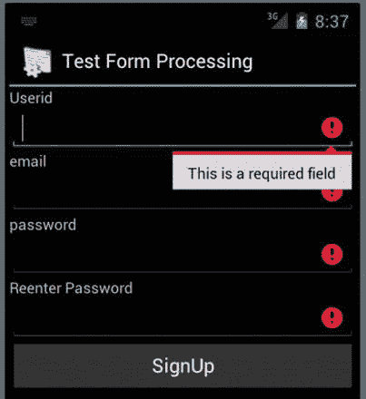
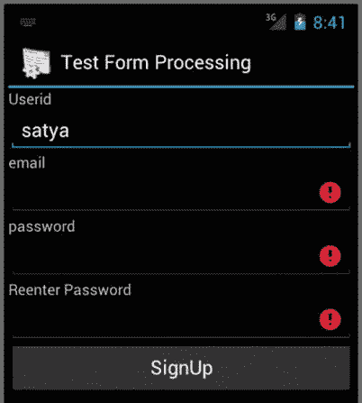
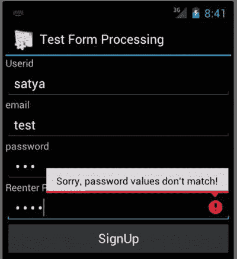

# 六、高级表单处理

Abstract

表单处理是编写计算机应用(包括移动应用)的常见需求。在 Android 中，您可以通过设计活动、对话框或片段来满足这一需求，这些活动、对话框或片段的行为类似于具有大量数据输入字段的表单。

表单处理是编写计算机应用(包括移动应用)的常见需求。在 Android 中，您可以通过设计活动、对话框或片段来满足这一需求，这些活动、对话框或片段的行为类似于具有大量数据输入字段的表单。

开箱即用，Android SDK 具有基于类型控制每个字段行为的基本机制。Android SDK 还允许您在检测到字段出错时，以编程方式在每个字段上设置错误图标和消息。当表单上有一个或两个字段时，这些基本机制非常有用。然而，根据我们的经验，即使只有三四个字段，这种逐个字段的验证也会变得重复和笨拙。

所以我们问了这个问题，“有没有适用于 Android 的表单处理库？”在我们的研究中，我们在开源 Android 社区中发现了一些库。我们会在本章末尾给你一些解决方案的参考。虽然你可以下载并使用其中的一个库，但我们认为有必要在本章解释高级表单处理的一般原则。此外，我们还向您展示了如何开发一个简单而有效的表单处理框架。

解决这个表单处理问题的一般步骤非常简单。了解这些步骤将允许您为您可能遇到的开源库无法解决的许多情况定制解决方案。考虑到这一点，我们将在本章中讲述以下内容:

A simple application that requires form processing in order to address challenges of field-by-field validation   A general-purpose design to deal with form and field validations   Annotated source code that you can use to further customize the presented form processing framework  

当您使用我们在本章中记录的方法时，表单处理变得简单。然后，您可以专注于应用的主要行为，而不会迷失在粒度字段级验证的细节中。

## 基于规划表单的应用

为了演示字段验证的概念和代码，我们创建了一个简单的表单，允许用户注册服务。这个注册表单有常见的字段，如用户 ID、电子邮件地址和密码，如图 6-1 所示。密码字段是重复的，以确保准确性。

图 6-1。

A sample signup form

完成注册需要图 6-1 中的所有字段。如果用户单击注册按钮而没有填写某些字段，您需要突出显示这些字段，并告诉用户在提交表单之前填写这些字段。

图 6-2 显示了如果用户点击注册按钮而不填写字段，屏幕会是什么样子。

图 6-2。

Required field validation on form submit

在图 6-2 中，注意所有必填但未填写的字段都被高亮显示。此外，对于第一个必填字段，如果留空，会出现一条错误消息，指示该字段是必填的。图 6-3 显示了当一些字段被填写并且用户点击注册按钮提交表单时的表单。

图 6-3。

Partially filled-in form fields

在图 6-3 中，请注意，一旦用户开始在其中一个字段中输入信息，该字段的错误指示器就会消失。图 6-4 显示了当密码字段不匹配时该表单的另一种变体。

图 6-4。

Multi-field validation

在图 6-4 中，观察错误信息是如何明确错误性质的。当用户成功填写所有字段并点击注册按钮时，应用将向前移动，并可能显示如图 6-5 所示的成功活动。

图 6-5。

Successfully submitted form

到目前为止，我们已经说明了行为合理的基于表单的应用的要求。我们现在开始设计一个优雅的字段验证框架，它可以满足这些表单处理需求。我们将从一般原则开始。

## 表单验证的一般步骤

Android 中没有内置的框架来完全实现我们的代表性应用中所指示的行为。然而，Android 确实具有构建一个非常好的表单验证框架所需的基本特性。

构建良好的表单处理框架的一般步骤如下:

When you create the layout file for your form activity, use `inputType` attribute on the controls (or fields) that make up the form. There are a number of default input types, such as plain text, email, or a decimal number. Specifying the right input type automatically controls the user input that can be entered into that field on every key stroke. This feature is out of the box in the Android SDK.   Then you write validators that can check the behavior that is specific to that field when the form is submitted. These specific validators are attached to each field. They are not in the core framework, so you need to design them. We will show you an implementation for this.   Once you have the validators for each field, you attach the validators through code (as we do in this chapter) to the corresponding fields. You can also attach the validators to their fields through metadata-driven Java annotations. We have provided a URL to a framework that does precisely this; see the References at the end of this chapter.   Once the validators are attached to all the fields, you gather the fields into an abstraction called a `Form` or a `FieldSet`, so that you can validate the entire field set just once when the form is submitted. Again, this step is not core Android, but it will be part of the form-validation framework.  

你在 Android 社区中遇到的大多数框架都使用了类似的方法，或者略有不同。在本章的其余部分，我们将向您展示如何调整这些通用过程来实现您的表单验证框架。

## 设计基础活动

我们的样本表单验证框架使用了一个基于继承的解决方案，包括三个活动级别。

`BaseActivity extends Activity`

`FormActivity extends BaseActivity`

`SignupFormTestActivity extends FormActivity`

在这个活动层次中，`SignupFormActivity`如图 6-1 所示。`FormActivity`抽象了字段集并允许字段验证的方法。`BaseActivity`封装了非常常见的方法。让我们先看看代码，分析一下`BaseActivity`的设计。该活动的代码如清单 6-1 所示。

清单 6-1。封装常用函数的 BaseActivity

`/*`

`* Provides many utility methods that are used by inherited classes.`

`* The utility methods include such things as toasts, alerts, log messages`，

`* and navigating to other activities.`

`* Also includes the ability to turn on/off progress dialogs.`

`*/`

`public abstract class BaseActivity extends Activity`

`{`

`//Uses the tag from derived classes`

`private static String tag=null;`

`//To turn/off progress dialogs`

`private ProgressDialog pd = null;`

`//Transfer the tag from derived classes`

`public BaseActivity(String inTag)    {`

`tag = inTag;`

`}`

`//Just a way to log a message`

`public void reportBack(String message)    {`

`reportBack(tag,message);`

`}`

`public void reportBack(String tag, String message)    {`

`Log.d(tag,message);`

`}`

`//report a transient message and log it`

`public void reportTransient(String message)    {`

`reportTransient(tag,message);`

`}`

`//Report it using a toast`

`public void reportTransient(String tag, String message)`

`{`

`String s = tag + ":" + message;`

`Toast mToast = Toast.makeText(this, s, Toast.LENGTH_SHORT);`

`mToast.show();`

`reportBack(tag,message);`

`Log.d(tag,message);`

`}`

`//we often need to do string validations`

`public boolean invalidString(String s)   {`

`return StringUtils.invalidString(s);`

`}`

`public boolean validString(String s)    {`

`return StringUtils.validString(s);`

`}`

`//we often need to transfer to other activities`

`public void gotoActivity(Class activityClassReference)`

`{`

`Intent i = new Intent(this,activityClassReference);`

`startActivity(i);`

`}`

`//On callbacks turn on/off progress bars`

`public void turnOnProgressDialog(String title, String message){`

`pd = ProgressDialog.show(this,title,message);`

`}`

`public void turnOffProgressDialog()    {`

`pd.cancel();`

`}`

`//Sometimes you need an explicit alert`

`public void alert(String title, String message)`

`{`

`AlertDialog alertDialog = new AlertDialog.Builder(this).create();`

`alertDialog.setTitle(title);`

`alertDialog.setMessage(message);`

`alertDialog.setButton(DialogInterface.BUTTON_POSITIVE`，

`"OK"`，

`new DialogInterface.OnClickListener() {`

`public void onClick(DialogInterface dialog, int which) {`

`}`

`});`

`alertDialog.show();`

`}`

`}//eof-class`

清单 6-1 中的`BaseActivity`很大程度上是通过代码中的行内注释自我记录的。我们发现这种将最常见的函数封装在基类中的方法对于继承的类非常有用。事实上，如果你注意到了，在同一个清单 6-1 中，我们甚至煞费苦心地从一个名为`StringUtils`的静态类中重新定义了一些方法，使得最常见的方法更容易调用。为了保证`BaseActivity`的完整性，下面是`StringUtils`的代码，如清单 6-2 所示。

清单 6-2。常用的基于字符串的方法

`public class StringUtils {`

`public static boolean invalidString(String s)    {`

`return !validString(s);`

`}`

`public static boolean validString(String s)    {`

`if (s == null)        {`

`return false;`

`}`

`if (s.trim().equalsIgnoreCase(""))  {`

`return false;`

`}`

`return true;`

`}`

`}`

Note

请注意，您可以从我们的网站下载整个项目。本章末尾给出了该 URL。

现在我们有了一个`BaseActivity`，让我们进入`FormActivity`类，它是表单验证框架的入口。

## 表单活动的设计与实现

从`BaseActivity`类扩展而来的一个`FormActivity`提供了它的子类，其他基于表单的活动，一个精简的和不易出错的方法来收集和验证字段。这个基类(`FromActivity`)的职责是:

Provide an ability for derived form-based classes to add fields that can be validated   Provide a method to run validation on all of the fields when the form is submitted   As part of the validation, make the fields responsible for setting themselves up with appropriate errors  

在我们看了清单 6-3 中的`FormActivity, shown`的源代码后，我们将讨论每一个责任。

清单 6-3。FormActivity 封装字段验证

`public abstract class FormActivity`

`extends BaseActivity`

`{`

`public FormActivity(String inTag) {`

`super(inTag);`

`}`

`//Provide an opportunity to add fields`

`//to this form. This is called a hook method`

`protected abstract void initializeFormFields();`

`//See how the above hook method is called`

`//whenever the content view is set on this activity`

`//containing the layout fields.`

`@Override`

`public void setContentView(int viewid) {`

`super.setContentView(viewid);`

`initializeFormFields();`

`}`

`//A set of fields or validators to call validation on`

`private ArrayList<IValidator> ruleSet = new ArrayList<IValidator>();`

`//Add a field which is also a validator`

`public void addValidator(IValidator v)    {`

`ruleSet.add(v);`

`}`

`//Validate the every field in the form`

`//Call this method when a form is submitted.`

`public boolean validateForm()`

`{`

`boolean finalResult = true;`

`for(IValidator v: ruleSet)`

`{`

`boolean result = v.validate();`

`if (result == false)`

`{`

`finalResult = false;`

`}`

`//if true go around`

`//if all true it should stay true`

`}`

`return finalResult;`

`}`

`}//eof-class`

清单 6-3 的关键部分被突出显示。让我们首先考虑这个`FormActivity`类如何允许派生类添加字段。`FormActivity`有一个名为`initializeFormFields()`的抽象方法。该方法需要由派生类实现，以初始化和添加需要验证的字段。

为了确保方法`initializeFormFields()`被调用，`FormActivity`恢复了覆盖`Activity`类的`setContentView()`的技巧。方法`setContentView()`通常由派生类调用来为活动设置布局或主屏幕。因此，这是一个收集视图中需要验证的字段的好地方。认识到这一点，`FormActivity`自动调用`initializeFormFields()`作为被覆盖的`setContentView()`的一部分。

Note

如果出于某种原因，这种覆盖`setContentView()`的方法不适合您，那么您可以直接从活动创建回调中调用`initializeFormFields()`函数。这样，这个呼叫就没有魔力了；只需要在活动创建开始时调用它。

强制派生类遵守规定协议的方法被称为`template/hook`模式。这里的`hook`方法就是`initializeFormField()`。在特定时间触发钩子的`template`方法是`setContentView()`。在这种模式中，派生类仅仅实现隔离的动作单元(比如`initializeFormFields`)。`template`方法将定义协议何时以何种顺序调用这些动作，以及何时调用多少次，等等。

您将很快看到派生类是如何实现`initializeFormField()`的，在这里它们将调用`addValidator()`方法。`addValidator()`方法依赖于下面的类来工作:

`IValueValidator //Represents how to validate any string`

`IValidator //Represents a validatable entity that can self report errors`

`Field //extends a Validator and also allows`

清单 6-4 显示了`IValueValidator`接口的定义。

清单 6-4。ivalue validator:value validating 类的协定

`/*`

`* An interface for such value validators as RegExValidator`

`*/`

`public interface IValueValidator`

`{`

`//Given a string to see if it is valid`

`boolean validateValue(String value);`

`//what should be the error message when the field is wrong`

`String getErrorMessage();`

`}`

因此，值验证器负责验证一个字符串值，如果它无效，它会确定它有什么问题。这个接口的目的是让一个像`Field`这样的对象可以附加许多值验证器。一个验证器可能正在检查该值是否必须是 10 个字符。另一个验证器可以检查所有的字符都是数字。然后，`Field`可以通过传递它的值并根据一组验证器对它进行评估来检查每个值验证器。

类`Field`实现了一个稍微不同的接口，叫做`IValidator`。在我们看一下`Field`的实现之前，让我们先看看这个，如清单 6-5 所示。

清单 6-5。IValidator:自报告实体(如字段)的合同

`public interface IValidator {`

`public boolean validate();`

`}`

一个`IValidator`类似于一个`IValueValidator`。然而，与`IvalueValidator`不同的是，`IValidator`不仅要验证，还要反映验证实体的含义，比如改变被验证实体的状态。例如，当一个`Field`被验证并且如果`Field`是错误的，则`Field`将显示一条错误信息并且还显示一个图标(参见图 6-1 )。当你检查`Field`类的实现时，你会看到这种关系，没有延迟，现在如清单 6-6 所示。

清单 6-6。字段:表示控件验证行为的具体类

`public class Field`

`implements IValidator`

`{`

`//The underlying control this field is representing`

`private TextView control;`

`//Because whether required or not is so essential`

`//give it a special status.`

`private boolean required = true;`

`//A list of value validators to be attached`

`private ArrayList<IValueValidator> valueValidatorList`

`= new ArrayList<IValueValidator>();`

`public Field(TextView tv) {`

`this(tv, true);`

`}`

`public Field(TextView tv, boolean inRequired) {`

`control = tv;`

`required = inRequired;`

`}`

`//Validate if it is a required field first.`

`//Also run through all the value validators.`

`//Stop on the first validator that fails.`

`//Show the error message from the failed validator.`

`//Use the android setError to show the errors.`

`@Override`

`public boolean validate()`

`{`

`String value = getValue();`

`if (StringUtils.invalidString(value))`

`{`

`//invalid string`

`if (required)`

`{`

`warnRequiredField();`

`return false;`

`}`

`}`

`for(IValueValidator validator: valueValidatorList)`

`{`

`boolean result = validator.validateValue(getValue());`

`if (result == true) continue;`

`if (result == false)`

`{`

`//this validator failed`

`String errorMessage = validator.getErrorMessage();`

`setErrorMessage(errorMessage);`

`return false;`

`}`

`}//eof-for`

`//All validators passed`

`return true;`

`}//eof-validate`

`private void warnRequiredField() {`

`setErrorMessage("This is a required field");`

`}`

`public void setErrorMessage(String message)    {`

`control.setError(message);`

`}`

`public String getValue() {`

`return this.control.getText().toString();`

`}`

`}//eof-class`

现在，我们可以讨论表单验证框架的关键组件的实现细节了。`Field`本身既是一个验证器，也有一组值验证器。一个`Field`实现了`IValidator`的契约，因为它不仅想验证自己，还想显示更正该字段所需的任何线索或提示。

一个给定的字段在一个表单中是否是必需的是如此的基本和重要，以至于我们已经将该功能直接硬编码到`Field`定义中。一个字段上的其余验证可以封装到许多值验证器中。

所以，这里是一个`Field`如何工作。派生类用它的底层编辑字段初始化一个`Field`。然后，派生类附加一系列值验证器来进一步验证该字段。然后将`Field`添加到`FormAcvity`中，成为验证表单时得到验证的字段集的一部分。下面是如何使用`Field`对象的伪代码，如清单 6-7 所示。

清单 6-7。创建和注册字段对象的伪代码

`//Say emailEditText is a required form field`

`EditText emailEditText;`

`//Create a Field object that wraps the emailEditText`

`//By default the field becomes a required field`

`Field emailField = new Field(emailEditText);`

`//Add further validators. Here are some sample validators`

`emailField.addValidator(new StrictEmailValidator());`

`emailField.addValidator(new MaxLenghtValidator());`

`//Add this field to the form field set`

`addValidator(emailField);`

`...add other fields similarly if you have them`

`addValidator(field2);`

`..etc`

清单 6-7 中的伪代码显示了如何处理单个字段。有时候你也要做跨领域的验证。例如，在图 6-1 中，如果两个密码字段必须匹配才能通过表单验证，那么任何一个字段验证都不能满足这个要求。清单 6-8 展示了如何创建一个复合字段来完成这种多字段验证。

清单 6-8。PasswordRule:多字段验证的一个例子

`/*`

`* A class simulating multi-field validation`

`*/`

`public class PasswordFieldRule implements IValidator`

`{`

`private TextView password1;`

`private TextView password2;`

`public PasswordFieldRule(TextView p1, TextView p2)`

`{`

`password1 = p1;`

`password2 = p2;`

`}`

`@Override`

`public boolean validate()`

`{`

`String p1 = password1.getText().toString();`

`String p2 = password2.getText().toString();`

`if (p1.equals(p2))`

`{`

`return true;`

`}`

`//They are not the same`

`password2.setError("Sorry, password values don't match!");`

`return false;`

`}`

`}//eof-class`

可以将类`PasswordFieldRule`添加到表单中，就像它是另一个字段一样。清单 6-9 是一个基于通用正则表达式的值赋值函数的例子。

清单 6-9。正则表达式值验证器

`/*`

`* A general purpose regular expression value validator`

`*/`

`public class RegExValueValidator`

`implements IValueValidator`

`{`

`private String regExPattern;`

`private String error;`

`private String hint;`

`RegExValueValidator(String inRegExPattern`，

`String errorMessage, String inHint)`

`{`

`regExPattern = inRegExPattern;`

`error = errorMessage;`

`hint = inHint;`

`}`

`@Override`

`public boolean validateValue(String value) {`

`if (value.matches(regExPattern) == true)`

`{`

`return true;`

`}`

`return false;`

`}`

`@Override`

`public String getErrorMessage() {`

`return error + ". " + hint;`

`}`

`}`

到目前为止，我们已经解释了最终实现`SignupTestFormActivity`所需的所有类，这些类将实现示例应用所需的行为。

## 实现 SignupActivityTestForm

清单 6-10 显示了源代码，它汇集了到目前为止本章涉及的所有细节，并展示了现在做字段验证是多么简单。

清单 6-10。SignupActivityTestForm:将所有内容放在一起

`/*`

`* A test form to demonstrate field validation`

`*/`

`public class SignupActivityTestForm`

`extends FormActivity`

`{`

`private static String tag = "SignupActivity";`

`//Form Fields`

`EditText userid;`

`EditText password1;`

`EditText password2;`

`EditText email;`

`public SignupActivityTestForm()    {`

`super(tag);`

`}`

`/** Called when the activity is first created. */`

`public void onCreate(Bundle savedInstanceState) {`

`super.onCreate(savedInstanceState);`

`setContentView(R.layout.signup);`

`}`

`//from FormActivity`

`@Override`

`protected void initializeFormFields()`

`{`

`this.reportBack("form initialized");`

`//Keep local variables`

`userid = (EditText)findViewById(R.id.userid);`

`password1 = (EditText)findViewById(R.id.password1);`

`password2 = (EditText)findViewById(R.id.password2);`

`email = (EditText)findViewById(R.id.email);`

`//Setup the validators`

`addValidator(new Field(userid));`

`addValidator(new Field(password1));`

`addValidator(new Field(password2));`

`addValidator(new Field(email));`

`addValidator(new PasswordFieldRule(password1,password2));`

`}`

`public void signupButtonClick(View v)`

`{`

`if (validateForm() == false)`

`{`

`reportTransient("Make sure all fields have valid values");`

`return;`

`}`

`//everything is good`

`String userid = getUserId();`

`String password = getPassword1();`

`String email = getUserEmail();`

`reportTransient("Going to sign up now");`

`signup(userid, email, password);`

`}`

`private void signup(String userid, String email, String password)`

`{`

`gotoActivity(WelcomeActivity.class);`

`}`

`//Utility methods`

`private String getUserId()    {`

`return getStringValue(R.id.userid);`

`}`

`private String getUserEmail()    {`

`return getStringValue(R.id.email);`

`}`

`private String getPassword1()    {`

`return getStringValue(R.id.password1);`

`}`

`private String getStringValue(int controlId)`

`{`

`TextView tv = (TextView)findViewById(controlId);`

`if (tv == null)`

`{`

`throw new RuntimeException("Sorry Can't find the control id");`

`}`

`//view available`

`return tv.getText().toString();`

`}`

`}//eof-class`

除了注册表单活动的源之外，让我们看看相应的布局文件，如清单 6-11 所示，这样您就可以识别您试图验证的字段。

清单 6-11。支持 SignupActivityTestForm 所需字段的布局文件

`<?xml version="1.0" encoding="utf-8"?>`

`<LinearLayout xmlns:android="`[`http://schemas.android.com/apk/res/android`](http://schemas.android.com/apk/res/android)

`android:layout_width="fill_parent"`

`android:layout_height="fill_parent"`

`android:orientation="vertical" >`

`<!-- Userid` `-->`

`<TextView android:layout_width="fill_parent"`

`android:layout_height="wrap_content" android:text="Userid" />`

`<EditText android:id="@+id/userid"`

`android:layout_width="fill_parent" android:layout_height="wrap_content"/>`

`<!-- email -->`

`<TextView android:layout_width="fill_parent"`

`android:layout_height="wrap_content" android:text="email" />`

`<EditText android:id="@+id/email" android:layout_width="fill_parent"`

`android:layout_height="wrap_content"``android:inputType="textEmailAddress"`

`<!-- password1 -->`

`<TextView android:layout_width="fill_parent" android:layout_height="wrap_content"`

`android:text="password" />`

`<EditText android:id="@+id/password1" android:layout_width="fill_parent"`

`android:layout_height="wrap_content"``android:inputType="textPassword"`

`<!-- password2 -->`

`<TextView android:layout_width="fill_parent" android:layout_height="wrap_content"`

`android:text="Reenter Password" />`

`<EditText android:id="@+id/password2" android:layout_width="fill_parent"`

`android:layout_height="wrap_content" android:inputType="textPassword"`

`/>`

`<!-- form submit button -->`

`<Button android:id="@+id/SignupButton" android:layout_width="fill_parent"`

`android:layout_height="wrap_content" android:onClick="signupButtonClick"`

`android:text="SignUp" />`

`</LinearLayout>`

现在让我们一节一节地分析清单 6-10 中`SignupActivityTestForm`的行为。我们从`initializeFormFields()`方法开始。在这里，我们首先收集代表我们的字段的所有控件。然后，我们将所有字段作为必填字段注册到表单中。此外，我们创建一个`PasswordRule`，它将`password1`和`password2`字段作为输入。

当注册按钮(见图 6-1 和清单 6-11)被点击时，它调用函数`signupButtonClick()`。这个方法又调用基类`FormActivity`定义的`validateForm()`方法。(关于这个方法的实现，请参见清单 6-3。)如果字段无效，它们会自动设置错误指示器和消息。用户焦点被带到第一个出错的字段。

如果整个表单都是有效的，那么控制转到`signupSuccessful()`方法。该方法只是调用`BaseActivity`定义的`gotoActivity()`来调用`WelcomeActivity`，如图 6-5 所示。

Note

注意，我们没有给出 WelcomeActivity 的源代码。如果你想了解 Android 可以完成的最简单的活动，你可以下载这一章的内容。

在现实世界中，注册可能涉及到服务器端调用，要求您提供进度对话框。当你需要的时候，这些条款都在`BaseActivity`里。(参见清单 6-1 中的`BaseActivity`。)

还要注意，在用于`SignupActivityTestForm`的布局文件(清单 6-11)中，我们使用了`android:inputType`属性来描述输入字段的性质。这是 Android 中的一个关键条款，它限制了可以在文本字段中输入的内容。我们在本章的参考资料中提供了一个 URL，在那里你可以找到所有可能的`inputTypes`。这些输入类型包括:

`text`

`textCapCharacters`

`textCapWords`

`textMultiLine`

`textUri`

`textEmailSubject`

`textEmailAddress`

`textPersonName`

`textPostalAddress`

`textWebEditText`

`number`

`numberSigned`

`numberDecimal`

`numberPassword`

`phone`

`datetime`

`date`

`time`

最后，请注意，您可以从本章末尾指定的 URL 下载示例程序，亲自测试该行为。

## 对创建基于表单的活动的改进

创建基于表单的活动是乏味且重复的。我们在这里概述了如何简化这项工作。您还可以根据自己的需要进一步定制和优化这个框架。例如，您可能希望使用 Java 元数据注释来注册字段。在这一章中，我们使用 Java 代码来使框架对你是透明的。或者您可能希望两种方法都允许。在这一章中，我们还使用了继承方法，将各自的活动规定为相互扩展。这可能会带来一些限制，因为除了接口之外，`multiple inheritance`在 Java 中不可用。您可能希望将这种方法转换为基于委托的方法，以便缓解这种约束。也有可能你的表单在 Android `Fragment`中，而不在活动中。在这种情况下，您需要定制您的框架来适应片段，而不是活动。

如果您有许多基于表单的活动，您可能希望使用一个简单的代码生成框架来创建活动类和 xml 布局文件，并注册字段以进行验证。然后，您可以使用生成的代码作为起点来修改代码。这里有一个这种意图的简单例子。比方说，你想参加一个像我们在本章中所展示的活动。你只要说:

`<form>`

`<email>`

`<userid>`

`<password1>`

`<password2>`

`<signup type="button">`

`</form>`

现在代码生成器可以创建所有的工件:activity 类、布局 xml 文件、创建字段的必要方法等等。事实上，我们鼓励您根据自己的具体需求来完善这个解决方案。

## 参考

我们发现以下链接对本章的研究很有帮助。

*   TextView 上的 Android SDK 文档: [`http://developer.android.com/reference/android/widget/TextView.html`](http://developer.android.com/reference/android/widget/TextView.html) 。您可以使用这个 URL 来理解 setError()方法是如何工作的。
*   下面是列出所有输入类型的 URL:[`developer。安卓。com/reference/Android/widget/TextView。html#attr_ android: inputType`](http://developer.android.com/reference/android/widget/TextView.html#attr_android:inputType) 。或者也可以使用 Eclipse 来提示可用的输入类型。
*   本章的研究日志可在: [http: / / androidbook。com/ item/ 4491](http://androidbook.com/item/4491) 。你可以在这里找到其他方法的链接，以及这个领域的网络动态。
*   关于这项工作的早期文章发表在: [http: / / androidbook。com/ item/ 4494](http://androidbook.com/item/4494) 。你也可以在这里找到本章关键源代码的快速参考。
*   用于表单验证的基于 Java 注释的库位于: [https: / / github。com/ragunathjawahar/Android-sari paar](https://github.com/ragunathjawahar/android-saripaar)。
*   当您创建 Android 表单时，您可能希望将它们设计成讨人喜欢的样式。我们对 Android 的风格和主题进行了大量的基础研究。您可以在: [http: / / androidbook 找到这项研究。com/ item/ 3864](http://androidbook.com/item/3648) 。
*   在 [`www.androidbook.com/expertandroid/projects`](http://www.androidbook.com/expertandroid/projects) 下载本章专用的测试项目。ZIP 文件的名称是`ExpertAndroid_ch06_TestForms.zip`。

## 摘要

在编写移动应用时，基于表单的活动也很常见。本章介绍了一个用于验证表单域的灵活框架。开发人员可以进一步增强这个框架，以满足他们的特定需求。

## 复习问题

以下问题有助于巩固您在本章中学到的知识:

What is a good way to write form-based activities in Android?   What base Android SDK features are available to aid field validations in the Android SDK?   How do you use regular expressions to validate form fields?   What is an `android:inputType` attribute and how many input types are available?   How can you abstract progress dialogs in base classes?   How can you abstract alerts in base classes?