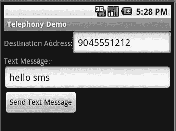
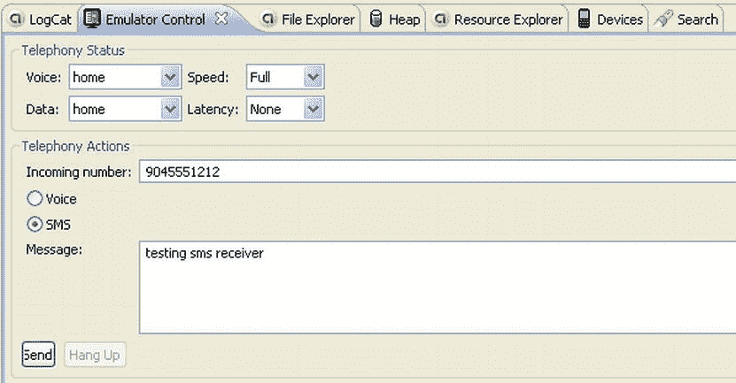
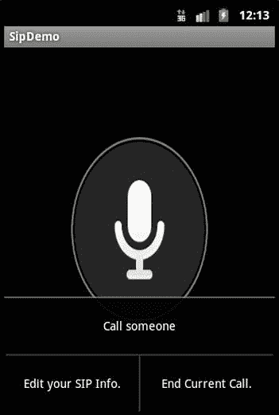

# 七、使用电话 API

Abstract

许多 Android 设备都是智能手机，但到目前为止，我们还没有谈到如何编写使用手机功能的应用。在本章中，我们将向您展示如何发送和接收短信息服务(SMS)信息。我们还将涉及 Android 中电话 API 的其他几个有趣的方面，包括会话发起协议(SIP)功能。SIP 是用于实现互联网协议语音(VoIP)的 IETF 标准，通过该标准，用户可以在互联网上进行类似电话的呼叫。SIP 也可以处理视频。

许多 Android 设备都是智能手机，但到目前为止，我们还没有谈到如何编写使用手机功能的应用。在本章中，我们将向您展示如何发送和接收短信息服务(SMS)信息。我们还将涉及 Android 中电话 API 的其他几个有趣的方面，包括会话发起协议(SIP)功能。SIP 是用于实现互联网协议语音(VoIP)的 IETF 标准，通过该标准，用户可以在互联网上进行类似电话的呼叫。SIP 也可以处理视频。

## 使用 SMS

SMS 代表短消息服务，但它通常被称为文本消息。Android SDK 支持发送和接收文本消息。通过使用 SMS 管理器，您可以发送和接收任意长度的消息。如果消息超过了单个消息的字符限制，SMS 管理器提供了一种以块为单位发送较长消息的方法。SMS 管理器还提供发送消息成功或失败的状态更新。我们将从讨论如何用 SDK 发送 SMS 消息开始。

### 发送短信

要从您的应用发送文本消息，您需要将`android.permission.SEND_SMS`权限添加到您的清单文件中，然后使用`android.telephony.SmsManager`类。这个例子的第一段 Java 代码见清单 7-1，它完成了消息发送。

清单 7-1。发送 SMS(文本)消息

`public class TelephonyDemo extends Activity`

`{`

`protected static final String TAG = "TelephonyDemo";`

`protected static final String SENT_ACTION =`

`"com.androidbook.telephony.SMS_SENT_ACTION";`

`protected static final String DELIVERED_ACTION =`

`"com.androidbook.telephony.SMS_DELIVERED_ACTION";`

`@Override`

`protected void onCreate(Bundle savedInstanceState) {`

`super.onCreate(savedInstanceState);`

`setContentView(R.layout.main);`

`}`

`public void doSend(View view) {`

`EditText addrTxt =`

`(EditText)findViewById(R.id.addrEditText);`

`EditText msgTxt =`

`(EditText)findViewById(R.id.msgEditText);`

`try {`

`sendSmsMessage(`

`addrTxt.getText().toString()`，

`msgTxt.getText().toString());`

`} catch (Exception e) {`

`Toast.makeText(this, "Failed to send SMS"`，

`Toast.LENGTH_LONG).show();`

`e.printStackTrace();`

`}`

`}`

`private void sendSmsMessage(String address, String message)`

`throws Exception`

`{`

`SmsManager smsMgr = SmsManager.getDefault();`

`// Split the message up into manageable chunks if needed`

`ArrayList<String> messages = smsMgr.divideMessage(message);`

`if(messages.size() > 1) {`

`int count = messages.size();`

`// Will need to send with multipart`，

`// so prepare the pending intents`

`ArrayList<PendingIntent> sentPIs =`

`new ArrayList<PendingIntent>(count);`

`ArrayList<PendingIntent> deliveredPIs =`

`new ArrayList<PendingIntent>(count);`

`for(int i = 0; i<count; i++) {`

`sentPIs.add(PendingIntent.getBroadcast(`

`TelephonyDemo.this, 0`，

`new Intent(SENT_ACTION), 0));`

`deliveredPIs.add(PendingIntent.getBroadcast(`

`TelephonyDemo.this, 0`，

`new Intent(DELIVERED_ACTION), 0));`

`}`

`smsMgr.sendMultipartTextMessage(address, null`，

`messages, sentPIs, deliveredPIs);`

`Toast.makeText(this, "Multipart SMS Sent"`，

`Toast.LENGTH_LONG).show();`

`}`

`else {`

`smsMgr.sendTextMessage(address, null, message`，

`PendingIntent.getBroadcast(`

`TelephonyDemo.this, 0`，

`new Intent(SENT_ACTION), 0)`，

`PendingIntent.getBroadcast(`

`TelephonyDemo.this, 0`，

`new Intent(DELIVERED_ACTION), 0)`

`);`

`Toast.makeText(this, "SMS Sent"`，

`Toast.LENGTH_LONG).show();`

`}`

`}`

`}`

Note

我们会在本章末尾给你一个 URL，你可以用它来下载本章中的项目。这将允许您将这些项目直接导入到 Eclipse 中。

发送 SMS 消息的代码是通过在 UI 中单击按钮来调用的。地址和文本消息被传递给`sendSmsMessage()`。您可能想在您的实际应用中做一些编辑检查。`SmsManager`有一个名为`divideMessage()`的方法，将消息字符串分割成符合 SMS 规范的块。如果有一个以上的块，你要用`sendMultipartTextMessage()`的方法；否则，你要用`sendTextMessage()`。无论哪种情况，您都想知道发送是否成功。这就是`PendingIntent`的用武之地。

通过包含每个块的发送状态和交付状态的`PendingIntent`(或者整个消息，如果它适合一条 SMS 消息的话)，您的应用可以被通知失败，在某些情况下，成功。`SmsManager`可以将意图广播回您的应用，让它知道您发送的 SMS 消息发生了什么。这些意图由一个`BroadcastReceiver`处理，其源代码如清单 7-2 所示。

清单 7-2。接收 SMS 状态意向

`public class MyBReceiver extends BroadcastReceiver {`

`@Override`

`public void onReceive(Context context, Intent intent) {`

`String action = intent.getAction();`

`Log.d(TelephonyDemo.TAG, "Got action of " + action);`

`if(TelephonyDemo.SENT_ACTION.compareTo(action) == 0) {`

`Log.d(TelephonyDemo.TAG, "SMS sent intent received.");`

`switch(getResultCode()) {`

`case Activity.RESULT_OK:`

`Log.d(TelephonyDemo.TAG, "SMS sent OK.");`

`break;`

`case SmsManager.RESULT_ERROR_RADIO_OFF:`

`Log.d(TelephonyDemo.TAG`，

`"*** SMS not sent. Radio is off.");`

`break;`

`case SmsManager.RESULT_ERROR_NO_SERVICE:`

`Log.d(TelephonyDemo.TAG`，

`"*** SMS not sent. No SMS service.");`

`break;`

`case SmsManager.RESULT_ERROR_NULL_PDU:`

`Log.d(TelephonyDemo.TAG`，

`"*** SMS not sent. PDU was null.");`

`break;`

`case SmsManager.RESULT_ERROR_GENERIC_FAILURE:`

`Log.d(TelephonyDemo.TAG`，

`"*** SMS not sent. Unknown failure.");`

`break;`

`default:`

`Log.d(TelephonyDemo.TAG, "*** Unknown sent code: "`

`+ getResultCode());`

`break;`

`}`

`}`

`if(TelephonyDemo.DELIVERED_ACTION.compareTo(action) == 0) {`

`Log.d(TelephonyDemo.TAG, "SMS delivered intent received.");`

`switch(getResultCode()) {`

`case Activity.RESULT_OK:`

`Log.d(TelephonyDemo.TAG, "SMS delivered.");`

`break;`

`case Activity.RESULT_CANCELED:`

`Log.d(TelephonyDemo.TAG, "*** SMS not delivered.");`

`break;`

`default:`

`Log.d(TelephonyDemo.TAG, "*** Unknown delivery code: "`

`+ getResultCode());`

`break;`

`}`

`}`

`}`

`}`

当试图向运营商的 SMS 服务器发送消息(或消息的一部分)时，将触发`BroadcastReceiver`。您会注意到有两个动作可以返回给这个应用:发送状态和交付状态。重要的是要认识到发送状态比交付状态更可靠。根据我们的经验，也根据 Android 的例子来判断，不能保证收到已交付的状态。也就是说，您可能会收到也可能不会收到短信发送状态的任何指示。但是，如果您的应用被通知交付失败，包含清单 7-2 中的代码来指示交付状态也无妨。但是，不要依赖于收到一个肯定的已发送状态来确定 SMS 消息已发送，否则您可能会不必要地重新发送。

在许多演示应用中，`BroadcastReceiver`在`onResume()`注册，在`onPause()`取消注册。然而，由于您可能希望接收广播，即使您的活动在后台进行，您将希望使用自己注册的`BroadcastReceiver`来处理广播。清单 7-3 显示了注册您的`BroadcastReceiver`的`AndroidManifest.xml`部分。

清单 7-3。MyBReceiver 的 AndroidManifest.xml

`<receiver android:name="MyBReceiver">`

`<intent-filter>`

`<action`

`android:name="com.androidbook.telephony.SMS_SENT_ACTION" />`

`</intent-filter>`

`<intent-filter>`

`<action`

`android:name="com.androidbook.telephony.SMS_DELIVERED_ACTION" />`

`</intent-filter>`

`</receiver>`

清单 7-1 中的例子演示了使用 Android SDK 发送 SMS 文本消息。用户界面有两个`EditText`字段:一个用于捕获 SMS 接收者的目的地址(电话号码),另一个用于保存文本消息。用户界面还有一个发送短信的按钮，如图 7-1 所示。

图 7-1。

The UI for the SMS example

测试该应用时，您可以向同一台设备发送文本消息。观察 LogCat 中指示应用正在做什么的消息。示例中有趣的部分是`sendSmsMessage()`方法。该方法使用`SmsManager`类的`sendTextMessage()`方法来发送 SMS 消息。下面是`SmsManager.sendTextMessage()`的签名:

`sendTextMessage(String destinationAddress, String smscAddress`，

`String textMsg, PendingIntent sentIntent`，

`PendingIntent deliveryIntent);`

在本例中，您只填充了目的地址和文本消息参数。但是，您可以自定义该方法，使其不使用默认的 SMS 中心(蜂窝网络上发送 SMS 消息的服务器的地址)。如上图所示，还有一种发送多部分消息的方法，那就是`sendMultipartTextMessage()`。SmsManager 还有一种发送数据消息的方法，使用字节数组代替字符串消息。此方法还允许在 SMS 服务器上指定备用端口号。

发送 SMS 消息有两个主要步骤:发送和递送。当每个步骤完成时，如果您的应用提供了一个未决的意图，它就会被广播。您可以将您想要的任何内容放入挂起的 intent 中，比如 action，但是传递到您的`BroadcastReceiver`的结果代码将特定于 SMS 发送或交付。此外，根据 SMS 系统的实施情况，您可能会获得与无线电错误或状态报告相关的额外数据。

如果没有挂起的意图，您的代码就无法判断文本消息是否发送成功。不过，在测试时，你可以分辨出。如果您在一个仿真器中启动这个示例应用，并启动仿真器的另一个实例(从命令行或从 Eclipse 窗口➤ Android SDK 和 AVD 管理器屏幕)，您可以使用另一个仿真器的端口号作为目的地址。端口号是出现在模拟器窗口标题栏中的数字，通常类似于 5554。单击 Send Text Message 按钮后，您应该会在另一个模拟器中看到一个通知，表明您的文本消息已在另一端收到。

发送短信只是故事的一半。现在，我们将向您展示如何监控收到的短信。

### 监控收到的短信

您使用刚刚创建的相同应用来发送 SMS 消息，并且您添加了一个`BroadcastReceiver`来监听动作`android.provider.Telephony.SMS_RECEIVED` `.`当设备接收到 SMS 消息时，这个动作由 Android 广播。

当您注册您的接收器时，您的应用将在收到 SMS 消息时得到通知。监控收到的 SMS 消息的第一步是请求接收它们的许可。为此，您需要向清单文件添加`android.permission.RECEIVE_SMS`权限。要实现接收者，您需要编写一个扩展`android.content.BroadcastReceiver`的类，然后在清单文件中注册接收者。清单 7-4 包括了`AndroidManifest.xml`文件和你的 receiver 类。请注意，这两种权限都出现在清单文件中，因为您仍然需要为上面创建的活动发送权限。

清单 7-4。监控短信

`<!-- This file is AndroidManifest.xml -->`

`<manifest xmlns:android="`[`http://schemas.android.com/apk/res/android`](http://schemas.android.com/apk/res/android)

`package="com.androidbook.telephony" android:versionCode="1"`

`android:versionName="1.0">`

`<uses-permission android:name="android.permission.RECEIVE_SMS"/>`

`<uses-permission android:name="android.permission.SEND_SMS"/>`

`[ ... ]`

`<receiver android:name="MySMSMonitor">`

`<intent-filter>`

`<action`

`android:name="android.provider.Telephony.SMS_RECEIVED"/>`

`</intent-filter>`

`</receiver>`

`[ ... ]`

`</manifest>`

`// This file is MySMSMonitor.java`

`import android.content.BroadcastReceiver;`

`import android.content.Context;`

`import android.content.Intent;`

`import android.telephony.SmsMessage;`

`import android.util.Log;`

`public class MySMSMonitor extends BroadcastReceiver`

`{`

`private static final String ACTION =`

`"android.provider.Telephony.SMS_RECEIVED";`

`@Override`

`public void onReceive(Context context, Intent intent)`

`{`

`if(intent!=null && intent.getAction()!=null &&`

`ACTION.compareToIgnoreCase(intent.getAction())==0)`

`{`

`Object[] pduArray= (Object[]) intent.getExtras().get("pdus");`

`SmsMessage[] messages = new SmsMessage[pduArray.length];`

`for (int i = 0; i<pduArray.length; i++) {`

`messages[i] = SmsMessage.createFromPdu(`

`(byte[])pduArray [i]);`

`Log.d("MySMSMonitor", "From: " +`

`messages[i].getOriginatingAddress());`

`Log.d("MySMSMonitor", "Msg: " +`

`messages[i].getMessageBody());`

`}`

`Log.d("MySMSMonitor","SMS Message Received.");`

`}`

`}`

`}`

清单 7-4 的顶部是`BroadcastReceiver`拦截 SMS 消息的清单定义。短信监控类是`MySMSMonitor`。该类实现了抽象的`onReceive()`方法，当 SMS 消息到达时，系统会调用该方法。测试应用的一种方法是使用 Eclipse 中的模拟器控件视图。运行模拟器中的应用，并前往窗口➤显示查看➤其他➤安卓➤模拟器控制。用户界面允许您向模拟器发送数据，以模拟接收 SMS 消息或电话呼叫。如图 7-2 所示，您可以通过填充“来电号码”字段并选择 SMS 单选按钮向模拟器发送 SMS 消息。接下来，在消息字段中键入一些文本，然后单击发送按钮。这样做向模拟器发送一条 SMS 消息，并调用您的`BroadcastReceiver`的`onReceive()`方法。

图 7-2。

Using the Emulator Control UI to send SMS messages to the emulator

`onReceive()`方法将具有广播意图，它将包含`bundle`属性中的`SmsMessage`。你可以通过调用`intent.getExtras().get("pdus")`来提取`SmsMessage`。该调用返回以协议描述单元(PDU)模式定义的对象数组，这是一种表示 SMS 消息的行业标准方式。然后您可以将 PDU 转换成 Android `SmsMessage`对象，如清单 7-4 所示。如您所见，您从 intent 获得了作为对象数组的 PDU。然后构建一个与 PDU 数组大小相等的`SmsMessage`对象数组。最后，迭代 PDU 数组，并通过调用`SmsMessage.createFromPdu()`从 PDU 创建`SmsMessage`对象。

你读完收到的信息后要做的事情一定要快。广播接收机在系统中获得高优先级，但是它的任务必须快速完成，并且它不会被放在前台供用户查看。因此，你的选择是有限的。你不应该做任何直接的 UI 工作。发布一个通知是好的，启动一个服务来继续工作也是好的。一旦`onReceive()`方法完成，`onReceive()`方法的托管进程随时可能被终止。启动一个服务是可以的，但是绑定到一个服务就不行了，因为这需要您的进程存在一段时间，而这可能不会发生。

现在，让我们通过查看如何使用各种 SMS 文件夹来继续我们关于 SMS 的讨论。

### 使用 SMS 文件夹

访问 SMS 收件箱是另一个常见的需求。首先，向清单文件添加 read SMS 权限(`android.permission.READ_SMS`)。添加此权限使您能够阅读 SMS 收件箱。

要阅读 SMS 消息，您可以在 SMS 收件箱上执行一个查询，如清单 7-5 所示。

清单 7-5。显示来自 SMS 收件箱的消息

`<?xml version="1.0" encoding="utf-8"?>`

`<!-- This file is /res/layout/sms_inbox.xml -->`

`<LinearLayout xmlns:android="`[`http://schemas.android.com/apk/res/android`](http://schemas.android.com/apk/res/android)

`android:orientation="vertical"`

`android:layout_width="fill_parent"`

`android:layout_height="fill_parent" >`

`<TextView android:id="@+id/row"`

`android:layout_width="fill_parent"`

`android:layout_height="fill_parent"/>`

`</LinearLayout>`

`// This file is SMSInboxDemo.java`

`import android.app.ListActivity;`

`import android.database.Cursor;`

`import android.net.Uri;`

`import android.os.Bundle;`

`import android.widget.ListAdapter;`

`import android.widget.SimpleCursorAdapter;`

`public class SMSInboxDemo extends ListActivity {`

`private ListAdapter adapter;`

`private static final Uri SMS_INBOX =`

`Uri.parse("content://sms/inbox");`

`@Override`

`public void onCreate(Bundle bundle) {`

`super.onCreate(bundle);`

`Cursor c = getContentResolver()`

`.query(SMS_INBOX, null, null, null, null);`

`startManagingCursor(c);`

`String[] columns = new String[] { "body" };`

`int[]      names = new int[]    { R.id.row };`

`adapter = new SimpleCursorAdapter(this, R.layout.sms_inbox`，

`c, columns, names);`

`setListAdapter(adapter);`

`}`

`}`

清单 7-5 中的代码打开 SMS 收件箱并创建一个列表，列表中的每一项都包含 SMS 消息的正文部分。清单 7-5 的布局部分包含一个简单的`TextView`，它将在一个列表项中保存每条消息的正文。要获得 SMS 消息列表，您需要创建一个指向 SMS 收件箱(`content://sms/inbox`)的 URI，然后执行一个简单的查询。然后过滤短信正文，并设置`ListActivity`的列表适配器。执行清单 7-5 中的代码后，您会在收件箱中看到一个 SMS 消息列表。确保在模拟器上运行代码之前，使用模拟器控件生成一些 SMS 消息。

因为您可以访问 SMS 收件箱，所以您希望能够访问其他与 SMS 相关的文件夹，如“已发送”或“草稿”文件夹。访问收件箱和访问其他文件夹的唯一区别是您指定的 URI。例如，您可以通过对`content://sms/sent`执行查询来访问已发送文件夹。以下是 SMS 文件夹的完整列表以及每个文件夹的 URI:

*   全部:`content://sms/all`
*   收件箱:`content://sms/inbox`
*   已发送:`content://sms/sent`
*   草稿:`content://sms/draft`
*   发件箱:`content://sms/outbox`
*   失败:`content://sms/failed`
*   排队:`content://sms/queued`
*   未送达:`content://sms/undelivered`
*   对话:`content://sms/conversations`

Android 结合了 MMS 和 SMS，并允许您使用`mms-sms`权限同时访问两者的内容供应器。因此，您可以访问这样的 URI:

`content://mms-sms/conversations`

### 发送电子邮件

既然您已经看到了如何在 Android 中发送 SMS 消息，您可能会认为您可以访问类似的 API 来发送电子邮件。不幸的是，Android 并没有为你提供发送电子邮件的 API。普遍的共识是，用户不希望应用在他们不知情的情况下代表他们发送电子邮件。相反，要发送电子邮件，你必须通过注册的电子邮件应用。例如，您可以使用`ACTION_SEND`来启动电子邮件应用，如清单 7-6 所示。

清单 7-6。通过意向启动电子邮件应用

`Intent emailIntent=new Intent(Intent.ACTION_SEND);`

`String subject = "Hi!";`

`String body = "hello from android....";`

`String[] recipients = new String[]{"``aaa@bbb.com`

`emailIntent.putExtra(Intent.EXTRA_EMAIL, recipients);`

`emailIntent.putExtra(Intent.EXTRA_SUBJECT, subject);`

`emailIntent.putExtra(Intent.EXTRA_TEXT, body);`

`emailIntent.setType("message/rfc822");`

`startActivity(emailIntent);`

这段代码启动默认的电子邮件应用，并允许用户决定是否发送电子邮件。您可以添加到电子邮件意向中的其他“额外内容”包括`EXTRA_CC`和`EXTRA_BCC`。

让我们假设您想要在邮件中发送一个电子邮件附件。要做到这一点，您可以使用类似下面这样的代码，其中`Uri`是对您想要作为附件的文件的引用:

`emailIntent.putExtra(Intent.EXTRA_STREAM`，

`Uri.fromFile(new File(myFileName)));`

接下来，我们来谈谈电话管理器。

## 使用电话管理器

电话 API 还包括电话管理器(`android.telephony.TelephonyManager`)，您可以使用它来获取有关设备上电话服务的信息、获取订户信息以及注册电话状态更改。一个常见的电话用例要求应用对来电执行业务逻辑。例如，音乐播放器可能会因有来电而暂停播放，并在通话结束后继续播放。

监听电话状态变化的最简单方法是在`android.intent.action.PHONE_STATE`上实现一个广播接收器。你可以用同样的方法监听收到的短信，如上所述。另一种方法是使用电话管理器。在本节中，我们将向您展示如何注册电话状态更改以及如何检测来电。清单 7-7 显示了细节。

清单 7-7。使用电话管理器

`<?xml version="1.0" encoding="utf-8"?>`

`<!-- This file is res/layout/main.xml -->`

`<LinearLayout xmlns:android="`[`http://schemas.android.com/apk/res/android`](http://schemas.android.com/apk/res/android)

`android:orientation="vertical"`

`android:layout_width="fill_parent"`

`android:layout_height="fill_parent"`

`>`

`<Button`

`android:id="@+id/callBtn"`

`android:layout_width="wrap_content"`

`android:layout_height="wrap_content"`

`android:text="Place Call"`

`android:onClick="doClick"`

`/>`

`<Button`

`android:id="@+id/quitBtn"`

`android:layout_width="wrap_content"`

`android:layout_height="wrap_content"`

`android:text="Quit"`

`android:onClick="doClick"`

`/>`

`</LinearLayout>`

`// This file is PhoneCallActivity.java`

`package com.androidbook.phonecall.demo;`

`import android.app.Activity;`

`import android.content.Context;`

`import android.content.Intent;`

`import android.net.Uri;`

`import android.os.Bundle;`

`import android.telephony.PhoneStateListener;`

`import android.telephony.TelephonyManager;`

`import android.util.Log;`

`import android.view.View;`

`public class PhoneCallActivity extends Activity {`

`private static final String TAG = "PhoneCallDemo";`

`private TelephonyManager teleMgr = null;`

`private MyPhoneStateListener myListener = null;`

`@Override`

`protected void onCreate(Bundle savedInstanceState)`

`{`

`super.onCreate(savedInstanceState);`

`setContentView(R.layout.main);`

`teleMgr =`

`(TelephonyManager)getSystemService(Context.TELEPHONY_SERVICE);`

`myListener = new MyPhoneStateListener();`

`teleMgr.listen(myListener, PhoneStateListener.LISTEN_CALL_STATE);`

`String myIMEI = teleMgr.getDeviceId();`

`Log.d(TAG, "device IMEI is " + myIMEI);`

`if (teleMgr.getSimState() == TelephonyManager.SIM_STATE_READY) {`

`String country = teleMgr.getSimCountryIso();`

`Log.d(TAG, "SIM country ISO is " + country);`

`}`

`}`

`// Only unregister the listener if this app is going away.`

`// Otherwise, when the user tries to make or receive a phone`

`// call, this app will get paused and we don't want to stop`

`// listening when we're put into the background.`

`@Override`

`public void onDestroy() {`

`super.onDestroy();`

`Log.d(TAG, "In onDestroy");`

`teleMgr.listen(myListener, PhoneStateListener.LISTEN_NONE);`

`}`

`public void doClick(View target) {`

`switch(target.getId()) {`

`case R.id.callBtn:`

`Intent intent = new Intent(Intent.ACTION_VIEW`，

`Uri.parse("tel:5551212"));`

`startActivity(intent);`

`break;`

`case R.id.quitBtn:`

`finish();`

`break;`

`default:`

`break;`

`}`

`}`

`public class MyPhoneStateListener extends PhoneStateListener`

`{`

`@Override`

`public void onCallStateChanged(int state, String incomingNumber){`

`super.onCallStateChanged(state, incomingNumber);`

`switch(state)`

`{`

`case TelephonyManager.CALL_STATE_IDLE:`

`Log.d(TAG, "call state idle...incoming number ["+`

`incomingNumber+"]");`

`break;`

`case TelephonyManager.CALL_STATE_RINGING:`

`Log.d(TAG, "call state ringing...incoming number ["+`

`incomingNumber+"]");`

`break;`

`case TelephonyManager.CALL_STATE_OFFHOOK:`

`Log.d(TAG, "call state offhook...incoming number ["+`

`incomingNumber+"]");`

`break;`

`default:`

`Log.d(TAG, "call state ["+state+"]");`

`break;`

`}`

`}`

`}`

`}`

使用电话管理器时，请确保将`android.permission.READ_PHONE_STATE`权限添加到您的清单文件中，以便您可以访问电话状态信息。如清单 7-7 所示，通过实现一个`PhoneStateListener`并调用`TelephonyManager`的`listen()`方法，您可以得到关于电话状态变化的通知。当一个电话来了，或者电话状态改变了，系统会用新的状态调用你的`PhoneStateListener`的`onCallStateChanged()`方法。当您尝试这样做时，您将会看到，来电号码仅在状态为`CALL_STATE_RINGING`时可用。在本例中，您向 LogCat 写入了一条消息，但是您的应用可以在它的位置实现定制的业务逻辑，比如暂停音频或视频的回放。

Note

如果你的应用由于电话(或通知或警报)需要改变音量，你应该研究 Android 的音频聚焦功能集。本书不涉及音频聚焦。

为了模拟来电，您可以使用 Eclipse 的 Emulator Control UI——与您用来发送 SMS 消息的 UI 相同(见图 7-2)——但是选择语音而不是 SMS。

请注意，我们在`onDestroy()`中告诉`TelephonyManager`停止向我们发送更新。当你的活动结束时，关闭信息总是很重要的。否则，`TelephonyManager`可能会保留对您的对象的引用，并阻止它在以后被清除。然而，当活动进入后台时，您仍然希望接收更新。

此示例仅处理可供监听的一种电话状态。查看其他人的`PhoneStateListener`文档，包括例如`LISTEN_MESSAGE_WAITING_INDICATOR`。当处理电话状态变化时，您可能还需要获取订户(用户)的电话号码。`TelephonyManager.getLine1Number()`会把那个还给你的。

你可能想知道是否有可能通过代码接听电话。不幸的是，目前 Android SDK 没有提供这样做的方法，尽管文档暗示您可以通过一个动作`ACTION_ANSWER`来激发一个意图。在实践中，这种方法还不可行，尽管您可能想检查一下自撰写本文以来是否已经解决了这个问题。似乎有一些黑客在一些设备上工作，但不是所有的。在网上搜索一下`ACTION_ANSWER`应该能找到它们。

类似地，您可能希望通过代码拨出电话。在这里，你会发现事情更容易。进行出站呼叫的最简单方法是通过如下代码调用拨号器应用:

`Intent intent = new Intent(Intent.ACTION_CALL, Uri.parse("tel:5551212"));`

`startActivity(intent);`

注意，为了实际拨号，您的应用将需要`android.permission.CALL_PHONE`权限。否则，当您的应用试图调用拨号器应用时，您将得到一个`SecurityException`。要在没有此权限的情况下进行拨号，请将意向操作更改为`Intent.ACTION_VIEW`，这将导致拨号器应用显示您要拨打的号码，但用户需要按下发送按钮来发起呼叫。

检测手机状态变化的另一个方法是注册一个广播接收器来检测手机状态变化(`android.intent.action.PHONE_STATE`)，类似于本章开头示例中接收 SMS 消息的方式。这可以在代码中完成，或者您可以在清单文件中指定一个<receiver>标记。</receiver>

## 会话发起协议(SIP)

Android 2.3 (Gingerbread)在 android.net.sip 包中引入了支持 SIP 的新特性。SIP 是互联网工程任务组(IETF)标准，用于协调通过网络连接发送语音和视频，以便在通话中将人们联系在一起。这项技术有时被称为 IP 语音(VoIP)，但请注意，实现 VoIP 的方式不止一种。

例如，Skype 使用一种专有协议来实现 VoIP，它与 SIP 不兼容。SIP 也不等同于谷歌语音。Google Voice(在撰写本文时)并不直接支持 SIP，尽管有一些方法可以将 Google Voice 与 SIP 供应器集成在一起，以便将事情联系在一起。Google Voice 为您设置了一个新的电话号码，您可以用它来连接其他电话，如您的家庭电话、工作电话或手机。一些 SIP 供应器将生成一个可用于 Google Voice 的电话号码，但在这种情况下，Google Voice 并不真正知道该号码是用于 SIP 帐户的。搜索互联网会发现相当多的 SIP 供应器，许多有合理的通话费率，有些是免费的。

值得注意的是，SIP 标准没有解决通过网络传递音频和视频数据的问题。SIP 只涉及建立和拆除设备之间的直接连接，以允许音频和视频数据流动。客户端计算机程序使用 SIP 以及音频和视频编解码器和其他库来建立用户之间的呼叫。SIP 呼叫经常涉及的其他标准包括实时传输协议(RTP)、实时流协议(RTSP)和会话描述协议(SDP)。Android 3.1 带来了 Android 对 RTP 的直接支持，在 android.net.rtp 包中。RTSP 支持 MediaPlayer 已经有一段时间了，尽管不是所有的 RTSP 服务器都与 Android 的 MediaPlayer 兼容。SDP 是用于描述多媒体会话的应用级协议，因此您将看到 SDP 格式的消息内容。

用户可以在台式电脑上拨打 SIP 电话，而不会产生长途电话费。计算机程序可以很容易地在移动设备上运行，如 Android 智能手机或平板电脑。SIP 计算机程序通常被称为“软电话”移动设备上的软电话的真正优势是当设备使用 Wi-Fi 连接到互联网时，用户没有使用任何无线分钟，但仍然能够拨打或接听电话。在接收端，软电话必须已经向 SIP 供应器注册了它的位置和功能，以便供应器的 SIP 服务器可以响应 invite 请求来建立直接连接。例如，如果接收者的软电话不可用，SIP 服务器可以将呼入请求定向到语音邮件账户。

Google 为 SIP 提供了一个演示应用，叫做 SipDemo。现在让我们来研究一下这个应用，这样您就可以理解它是如何工作的了。如果你是 SIP 的新手，某些方面并不明显。如果你想尝试 SipDemo，你可能需要一个支持 SIP 的 Android 物理设备。这是因为在撰写本文时，Android 模拟器不支持 SIP(或 Wi-Fi)。互联网上有一些让 SIP 在模拟器中工作的尝试，当你读到这篇文章时，其中一些可能很容易实现并且很健壮。

要使用 SipDemo，您需要从 SIP 供应器处获得一个 SIP 帐户。您需要有您的 SIP ID、SIP 域名(或代理)和您的 SIP 密码。然后将它们插入 SipDemo 应用的首选项屏幕，供应用使用。最后，你需要一个从你的设备到互联网的 Wi-Fi 连接。然而，如果您不想在设备上实际试验 SipDemo，您应该仍然能够理解本节的其余部分。SipDemo 如图 7-3 所示。

图 7-3。

The SipDemo application with the menu showing

要将 SipDemo 作为新项目加载到 Eclipse 中，请使用 New Android Project 向导，单击 Android Sample 项目选项，在 Build Target 部分选择 Android 2.3 或更高版本，然后选择 SipDemo。单击 Finish，Eclipse 将为您创建新项目。您可以不做任何更改就运行这个项目，但如前所述，除非设备支持 SIP，启用 Wi-Fi，您在某个地方有一个 SIP 帐户，您使用菜单按钮编辑您的 SIP 信息，并且您使用菜单按钮发起呼叫，否则它不会做任何事情。您将需要一些其他 SIP 帐户来调用，以便测试应用。按下屏幕上的大麦克风图像，您就可以与对方通话。这个演示应用也可以接收来电。现在我们来谈谈 android.net.sip 包的内部工作原理。

android.net.sip 包有四个基本类:SipManager、SipProfile、SipSession 和 SipAudioCall。SipManager 是这个包的核心；它提供对 SIP 其余功能的访问。您调用 SipManager 的静态 newInstance()方法来获取 SipManager 对象。使用 SipManager 对象，您可以为大多数 SIP 活动获取 SipSession，或者为纯音频呼叫获取 SipAudioCall。这意味着谷歌在 android.net.sip 包中提供了超出标准 sip 所提供的功能——即建立音频通话的能力。

SipProfile 用于定义将相互通话的 SIP 帐户。这并不直接指向终端用户的设备，而是指向 SIP 供应器的 SIP 账户。服务器帮助完成建立实际连接的其余细节。

SipSession 是奇迹发生的地方。建立一个会话包括您的 SipProfile，以便您的应用可以让您的 SIP 供应器的服务器知道自己。您还通过了 SipSession。事件发生时将被通知的侦听器实例。一旦设置了 SipSession 对象，您的应用就可以调用另一个 SipProfile 或接收来电。侦听器有一系列回调，因此您的应用可以正确处理会话状态的变化。

截至蜂巢，最简单的就是使用 SipAudioCall。逻辑就是把麦克风和扬声器连接到数据流上，这样你就可以和对方进行对话。SipAudioCall 上有许多管理静音、保持等的方法。所有的音频片段也为你处理。

除此之外，你还有工作要做。SipSession 类具有用于发出出站调用的`makeCall()`方法。主要参数是会话描述(字符串形式)。这是需要做更多工作的地方。构建会话描述需要根据前面提到的会话描述协议(SDP)进行格式化。理解接收到的会话描述意味着根据 SDP 对其进行解析。SDP 的标准文档位于: [http: / / tools。ietf。org/ html/ rfc4566](http://tools.ietf.org/html/rfc4566) 。不幸的是，Android SDK 不提供对 SDP 的任何支持。然而，感谢一些非常善良的人，有几个免费的 Android SIP 应用已经建立了这个功能。分别是 sipdroid ( [`http://code.google.com/p/sipdroid/`](http://code.google.com/p/sipdroid/) )和 csipsimple ( [`http://code.google.com/p/csipsimple/`](http://code.google.com/p/csipsimple/) )。

我们甚至还没有开始考虑管理 SIP 客户端之间的视频流的编解码器，尽管 sipdroid 有这个功能。SIP 的另一个非常吸引人的方面是能够在两个以上的人之间建立电话会议。这些主题超出了本书的范围，但是我们希望您能够理解 SIP 能为您做些什么。

请注意，SIP 应用至少需要`android.permission.USE_SIP`和`android.permission.INTERNET`权限才能正常运行。如果您使用 SipAudioCall，您还需要`android.permission.RECORD_AUDIO`权限。假设你用的是 Wi-Fi，你应该加上`android.permission.ACCESS_WIFI_STATE`和`android.permission.WAKE_LOCK`。将下面的标签作为`<manifest>`的子标签添加到您的`AndroidManifest.xml`文件中也是一个好主意，这样您的应用将只能安装在支持 SIP 的硬件设备上:

`<uses-feature android:name="android.hardware.sip.voip" />`

## 参考

这里有一些对您可能希望进一步探索的主题有帮助的参考。

*   [`www.androidbook.com/expertandroid/projects`](http://www.androidbook.com/expertandroid/projects) 。在这里可以找到与本书相关的可下载项目列表。对于本章，查找名为 expert Android _ ch07 _ telephony . zip 的 zip 文件。该 zip 文件包含本章中的所有项目，列在单独的根目录中。还有一个自述。TXT 文件，它准确地描述了如何将项目从这些 zip 文件之一导入 Eclipse。
*   [`http://en.wikipedia.org/wiki/Session_Initiation_Protocol`](http://en.wikipedia.org/wiki/Session_Initiation_Protocol) 。SIP 的维基百科页面。
*   [`http://tools.ietf.org/html/rfc3261`](http://tools.ietf.org/html/rfc3261) 。这是会话发起协议(SIP)的官方 IETF 标准。
*   [`http://tools.ietf.org/html/rfc4566`](http://tools.ietf.org/html/rfc4566) 。这是会话描述协议(SDP)的官方 IETF 标准。
*   [`http://www.ietf.org/rfc/rfc3551.txt`](http://www.ietf.org/rfc/rfc3551.txt) 。这是实时传输协议(RTP)的官方 IETF 标准。另见 android.net.rtp 包。
*   [`http://code.google.com/p/sipdroid/`](http://code.google.com/p/sipdroid/) ， [`http://code.google.com/p/csipsimple/`](http://code.google.com/p/csipsimple/) 。两个实现 SIP 客户端的 Android 开源应用。

## 摘要

本章讨论了 Android 电话 API。特别是:

You learned how to send and receive an SMS message.   You learned about SMS folders and reading SMS messages.   We covered the sending of e-mail from an application.   You learned about the TelephonyManager and how to detect an incoming call.   You saw how SIP can be used to create a VoIP client program.  

## 复习问题

你可以用下面的问题来巩固你对本章的理解。

Can an SMS message contain more than 140 characters?   True or false? You get an SmsManager instance by calling Context.getSystemService(MESSAGE_SERVICE).   Where is the ADT feature that allows you to send a test SMS message to an emulator?   Can an application send an e-mail without the user’s knowing?   Can an application send an SMS message without the user’s knowing?   Can an application make a phone call without the user’s knowing?   Is SIP the same as Skype?   What are the four main classes of the android.net.sip package?   Which SIP class defines the SIP accounts that will be talking to each other?   What tag do you put into the AndroidManifest.xml file to ensure a SIP app will be seen only by devices that support SIP?   What permissions are needed in order to make SIP work properly?