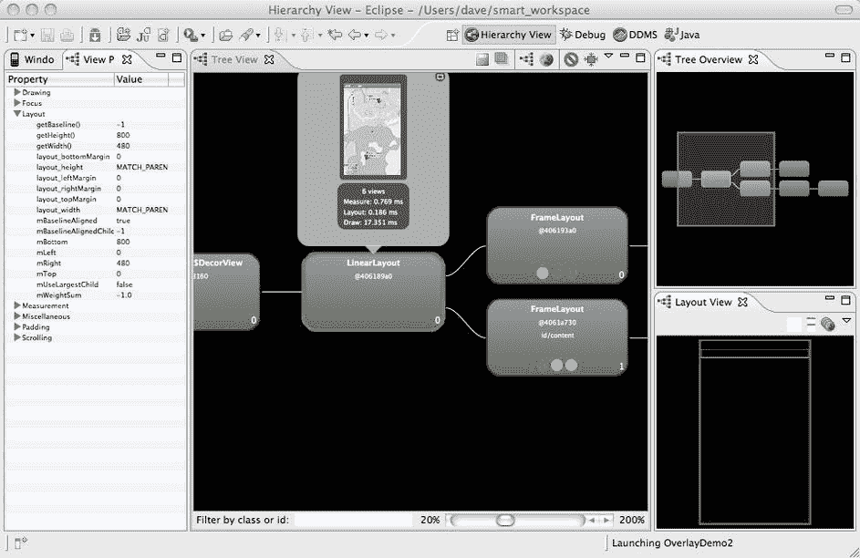

# 八、高级调试和分析

Abstract

在您学习 Android 的这个阶段，您可能已经掌握了一些应用，并且您可能已经遇到了一些来自它们的意外行为。这一章花了一些时间来探索调试应用的高级方法，这样你就可以深入了解应用的内部并发现发生了什么。本章还介绍了如何分析您的应用，以确保它尽可能好地执行，并帮助您确保它没有做它不应该做的事情。

在您学习 Android 的这个阶段，您可能已经掌握了一些应用，并且您可能已经遇到了一些来自它们的意外行为。这一章花了一些时间来探索调试应用的高级方法，这样你就可以深入了解应用的内部并发现发生了什么。本章还介绍了如何分析您的应用，以确保它尽可能好地执行，并帮助您确保它没有做它不应该做的事情。

您将在这里探索各种工具和功能，许多都在 Eclipse 中，并带有用于 Eclipse 的 Android Developer Tools (ADT)插件。您将了解到在哪里可以找到这些工具以及它们是如何工作的。在这个过程中，您将使用一些故意写得很差的示例应用来演示这些工具如何发现问题。

Eclipse Debug 透视图是 Eclipse 附带的标准透视图，它并不特定于 Android 编程。然而，你很快就会知道用它能做什么。Android dal vik Debug Monitor Server(DDMS)透视图有很多非常有用的功能来帮助您调试应用。其中包括设备视图(用于查看您连接到的设备)、仿真器控制(用于发送电话呼叫、SMS 消息和 GPS 坐标)、文件浏览器(用于查看/传输设备上的文件)、网络统计(用于查看进出设备的流量)、线程、堆、分配跟踪器(用于查看您的应用内部)、systrace(用于查看您的 Android 设备内部)和 OpenGL tracer。您还将了解 Traceview，它使分析来自应用的转储文件变得更加容易。

本章还深入到了层次视图的视角，因此您可以遍历正在运行的应用的实际视图结构。最后，您覆盖了`StrictMode`类，该类可用于捕获违反策略的行为，以捕捉可能导致糟糕用户体验的设计错误。

## 启用高级调试

当您在模拟器中测试时，Eclipse Android Developer Tools(ADT)插件会负责为您设置一切，以便您可以使用即将看到的所有工具。

关于在真实设备上调试应用，您需要知道两件事。首先，应用必须设置为可调试的。这包括将`android:debuggable="true"`添加到`AndroidManifest.xml`文件中的`<application>`标签中。幸运的是，ADT 正确地设置了这一点，所以您不必这样做。当您为模拟器创建调试版本或者直接从 Eclipse 部署到设备时，这个属性被 ADT 设置为`true`。当您导出应用来创建它的生产版本时，ADT 会自动将`debuggable`设置为`false`。请注意，如果您在`AndroidManifest.xml`中自行设置，无论如何它都会保持设置。

第二件要知道的事情是，设备必须进入 USB 调试模式。要找到 Gingerbread 之前的 Android 版本的设置，请转到设备的设置屏幕，选择应用，然后选择开发。确保选择了“启用 USB 调试”。

在较新版本的 Android(冰激凌三明治和更高版本)上，进入设置，选择开发者选项，并启用 USB 调试。如果你没有看到开发者选项，你必须做一个简单的技巧来取消隐藏它们。从设置列表中，选取“关于电话”,然后向下滚动，直到看到内部版本号。快速重复点击这个按钮——七次应该就可以了——你会得到一条消息，告诉你现在是开发者了，菜单选项会出现在设置中。

Easter Egg Note

如果你运行的是软糖豆，要获得更多乐趣，在“关于手机”下找到 Android 版本条目，快速点击多次，直到你看到一个大大的微笑软糖豆。按住果冻豆，直到你看到一片漂浮的豆子。触摸并投掷这些豆子。按“后退”按钮退出。

## 调试视角

尽管 LogCat 对于查看日志消息非常有用，但是您肯定希望在应用运行时获得更多控制和更多信息。在 Eclipse 中调试相当容易，在互联网上的很多地方都有详细的描述。因此，这一章不会详细介绍 Eclipse，但是这些是您可以获得的一些有用的特性:

*   在代码中设置断点，以便在应用运行时执行在断点处停止
*   检查变量
*   单步执行并进入代码行
*   将调试器附加到已经运行的应用
*   断开与您连接的应用的连接
*   查看堆栈跟踪
*   查看线程列表
*   查看日志目录

图 8-1 显示了一个示例屏幕布局，展示了您可以使用 Debug 透视图做些什么。

图 8-1。

The Debug perspective

您可以从 Java 透视图(您编写代码的地方)开始调试应用，方法是右键单击项目并选择 debug as➤Android application；这将启动应用。您也可以从“运行”菜单中选择“调试”,从工具栏中选择“调试”,或者使用键盘快捷键 F11。您可能需要切换到 Debug 透视图来进行调试。

## DDMS 的视角

DDMS 代表达尔维克调试监控服务器。这个透视图使您能够深入了解仿真器或设备上运行的应用，允许您观察线程和内存，并在应用运行时收集统计信息。图 8-2 显示了它在您的工作站上的外观。请注意，当本节使用术语“设备”时，它指的是设备或仿真器。

或者，您可以导航到 Android SDK 目录，在工具下找到 monitor 程序。启动它会产生与您在 Eclipse 中看到的相同的 DDMS 窗口。

图 8-2。

The DDMS perspective

在图 8-2 的左上角，注意设备视图。这将向您显示连接到工作站的所有设备(您可以同时连接多个设备或仿真器)，如果您展开视图，还会显示可用于调试的所有应用。在图 8-2 中，您正在查看一个仿真器，因此股票应用看起来可供调试。在真实设备上，您可能只看到少数应用(如果有的话)。不要忘记，如果你正在一个真实的设备上调试一个生产应用，你可能需要调整`AndroidManifest.xml`文件来设置`android:debuggable`为`true`。

Devices 视图中的按钮用于开始调试应用、更新堆、转储堆和 CPU 性能分析代理(HPROF)文件、进行垃圾收集(GC)、更新线程列表、启动方法性能分析、停止进程、拍摄设备屏幕、分析视图层次结构以及生成系统跟踪或捕获 OpenGL 跟踪。按钮如图 8-3 所示。让我们从左到右更详细地了解每一项。除了摄像头和 systrace 按钮之外，所有这些按钮都适用于在设备视图列表中选择的任何应用。如果您没有看到任何列出的应用，您可能需要点按设备名称旁边的+号。或者您可能需要将应用设置为可调试的，如上所述。

图 8-3。

The DDMS advanced debugging buttons

### 调试按钮

绿色的小 bug 按钮开始调试所选的应用。单击它会将您带到刚才描述的 Debug 透视图。这个选项的好处是您可以将调试器附加到正在运行的应用上。您可以让应用进入您希望开始调试的状态，选择它，然后单击此按钮。然后，当您继续运行应用时，断点将导致执行停止，您可以检查变量并单步执行代码。

调试 Android 应用与调试 Eclipse 中的任何其他应用没有什么不同。如前所述，您可以设置断点、检查变量以及单步执行代码。本章不会深入讨论这些细节，但是互联网上有很多资源可以学习更多关于 Eclipse 中调试的知识。

### 堆按钮

接下来的三个按钮用于分析正在运行的进程的内存堆。您希望您的应用使用尽可能少的内存，并且不要过于频繁地分配内存。与使用 Debug 按钮类似，您选择想要检查的应用，然后单击 Update Heap 按钮(这三个按钮中的第一个)。您应该只选择您正在积极调试的应用。在图 8-2 右侧的堆视图选项卡中，您可以点击原因 GC 按钮来收集关于堆中内存的信息。将显示摘要结果，详细结果如下。然后，对于每种类型和大小的已分配内存，您可以看到有关内存使用情况的更多详细信息。

您将在此视图中寻找的一些内容包括:

*   大对象的高计数:您可能会有几个大小在几 KB 范围内的对象；这很正常。如果你看到许多大对象，这可能意味着你的代码正在一遍又一遍地重新创建一些大对象；这可能是个问题。选择统计列表中的每一行，并查看下图。如果你在图的右边看到一个高的长条，那表示有很多大的物体。
*   一些非常大的对象:一般来说，移动应用应该避免创建这些对象，因为内存是一种宝贵的资源。标有“最大”的一栏会告诉你最大的物体是什么，接下来你会看到如何找到它的来源。
*   任何大小的对象都有很高的计数:避免应用垃圾收集暂停的最好方法是首先不要创建大量垃圾。如果您的应用在几秒钟内创建数 MB 的对象，您的用户将会遇到 GC 暂停，这会影响用户体验。使用“计数”列或图表来标识出现频率非常高的任何类型的对象。

“转储 HPROF 文件”按钮就是这样做的:它给你一个 HPROF 文件。如果您已经安装了 Eclipse Memory Analyzer (MAT)插件，那么这个文件将被处理并显示结果。这可能是查找内存泄漏的一种强有力的方法。默认情况下，HPROF 文件是在 Eclipse 中打开的，但是如果没有 MAT 插件，它不会有很大帮助。有关该插件的更多信息，请参见本章末尾的参考资料。根据您工作站的电源，此操作可能需要一分钟或更长时间，因此如果看起来什么也没发生，请耐心等待。在 Android ➤ DDMS 下有一个偏好设置，你可以选择保存到一个文件。

MAT 将报告应用中对象的内存使用情况。对于您在上面的堆中可能已经看到的任何问题，该工具可以更深入地挖掘，以确定问题对象来自哪里。例如，从 MAT 视图的 Overview 选项卡中，如果您单击 Top Consumers 链接，您将看到占用大部分堆的对象。相反，如果您单击泄漏可疑点，您将看到可能泄漏内存的对象。这个报告甚至可以显示对象引用名，以帮助定位分配内存的代码。

### 线程按钮

“更新线程”按钮用所选应用的当前线程集填充右侧的“线程”选项卡。这是观察线程创建和销毁的好方法，也是了解应用中线程级别发生了什么的好方法。在线程列表下面，您可以通过跟踪看起来像堆栈跟踪的内容(对象、源代码文件引用和行号)来查看线程的位置。

例如，谷歌地图应用使用了大量线程，你可以通过在设备视图中选择应用，然后点击更新线程按钮来观察它们的来去。在右侧的线程视图中，当 Maps 与各种 Google Maps 服务对话时，您会看到许多线程。双击其中一个线程条目会在下面的列表中显示详细信息。

下一个按钮 Start Method Profiling 允许您收集应用中方法的信息，包括调用次数和计时信息。单击该按钮，与应用进行交互，然后再次单击该按钮(它在开始和停止方法分析之间切换)。当您单击 Stop Method Profiling 时，Eclipse 将切换到 Traceview 视图，这将在本章的下一节中介绍。与 HPROF 转储一样，打开 Traceview 视图可能需要一分钟或更长时间，这取决于您的工作站的能力，因此如果 Eclipse 似乎没有做任何事情，请耐心等待。

### 停止按钮

“停止”按钮(看起来像停止标志)允许您停止选定的进程。这是一个硬应用停止—它不像单击后退按钮，后者只影响一个活动。在这种情况下，整个应用都会消失。

### 相机按钮

无论在设备视图中选择了哪个应用，看起来像照相机的按钮都会捕捉设备屏幕的当前状态。然后，您可以刷新图像、旋转图像、保存图像或复制图像。“保存”选项仅使用 PNG 格式，但如果您单击“复制”按钮，则可以粘贴到其他工具(例如,“绘画”)中，并以该工具使用的任何格式保存。

### “转储视图层次结构”按钮

此按钮(官方称为 UI Automator 的转储视图层次)作用于所选的应用，以捕捉当前屏幕和屏幕上的所有视图，无论是否可见。一旦捕获，将显示视图层次视图，类似于图 8-4 。

图 8-4。

The View Hierarchy view

这个特性的目的是提供使用 UI Automator 创建自动化 UI 测试所需的信息。右上角的窗口显示了左侧截图中所有视图的层次结构。记住，屏幕上的所有东西都是视图对象，包括文本和按钮。对于选定的布局或视图，详细信息显示在右下窗口中。

该工具与本章后面讨论的视图层次透视图类似，但有所不同。这个视图简单地向您展示了视图及其层次结构。稍后描述的工具为您提供了更多关于视图呈现的信息。

### 系统跟踪按钮

系统跟踪按钮启动一个对话框，您可以设置从仪器捕获系统跟踪(系统跟踪)的参数。系统跟踪许多系统进程以及您的程序的方法调用。它用于在非常低的级别识别可能导致用户体验问题的问题，例如响应延迟。它允许您选择问题中可能涉及的流程，并轻松地比较方法调用时间，以查看什么影响什么，甚至跨流程边界—例如，当使用服务时。systrace 的输出是一个 HTML 文件，您可以将其加载到浏览器(Chrome 首选)中进行分析。

在这种特定情况下，模拟器不能用于获取系统跟踪，您必须有一个物理设备。该设备必须运行 Android 4.1 或更高版本，并且必须能够捕获系统跟踪。谷歌 Nexus 设备已启用，三星 Galaxy S3 也是如此。要查看您的设备是否能够运行，请检查其文件系统，查看/sys/kernel/debug 目录是否存在。如果它确实存在，那么你就可以走了。systrace 的某些功能需要设备的 root 访问权限，而设备制造商可能不支持其他功能。你会得到错误信息，告诉你什么是不支持的，所以你可能会在某种程度上受到限制，你可以做什么与您的特定设备。

#### 设置跟踪

在开始跟踪之前，您必须在设备上做一些准备工作。首先，设备必须连接到您的工作站，并启用 USB 调试，如上所述。在“设置”的“开发人员选项”部分，您还会发现一个名为“启用跟踪”的条目。在这里选择你想追踪的东西。单击 OK，准备运行应用进行捕获。

现在，将你的注意力转向你的工作站和当你点击 Systrace 按钮时弹出的对话框，如图 8-5 所示。在捕获之前或之后(或两者都有)，您可能希望在设备上运行 ps 命令并捕获输出。以下内容在您的工作站上运行良好:

`adb shell ps > c:\temp\ps.txt`

使用任何适合您平台的输出文件名。这将捕获在分析跟踪信息时有用的活动进程列表。

图 8-5。

The Systrace dialog

前两个字段不言自明。为了捕获所有数据，跟踪缓冲区大小(kb)字段需要相当大。在这个例子中，缓冲区被设置为 10MB，这似乎工作得很好。如果您发现您的采集被截断，您可以选取更大的尺寸。

前四个跟踪事件选项显然与 CPU 活动有关，这是您希望看到的。并非所有设备都支持所有这些事件。如果您收到与这些事件类型之一相关的错误消息，只需在此对话框中取消选择它，然后重试。对于需要 root 的跟踪事件，您需要使用命令`adb root`重启 adbd。当然，这只在你的设备安装了不安全的`boot.img`后才有效。

跟踪标记与设备上设置➤开发人员选项➤启用跟踪下的选项相匹配。除了 am(活动管理器)和 wm(窗口管理器)之外，大多数标签都是不言自明的。您不需要在对话框中选择您在设备上启用的所有标签，但是对于您在对话框中选择的任何标签，您必须已经在设备上选择了相应的启用跟踪设置选项。您不需要按照说明执行 adb shell 命令，除非出于某种原因，您没有得到有效的 trace.html 文件作为输出。当您单击“确定”时，跟踪将开始，一个对话框将出现在您的工作站上，您应该开始在设备上运行您的应用，以便您可以捕获所有事件的详细信息。一旦捕获完成，您将有一个大的 HTML 文件加载到 Chrome 浏览器中。当你读到这篇文章的时候，其他浏览器如 IE、Firefox 或 Safari 可能还能用，但你最好的选择是 Chrome。

如果你冒险进入 Android 开发者网站，阅读了那里关于下载 python 来让 systrace 工作的说明，那就算了。从版本 21 开始，ADT 中的代码使得 systrace 不需要 python。事实上，让基于 python 的 systrace 工作存在很多问题。您最好使用 ADT 功能。

#### 分析痕迹

一旦将捕获的跟踪文件加载到 Chrome 中，您将看到一个类似图 8-6 的屏幕。在左侧，您将看到已经捕获的事件类型、活动等。使用右侧的滚动条查看捕获的所有内容。在图形窗口的顶部，您会看到一个时间刻度。使用 w 和 s 键可以扩大或缩小时间范围。z 键将时间刻度恢复到原始状态。图形窗口显示左侧所示线程每次执行的行。a 和 d 键分别向左和向右移动线条。

图 8-6。

A systrace capture file in Chrome

毫无疑问，你已经发现，有太多的东西要同时看。你需要一些路标。幸运的是，您可以单击时间刻度来添加垂直线，向下延伸到所有行。这允许您关注特定的时间片并比较线程。如果你愿意，你可以有两条以上的垂直线；您可以再次单击某一行来删除它；你可以点击并拖动一条线来移动它。您也可以单击最左侧的 x 来删除您认为不重要的行。数据仍然保存在 systrace 文件中，所以如果需要的话，可以随时重新加载。

放大图形窗口中的线，直到看到一些宽度。现在点击一条线。您将在窗口的下部看到有关该事件时间的一些详细信息。点击另一行，你会看到它的细节。现在，单击并拖动一个方框，将一串线包围起来。当您拖动时，您将看到该框的时间片持续时间，当您放开时，该框中的事件将在窗口的下部汇总。这是一种非常强大的方式来查看设备上发生的一切。

要看的几个关键行是 SurfaceFlinger 和它的第二线程 surfaceflinger。如果设备上一切顺利，SurfaceFlinger 将看起来非常规则，非常短的线条均匀分布。这确保了用户体验的快速响应。事实上，所有的应用都应该表现出这种行为——也就是说，应用中的处理应该简短而有规律。任何时候你的应用处理一个事件(一个用户点击，接收一个广播)，它应该快速地做它能做的任何事情，并确保主线程没有被阻塞。如果你看到 SurfaceFlinger 线路中断，这意味着有其他东西占用了设备的资源，并可能导致用户体验不稳定。有了这个 systrace 工具，您可以准确地跟踪坏事情发生的地方，并可能采取一些措施来解决问题。

对 Android 底层架构的完整解释超出了本章的范围，但是您可能有兴趣了解事件源列表中的一些项目。VSYNC 是垂直同步，Android 使用它来管理显示缓冲区。绑定器是数据在进程间传递的方式，包括传递到图形服务器。

### OpenGL ES 的启动 OpenGL 跟踪按钮/跟踪器

此按钮启动一个对话框，允许您捕捉 OpenGL 帧进行分析。或者，至少应该是这样。使用这种方法获得 OpenGL 跟踪功能存在问题。使用 Tracer for OpenGL ES 透视图可能会更成功。使用窗口菜单查找并启动该透视图。然后使用这里的开始跟踪按钮(看起来和 DDMS 屏幕上的开始 OpenGL 跟踪按钮一样)来得到如图 8-7 所示的对话框。

图 8-7。

An OpenGL trace dialog

该设备可能会默认为你。对于应用包，输入要跟踪的活动包的名称。对于要启动的活动，请输入活动的名称。如果在活动名称上出现错误，请尝试在活动名称前面加上一个句点(。).选择收集选项并提供文件名—通常以. gltrace 结尾。准备好后按 trace 按钮。将出现一个新的对话窗口，显示帧捕获的进度。当你收集到你想要的东西时，按停止追踪按钮。

然后，透视图会发生变化，以显示帧捕获的结果。您可以使用这个屏幕来查看 OpenGL 的工作情况。如果需要，请单击“打开保存的 OpenGL 跟踪文件”按钮，以加载您在上一个对话框中指定的文件。使用帧滑块选择一个帧，然后查看 OpenGL ES 调用。绘图命令将以蓝色突出显示。

### 设备视图菜单

最后，菜单包括所有的按钮功能；此外，还有一个复位 adb 菜单项。Adb 是 Android Debug Bridge，一个在您的工作站上运行的服务器进程，用于与您工作站上的仿真器或连接到它的设备进行对话。重置 adb 选项重新启动 adb 服务器，以防出现不同步，您无法再看到设备或仿真器。这将(实际上)刷新视图中的设备列表。重置 adb 服务器的另一种方法是在工具窗口中使用以下一对命令:

`adb kill-server`

`adb start-server`

### 分配跟踪器

图 8-8 显示了分配跟踪器选项卡。这使您可以开始跟踪单个内存分配。单击“开始跟踪”后，练习您的应用，然后单击“获取分配”。将显示该时间段内的内存分配列表，您可以单击特定的分配来查看其来源(类、方法、源代码文件引用和行号)。停止跟踪按钮在那里，所以你可以重置和重新开始。

图 8-8。

The Allocation Tracker view

可以单击分配列表的列，按该列进行排序。例如，这使得寻找大的分配变得容易。还有一个过滤字段，可以很容易地将显示的行限制为包含该字段中输入的文本的行。通过在应用的包名的开头键入，列表将会缩小，以显示从您的代码中进行的分配。然后，您可以按“分配于”列进行排序，并查找重复分配的同一类对象的多次出现。在所示的例子中，Paint 类的重复实例化可能是一个问题。我们稍后将对此进行更详细的探讨。

## 特蕾西

您已经看到了如何收集应用中方法执行的统计信息。使用 DDMS，您可以执行方法分析，之后 Traceview 窗口会显示结果。图 8-9 显示了这种情况。

图 8-9。

Traceview

使用前面展示的技术来启动这个视图，您将获得应用中在 DDMS 捕获方法调用信息时执行的所有方法的结果。您在捕获方法时对应用的练习越多，您在这个视图中获得的信息就越多。一种方法是捕获特定应用操作的方法，这样您就可以专注于这段时间内发生的事情。如果您有一个具有大量功能的大型应用，这种方法可能需要很长时间。在这种情况下，您可能希望测试更长的时间，尽管这样您将有大量的数据要处理，这可能会隐藏一些不太严重的问题。

从图 8-9 中可以看出，应用中每个线程的活动都以图形方式显示，让您知道哪些线程正在工作以及何时工作。如果您将鼠标放在线程行上的每个条上，您将会看到上面关于进行了哪个方法调用的信息，以及 CPU 计时。

请注意，分析的结果显示了调用的内容、频率以及每个方法花费的时间。细分是按线程，用颜色编码。可以单击此处的列，根据该值对结果进行排序。

查找问题的一个好方法是按降序排列包含 Cpu 时间百分比(即最大值在顶部)。这将表明时间在你的应用中的花费，从多到少。但是每个值都包括从每个方法内部调用方法所花费的时间。通过查看具有这种排序顺序的前几十行，您通常可以发现一些意外的方法是否占用了太多的总时间。当您捕获方法调用时，您应该对应用应该在做什么有所了解，如果时间花在了不应该花的地方，那么您可以去调查一下。

使用这种排序顺序要注意的另一件事是靠近顶部的 Excl Cpu Time %中的一个大值。该值表示仅在方法代码中花费的时间，不包括在此方法的方法调用中花费的时间。这是在这种特定方法中花费时间的更真实的度量，因此高值表明该方法正在做大量的工作。您需要判断该方法是否应该做大量的工作。如果用这种方法花费的时间看起来很长，去看看并找出原因。当然，您可以直接按该列进行排序，并查看使用最多 CPU 时间的方法是否是您所期望的方法。

您可以单击一个方法调用的行，它将显示对此方法的父调用、对此方法的方法的子调用，以及每个调用的计时。您可以单击父方法或子方法，将视图切换到该方法。当然，单击一个子方法将会在子方法的父方法列表中显示当前的方法。或者点击一个父方法将会在父方法的子方法列表中显示当前的方法。通过这种方式，您可以上下遍历应用方法调用树，以查看时间都花在了哪里。

您还可以通过使用`android.os.Debug`类获得 Android 应用的更具体的跟踪信息，该类提供了一个开始跟踪方法(`Debug.startMethodTracing("basename")`)和一个停止跟踪方法(`Debug.stopMethodTracing()`)。Android 在设备的 SD 卡上创建一个跟踪文件，文件名为`basename.trace`，尽管你可以指定一个完整的路径名，该文件将转到那里。您将开始和停止代码放在想要跟踪的内容周围，从而限制了收集到跟踪文件中的数据量。然后，您可以将跟踪文件复制到您的工作站，并使用 Android SDK 工具目录中包含的`traceview`工具查看跟踪输出，跟踪文件名作为`traceview`的唯一参数。

Note

当将方法捕获到跟踪文件中时，会有一些额外的开销影响应用方法的计时。时间不应该被认为是绝对准确的，而是相对的。没有追踪，一切都会进行得更快；但是无论是否开启追踪，最快的部分很可能是最快的。在跟踪开启的情况下，最慢的部分相对于其他部分仍然是最慢的。

## 测试您的调试技能

现在您已经了解了调试工具，下面是一个测试，看看您是否可以调试一个存在已知问题的应用。从本书的网站( [`www.androidbook.com/expertandroid/projects`](http://www.androidbook.com/expertandroid/projects) )下载第八章的示例程序 NoteBad，使用名为 expert Android _ Ch08 _ debugging . zip 的文件。这是 Android 示例应用记事本，但在投入生产之前需要进行一些调整。将这个项目导入 Eclipse，然后在真实设备或模拟器上运行它。使用菜单按钮和添加笔记菜单选项在应用中创建一些笔记。“后退”按钮保存当前便笺并使用户返回便笺列表。您可能会注意到，也可能没有注意到这个应用有些迟缓；没关系，您将使用工具来查找性能问题的原因。

单击 Start Method Profiling 按钮开始捕获方法调用。现在，通过编辑您创建的笔记来练习应用。单击 Stop Method Profiling 按钮，等一会儿，查看出现的 Traceview 视图。双击。跟踪标签，如果需要的话，让它充满窗口。现在看看列表中的方法调用。看到什么异常了吗？比如从 note editor $ linededittext . ondraw 到 TextView.onDraw 的方法调用所花费的时间大幅下降？您是否注意到 note editor $ linededittext . ondraw 的 Excl Cpu 时间%明显大于它周围的任何东西？这个方法绝对需要研究。

如果单击列表中的 note editor $ linededittext . ondraw 行，它将展开以显示父母和子女。孩子之下是自我，占据了大部分时间。这意味着 onDraw 方法中的代码做了大量的处理，而不是在 onDraw 调用的方法中。打开 NoteEditor.java 文件并导航到 onDraw 方法。您是否看到了导致严重延迟的内部 for 循环？如果你去掉这个没有意义的小循环，再试一次，你会发现在这个方法上花费的时间大大减少了。

现在，在编辑已经创建的另一个注释时，使用 Allocation Tracker 视图来捕获应用的一些分配事件。一旦您点击 Get Allocations 按钮，您将看到列表中显示了相当多的行。要将列表限制为仅来自代码的分配，请在筛选器字段中键入 com.androidbook。当你输入的时候，你会看到列表缩小到只有包含 com.androidbook 的行。太奇怪了！为什么要一次又一次地分配一个绘制对象？

单击其中一个分配行，您会看到下面显示该分配来自何处的跟踪。在 NoteEditor.java 双击 onDraw 方法的第一行，Eclipse 会直接带您找到代码。onDraw 方法每秒被调用多次，每次都分配一个新的 Paint 对象是没有意义的。如果你在 NoteEditor.java 向上滚动一点，你会看到真正的绘制对象分配应该在哪里。在 onDraw 方法中，您应该引用现有的对象，而不是每次都创建一个新的对象。继续重构代码以引用 mPaint，而不是在 onDraw 中创建新的 MP aint。现在，当您重新运行应用时，您甚至可能会注意到应用性能的显著提高。

## 层次视图视角

在 Hierarchy View 透视图中，您在模拟器中(而不是在真实设备上)连接到应用的运行实例。然后，您可以探索应用的视图、它们的结构以及它们的属性。首先，选择您想要的应用。选中并读取后，视图层次以多种方式显示，如图 8-10 所示。

图 8-10。

The Hierarchy View perspective

您可以在结构中导航，检查属性并确保您没有多余的视图。例如，如果你有许多嵌套的布局，你可以用一个`RelativeLayout`来代替它们。

当您自己尝试时，您可能会注意到中间窗口视图中的三个彩球。这些(从左到右)对应于查看者在测量、布局和绘制视图(包括封闭视图)方面的表现等级。颜色是相对的，所以红色的球不一定意味着有问题，但它肯定意味着你应该调查。

另请注意所选视图及其上方的信息。它不仅包括该视图图像的捕获，还显示了测量、布局和绘制该视图的绝对时间。这些都是有价值的数据，可以帮助你确定是否真的需要深入了解这个观点并做出改进。除了如前所述的折叠布局，您还可以改变视图的初始化方式和绘制工作量。如果您的代码创建了大量的对象，您可以重用对象来避免这种开销。使用后台线程、加载程序或其他技术来完成可能需要很长时间的工作。

### 像素完美视图

与设备视图中的层次视图和相机按钮类似，您可以获取当前屏幕图像并将其显示在像素完美视图中。这个 Eclipse 插件为您提供了一个放大的图像查看器，允许您查看单个像素及其相关的颜色。这个特性的有趣之处在于，你可以覆盖另一个图形(比如屏幕模型)并将其与当前屏幕进行比较。如果你需要复制一个特定的外观，这是一个很好的方法来看看你做得如何。

## 亚行司令部

您可以从命令行(或工具窗口)使用其他几个调试工具。Android Debug Bridge ( `adb`)命令允许您安装、更新和删除应用。它位于 Android SDK 目录中的 platform-tools 下。您可以在模拟器或设备上启动一个 shell，并从那里运行 Android 提供的 Linux 命令子集。例如，您可以浏览文件系统、列出进程、读取日志，甚至连接到 SQLite 数据库并执行 SQL 命令。例如，以下命令(在工具窗口中)在模拟器上创建一个外壳:

`adb –e shell`

注意`-e`来指定一个仿真器。如果您正在连接设备，请使用`-d`。在仿真器 shell 中，您拥有提升的 Linux 特权，而在真实设备上则没有(除非您已经对其进行了根操作)。这意味着您可以在模拟器中浏览 SQLite 数据库，但是您不能在真实的设备上这样做，即使它是您的应用！

键入不带参数的`adb`显示了`adb`命令的所有可用功能。

当您以这种方式连接时，通过 adb 的普通 shell 的限制是由于默认的 userid。在幕后，Android 使用一个 Linux 变种，所以最终的用户 id 是 root。有很多在 Android 设备上获得 root 的技术，如果你能在自己的设备上获得，你会发现有很多可能性。例如，使用 Android 设备的 root 访问权限，您将能够检查设备上的任何和所有 SQLite 数据库。因为获取 root 的技术对于每种设备都是不同的，而且事实上由于制造商试图消除获取 root 的能力而不断变化，所以本书不会详细介绍如何为您的设备设置 root。请注意，试图获取 root 可能会损坏您的设备，使其无法使用。

## 模拟器控制台

另一种强大的调试技术是运行模拟器控制台，它显然只适用于模拟器。要在模拟器启动并运行后开始，请在工具窗口中键入以下内容:

`telnet localhost port#`

其中`port#`是仿真器监听的位置。端口号通常显示在模拟器窗口标题中，通常是一个值，如 5554。模拟器控制台启动后，您可以键入命令来模拟 GPS 事件、SMS 消息，甚至电池和网络状态的变化。有关模拟器控制台命令及其用法的链接，请参见本章末尾的参考资料。

## 严格模式

Android 2.3 引入了一个名为`StrictMode`的新调试功能，据谷歌称，该功能用于对 Android 可用的谷歌应用进行数百次改进。那么它是做什么的呢？它报告违反与线程和虚拟机相关的策略的情况。如果检测到违反策略的情况，您会收到一个警报，其中包括一个堆栈跟踪，显示发生违规时您的应用所在的位置。您可以使用警报强制崩溃，也可以记录警报并让您的应用继续运行。

### 严格模式策略

`StrictMode`目前提供两种类型的策略。第一个策略与线程相关，主要针对主线程(也称为 UI 线程)运行。从主线程读取和写入磁盘不是好的做法，从主线程执行网络访问也不是好的做法。Google 在磁盘和网络代码中加入了`StrictMode`钩子；如果您为您的一个线程启用了`StrictMode`,并且该线程执行磁盘或网络访问，那么您会得到警告。您可以选择您想要警告`ThreadPolicy`的哪些方面，并且您可以选择警告方法。

您可以查找的一些违规包括自定义慢速调用、磁盘读取、磁盘写入和网络访问。对于警报，您可以选择写入 LogCat、显示对话框、闪烁屏幕、写入 DropBox 日志文件或使应用崩溃。最常见的选择是写入 LogCat 并使应用崩溃。清单 8-1 展示了一个为线程策略设置`StrictMode`的例子。

清单 8-1。设置`StrictMode`的`ThreadPolicy`

`StrictMode.setThreadPolicy(new StrictMode.ThreadPolicy.Builder()`

`.detectDiskReads()`

`.detectDiskWrites()`

`.detectNetwork()`

`.penaltyLog()`

`.build());`

注意，`Builder`类使得设置`StrictMode`变得很容易。定义策略的`Builder`方法都返回一个对`Builder`对象的引用，所以这些方法可以链接在一起，如清单 8-1 所示。最后一个方法调用`build()`，返回一个`ThreadPolicy`对象，它是`StrictMode`的`setThreadPolicy()`方法所期望的参数。注意`setThreadPolicy()`是一个静态方法，所以不需要实例化一个`StrictMode`对象。

在内部，`setThreadPolicy()`使用策略的当前线程，因此根据`ThreadPolicy`评估后续线程操作，并在必要时发出警报。在这个示例代码中，策略被定义为通过向 LogCat 发送消息来警告磁盘读取、磁盘写入和网络访问。您可以使用`detectAll()`方法来代替特定的检测方法。您还可以使用不同的或附加的惩罚方法。例如，您可以使用`penaltyDeath()`让应用在将`StrictMode`警告消息写入 LogCat(作为`penaltyLog()`方法调用的结果)后崩溃。

因为您在一个线程上启用了`StrictMode`，一旦您启用了它，您就不需要一直启用它。因此，您可以在主活动的`onCreate()`方法开始时启用`StrictMode`,该方法在主线程上运行，然后它将为该主线程上发生的所有事情启用。根据您想要查找的违规类型，第一个活动可能会很快发生，足以启用`StrictMode`。您也可以通过扩展`Application`类并向应用的`onCreate()`方法添加`StrictMode`设置来在您的应用中启用它。可以想象，任何在线程上运行的东西都可以设置`StrictMode`，但是你当然不需要从任何地方调用设置代码；一次就够了。

与`ThreadPolicy`类似，`StrictMode`也有一个`VmPolicy`。`VmPolicy`可以检查几种不同类型的内存泄漏。一个`VmPolicy`通过一个类似的`Builder`类创建，如清单 8-2 所示。`VmPolicy`和`ThreadPolicy`的一个区别是`VmPolicy`不能通过对话框报警。

清单 8-2。设置`StrictMode`的`VmPolicy`

`StrictMode.setVmPolicy(new` `StrictMode.VmPolicy.Builder()`

`.detectActivityLeaks()`

`.detectLeakedClosableObjects()`

`.detectLeakedRegistrationObjects()`

`.detectLeakedSqlLiteObjects()`

`.penaltyLog()`

`.penaltyDeath()`

`.build());`

### 关闭 StrictMode

因为设置发生在一个线程上，`StrictMode`即使在控制从一个对象到另一个对象流动时也能发现违规。当违规发生时，您可能会惊讶地意识到代码正在主线程上运行，但是堆栈跟踪可以帮助您了解违规是如何发生的。然后，您可以通过将该代码移动到它自己的后台线程来采取措施解决这个问题。或者你可能决定让事情保持原样。这取决于你。当然，当您的应用投入生产时，您可能希望关闭`StrictMode`;您不希望您的代码因为一个警告而对用户崩溃。

有几种方法可以关闭生产应用的`StrictMode`。最直接的方法是删除调用，但是这使得继续开发应用变得更加困难。在调用`StrictMode`代码之前，你可以定义一个应用级的布尔值并测试它。在向外界发布应用之前将布尔值设置为 false 实际上禁用了`StrictMode`。

一种更优雅的方法是利用应用的调试模式，如`AndroidManifest.xml`中所定义的。这个文件中`<application>`标签的属性之一是`android:debuggable`。如前所述，当您想要调试应用时，将该值设置为`true`;这样做的结果是`ApplicationInfo`对象获得一个标志集，然后您可以在代码中读取它。清单 8-3 展示了如何利用这一点，当应用处于调试模式时，`StrictMode`是活动的(当应用不处于调试模式时，`StrictMode`是不活动的)。

清单 8-3。设置`StrictMode`仅用于调试

`// Return if this application is not in debug mode`

`ApplicationInfo appInfo = context.getApplicationInfo();`

`int appFlags = appInfo.flags;`

`if ((appFlags & ApplicationInfo.FLAG_DEBUGGABLE) != 0) {`

`// Do StrictMode setup here`

`}`

请记住，当在模拟器或设备上启动应用的开发版本时，ADT 会将该属性设置为`true`，因此会启用前面代码中的`StrictMode`。当您导出应用来创建生产版本时，ADT 将属性设置为`false`。

### 严格模式练习

作为一个练习，进入 Eclipse，复制一个您到目前为止开发的应用。您必须选择 2.3 或更高版本的构建目标，这样它才能找到`StrictMode`类。在首先启动的活动的`onCreate()`方法中，添加类似清单 8-1、8-2 和 8-3 中的代码；在模拟器中运行 Android 2.3 或更高版本的程序。在使用应用时，您可能会在 LogCat 中偶尔看到违规消息。

## 参考

以下是一些对您可能希望进一步探索的主题有帮助的参考:

*   [`http://developer.android.com/guide/developing/tools/index.html`](http://developer.android.com/guide/developing/tools/index.html) :这里描述的 Android 调试工具的开发者文档。
*   [`http://developer.android.com/guide/developing/devices/emulator.html#console`](http://developer.android.com/guide/developing/devices/emulator.html#console) :仿真器控制台命令的语法和用法。这允许您使用命令行界面来模拟在模拟器中运行的应用的事件。
*   [`www.eclipse.org/mat/`](http://www.eclipse.org/mat/):Eclipse 项目名为内存分析器(MAT)。您可以使用这个插件来读取由 DDMS 功能收集的 HPROF 文件。在 MAT 主页上，查找下载链接。MAT 可以作为独立工具下载，与保存的 HPROF 文件一起使用。或者您将看到一个更新站点链接，您可以使用 Eclipse 的安装新软件对话框来获取插件。安装好插件后，将 Android ➤ DDMS 首选项更改为在 Eclipse 中打开 HPROFs。

## 摘要

本章介绍了以下内容:

*   如何设置 Eclipse 和您的设备进行调试？
*   Debug 透视图，它允许您停止应用来检查变量值，并逐句通过代码。
*   DDMS 透视图，它有相当多的工具用于调查线程、内存和方法调用，以及拍摄屏幕快照和生成事件发送到模拟器。
*   从 DDMS 和命令行重置 adb 服务器。
*   Traceview，它显示应用运行时调用的方法，以及帮助您识别需要注意的问题方法以获得更好的用户体验的统计信息。
*   Hierarchy 视图，显示正在运行的应用的视图结构，并包括帮助您调整和排除应用故障的指标。
*   `adb`命令，可用于登录设备并查看周围。
*   模拟器控制台，这是从命令行与模拟器对话的好方法。想象一下脚本的可能性。
*   一个特殊的类，用于验证你的应用没有在主线程中做不推荐的事情，比如磁盘或网络 I/O。

## 复习问题

以下是一些你可以问自己的问题，以巩固你对这个话题的理解:

True or false? If you want to debug an application, you must explicitly set the `android:debuggable` attribute to `true` in the `<application>` tag of the `AndroidManifest.xml` file.   Name four things you can do with your application while using the Eclipse Debug perspective.   Is it possible to connect more than one device and/or emulator to Eclipse at the same time? If so, where do you select which application you want to work with?   Which DDMS feature do you use to get statistics for an application’s current memory allocations?   How do you determine how many threads are running in your application?   How do you find out the number of times a particular method is called in your application, and what the time of execution is within that method?   Where do you go to capture a picture of a device’s screen?   What Eclipse perspective is used to analyze the structure of an application’s views?   What do the three colored balls mean in this perspective? Does yellow mean you have a big problem? Does red?   If you see a yellow or red ball and want to know how bad the situation is, what should you do to see the actual numeric metric values?   If you want to look at method profiles, but you don’t want to see all the methods for the entire application, what do you do?   How do you create a Linux shell inside a running emulator?   Can you also do this on a real device? If so, are there any limitations to what you can do on a real device?   How do you figure out the port number of an emulator so you can connect to it using the Emulator Console?   What two main things does `StrictMode` check for?