# 九、使用 OpenGL 编程三维图形

Abstract

在本章中，您将了解 Android 平台上的 OpenGL ES 3D 图形 API。OpenGL ES 是 OpenGL 的一个版本，针对嵌入式系统(ES)和其他低功耗设备(如手机)进行了优化。

在本章中，您将了解 Android 平台上的 OpenGL ES 3D 图形 API。OpenGL ES 是 OpenGL 的一个版本，针对嵌入式系统(ES)和其他低功耗设备(如手机)进行了优化。

Android 平台支持 OpenGL ES 1.0 和 OpenGL ES 2.0。OpenGL ES 2.0 从 API level 8 开始提供，对应 Android SDK release 2.2。ES 2.0 与 ES 1.0 有很大的不同，并且不是向后兼容的。

ES 1.0 不依赖于 GPU(图形卡或图形处理单元)的可编程性。在这个模型中，绘图的机制是相当固定的(在 GPU 上)。您的客户端代码设置顶点和必要的变换矩阵，并调用 GPU 来完成其余工作。GPU 遵循预先部署的协议来绘制几何图形(顶点)和给表面着色(片段)。

ES 2.0 是一个模型，其中用 GLSL (OpenGL 着色语言)编写的类似“C”的程序在 GPU 上编译、链接和运行，以影响 OpenGL 绘图。这些写在 GPU 上的 GLSL 程序允许你在如何定位顶点和如何给片段着色上有更多的灵活性。

我们将在这一章中讨论 ES 1.0 和 2.0。未来属于可编程 GPU，期待越来越多支持 ES 2.0 的移动设备。请记住，很难找到关于如何在模拟器上运行 ES 2.0 OpenGL 程序的文档。在本章中，我们使用了一个真实的设备来测试 ES 2.0 示例。

您可以从以下网址了解 OpenGL ES 的历史、范围和定义

[http: / / www .希罗尼乌斯。org/open rules/](http://www.khronos.org/opengles/)

## OpenGL 基础

本节将帮助您理解 OpenGL 和 OpenGL ES API 背后的概念。我们解释了所有的关键概念和 API，但是首先我们在固定功能 OpenGL ES 1.0 的上下文中介绍这些 API。您在这里获得的知识也适用于 ES 2.0。

OpenGL 遵循客户端服务器模型。客户端是请求绘制的一方，服务器是接收、解释和绘制数据的一方。通常，GPU 的作用类似于服务器。然而，与典型的“C”API 不同，OpenGL APIs 是“有状态的”这意味着一个 API 会影响后续 API 的行为。例如，第一个 API 可以设置顶点。后续的 API 可以设置颜色。并且第三 API 可以基于由第一和第二 API 提供的信息发出绘制命令。然后 GPU 使用目前收集的所有信息进行绘制。

### OpenGL 中的关键概念

当你阅读本章中的 OpenGL APIs 或其他 OpenGL 文献时，以下 OpenGL 关键概念将被证明是非常宝贵的。所以找把椅子，坐好，随便浏览一下这些 OpenGL 概念和术语。提前了解这些想法是理解任何 OpenGL 材料的最快方法，包括我们在本章中的详细介绍。

#### 顶点

在 OpenGL 中，复杂的图形是通过连接三维空间中定义的点来绘制的。这些点也称为顶点。每个顶点都在三维空间中定义:x、y 和 z，通常用浮点数表示。然后指示 OpenGL 如何连接这些点，是使用直线(两点)还是三角形(三点)，等等。这些基本形状有时被称为“基本几何”

#### 碎片

当两个点连接在一起时，连接这两个点的线需要绘制为一组不连续的片段。每个片段可以是一个像素宽。类似地，当三个点定义一个三角形表面时，该表面可以被视为片段的集合，其中每个片段可以是一个像素或更宽。这样的片段(一组，包括一个像素)然后可以具有诸如颜色、深度(离视角多远或多近)等特征。当一个顶点存在于 3D 空间中时，一个片段存在于一个扁平的虚拟空间中，如你的屏幕(2D 空间)。然而，在片段变成像素之前，该片段经过一系列测试来评估它是否应该变成像素。例如，根据片段的深度以及是否有另一个邻近的片段位于其上，您可以选择忽略较远的片段。这就是所谓的“深度测试”请参考 OpenGL 文献，了解许多其他测试，如剪刀测试、alpha 测试、模板测试、抖动等。

#### 像素

尽管片段直到图形管道的后期才变成像素，但很多时候像素与片段是同义的。例如，为片段着色的逻辑有时被称为“像素着色器”或“片段着色器”稍后我们将讨论“着色器”的含义。

#### 供过于求

OpenGL 是一组核心 API，主要处理三维点集并将它们渲染到虚拟屏幕表面。无论那个屏幕表面是在内存中，大屏幕，小屏幕，还是打印机，都不是核心 OpenGL。这些细节留给操作系统和各自的窗口系统。

OpenGL 与窗口系统的交互方式取决于操作系统。OpenGL 不提供与屏幕、鼠标、菜单或按钮交互的 API。每个操作系统都以自己的方式做到这一点。GLUT 是一个常见的“C”库，用来隐藏这些细节。每个操作系统都提供了 GLUT API 的实现来支持这种交互。

因此，GLUT 是一个 API，它允许您编写可执行的(当然，您需要编译和链接)“C”程序，这些程序可以在多个平台上运行，而无需为每个操作系统或环境重新编码。如果你正在使用 Android Java SDK，你不需要处理大量的数据，但是你需要使用提供这种交互的 Android 特定的 Java 类。

#### 格勒夫

OpenGL 允许额外的 API 作为其核心的扩展。GLEW 是一个通用的可移植 API，用于发现和管理来自 GPU 供应商的这些扩展 API。在本章中。我们没有讨论扩展 API，所以没有机会讨论这个，另一个管理这些扩展的可移植“C”API。

#### 欧洲珠宝实验室

OpenGL APIs 需要两样东西来工作:渲染上下文和表面缓冲区。API 需要一个像工作内存一样管理 OpenGL 状态的地方；这是渲染上下文。OpenGL 也需要一个表面来绘制。各种 OpenGL 缓冲区附加到此绘图图面；这些被称为表面缓冲。示例缓冲区有颜色缓冲区、模板缓冲区和深度缓冲区。(我们将在这个关键概念部分稍后解释模板和深度。)

设置和管理这两个方面是底层操作系统的责任。在 OpenGL ES 中，有一个叫做 EGL 的标准来处理这些集成 API。不同于 GLUT 和 GLEW(它们是便利的 API)，EGL 是 OpenGL ES 实现的基本 API。因此，Android 确实公开了 EGL API 来控制 OpenGL、渲染上下文和帧缓冲区，并绑定到可用的显示器。同时，Android 还封装了 EGL 行为，并通过一个名为 GLSurfaceView 的类提供了一个简单得多的与 OpenGL 交互的机制。我们将在本章的后面介绍和使用这个类。

OpenGL ES 2.0 编程指南很好地涵盖了 EGL。但是，如果您不在 Android 上进行系统级编程，您就不需要这种级别的细节。

#### 彩色缓冲器

屏幕上的每个像素都有一个颜色值。根据硬件的不同，保存该值所需的空间可能会有所不同。例如，它可以是 24 位值，每个颜色通道(R、G、B)8 位。比如我的笔记本电脑，屏幕是 1280 × 1024。这意味着有 1280 x 1024 个像素。然后，颜色缓冲器需要在缓冲器中为这些像素中的每一个保存 24 位；这被称为“颜色缓冲区”因此，颜色缓冲区保存所有像素的颜色值。给定像素没有自己的颜色缓冲区，但整个显示帧有一个颜色缓冲区。如果你正在显示立体图像，那么你可能有两个颜色缓冲区:一个左边的和一个右边的。如果你使用双缓冲，你可能会有另外两个，前端和后端。

#### 深度缓冲器

在结构上，深度缓冲区非常像颜色缓冲区。深度缓冲器保存场景中所有像素的每个像素的深度值。深度值是像素(更准确地说，是片段)在 z 轴上的远近程度。您可以使用这个缓冲区来执行深度测试，并告诉 OpenGL 不要绘制隐藏的表面。例如，要隐藏一个像立方体一样的物体的隐藏表面，你可以使用清单 9-1 所示的 API 序列。

清单 9-1。如何使用深度隐藏隐藏表面

`// Enable depth test`

`glEnable(GL_DEPTH_TEST);`

`// Accept fragment Or Draw a pixel if it closer to the camera than the former one`

`glDepthFunc(GL_LESS);`

#### 模板缓冲区

与颜色和深度缓冲区非常相似，模板缓冲区与像素相关。模板缓冲区可以为场景中的所有像素保存任意一组位。OpenGL 中有几个 API 允许你根据这些信息位(模板位)来控制一个片段(像素)是否应该被绘制。然后，您可以使用此工具来模拟我们在现实世界中使用模板的方式，即在一个剪切的形状上绘画，以便您的绘图或绘画受到约束。如果模板缓冲区被指定并处于活动状态，它会影响您在屏幕上看到的内容。一个经常给出的例子是汽车的仪表板，它只允许你透过挡风玻璃看东西。仪表板由一个模具表示，该模具在视图周围框出一个边框。

#### 帧缓冲器

帧缓冲区是所有像素缓冲区的集合，如颜色、深度和模板缓冲区。

#### 渲染脚本

Renderscript 是一种“C”或类似“C”的编程语言，自 Android 3.0 以来就可用于高性能计算。renderscript 的目标是跨各种物理处理器移植。Renderscript 还提供了多个处理器之间的并行性。Android 通过 Java 为 renderscript 编写的程序提供了一个接口 API，以便在物理处理器上编译和运行这些脚本。Renderscript 预计将用于图像处理、数学建模和计算。虽然在 Android 3.0 中它被绑定到图形处理，但从 Android 4.0 开始，这个工具已经成为一个通用的计算工具。就学习 OpenGL 而言，你可以忽略 Renderscript，直到你需要高要求的转换或计算。

Renderscript 有很多内置的数学函数，包括很多矩阵操作。如前所述，Renderscript 为客户端提供了一个类似 EJB(但更简单、更直接)的 Java 接口。Renderscript 的动机是在提供可移植的高性能计算的同时易于使用。OpenCL 是 Khronos 为 GPU 带来并行高性能计算的类似努力。CUDA(计算统一设备架构)是这个领域的另一个术语，由 Nvidia 推出，旨在利用其高度并行的 GPU 来执行计算机密集型任务，无论这些任务是否与图形相关。

#### GLSL 和着色器

在 OpenGL ES 2.0 中，您会看到对顶点着色器和片段着色器的引用。在这两种情况下，着色器是用类似“C”的着色语言 GLSL 编写的程序。顶点着色器是一个被调用来将每个顶点转换到它在屏幕上的最终位置的程序；为每个顶点调用一次顶点着色器。片段着色器是在渲染每个像素(更准确地说，是每个片段)时调用的程序。(见上面片段。)

OpenGL 版引入了 GLSL。基于 OpenGL 1.3 的 OpenGL ES 1.x 是一个固定功能的流水线，没有可编程性，因此不需要任何像 GLSL 这样的语言。另一方面，OpenGL ES 2.0 基于 OpenGL 2.0 的可编程管道，因此它需要自己的 GLSL 版本。用于 OpenGL ES 2.0 的 GLSL ES 基于 GLSL 的 1.2 版本(为 OpenGL 2.0 设计)。

与此同时，OpenGL 已经发展到 4.0 版本，它的 GLSL 版本也已经升级。因此，如果你正在阅读 GLSL 的文献，请注意你所使用的 GLSL 规范的版本号。

用 GLSL ES 1.x 编写的程序通常在源文件的第一行标明它们的版本号。下面举个例子:#版本 100。虽然在撰写本文时并不常见，但如果您使用的是 OpenGL ES 3.0，那么 GLSL ES 的相应版本是 3.0，表示为:#version 300。如果您阅读了 ES 2.0 附带的 GLSL ES 规范(URL 在本文档的参考资料一节中指定)，您将会看到该规范将版本号指定为 1.00，将修订号指定为 17。因此，看起来你会忽略修订，只使用主版本号，没有小数。如果不指定版本号，则认为是 1.00。

#### 物体坐标

在 3D 绘图中，您创建对象并将它们放置在三维场景中的某个点。对象坐标通过指定该对象的顶点来指定该对象的大小和位置。您可以通过相对于(0，0，0)原点的方式来建模该对象。然后，您可以对该对象应用一些变换来缩放或旋转它，甚至可以相对于您已经绘制或计划绘制的另一个对象来放置它。

对给定对象应用的这些变换称为模型变换。当您绘制多个对象时，您所绘制的每个对象可能会经历自己的模型转换；否则，一次性定义所有对象的顶点会变得很乏味。

物体坐标的比例和位置可以像你想象的那样适合你的建模。这类似于在一张图纸上画各种图表。选择比例，并相应地缩放坐标。(选择比例将在本章稍后解释。)所以当你在设计物体坐标时，你选择了一个适合那个物体的相对比例。例如，如果您正在从真实世界中绘制一个对象，如一辆汽车，您可以选择它的真实尺寸，然后选择足够大的场景。不过，最终，所有这些尺寸都将被适当地缩小或裁剪到您要使用的窗口的大小。

#### 世界坐标

当您按照前面的定义绘制多个对象时，您是将这些对象放在一个有自己的中心和尺寸的概念世界中。换句话说，有一个场景是你在想象的。这些场景坐标称为世界坐标。很多时候程序员可能会选择使用相同的维度和中心作为物体和世界坐标。这就是我们在本章中所做的。

查看对象和世界坐标的另一种方式如下:当您对对象应用模型变换时，您会将对象放置在世界坐标中。

#### 模型坐标

您正在绘制的对象可以被视为模型。或者，有时你可以看到你试图作为一个模型描绘的整个世界。因此，一些作者将对象坐标称为模型坐标；他们还将世界坐标称为模型坐标。

有一种想法认为 OpenGL 并不真正识别世界坐标，因为除了发生在每个单独对象上的“模型”转换之外，没有任何特定的转换。例如，在 OpenGL 中有一个模型矩阵、一个视图矩阵和一个投影矩阵。因此，模型矩阵解决了对象、模型和世界坐标的需要。

#### 相机和眼睛坐标

你的概念世界(比如说，一个大立方体)可以和你想象的一样大或一样小，它有自己的中心位置。为了可视化这个世界，你需要一个观察这个世界的观察者。如果这个观察者离想象中的中心太远，那么世界看起来很小，如果观察者离得很近，那么世界看起来更大。“眼睛”的位置和方向(上、下、倾斜)会影响模型坐标在成为最终屏幕坐标时的转换方式。眼睛看到的世界的变换坐标称为眼睛坐标。

当然，你不会开始在眼睛坐标中指定某个东西。相反，您从对象坐标开始，并应用模型变换来获得世界坐标。然后应用“视图”变换(由眼睛的位置和方向指示)来获得设备/屏幕坐标。

#### 平截头体和设备坐标

当你想象你的世界时，你必须通过定义一个盒子来定义你的世界的边界。这个盒子可以是一个长矩形管(矩形棱柱)或一个截头棱锥(有一个像眼睛一样的投影；见图 9-1 )称为平截头体。这个有限的封闭区域决定了什么是可见的，什么是不可见的。

因此，我们采用眼睛坐标，并应用投影矩阵将顶点投影到平截头体的前面。这些投影坐标需要根据窗口的大小进行缩放或调整，然后才能在屏幕上获得(x，y)坐标。

#### 查看端口和窗口/屏幕坐标

平截头体定义了将 3D 空间投影到 2D 空间的机制。然后，平截头体的概念框需要绑定到显示场景的固定窗口大小。这个窗口大小定义被恰当地称为视口。投影坐标由 OpenGL 内部转换为屏幕坐标，不需要显式矩阵。

#### MVP 或模型视图投影矩阵

如果你从一个顶点的原始坐标开始，那么这个顶点在到达屏幕坐标之前要通过三个不同的矩阵进行转换。这三个矩阵分别是:

`Model Matrix       //Get to the world coordinates`

`View Matrix       //Apply the eye`

`Projection Matrix //Apply the frustum`

通过应用清单 9-2 中的公式，你可以得到一个乘法矩阵(称为模型视图投影矩阵，或 MVP ),而不是将顶点坐标分别乘以这些矩阵:

清单 9-2。计算模型视图矩阵

`MVP matrix = Projection Matrix * View Matrix  * Model Matrix`

在这个等式中(清单 9-2)，模型矩阵本身可能是多个单独的模型矩阵相乘的结果，如缩放、旋转和平移。如果你拿一个物体，通过旋转矩阵旋转它，通过平移矩阵平移它，然后通过缩放矩阵缩放它，这是很常见的。

一旦有了这个 MVP 矩阵，就可以通过矩阵乘法将任意顶点转换到它的最终位置:

`Final vertex = MVP Matrix *  Initial Vertex`

#### 顶点属性

顶点是一个位置。我们也可以把颜色和顶点联系起来。顶点的这些特征称为该顶点的属性。所以，位置是一种属性。颜色是一种属性。在一个给定的纹理图像上，一个顶点被固定在那里，这可以是另一个顶点属性。顶点属性的概念并不局限于这些广为接受的 OpenGL 属性。在 ES 2.0 中，可以为一个顶点表示任意数量的属性。对于每个属性，可以为属性缓冲区中的所有顶点发送该属性的值数组。例如，可以在颜色属性数组中指定所有顶点的颜色值。所有顶点的位置可以在 position 属性数组中指定。在本章中，当我们浏览几个 ES 2.0 示例程序时，你会看到这样的例子。

#### 顶点的缠绕

如果你在 OpenGL 中用三个顶点画一个三角形，这个三角形被认为有一个正面和一个背面。你怎么知道哪个是正面哪个是背面？这是如何确定的:想象一个右手螺旋在三角形的中心。如果你以顶点顺序的相同方向转动那个螺丝，你将会看到 RHS 螺丝是离开表面还是进入表面。螺丝钉离开的表面是前面，而螺丝钉前进的表面(即使后退)是后面。因此逆时针缠绕将指示正面。请记住，顶点的顺序是有区别的。然而，从哪个顶点开始并不重要，只要这些顶点的遍历是你想要的:逆时针或顺时针。如果螺钉从对象中出来，那么您就正确地指定了顶点，并且顶点一致地形成了外部曲面。

#### 抗锯齿

计算机屏幕上的像素排列成网格。给定的像素不能部分着色:对于该像素，要么全部着色，要么什么也不着色。你可以画出没有任何锯齿边缘的横线或竖线，但你画出对角线的那一刻，你会看到一条锯齿对角线，因为你无法划分和绘制半个像素。当你沿着对角线往下走时，你会留下一个像素打开，一个像素关闭，就像楼梯一样。因此，抗锯齿是一种用合适的阴影颜色绘制额外像素的算法，以便您的眼睛将混合这些颜色以获得平滑线条的印象。这些抗锯齿算法需要计算有多少相邻像素，以及使用什么样的阴影。

#### 混合

片段处理器或着色器的输出之一是颜色。如果没有混合，颜色将变成(假设没有剔除或其他效果来忽略用于绘制的像素)帧缓冲区的颜色，您将在屏幕上看到它们。但是如果混合有效，颜色缓冲区中可能已经有需要与这组新颜色混合的颜色。混合的一个常见用途是提供一定程度的透明度。OpenGL 允许许多混合功能来控制混合行为。

#### 抖动

数字图像上的污点是由图像和显示图像的显示器的色深差异引起的。颜色深度是为每个像素分配的用于表示其颜色的位数。如果是 24 位颜色，则 8 位代表 R、G 和 b 中每种颜色的 256 种色调。当这些色调由于缺乏深度而近似时，您可能会看到一种颜色替换了许多近似的颜色，从而产生带有斑点的图像。抖动是一种混合可用色调(调色板)的技术，通过使用提供混合的多个相邻像素来近似原始色调。例如，如果你把 500 个红色像素和 500 个黄色像素混合起来，从足够远的地方你会看到一个既不红也不黄的新颜色。

#### 雾

OpenGL 中的雾化效果是根据像素与观察者的距离来调整像素颜色的过程。

#### 颜色总和

在 OpenGL 管道中完成纹理化后，可以指定一种辅助颜色添加到纹理化的颜色中。这种二次色可能是由适当的或明确指定的照明效果产生的(只要照明关闭)。在颜色总和之后应用雾。

#### 片段测试

片段处理的输出是计算出目标像素及其颜色特征。然而，在这些像素被写入帧缓冲区成为屏幕的一部分之前，它们要经过多次测试。帧缓冲区中的像素位置当前是否属于这个 OpenGL 上下文？还是由其他应用控制？。如果深度测试打开，这个像素是否在另一个像素后面？是否有模板活动，可能会阻止此像素显示？这些被称为片段测试。如果像素没有通过测试，它们将不会被写入帧缓冲区。

虽然在阅读 OpenGL 文献时你会看到更多的术语，但是了解这些术语将会极大地帮助你理解本章的其余部分。

### 用 OpenGL ES 1.0 绘制基本图形

本章的主要焦点是 OpenGL ES 2.0。但是，了解 OpenGL ES 1.0 的基础知识对于很好地掌握 OpenGL ES 2.0 是有用的。因此，首先我们介绍使用 ES 1.0 绘制 OpenGL 的基础知识。

在 OpenGL 中，你在 3D 空间中绘图。从指定一系列顶点开始。一个顶点有三个值:x、y 和 z。然后将顶点连接在一起形成一个形状。您可以将这些顶点连接成各种形状，称为基本形状(也称为基本几何体)，可以是点、线和三角形。注意，在 OpenGL 中，基本形状还包括矩形和多边形。当您使用 OpenGL 和 OpenGL ES 时，您将继续看到两者的差异，即后者的功能比前者少。

OpenGL ES 1.0 提供了两种主要的绘图方法:

*   `glVertexPointer`
*   `glDrawElements`

您使用`glVertexPointer`来指定一系列顶点，并使用`glDrawElements`使用前面提到的原始形状之一来绘制它们。

#### glVertexPointer 和指定绘图顶点

`glVertexPointer`方法负责指定要绘制的点的数组。每个点都是在三维空间中指定的，所以每个点都有三个值:x，y 和 z。清单 9-3 显示了如何在一个数组中指定这三个点。

清单 9-3。OpenGL 三角形的顶点坐标示例

`float[] coords = {`

`-0.5f, -0.5f, 0,     //p1: (x1,y1,z1)`

`0.5f, -0.5f, 0,     //p2: (x1,y1,z1)`

`0.0f,  0.5f, 0      //p3: (x1,y1,z1)`

`};`

清单 9-3 中的结构是一组连续的浮点数，保存在一个基于 Java 的浮点数组中。你可能想知道点`p1`、`p2`和`p3`的坐标使用什么单位。简单的回答是:当你建模你的 3D 空间时，这些坐标单位可以是你想要的任何东西。随后，您将需要指定一个称为包围体(或包围盒)的东西，它以相对的方式量化这些坐标。

例如，可以将边界框指定为边长为 5 英寸的立方体或边长为 2 英寸的立方体。这些坐标是世界坐标，因为你是独立于物理设备的限制概念化你的世界。(我们将在“理解 OpenGL 相机和坐标”小节中详细解释这些坐标。)现在，假设您正在使用一个立方体，它的所有边长为 2 个单位，中心位于(x = 0，y = 0，z = 0)。换句话说，中心在立方体的中心，立方体的边与中心相距一个单位。

Note

术语包围体、包围盒、观察体、观察框和平截头体都指的是同一个概念:决定屏幕上可见内容的金字塔形 3D 体。您将在“了解 OpenGL 相机和坐标”下的“GL 截锥和观察体”小节中了解更多信息

你也可以假设原点在视觉显示的中心。z 轴在进入显示器时为负(远离你)，在离开显示器时为正(朝向你)；当你向右移动时，x 为正，向左移动时，x 为负。然而，这些坐标也取决于你观察场景的方向。

要绘制清单 9-3 中的点，你需要通过`glVertexPointer`方法将它们传递给 OpenGL ES。然而，出于效率的原因，`glVertexPointer`采用了一个与语言无关的本机缓冲区，而不是一个 Java 浮点数组。为此，您需要将基于 Java 的浮点数组转换为可接受的类似“C”的本机缓冲区。您需要使用`java.nio`类将浮点数组转换成本机缓冲区。清单 9-4 显示了一个使用`nio`缓冲区的例子。

清单 9-4。创建 NIO 浮点缓冲区

`jva.nio.ByteBuffer vbb = java.nio.ByteBuffer.allocateDirect(3 * 3 * 4);`

`vbb.order(ByteOrder.nativeOrder());`

`java.nio.FloatBuffer mFVertexBuffer = vbb.asFloatBuffer();`

在清单 9-4 中，字节缓冲区是按字节排序的内存缓冲区。每个点因为有三个轴，所以有三个浮点，每个浮点是 4 个字节。所以每个点总共有`3 x 4`个字节。另外，三角形有三个点。所以你需要`3 x 3 x 4`字节来保存一个三角形的所有三个浮点。

一旦你把这些点收集到一个本地缓冲区，你就可以调用`glVertexPointer`，如清单 9-5 所示。

清单 9-5。glVertexPointer API 定义

`glVertexPointer(`

`3,                // Are we using (x,y) or (x,y,z) in each point`

`GL10.GL_FLOAT,    // each value is a float value in the buffer`

`0,                // Between two points in the buffer there is no space`

`mFVertexBuffer);  // pointer to the start of the buffer`

第一个参数告诉 OpenGL ES 一个点或一个顶点有多少个维度。在这种情况下，我们为 x、y 和 z 指定了`3`。您也可以仅为 x 和 y 指定`2`。在这种情况下，z 将为零。请注意，第一个参数不是缓冲区中的点数，而是使用的维数。所以如果你通过 20 分画出若干个三角形，你不会通过`20`作为第一个参数；你会通过`2`或`3`，这取决于使用的维度数量。

第二个参数表明坐标需要被解释为浮点数。第三个参数称为`stride`，指向分隔每个点的字节数。在这种情况下，它是零，因为一个点紧跟着另一个点。有时，您可以在每个点后添加颜色属性作为缓冲区的一部分。如果你想这样做，你可以使用一个`stride`来跳过这些作为顶点规范的一部分。最后一个参数是指向包含这些点的缓冲区的指针。

现在你知道了如何设置要绘制的点的数组，让我们看看如何使用`glDrawElements`方法绘制这个点的数组。

#### glDrawElements

一旦通过`glVertexPointer`指定了一系列点，就可以使用`glDrawElements`方法用 OpenGL ES 允许的一种基本形状来绘制这些点。注意 OpenGL 是一个状态机；当它以累积的方式调用下一个方法时，它会记住由一个方法设置的值。所以不需要明确的把`glVertexPointer`设置的点数传递给`glDrawElements`。`glDrawElements`会含蓄地使用那些要点。清单 9-6 显示了这种方法的一个例子，带有可能的参数。

清单 9-6。glDrawElements 示例

`glDrawElements(`

`GL10.GL_TRIANGLES,      // type of shape`

`3,                      // Number of indices`

`GL10.GL_UNSIGNED_SHORT, // How big each index is`

`mIndexBuffer);          // buffer containing the 3 indices`

第一个参数表示要绘制的几何形状的类型:`GL_TRIANGLE_STRIP`表示一个三角形带。该参数的其他可能选项有仅点(`GL_POINTS`)、线条(`GL_LINE_STRIP`)、仅线条(`GL_LINES`)、线条循环(`GL_LINE_LOOP`)、仅三角形(`GL_TRIANGLES`)和三角形扇形(`GL_TRIANGLE_FAN`)。

`GL_LINE_STRIP`和`GL_TRIANGLE_STRIP`中 a `STRIP`的概念是在利用旧点的同时增加新点。通过这样做，您可以避免为每个新对象指定所有点。例如，如果在一个数组中指定四个点，可以使用条带从(1，2，3)中绘制第一个三角形，从(2，3，4)中绘制第二个三角形。每个新的点将增加一个新的三角形。(详见 OpenGL 红皮书。)您还可以改变这些参数，以便在添加新点时查看三角形是如何绘制的。

`GL_TRIANGLE_FAN`中`FAN`的概念适用于第一个点被用作所有后续三角形起点的三角形。所以你实际上是在做一个扇形或圆形的物体，第一个顶点在中间。假设你的数组中有六个点:(1，2，3，4，5，6)。使用`FAN`，三角形将被绘制在(1，2，3)、(1，3，4)、(1，4，5)和(1，5，6)处。每一个新的点都会增加一个额外的三角形，类似于展开一把扇子或展开一副牌的过程。

`glDrawElements`的其余参数涉及该方法让您重用点规范的能力。例如，一个正方形包含四个点。每个正方形都可以由两个三角形组合而成。如果要画两个三角形组成正方形，是否必须指定六个点？不可以。您只能指定四个点，并参考它们六次来绘制两个三角形。这个过程被称为索引到点缓冲区。

这里有一个例子:

`Points: (p1, p2, p3, p4)`

`Draw indices (p1, p2, p3,    p2,p3,p4)`

注意第一个三角形是如何组成`p1, p2, p3`的，第二个三角形是如何组成`p2, p3, p4`的。有了这个知识，`glDrawElements`的第二个参数确定了索引缓冲区中有多少个索引。

`glDrawElements`(见清单 9-6)的第三个参数指向了索引数组中值的类型，无论它们是无符号短整型(`GL_UNSIGNED_SHORT`)还是无符号字节(`GL_UNSIGNED_BYTE`)。

`glDrawElements`的最后一个参数指向索引缓冲区。要填满索引缓冲区，您需要做一些与顶点缓冲区类似的事情。从一个 Java 数组开始，使用`java.nio`包将该数组转换成一个本地缓冲区。

清单 9-7 显示了一些将一个短数组`{0,1,2}`转换成适合传递给`glDrawElements`的本地缓冲区的示例代码。

清单 9-7。将 Java 数组转换为 NIO 缓冲区

`//Figure out how you want to arrange your points`

`short[] myIndecesArray = {0,1,2};`

`//get a short buffer`

`java.nio.ShortBuffer mIndexBuffer;`

`//Allocate 2 bytes each for each index value`

`ByteBuffer ibb = ByteBuffer.allocateDirect(3 * 2);`

`ibb.order(ByteOrder.nativeOrder());`

`mIndexBuffer = ibb.asShortBuffer();`

`//stuff the index array into the nio buffer`

`for (int i=0;i<3;i++) {`

`mIndexBuffer.put(myIndecesArray[i]);`

`}`

现在你已经看到了清单 9-7 中的`mIndexBuffer`,你可以重温一下清单 9-6，看看这个清单中的索引缓冲指针是如何被创建和操作的。

Note

索引缓冲区并不创建任何新点，而是仅仅索引到已经通过`glVertexPointer`指示的点的数组中。

接下来我们来看两个常用的 OpenGL ES 方法:`glClear`和`glColor`。

#### 格莱丽

您使用`glClear`方法擦除绘图表面。使用这种方法，您可以重置所用模具的颜色、深度和类型。(参考前面的关键概念部分，了解这三种缓冲。)您可以通过传入的常量来指定要重置哪个缓冲区:`GL_COLOR_BUFFER_BIT`、`GL_DEPTH_BUFFER_BIT`或`GL_STENCIL_BUFFER_BIT`。

例如，您可以使用清单 9-8 中的代码来清除颜色缓冲区:

清单 9-8。清除颜色缓冲区

`//Clear the surface of any color`

`gl.glClear(gl.GL_COLOR_BUFFER_BIT);`

#### glColor(彩色)

您可以使用`glColor`来设置后续绘图的默认颜色。在清单 9-9 的代码段中，方法`glColor4f`将颜色设置为红色:

清单 9-9。设置颜色

`//Set the current color`

`glColor4f(1.0f, 0, 0, 0.5f);`

基本方法名是`glColor`。`4f`指的是该方法接受的四个参数，每个参数都是一个浮点数。这四个参数是红色、绿色、蓝色和 alpha(颜色渐变/不透明度)的组成部分。每个的起始值是(1，1，1，1):“1”表示全彩；“0”表示没有颜色。在这种情况下，颜色被设置为带有半个渐变的红色(由最后一个 alpha 参数指定)。

虽然我们已经介绍了基本的绘图 API(指定顶点、指定顶点、绘制几何图元、清除和分配颜色)，但我们仍然需要解决一些关于您在 3D 空间中指定的点的坐标的问题。下一小节解释了 OpenGL 是如何通过一个观察者透过摄像机观察的视角来模拟真实世界场景的。下一小节还应该阐明前面的关键概念部分中提到的关于各种坐标的内容。

### 了解 OpenGL 相机和坐标

到目前为止，我们已经有了一个三角形对象(清单 9-3 ),我们已经把它建模为在我们自己的虚拟坐标空间中绘制。当您在 3D 空间中绘图时，您最终必须将 3D 视图投影到 2D 屏幕上，就像在现实世界中使用相机捕捉 3D 场景一样。

绘图中可见的部分取决于相机的位置、相机镜头的方向、相机的方向(例如上下颠倒或倾斜)、缩放级别以及捕捉“胶片”的大小

将 3D 图像投影到 2D 屏幕上的这些方面由 OpenGL 中的三种方法控制:

*   `gluLookAt`控制摄像机的方向。
*   `glFrustum`控制您关心的查看音量、缩放或距离(从和到)。
*   `glViewport`控制屏幕尺寸或相机胶卷的尺寸。

#### gluLookAt 和相机象征

想象你正在拍摄一幅风景照片。你带着相机来到一片草地；你面前的场景相当于 OpenGL 中的绘图场景。你可以把这些画放大，像山一样，或者缩小，像花一样——只要它们彼此成比例。正如我们前面暗示的，你在这些绘图中使用的坐标叫做世界坐标。例如，在这些坐标下，通过将直线的端点设置为(0，0，0)到(4，0，0)，可以在 x 轴上建立一条四个单位长的直线。

当你准备拍照时，你找到一个地方放置你的三脚架。然后你把相机放在三脚架上。你相机的位置——不是三脚架，而是相机本身——成为你相机在世界上的原点。所以你需要拿一张纸，记下这个位置，这个位置叫做眼点。

如果不指定眼点，相机位于(0，0，0)，这是屏幕的精确中心。通常你想离开原点，这样你就能看到位于 z = 0 原点的(x，y)平面。为了便于讨论，假设您将摄像机定位在(0，0，5)。这将使摄像机从屏幕上向你移动五个单位。

您可以参考图 9-1 来直观显示摄像机的放置方式。

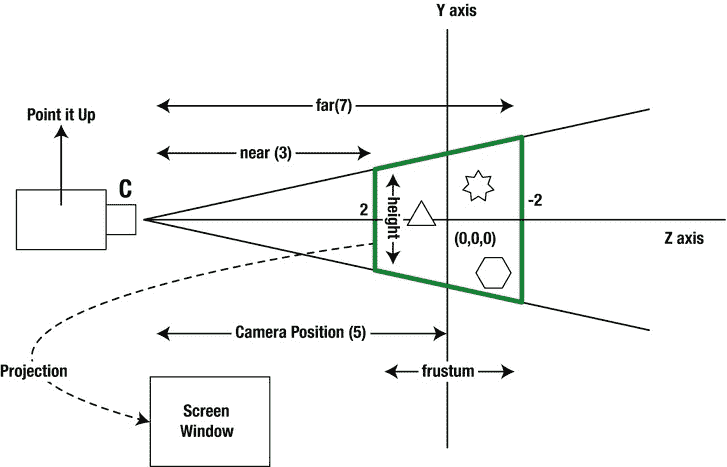

图 9-1。

OpenGL viewing concepts using a camera analogy

看着图 9-1 ，你可能会想为什么图中的轴是 y 和 z，而不是 x 和 y。这是因为我们使用的惯例是 OpenGL 相机看向深度——z 轴，如果你的场景法线平面是 xy 平面。这个约定很好，因为我们通常将 z 轴作为深度轴。

一旦你放置好相机，你就开始向前看，看你想捕捉场景的哪个部分。你把相机对准你要看的方向。你正在看的这个远点被称为视点或注视点。点规格实际上是方向的规格。如果将视点指定为(0，0，0)，则假设相机位于(0，0，5)，相机将沿着 z 轴从五个单位的距离看向原点。你可以在图 9-1 中看到这一点，这里摄像机正沿着 z 轴向下看。

进一步想象一下，原点有一个长方形的建筑。你想看它，不是以肖像的方式，而是以风景的方式。你必须做什么显然，您可以将相机留在同一位置，并仍然将其指向原点，但现在您需要将相机旋转 90 度(类似于侧过头来看)。这是摄像机的方向，因为摄像机固定在一个给定的视点上，并观察一个特定的观察点或方向。这个方向称为上矢量。

上方向向量仅标识相机的方向(上、下、左、右或某个角度)。摄像机的这个方向也是使用观察点来指定的。想象一条从原点(不是相机原点，而是世界坐标原点)到这个观察点的直线。这条线在三维空间中与原点所成的任何角度都是相机的方向。

例如，相机的上方向向量可能看起来像(0，1，0)或者甚至像(0，15，0)，这两种向量具有相同的效果。点(0，1，0)是沿 y 轴向上远离原点的点。这意味着您要将摄像机竖直放置。如果使用(0，1，0)，您将颠倒放置相机。在这两种情况下，相机仍然在同一点(0，0，5)并看着同一个原点(0，0，0)。

我们现在可以总结三个与摄像机相关的坐标:

*   (0，0，5):视点(相机的位置)
*   (0，0，0):注视点(相机指向的方向)
*   (0，1，0):向上向量(相机是向上、向下还是倾斜)

你将使用`gluLookAt`方法来指定这三个点——视点、观察点和上矢量——如清单 9-10 所示:

清单 9-10。设置摄像机

`gluLookAt(gl, 0,0,5,    0,0,0,   0,1,0);`

这些参数是:(1)第一组坐标属于眼点，(2)第二组坐标属于注视点，以及(3)第三组坐标属于相对于原点的上矢量。

现在来讨论一下观看量。

#### GL 平截头体和观察体积

你可能已经注意到，使用`gluLookAt`描述相机位置的点都不涉及尺寸。它们都只涉及定位、方向和方向。你如何告诉照相机聚焦在哪里？你要捕捉的对象离你有多远？主题区域有多宽多高？您使用 OpenGL 方法`glFrustum`来指定您感兴趣的场景区域。

如果你想象自己坐在一个礼堂里看戏，那么舞台就是你的观看空间。你真的不需要知道这个阶段之外会发生什么。然而，你确实关心这个阶段的维度，因为你想观察这个阶段上/内发生的一切。

将场景区域想象成由一个盒子包围，也称为视锥体或视见体积(这是由图 9-1 中间的粗体边框标记的区域)。框内的任何内容都会被捕获，框外的任何内容都会被剪切和忽略。那么如何指定这个查看框呢？你首先决定近点，或者相机和盒子的起点之间的距离。然后你可以选择一个远点，这个远点就是相机到盒子末端的距离。沿 z 轴的近点和远点之间的距离是盒子的深度。如果您指定近点为 50，远点为 200，那么您将捕捉这些点之间的所有内容，并且您的长方体深度将为 150。您还需要指定盒子的左侧、右侧、顶部和底部。此处使用的尺寸是相对于建模的对象而言的。例如，清单 9-3 中的三角形尺寸将与这个观察体积相关。

在 OpenGL 中，你可以用两种方式想象这个盒子。一种叫做透视投影，它涉及到我们一直在谈论的平截头体。这个视图模拟了一个类似照相机的功能，包括一个金字塔结构，其中远平面作为底部，照相机作为顶点。近平面切掉金字塔的顶部，在近平面和远平面之间形成平截头体。

想象盒子的另一种方式是把它想象成一个直角棱镜(一维较长的立方体)。第二种情况称为正交投影，适用于需要保留尺寸的几何图形，而不管它们与相机的距离。清单 9-11 显示了如何为我们的例子指定平截头体。

清单 9-11。通过 glFrustum 指定平截头体

`//calculate aspect ratio first`

`//w – width of the window/view`

`//h – height of the window/view`

`float ratio = (float) w / h;`

`//indicate that we want a perspective projection`

`glMatrixMode(GL10.GL_PROJECTION);`

`//Specify the frustum: the viewing volume`

`gl.glFrustumf(`

`-ratio,    // Left side of the viewing box`

`ratio,     // right side of the viewing box`

`1,         // top of the viewing box`

`-1,        // bottom of the viewing box`

`3,         // how far is the front of the box from the camera`

`7);        // how far is the back of the box from the camera`

因为我们在前面的代码(清单 9-11)中将顶部设置为`1`，底部设置为`-1`，所以我们将盒子的前部高度设置为`2`单位。考虑到窗口的长宽比，我们使用比例数字来指定平截头体左侧和右侧的大小。这就是为什么这段代码使用窗口的高度和宽度来计算比例。该代码还假设动作区域位于 z 轴上的`3`和`7`单位之间。相对于相机，画在这些坐标之外的任何东西都是不可见的。

因为我们将相机设置为(0，0，5)并指向(0，0，0)，所以从相机到原点的三个单位将是(0，0，2)，从相机到原点的七个单位将是(0，0，2)。这会将原点平面留在 3D 长方体的正中间。

现在我们已经确定了可视体积的大小。还有一个更重要的 API，它将这些尺寸映射到屏幕上:`glViewport`。

#### GL 视窗和屏幕尺寸

`glViewport`负责指定屏幕上的矩形区域，观察体积将被投影到该区域上。该方法使用四个参数来指定矩形框:左下角的 x 和 y 坐标，后跟宽度和高度。清单 9-12 是指定一个视图作为投影目标的例子。

清单 9-12。通过 glViewPort 定义视口

`glViewport(0,        // lower left "x" of the rectangle on the screen`

`0,        // lower left "y" of the rectangle on the screen`

`width,    // width of the rectangle on the screen`

`height);  // height of the rectangle on the screen`

如果您的窗口或视图大小为 100 像素高，平截头体高度为 10 个单位，那么世界坐标中的每个逻辑单位 1 都转换为屏幕坐标中的 10 个像素。

到目前为止，我们已经介绍了 OpenGL 中的关键概念，而不管 OpenGL 是在什么平台上实现的。理解这些 OpenGL 基础知识对于学习如何在 Android 平台上编写 OpenGL 代码也是必不可少的。有了这些先决条件之后，我们现在讨论在 Android 中需要什么来调用我们到目前为止已经讨论过的 OpenGL ES APIs，并尝试绘制清单 9-3 中所设想的三角形。

## OpenGL ES 与 Android 的接口

如上所述，OpenGL ES 是一种被许多平台支持的标准。如你所见，它的核心是一个类似“C”的 API，处理所有的 OpenGL 绘图杂务。然而，每个平台和操作系统在实现 OpenGL 上下文、显示、屏幕缓冲等方面是不同的。这些特定于操作系统的方面留给每个操作系统来实现。一个叫做 EGL 的标准被用来实现这些细节。虽然 Android 在必要时直接公开了 EGL API，但它也定义了面向对象的抽象来隐藏 EGL 的重复节奏。

### 使用 GLSurfaceView 和相关类

从 SDK 的 1.5 版本开始，使用 OpenGL 的常见使用模式被大大简化了。(参考本书第一版，看 Android 1.0 的做法。)实现这个交互的关键类和接口是`GLSurfaceView`和`Renderer`。(所以，除非你想追踪某个特定的行为，否则你不会直接与 EGL 合作。)

以下是使用这些类进行绘制的典型步骤:

Implement the `GLSurfaceView.Renderer` interface.   Set up key OpenGL parameters that control the general behavior of OpenGL, and provide the camera settings needed for your drawing in the implementation of this renderer. (You do this in `onCreateSurface` and `onSurfaceChanged` callbacks of the renderer interface)   Provide drawing code in the `onDrawFrame` method of the renderer implementation.   Construct a `GLSurfaceView`, to which you can pass your implemented renderer.   Set the renderer implemented in steps 1 to 3 in the `GLSurfaceView`.   Indicate whether you want animation or not to the `GLSurfaceView`.   Set the `GLSurfaceView` in an activity as the content view. You can also use this view wherever you can use a regular view. But keep in mind that all drawing in a GLSurfaceView takes place in a dedicated secondary thread. This is in contrast to regular views, which are painted by the main thread of your application.  

让我们从如何实现渲染器接口开始。

### 实现渲染器

清单 9-13 显示了渲染器接口的签名。

清单 9-13。渲染器接口

`public static interface GLSurfaceView.Renderer`

`{`

`void onDrawFrame(GL10 gl);`

`void onSurfaceChanged(GL10 gl, int width, int height);`

`void onSurfaceCreated(GL10 gl, EGLConfig config);`

`}`

主绘图发生在`onDrawFrame()`方法中。每当为这个视图创建一个新的表面时，就会调用`onSurfaceCreated()`方法。我们可以在这个方法中调用许多 OpenGL APIs，这些 API 被认为是设置 OpenGL 上下文和其他全局级别的 OpenGL 参数。参见清单 9-14(这里我们定义了一个抽象呈现器),了解从这个方法调用的方法类型。

类似地，当一个表面改变时，比如窗口的宽度和高度，调用`onSurfaceChanged()`方法。我们可以在这里设置我们的观看音量。

在`onDrawFrame()`方法中，我们设置摄像机并绘制所需的顶点。如果我们在一个场景中绘制多个对象，或者计划使用相同的设置来绘制多个示例，那么拥有一个抽象类会有所帮助，该类在各自的方法中执行以下所有操作:

Set up global OpenGL behavior (`onSurfaceCreated`)   Set up view port (`onSurfaceChanged`)   Set up camera (`onDrawFrame`)  

然后我们可以让`onDrawFrame`通过一个类似于“`draw()`”的重写方法将实际的绘图(指定顶点、模型转换和绘图)委托给一个派生类这就是你在清单 9-14 中看到的，我们已经给出了抽象渲染器类的源代码。

清单 9-14。抽象渲染器//文件名:AbstractRenderer.java

`//...Not all imports listed: See the full file in the download`

`//Or you can autogenerate the rest`

`import javax.microedition.khronos.egl.EGLConfig;`

`import javax.microedition.khronos.opengles.GL10;`

`import android.opengl.GLU;`

`public abstract class AbstractRenderer`

`implements android.opengl.GLSurfaceView.Renderer`

`{`

`public void onSurfaceCreated(GL10 gl, EGLConfig eglConfig) {`

`gl.glDisable(GL10.GL_DITHER);`

`gl.glHint(GL10.GL_PERSPECTIVE_CORRECTION_HINT`，

`GL10.GL_FASTEST);`

`gl.glClearColor(.5f, .5f, .5f, 1);`

`gl.glShadeModel(GL10.GL_SMOOTH);`

`gl.glEnable(GL10.GL_DEPTH_TEST);`

`}`

`public void onSurfaceChanged(GL10 gl, int w, int h) {`

`gl.glViewport(0, 0, w, h);`

`float ratio = (float) w / h;`

`//The following three methods used in succession`

`//sets up the projection matrix.`

`//Indicate we are going to target the projection matrix`

`gl.glMatrixMode(GL10.GL_PROJECTION);`

`// Set that matrix to the identity matrix`

`gl.glLoadIdentity();`

`//This multiplies the previous matrix with the projection matrix`

`gl.glFrustumf(-ratio, ratio, -1, 1, 3, 7);`

`}`

`public void onDrawFrame(GL10 gl)`

`{`

`gl.glDisable(GL10.GL_DITHER);`

`gl.glClear(GL10.GL_COLOR_BUFFER_BIT | GL10.GL_DEPTH_BUFFER_BIT);`

`//See how similarly we are working with and setting the model/view matrix`

`gl.glMatrixMode(GL10.GL_MODELVIEW);`

`gl.glLoadIdentity();`

`GLU.gluLookAt(gl, 0, 0, -5, 0f, 0f, 0f, 0f, 1.0f, 0.0f);`

`gl.glEnableClientState(GL10.GL_VERTEX_ARRAY);`

`draw(gl);`

`}`

`protected abstract void draw(GL10 gl);`

`}`

拥有这个抽象类非常有用，因为它允许我们只关注绘图方法。我们使用这个类来创建一个`SimpleTriangleRenderer`类；清单 9-15 显示了源代码。

清单 9-15。简单三角形渲染器

`//filename: SimpleTriangleRenderer.java`

`public class SimpleTriangleRenderer extends AbstractRenderer`

`{`

`//Number of points or vertices we want to use`

`private final static int VERTS = 3;`

`//A raw native buffer to hold the point coordinates`

`private FloatBuffer mFVertexBuffer;`

`//A raw native buffer to hold indices`

`//allowing a reuse of points.`

`private ShortBuffer mIndexBuffer;`

`public SimpleTriangleRenderer(Context context)`

`{`

`ByteBuffer vbb = ByteBuffer.allocateDirect(VERTS * 3 * 4);`

`vbb.order(ByteOrder.nativeOrder());`

`mFVertexBuffer = vbb.asFloatBuffer();`

`ByteBuffer ibb = ByteBuffer.allocateDirect(VERTS * 2);`

`ibb.order(ByteOrder.nativeOrder());`

`mIndexBuffer = ibb.asShortBuffer();`

`float[] coords = {`

`-0.5f, -0.5f, 0, // (x1,y1,z1)`

`0.5f, -0.5f, 0`，

`0.0f,  0.5f, 0`

`};`

`for (int i = 0; i < VERTS; i++) {`

`for(int j = 0; j < 3; j++) {`

`mFVertexBuffer.put(coords[i*3+j]);`

`}`

`}`

`short[] myIndecesArray = {0,1,2};`

`for (int i=0;i<3;i++)`

`{`

`mIndexBuffer.put(myIndecesArray[i]);`

`}`

`mFVertexBuffer.position(0);`

`mIndexBuffer.position(0);`

`}`

`//overridden method: more accurately implemented method`

`protected void draw(GL10 gl)`

`{`

`gl.glColor4f(1.0f, 0, 0, 0.5f);`

`gl.glVertexPointer(3, GL10.GL_FLOAT, 0, mFVertexBuffer);`

`gl.glDrawElements(GL10.GL_TRIANGLES, VERTS`，

`GL10.GL_UNSIGNED_SHORT, mIndexBuffer);`

`}`

`}`

虽然这里看起来有很多代码，但大部分都是用来定义顶点，然后将它们从 Java 缓冲区翻译到 NIO 缓冲区。否则，`draw`方法只是三行:设置颜色、设置顶点和绘制。

Note

尽管我们正在为`nio`缓冲区分配内存，但是我们从来没有在代码中释放它们。那么谁来释放这些缓冲呢？这个内存对 OpenGL 有什么影响？

根据我们的研究，`java.nio`包在 Java 堆之外分配内存空间，这些空间可以被 OpenGL、文件 I/O 等系统直接使用。`nio`缓冲区实际上是最终指向本机缓冲区的 Java 对象。这些`nio`物品是垃圾收集。当它们被垃圾收集时，它们会删除本机内存。Java 程序不需要做任何特殊的事情来释放内存。

然而，`gc`不会被触发，除非 Java 堆中需要内存。这意味着您可能会耗尽本机内存，而`gc`可能不会意识到这一点。互联网上提供了许多关于这个主题的例子，其中内存不足异常将触发一个`gc`，然后可以查询由于`gc`被调用，内存现在是否可用。

在一般情况下，您可以分配本机缓冲区，而不必担心显式释放已分配的内存，因为这是由`gc`完成的。

现在您已经有了一个示例渲染器，让我们看看如何将这个渲染器提供给一个`GLSurfaceView`并让它出现在活动中。

### 从活动中使用 GLSurfaceView

清单 9-16 显示了一个典型的活动，它使用了一个`GLSurfaceView`和一个合适的渲染器。

清单 9-16。一个简单的 OpenGLTestHarness 活动

`public class OpenGLTestHarnessActivity extends Activity {`

`private GLSurfaceView mTestHarness;`

`@Override`

`protected void onCreate(Bundle savedInstanceState) {`

`super.onCreate(savedInstanceState);`

`mTestHarness = new GLSurfaceView(this);`

`mTestHarness.setEGLConfigChooser(false);`

`mTestHarness.setRenderer(new SimpleTriangleRenderer(this));`

`mTestHarness.setRenderMode(GLSurfaceView.RENDERMODE_WHEN_DIRTY);`

`//mTestHarness.setRenderMode(GLSurfaceView.RENDERMODE_CONTINUOUSLY);`

`setContentView(mTestHarness);`

`}`

`@Override`

`protected void onResume()    {`

`super.onResume();`

`mTestHarness.onResume(); //Important`

`}`

`@Override`

`protected void onPause() {`

`super.onPause();`

`mTestHarness.onPause(); //Important`

`}`

`}`

让我们检查一下这个源代码的关键元素。下面是实例化`GLSurfaceView`的代码:

`mTestHarness = new GLSurfaceView(this);`

然后我们告诉视图，我们不需要一个特殊的 EGL 配置选择器，默认的配置选择器将通过以下方式工作:

`mTestHarness.setEGLConfigChooser(false);`

然后我们设置我们的渲染器如下:

`mTestHarness.setRenderer(new SimpleTriangleRenderer(this));`

接下来，我们使用这两种方法之一来决定是否允许动画:

`mTestHarness.setRenderMode(GLSurfaceView.RENDERMODE_WHEN_DIRTY);`

`//mTestHarness.setRenderMode(GLSurfaceView.RENDERMODE_CONTINUOUSLY);`

如果我们选择第一行，绘图将只被调用一次，或者更准确地说，是在需要绘制的任何时候。如果我们选择第二个选项，我们的绘图代码将被重复调用，这样我们就可以动画我们的绘图。

Note

根据 Android SDK 文档，当活动暂停和恢复时，您的活动应该告诉`GLSurfaceView`暂停和恢复。这是为了通知总帐绘图线程暂停和恢复。无论哪种方式，每次在活动中使用`GLSurfaceView`时，您都必须这样做。

这就是在 Android 上与 OpenGL 接口的全部内容。

在本章的这一点上，本书以前的版本已经给出了调用该活动的驱动程序的代码。这对于理解 OpenGL 并不是一个非常有用的补充。所以我们删除了所有的代码，留给读者做练习，因为读者应该能够创建一个简单的测试程序来调用清单 9-16 中的活动。我们有可供下载的示例程序，其中包括完整的源代码。下载、编译并运行程序后，选择菜单选项“简单三角形”，你会看到如图 9-2 所示的三角形。

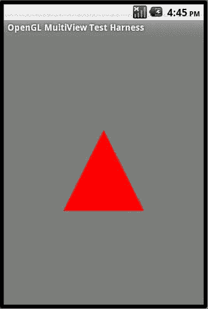

图 9-2。

A simple OpenGL triangle

### 更改相机设置

为了更好地理解 OpenGL 坐标，让我们试验一下与相机相关的方法，看看它们如何影响我们在图 9-2 中绘制的三角形。记住这些是我们三角形的点:`(-0.5,-0.5,0     0.5,-0.5,0    0,0.5,0)`。有了这些点，下面三个在`AbstractRenderer`(清单 9-14)中使用的与摄像机相关的方法产生了如图 9-2 所示的三角形:

`//Look at the screen (origin) from 5 units away from the front of the screen`

`GLU.gluLookAt(gl, 0,0,-5,    0,0,0,   0,1,0);`

`//Set the height to 2 units and depth to 4 units`

`gl.glFrustumf(-ratio, ratio, -1, 1, 3, 7);`

`//normal window stuff`

`gl.glViewport(0, 0, w, h);`

现在，假设您将相机的上方向向量更改为负 y 方向，如下所示:

`GLU.gluLookAt(gl, 0,0,5,    0,0,0,   0,-1,0);`

如果你这样做，你会看到一个倒置的三角形(图 9-3 )。如果你想做这个改变，你可以在`AbstractRenderer.java`文件中找到改变的方法(清单 9-14)。

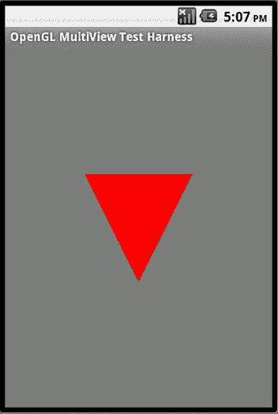

图 9-3。

A triangle with the camera upside down

现在让我们看看如果我们改变平截头体(也称为观察体或观察框)会发生什么。以下代码将查看框的高度和宽度增加了 4 倍(参见图 9-1 了解这些尺寸)。如果您还记得，`glFrustum`的前四个参数指向查看框的前矩形。通过将每个值乘以 4，我们将查看框缩放了四倍，如下所示:

`gl.glFrustumf(-ratio * 4, ratio * 4, -1 * 4, 1 *4, 3, 7);`

有了这段代码，我们看到的三角形缩小了，因为三角形保持不变，而我们的观察框却变大了(图 9-4 )。这个方法调用出现在`AbstractRenderer.java`类中(见清单 9-14)。

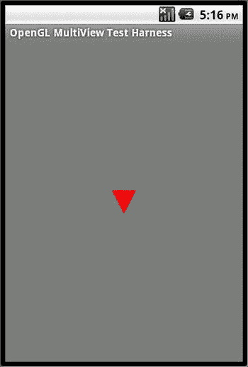

图 9-4。

A triangle with a viewing box that is four times bigger

### 使用索引添加另一个三角形

我们通过继承`AbstractRenderer`类来总结这些简单的三角形示例，并通过添加一个额外的点和使用索引来创建另一个三角形。概念上，我们将这四个点定义为`(-1,-1,    1,-1,    0,1,    1,1)`。我们要求 OpenGL 把这些画成`(0,1,2    0,2,3)`。清单 9-17 显示了这样做的代码(注意我们改变了三角形的尺寸)。

清单 9-17。SimpleTriangleRenderer2 类

`//filename: SimpleTriangleRenderer2.java`

`public class SimpleTriangleRenderer2 extends AbstractRenderer`

`{`

`float[] coords = {`

`-1.0f, -1.0f, 0, // (x1,y1,z1)`

`1.0f, -1.0f, 0`，

`0.0f,  1.0f, 0`，

`1.0f,  1.0f, 0`

`};`

`......other code modifications to match coords variable`

`..use listing 9-15 as an example`

`short[] myIndecesArray = {0,1,2,    0,2,3};`

`}`

添加完这段代码后，我们可以再次运行程序，选择菜单选项“两个三角形”来查看绘制出来的两个三角形(见图 9-5 )。

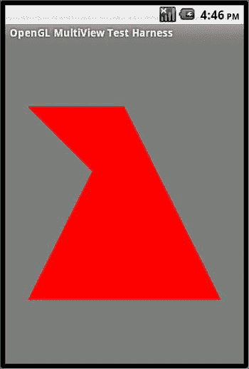

图 9-5。

Two triangles with four points

### 制作简单的 OpenGL 三角形动画

我们可以通过改变`GLSurfaceView`对象的渲染模式来轻松适应 OpenGL 动画。清单 9-18 显示了示例代码。

清单 9-18。指定连续渲染模式

`//get a GLSurfaceView`

`GLSurfaceView openGLView;`

`//Set the mode to continuous draw mode`

`openGLView.setRenderMode(GLSurfaceView.RENDERMODE_CONTINUOUSLY);`

注意，我们在这里展示了如何改变渲染模式，因为我们在前面的部分已经指定了`RENDERMODE_WHEN_DIRTY`(见清单 9-16)。如前所述，`RENDERMODE_CONTINUOUSLY`是默认设置，所以默认启用动画。

一旦渲染模式是连续的，就由渲染器的`onDraw`方法来做影响动画所必需的事情。为了演示这一点，让我们使用上一个例子中画的三角形(见清单 9-15 和图 9-2 )并以圆形的方式旋转它。

#### 动画 SimpleTriangleRenderer

除了在`onDraw`方法中发生的事情之外，`AnimatedSimpleTriangleRenderer`类与`SimpleTriangleRenderer`非常相似(见清单 9-15)。在这种方法中，我们每四秒钟设置一个新的旋转角度。随着图像被反复绘制，我们看到三角形在缓慢旋转。清单 9-19 包含了`AnimatedSimpleTriangleRenderer`类的完整实现。

清单 9-19。animated example triangle renderer 源码

`//filename: AnimatedSimpleTriangleRenderer.java`

`public class AnimatedSimpleTriangleRenderer extends AbstractRenderer`

`{`

`.....Same code here as in the SimpleTriangleRenderer method`

`//overridden method`

`protected void draw(GL10 gl)`

`{`

`long time = SystemClock.uptimeMillis() % 4000L;`

`float angle = 0.090f * ((int) time);`

`gl.glRotatef(angle, 0, 0, 1.0f);`

`gl.glColor4f(1.0f, 0, 0, 0.5f);`

`gl.glVertexPointer(3, GL10.GL_FLOAT, 0, mFVertexBuffer);`

`gl.glDrawElements(GL10.GL_TRIANGLES, VERTS`，

`GL10.GL_UNSIGNED_SHORT, mIndexBuffer);`

`}`

`}`

在清单 9-19 中，方法`glRotate()`看似简单，并没有引起潜在的问题。然而，我们问:我们知道旋转是一种变换，因此涉及到一个矩阵，但是是哪个矩阵呢？如前所述，有三种矩阵:模型视图、投影和纹理。文档显示旋转调用更新了当前的模型视图矩阵。我们在哪里设置了当前的模型视图矩阵？它之前的值是多少？好吧，事实证明，我们有点幸运，这个方法成功了。如果你看到清单 9-14 的抽象呈现器，你会意识到我们已经通过调用`glMatrixMode()`将目标矩阵设置为模型视图。在相同的抽象渲染器代码中，我们对模型视图矩阵应用了视点坐标转换。这意味着旋转应用于整个场景，而不仅仅是三角形对象。

因此，其含义是:如果您的意图是多次放置对象，并在旋转场景之前首先旋转对象，那么应该在模型变换之后应用眼睛坐标变换。我们现在把它作为一个练习，来重塑你的抽象类以适应这个目标。

要查看清单 9-19 中实现的动画三角形，你可以使用本章提供的示例程序。您可以在参考资料部分看到这个程序的 zip 文件的参考资料。在示例程序中，选择菜单选项“动画三角形”来查看由清单 9-19 实现的三角形，最初显示在图 9-2 旋转中。

## 勇敢面对 OpenGL:形状和纹理

在本节中，我们将介绍三件事情:使用形状来简化顶点指定，使用纹理(将图像附加到表面)，以及在场景中绘制多个图形。这些基础知识应该会让你更接近开始创建可行的 3D 人物和场景。尽管下面的小节也关注 ES 1.0，但是这些信息同样适用于 ES 2.0。事实上，首先在 1.0 的上下文中解释这些概念，然后指出 ES 2.0 中采取的灵活方法更容易。

### 使用形状

显式指定要绘制的顶点的方法可能很繁琐。例如，如果您想要绘制一个有 20 条边的多边形，那么您需要指定 20 个顶点，每个顶点最多需要三个值。总共有 60 个值。太乏味了。

#### 作为形状的正多边形

绘制三角形或正方形等图形的更好方法是通过定义抽象多边形的某些方面(如原点和半径)来定义它，然后让该多边形为您提供顶点数组和索引数组。比方说，你把这个类叫做`RegularPolygon`。然后你可以使用这个类，如清单 9-20 所示，来绘制各种规则多边形。

清单 9-20。使用规则多边形对象

`//A polygon with 4 sides and a radious of 0.5`

`//and located at (x,y,z) of (0,0,0)`

`RegularPolygon``square``= new``RegularPolygon`

`//Let the polygon return the vertices`

`mFVertexBuffer = square.getVertexBuffer();`

`//Let the polygon return the triangles`

`mIndexBuffer = square.getIndexBuffer();`

`//you will need this for glDrawElements`

`numOfIndices = square.getNumberOfIndices();`

`//set the buffers to the start`

`this.mFVertexBuffer.position(0);`

`this.mIndexBuffer.position(0);`

`//set the vertex pointer`

`gl.glVertexPointer(3, GL10.GL_FLOAT, 0, mFVertexBuffer);`

`//draw it with the given number of Indices`

`gl.glDrawElements(GL10.GL_TRIANGLES, numOfIndices`，

`GL10.GL_UNSIGNED_SHORT, mIndexBuffer);`

注意你是如何从形状`square`中获得必要的顶点和索引的。更有可能的是，`RegularPolygon`可以从定义“形状”契约的接口的基本形状中导出。清单 9-21 显示了一个形状界面的例子。

清单 9-21。形状界面

`public interface Shape`

`{`

`FloatBuffer    getVertexBuffer();`

`ShortBuffer    getIndexBuffer();`

`int            getNumberofIndices();`

`//You could even go further with`

`//getTextureBuffer(), getTextureImage() etc.`

`}`

#### 实现规则多边形形状

如前所述，这个`RegularPolygon`负责返回使用 OpenGL 顶点绘制所需的内容。对于正多边形，有许多方法可以做到这一点。由于篇幅限制，我们不打算在这里展示其中一些类的完整源代码。您可以在本章的下载示例中看到本章中提到但没有包括的那些类的源代码(参见参考资料)。比代码更重要的是，这里有到达这些顶点的方法和逻辑。

在我们的方法中，我们使用边的数量和从正多边形的中心到它的一个顶点的距离来定义正多边形。我们称这个距离为半径，因为正多边形的顶点落在一个圆的周长上，这个圆的中心也是正多边形的中心。所以这样一个圆的半径和边数会告诉我们想要的多边形。通过指定中心的坐标，我们也知道在几何图形中的何处绘制多边形。

我们首先假设半径是一个单位。我们算出连接多边形中心和每个顶点的每条线的角度。我们把这些角度放在一个数组里。对于每个角度，我们计算 x 轴投影，并将其称为“x 乘数阵列”。(我们使用“乘数阵列”,因为我们从半径单位开始。)当我们知道真实半径时，我们将这些值与真实半径相乘，得到真实的 x 坐标。这些真实的 x 坐标被存储在一个名为“x 数组”的数组中我们对 y 轴投影做同样的处理。虽然这里所说的逻辑非常简单，但是代码很长而且非常详细，读起来像数学。相反，我们建议下载 zip 文件并查看代码。

#### 制作规则多边形动画

既然我们已经展示了通过`RegularPoygon`绘制形状的基本思想，让我们变得复杂一点。让我们看看是否可以使用一个动画，通过使用一个多边形，我们从一个三角形开始，以一个圆形结束，这个多边形的边大约每四秒钟增加一次。要在 draw 方法中简单地做到这一点，实例化一个增加大小计数的多边形，并告诉渲染器连续绘制。这个类如清单 9-22 所示。

清单 9-22。多边租赁公司

`public class PolygonRenderer extends AbstractRenderer`

`{`

`//Number of points or vertices we want to use`

`private final static int VERTS = 4;`

`//A raw native buffer to hold the point coordinates`

`private FloatBuffer mFVertexBuffer;`

`//A raw native buffer to hold indices`

`//allowing a reuse of points.`

`private ShortBuffer mIndexBuffer;`

`private int numOfIndices = 0;`

`private long prevtime = SystemClock.uptimeMillis();`

`private int sides = 3;`

`public PolygonRenderer(Context context)     {`

`prepareBuffers(sides);`

`}`

`//Parameterized polygon whose sides vary`

`//with each animation time.`

`private void prepareBuffers(int sides)    {`

`RegularPolygon t = new RegularPolygon(0,0,0,1,sides);`

`this.mFVertexBuffer = t.getVertexBuffer();`

`this.mIndexBuffer = t.getIndexBuffer();`

`this.numOfIndices = t.getNumberOfIndices();`

`this.mFVertexBuffer.position(0);`

`this.mIndexBuffer.position(0);`

`}`

`//overridden method`

`protected void draw(GL10 gl)    {`

`long curtime = SystemClock.uptimeMillis();`

`if ((curtime - prevtime) > 2000)        {`

`prevtime = curtime;`

`sides += 1;`

`if (sides > 20)        {`

`sides = 3;`

`}`

`this.prepareBuffers(sides);`

`}`

`gl.glColor4f(1.0f, 0, 0, 0.5f);`

`gl.glVertexPointer(3, GL10.GL_FLOAT, 0, mFVertexBuffer);`

`gl.glDrawElements(GL10.GL_TRIANGLES, this.numOfIndices`，

`GL10.GL_UNSIGNED_SHORT, mIndexBuffer);`

`}`

`}`

如果运行示例程序并选择菜单项“多边形”，您将看到一组边数不断增加的变换多边形。观察多边形随时间的进展是有启发性的。图 9-6 显示了循环开始时的六边形。

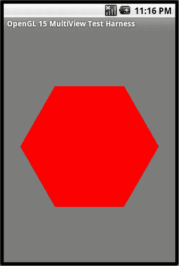

图 9-6。

Hexagon at the beginning of the polygon drawing cycle

图 9-7 显示了循环即将结束时的情况。

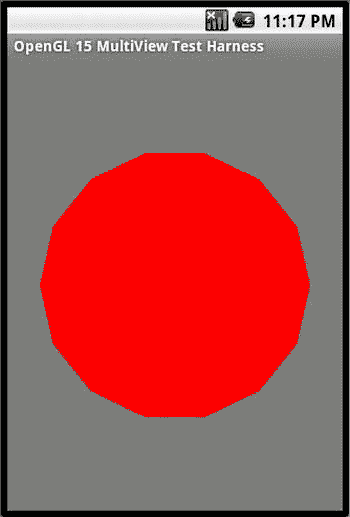

图 9-7。

A circle being drawn as a regular polygon

您可以将这种抽象形状的思想扩展到更复杂的形状，甚至扩展到一个场景图，其中包含许多通过某种类型的 XML 定义的其他对象，然后使用这些实例化的对象在 OpenGL 中呈现它们。

现在让我们转到纹理，看看如何将粘贴壁纸的想法整合到我们迄今为止绘制的表面上，如正方形和多边形。

### 使用纹理

纹理是 OpenGL 的另一个核心主题。OpenGL 纹理有许多细微差别。我们在这一章中讲述了纹理的基础知识，这样你就可以开始使用 OpenGL 纹理了。在 ES 1.x 和 2.0 中，纹理的基本原理是相似的，尽管它们在实现上略有不同。我们在这一节中介绍 ES 1.0 纹理，然后在 ES 2.0 一节中介绍 ES 2.0 纹理。

#### 理解纹理

OpenGL 纹理是在 OpenGL 中粘贴到曲面上的位图。(在这一章，我们只涉及 2D 表面纹理。)例如，您可以将邮票的图像粘贴到一个正方形上，使正方形看起来像邮票。或者你可以把一块砖的位图粘贴到一个矩形上，重复砖的图像，使矩形看起来像一堵砖墙。

将纹理位图附加到 OpenGL 表面的过程类似于将一张壁纸(形状为正方形)粘贴到形状规则或不规则的对象的侧面。只要你选择一张足够大的纸来覆盖它，表面的形状并不重要。然而，要放置纸张以使图像正确对齐，您必须将 OpenGL 形状的每个顶点(每个表面)准确地标记在壁纸上，以便壁纸和对象的形状保持一致。如果 OpenGL 表面形状看起来很奇怪，并且有许多顶点，那么每个顶点也需要在你的纸上(纹理)标记出来。

另一种方式是想象你把平面的 OpenGL 对象面朝上放在地上，把壁纸放在上面，然后旋转纸张直到图像对准正确的方向。现在你在纸的每个顶点上戳一些洞。你拿走纸，看看孔在哪里，并在纸上记下它们的坐标，假设纸是校准过的。这些坐标被称为纹理坐标。

#### 归一化纹理坐标

这里没有说明的细节是物体和纸张的尺寸。OpenGL 使用规范化的方法来解决这个问题。OpenGL 假设纸张始终是一个 1 × 1 的正方形，原点在(0，0)，右上角在(1，1)。然后 OpenGL 要你缩小你的物体表面，让它适合这些 1 × 1 的边界。因此，程序员的任务是计算出 1 × 1 正方形中物体表面的顶点。当您希望纹理图像占据对象曲面的整个空间时，请确保对象顶点都位于纹理坐标的(0，0)到(1，1)范围内。但是，您可以指定特定顶点的纹理坐标在 x 方向或 y 方向大于 1。在这种情况下，您需要告诉 OpenGL 如何映射(0，0)和(1，1)之外的空间。这称为包装模式。

在一种包装模式中，您可以告诉 OpenGL 在纹理图像每次越过 0 到 1 的边界时重复纹理图像。因此，如果你说 1.4 是你的顶点的纹理坐标，那么你的纹理元素(纹理图像中相应的像素)将是从开始的第 40 个百分点。如果你的顶点在 2.4，那么你在这个顶点绘制的纹理元素将会是第 40 百分位的纹理元素(从 0 开始)。所以你已经在给定的方向上绘制了两次纹理图像，然后当你到达 2.4 的顶点时，绘制了它的 1/4。这是一个非常迂回的说法，你重复图像，直到你用尽空间。当我们在特定 API 的上下文中讨论包装模式时，会进一步解释这一点。

#### 抽象常见纹理处理

一旦您理解了纹理坐标和顶点坐标之间的映射，并且能够计算出纹理贴图的坐标，剩下的就足够简单了。(OpenGL 中没有什么可以大胆地说成“相当简单！”)后续工作包括将纹理位图加载到内存中，并给它一个纹理 ID，以便您可以在后续 API 中引用该纹理。这个纹理 ID 有时也称为“纹理名称”然后，为了允许同时加载多个纹理，可以通过指定 ID 来设置当前纹理。

一旦纹理加载并可用，在绘制管道期间，您可以指定纹理坐标和顶点坐标。然后你画。因为加载纹理的过程相当常见，我们通过一个继承自`AbstractRenderer`的抽象类`SingleAbstractTextureRenderer`抽象了这个过程(见清单 9-14)。这意味着我们通过`AbstractRenderer`的基类继续使用之前的抽象，并通过`SingleAbstractTextureRenderer`提供额外的纹理抽象。

清单 9-23 显示了源代码，它抽象了一个纹理的所有设置代码。根据源代码，我们逐行解释了几乎所有的函数。

清单 9-23。抽象单一纹理支持

`public abstract class AbstractSingleTexturedRenderer`

`extends AbstractRenderer`

`{`

`int mTextureID;        // var to hold ID/Name of the single texture`

`int mImageResourceId;  // Image that becomes the texture`

`Context mContext;     // In case we need the activity context`

`public AbstractSingleTexturedRenderer(Context ctx`，

`int imageResourceId) {`

`mImageResourceId = imageResourceId;`

`mContext = ctx;`

`}`

`public void onSurfaceCreated(GL10 gl, EGLConfig eglConfig) {`

`super.onSurfaceCreated(gl, eglConfig);`

`gl.glEnable(GL10.GL_TEXTURE_2D);`

`prepareTexture(gl);`

`}`

`private void prepareTexture(GL10 gl)`

`{`

`int[] textures = new int[1];`

`gl.glGenTextures(1, textures, 0);`

`mTextureID = textures[0];`

`gl.glBindTexture(GL10.GL_TEXTURE_2D, mTextureID);`

`gl.glTexParameterf(GL10.GL_TEXTURE_2D, GL10.GL_TEXTURE_MIN_FILTER`，

`GL10.GL_NEAREST);`

`gl.glTexParameterf(GL10.GL_TEXTURE_2D, GL10.GL_TEXTURE_MAG_FILTER`，

`GL10.GL_LINEAR);`

`gl.glTexParameterf(GL10.GL_TEXTURE_2D, GL10.GL_TEXTURE_WRAP_S`，

`GL10.GL_CLAMP_TO_EDGE);`

`gl.glTexParameterf(GL10.GL_TEXTURE_2D, GL10.GL_TEXTURE_WRAP_T`，

`GL10.GL_CLAMP_TO_EDGE);`

`gl.glTexEnvf(GL10.GL_TEXTURE_ENV, GL10.GL_TEXTURE_ENV_MODE`，

`GL10.GL_REPLACE);`

`InputStream is = mContext.getResources()`

`.openRawResource(this.mImageResourceId);`

`Bitmap bitmap;`

`try {`

`bitmap = BitmapFactory.decodeStream(is);`

`} finally {`

`try {`

`is.close();`

`} catch(IOException e) {`

`// Ignore.`

`}`

`}`

`GLUtils.texImage2D(GL10.GL_TEXTURE_2D, 0, bitmap, 0);`

`bitmap.recycle();`

`}`

`public void onDrawFrame(GL10 gl)`

`{`

`gl.glDisable(GL10.GL_DITHER);`

`gl.glClear(GL10.GL_COLOR_BUFFER_BIT | GL10.GL_DEPTH_BUFFER_BIT);`

`gl.glMatrixMode(GL10.GL_MODELVIEW);`

`gl.glLoadIdentity();`

`GLU.gluLookAt(gl, 0, 0, -5, 0f, 0f, 0f, 0f, 1.0f, 0.0f);`

`gl.glEnableClientState(GL10.GL_VERTEX_ARRAY);`

`gl.glEnableClientState(GL10.GL_TEXTURE_COORD_ARRAY);`

`gl.glActiveTexture(GL10.GL_TEXTURE0);`

`gl.glBindTexture(GL10.GL_TEXTURE_2D, mTextureID);`

`draw(gl);`

`}`

`}`

在这段代码中，单个纹理(一个位图)在`onSurfaceCreated`方法中被加载和准备。与`AbstractRenderer`一样，`onDrawFrame`的代码设置绘图空间的尺寸，以便坐标有意义。根据您的情况，您可能希望更改此代码来计算出您自己的最佳观看音量。请注意构造函数如何获取纹理位图，为以后使用做准备。根据你有多少纹理，你可以相应地创建你的抽象类。

我们现在解释清单 9-23 中的关键部分和 API。

##### 生成纹理名称:glGenTextures

OpenGL 方法`glGenTextures`负责为纹理生成(更像是保留)唯一的 id，以便以后可以引用这些纹理。注意清单 9-24 中的代码。

清单 9-24。生成纹理名称

`int[] textures = new int[1];`

`gl.glGenTextures(1, textures, 0);`

`mTextureID = textures[0];`

对于`glGenTextures`，第一个参数是我们想要的纹理数量，第二个参数是 API 写入返回的纹理整数 id(名称)的数组。第三个参数是 API 要写入的数组中的偏移量。

在此 ID 或名称分配期间，没有加载位图。我们需要这个 ID，因为我们需要指导 OpenGL 设置一些参数来控制这个纹理的行为，包括位图的后续加载。在某种意义上，这就像创建一个纹理对象，以便开始定义它的属性。

##### 设置纹理目标:glBindTexture

OpenGl 可以应用多种类型的纹理。它们是:GL_TEXTURE_1D，GL_TEXTURE_2D，GL_TEXTURE_3D 或 GL_TEXTURE_CUBE_MAP。当你调用纹理 API 时，每个 API 的第一个参数是你所指的纹理类型。因此，这些被称为纹理目标。现在考虑清单 9-25 中的代码。

清单 9-25。将纹理目标绑定到纹理名称

`glBindTexture(GL10.GL_TEXTURE_2D, mTextureID);`

这个方法的第一个参数是纹理目标。第二个参数是纹理的名称或 ID。从代码清单 9-23 中可以知道，`mTextureID`是我们在调用了`glGenTextures.`之后通过分配它得到的名字

那么这个绑定是什么意思呢？OpenGL 令人讨厌地有状态。OpenGL 中有许多 API 操作纹理，这些 API 仅仅表示它们想要操作当前的 2D 纹理。因此，当后续 API 指定对目标`GL_TEXTURE_2D`的操作时，该绑定表示让该 API 影响由纹理 ID: `mTextureID`指示的纹理对象。换句话说，你是说你当前的 2D 纹理指的是绑定到`mTextureID`的纹理。如果您要生成/分配五个纹理名称，并且如果您要将名为“3”的纹理绑定到 2D 纹理，那么所有后续的 API 都会引用纹理对象“3”的 2D 纹理点这是一个相当大的循环，但你去那里。

##### 控制纹理行为:glTexParameter

一旦你感兴趣的纹理(通过它的名字)被绑定到 2D 纹理，你可以通过设置一些纹理参数来控制它的行为。参见清单 9-26 中的代码。

清单 9-26。设置纹理行为

`gl.glTexParameterf(GL10.GL_TEXTURE_2D, GL10.GL_TEXTURE_MIN_FILTER`，

`GL10.GL_NEAREST);`

`gl.glTexParameterf(GL10.GL_TEXTURE_2D, GL10.GL_TEXTURE_MAG_FILTER`，

`GL10.GL_LINEAR);`

`gl.glTexParameterf(GL10.GL_TEXTURE_2D, GL10.GL_TEXTURE_WRAP_S`，

`GL10.GL_CLAMP_TO_EDGE);`

`gl.glTexParameterf(GL10.GL_TEXTURE_2D, GL10.GL_TEXTURE_WRAP_T`，

`GL10.GL_CLAMP_TO_EDGE);`

对于当前的 2D 纹理(基于绑定)，这些方法指示纹理在应用时的行为。

过滤参数:你可能只有一个像小位图一样的图标作为你的纹理，OpenGL 对象的表面可能是你的平板电脑窗口的大小。那么单个纹理元素可以映射到多个像素，从而导致放大。这实质上是放大或放大纹理图像。我们已经指定线性外推这些值。在这种情况下，我们在这个像素周围取四个纹理元素，并得到它们的平均值。当纹理较大时，我们需要缩小纹理以适应表面。在我们的例子中，我们已经指出使用最接近像素坐标的纹理元素。

包裹参数:GL_REPEAT 是纹理图像在曲面上以任一方向(s 或 t–与 x，y 相同)重复的选项。使用 GL_REPEAT，当纹理坐标大于 1(比如 1.3)时，只需使用 0.3 作为新坐标，忽略整数值。结果是，你最终在那个方向上重画图形。您可以在两个方向上应用它，从而在多个方向上复制纹理。相比之下，当您使用选项 GL_CLAMP 进行钳制时，当纹理坐标为 1.3 时，它会将其设置为 1。本质上，你在图片的剩余部分重复坐标 1 处的最后一个纹理元素。因此 GL_CLAMP 的结果是只画一次图片，并根据图片的边缘给其余区域着色。

##### 控制纹理混合行为:glTexEnv

上一节讨论的纹理参数根据像素和纹理坐标控制每个像素的目标颜色。所以你有一个你想搭配的目标颜色。使用`API glTexEnv`，您可以指示如何对已经存在的像素的原始颜色属性做出反应。例如，看一下清单 9-27 中的代码。

清单 9-27。如何融合纹理

`gl.glTexEnvf(GL10.GL_TEXTURE_ENV, GL10.GL_TEXTURE_ENV_MODE`，

`GL10.GL_REPLACE);`

对于 OpenGL ES，第一个参数始终是 GL_TEXTURE_ENV。在主 OpenGL 中似乎有更多可能的值(过滤器控制，点精灵)。当目标是控制混合行为时，第二个参数被设置为环境模式。对于纹理环境模式，可能的选项在第三个参数中指定:GL_REPLACE、GL_DECAL、GL_MODULATE 和 GL_BLEND。

`GL_REPLACE: Use the texel color as the pixel color`

`GL_DECAL: Blend the texel color with the pixel color controlled by the alpha value of the texel`

`GL_MODULATE: Multiply the texel color with the pixel color (especially to retain lighting effects)`

GL_BLEND:无论有没有纹理，混合都是有效的。混合采用前景色，并根据您指定的函数将它们与背景色(使用深度)混合，得到的颜色将是最终的颜色。现在，在纹理的上下文中，使用纹理元素颜色作为前景色，使用像素作为背景色，并使用正在使用的混合功能混合它们。用好 GL_BLEND 是个高级话题。

##### 将位图作为纹理加载:LUtils.texImage2D

让我们看看加载位图图像的代码，如清单 9-28 所示。

清单 9-28。加载纹理图像

`InputStream is = mContext.getResources()`

`.openRawResource(this.mImageResourceId);`

`Bitmap bitmap;`

`try { bitmap = BitmapFactory.decodeStream(is);} finally {`

`try { is.close();}catch(IOException e) {// Ignore.}}`

`GLUtils.texImage2D(GL10.GL_TEXTURE_2D, 0, bitmap, 0);`

`bitmap.recycle();`

首先使用`BitmapFactory`和一个原始位图资源流加载位图。然后，使用该位图对象作为纹理位图，用于当前的 2D 纹理(它已经绑定到您生成的纹理名称)。没错。按照位图类的协议要求调用`bitmap.recycle()`是很重要的。

在内部`GLUtils.texImage2D`调用 OpenGL ES 方法`glTexImage2D`。这个方法对应的参数是(1)纹理目标，(2)级别，(3)位图指针，和(4)边界。“目标”是指我们到目前为止一直使用的 2D 目标。级别与另一个称为 mip/mapping 的纹理概念有关。当需要缩小或放大时，Mip/mapping 允许多个图像用于纹理。在我们的例子中，我们只有一个级别图像，表示为基准级别 0。位图指针参数是指存储在客户端内存中的位图图像。border 指定了边框的宽度，但是对于 es 文档来说，这个值应该是 0。

##### 设置纹理单位:glActiveTexture

当一个表面被纹理化时，OpenGL 允许多个纹理单元生效。到目前为止，我们使用的所有 API 都在活动纹理单元上工作。默认情况下，纹理单元是基本结构单元。当我们调用`glEnable` (GL_TEXTURE_2D)时，我们启用了以纹理 2D 为目标的基本纹理单元(该 API 及其对应部分`glDisable`作用于当前活动的纹理单元)。当启用多个纹理单元时，像素的最终颜色是所有纹理的组合。

让我们检查一下我们用来设置活动纹理的代码，如清单 9-29 所示。

清单 9-29。激活纹理单元

`gl.glActiveTexture(GL10.GL_TEXTURE0);`

`gl.glBindTexture(GL10.GL_TEXTURE_2D, mTextureID);`

基础纹理始终是 GL_TEXTURE0。正如你所看到的，纹理有很多绑定。你可以找出硬件支持多少纹理单元。这个关联的层次是(a)纹理单元，(b)纹理目标(1D 或 2D 等。)、(c)纹理名称和(d)实际纹理位图。难怪纹理是令人生畏的。(你可以在 [`www.khronos.org/opengles/documentation/opengles1_0/html/index.html`](http://www.khronos.org/opengles/documentation/opengles1_0/html/index.html) 的 OpenGL ES 参考中找到这些 API 中的大部分。)

#### 使用纹理绘图

一旦位图被加载并设置为纹理，你所需要的就是一组顶点坐标和一组纹理坐标来绘制纹理图形。我们再次用形状来证明这个观点。我们使用一个能够生成顶点和纹理坐标的`RegularPolygon`来绘制一个正多边形和纹理。清单 9-30 显示了绘制纹理正方形的类。

清单 9-30.TexturedSquareRenderer

`public class TexturedSquareRenderer extends AbstractSingleTexturedRenderer`

`{`

`//Number of points or vertices we want to use`

`private final static int VERTS = 4;`

`//A raw native buffer to hold the point coordinates`

`private FloatBuffer mFVertexBuffer;`

`//A raw native buffer to hold the point coordinates`

`private FloatBuffer mFTextureBuffer;`

`//A raw native buffer to hold indices`

`//allowing a reuse of points.`

`private ShortBuffer mIndexBuffer;`

`private int numOfIndices = 0;`

`private int sides = 4;`

`public TexturedSquareRenderer(Context context)`

`{`

`super(context,com.androidbook.OpenGL.R.drawable.robot);`

`prepareBuffers(sides);`

`}`

`private void prepareBuffers(int sides)`

`{`

`RegularPolygon t = new RegularPolygon(0,0,0,0.5f,sides);`

`this.mFVertexBuffer = t.getVertexBuffer();`

`this.mFTextureBuffer = t.getTextureBuffer();`

`//These textured coordinates for a square will be:`

`//0,0,    0,1,    1,1,    0,0`

`this.mIndexBuffer = t.getIndexBuffer();`

`this.numOfIndices = t.getNumberOfIndices();`

`this.mFVertexBuffer.position(0);`

`this.mIndexBuffer.position(0);`

`this.mFTextureBuffer.position(0);`

`}`

`//overriden method`

`protected void draw(GL10 gl)`

`{`

`prepareBuffers(sides);`

`gl.glEnable(GL10.GL_TEXTURE_2D);`

`gl.glVertexPointer(3, GL10.GL_FLOAT, 0, mFVertexBuffer);`

`gl.glTexCoordPointer(2, GL10.GL_FLOAT, 0, mFTextureBuffer);`

`gl.glDrawElements(GL10.GL_TRIANGLES, this.numOfIndices`，

`GL10.GL_UNSIGNED_SHORT, mIndexBuffer);`

`}`

`}`

在清单 9-30 中，当`RegularPolygon`计算纹理映射顶点时，纹理的大部分繁重工作由抽象纹理渲染器类完成。清单 9-30 中唯一一个新的纹理相关的方法是:

`gl.glTexCoordPointer(2, GL10.GL_FLOAT, 0, mFTextureBuffer);`

该方法仅仅指向包含在缓冲区`mTextureBuffer.`中的一组浮点纹理坐标值。第一个参数值“2”指的是每个纹理坐标的浮点数量。没有`RegularPolygon`的代码，你可能想知道正方形的纹理坐标是什么。

当我们讨论 ES 2.0 纹理时，我们将实际纹理一个立方体，你将能够清楚地看到顶点坐标和相应的纹理坐标。然而，并没有失去一切。即使在这里，我们也应该能够清楚地指出矩形的纹理坐标数组是什么。

我们知道矩形有四个点。我们用这些指数从构成正方形的四个顶点中画出了两个三角形。每个顶点都有一个等价的纹理点。所以我们知道会有四个纹理点。因为纹理坐标总是落在(0，0)到(1，1)的范围内(假设我们不想重复图像)，四个顶点坐标对应的纹理坐标是:

(0，0)//左下方

(0，1)//左上

(1，1)//右上

(1，0)//右下方

不过，有一个警告！在位图中，y 坐标向下增长，在 OpenGL 中，y 向上为正。因此，您可能希望反转 y 坐标，以正确的方向查看图片。现在这些纹理坐标保持不变，即使你的顶点坐标形成一个 10 x 10 的正方形。唯一希望纹理坐标落在(1，1)之外的情况是，如果您想要重复 pictcure(例如，拿一块砖，在一面大墙上重复它)。

现在，如果我们运行示例程序并选择菜单项“纹理正方形”，我们将看到纹理正方形被绘制成如图 9-8 所示。

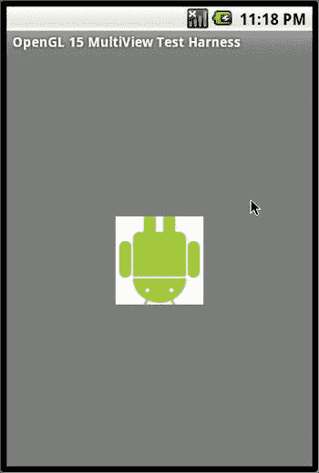

图 9-8。

A textured square

### 绘制多个图形

到目前为止，本章中的每个例子都涉及到按照标准模式绘制一个简单的图形。该模式是设置顶点，加载纹理，设置纹理坐标，并绘制单个图形。如果你想画两个图形会发生什么？如果你想用传统的指定顶点的方法画一个三角形，然后用像`RegularPolygon`这样的形状画一个多边形，该怎么办？如何指定组合顶点？是否必须为两个对象指定一次顶点，然后调用 draw 方法？

事实证明，在 Android OpenGL 渲染器接口的两次`draw()`调用之间，OpenGL 允许你发出多个`glDraw`方法。在这些多种`glDraw`方法之间，你可以设置新的顶点和纹理。一旦`draw()`方法完成，所有这些绘图方法就会出现在屏幕上。

还有另一个技巧，你可以用它来用 OpenGL 绘制多个图形。考虑到目前为止我们已经创建的多边形。这些多边形能够通过将原点作为输入，在任意原点进行自我渲染。事实证明，OpenGL 可以自然地做到这一点，它允许您指定一个总是在(0，0，0)的`RegularPolygon`,并让 OpenGL 的“translate”机制将它从原点移动到所需的位置。您可以对另一个多边形进行同样的操作，并将其平移到不同的位置，从而在屏幕上的两个不同位置绘制两个多边形。

清单 9-31 通过多次绘制纹理多边形展示了这些想法。

清单 9-31。纹理多边形渲染器

`public class TexturedPolygonRenderer extends AbstractSingleTexturedRenderer`

`{`

`//Number of points or vertices we want to use`

`private final static int VERTS = 4;`

`//A raw native buffer to hold the point coordinates`

`private FloatBuffer mFVertexBuffer;`

`//A raw native buffer to hold the point coordinates`

`private FloatBuffer mFTextureBuffer;`

`//A raw native buffer to hold indices`

`//allowing a reuse of points.`

`private ShortBuffer mIndexBuffer;`

`private int numOfIndices = 0;`

`private long prevtime = SystemClock.uptimeMillis();`

`private int sides = 3;`

`public TexturedPolygonRenderer(Context context)`

`{`

`super(context,com.androidbook.OpenGL.R.drawable.robot);`

`prepareBuffers(sides);`

`}`

`private void prepareBuffers(int sides)`

`{`

`RegularPolygon t = new RegularPolygon(0,0,0,0.5f,sides);`

`this.mFVertexBuffer = t.getVertexBuffer();`

`this.mFTextureBuffer = t.getTextureBuffer();`

`this.mIndexBuffer = t.getIndexBuffer();`

`this.numOfIndices = t.getNumberOfIndices();`

`this.mFVertexBuffer.position(0);`

`this.mIndexBuffer.position(0);`

`this.mFTextureBuffer.position(0);`

`}`

`//overridden method`

`protected void draw(GL10 gl)`

`{`

`long curtime = SystemClock.uptimeMillis();`

`if ((curtime - prevtime) > 2000)`

`{`

`prevtime = curtime;`

`sides += 1;`

`if (sides > 20)`

`{`

`sides = 3;`

`}`

`this.prepareBuffers(sides);`

`}`

`gl.glEnable(GL10.GL_TEXTURE_2D);`

`//Draw once to the left`

`gl.glVertexPointer(3, GL10.GL_FLOAT, 0, mFVertexBuffer);`

`gl.glTexCoordPointer(2, GL10.GL_FLOAT, 0, mFTextureBuffer);`

`gl.glPushMatrix();`

`gl.glScalef(0.5f, 0.5f, 1.0f);`

`gl.glTranslatef(0.5f,0, 0);`

`gl.glDrawElements(GL10.GL_TRIANGLES, this.numOfIndices`，

`GL10.GL_UNSIGNED_SHORT, mIndexBuffer);`

`gl.glPopMatrix();`

`//Draw again to the right`

`gl.glPushMatrix();`

`gl.glScalef(0.5f, 0.5f, 1.0f);`

`gl.glTranslatef(-0.5f,0, 0);`

`gl.glDrawElements(GL10.GL_TRIANGLES, this.numOfIndices`，

`GL10.GL_UNSIGNED_SHORT, mIndexBuffer);`

`gl.glPopMatrix();`

`}`

`}`

此示例演示了以下概念:

*   使用形状绘图。
*   使用变换矩阵绘制多个形状。
*   提供纹理。
*   提供动画。

清单 9-31 中负责多次绘制的主要代码在方法`draw()`中。我们在该方法中突出显示了相应的行。注意，在一个`draw()`调用中，我们调用了`glDrawElements`两次。每一次我们都独立于其他时间设置绘图图元。

需要澄清的另一点是转换矩阵的使用。每次调用`glDrawElements()`都会用到一个特定的变换矩阵。如果要更改此选项以改变图形的位置(或图形的任何其他方面)，则需要将其设置回原始位置，以便下一个图形可以正确绘制。这是通过 OpenGL 矩阵上提供的推-放操作来完成的。push 和 pop 是必需的，因为矩阵操作是累积的，所以当你想重新开始时，你想回到矩阵的第一个状态。因此,“推送”操作允许您在给定点保存/记忆矩阵，并允许您稍后通过“弹出”返回到该点

如果我们运行示例程序并选择菜单项“Multiple Figures”，我们将看到在动画开始时绘制了两组变化的多边形(如图 9-9 所示)。(注意，我们已经将渲染模式设置为连续。)

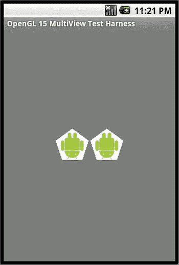

图 9-9。

A pair of textured polygons

图 9-10 显示了动画中间的相同练习。

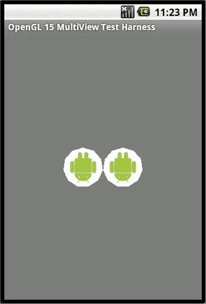

图 9-10。

A pair of textured circles

这总结了 OpenGL 中的另一个重要概念。总之，本节向您展示了如何累积大量不同的图形或场景，并一前一后地绘制它们，以便最终结果形成一个相当复杂的 OpenGL 场景。

接下来，我们考虑 Android 对 OpenGL ES 2.0 的支持。

## OpenGL 是 2.0

现在市场上的大多数设备都有支持 OpenGL ES 2.0 的 GPU。Android 从 API level 8 开始增加了对 OpenGL ES 2.0 的支持。然而，你需要一个真实的设备来测试 ES 2.0 程序。尽管在互联网上有一些参考资料表明 Google 内部的一些人已经演示了如何在模拟器上运行 ES 2.0 程序，但是我们找不到任何信息来告诉你如何去做。

OpenGL ES 2.0 和 OpenGL ES 1.x 是不同的动物，它不是向后兼容的。对于初学者来说更复杂的是，它在初始化和学习如何画最简单的图画方面有很大的不同。如果你擅长 OpenGL，这种转变并不难。不要害怕。到目前为止，我们已经介绍了足够多的 OpenGL 基础知识，我们打算在本章结束时让你对 ES 2.0 非常熟悉。

对于可编程 GPU，OpenGL ES 2.0 引入了一种称为 GLSL(着色语言)的语言，该语言在 GPU 上执行，以绘制由顶点指示的几何图形，并用颜色填充它们的表面片段。这些程序被称为着色器。控制顶点的着色器称为顶点着色器。控制片段(像素)着色的程序称为片段着色器。

专家和 OpenGL 文献主要将两个版本的 OpenGL ES 区分如下:ES 1.0 是固定功能的 OpenGL 管道，而 2.0 是可编程管道。另一种说法是，ES 1.0 的行为是硬连线的，而 ES 2.0 允许在管道中进行编程。我们想通过检查 ES 2.0 管道来进一步澄清这一区别，如清单 9-32 所示。

清单 9-32。ES 2.0 管道

`Client Programming stage`

`Setup OpenGL Environment`

`Declare/Define vertices, textures etc in client memory`

`Setup variables such as frustum, window etc that affect the graphics pipeline`

`Vertex Processing stage – Vertex Shader Program`

`Apply Model transformations: scaling, positioning, rotation etc`

`Apply View transformations: fixing the eye coordinates`

`Apply Projection transformations: viewing volume or frustum`

`Texture coordinates calculated/transformed`

`Lighting impact on colors`

`Also called T&L (Transformation and lighting stage)`

`Graphics Primitive assembly`

`Gather enough vertices for a primitive: lines or triangles etc`

`Pass them to the next stage where the following happens`

`Figure out front/back faces`

`Cull if needed`

`(done not by a shader but like a fixed functionality pipeline)`

`Rasterization`

`Convert geometric primitives to fragments (or pixels)`

`Apply Anti-aliasing`

`Fragment processing – Fragment Shader Program`

`Interpolate fragment attributes: color, texture etc`

`Texture mapping`

`Apply textures programmatically if needed`

`Fog`

`Color sum`

`Per fragment operations`

`Fragment testing: ownership, depth, etc`

`Blending`

`Dithering`

`Framebuffer transfer`

`Pixels sent to the frame buffer for display`

ES 2.0 中的两个可编程阶段是顶点处理阶段和片段处理阶段。清单 9-32 中的第一个阶段，客户端编程阶段，并不是真正的 OpenGL 图形管道阶段。我们把它放在这里是为了告诉你在第一个 OpenGL 阶段，顶点处理阶段之前会发生什么。

当您绘制图形时，除了两个可编程的阶段，其余的工作自动发生(基于客户端程序中指定的内容)，就像在固定的管道中一样。相比之下，在 ES 1.0 中，所有阶段都是固定的，并由客户端编程阶段严格控制。

在本章的其余部分，你将看到着色器程序是什么样子的，这样你就对什么是可编程的有了一个概念！虽然清单 9-32 中的阶段是不言自明的，但是请参考本章开头的 OpenGL 关键概念部分来回顾每个阶段下面列出的操作的含义。

因为我们已经涵盖了 OpenGL 的大部分介绍性理论，所以我们主要通过两个工作示例来探索 ES 2.0。我们将绘制一个立方体，对其进行纹理处理，然后通过一个按钮控制其旋转。

### OpenGL ES 2.0 的 Java 绑定

Android 上 ES 2.0 API 的 Java 绑定在包`android.opengl.GLES20`中提供。这个类的所有函数都是静态的，并且对应于 Khronos 规范中相应的“C”API。(Khronos 的 URL 可以在参考资料中找到。)`GLSurfaceView`以及这里为 OpenGL ES 1.0 介绍的相应渲染器抽象同样适用于 OpenGL ES 2.0。

首先，让我们看看如何使用清单 9-33 中的代码来判断设备或仿真器是否支持这个版本的 OpenGL ES 2.0。

清单 9-33。检测 OpenGL ES 2.0 的可用性

`private boolean detectOpenGLES20() {`

`ActivityManager am =`

`(ActivityManager) getSystemService(Context.ACTIVITY_SERVICE);`

`ConfigurationInfo info = am.getDeviceConfigurationInfo();`

`return (info.reqGlEsVersion >= 0x20000);`

`}`

一旦你有了这个函数(`detectOpenGLES20`)，你就可以在你的活动中开始使用 GLSurfaceView，如清单 9-34 所示。

清单 9-34。将 GLSurfaceView 用于 OpenGL ES 2.0

`if (detectOpenGLES20())`

`{`

`GLSurfaceView glview = new GLSurfaceView(this);`

`glview.setEGLContextClientVersion(2);`

`glview.setRenderer(new YourGLES20Renderer(this));`

`glview.setRenderMode(GLSurfaceView.RENDERMODE_WHEN_DIRTY);`

`setContentView(glview);`

`}`

请注意`GLSurfaceView`是如何通过将客户端版本设置为 2 来配置使用 OpenGL ES 2.0 的。然后，类`YourGLESRenderer`将类似于本章前面介绍的`renderer`类。然而，在 renderer 类的主体中，您将使用`GLES20`API，而不是`GL10`API。

为了能够在你的活动中使用 OpenGL ES 2.0 的特性，比如清单 9-34 中的特性，你需要包含下面的`<uses-feature>`作为应用节点的子节点(见清单 9-35)。

清单 9-35。使用 OpenGL ES 2.0 功能

`<application...>`

`......other nodes`

`<uses-feature android:glEsVersion="0x00020000" />`

`</application>`

### 渲染步骤

在 OpenGL ES 2.0 中渲染图形需要以下步骤:

Write shader programs that run on the GPU to extract such things as drawing coordinates and model/view/projection matrices from the client memory, and impact the final positions for vertices and pixel colors. (See the pipeline where this happens.) There is no counterpart to this in OpenGL ES 1.0, as this functionality behaves in a fixed manner.   Compile the source code of shaders from step 1on the GPU.   Link the compiled units in step 2 into a program object that can be used at drawing time.   Retrieve address handlers from the program in step 3 so that data can be set into those pointers.   Define your vertex buffers.   Define your model view matrices (done through such things as setting the frustum, camera position, etc.; it’s very similar to how it’s done in OpenGL ES 1.1).   Pass the items from step 5 and 6 to the program through the handlers obtained in step 4.   Finally, draw. This will kick off the pipeline. Vertex shaders and fragment shaders are called. Note that the vertex shader program is called once for each vertex in your client memory. The fragment shader is called once for every pixel (or fragment). The outputs of the vertex shader become one of the inputs to the fragment shader.  

我们通过代码片段检查每个步骤，然后呈现一个与作为 OpenGL ES 1.0 的一部分呈现的`SimpleTriangleRenderer`并行的工作渲染器。让我们先从了解着色器开始。

### 了解着色器

我们已经简要介绍了(在本章开始的关键概念部分)GLSL，它的版本，以及顶点和片段着色器的性质。顶点着色器的输入主要是原始顶点属性的数组和必要的变换矩阵。顶点着色器的输出是经过变换或任何其他您认为重要的计算后每个顶点的最终位置。对每个顶点调用一次顶点着色器程序。

顶点着色器的输出被馈送到片段着色器以给像素着色。例如，对于三角形的三个顶点，顶点着色器只被调用三次。然而，三角形的表面可能有数百个碎片(像素)。片段着色器被多次调用，每个片段调用一次。传递给片段的值(如颜色值)是插值的，以便对该表面内片段的特定(x，y)位置有意义。对于顶点显示不同颜色的三角形曲面，为给定像素传递的颜色是插值颜色，它是基于像素与每个顶点的相对距离的三种不同顶点颜色的混合。

当您看到每个着色器程序的示例时，这些概念会变得更加清晰。让我们从顶点着色器开始。

#### 顶点明暗器

清单 9-36 是一个顶点着色器程序段的例子。

清单 9-36。一个简单的顶点着色器

`uniform mat4 uMVPMatrix;`

`attribute vec4 aPosition;`

`void main() {`

`gl_Position = uMVPMatrix * aPosition;`

`}`

这个程序是用着色语言 GLSL 编写的。第一行表示变量`uMVPMatrix`是程序的输入变量，它的类型是`mat4`(一个 4 x 4 的矩阵)。它也被称为统一变量，因为这个矩阵变量适用于所有顶点，而不是任何特定的顶点。这样的变量称为统一变量。

与统一变量相反，变量`aPosition`被声明为顶点属性，处理顶点的位置(坐标)。它被识别为顶点的属性，并且是顶点特有的。顶点的其他属性包括颜色、纹理等。这个`aPosition`变量也是一个四点向量。

事实上，你可以为一个顶点发明你自己的属性。然后，您的顶点着色器程序可以以一种有意义的方式访问该属性，以改变顶点的最终位置，或者根据您发明的特殊属性向下游传递某些内容(如颜色)。由于这种通用的功能，在 ES 2.0 中，您不再需要单独的 API 来传递顶点位置、顶点颜色和其他顶点级别的属性。您只有一个 API，它将属性作为一个变量，来传递所有与顶点相关的数据！

清单 9-36 中的程序获取顶点的坐标位置，并使用模型视图投影(MVP)矩阵(必须由调用程序设置)进行转换。程序通过将顶点的坐标位置与 MVP 矩阵相乘来实现这一点。结果是由顶点着色器的保留变量`gl_Position`标识的最终顶点位置。

一旦以这种方式确定了所有顶点的位置(顶点着色器被调用多次，对顶点缓冲区中的每个顶点调用一次)，片段就由固定流水线来计算，并且对每个片段(或像素)多次调用片段着色器。

虽然`gl_position`是一个保留变量，它是片段着色器的输入，但是您可以显式地指定可以传递给片段着色器的任意数量的变量。稍后，当我们传递颜色值和纹理坐标时，我们将看到一个这样的例子。还有一些为顶点着色器保留的变量，可供高级用户使用；参考 GLSL 规范或一本 GLSL 书籍来了解这些变量的更多信息。

总之，顶点着色器程序负责定位顶点。您可能渴望看到客户端程序如何使用属性变量`aPosition`来传递顶点数据！清单 9-37 显示了如何操作。

清单 9-37 .从客户端设置/传输顶点数据到顶点着色器

`GLES20.glVertexAttribPointer(positionHandle, 3, GLES20.GL_FLOAT, false`，

`TRIANGLE_VERTICES_DATA_STRIDE_BYTES, mFVertexBuffer);`

顶点缓冲区是这个 GLES 20 方法的最后一个参数。这看起来非常像 OpenGL 1.0 中的`glVertexPointer`，除了第一个参数，它被标识为`positionHandle`。这个参数指向清单 9-36 中顶点着色器程序的`aPosition`输入属性变量。您可以使用类似于下面清单 9-38 中的代码来获得这个句柄:

清单 9-38。绑定到属性变量

`positionHandle = GLES20.glGetAttribLocation(shaderProgram, "aPosition");`

本质上，在清单 9-38 中，你要求着色器程序给一个名为“位置”的输入变量一个句柄然后，这个句柄可以在后续调用中使用(清单 9-53 draw 方法),将数据从客户空间传输到着色器程序空间。当我说传输数据时，我只是指出这是一种绑定，允许在调用顶点着色器时一次将一个顶点传递给顶点着色器。

现在在清单 9-38 中，变量`shaderProgram`需要通过将着色器源代码传递给 GPU 进行编译和链接来构建。在我们解释这是如何发生的之前，让我们先来看一个样本片段着色器。

#### 片段着色器

清单 9-39 是一个片段着色器的例子。

清单 9-39。片段着色器的示例

`void main() {`

`gl_FragColor = vec4(1.0, 0.0, 0.0, 1.0);`

`}`

在这个程序中，`gl_FragColor`是一个保留变量，定义一个像素或片段的输出颜色。我们将这个保留变量`gl_FragColor`硬编码为红色，以保持简单。然而，我们可以将这些颜色值从用户程序通过顶点着色器一直传递到片段着色器，而不是像清单 9-39 那样将其硬编码为红色。与定义顶点位置属性的方式类似，您可以在顶点着色器中定义顶点颜色的属性。然后，您可以传递每个顶点的颜色数组，以顶点着色器中的颜色属性为目标。然后，顶点着色器需要声明一个“varying”类型的输出变量，以便它可以在片段着色器中使用。清单 9-40 中有一个这样的顶点着色器的例子。

清单 9-40。带有颜色输入的顶点着色器

`uniform mat4 uMVPMatrix;`

`attribute vec4 aPosition;`

`attribute vec4 aColor;`

`varying vec4 aFragmentColor;`

`void main() {`

`gl_Position = uMVPMatrix * aPosition;`

`aFragmentColor = aColor;`

`}`

类型“变化”意味着通过基于调用片段着色器的片段的(x，y)坐标进行插值，在变量流向片段着色器时改变该变量的值。下面是清单 9-41 中的片段着色器代码，它可以使用这个颜色输入变量。

清单 9-41。具有颜色输入的片段着色器

`varying vec4 aFragmentColor;`

`void main() {`

`gl_FragColor = aFragmentColor;`

`}`

注意可变变量`aFragmentColor`是如何在顶点着色器和片段着色器之间传递的。为此，名称必须匹配；否则，当您尝试编译着色器程序时，将会看到一个编译器错误。此外，请记住，片段着色器是为每个预计会受到影响的片段或像素调用的。

这些着色器程序是在 OpenGL ES 2.0 中开始绘制所必需的。现在，您已经看到了一个简单的顶点着色器和一个简单的片段着色器的源代码，让我们看看这个源代码是如何被 GPU 编译并链接到程序中的。

### 将着色器编译到程序中

一旦你有了着色器程序段，如清单 9-40 和 9-41 所示，你可以使用清单 9-42 中的代码来编译和加载着色器程序。

清单 9-42。编译和加载着色器程序

`//Call this function to load and compile a shader`

`private int loadShader(int shaderType, String source) {`

`int shader = GLES20.glCreateShader(shaderType);`

`if (shader == 0) {`

`//throw an exception or return 0`

`return 0;`

`}`

`//associate shader source with the shader id`

`GLES20.glShaderSource(shader, source);`

`//Compile it`

`GLES20.glCompileShader(shader);`

`//Check compiled status`

`int[] compiled = new int[1];`

`GLES20.glGetShaderiv(shader, GLES20.GL_COMPILE_STATUS, compiled, 0);`

`if (compiled[0] == 0) {`

`//if it is an error throw an exception or return 0`

`return 0;`

`}`

`return shader;`

`}`

在这段代码中，`shadertype`是`GLES20.GL_VERTEX_SHADER`或`GLES20.GL_FRAGMENT_SHADER`中的一个。变量`source`需要指向包含源代码的字符串，如清单 9-40 和 9-41 所示。我们将很快介绍错误检查功能`glGetShaderiv`。

清单 9-43 显示了函数`loadShader`(来自清单 9-42)是如何被用于构建程序对象的。

清单 9-43。创建程序并获得变量句柄

`private int createProgram(String vertexSource, String fragmentSource) {`

`int vertexShader = loadShader(GLES20.GL_VERTEX_SHADER, vertexSource);`

`if (vertexShader == 0) {`

`return 0; //or throw an exception`

`}`

`Log.d(TAG,"vertex shader created");`

`int pixelShader = loadShader(GLES20.GL_FRAGMENT_SHADER, fragmentSource);`

`if (pixelShader == 0) {`

`return 0; //or throw an exception`

`}`

`Log.d(TAG,"fragment shader created");`

`int program = GLES20.glCreateProgram();`

`if (program == 0) { /* throw an exception or */ return 0;}`

`GLES20.glAttachShader(program, vertexShader);`

`checkGlError("glAttachShader");`

`GLES20.glAttachShader(program, pixelShader);`

`checkGlError("glAttachShader");`

`GLES20.glLinkProgram(program);`

`int[] linkStatus = new int[1];`

`GLES20.glGetProgramiv(program, GLES20.GL_LINK_STATUS, linkStatus, 0);`

`if (linkStatus[0] == GLES20.GL_TRUE) {`

`return program;`

`}`

`//Report error`

`Log.e(TAG, "Could not link program: ");`

`Log.e(TAG, GLES20.glGetProgramInfoLog(program));`

`GLES20.glDeleteProgram(program);`

`//throw an exception or`

`return 0`

`}`

关键步骤相当清楚。我们加载顶点和着色器，然后创建一个程序对象，将着色器附加到程序对象并链接程序对象。如果有任何错误，就会报告这些错误。

我们有几个函数来检查状态和报告错误。其中之一是`checkGLError()`，一个你可以在清单 9-43 中看到的实用函数。这个函数是如何实现的，如清单 9-44 所示。

清单 9-44。如何检查一般的 OpenGL 错误

`protected void checkGlError(String op) {`

`int error;`

`while ((error = GLES20.glGetError()) != GLES20.GL_NO_ERROR) {`

`Log.e(TAG, op + ": glError " + error);`

`throw new RuntimeException(op + ": glError " + error);`

`}`

`}`

注意这个实用函数如何在循环中使用`GLES20.glGetError()`,直到不再有错误需要检索。根据 OpenGL 文档，调用一个`glGetError`会将错误标志重置为 GL_NO_ERROR。但是，SDK 建议可以有多个错误标志，每次调用该方法返回并重置时，都会选择其中一个标志。因此，SDK 的建议是调用此方法，直到用完所有标志。

除了这个函数，我们还使用了如清单 9-45 所示的调试方法。

清单 9-45。有助于编译和链接着色器的调试方法

`glGetShaderiv`

`glGetShaderInfoLog`

`glGetProgramiv`

`glGetProgramInfoLog`

`glGetShaderiv`和`glGetShaderInfoLog`用于查看着色器源代码的编译操作是否成功。参见清单 9-43，了解这两种方法是如何使用的。比如我们先用`glGetShaderiv`看看 GL_COMPILE_STATUS 是不是 GL_TRUE。如果没有，我们使用`glShaderInfoLog`来检索导致 commpile 状态变为 false 的确切错误消息。你也可以使用`glGetShaderiv`来获得一个着色器的信息，如清单 9-46 所示。

清单 9-46。关于着色器源的可用信息

`GL_SHADER_TYPE`

`GL_COMPILE_STATUS`

`GL_DELETE_STATUS`

`GL_INFO_LOG_LENGTH`

`GL_SHADER_SOURCE_LENGTH`

`glGetProgamiv`和`glGetProgramInfoLog`用于查看着色器程序上的链接操作是否成功；关于如何使用这些方法，见清单 9-43。我们首先使用`glGetProgramiv`来看看 GL_LINK_STATUS 是否为 GL_TRUE。如果没有，我们使用`glProgramInfoLog`来检索导致链接状态变为假的确切错误消息。你也可以使用`glGetProgramiv`来获得如清单 9-47 所示的关于着色器程序的信息。

清单 9-47。关于链接着色器程序的可用信息

`GL_DELETE_STATUS`，

`GL_LINK_STATUS`，

`GL_VALIDATE_STATUS`，

`GL_INFO_LOG_LENGTH`，

`GL_ATTACHED_SHADERS`，

`GL_ACTIVE_ATTRIBUTES`，

`GL_ACTIVE_ATTRIBUTE_MAX_LENGTH`，

`GL_ACTIVE_UNIFORMS`，

`GL_ACTIVE_UNIFORM_MAX_LENGTH`

### 访问着色器程序变量

一旦程序被设置(编译和链接)，程序的句柄(整数标识符)可用于获取着色器中定义的输入变量的句柄。清单 9-48 显示了如何操作。

清单 9-48。获取顶点和统一句柄

`int maPositionHandle =`

`GLES20.glGetAttribLocation(mProgram, "aPosition");`

`int muMVPMatrixHandle =`

`GLES20.glGetUniformLocation(mProgram, "uMVPMatrix");`

### 一个简单的 ES 2.0 三角形

现在，我们已经介绍了构建一个类似于我们为 OpenGL 1.0 创建的框架所需的基础知识。我们现在将抽象渲染器放在一起，它将封装 ES 2.0 初始化工作(如创建着色器、程序等)。).这种抽象将允许我们专注于定义图形并在派生类中绘制它们。清单 9-49 显示了 ES20 抽象渲染器的代码。

清单 9-49。es20 抽象渲染器

`//filename: ES20AbstractRenderer.java`

`/*`

`* Responsibilities`

`* *****************`

`* 1\. Load vertex and shader programs`

`* 2\. Provide model transformations`

`* 3\. provide default vertex/shader programs`

`* 4\. Provide default frustum and camera settings`

`*`

`* Abstract features`

`* ******************`

`* 1\. allow derived shader programs`

`* 2\. allow derived draw`

`* 3\. allow derived figures`

`* 4\. allow derived frustum/viewing volume settings`

`* 5\. Act as a base class, if needed, for abstracting textures`

`*/`

`public abstract class ES20AbstractRenderer implements Renderer`

`{`

`public static String TAG = "ES20AbstractRenderer";`

`//Class level or global variables are usually`

`//unhealthy. Try to minimize them!!`

`//The target matrix that holds the end result`

`//of all model transformations`

`private float[] mCurrentModelMatrix = new float[16];`

`//A matrix that is a result of setting the camera/eye`

`private float[] mVMatrix = new float[16];`

`//A matrix that is the result of setting the frustum`

`private float[] mProjMatrix = new float[16];`

`//A matrix that is a multiple of current model, view`，

`//and projection matrices.`

`private float[] mMVPMatrix = new float[16];`

`//GLSL program object with both the shaders compiled`，

`//linked, and attached.`

`private int mProgram;`

`//A handle for the uniform variable identifying the MVP matrix`

`private int muMVPMatrixHandle;`

`//An attribute handle in the vertex shader`

`//for passing the vertex arrays.`

`private int maPositionHandle;`

`//Name of the default vertex shader`

`//source code file in the asset directory.`

`private static final String DEF_VERTEX_SHADER_FILENAME`

`= "def_vertex_shader.txt";`

`//Name of the default fragment shader`

`//source code file in the asset directory.`

`private static final String DEF_FRAGMENT_SHADER_FILENAME`

`= "def_fragment_shader.txt";`

`/*`

`* This class relies on virtual methods to specialize.`

`* Doesn't use construction arguments for specialization.`

`*/`

`public ES20AbstractRenderer()` `{`

`initializeMatrices();`

`}`

`public void initializeMatrices()`

`{`

`//Set the model matrix to identity`

`//Subsequent scaling, rotation, etc will update this`

`//in a stateful manner. So starting state matters.`

`Matrix.setIdentityM(this.mCurrentModelMatrix, 0);`

`//Although we use this matrix only once`，

`//it is good to start with a known state.`

`Matrix.setIdentityM(mMVPMatrix, 0);`

`}`

`//@Override the interface method of Renderer`

`//JDK 1.5 doesn't allow this override tag on ab`

`public void onSurfaceCreated(GL10 gl, EGLConfig eglConfig)` `{`

`prepareSurface(gl,eglConfig);`

`}`

`/**`

`* 1\. Create the GLSL program object by passing vertex`

`* and shader code. Derived classes can supply their own shader programs.`

`* 2\. Get vertex position hanndle`

`* 3\. get the uniform mvp matrix handle`

`*/`

`public void prepareSurface(GL10 gl, EGLConfig eglConfig)`

`{`

`Log.d(TAG,"preparing surface");`

`mProgram = createProgram(`

`this.getVertexShaderCodeString()`，

`this.getFragmentShaderCodeString());`

`if (mProgram == 0) {`

`return;`

`}`

`Log.d(TAG,"Getting position handle:aPosition");`

`maPositionHandle = getAttributeHandle("aPosition", "Getting Position Handle");`

`Log.d(TAG,"Getting matrix handle:uMVPMatrix");`

`muMVPMatrixHandle = getUniformHandle("uMVPMatrix"`，

`"Getting MVP uniform matrix handle");`

`}`

`//Override this method to specify your`

`//your own frustum or the dimensions of a viewing volume.`

`protected FrustumDimensions getFrustumDimensions()    {`

`//Get default dimensions in this base class`

`return FrustumDimensions.getDefault();`

`}`

`//@Override the interface method of Renderer`

`//JDK 1.5 doesn't allow this override tag on absolute methods`

`//Based on width and height of the window set the`

`//viewport and the frustum.`

`public void onSurfaceChanged(GL10 gl, int w, int h)`

`{`

`Log.d(TAG,"surface changed. Setting matrix frustum: projection matrix");`

`GLES20.glViewport(0, 0, w, h);`

`float ratio = (float) w / h;`

`FrustumDimensions fd = this.getFrustumDimensions();`

`Matrix.frustumM(mProjMatrix, 0, ratio * fd.bottom, ratio * fd.top`，

`fd.bottom, fd.top, fd.near, fd.far);`

`}`

`//@Override the interface method of Renderer`

`//JDK 1.5 doesn't allow this override tag on absolute methods`

`//1\. Set your camera. You can place this method while creating`

`//the surface or changing the surface. Or you can choose to`

`//vary it during the draw method.`

`//2\. Do basic drawing methods like clear the pallet`

`//3\. Use the shader program that is setup before`

`public void onDrawFrame(GL10 gl)`

`{`

`Log.d(TAG,"set look at matrix: view matrix");`

`Matrix.setLookAtM(mVMatrix, 0, 0, 0, -5, 0f, 0f, 0f, 0f, 1.0f, 0.0f);`

`GLES20.glClearColor(0.0f, 0.0f, 1.0f, 1.0f);`

`GLES20.glClear( GLES20.GL_DEPTH_BUFFER_BIT`

`| GLES20.GL_COLOR_BUFFER_BIT);`

`GLES20.glUseProgram(mProgram);`

`checkGlError("glUseProgram");`

`//Allow a derived class to set up drawing`

`//for further down the chain.`

`//the default doesn't do anything.`

`preDraw(gl,this.maPositionHandle);`

`//Real abstract method`

`draw(gl,this.maPositionHandle);`

`}`

`/*`

`* 1\. Load vertex shader`

`* 2\. load fragment shader`

`* 3\. create program`

`* 4\. attach shaders`

`* 5\. link program and return it`

`* 6\. returns 0 if the program cannot be created`

`*/`

`private int createProgram(String vertexSource, String fragmentSource)`

`{`

`int vertexShader = loadShader(GLES20.GL_VERTEX_SHADER, vertexSource);`

`if (vertexShader == 0) {   return 0;        }`

`Log.d(TAG,"vertex shader created");`

`int pixelShader = loadShader(GLES20.GL_FRAGMENT_SHADER, fragmentSource);`

`if (pixelShader == 0) {       return 0;        }`

`Log.d(TAG,"fragment shader created");`

`int program = GLES20.glCreateProgram();`

`if (program == 0) {`

`checkGlError("Error Creating the program");`

`return 0;`

`}`

`Log.d(TAG,"program created");`

`GLES20.glAttachShader(program, vertexShader);`

`checkGlError("glAttachShader");`

`GLES20.glAttachShader(program, pixelShader);`

`checkGlError("glAttachShader");`

`GLES20.glLinkProgram(program);`

`int[] linkStatus = new int[1];`

`GLES20.glGetProgramiv(program, GLES20.GL_LINK_STATUS, linkStatus, 0);`

`if (linkStatus[0] == GLES20.GL_TRUE) {`

`Log.d(TAG,"Program successfully linked");`

`return program;`

`}`

`Log.e(TAG, "Could not link program: ");`

`Log.e(TAG, GLES20.glGetProgramInfoLog(program));`

`GLES20.glDeleteProgram(program);`

`return 0;`

`}`

`// Load a given type of shader and check for any errors`

`private int loadShader(int shaderType, String source)`

`{`

`int shader = GLES20.glCreateShader(shaderType);`

`if (shader == 0){`

`checkGlError("Cannot create shader:"`

`+ getShaderTypeAsString(shaderType));`

`return 0;`

`}`

`//Associaate shader id to source`

`GLES20.glShaderSource(shader, source);`

`//Compile source`

`GLES20.glCompileShader(shader);`

`//Check if there is an error`

`int[] compiled = new int[1];`

`GLES20.glGetShaderiv(shader, GLES20.GL_COMPILE_STATUS, compiled, 0);`

`//Return if there is no error`

`if (compiled[0] == GLES20.GL_TRUE) {`

`Log.d(TAG, getShaderTypeAsString(shaderType)`

`+ " successfully compiled");`

`return shader;`

`}`

`//report error if there is one and return 0`

`Log.e(TAG, "Could not compile shader "`

`+ getShaderTypeAsString(shaderType));`

`Log.e(TAG, GLES20.glGetShaderInfoLog(shader));`

`GLES20.glDeleteShader(shader);`

`return 0;`

`}`

`//Purely used for debugging purposes`

`public String getShaderTypeAsString(int shaderType)    {`

`if (shaderType == GLES20.GL_VERTEX_SHADER){`

`return "Vertex Shader";`

`}`

`else if (shaderType == GLES20.GL_FRAGMENT_SHADER) {`

`return "Fragment Shader";`

`}`

`else { return new String("Unknown Shader Type Value");}`

`}`

`//Use this method to check and log GL errors`

`protected void checkGlError(String op) {`

`int error;`

`while ((error = GLES20.glGetError()) != GLES20.GL_NO_ERROR) {`

`Log.e(TAG, op + ": glError " + error);`

`throw new RuntimeException(op + ": glError " + error);`

`}`

`}`

`/*`

`* The following three methods update the mCurrentModelMatrix`

`* with the given model transformation.`

`* These are stateful accumulative methods.`

`*/`

`public void translate(float x, float y, float z)`

`{`

`float[] tempModelMatrix = new float[16];`

`Matrix.setIdentityM(tempModelMatrix, 0);`

`Matrix.translateM(tempModelMatrix,0,x,y,z);`

`Matrix.multiplyMM(this.mCurrentModelMatrix, 0`，

`tempModelMatrix, 0, this.mCurrentModelMatrix, 0);`

`}`

`public void rotate(float angle, float x, float y, float z)`

`{`

`float[] tempModelMatrix = new float[16];`

`Matrix.setIdentityM(tempModelMatrix, 0);`

`Matrix.rotateM(tempModelMatrix,0,angle,x,y,z);`

`Matrix.multiplyMM(this.mCurrentModelMatrix, 0`，

`tempModelMatrix, 0, this.mCurrentModelMatrix, 0);`

`}`

`public void scale(float xFactor, float yFactor, float zFactor)`

`{`

`float[] tempModelMatrix = new float[16];`

`Matrix.setIdentityM(tempModelMatrix, 0);`

`Matrix.scaleM(tempModelMatrix,0,xFactor,yFactor,zFactor);`

`Matrix.multiplyMM(this.mCurrentModelMatrix, 0`，

`tempModelMatrix, 0, this.mCurrentModelMatrix, 0);`

`}`

`/*`

`* Calculaute the final model view matrix`

`* 1\. Order of matrix multiplication is important`

`* 2\. MVPmatrix = proj * view * model;`

`* 3\. Setup the MVP matrix in the vertex shader memory`

`*/`

`protected void setupMatrices()`

`{`

`float[] tempModelMatrix = new float[16];`

`Matrix.setIdentityM(tempModelMatrix, 0);`

`//translate the model combo next`

`Matrix.multiplyMM(mMVPMatrix, 0, //matrix and offset`

`mCurrentModelMatrix, 0`，

`tempModelMatrix, 0);`

`//translate eye coordinates first`

`Matrix.multiplyMM(mMVPMatrix, 0`，

`this.mVMatrix, 0`，

`mMVPMatrix, 0);`

`//Project it: screen coordinates`

`Matrix.multiplyMM(mMVPMatrix, 0`，

`mProjMatrix, 0`，

`mMVPMatrix, 0);`

`//Set the vertex uniform handler representing the MVP matrix`

`GLES20.glUniformMatrix4fv(muMVPMatrixHandle, //uniform handle`

`1, //number of uniforms. 1 if it is not an array`

`false, //transpose: must be false`

`mMVPMatrix, //client matrix memory pointer`

`0); //offset`

`}`

`//Override this method to continue the onDrawframe callback`

`//from the renderer.`

`protected abstract void draw(GL10 gl, int positionHandle);`

`//Override this to implement preDraw`

`//useful for derived classes to specialize pre-draws`

`protected void preDraw(GL10 gl, int positionHandle)` `{`

`//nothing to do for this class: No op`

`}`

`//Use this method if your intent is to return`

`//a default vertex shader.`

`public String getDefaultVertexShaderCodeString()` `{`

`return this.getStringFromAssetFile(DEF_VERTEX_SHADER_FILENAME);`

`}`

`//Use this method if your intent is to return`

`//a default fragment shader.`

`public String getDefaultFragmentShaderCodeString()` `{`

`return this.getStringFromAssetFile(DEF_FRAGMENT_SHADER_FILENAME);`

`}`

`//Override this method if you want to provide`

`//a different vertex shader program.`

`protected String getVertexShaderCodeString()`

`{`

`String vertexShader =`

`"uniform mat4 uMVPMatrix;\n" +`

`"attribute vec4 aPosition;\n" +`

`"void main() {\n" +`

`"  gl_Position = uMVPMatrix * aPosition;\n" +`

`"}\n";`

`return vertexShader;`

`}`

`//Override this method if you want to provide`

`//a different vertex shader program.`

`//In a derived method call getStringFromAssetFile(filename)`

`//to read as string to be returned from here.`

`protected String getFragmentShaderCodeString()`

`{`

`String fragmentShader =`

`"void main() {\n" +`

`"  gl_FragColor = vec4(0.5, 0.25, 0.5, 1.0);\n" +`

`"}\n";`

`return fragmentShader;`

`}`

`//How to to read a text file from an asset`

`//directory. In this approach you will need to`

`//create your application object and provide a static`

`//variable to create the context.`

`//See MyApplication implementation to see how this works.`

`//Or see`[`http://androidbook.com/item/4224`](http://androidbook.com/item/4224)

`public String getStringFromAssetFile(String filename)`

`{`

`Context ctx = MyApplication.m_appContext;`

`if ( ctx == null) {`

`throw new RuntimeException("Sorry your app context is null");`

`}`

`try         {`

`AssetManager am = ctx.getAssets();`

`InputStream is = am.open(filename);`

`String s = convertStreamToString(is);`

`is.close();`

`return s;`

`}`

`catch (IOException x)        {`

`throw new RuntimeException("Sorry not able to read filename:" + filename,x);`

`}`

`}`

`//Converting a file stream to a string`

`//Optimize as you see fit. This may not be an efficient read`

`private String convertStreamToString(InputStream is)`

`throws IOException`

`{`

`ByteArrayOutputStream baos = new ByteArrayOutputStream();`

`int i = is.read();`

`while (i != -1)         {`

`baos.write(i);`

`i = is.read();`

`}`

`return baos.toString();`

`}`

`//Use this if you need to use a program object`

`//directly. Make sure you call this after the`

`//surface is created and prepared in this base class.`

`//otherwise it will be null.`

`public int getGLSProgramObjectReference()     {`

`return this.mProgram;`

`}`

`//Use this method to get a handle to any`

`//named attribute. It is a utility method.`

`//It uses the program object that is in effect.`

`//Ensure program object is valid before calling this.`

`public int getAttributeHandle(String GLSLAttributeName, String comment)`

`{`

`String logComment = comment + ":" + GLSLAttributeName;`

`Log.d(TAG,comment);`

`int attributeHandle =`

`GLES20.glGetAttribLocation(mProgram, GLSLAttributeName);`

`checkGlError(logComment);`

`if (attributeHandle == -1) {`

`throw new RuntimeException(logComment);`

`}`

`return attributeHandle;`

`}`

`public int getUniformHandle(String GLSLUniformName, String comment)`

`{`

`String logComment = comment + ":" + GLSLUniformName;`

`Log.d(TAG,comment);`

`int uniformHandle =`

`GLES20.glGetUniformLocation(mProgram, GLSLUniformName);`

`checkGlError(logComment);`

`if (uniformHandle == -1) {`

`throw new RuntimeException(logComment);`

`}`

`return uniformHandle;`

`}//eof-method`

`}//eof-class`

这段代码的大部分是前面介绍的思想的集合。OpenGL 本质上是程序性的，非常以“C”为中心。在像 Java 这样的面向对象语言中，你可以更好地把它塑造成一个好的面向对象框架。事实上，这个抽象类是这种愿望的早期表现。

清单 9-49 中的抽象类也允许你从项目的资源目录中加载顶点着色器和片段着色器文件。默认情况下，这两个文件如下所示:

`Project-root/assets/def_vertex_shader.txt`

`Project-root/assets/def_fragment_shader.txt`

在这个抽象类中，我们进一步依赖于一个实用程序类来定义截锥。在清单 9-49 的方法`onSurfaceChanged`中，我们使用了这个类截锥来提供截锥的尺寸并得到投影矩阵。清单 9-50 显示了`FrustumDimensions`的类定义。

清单 9-50。平截头体尺寸实用程序类

`public class FrustumDimensions`

`{`

`//These are usually set by figuring out the window ratio.`

`public float left;`

`public float right;`

`public float bottom;`

`public float top;`

`public float near;`

`public float far;`

`public FrustumDimensions(float left, float right`，

`float bottom, float top`，

`float near, float far)     {`

`this.left = left;`

`this.right = right;`

`this.bottom = bottom;`

`this.top = top;`

`this.near = near;`

`this.far = far;`

`}`

`static public FrustumDimensions getDefault()    {`

`return new FrustumDimensions(-1, 1, -1, 1, 3, 7);`

`}`

`static public FrustumDimensions getMedium()    {`

`return new FrustumDimensions(-1, 1, -2, 2, 3, 15);`

`}`

`}`

清单 9-51 显示了默认顶点着色器文件的内容。

清单 9-51。默认顶点着色器文件

`//assets/def_vertex_shader.txt`

`uniform mat4 uMVPMatrix;`

`attribute vec4 aPosition;`

`void main()`

`{`

`gl_Position = uMVPMatrix * aPosition;`

`}`

清单 9-52 显示了默认片段着色器文件的内容。

清单 9-52。默认片段着色器文件

`//assets/def_fragment_shader.txt`

`void main()`

`{`

`gl_FragColor = vec4(0.5, 0.25, 0.5, 1.0);`

`}`

这些非常简单的着色器可以让你用单一颜色绘制任何几何体。你可以用这个来测试你的基础。随着您变得越来越复杂，派生类可以传递它们自己的着色器。然而，根据您需要映射的变量，您可能希望比这个抽象设计中呈现的更灵活地构造抽象类。

这个基本抽象类还提供了您需要绑定到任何变量的实用方法，无论它是属性变量还是统一变量。

清单 9-49 中用于`ES20AbstractRenderer`的函数`setupMatrices`可能需要一些解释。`This function`演示了如何使用 m `atrix`类从一个单位矩阵开始，通过与其他矩阵相乘，将多个矩阵组合成一个名为`mMVPMatrix`的矩阵。

变量`mCurrentModelMatrix`从一个单位矩阵开始。每一个模型转换都会在这个矩阵上累积它的效果。当客户端调用设置矩阵时，该矩阵将具有所有模型变换(平移、旋转、缩放等)的最终乘法。)在正在绘制的对象上。

变量`mVMatrix`通过使用摄像机的视点或观察点获得。投影矩阵`mProjMatrix`是通过使用 matrix 类上的截锥规范获得的。你可以在清单 9-42 中看到这两个变量的设置。两个概念——眼点和平截头体——与 OpenGL ES 1.0 中的概念相同。MVP 矩阵(代码中的`mMVPMatrix`)就是这些矩阵按正确的顺序相乘。顺序很重要。你把模型矩阵(`mCurrentModelMatrix`)和视图矩阵(`mVMatrix`)相乘。然后取结果矩阵乘以投影(`mProjMatrix`)得到最终的 MVP 矩阵(`mMVPMatrix`)。

最后，调用`glUniformMatrix4fv`在顶点着色器中设置这个(`mMVPMatrix`)模型视图投影变量(清单 9-49)，这样顶点着色器可以用这个矩阵乘以每个顶点的位置来得到最终的位置(见清单 9-36)。

清单 9-53 显示了`ES20SimpleTriangleRenderer`的代码，它扩展了抽象渲染器以及定义点和绘制三角形所需的最小量。

清单 9-53。ES20SimpleTriangleRenderer

`public class ES20SimpleTriangleRenderer extends ES20AbstractRenderer`

`{`

`//A raw native buffer to hold the point coordinates`

`private FloatBuffer mFVertexBuffer;`

`private static final int FLOAT_SIZE_BYTES = 4;`

`private final float[] mTriangleVerticesData = {`

`// X, Y, Z`

`-1.0f, -0.5f, 0`，

`1.0f, -0.5f, 0`，

`0.0f,  1.11803399f, 0 };`

`public ES20SimpleTriangleRenderer()`

`{`

`ByteBuffer vbb = ByteBuffer.allocateDirect(mTriangleVerticesData.length`

`* FLOAT_SIZE_BYTES);`

`vbb.order(ByteOrder.nativeOrder());`

`mFVertexBuffer = vbb.asFloatBuffer();`

`mFVertexBuffer.put(mTriangleVerticesData);`

`mFVertexBuffer.position(0);`

`}`

`protected void draw(GL10 gl, int positionHandle)`

`{`

`GLES20.glVertexAttribPointer(positionHandle, 3, GLES20.GL_FLOAT, false`，

`0, mFVertexBuffer);`

`checkGlError("glVertexAttribPointer maPosition");`

`GLES20.glEnableVertexAttribArray(positionHandle);`

`checkGlError("glEnableVertexAttribArray maPositionHandle");`

`this.setupMatrices();`

`GLES20.glDrawArrays(GLES20.GL_TRIANGLES, 0, 3);`

`checkGlError("glDrawArrays");`

`}`

`}`

这是一个具体的渲染器类。你可以使用这个渲染器并使用清单 9-34 中的代码(这里我们使用了一个`GLSurfaceView`来绘制一个带有渲染器的活动)来绘制你选择的活动。如果您想看看实际效果，请使用本章的测试程序并调用菜单项“ES20 三角形”

### 旋转纹理立方体

在本章的最后一节，让我们加大赌注，使用 ES 2.0 执行以下操作:

*   用一个立方体进入 3D 世界
*   纹理立方体
*   从中心向下平移立方体
*   旋转立方体
*   在活动中混合总帐视图和常规视图
*   使用按钮来控制立方体的旋转

为了做到这一切，我们利用了清单 9-49 中的 ES20 抽象渲染器，并对其进行了扩展，以添加纹理相关的行为。然后，我们可以使用支持纹理的抽象渲染器来导出最终的立方体渲染器。

#### 单一纹理抽象渲染器

因为我们在本章前面已经广泛地讨论了纹理，我们可以很容易地用纹理行为扩展清单 9-49 中的抽象渲染器。在这个渲染器中，我们将“draw”方法的实现留给了派生类。纹理渲染器的职责是加载和设置纹理，以便派生类专注于顶点坐标和纹理坐标。大多数与纹理相关的工作都将在这个抽象的纹理渲染器中进行。

因为我们假设有一个单一的纹理应用于所有的表面，我们称之为纹理抽象渲染器`ES20SingleTextureAbstractRenderer`。清单 9-54 是这个类的注释源代码。

清单 9-54。es20 单纹理抽象渲染器

`//filename: ES20SingleTextureAbstractRenderer.java`

`public abstract class ES20SingleTextureAbstractRenderer`

`extends ES20AbstractRenderer`

`{`

`public static String TAG = "ES20SingleTextureAbstractRenderer";`

`//Handle to the texture attribute in the vertex shader`

`private int maTextureHandle;`

`//handle to the texture Sampler Uniform variable in the fragment shader`

`private int mu2DSamplerTexture;`

`//Client assigned name of the texture`

`int mTextureID;`

`//default texture ImageResourceId`

`int mDefTextureImageResourceId = R.raw.robot;`

`public ES20SingleTextureAbstractRenderer()   {`

`super();`

`}`

`//give out the texture attribute handle`

`//if needed.`

`protected int getTextureHandle()   {`

`return maTextureHandle;`

`}`

`//You can prepare and load your texture here`

`//so that you don't have to do this every time`

`//a surface just changed changing the height and width.`

`public void onSurfaceCreated(GL10 gl, EGLConfig eglConfig)`

`{`

`//Give a chance to have the parent prepare the surface`

`super.prepareSurface(gl,eglConfig);`

`prepareSurfaceForTexture(gl,eglConfig);`

`}`

`public void prepareSurfaceForTexture(GL10 gl, EGLConfig eglConfig)`

`{`

`//Get texture attribute handle`

`Log.d(TAG,"Getting texture handle:aTextureCoordinate");`

`maTextureHandle = getAttributeHandle("aTextureCoordinate"`，

`"Getting Texture handle");`

`//Get uniform texture handle`

`Log.d(TAG,"Getting texture 2D sampler handle");`

`mu2DSamplerTexture = getUniformHandle("s_2DtextureSampler"`，

`"Getting 2D sampler for texture");`

`this.prepareTexture();`

`}`

`@Override`

`protected void preDraw(GL10 gl, int positionHandle)`

`{`

`//Call the parent's method first`

`super.preDraw(gl, positionHandle);`

`//texture support`

`//Make texture unit 0 as the active texture unit`

`//This is the default as well`

`GLES20.glActiveTexture(GLES20.GL_TEXTURE0);`

`//Make texture target 2D and texture name mTextureId`

`//as the target texture for the active texture unit`

`GLES20.glBindTexture(GLES20.GL_TEXTURE_2D, mTextureID);`

`//Tell the texture sampler in GLSL that the texture to`

`//sample belongs to the texture unit 0.`

`//This is also the default`

`GLES20.glUniform1i(mu2DSamplerTexture, 0);`

`}`

`//Get the texture name that is initialized`

`//Make sure it is initialized before calling this`

`//method.`

`public int getTextureID()    {`

`return mTextureID;`

`}`

`//Ultimately this code prepares the`

`//texture ID mTextureID`，

`//creates it, and binds it to the texture target 2D.`

`public void prepareTexture()`

`{`

`//GLES20.glEnable(GLES20.GL_TEXTURE_2D);`

`int[] textures = new int[1];`

`GLES20.glGenTextures(1, textures, 0);`

`mTextureID = textures[0];`

`GLES20.glBindTexture(GLES20.GL_TEXTURE_2D, mTextureID);`

`GLES20.glTexParameterf(GLES20.GL_TEXTURE_2D`，

`GLES20.GL_TEXTURE_MIN_FILTER`，

`GLES20.GL_NEAREST);`

`GLES20.glTexParameterf(GLES20.GL_TEXTURE_2D`，

`GLES20.GL_TEXTURE_MAG_FILTER`，

`GLES20.GL_LINEAR);`

`GLES20.glTexParameterf(GLES20.GL_TEXTURE_2D`，

`GLES20.GL_TEXTURE_WRAP_S`，

`GLES20.GL_REPEAT);`

`GLES20.glTexParameterf(GLES20.GL_TEXTURE_2D`，

`GLES20.GL_TEXTURE_WRAP_T`，

`GLES20.GL_REPEAT);`

`final BitmapFactory.Options options = new BitmapFactory.Options();`

`options.inScaled = false;   // No pre-scaling`

`int texturImageReourceId = getTextureImageResourceId();`

`// Read in the resource`

`final Bitmap bitmap = BitmapFactory.decodeResource(`

`MyApplication.m_appContext.getResources()`，

`texturImageReourceId, options);`

`GLUtils.texImage2D(GLES20.GL_TEXTURE_2D, 0, bitmap, 0);`

`bitmap.recycle();`

`}`

`//override this to give your own texture image resource id`

`protected int getTextureImageResourceId()    {`

`return this.mDefTextureImageResourceId;`

`}`

`}//eof-main-class`

清单 9-54 中的源代码附有注释。本章前面的纹理覆盖也应该有助于澄清这个类中发生了什么。

清单 9-54 中的抽象假设了一些来自派生类的契约。例如，它假设有一个单一的 2D 纹理。它还假设顶点处理器有一个名为`aTextureCoordinate`的属性，将纹理坐标传递给顶点着色器。此代码进一步假设在片段着色器中有一个名为`s_2DTextureSampler`的纹理统一变量，用于从纹理单元中采样纹理图像。

纹理采样器是片段着色器中的一种结构，允许您查看纹理坐标和纹理单元，并返回要应用于像素的颜色。ES 2.0 中引入了纹理采样器；它们不适用于 1.0。这是 1.0 和 2.0 在纹理方面的一个关键区别。

为了理解这些变量之间的联系，这里有一个可以处理这个抽象类的顶点着色器和片段着色器。

#### 具有纹理坐标的顶点着色器

清单 9-55 显示了一个顶点着色器的源代码，它假设了两件事。首先，它假设顶点通过一个名为`aPosition`的属性变量传递。其次，它假设纹理坐标是通过一个名为`aTextureCoordinate`的属性变量传递的。两个抽象类——es 20 abstract renderer(清单 9-49)和 es 20 singletextureabstractrenderer(清单 9-54)—都假定这些变量的名称与这里定义的一样。如果您想通过派生类参数化这些变量名，我们把它留在这里作为一个练习。

清单 9-55。具有纹理坐标的顶点着色器

`//input: model view matrix`

`uniform mat4 uMVPMatrix;`

`//input: vertex points`

`attribute vec4   aPosition;`

`//input: vertex texture coordinates`

`attribute vec2   aTextureCoordinate;`

`//output: vertex texture coordinate`

`//will act as input to the fragment shader`

`varying vec2   v_TextureCoordinate;`

`void main()`

`{`

`gl_Position = uMVPMatrix * aPosition;`

`//Pass the texture coordinate as is to the fragment shader.`

`v_TextureCoordinate = aTextureCoordinate;`

`}`

从纹理的角度来看，这个顶点着色器做得最少。它只是通过一个名为`a_TextureCoordinate`的输出变量来传递纹理坐标。因为这是一个可变变量，所以当它被传递给片段着色器时，可以预期它会被插值。请注意，变化并传递给片段着色器的不是纹理值(颜色值)，而是给定片段处的纹理坐标。

#### 具有 2D 纹理采样的片段编码器

清单 9-56 显示了片段着色器的代码。变量名`s_2DtextureSampler`是我们在抽象类`ES20SingleTextureAbstractRenderer`中使用的(清单 9-54)。每个片段调用一次这个片段着色器代码。当它被调用时，会被传递一个与该片段相关的纹理坐标。预建的 GLSL 函数`texture2D`用于在从顶点着色器传来的纹理像素坐标处对纹理单元(指示并绑定到`s_2DtextureSampler`)进行采样。

清单 9-56。使用纹理坐标的片段着色器

`precision mediump float;`

`//Appears precision is mandatory for this version of GLSL`

`//if you are using samplers.`

`//Input from the vertex shader`

`//names have to match.`

`varying vec2 v_TextureCoordinate;`

`//A structure to sample the texture`

`//from the texture unit.`

`//A client needs to bind a texture unit to this`

`//variable.`

`uniform sampler2D s_2DtextureSampler;`

`void main()`

`{`

`//texture2D is a prebuilt function in GLSL`

`gl_FragColor = texture2D(s_2DtextureSampler, v_TextureCoordinate);`

`}`

这两个着色器(清单 9-55 和清单 9-56)足够通用，只要你打算使用一个单一的纹理，就可以在任何复杂的图形中重复使用。对于派生类，就好像纹理细节已经消失，您可以专注于绘制和纹理图像，而不必关注纹理如何应用到模型表面的机制。

我们将在下一小节中看到如何用很少的工作量来纹理化一个立方体的六个表面。如果你愿意，你可以对三角形、正方形或多边形做同样的事情，而不用担心着色器。这就是抽象的美。

#### 立方体渲染器

清单 9-57 是绘制一个立方体，给它纹理，并根据命令旋转它的代码。注意这段代码有多简单。事实上，这个类中的大部分空间被 36 个顶点(六个表面中的每一个都有两个三角形)和 24 个纹理点的定义所占据。

先看一下代码。按照代码，我们解释代码中的关键步骤。

清单 9-57。可控旋转立方体

`//filename: ES20ControlledAnimatedTexturedCubeRenderer.java`

`public class ES20ControlledAnimatedTexturedCubeRenderer`

`extends ES20SingleTextureAbstractRenderer`

`{`

`//A raw native buffer to hold the point coordinates for the cube.`

`private FloatBuffer mFVertexBuffer;`

`//A raw native buffer to hold the texture coordinates for the cube.`

`private FloatBuffer mFTextureBuffer;`

`private static final int FLOAT_SIZE_BYTES = 4;`

`//variables to control rotation`

`//if stopFlag = true stop the rotation`

`private boolean stopFlag = false;`

`//what is the current angle of rotation`

`private float curAngle = 0;`

`//At the last stop what was the angle`

`//to restart.`

`private float stoppedAtAngle = 0;`

`//What are the vertex and fragment shader source code files`

`private static final String VERTEX_SHADER_FILENAME`

`= "tex_vertex_shader_1.txt";`

`private static final String FRAGMENT_SHADER_FILENAME`

`= "tex_fragment_shader_1.txt";`

`//front-face: f1,f2,f3,f4`

`//starting top-right-anti-clockwise`

`//f1(1,1) f2(-1,1) f3(-1,-1) f4(1,-1): z plane 0`

`//back-face: b1,b2,b3,b4`

`//starting bottom-right-anti-clockwise`

`//b1(1,-1) b2(1,1) b3(-1,1) b4(-1,-1) : z plane 2`

`private float z = 2.0f;`

`private final float[] mTriangleVerticesData = {`

`//1\. front-triangles`

`//f1,f2,f3`

`1,1,0,          -1,1,0,            -1,-1,0`，

`//f3,f4,f1`

`-1,-1,0,         1,-1,0,            1,1,0`，

`//2\. back-triangles`

`//b1,b2,b3`

`1,-1,z,            1,1,z,            -1,1,z`，

`//b3,b4,b1`

`-1,1,z,            -1,-1,z,        1,-1,z`，

`//3\. right-triangles`

`//b2,f1,f4`

`1,1,z,            1,1,0,            1,-1,0`，

`//b2,f4,b1`

`1,1,z,            1,-1,0,            1,-1,z`，

`//4\. left-triangles`

`//b3, f2, b4`

`-1,1,z,            -1,1,0,        -1,-1,z`，

`//b4 f2 f3`

`-1,-1,z,        -1,1,0,        -1,-1,0`，

`//5\. top-triangles`

`//b2, b3, f2`

`1,1,z,            -1,1,z,        -1,1,0`，

`//b2, f2, f1`

`1,1,z,            -1,1,0,        1,1,0`，

`//6\. bottom-triangles`

`//b1, b4, f3`

`1,-1,z,        -1,-1,z,    -1,-1,0`，

`//b1, f3, f4`

`1,-1,z,        -1,-1,0,    1,-1,0`

`};`

`//Follow each face and the triangle set.`

`//Takes into account the upside down nature of bitmaps and`

`//texture coordinates.`

`private final float[] mTextureData = {`

`//1\. front face: f1(10) f2(00) f3(01) f4(11)`

`//front-triangles`

`//f1,f2,f3`

`1,0,    0,0,    0,1`，

`//f3,f4,f1`

`0,1,     1,1,    1,0`，

`//2\. back face: b2(10) b3(00) b4(01) b1(11)`

`//back-triangles:`

`//b1,b2,b3`

`1,1,    1,0,    0,0`，

`//b3,b4,b1`

`0,0,    0,1,    1,1`，

`//3\. Right face: b2(10) f1(00) f4(01) b1(11)`

`//right-triangles`

`//b2,f1,f4`

`1,0,     0,0,    0,1`，

`//b2,f4,b1`

`1,0,     0,1,    1,1`，

`//4\. Left face: f2(10) b3(00) b4(01) f3(11)`

`//left-triangles`

`//b3, f2, b4`

`0,0,    1,0,    0,1`，

`//b4 f2 f3`

`0,1,    1,0,    1,1`，

`//5\. Top face: b2(10) b3(00) f2(01) f1(11)`

`//top-triangles`

`//b2, b3, f2`

`1,0,    0,0,    0,1`，

`//b2, f2, f1`

`1,0,    0,1,    1,1`，

`//6\. Bottom face: b1(10) b4(00) f3(01) f4(11)`

`//bottom-triangles`

`//b1, b4, f3`

`1,0,    0,0,    0,1`，

`//b1, f3, f4`

`1,0,    0,1,    1,1`

`};`

`public ES20ControlledAnimatedTexturedCubeRenderer()`

`{`

`//Turn java points to native buffer points`

`setupVertexBuffer();`

`//Turn java texture points to native buffer texture points.`

`setupTextureBuffer();`

`}`

`//Convert to a native buffer`

`private void setupTextureBuffer()`

`{`

`//Allocate and handle texture buffer`

`ByteBuffer vbb1 = ByteBuffer.allocateDirect(mTextureData.length`

`* FLOAT_SIZE_BYTES);`

`vbb1.order(ByteOrder.nativeOrder());`

`mFTextureBuffer = vbb1.asFloatBuffer();`

`mFTextureBuffer.put(mTextureData);`

`mFTextureBuffer.position(0);`

`}`

`//Convert to a native buffer`

`private void setupVertexBuffer()`

`{`

`//Allocate and handle vertex buffer`

`ByteBuffer vbb = ByteBuffer.allocateDirect(mTriangleVerticesData.length`

`* FLOAT_SIZE_BYTES);`

`vbb.order(ByteOrder.nativeOrder());`

`mFVertexBuffer = vbb.asFloatBuffer();`

`mFVertexBuffer.put(mTriangleVerticesData);`

`mFVertexBuffer.position(0);`

`}`

`//Transfer the vertices from the vertex buffer`

`//to the shader.`

`private void transferVertexPoints(int vertexPositionHandle)`

`{`

`GLES20.glVertexAttribPointer(`

`vertexPositionHandle, //bound address in the vertex shader`

`3, //how may floats for this attribute: x, y, z`

`GLES20.GL_FLOAT, //what is type of each attribute?`

`false, // not normalized`

`0, //stride`

`mFVertexBuffer); //local client pointer to data`

`//Check to see if this caused any errors`

`checkGlError("glVertexAttribPointer maPosition");`

`//You have to call this to enable the arrays to be`

`//used by glDrawArrays or glDrawElements.`

`GLES20.glEnableVertexAttribArray(vertexPositionHandle);`

`checkGlError("glEnableVertexAttribArray maPositionHandle");`

`}`

`//Same as above but for transferring texture attributes`

`//Notice how textures and vertices use the same concept`

`//of attributes and the same APIs.`

`private void transferTexturePoints(int texturePositionHandle)`

`{`

`GLES20.glVertexAttribPointer(texturePositionHandle, 2`，

`GLES20.GL_FLOAT, false`，

`0, mFTextureBuffer);`

`checkGlError("glVertexAttribPointer texture array");`

`GLES20.glEnableVertexAttribArray(texturePositionHandle);`

`checkGlError("glEnableVertexAttribArray textures");`

`}`

`//Drawing operation`

`@Override`

`protected void draw(GL10 gl, int positionHandle)`

`{`

`//Hide the hidden surfaces using these APIs`

`GLES20.glEnable(GLES20.GL_DEPTH_TEST);`

`GLES20.glDepthFunc(GLES20.GL_LESS);`

`//Transfer vertices to the shader`

`transferVertexPoints(positionHandle);`

`//Transfer texture points to the shader`

`transferTexturePoints(getTextureHandle());`

`//Implement rotation from 0 to 360 degrees`

`//Stop when asked and restart when the stopFlag`

`//is set to false.`

`//Decide what the current angle to apply`

`//for rotation is.`

`if (stopFlag == true)        {`

`//stop rotation`

`curAngle = stoppedAtAngle;`

`}`

`else        {`

`curAngle += 1.0f;`

`}`

`if (curAngle > 360)        {`

`curAngle = 0;`

`}`

`//Tell the base class to start their`

`//matrices to unit matrices.`

`this.initializeMatrices();`

`//The order of these model transformations matter`

`//Each model transformation is specified with`

`//respect to the last one, and not the very first.`

`//Center the cube`

`this.translate(0,0,-1);`

`//Rotate it around y axis`

`this.rotate(curAngle, 0,-1,0);`

`//Decenter it to where ever you want`

`this.trnslate(0,-2,2);`

`//Go ahead calculate the ModelViewMatrix as`

`//we are done with ALL of our model transformations`

`this.setupMatrices();`

`//Call glDrawArrays to use the vertices and draw`

`int vertexCount = mTriangleVerticesData.length/3;`

`GLES20.glDrawArrays(GLES20.GL_TRIANGLES, //what primitives to use`

`0, //at what point to start`

`vertexCount); //Starting there how many points to use`

`//Check if there are errors`

`checkGlError("glDrawArrays");`

`}`

`//Indicate how big of a viewing volume we desire`

`//This is just a simple homegrown class`

`//@see FrustumDimensions`

`@Override`

`protected FrustumDimensions getFrustumDimensions()` `{`

`return FrustumDimensions.getMedium();`

`}`

`//Indicate the fragment shader source code`

`@Override`

`protected String getFragmentShaderCodeString()    {`

`return this.getStringFromAssetFile(FRAGMENT_SHADER_FILENAME);`

`}`

`//Give out the vertex shader source code`

`@Override`

`protected String getVertexShaderCodeString()    {`

`return this.getStringFromAssetFile(VERTEX_SHADER_FILENAME);`

`}`

`//Stop the rotation. Called by a client`

`//on a button click or other user actions.`

`public void stop()    {`

`this.stopFlag = true;`

`this.stoppedAtAngle = curAngle;`

`}`

`//Restart the rotation`

`public void start()    {`

`this.stopFlag = false;`

`this.curAngle = this.stoppedAtAngle;`

`}//eof-function`

`}//eof-class`

我们已经在清单 9-57 所示的源代码中做了大量的注释。这段代码的关键部分是定义立方体的所有顶点。每个面需要六个顶点，所以我们最终重复顶点，因为它参与形成构成每个面的多个三角形。

定义顶点时，请注意每个面上形成的三角形。缠绕对于弄清楚哪个是面向外的表面是很重要的。正如我们在本章开始的关键概念部分所解释的，你这样做的方法是通过想象你正沿着三角形的顶点(沿着它们的定义顺序的路径)转动一个右旋螺丝(RHS)。RHS 应伸出水面，而不是进入水面。

这个类还通过覆盖`getFrustumDimensions()`方法表明它想要一个中等大小的平截头体。请参见清单 9-50 中的 frustum 类，了解中等大小的截锥的尺寸。这个类还指示顶点着色器和片段着色器的文件名，以匹配清单 9-55 和 9-56 中的文件名

这个类使用`glVertexAttribArray()`将顶点和纹理点转移到着色器。这个类还展示了如何正确使用旋转。该类首先将立方体定位在中心并旋转它，然后将立方体移动到最终位置。为什么这很重要？因为当您进行模型转换时，您必须记住三件事情:

Each vertex goes through all of the model transformations alone. The cumulative effect of all the vertices going through this process will be a transformed model. But it is good to think of one vertex when you are transforming OpenGL figures.   Rotation as indicated in Listing 9-57 is around the axis extending from the origin to the specified point.   Each model transformation uses the output coordinates from the previous model transformation, not the first. So if your point is at 5 and it ends up at 7 after rotation, then moving it down by 1 will result in 6 (with respect to the last point) and not in 4 (with respect to its original point). Transformations have no historical memory. They only act on the last position, so the order of model transformations can give you different results.  

如果您运行示例程序并调用菜单“受控旋转立方体”，您将看到如图 9-11 所示的活动。我们已经通过使用来自 eclipse APT 的 DDMS 连接到一个真实的设备上拍摄了这张照片。在参考资料中，我们有一个 URL，在那里我们记录了如何使用 DDMS 来拍摄设备图片。

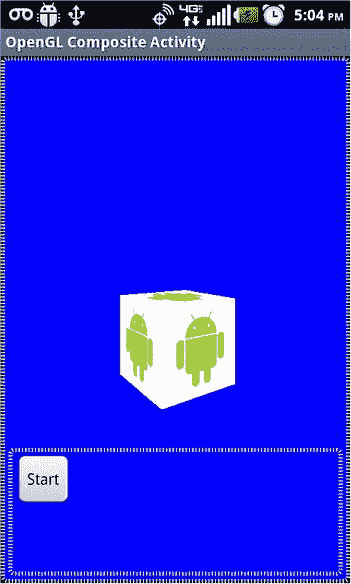

图 9-11。

Controlling the rotation of a textured cube with mixed views

图 9-11 中显示的活动是一个复合视图，其中我们混合了一个 OpenGL 视图和一个常规的 Android 视图。常规的 Android 视图可以有旋转立方体的控件。但是请记住，当您混合视图时，GL 表面视图上的绘制是由背景线程完成的。这样做的副作用是，如果你使用的是由主线程绘制的背景可绘制图形，它们可能不会显示出来，因为 GL 看起来优先，可能会覆盖表面。

你可以在本章的可下载项目中看到活动的代码和图 9-11 的布局(参见参考文献)。或者你可以访问这个网址来一窥源代码: [`http://androidbook.com/item/4254`](http://androidbook.com/item/4254)

### 参考

您会发现以下 OpenGL 资源非常有用:

*   OpenGL 书籍及资源作者手记: [`http://androidbook.com/item/3173`](http://androidbook.com/item/3173) `.`
*   作者关于 OpenGL 研究的各种笔记: [`http://androidbook.com/opengl`](http://androidbook.com/opengl) 。
*   Aaftab Munshi 等的 OpenGL ES 2.0 编程指南。这是我们发现的最好的书之一，很好地解释了阴影语言。然而，你最好有 OpenGL 超级圣经来理解 OpenGL 的基础知识。
*   小理查德·S·莱特的 OpenGL 超级圣经等。这本书对学习 OpenGL 的基础很有帮助。然而，你至少需要另外一本书来很好地解释着色语言。
*   Randi J Rost 的 OpenGL 着色语言等。你可以用它作为阴影语言的参考书。如果你真的想花时间在 OpenGL 上，你也需要这本书。然而，Aaftab 的书在向初学者解释着色语言方面做得更好。你可能想拥有这三本书。下面列出了几本补充书籍。
*   OpenGL 编程指南(红皮书): [`www.glprogramming.com/red/`](http://www.glprogramming.com/red/) 。虽然这个在线参考很方便，但是它止步于 OpenGL 1.1。你将需要购买第 7 版的最新资料，包括 OpenGL 着色器。
*   RenderMan 伴侣:现实计算机图形程序员指南。这本书在图形界得到了高度推荐。RenderMan 是皮克斯出品的软件。
*   Android 在 OpenGL 上的主文档: [`http://developer.android.com/guide/topics/graphics/opengl.html`](http://developer.android.com/guide/topics/graphics/opengl.html) 。
*   Android 关于 OpenGL ES 2.0 的教程(用 OpenGL 绘制图形): [`http://developer.android.com/training/graphics/opengl/index.html`](http://developer.android.com/training/graphics/opengl/index.html) 。
*   安卓的`android.opengl`包参考网址: [`http://developer.android.com/reference/android/opengl/GLSurfaceView.html`](http://developer.android.com/reference/android/opengl/GLSurfaceView.html) 。
*   Khronos 集团的 OpenGL ES 参考手册: [`www.khronos.org/opengles/documentation/opengles1_0/html/index.html`](http://www.khronos.org/opengles/documentation/opengles1_0/html/index.html) 。
*   下面是微软的一篇非常好的关于纹理贴图的文章: [`http://msdn.microsoft.com/en-us/library/ms970772(printer).aspx`](http://msdn.microsoft.com/en-us/library/ms970772(printer).aspx) 。
*   您可以在以下网址找到来自华盛顿州立大学的 Wayne O. Cochran 关于 OpenGL 的精辟课程材料: [`http://ezekiel.vancouver.wsu.edu/∼cs442/`](http://ezekiel.vancouver.wsu.edu/) 。
*   JSR 239(OpenGL ES API 的 Java 绑定)的文档位于: [`http://java.sun.com/javame/reference/apis/jsr239/`](http://java.sun.com/javame/reference/apis/jsr239/) 。
*   OpenGL ES 2.0 的手册页`khronos.org`是有用的参考，但不是指南: [`www.khronos.org/opengles/sdk/docs/man/`](http://www.khronos.org/opengles/sdk/docs/man/) `.`
*   理解着色语言对于理解新的 OpenGL 方向是必不可少的，包括 OpenGL ES 2.0: [`www.opengl.org/documentation/glsl/`](http://www.opengl.org/documentation/glsl/) `.`
*   GLES20 API 引用自 Android SDK: [`http://developer.android.com/reference/android/opengl/GLES20.html`](http://developer.android.com/reference/android/opengl/GLES20.html) `.`
*   GLSurfaceView 引用: [`http://developer.android.com/reference/android/opengl/GLSurfaceView.html`](http://developer.android.com/reference/android/opengl/GLSurfaceView.html) `.`
*   你可以在这里找到本书对 OpenGL 纹理研究的作者之一: [`http://www.androidbook.com/item/3190`](http://www.satyakomatineni.com/akc/display?) 。
*   OpenGL、OpenGL ES 和 GLSL 的版本号: [`http://androidbook.com/item/4243`](http://androidbook.com/item/4243) 。
*   如何从 Eclipse ADB 在设备上运行 Android 应用: [`http://androidbook.com/item/3574`](http://androidbook.com/item/3574) `.`
*   如何从 EclipseADT 和 DDMS 抓取设备上的 OpenGL ES 2.0 屏幕: [`http://androidbook.com/item/4255`](http://androidbook.com/item/4255) 。
*   如何调试 OpenGL ES 2.0 程序: [`http://androidbook.com/item/4231`](http://androidbook.com/item/4231) 。
*   了解 OpenGL 缠绕: [`http://androidbook.com/item/4230`](http://androidbook.com/item/4230) 。
*   使用 OpenGL ES 2.0 的旋转立方体示例代码: [`http://androidbook.com/item/4254`](http://androidbook.com/item/4254) 。
*   下载本章专用的测试项目:[`http://www.androidbook.com/expertandroid/projects`](http://www.androidbook.com/expertandroid/projects)`.`ZIP 文件的名字是`ExpertAndroid_Ch09_OpenGL.zip`。

## 摘要

这是对本书之前版本的 OpenGL 在 Android 上的一个很大的改进。这一章是关于向你介绍 Android 上的 OpenGL 的精彩研究的高潮。我们已经介绍了 OpenGL、ES 1.0 和 ES 2.0 的基础知识。我们已经解释了理解 OpenGL 文献所必需的 OpenGL 基本词汇。我们已经讨论了纹理，绘制多个图形，模型转换和 GLSL。我们已经给了你一套基本的着色器程序，以及如何使用它们进行大量简单的 OpenGL 练习。我们已经使用 GLSL 和 ES 2.0 在包含 GL 视图和普通视图的混合活动中绘制了一个旋转的立方体。我们已经向您展示了如何从简单的 Android 控件(如按钮)控制 OpenGL 绘图和动画。

## 复习问题

下面的问题可以作为你在本章所学内容的里程碑

What is the difference between OpenGL and OpenGL ES?   What is the difference between ES 1.0 and ES 2.0?   Why is ES 2.0 not backward compatible with ES 1.0?   What is a fixed-function graphics pipeline?   What are GLUT, GLEW, and EGL?   What are color, depth, and stencil buffers?   What buffers make up a frame buffer?   What is Android Renderscript?   What are the three key characteristics of Android Renderscript?   What is OpenCL?   What is CUDA?   What are object, model, world, eye, and device coordinates?   What are model, view, and projection matrices?   How many transforamtion matrices are there in ES 1.0?   How do methods related to matrix operations in ES 1.0 target a specific matrix?   What is the need for a push-and-pop operations for a matrix in OpenGL?   What is a frustum?   What is an OpenGL view port?   How do you explain position and color as ES 2.0 vertex attributes?   Can you pass an arbitrary set of values as vertex attributes in ES 2.0?   How do you know which side of an OpenGL surface is outside and which is inside?   Does it matter in what order you specify vertices?   Does it matter where you start the vertices as long as they satisfy the winding?   Provide a rudimentary understanding of blending, dithering, and anti-aliasing.   How do you use indices to draw geometry in OpenGL?   What is orthographic and perspective projections in OpenGL?   Explain how GLSurfaceView and Renderer are used to do a basic drawing?   How do you do animation with GLSurfaceView?   What is glMatrixMode() and how does it affect model transformations like glRotate?   Why do you need shapes for defining vertices for complex objects?   How do you specify texture coordinates for an OpenGL surface?   How are texture coordinates related to vertex coordinates?   What are texels?   What is the difference between a texture ID and a texture name?   What is GLSL?   What are shaders?   How do you compile and link shaders?   How often does a vertex shader get called?   How often does a fragment shader get called?   Why is glVertexAttribPointer() a generic method?   What APIs are available to debug ES 2.0 issues?   What is a varying variable?   What are reserved variables in GLSL?   How do you bind to the attribute and uniform variables in a shader?   What is the right order to transform using model, view, and projection matrices?   How do you load shader source code from assets?   What are attributes in GLSL?   What are uniform variables in GLSL?   What is the role of texture samplers in GLSL?   Why do you need to turn a texture coordinates upside down when attaching to a surface geometry?   How do you associate a texture sampler with a texture unit?   How do you debug compiler errors for the shading programs?   How do you debug linking errors from linking the shaders in a program?   What would you do if your texture appears upside down?   Can you have a texture coordinate larger than 1?   What is the difference between GL_REPEAT and GL_CLAMP?