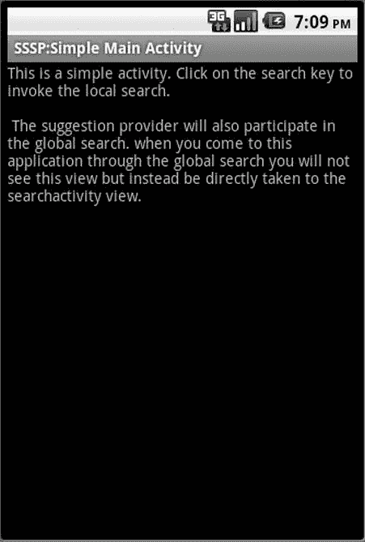

# 十一、简单搜索建议供应器

Abstract

我们在第十章中探讨了 Android 搜索的用户体验。在那里，我们解释了搜索应用如何响应用户输入的搜索文本提供建议。搜索应用中响应建议的组件称为建议提供者。本章介绍了建议提供者，并探索了一个名为`SearchRecentSuggestionsProvider.`的预建建议提供者。在下一章中，我们将向您展示如何从头开始编写一个定制的搜索建议提供者。

我们在第十章中探讨了 Android 搜索的用户体验。在那里，我们解释了搜索应用如何响应用户输入的搜索文本提供建议。搜索应用中响应建议的组件称为建议提供者。本章介绍了建议提供者，并探索了一个名为`SearchRecentSuggestionsProvider`的预构建建议提供者。在下一章，我们将向你展示如何从头开始编写一个定制的搜索建议提供者。

当你写一个建议提供者的时候，有三个主要部分需要关注。第一个是建议提供者 Java 类，负责将这些建议返回给 Android 搜索。第二个是搜索结果活动(类似于第十章中讨论的活动)，它接受一个查询或建议并将其转化为搜索结果。在本章中，我们交替使用搜索活动和搜索结果活动这两个术语。

编写建议提供者涉及的第三部分是元数据 XML 文件(也在第十章的中介绍)，它是在搜索活动的上下文中定义的。这个搜索元数据 XML 文件也被称为`searchableinfo` XML 文件，因为在 Java 源代码中，这个文件通常被称为“在`SearchActivity object`上获取和设置`searchableinfo`”

我们描述了每个搜索应用的职责，并通过源代码片段展示了如何实现它们以形成一个简单的建议提供者。在本章末尾的参考资料中，我们还提供了一个下载完整工作应用的链接。

## 规划简单的建议提供者

所有搜索建议供应器的目标都是一样的:从 Android 搜索工具(快速搜索框，也称为 QSB，在第十章中介绍)接收部分或全部搜索文本，并以建议光标的形式回复一组建议(一组搜索建议行)。建议提供者是内容提供者。因此，实现一个建议提供者本质上与实现一个内容提供者是一样的，尽管有一组固定的输入和输出。

要演示一个建议提供者，最简单的方法是扩展预构建的`SearchRecentSuggestionsProvider`。`SearchRecentSuggestionsProvider`允许您重放(或建议)之前从 QSB 提交给搜索结果活动的查询。一旦这些查询被搜索结果活动保存，当用户开始在 QSB 中键入文本时，它们通过建议提供者被提示回 QSB。

`SearchRecentSuggestionsProvider`从一组空泛的建议开始。用户在搜索框中键入一些文本。该文本提供给查找结果的搜索活动。搜索活动还保存搜索文本作为下次可能的建议。这个保存操作本质上是保存到`SearchRecentSuggestionsProvider;`中，它允许建议提供者将那些先前的搜索表示为建议。但是，这是专门针对`SearchRecentSuggestionsProvider`的协议。在下一章中，当你学习编写一个定制的建议提供者时，你可以自由地定义你将如何用建议来响应。

虽然这个协议已经由`SearchRecentSuggestionsProvider`实现了，但是您需要初始化和专门化`SearchRecentSuggestionsProvider`来满足您特定的搜索需求。在派生的建议提供程序中，您通过指示搜索文本的哪些部分需要重放来初始化基本的`SearchRecentSuggestionsProvider`。

在我们简单的演示应用中，我们使用了一个最小的搜索结果活动，它只是一个文本视图，以显示搜索结果活动已经被调用。在搜索结果活动中，我们还将向您展示检索和保存搜索查询的方法，以便下次搜索建议提供者可以使用它们。

一旦应用完成，我们应该在本地和全局 QSB 中看到作为建议提示的前面的查询。在本章的最后一节，我们用图表展示了这种用户体验。

## 实现简单建议提供程序

因为简单的建议提供者是从`SearchRecentSuggestionsProvider`派生出来的，所以大部分职责都由这个基类来处理。因为建议提供者是内容提供者，所以您需要一个唯一的字符串来标识该内容提供者的权限。仔细阅读内容供应器，因为我们在本章中假设你已经知道内容供应器。内容供应器的权限是它的 web 类调用 URL。

base `SearchRecentSuggestionsProvider`需要用这个应用唯一的授权字符串进行初始化。Android search 然后基于唯一的内容供应器 URL 调用这个建议供应器。一旦使用这个对基本`SearchRecentSuggestionsProvider`类的简单调用实现了派生的建议提供者，就需要在清单文件中将其配置为具有权限的常规内容提供者。它(间接地通过可搜索的元数据 XML 文件)与搜索活动联系在一起。搜索活动定义引用可搜索的 XML 文件，该文件又指向建议提供者。

现在，我们将通过带注释的代码片段详细展示所有这些步骤。完整的源代码和工作应用可以从本章末尾参考资料中的 URL 下载。因为我们从`SearchRecentSuggestionsProvider`继承，简单建议提供者的源代码将会非常简单，如清单 11-1 所示。

清单 11-1 . SimpleSuggestionProvider.java

`//SimpleSuggestionProvider.java`

`public class SimpleSuggestionProvider`

`extends SearchRecentSuggestionsProvider {`

`final static String AUTHORITY =`

`"com.androidbook.search.simplesp.SimpleSuggestionProvider";`

`final static int MODE =`

`DATABASE_MODE_QUERIES | DATABASE_MODE_2LINES;`

`public SimpleSuggestionProvider() {`

`super();`

`setupSuggestions(AUTHORITY, MODE);`

`}`

`}`

清单 11-1 中有几件值得注意的事情:

The parent class is initialized.   The base provider is set up with an authority and mode, indicating what portions of a search text need to be remembered.  

建议内容供应器授权字符串必须是唯一的。清单 11-1 中的惟一授权字符串需要与清单文件中的内容提供者定义相匹配。这个`SimpleSuggestionProvider`(清单 11-1)和任何其他内容提供者一样在清单文件中注册。清单 11-2 显示了这个定义。

清单 11-2。清单文件中的 SimpleSuggestionProvider

`<?xml version="1.0" encoding="utf-8"?>`

`<manifest xmlns:android=`[`http://schemas.android.com/apk/res/android`](http://schemas.android.com/apk/res/android)

`<application...>`

`<provider android:name=".SimpleSuggestionProvider"`

`android:authorities`

`="com.androidbook.search.simplesp.SimpleSuggestionProvider" />`

`</application>`

`</manifest>`

注意简单建议提供者的权限在源代码(清单 11-1)和清单文件(清单 11-2)中是如何匹配的。在这两种情况下，这种权威的价值是

`com.androidbook.search.simplesp.SimpleSuggestionProvider`

Android 提供的`SearchRecentSuggestionsProvider`工具的一个关键功能是存储/重放来自数据库的查询，以便它们可以作为未来的建议。一个建议有两个文本字符串(参见本章后面的图 11-6 )。一个字符串是查询，另一个字符串是显示在建议显示项中的描述行。只有第一个字符串是必需的。当您使用`SearchRecentSuggestionsProvider`来重放这些字符串时，您需要告诉它您是想要使用一个字符串还是两个字符串。

为了适应这种情况，基本建议提供程序支持两种模式(模式位)。

*   `DATABASE_MODE_QUERIES`(二进制值 1)
*   `DATABASE_MODE_2LINES`(二进制值 2)

当搜索活动被调用来响应查询时，它负责保存这两个字符串值。搜索活动将调用清单 11-3 所示的方法来存储查询字符串。(我们将在讨论搜索活动时更详细地介绍这一点。).

清单 11-3。如何保存最近的查询

`pulbic class SearchRecentSuggestions`

`{`

`...`

`public void saveRecentQuery (String queryString, String line2);`

`...`

`}`

Note

类`SearchRecentSuggestions`是一个 SDK 类，当我们讨论搜索活动代码(清单 11-4)时，我们会涉及更多。

在清单 11-3 中，`queryString`是用户输入的字符串。该字符串显示为建议，如果用户单击建议，该字符串将被发送到搜索活动(作为新的搜索查询)。

以下是 Android 文档对`line2`论点的评论:

如果您已经用 DATABASE _ MODE _ 行配置了最近建议提供程序，则可以在此处传递第二行文本。它将以较小的字体显示在主要建议的下方。键入时，任何一行文本中的匹配项都将显示在列表中。如果您没有配置两行模式，或者如果给定的建议没有任何附加文本要显示，您可以在此处传递 null。

您可以在以下网址查看 Android 开发人员参考

[`http://developer.android.com/reference/android/provider/SearchRecentSuggestions.html`](http://developer.android.com/reference/android/provider/SearchRecentSuggestions.html)

在我们的示例中，我们希望保存查询和在建议中与查询一起显示的有用文本。或者至少，我们希望在建议的底部显示有用的文本，如 SSSP(搜索简单建议供应器)，以便当来自该供应器的建议出现在全局搜索中时，我们可以看到是什么应用负责搜索建议中的文本。

指定该模式以便保存建议和有用文本的方法是设置两个模式位，如`SimpleSuggestionProvider`的源代码所示(见清单 11-1)。如果您只是将模式位设置为保存两行，您将得到一个无效参数异常。模式位必须至少包括`DATABASE_MODE_QUERIES`位。本质上，你需要做一个按位或运算，这样模式在本质上是互补的，而不是排他的。

Tip

您可以通过 [`http://developer.android.com/reference/android/provider/SearchRecentSuggestions.html`](http://developer.android.com/reference/android/provider/SearchRecentSuggestions.html) 了解更多关于这个预制建议供应器的信息。

## 搜索结果活动

Android search (QSB)通过查询字符串调用搜索结果活动。反过来，搜索活动需要从意图中读取这个查询字符串，执行必要的操作，并可能显示结果。因为搜索结果活动是一个活动，所以它可能被其他意图和其他动作调用。因此，检查调用它的意图动作是一个好的做法。在我们的例子中，当 Android search 调用搜索结果活动时，与调用意图一起传递的`action`属性是 ACTION_SEARCH。

在某些情况下，搜索结果活动可以调用自身。当这有可能发生时，您应该将搜索活动启动模式定义为一个`singleTop`。该活动还需要处理`onNewIntent()`的触发。(我们将在下一节“理解 onCreate()和 onNewIntent()”中介绍这一点。)对于查询字符串，我们只记录它。一旦查询被记录，我们需要将它保存在`SearchRecentSuggestionsProvider`中，这样它就可以作为未来搜索的建议。

现在让我们看看执行这些职责的搜索结果或搜索活动类的源代码。清单 11-4 显示了这个`SearchActivity`类的源代码。

清单 11-4。搜索活动的 Java 代码

`public class SearchActivity extends Activity`

`{`

`private final static String tag ="SearchActivity";`

`@Override`

`protected void onCreate(Bundle savedInstanceState) {`

`super.onCreate(savedInstanceState);`

`setContentView(R.layout.layout_search_activity);`

`//this.setDefaultKeyMode(Activity.DEFAULT_KEYS_SEARCH_GLOBAL);`

`this.setDefaultKeyMode(Activity.DEFAULT_KEYS_SEARCH_LOCAL);`

`// get and process search query here`

`final Intent queryIntent = getIntent();`

`final String queryAction = queryIntent.getAction();`

`if (Intent.ACTION_SEARCH.equals(queryAction))`

`{`

`Log.d(tag,"new intent for search");`

`this.doSearchQuery(queryIntent);`

`}`

`else {`

`Log.d(tag,"new intent NOT for search");`

`}`

`return;`

`}`

`@Override`

`public void onNewIntent(final Intent newIntent)`

`{`

`super.onNewIntent(newIntent);`

`Log.d(tag,"new intent calling me");`

`// get and process search query here`

`// Notice we are using the newIntent and not the one`

`// from the activity.`

`final Intent queryIntent = newIntent;`

`final String queryAction = queryIntent.getAction();`

`if (Intent.ACTION_SEARCH.equals(queryAction))`

`{`

`this.doSearchQuery(queryIntent);`

`Log.d(tag,"new intent for search");`

`}`

`else {`

`Log.d(tag,"new intent NOT for search");`

`}`

`}`

`private void doSearchQuery(final Intent queryIntent)`

`{`

`final String queryString =`

`queryIntent.getStringExtra(SearchManager.QUERY);`

`// Record the query string in the recent`

`// queries suggestions provider.`

`SearchRecentSuggestions suggestions =`

`new SearchRecentSuggestions(this`，

`SimpleSuggestionProvider.AUTHORITY`，

`SimpleSuggestionProvider.MODE);`

`String helpfullHint = "SSSP";`

`suggestions.saveRecentQuery(queryString, helpfullHint);`

`}`

`}`

清单 11-5 快速记录了清单 11-4 中搜索结果活动的布局文件。

清单 11-5。搜索活动布局文件

`<?xml version="1.0" encoding="utf-8"?>`

`<!-- /res/layout/layout_search_activity.xml -->`

`<LinearLayout`

`xmlns:android="`[`http://schemas.android.com/apk/res/android`](http://schemas.android.com/apk/res/android)

`android:orientation="vertical"`

`android:layout_width="fill_parent"    android:layout_height="fill_parent"`

`>`

`<TextView`

`android:id="@+id/text1"`

`android:layout_width="fill_parent"  android:layout_height="wrap_content"`

`android:text="Test Search Activity view"`

`/>`

`</LinearLayout>`

清单 11-6 显示了如何在清单文件中定义`SearchActivity`活动，并将其绑定到它的`searchableinfo` xml 文件。

清单 11-6。定义 SearchActivity 及其 SearchableInfo

`<activity android:name=".SearchActivity"`

`android:label="SSSP: Search Activity"`

`android:launchMode="singleTop">`

`<intent-filter>`

`<action android:name="android.intent.action.SEARCH" />`

`<category android:name="android.intent.category.DEFAULT" />`

`</intent-filter>`

`<meta-data android:name="android.app.searchable"`

`android:resource="@xml/searchable" />`

`</activity>`

`<meta-data android:name="android.app.default_searchable"`

`android:value=".SearchActivity" />`

在第十章中，我们介绍了如何在清单文件中定义搜索活动。所有这些方面都存在于搜索活动清单文件中，如清单 11-6 所示。重申一下，我们将搜索活动定义为能够响应搜索动作。然后我们附加了一个可搜索的 XML 文件来定义搜索的性质。(我们将在本章后面的“搜索元数据”一节中详细介绍这个 XML 文件。)我们还指出，在应用级别，这(清单 11-4 的`SearchActivity`)是指定的搜索活动。这意味着在此应用的任何活动中进行搜索都会以此搜索活动为目标。

让我们回到清单 11-4 中搜索活动的实现源代码，看看搜索活动是如何检查动作和检索查询字符串的。

### 使用搜索查询字符串

搜索活动代码通过查看调用意图并将其与`constant intent.ACTION_SEARCH`进行比较来检查调用动作。如果动作匹配，那么它调用`doSearchQuery()`函数。

在`doSearchQuery()`函数中，搜索活动使用 intent extra 检索查询字符串。清单 11-7 显示了这段代码:

清单 11-7。如何从搜索意图中读取查询字符串

`final String queryString =`

`queryIntent.getStringExtra(SearchManager.QUERY);`

注意，额外意图被定义为`SearchManager.QUERY`。当您阅读本章时，您将会看到在`SearchManager` API 参考中定义的一些额外功能。(它的 URL 包含在本章末尾的参考资料中。)

### 了解 onCreate()和 onNewIntent()

当用户在搜索框中输入文本并点击建议或前进箭头时，搜索活动由 Android 启动。这导致创建搜索活动并调用其`onCreate()`方法。传递给这个`onCreate()`的意图将把动作设置为`ACTION_SEARCH`。

有时候，活动并没有被创建，而是通过`onNewIntent()`方法传递了新的搜索标准。这是怎么发生的？回调`onNewIntent()`与一个活动的发起方式密切相关。

当一个活动被设置为`singleTop`(见清单 11-6 中`SearchActivity`的清单文件定义)时，它指示 Android 不要创建一个新的活动，当那个活动已经在栈顶的时候。在这种情况下，Android 调用`onNewIntent()`而不是`onCreate()`。这就是为什么在清单 11-4 的`SearchActivity`源代码中，我们有两个地方来检查意图。注意，在`onNewIntent`()方法中，您应该使用新的意图来检索查询，而不是开始活动的意图。

### 测试 onNewIntent()

一旦你实现了`onNewIntent()`,你开始注意到它不会在正常的流程中被调用。这就提出了一个问题，什么时候搜索活动会在栈顶？这种情况一般不会发生。

原因如下:假设一个搜索调用活动 A 调用了一个搜索，这导致搜索活动 B 出现。然后，活动 B 显示结果，用户点击 Back 按钮返回，此时，作为用户搜索活动的活动 B 不再位于栈顶，活动 A 位于栈顶。或者用户可以点击主页键并使用主页屏幕上的全局搜索，在这种情况下，主页活动是顶部的活动。

搜索活动可以在上面的一种方式是这样的:假设由于搜索，活动 A 导致活动 B。如果活动 B 定义了搜索类型，那么当您关注活动 B 时，搜索将使用新的标准再次调用活动 B。清单 11-4 显示了我们是如何设置搜索类型来演示的。下面是代码:

`this.setDefaultKeyMode(Activity.DEFAULT_KEYS_SEARCH_LOCAL);`

### 保存搜索查询

我们已经讨论了搜索活动如何需要保存它遇到的查询，以便它们可以通过建议提供者作为建议被回放。清单 11-8 是保存这些查询的代码段:

清单 11-8。为将来的建议保存最近的搜索查询

`final String queryString =`

`queryIntent.getStringExtra(SearchManager.QUERY);`

`// Record the query string in the`

`// recent queries suggestions provider.`

`SearchRecentSuggestions suggestions =`

`new SearchRecentSuggestions(this`，

`SimpleSuggestionProvider.AUTHORITY`，

`SimpleSuggestionProvider.MODE);`

`String helpfullHint = "SSSP";`

`suggestions.saveRecentQuery(queryString, helpfullHint);`

从这段代码中，您可以看到 Android 将查询信息作为额外的(SearchManager。查询)通过意向。

一旦有了可用的查询，就可以使用 SDK 实用程序类`SearchRecentSuggestions`来保存查询和提示(“SSSP”)，方法是实例化一个新的 suggestions 对象并要求它保存。因为我们已经选择使用两行模式和查询模式，所以`saveRecentQuery`的第二个参数是 SSSP(同样，这代表简单搜索建议提供者)。您将看到此帮助文本出现在该供应器的每个建议的底部。(参见本章后面的图 11-6 )。

现在，我们来看看搜索元数据定义(也称为`searchableinfo`)，其中我们将搜索活动与搜索建议提供者联系起来。(另一方面，请参见清单文件清单 11-6，其中我们将搜索元数据与搜索活动联系在一起。)

## 探索搜索元数据

Android 中搜索的定义是从一个搜索活动开始的。首先在清单文件中定义一个搜索活动。作为这个定义的一部分，您告诉 Android 在哪里可以找到搜索元数据 XML 文件。参见清单 11-6，其中定义了我们的搜索活动以及搜索元数据 XML 文件的路径(`searchable.xml`)。清单 11-9 显示了相应的搜索元数据 XML 文件。

清单 11-9。SimpleSuggestionProvider 搜索元数据

`<!-- filename: /res/xml/searchable.xml -->`

`<searchable`

`xmlns:android="`[`http://schemas.android.com/apk/res/android`](http://schemas.android.com/apk/res/android)

`android:label="@string/search_label"`

`android:hint="@string/search_hint"`

`android:searchMode="showSearchLabelAsBadge"`

`android:queryAfterZeroResults="true"`

`android:includeInGlobalSearch="true"`

`android:searchSuggestAuthority=`

`"com.androidbook.search.simplesp.SimpleSuggestionProvider"`

`android:searchSuggestSelection=" ? "`

`/>`

让我们研究一下清单 11–9 中的一些关键属性。

首先，在清单 11-9 中，属性`searchSuggestAuthority`指向建议提供者的权限，如该建议提供者的清单文件中所定义的那样(参见清单 11-2)。属性`includeInGlobalSearch`告诉 Android 使用这个建议提供者作为全局 QSB 的来源之一。

属性`queryAfterZeroResults`指示如果当前字母集没有返回任何结果，QSB 是否应该向建议提供者发送更多的字母。因为我们正在进行测试，所以我们不想遗漏任何细节，所以我们将该属性设置为 True，这样我们就给了提供者做出响应的所有机会。

当您从最近的搜索建议提供者派生时，属性`searchSuggestSelection`，总是由`?`表示的字符串，该字符串作为内容提供者`query`方法的`selection`字符串(where 子句)传递给建议提供者。通常，这表示任何内容提供者的 select 语句中的“where”子句。

具体到建议提供者，当有为`searchSuggestSelection`(作为一个协议)指定的值时，Android 将搜索查询字符串(在 QSB 中输入)作为内容提供者查询方法的 select arguments 数组中的第一个条目进行传递。

响应这些细微差别(提供者如何在内部使用这些字符串)的代码隐藏在最近的搜索建议提供者中；我们无法向您展示这些参数是如何在内容提供者的`query`方法中使用的。(我们将在下一章更详细地讨论这一点，在这一章中，你将看到该字符串的全貌。”？.")事实上，这个字符串不太可能用于缩小`SearchRecentSuggestionsProvider`的结果范围，因为它没有限定任何要查询的字段，比如“someid ==？”很可能它的存在促使 Android 将 QSB 字符串作为第一个参数传递给提供者。并且 SDK 搜索建议提供者仅仅依靠这个协议来接收由内容提供者`query()`方法的选择参数列表提供的便利数组中的 QSB 字符串。

现在让我们来讨论一个搜索调用者活动，我们将使用它作为这个应用的主要入口点。这个主活动允许我们测试本地搜索。

## 搜索调用者活动

到目前为止，我们已经开发了两个关键素材:一个搜索建议供应器和一个搜索活动。然后我们通过清单 11-6 中的`searchableinfo.xml.`将它们联系在一起，我们还指出`SearchActivity`是这个应用中搜索的目标活动。

Note

当您在检查`SearchActivity`上的结果时，您可以通过单击搜索关键字来利用应用级的搜索活动来调用`onNewIntent()`。如果您只为单个活动而不是整个应用定义默认搜索，情况就不一样了。

现在有了这些(搜索活动、建议提供者、`searchableinfo xml`和清单文件中的指定条目)，您可以通过使用任何简单的活动作为搜索调用程序活动来测试搜索功能。在下一节中，我们将使用为本章开发的示例程序概述这种搜索体验。

## 简单建议供应器用户体验

示例应用包含一个非常简单的主活动，如图 11-1 所示。这个活动非常简单，不知道任何搜索上下文。

图 11-1。

A simple main activity (enabled for local search)

然而，因为我们已经将我们的搜索活动(见清单 11-6)定义为应用的全局活动，如果我们在图 11-1 中简单的主活动处于焦点时点击搜索键，我们将看到本地搜索被调用，如图 11-2 所示。

图 11-2。

Local search QSB shown on top of the main activity Note

本章中的所有数字都是使用 Android 2.3 捕获的。我们也在 4.0 中测试了该应用，我们没有发现明显的差异。我们还没有更新 4.0 的数据，但是本章的应用下载使用的是 Android 4.0。

如你所见，图 11-2 中没有任何建议，因为到目前为止我们还没有搜索任何建议。您还可以看到这是一个本地搜索—搜索的标签和提示与我们在搜索元数据 XML 文件中指定的一样。

让我们继续搜索字符串`test1`。这将带您进入搜索活动屏幕，如图 11-3 所示。

图 11-3。

Local search results activity

正如您在清单 11-4 的`SearchActivity`源代码中看到的，`SearchActivity`在屏幕上并没有做什么引人注目的事情，但是在幕后，它将查询字符串保存在数据库中。现在，如果您导航回主屏幕(通过按下返回按钮)并再次调用搜索，您将看到如图 11-4 所示的屏幕，其中搜索建议由之前的查询文本填充。你也可以在图 11-4 中看到建议“SSSP”的底部这在这里似乎无关紧要，因为这是一个本地搜索，并且清楚地表明它来自我们的应用。然而，当这个字符串“SSSP”作为全局搜索建议的一部分显示时，它将区分`test1`搜索字符串。

图 11-4。

Retrieved local suggestion

这是了解如何调用`onNewIntent()`的好时机。当你在进行搜索活动时(图 11-3 ，你可以键入一个类似 t 的字母，它会使用 type-to-search 再次调用搜索，你会在调试日志中看到`onNewIntent()`被调用。

让我们看看我们需要做些什么来让这些建议出现在全球 QSB 中。因为我们在`searchable.xml`中启用了`includeInGlobalSearch`，所以您应该也能在全球 QSB 中看到这些建议。但是，在此之前，您需要为全球 QSB 建议启用该应用，如图 11-5 所示。

图 11-5。

Enabling a Searchable application

在第十章中，我们向你展示了如何到达这个屏幕。我们编写的简单定制建议提供程序现在可以在可搜索应用列表中作为“SSSP:搜索活动”使用这个文本字符串来自于`SearchActivity`的活动名称(参见清单 11-6)。选择完成后，您可以看到如图 11-6 所示的全局搜索，与我们的建议供应器合作。

图 11-6。

Global suggestions from simple suggestion provider

在图 11-6 的全局搜索中，如果你键入一个类似 t 的文本，它会调出本节建议提供者的建议。但是，您可能希望用一个长词来测试它，比如 testsuperb，这样通用工具就不会有其他以 t 开头的建议，或者您必须一直向下滚动。或者，您可以筛选并明确选择该供应器进行搜索。在图 11-6 中，当您通过全局搜索导航到特定项目时，您将看到如图 11-3 所示的本地搜索活动。

## 参考

在您学习本章时，以下资源将会非常有用。

*   [`developer.android.com/guide/topics/search/index.html`](http://developer.android.com/guide/topics/search/index.html)
*   [`developer.android.com/guide/topics/search/searchable-config.html`](http://developer.android.com/guide/topics/search/searchable-config.html)
*   [`http://developer.android.com/reference/android/app/SearchManager.html`](http://developer.android.com/reference/android/app/SearchManager.html):Android 主搜索工具的 API 引用，即`SearchManager. You will see here some of the constants that you use while coding the suggestion provider.`
*   [`http://developer.android.com/reference/android/provider/SearchRecentSuggestions.html`](http://developer.android.com/reference/android/provider/SearchRecentSuggestions.html) :允许保存最近搜索建议的类的 API 引用。
*   [`http://www.androidbook.com/notes_on_search`](http://www.androidbook.com/notes_on_search) `:`在这个网址你可以在安卓搜索上找到作者的笔记。即使在这本书出版后，我们也会继续更新内容。您将在这里找到代码片段、摘要、用于搜索的关键 URL，以及每个版本中的变化。
*   下载本章专用的测试项目:[`www.androidbook.com/expertandroid/projects`](http://www.androidbook.com/expertandroid/projects)`.`ZIP 文件的名称是专家`Android_ch11_SimpleSuggestionProvider.zip`。

## 摘要

您已经了解了如何使用内置的`RecentSearchSuggestionProvider`来记住特定于您的应用的搜索。使用这种方法，用最少的代码，您应该能够进行本地搜索，并使它们作为建议甚至在全局上下文中可用。我们还解释了如何利用`onNewIntent()`回调来利用`singleTop`活动。

然而，这个简单的练习并没有向您展示如何从头开始编写建议提供者。更重要的是，对于建议提供者如何返回一组建议以及这个建议集中有哪些列可用，我们没有给你任何提示。为了理解这一点以及更多，我们需要从头实现一个定制的建议提供者。

那要等到下一章了。

## 复习问题

以下问题可以作为你在本章所学内容的里程碑:

What are suggestion providers?   How do you code a very simple suggestion provider?   What is `SearchRecentSuggestionProvider`?   How do you save recent suggestions so that the `SearchRecentSuggestionProvider` could use them?   What are the basic attributes of `searchableinfo xml` that are relevent to a `SearchRecentSuggestionProvider`?   How do you test `singleTop` and `onNewIntent()`?   How do you enable suggestion providers to show up in a global search?