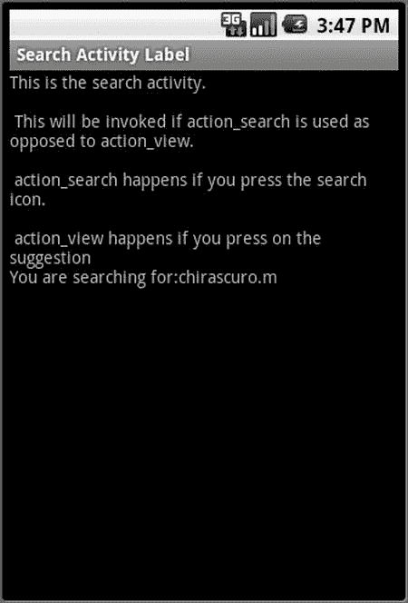
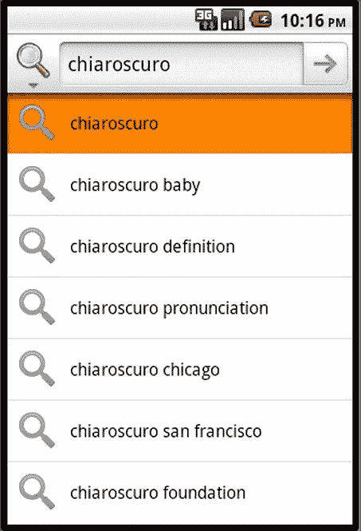

# 十二、自定义搜索建议供应器

Abstract

安卓搜索太灵活，不能不定制。因为我们在上一章中使用了一个预构建的建议提供者，所以建议提供者的许多可定制特性都隐藏在`SearchRecentSuggestionsProvider`中，没有讨论。在本章中，我们将通过实现一个名为`SuggestUrlProvider.`的定制建议提供者来探究这些细节

安卓搜索太灵活，不能不定制。因为我们在上一章中使用了一个预构建的建议提供者，所以建议提供者的许多可定制特性都隐藏在`SearchRecentSuggestionsProvider`中，没有讨论。在本章中，我们将通过实现一个名为`SuggestUrlProvider`的定制建议提供者来探究这些细节。

我们从解释`SuggestUrlProvider`如何工作开始。我们将为您提供实现提供程序所需的所有代码片段，这些代码片段将提供如何构建定制建议提供程序的详细思路。我们还将通过在一个示例应用中展示它，向您展示如何使用这个定制建议提供程序。

## 规划定制建议提供者

我们将致电我们的定制建议供应器`SuggestURLProvider`。该提供程序的目标是监视输入到 QSB 中的内容。如果搜索查询具有类似“great `.` m”(后缀)的文本。m”被选择来表示含义)，我们的定制建议提供者将把查询的第一部分解释为一个单词，并建议一个基于互联网的 URL，可以调用该 URL 来查找该单词的含义。

对于使用这种模式识别的每个单词，`SuggestURLProvider`提供了两个 URL。第一个 URL 允许用户使用 [`http://www.thefreedictionary.com`](http://www.thefreedictionary.com) 搜索单词，第二个 URL 使用 [`http://www.google.com`](http://www.google.com) 。选择这些建议中的一个会将用户直接带到这些站点中的一个。

## 实现自定义 SuggestUrlProvider

你已经在第十一章中看到，从本质上来说，建议提供者就是内容提供者。因此，实现定制建议提供者与实现内容提供者是一样的。我们将介绍实现内容提供者的步骤，并向您展示如何以不同的方式使其成为定制的建议提供者。如果你对内容供应器有一个大致的了解，这肯定会有所帮助，这样你就可以很快找到相似之处。但是，即使你没有这方面的知识，你也应该能够理解这里提出的论点和代码——在这个过程中，你也可以了解内容供应器！

实现定制建议提供者包括实现由内容提供者定义的虚拟方法，尤其是`query()`方法，因为我们扩展了基本提供者类。当您扩展基本的`ContentProvider`类方法时，以下细节很重要:

Understand the URIs honored by your suggestion provider.   Understand how to implement the `getType()` method that is expected to return MIME types for the search results. This involves recognizing the incoming URIs from item 1 above through the `URIMatcher` class. Then based on the `URI` type use the `SearchManager` defined MIME types for identifying the MIME type of the search results.   Understand how to implement the `query()` method that is expected to return the search results. This involves (a) recognizing the incoming URIs through the `URIMatcher` class, (b) understanding how to retrieve and use the query search text that was entered, and (c) returning a collection of rows with the required columns as defined by the `SearchManager`.   Understand how to construct the necessary columns required by the `SearchManager` into a cursor as defined by the suggestion provider’s `suggestion cursor` contract.  

我们现在按照与上面大致相同的顺序介绍这些细节，并在需要的地方提供源代码片段。最后，我们展示了计划中的`SuggestUrlProvider`的完整源代码。

### 了解建议提供者 URIs

内容供应器的核心是它的一组 URIs，用于读取和更新内容供应器。从这个意义上说，内容供应器是拥有内容或数据的网站。URI 是读取或更新内容的一种方式。

Android 搜索使用两种 URIs 来调用建议提供者。第一个叫做搜索 URI。这个 URI 被建议提供者用来提供建议集。对此搜索 URI 的响应需要一个或多个搜索建议行，每行包含一组包含搜索建议数据的众所周知的列。这个搜索 URI 可以采用清单 12-1 所示的两种形式中的任何一种。

清单 12-1。建议供应器搜索 URIs 的结构

`content://com.androidbook.search.suggesturlprovider/search_suggest_query`

`content://com.androidbook.search.suggesturlprovider/search_suggest_query/<your-query>`

在这个搜索 URI 中，第一部分，如清单 12-2 所示，是内容提供者权威，这是我们的建议提供者所独有的。

清单 12-2。我们客户建议提供者的基本权威

`com.androidbook.search.custom.suggesturlprovider`

第二个 URI 被称为建议捷径 URI。该 URI 用于更新先前缓存的建议。这些缓存的建议被称为 Android 建议快捷方式。对这种类型的 URI 的响应需要是包含相同的一组众所周知的搜索建议列的单行。这个建议的快捷方式 URI 可以采用清单 12-3 所示的两种形式中的任何一种。

清单 12-3。建议快捷方式 URIs 的结构

`content://com.androidbook.search.suggesturlprovider/search_suggest_shortcut`

`content://com.androidbook.search.suggesturlprovider/search_suggest_shortcut/<shortcut-id>`

这个建议快捷方式 URI 是由 Android 发出的，当它试图确定它缓存的快捷方式是否仍然有效时。如果提供程序返回单行，它将用新的快捷方式替换当前快捷方式。如果供应器发送一个 null，那么 Android 认为这个建议不再有效。

Android 中的`SearchManager`类定义了两个常数来表示这些区分它们的 URI 段(`search_suggest_search`和`search_suggest_shortcut`)。这些常量如清单 12-4 所示。

清单 12-4。SearchManager 建议 URI 定义

`SearchManager.SUGGEST_URI_PATH_QUERY`

`SearchManager.SUGGEST_URI_PATH_SHORTCUT`

提供者有责任在其`query()`方法中识别这些传入的 URIs。为了将传入的 URI 字符串与上面的常量之一进行比较，Android 提供了一个名为`UriMatcher`的实用程序类。清单 12-5 显示了如何初始化`UriMatcher`,以便它可以在以后用于识别输入的搜索 URI 结构。

清单 12-5。用 SearchManager 构建一个 UriMatcher 建议 URI 定义

`private static UriMatcher buildUriMatcher(String AUTHORITY)`

`{`

`UriMatcher matcher =`

`new UriMatcher(UriMatcher.NO_MATCH);`

`matcher.addURI(AUTHORITY`，

`SearchManager.SUGGEST_URI_PATH_QUERY, SEARCH_SUGGEST);`

`matcher.addURI(AUTHORITY`，

`SearchManager.SUGGEST_URI_PATH_QUERY + "/*", SEARCH_SUGGEST);`

`matcher.addURI(AUTHORITY, SearchManager.SUGGEST_URI_PATH_SHORTCUT`，

`SHORTCUT_REFRESH);`

`matcher.addURI(AUTHORITY`，

`SearchManager.SUGGEST_URI_PATH_SHORTCUT + "/*"`，

`SHORTCUT_REFRESH);`

`return matcher;`

`}`

在清单 12-5 中，我们创建了一个`UriMatcher`对象，它知道如何识别一个输入的字符串，如果它看起来像我们的建议提供者的搜索 URIs。要做到这一点，`UriMatcher`需要知道建议提供者的权限和遵循该权限的 URI 路径字符串模式，就像 web URI 和相应的路径段一样。一旦我们有了一个用权限和预期的 URIs 结构初始化的`UriMatcher`对象，我们就可以使用它，如清单 12-6 所示，根据权限来区分内容供应器 URIs。

清单 12-6。使用 UriMatcher 的 query()方法概述

`@Override`

`public Cursor query(Uri uri, String[] projection, String selection`，

`String[] selectionArgs, String sortOrder)`

`{`

`...other stuff`

`switch (sURIMatcher.match(uri))`

`{`

`case SEARCH_SUGGEST:`

`//Return a series of suggestions`

`case SHORTCUT_REFRESH:`

`//Return the updated suggestion`

`}//eof-switch`

`....other stuff`

`}`

在清单 12-6 中，`query()`方法是所有内容提供者都需要的签名。当针对该内容提供者发布任何 URI 时，将调用此方法。(稍后我们将介绍这个`query()`方法是如何完全实现的。)

### 实现 getType()来指定 MIME 类型

因为建议提供者最终是内容提供者，所以它有责任实现内容提供者契约，这包括为`getType()`方法定义一个实现，以返回相应 URIs 的 MIME 类型。清单 12-7 展示了`getType()`的实现。

清单 12-7。为建议的 UrlProvider 实现 getType()

`....other stuff`

`//Initialize the declared object below first using code in listing 12-5`

`private static URIMatcher sURIMatcher;`

`....other stuff`

`public String getType(Uri uri) {`

`switch (sURIMatcher.match(uri)) {`

`case SEARCH_SUGGEST:`

`return SearchManager.SUGGEST_MIME_TYPE;`

`case SHORTCUT_REFRESH:`

`return SearchManager.SHORTCUT_MIME_TYPE;`

`default:`

`throw new IllegalArgumentException("Unknown URL " + uri);`

`}`

`}`

注意在清单 12-7 中我们是如何使用`UriMatcher`类的。通过它的`SearchManager`类，Android 搜索框架提供了一些常量来帮助这些 MIME 类型。MIME 类型常量如清单 12-8 所示。

清单 12-8。SearchManager MIME 类型常量

`SearchManager.SUGGEST_MIME_TYPE`

`SearchManager.SHORTCUT_MIME_TYPE`

清单 12-8 中的常量翻译成清单 12-9 中的字符串。

清单 12-9。SearchManager MIME 类型常数值

`vnd.android.cursor.dir/vnd.android.search.suggest`

`vnd.android.cursor.item/vnd.android.search.suggest`

MIME 类型对内容供应器很重要，就像它们对 web URLs 一样重要。它们指示 URI 返回的数据类型，以便调用者知道返回的是什么类型的数据。虽然我们没有直接使用清单 12-9 中给出的字符串值，但是它们有助于理解 MIME 类型在 Android 中是如何映射的，也有助于在查看日志文件时进行调试。

### 实现内容供应器查询方法

当它使用一个搜索 URIs 调用建议提供者时，Android 最终调用建议提供者(作为内容提供者)的`query()`方法来接收建议光标。清单 12-10 显示了我们的`SuggestUrlProvider`的`query()`方法的概要实现。

清单 12-10。为 SuggestUrlProvider 实现 query()方法

`public Cursor query(Uri uri, String[] projection`，

`String selection`，

`String[] selectionArgs, String sortOrder)`

`{`

`Log.d(tag,"query called with uri:" + uri);`

`Log.d(tag,"selection:" + selection);`

`String query = selectionArgs[0];`

`Log.d(tag,"query:" + query);`

`switch (sURIMatcher.match(uri)) {`

`case SEARCH_SUGGEST:`

`Log.d(tag,"search suggest called");`

`return getSuggestions(query);`

`case SHORTCUT_REFRESH:`

`Log.d(tag,"shortcut refresh called");`

`return null;`

`default:`

`throw new IllegalArgumentException("Unknown URL " + uri);`

`}`

`}`

让我们看看清单 12-10 所示的`query()`方法中的参数。“uri”参数是我们已经讨论过的搜索 URIs 之一:它有一个类型`Uri`。类`Uri`只是 URI 字符串值的一层薄薄的包装。“projection”参数携带调用者有兴趣从内容提供者(比如我们的建议提供者)检索的列的列表。对于建议提供者，我们可以忽略这个参数，因为建议提供者所期望的列列表是固定的和已知的。

“selection”参数是一个字符串，表示一个带问号(？)在里面。问号应该被替换为`selectionArgs`数组中的值。在建议提供者的情况下，选择参数通常是“？”而`selectionArgs`数组包含一个携带输入到 QSB 中的查询字符串的元素。

尽管选择论的论点是？您可以修改它，因为`searchableinfo` XML 文件为它做了准备。清单 12-11 显示了如何通过`searchableinfo` XML 文件配置我们的定制建议提供者。

清单 12-11。CustomSuggestionProvider searchable info 元数据 XML 文件

`//xml/searchable.xml`

`<searchable`

`xmlns:android="`[`http://schemas.android.com/apk/res/android`](http://schemas.android.com/apk/res/android)

`android:label="@string/search_label"`

`android:hint="@string/search_hint"`

`android:searchMode="showSearchLabelAsBadge"`

`android:searchSettingsDescription="suggests urls"`

`android:includeInGlobalSearch="true"`

`android:queryAfterZeroResults="true"`

`android:searchSuggestAuthority=`

`"com.androidbook.search.custom.suggesturlprovider"`

`android:searchSuggestIntentAction=`

`"android.intent.action.VIEW"`

`android:searchSuggestSelection=" ? "`

`/>`

Note

请注意`searchSuggestAuthority`字符串值。它应该与 Android 清单文件中相应的内容提供者 URL 定义相匹配。

注意清单 12-11 所示的搜索元数据定义文件中的`searchSuggestSelection`属性。它直接对应于清单 12-10 中内容提供者的`query()`方法的选择参数。

当您在`searchableinfo` XML 文件中指定`searchSuggestSelection`时，Android 假设您不想通过 URI 接收搜索文本，而是希望通过`query()`方法的选择参数接收文本。在这种情况下，Android search 将发送“`?`”(注意问号前后的空格)作为选择参数的值，并将查询文本作为选择参数(`selectionArgs`，在清单 12-10 中)数组的第一个元素。如果不指定`searchSuggestSelection`，那么它将把搜索文本作为 URI 的最后一个路径段传递。你可以选择其中之一。在我们的例子中，我们选择了选择方法，而不是 URI 方法。

现在，如果你注意到清单 12-10 中的`query()`方法的主体，你会看到我们首先决定哪种 URI 调用了`query()`方法。和以前一样，我们使用`UriMatcher`类来了解这一点。如果 URI 是一个建议 URI，那么我们调用`getSuggestions()`来返回一个光标。如果是快捷方式 URI，我们只需返回 null 来表示建议已经过期。当然，如果您想根据需要返回什么来专门化这个行为，您可以改变这个逻辑。

#### 浏览建议光标列

在实现清单 12-10 中的`query()`方法时，我们使用了一个方法`getSuggestions()`来返回一个游标值的列。所以这个`getSuggestions()`方法需要返回一组具有明确定义名称的列。由`getSuggestions()`方法返回的光标称为建议光标。

建议光标毕竟是一个光标。它与 Android 定义的数据库游标没有什么不同。建议光标充当 Android 搜索工具和建议提供者之间的契约。这意味着游标返回的列的名称和类型是固定的，双方都知道。为了提供搜索的灵活性，Android 搜索在这个光标中提供了大量的列。这些列中的许多(如果不是大多数的话)是可选的。建议提供者不需要返回所有这些列；它可以忽略发送与建议提供者不相关的列。让我们看看建议提供者可以返回的列，每一列的含义，以及它如何影响搜索。

像所有游标一样，建议游标必须有一个`_id`列。这是强制性的。每隔一列以前缀`SUGGEST_COLUMN_`开始。这些常量被定义为`SearchManager` API 参考的一部分。这里，我们回顾一下最常用的色谱柱。(要获得完整的列表，请使用本章末尾参考资料中的 API 源代码。)在下面的列描述中，搜索活动一词指的是被调用来显示搜索文本的结果的活动。

*   `text_1`:显示的建议中的第一行文本(参见本章后面的图 12-1 中显示的基于键入内容的搜索建议列表)。
*   `text_2`:提出的建议中的第二行文本(见本章后面的图 12-1 )。
*   `icon_1`:建议左侧的图标，通常是资源 ID。
*   `icon_2`:建议右侧的图标，通常是资源 ID。
*   `intent_action`:当`SearchActivity`作为意图动作被调用时，传递给它什么。这将覆盖搜索元数据中可用的相应意图动作(参见清单 12-11)。
*   `intent_data`:当`SearchActivity`作为意图数据被调用时，传递给它的是什么。这将覆盖搜索元数据中可用的相应意图动作(参见清单 12-11)。这是一个数据 URI。
*   `intent_data_id`:追加到数据 URI。如果您想在元数据中一次性提到数据的根部分，然后对每个建议进行更改，这将非常有用。那样会更有效率一点。
*   `query`:发送给搜索活动的查询字符串。
*   `shortcut_id`:如前所述，Android search 缓存由建议供应器提供的建议。这些缓存的建议被称为快捷方式。如果这个栏目不存在，Android 会缓存建议，永远不会要求更新。如果这包含一个相当于`SUGGEST_NEVER_MAKE_SHORTCUT`的值，那么 Android 不会缓存这个建议。如果它包含任何其他值，此 ID 将作为快捷方式 URI 的最后一个路径段传递。(参见“了解建议提供者 URIs”一节)
*   这个布尔值告诉 Android 当它在更新快捷键的过程中是否应该使用一个微调器。

有一组可变的附加列用于响应动作键。我们将在后面关于动作键的章节中讨论这个问题。现在，让我们看看我们的定制建议提供者如何选择返回哪些列，以及它们是如何返回的。

#### 填充并返回建议光标

不要求每个定制建议提供者返回所有这些列。对于我们的建议提供者，我们将根据本章开始的“规划定制建议提供者”一节中指出的功能，只返回列的子集。

方法`getSuggestions()`依赖于我们定义的列名数组，如清单 12-12 所示。

清单 12-12。为 SuggestUrlProvider 定义建议光标列

`private static final String[] COLUMNS = {`

`"_id",  // must include this column`

`SearchManager.SUGGEST_COLUMN_TEXT_1`，

`SearchManager.SUGGEST_COLUMN_TEXT_2`，

`SearchManager.SUGGEST_COLUMN_INTENT_DATA`，

`SearchManager.SUGGEST_COLUMN_INTENT_ACTION`，

`SearchManager.SUGGEST_COLUMN_SHORTCUT_ID`

`};`

如您所见，列名不是硬编码的，而是取自于`SearchManager` API 中可用的列名定义。选择这些列是为了满足以下功能:

首先，用户输入一个带有提示的单词，比如 QSB 中的“great.m”。我们的建议提供者将不会回应，直到有一个。搜索文本中的“m”。一旦识别出来，建议提供者就从中提取单词(在本例中是“great”)，然后提供两个建议。

接下来，第一个建议是用这个单词调用 [`thefreewebdictionary.com`](http://thefreewebdictionary.com) ，第二个建议是用模式`define:great`搜索 Google。为此，提供者加载列`intent_action`作为`intent.action.view`(由常量`intent.ACTION_VIEW`定义)和包含整个 URI 的意图数据。希望 Android 在看到以`http://`开头的数据 URI 时会启动浏览器。

然后，我们用`search some-website with:`填充 text 1 列，用单词本身填充 text 2 列(同样，在本例中是“棒极了”)。为了简化，我们还将快捷方式 ID 设置为`SUGGEST_NEVER_MAKE_SHORTCUT`。此设置禁用缓存，并防止触发建议快捷方式 URI。

一旦我们在类似清单 12-12 中的`COLUMNS`的数组中确定了这些列，我们就可以定义一个游标，如清单 12-13 所示。

清单 12-13。使用矩阵光标

`MatrixCursor cursor = new MatrixCursor(COLUMNS);`

`String[] rowData;`

`//insert values for each column in rowData`

`cursor.addRow(rowData);`

类`MatrixCursor`来自 Android API。一旦我们有了这个光标对象，我们就可以通过调用`MatrixCursor`对象上的`addRow()`来添加每个建议行。

### SuggestUrlProvider 的全部源代码

我们已经介绍了所有必要的背景知识，现在向您展示我们定制的`SuggestUrlProvider`的完整代码。清单 12-14 显示了`SuggestUrlProvider class.`的完整源代码

清单 12-14。自定义建议提供程序完整源代码

`public class SuggestUrlProvider extends ContentProvider`

`{`

`private static final String tag = "SuggestUrlProvider";`

`public static String AUTHORITY =`

`"com.androidbook.search.custom.suggesturlprovider";`

`private static final int SEARCH_SUGGEST = 0;`

`private static final int SHORTCUT_REFRESH = 1;`

`private static final UriMatcher sURIMatcher = buildUriMatcher();`

`private static final String[] COLUMNS = {`

`"_id",  // must include this column`

`SearchManager.SUGGEST_COLUMN_TEXT_1`，

`SearchManager.SUGGEST_COLUMN_TEXT_2`，

`SearchManager.SUGGEST_COLUMN_INTENT_DATA`，

`SearchManager.SUGGEST_COLUMN_INTENT_ACTION`，

`SearchManager.SUGGEST_COLUMN_SHORTCUT_ID`

`};`

`private static UriMatcher buildUriMatcher()`

`{`

`UriMatcher matcher =`

`new UriMatcher(UriMatcher.NO_MATCH);`

`matcher.addURI(AUTHORITY`，

`SearchManager.SUGGEST_URI_PATH_QUERY`，

`SEARCH_SUGGEST);`

`matcher.addURI(AUTHORITY`，

`SearchManager.SUGGEST_URI_PATH_QUERY +`

`"/*"`，

`SEARCH_SUGGEST);`

`matcher.addURI(AUTHORITY`，

`SearchManager.SUGGEST_URI_PATH_SHORTCUT`，

`SHORTCUT_REFRESH);`

`matcher.addURI(AUTHORITY`，

`SearchManager.SUGGEST_URI_PATH_SHORTCUT +`

`"/*"`，

`SHORTCUT_REFRESH);`

`return matcher;`

`}`

`@Override`

`public boolean onCreate() {`

`//lets not do anything in particular`

`Log.d(tag,"onCreate called");`

`return true;`

`}`

`@Override`

`public Cursor query(Uri uri, String[] projection`，

`String selection, String[] selectionArgs`，

`String sortOrder)`

`{`

`Log.d(tag,"query called with uri:" + uri);`

`Log.d(tag,"selection:" + selection);`

`String query = selectionArgs[0];`

`Log.d(tag,"query:" + query);`

`switch (sURIMatcher.match(uri)) {`

`case SEARCH_SUGGEST:`

`Log.d(tag,"search suggest called");`

`return getSuggestions(query);`

`case SHORTCUT_REFRESH:`

`Log.d(tag,"shortcut refresh called");`

`return null;`

`default:`

`throw new IllegalArgumentException("Unknown URL " + uri);`

`}`

`}`

`private Cursor getSuggestions(String query)`

`{`

`if (query == null) return null;`

`String word = getWord(query);`

`if (word == null)`

`return null;`

`Log.d(tag,"query is longer than 3 letters");`

`MatrixCursor cursor = new MatrixCursor(COLUMNS);`

`cursor.addRow(createRow1(word));`

`cursor.addRow(createRow2(word));`

`return cursor;`

`}`

`private Object[] createRow1(String query)`

`{`

`return columnValuesOfQuery(query`，

`"android.intent.action.VIEW"`，

`"` [`http://www.thefreedictionary.com/`](http://www.thefreedictionary.com/) `" + query`，

`"Look up in` [`freedictionary.com`](http://freedictionary.com) `for"`，

`query);`

`}`

`private Object[] createRow2(String query)`

`{`

`return columnValuesOfQuery(query`，

`"android.intent.action.VIEW"`，

`"`[`http://www.google.com/search?hl=en&source=hp&q=define%3A/`](http://www.google.com/)

`+ query`，

`"Look up in` [`google.com`](http://google.com) `for"`，

`query);`

`}`

`private Object[] columnValuesOfQuery(String query`，

`String intentAction`，

`String url`，

`String text1`，

`String text2)`

`{`

`return new String[] {`

`query,        // _id`

`text1,        // text1`

`text2,        // text2`

`url`，

`// intent_data (included when clicking on item)`

`intentAction, //action`

`SearchManager.SUGGEST_NEVER_MAKE_SHORTCUT`

`};`

`}`

`private Cursor refreshShortcut(String shortcutId`，

`String[] projection) {`

`return null;`

`}`

`public String getType(Uri uri) {`

`switch (sURIMatcher.match(uri)) {`

`case SEARCH_SUGGEST:`

`return SearchManager.SUGGEST_MIME_TYPE;`

`case SHORTCUT_REFRESH:`

`return SearchManager.SHORTCUT_MIME_TYPE;`

`default:`

`throw`

`new IllegalArgumentException("Unknown URL " + uri);`

`}`

`}`

`public Uri insert(Uri uri, ContentValues values) {`

`throw new UnsupportedOperationException();`

`}`

`public int delete(Uri uri, String selection`，

`String[] selectionArgs) {`

`throw new UnsupportedOperationException();`

`}`

`public int update(Uri uri, ContentValues values`，

`String selection`，

`String[] selectionArgs) {`

`throw new UnsupportedOperationException();`

`}`

`private String getWord(String query)`

`{`

`int dotIndex = query.indexOf('.');`

`if (dotIndex < 0)`

`return null;`

`return query.substring(0,dotIndex);`

`}`

`}`

总之，清单 12-14 汇集了所有的代码片段。在这里，您将看到我们是如何满足基类`ContentProvider`强加的完整契约的。

## 探索搜索元数据

在关于 Android 搜索的前两章中，我们已经介绍了搜索元数据 XML 文件的一些细节。我们还在清单 12-11 中介绍了这个搜索元数据 XML 文件的内容，在清单 12-11 中，我们展示了搜索查询是如何发送给我们的定制建议提供者的。我们现在可以介绍这个`searchableinfo` XML 文件的一些常用属性。有关该文件属性的完整列表，请参考 Google 的搜索配置文档，可从以下网址获得:

[`http://developer.android.com/guide/topics/search/searchable-config.html`](http://developer.android.com/guide/topics/search/searchable-config.html)

为了帮助讨论这些额外的属性，让我们在这里复制清单 12-11，如清单 12-15，以便有一个快速的参考。

清单 12-15。Searchableinfo XML 文件

`//xml/searchable.xml`

`<searchable`

`xmlns:android="`[`http://schemas.android.com/apk/res/android`](http://schemas.android.com/apk/res/android)

`android:label="@string/search_label"`

`android:hint="@string/search_hint"`

`android:searchMode="showSearchLabelAsBadge"`

`android:searchSettingsDescription="suggests urls"`

`android:includeInGlobalSearch="true"`

`android:queryAfterZeroResults="true"`

`android:searchSuggestAuthority=`

`"com.androidbook.search.custom.suggesturlprovider"`

`android:searchSuggestIntentAction=`

`"android.intent.action.VIEW"`

`android:searchSuggestSelection=" ? "`

`/>`

### 了解 SearchSuggestAction 属性

在清单 12-15 中，`searchSuggestIntentAction`属性用于在调用`SearchActivity`时传递或指定意图动作。这允许`SearchActivity`做一些默认搜索之外的事情。清单 12-16 显示了如何在响应搜索活动的`onCreate`()方法中使用意图动作:

清单 12-16。响应操作查看和操作搜索

`//Body of onCreate`

`// get and process search query here`

`final Intent queryIntent = getIntent();`

`//query action`

`final String queryAction = queryIntent.getAction();`

`if (Intent.ACTION_SEARCH.equals(queryAction))`

`{`

`this.doSearchQuery(queryIntent);`

`}`

`else if (Intent.ACTION_VIEW.equals(queryAction))`

`{`

`this.doView(queryIntent);`

`}`

`else {`

`Log.d(tag,"Create intent NOT from search");`

`}`

您将看到清单 12-16 中的代码在上下文中使用，因为清单 12-17 显示了`SearchActivity`如何通过检查意图的动作值来寻找查看动作或搜索动作。

### 了解 searchSuggestIntentData 属性

就像意图动作一样，您可以使用`searchSuggestIntentData`属性指定意图数据。这是一个数据 URI，在被调用时，它可以作为意图的一部分，沿着操作传递给搜索活动。

### 了解 searchSuggestPath 属性

我们在这里没有使用的另一个属性，但是建议提供者可以使用，叫做`searchSuggestPath`。如果指定的话，这个字符串值被附加到搜索建议 URI(调用建议提供者的那个)。它允许单个定制建议提供者针对两个不同的搜索活动提供建议。每个搜索活动使用相同的建议提供者权限，但是使用不同的`searchSuggestPath`。建议提供者可以使用这个路径后缀为每个目标搜索活动返回一组不同的建议。

### 了解 searchSuggestThreshold 属性

名为`searchSuggestThreshold`的属性表示在调用这个建议提供者之前必须输入到 QSB 中的字符数。默认阈值为零。

### 了解 queryAfterZeroResults 属性

属性`queryAfterZeroResults`(真或假)指示随着更多字符被键入，如果当前字符集返回零个结果集，是否应该联系提供者。在我们特定的`SuggestUrlProvider`中，打开这个标志很重要，这样我们每次都能看到整个查询文本。

## 实施搜索活动

既然我们已经对`SuggestUrlProvider`进行了完全编码，我们需要一个搜索活动来响应这个提供者提出的建议。在第十一章中讨论的简单建议提供者实现中，我们只讨论了搜索活动的部分职责。现在让我们看看我们忽略的方面。

Android search 调用一个搜索活动，以响应以两种方式之一出现的搜索动作。当从 QSB 点击一个搜索图标或者当用户直接点击一个建议时，就会发生这种情况。当被调用时，搜索活动需要检查它为什么被调用。此信息在意图操作中可用。也就是说，搜索活动检查意图动作以便做正确的事情。很多情况下，这个动作就是`ACTION_SEARCH`。但是，建议提供者可以选择通过搜索元数据 XML 文件或建议游标列指定操作来覆盖它。这种类型的行动可以是任何事情。在我们的例子中，我们也将使用一个视图动作。

正如我们在第十一章的中对简单建议提供者的讨论中所指出的，也可以将搜索活动的启动模式设置为`singleTop`。在这种情况下，搜索活动增加了响应`onNewIntent()`和`onCreate()`的责任。让我们看看这两个案例，看看它们有多么相似。

我们使用`onNewIntent()`和`onCreate()`来检查`ACTION_SEARCH`和`ACTION_VIEW`。在搜索动作`ACTION_SEARCH`的情况下，我们简单地向用户显示查询文本。(请看图 12-2 看看这段文字是什么样子的。).在查看动作的情况下，我们将控制转移到浏览器，并在当前活动上调用`finish()`方法，这样用户就有了通过直接点击建议来调用浏览器的印象。

Note

这个`search activity`不需要成为 Android 主应用菜单中的可启动活动。确保您不会像设置需要从设备的主应用屏幕调用的其他活动一样，无意中为此活动设置意图过滤器。

说完，我们来检查一下`SearchActivity.java`的源代码。

### SearchActivity 源代码

既然我们已经概述了搜索活动的职责，我们可以看看这个搜索活动的源代码，如清单 12-17 所示。

清单 12-17。SearchActivity 的完整源代码

`//file: SearchActivity.java`

`public class SearchActivity extends Activity`

`{`

`private final static String tag ="SearchActivity";`

`@Override`

`protected void onCreate(Bundle savedInstanceState) {`

`super.onCreate(savedInstanceState);`

`Log.d(tag,"I am being created");`

`//See the downloadable project if you want the following layout file`

`//Or copy it from Listing 12-19.`

`setContentView(R.layout.layout_test_search_activity);`

`// get and process search query here`

`final Intent queryIntent = getIntent();`

`//query action`

`final String queryAction = queryIntent.getAction();`

`Log.d(tag,"Create Intent action:"+queryAction);`

`final String queryString =`

`queryIntent.getStringExtra(SearchManager.QUERY);`

`Log.d(tag,"Create Intent query:"+queryString);`

`if (Intent.ACTION_SEARCH.equals(queryAction))`

`{`

`this.doSearchQuery(queryIntent);`

`}`

`else if (Intent.ACTION_VIEW.equals(queryAction))`

`{`

`this.doView(queryIntent);`

`}`

`else {`

`Log.d(tag,"Create intent NOT from search");`

`}`

`return;`

`}`

`@Override`

`public void onNewIntent(final Intent newIntent)`

`{`

`super.onNewIntent(newIntent);`

`Log.d(tag,"new intent calling me");`

`// get and process search query here`

`final Intent queryIntent = newIntent;`

`//query action`

`final String queryAction = queryIntent.getAction();`

`Log.d(tag,"New Intent action:"+queryAction);`

`final String queryString =`

`queryIntent.getStringExtra(SearchManager.QUERY);`

`Log.d(tag,"New Intent query:"+queryString);`

`if (Intent.ACTION_SEARCH.equals(queryAction))`

`{`

`this.doSearchQuery(queryIntent);`

`}`

`else if (Intent.ACTION_VIEW.equals(queryAction))`

`{`

`this.doView(queryIntent);`

`}`

`else {`

`Log.d(tag,"New intent NOT from search");`

`}`

`return;`

`}`

`private void doSearchQuery(final Intent queryIntent)`

`{`

`final String queryString =`

`queryIntent.getStringExtra(SearchManager.QUERY);`

`appendText("You are searching for:" + queryString);`

`}`

`private void appendText(String msg)`

`{`

`TextView tv = (TextView)this.findViewById(R.id.text1);`

`tv.setText(tv.getText() + "\n" + msg);`

`}`

`private void doView(final Intent queryIntent)`

`{`

`Uri uri = queryIntent.getData();`

`String action = queryIntent.getAction();`

`Intent i = new Intent(action);`

`i.setData(uri);`

`startActivity(i);`

`this.finish();`

`}`

`}`

我们从分析这个源代码(清单 12-17)开始，首先检查这个搜索活动是如何被调用的。

### 搜索活动调用的详细信息

像所有活动一样，我们知道搜索活动必须是通过意图调用的。然而，假设总是意图的行动对此负责是错误的。事实证明，搜索活动是通过其组件名称规范显式调用的。

你可能会问为什么这很重要。我们知道，在我们的建议提供者中，我们在建议行中明确地指定了一个意图动作。如果这个意图动作是 view，而意图数据是一个`http` URL，那么一个不知情的程序员会认为将会启动一个浏览器作为响应，而不是搜索活动。这当然是可取的。但是因为除了意图动作和数据之外，最终意图还加载了组件名`SearchActivity`,所以组件名将优先。

我们不知道为什么会有这种限制，也不知道如何克服这种限制。但事实是，不管您的建议提供者在建议中指定了什么意图动作，`SearchActivity`都是将要被调用的那个。在我们的例子中，我们只需从搜索活动启动浏览器并关闭搜索活动。

为了证明这一点，下面是当我们点击一个建议时，Android 启动调用我们的搜索活动的意图:

`launching Intent {`

`act=android.intent.action.VIEW`

`dat=`[`http://www.google.com`](http://www.google.com/)

`flg=0x10000000`

`cmp=com.androidbook.search.custom/.SearchActivity (has extras)`

`}`

请注意意图的组件规格。它直接指向搜索活动。所以无论你指示什么意图动作，Android 都会一直调用`SearchActivity`。因此，调用浏览器就成了搜索活动的责任。现在，让我们看看在搜索活动中我们是如何处理这些意图的。

### 响应操作 _ 搜索和操作 _ 查看

我们知道 Android search 通过名称显式调用搜索活动。然而，调用意图还带有指定的动作。当 QSB 通过搜索图标调用这个活动时，这个动作就是`ACTION_SEARCH`。如果搜索建议调用该操作，则该操作可能会有所不同。这取决于建议提供者如何设置建议。在我们的例子中，建议提供者将其设置为`ACTION_VIEW`。

因此，搜索活动需要检查动作的类型。清单 12-18 显示了我们如何检查这种类型的动作，看看是调用搜索查询方法还是视图方法。(这段代码摘自清单 12-17。)

清单 12-18。响应操作 _ 搜索和操作 _ 查看

`if (Intent.ACTION_SEARCH.equals(queryAction))`

`{`

`this.doSearchQuery(queryIntent);`

`}`

`else if (Intent.ACTION_VIEW.equals(queryAction))`

`{`

`this.doView(queryIntent);`

`}`

从清单 12-18 中的代码，你可以看到我们调用了查看动作的`doView()`和搜索动作的`doSearchQuery()`。

在`doView()`函数中，我们检索动作和数据 URI，并用它们填充新的意图，然后调用活动。这将调用浏览器。我们还在活动上调用了方法`finish()`,这样 Back 按钮就可以带您回到搜索调用它的地方。

在`doSearchQuery()`中，我们只是将搜索查询文本记录到视图中。让我们来看看用来支持`doSearchQuery()`的布局。

### 搜索活动布局

清单 12-19 是一个简单的布局，在`doSearchQuery()`的情况下被一个搜索活动使用。

清单 12-19。搜索活动布局 XML

`<?xml version="1.0" encoding="utf-8"?>`

`<!-- file: layout/layout_test_search_activity.xml -->`

`<LinearLayout xmlns:android="`[`http://schemas.android.com/apk/res/android`](http://schemas.android.com/apk/res/android)

`android:orientation="vertical"`

`android:layout_width="fill_parent"`

`android:layout_height="fill_parent"`

`>`

`<TextView`

`android:id="@+id/text1"`

`android:layout_width="fill_parent"`

`android:layout_height="wrap_content"`

`android:text="@string/search_activity_main_text"`

`/>`

`</LinearLayout>`

在这一点上，提到负责这个应用的一些文本需求的`strings.xml`是合适的，如清单 12-19 所示。(参见`android:text`属性。)你会在图 12-2 ( `SearchActivity`视图)中看到我们用于清单 12-9 的字符串。您还可以在参考资料部分找到的相应的可下载应用中看到本章使用的所有文件。在这里列出长字符串值并没有什么好处。

### 正在响应 onCreate()和 onNewIntent()

在清单 12-17 中，你会看到`onCreate()`和`onNewIntent()`中的代码几乎相同。这种模式并不少见。调用搜索活动时，根据搜索活动的启动模式，调用`onCreate()`或`onNewIntent()`。这些方法在第十一章中有详细讨论。

### 完成搜索活动的注意事项

在本次讨论的早些时候，我们简要提到了如何回应`doView()`。清单 12-20 显示了这个`doView()`函数的代码摘录(摘自清单 12-17)。

清单 12-20。完成搜索活动

`private void doView(final Intent queryIntent)`

`{`

`Uri uri = queryIntent.getData();`

`String action = queryIntent.getAction();`

`Intent i = new Intent(action);`

`i.setData(uri);`

`startActivity(i);`

`this.finish();`

`}`

这个函数的目标是调用浏览器。如果我们没有在最后做`finish()`操作，用户在点击 back 按钮后会从浏览器返回到搜索活动，而不是像预期的那样回到他们来的搜索屏幕。理想情况下，为了提供最佳的用户体验，控件不应该通过搜索活动。完成这个活动就解决了这个问题。清单 12-20 还提供了一个机会来检查我们如何从原始意图(由建议提供者设置)中转移意图动作和意图数据，然后将它们传递给新的浏览器意图。

到目前为止，我们已经有了一个建议提供者、一个搜索活动和一个`searchableinfo` XML 文件。现在，我们将介绍这个应用的清单文件。

### 自定义建议提供程序清单文件

清单文件是您将应用的许多组件放在一起的地方。对于我们的定制建议提供者应用，与其他示例一样，这是您声明其组件的地方，比如搜索活动和建议提供者。您还可以使用 manifest 文件通过将`Search Activity`声明为默认搜索来声明该应用支持本地搜索。另外，请注意为搜索活动定义的意图过滤器。清单文件代码中用粗体突出显示了这些细节，如清单 12-21 所示。

清单 12-21。自定义建议提供程序清单文件

`//file:AndroidManifest.xml`

`<?xml version="1.0" encoding="utf-8"?>`

`<manifest xmlns:android="`[`http://schemas.android.com/apk/res/android`](http://schemas.android.com/apk/res/android)

`package="com.androidbook.search.custom"`

`android:versionCode="1"`

`android:versionName="1.0.0">`

`<application android:icon="@drawable/icon"`

`android:label="Custom Suggestions Provider">`

`<!--`

`****************************************************************`

`* Search related code: search activity`

`****************************************************************`

`-->`

`<activity android:name=".SearchActivity"`

`android:label="Search Activity Label"`

`android:launchMode="singleTop">`

`<intent-filter>`

`<action`

`android:name="android.intent.action.SEARCH" />`

`<category`

`android:name="android.intent.category.DEFAULT" />`

`</intent-filter>`

`<meta-data android:name="android.app.searchable"`

`android:resource="@xml/searchable" />`

`</activity>`

`<!--``Declare default search`

`<meta-data android:name="android.app.default_searchable"`

`android:value=".SearchActivity" />`

`<!--``Declare Suggestion Provider`

`<provider android:name="SuggestUrlProvider"`

`android:authorities=`

`"com.androidbook.search.custom.suggesturlprovider" />`

`</application>`

`<uses-sdk android:minSdkVersion="4" />`

`</manifest>`

如你所见，我们在清单 12-21 中强调了三件事:

*   定义搜索活动及其搜索元数据 XML 文件
*   将`SearchActivity`定义为应用的默认搜索
*   定义建议提供者及其权限

有了所有的源代码之后，是时候浏览一下应用，看看它在模拟器中是什么样子了。

### 自定义建议供应器用户体验

在这一节中，我们将向您展示如何使用我们开发的定制建议提供程序。如果您想在您的模拟器或设备上看到这个，您可以从本章末尾的参考资料中的 URL 下载本章的 Android Eclipse 项目。本节将快速介绍这一体验。

一旦您通过 ADT 构建并部署了下载的应用，您将不会看到任何弹出的活动，因为在这个应用中没有要启动的活动。自定义建议提供程序只是一个幕后引擎。因此，您将看到应用成功安装在 Eclipse 控制台中，而不是由安装程序启动任何活动。当然，该应用包含在模拟器或设备上的应用列表中。

成功安装意味着建议提供者准备好响应全局 QSB。但是在这之前，您需要使这个建议提供者能够参与全局搜索。我们已经在第十章和第十一章中展示了如何启用自定义搜索应用。

要开始此自定义搜索供应器的用户体验之旅，请打开全球 QSB，然后在 QSB 中输入“chiaroscur.m”。

图 12-1。

Suggestions from the custom SuggestUrlProvider

请注意图 12-1 中自定义建议提供者的搜索建议是如何呈现的。如果有太多来自其他搜索应用的建议，我们的建议可能在它们下面，在视图之外，你可能需要滚动。或者，您可以单击左上角的搜索图标，将搜索应用更改为“custom suggestion provider”应用。这将把搜索建议过滤到我们的建议列表中。

现在，如图 12-1 所示，导航到我们的定制建议供应器提供的建议之一，并单击 QSB 搜索图标。Android 会直接带你到搜索活动，不需要调用任何浏览器，如图 12-2 所示。

图 12-2。

SearchActivity responding to ACTION_SEARCH

这个例子演示了与`ACTION_VIEW`相对的`ACTION_SEARCH`。现在相反，如果你触摸图 12-1 中的免费字典建议，我们的搜索活动得到`ACTION_VIEW`，搜索活动调用浏览器，如图 12-3 所示。这演示了所讨论的两种意图动作:搜索活动和视图。

图 12-3。

SearchActivity transferring to free dictionary

同样，在图 12-1 中，如果你触摸谷歌建议项，你会看到如图 12-4 所示的浏览器变化。

图 12-4。

SearchActivity transferring to Google for the word definition

图 12-5 显示了如果不输入后缀会发生什么。m”进入全局搜索。

图 12-5。

Custom provider with no contributed suggestions

注意建议提供者没有提供任何反馈。

从头开始构建功能性定制建议提供程序的讨论到此结束。虽然我们已经讨论了搜索的许多方面，但是还有一些主题没有讨论。这些是动作键和特定于应用的搜索数据。

## 使用操作键和特定于应用的搜索数据

动作键和特定于应用的搜索数据增加了 Android 搜索的灵活性。操作键允许您使用专门的设备键来实现搜索相关的功能。特定于应用的搜索数据允许活动将附加数据传递给搜索活动。让我们从动作键开始。

### 在 Android 搜索中使用操作键

到目前为止，我们已经展示了许多调用搜索的方法:

*   QSB 中可用的搜索图标
*   作为一组操作键的一部分的搜索键
*   由活动显示的显式图标或按钮
*   基于键入搜索声明的任何按键

在这一节中，我们将通过使用操作键来调用搜索。动作键是设备上与特定动作相关联的一组可用键。清单 12-22 显示了一些动作键的例子。

清单 12-22。动作键码列表

`keycode_dpad_up`

`keycode_dpad_down`

`keycode_dpad_left`

`keycode_dpad_right`

`keycode_dpad_center`

`keycode_back`

`keycode_call`

`keycode_camera`

`keycode_clear`

`kecode_endcall`

`keycode_home`

`keycode_menu`

`keycode_mute`

`keycode_power`

`keycode_search`

`keycode_volume_up`

`keycode_volume_down`

你可以看到这些动作键是在`KeyEvent`的 API 中定义的，在 [`http://developer.android.com/reference/android/view/KeyEvent.html`](http://developer.android.com/reference/android/view/KeyEvent.html) 有。

Note

并非所有这些操作键都可以用于搜索，但有些可以，比如 keycode_call。你将不得不尝试每一个，看看哪一个适合你的需要。

一旦你知道你想要使用哪个动作键，你可以告诉 Android 你对这个键感兴趣，通过使用 XML 段把它放到元数据中，如清单 12-23 所示。

清单 12-23。动作键定义示例

`<searchable xmlns:android="`[`http://schemas.android.com/apk/res/android`](http://schemas.android.com/apk/res/android)

`android:label="@string/search_label"`

`android:hint="@string/search_hint"`

`android:searchMode="showSearchLabelAsBadge"`

`android:includeInGlobalSearch="true"`

`android:searchSuggestAuthority=`

`"com.androidbook.search.simplesp.SimpleSuggestionProvider"`

`android:searchSuggestSelection=" ? "`

`>`

`<actionkey`

`android:keycode="KEYCODE_CALL"`

`android:queryActionMsg="call"`

`android:suggestActionMsg="call"`

`android:suggestActionMsgColumn="call_column" />`

`<actionkey`

`android:keycode="KEYCODE_DPAD_CENTER"`

`android:queryActionMsg="doquery"`

`android:suggestActionMsg="dosuggest"`

`android:suggestActionMsgColumn="my_column" />`

`.....`

`</searchable>`

同一搜索上下文也可以有多个操作键。下面是`actionKey`元素的每个属性代表什么，以及如何用它来响应动作键的按下。

*   `keycode`:这是在`KeyEvent` API 类中定义的 keycode，应该用于调用搜索活动。由键码识别的该键可以被按下两次。第一种情况是，用户在 QSB 中输入查询文本，但没有导航到任何建议。通常，在没有动作键实现的情况下，用户会按下 QSB 的搜索图标。通过在搜索的元数据中指定一个操作键，Android 允许用户点击操作键，而不是 QSB 搜索 Go 图标。第二种是当用户导航到一个特定的建议，然后单击 action 键。在这两种情况下，搜索活动都是通过一个动作`ACTION_SEARCH`调用的。要知道这个动作是通过一个动作键调用的，可以查找一个名为`SearchManager.ACTION_KEY`的额外字符串。如果您在这里看到一个值，您知道您正在响应一个动作键的按下而被调用。
*   `queryActionMsg`:您在这个元素中输入的任何文本都被传递给搜索活动，调用 intent 作为一个名为`SearchManager.ACTION_MSG`的额外字符串。这是在用户将文本输入到 QSB 中并按下动作键时完成的。
*   `suggestActionMsg`:您在这个元素中输入的任何文本都被传递给搜索活动，调用 intent 作为一个名为`SearchManager.ACTION_MSG`的额外字符串。当一个建议被聚焦并且用户已经按下动作键时，这被完成。如你所见，在意图中,“额外”键和`queryActionMsg`键是一样的。如果您为这两个字段赋予相同的值，比如`call`，那么您将不会知道用户以何种方式调用了操作键。在许多情况下，这是不相关的，所以你可以给两者相同的值。但是如果你需要区分两者，你必须指定一个不同于`queryActionMsg`的值。
*   `suggestActionMsgColumn`:值`queryActionMsg`和`suggestActionMsg`全局应用于这个搜索活动和建议提供者。没有办法根据建议改变动作的含义。如果您想这样做，那么您将需要告诉元数据，在每个建议的建议光标中有一个额外的列来携带这个消息。这将允许 Android 从额外的列中提取文本，并将其作为调用`ACTION_SEARCH`意图的一部分发送给活动。有趣的是，来自光标的这个额外列的值是通过 intent 中的同一个额外键发送的，即`SearchManager.ACTION_MSG`。

在这些属性中，keycode 是必需的。此外，要激发动作键，至少需要另外三个属性中的一个。

如果您要使用`suggestActionMsgColumn`，您需要在建议提供者类中填充这个列。在清单 12-23 的`searchableinfo` XML 文件中，如果你要使用所示的两个动作键，那么你需要在建议光标中定义指定的两个附加字符串列(见清单 12-12)，即`call_column`和`my_column`。在这种情况下，清单 12-12 中的光标列数组将如清单 23-24 所示。

清单 12-24。建议光标中操作键列的示例

`private static final String[] COLUMNS = {`

`"_id",  // must include this column`

`SearchManager.SUGGEST_COLUMN_TEXT_1`，

`SearchManager.SUGGEST_COLUMN_TEXT_2`，

`SearchManager.SUGGEST_COLUMN_INTENT_DATA`，

`SearchManager.SUGGEST_COLUMN_INTENT_ACTION`，

`SearchManager.SUGGEST_COLUMN_SHORTCUT_ID`，

`"call_column"`，

`"my_column"`

`};`

### 使用特定于应用的搜索上下文

Android search 允许一个活动在被调用时向搜索活动传递额外的搜索数据。让我们浏览一下细节。

正如我们在第十一章中所展示的，应用中的活动可以通过返回 false 来覆盖`onSearchRequested()`方法以禁用搜索。有趣的是，可以使用相同的方法将额外的特定于应用的数据传递给搜索活动。清单 12-25 给出了一个例子。

清单 12-25。将附加应用数据传递给搜索活动

`public boolean onSearchRequested()`

`{`

`Bundle applicationData = new Bundle();`

`applicationData.putString("string_key","some string value");`

`applicationData.putLong("long_key",290904);`

`applicationData.putFloat("float_key",2.0f);`

`startSearch(null,          // Initial Search search query string`

`false,                  // don't "select initial query"`

`applicationData,        // extra data`

`false                   // don't force a global search`

`);`

`return true;`

`}`

Note

可以使用下面的 Bundle API 参考来查看 Bundle 对象上可用的各种函数: [`http://developer.android.com/reference/android/os/Bundle.html`](http://developer.android.com/reference/android/os/Bundle.html) 。

一旦搜索以这种方式开始，活动就可以使用名为`SearchManager.APP_DATA`的`extra`来检索应用数据包。清单 12-26 显示了如何从搜索意图中检索上述每个应用数据字段(在清单 12-27 中设置),在负责搜索结果的搜索活动的`onCreate()`或`onNewIntent()`方法中。

清单 12-26。检索附加应用数据上下文

`Bundle applicationData =`

`queryIntent.getBundleExtra(SearchManager.APP_DATA);`

`if (applicationData != null)`

`{`

`String s = applicationData.getString("string_key");`

`long   l = applicationData.getLong("long_key");`

`float  f = applicationData.getFloat("float_key");`

`}`

让我们回到清单 12-25 所示的`startSearch()`方法。我们在第十一章中介绍了这个`startSearch()`方法，你可以在下面的活动 API 中找到更多关于它的信息:

[`http://developer.android.com/reference/android/app/Activity.html`](http://developer.android.com/reference/android/app/Activity.html)

快速提供该方法的概述可能是有益的。它有以下四个参数:

*   `initialQuery          // a string argument`
*   `selectInitialQuery    // boolean`
*   `applicationDataBundle //Bundle`
*   `globalSearchOnly      //boolean`

第一个参数(如果可用)将填充 QSB 中的查询文本。如果为真，第二个布尔参数将突出显示文本。这样做将使用户能够用键入的内容替换所有选定的查询文本。如果为 false，则光标将位于查询文本的末尾。第三个理由当然是我们正在准备的捆绑包。第四个参数，如果为真，将总是调用全局搜索。如果为假，则首先调用本地搜索(如果可用)；否则，它将使用全局搜索。

## 参考

以下是我们在撰写本章时发现的有价值的资源列表:

*   [`http://developer.android.com/guide/topics/search/index.html`](http://developer.android.com/guide/topics/search/index.html) :谷歌安卓搜索的搜索概况和入口文档。
*   [`http://developer.android.com/guide/topics/search/searchable-config.html`](http://developer.android.com/guide/topics/search/searchable-config.html):Google 的这个 URL 是一个关键文档，它概括了`searchableinfo` XML 文件中可用的属性。
*   [`http://developer.android.com/reference/android/app/SearchManager.html`](http://developer.android.com/reference/android/app/SearchManager.html) :主要 Android 搜索工具的 API 参考，即`SearchManager.`您将在这里看到一些您在编写建议提供程序时使用的常量。
*   [`http://developer.android.com/reference/android/os/Bundle.html`:您](http://developer.android.com/reference/android/os/Bundle.html:You)可以使用这个 bundle API 引用来查看`bundle`对象上可用的各种函数。这对于特定于应用的搜索数据非常有用。
*   [`http://www.androidbook.com/notes_on_search`](http://www.androidbook.com/notes_on_search) :在这个网址，你可以在安卓搜索上找到作者的笔记。即使在这本书出版后，我们也会继续更新内容。您将在这里找到代码片段、摘要、用于搜索的关键 URL，以及每个版本中的变化。
*   [`http://developer.android.com/reference/android/view/KeyEvent.html`](http://developer.android.com/reference/android/view/KeyEvent.html) :了解选择它们作为搜索关键字的常量是什么。
*   在 [`www.androidbook.com/expertandroid/projects`](http://www.androidbook.com/expertandroid/projects) 下载本章专用的测试项目。ZIP 文件的名称是`ExpertAndroid_ch12_CustomSuggestionProvider.zip`。

## 摘要

在这一章中，我们通过编写一个来自 scrach 的自定义建议提供程序，详细介绍了 Android 搜索的内部工作原理。在这个过程中，我们详细演示了建议光标及其列，探索了负责从建议提供者那里获取数据的 URIs，并给出了许多示例代码，这些代码可以使设计和实现您自己的创造性搜索策略变得容易。

## 复习问题

以下问题应作为你在本章中所学内容的里程碑:

How do you specialize a content provider to become a suggestion provider?   How many types of search URIs are there?   Why and how do you differentiate various search URIs?   How do you know the names of the suggestion cursor columns?   What Java class do you use to construct a cursor from the names of the cursor columns?   How do you add rows to a `MatrixCursor`?   How do you co-opt action keys to be search keys?   How do you pass application-specific data to a search activity?