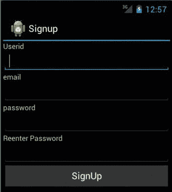
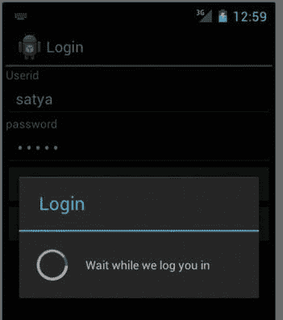
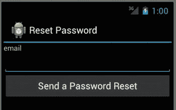
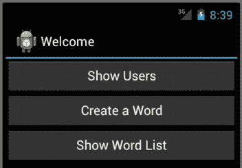
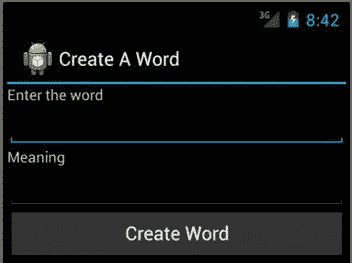
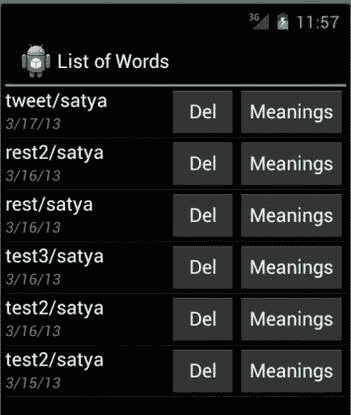
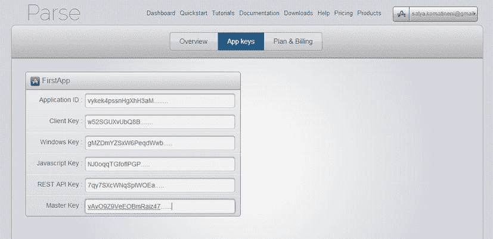

# 十三、Parse 云存储简介

Abstract

一些移动应用可能需要在服务器上存储数据的能力。这些数据可能与用户简档一样简单。或者，如果您的应用是一个游戏，您可能希望存储用户分数。或者，您的应用可能是协作性的，在这种情况下，一个用户可能需要查看另一个用户创建的数据。或者，您可能希望为您的移动应用提供跨设备同步功能。

一些移动应用可能需要在服务器上存储数据的能力。这些数据可能与用户简档一样简单。或者，如果您的应用是一个游戏，您可能希望存储用户分数。或者，您的应用可能是协作性的，在这种情况下，一个用户可能需要查看另一个用户创建的数据。或者，您可能希望为您的移动应用提供跨设备同步功能。

这些类型的数据使用需要一个可供您的移动应用作为服务使用的服务器。这个服务器端技术空间，尤其是针对移动需求的，现在有了一个名字。它被称为 BaaS:后端即服务。现在在 BaaS 领域有大量的公司。这种 BaaS 平台提供的典型功能有:

*   用户注册
*   允许知名网站如脸书或 Twitter 的用户直接登录的能力
*   能够在云中存储任意对象
*   能够处理无模式对象(如 NoSQL)
*   立即保存或在一段时间后保存的能力
*   查询对象的能力
*   能够在本地设备上缓存查询
*   使用 Web 控制台来管理用户及其数据
*   能够发送推送通知
*   能够对用户及其行为进行分类，并相应地发送推送通知
*   除了存储数据之外，还能够在云中编写可执行的服务，从而为移动应用提供三层架构

在这一章和接下来的几章中，我们将以一个流行的 BaaS 平台 [`Parse.com`](http://parse.com/) 为例，介绍其中的一些特性。BaaS 领域的其他新兴参与者包括:

*   ACS Appcelerator 云服务(以前为 Cocoafish)
*   应用 a
*   堆栈移动
*   微软 Azure 移动服务
*   金维
*   脂肪分形

在这一章中，我们将通过编写一个简单的 Android 应用来探索 Parse cloud API，这个应用将介绍 Parse 的基本特性。这应该为您提供了足够的关于 Parse API 的信息。下一章将集中在关于从属对象的关键细微差别，以及如何通过地块传递解析对象。在接下来的章节中，我们将向您的用户推送通知，以持续吸引他们。

现在让我们转到我们计划使用 Parse 的示例应用。

## 规划一个示例解析应用

我们在这里创建的示例应用是一个多用户移动应用。也就是说，每个用户都能够创建一个单词，并看到其他用户创建的单词。除了使用 word，这款应用还需要具备基本的用户管理功能，比如注册、登录、重置密码和注销。

图 13-1 显示了当用户第一次遇到应用时，用户将看到的主屏幕。

图 13-1。

Parse sample application signup/login activity

因此，当用户第一次看到应用时，他或她可以选择注册或登录(如果该用户已经注册)，如图 13-1 所示。

Note

Parse 还允许从脸书和 Twitter 等其他网站登录。然而，我们不在本章中讨论这些集成。

### 设计注册活动

我们先来规划一下注册页面。图 13-2 显示了注册页面的样子。

图 13-2。

Parse sample application signup activity

作为注册活动的一部分，您将收集用户 ID、电子邮件地址和密码，如图 13-2 所示。然后，您可以调用 Parse API 向用户注册这些详细信息。

### 设计登录屏幕

注册完成后，用户可以使用如图 13-3 所示的以下登录活动进行登录。(但是，请注意，当用户注册成功时，用户会自动登录！用户需要注销才能看到和使用这个登录屏幕。)

图 13-3。

Parse sample application login activity

对于图 13-3 所示的登录屏幕，没有什么值得惊讶的。您正在收集用户 ID 和密码，以便您可以调用解析 API 来登录。因为当联系服务器上的 Parse 进行登录时可能会有延迟，所以最好放置一个进度对话框。这种相互作用如图 13-4 所示。

图 13-4。

Waiting for login to complete

大多数解析 API 都有它们的异步变体。这些 API 提供了在调用返回时调用的回调。在这个回调中，我们可以通过编程关闭进度对话框。

### 设计密码重置活动

用户可能不记得以前使用过的密码。使用 Parse，很容易实现重置密码功能。重置密码工具的屏幕可能如图 13-5 所示。

图 13-5。

An activity to reset password

用户只需输入电子邮件地址即可重置密码。图 13-5 中的表单收集邮件地址，一旦用户点击发送密码重置按钮，你就可以调用 Parse API 通过传递邮件来重置密码。Parse 随后会向该电子邮件地址发送一个 web 链接，以便重置密码。

### 规划应用的主页

一旦用户登录，您将为该应用显示的屏幕是一个欢迎屏幕，如图 13-6 所示。

图 13-6。

Welcome activity after a successful login

使用这个欢迎屏幕，我们将演示三件事情。第一个是显示到目前为止已经注册的用户列表。这将探索可供用户查询的解析 API。

然后，我们将探索如何创建一个数据对象并将其存储在解析云中。为此，我们将创建一个可以存储在解析云中的“word”对象。

使用图 13-6 所示的创建单词按钮，我们将创建一些单词，然后使用显示单词列表按钮查看到目前为止创建的所有单词。

### 向用户展示

图 13-7 显示了列出所有注册用户的活动。

图 13-7。

An activity that shows a list of users

在图 13-7 中，只显示了一个用户，因为目前只有一个用户注册。如果有更多的注册用户，查询将显示所有的用户。如果用户太多，也可以翻页查看。然而，对于这一章，我们不打算显示分页。有关分页查询的详细信息，请参考解析文档。

### 创建和存储数据对象

图 13-8 显示了允许您创建一个单词并将其存储在解析云中的活动。

图 13-8。

Creating a word Parse object

一旦收集了单词及其含义，就可以调用解析 API 将其存储在解析云中。这个应用的目标是开发一个简单的基于社区的字典，其中的含义由其他用户提供。

### 查询单词

一旦用户创建了一个单词，该用户就可以浏览所有现有的单词。图 13-9 显示了显示可用单词集的列表活动。

图 13-9。

Querying for the list of registered users

图 13-9 中的活动列出了创建的单词、哪个用户创建了该单词以及创建时间。该屏幕还提供了删除单词的功能。“含义”按钮允许多个用户为一个单词提供各自的含义。在这一章中，我们不会进入用于创建和浏览含义的附加屏幕。这些概念类似于创建单词和浏览单词，因为单词和含义都是解析对象。

这就完成了我们计划用 Parse 实现的应用的快速概述。我们现在将介绍 Parse 中的一些基本概念，然后开始为 Parse 设置您的移动应用。

## 探索语法分析基础

在 Parse 中，对象被存储为一组键值对。对象不必像关系表中的列或类定义中的属性那样坚持预定义的模式。一旦有了 Parse 对象，就可以添加任意多的列；所有这些列的值都根据这些列名存储在该对象中。但是，每次在解析对象中存储它们的值时，都必须指定列名(属性名)。

### 了解基本 ParseObject

一个解析对象有一个与之关联的类型名。它就像关系数据库中的表名。但是，属于该类型或表名的许多对象可以有一组不同的列和相应的值。这与类型语言中的类型和关系数据库中的表形成了对比。

Parse 中的每个对象都保证有一个对象 ID。解析对象还保留字段(a)对象创建的时间和(b)对象最后更新的时间。您可以将大多数类型的对象作为特定键的值放置。这些对象(那些被指定为值的对象)通常被转换成某种流表示，并根据它们各自的键名进行存储。当这些对象值被检索时，它们作为它们的原始对象类型被检索。因此，一个解析对象可以存储其他解析对象作为给定键的目标值。这意味着一个解析对象可以与其他解析对象有关系，尤其是它的父对象。

比方说，您的应用有 30 种类型的 Java 对象。当存储在 Parse 中时，它们都被表示为无类型的基于键值对的解析对象。需要时，您可以将它们映射到各自的 Java 对象，以保证类型安全。

虽然在很多时候，将无类型对象转换为有类型对象是正确的，但是请记住，在某些情况下，无类型集合允许更多的动态性和灵活性，尤其是当您正在创建一个框架，其中这些对象必须通过各种防火墙时。

### 了解 ParseUser 对象

一个`ParseUser`也是一个`ParseObject`，它提供了一些额外的类型特征，比如用户名、电子邮件等。，而不恢复到基础键名。一个`ParseUser`还提供了登录、注销等必要的方法。

因为一个`ParseUser`是一个`ParseObject`，如果你愿意，你可以把额外的属性放到一个`ParseUser`对象中。

### 了解 ParseQuery 对象

与关系数据库不同，没有用于查询解析对象的 SQL。提供了一个 Java API，您可以使用它来检索解析对象。

使用解析查询 API，一次只能检索一种类型的对象。这意味着您不能有选择地连接多个解析对象类型并同时检索它们。

然而，某些类型的连接可以通过其他方式完成，同时遵守这样的约束，即通过 Parse 只能检索一种类型的根级对象。例如，如果我们有一个`Word`,并且如果这个单词有许多含义，那么我们将这个单词和单词含义表示为两种类型的对象。那么`WordMeaning`将与它的`Word`有一个关系作为附加属性。现在，我们可以说“得到所有的`WordMeanings`，它们的`Word`是如此如此。”

当您检索一个主对象时，如果需要，您可以让查询包含相关的解析对象。您还可以在解析查询上设置缓存策略，以减少延迟。您可以在保存对象或通过查询检索对象时执行此操作。

这些基础知识应该足以实现我们在本章开始时建议的应用。

## 设置支持解析的 Android 应用

到目前为止，我们描述的示例应用是使用 Parse API 进行开发的一个很好的选择。我们将实现陈述的用例中指出的所有功能。这将为您提供关于 Parse 平台及其 API 的精彩介绍。

在我们实现示例应用之前，让我们首先了解如何设置 Parse 并开始使用它。

### 创建解析帐户和应用

从 [`parse.com`](http://parse.com/) 开始很简单。访问 [`parse.com`](http://parse.com/) 并创建账户。在该帐户中，创建一个应用。一旦创建了应用，您将成为该应用的所有者。您可以创建任意多的应用。

Note

在 [`Parse.com`](http://parse.com/) 网站上，创建帐户和创建应用所需的链接可能会发生变化。你应该能够导航和完成这些基本任务。

一旦创建了一个应用，Parse 就会创建一组键，您需要用这些键来初始化您的移动应用。Parse 为您的应用提供了一个仪表板，可以方便地复制和粘贴这些键。图 13-10 ，显示了我们创建的第一个示例应用的仪表板。

图 13-10。

Parse dashboard to locate application keys

出于安全目的，我们截断了密钥，如图 13-10 所示。在这个面板中，您可以将这些键复制并粘贴到您的移动应用中。

我们将很快向您展示如何使用这些键，以便您的应用能够在云端与 Parse 进行通信。但是首先您应该下载必要的 jar 文件并创建 Android 移动应用。为了使用 Parse 引导应用开发，Parse 提供了一个示例 Android 应用，名为 Parse Starter(或 Android Blank Project ),您可以下载并作为起点使用。

Note

随着 Parse 经历多个版本，它可能会更改这个 starter 应用的名称，或者提供一个完全不同的机制来帮助您入门。然而，我们在这里讨论的内容应该适用。

您可以从以下 URL 下载这个样例初学者模板应用: [`https://www.parse.com/apps/quickstart`](https://www.parse.com/apps/quickstart)

到达这个 URL 后，选择您的平台(例如，Android ),下载并在 eclipse ADT 中设置 Parse starter 应用。根据 Parse download 的发行版本，我们在这一章中介绍的内容可能与您下载的内容略有不同，但是一般的原则和方向应该适用。

一旦您在首选 IDE 中下载并设置了 Parse starter 应用，它很可能会失败，并在一个名为`ParseApplication.java`的文件中显示错误。这是因为 Parse 有意留下了占位符，用于放置我们前面展示的键。一旦你放置了这些键，这个文件将看起来如清单 13-1 所示(考虑到 Parse 的后续版本可能会有额外的代码段！).

清单 13-1。用解析键初始化应用

`public class ParseApplication extends Application {`

`private static String tag = "ParseApplication";`

`private static String PARSE_APPLICATION_ID`

`= "vykek4ps.....";`

`private static String PARSE_CLIENT_KEY`

`= "w52SGUXv....";`

`@Override`

`public void onCreate() {`

`super.onCreate();`

`Log.d(tag,"initializing with keys");`

`// Add your initialization code here`

`Parse.initialize(this, PARSE_APPLICATION_ID, PARSE_CLIENT_KEY);`

`// This allows read access to all objects`

`ParseACL defaultACL = new ParseACL();`

`defaultACL.setPublicReadAccess(true);`

`ParseACL.setDefaultACL(defaultACL, true);`

`Log.d(tag,"initializing app complete");`

`}`

`}`

在如上所示的代码中插入应用 ID 和客户机密钥后，Parse starter 应用就可以在服务器上使用 Parse 了。代码中的 ACL 代表“访问控制列表”对于本书，我们将其设置为用户创建的所有对象的默认读取权限。除此之外，这本书没有涉及 Parse 的安全方面，建议读者查阅 Parse 文档。

我们几乎准备好开始实现我们所描述的应用了。不过，在此之前，让我们先了解一下 Parse 的一些基本概念。

## 实现示例应用

在本章的这一部分，我们将使用到目前为止出现的每个屏幕，并展示演示如何使用 parse API 来完成该用例的关键代码片段。如果您对整个应用源代码感兴趣，可以从本章末尾的参考资料部分给出的项目下载 URL 下载。

### 实施注册

让我们从注册活动开始(见图 13-2 )。在注册活动中，我们将收集用户名、密码和电子邮件地址。使用这些值，清单 13-2 中的代码演示了我们如何使用 Parse API 来注册用户。

清单 13-2。解析用户注册的 API

`private void signup(String userid, String email, String password)`

`{`

`ParseUser user = new ParseUser();`

`user.setUsername(userid);`

`user.setPassword(password);`

`user.setEmail(email);`

`//Show the progress dialog`

`turnOnProgressDialog("Signup", "Please wait while we sign you up");`

`//Go for signup with a callback`

`user.signUpInBackground(new SignUpCallback() {`

`public void done(ParseException e) {`

`turnOffProgressDialog();`

`if (e == null) {`

`// Hooray! Let them use the app now.`

`signupSuccessful();`

`} else {`

`// Sign up didn't succeed. Look at the ParseException`

`// to figure out what went wrong`

`signupFailed(e);`

`}`

`}`

`});`

`return;`

`}//signup-method`

`private void signupSuccessful()`

`{`

`//Go to signup successful page`

`//finish`

`gotoActivity(SignupSuccessActivity.class);`

`finish();`

`}`

`private void signupFailed(ParseException x)`

`{`

`//stay on the page`

`//Put an error message for the exception`

`String message = x.getMessage();`

`alert("Signup", "Failed:" + message);`

`}`

请注意，这段代码(以及本章中的其他代码片段)取自一个更大的代码库的中间部分。它将帮助您理解如何使用解析 API。

不要试图编译，因为代码引用了一些本章没有列出的方法。然而，这些方法的意图从它们的命名中应该是清楚的。例如，`alert`()方法用于放置一个警告对话框。`gotoActivity`()方法用于将控制转移给另一个活动。`turnOnProgressDialog`()方法显示进度对话框，直到解析方法通过其回调返回。

现在，将注意力转回到清单 13-2 中解析注册代码的主要流程。我们首先创建一个名为`ParseUser`的新解析对象，并用我们通过用户注册表单收集的用户相关信息填充它。然后我们调用进度对话框，期待对解析 API `signUpInBackground`的调用。这个注册 API 是异步的。该方法接受一个回调对象，该对象提供了一个`done`()回调方法。在`done`()方法中，我们首先关闭进度对话框。然后我们判断注册方法是成功还是失败。如果注册成功，Parse 会自动将用户登录到设备上。

通过这一步，用户注册。现在，用户可以进行登录、注销等操作。

### 检测用户是否登录

要知道用户是否登录，您可以使用清单 13-3 中的代码片段:

清单 13-3。显示用户是否登录

`private void setViewsProperly()`

`{`

`ParseUser pu = ParseUser.getCurrentUser();`

`if (pu == null)`

`{`

`//User is not logged in`

`showLoggedOutView();`

`return;`

`}`

`//User is logged in`

`showLoggedInView();`

`}`

我们调用了`ParseUser`类`getCurrentUser`()上的静态方法。如果此方法返回有效用户，则该用户已登录。否则，用户不会登录。

### 注销

您可以使用清单 13-4 中的代码片段从当前会话中注销用户。

清单 13-4。从解析中注销

`private void logoutFromParse()`

`{`

`ParseUser.logOut();`

`}`

一旦调用这个 logout 方法，`ParseUser.getCurrentUser()`将返回一个 null，表示当前会话中没有用户。

### 实现登录

为了理解登录，请注意本章开头介绍的登录活动，并参见图 13-3 。在登录活动中，我们收集用户 ID 和密码。一旦我们有了这些字段，登录的代码就很简单了，如清单 13-5 所示。

清单 13-5。解析 API 以登录

`public void login(View v)`

`{`

`if (validateForm() == false){`

`return;`

`}`

`//form is valid`

`String sUserid = getUserid();`

`String sPassword = getPassword();`

`turnOnProgressDialog("Login","Wait while we log you in");`

`ParseUser.logInInBackground(sUserid, sPassword, new LogInCallback() {`

`public void done(ParseUser user, ParseException e) {`

`turnOffProgressDialog();`

`if (user != null) {`

`reportSuccessfulLogin();`

`} else {`

`reportParseException(e);`

`}`

`}`

`});`

`}//eof-login`

`private void reportParseException(ParseException e)`

`{`

`String error = e.getMessage();`

`reportTransient("Login failed with:" + error);`

`}`

`private void reportSuccessfulLogin()`

`{`

`gotoActivity(ParseStarterProjectActivity.class);`

`finish();`

`}`

同样，login 调用可以作为静态方法在`ParseUser`对象上使用。我们还通过提供回调在后台使用这种方法，这是 Android 与服务器端内容对话的常用模式。这种模式非常类似于使用 signup API 和几乎所有其他解析 API 的模式，因为它们都有回调，所以它们不会停止主线程。

### 实施重置密码

如果忘记了密码怎么办？当然，您提供了重置它的方法。参见本章开头介绍的复位活动，如图 13-5 所示。我们使用这个活动来收集帐户的电子邮件地址，并调用`ParseUser`类上的`requestPasswordResetInBackground()`静态方法。清单 13-6 中的代码展示了如何使用这个解析重置密码 API。

清单 13-6。通过解析 API 重置密码

`public void resetPassword(View v)`

`{`

`if (validateForm() == false){`

`return;`

`}`

`String sEmail = email.getText().toString();`

`turnOnProgressDialog("Reset Password","Wait while we send you email with password reset");`

`//userid is there`

`ParseUser.requestPasswordResetInBackground(sEmail`，

`new RequestPasswordResetCallback() {`

`public void done(ParseException e) {`

`turnOffProgressDialog();`

`if (e == null) {`

`reportSuccessfulReset();`

`} else {`

`reportResetError(e);`

`}`

`}`

`});`

`}//eof-reset`

`private void reportSuccessfulReset(){`

`gotoActivity(PasswordResetSuccessActivity.class);`

`finish();`

`}`

`private void reportResetError(ParseException e)`

`{`

`//stay on the page`

`//Put an error message for the exception`

`String message = e.getMessage();`

`alert("Reset Password", "Failed:" + message);`

`}`

重置密码解析 API 的模式类似于其他解析 API。您调用方法，提供回调，并处理成功和失败。如果重置密码调用成功，Parse 将向用户发送一封电子邮件，其中包含输入新密码的 web URL。

### 查询用户

清单 13-7 显示了可以用来查看目前已经注册的用户的代码。参见本章开头的用户活动列表，如图 13-7 所示。

清单 13-7。查询用户

`private void populateUserNameList()`

`{`

`ParseQuery query = ParseUser.getQuery();`

`this.turnOnProgressDialog("Going to get users", "Patience. Be Right back");`

`query.findInBackground(new FindCallback() {`

`public void done(List<ParseObject> objects, ParseException e) {`

`turnOffProgressDialog();`

`if (e == null) {`

`// The query was successful.`

`successfulQuery(objects);`

`} else {`

`// Something went wrong.`

`queryFailure(e);`

`}`

`}`

`});`

`}`

`private void successfulQuery(List<ParseObject> objects)`

`{`

`ArrayList<ParseUserWrapper> userList = new ArrayList<ParseUserWrapper>();`

`for(ParseObject po: objects)`

`{`

`ParseUser pu = (ParseUser)po;`

`ParseUserWrapper puw = new ParseUserWrapper(pu);`

`userList.add(puw);`

`}`

`ArrayAdapter<ParseUserWrapper> listItemAdapter =`

`new ArrayAdapter<ParseUserWrapper>(this`

`,android.R.layout.simple_list_item_1`

`,userList);`

`this.setListAdapter(listItemAdapter);`

`}`

`private void queryFailure(ParseException x)`

`{`

`this.setErrorView(x.getMessage());`

`}`

首先使用`ParseUser`对象获得一个`ParseQuery`对象。然后在查询对象上使用 find 方法来查找用户。一旦该方法通过回调返回，您就可以检索到`ParseUser`对象的集合，并填充如图 13-7 所示的用户列表。当我们讨论查询`Word`对象时，我们将再次讨论查询对象。

### 在 Parse 中存储数据对象:创建一个单词

您现在知道了如何注册、登录、注销以及在需要时重置密码。这里显示的下两件事是如何在 Parse 中创建其他对象以及如何查询它们。

让我们从创建一个对象并将其存储在解析云中开始。为此，回想一下开始时出现的创建单词的屏幕(图 13-8 )。在创建单词活动中，您收集单词及其含义，并将其存储在解析云中。要使用 Parse API 做到这一点，你所要做的就是显示伪代码，如清单 13-8 所示。

清单 13-8。用于在云中保存对象的伪代码

`ParseObject po = new ParseObject("word_table");`

`po.put("word", "prow");`

`po.put("word","I think it means something to do with boats and ships!");`

`po.saveInTheBackground(...withsomecallback-method...)`

这是 Parse 提供的 API 级别。在清单 13-8 给出的 Java 伪代码中，你可以看到我们使用`ParseObject`作为主要的键值对的无类型集合。创建一个包含两个字段的类型化类`Word`可能是值得的。下面是一些伪代码(清单 13-9 ),展示了如何做到这一点。

清单 13-9。将有类型的对象作为无类型解析对象的替身的想法

`public class Word extends ParseObjectWrapper`

`{`

`public Word(String word, String meaning);`

`public String getWord();`

`public String setWord(String word);`

`public String getMeaning();`

`public String setMeaning();`

`}`

这种类型的正式类定义允许我们将单词视为 Java 对象，而不仅仅是字符串的集合。基类`ParseObjectWrapper`可以保存底层解析对象，并将该解析对象中的字段值存储为键值对。

下面是从我们可下载的示例项目中提取的`ParseObjectWrapper`的实际代码，如清单 13-10 所示。

清单 13-10。ParseObjectWrapper 类的源代码

`public class ParseObjectWrapper`

`{`

`public static String f_createdAt = "createdAt";`

`public static String f_createdBy = "createdBy";`

`public static String f_updatedAt = "updatedAt";`

`public static String f_updatedBy = "updatedBy";`

`public ParseObject po;`

`public ParseObjectWrapper(String tablename)`

`{`

`po = new ParseObject(tablename);`

`po.put(f_createdBy, ParseUser.getCurrentUser());`

`}`

`public ParseObjectWrapper(ParseObject in)`

`{`

`po = in;`

`}`

`//Accessors`

`public ParseObject getParseObject() { return po; }`

`String getTablename()`

`{`

`return po.getClassName();`

`}`

`public ParseUser getCreatedBy()`

`{`

`return po.getParseUser(f_createdBy);`

`}`

`public void setCreatedBy(ParseUser in)`

`{`

`po.put(f_createdBy, in);`

`}`

`public void setUpdatedBy()`

`{`

`po.put(f_updatedBy, ParseUser.getCurrentUser());`

`}`

`public ParseUser getLastUpdatedBy()`

`{`

`return (ParseUser)po.getParseObject(f_updatedBy);`

`}`

`}//eof-class`

清单 13-10 显示了我们如何设计这个解析对象包装类作为第一次尝试。它将保存一个对实际`ParseObject`的引用。解析对象包装器可以通过两种方式获取`ParseObject`。当您第一次创建一个解析对象时，您可以简单地说出该解析对象的表名是什么。或者，如果您碰巧从云中检索到了一个解析对象，并且想要修改它，那么您可以直接传入该解析对象。

这里是我们在这个解析对象包装器中构建的另一个特性:本机`ParseObject`并不携带哪个用户创建了它或者最后更新了它。因此，解析对象包装器为这两个附加属性提供了字段名称，以“`f_...`”开头。这些额外的字段允许我们存储这两种类型的用户(`created by`和`last updated by`)和每个`ParseObject`。给定这个解析对象包装器，清单 13-11 显示了我们如何创建`Word`类。

清单 13-11。使用 ParseObjectWrapper 表示类型化的对象词

`public class Word`

`extends ParseObjectWrapper`

`{`

`//Name of the table or class for this type of object`

`public static String t_tablename = "WordObject";`

`//Only two fileds`

`public static String f_word = "word";`

`public static String f_meaning = "meaning";`

`public Word(String word, String meaning)`

`{`

`super(t_tablename);`

`setWord(word);`

`setMeaning(meaning);`

`}`

`public Word(ParseObject po)`

`{`

`super(po);`

`}`

`public String getWord()`

`{`

`return po.getString(f_word);`

`}`

`public void setWord(String in)`

`{`

`po.put(f_word,in);`

`}`

`public String getMeaning()`

`{`

`return po.getString(f_meaning);`

`}`

`public void setMeaning(String in)`

`{`

`po.put(f_meaning,in);`

`}`

`public String toString()`

`{`

`String word = getWord();`

`String user = getCreatedBy().getUsername();`

`return word + "/" + user;`

`}`

`}//eof-class`

清单 13-11 中的`Word`类的代码很简单。我们使用了“`t_`”作为表名和“`f_`”作为字段名的惯例。这些静态常量与使用它们的方法一样重要。这是因为当您为该对象提供查询时，您将对查询所依据的字段使用这些字符串名称。

有了正确的`Word`类定义，现在就可以创建一个`Word`并将其存储在解析云中，如清单 13-12 所示。

清单 13-12。在云中创建和保存一个单词解析对象

`public void createWord(View v){`

`if (validateForm() == false) {`

`return;`

`}`

`//form is valid`

`String sWord = getWord();`

`String sMeaning = getMeaning();`

`Word w = new Word(sWord, sMeaning);`

`turnOnProgressDialog("Saving Word", "We will be right back");`

`w.po.saveInBackground(new SaveCallback() {`

`@Override`

`public void done(ParseException e) {`

`turnOffProgressDialog();`

`if (e == null)    {`

`//no exception`

`wordSavedSuccessfully();`

`}`

`else    {`

`wordSaveFailed(e);`

`}`

`}`

`});`

`}//eof-login`

`private void wordSaveFailed(ParseException e)`

`{`

`String error = e.getMessage();`

`alert("Saving word failed", error);`

`}`

`private void wordSavedSuccessfully()`

`{`

`gotoActivity(WordListActivity.class);`

`//Don't finish it as back button is valid`

`//finish();`

`}`

请注意，在清单 13-12 所示的代码中，您能够通过其构造函数创建一个`Word`对象，而不必担心在解析对象上显式设置字段名称。如果需要的话，这也可以确保您不会在每次需要字段名时都输入错误。因为 Parse 对象允许任何字段名，所以如果输入错误，最终会创建不需要的新属性。当然，可能有些地方你有理由这样做，但至少对于大多数常见的情况，这是一个很好的防火墙。

还要注意，在清单 13-12 中，您使用了来自底层解析对象包装器(`w.po`)的真正的 ParseObject 来启动诸如 save 之类的解析 API。

Note

这里给出的`ParseObjectWrapper`和`Word`的代码被剥离出来，以向您展示我们当前需求所需的最少代码。如果您查找可下载的项目，您会看到这些类有更多的代码。当你开始通过 Android 包裹传递像“`Word`”这样的对象时，额外的代码是必要的。(那是下一章的主题。)所以，当您在下载的项目中看到原始代码时，请记住这一点。

现在，让我们将注意力转向如何查询这些`word`对象，并通过使用 Android 列表适配器将它们绘制在列表中。

### 查询和填充解析对象

清单 13-13 显示了如何查询类型为`Word`的对象。这段代码与查询 Parse 用户略有不同。

清单 13-13。查询解析对象列表

`private void populateWordList()`

`{`

`ParseQuery query = new ParseQuery(Word.t_tablename);`

`query.orderByDescending(Word.f_createdAt);`

`query.include(Word.f_createdBy);`

`query.setCachePolicy(ParseQuery.CachePolicy.CACHE_ELSE_NETWORK);`

`//Milliseconds`

`query.setMaxCacheAge(100000L);`

`this.turnOnProgressDialog("Going to get words", "Patience. Be Right back");`

`query.findInBackground(new FindCallback() {`

`public void done(List<ParseObject> objects, ParseException e) {`

`turnOffProgressDialog();`

`if (e == null) {`

`// The query was successful.`

`successfulQuery(objects);`

`} else {`

`// Something went wrong.`

`queryFailure(e);`

`}`

`}`

`});`

`}`

`private void successfulQuery(List<ParseObject> objects)`

`{`

`ArrayList<Word> wordList = new ArrayList<Word>();`

`for(ParseObject po: objects)`

`{`

`Word puw = new Word(po);`

`wordList.add(puw);`

`}`

`WordListAdapter listItemAdapter =`

`new WordListAdapter(this`

`,wordList`

`,this);`

`this.setListAdapter(listItemAdapter);`

`}`

`private void queryFailure(ParseException x)`

`{`

`this.setErrorView(x.getMessage());`

`}`

如前所述，Parse 使用一个名为`ParseQuery`的对象来执行查询。Parse query 对象是用您正在查询的对象类型初始化的，并且您使用了`Word`类来指示这是什么类型。在我们的例子中，变量`Word.t_tablename`指向表的名称。在 Parse 中，这个表名被称为与对象数据库一致的“类”,而不是关系数据库。

然后，使用作为排序依据的字段名称在查询中设置 order 子句。`Word.f_createdBy`。再次注意这里如何使用`Word`和`ParseObjectWrapper`上的静态字段定义来避免直接输入字符串名称。

然后以毫秒为单位设置缓存策略，这样就不会过于频繁地访问服务器。然后对查询对象调用`findInBackground`()方法。另外，请注意，当您被回调时，您获取返回的解析对象，并通过其构造函数将它们填充到一个`Word`中。这允许您在`Word`对象上调用常规的 Java 方法，而不用担心基于字符串的字段名。

Note

本章中没有列出但在代码中引用的所有实用函数和类都可以在参考资料部分提到的可下载项目中找到。

这基本上涵盖了使用 Parse 的一般模式，并记录了我们作为用例提出的应用是如何实现的。

## 下一步是什么

这一章只是对 Parse 的一点皮毛。它可能代表了 Parse 所能提供的四分之一或五分之一。尽管我们在第十五章中使用 Parse 讨论了推送通知，但我们没有空间或时间来讨论本书中的所有 Parse 主题，所以我们建议您参考 Parse 文档，这是非常好的。此外，Parse 论坛是我们见过的最好的论坛之一，包括响应有多快。

此外，在完成本章之前，我们想指出几件值得考虑的事情。首先，我们采用的将解析对象转换成 Java 对象的方法是基本的方法。您可能需要考虑增强它以满足您的需求。有一些努力，像 ParseFacade 和 BaaSFacade，正在尝试更聪明地做到这一点，使用更少的代码和更多的类型安全。考虑这些选项，看看它们如何满足您的需求。例如，BaaSFacade 不仅为 Parse backend 提供了一个 Facade，还为其他源/接收器提供了 facade，比如 StackMob，甚至是本地 SQLLite。

其次，直接解析对象的一个主要缺点是，它们不提供将对象序列化为字符串的方法。当你试图将它们通过额外的意图传递给其他活动时，这是一个问题。如果没有这种能力，您只有两个选择:要么将它们完全转换成普通的 Java 对象，然后通过 intent 防火墙传递它们，要么传递对象的 ID，然后根据它的 ID 重新查询真正的对象。我们希望，通过适当地调整缓存，后一种选择没有那么糟糕。但是手里有一个物体却不能使用它是不自然的，因为你不能通过一个意图把它传递给另一个活动。

第三，请记住，您可以使用 JSON 非常有效地序列化普通 Java 对象，并将它们作为额外的意图进行传输。但是，注意`ParseObjects`不能转换成 JSON 字符串。因此，您可能必须首先手动将 Parse 对象转换成普通的 Java 对象，然后使用 JSON 将它们作为 parcelables 进行传输。关于 JSON 本地存储的第四章同样适用于实现 JSON parcelables。是的，JSON 比纯手工编码的 parcelables 要冗长一些；然而，如果您的对象很小，这种方法非常有效，可以让您避免编写大量容易出错的代码。

在第十四章的中，我们将提供一个合理的解决方案，向您展示直接使用`ParseObjects`进行打包的中间方法。如果您迫不及待，可以看看本章的可下载项目，看看 Parse object 包装器是如何被增强以实现 parcelable 的，以及它是如何做出必要的规定以使这种方法起作用的。

因为我们已经实现了本章的示例应用，所以我们使用了第六章中提到的表单处理框架。这个高级表单处理框架为我们节省了大量时间，因为这个应用有许多表单，可以用于登录、注册、创建单词等等。

## 参考

我们发现以下链接对本章的研究很有帮助。

*   剖析首页: [`http://parse.com`](http://parse.com/)
*   解析文档: [`https://www.parse.com/docs/index`](https://www.parse.com/docs/index)
*   剖析 Android 指南: [`https://www.parse.com/docs/android_guide`](https://www.parse.com/docs/android_guide)
*   剖析 Java API: [`https://www.parse.com/docs/android/API/`](https://www.parse.com/docs/android/api/)
*   本章研究日志解析: [`http://androidbook.com/item/4458`](http://androidbook.com/item/4458) 。您可以使用这个网页来跟踪研究并发现与解析开发相关的其他链接。
*   如何使用 GSON 进行持久化: [`http://androidbook.com/item/4440`](http://androidbook.com/item/4440) 。您也可以使用本文来使用 GSON 打包纯 Java 对象。本书第四章也非常深入地涉及了 GSON 和 JSON 这个话题。
*   高级表单处理和验证: [`http://androidbook.com/item/4494`](http://androidbook.com/item/4494) 。您可以通过这篇文章了解如何有效地验证表单。本书的第六章也深入讨论了表单处理这个话题。
*   在 [`www.androidbook.com/expertandroid/projects`](http://www.androidbook.com/expertandroid/projects) `. T`下载本章专用的测试项目，ZIP 文件的名称为`ExpertAndroid_Ch13_ParseStarterProject.zip`。

## 摘要

协作移动应用无处不在。在云中存储数据是这些类型的应用的基本需求。本章对流行的云存储平台之一 Parse 进行了精彩的介绍。这一章还列出了注册用户和与用户合作的标准模式。它为用户管理提供了必要的解析 API，还解释了如何存储和检索解析对象。最后，本章简要对比了关系连接和非 SQL 方法。

## 复习问题

以下问题应该有助于巩固您在本章中学到的知识:

What is a Parse application key and a client key?   How do you get the keys in question 1?   How do you initialize an application that needs to talk with Parse with the Parse generated keys?   What Parse APIs do you use to sign up a user?   What Parse APIs do you use to log in a user?   How do you reset a user password with Parse?   How do you log out using Parse?   Are you logged in when the signup is successful?   How is a Parse object different from a relational table?   Does a Parse object maintain the user that has either created the object or last updated it?   Why do you need to use progress dialogs when you are issuing Parse methods?   How do you cache Parse objects?   How do you tell a Parse query to include dependent objects?   Can you change an Android package name while keeping the Parse keys intact?