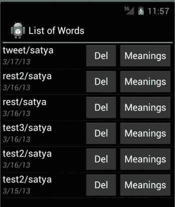
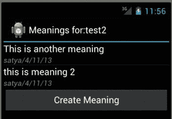
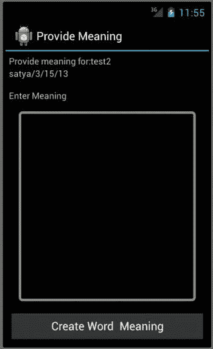

# 十四、使用 Parcelables 增强解析

Abstract

在第十三章中，我们记录了 Parse 的基本特性。我们向您展示了如何使用 Parse 创建一个帐户，以及如何使用该帐户注册用户并代表这些用户在云中存储对象。我们还向您展示了查询解析对象的基本机制。

在第十三章中，我们记录了 Parse 的基本特性。我们向您展示了如何使用 Parse 创建一个帐户，以及如何使用该帐户注册用户并代表这些用户在云中存储对象。我们还向您展示了查询解析对象的基本机制。

在这一章中，我们将讨论另外两个与解析相关的主题。首先是需要通过 intent extras 将解析对象作为 parcelables 传递。第二个是基于解析对象与其他解析对象的关系来查询解析对象的能力。

让我们更详细地讨论一下第一个话题。如果您还记得我们为解释 Parse 而介绍的类似字典的应用，有两种类型的对象是该应用特有的:单词及其含义。每个单词可以有不同用户提供的多种含义。我们现在想要创建一个屏幕，在这里我们显示一个给定单词的意思。事实证明，由于 Android 和 Parse 的原因，这有点棘手。

让我们来了解一下显示给定单词含义的屏幕有什么技巧。理想情况下，我们会选择一个`Word`解析对象，并将其传递给列出该单词含义的活动。一旦我们在 receiving meanings 活动中有了这个`Word`对象，我们就可以运行一个单词含义查询，它的父单词是传入的单词。

然而，Android SDK 有一个规定，即您不能轻易地将内存中对象的引用传递给另一个活动。只有某些礼仪对象可以这样做(比如实现`IBinder`的那些)。`Word`和`WordMeaning`的对象一点礼仪性都没有！它们只是包含一些属性的普通 Java 对象。因此，在 Android 中，您通过 intent extras 将数据(而不是对象引用)传递给其他活动。您可以通过执行以下操作来尝试这一点:

`ParseObject wordObject;`

`Intent i = new Intent(this,MeaningsListActivity.classname);`

`i.putExtra("word-parse-object", wordObject);`

`this.startActivity(i);`

在这段代码中，变量`this`指向当前活动。如果成功的话，那么接收活动可以通过这种方式检索 word 对象:

`Intent i = this.getIntent();`

`ParseObject parceledWord = (ParseObject)i.getParcelableExtra();`

然而，为了让这个方法工作，类型`ParseObject`需要实现 Android SDK 接口`Parcelable`，而`ParseObject`不做这个！因此，为了克服这个限制，我们将向您展示:

*   如何通过意图传递一个`ParseObject`
*   如何在查询中使用 parceled ParseObject 来检索其子对象

然而，在我们开始探索这两个主题之前，让我们看一下我们将用来实现和说明这些概念的屏幕。

## 示例应用的用户体验

我们从第十三章中显示的单词列表开始，现在在下面的图 14-1 中给出。

图 14-1。

List of words activity

你在图 14-1 中看到的是一个单词列表。轻触单词的`Meanings`按钮，您将进入显示该单词含义的活动(如果有)。图 14-2 就是那个屏幕。

图 14-2。

List of meanings activity

你在图 14-2 中看到的是从上一个屏幕(图 14-1 )传入的一个单词的可用含义列表。显然，这个活动需要一个 word 对象来绘制自己。因此，当我们稍后实现该活动时，我们将展示 parcelables 在这里是如何发挥作用的。该屏幕还显示了一个为当前单词创建新含义的按钮。图 14-3 显示了为单词创建新含义的屏幕。

图 14-3。

Create a word meaning activity

虽然图 14-3 屏幕很简单，但是我们需要解决将父 word 对象作为 parcelable 传递的问题，以便我们创建的含义属于正确的 Parse word 对象。此外，因为该屏幕是从单词含义列表屏幕(图 14-2 调用的，我们需要打包一个已经从图 14-1 打包传递的单词解析对象。所以这里的任何解决方案都应该多次传递一个解析对象作为额外的意图。

现在让我们更详细地研究一下这个问题。我们还将在 Android SDK 中讨论包裹和 parcelables 背后的理论。然后，我们将展示如何实现将`ParseObjects`作为 parcelables 传递的解决方案。

## 将 ParseObjects 作为 Parcelables 传递

通过一个意图发送一个`ParseObject`就是让它成为一个`Parcelable`。但是`ParseObject`是一个已经被 Parse SDK 定义和冻结的类型。更复杂的是，`ParseObject`不仅不可打包，而且不可序列化。此外，它不能被转换成一个`JSON`字符串。如果它是可序列化的或者被转换成一个`JSON`字符串，我们就可以以那种形式将它传递给 parcelable。

这是一个可能的选择。从一个 Parse 对象中读取所有的值，并把它们放入一个 hashmap 中，然后将这个 hashmap 序列化或转换成一个字符串，然后可以在 parcelable 中传递。另一方面，您获取这个打包的散列表并构造一个解析对象——在某种程度上，您可以将它构造为原始的解析对象。但是，原始解析对象可能有一个您不知道的内部状态，因此它不能被原样复制。

然而，我们还没有使用这种将解析对象映射到 hashmaps 的方法来进行传输。一个原因是，在第十三章中，我们已经有了一个包装原始解析对象的对象。(它被称为`ParseObjectWrapper`。)所以，我们想用这个包装器作为一个可打包的东西，即使有一些限制。一个限制是，当这个`ParseWrapperObject`在另一边被重新创建时，它的核心会有一个重新创建的`ParseObject`，而不是原来的`ParseObject`。我们可以对此进行一点补偿，因为`ParseObjectWrapper`上的方法可以检测到嵌入的`ParseObject`是克隆的，并根据需要进行调整，以给人一种尽可能接近处理真实解析对象的印象。此外，终端用户对象如`Word`和`WordMeaning`已经扩展了`ParseObjectWrapper`，所以从`ParseObjectWrapper`重新创建它们更容易。

所以，我们从`ParseObjectWrapper`开始，在那个水平上看起来是可行的。因此，我们将坚持使用 parcelable 支持来扩展`ParseObjectWrapper`。关于 hashmap 方法在其他方面是否更好的研究还没有完成。这些优势目前还不太明显，也不可能变得更好，所以我们坚持使用`ParseObjectWrapper`作为打包产品的载体。此外，正如第十三章中指出的，如果你要使用基于反射和基于接口的方法，比如 ParseFacade 或 BaaSFacade，你可能会有更好的选择。我们会把这项研究交给你。

让我们看看 parcelables 背后的理论，然后深入研究代码，看看如何使`ParseObjectWrapper` parcelable。

### 重温 Parcelables

在 Android 中，`Parcels`用于在进程间传递消息。它是 Android 中的 IPC(进程间通信)机制。因此，`Parcel`是一个消息数据流，可以通过进程间的存储转发机制进行实时通信和存储。

一个`Parcel`可以包含来自对象的数据，该数据在一侧被展平，然后在另一侧被展平，回到对象中。它还可以用来携带服务或文件流的对象引用或代理。一个`Parcel`可能包含以下内容:

*   基元
*   数组(4 字节长度+数据)
*   实现 parcelable 接口的对象
*   捆绑包(键值对，其中的值反映了上述任何内容)
*   使用 IBinder 接口的代理对象
*   代理的文件描述符对象

可以在 Android SDk 链接: [`http://developer.android.com/reference/android/os/Parcel.html`](http://developer.android.com/reference/android/os/Parcel.html) 了解更多关于`Parcels`和`Parcelables`的内容。

当一个对象实现`Parcelable`接口时，该对象向 Android SDK 承诺，它知道如何一个字段一个字段地将自己写入`Parcel`。这样的一个`Parcelable`对象也知道如何从`Parcel`中一个字段一个字段地创建和读取自己。

### 实现 Parcelable 的简单示例

让我们考虑一个简单的对象，看看它如何实现一个 parcelable，如果它想被传输的话。这个简单的对象，一个`User`，在清单 14-1 中给出。

清单 14-1。一个简单的可打包实现示例:用户类

`public class User`

`implements Parcelable`

`{`

`//Add more field types later`

`public String userid;`

`public String username;`

`public User(String inuserid, String inusername)`

`{`

`userid = inuserid;`

`username = inusername;`

`}`

`public static final Parcelable.Creator<User> CREATOR`

`= new Parcelable.Creator<User>() {`

`public User createFromParcel(Parcel in) {`

`return new User(in);`

`}`

`public User[] newArray(int size) {`

`return new User[size];`

`}`

`}; //end of creator`

`//`

`@Override`

`public int describeContents() {`

`return 0;`

`}`

`public User(Parcel in)`

`{`

`userid = in.readString();`

`username = in.readString();`

`}`

`@Override`

`public void writeToParcel(Parcel dest, int flags)`

`{`

`dest.writeString(userid);`

`dest.writeString(username);`

`}`

`}//eof-class`

这个类`User`只有两个字段:`username`和`userid`。当这个类实现`Parcelable`接口时，它需要能够做以下事情:

Understand to see if it needs to handle `describeContents`(  )   Know how to read and write its constituent attributes   Understand flags to alter the behavior of what and how to write if needed  

### 描述内容和文件描述符

显然对于 Android SDK 来说，知道一个`Parceled`对象是否包含文件描述符是很重要的。该信息用于实现方法`Bundle.hasFileDescriptors()`。该方法又用于防止带有描述符的对象被提供给系统进程。例如，像这样的代码可以在核心 Android SDK 源代码中看到:

`//Taken from ActivityManagerService.java`

`if (intent.hasFileDescriptors()) {`

`throw new IllegalArgumentException("File descriptors passed in Intent");`

`}`

在我们的例子中，`User`对象甚至不远程处理文件描述符，所以我们可以安全地返回一个零，表示我们不需要操作系统进行任何特殊处理。(如果你想了解如何处理包含文件描述符的对象，请参考 Android SDK 类`ParcelFileDescriptor`的源代码。)

### 向包中读写成员

parcelable 类的第二个职责是从 parcel 对象中读取其成员并将其写入 parcel 对象。如果您看到清单 14-1 中的`writeToParcel`()方法，您会注意到我们正在将字符串对象写入包流。类似地，要阅读`User`类的成员，看一看构造函数`User(Parcel p)`。这个构造函数只是将值读回到它的局部变量中。

与`writeParcel`()方法不同，`User`类中没有对等的`readParcel`()方法。相反，Android SDK 要求实现`parcelable`接口的类提供对知道如何实例化特定类型对象的`CREATOR`对象的静态引用，比如我们例子中的`User`。这个`CREATOR`对象具有`createFromParcel`()方法，该方法负责通过调用适当的构造函数来实例化`User`对象，该构造函数将 parcel 对象作为输入。

### 写时间可打包标志

现在让我们考虑一下可包装旗帜的细节。当您使用`parcel.writeParcelable(Parcelable p, int flags)`将一个对象写入一个包时，您可以传递标志，以便正在写入的包可以改变要写入的内容。Android SDK 定义和识别的唯一标志是:

`PARCELABLE_WRITE_RETURN_VALUE`

要知道当这个标志被传递时，`Parcelable`是否做了什么不同的事情，您需要检查它的文档。例如，`ParcelableFileDescriptor`使用了这个标志，如果被传入，它将关闭文件描述符并仅仅通过包传递它的值。在我们的例子中，`User`类根本不使用这个标志。

API 的另一个建议是，如果您的 parcelable 表示一个有状态的对象——比方说，一个文件描述符或一个服务的引用——您可能希望回收资源，只将代理或值传递给那些底层资源。在这种情况下，Android API 推荐这种识别标志的好方法。因此，在打包核心 Android 对象时，请注意这些对象的文档，看看它们是否支持该标志，以及行为是否会受到该标志的影响。在`User`示例的情况下，确实没有理由识别该标志或对其做出反应。在大多数情况下，当您写入 parcelables 时，您可以始终为`describeContents`()返回 0，并在写入 parcelables 时忽略这些标志。

现在您已经了解了什么是 parcelable 以及它们是如何工作的，让我们看看如何将`ParseObjectWrapper`实现为一个 parcelable。

## 实现 Parcelable ParseObjectWrapper

清单 14-2 展示了`ParseObjectWrapper`的源代码。当清单中的代码都在一个地方时，最好理解，但是我们将在后面讨论相关的部分。清单很长；快速浏览，浏览各个部分，看看它们是如何组合在一起的。我们解释清单后面的所有关键部分。一旦你通读了这些解释，你就可以重新阅读清单来巩固这个类的结构组成。

清单 14-2。ParseObjectWrapper 的源代码

`public class ParseObjectWrapper`

`implements Parcelable`

`{`

`public static String f_createdAt = "createdAt";`

`public static String f_createdBy = "createdBy";`

`public static String f_updatedAt = "updatedAt";`

`public static String f_updatedBy = "updatedBy";`

`//The parse object that is being wrapped`

`public ParseObject po;`

`//Constructors`

`//Use this when you are creating a new one from scratch`

`public ParseObjectWrapper(String tablename)    {`

`po = new ParseObject(tablename);`

`po.put(f_createdBy, ParseUser.getCurrentUser());`

`}`

`//Use this to create proper shell`

`//For example you can do this in parcelable`

`public ParseObjectWrapper(String tablename, String objectId)  {`

`po = ParseObject.createWithoutData(tablename, objectId);`

`}`

`//Use this when you are creating from an exsiting parse obejct`

`public ParseObjectWrapper(ParseObject in)  {`

`po = in;`

`}`

`//To create derived objects like Word using the`

`//ParseObjectWrapper that is unparceled`

`public ParseObjectWrapper(ParseObjectWrapper inPow)   {`

`//Parseobject underneath`

`po = inPow.po;`

`//parseobject essentials if it has it`

`poe = inPow.poe;`

`}`

`//Accessors`

`public ParseObject getParseObject() { return po; }`

`String getTablename(){return po.getClassName();    }`

`public ParseUser getCreatedBy(){return po.getParseUser(f_createdBy);}`

`public void setCreatedBy(ParseUser in){po.put(f_createdBy, in);}`

`public void setUpdatedBy(){po.put(f_updatedBy, ParseUser.getCurrentUser());}`

`public ParseUser getLastUpdatedBy(){return`

`(ParseUser)po.getParseObject(f_updatedBy);    }`

`//Parcelable stuff`

`@Override`

`public int describeContents() {`

`return 0;`

`}`

`public static final Parcelable.Creator<ParseObjectWrapper> CREATOR`

`= new Parcelable.Creator<ParseObjectWrapper>() {`

`public ParseObjectWrapper createFromParcel(Parcel in) {`

`return create(in);`

`}`

`public ParseObjectWrapper[] newArray(int size) {`

`return new ParseObjectWrapper[size];`

`}`

`};  //end of creator`

`@Override`

`public void writeToParcel(Parcel parcel, int flags)`

`{`

`//Order: tablename, objectId, fieldlist, field values, essentials`

`//write the tablename`

`parcel.writeString(this.getTablename());`

`//write the object id`

`parcel.writeString(this.po.getObjectId());`

`//write the field list and write the field names`

`List<ValueField> fieldList = getFieldList();`

`//See how many`

`int i = fieldList.size();`

`parcel.writeInt(i);`

`//write each of the field types`

`for(ValueField vf: fieldList)      {`

`parcel.writeParcelable(vf, flags);`

`}`

`//You need to write the field values now`

`FieldTransporter ft =`

`new FieldTransporter(this.po`，

`parcel,FieldTransporter.DIRECTION_FORWARD);`

`for(ValueField vf: fieldList)      {`

`//This will write the field from parse object to the parcel`

`ft.transfer(vf);`

`}`

`//get the essentials and write to the parcel`

`ParseObjectEssentials lpoe = this.getEssentials();`

`parcel.writeParcelable(lpoe, flags);`

`}`

`//`

`private static ParseObjectWrapper create(Parcel parcel)`

`{`

`//Order: tablename, objectid, fieldlist, field values, essentials`

`String tablename = parcel.readString();`

`String objectId = parcel.readString();`

`ParseObjectWrapper parseObject =`

`new ParseObjectWrapper(tablename, objectId);`

`//Read the valuefiled list from parcel`

`List<ValueField> fieldList = new ArrayList<ValueField>();`

`int size = parcel.readInt();`

`for(int i=0;i<size;i++)`

`{`

`ValueField vf = (ValueField)`

`parcel.readParcelable(`

`ValueField.class.getClassLoader());`

`fieldList.add(vf);`

`}`

`//add the field values`

`FieldTransporter ft =`

`new FieldTransporter(`

`parseObject.po, parcel`，

`IFieldTransport.DIRECTION_BACKWARD);`

`for(ValueField vf: fieldList)`

`{`

`ft.transfer(vf);`

`}`

`//read essentials`

`ParseObjectEssentials poe =`

`(ParseObjectEssentials)parcel.readParcelable(`

`ParseObjectEssentials.class.getClassLoader());`

`parseObject.setParseObjectEssentials(poe);`

`return parseObject;`

`}`

`//have the derived classes override this`

`public List<ValueField> getFieldList()`

`{`

`return new ArrayList<ValueField>();`

`}`

`//To represent createdby and lastupdatedby user objects`

`//when parceled. We don't recreate them as ParseObjects but save their`

`//essential attributes in separate objects.`

`private ParseObjectEssentials poe;`

`public void setParseObjectEssentials(ParseObjectEssentials inpoe)   {`

`poe = inpoe;`

`}`

`public ParseObjectEssentials getEssentials()`

`{`

`if (poe != null) return poe;`

`Date cat = po.getCreatedAt();`

`Date luat = po.getUpdatedAt();`

`ParseUser cby = getCreatedBy();`

`ParseUser luby = getLastUpdatedBy();`

`return new ParseObjectEssentials(`

`cat, User.fromParseUser(cby)`，

`luat, User.fromParseUser(luby));`

`}`

`public boolean isParcelled()`

`{`

`if (poe != null) return true;`

`return false;`

`}`

`//Utility methods that take into account if this`

`//object is parceled or not`

`public User getCreatedByUser()    {`

`if (!isParcelled())`

`{`

`//it is not parcelled so it is original`

`return User.fromParseUser(getCreatedBy());`

`}`

`//it is parcelled`

`return poe.createdBy;`

`}`

`public Date getCreatedAt()    {`

`if (!isParcelled())`

`{`

`//it is not parcelled so it is original`

`return po.getCreatedAt();`

`}`

`//it is parcelled`

`return poe.createdAt;`

`}`

`}//eof-class`

在前一章你已经看到了这个类的基础知识。这个类现在在清单 14-2 中被扩展，以实现通过包发送`ParseObjectWrapper`所需的 parcelable 方法。同样，清单 14-2 中的代码假设清单 14-1 中所示的`User`类有以下两个额外的静态方法:

`public static User getAnnonymousUser() {`

`return new User("0","Annonynous");`

`}`

`public static User fromParseUser(ParseUser pu) {`

`if (pu == null) return getAnnonymousUser();`

`//pu is available`

`String userid = pu.getObjectId();`

`String username = pu.getUsername();`

`return new User(userid,username);`

`}`

现在，让我们剖析清单 14-2 中 parcelable `ParseObjectWrapper`的代码。正如在 parcelable 的讨论中所指出的，这个类的`describeContents()`方法返回 0，并且这个类也忽略写时间 parcelable 标志。

这个类`ParseObjectWrapper`中的大部分代码来自于做下面清单 14-3 中伪代码所示的事情的愿望。

清单 14-3。可打包 Parcelable ParseObjectWrapper 的伪代码

`public class Word extends ParseObjectWrapper {}`

`public class WordMeaning extends ParseObjectWrapper {}`

`//On the sending side`

`Word wordObject;`

`Intent i;`

`i.putExtra(Word.t_tablename, wordObject);`

`startActivity(i,...);`

`//In the receiving activity`

`Intent i = getIntent();`

`Word parceledWordObject = (Word)i.getExtra(Word.t_tablename);`

`//Use the parceledWordObject`

现在，由清单 14-2 中的 parcelable `ParseObjectWrapper`代码提供的解决方案并不像它应该的那样准确、精确或纯粹，但是正如你将看到的，它已经非常接近了。如清单 14-3 所示，这种高层次的理解是快速掌握`ParseObjectWrapper`(清单 14-2)代码的关键。

### 实现 writeToParcel()

清单 14-2 的关键方法是`writeToParcel`()方法和静态对应方法`createFromParcel`()。我们从`writeToParcel`()开始讨论。在此方法中，您将按顺序将以下元素写入地块:

`tablename, objectId, fieldlist, field values, essentials`

在另一端重新创建`ParseObject`需要表名和解析对象 ID。如上所述，没有办法克隆或序列化一个`ParseObject`。因此，您最终只使用表名及其解析对象 ID 创建了一个新的`ParseObject`。然后将 Parse 对象拥有的每个属性放入包中。

要将这些字段值从解析对象传输到宗地，您需要两个帐户的帮助。首先，我们的 parcelable 实现背后的理念是，我们不需要像`Word`和`WordMeaning`这样的派生类来实现`Parceleble`并流式传输它们自己的字段。我们希望基类`ParseObjectWrappper`为我们做这项工作。这使得派生类的负担最小。

为了允许基类打包属性，我们希望派生类使用名为`getFieldList`()的方法来声明它们的字段。该方法返回字段名及其类型的列表。然后，我们可以将这些字段名和类型存储在包中，并在另一端检索它们，以便在新创建的目标解析对象上设置它们。这些字段定义封装在一个名为`ValueField`的类中，该类有两个属性:字段名及其类型。清单 14-4 是`ValueField`的代码。

清单 14-4。ValueField:表示字段名和类型的类

`public class ValueField`

`implements Parcelable`

`{`

`public static String FT_int = "Integer";`

`public static String FT_string = "String";`

`public static String FT_Object = "Object";`

`public static String FT_unknown = "Unknown";`

`//Add more field types later`

`public String name;`

`public String type;`

`public ValueField(String inName, String inFieldType)`

`{`

`name = inName;`

`type = inFieldType;`

`}`

`public static final Parcelable.Creator<ValueField> CREATOR`

`= new Parcelable.Creator<ValueField>() {`

`public ValueField createFromParcel(Parcel in) {`

`return new ValueField(in);`

`}`

`public ValueField[] newArray(int size) {`

`return new ValueField[size];`

`}`

`}; //end of creator`

`//`

`@Override`

`public int describeContents() {`

`return 0;`

`}`

`public ValueField(Parcel in)   {`

`name = in.readString();`

`type = in.readString();`

`}`

`@Override`

`public void writeToParcel(Parcel dest, int flags)    {`

`dest.writeString(name);`

`dest.writeString(type);`

`}`

`public String toString()   {`

`return name + "/" + type;`

`}`

`public static ValueField getStringField(String fieldName)  {`

`return new ValueField(fieldName, ValueField.FT_string);`

`}`

`}//eof-class`

因为需要将一个`ValueField`存储在包中，所以我们通过实现`Parcelable`各自的方法，将`ValueField`变成了一个`Parcelable`。这个`ValueField`类还为必需的字段类型定义了常量。现在我们只定义了几个类型；您可以通过添加其他允许的基本类型来扩展它。

因此，回头参考一下`ParseObjectWrapper`的`writeParcel`()方法，您可以看到将字段名及其类型名写到包中非常简单。

### 野外运输工具

下一个任务是将`ParseObject`的每个属性或字段的值写入包中。`Parcel`和`ParseObject`都提供了获取和设置值的类型化方法。所以你需要一个媒人把值从一个传递到另一个。要完成这种转换，您需要使用一个接口和几个类。这些如清单 14-5 所示。

清单 14-5。支持在 ParseObject 和 Parcel 之间传输字段的类

`//Transfer value from one source to another`

`public interface IFieldTransport`

`{`

`public static int DIRECTION_FORWARD = 1;`

`public static int DIRECTION_BACKWARD= 2;`

`//Transfer from one mode to another`

`public void transfer(ValueField f);`

`}`

`//A class to transport an integer between a`

`//ParseObject and a Parcel`

`//ParseObject is source and Parcel is target`

`//Direction indicates how this value should be transported`

`public class IntegerFieldTransport`

`implements IFieldTransport`

`{`

`ParseObject po;`

`Parcel p;`

`int d = IFieldTransport.DIRECTION_FORWARD;`

`public IntegerFieldTransport(ParseObject inpo, Parcel inp){`

`this(inpo,inp,DIRECTION_FORWARD);`

`}`

`public IntegerFieldTransport(ParseObject inpo, Parcel inp, int direction)`

`{`

`po = inpo;`

`p = inp;`

`d = direction;`

`}`

`@Override`

`public void transfer(ValueField f)`

`{`

`//1`

`if (d == DIRECTION_BACKWARD) {`

`//parcel to parseobject`

`int i = p.readInt();`

`po.put(f.name, i);`

`}`

`else {`

`//forward`

`//parseobject to parcel`

`int i = po.getInt(f.name);`

`p.writeInt(i);`

`}`

`}`

`}`

`public class StringFieldTransport`

`implements IFieldTransport`

`{`

`ParseObject po;`

`Parcel p;`

`int d = IFieldTransport.DIRECTION_FORWARD;`

`public StringFieldTransport(ParseObject inpo, Parcel inp){`

`this(inpo,inp,DIRECTION_FORWARD);`

`}`

`public StringFieldTransport(ParseObject inpo, Parcel inp, int direction)`

`{`

`po = inpo;`

`p = inp;`

`d = direction;`

`}`

`@Override`

`public void transfer(ValueField f) {`

`if (d == DIRECTION_BACKWARD)`

`{`

`//parcel to parseobject`

`String s = p.readString();`

`po.put(f.name, s);`

`}`

`else`

`{`

`//forward`

`//parseobject to parcel`

`String s = po.getString(f.name);`

`p.writeString(s);`

`}`

`}`

`}`

给定这个接口和类型转换器，您可以将它们收集在注册表中，并让注册表处理所有类型的转换。清单 14-6 是一个`FieldTransporter`的代码，它可以传递所有已知的字段类型。

清单 14-6。FieldTransporter:单个字段传输的注册表

`public class FieldTransporter`

`implements IFieldTransport`

`{`

`ParseObject po;`

`Parcel p;`

`int d = IFieldTransport.DIRECTION_FORWARD;`

`Map<String,IFieldTransport> transporterMap;`

`public FieldTransporter(ParseObject inpo, Parcel inp, int direction){`

`po = inpo;`

`p = inp;`

`d = direction;`

`//Register the all the translators/tranporters`

`register();`

`}`

`private void register()`

`{`

`transporterMap = new HashMap<String,IFieldTransport>();`

`//register integers`

`transporterMap.put(`

`ValueField.FT_int`，

`new IntegerFieldTransport(po,p,d));`

`//register string transporter`

`transporterMap.put(`

`ValueField.FT_string`，

`new StringFieldTransport(po,p,d));`

`//Other missing transporters`

`}`

`private IFieldTransport getTransportFor(String fieldType)`

`{`

`IFieldTransport ift = transporterMap.get(fieldType);`

`if (ift == null)`

`{`

`throw new RuntimeException("Problem with locating the type");`

`}`

`return ift;`

`}`

`@Override`

`public void transfer(ValueField f)`

`{`

`IFieldTransport ift = getTransportFor(f.type);`

`ift.transfer(f);`

`}`

`}//eof-class`

使用这个`FieldTransporter`，您现在可以很容易地看到`writeParcel`()方法是如何神奇地为从`parseobject`到`parcel`的所有字段写入值的。清单 14-7 中重复了这段代码，以便快速查看。

清单 14-7。如何使用野外运输车

`//add the field values`

`FieldTransporter ft =`

`new FieldTransporter(`

`parseObject.po, parcel, IFieldTransport.DIRECTION_BACKWARD);`

`for(ValueField vf: fieldList)`

`{`

`ft.transfer(vf);`

`}`

看看清单 14-7 中的`FieldTransporter`是如何用源、目标和方向实例化的；然后，对于由`ParseObjectWrapper`给出的每个`ValueField`，字段值被传输。这种方法保持了`ParseObject`和`parcel`之间写操作的类型安全。但是请记住，由于您可能有更多的字段类型，您将需要为这些类型创建 transporters，并将它们添加到上面的`FieldTransporter`注册中。

### 什么是 ParseObjectEssentials？

到目前为止，我们已经收集了源`ParseObject`的原始属性，并且已经转移。然而，源解析对象有一些指向其他解析对象的属性。这尤其包括两个用户对象:创建解析对象的用户和最后更新它的用户。

潜在地，您也可以将 parcelables 概念扩展到这些子对象。然而，为了我们的目的，我们采用一种更简单的方法。我们剥离这两个用户对象的本质，并将它们封装到一个自己开发的`User`对象中，如本章开头所述。然后，我们在一个名为`ParseObjectEssentials`的合并对象中捕获两个用户。一旦我们从当前被打包的`ParseObject`中提取出这个`ParseObjectEssentials`，我们就可以打包`ParseObjectEssentials`来代替子对象或相关的解析对象。清单 14-8 给出了`ParseObjectEssentials`的定义。

清单 14-8。ParseObjectEssentials 的概念

`public class ParseObjectEssentials`

`implements Parcelable`

`{`

`//Add more fields if desired from their respective ParseObjects`

`public Date createdAt;`

`public User createdBy;`

`public Date lastUpdatedAt;`

`public User lastUpdatedBy;`

`public ParseObjectEssentials(Date createdAt, User createdBy`，

`Date lastUpdatedAt, User lastUpdatedBy) {`

`super();`

`this.createdAt = createdAt;`

`this.createdBy = createdBy;`

`this.lastUpdatedAt = lastUpdatedAt;`

`this.lastUpdatedBy = lastUpdatedBy;`

`}`

`public static final Parcelable.Creator<ParseObjectEssentials> CREATOR`

`= new Parcelable.Creator<ParseObjectEssentials>() {`

`public ParseObjectEssentials createFromParcel(Parcel in) {`

`return new ParseObjectEssentials(in);`

`}`

`public ParseObjectEssentials[] newArray(int size) {`

`return new ParseObjectEssentials[size];`

`}`

`}; //end of creator`

`@Override`

`public int describeContents() {`

`return 0;`

`}`

`public ParseObjectEssentials(Parcel in)`

`{`

`createdAt = new Date(in.readLong());`

`createdBy = (User)in.readParcelable(User.class.getClassLoader());`

`lastUpdatedAt = new Date(in.readLong());`

`lastUpdatedBy = (User)in.readParcelable(User.class.getClassLoader());`

`}`

`@Override`

`public void writeToParcel(Parcel dest, int flags)`

`{`

`dest.writeLong(this.createdAt.getTime());`

`dest.writeParcelable(createdBy, flags);`

`dest.writeLong(lastUpdatedAt.getTime());`

`dest.writeParcelable(lastUpdatedBy, flags);`

`}`

`public static ParseObjectEssentials getDefault()`

`{`

`Date cat = new Date(0);`

`User auser = User.getAnnonymousUser();`

`Date luat = new Date(0);`

`return new ParseObjectEssentials(cat,auser,luat,auser);`

`}`

`}//eof-class`

为了完成`ParseObjectWrapper`的`writeToParcel`()，你在包裹中保存这些`ParseObjectEssentials`中的一个。

接下来，我们来看看`ParseObjectWrapper`代码，看看如何从`ParseObjectWrapper`的内核嵌入式`ParseObject`中获得这个`ParseObjectEssentials`。

### 另一方面:重新创建 ParseObjectWrapper

作为一个可打包的包，`ParseObjectWrapper`需要能够从包中重新创建自己。参见静态的`create`()函数，该函数从给定的包裹中返回`ParseObjectWrapper`。在这种方法中，你逆向阅读，如下所示。

首先，读取属于被打包的旧解析对象的表名和对象 ID。根据这两个参数，可以创建一个解析 shell 对象。接下来，读取字段定义，查看有多少属性可用于这个解析对象并被打包。然后使用字段传输器将每个字段及其值传输到新创建的`ParseObject`。你用这个`ParseObject`创造一个新的`ParseObjectWrapper`。此时，您已经有了准备返回的`ParseObjectWrapper`。但是，你也需要读取`ParseObjectEssentials`并将其设置在`ParseObjectWrapper`上。

`ParseObjectWrapper`变得非常上下文敏感，因为它可能处于多个状态。当它最初被创建时，它只是持有一个仅仅用它的表名(甚至没有 ID)创建的`ParseObject`,因为`ParseObject`甚至没有被保存在解析云中。在下一个状态，`ParseObjectWrapper`可能持有完全保存在解析云中的`ParseObject`。然后，在第三种状态下，`ParseObjectWrapper`可能已经被打包并在另一端重新创建。在这最后一个状态中，它保存的`ParseObject`只是一个替身，并不与服务器绑定。`ParseObjectWrapper`也持有一个`ParseObjectEssentials`，所以可以询问`ParseObjectWrapper`是否打包。

我在`ParseObjectWrapper`上创建了一些方法，比如 last created user 和 last updated by，以便它们考虑到`ParseObjectWrapper`所处的状态，并相应地返回正确的值。

## 把这个词分成两半

我们来看看如何把一个`Word`物体打包成包裹带回去。清单 14-9 显示了基于我们新的`ParseObjectWrapper`的`Word`的定义。

清单 14-9。扩展 Parcelable ParseObjectWrapper

`public class Word`

`extends ParseObjectWrapper`

`{`

`public static String t_tablename = "WordObject";`

`public static String PARCELABLE_WORD_ID = "WordObjectId";`

`//Only two fileds`

`public static String f_word = "word";`

`public static String f_meaning = "meaning";`

`//Constructors: A new word from scratch`

`public Word(String word, String meaning){`

`super(t_tablename);`

`setWord(word);`

`setMeaning(meaning);`

`}`

`//Wrapping from a ParseObject gotten from the cloud`

`public Word(ParseObject po)    {`

`super(po);`

`}`

`//Recreated using a previously Parceled word`

`public Word(ParseObjectWrapper inPow)    {`

`super(inPow);`

`}`

`//Accessors`

`public String getWord()    {`

`return po.getString(f_word);`

`}`

`public void setWord(String in)    {`

`po.put(f_word,in);`

`}`

`public String getMeaning()    {`

`return po.getString(f_meaning);`

`}`

`public void setMeaning(String in)    {`

`po.put(f_meaning,in);`

`}`

`public String toString()`

`{`

`String word = getWord();`

`String user = getCreatedBy().getUsername();`

`return word + "/" + user;`

`}`

`//have the children override this`

`@Override`

`public List<ValueField> getFieldList()`

`{`

`ArrayList<ValueField> fields = new ArrayList<ValueField>();`

`fields.add(ValueField.getStringField(Word.f_word));`

`fields.add(ValueField.getStringField(Word.f_meaning));`

`return fields;`

`}`

`}//eof-class`

如果你回头看第十三章，你会发现这个版本的`Word`非常相似。主要的增加是`Word`类现在通过覆盖`getFieldList`()来提供它的字段列表。它还有一个接受`ParseObjectWrapper`作为输入的构造函数。这个构造函数在重新创建穿过包裹的`Word`时非常有用。

我们现在准备实施本章开始时介绍的`WordMeanings`活动(见图 14-2 )。

## 实施单词含义列表活动

实施`WordMeaningsListActivity`的主体包括以下内容:

How to invoke this activity by passing a `Word` through an intent   How to retrieve that word from the intent   How to access the word so that you can change the title of the activity based on the input word   How you use the word to query for its word meanings  

### 传递单词作为额外的意图

图 14-1 中的单词列表活动屏幕显示每一行代表一个由列表 14-9 中给出的单词类定义的`Word`对象。如果点击图中的`Meanings`按钮，将需要调用图 14-2 所示的`WordMeaningsListActivity`。清单 14-10 显示了如何调用这个活动。

清单 14-10。传递单词作为额外的意图

`private void respondToClick(WordListActivity activity, Word wordRef)`

`{`

`Intent i = new Intent(activity,WordMeaningsListActivity.class);`

`i.putExtra(Word.t_tablename,wordRef);`

`activity.startActivity(i);`

`}`

### 从额外的意图中重新创造这个词

注意单词 object 是如何作为 parcelable 传递给 intent extra 的。让我们看看如何让`Word`对象回到另一边。清单 14-11 显示了从`WordMeaningsListActivity`中再次获取`Word`对象的代码片段。

清单 14-11。从 Intent Extra 中检索键入的单词

`private Word getParceledWordFromIntent()`

`{`

`Intent i = this.getIntent();`

`ParseObjectWrapper pow =`

`(ParseObjectWrapper)i.getParcelableExtra(Word.t_tablename);`

`Word parceledWord = new Word(pow);`

`return parceledWord;`

`}`

注意如何首先从 intent extra 中检索到一个`ParseObjectWrapper`，然后用它来包装`Word`对象。

### 在目标活动中使用检索到的 Word 对象

您可以使用 Word 对象来访问它的所有属性并使用它的方法。清单 14-12 显示了如何设置活动的标题。

清单 14-12。使用 Word 访问器方法的伪代码

`Word parceledWord;`

`activity.setTitle(parceledWord.getWord());`

请注意，您可以通过 intent 传递单词并使用它，而无需求助于底层的 Parse 对象。如果您不能通过 intent 传递单词，那么您必须只传递单词的解析对象 ID，并再次查询解析后端以检索单词对象，从而获得其单词字符串值并确定是谁在何时创建的。正是为了避免对服务器的第二次查询，我们才不厌其烦地编写了这么多打包代码。

### 使用检索到的单词来搜索其含义

让我们看看如何使用这个打包的`Word`对象来检索`WordMeanings`。首先，让我们看看一个`Word`和一个`WordMeaning`是如何连接的，如清单 14-13 所示。

清单 14-13。词义的源代码

`public class WordMeaning extends ParseObjectWrapper`

`{`

`//Design the table first`

`public static String t_tablename = "WordMeaningObject";`

`public static String f_word = "word";`

`public static String f_meaning = "meaning";`

`public WordMeaning(String wordMeaning, Word inParentWord)`

`{`

`super(t_tablename);`

`setMeaning(wordMeaning);`

`setWord(inParentWord);`

`}`

`//Make sure there is a way to construct with a straight`

`//Parse object`

`public WordMeaning(ParseObject po)`

`{`

`//Create a check in the future if it is not of the same type`

`super(po);`

`}`

`public void setMeaning(String meaning)   {`

`po.put(f_meaning, meaning);`

`}`

`public void setWord(Word word)   {`

`po.put(f_word, word.po);`

`}`

`public String getMeaning()   {`

`return po.getString(f_meaning);`

`}`

`public Word getWord()   {`

`return new Word(po.getParseObject(f_word));`

`}`

`}`

一个`WordMeaning`带有一个指向其父词的属性。您可以使用这个属性来查询一个给定单词的所有词义，如清单 14-14 所示。

清单 14-14。使用打包的单词查询其含义

`private void populateWordMeaningsList(Word word)`

`{`

`ParseQuery query = new ParseQuery(WordMeaning.t_tablename);`

`query.whereEqualTo(WordMeaning.f_word, word.po);`

`query.orderByDescending(WordMeaning.f_createdAt);`

`//Include who created me`

`query.include(WordMeaning.f_createdBy);`

`//Include who the parent word is`

`query.include(WordMeaning.f_word);`

`//How can We include the owner of the word`

`query.include(WordMeaning.f_word + "." + Word.f_createdBy);`

`this.turnOnProgressDialog("Going to get word meanings for:" + word.getWord()`，

`"Patience. Be Right back");`

`query.findInBackground(new FindCallback() {`

`public void done(List<ParseObject> objects, ParseException e) {`

`turnOffProgressDialog();`

`if (e == null) {`

`// The query was successful.`

`successfulQuery(objects);`

`} else {`

`// Something went wrong.`

`queryFailure(e);`

`}`

`}`

`});`

`}`

`private void successfulQuery(List<ParseObject> objects)`

`{`

`this.setEmptyViewToNoRows();`

`ArrayList<WordMeaning> wordMeaningList = new ArrayList<WordMeaning>();`

`for(ParseObject po: objects)`

`{`

`WordMeaning wordMeaning = new WordMeaning(po);`

`wordMeaningList.add(wordMeaning);`

`}`

`WordMeaningListAdapter listItemAdapter =`

`new WordMeaningListAdapter(this`

`,wordMeaningList`

`,this);`

`this.setListAdapter(listItemAdapter);`

`}`

`private void queryFailure(ParseException x)`

`{`

`this.setErrorView(x.getMessage());`

`}`

这段代码与上一章给出的查询单词的代码非常相似。这里的区别在于如何指定涉及父单词解析对象的“where”子句。下面是刚刚给出代码中的一行:

`query.whereEqualTo(WordMeaning.f_word, word.po);`

请注意，您可以像在任何其他场合一样使用打包的 word 对象。其余代码与第十三章中给出的代码非常相似。

## 创造一个词的意义

让我们把注意力转向图 14-2 中的创建含义按钮，它调用了创建单词活动。在这里，你也可以直接从打包的单词中受益。清单 14-15 显示了如何将已经打包的单词再一次通过 intent 传递给 create word meaning 活动。

清单 14-15。将已打包的单词转移到另一个活动

`public void createWordMeaning(View v)`

`{`

`Intent i = new Intent(this,CreateAMeaningActivity.class);`

`i.putExtra(Word.t_tablename,parceledWord);`

`startActivity(i);`

`}`

注意被打包的单词是如何通过 intent extra 再次打包的。这意味着`ParseObjectWrapper`需要成功地知道它的状态和包裹，不管它以前没有被包裹还是已经被包裹。您可以在`writeToParcel`()方法中看到这一点，也可以在`ParseObjectWrapper`的`create`()方法中从包创建`ParseObjectWrapper`时看到这一点。

清单 14-16 显示了如何为`CreateWordMeaning`活动检索打包的单词。请注意，这段代码与第一次检索打包单词的代码相同，如清单 14-11 所示。

清单 14-16。检索被打包两次的单词

`private Word getParceledWordFromIntent()`

`{`

`Intent i = this.getIntent();`

`ParseObjectWrapper pow =`

`(ParseObjectWrapper)i.getParcelableExtra(Word.t_tablename);`

`Word parceledWord = new Word(pow);`

`return parceledWord;`

`}`

清单 14-17 显示了如何使用检索到的单词来填充显示在`CreateWordMeaning`活动中所需的单词细节。

清单 14-17。使用 ParseObjectEssentials 访问器方法

`private String getWordDetail(Word pword)`

`{`

`String by = pword.getCreatedByUser().username;`

`Date d = pword.getCreatedAt();`

`DateFormat df = SimpleDateFormat.getDateInstance(DateFormat.SHORT);`

`String datestring =  df.format(d);`

`return by + "/" + datestring;`

`}`

最后，清单 14-18 展示了如何使用传入的`Word`在解析云中创建一个`WordMeaning`。

清单 14-18。打包的 ParseObjects 的进一步使用

`public void createMeaning(View v)`

`{`

`if (validateForm() == false)   {`

`return;`

`}`

`//get meaning from the text box`

`String meaning = getUserEnteredMeaning();`

`WordMeaning wm = new WordMeaning(meaning, parceledWord);`

`turnOnProgressDialog("Saving Word Meaning", "We will be right back");`

`wm.po.saveInBackground(new SaveCallback() {`

`@Override`

`public void done(ParseException e) {`

`turnOffProgressDialog();`

`if (e == null)    {`

`wordMeaningSavedSuccessfully();`

`}`

`else {`

`wordMeaningSaveFailed(e);`

`}`

`}`

`});`

`}`

`private void wordMeaningSaveFailed(ParseException e) {`

`String error = e.getMessage();`

`alert("Saving word failed", error);`

`}`

`private void wordMeaningSavedSuccessfully(){`

`alert("word meaning saved", "Success");`

`}`

请注意，在这段代码中，经过两次打包的单词被用作保存单词含义的父单词属性的直接目标。

## 参考

第十三章中给出的解析参考适用于此处。以下附加链接进一步支持本章中的内容。

*   了解 parcelables: [`http://androidbook.com/item/3814`](http://androidbook.com/item/3814)
*   Android SDK 地块文档: [`http://developer.android.com/reference/android/os/Parcel.html`](http://developer.android.com/reference/android/os/Parcel.html)
*   在 [`www.androidbook.com/expertandroid/projects`](http://www.androidbook.com/expertandroid/projects) 下载本章专用的测试项目。zip 文件的名称是`ExpertAndroid_Ch13_ParseStarterProject.zip`。这是与前一章相同的 zip 文件。同一应用支持两个章节。

## 摘要

本章涵盖了如何使用 parcelables 有效开发 Parse 的关键主题。我们已经展示了 parcelables 如何在 Android 中工作的详细架构。我们已经解释了为什么 parcelables 在用 Android 和 Parse 编码时很重要。我们已经展示了一个可行的框架，你可以直接使用它，也可以修改它来创建一个全新的框架，以满足既定的指导方针。在第十五章中，我们将介绍解析推送通知。

## 复习问题

以下问题有助于巩固您在本章中学到的知识:

Why are parcelables important while working with Parse in Android?   How do you implement a parcelable?   What is `Parcelable.describeContents()`?   What are parcelable flags?   What is the creator static method in a parcelable?   Are `ParseObjects` parcelable?   Are `ParseObjects` serializable?   Can `ParseObjects` be converted to JSON strings?   How can you query for Parse objects where an attribute points to another Parse object?   Can you create a Parse object using its Parse object ID?