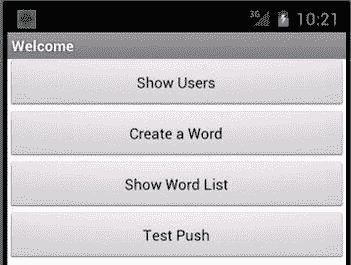
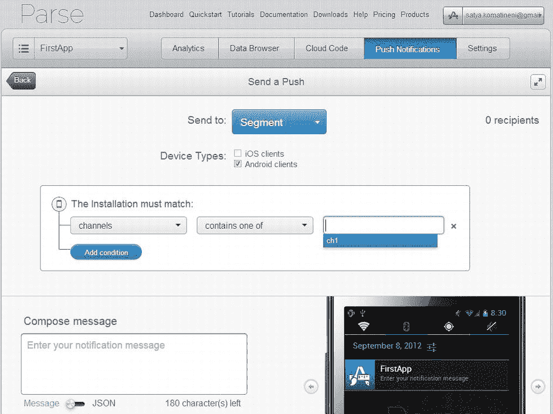

# 十五、使用 Parse 探索推送通知

Abstract

当您发布移动应用时，您需要一种与移动应用用户沟通的方式。对于某些应用，您甚至可能希望促进用户之间的交流。移动应用的这些特征通常通过使用推送通知来实现。

当您发布移动应用时，您需要一种与移动应用用户沟通的方式。对于某些应用，您甚至可能希望促进用户之间的交流。移动应用的这些特征通常通过推送通知来实现。

在第十三章和第十四章中，我们介绍了如何使用解析云来管理用户，以及如何代表他们存储对象。在本章中，我们将介绍 Parse 的推送通知 API。我们涵盖的功能有:

How to intialize a mobile appplication so that it is enabled for Parse push notifications   How to send notifications using the Parse dashboard from the server   How to send notifications using the Parse dashboard to specific channels   How to allow mobile client applications, to send notifications to specific channels subscribed by other users, instead of using the server-side dashboard   How to capture push notifications through Android broadcast receivers  

为了演示这些概念，我们将通过添加一个既能响应推送通知又能发送推送通知的活动来扩展为上两章开发的应用。我们从应用的用户体验开始，然后在本章中实现。

## 演示解析推送通知

如果你运行我们在本章中作为例子使用的应用，你会看到如图 15-1 所示的屏幕。该屏幕列出了可供登录用户使用的选项。

图 15-1。

Welcome screen to invoke the test push activity

请注意，图 15-1 中的欢迎屏幕与第十三章 ( 图 13-6 )中显示的屏幕相同，除了有一个额外的按钮来调用将用于接收和发送推送通知的活动。

### 响应推送通知

图 15-2 中的活动显示了演示如何响应和发送推送通知的用户控件。在 Java 代码中(稍后显示)，这个活动被称为`RespondToPushActivity` `.`

图 15-2。

Activity to respond to and send push notifications

让我们看看关于这个`RespondToPushActivity`的一些事情，因为它是一个多用途的活动。

在顶部，有一个文本视图，显示作为推送通知的结果而调用此活动的意图的内容。当您从解析云推送通知消息时，通知消息会显示在 Android 设备顶部的通知栏中(或通知栏所在的任何位置，具体取决于 Android 设备和型号)。当您下拉通知消息并点击它时，图 15-2 中所示活动`RespondToPushActivity`将被调用。

这个活动做的第一件事是在“只读”文本视图的顶部显示调用它的意图及其细节。查看这个意图文本视图，您可以看到 Parse 是如何将消息传递给移动应用中的活动的。当我们从服务器推送这样的消息时，这是一个服务器端推送，是通过解析仪表板完成的。相比之下，图 15-2 中的活动有几个其他的按钮来触发用户端的推送。我们接下来将讨论这些发送按钮。

### 从客户端程序推送通知

如图 15-2 所示，`RespondToPushActivity`画面中还有三个附加按钮。第一个按钮使用更简单的消息类型 API Parse 将消息从客户端程序发送到其他客户端程序。第二个按钮使用某种无类型的 JSON 数据对象从客户端程序向其他客户端程序发送消息。两者相似，但你很快就会看到细微的差别。此外，这两个选项都利用了称为推送通道的东西，每个通道都可以与一个活动相关联。在示例应用中，我们使用了`RespondToPushActivity`(图 15-2 )作为来自通道的推送通知的目标。因为`RespondToPushActivity`也调查调用它的意图，这允许您查看当客户端程序推送通知时接收到的是什么类型的消息。

第三个按钮使用通道将类似的消息从客户端程序发送到其他客户端程序，但是该消息的目标不是活动，而是广播接收器。然后，广播接收器可以选择通过 Android 通知管理器进行通知。如果需要，这种基于广播接收机的方法在通知中如何显示和显示什么方面提供了更大的灵活性。

### 支撑屏幕

有几个支持屏幕。图 15-3 是服务器端解析仪表板的屏幕截图，您可以从这里向所有用户(或客户端)发送消息。

图 15-3。

Parse push notification dashboard

图 15-4 是解析推送通知仪表板页面的屏幕截图，该仪表板负责构建消息并将其推送到该应用的所有 Android 客户端。

图 15-4。

Constructing a push message

图 15-5 是消息如何在 Android 设备上显示的屏幕截图。更具体地说，图 15-5 是用户拖动通知面板查看通知栏中的通知时的视图。

图 15-5。

Push notification displayed on an Android device

我们现在将继续讨论如何使用 Parse push API 及其服务器端工具来实现这个应用。

## 实现解析推送

用 Parse 实现推送通知非常简单。Parse 维护着一个与 Parse cloud 保持联系的 Android 服务。这使得 Parse 可以直接从服务器向客户机推送消息，当然也可以通过服务器从其他客户机向客户机推送消息。

安装在设备上的每个应用都由一个“安装”解析对象表示。(关于什么是 Parse 对象以及如何安装 Parse SDK，请参考第十三章和第十四章。)安装对象需要在应用启动时初始化。它存储在每个应用的解析云中，并告诉解析云它是什么类型的设备，是否准备好接收消息，等等。

清单 15-1 显示了如何用一个安装对象初始化一个移动应用。这段代码与前两章中使用的初始化代码非常相似，只是最后一节包含了与推送相关的初始化。

清单 15-1。初始化应用以解析推送通知

`public class ParseApplication extends Application {`

`private static String tag = "ParseApplication";`

`private static String PARSE_APPLICATION_ID`

`= "....wqHaD2m";`

`private static String PARSE_CLIENT_KEY`

`= "....WGd2p";`

`@Override`

`public void onCreate() {`

`super.onCreate();`

`// Add your initialization code here`

`Parse.initialize(this, PARSE_APPLICATION_ID, PARSE_CLIENT_KEY);`

`//Security of data`

`ParseACL defaultACL = new ParseACL();`

`// If you would like objects to be private by default, remove this line.`

`defaultACL.setPublicReadAccess(true);`

`ParseACL.setDefaultACL(defaultACL, true);`

`//Enable to receive push`

`PushService.setDefaultPushCallback(this, RespondToPushActivity.class);`

`ParseInstallation pi = ParseInstallation.getCurrentInstallation();`

`//Register a channel to test push channels`

`Context ctx = this.getApplicationContext();`

`PushService.subscribe(ctx, "ch1", RespondToPushActivity.class);`

`pi.saveEventually();`

`}`

`}`

我们已经使用了`PushService`类来指示当用户点击接收到的消息时应该调用的默认活动。(我们将很快向您展示`RespondToPushActivity`代码的样子。)我们还使用了`PushService`来订阅所有针对用户定义的频道(称为`ch1`)的消息。

通道仅仅是对消息进行分类的一种方式，并允许发布/订阅类型的功能。值得注意的是，解析仪表板没有明确的位置来创建或维护这些通道字符串(它们的名称)。由开发人员根据需要设计这些通道字符串名称。事实上，没有正式的 API 来创建这些通道；仅仅通过订阅一个字符串，字符串就变成了一个通道！

例如，您可以设计三个活动，希望在接收消息时以它们为目标。然后，您创建(或订阅)三个频道，并将其命名为“ch1”、“ch2”和“ch3”当您将消息发送到这些通道时，就会调用相应的活动。

使用通道的另一种方式是，应用的用户可以通过应用创建通道，其他用户可以订阅这些通道。在这种情况下，作为开发人员，您有责任跟踪这个频道元数据(频道名称和它们是如何订阅的)，就像您跟踪任何其他解析对象一样。

现在回到安装对象。在清单 15-1 中代码段的末尾，您通过调用`saveEventually()`或`saveInTheBackground()`获得当前的安装对象并将其保存到解析云中。Parse 的早期版本在另一个服务器端调用可能正在进行时对`saveInTheBackground()`有一些问题，比如在同一线程上还没有完成的`Parse.initialize()`或更早的`saveInTheBackground()`。当您编写的方法调用多个直接或间接在后台操作中开始保存的 Parse SDK 方法时，这很容易发生。这个问题在最近的版本中得到了纠正，比如我们使用的版本:Parse 1.2.3。

为了完成初始化，除了清单 15-1 中的代码之外，您还需要在您的应用的清单文件中包含以下条目(清单 15-2)。

清单 15-2。解析推送通知所需的权限

`<uses-permission android:name="android.permission.INTERNET" />`

`<uses-permission android:name="android.permission.ACCESS_NETWORK_STATE" />`

`<uses-permission android:name="android.permission.RECEIVE_BOOT_COMPLETED" />`

`<uses-permission android:name="android.permission.VIBRATE" />`

这些权限标签通常位于应用标签的正上方，是应用标签的兄弟。

在应用标签中，你需要清单 15-3 中的代码行。

清单 15-3。注册解析推送服务和解析广播接收器

`<service android:name="com.parse.PushService" />`

`<receiver android:name="com.parse.ParseBroadcastReceiver">`

`<intent-filter>`

`<action android:name="android.intent.action.BOOT_COMPLETED" />`

`<action android:name="android.intent.action.USER_PRESENT" />`

`</intent-filter>`

`</receiver>`

这段代码中的`PushService`和`ParseBroadcastReceiver`都是 Parse SDK 的一部分。清单 15-1、15-2 和 15-3 完成了初始化过程。我们现在将描述如何发送和接收解析推送消息。

### 从解析仪表板发送推送通知

在图 15-2 、 15-3 和 15-4 中，在描述该应用的用户体验时，我们展示了如何构建一个推送消息并将其发送到所有 Android 客户端。这个推送的消息将由`RespondToPushActivity`类接收。现在让我们看看示例应用的推送通知所针对的`RespondToPushActivity`类的代码。清单 15-4 给出了这段代码。

清单 15-4。RespondToPushActivity:响应和发送推送通知

`public class RespondToPushActivity`

`extends BaseActivity`

`{`

`public RespondToPushActivity() {`

`super("RespondToPushActivity");`

`}`

`public void onCreate(Bundle savedInstanceState) {`

`super.onCreate(savedInstanceState);`

`setContentView(R.layout.rtp_respond_to_push);`

`examineIntent(getIntent());`

`}`

`//This activity is setup as a singletop`

`@Override`

`protected void onNewIntent(Intent intent) {`

`examineIntent(intent);`

`}`

`//Populate the textview with the intent that has the message`

`private void examineIntent(Intent i)`

`{`

`String u = i.toURI(0);`

`TextView tv = (TextView)findViewById(R.id.rtp_welcomeMessage);`

`tv.setText(u);`

`}`

`}//eof-class`

用于此`RespondToPushActity`的布局如图 15-2 所示。请注意传入意图文本的显示和发送消息的三个按钮。

`onCreate()`方法的清单 15-4 采用调用意图并填充顶部的意图文本视图。你可以在方法`examineIntent()`中看到这一点。我们在 intent 上使用了`toUri(0)`方法来获得 intent 的字符串表示。这告诉我们 Parse 是如何构造要交付给活动的消息的。

此外，由于您可能会收到针对同一活动的其他消息，我们在清单文件中将该活动标记为`singletop`。清单 15-5 显示了这段代码。

清单 15-5。将 RespondToPushActivity 注册为 Singletop

`<activity android:name="com.androidbook.parse.RespondToPushActivity"`

`android:launchMode="singleTop"`

`android:label="Respond"/>`

成为一个`singletop`意味着如果这个活动在栈顶，那么`onCreate()`不会被调用。相反，调用了`onNewIntent()`方法。这就是清单 15-4 中的代码考虑`onNewIntent()`的原因。如果我们不这样做，每次有新消息到达并且用户点击它时，就会在堆栈上创建一个新的活动。但是通过将其指定为`singletop`，可以避免堆栈上的多个活动。

有了这个`RespondToPushActivity`,你就可以从服务器发送一条消息，这条消息将首先作为警告出现在你的 Android 设备的顶部。然后你向下拖动通知面板(图 15-5 )并点击后选择通知，你被带到这个`RespondToPushActivity`(图 15-2 )，意图显示在顶部。您将能够看到您在仪表板中键入的消息，在意向中可用。您可能希望使用此消息文本采取一些措施。

### 使用仪表板向频道发送消息

因为您在初始化过程中已经订阅了一个名为“ch1”的通道(清单 15-1)，所以 Parse 知道有一个通道“ch1”可以作为目标。在解析推送通知仪表板中，您可以选择此通道作为目标。然后，该消息将被发送给订阅了该通道的所有用户，并最终调用同一个`RespondToPushActivity`，因为该活动被注册为该通道的目标活动。

### 通过客户端程序发送消息

看看清单 15-6 中的`sendMessage()`方法。您可以将此代码添加到`RespondToPushActivity`中，以响应图 15-2 中的发送消息按钮。

清单 15-6。从用户(客户端)发送推送通知

`//A useful counter to distinguish messages`

`private int i = 0;`

`//Use Java methods to push a message`

`public void sendMessage(View v)`

`{`

`ParsePush push = new ParsePush();`

`String message = "Client message" + Integer.toString(i++);`

`push.setChannel("ch1");`

`push.setMessage(message);`

`push.sendInBackground();`

`}`

在这个代码片段中，您正在使用一个名为`ParsePush`的对象来设置频道和消息，然后在后台发送它。该消息将会出现，并最终导致调用同一个`RespondToPushActivity`(图 15-2 )。但是，在解析仪表板上，您需要首先启用客户端推送。您进入 [`parse.com`](http://www.parse.com) 并访问您的应用的仪表板。然后，您将看到推送的设置，在这里您会找到这个客户端推送设置。

### 从客户端程序发送数据形式的消息

当您使用`ParsePush`对象时，您可能想知道是否有可能发送除消息之外的其他数据。答案是肯定的。这是通过对`ParsePush`对象使用`setData()`方法来完成的。这个方法接受一个 JSON 对象作为它的输入。作为一个 JSON 对象，数据对象允许任意数量的键值对发送给接收者。

即使当您使用`ParsePush.setMessage()`方法时，它也会被转换成带有一组预定义键的 JSON 对象。作为`setMessage()`的一部分的消息作为密钥`alert`。(我们将在本章后面介绍另一个名为`action`的保留键。有关这些键的完整列表，请参见联机解析文档。)

现在让我们发送一个名为`customdata`的额外数据元素，看看这个字段是否可以在`RespondToPushActivity`中访问。

Note

你可能想知道你能给客户传递多大的信息。IOS 有一个大约 199 个字符的硬限制。对于 Android 设备，这可能是很大的，目前还不确定。所以如果你知道你的接收器是安卓的，你可以试着推更大的有效载荷。然而，一个更好的选择是发送一个有限的消息，然后让接收者从 Parse 中把它拉回来，以避免这种限制！

清单 15-7 中的代码展示了如何创建一个 JSON 数据对象，然后把它作为一个解析推送消息发送出去。

清单 15-7。使用 JSON 数据发送推送通知

`//Use a JSON object to send a message`

`public void sendMessageAsData(View v)`

`{`

`JSONObject data = getJSONDataMessage();`

`ParsePush push = new ParsePush();`

`push.setChannel("ch1");`

`push.setData(data);`

`push.sendInBackground();`

`}`

`private JSONObject getJSONDataMessage()`

`{`

`try`

`{`

`JSONObject data = new JSONObject();`

`data.put("alert", "Main Message");`

`data.put("customdata", "custom data value");`

`return data;`

`}`

`catch(JSONException x)`

`{`

`throw new RuntimeException("Something wrong with JSON", x);`

`}`

`}`

当您使用 JSON 数据对象时，使用什么键或属性来发送数据是很重要的。参考解析文档来获得可用键的句柄。

似乎没有办法从客户端向所有其他客户端发送推送消息。用户端推送消息似乎需要一个发布渠道。但是，如果你所有的移动应用都订阅一个单一的、众所周知的频道，那么在这个频道上发布的任何内容都会被所有的客户端获取。

使用客户端推送，您还可以将一组`Installation`对象提供给`ParsePush`。我们在这一章中没有涉及到，但是这很容易做到。您在安装类上获得一个查询对象，然后指定您想要作为目标的所有类型的安装对象的“where”子句。

### 使用广播接收器作为推送通知的目标

通过在通过 push 消息发送的 JSON 数据对象上设置不同的属性(action 属性),可以让 Parse 调用一个广播接收器，而不是触发通知栏中显示的通知。使用这种方法时，Parse 不会向通知管理器发送通知。相反，Parse 调用由 action 属性指示的广播接收器。

为了促使 Parse 这样做，需要构造一个 JSON 数据对象，它带有一个名为`action`的键，指向一个 Android 意图，其动作调用一个广播接收器。清单 15-8 中的代码展示了如何创建这样一个 JSON 数据对象，并将其作为推送通知发送。

清单 15-8。发送推送通知以调用广播接收器

`//Use JSON data to send a message to a broadcast receiver`

`public void sendMessageAsIntent(View v)`

`{`

`JSONObject data = getJSONDataMessageForIntent();`

`ParsePush push = new ParsePush();`

`push.setChannel("ch1");`

`push.setData(data);`

`push.sendInBackground();`

`}`

`//Notice how the 'action' attribute enables the`

`//broadcast receiver behavior.`

`private JSONObject getJSONDataMessageForIntent()`

`{`

`try`

`{`

`JSONObject data = new JSONObject();`

`//Notice alert is not required`

`//data.put("alert", "Message from Intent");`

`//instead action is used`

`data.put("action", TestBroadcastReceiver.ACTION);`

`data.put("customdata", "custom data value");`

`return data;`

`}`

`catch(JSONException x)`

`{`

`throw new RuntimeException("Something wrong with JSON", x);`

`}`

`}`

当你使用动作属性时，确保不要同时使用`alert`。如果这样做，Parse 似乎会两者都做——调用广播接收器并发送通知。

在清单 15-8 中，JSON 对象的 action 属性指向常量`TestBroadcastReceiver.ACTION`。这是在代码中为`TestBroadcastReceiver`定义的字符串。清单 15-9 显示了`TestBroadcastReceiver`的代码。注意，动作的值是`com.androidbook.parse.TestPushAction`

清单 15-9。TestBroadcastReceiver 的源代码

`public class TestBroadcastReceiver`

`extends BroadcastReceiver`

`{`

`public static final String ACTION="com.androidbook.parse.TestPushAction";`

`public static final String PARSE_EXTRA_DATA_KEY="com.parse.Data";`

`public static final String PARSE_JSON_ALERT_KEY="alert";`

`public static final String PARSE_JSON_CHANNELS_KEY="com.parse.Channel";`

`private static final String TAG = "TestBroadcastReceiver";`

`@Override`

`public void onReceive(Context context, Intent intent)`

`{`

`try`

`{`

`String action = intent.getAction();`

`//"com.parse.Channel"`

`String channel =`

`intent.getExtras()`

`.getString(PARSE_JSON_CHANNELS_KEY);`

`JSONObject json =`

`new JSONObject(`

`intent.getExtras()`

`.getString(PARSE_EXTRA_DATA_KEY));`

`Log.d(TAG, "got action " + action + " on channel " + channel + " with:");`

`Iterator itr = json.keys();`

`while (itr.hasNext())`

`{`

`String key = (String) itr.next();`

`Log.d(TAG, "…" + key + " => " + json.getString(key));`

`}`

`notify(context,intent,json);`

`}`

`catch (JSONException e)`

`{`

`Log.d(TAG, "JSONException: " + e.getMessage());`

`}`

`}`

`private void notify(Context ctx, Intent i, JSONObject dataObject)`

`throws JSONException`

`{`

`NotificationManager nm = (NotificationManager)`

`ctx.getSystemService(Context.NOTIFICATION_SERVICE);`

`int icon = R.drawable.robot;`

`String tickerText =`

`dataObject.getString("customdata");`

`long when = System.currentTimeMillis();`

`Notification n = new Notification(icon, tickerText, when);`

`//Let the intent invoke the respond activity`

`Intent intent = new Intent(ctx, RespondToPushActivity.class);`

`//Load it with parse data`

`intent.putExtra("com.parse.Data"`，

`i.getExtras().getString("com.parse.Data"));`

`PendingIntent pi = PendingIntent.getActivity(ctx, 0, intent, 0);`

`n.setLatestEventInfo(ctx, "Parse Alert", tickerText, pi);`

`n.flags |= Notification.FLAG_AUTO_CANCEL;`

`nm.notify(1, n);`

`}`

`}//eof-class`

按照广播接收器的规则，这个接收器需要在 Android manifest 文件中注册，如清单 15-10 所示。

清单 15-10。注册 TestBroadcastReceiver

`<receiver`

`android:name=".TestBroadcastReceiver"`

`android:exported="false"`

`>`

`<intent-filter>`

`<action android:name="com.androidbook.parse.TestPushAction" />`

`</intent-filter>`

`</receiver>`

注意，JSON 对象中的动作名称与测试广播接收器的动作过滤器相匹配。当这个消息被推送到 Android 设备时，`TestBroadcastReceiver`就是这样被调用的。

使用这个广播接收器你做了两件事(清单 15-9)。首先，您正在检索解析通过 intent 发送的 JSON 数据对象。从这个 JSON 对象中，您可以提取标准字段以及您已经准备好的任何定制字段。接下来，您将构建自己的通知并将其发送给通知管理器。(您可能想从广播接收器中弹出一个活动，但这不是一个好的做法，因为无论用户正在做什么，用户都会受到上下文的干扰。此外，想象一下，如果多个广播接收机开始这样做，会发生什么。从广播接收器提醒用户的良好做法是向通知管理器发送通知。)您还在通知上设置了一个新的意图，以便当用户点击通知时调用相同的`RespondToPushActivity`。

## 参考

第十三章和第十四章中给出的 Parse 参考在这里是适用的。以下附加链接进一步支持本章中的内容。

*   推送通知指南来自解析: [`https://www.parse.com/docs/push_guide#top/Android`](http://www.parse.com/docs/)
*   作者研究日志解析推送通知: [`http://androidbook.com/item/4547`](http://androidbook.com/item/4547) 。你会在这里看到本章的基础研究，以及一些资源、代码片段等。
*   使用广播接收机: [`http://androidbook.com/item/3482`](http://androidbook.com/item/3482)
*   使用 Android 通知管理器: [`http://androidbook.com/item/3506`](http://androidbook.com/item/3506)
*   在 [`www.androidbook.com/expertandroid/projects`](http://www.androidbook.com/expertandroid/projects) 下载本章专用的测试项目。zip 文件的名称是`ExpertAndroid_Ch15_ParsePushProject.zip`。

## 摘要

[`Parse.com`](http://www.parse.com) 可以把你的移动应用带到他们以前没去过的地方。使用 Parse，您将能够更好地与您的用户群进行交流。有可能编写协作应用，将群体和社区的力量推向前台。

[`Parse.com`](http://www.parse.com) 通过一个非常好的 API 和一个基于 web 的仪表板提供存储、用户管理和推送通知来实现这种通信。随着脸书收购 Parse，我们希望看到这个平台迅速成熟，甚至可能在明年凭借新的想法超越其他人。

这一章很好地介绍了你可以用解析推送通知做的一些事情。要了解更多特性，请访问 Parse 网站，了解我们顺便提及或根本没有涉及的其他内容。

## 复习问题

以下问题应巩固您在本章中学到的知识:

How does Parse accomplish push notifications?   How do you set up your application to work with Parse push notifications?   What kind of dashboard support is there to work with push notifications in Parse?   What are installation objects?   What are the Parse services and receivers that need to be registered in your application?   What are channels?   How do you manage channels? Do they need to be predefined?   How do you send messages only to certain devices based on a query?   How do you write broadcast receivers that can be triggered by push messages?   What is the difference between mobile clients sending push messages and a server using a dashboard to send push messages?   Is there a message size limitation for Push notifications?   What is the role of JSON data objects in sending and receiving push notifications?   How do you retrieve and construct a JSON data object using intent extras?