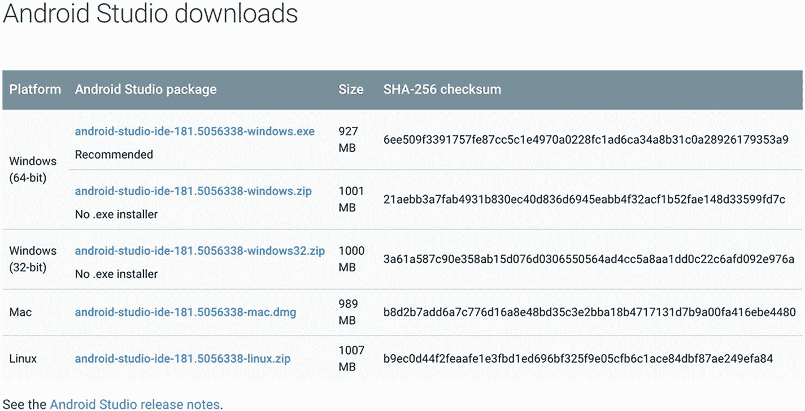

# 一、开始

本章中的食谱帮助你设置你的本地开发环境，为构建 Flutter 应用做好准备。根据机器的操作系统，设置步骤可能会有所不同。你只需要按照你自己的要求使用食谱。在使用了本章中的方法之后，你应该能够在模拟器或者物理设备上运行第一个 Flutter 应用。

## 1.1 在 Windows 上安装 Flutter SDK

### 问题

你有一台 Windows 机器，你想在这台机器上开始 Flutter 开发。

### 解决办法

在 Windows 机器上安装 Flutter SDK，设置 Android 平台。

### 讨论

Flutter SDK 支持 Windows 平台。在 Windows 上安装 Flutter 并不像你想象的那样困难。首先，您需要确保您的本地开发环境满足最低要求。您需要 64 位 Windows 7 SP1 或更高版本，以及至少 400MB 的可用磁盘空间供 Flutter SDK 使用。Flutter SDK 还要求 Windows PowerShell 5.0 或更高版本以及 Git for Windows 在机器上可用。

Windows PowerShell 5.0 预装了 Windows 10。对于 Windows 10 之前的 Windows 版本，需要按照微软的说明( [`https://docs.microsoft.com/en-us/powershell/scripting/setup/installing-windows-powershell`](https://docs.microsoft.com/en-us/powershell/scripting/setup/installing-windows-powershell) )手动安装 PowerShell 5.0。您可能已经安装了 Git for Windows，因为 Git 是一个非常流行的开发工具。如果您可以在 PowerShell 中运行 Git 命令，那么您就可以开始了。否则需要下载 Git for Windows ( [`https://git-scm.com/download/win`](https://git-scm.com/download/win) )并安装。安装 Git for Windows 时，请确保在“调整路径环境”页面中选择了“从命令行和第三方软件安装 Git”选项；见图 [1-1](#Fig1) 。


图 1-1

Git for Windows 安装程序

满足这些最低要求后，您可以从官方网站( [`https://flutter.dev/docs/get-started/install/windows`](https://flutter.dev/docs/get-started/install/windows) )下载 Flutter SDK zip 包。将下载的 zip 文件解压缩到本地计算机上的所需位置。建议避免使用安装了 Windows 的系统驱动程序。在提取的目录中，双击文件`flutter_console.bat`启动 Flutter 控制台并运行 Flutter SDK 命令。

为了能够在任何 Windows 控制台中运行 Flutter SDK 命令，我们需要将 Flutter SDK 添加到`PATH`环境变量中。安装目录的`bin`的完整路径应该添加到`PATH`中。要在 Windows 10 上修改路径

1.  打开开始搜索，键入“env”并选择“编辑系统环境变量”。

2.  单击“环境变量…”按钮，在“系统变量”部分的第一列中找到带有“路径”的行。

3.  在“编辑环境变量”对话框中，点击“新建”，输入已安装的 Flutter SDK 的 bin 目录的路径。

4.  单击“确定”关闭所有对话框。

现在，您可以打开一个新的 PowerShell 窗口并键入命令`flutter --version`来验证安装；见图 [1-2](#Fig2) 。


图 1-2

在 Windows 上成功安装 Flutter SDK

Windows 上仅支持 Android 平台。按照配方 1-7 继续设置。

## 1.2 在 Linux 上安装 Flutter SDK

### 问题

你有一台 Linux 机器，你想在这台机器上开始 Flutter 开发。

### 解决办法

在 Linux 机器上安装 Flutter SDK，设置 Android 平台。

### 讨论

Flutter SDK 支持 Linux 平台。然而，鉴于有许多不同的 Linux 发行版可用，安装 Flutter SDK 的实际步骤可能会略有不同。这个方法是基于在 LTS 的 Ubuntu 18.04 上安装 Flutter SDK。

Flutter SDK 需要几个命令行工具在本地环境中可用，包括`bash`、`mkdir`、`rm`、`git`、`curl`、`unzip`和`which`。对于大多数 Linux 发行版，默认情况下应该已经包含了命令`bash`、`mkdir`、`rm`、`unzip`和`which`。验证这一点最简单的方法是打开一个终端窗口，键入这些命令来查看输出。如果没有安装命令，您会看到“找不到命令”错误。`git`和`curl`不太可能默认包含。大多数 Linux 发行版都提供了内置的包管理器来安装这些工具。对于 Ubuntu，可以使用`apt-get`；请参见以下命令。

```dart
$ sudo apt-get update
$ sudo apt-get install -y curl git

```

安装成功完成后，您可以键入命令`curl`和`git`进行验证。

现在你可以从官方网站( [`https://flutter.dev/docs/get-started/install/linux`](https://flutter.dev/docs/get-started/install/linux) )下载 Flutter SDK 压缩包。将下载的 zip 文件解压缩到本地计算机上的所需位置。打开终端窗口，导航到提取的 Flutter SDK 的目录，并运行以下命令来验证安装。

```dart
$ bin/flutter --version

```

建议将 Flutter SDK 的`bin`目录添加到`PATH`环境变量中，这样`flutter`命令可以在任何终端会话中运行。对于 Ubuntu，可以编辑文件`~/.profile`。

```dart
$ nano ~/.profile

```

将下面一行添加到该文件并保存。

```dart
export PATH="<flutter_dir>/bin:$PATH"

```

在当前终端窗口中，您需要运行`source ~/.profile`以使更改生效。或者您可以简单地创建一个新的终端窗口。在任何终端窗口中键入`flutter --version`进行验证。你会看到与图 [1-2](#Fig2) 相同的输出。

Linux 上只支持 Android 平台。按照配方 1-7 继续设置。

## 1.3 在 macOS 上安装 Flutter SDK

### 问题

你有一台 macOS 机器，你想在这台机器上开始 Flutter 开发。

### 解决办法

安装 Flutter SDK，在 macOS 机器上设置 Android 和 iOS 平台。

### 讨论

对于 macOS，Flutter SDK 需要几个命令行工具在本地环境中可用。这些工具是`bash`、`mkdir`、`rm`、`git`、`curl`、`unzip`和`which`。macOS 系统中应该已经有这些工具了。您可以简单地在终端中键入这些命令进行验证。安装缺失工具最简单的方法就是使用自制软件( [`https://brew.sh/`](https://brew.sh/) )。在设置 iOS 开发环境时，自制软件也很重要。使用`brew install`安装工具，例如`brew install git`安装 Git。

安装所需工具后，我们可以从官方网站( [`https://flutter.dev/docs/get-started/install/macos`](https://flutter.dev/docs/get-started/install/macos) )下载 Flutter SDK 压缩包。将下载的 zip 文件解压缩到本地计算机上的所需位置。`flutter`命令位于提取位置的`bin`目录下。

要在任何终端会话中运行`flutter`命令，应该更新`PATH`环境变量以包含 Flutter SDK 的`bin`目录。这通常通过更新壳的轮廓来完成。对于默认的 bash，这个文件是`~/.bash_profile`。对于 zsh 来说，这个文件就是`~/.zshrc`。修改该文件以包含以下行。

```dart
export PATH=<flutter_install_dir>/bin:$PATH

```

要让当前终端窗口使用更新后的`PATH`，需要运行`source ~/.bash_profile`。您也可以启动一个新的终端窗口，该窗口将自动使用`PATH`的更新值。

在任一终端窗口中运行`flutter --version`来验证安装。您将看到与图 [1-2](#Fig2) 相同的输出。

macOS 上同时支持 Android 和 iOS 平台。按照配方 1-4 和 1-7 继续设置。

## 1.4 设置 iOS 平台

### 问题

你想为 iOS 平台开发 Flutter 应用。

### 解决办法

在 Mac 上为 Flutter SDK 设置 iOS 平台。

### 讨论

要为 iOS 开发 Flutter 应用，你需要有一台至少安装了 Xcode 9.0 的 Mac。要设置 iOS 平台，您需要完成以下步骤:


图 1-3

Flutter医生的输出

1.  从 App Store 安装 Xcode ( [`https://developer.apple.com/xcode/`](https://developer.apple.com/xcode/) )。

2.  验证 Xcode 命令行工具的路径。运行以下命令显示命令行工具的当前路径。通常你应该会看到类似`/Applications/Xcode.app/Contents/Developer`的输出。

    ```dart
    $ xcode-select -p

    ```

    如果输出中显示的路径不是您想要的路径，例如，您安装了不同版本的 Xcode 命令行工具，请使用`xcode-select -s`切换到不同的路径。如果没有安装命令行工具，使用`xcode-select --install`打开安装对话框。

3.  您需要打开 Xcode 一次以接受其许可协议。或者您可以选择运行命令`sudo xcodebuild -license`来查看并接受它。

4.  Flutter SDK 需要 iOS 平台的其他工具，包括 libimobiledevice、usbmuxd、ideviceinstaller、ios-deploy、CocoaPods ( [`https://cocoapods.org/`](https://cocoapods.org/) )。所有这些工具都可以用自制软件安装。如果您运行命令`flutter doctor`，它会显示使用 Homebrew 安装这些工具的命令。只需运行这些命令并使用`flutter doctor`再次检查。当你看到“iOS toolchain”的绿色勾号时，iOS 平台设置成功，可供 Flutter SDK 使用；样本输出见图 [1-3](#Fig3) 。

## 1.5 设置 iOS 模拟器

### 问题

你需要一个快速的方法来测试 iOS 平台上的 Flutter 应用。

### 解决办法

设置 iOS 模拟器。

### 讨论

Xcode 为不同的 iOS 版本提供模拟器。您可以使用 Xcode ➤偏好设置中的标签组件下载其他模拟器。要打开模拟器，请运行以下命令。

```dart
$ open -a Simulator

```

当模拟器打开时，您可以使用菜单**硬件** ➤ **设备**切换不同设备和 iOS 版本的组合。

模拟器启动后，运行`flutter devices`应该会显示模拟器。

## 1.6 设置 iOS 设备

### 问题

你已经在 iOS 模拟器上完成了你的 Flutter 应用的测试，你想在真实的 iOS 设备上测试它们。

### 解决办法

将 Flutter 应用部署到 iOS 设备。

### 讨论

在将 Flutter 应用部署到 iOS 设备之前，您需要运行`flutter doctor`来验证 iOS 工具链是否设置正确。要在设备上开发和测试 Flutter 应用，你需要有一个 Apple ID。如果您想将应用分发到 App Store，您还需要注册 Apple 开发者计划。

第一次连接物理设备进行 iOS 开发时，您需要信任 Mac 来连接您的设备。Flutter 应用需要在部署到设备之前进行签名。在 Xcode 中打开 Flutter app 的`ios/Runner.xcworkspace`文件。在**常规**选项卡中，在**签约**部分选择正确的团队。如果您选择连接的设备作为运行目标，Xcode 将完成代码签名的必要配置。捆绑标识符必须是唯一的。


图 1-4

Xcode 中的应用签名

Flutter 应用可以使用 Xcode 或命令`flutter run`部署到设备上。首次部署应用时，您可能需要信任 iOS 设备上设置应用的**通用** ➤ **设备管理**中的开发证书。

## 1.7 设置 Android 平台

### 问题

你想为 Android 平台开发 Flutter 应用。

### 解决办法

安装 Android Studio，在本地机器上设置 Android 平台。

### 讨论

要开发 Android 平台的 Flutter apps，首先需要设置 Android 平台。Flutter SDK 由于其 Android 平台依赖性，需要完整安装 Android Studio，所以我们必须安装 Android Studio。

进入 ANDROID STUDIO 下载页面( [`https://developer.android.com/studio/`](https://developer.android.com/studio/) )，点击“下载 Android Studio”按钮。您需要接受条款和条件才能下载。下载页面会检查您的平台，并提供最适合下载的版本。如果提供的选项不是您想要的，请单击“下载选项”并从所有下载选项列表中选择；见图 [1-5](#Fig5) 。



图 1-5

Android Studio 的下载选项

Android Studio 提供了一个基于 GUI 的安装程序，所以在本地机器上安装和运行它非常容易。安装 Android Studio 还会安装 Android SDK、Android SDK 平台工具和 Android SDK 构建工具。即使你选择不使用 Android Studio 作为 IDE，Android 开发仍然需要 Android SDK 和相关工具。

在 Android Studio 中首选项的 Android SDK 页面，还可以安装额外的 Android SDK 平台和工具；参见图 [1-6](#Fig6) 。Android Studio 还会提示已安装的 Android SDK 平台和工具的可用更新。


图 1-6

在 Android Studio 中管理 Android SDK

## 1.8 设置 Android 模拟器

### 问题

你需要一种快速的方法来测试 Android 平台的 Flutter 应用。

### 解决办法

设置 Android 模拟器。

### 讨论

开发 Flutter 应用时，可以在 Android 模拟器上运行，看看应用运行的结果。要设置 Android 模拟器，您可以完成以下步骤。

在 Android Studio 中打开一个 Android 项目，选择**工具** ➤ Android ➤ **AVD 管理器**打开 AVD 管理器，点击“创建虚拟设备…”；见图 [1-7](#Fig7) 。


图 1-7

Android 虚拟设备管理器

选择一个设备定义，比如 Nexus 6P，点击下一步；参见图 [1-8](#Fig8) 。


图 1-8

选择硬件

为您想要模拟的 Android 版本选择一个系统映像，然后单击“下一步”；参见图 [1-9](#Fig9) 。


图 1-9

选择一个系统映像

为“仿真性能”选择“硬件- GLE 2.0”以启用硬件加速，然后单击“完成”；参见图 [1-10](#Fig10) 。


图 1-10

选择模拟性能

一个新的 AVD 被创建并在 AVD 管理器中列出。Android Studio 官方网站提供了关于如何管理 AVD 的全面指南( [`https://developer.android.com/studio/run/managing-avds`](https://developer.android.com/studio/run/managing-avds) )，如果你想了解关于 AVD 配置的更多细节。

在 AVD 管理器中，单击绿色三角形按钮启动模拟器。模拟器启动并显示默认的 Android 主屏幕可能需要一些时间。

## 1.9 设置 Android 设备

### 问题

您已经在模拟器上完成了对 Flutter 应用的测试，并且您想要在真实的 Android 设备上测试它们。

### 解决办法

设置您的 Android 设备运行 Flutter 应用。

### 讨论

要设置您的 Android 设备，您可以完成以下步骤:

1.  您需要在设备上启用开发人员选项和 USB 调试。查看安卓官方网站上的说明( [`https://developer.android.com/studio/debug/dev-options#enable`](https://developer.android.com/studio/debug/dev-options%2523enable) )。你可能还需要在 Windows 机器上安装谷歌 USB 驱动( [`https://developer.android.com/studio/run/win-usb`](https://developer.android.com/studio/run/win-usb) )。

2.  使用 USB 电缆将您的设备插入电脑。设备会提示一个对话框询问权限，授权您的电脑访问您的设备。

3.  运行命令`flutter devices`来验证 Flutter SDK 可以识别你的设备。

可以使用 Android Studio 或命令`flutter run`将 Flutter 应用部署到设备上。

## 1.10 使用命令行创建 Flutter 应用

### 问题

您已经设置了本地环境来开发 Flutter 应用。即使使用 Android Studio 或 VS 代码是一个很好的开发选择，您可能仍然想知道如何从命令行完成这项工作。

### 解决办法

使用 Flutter SDK 中的命令创建和构建 Flutter 应用。

### 讨论

使用像 Android Studio 和 VS Code 这样的工具可以让 Flutter 开发变得容易得多。然而，知道如何使用命令行工具构建 Flutter 应用仍然很有价值。这对持续集成很重要。它还允许您使用任何其他编辑器来开发 Flutter 应用。

命令`flutter create`可以用来创建一个新的 Flutter app。实际上，Android Studio 和 VS Code 都使用这个命令来创建新的 Flutter 应用。下面的命令在目录`flutter_app`中创建新的 Flutter 应用。

```dart
$ flutter create flutter_app

```

该命令在指定目录中创建各种文件，作为新应用的框架代码。导航到目录`flutter_app`并使用`flutter run`运行该应用。

## 1.11 使用 Android Studio 创建 Flutter 应用

### 问题

在开发 Flutter 应用时，您希望拥有一个强大的 IDE 来满足大多数需求。

### 解决办法

使用 Android Studio 创建 Flutter 应用。

### 讨论

既然我们已经安装了 Android Studio 来为 Flutter SDK 搭建 Android 平台，那么使用 Android Studio 作为开发 Flutter 应用的 IDE 是一个很自然的选择。Android Studio 本身就是一个基于 IntelliJ 平台的强大 IDE。如果你使用过 JetBrains 的其他产品，如 IntelliJ IDEA 或 WebStorm，你可能会发现使用 Android Studio 非常容易。

要使用 Android Studio 进行 Flutter 开发，需要 Flutter 和 Dart 插件。要安装这两个插件，在 Android Studio 的**首选项**对话框中打开**插件**页面，点击“浏览存储库…”按钮。在打开的对话框中，输入“Flutter”搜索要安装的 Flutter 插件；见图 [1-11](#Fig11) 。单击绿色的安装按钮进行安装。这也将提示您安装 Dart 插件。单击“是”也安装它。重启 Android Studio。


图 1-11

在 Android Studio 中安装 Flutter 插件

重启 Android Studio 后，你应该会看到一个新的选项来启动一个新的 Flutter 项目。Flutter 项目向导有不同的页面来配置新项目。

第一页允许你选择新的Flutter项目的类型。页面中的描述显示了这四种不同项目类型的区别。大多数时候，我们会创建一个 Flutter 应用。


图 1-12

选择Flutter项目的类型

第二页允许您定制新的 Flutter 项目的基本配置，包括项目名称、位置和描述。


图 1-13

基本项目配置

最后一页允许您定制一些高级项目配置。公司域用于创建项目的唯一标识符。


图 1-14

高级项目配置

完成向导后，一个新项目被创建并在 Android Studio 中打开。

## 1.12 使用 VS 代码创建 Flutter 应用

### 问题

你想用一个轻量级的编辑器来开发 Flutter 应用。

### 解决办法

使用 VS 代码创建 Flutter 应用。

### 讨论

VS Code ( [`https://code.visualstudio.com/`](https://code.visualstudio.com/) )是前端开发者社区里比较流行的轻量级编辑器。通过对Flutter和 Dart 的扩展，我们也可以使用 VS 代码进行Flutter开发。在 VS 代码中打开 Extensions 选项卡，搜索“flutter”安装 Flutter 扩展；参见图 [1-15](#Fig15) 。Flutter延伸取决于Dart延伸，也将安装。安装完这两个扩展后，我们可以打开命令面板，搜索“flutter”来获得可用的 Flutter 命令。


图 1-15

在 VS 代码中安装Flutter扩展

要在 VS 代码中创建新的 Flutter，打开命令面板并运行 **Flutter: New Project** 命令。在打开的对话框中输入新项目的名称。选择项目的目录。VS 代码为新创建的项目打开一个新窗口。

## 1.13 运行Flutter应用

### 问题

你想在模拟器或设备上运行 Flutter 应用。

### 解决办法

使用`flutter` `run`命令或 ide 运行 Flutter 应用。

### 讨论

根据您开发 Flutter 应用的首选方法，有不同的方法来运行 Flutter 应用。在运行 Flutter 应用之前，您必须至少有一个正在运行的仿真器或连接的设备:


图 1-16

在 Android Studio 中选择设备

*   命令`flutter run`启动当前的Flutter应用。

*   在 Android Studio 中，从图 [1-16](#Fig16) 所示的下拉菜单中选择仿真器或设备，然后点击**运行**按钮启动应用。

*   在 VS 代码中，选择**调试** ➤ **启动不调试**启动 app。

## 1.14 了解 Flutter 应用的代码结构

### 问题

你想知道 Flutter 应用的典型结构。

### 解决办法

浏览 Flutter SDK 生成的样例 app，了解文件。

### 讨论

在深入开发 Flutter 应用的细节之前，您应该了解 Flutter 应用的代码结构，这样您就知道在哪里添加新文件。Flutter 应用为应用中的各种文件提供了预定义的目录结构。当一个新的应用创建时，你可以看看生成的文件，并对它们有一个基本的了解。表 [1-1](#Tab1) 显示了创建的 app 的目录和文件。

表 1-1

一个 Flutter app 的目录和文件

<colgroup><col class="tcol1 align-left"> <col class="tcol2 align-left"></colgroup> 
| 

名字

 | 

描述

 |
| --- | --- |
| `lib` | app 源代码主目录。文件`main.dart`通常是 app 的入口点。 |
| `test` | 包含测试文件的目录。 |
| `android` | Android 平台的文件。 |
| `ios` | iOS 平台的文件。 |
| `pubspec.yaml` | Dart 发布工具的包描述。 |
| `pubspec.lock` | Dart 发布工具的锁定文件。 |
| `.metadata` | Flutter SDK 使用的 Flutter 项目描述。 |

## 1.15 修复 Flutter SDK 的配置问题

### 问题

您希望确保本地开发环境的配置对于Flutter开发是正确的。

### 解决办法

使用命令`flutter doctor`。

### 讨论

安装 Flutter SDK 后，需要配置其他支持工具。命令`flutter doctor`是提供必要帮助的主要工具。该命令检查本地环境并报告 Flutter SDK 安装的状态。对于发现的每个问题，它还会给出如何修复它们的说明。您需要做的就是应用建议的修复并再次运行`flutter doctor`来验证结果。没有必要修复`flutter doctor`报告的所有问题。如果一些问题不相关，您可以放心地忽略它们。例如，如果您不打算使用 VS 代码作为主要的 IDE，那么是否安装 VS 代码并不重要。

## 1.16 摘要

本章的食谱提供了如何让你的本地机器为 Flutter 应用开发做好准备的指导。`flutter doctor`是一个有用的设置工具。通过遵循此命令提供的说明，您应该能够修复大多数配置问题。在下一章，我们将看到使用 Dart SDK、Flutter SDK 和 IDEs 提供的工具的方法。