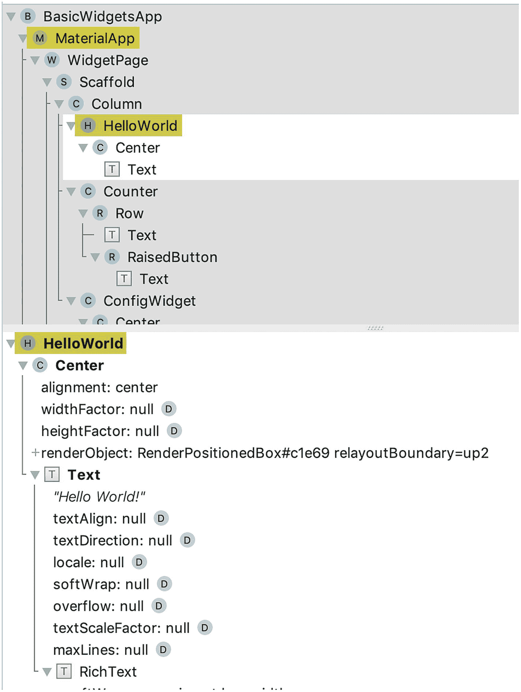
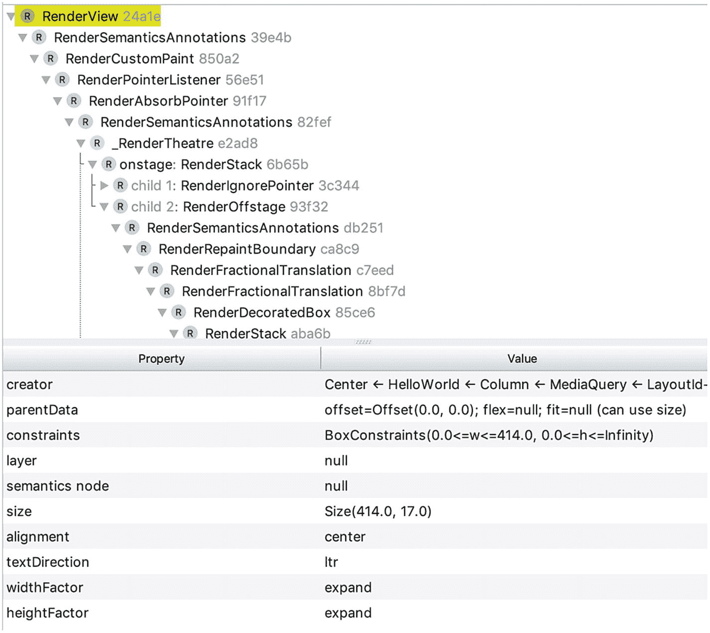

# 4.小部件基础

在构建 Flutter 应用时，大部分时间你都在处理小部件。本章提供了关于 Flutter 中窗口小部件的基本背景信息。它还介绍了几个显示文本、图像、图标、按钮和占位符的基本小部件。

## 4.1 了解小部件

### 问题

你想知道如何在 Flutter 中使用组件。

### 解决办法

在 Flutter 中，小部件无处不在。

### 讨论

如果你已经参与了用户界面的开发，你应该熟悉像部件或组件这样的概念。这些概念代表了创建用户界面的可重用构件。一个好的用户界面库应该有大量的高质量且易于使用的组件。按钮、图标、图像、菜单、对话框和表单输入都是组件的例子。组件可大可小。复杂组件通常由小组件组成。您可以通过遵循组件模型来创建自己的组件。您还可以选择将您的组件共享给社区。良好的组件生态系统是用户界面库成功的关键因素。

Flutter 使用小部件来描述用户界面中可重用的构件。与其他库相比，Flutter 中的小部件是一个更广泛的概念。不仅按钮和表单输入等常见组件是窗口小部件，布局约束在 Flutter 中也表示为窗口小部件。例如，如果您想将一个小部件放在一个框的中央，您只需将这个小部件包装成一个`Center`小部件。小部件也用于检索上下文数据。例如，`DefaultTextStyle`小部件得到的`TextStyle`应用于未样式化的`Text`小部件。

Flutter 中的小部件是用户界面一部分的不可变描述。小部件类的所有字段都是最终的，并在构造函数中设置。小部件构造函数只有命名参数。一个部件可以有一个或多个部件作为子部件。Flutter 应用的小部件创建了一个树状层次结构。Flutter 应用入口点文件的`main()`方法使用`runApp()`方法启动应用。`runApp()`的唯一参数是一个`Widget`对象。这个`Widget`对象是应用小部件树的根。小部件只是静态配置，描述如何配置层次结构中的子树。为了实际运行这个应用，我们需要一种方法来管理小部件的实例化。

Flutter 使用`Element`来表示树中特定位置的`Widget`的实例化。一个`Widget`可以被实例化零次或多次。将 T3 转变为 T4 的过程叫做膨胀。`Widget`类有一个`createElement()`方法来将小部件膨胀为`Element`的具体实例。Flutter 框架负责管理元素的生命周期。与元素相关联的窗口小部件可能会随着时间而改变。框架更新元素以使用新的配置。

当运行应用时，Flutter framework 负责渲染元素以创建渲染树，因此最终用户可以实际看到用户界面。渲染树由根为`RenderView`的`RenderObject`组成。如果你使用的是 Android Studio，你可以在 **Flutter Inspector** 视图中看到窗口小部件树和渲染树。选择查看➤工具窗口➤颤振检查器打开颤振检查器视图。图 [4-1](#Fig1) 显示了 Flutter Inspector 中的 widgets 树。顶部面板显示小部件树，而底部面板显示小部件的详细信息。



图 4-1

颤振检查器中的 Widgets 树

图 [4-2](#Fig2) 显示了颤振检查器中的渲染树。根是一个`RenderView`。



图 4-2

在颤振检查器中渲染树

## 4.2 了解构建上下文

### 问题

您想要访问与小部件树中的小部件相关的信息。

### 解决办法

`WidgetBuilder`函数有一个`BuildContext`参数，用于访问小部件树中与小部件相关的信息。你可以在`StatelessWidget.build()`和`State.build()`方法中看到`BuildContext`。

### 讨论

当构建小部件时，小部件在小部件树中的位置可能决定其行为，特别是当它有一个`InheritedWidget`作为其祖先时。`BuildContext`类提供了访问位置相关信息的方法；见表 [4-1](#Tab1) 。

表 4-1

构建上下文的方法

<colgroup><col class="tcol1 align-left"> <col class="tcol2 align-left"></colgroup> 
| 

名字

 | 

描述

 |
| --- | --- |
| `ancestorInheritedElementForWidgetOfExactType` | 获取与给定类型的`InheritedWidget`的最近祖先小部件对应的`InheritedElement`。 |
| `ancestorRenderObjectOfType` | 获取最近的祖先`RenderObjectWidget`小部件的`RenderObject`。 |
| `ancestorStateOfType` | 获取最近祖先`StatefulWidget`小部件的`State`对象。 |
| `rootAncestorStateOfType` | 获取最远祖先`StatefulWidget`小部件的`State`对象。 |
| `ancestorWidgetOfExactType` | 获取最近的祖先`Widget`。 |
| `findRenderObject` | 获取小部件的当前`RenderObject`。 |
| `inheritFromElement` | 用给定的祖先`InheritedElement`注册这个`BuildContext`，以便当祖先的小部件改变时，这个`BuildContext`被重建。 |
| `inheritFromWidgetOfExactType` | 获取给定类型的最接近的`InheritedWidget`并注册这个`BuildContext`，以便当小部件改变时，这个`BuildContext`被重建。 |
| `visitAncestorElements` | 访问祖先元素。 |
| `visitChildElements` | 访问子元素。 |

`BuildContext`其实是`Element`类的接口。在`StatelessWidget.build()`和`State.build()`方法中，`BuildContext`对象表示当前小部件膨胀的位置。在清单 [4-1](#PC1) 中，`ancestorWidgetOfExactType()`方法用于获取类型`Column`的祖先小部件。

```java
class WithBuildContext extends StatelessWidget {
  @override
  Widget build(BuildContext context) {
    Column column = context.ancestorWidgetOfExactType(Column);
    return Text(column.children.length.toString());
  }
}

Listing 4-1Use BuildContext

```

## 4.3 了解无状态小部件

### 问题

您希望创建一个没有可变状态的小部件。

### 解决办法

从`StatelessWidget`类扩展。

### 讨论

当使用一个 widget 来描述用户界面的一部分时，如果这个部分可以使用 widget 本身的配置信息和它所在的`BuildContext`来完整描述，那么这个 widget 应该从`StatelessWidget`扩展而来。当创建一个`StatelessWidget`类时，您需要实现接受一个`BuildContext`并返回一个`Widget`的`build()`方法。在清单 [4-2](#PC2) 中，`HelloWorld`类从`StatelessWidget`类扩展而来，并在`build()`方法中返回一个`Center`小部件。

```java
class HelloWorld extends StatelessWidget {
  const HelloWorld({Key key}) : super(key: key);

  @override
  Widget build(BuildContext context) {
    return Center(
      child: Text('Hello World!'),
    );
  }
}

Listing 4-2Example of StatelessWidget

```

## 4.4 了解有状态小部件

### 问题

您希望创建一个具有可变状态的小部件。

### 解决办法

从`StatefulWidget`类扩展。

### 讨论

如果用户界面的一部分可能动态变化，你需要从`StatefulWidget`类扩展。对于由它们创建的`State`对象中管理的状态，它们本身是不可变的。一个`StatefulWidget`子类需要实现返回一个`State<StatefulWidget>`对象的`createState()`方法。当状态改变时，`State`对象要调用`setState()`方法通知框架触发更新。在清单 [4-3](#PC3) 中，`_CounterState`类是`Counter`小部件的`State`对象。当按钮被按下时，值在`setState()`方法中被更新，该方法更新`_CounterState`小部件以显示新值。

```java
class Counter extends StatefulWidget {
  @override
  _CounterState createState() => _CounterState();
}

class _CounterState extends State<Counter> {
  int value = 0;

  @override
  Widget build(BuildContext context) {
    return Row(
      children: <Widget>[
        Text('$value'),
        RaisedButton(
          child: Text('+'),
          onPressed: () {
            setState(() {
              value++;
            });
          },
        ),
      ],
    );
  }
}

Listing 4-3Example of StatefulWidget

```

## 4.5 了解继承的小部件

### 问题

您希望沿着小部件树向下传播数据。

### 解决办法

从`InheritedWidget`类扩展。

### 讨论

当构建部件的子树时，您可能需要沿着部件树向下传播数据。例如，子树的根部件可能定义一些上下文数据，例如，从服务器检索的配置数据。子树中的其他小部件可能也需要访问上下文数据。一种可能的方法是将上下文数据添加到小部件的构造函数中，然后将数据作为子小部件的构造函数参数进行传播。这种解决方案的主要缺点是，您需要为子树中的所有小部件添加构造函数参数。尽管有些小部件可能实际上不需要数据，但是它们仍然需要将数据传递给它们的子部件。

更好的方法是使用`InheritedWidget`类。`BuildContext`类有一个`inheritFromWidgetOfExactType()`方法来获取特定类型`InheritedWidget`的最近实例。使用`InheritedWidget`，您可以将上下文数据存储在一个`InheritedWiget`实例中。如果小部件需要访问上下文数据，可以使用`inheritFromWidgetOfExactType()`方法获取实例并访问数据。如果一个继承的小部件改变了状态，它将导致它的消费者重新构建。

在清单 [4-4](#PC4) ，`ConfigWidget`类中有数据`config`。静态的`of()`方法为`config`值获取最近的祖先`ConfigWidget`实例。方法`updateShouldNotify()`确定何时应该通知消费者窗口小部件。

```java
class ConfigWidget extends InheritedWidget {
  const ConfigWidget({
    Key key,
    @required this.config,
    @required Widget child,
  })  : assert(config != null),
        assert(child != null),
        super(key: key, child: child);

  final String config;

  static String of(BuildContext context) {
    final ConfigWidget configWidget =
        context.inheritFromWidgetOfExactType(ConfigWidget);
    return configWidget?.config ?? ";
  }

  @override
  bool updateShouldNotify(ConfigWidget oldWidget) {
    return config != oldWidget.config;
  }
}

Listing 4-4Example of InheritedWidget

```

在清单 [4-5](#PC5) 中，`ConfigUserWidget`类使用`ConfigWidget.of()`方法获得`config`值。

```java
class ConfigUserWidget extends StatelessWidget {
  @override
  Widget build(BuildContext context) {
    return Text('Data is ${ConfigWidget.of(context)}');
  }
}

Listing 4-5Use of ConfigWidget

```

在清单 [4-6](#PC6) 中，`ConfigWidget`实例的`config`值为“Hello！”还有一个后裔`ConfigUserWidget`的实例。

```java
ConfigWidget(
  config: 'Hello!',
  child: Center(
    child: ConfigUserWidget(),
  ),
);

Listing 4-6Complete example

```

## 4.6 显示文本

### 问题

你想显示一些文本。

### 解决办法

使用`Text`和`RichText`小部件。

### 讨论

几乎所有的应用都需要向终端用户显示一些文本。Flutter 提供了几个与文本相关的类。`Text`和`RichText`是显示文本的两个小部件。事实上，`Text`内部使用`RichText`。`Text`小部件的`build()`方法返回一个`RichText`实例。`Text`和`RichText`的区别在于`Text`使用最近的封闭`DefaultTextStyle`对象的样式，而`RichText`需要显式样式。

### 文本

文本有两个构造函数。第一个构造函数`Text()`接受一个`String`作为要显示的文本。另一个构造函数`Text.rich()`接受一个`TextSpan`对象来表示文本和样式。创建`Text`小部件最简单的形式是`Text('Hello world')`，它使用最近的封装`DefaultTextStyle`对象的样式显示文本。`Text()`和`Text.rich()`构造函数都有几个命名参数来定制它们；参见表 [4-2](#Tab2) 。

表 4-2

Text()和 Text.rich()的命名参数

<colgroup><col class="tcol1 align-left"> <col class="tcol2 align-left"> <col class="tcol3 align-left"></colgroup> 
| 

名字

 | 

类型

 | 

描述

 |
| --- | --- | --- |
| `style` | `TextStyle` | 文本的样式。 |
| `textAlign` | `TextAlign` | 文本应如何水平对齐。 |
| `textDirection` | `TextDirection` | 文本的方向。 |
| `locale` | `Locale` | 基于 Unicode 选择字体的区域设置。 |
| `softWrap` | `bool` | 是否在软换行符处断开文本。 |
| `overflow` | `TextOverflow` | 如何处理文本溢出？ |
| `textScaleFactor` | `double` | 缩放文本的因子。 |
| `maxLines` | `int` | 最大行数。如果文本超出限制，它将根据溢出中指定的策略被截断。 |
| `semanticsLabel` | `String` | 文本的语义标签。 |

`TextAlign`是一个枚举类型，其值如表 [4-3](#Tab3) 所示。

表 4-3

文本对齐值

<colgroup><col class="tcol1 align-left"> <col class="tcol2 align-left"></colgroup> 
| 

名字

 | 

描述

 |
| --- | --- |
| `left` | 将文本与其容器的左边缘对齐。 |
| `right` | 将文本与其容器的右边缘对齐。 |
| `center` | 将文本在其容器的中心对齐。 |
| `justify` | 对于以软换行符结尾的文本行，拉伸这些行以填充容器的宽度；对于以硬换行符结尾的文本行，将它们向起始边缘对齐。 |
| `start` | 将文本与其容器的前缘对齐。对于从左到右的文本，前导边缘是左边缘，而对于从右到左的文本，前导边缘是右边缘。 |
| `end` | 将文本在其容器的后沿对齐。后缘与前缘相反。 |

建议始终使用`TextAlign`值`start`和`end`，而不是`left`和`right`，以便更好地处理双向文本。`TextDirection`是具有值`ltr`和`rtl`的枚举类型。`TextOverflow`是一个枚举类型，其值如表 [4-4](#Tab4) 所示。

表 4-4

文本溢出值

<colgroup><col class="tcol1 align-left"> <col class="tcol2 align-left"></colgroup> 
| 

名字

 | 

描述

 |
| --- | --- |
| `clip` | 剪裁溢出的文本。 |
| `fade` | 将溢出的文本渐变为透明。 |
| `ellipsis` | 在溢出的文本后添加省略号。 |

`DefaultTextStyle`是一个`InheritedWidget`，其属性`style`、`textAlign`、`softWrap`、`overflow`、`maxLines`与表 [4-2](#Tab2) 中的命名参数含义相同。如果在构造函数`Text()`和`Text.rich()`中提供了一个命名参数，那么提供的值会覆盖最近的祖先`DefaultTextStyle`对象中的值。清单 [4-7](#PC7) 展示了几个使用`Text`小部件的例子。

```java
Text('Hello World')

Text(
  'Bigger Bold Text',
  style: TextStyle(fontWeight: FontWeight.bold),
  textScaleFactor: 2.0,
);

Text(
  'Lorem ipsum dolor sit amet, consectetur adipiscing elit, sed do eiusmod tempor incididunt',
  maxLines: 1,
  overflow: TextOverflow.ellipsis,
);

Listing 4-7Examples of Text

```

### 文本扫描

构造函数`Text.rich()`将一个`TextSpan`对象作为必需的参数。`TextSpan`代表一段不可变的文本。`TextSpan()`构造函数有四个命名参数；参见表 [4-5](#Tab5) 。`TextSpan`组织是有等级制度的。一个`TextSpan`对象可能有许多`TextSpan`对象作为子对象。子元素可以覆盖父元素的样式。

表 4-5

TextSpan()的命名参数

<colgroup><col class="tcol1 align-left"> <col class="tcol2 align-left"> <col class="tcol3 align-left"></colgroup> 
| 

名字

 | 

类型

 | 

描述

 |
| --- | --- | --- |
| `style` | `TextStyle` | 文本和子对象的样式。 |
| `text` | `String` | 范围中的文本。 |
| `children` | `List<TextSpan>` | 作为这个跨度的孩子。 |
| `recognizer` | `GestureRecognizer` | 接收事件的手势识别器。 |

清单 [4-8](#PC8) 展示了使用`Text.rich()`的例子。此示例使用不同的样式显示句子“快速的棕色狐狸跳过懒惰的狗”。

```java
Text.rich(TextSpan(
  style: TextStyle(
    fontSize: 16,
  ),
  children: [
    TextSpan(text: 'The quick brown '),
    TextSpan(
        text: 'fox',
        style: TextStyle(
          fontWeight: FontWeight.bold,
          color: Colors.red,
        )),
    TextSpan(text: ' jumps over the lazy '),
    TextSpan(
        text: 'dog',
        style: TextStyle(
          color: Colors.blue,
        )),
  ],
));

Listing 4-8Example of Text.rich()

```

### 法官文本

`RichText`总是使用`TextSpan`对象来表示文本和样式。`RichText()`构造函数有一个`TextSpan`类型的必需命名参数`text`。它还有可选的命名参数`textAlign`、`textDirection`、`softWrap`、`overflow`、`textScaleFactor`、`maxLines`和`locale`。这些可选的命名参数与表 [4-2](#Tab2) 中的`Text()`构造函数含义相同。

显示在`RichText`中的文本需要明确的样式。您可以使用`DefaultTextStyle.of()`从`BuildContext`对象中获取默认样式。这正是`Text`在内部做的事情。`Text`小部件获取默认样式，并与样式参数中提供的样式合并，然后创建一个`RichText`，用一个`TextSpan`包装文本和合并的样式。如果你发现你确实需要使用默认样式作为基础，你应该直接使用`Text`而不是`RichText`。清单 [4-9](#PC9) 显示了一个使用`RichText`的例子。

```java
RichText(
  text: TextSpan(
    text: 'Level 1',
    style: TextStyle(color: Colors.black),
    children: [
      TextSpan(
        text: 'Level 2',
        style: TextStyle(fontWeight: FontWeight.bold),
        children: [
          TextSpan(
            text: 'Level 3',
            style: TextStyle(color: Colors.red),
          ),
        ],
      ),
    ],
  ),
);

Listing 4-9Example of RichText

```

## 4.7 对文本应用样式

### 问题

您希望显示的文本具有不同的样式。

### 解决办法

用`TextStyle`来描述风格。

### 讨论

`TextStyle`描述应用于文本的样式。`TextStyle()`构造函数有很多命名参数来描述样式；见表 [4-6](#Tab6) 。

表 4-6

TextStyle()的命名参数

<colgroup><col class="tcol1 align-left"> <col class="tcol2 align-left"> <col class="tcol3 align-left"></colgroup> 
| 

名字

 | 

类型

 | 

描述

 |
| --- | --- | --- |
| `color` | `Color` | 文本的颜色。 |
| `fontSize` | `Double` | 字体大小。 |
| `fontWeight` | `FontWeight` | 字体粗细。 |
| `fontStyle` | `FontStyle` | 字体变体。 |
| `letterSpacing` | `Double` | 每个字母之间的间隔。 |
| `wordSpacing` | `Double` | 每个单词之间的空格。 |
| `textBaseLine` | `TextBaseLine` | 将此文本范围与其父范围对齐的公共基线。 |
| `height` | `Double` | 文本的高度。 |
| `locale` | `Locale` | 用于选择区域特定标志符号的区域设置。 |
| `foreground` | `Paint` | 文本的前景。 |
| `background` | `Paint` | 文本的背景。 |
| `shadows` | `List<Shadow>` | 文本下面画的阴影。 |
| `decoration` | `TextDecoration` | 文本的修饰。 |
| `decorationColor` | `Color` | 文本装饰的颜色。 |
| `decorationStyle` | `TextDecorationStyle` | 文本装饰的样式。 |
| `debugLabel` | `String` | 调试样式的描述。 |
| `fontFamily` | `String` | 字体的名称。 |
| `package` | `String` | 如果字体是在包中定义的，与`fontFamily`一起使用。 |

`FontWeight`类定义值`w100`、`w200`、`w300`、`w400`、`w500`、`w600`、`w700`、`w800`、`w900`。`FontWeight.w100`最薄，而`w900`最厚。`FontWeight.bold`是`FontWeight.w700`的别名，而`FontWeight.normal`是`FontWeight.w400`的别名。`FontStyle`是具有两个值`italic`和`normal`的枚举类型。`TextBaseline`是具有值`alphabetic`和`ideographic`的枚举类型。

`TextDecoration`类定义了不同类型的文本装饰。您还可以使用构造函数`TextDecoration.combine()`通过组合一系列`TextDecoration`实例来创建一个新的`TextDecoration`实例。例如，`TextDecoration.combine([TextDecoration.underline, TextDecoration.overline])`实例在文本的上面和下面画线。表 [4-7](#Tab7) 显示了`TextDecoration`中的常数。

表 4-7

文本装饰常数

<colgroup><col class="tcol1 align-left"> <col class="tcol2 align-left"></colgroup> 
| 

名字

 | 

描述

 |
| --- | --- |
| `none` | 没有装饰。 |
| `underline` | 在文本下面画一条线。 |
| `overline` | 在文本上方画一条线。 |
| `lineThrough` | 在文本中画一条线。 |

`TextDecorationStyle`是一个枚举类型，其值如表 [4-8](#Tab8) 所示。`TextDecorationStyle`定义由`TextDecoration`创建的线条的样式。

表 4-8

文本修饰 Style values

<colgroup><col class="tcol1 align-left"> <col class="tcol2 align-left"></colgroup> 
| 

名字

 | 

描述

 |
| --- | --- |
| `solid` | 画一条实线。 |
| `double` | 画两条线。 |
| `dotted` | 画一条虚线。 |
| `dashed` | 画一条虚线。 |
| `wavy` | 画一条正弦曲线。 |

清单 [4-10](#PC10) 显示了一个使用`TextDecoration`和`TextDecorationStyle`的例子。

```java
Text(
  'Decoration',
  style: TextStyle(
    fontWeight: FontWeight.w900,
    decoration: TextDecoration.lineThrough,
    decorationStyle: TextDecorationStyle.dashed,
  ),
);

Listing 4-10Example of using TextDecoration and TextDecorationStyle

```

如果您想要创建一个更新了一些属性的`TextStyle`实例的副本，那么使用`copyWith()`方法。`apply()`方法也创建了一个新的`TextStyle`实例，但是它允许使用 factor 和 delta 更新一些属性。例如，命名参数`fontSizeFactor`和`fontSizeDelta`可以更新字体大小。用`"fontSize * fontSizeFactor + fontSizeDelta"`计算`fontSize`的更新值。您也可以使用相同的模式更新`height`、`letterSpacing`和`wordSpacing`的值。对于`fontWeight`，仅支持`fontWeightDelta`。在清单 [4-11](#PC11) 中，应用于文本的`TextStyle`更新了`fontSize`和`decoration`的值。

```java
Text(
  'Scale',
  style: DefaultTextStyle.of(context).style.apply(
        fontSizeFactor: 2.0,
        fontSizeDelta: 1,
        decoration: TextDecoration.none,
      ),
);

Listing 4-11Update TextStyle

```

## 4.8 显示图像

### 问题

您想要显示从网络加载的图像。

### 解决办法

使用带有图像 URL 的`Image.network()`来加载和显示图像。

### 讨论

如果您在自己的服务器或其他地方托管了图像，您可以使用`Image.network()`构造函数来显示它们。`Image.network()`构造函数只需要加载图片的 URL。应该使用命名参数`width`和`height`为图像小部件指定特定的尺寸，或者将其放在设置严格布局约束的上下文中。这是因为加载图像时，图像的尺寸可能会改变。如果没有严格的大小限制，图像小部件可能会影响其他小部件的布局。在清单 [4-12](#PC12) 中，图像小部件的大小由命名参数`width`和`height`指定。

```java
Image.network(
  'https://picsum.photos/400/300',
  width: 400,
  height: 300,
);

Listing 4-12Example of Image.network()

```

所有下载的图像都被缓存，不管 HTTP 头。这意味着所有 HTTP 缓存控制头都将被忽略。您可以使用缓存克星来强制刷新缓存的图像。例如，您可以向图像 URL 添加一个随机字符串。

如果加载图像需要额外的 HTTP 头，您可以指定类型为`Map<String, String>`的`headers`参数来提供这些头。一个典型的用例是加载需要 HTTP 头进行身份验证的受保护图像。

如果一个图像不能覆盖一个盒子的整个区域，你可以使用类型`ImageRepeat`的`repeat`参数来指定图像如何重复。`ImageRepeat`是一个枚举类型，其值如表 [4-9](#Tab9) 所示。默认值为`noRepeat`。

表 4-9

图像重复值

<colgroup><col class="tcol1 align-left"> <col class="tcol2 align-left"></colgroup> 
| 

名字

 | 

描述

 |
| --- | --- |
| `Repeat` | 在 x 和 y 两个方向重复。 |
| `repeatX` | 仅在 x 方向重复。 |
| `repeatY` | 仅在 y 方向重复。 |
| `noRepeat` | 不重复。未覆盖的区域将是透明的。 |

在清单 [4-13](#PC13) 中，图像被放入一个比图像大的`SizedBox`中。通过使用`ImageRepeat.repeat`，该框被该图像填充。

```java
SizedBox(
  width: 400,
  height: 300,
  child: Image.network(
    'https://picsum.photos/300/200',
    alignment: Alignment.topLeft,
    repeat: ImageRepeat.repeat,
  ),
);

Listing 4-13Repeated images

```

## 4.9 显示图标

### 问题

你想用图标。

### 解决办法

使用图标显示材料设计中的图标或社区中的图标包。

### 讨论

图标在移动应用中被广泛使用。与文本相比，图标在表达同样的语义时占用更少的屏幕空间。图标可以由字体符号或图像创建。`Icon`小部件是用字体字形绘制的。一个字体字形用`IconData`类描述。要创建一个`IconData`实例，字体中该图标的 Unicode 码位是必需的。

`Icons`类有许多预定义的`IconData`常量用于材质设计中的图标([https://Material . io/tools/icons/](https://material.io/tools/icons/))。例如，`Icons.call`是名为“通话”的图标的`IconData`常量。如果应用使用材料设计，那么这些图标可以开箱即用。`CupertinoIcons`类有许多为 iOS 风格图标预定义的`IconData`常量。

`Icon()`构造函数已经命名了参数`size`和`color`来分别指定图标的大小和颜色。图标总是正方形的，宽度和高度都与大小相等。size 的默认值是 24。清单 [4-14](#PC14) 创建一个大小为 100 的红色`Icons.call`图标。

```java
Icon(
  Icons.call,
  size: 100,
  color: Colors.red,
);

Listing 4-14Example of Icon()

```

要使用流行的字体牛逼图标，可以使用包`font_awesome_flutter` ( [`https://pub.dartlang.org/packages/font_awesome_flutter`](https://pub.dartlang.org/packages/font_awesome_flutter) )。将包依赖关系添加到`pubspec.yaml`文件后，您可以导入该文件以使用`FontAwesomeIcons`类。类似于`Icons`类，`FontAwesomeIcons`类有许多`IconData`常量，用于 Awesome 字体中的不同图标。清单 [4-15](#PC15) 创建一个大小为 80 的蓝色`FontAwesomeIcons.angry`图标。

```java
Icon(
  FontAwesomeIcons.angry,
  size: 80,
  color: Colors.blue,
);

Listing 4-15Use Font Awesome icon

```

## 4.10 使用带文本的按钮

### 问题

你想使用带有文本的按钮。

### 解决办法

使用按钮部件`FlatButton`、`RaisedButton`、`OutlineButton`和`CupertinoButton`。

### 讨论

Flutter 有不同类型的按钮用于材质设计和 iOS。这些按钮部件都有一个必需的参数`onPressed`来指定按下时的处理函数。如果`onPressed`处理器是`null`，按钮被禁用。按钮的内容由类型为`Widget`的参数`child`指定。`FlatButton`、`RaisedButton`和`OutlineButton`对触摸有不同的风格和行为反应:

*   一个`FlatButton`有零海拔和没有可见的边界。它通过填充由`highlightColor`指定的颜色来对触摸做出反应。

*   一个`RaisedButton`有高程，用颜色填充。它通过将仰角增加到`highlightElevation`来对触摸做出反应。

*   一个`OutlineButton`有边界，初始高度为 0.0，背景透明。它对触摸的反应是用颜色使其背景不透明，并将其高度增加到`highlightElevation`。

应该用在工具栏、对话框、卡片上，或者内嵌在其他有足够空间让按钮显而易见的地方。`RaisedButton` s 应该用在使用空间不足以让按钮突出的地方。`OutlineButton`是`RaisedButton`和`FlatButton`的杂交。`OutlineButton` s 可以在`FlatButton` s 和`RaisedButton` s 都不合适的情况下使用。

如果你更喜欢 iOS 风格的按钮，你可以使用`CupertinoButton`小部件。`CupertinoButton`通过渐出和渐入对触摸做出反应。清单 [4-16](#PC16) 展示了创建不同类型按钮的例子。

```java
FlatButton(
  child: Text('Flat'),
  color: Colors.white,
  textColor: Colors.grey,
  highlightColor: Colors.red,
  onPressed: () => {},
);

RaisedButton(
  child: Text('Raised'),
  color: Colors.blue,
  onPressed: () => {},
);

OutlineButton(
  child: Text('Outline'),
  onPressed: () => {},
);

CupertinoButton(
  child: Text('Cupertino'),
  color: Colors.green,
  onPressed: () => {},
);

Listing 4-16Different types of buttons

```

## 4.11 使用带图标的按钮

### 问题

你想使用带有图标的按钮。

### 解决办法

使用`IconButton`控件、`FlatButton.icon()`、`RaisedButton.icon()`和`OutlineButton.icon()`。

### 讨论

创建带有图标的按钮有两种方法。如果只有图标就够了，使用`IconButton` widget。如果图标和文本都需要，使用构造函数`FlatButton.icon()`、`RaisedButton.icon()`或`OutlineButton.icon()`。

`IconButton`构造函数需要`icon`参数来指定图标。`FlatButton.icon()`、`RaisedButton.icon()`和`OutlineButton.icon()`分别使用参数`icon`和`label`来指定图标和文本。清单 [4-17](#PC17) 显示了使用`IconButton()`和`RaisedButton.icon()`的例子。

```java
IconButton(
  icon: Icon(Icons.map),
  iconSize: 50,
  tooltip: 'Map',
  onPressed: () => {},
);

RaisedButton.icon(
  icon: Icon(Icons.save),
  label: Text('Save'),
  onPressed: () => [],
);

Listing 4-17Examples of IconButton() and RaisedButton.icon()

```

## 4.12 添加占位符

### 问题

您希望添加占位符来表示稍后将添加的小部件。

### 解决办法

使用占位符。

### 讨论

在实现一个应用的界面之前，你通常对这个应用的外观有一个基本的概念。您可以从将界面分解成许多小部件开始。您可以在开发过程中使用占位符来表示未完成的小部件，这样您就可以测试其他小部件的布局。例如，如果您需要创建两个小部件，一个显示在顶部，而另一个显示在底部。如果您选择首先创建底部小部件，并为顶部小部件使用占位符，您可以在所需位置看到底部小部件。

`Placeholder()`构造函数接受命名参数`color`、`strokeWidth`、`fallbackWidth`和`fallbackHeight`。占位符被绘制为一个矩形和两条对角线。参数`color`和`strokeWidth`分别指定线条的颜色和宽度。默认情况下，占位符适合其容器。然而，如果占位符的容器是无界的，它使用给定的`fallbackWidth`和`fallbackHeight`来确定大小。`fallbackWidth`和`fallbackHeight`都有默认值`400.0`。清单 [4-18](#PC18) 显示了一个`Placeholder`小部件的例子。

```java
Placeholder(
  color: Colors.red,
  strokeWidth: 1,
  fallbackHeight: 200,
  fallbackWidth: 200,
);

Listing 4-18Example of Placeholder

```

## 4.13 总结

微件在 Flutter 应用中无处不在。本章提供了对 Flutter 中控件的基本介绍，包括`StatelessWidget`、`StatefulWidget`和`InheritedWidget`。本章还介绍了显示文本、图像、图标、按钮和占位符的常用基本小部件的用法。下一章将讨论颤振中的布局。