# 6.表单小部件

在移动应用中，表单控件对于与用户进行交互非常重要。Flutter 提供了一组用于材质设计和 iOS 风格的表单小部件。这些表单小部件通常没有内部状态。它们的外观和行为完全由构造函数参数定义。有了祖先小部件中维护的状态，表单小部件被重新呈现以反映状态变化。本章介绍了表单小部件的基本用法。

## 6.1 收集文本输入

### 问题

您希望收集文本输入。

### 解决办法

材质设计使用 TextField，iOS 风格使用 CupertinoTextField。

### 讨论

要在 Flutter 应用中收集用户输入，可以使用 TextField widget 进行材质设计，或者使用 CupertinoTextField widget 进行 iOS 风格设计。这两种小部件具有相似的使用模式和行为。事实上，这两个小部件包装了相同的可编辑文本，该文本提供了基本的文本输入功能，并支持滚动、选择和光标移动。EditableText 是一个高度可定制的小部件，具有许多命名参数。这个菜谱重点介绍如何设置 TextField 或 CupertinoTextField 小部件的初始值，并从中获取文本。

可编辑文本小部件的文本由 TextEditingController 实例控制。创建新的 EditableText 小部件时，可以使用 controller 参数设置 TextEditingController 实例。控制器维护与相应的 EditableText 小部件的双向数据绑定。控制器有一个 text 属性来跟踪当前编辑的文本，还有一个 TextSelection 类型的 selection 属性来跟踪当前选定的文本。每当用户修改或选择 EditableText 小部件中的文本时，关联的 TextEditingController 实例的 text 和 selection 属性都会更新。如果修改 TextEditingController 实例的文本或选择属性，EditableText 小部件将会自我更新。TextEditingController 类是 ValueNotifier <texteditingvalue>的子类，因此您可以向控制器添加侦听器，以便在文本或选择发生变化时获得通知。创建新的 TextEditingController 实例时，可以用 text 参数传递一些文本，这些文本将成为相应的 EditableText 小部件的初始文本。</texteditingvalue>

让我们看看从 EditableText 小部件获取文本的三种不同方式。

### 使用 TextEditingController

第一种方式是使用 TextEditingController。清单 [6-1](#PC1) 中的 ReverseText 小部件用于反转输入字符串。使用初始文本“<输入>创建 TextEditingController 实例。当按下按钮时，_value 更新为从控制器中检索的文本。将显示反转的字符串。

```java
class ReverseText extends StatefulWidget {
  @override
  _ReverseTextState createState() => _ReverseTextState();
}

class _ReverseTextState extends State<ReverseText> {
  final TextEditingController _controller = TextEditingController(
    text: "<input>",
  );
  String _value;

  @override
  Widget build(BuildContext context) {
    return Column(
      crossAxisAlignment: CrossAxisAlignment.start,
      children: <Widget>[
        Row(
          children: <Widget>[
            Expanded(
              child: TextField(
                controller: _controller,

              ),
            ),
            RaisedButton(
              child: Text('Go'),
              onPressed: () {
                this.setState(() {
                  _value = _controller.text;
                });
              },
            ),
          ],
        ),
        Text( (_value ?? "). split(").reversed.join()),
      ],
    );

  }
}

Listing 6-1Use TextEditingController to get text

```

图 [6-1](#Fig1) 显示了清单 [6-1](#PC1) 中的代码截图。

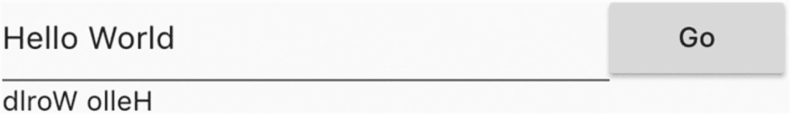

图 6-1

使用 TextEditingController

### 使用 TextEditingController 的侦听器

TextEditingController 实例也是 ValueNotifier <texteditingvalue>的实例，因此您可以向它添加侦听器并对通知做出反应。在清单 [6-2](#PC2) 中，监听器 function _handleTextChanged 在收到变更通知时调用 setState()函数来更新状态。侦听器在 initState()函数中添加，在 dispose()函数中删除，这确保资源得到正确清理。</texteditingvalue>

```java
class ReverseTextWithListener extends StatefulWidget {
  @override
  _ReverseTextWithListenerState createState() =>
      _ReverseTextWithListenerState();
}

class _ReverseTextWithListenerState extends State<ReverseTextWithListener> {
  TextEditingController _controller;
  String _value;

  @override
  void initState() {
    super.initState();
    _controller = TextEditingController(
      text: "<input>",
    );
    _controller.addListener(_handleTextChanged);
  }

  @override
  Widget build(BuildContext context) {
    return Column(
      crossAxisAlignment: CrossAxisAlignment.start,
      children: <Widget>[
        TextField(
          controller: _controller,
        ),
        Text( (_value ?? "). split(").reversed.join()),
      ],
    );
  }

  @override

  void dispose() {
    _controller.removeListener(_handleTextChanged);
    super.dispose();
  }

  void _handleTextChanged() {
    this.setState(() {
      this._value = _controller.text;
    });
  }
}

Listing 6-2Use TextEditingController listener

```

图 [6-2](#Fig2) 显示了清单 [6-2](#PC2) 中的代码截图。

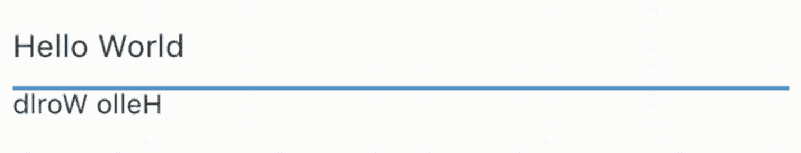

图 6-2

使用 TextEditingController 侦听器

### 使用回调

从 EditableText 小部件获取文本的最后一种方法是使用回调。与文本编辑相关的回调有三种类型；见表 [6-1](#Tab1) 。

表 6-1

可编辑文本回调

<colgroup><col class="tcol1 align-left"> <col class="tcol2 align-left"> <col class="tcol3 align-left"></colgroup> 
| 

名字

 | 

类型

 | 

描述

 |
| --- | --- | --- |
| `onChanged` | 值已更改 | 当文本改变时调用。 |
| `onEditingComplete` | 无效回拨 | 当用户提交文本时调用。 |
| `onSubmitted` | 值已更改 | 当用户完成编辑文本时调用。 |

如果你想主动观察文本的变化，你应该使用 onChanged 回调。当用户完成编辑文本时，onEditingComplete 和 onSubmitted 回调都将被调用。区别在于 onEditingComplete 回调不提供对提交文本的访问。

在清单 [6-3](#PC3) 中，不同的消息被记录在不同的回调中。所有日志消息都显示在 RichText 小部件中。

```java
class TextFieldCallbacks extends StatefulWidget {
  @override
  _TextFieldCallbacksState createState() => _TextFieldCallbacksState();
}

class _TextFieldCallbacksState extends State<TextFieldCallbacks> {
  List<String> _logs = List();

  void _log(String value) {
    this.setState(() {
      this._logs.add(value);
    });
  }

  @override

  Widget build(BuildContext context) {
    return Column(
      crossAxisAlignment: CrossAxisAlignment.start,
      children: <Widget>[
        TextField(
          onChanged: (text) => _log('changed: $text'),
          onEditingComplete: () => _log('completed'),
          onSubmitted: (text) => _log('submitted: $text'),
        ),
        Text.rich(TextSpan(
          children: this._logs.map((log) => TextSpan(text: '$log\n')).toList(),
        )),
      ],
    );
  }
}

Listing 6-3EditableText callbacks

```

图 [6-3](#Fig3) 显示了清单 [6-3](#PC3) 中的代码截图。

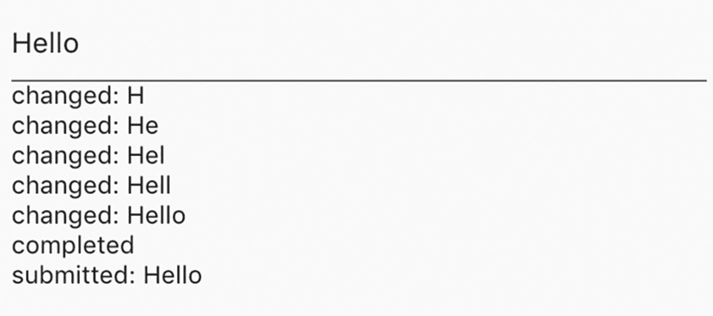

图 6-3

可编辑文本回调

尽管清单 [6-1](#PC1) 、 [6-2](#PC2) 和 [6-3](#PC3) 中的例子使用了 TextField，但同样的模式也可以应用于 CupertinoTextField。

## 6.2 自定义文本输入键盘

### 问题

您想要自定义用于编辑文本的键盘。

### 解决办法

使用 keyboardType、textInputAction 和 keyboardAppearance 参数。

### 讨论

EditableText 小部件允许定制用于编辑文本的键盘。可以使用 TextInputType 类的 keyboardType 参数来设置适合文本的键盘类型。例如，如果 EditableText 小部件用于编辑电话号码，那么 TextInputType.phone 是 keyboardType 参数的更好选择。表 [6-2](#Tab2) 显示了 TextInputType 中的常量。TextInputType.number 常量用于不带小数点的无符号数字。对于其他类型的数字，可以使用 textinputtype . numberwithoptions({ bool signed:false，bool decimal: false })构造函数来设置数字是应该带符号还是应该包含小数点。

表 6-2

TextInputType 常量

<colgroup><col class="tcol1 align-left"> <col class="tcol2 align-left"></colgroup> 
| 

名字

 | 

描述

 |
| --- | --- |
| `text` | 纯文本。 |
| `multiline` | 多行文本。 |
| `number` | 不带小数点的无符号数。 |
| `phone` | 电话号码。 |
| `datetime` | 日期和时间。 |
| `emailAddress` | 电子邮件地址。 |
| `url` | 网址。 |

TextInputAction 枚举类型的 textInputAction 参数设置用户提交文本时要执行的逻辑操作。例如，如果文本字段用于输入搜索查询，那么 TextInputAction.search 值使键盘显示文本“search”。用户可以期望在点击动作按钮之后执行搜索动作。TextInputAction 枚举定义了一组操作。这些操作的按钮在不同平台或同一平台的不同版本上可能有不同的外观。Android 和 iOS 都支持这些操作。它们被映射到 Android 上的 IME 输入类型和 iOS 上的键盘返回类型。表 [6-3](#Tab3) 显示了 TextInputAction 的值及其在 Android 和 iOS 上的映射。某些操作可能仅在 Android 或 iOS 上受支持。使用不支持的操作将导致在调试模式下引发错误。但是在发布模式下，不支持的动作会分别映射到 Android 上的 IME _ 动作 _ 未指定和 iOS 上的 UIReturnKeyDefault。

表 6-3

TextInputAction 值

<colgroup><col class="tcol1 align-left"> <col class="tcol2 align-left"> <col class="tcol3 align-left"></colgroup> 
| 

名字

 | 

安卓 IME 输入类型

 | 

iOS 键盘返回类型

 |
| --- | --- | --- |
| `none` | IME_ACTION_NONE(无) | 不适用的 |
| `unspecified` | IME _ 行动 _ 未指明 | UIReturnKeyDefault 默认 |
| `done` | IME _ 行动 _ 完成 | UIReturnKeyDone |
| `search` | IME _ 行动 _ 搜索 | UIReturnKeySearch |
| `send` | IME _ 行动 _ 发送 | UIReturnKeySend |
| `next` | IME _ 行动 _ 下一步 | UIReturnKeyNext |
| `previous` | IME _ 行动 _ 先前 | 不适用的 |
| `continueAction` | 不适用的 | UIReturnKeyContinue |
| `join` | 不适用的 | UIReturnKeyJoin |
| `route` | 不适用的 | UIReturnKeyRoute |
| `emergencyCall` | 不适用的 | UIReturnKeyEmergencyCall |
| `newline` | IME_ACTION_NONE(无) | UIReturnKeyDefault 默认 |

Brightness 类型的最后一个 keyboardAppearance 参数设置键盘的外观。亮度枚举有两个值，暗和亮。该参数仅用于 iOS。

清单 [6-4](#Par23) 显示了 textInputAction 和 last keyboardAppearance 参数的用法。

*清单 6-4。键盘类型和键盘外观参数*

```java
TextField(
  keyboardType: TextInputType.phone,
)

TextField(
  keyboardType: TextInputType.numberWithOptions(
    signed: true,
    decimal: true,
  ),
)

TextField(
  textInputAction: TextInputAction.search,
  keyboardAppearance: Brightness.dark,
)

```

## 6.3 在材料设计中为文本输入添加装饰

### 问题

您希望在材料设计中为文本字段添加前缀和后缀等装饰。

### 解决办法

使用 InputDecoration 类型的装饰参数。

### 讨论

TextField widget 支持添加不同的装饰来向用户呈现各种信息。例如，如果文本输入的值无效，您可以在文本输入下方添加红色边框和一些文本来表明这一点。您还可以添加文本或图标作为前缀或后缀。如果 TextField 小部件用于编辑货币值，您可以添加一个货币符号作为前缀。TextField 的 InputDecoration 类型的修饰参数用于添加此信息。InputDecoration 类有许多命名参数，我们将在接下来查看这些参数。

### 边界

让我们从给文本输入小部件添加边框开始。InputDecoration 构造函数有几个与边框相关的 InputBorder 类型的参数，包括 errorBorder、disabledBorder、focusedBorder、focusedErrorBorder 和 enabledBorder。这些参数的名称表示这些边界何时会根据状态显示。还有一个边框参数，但是这个参数只用来提供边框的形状。

InputBorder 类是抽象的，因此应该使用它的一个子类 UnderlineInputBorder 或 OutlineInputBorder。UnderlineInputBorder 类只有底边有边框。UnderlineInputBorder 构造函数具有 borderSide 类型的参数 BorderSide 和 borderRadius 类型的参数 BorderRadius。BorderSide 类定义边框一边的颜色、宽度和样式。边框样式由 BorderStyle 枚举定义，其值为 none 和 solid。具有样式 BorderStyle.none 的 BorderSide 将不被呈现。BorderRadius 类为矩形的每个角定义了一组半径。拐角的半径是使用半径类创建的。半径的形状可以是圆形或椭圆形。可以分别使用构造函数 Radius.circular(double radius)和 radius . elliptic(double x，double y)创建圆形或椭圆形半径。BorderRadius 具有 Radius 类型的 topLeft、topRight、bottomLeft 和 bottomRight 属性来表示这四个角的半径。可以使用 BorderRadius.only()为每个角指定不同的 Radius 实例，或者使用 BorderRadius.all()为所有角使用单个 Radius 实例。

OutlineInputBorder 类在小部件周围绘制一个矩形。OutlineInputBorder 构造函数也有参数 borderSide 和 borderRadius。它还具有 gapPadding 参数，用于指定在边框间隙中显示的标签文本的水平填充。

在清单 [6-5](#PC5) 中，两个 TextField 小部件都声明了当它们使用 focusedBorder 参数获得焦点时呈现的边框。

```java
TextField(
  decoration: InputDecoration(
    enabledBorder: UnderlineInputBorder(
      borderSide: BorderSide(color: Colors.red),
      borderRadius: BorderRadius.all(Radius.elliptical(5, 10)),
    ),
  ),
)

TextField(
  decoration: InputDecoration(
    labelText: 'Username',
    focusedBorder: OutlineInputBorder(
      borderSide: BorderSide(color: Colors.blue),
      borderRadius: BorderRadius.circular(10),
      gapPadding: 2,
    ),
  ),
)

Listing 6-5Examples of InputDecoration

```

图 [6-4](#Fig4) 显示了清单 [6-5](#PC5) 中的代码截图。第二个 TextField 被聚焦，因此显示聚焦的边框。

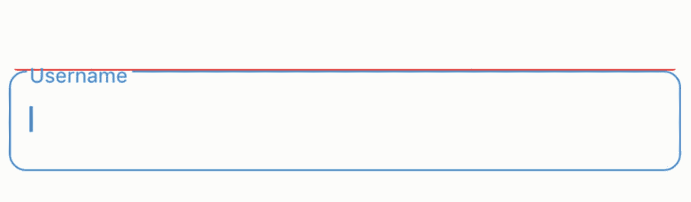

图 6-4

边界

### 前缀和后缀

文本输入中的前缀和后缀可以提供在编辑文本时有用的信息和动作。前缀和后缀都可以是纯文本或小部件。使用文本时，您可以自定义文本的样式。InputDecoration 构造函数具有参数 prefix、prefixIcon、prefixText 和 prefixStyle 来自定义前缀。它还有参数 suffix、suffixIcon、suffixText 和 suffixStyle 来自定义后缀。不能同时为 prefix 和 prefixText 指定非空值。此限制也适用于后缀和后缀 Text。您只能提供一个小部件或文本，但不能同时提供两者。

```java
TextField(
  decoration: InputDecoration(
    prefixIcon: Icon(Icons.monetization_on),
    prefixText: 'Pay ',
    prefixStyle: TextStyle(fontStyle: FontStyle.italic),
    suffixText: '.00',
  ),
)

Listing 6-6Example of prefix and suffix

```

图 [6-5](#Fig5) 是清单 [6-6](#PC6) 的截图。

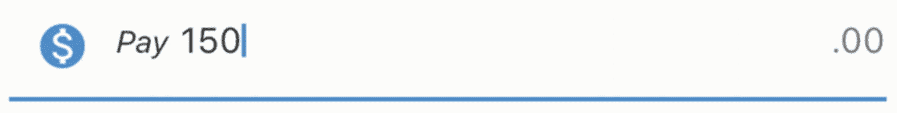

图 6-5

前缀和后缀

### 文本

您可以添加不同类型的文本作为装饰，并自定义它们的样式。表 [6-4](#Tab4) 中显示了五种类型的文本。

表 6-4

不同类型的文本

<colgroup><col class="tcol1 align-left"> <col class="tcol2 align-left"> <col class="tcol3 align-left"> <col class="tcol4 align-left"></colgroup> 
| 

类型

 | 

文本

 | 

风格

 | 

描述

 |
| --- | --- | --- | --- |
| 标签 | 标签文本 | 标签样式 | 标签显示在输入字段的上方。 |
| 助手 | 帮助文本 | 帮助者风格 | 帮助文本显示在输入字段下方。 |
| 暗示 | 提示文本 | dintstyle | 当输入字段为空时，会在其中显示提示。 |
| 错误 | error text-错误文字 | 错误类型 | 错误显示在输入字段下方。 |
| 计数器 | 对抗文本 | 反风格 | 计数器显示在输入字段的下方，但向右对齐。 |

如果 errorText 值不为空，则输入字段被设置为错误状态。

```java
TextField(
  keyboardType: TextInputType.emailAddress,
  decoration: InputDecoration(
    labelText: 'Email',
    labelStyle: TextStyle(fontWeight: FontWeight.bold),
    hintText: 'Email address for validation',
    helperText: 'For receiving validation emails',
    counterText: '10',
  ),
)

Listing 6-7Example of text

```

图 [6-6](#Fig6) 显示了清单 [6-7](#PC7) 中的代码截图。

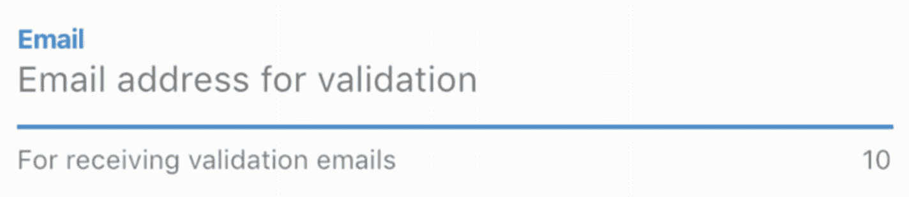

图 6-6

文本字段的文本

## 6.4 设置文本限制

### 问题

你想要控制文本的长度。

### 解决办法

使用 maxLength 参数。

### 讨论

要设置 TextField 和 CupertinoTextField 中文本的最大长度，可以使用 maxLength 参数。maxLength 参数的默认值为 null，这意味着对字符数没有限制。如果设置了 maxLength 参数，文本输入下方会显示一个字符计数器，显示输入的字符数和允许的字符数。如果 maxLength 参数设置为 TextField.noMaxLength，则只显示输入的字符数。设置 maxLength 时，如果字符数达到限制，则行为取决于 maxLengthEnforced 参数的值。如果 maxLengthEnforced 为 true(默认值)，则不能再输入任何字符。如果 maxLengthEnforced 为 false，则可以输入额外的字符，但小部件会切换到错误样式。

```java
TextField(
  maxLength: TextField.noMaxLength,
)

TextField(
  maxLength: 10,
  maxLengthEnforced: false,
)

CupertinoTextField(
  maxLength: 10,
)

Listing 6-8Examples of maxLength

```

图 [6-7](#Fig7) 显示了清单 [6-8](#PC8) 中两个 TextField 小部件的截图。

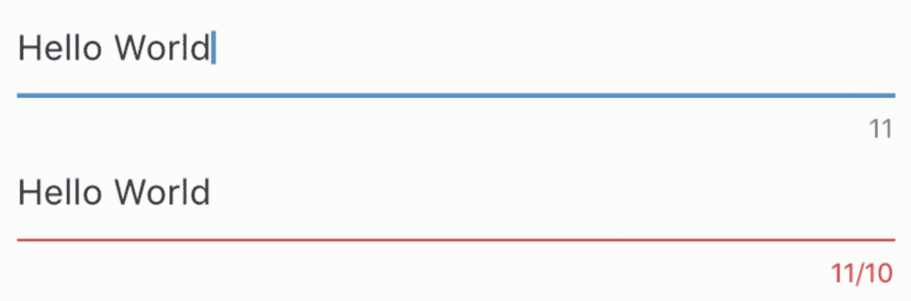

图 6-7

文本限制

## 6.5 选择文本

### 问题

您希望在文本输入中选择一些文本。

### 解决办法

使用 TextEditingController 的 selection 属性。

### 讨论

在 Recipe 6-1 中，你已经看到了使用 TextEditingController 来获取和设置使用 EditableText 的小部件的文本的例子。TextEditingController 也可用于获取用户选择的文本并选择文本。这是通过获取或设置 TextSelection 类型的 selection 属性值来实现的。

TextSelection 是 TextRange 的子类。您可以使用 TextRange.textInside()来获取选定的文本。TextSelection 类使用 baseOffset 和 extentOffset 属性分别表示选定内容的起始和终止位置。baseOffset 的值可能大于、小于或等于 extentOffset。如果 baseOffset 等于 extentOffset，则选定内容将被折叠。折叠的文本选择包含零个字符，但它们用于表示文本插入点。TextSelection.collapsed()构造函数可以在指定的偏移量处创建一个折叠的选择。

在清单 [6-9](#PC9) 中，当文本选择改变时，显示选中的文本。第一个按钮选择了[0，5]范围内的文本，而 thp7e 第二个按钮将光标移动到偏移 1。

```java
class TextSelectionExample extends StatefulWidget {
  @override
  _TextSelectionExampleState createState() => _TextSelectionExampleState();
}

class _TextSelectionExampleState extends State<TextSelectionExample> {
  TextEditingController _controller;
  String _selection;

  @override
  void initState() {
    super.initState();
    _controller = new TextEditingController();
    _controller.addListener(_handleTextSelection);
  }

  @override
  void dispose() {
    _controller.removeListener(_handleTextSelection);
    super.dispose();
  }

  @override

  Widget build(BuildContext context) {
    return Column(
      crossAxisAlignment: CrossAxisAlignment.start,
      children: <Widget>[
        TextField(
          controller: _controller,
        ),
        Row(
          children: <Widget>[
            RaisedButton(
              child: Text('Select text [0, 5]'),
              onPressed: () {
                setState(() {
                  _controller.selection =
                      TextSelection(baseOffset: 0, extentOffset: 5);
                });
              },
            ),
            RaisedButton(
              child: Text('Move cursor to offset 1'),
              onPressed: () {
                setState(() {
                  _controller.selection = TextSelection.collapsed(offset: 1);
                });
              },
            ),
          ],
        ),
        Text.rich(TextSpan(
          children: [
            TextSpan(
              text: 'Selected:',
              style: TextStyle(fontWeight: FontWeight.bold),
            ),
            TextSpan(text: _selection ?? "),
          ],
        )),
      ],
    );
  }

  _handleTextSelection() {
    TextSelection selection = _controller.selection;
    if (selection != null) {
      setState(() {
        _selection = selection.textInside(_controller.text);
      });
    }
  }
}

Listing 6-9
Text selection

```

图 [6-8](#Fig8) 显示了清单 [6-9](#PC9) 中的代码截图。

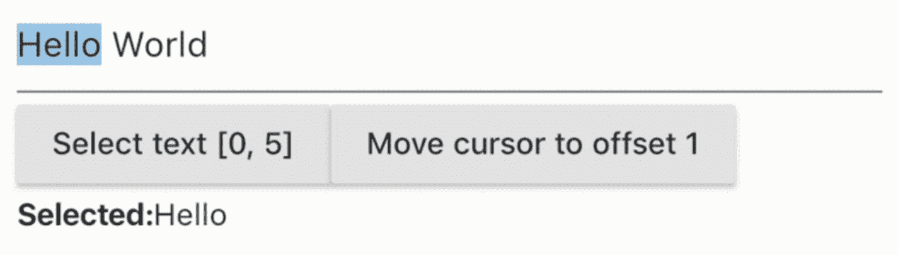

图 6-8

文本选择

## 6.6 格式化文本

### 问题

您想要格式化文本。

### 解决办法

将 TextInputFormatter 与 EditableText 一起使用。

### 讨论

当用户键入文本输入时，您可能希望验证和格式化输入的文本。一个常见的要求是删除黑名单中的字符。这是通过提供 TextInputFormatter 实例的列表作为 TextField 和 CupertinoTextField 的 inputFormatters 参数来实现的。

TextInputFormatter 是一个抽象类，只需实现 formatEditUpdate(TextEditingValue old value，TextEditingValue newValue)即可。oldValue 和 newValue 参数分别表示以前的文本和新文本。返回值是另一个表示格式化文本的 TextEditingValue 实例。可以链接 TextInputFormatter 实例。链接时，调用 formatEditUpdate 方法的 oldValue 的值始终是前一个文本，而 newValue 的值是调用链中前一个 TextInputFormatter 实例的 formatEditUpdate 方法的返回值。

TextInputFormatter 已经有三个内置的实现类，如表 [6-5](#Tab5) 所示。这些类用于实现 TextField 和 CupertinoTextField。例如，当 maxLines 参数的值为 1 时，会将 blacklingtextinputformatter . singleline formatter 添加到 TextInputFormatter 实例的列表中，以过滤掉“\n”字符。

表 6-5

TextInputFormatter 的实现

<colgroup><col class="tcol1 align-left"> <col class="tcol2 align-left"></colgroup> 
| 

名字

 | 

描述

 |
| --- | --- |
| `LengthLimitingTextInputFormatter` | 限制可以输入的字符数。 |
| `BlacklistingTextInputFormatter` | 用给定字符串替换匹配正则表达式模式的字符。 |
| `WhitelistingTextInputFormatter` | 只允许匹配给定正则表达式模式的字符。 |

不需要声明 TextInputFormatter 的新子类，更简单的方法是将 TextInputFormatter . with function()方法与 formatEditUpdate()方法类型匹配的函数一起使用。

在清单 [6-10](#PC10) 中，输入文本被格式化为使用大写字母。

```java
TextField(
  inputFormatters: [
    TextInputFormatter.withFunction((oldValue, newValue) {
      return newValue.copyWith(text: newValue.text?.toUpperCase());
    }),

  ],
)

Listing 6-10Format text

```

## 6.7 选择单个值

### 问题

您希望从值列表中选择一个值。

### 解决办法

使用一组单选小部件。

### 讨论

单选按钮通常用于需要单项选择的情况。一个组中只能选择一个单选按钮。Radio 类有一个表示值的类型的类型参数 T。创建 Radio 实例时，需要提供必需的参数，包括 value、groupValue 和 onChanged。单选小部件不维护任何状态。它的外观完全由 value 和 groupValue 参数决定。当单选按钮组的选择发生变化时，onChanged listener 将使用所选的值进行调用。表 [6-6](#Tab6) 显示了无线电构造器的命名参数。

表 6-6

无线电的命名参数

<colgroup><col class="tcol1 align-left"> <col class="tcol2 align-left"> <col class="tcol3 align-left"></colgroup> 
| 

名字

 | 

类型

 | 

描述

 |
| --- | --- | --- |
| `value` | `T` | 此单选按钮的值。 |
| `groupValue` | `T` | 这组单选按钮的选定值。groupValue 单选按钮处于选中状态。 |
| `onChanged` | `ValueChanged<T>` | 选择改变时的监听器功能。 |
| `activeColor` | `Color` | 选中此单选按钮时的颜色。 |

在清单 [6-11](#PC11) 中，Fruit.allFruits 变量是所有水果实例的列表。_selectedFruit 是当前选择的水果实例。对于每个水果实例，创建一个单选按钮<水果>小部件，并将 groupValue 设置为 _selectedFruit。

```java
class FruitChooser extends StatefulWidget {
  @override
  _FruitChooserState createState() => _FruitChooserState();
}

class _FruitChooserState extends State<FruitChooser> {
  Fruit _selectedFruit;

  @override
  Widget build(BuildContext context) {
    return Column(
      crossAxisAlignment: CrossAxisAlignment.start,
      children: <Widget>[
        Column(
          children: Fruit.allFruits.map((fruit) {
            return Row(
              children: <Widget>[
                Radio<Fruit>(
                  value: fruit,
                  groupValue: _selectedFruit,
                  onChanged: (value) {
                    setState(() {
                      _selectedFruit = value;

                    });
                  },
                ),
                Expanded(
                  child: Text(fruit.name),
                ),
              ],
            );
          }).toList(),
        ),
        Text(_selectedFruit != null ? _selectedFruit.name : ")
      ],
    );
  }
}

Listing 6-11Example of using Radio

```

图 [6-9](#Fig9) 显示了清单 [6-11](#PC11) 中示例的截图。

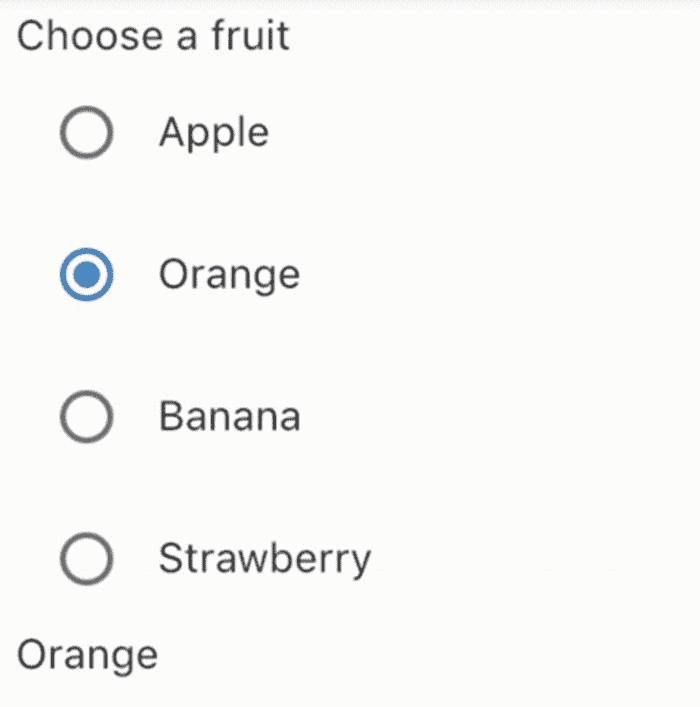

图 6-9

收音机部件

## 6.8 从下拉列表中选择单个值

### 问题

您希望从下拉列表中选择一个值。

### 解决办法

使用下拉按钮。

### 讨论

一个 DropdownButton 小部件在点击时会显示一个项目列表。DropdownButton 类是泛型的，其类型参数表示值的类型。使用 List < DropdownMenuItem<t>>类型的 items 参数指定项目列表。DropdownMenuItem 小部件是一个简单的包装器，带有值和一个子小部件。当选择被改变时，onChanged 回调将使用所选项的值被调用。选定项的值作为值参数传递。如果值为 null，则显示提示小部件。</t>

在清单 [6-12](#PC12) 中，每个水果实例都被映射到一个 DropdownMenuItem 小部件。

```java
class FruitChooser extends StatefulWidget {
  @override
  _FruitChooserState createState() => _FruitChooserState();
}

class _FruitChooserState extends State<FruitChooser> {
  Fruit _selectedFruit;

  @override
  Widget build(BuildContext context) {
    return Column(
      crossAxisAlignment: CrossAxisAlignment.start,
      children: <Widget>[
        DropdownButton(
          value: _selectedFruit,
          items: Fruit.allFruits.map((fruit) {
            return DropdownMenuItem(
              value: fruit,
              child: Text(fruit.name),
            );
          }).toList(),
          onChanged: (fruit) {
            setState(() {
              _selectedFruit = fruit;
            });
          },
          hint: Text('Select a fruit'),
        ),
      ],
    );
  }
}

Listing 6-12Example of DropdownButton

```

图 [6-10](#Fig10) 显示了一个展开的下拉按钮的截图。

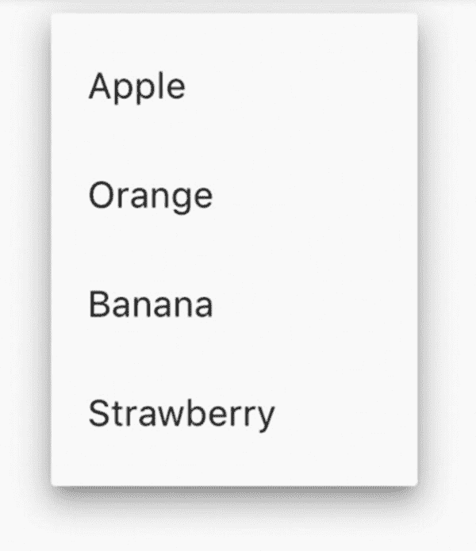

图 6-10

展开的下拉按钮

## 6.9 选择多个值

### 问题

您想要选择多个值。

### 解决办法

使用复选框小工具。

### 讨论

复选框通常用于允许多重选择。如果创建复选框时将参数 tristate 设置为 true，则复选框可以显示三个值:true、false 和 null。否则，只允许值 true 和 false。如果该值为空，则显示一个破折号。复选框本身不维护任何状态。它的外观完全由 value 参数决定。当 checkbox 的值改变时，onChanged 回调用新状态的值调用。

在清单 [6-13](#PC13) 中，选择的水果被维护在一个清单<水果>实例中。每个水果实例都映射到一个 Checkbox 小部件。复选框的值取决于相应的水果实例是否在 _selectedFruits 列表中。

```java
class FruitSelector extends StatefulWidget {
  @override
  _FruitSelectorState createState() => _FruitSelectorState();
}

class _FruitSelectorState extends State<FruitSelector> {
  List<Fruit> _selectedFruits = List();

  @override
  Widget build(BuildContext context) {
    return Column(
      crossAxisAlignment: CrossAxisAlignment.start,
      children: <Widget>[
        Column(
          children: Fruit.allFruits.map((fruit) {
            return Row(
              children: <Widget>[
                Checkbox(
                  value: _selectedFruits.contains(fruit),
                  onChanged: (selected) {
                    setState(() {
                      if (selected) {
                        _selectedFruits.add(fruit);
                      } else {
                        _selectedFruits.remove(fruit);
                      }
                    });
                  },
                ),
                Expanded(
                  child: Text(fruit.name),
                )
              ],
            );
          }).toList(),
        ),
        Text(_selectedFruits.join(', ')),
      ],
    );
  }
}

Listing 6-13Example of Checkbox

```

图 [6-10](#Fig10) 显示了清单 [6-13](#PC13) 中示例的截图。

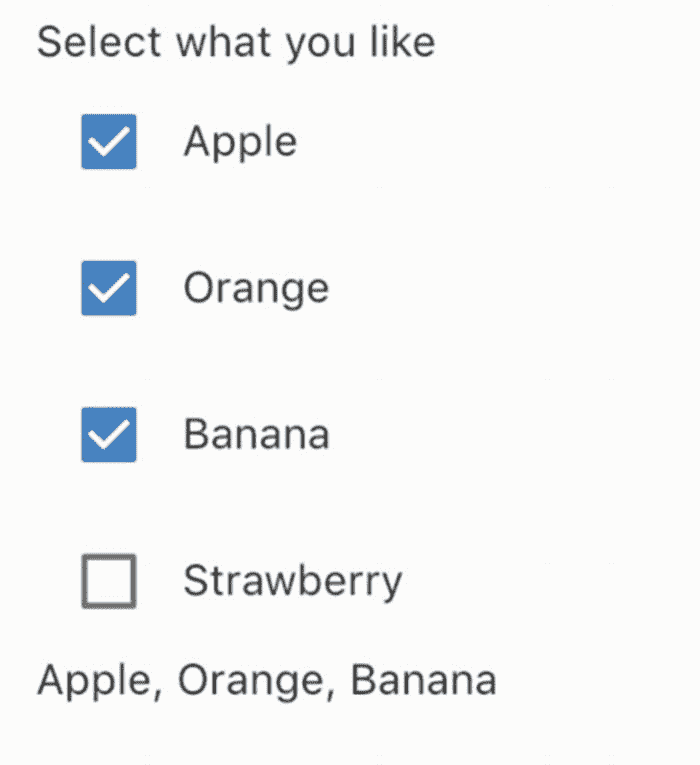

图 6-11

检验盒

## 6.10 切换开/关状态

### 问题

您想要切换开/关状态。

### 解决办法

材质设计使用 Switch，iOS 风格使用 CupertinoSwitch。

### 讨论

Switch 是一个常用的 UI 控件，用于切换设置的开/关状态。开关部件用于材质设计。开关小部件可以有两种状态，活动和非活动。开关部件本身不维护任何状态。它的行为和外观完全由构造函数参数的值决定。如果 value 参数为真，则开关部件处于活动状态；否则，它处于非活动状态。当 Switch 小部件的开/关状态改变时，调用 onChanged 回调函数，新状态为。您可以使用参数 activeColor、activeThumbImage、activeTrackColor、inactiveThumbColor、inactiveThumbImage 和 inactiveTrackColor 自定义不同状态下的 Switch 小部件的外观。

在清单 [6-14](#PC14) 中，Switch 小部件用于控制另一个 TextField 小部件的状态。

```java
class NameInput extends StatefulWidget {
  @override
  _NameInputState createState() => _NameInputState();
}

class _NameInputState extends State<NameInput> {
  bool _useCustomName = false;

  _buildNameInput() {
    return TextField(
      decoration: InputDecoration(labelText: 'Name'),
    );
  }

  _buildToggle() {
    return Row(
      children: <Widget>[
        Switch(
          value: _useCustomName,
          onChanged: (value) {
            setState(() {
              _useCustomName = value;
            });
          },
          activeColor: Colors.green,
          inactiveThumbColor: Colors.grey.shade200,
        ),
        Expanded(
          child: Text('Use custom name'),
        ),
      ],
    );
  }

  @override

  Widget build(BuildContext context) {
    return Column(
      crossAxisAlignment: CrossAxisAlignment.start,
      children: _useCustomName
          ? [_buildToggle(), _buildNameInput()]
          : [_buildToggle()],
    );
  }
}

Listing 6-14Example of Switch

```

图 [6-12](#Fig12) 为清单 [6-14](#PC14) 中示例的截图。

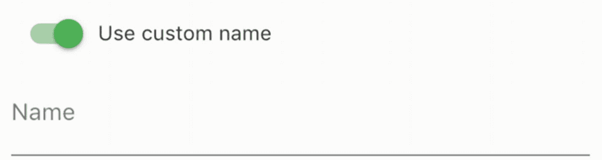

图 6-12

转换

CupertinoSwitch 小部件创建了一个 iOS 风格的开关，其工作方式与 Switch 相同，但它只支持活动颜色的定制。Switch 小部件具有构造函数 Switch.adaptive()来创建 Switch 小部件或 CupertinoSwitch 小部件，这取决于目标平台。当使用 Switch.adaptive()创建 CupertinoSwitch 小部件时，只使用 CupertinoSwitch()接受的构造函数参数；其他参数被忽略。

清单 [6-15](#PC15) 展示了使用 CupertinoSwitch 和 Switch.adaptive()的例子。

```java
CupertinoSwitch(
  value: true,
  onChanged: (value) => {},
  activeColor: Colors.red.shade300,
)

Switch.adaptive(
  value: true,
  onChanged: (value) => {},
)

Listing 6-15Example of CupertinoSwitch

```

## 6.11 从一系列值中选择

### 问题

您希望从一组连续或离散的值中进行选择。

### 解决办法

使用滑块进行材质设计，或使用 CupertinoSlider 进行 iOS 风格设计。

### 讨论

滑块通常用于从一组连续或离散的值中进行选择。可以使用 Slider widget 进行材质设计，或者使用 CupertinoSlider 进行 iOS 风格设计。这两个小部件具有相同的行为，但视觉外观不同。创建滑块时，需要使用最小和最大参数提供有效的值范围。如果非空值用于分割参数，将选择一组离散值。否则，将选择连续的值范围。例如，如果“最小值”中的值为 0.0，“最大值”为 10.0，且“分段”设置为 5，则选择的值为 0.0、2.0、4.0、6.0、8.0 和 10.0。滑块小部件不保持任何状态。它的行为和外观完全由构造函数参数决定。当滑块的值发生变化时，onChanged 回调函数将使用选定的值进行调用。还可以使用 onChangeStart 和 onChangeEnd 回调分别在值开始改变和改变完成时获得通知。您可以使用 label、activeColor 和 inactiveColor 进一步自定义滑块的外观。CupertinoSlider 仅支持 activeColor 参数。如果 onChanged 为 null 或范围为空，则 slider 小部件将被禁用。

在清单 [6-16](#PC16) 中，使用给定的 divisions 参数值创建一个 Slider 小部件，并显示当前值。

```java
class SliderValue extends StatefulWidget {
  SliderValue({Key key, this.divisions}) : super(key: key);

  final int divisions;

  @override
  _SliderValueState createState() => _SliderValueState(divisions);
}

class _SliderValueState extends State<SliderValue> {
  _SliderValueState(this.divisions);

  final int divisions;
  double _value = 0.0;

  @override
  Widget build(BuildContext context) {
    return Row(
      children: <Widget>[
        Expanded(
          child: Slider(
            value: _value,
            min: 0.0,
            max: 10.0,
            divisions: divisions,
            onChanged: (value) {
              setState(() {
                _value = value;
              });
            },
          ),
        ),
        Text(_value.toStringAsFixed(2)),
      ],
    );
  }
}

Listing 6-16Example of Slider

```

CupertinoSlider 的用法与 Slider 类似。您可以简单地用清单 [6-16](#PC16) 中的 CupertinoSlider 替换 Slider。图 [6-13](#Fig13) 显示了滑块和 CupertinoSlider 的截图。

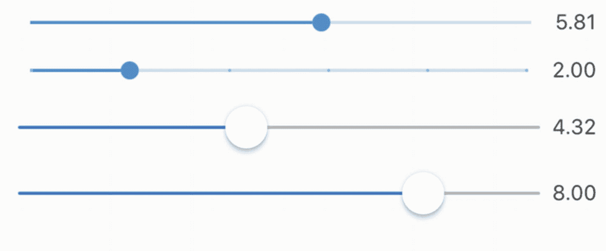

图 6-13

滑块和吸盘滑块

## 6.12 使用芯片

### 问题

您希望有简洁的替代方案来表示不同类型的实体。

### 解决办法

使用不同类型的芯片。

### 讨论

当空间有限时，按钮、单选按钮和复选框等传统小部件可能不适合。在这种情况下，可以使用材料设计中的芯片来表示相同的语义，但使用较少的空间。

芯片小部件是通用的芯片实现，它有一个必需的标签和一个可选的头像。在设置非空 onDeleted 回调时，它还可以包含一个 delete 按钮。

InputChip 小部件比 Chip 小部件更强大。InputChip 小部件可以通过设置 onSelected 回调来选择，也可以通过设置 onPressed 回调来按压。但是，不能对 onSelected 和 onPressed 回调都设置非 null 值。当使用 onSelected 时，InputChip 小部件的行为类似于复选框。您可以使用选定的参数来设置状态。当使用 onPressed 时，InputChip 小部件的行为就像一个按钮。

ChoiceChip 小部件的行为就像一个单选按钮，用选定的参数来设置其状态，用选定的回调来通知状态变化。但是，ChoiceChip 小部件没有与 Radio 小部件中的 groupValue 类似的参数，所以您必须手动设置选择的状态。

FilterChip 小部件的行为类似于复选框。FilterChip 构造函数与 ChoiceChip 构造函数具有相同的参数。

ActionChip 小部件的行为类似于带有 onPressed 参数的按钮。动作芯片和按钮的区别在于，不能通过将 onPressed 参数设置为 null 来禁用动作芯片。如果行动芯片的行动不适用，则应将其移除。这种行为与使用芯片减少空间的目标是一致的。

事实上，所有这些芯片小部件都通过仅使用 RawChip 构造函数支持的参数子集来包装 RawChip 小部件。

在清单 [6-17](#PC17) 中，ChoiceChip 小部件用于实现单选。

```java
class FruitChooser extends StatefulWidget {
  @override
  _FruitChooserState createState() => _FruitChooserState();
}

class _FruitChooserState extends State<FruitChooser> {
  Fruit _selectedFruit;

  @override
  Widget build(BuildContext context) {
    return Column(
      crossAxisAlignment: CrossAxisAlignment.start,
      children: <Widget>[
        Wrap(
          spacing: 5,
          children: Fruit.allFruits.map((fruit) {
            return ChoiceChip(
              label: Text(fruit.name),
              selected: _selectedFruit == fruit,
              onSelected: (selected) {
                setState(() {
                  _selectedFruit = selected ? fruit : null;
                });
              },
              selectedColor: Colors.red.shade200,
            );
          }).toList(),

        ),
        Text(_selectedFruit != null ? _selectedFruit.name : ")
      ],
    );
  }
}

Listing 6-17Example of ChoiceChip

```

在清单 [6-18](#PC18) 中，FilterChip 小部件用于实现多重选择。

```java
class FruitSelector extends StatefulWidget {
  @override
  _FruitSelectorState createState() => _FruitSelectorState();
}

class _FruitSelectorState extends State<FruitSelector> {
  List<Fruit> _selectedFruits = List();

  @override
  Widget build(BuildContext context) {
    return Column(
      crossAxisAlignment: CrossAxisAlignment.start,
      children: <Widget>[
        Wrap(
          spacing: 5,
          children: Fruit.allFruits.map((fruit) {
            return FilterChip(
              label: Text(fruit.name),
              selected: _selectedFruits.contains(fruit),
              onSelected: (selected) {
                setState(() {
                  if (selected) {
                    _selectedFruits.add(fruit);
                  } else {
                    _selectedFruits.remove(fruit);
                  }
                });
              },
              selectedColor: Colors.blue.shade200,
            );
          }).toList(),

        ),
        Text(_selectedFruits.join(', ')),
      ],
    );
  }
}

Listing 6-18Example of FilterChip

```

图 [6-14](#Fig14) 为清单 [6-17](#PC17) 和 [6-18](#PC18) 中实例的截图。

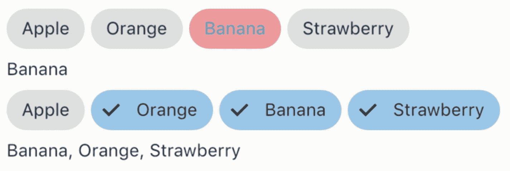

图 6-14

选择芯片和滤波器芯片

## 6.13 选择日期和时间

### 问题

您想要选择日期和时间。

### 解决办法

使用 showDatePicker()和 showTimePicker()函数进行材质设计，或使用 CupertinoDatePicker 和 CupertinoTimerPicker 进行 iOS 样式设计。

### 讨论

对于材质设计，可以使用 YearPicker、MonthPicker、DayPicker 或 showDatePicker()函数等小部件来允许用户选择日期。showTimePicker()函数用于选择时间。小部件很少用于选择日期。大多数情况下，showDatePicker()和 showTimePicker()函数用于显示对话框。

YearPicker 小部件显示了要选择的年份列表。创建 YearPicker 小部件时，需要分别使用 selected date、firstDate 和 lastDate 参数为所选日期、最早日期和最晚日期提供 DateTime 实例。当选择被更改时，onChanged 回调将使用选定的 DateTime 实例调用。

MonthPicker 小部件显示要选择的月份列表。MonthPicker 构造函数与 YearPicker 具有相同的参数 selectedDate、firstDate、lastDate 和 onChanged。它还有一个谓词函数 selectableDayPredicate，用于定制哪些天是可选的。

DayPicker 小部件显示给定月份中要选择的日期。DayPicker 构造函数具有 MonthPicker 的所有参数和 displayedMonth 参数，用于设置要选取的月份。

如果你想显示一个对话框让用户选择日期，showDatePicker()函数比创建你自己的对话框更容易使用。您需要为参数 initialDate、firstDate 和 lastDate 传递 DateTime 实例。BuildContext 类型的上下文参数也是必需的。该函数可以在 DatePickerMode 枚举中定义的两种模式下工作。DatePickerMode.day 表示每天选择一个月，DatePickerMode.year 表示选择一年。showDatePicker()函数的返回值是代表所选日期的未来日期<datetime>。</datetime>

在清单 [6-19](#PC19) 中，TextField 小部件有一个 IconButton 作为后缀。当按钮被按下时，showDatePicker()函数被调用以显示日期选择器对话框。选定的日期显示在 TextField 小工具中。

```java
class PickDate extends StatefulWidget {
  @override
  _PickDateState createState() => _PickDateState();
}

class _PickDateState extends State<PickDate> {
  DateTime _selectedDate = DateTime.now();
  TextEditingController _controller = TextEditingController();

  @override
  Widget build(BuildContext context) {
    return TextField(
      controller: _controller,
      decoration: InputDecoration(
        labelText: 'Date',
        suffix: IconButton(
          icon: Icon(Icons.date_range),
          onPressed: () {
            showDatePicker(
              context: context,
              initialDate: _selectedDate,
              firstDate: DateTime.now().subtract(Duration(days: 30)),
              lastDate: DateTime.now().add(Duration(days: 30)),)
            .then((selectedDate) {
              if (selectedDate != null) {
                _selectedDate = selectedDate;
                _controller.text = DateFormat.yMd().format(_selectedDate);
              }
            });
          },
        ),
      ),
    );
  }
}

Listing 6-19Pick date

```

函数的作用是:显示一个对话框来选择时间。您需要传递 TimeOfDay 类型的 initialTime 参数作为要显示的初始时间。返回值是代表所选时间的未来<timeofday>实例。清单 [6-20](#PC20) 中的代码使用与清单 [6-19](#PC19) 相似的模式来显示时间选择器对话框。</timeofday>

```java
class PickTime extends StatefulWidget {
  @override
  _PickTimeState createState() => _PickTimeState();
}

class _PickTimeState extends State<PickTime> {
  TimeOfDay _selectedTime = TimeOfDay.now();
  TextEditingController _controller = TextEditingController();

  @override
  Widget build(BuildContext context) {
    return TextField(
      controller: _controller,
      decoration: InputDecoration(
          labelText: 'Time',
          suffix: IconButton(
            icon: Icon(Icons.access_time),
            onPressed: () {
              showTimePicker(
                context: context,
                initialTime: _selectedTime,
              ).then((selectedTime) {
                if (selectedTime != null) {
                  _selectedTime = selectedTime;
                  _controller.text = _selectedTime.format(context);
                }
              });
            },
          )),
    );
  }
}

Listing 6-20Pick time

```

对于 iOS 风格，您可以使用 CupertinoDatePicker 和 CupertinoTimerPicker 小部件分别选择日期和时间。根据枚举 CupertinoDatePickerMode 的模式参数，CupertinoDatePicker 可以有不同的模式，包括日期、时间以及日期和时间。与材料设计中的小部件类似，CupertinoDatePicker 构造函数具有参数 initialDateTime、minimumDate、maximumDate 和 onDateTimeChanged。根据 enum CupertinoTimerPickerMode 的 mode 参数，CupertinoTimerPicker 还可以有不同的模式，包括 hm、ms 和 hms。不同之处在于，CupertinoTimerPicker 使用 Duration 实例来设置初始值和作为 onTimerDurationChanged 回调中的值。

## 6.14 包装表单字段

### 问题

您希望将表单小部件包装成表单字段。

### 解决办法

使用 FormField 或 TextFormField。

### 讨论

表单小部件可以像普通小部件一样使用。但是，这些表单小部件不维护任何状态；您总是需要将它们包装在有状态的小部件中来保持状态。典型的使用模式是使用 onChanged 回调来更新状态并触发表单小部件的重建。因为这是使用表单小部件的典型模式，所以 Flutter 有一个内置的 FormField 小部件来维护表单小部件的当前状态。它处理更新和验证错误。

FormField 类是泛型的，类型参数 T 表示值的类型。FormField 可以用作独立的小部件，也可以作为表单小部件的一部分。本食谱仅讨论独立使用。表 [6-7](#Tab7) 显示了 FormField 构造函数的命名参数。

表 6-7

表单域的命名参数

<colgroup><col class="tcol1 align-left"> <col class="tcol2 align-left"> <col class="tcol3 align-left"></colgroup> 
| 

名字

 | 

类型

 | 

描述

 |
| --- | --- | --- |
| `builder` | `FormFieldBuilder<T>` | 构建表示该表单字段的小部件。 |
| `onSaved` | `FormFieldSetter<T>` | 保存表单时回调。 |
| `validator` | `FormFieldValidator<T>` | 表单域的验证器。 |
| `initialValue` | `T` | 初始值。 |
| `autovalidate` | `boolean` | 每次更改后是否自动验证。 |
| `enabled` | `boolean` | 此表单域是否已启用。 |

FormFieldBuilder <t>类型是一个小部件形式的 typedef(formfield state<t>字段)。FormFieldState <t>类从 State 类扩展而来，代表表单域的当前状态。FormFieldBuilder 负责根据状态构建小部件。从 FormFieldState 中，可以获得表单域的当前值和错误文本。也可以使用表 [6-8](#Tab8) 中 FormFieldState 的方法。FormFieldValidator < T >也是字符串(T 值)形式的 typedef。它将当前值作为输入，如果验证失败，则返回一个非空字符串作为错误消息。FormFieldSetter < T > type 是一个 void(T newValue)形式的 typedef。</t></t></t>

表 6-8

FormFieldState

<colgroup><col class="tcol1 align-left"><col class="tcol2 align-left"></colgroup>
| 

名称

 | 

描述

 |
| --- | --- |
| `save()` | 用当前值调用 onSaved()方法。 |
| `validate()` | 如果验证失败，调用验证器并设置 errorText。 |
| `didChange(T value)` | 将字段的状态更新为新值。 |
| `reset()` | 将字段重置为初始值。 |

当在 FormFields 中包装 TextFields 时，最好使用内置的 TextFormField。TextFormField 小部件已经使用 TextEditingController 处理设置文本，并使用 FormFieldValidator 返回的错误文本更新输入装饰。TextFormField 构造函数支持来自 TextField 和 FormField 构造函数的参数。清单 [6-21](#PC21) 中的 TextFormField 有一个验证器来验证文本长度。

```java
class NameInput extends StatelessWidget {
  @override
  Widget build(BuildContext context) {
    return TextFormField(
      decoration: InputDecoration(
        labelText: 'Name',
      ),
      validator: (value) {
        if (value == null || value.isEmpty) {
          return 'Name is required.';
        } else if (value.length < 6) {
          return 'Minimum length is 6.';
        } else {
          return null;
        }
      },
      autovalidate: true,
    );
  }
}

Listing 6-21
TextFormField

```

图 [6-15](#Fig15) 显示了清单 [6-21](#PC21) 中的代码截图。

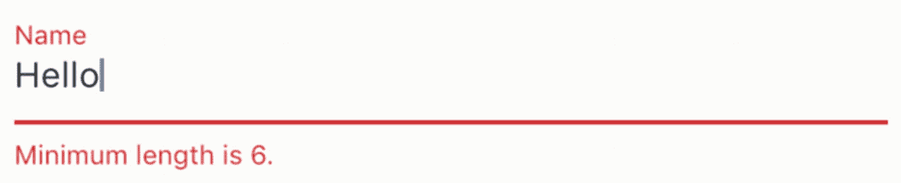

图 6-15

TextFormField

FormFieldState 实例只能在 FormField 的 builder 函数中访问。如果需要从其他地方访问状态，可以传递一个 GlobalKey 作为 FormField 的 Key 参数，然后使用 currentState 属性访问当前状态。

在清单 [6-22](#PC22) 中，FormField 的状态是一个列表< PizzaTopping >实例。使用 GlobalKey，当按下按钮时，可以检索当前值。

```java
class PizzaToppingsSelector extends StatelessWidget {
  final GlobalKey<FormFieldState<List<PizzaTopping>>> _formFieldKey =
      GlobalKey();

  @override
  Widget build(BuildContext context) {
    return Column(
      children: <Widget>[
        FormField<List<PizzaTopping>>(
          key: _formFieldKey,
          initialValue: List(),
          builder: (state) {
            return Wrap(
              spacing: 5,
              children: PizzaTopping.allPizzaToppings.map((topping) {
                return ChoiceChip(
                  label: Text(topping.name),
                  selected: state.value.contains(topping),
                  onSelected: state.value.length < 2 ||
                          state.value.contains(topping)
                      ? (selected) {
                          List<PizzaTopping> newValue = List.of(state.value);
                          if (selected) {
                            newValue.add(topping);
                          } else {
                            newValue.remove(topping);
                          }
                          state.didChange(newValue);
                        }
                      : null,

                );
              }).toList(),
            );
          },
        ),
        RaisedButton(
          child: Text('Get toppings'),
          onPressed: () => print(_formFieldKey.currentState?.value),
        ),
      ],
    );
  }
}

Listing 6-22FormField

```

## 6.15 创建表单

### 问题

您希望创建一个包含多个表单域的表单。

### 解决办法

使用表单。

### 讨论

使用表单域时，通常您会尝试构建一个包含多个表单域的表单。当处理多个表单域时，单独管理表单域是一项繁琐的任务。Form 是多个表单域的方便包装器。您需要将所有表单域包装在表单域小部件中，并使用一个表单小部件作为所有这些表单域小部件的共同祖先。表单小部件是一个有状态的小部件，其状态由关联的 FormState 实例管理。FormState 类有 save()、validate()和 reset()方法。这些方法调用后代 FormField 小部件的所有 FormFieldState 实例上的相应函数。

有两种方法可以获得 FormState 实例，这取决于小部件想要使用 FormState 的位置。如果小部件是 Form 小部件的后代，使用 Form.of(BuildContext context)是获得最接近的 FormState 实例的简单方法。第二种方法是在创建表单小部件时使用 GlobalKey 实例，然后使用 GlobalKey.currentState 获取表单状态。

清单 [6-23](#PC23) 显示了一个登录表单的代码。使用 GlobalKey 实例创建了两个 TextFormField 小部件。

```java
class LoginForm extends StatefulWidget {
  @override
  _LoginFormState createState() => _LoginFormState();
}

class _LoginFormState extends State<LoginForm> {
  final GlobalKey<FormFieldState<String>> _usernameFormFieldKey = GlobalKey();
  final GlobalKey<FormFieldState<String>> _passwordFormFieldKey = GlobalKey();

  _notEmpty(String value) => value != null && value.isNotEmpty;

  get _value => ({
        'username': _usernameFormFieldKey.currentState?.value,
        'password': _passwordFormFieldKey.currentState?.value
      });

  @override

  Widget build(BuildContext context) {
    return Form(
      child: Column(
        children: <Widget>[
          TextFormField(
            key: _usernameFormFieldKey,
            decoration: InputDecoration(
              labelText: 'Username',
            ),
            validator: (value) =>
                !_notEmpty(value) ? 'Username is required' : null,
          ),
          TextFormField(
            key: _passwordFormFieldKey,
            obscureText: true,
            decoration: InputDecoration(
              labelText: 'Password',
            ),
            validator: (value) =>
                !_notEmpty(value) ? 'Password is required' : null,
          ),
          Builder(builder: (context) {
            return Row(
              mainAxisAlignment: MainAxisAlignment.end,
              children: <Widget>[
                RaisedButton(
                  child: Text('Log In'),
                  onPressed: () {
                    if (Form.of(context).validate()) {
                      print(_value);
                    }
                  },
                ),
                FlatButton(
                  child: Text('Reset'),
                  onPressed: () => Form.of(context).reset(),
                )
              ],
            );
          }),
        ],
      ),
    );
  }
}

Listing 6-23
Login form

```

图 [6-16](#Fig16) 显示了登录表单的截图。

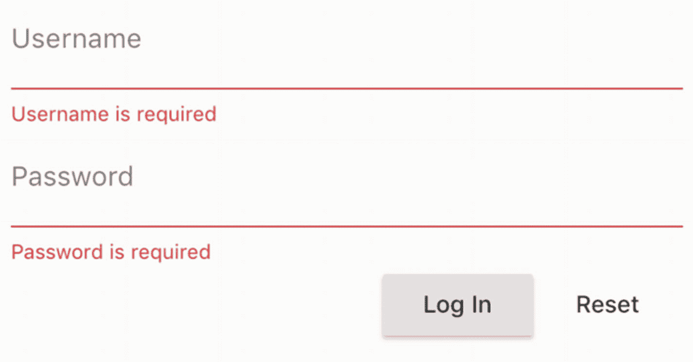

图 6-16

登录表单

## 6.16 摘要

表单小部件对于与用户交互很重要。本章涵盖了材料设计和 iOS 风格的表单小部件，包括文本输入、单选按钮、复选框、下拉菜单、开关、芯片和滑块。在下一章，我们将讨论应用脚手架的部件。