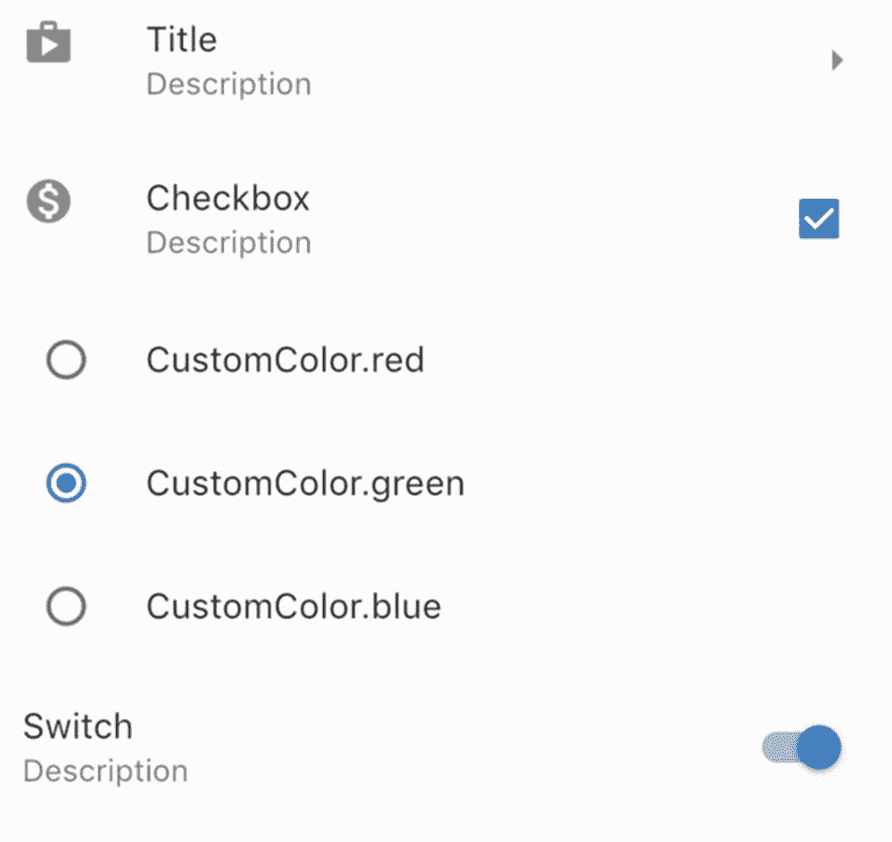
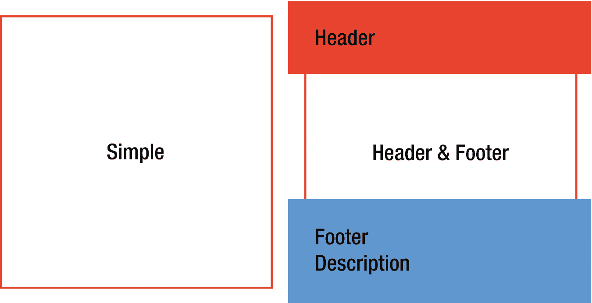
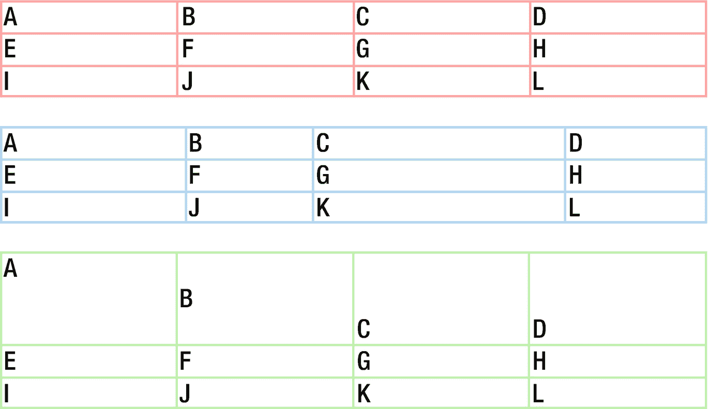

# 7.常见小部件

在 Flutter 应用中，一些小部件被广泛用于不同的目的。本章讨论一些常见的小部件。

## 7.1 显示项目列表

### 问题

您希望显示一个可滚动的项目列表。

### 解决办法

使用 ListView 小部件作为项目的容器。

### 讨论

像 Flex、Row 和 Column 这样的 Flutter 布局小部件不支持滚动，并且这些小部件不是设计用来在需要滚动时显示项目的。如果你想显示大量的条目，你应该使用 ListView 小部件。您可以将 ListView 视为 Flex 小部件的可滚动对应物。

使用不同的构造函数创建 ListView 小部件有三种不同的方法:

*   从子部件的静态列表中创建。

*   通过基于滚动位置按需构建子项来创建。

*   创建自定义实现。

    这个食谱着重于前两种方法。

### 带有静态子视图的 ListView

如果您有一个可能超过其父小部件大小的子部件静态列表，您可以将它们包装在一个 ListView 小部件中以支持滚动。这是通过使用 Widget[]类型的 children 参数调用 ListView()构造函数来实现的。滚动方向由 Axis 类型的 scrollDirection 参数确定。默认的滚动方向是 Axis.vertical。如果要以相反的顺序显示子项，可以将 reverse 参数设置为 true。清单 [7-1](#PC1) 显示了一个带有三个子控件的 ListView 小部件。

```java
ListView(
  children: <Widget>[
    ExampleWidget(name: 'Box 1'),
    ExampleWidget(name: 'Box 2'),
    ExampleWidget(name: 'Box 3'),
  ],
)

Listing 7-1ListView with static children

```

默认的 ListView()构造函数应该只在你有少量孩子的时候使用。将创建所有子对象，即使其中一些子对象在视口中不可见。这可能会对性能产生影响。

### 带有项目生成器的 ListView

如果你有大量的条目或者条目需要动态创建，你可以使用 ListView.builder()和 ListView.separated()构造函数。您需要提供 IndexedWidgetBuilder 类型的构建器函数来按需构建项目，而不是静态的小部件列表。IndexedWidgetBuilder 是小部件的 typedef(build context 上下文，int index)。index 参数是要生成的项的索引。ListView 小部件确定视窗中项目的索引，并调用构建器函数来构建要呈现的项目。如果项目总数是已知的，您应该将这个数字作为 itemCount 参数传递。如果 itemCount 为非空，则只在索引大于或等于零且小于 itemCount 的情况下调用构建器函数。如果 itemCount 为 null，则构建器函数需要返回 null，以表明没有更多的项目可用。

使用 ListView.builder()构造函数时，只需要提供 IndexedWidgetBuilder 类型的 itemBuilder 参数。对于 ListView.separated()构造函数，除了 itemBuilder 参数之外，还需要提供 IndexedWidgetBuilder 类型的 separatorBuilder 参数来构建项之间的分隔符。使用 ListView.separated()时，itemCount 参数是必需的。清单 [7-2](#PC2) 展示了使用 ListView.builder()和 ListView.separated()的例子。

```java
ListView.builder(
  itemCount: 20,
  itemBuilder: (context, index) {
    return ExampleWidget(name: 'Dynamic Box ${index + 1}');
  },
);

ListView.separated(
  itemBuilder: (context, index) {
    return ExampleWidget(name: 'Separated Box ${index + 1}');
  },
  separatorBuilder: (context, index) {
    return Divider(
      height: 8,
    );

  },
  itemCount: 20,
);

Listing 7-2ListView with item builders

```

如果项在滚动方向上的范围是已知的，则应将该值作为 itemExtent 参数传递。itemExtent 参数的非空值使滚动更有效。

### listfile(列表文件)

您可以使用任何小部件作为 ListView 的子部件。如果你的项目包括文本、图标和其他控件，你可以使用 ListTile 及其子类。列表框包含一到三行文本以及文本周围的前导和尾随小部件。表 [7-1](#Tab1) 显示

表 7-2

CheckboxListTile 参数

<colgroup><col class="tcol1 align-left"> <col class="tcol2 align-left"> <col class="tcol3 align-left"></colgroup> 
| 

名字

 | 

类型

 | 

描述

 |
| --- | --- | --- |
| 副手 | 小部件 | 显示在磁贴另一侧的小部件。 |
| 控制亲和力 | ListTileControlAffinity | 在图块中放置控件的位置。 |

表 7-1

列表文件的参数

<colgroup><col class="tcol1 align-left"> <col class="tcol2 align-left"> <col class="tcol3 align-left"></colgroup> 
| 

名字

 | 

类型

 | 

描述

 |
| --- | --- | --- |
| 标题 | 小部件 | 列表框的标题。 |
| 小标题 | 小部件 | 标题下方显示的可选内容。 |
| 是三线 | 弯曲件 | 列表框是否有三行文本。 |
| 主要的 | 小部件 | 标题前显示的小部件。 |
| 蔓延的 | 小部件 | 标题后显示的小部件。 |
| 使能够 | 弯曲件 | 列表框是否已启用。 |
| 挑选 | 弯曲件 | 列表框是否被选中。选中时，图标和文本以相同的颜色呈现。 |
| 数据库 | GestureTapCallback | 点击标题时回调。 |
| 又没有长按 | gesturelongpressscallback | 长按标题时回调。 |
| 稠密的 | 弯曲件 | 为 true 时，平铺的大小会减小。 |
| 内容填充 | 边缘镶嵌几何学 | 瓷砖内部的填充。 |

清单 [7-3](#PC3) 展示了一个使用 ListTile 的例子。

```java
ListTile(
  title: Text('Title'),
  subtitle: Text('Description'),
  leading: Icon(Icons.shop),
  trailing: Icon(Icons.arrow_right),
)

Listing 7-3Example of ListTile

```

如果您想在列表框中有一个复选框，您可以使用 checkboxListTile 小部件，它结合了 list tile 和 Checkbox。CheckboxListTile 构造函数与 ListTile 构造函数具有相同的参数 title、subtitle、isThreeLine、selected 和 dense。它还有用于复选框构造函数的参数 value、onChanged 和 activeColor。

ListTileControlAffinity 枚举定义列表框中控件的位置。它有三个值，前导、尾随和平台。当指定了控件的位置时，辅助小部件总是放在对面。

```java
class CheckboxInListTile extends StatefulWidget {
  @override
  _CheckboxInListTileState createState() => _CheckboxInListTileState();
}

class _CheckboxInListTileState extends State<CheckboxInListTile> {
  bool _value = false;

  @override
  Widget build(BuildContext context) {
    return CheckboxListTile(
      title: Text('Checkbox'),
      subtitle: Text('Description'),
      value: _value,
      onChanged: (value) {
        setState(() {
          _value = value;
        });
      },
      secondary: Icon(_value ? Icons.monetization_on : Icons.money_off),
    );
  }
}

Listing 7-4Example of CheckboxListTile

```

如果想在列表框中添加单选按钮，可以使用 RadioListTile <t>小部件。对于 RadioListTile 构造函数的参数，value、groupValue、onChanged 和 activeColor 与 Radio 构造函数中的含义相同；title、subtitle、isThreeLine、dense、secondary、selected 和 controlAffinity 与 CheckboxListTile 构造函数中的含义相同。清单 [7-5](#PC5) 显示了一个使用放射性同位素的例子。</t>

```java
enum CustomColor { red, green, blue }

class RadioInListTile extends StatefulWidget {
  @override
  _RadioInListTileState createState() => _RadioInListTileState();
}

class _RadioInListTileState extends State<RadioInListTile> {
  CustomColor _selectedColor;

  @override
  Widget build(BuildContext context) {
    return Column(
      children: CustomColor.values.map((color) {
        return RadioListTile<CustomColor>(
          title: Text(color.toString()),
          value: color,
          groupValue: _selectedColor,
          onChanged: (value) {
            setState(() {
              _selectedColor = value;
            });
          },
        );
      }).toList(),
    );
  }
}

Listing 7-5Example of RadioListTile

```

如果您想将开关添加到列表框中，您可以使用 SwitchListTile。SwitchListTile 构造函数的一些参数来自 Switch 构造函数，另一些参数来自 ListTile 构造函数。清单 [7-6](#PC6) 展示了一个使用 SwitchListTile 的例子。

```java
class SwitchInListTile extends StatefulWidget {
  @override
  _SwitchInListTileState createState() => _SwitchInListTileState();
}

class _SwitchInListTileState extends State<SwitchInListTile> {
  bool _value = false;

  @override
  Widget build(BuildContext context) {
    return SwitchListTile(
      title: Text('Switch'),
      subtitle: Text('Description'),
      value: _value,
      onChanged: (value) {
        setState(() {
          _value = value;
        });
      },
    );
  }
}

Listing 7-6Example of SwitchListTile

```

图 [7-1](#Fig1) 显示了不同 ListTiles 的截图。



图 7-1

列表文件

## 7.2 在网格中显示项目

### 问题

您希望在网格中显示项目。

### 解决办法

使用 GridView。

### 讨论

ListView 小工具以线性数组的形式显示项目。要在二维数组中显示小部件，可以使用 GridView。GridView 子级的实际布局被委托给 SliverGridDelegate 的一个实现。Flutter 提供了 SliverGridDelegate 的两个内置实现，slivergriddelegatewithfixedcrosaxiscount 和 slivergriddelegatewithmxcrosaxisextent。您还可以创建自己的 SliverGridDelegate 实现。

有三种方法可以提供 GridView 的子视图。您可以提供一个静态的小部件列表，或者使用 IndexedWidgetBuilder 类型的构建器函数，或者提供 SliverChildDelegate 的实现。

根据 SliverGridDelegate 和提供子级的选择，可以使用不同的 GridView 构造函数。表 [7-3](#Tab3) 显示了不同构造器的用法。

表 7-3

GridView 构造函数

<colgroup><col class="tcol1 align-left"> <col class="tcol2 align-left"> <col class="tcol3 align-left"></colgroup> 
| 

名字

 | 

代表

 | 

孩子们

 |
| --- | --- | --- |
| GridView() | silvergriddelegate | 小部件[] |
| GridView.builder() | silvergriddelegate | IndexedWidgetBuilder |
| GridView.count() | slivergriddelegatewithfixedcrosaxiscount | 小部件[] |
| GridView.extent() | silvergriddelegatewithmxcrosaxisextent | 小部件[] |
| GridView.custom() | silvergriddelegate | silverchilddelegate |

slivergriddelegatewithfixedcrosaxiscount 类使用 CrossAxisCount 参数来指定横轴中的固定平铺数。例如，如果 GridView 的滚动方向是垂直的，则 crossAxisCount 参数指定列数。清单 [7-7](#PC7) 展示了一个使用 GridView.count()创建三列网格的例子。

```java
GridView.count(
  crossAxisCount: 3,
  children: List.generate(10, (index) {
    return ExampleWidget(
      name: 'Fixed Count ${index + 1}',
    );
  }),
);

Listing 7-7Example of using Gridview.count()

```

slivergriddelegatewithmacrossaxisextent 类使用 maxCrossAxisExtent 参数指定横轴的最大范围。图块的实际横轴范围将尽可能大，以均匀划分 GridView 的横轴范围，并且不会超过指定的最大值。例如，如果 GridView 的横轴范围是 400，maxCrossAxisExtent 的值是 120，则图块的横轴范围是 100。如果 GridView 的滚动方向是垂直的，它将有四列。清单 [7-8](#PC8) 展示了一个使用 GridView.extent()的例子。

```java
GridView.extent(
  maxCrossAxisExtent: 250,
  children: List.generate(10, (index) {
    return ExampleWidget(
      name: 'Max Extent ${index + 1}',
    );
  }),
);

Listing 7-8Example of using GridView.extent()

```

要使用 builder 函数创建子级，需要使用 GridView.builder()构造函数和 SliverGridDelegate 实现。清单 [7-9](#PC9) 展示了一个使用 GridView.builder()和 slivergriddelegatewithfixedcrosaxiscount 的例子。

```java
GridView.builder(
  itemCount: 32,
  gridDelegate:
      SliverGridDelegateWithFixedCrossAxisCount(crossAxisCount: 3),
  itemBuilder: (context, index) {
    return ExampleWidget(
      name: 'Builder ${index + 1}',
    );
  },
);

Listing 7-9Example of using GridView.builder()

```

slivergriddelegatewithfixedcrosaxiscount 和 SliverGridDelegateWithMaxCrossAxisExtent 类都有其他命名参数来配置布局；参见表 [7-4](#Tab4) 。

表 7-4

内置 SliverGridDelegate 实现的参数

<colgroup><col class="tcol1 align-left"> <col class="tcol2 align-left"> <col class="tcol3 align-left"></colgroup> 
| 

名字

 | 

类型

 | 

描述

 |
| --- | --- | --- |
| 主轴空间 | 两倍 | 瓷砖沿主轴的间距。 |
| 交叉轴间距 | 两倍 | 瓷砖沿横轴的间距。 |
| 儿童保护 | 两倍 | 切片横轴与主轴范围的比率。 |

使用这两个 SliverGridDelegate 实现时，首先确定每个图块的横轴范围，然后由 childAspectRatio 参数确定主轴范围。如果 GridView 用于显示具有所需纵横比的图像，则可以使用与 childAspectRatio 参数的值相同的纵横比。GridView.count()和 GridView.extent()构造函数在表 [7-4](#Tab4) 中具有相同的命名参数，以将这些参数传递给底层 SliverGridDelegate 实现。清单 [7-10](#PC10) 显示了显示图像时使用 childAspectRatio 参数的示例。

```java
GridView.count(
  crossAxisCount: 3,
  childAspectRatio: 4 / 3,
  children: List.generate(10, (index) {
    return Image.network('https://picsum.photos/400/300');
  }),
);

Listing 7-10Using childAspectRatio parameter

```

就像在 ListView 中使用 ListTiles 一样，在 GridView 中也可以使用 GridTiles。grid tile 有一个必需的子部件和可选的 header 和 footer 部件。对于 grid tiles 的页眉和页脚，通常使用 GridTileBar 小部件。GridTileBar 与 ListTile 类似。GridTileBar 构造函数有 title、subtitle、leading、trailing 和 backgroundColor 参数。

```java
GridView.count(
  crossAxisCount: 2,
  children: <Widget>[
    GridTile(
      child: ExampleWidget(name: 'Simple'),
    ),
    GridTile(
      child: ExampleWidget(name: 'Header & Footer'),
      header: GridTileBar(
        title: Text('Header'),
        backgroundColor: Colors.red,
      ),
      footer: GridTileBar(
        title: Text('Footer'),
        subtitle: Text('Description'),
        backgroundColor: Colors.blue,
      ),
    )
  ],
);

Listing 7-11Example of GridTile and GridTileBar

```

图 [7-2](#Fig2) 显示了清单 [7-11](#PC11) 中的代码截图。



图 7-2

GridTile 和 GridTileBar

## 7.3 显示表格数据

### 问题

您希望显示表格数据或对孩子使用表格布局。

### 解决办法

使用表格小部件。

### 讨论

如果您想显示表格数据，使用数据表是一个自然的选择。表格也可以用于布局目的，以组织孩子。对于这两种使用场景，您可以使用表格小部件。

表格小部件可以有多行。表格行用 table row 小部件表示。表格小部件构造函数有 List <tablerow>类型的子参数来提供行列表。TableRow 构造函数也有 List <widget>类型的 children 参数来提供该行中的单元格列表。表中的每一行都必须有相同数量的子代。</widget></tablerow>

表格的边框是使用 TableBorder 类定义的。TableBorder 与 Border 类似，但 TableBorder 有两条额外的边:

*   horizontal inside–行与行之间的内部水平边框

*   vertical inside–列之间的内部垂直边框

清单 [7-12](#PC12) 显示了一个三行四列的简单表格的例子。

```java
Table(
  border: TableBorder.all(color: Colors.red.shade200),
  children: [
    TableRow(children: [Text('A'), Text('B'), Text('C'), Text('D')]),
    TableRow(children: [Text('E'), Text('F'), Text('G'), Text('H')]),
    TableRow(children: [Text('I'), Text('J'), Text('K'), Text('L')]),
  ],
);

Listing 7-12Simple table

```

表中列的宽度由 TableColumnWidth 实现配置。类型 Map <int tablecolumnwidth="">的 columnWidths 参数定义了列索引与其 TableColumnWidth 实现之间的映射。表 [7-5](#Tab5) 显示了内置的 TableColumnWidth 实现。MinColumnWidth 和 MaxColumnWidth 类结合了其他 TableColumnWidth 实现。如果没有为列找到 TableColumnWidth 实现，则使用 defaultColumnWidth 参数来获取默认的 TableColumnWidth 实现。defaultColumnWidth 的默认值是 FlexColumnWidth(1.0)，这意味着所有列共享相同的宽度。</int>

表 7-5

表列宽实现

<colgroup><col class="tcol1 align-left"><col class="tcol2 align-left"><col class="tcol3 align-left"></colgroup>
| 

名称

 | 

性能

 | 

描述

 |
| --- | --- | --- |
| 固定列宽 | 高 |
| flex column width | Medium | 一旦调整完所有其他非灵活列的大小，就使用伸缩因子来划分剩余空间。 |
| FractionColumnWidth | Medium | 使用表格最大宽度的一部分作为列宽。 |
| IntrinsicColumnWidth | Low | 使用一列中所有单元格的内在尺寸来确定列宽。 |
| min column width |  | 最小的两个 TableColumnWidth 对象。 |
| max column width |  | 最多两个 TableColumnWidth 对象。 |

清单 [7-13](#PC13) 显示了一个具有不同列宽的表格示例。

```java
Table(
  border: TableBorder.all(color: Colors.blue.shade200),
  columnWidths: {
    0: FixedColumnWidth(100),
    1: FlexColumnWidth(1),
    2: FlexColumnWidth(2),
    3: FractionColumnWidth(0.2),
  },
  children: [
    TableRow(children: [Text('A'), Text('B'), Text('C'), Text('D')]),
    TableRow(children: [Text('E'), Text('F'), Text('G'), Text('H')]),
    TableRow(children: [Text('I'), Text('J'), Text('K'), Text('L')]),
  ],
);

Listing 7-13Table with different column width

```

单元格的垂直对齐是用 TableCellVerticalAlignment 枚举的值配置的。TableCellVerticalAlignment 枚举具有值 top、middle、bottom、baseline 和 fill。表构造函数的 defaultVerticalAlignment 参数指定默认的 TableCellVerticalAlignment 值。如果希望自定义单个单元格的垂直对齐，可以将单元格小部件包装在 TableCell 小部件中，并指定 vertical alignment 参数。清单 [7-14](#PC14) 展示了一个为单元格指定垂直对齐的例子。

```java
class VerticalAlignmentTable extends StatelessWidget {
  @override
  Widget build(BuildContext context) {
    return Table(
      border: TableBorder.all(color: Colors.green.shade200),
      defaultVerticalAlignment: TableCellVerticalAlignment.bottom,
      children: [
        TableRow(children: [
          TextCell('A'),
          TableCell(
            verticalAlignment: TableCellVerticalAlignment.middle,
            child: Text('B'),
          ),
          Text('C'),
          Text('D'),
        ]),
        TableRow(children: [Text('E'), Text('F'), Text('G'), Text('H')]),
        TableRow(children: [Text('I'), Text('J'), Text('K'), Text('L')]),
      ],
    );
  }
}

class TextCell extends StatelessWidget {
  TextCell(this.text, {this.height = 50});

  final String text;
  final double height;

  @override
  Widget build(BuildContext context) {
    return ConstrainedBox(
      constraints: BoxConstraints(
        minHeight: height,
      ),
      child: Text(text),
    );
  }
}

Listing 7-14Vertical alignment of table cells

```

图 [7-3](#Fig3) 为不同表格的截图。



图 7-3

桌子

## 7.4 脚手架材料设计页面

### 问题

你要脚手架材料设计页面。

### 解决办法

使用脚手架和其他相关部件。

### 讨论

材料设计应用具有通用的布局结构。Scaffold 小部件将其他常见的小部件放在一起，创建基本的页面结构。表 [7-6](#Tab6) 显示了可以包含在 Scaffold 小部件中的元素。指定为 drawer 和 endDrawer 的小部件最初是隐藏的，可以通过滑动来显示。滑动方向取决于文本方向。drawer 小部件使用与文本方向相同的方向，而 endDrawer 小部件使用相反的方向。例如，如果文本方向是从左到右，则通过从左到右滑动来打开抽屉小部件，通过从右到左滑动来打开 endDrawer 小部件。

表 7-6

脚手架元件

<colgroup><col class="tcol1 align-left"> <col class="tcol2 align-left"> <col class="tcol3 align-left"></colgroup> 
| 

参数

 | 

小部件

 | 

描述

 |
| --- | --- | --- |
| 打电话给我 | 打电话给我 | 显示在顶部的应用栏。 |
| 浮动操作按钮 | 浮动操作按钮 | 一个按钮浮在身体上方的右下角。 |
| 抽屉 | 抽屉 | 显示在机身侧面的隐藏面板。 |
| 抽屉末端 | 抽屉 | 显示在机身侧面的隐藏面板。 |
| 底部导航栏 | BottomAppBar底部导航栏 | 导航栏显示在底部。 |
| 底板 | 底板 | 持久的底层。 |
| persistentFooterButtons | 列表 | 显示在底部的一组按钮。 |
| 身体 | 小部件 | 主要内容。 |

表 [7-6](#Tab6) 中的第二列仅列出了这些元素的首选小部件类型。Scaffold 构造器实际上接受任何类型的小部件。例如，您可以使用 ListView 小部件作为抽屉。然而，这些首选的小部件更合适。

### App Bar(应用栏)

AppBar 小工具显示当前屏幕的基本信息。它由一个工具栏和其他小部件组成。表 [7-7](#Tab7) 显示了 AppBar 小部件的元素。这些元素也是 AppBar 构造函数的命名参数。

表 7-7

AppBar 的参数

<colgroup><col class="tcol1 align-left"> <col class="tcol2 align-left"></colgroup> 
| 

名字

 | 

描述

 |
| --- | --- |
| 标题 | 工具栏中的主要小部件。 |
| 主要的 | 在标题前显示的小工具。 |
| 行动 | 标题后显示的小部件列表。 |
| 底部 | 显示在底部的小部件。 |
| 灵活的空间 | 要堆叠在工具栏和底部后面的小工具。 |

如果前导小部件为空，并且 automaticallyImplyLeading 参数为真，则从状态中推导出实际的前导小部件。如果脚手架有一个抽屉，那么主要的小部件是一个打开抽屉的按钮。如果最近的导航器有以前的路线，领先的小部件是返回到以前路线的后退按钮。

动作列表中的小部件通常是图标按钮。如果没有足够的空间来放置这些图标按钮，您可以使用 PopupMenuButton 作为最后一个操作，并将其他操作放在弹出菜单中。TabBar 小部件通常用作底部小部件。清单 [7-15](#PC15) 展示了一个使用 AppBar 的例子。

```java
AppBar(
  title: Text('Scaffold'),
  actions: <Widget>[
    IconButton(
      icon: Icon(Icons.search),
      onPressed: () {},
    ),
  ],
);

Listing 7-15Example of AppBar

```

### 浮动操作按钮

FloatingActionButton 小部件是一种特殊的按钮，用于提供对主要操作的快速访问。浮动操作按钮是一个圆形图标，通常显示在屏幕的右下角。在 Gmail 应用中，电子邮件列表屏幕有一个浮动的操作按钮，用于编写新邮件。

有两种浮动操作按钮。使用 FloatingActionButton()构造函数时，只需要提供子 widget 和 onPressed 回调。使用 FloatingActionButton.extend()构造函数时，需要提供图标和标签小部件以及 onPressed 回调。对于这两个构造函数，foregroundColor 和 backgroundColor 参数都可以自定义颜色。清单 [7-16](#PC16) 展示了一个使用 FloatingActionButton 的例子。

```java
FloatingActionButton(
  child: Icon(Icons.create),
  onPressed: () {},
);

Listing 7-16Example of FloatingActionButton

```

### 抽屉

Drawer 小部件是一个方便的面板包装器，滑动时显示在支架小部件的边缘。虽然你可以使用抽屉来包装任何小部件，但通常会在抽屉中显示应用徽标、当前用户的信息以及应用页面的链接。ListView 小部件通常用作 Drawer 小部件的子部件，以支持在抽屉中滚动。

要显示应用徽标和当前用户的信息，可以使用提供的 DrawerHeader 小部件及其子类 UserAccountsDrawerHeader。DrawerHeader 小部件包装了一个子小部件，并具有预定义的样式。UserAccountsDrawerHeader 是一个显示用户详细信息的特定小部件。表 [7-8](#Tab8) 显示了可以添加到 UserAccountsDrawerHeader 小部件中的部分。您还可以使用 onDetailsPressed 参数来添加在点击带有帐户名称和电子邮件的区域时的回拨。

表 7-8

UserAccountsDrawerHeader 中的节

<colgroup><col class="tcol1 align-left"> <col class="tcol2 align-left"></colgroup> 
| 

名字

 | 

描述

 |
| --- | --- |
| curreniaccountpicture | 当前用户帐户的图片。 |
| 其他账户 | 当前用户的其他帐户的图片列表。你最多只能有三张这样的照片。 |
| 帐户名 | 当前用户的帐户名称。 |
| 帐户电子邮件 | 当前用户帐户的电子邮件。 |

清单 [7-17](#PC17) 展示了一个使用 Drawer 和 UserAccountsDrawerHeader 的例子。

```java
Drawer(
  child: ListView(
    children: <Widget>[
      UserAccountsDrawerHeader(
        currentAccountPicture: CircleAvatar(
          child: Text('JD'),
        ),
        accountName: Text('John Doe'),
        accountEmail: Text('john.doe@example.com'),
      ),
      ListTile(
        leading: Icon(Icons.search),
        title: Text('Search'),
      ),
      ListTile(
        leading: Icon(Icons.history),
        title: Text('History'),
      ),
    ],
  ),
);

Listing 7-17Example of Drawer

```

### 底部应用栏

BottomAppBar 小部件是 AppBar 的简化版本，显示在脚手架的底部。只在底部的应用栏中添加图标按钮是很常见的。如果脚手架也有一个浮动的动作按钮，底部的应用栏也会创建一个按钮停靠的凹口。清单 [7-18](#PC18) 展示了一个使用 BottomAppBar 的例子。

```java
BottomAppBar(
  child: Text('Bottom'),
  color: Colors.red,
);

Listing 7-18Example of BottomAppBar

```

### 底部导航栏

BottomNavigationBar 小部件提供了在不同视图之间导航的额外链接。表 [7-9](#Tab9) 显示了 BottomNavigationBar 构造函数的参数。

表 7-9

BottomNavigationBar 的参数

<colgroup><col class="tcol1 align-left"> <col class="tcol2 align-left"> <col class="tcol3 align-left"></colgroup> 
| 

名字

 | 

类型

 | 

描述

 |
| --- | --- | --- |
| 项目 | 列表< BottomNavigationBarItem> | 项目列表。 |
| 当前值的索引 | （同 Internationalorganizations）国际组织 | 所选项目的索引。 |
| 数据库 | 值已更改 | 当选择的项目改变时回调。 |
| 类型 | BottomNavigationBarType | 导航栏的类型。 |
| 固定颜色 | 颜色 | 键入 if bottomnavigationbartype . fixed 时选定项的颜色 |
| 图标大小 | 两倍 | 图标的大小。 |

点击某个项目时，会调用带有所点击项目索引的 onTap 回调。根据项目的数量，可以有不同的方式来显示这些项目。项的布局由 BottomNavigationBarType 枚举的值定义。如果该值是固定的，则这些项目具有固定的宽度，并且总是显示文本标签。如果值正在移动，项目的位置可能会根据选定的项目而改变，并且仅显示选定项目的文本标签。BottomNavigationBar 有一个默认的策略来选择类型。当项目少于四个时，使用 BottomNavigationBarType.fixed 否则，将使用 BottomNavigationBarType.shifting。您可以使用 type 参数来重写默认行为。

表 [7-10](#Tab10) 显示了 BottomNavigationBarItem 构造器的参数。图标和标题参数都是必需的。如果 BottomNavigationBar 的类型是 BottomNavigationBarType.shifting，则导航栏的背景由所选项的背景颜色决定。您应该指定 backgroundColor 参数来区分各项。

表 7-10

BottomNavigationBarItem 的参数

<colgroup><col class="tcol1 align-left"> <col class="tcol2 align-left"> <col class="tcol3 align-left"></colgroup> 
| 

名字

 | 

类型

 | 

描述

 |
| --- | --- | --- |
| 图标 | 小部件 | 项目的图标。 |
| 标题 | 小部件 | 项目的标题。 |
| 激活 | 小部件 | 选择项目时显示的图标。 |
| 背景颜色 | 颜色 | 项目的背景色。 |

清单 [7-19](#PC19) 显示了一个使用 BottomNavigationBar 和 BottomNavigationBarItem 的例子。

```java
 BottomNavigationBar(
  currentIndex: 1,
  type: BottomNavigationBarType.shifting,
  items: [
    BottomNavigationBarItem(
      icon: Icon(Icons.cake),
      title: Text('Cake'),
      backgroundColor: Colors.red.shade100,
    ),
    BottomNavigationBarItem(
      icon: Icon(Icons.map),
      title: Text('Map'),
      backgroundColor: Colors.green.shade100,
    ),
    BottomNavigationBarItem(
      icon: Icon(Icons.alarm),
      title: Text('Alarm'),
      backgroundColor: Colors.blue.shade100,
    ),
  ],

);

Listing 7-19Example of BottomNavigationBar

```

### 底部薄板

BottomSheet 微件显示在应用的底部，以提供附加信息。系统共享表是底层表的一个典型例子。有两种类型的底板:

*   持久的底层总是可见的。可以使用 ScaffoldState.showBottomSheet 函数和 Scaffold 构造函数的 BottomSheet 参数创建持久的底部工作表。

*   模态底层表单的行为类似于模态对话框。可以使用 showModalBottomSheet 函数创建模态底板。

BottomSheet 构造函数使用 WidgetBuilder 函数来创建实际内容。您还需要提供一个 onClosing 回调函数，当底部的工作表开始关闭时会调用这个回调函数。清单 [7-20](#PC20) 显示了一个使用 BottomSheet 的例子。

```java
BottomSheet(
  onClosing: () {},
  builder: (context) {
    return Text('Bottom');
  },
);

Listing 7-20Example of BottomSheet

```

### 脚手架状态

Scaffold 是一个有状态的小部件。您可以使用 Scaffold.of()方法从构建上下文中获取最近的 ScaffoldState 对象。ScaffoldState 有不同的方法与其他组件交互；参见表 [7-11](#Tab11) 。

表 7-11

脚手架搭设方法

<colgroup><col class="tcol1 align-left"> <col class="tcol2 align-left"></colgroup> 
| 

名字

 | 

描述

 |
| --- | --- |
| openDrawer() | 打开抽屉。 |
| openEndDrawer() | 打开末端的抽屉。 |
| 表演用酒吧(谈话用酒吧) | 展示零食吧。 |
| hideCurrentSnackBar() | 隐藏当前的 SnackBar。 |
| removeCurrentSnackBar() | 删除当前的 SnackBar。 |
| showBottomSheet() | 显示持久的底层。 |

### 小吃吧

SnackBar 小部件在屏幕底部显示一条带有可选操作的消息。要创建 SnackBar 小部件，构造函数需要 content 参数来指定内容。duration 参数控制小吃店显示多长时间。要向小吃店添加操作，可以使用 SnackBarAction 类型的操作参数。当提供一个动作时，当按下该动作时，小吃店被解散。

要创建 SnackBarAction 实例，需要提供标签和 onPressed 回调。您可以使用 textColor 参数自定义按钮标签颜色。小吃店动作的按钮只能按一次。

ScaffoldState 的 showSnackBar()方法显示一个 SnackBar 小部件。一次最多只能显示一个小吃店。如果在另一个小吃店仍然可见时调用 ScaffoldState()方法，则给定的小吃店将被添加到一个队列中，并将在其他小吃店消失后显示。showSnackBar()方法的返回类型是 ScaffoldFeatureController <snackbar snackbarclosedreason="">。SnackBarClosedReason 是一个定义小吃店可能关闭的原因的枚举。</snackbar>

清单 [7-21](#PC21) 展示了一个开小吃店的例子。

```java
Scaffold.of(context).showSnackBar(SnackBar(
  content: Text('This is a message.'),
  action: SnackBarAction(label: 'OK', onPressed: () {}),
));

Listing 7-21Example of SnackBar

```

## 7.5 搭建 iOS 页面

### 问题

你想搭建 iOS 页面。

### 解决办法

用 cupertinopagescaffold。

### 讨论

对于 iOS 应用，您可以使用 CupertinoPageScaffold 小部件来创建页面的基本布局。与材料设计中的支架相比，CupertinoPageScaffold 提供的定制是有限的。您只能指定导航栏、子级和背景色。

CupertinoNavigationBar 小部件在材质设计上与 AppBar 类似，但 CupertinoNavigationBar 只能有前导、中间和尾随小部件。中间小部件位于前导小部件和尾随小部件的中间。当 automaticallyImplyLeading 参数为 true 时，可以基于导航状态自动暗示前导小部件。当 automaticallyImplyMiddle 参数为真时，也可以自动隐含中间小部件。

清单 [7-22](#PC22) 展示了一个使用 CupertinoPageScaffold 和 CupertinoNavigationBar 的例子。

```java
CupertinoPageScaffold(
  navigationBar: CupertinoNavigationBar(
    middle: Text('App'),
    trailing: CupertinoButton(
      child: Icon(CupertinoIcons.search),
      onPressed: () {},
    ),

  ),
  child: Container(),
);

Listing 7-22Example of CupertinoPageScaffold

```

## 7.6 在材料设计中创建选项卡布局

### 问题

您想要创建标签栏和标签。

### 解决办法

使用 TabBar、Tab 和 TabController。

### 讨论

移动应用中广泛使用选项卡布局来组织一个页面中的多个部分。要在材料设计中实现选项卡布局，您需要使用几个小部件。TabBar 小部件是选项卡小部件的容器。TabController 小部件负责协调 TabBar 和 TabView。

选项卡小部件必须至少有一些文本、图标或子小部件，但不能同时有文本和子小部件。要创建 TabBar，您需要提供一个选项卡列表。您可以选择使用显式创建的 TabController 实例或使用共享的 DefaultTabController 实例。DefaultTabController 是一个继承的小部件。如果没有提供 TabController，TabBar 将尝试查找祖先 DefaultTabController 实例。

您可以选择提供 TabController 实例或使用继承的 DefaultTabController。要创建 TabController，您需要提供选项卡的数量和 TickerProvider 实例。

在清单 [7-23](#PC23) 中，_TabPageState 的 mixin singletickerproviderstatemix in 是 TickerProvider 的一个实现，所以 _TabPageState 的当前实例作为 TabController 构造函数的 vsync 参数传递。TabController 实例由 TabBar 和 TabBarView 共享。

```java
class TabPage extends StatefulWidget {
  @override
  _TabPageState createState() => _TabPageState();
}

class _TabPageState extends State<TabPage> with SingleTickerProviderStateMixin {
  final List<Tab> _tabs = [
    Tab(text: 'List', icon: Icon(Icons.list)),
    Tab(text: 'Map', icon: Icon(Icons.map)),
  ];
  TabController _tabController;

  @override
  void initState() {
    super.initState();
    _tabController = TabController(length: _tabs.length, vsync: this);
  }

  @override
  void dispose() {
    _tabController.dispose();
    super.dispose();
  }

  @override
  Widget build(BuildContext context) {
    return Scaffold(
      appBar: AppBar(
        title: Text('Tab'),
        bottom: TabBar(
          tabs: _tabs,
          controller: _tabController,
        ),
      ),
      body: TabBarView(
        children: _tabs.map((tab) {
          return Center(
            child: Text(tab.text),
          );
        }).toList(),
        controller: _tabController,
      ),
    );
  }
}

Listing 7-23TabBar with provided TabController

```

如果不需要和 TabController 交互，使用 DefaultTabController 是更好的选择。清单 [7-24](#PC24) 中的代码使用 DefaultTabController 来实现与清单 [7-23](#PC23) 中的代码相同的功能。

```java
class DefaultTabControllerPage extends StatelessWidget {
  final List<Tab> _tabs = [
    Tab(text: 'List', icon: Icon(Icons.list)),
    Tab(text: 'Map', icon: Icon(Icons.map))
  ];

  @override
  Widget build(BuildContext context) {
    return DefaultTabController(
      length: _tabs.length,
      child: Scaffold(
        appBar: AppBar(
          bottom: TabBar(tabs: _tabs),
        ),
        body: TabBarView(
          children: _tabs.map((tab) {
            return Center(
              child: Text(tab.text),
            );
          }).toList(),
        ),
      ),
    );
  }

}

Listing 7-24DefaultTabController

```

## 7.7 在 iOS 中实现选项卡布局

### 问题

你想在 iOS 应用中实现标签布局。

### 解决办法

请使用 CupertinoTabScaffold、CupertinoTabBar 和 CupertinoTabView。

### 讨论

还可以使用小部件 CupertinoTabScaffold、CupertinoTabBar 和 CupertinoTabView 为 iOS 应用实现选项卡布局。创建 CupertinoTabScaffold 时，应该使用 CupertinoTabBar 作为 TabBar 参数的值。CupertinoTabBar 中的选项卡表示为 BottomNavigationBarItem 小部件。tabBuilder 参数指定为每个选项卡构建视图的构建器函数。清单 [7-25](#PC25) 显示了一个实现标签布局的例子。

```java
class CupertinoTabPage extends StatelessWidget {
  @override
  Widget build(BuildContext context) {
    return CupertinoTabScaffold(
      tabBar: CupertinoTabBar(items: [
        BottomNavigationBarItem(icon: Icon(CupertinoIcons.settings)),
        BottomNavigationBarItem(icon: Icon(CupertinoIcons.info)),
      ]),
      tabBuilder: (context, index) {
        return CupertinoTabView(
          builder: (context) {
            return Center(
              child: Text('Tab $index'),
            );
          },
        );
      },
    );
  }

}

Listing 7-25Tab layout for iOS style

```

## 7.8 摘要

本章讨论了 Flutter 中常见的小部件，包括列表视图、网格视图、表格布局、页面搭建和选项卡布局。这些小部件创建了 Flutter 中页面的基本结构。在下一章，我们将讨论 Flutter 应用中的页面导航。