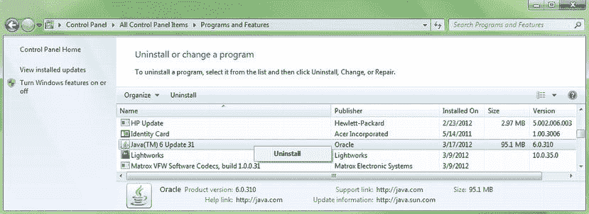
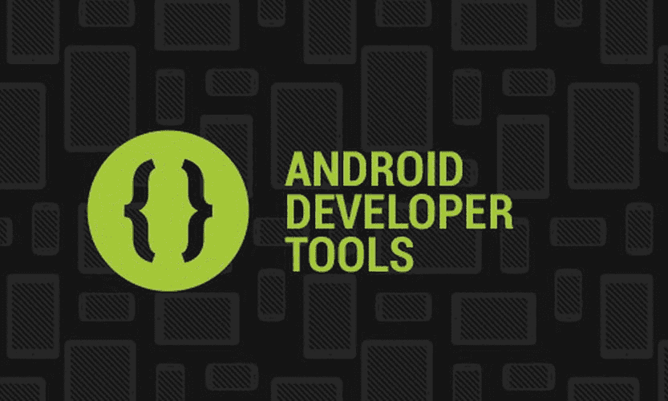

# 一、为 4.2 版本构建 Android IDE：获取、安装和配置 Android 开发环境

在学习 Android 应用开发之前，我们需要做的第一件事是在我们的开发工作站上构建一个可运行的 Android 应用开发环境。希望你有一台入门级的四核 AMD 或 Intel 电脑，配 4GB 或以上 DDR 内存，Windows 7 或 Windows 8；我将为这本书使用的电脑是 398 美元的宏基 64 位四核 AMD，运行频率为 3.1GHz，配有 4GB 的 DDR3 内存和 1TB 的硬盘驱动器，以及我在沃尔玛买的 Windows 7。

幸运的是，对于我们这些 Android 应用开发者来说，只需几百美元就能买到非常强大的 64 位计算机！如果你有一台 32 位的计算机，这也同样适用于 Android 应用开发，因为 Android 4.2 开发环境有 32 位和 64 位两种版本。此外，我们将在本书中用于应用开发的所有软件都是免费的商业用途，也称为开源软件，因此，现在启动自己的 Android 应用软件开发业务的成本确实很低。

如果出于某种原因，你想使用早于 Android 4.2.2 的开发环境(我强烈建议不要使用)，本书末尾有一个附录，介绍了安装 Android 4.1.2 开发环境的更复杂的工作过程。

我们的攻击计划

在本章中，我们将确保我们的系统拥有最新版本的 Oracle Java 6 软件开发包 (Java SDK，也称为 JDK，或 Java 开发包)编程环境，以及 Android 软件开发环境，其中包括 Google Android 软件开发包(SDK)、Eclipse 的 Android 开发工具(ADT)插件和 Eclipse 4.2 集成开发环境(IDE)。

所有这些一次性安装在一起的软件被称为 **Android ADT 捆绑包** ，从 Android 4.2 开始，你现在可以在`http://developer.android.com`的 **Android 开发者**网站一次性下载所有这些软件，下载容量不超过 400MB。

在 Android 4.2 Jelly Bean+(Android API 17 级)之前，开发者必须单独下载并安装这些组件中的每一个，这相当繁琐。如果你想这样做，或者想看看必须这样做是什么样子(并更好地理解 Eclipse 和 Android SDK 和 Android ADT 之间的关系),你可以在本书的附录 A 中看到安装的详细版本。

一旦下载并安装了我们的 JDK，我们将下载并安装一个名为 **Android ADT 捆绑包**的 Android 集成开发环境(IDE) ，它的基础是 Eclipse 4.2 Juno for Java EE IDE。Eclipse 为我们提供了一个流畅的图形用户界面(GUI ),我们可以用它来编写、运行、测试和调试我们的 Android 应用代码，从而使开发 Android 应用变得更加容易。

Eclipse 运行在 Java Runtime Environment (JRE) 之上，因为 Eclipse 是用 Java 编写的，因此它使用 Java 平台来运行自己的代码库，这些代码库构成了 Eclipse IDE 用户界面和特性集，您将会看到(随着您在本书中的深入)这些特性确实非常广泛。

这是我们首先下载并安装 Java 6 JDK 的主要原因，这样 Java SDK 和 JRE 就在我们的工作站上了。这样，一旦我们开始安装基于 Eclipse 的 ADT 包，Eclipse 就可以很容易地找到 Java 运行时环境(以便 Eclipse 可以启动和运行)。一旦 Eclipse 能够找到 Java，它可以使用 Java SDK 为我们的 Android 开发环境构建 Java 编程代码基础，因为 Android API(SDK)是基于 Java 6 API(SDK)的。

一旦我们下载并安装了 ADT 包，并在 Java 6 上顺利运行，我们实际上已经在一个包中安装了 Google Android 软件开发工具包(SDK)、Eclipse 4.2.2 IDE 和为 Android 4.2.2 API Level 17 开发所需的所有 ADT 插件。

从鸟瞰的角度来看，如果这个过程被公式化为一个方程，它看起来会是这样的:

**JDK (Java 6 SDK) + ADT 捆绑包(Eclipse + Android SDK + ADT Eclipse 插件)=自定义 Android IDE**

作为 Android Bundle 安装和开发使用配置工作流程的一部分(第二个主要部分)，我们将安装一些 **Android 虚拟设备** (AVD) 模拟器，这些模拟器将存在于 Eclipse 4.2 中，允许我们在各种 Android 虚拟设备上测试我们的应用，例如虚拟 Nexus 7 平板电脑，虚拟 Nexus S 智能手机，甚至虚拟 GoogleTV 电视机。因此，让我们现在就开始这个过程，这样我们就可以完成它，并在下一章开始开发应用！

Android 编程基础:Java 6

从编程和集成开发环境(IDE)的角度来看，Android 应用开发的基础是 Java 6。Android 应用是使用 Java 6 编程语言编写的(也使用 XML，我们将在第 2 章中更详细地讨论)，Android 应用是在 Eclipse 4.2.2 IDE 中开发的，它也是用 Java 6 编程语言编写的，并且运行在 Java 6 运行时环境(也称为 JRE)之上。委婉地说，您设置构成 Android 开发环境的各种软件组件的确切顺序非常重要，这也是第一章的原因。

因此，我们既有 Java 编程语言(我们可以通过 JDK 或 Java 开发工具包获得)又有 Java 运行时环境(JRE )(它是 JDK 的一部分),请访问 Oracle TechNetwork，下载最新的 JDK 6 安装软件并将其安装在您的计算机上。我们这样做首先是因为 Eclipse 需要 Java 来运行，也就是说，Eclipse 可以说是在 Java 平台和语言的“顶部”运行。Android 的 Android 开发者工具(ADT)插件也需要 Java 和 Eclipse，所以我们首先安装 Java 平台和 Java 环境，然后安装 Android ADT 包。

我们开始吧。

安装 JDK

我们必须做的第一件事是访问 Java SDK 下载页面，有两种方法可以做到这一点；一个是通用的，一个是精确的。即使 Oracle 更改了其 Java SDK 下载页面的位置(它很可能不会更改),也始终有效的通用方法是使用 Google 搜索，关键字短语为**“Java SDK Download”和**,这将显示 Oracle TechNetwork Java 下载 URL。第二种方法是直接在浏览器中键入页面的 URL。下面是网址:

```java
`http://www.oracle.com/technetwork/java/javase/downloads/index.html`
```

这指向的是 Internet (HTTP)和 Oracle 网站在它们的 TechNetwork 区域(文件夹)在 Java 区域(子文件夹)在 Java SE 或 Standard Edition 区域(子子文件夹)在下载区域(子子子文件夹)。Java 有三个主要版本:面向个人用户的 SE 或标准版，面向大量用户的 ee 或企业版，以及面向老式移动翻盖手机的 ME 或 Micro 版。大多数现代智能手机使用 Android 和 Java SE，而不是 Java ME。Android 非常酷的一点是，它像 PC 一样使用完整的 Java 标准版(即 Java SE)。这是因为 Android 运行在完整版本的 Linux 操作系统内核之上，所以对于所有实际用途来说，Android 消费电子设备本质上是一台成熟的 Linux 计算机。

一旦你输入了这个 URL，你就到达了 Java 6 JDK 下载页面，你需要找到这个页面的 Java 6 JDK 下载部分，它看起来就像[图 1-1](#Fig1) 中所示的(部分)页面部分。


[图 1-1。](#_Fig1)Oracle tech network Java SE 网页的 Java SE 6 JDK 下载部分

向下滚动页面大约一半，点击 JDK 下的蓝色**下载**按钮(记住，JDK 既包含*又包含*JDK 和 JRE，所以根本不要下载 JRE)，如图[图 1-1](#Fig1) 所示。

这将带您进入图 1-2 所示的 Java 6 JDK 下载页面，您首先接受软件许可协议，然后下载 Java 6 的 Windows 32 位版本或 Windows 64 位版本。


[图 1-2。](#_Fig2)接受 Java 6 许可协议并下载 Windows x86 32 位或 Windows x64 64 位。exe 文件

如果您使用的是 Linux 操作系统或 Solaris 操作系统，也可以在这里找到这些操作系统的 32 位和 64 位版本。请注意，在下载 Windows x86 32 位之前。exe 文件或 64 位 Windows x64。exe 文件，必须点击网页部分顶部“接受许可协议”选项旁边的单选按钮选择器，如图[图 1-2](#Fig2) 所示。一旦你这样做了，右边的下载链接就会变成粗体，你可以点击它们来下载安装文件。

如果你有 32 位 Windows 操作系统，如 Windows XP，点击**jdk-6u43-windows-i586.exe**链接(或任何最新的更新版本),或者如果你有 64 位 Windows 操作系统，如 Windows 7 或 Windows 8，点击**jdk-6u43-windows-x64.exe**链接(或任何最新的更新版本),然后将 JDK 6 安装程序文件下载到你工作站上的下载文件夹中。请注意，你不*而*需要下载这两个文件。

删除任何过期的 JDK

在您安装当前的 Java 6 JDK 之前，您应该检查您的系统，以确保您的工作站上没有预先存在的(旧的)Java 版本。这是在 Windows 中通过控制面板完成的，控制面板可通过 Windows 开始菜单访问。现在启动控制面板，找到标有“程序和功能”的图标，启动如图[图 1-3](#Fig3) 所示的程序和功能对话框。



[图 1-3。](#_Fig3)右键单击现有的 Java 安装，选择卸载将其从系统中移除

注意，在我的工作站上，我已经安装了 32 位 Java 6 Update 31。因为我想在这个安装过程中安装最新的 64 位开发软件，所以我将使用完全相同的工作过程卸载以前的 Java 6 Update 31 安装，以及任何旧版本的 Eclipse 和 Android(如果它们存在，但它们不在这个特定的工作站上)。

为此，你需要选择旧版本的 Java，然后右击它，选择**卸载**选项，如图[图 1-3](#Fig3) 所示。然后，Windows 继续从您的系统中删除旧版本的 Java(以及 Eclipse 和 Android，如果需要的话)。

接下来，进入你的**下载**文件夹(或者你的桌面，或者任何你保存文件下载的地方)，双击 jdk-6u43-windows-i586.exe 或者 jdk-6u43-windows-x64.exe**的**文件开始 Java 6 的安装。接受安装的默认设置，如果您有一个配有高速硬盘驱动器和至少 3GB 内存的现代工作站，安装过程应该会很快。

一旦 Java 6 JDK 安装完成，您就可以下载并安装 Android ADT 包了。接下来让我们这样做，这样我们就有了一个 Android IDE 设置，可以在本书的剩余部分中用于我们未来的 Android 应用开发。

Android 开发者工具(ADT)包

从 Android 4.2 Jelly Bean 开始，Android 软件开发工具包(或 Android SDK)与 Eclipse IDE 和 Android 开发工具(ADT) 捆绑在一个称为 ADT Bundle 的 400MB 大下载包中。

下载 Android ADT IDE

我们必须做的第一件事是访问 Android 开发者网页，同样有两种方法可以做到这一点；一个普通，另一个精确。即使谷歌改变其 Android 开发者网页的位置(它很可能不会改变)，通用的方法也总是有效的，那就是使用带有关键词短语“Android Developer Website”的谷歌搜索，这应该会调出`Developer.Android.com`网站 URL。第二种方式是直接在浏览器中输入 Android 开发者网页的网址(建议大家熟记这个网址):`http://developer.android.com/index.html`

.

一旦你输入网址，你就到达了 Android 开发者网站主页，你需要找到页面底部的**Get SDK**按钮，它看起来就像[图 1-4](#Fig4) 所示的菜单。


[图 1-4。](#_Fig4)选择获取 SDK 按钮转到`Developer.Android.com`站点上的 Android SDK 下载页面

一旦你点击**获取 SDK** 按钮，你就会被带到**获取 Android SDK** 页面，在这里你会看到一个蓝色的大按钮，上面写着:**下载 Windows 的 SDK - ADT 捆绑包**(如果你目前使用的是 Linux 或 Macintosh 操作系统，也可能是 Linux 或 Macintosh 网站会自动检测您的操作系统，并为您提供正确的下载链接)。点击这个蓝色按钮，如[图 1-5](#Fig5) 所示，进入下载页面获取 Android SDK ADT 捆绑安装程序。zip 文件，现在有 32 位和 64 位版本。


[图 1-5。](#_Fig5)点击`Developer.Android.com`获取 Android SDK 页面上的下载 Windows ADT 捆绑包 SDK 按钮

一旦你点击**下载 SDK ADT 捆绑包**按钮，你将被带到如图[图 1-6](#Fig6) 所示的页面，在这里你可以阅读软件包的许可协议(Android 4.2.2 SDK，Eclipse 4.2.2，Android 开发者工具等)。)下载到捆绑安装中。


[图 1-6。](#_Fig6)同意条款和条件，并在`Developer.Android.com`页面下载面向 Windows 的 SDK ADT 捆绑包

在您单击**“我已经阅读并同意上述条款和条件”**复选框，然后选择您正在运行的操作系统类型(32 位或 64 位)的单选按钮后，您可以单击**下载 Windows SDK ADT 捆绑包**按钮，并下载适合您的操作系统类型的 zip 文件。

因为我有一个 Windows 7 64 位四核 AMD 系统，所以我选择了 64 位 SDK 版本，这是截至 Android 4.2 API Level 17 最近才推出的版本，也称为 Jelly Bean Plus。在 2012 年 11 月下旬 Android 4.2 问世之前(在感恩节假期，信不信由你)，Android 应用开发人员别无选择，只能使用 32 位开发软件环境，即使他们在 64 位工作站上开发。因此，如果您喜欢在 64 位工作站上保持 64 位的整洁，那么您很幸运！现在，让我们开始下载，将那个 400MB 的文件下载到我们工作站的硬盘上。

安装 Android ADT IDE

400 MB 下载完成后，打开 Windows 资源管理器文件导航和文件管理实用程序，找到。系统下载文件夹中的 zip 文件。如果找不到，请在右上角的搜索框中使用通配符输入 zip 文件的部分名称，并在左侧选择您的计算机或 C:\ drive，Windows 资源管理器将为您找到该文件。

下面是我使用的搜索字符串:`adt-bundle*.zip`(星号通配符可以扩展以适合文件名中的任何内容)。

一旦您找到了 **adt-bundle-windows** zip 存档文件，右键单击它以获得一个上下文相关的菜单，其中包含可以对该文件执行的所有操作，并选择 **Extract All。。。**选择将 zip 存档中的所有文件和文件夹提取到您的硬盘上。这显示在[图 1-7](#Fig7) (用红色圈出)。


[图 1-7。](#_Fig7)右键单击 Downloads 文件夹中的 adt-bundle zip 文件，并选择 Extract All。。。选择权

接下来，您将看到一个**提取压缩文件夹**对话框，要求您选择要将 ADT 包文件和文件夹层次结构提取到的目标目录。如[图 1-8](#Fig8) 中的顶部对话框所示，存档提取实用程序将文件的当前位置放入您的系统下载文件夹作为其目标路径，这并不奇怪，因为它确实不知道您想要将这些文件放在哪里，所以它做了一个假设，将自己放在 zip 文件当前“站立”的地方，可以这么说。让我们改变位置，将文件放在工作站上更合理的位置。


[图 1-8。](#_Fig8)将解压缩文件的目标文件夹从 C:\Users\Username\Downloads 更改为 C:\adt-bundle-windows

因为我们并不真正希望我们的 adt 包安装到我们的 downloads 文件夹中(我们主要使用它来保存我们的文件下载)，所以最简单的工作过程是将它移动到我们的 C:\ primary 硬盘驱动器的顶部或“根目录”，所以让我们在文件名中单击 ADT 包前面的光标，然后在自动生成的路径名的 Downloads、( *Your User Name Here* )和 Users 部分上退格。

这样，您就在刚刚下载的作为文件夹名称的`adt-bundle-windows-x86 .zip`文件名前面加上了 C:\ hard drive 说明符。这将把 ADT 包安装在主硬盘分区上 C:\驱动器的根目录(顶部),您可以在需要的任何时候方便地看到和找到它。产生的路径显示在图 1-8 中[屏幕截图的下部。](#Fig8)

注意，如果你愿意，你也可以删除文件夹名称的`windows`和`x86`部分，并把文件夹命名为`C:\ADT`或`C:\ADT-Bundle`，或者`C:\Android_Development_Environment`或类似的名字。因为您将找到并设置此应用可执行文件的快速启动图标，所以无论您将此顶级文件夹称为什么都不重要，只要您可以轻松找到它。

一旦你点击**提取**按钮，你会得到一个小的进度对话框，如图[图 1-9](#Fig9) 所示，它向你显示了所有的 8740 个项目(584 兆字节)正在被膨胀并复制到你的硬盘上。这个过程完成后，打开您的 Windows Explorer 文件查看实用程序，找到 eclipse.exe**，**，这是 Eclipse 4.2.2 应用的可执行文件。


[图 1-9。](#_Fig9)从 400MB 的 ADT 捆绑包 zip 文件中提取 8，740 个文件，共 584MB

为此，在 Windows Explorer 实用程序中打开左侧导航面板上的 C: drive，然后查找您下载、安装并命名的 **adt-bundle-windows-x86** 文件名，在该文件名下，您将找到 eclipse 文件夹及其子文件夹，如图[图 1-10](#Fig10) 所示。如果您使用了自己的自定义名称，比如`ADT_Bundle`，那么就寻找您决定用于 ADT 包文件夹的名称。


[图 1-10。](#_Fig10)在 Windows 资源管理器中找到 Eclipse 应用文件，点击右键调用“锁定到任务栏”特性

在任务栏上设置快速启动图标

在单词 **eclipse** 旁边寻找一个紫色球体，其文件类型为“application ”,这就是您的 Eclipse IDE 软件可执行文件。接下来，右键单击这个 **Eclipse 应用文件**以获得另一个上下文相关的命令菜单，然后选择该菜单第三部分中的**固定到任务栏**命令。这将 Eclipse 作为一个快速启动图标安装在任务栏程序启动区域。这个工作过程也如图 1-10 中[所示。](#Fig10)

一旦从右键菜单中选择了 **Pin to Taskbar** 命令，Eclipse 4.2 ADT Bundle 紫色球体启动图标就会出现在 Windows 任务栏上。这通常位于操作系统屏幕的底部，但可以停靠(通过拖动)到屏幕的顶部，甚至是左侧或右侧。[图 1-11](#Fig11) 显示了安装在我的 Win7 任务栏上的 Eclipse 4.2 ADT 捆绑包启动图标以及其他专业开源软件包(GIMP、Blender 3D、Audacity、Lightworks、OpenOffice 和 Chrome，按此顺序显示)，其中许多我们将在本章稍后安装。


[图 1-11。](#_Fig11)Eclipse 4.2 ADT 捆绑包启动图标显示在 Windows 任务栏的最左侧

单击 Eclipse 快速启动图标，确保 Eclipse for ADT 启动；如果是的话，这意味着您已经正确地安装了 Java 6，并且 Eclipse ADT Bundle 已经成功地找到了 Java，并且正在使用它来运行它的集成开发环境。启动屏幕如[图 1-12](#Fig12) 所示。



[图 1-12。](#_Fig12)通过新安装的快速启动图标启动 Eclipse 4.2.2 的 Android 开发者工具版本

值得注意的是，从 Android 4.2 Jelly Bean+开始，Eclipse Juno 4.2 启动屏幕现在已经消失，新的 ADT Bundle 启动屏幕显示 Eclipse 现在是我们刚刚安装的 64 位 **Android Developer Tools** 软件包的一个集成部分。

启动和配置 Android 开发人员工具 IDE

在您启动 Eclipse 4.2 for Android Developer Tools 软件后，您看到弹出的第一个屏幕是**Contribute Usage Statistics**对话框。您只在第一次启动 Eclipse ADT 包时看到这个屏幕，所以现在选择您想要的共享使用统计信息的选项。如果你愿意，你可以随时通过 Android 的使用统计菜单序列改变你的想法(选择的选项)。

我选择了**将使用统计数据发送给 Google** (是)选项，这样 Google 就可以看到我是如何使用 Eclipse 和 ADT 的，这样他们就可以对产品进行改进。您也可以选择没有负面影响的“否”选项。该对话框如图[图 1-13](#Fig13) 所示。


[图 1-13。](#_Fig13)首次启动 Eclipse ADT 软件时遇到的 Contribute 使用统计对话框

做出选择后，单击 **Finish** 按钮，Eclipse ADT 包继续启动 Android 集成开发环境(IDE)。

当你第一次启动 Eclipse 4.2 的 Android 开发者工具版本时，你会看到一个 **Android IDE 欢迎界面**。我们将在本书的前几章中介绍屏幕上的所有内容，所以如果你想读的话，请全部阅读，然后使用顶部 **Android IDE 标签**右侧的 **X** 关闭它。一旦你这样做了，一个空版本的 Eclipse IDE 就会出现，如图 1-14 所示。


[图 1-14。](#_Fig14) Eclipse 4.2 for ADT 首次启动时显示空的包资源管理器、编辑、控制台和大纲窗格

我们要做的第一件事是确保我们刚刚安装的 ADT 包是最新的。我们通过**帮助**菜单和位于底部的**检查更新**命令来完成。一旦你选择了这个选项，你会看到如图[图 1-15](#Fig15) 所示的对话框。如果在 ADT 软件包安装过程中安装了 8，740 个文件的更新版本，您将看到**检查更新。。。**函数“获取”它们，并更新当前系统上的旧版本。


[图 1-15。](#_Fig15)使用 Eclipse 和 Google 上的软件库在线检查 Android 软件更新

现在让我们看看如何在任何时候访问 Eclipse ADT 捆绑包的 **Android SDK** 部分，以了解 Eclipse 中当前安装的 Android API 支持级别。

Android SDK 管理器工具

因为我们下载了 Android 4.2 ADT 捆绑包，所以我们知道这将至少是 Android 4.2 API Level 17，但现在让我们使用 **Android SDK Manager** 工具来深入了解一下，看看 Android SDK 实际上为我们提供了哪些支持。我们可以通过 Eclipse 4.2 的**窗口**菜单，以及位于该菜单底部的 **Android SDK 管理器**选项，随时访问 Android IDE 的 Android SDK 部分。点击这个选项会打开一个 Android SDK 管理器窗口，显示我们当前在 Android IDE 中安装了哪些 API 级别(Android OS 版本)。让我们现在就开始，这样您就可以看到 ADT 捆绑包实际安装在您的 PC 上。

正如您在[图 1-16](#Fig16) 中看到的，这包括 Android SDK 工具、Android SDK 平台工具、Android SDK 4.2 平台、ARM 处理器系统映像(用于在我们即将设置的仿真器中进行测试)以及 Android 支持库。 **Android 支持库**允许支持以前版本的 Android，因此我们不需要下载所有其他 API 级别来支持所有的硬件设备。值得注意的是，这是我们在本书的示例中只使用在此过程中安装的 Android API Level 17，而不下载 Android SDK Manager 中显示的任何其他 Android API 的主要原因。


[图 1-16。](#_Fig16) Android SDK 管理器对话框，显示 ADT 捆绑包中安装的库和包

将来，如果你绝对需要开发其他版本的 Android，比如亚马逊 Kindle Fire 的 2.3.7，或者亚马逊 Kindle Fire HD 的 4.0.4，只需选择这些 Android 版本，然后点击**安装包。。。窗口右下角的**按钮。我强烈建议你一次只开发一个 API 级别，并且只针对那些你完全确定需要开发的 Android API 级别，因为每个级别都需要下载数百兆字节的文件和文档。

因为我们现在不会对 Android SDK 管理器做任何事情，所以单击窗口右上角的红色 X 关闭它，让我们准备好为我们正在开发的 Android 设备设置模拟器。在下一节中，我们将学习如何为一些更流行的智能手机、平板电脑和 GoogleTV 消费电子设备设置 AVD 仿真器。

配置 Android 虚拟设备(avd)

为本书的其余部分准备好您的 Android 开发环境的过程的最后一步是设置您的 **Android 虚拟设备** (AVDs)。一个 **AVD** 是一个**模拟器**，它模仿安卓智能手机、平板电脑、电子阅读器、独立电视(GoogleTV)或机顶盒消费电子产品，允许你在你的工作站上测试你的安卓应用。T9】

拥有一个仿真器是很有必要的，因为不断地将应用上传到实际的物理 Android 设备(硬件)上的工作过程比右键单击项目并选择 Run As Android Application 要繁琐得多。这并不是说你不应该偶尔在真正的 Android 硬件设备上测试你的应用，而是 AVD 允许你在开发时测试，并且速度更快，频率更高。在本节中，我们将创建三个这样的设备:一个 Nexus 7 平板电脑、一个 Nexus S 智能手机和一个 Android iTV 电视机。

因为你已经在 Eclipse 中，进入**窗口**菜单，选择底部附近的 **Android 虚拟设备管理器**选项。这将打开 **Android 虚拟设备管理器**对话框，其中列出了你的 avd。您当前没有 AVDs 设置，它显示:**在对话框的中心区域没有可用的 AVD**，如图[图 1-17](#Fig17) 所示。T11】


[图 1-17。](#_Fig17) Android 虚拟设备管理器对话框——点击新建。。。添加 AVD 的按钮

要向您的 Eclipse 环境添加一个新的 AVD，单击 **New。。。对话框右上方的**按钮，打开**创建新的 Android 虚拟设备(AVD)** 对话框。

创建您的 Nexus 7 平板电脑模拟器

我们要做的第一件事是命名我们的仿真器，所以在**名称:**字段输入:**Android _ 4.2 _ Emulator _ Nexus _ 7**，如图[图 1-18](#Fig18) 所示。在**设备:**字段中，使用下拉菜单(通过向下箭头)选择 **Nexus 7** 平板电脑选项。然后选择**目标:**对于仿真器，是仿真器的 API 级别，是 Android 4.2，或者 API 级别 17，是 Android OS 目前最新的修订版。T13】


[图 1-18。](#_Fig18)使用 AVD 管理器为 Nexus 7 平板电脑和 Nexus S 智能手机创建新的 Android 设备(AVD)

因为 Nexus 7 使用的是 ARM (armeabi-v7a)处理器，所以这个字段是自动为你设置的，不能更改。接下来，检查**硬件键盘存在**和**显示带有硬件控件的皮肤**，因为这些选项适合拥有无线键盘的用户使用 Nexus 7，大多数严肃的用户都会这样做。

将**前置摄像头**选项下拉菜单设置为:**网络摄像头**如果您的工作站上安装了网络摄像头，否则选择**无**。这是从 Android 4.2 开始的新的 Android AVD 模拟器功能。注意，在 Android API Level 17 之前，Android Emulator (AVD)不支持任何种类的摄像头测试。

Nexus 7 AVD 配置文件根据 Nexus 7 制造商的硬件规格，为您设置**内存选项**和**内部存储**设置。接下来，将 **SD 卡**设置为普通 **2048MB** SD 卡配置，勾选**快照**选项。

最后，点击 **OK** 按钮，创建三个 Android 4.2 AVD 仿真器中的第一个，这一个用于 Nexus 7 平板电脑。如果你打算开发其他一些流行的 API 级别的平板电脑，利用完全相同的工作流程，并添加其他名为 **Kindle Fire** (使用 Android 2.3.7 API 级别 10 和 HDPI)或 **Kindle Fire HD** (使用 Android 4.0.4 API 级别 15 和 XXHDPI)的仿真器，例如，如果你需要测试你的应用在那些其他特定硬件平台上的交付。

接下来，让我们为 Nexus S 创建一个智能手机仿真器，如[图 1-18](#Fig18) 右侧所示，这样我们就有了一个智能手机仿真器和一个平板电脑仿真器。

创建您的 Nexus 智能手机模拟器

我们做的第一件事是命名模拟器，因此在**名称**字段中输入**Android _ 4.2 _ Emulator _ Nexus _ S**。在**设备**区域，使用下拉菜单(通过向下箭头)选择 **Nexus S** 选项。然后为模拟器选择**目标**，同样是 Android 4.2 API Level 17。

接下来检查**硬件键盘存在**和**显示带有硬件控件的皮肤**，因为这些选项适合 Nexus 的高级用户，并使应用测试更容易。如果您的工作站上有网络摄像头，请将**前置摄像头**选项下拉菜单设置为**网络摄像头**，否则选择**无**。T11】

Nexus S AVD 配置文件根据 Nexus S 的硬件规格为您设置了**内存选项**和**内部存储**设置。接下来，将 **SD 卡**设置为普通 **1024MB** SD 卡配置，勾选**快照**选项。最后，单击 **OK** 按钮创建第二个 AVD 仿真器。我们现在在 Android 虚拟设备管理器窗口中创建了两个模拟器，如图 1-19 所示。


[图 1-19。](#_Fig19) Android 虚拟设备管理器展示了两款适用于 Nexus 7 平板电脑和 Nexus S 智能手机的新模拟器

我们真正应该创建来测试我们在本书中的内容的唯一其他类型的 Android 虚拟设备是上市的最新类型的 Android 设备 iTV，或交互式电视机。

为 GoogleTV 支持创建您的 Android iTV 模拟器

Android iTV 电视机运行一个名为 GoogleTV 的品牌版本的 Android 操作系统，可以作为 iTV 电视机、机顶盒(STB)或家庭媒体中心(HMC)使用，甚至可以作为飞利浦产品的 USB 记忆棒使用。

幸运的是，我刚刚得到了新的飞利浦谷歌电视 u 盘产品，用于我的一个客户的 Android 应用开发项目。因此，我有了产品的规格，我需要创建自己的自定义 AVD 设备定义规格来创建用于测试的 AVD。

我需要做的第一件事是查看它是否在标有设备定义的右侧选项卡上的预配置 avd 列表中，如[图 1-20](#Fig20) 所示。但是，Philips GoogleTVu 盘不在其中，因此我们需要进入另一系列对话框，将 Philips Google TV 产品添加到当前 AVD 管理器设备定义对话框中的产品列表中。我在我们的平板电脑和智能手机模拟器中添加 iTV 模拟器的原因之一是专门向您展示这个工作过程，因为它在 AVD 管理器中比 AVD 创建过程隐藏得更深。


[图 1-20。](#_Fig20)AVD 管理器设备定义选项卡，您可以从中选择预定义的 AVD 设备或创建自己的设备

解开这个新设备定义工作流程的关键是，你猜对了，**新设备。。。**按钮，位于 Android 虚拟设备管理器的**设备定义**标签面板的右上角。点击**新建设备。。。**按钮，得到**创建新设备**对话框，如图[图 1-21](#Fig21) 所示。


[图 1-21。](#_Fig21)AVD 管理器窗口的设备定义选项卡中的创建新设备对话框

“创建新设备”对话框允许我们为 Android 虚拟设备管理器窗口中的“设备定义”选项卡创建自定义产品设备定义。现在让我们为飞利浦谷歌电视 u 盘创建一个。在**名称:**栏，放置飞利浦的 GoogleTV 盘的产品名称，同时输入最常见的**屏幕尺寸: **42** 英寸的**，其物理像素分辨率为 HDTV **1920 x 1080** 像素。因为高清电视没有**传感器**，不要勾选这四个选项，因为谷歌电视 u 盘没有任何**摄像头**，也不要勾选这两个选项。飞利浦 GoogleTV 盘产品使用鼠标，因此选择**轨迹球**的输入部分选项。

该产品具有 1GB 的 RAM，因此在 **RAM:** 字段中输入一个 **1** ，并选择 **GiB** 下拉菜单选项。该产品具有超大尺寸，因此为**尺寸:**选项选择 **xlarge** 值，为**屏幕比例:**选项选择 **long** ，因为高清电视是宽屏设备。像素密度为 1920 x 1080 像素，与屏幕尺寸无关，因此选择 **XXHDPI** 作为**密度:**设置。由于本产品是 u 盘，选择**按钮的**软件**:**选项，然后启用**纵向**和**横向**模式复选框，如图[图 1-21](#Fig21) 所示，因为本产品在这两种模式下都能正常工作。

正确输入所有这些新产品规格后，可以点击对话框底部的**创建设备**按钮，将新的产品定义添加到 AVD 管理器窗口的设备定义选项卡中，如图[图 1-22](#Fig22) 所示。


[图 1-22。](#_Fig22)飞利浦谷歌电视 u 盘添加到 AVD 管理器设备定义列表

现在我们在设备定义选项卡中有了 Philips GoogleTV USB stick 产品，我们可以选择它，如[图 1-22](#Fig22) 所示，并通过单击对话框中间的创建 AVD…按钮，使用该产品定义创建一个新的 Android 虚拟设备仿真器。

这将打开**创建新的 Android 虚拟设备(AVD)** 对话框，如图[图 1-23](#Fig23) 所示，在对话框的相关区域有适当的设备设置，很像我们为谷歌 Nexus 产品创建 AVD 仿真器时观察到的情况，如图[图 1-18](#Fig18) 所示。


[图 1-23。](#_Fig23)为飞利浦谷歌电视 u 盘创建新的 Android 虚拟设备

请注意，ADT 为我们将设备命名为**AVD _ for _ Philips _ Google TV _ USB _ Stick**，并且它还在第二个**设备:**下拉菜单中为我们选择了该产品。**目标:**默认 **Android 4.2 API Level 17** 也是自动为我们设置的，所以我们所要做的就是填写**内部存储**和 **SD 卡**值，它们都是 **4GB** 。

选择快照选项，确保**键盘**和**皮肤**选项未选中，因为产品没有键盘或硬件控制功能。注意，我们的内存(RAM)设置是正确的，为 **1024** 兆字节(1GB)，就像我们之前在**创建新设备**对话框中设置的一样。

填写完所有相关字段后，点击 **OK** ，为飞利浦谷歌电视 u 盘创建 AVD。请注意，飞利浦谷歌电视 u 盘 AVD 已被添加到图 1-24 中[的 AVD 管理器主窗口，我们现在有了用于智能手机、平板电脑和 iTV 的 AVD。](#Fig24)


[图 1-24。](#_Fig24)飞利浦谷歌电视 u 盘被添加为 Android 虚拟设备

现在我们已经为 Android 应用开发做好了准备，让我们去寻找一些我们将在本书中使用的新媒体工具，为我们的应用添加元素，使它们与众不同。我们将获得主要的新媒体开发软件类型，包括数字图像(GIMP)、数字音频(Audacity)、数字视频(Lightworks)和 3D (Blender)。所有这些专业级开源软件包都可以在所有 Windows (XP、Vista、7 和 8)和 Linux 平台上使用。

Android 开发中使用的新媒体工具

因为我们正在下载和安装第一章中的软件包，以完成开发所必需的所有必要的繁重工作，但这并没有教会我们任何实际的 Android 应用开发，所以让我们也抓住所有其他强大的开源软件，我们将需要与 Android 开发环境结合使用，以创建真正令人难忘的、丰富的媒体加载用户界面(ui)和用户体验(UXs)。

我们将在第一章中解决所有这些软件下载和安装的问题，并为我们自己构建一个内容开发工作站，为所有类型的新媒体内容开发提供良好的服务。

数字成像软件:GIMP 2.8.4

首先，让我们安装领先的开源数字成像软件包 GIMP 2.8.4 for Windows。如果你有 Photoshop CS6 那很好，但是为了确保所有的读者都有一个专业的图像应用，你需要下载并安装 GIMP，因为它是免费的！

你可以找到瘸子 GIMP.org。在页面的右上方，你会看到一个**下载**按钮以及一个**下载**链接(见[图 1-25](#Fig25) )，点击后会将你带到 GIMP 2.8 下载页面。接下来，单击与您的系统当前运行的操作系统相匹配的 GIMP 程序版本的下载链接。对于我的 Windows 7 工作站，我下载了。GIMP 2.8.4 的 Windows XP、Vista、Windows 7 和 Windows 8 版本的 EXE 安装程序。


[图 1-25。](#_Fig25)GIMP 2.8 下载按钮和下载链接位于 www.gimp.org[网站](http://www.gimp.org)

找到。EXE 安装程序文件，双击它，使用建议的默认设置安装软件。然后，在你的 Program Files 文件夹中找到这个文件，右击应用 EXE 文件，然后**固定到任务栏**，这样它就位于任务栏的启动图标区域，如前面的[图 1-10](#Fig10) 所示。您现在离创建一个极其强大的新媒体 Android 应用开发工作站又近了一步。接下来让我们得到一个领先的数字音频编辑软件包。

数字音频软件:Audacity 2.0.3

接下来，让我们安装领先的开源数字音频软件包 Audacity 2.0.3 for Windows。如果你有 Reason、SoundForge 或 ProTools，那很好，但为了确保我们都有一个专业的音频工程应用，你需要下载并安装 Audacity 2.0.3，因为它也是免费的！你可以在 SourceForge.net 开源网站找到 Audacity。

在首页的搜索栏中输入 **Audacity** ，就会找到【Audacity.SourceForge.Net】的**软件下载页面，如图[1-26](#Fig26)所示。在页面的左上角，你会看到一个**下载**按钮，带你去下载软件，在我的例子中，是 Windows 操作系统版本。**


[图 1-26。SourceForge 的 Audacity 2.0.3 项目。net—单击 Windows 2000/XP/Vista/Windows 7/Windows 8 的下载链接](#_Fig26)

接下来，单击与您的系统操作系统相匹配的程序版本的下载链接。Windows 版本的 EXE 安装程序。找到。EXE 安装程序文件，双击它并使用默认设置安装该软件。

接下来，在它的 **Program Files** 文件夹中找到该文件，右键单击该应用 EXE 文件并将**固定到任务栏**，使其位于任务栏的启动图标区域，如前面的[图 1-10](#Fig10) 所示。现在，您离创建超级强大的新媒体 Android 应用开发工作站又近了一步。

数字视频软件:EditShare Lightworks 11

接下来，让我们安装领先的开源数字视频编辑软件包**EditShare light works 11**for Windows。如果你有 FinalCut 或 AfterEffects CS6，那很好，但为了确保我们所有人都有一个专业的视频编辑应用，你应该下载并安装 Lightworks，因为它是免费的！你会在 **`www.LWKS.com`** 找到 Lightworks 11，在页面右上方会看到一个**下载**按钮，带你进入[图 1-27](#Fig27) 所示的下载页面。


[图 1-27。](#_Fig27)用于 Windows installer 的 EditShare Lightworks 11 下载页面

要下载此免费软件，您必须登录或注册，然后您可以单击与您系统的操作系统和位级别相匹配的 Lightworks 程序版本的下载链接。

就我而言，我下载了。Windows 7 64 位版本的 EXE 安装程序，大概 100MB 左右。请务必下载发行说明和自述文件，并彻底阅读它们，因为这是一个高端软件包，过去要花费数千美元。

下载完成后，找到。EXE 安装程序文件，然后双击它，并使用其默认设置安装该软件。如果您只安装一个 light works“seat”(一台机器上的一个副本)，请将其设置为数字 1(在安装期间出现的第一个对话框中输入 1 或 001)。请注意，您可能需要在第一个对话框中退格并实际键入一个 **1** 来激活下一步按钮(使其不变暗并可点击)。

然后，在它的 Program Files 文件夹中找到该文件，右键单击应用 EXE 文件并**固定到任务栏**，这样它就位于任务栏的启动图标区域，如前面的[图 1-10](#Fig10) 所示。您现在离创建您一直梦想的强大的新媒体 Android 应用开发工作站又近了一步。

3D 建模和动画软件:Blender 3D

最后，让我们安装领先的开源 3D 建模、渲染和动画软件包 Blender 3D 2.66 for Windows。如果你有 Lightwave 或 Maya，那很好，但为了确保我们所有人都有一个专业的 3D 应用，你应该下载并安装 Blender 3D，因为你又猜对了——它是免费的！

你可以在 **`www.Blender.org`** 找到 Blender 3D，在 Blender 主页的左上方，你会看到一个**下载**菜单，或者，如果你喜欢，在右上方有一个**下载 Blender** 链接，会带你到下载页面(见[图 1-28](#Fig23) )。


图 1-28。位于 Blender.Org 的 Blender 3D 网站显示了下载菜单(顶部)和下载 Blender 链接(右侧)

首先，点击下载 Blender 链接，在下载页面寻找与你的系统的操作系统和位级相匹配的程序版本。就我而言，我下载了。Windows 64 位版本的。一旦安装文件下载完毕，找到搅拌机。EXE 安装程序文件，双击它，并使用默认设置安装该软件。

接下来，继续通常的工作过程，在程序文件文件夹中找到该文件，右键单击应用 EXE 文件并**固定到任务栏**，这样它就位于任务栏的启动图标区域，如之前的[图 1-10](#Fig10) 所示。

现在，您已经创建了一个全面的新媒体 Android 应用开发工作站，可以在本书以及未来的软件开发项目中使用。这个新的媒体开发工作站将允许您开发具有高级 3D 图像、数字音频、数字视频和数字图像的高度专业的 Android 应用。恭喜你！你刚刚安装了开源软件，如果你付费的话，它的价格将是你刚刚购买这本书的一百倍。不错的投资回报！

摘要

在第一章中，我们准备好了所有的东西(或者更好的是，我们准备好了所有的软糖),为我们将在本书剩余章节中进行的 Android 应用开发做准备。

我们收购并下载了一系列非常有价值的内容制作软件，从 Java 到 Eclipse 到 Android，以及所有主要的四种新媒体类型的领先新媒体应用:3D 建模、数字视频编辑、数字音频编辑和数字图像编辑。

我们学习了 Eclipse 如何在 Java 之上运行，以及 Android SDK 如何通过 ADT 工具插件集成到 Eclipse IDE 中，以创建无缝的 Android 开发环境。我们看到，从 Android 4.2 开始，ADT 捆绑包的安装比过去要容易得多，附录 A 证实了这一点，并在更深层次上展示了 Eclipse 4.2、Android 4.1 SDK 和所有 ADT 插件是如何无缝集成在一起的。

在[第 2 章](02.html)中，我们将进入正题，创建我们的第一个 Hello World 应用，看看 Android 如何使用 Java 和 XML 以及我们的新媒体资源设置一切。我们将学习 Android 用来描述 Android 应用的不同领域和功能的术语，甚至在本章稍后构建的 Hello World 应用中使用其中的一个。