# 二、探索 Android 应用开发：Android 的行话并构建您的第一个 Hello World 应用！

因为本书面向已经熟悉计算机编程原理和工作流程的读者，所以每个人都熟悉 **Hello World** 编程示例的通用概念，该示例用于向我们展示关于任何给定编程语言和平台如何建立其基本代码结构并运行的所有基础知识。

因为我想让我们的读者在本书中尽可能快地达到中级水平，所以在本章的第二部分，我将在这里安装并运行 Hello World 应用。首先，我将讨论 Android 应用开发中使用的术语。然后，我们将使用 Hello World 应用示例向您展示 Android 如何构建其编程环境，并向您展示基本的 Android 应用开发工作流程。

我们将了解如何在 Eclipse 中创建新的 Android 应用项目，如何在 Eclipse Package Explorer 中构建和组织该项目，Android 如何使用 XML 标记快速轻松地定义数据结构、项目参数、操作系统权限和用户界面，这样我们就不必用 Java 来完成这些工作，我们的新媒体素材如何命名并存储在预定义的逻辑资源文件夹层次结构中，当然，Java 编程语言如何通过 Android 包、类、方法和常量来引导和整合这些内容。Android 开发绝对是独一无二的。

然而，首先，我们需要花一点时间预先了解 Android 应用的各种组件。我们将了解 Android 环境中各种 Android 组件的术语。Android 使用一些非常独特的术语或行话来描述各种 Android 应用组件，我们将学习这些行话以及这些组件如何无缝地一起工作。

然后，在本章的下一部分，我们可以开始工作，使用一些新的术语、XML 标记和 Java 编程语言来构建我们的第一个 Android 应用。

Android 应用开发行话

Android 使用非常独特的术语来描述其应用开发的各种组件或领域。在这一节中，我定义了这些领域是什么，以及它们与其他常见编程语言(如 C++ 或 Java)的最接近之处。此外，我将向您提供更多关于除了 Java 和 XML 之外还有哪些开源技术驱动 Android 的见解，以及 Android 如何将其 Java 优化为二进制文件，以便在嵌入式(便携式消费电子)设备上使用。

Android 的基础:Linux 2.6 内核

Android OS 的基础是 **Linux 2.6 内核**；就像 Eclipse IDE 运行在 Java 之上一样，Android 运行在最新 Linux 操作系统的完整版本之上。所以，是的，任何和所有的 Android 设备本质上都是功能齐全的 Linux 计算机，这就是为什么你现在看到的 Android 设备都有双核、四核和八核处理器，就像“真正的”计算机一样。内存也是如此——大多数 Android 设备都至少有 1GB 的 RAM(随机存取内存)，许多设备都有 2GB，很快你就会看到 3GB 或 4GB RAM 的 Android 设备。

Android 操作系统使用 Linux 操作系统的核心库来完成所有使用任何计算机操作系统完成的文件、内存和处理的底层工作，由于 Linux 高度优化，它可以比其他操作系统使用更少的内存(更高效地)来完成这些工作。为什么新的 Windows 8 操作系统的内存效率突然变得如此之高？因为它要和 Linux (Android)竞争，这就是原因。

据传，谷歌在更新的 Linux 3.8 内核上运行 Android 4.2.2，而 Android 5.0 将在 2013 年晚些时候在更现代的 Linux 内核上运行。

Android 优化:Dalvik 虚拟机(DVM)

Android 应用开发者使用 Android SDK 及其 Java 编程语言来访问较低级的 OS 功能，以及 Android 为使用各种新媒体素材、SQLite 数据库和 Android 设备的硬件特征(例如相机、陀螺仪、GPS 等)而提供的其他较高级的功能。

当您编译 Java 代码和其他素材(XML、音频、图像等)时。)Android 使用 DVM 或 Dalvik 虚拟机技术将这些文件优化为高度优化的二进制格式，就像可执行文件一样，只是为了在更小、更便携的设备上运行而进行了更多优化。如果你查看你的 Android APK 文件，你会在你的项目根目录下看到一个. DEX 文件。这是一个 Dalvik 可执行文件。

DVM 不是 Android 开发人员在日常开发中需要关心的事情，我在这里只是提到它，这样如果有一天你碰巧在 Android 相关的 Google 搜索中遇到它，你就会知道它是什么以及 DVM 在整个开发过程中做什么。接下来，让我们进入 Android 的行话，了解 Android 应用的四个主要组件，它们是什么，以及它们如何一起工作以形成一个统一的 Android 应用。

Android 活动:表示层

Android 使用术语**活动**来描述用户看到的应用的“前端”屏幕。

活动是设计元素的集合，它们一起工作，组成应用的每个屏幕视图。这些元素包括用户界面元素、文本、背景图形、3D、前景内容、数字视频、弹出菜单、动画元素和其他视觉设计组件，这些元素用于在应用的功能(其活动)和使用应用的最终用户之间提供界面。我们在本书的前两部分详细了解了活动。

在 Android 术语中，活动通常由一个**布局容器**组成，它将一系列被称为**小部件**的用户界面元素，连同应用的内容一起，组织和排列到预定义的屏幕区域中。如果你想包含图形元素，让你的设计更引人注目，那么你可以使用 **Drawables** ，这是 Android 对图像或动画等图形元素的术语。

Android 中的动画同时使用了 Widgets 和 Drawablesdrawable 用于基于帧的动画(光栅动画)，Widgets 用于基于程序或补间动画(矢量动画)，drawable 也是如此。令人惊讶的是，Android 将动画准确地称为:动画。Android 中还有一个术语与其他编程语言中的术语相同: **Events** 。事件允许使用**事件处理**代码来处理组成我们活动的许多元素，就像在许多其他编程语言中一样。因为本书的读者熟悉编程，并且因为需要事件处理来使本书前半部分的用户界面设计具有功能性，所以我将在本书的早期介绍事件，这样我们可以更快地创建更健壮的应用。

我们将在第四章的中学习更多关于 Android **Activity** 类，以及通过 Android **Layouts** 设计屏幕布局，这利用了 Android **ViewGroup** 类。在第五章中，我们将通过 Android 小部件学习更多关于用户界面设计的知识，这些小部件利用了 Android **视图**类。最后，当我们讲述在 Android 中使用数字图像、数字视频和动画的高级用户界面设计和图形设计时，我们将在第六章的中了解更多关于**事件**的信息，并在第七章到第十章的**中了解更多关于**的信息。

Android 服务:处理层

活动代表你的 Android 应用的前端或前台，而 Android **服务**代表后端或后台处理，如果你愿意的话，是繁重的工作。

Android **服务**类用于创建执行重复处理任务的 Java 类，通常通过称为循环的编程结构或通过数据获取过程(如流)在后台执行，同时用户通过其前端用户界面活动使用您的应用。一个很好的例子就是用户在使用你的应用时播放 MP3 音频文件。

Android 中的服务类有许多用途，明显和常见的用途是播放音频 MP3 和数字视频 MP4 文件以供娱乐，从远程服务器流式传输新媒体文件，将文本转换为语音(语音合成)，在玩游戏时计算游戏逻辑，处理 Android Live 壁纸或 Android 白日梦，使用蓝牙或 NFC 在最终用户之间实时传输大型新媒体文件，运行拼写检查过程，任何过于复杂的数学计算，3D 渲染， 以及任何需要大量处理器开销(功率)的东西，这使得活动用户界面或内容变得生硬和不专业。

对 Android 开发人员来说幸运的是，大多数现代 Android 设备，如智能手机、平板电脑、电子阅读器和 iTV 电视机，都配备了双核(两个中央处理器，或称 CPU)处理器的最低硬件配置，现在更多的设备都配备了四核(四个 CPU)处理器，现在市场上也出现了八核(八个 CPU)处理器的 Android 设备。这意味着您的 Android 服务类有足够的处理能力来利用！

Android 服务类中更强大的选项之一是将您的后台处理服务放入它自己的**线程**(我喜欢称之为产卵，但在编程术语中它被称为**进程**)，由于 Android 设备中存在如此多的 CPU，这实际上可以转化为您的服务类被分配了它们自己的 CPU 核心。

Android 还有许多专门的服务类，这些服务类已经是主要 Android 服务类的子类(我们将在第三章中学习这个 Java 术语)。例如，Android 开发人员也可以使用 SpellCheckerService、WallpaperService、TextToSpeechService、DreamService、IntentService、AccessibilityService、VpnService 和 AbstractInputMethodService 类。我们将在本书第十七章的中学习所有关于服务的知识。

Android 广播接收器:通信层

Android 通过**广播接收器**在其应用基础设施内部进行通信。

这些通常用于应用间的通信，以及为您的用户提供警告，很多时候来自 Android 操作系统或 Android 设备本身。例如，如果电话在响，或者如果平板电脑的电池电量即将耗尽，Android 操作系统会发送一个广播接收器，您的应用编程逻辑可以通过某种自定义操作做出响应。其他常见消息涉及用于拍照的相机、时区改变、数据下载完成、语言偏好改变、视频缓存完成并准备好回放等等。

与 Android 服务类似，广播接收器在后台运行，您可以配置您的应用代码来“捕获”您认为您的应用及其最终用户需要关注的任何类型的广播接收器。一旦您的代码检测到需要响应的广播接收器，它就可以在适当的活动中调用适当的用户界面元素，并提醒最终用户操作系统或设备状态的变化。我们将在第十八章中仔细研究广播接收机。

Android 内容供应器:数据存储层

Android 对一个常见的概念有一个独特的术语:数据存储。无论是存储在内存中、SD 卡上的文件中还是 SQLite 数据库中，Android 中存储的数据都可以通过**内容供应器**进行访问。

跨 Android 应用存储和共享数据的主要(也是最好的)方式是使用开源的 SQL 技术，这是 Android 操作系统的一部分。这是 **SQLite** 数据库管理工具包。Android 有一个专门用于 sqlite 数据库管理范例的完整包，名为 **android.database.sqlite，**，它包含了创建和访问 SQLite 数据库所需的一切。

Android 内容供应器 SQLite 数据库被 Android 操作系统广泛用于 Android 设备用户定义的数据存储。在本书的后面部分，我们将会了解一些对 Android 设备用户更重要的数据库，比如**联系人**数据库和**日历**数据库。还有新的媒体相关数据库，可以跟踪用户的图像、音频文件、视频素材和播放列表。

在第十九章中，我们将了解更多关于 Android 内容供应器的信息，并了解如何创建、填充、修改和删除 Android SQLite 数据库。

Android 意图:应用间通信

一个 Android 应用通过一个**意图**在它的主要组件之间通信。

例如，您可以使用意图在您的活动和服务之间进行通信，您可以做任何事情，从启动新的任务或活动，到向现有的任务发出新的任务指令。

Intent 对象保存关于哪个应用组件需要执行所需任务的信息。这包括需要采取什么动作来完成该任务，任务用来执行该动作的数据的定义，以及可选地，该数据的 MIME 类型和任何标志(设置)以及可能需要的其他可选数据或信息，以通过从一个 Android 应用模块发送到另一个 Android 应用模块的意图对象来完全传达确切需要完成的内容。是的，就实现而言，意图是 Android 操作系统中较为复杂的领域之一。

每种类型的 Android 组件、活动、服务或广播接收器都有自己的意图对象类型。这保证了意图不会混淆，并保持一切井井有条。因此，要通过意向启动服务，需要传递一个 context . start Service()；Java 方法调用与您的意图。对于活动，使用 context . start Activity()；Java 方法调用，对于广播接收器，使用 context . send Broadcast()；Java 方法调用。我们将在第三章 (Java)和第十六章(意图)中了解这一切。

Android 清单:应用权限定义

最后，Android 利用术语 **Manifest** 来描述 XML 文件，该文件“引导”或定义并启动任何给定的 Android 应用。Android 使用 XML 来定义许多东西，就像用于启动网站的 index.html 文件一样，Android 应用通过他们的项目 APK 的 AndroidManifest.xml 文件启动。

在任何 Android 应用的根级别中。 **APK** (Android 包)文件，你会发现一个名为: **AndroidManifest.xml** 的文件，其中包含 xml 标记标签，这些标签定义了 Android 操作系统需要了解的关于你的应用的所有信息。这包括但不限于，应用支持哪些 Android OS 版本，应用包含哪些活动、广播接收器和服务，应用需要哪些权限来访问安全数据库和互联网资源，以及需要建立的意图过滤器。

我们将在需要定义特殊活动、服务、广播接收器或为应用组件分配权限的章节中讨论 Android Manifest。当我们读到这本书的结尾时，这将会是相当多的。

创建您的第一个 Android 应用

我们不要再浪费时间了，因为这一章我们有很多内容要讲，所以让我们直接进入正题，通过你在第一章中设置的快速启动图标启动 Eclipse。我们将在本节创建一个 Hello World 应用框架，我们将使用它来构建一个 world generation toolkit，您可以使用它作为创建自己的星际游戏的起点。

接受 Eclipse 在用户文件夹中为您设置的工作区文件夹的默认路径，并在屏幕上启动 IDE。进入**文件**菜单，找到顶部的**新**子菜单，然后选择**安卓应用项目** 子菜单。

或者，你也可以使用**文件新建项目。。。**菜单顺序，这是 Android 4.2 之前的访问方式。这将打开一个**新项目**对话框，其中列出了您可以在 Eclipse 中创建的不同类型的项目。找到 **Android** 项目类型，点击左边的三角形 UI 元素打开 Android 应用类型的子菜单，然后选择 **Android 应用项目**，最后点击对话框底部的**下一个** 按钮。

这两个工作流程都会打开**新建 Android 应用**对话框，在这里我们可以设置 Hello World Android 应用的所有顶级属性，如图图 2-1 所示。

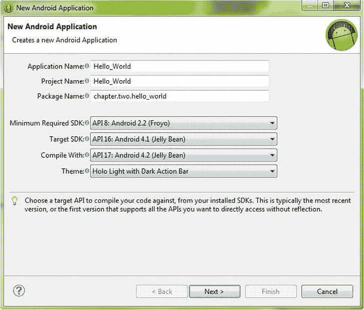

图 2-1。在 Eclipse 中新的 Android 应用对话框中命名我们的应用、项目和包

首先在对话框的第一个字段中输入**应用名称**，Hello_World。请注意，当您在 Hello_World 中键入时，第二个字段**项目名称**也是通过双重键入特性填写的。这意味着 Android 希望我们的应用名称和项目名称相同，正因为如此，我将在我们的 Hello World 应用名称中使用下划线而不是空格，因为这是一种相当常见的编程实践，也因为我不喜欢在我的文件名或文件夹名中使用空格。

第三个字段允许我们为我们的新 Android 应用项目创建我们的包名，为了对本书使用一致的包命名约定，让我们使用: **chapter.two.hello_world** 作为我们的包名，它应该使用所有小写字母和下划线。接下来，我们需要为我们的 Android 应用选择我们的**最低要求 API** 支持级别，我们将通过 **Android 2.2 API 级别 8** 设置将其设置为 9 个版本的向后兼容性，因为市场上仍有许多 Android 2.2 和 2.3.7 设备需要我们提供支持。我们还需要设置我们的**目标 SDK** 级别，这是我们正在开发的目标 Android API 级别，在这种情况下，它是 **Android 4.1 API 级别 16，**因为这是我们在第一章中安装的仿真器。我们将使用我们刚刚在第一章中安装的当前 Android 4.2 API Level 17 进行编译，因为这是我们拥有的最新(也是最无 bug 的)软件，并且您总是希望使用最新的开发软件代码进行编译。现在点击**下一个** 按钮，进入下一个对话框，如图图 2-2 所示。

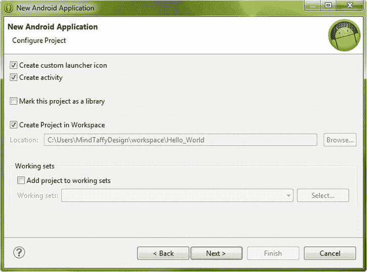

图 2-2。新的 Android 应用–配置项目对话框，我们在其中选择创建新项目的选项

在**配置项目**对话框中，勾选对话框顶部的**创建自定义启动器图标**复选框和**创建活动**复选框，以及对话框底部的**在工作区创建项目**复选框，然后点击 旁边的**进入**配置启动器图标**对话框，如图图 2-3 所示。**

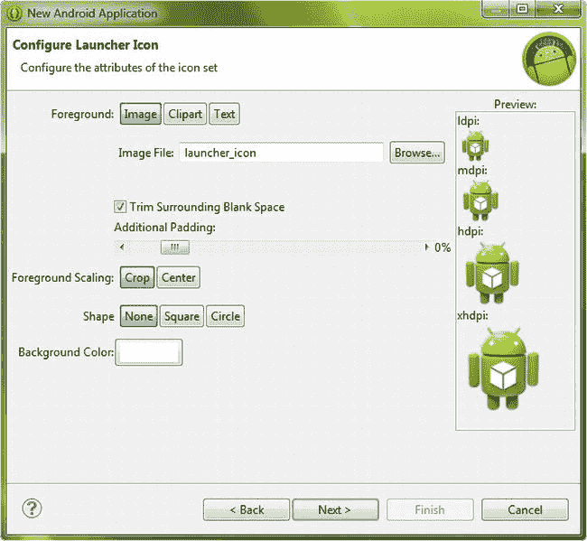

图 2-3。在“配置启动器图标”对话框中，我们可以选择预定义的 Android 应用启动图标

此对话框允许您从图像、剪贴画或文本资源中选择预定义的 Android 应用启动图标，其中许多已经为您提供。现在让我们选择缺省值(正如我们在所有这些对话框中所做的那样),看看缺省的新 Android 应用项目创建过程是如何进行的，这样我们就有了一个最基本的理解。在你选择了你的应用启动器图标(Android 将它命名为 ic_launcher.png，我们将在本章后面看到)之后，点击**下一个** 进入**创建活动**对话框，在这里我们将为我们的应用创建一个**空白活动**。我们选择了一个 **BlankActivity** ，这样我们就可以看到 Android 将通过新的 Android 应用项目系列对话框生成的最少代码。对话框如图 2-4 所示。

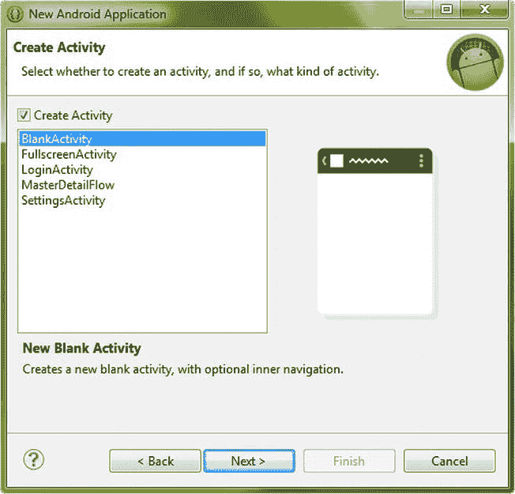

图 2-4。新 Android 应用项目系列对话框中的创建活动对话框

你可能想知道 Android 中的 Activity 是什么，它的功能到底是什么。一个**活动**是一个包含内容和用户界面(UI)设计的屏幕区域，为您的应用提供一个前端(显示区域)来与您的最终用户进行可视化交互。正如您将在本章中看到的，主活动是通过 XML 标记定义的，然后通过 Java 代码在主活动类的应用 onCreate()方法中进行膨胀。该活动包含由 Android **ViewGroup** 类指定的布局容器(逻辑上布局是视图组)，这些布局容器包含 Android **View** 类小部件，这些小部件是 UI 元素和内容容器。

点击**下一步** 按钮，进入**新建空白活动**对话框，如图图 2-5 所示，我们将为我们的 Android 应用的活动设置参数，就像我们在第一个新建 Android 应用对话框中所做的一样。让我们接受默认的(建议的)名称，只是为了熟悉 Android 希望我们如何称呼应用的各种主要组件，并将我们的活动命名为 **MainActivity** ，将我们的布局 XML 文件命名为 **activity_main** ，导航类型为**None**——同样，这样我们可以看到新的 Android 应用项目系列对话框将为我们提供的最少的引导代码。现在点击**完成**并让 ADT 继续新项目的创建过程。

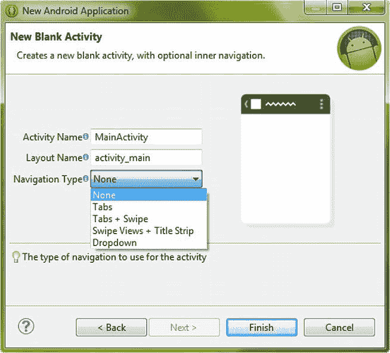

图 2-5。新的空白活动对话框，我们在其中命名活动并选择其导航类型

单击最后一个对话框中的最后一个 Next 按钮后，Android 开发工具(ADT) 将检查您当前的安装(SDK 和插件设置),以确保您拥有创建您刚才指定的 Android 应用项目所需的一切。例如，如果您指定了 Android 2.2 到 4.1 支持，但只安装了 API 10 级(2.3.7)到 API 16 级(4.1.2)，那么会出现一个**安装依赖项**对话框，要求您安装 API 8 级(2.2)。一旦你点击了 Install/Upgrade 按钮，这些额外的 API 将会从 Google 仓库中取出并安装在你的系统上，用于你的 Eclipse Android 开发配置。现在，我们准备在 Eclipse IDE 中开发新的 Hello World 应用，一旦安装依赖项下载完成(如果需要)并且其安装过程已经完成，它将出现，并填充有新的 Android 应用项目。接下来让我们看看 ADT 如此好心地为我们创建的 virgin Android 项目！

剖析一个 Android 应用项目

让我们看看 ADT 新的 Android 应用项目 helper 在我们的 Eclipse IDE 中为我们创建了什么，从 IDE 左侧的 Package Explorer 项目导航窗格开始。Package Explorer 实用程序允许我们在开发过程中的任何时候浏览 Android 应用的项目素材层次结构，就像 Windows Explorer 实用程序允许我们浏览硬盘驱动器和操作系统一样。图 2-6 显示了新项目在 IDE 的屏幕上弹出后 Eclipse 的样子。

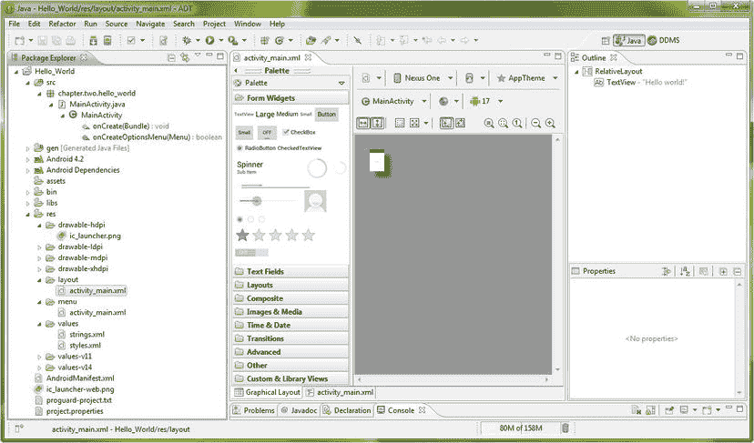

图 2-6。Eclipse 中显示了新的 Android 应用项目，打开了关键文件夹和子文件夹以显示项目素材

让我们通过点击指向右边的每个文件夹旁边的小三角形 UI 元素，打开您的 **Hello_World** 顶层项目文件夹中的一些关键子文件夹。现在，让我们把重点放在名为 **src** (源代码)和 **res** (资源)的文件夹上，因为它们是任何 Android 项目中最重要的文件夹。打开 **src** 文件夹，其中包含一个名为 **chapter.two.hello_world** 的子文件夹，您可能记得我们在新的 Android 应用对话框中将其指定为我们的包名。

再深入挖掘一下，在 **chapter.two.hello_world** 文件夹下，你会发现我们的**MainActivity.java**文件，其中包含新的 Android 应用创建过程为我们编写的 Java 代码，它“引导”或启动我们的活动(主屏幕)用户界面布局和菜单代码，这些代码恰好是通过**布局**和**菜单**文件夹中的 XML 文件定义的。我们将在本章的后面部分打开这个 Java 文件，看看这个 Java 代码和它到底做了什么。您开发的任何 Android 应用的所有 Java 代码文件都将保存在这个 package-name 文件夹中。

还要注意图 2-6 中的，我点击了 MainActivity.java**文件旁边的向右箭头三角形，包浏览器也显示了这个 Java 代码中的 Java 方法，所以看起来 Eclipse 包浏览器不仅导航文件，还导航代码结构。对于 IDE 来说，这是一个非常前卫的特性。**

我们需要仔细查看的另一个主要应用素材文件夹是 resources(资源)或 **res** 文件夹，正如您可能已经猜到的那样，Android 应用不可避免地要利用它来创建用户体验(UX)的所有 XML 和新媒体资源都存放在这个文件夹中。点击 **res** 文件夹旁边的三角形 UI 图标，如图图 2-6 所示，打开它，你可以看到它的很多子文件夹都是新的 Android 应用项目助手为我们创建的。

您在顶部看到的前四个文件夹都以单词 **drawable** 开头，正如您可能猜对的那样，这是一个 Android 应用素材，可以通过我们之前了解的活动绘制到屏幕上。drawable 可以是图像、形状、帧动画、图像过渡、图标或任何类似的图形相关内容或应用所需的用户界面元素。还要注意，有四个可绘制的文件夹——每个文件夹对应一个屏幕密度级别:低、中、高、超高。值得注意的是，从 Android 4.2.2 开始，还有一个额外的超高(XXHDPI)分类。

单击任何一个(或者所有四个，如果你喜欢的话)可绘制文件夹旁边的三角形 UI 元素，你会看到 **ic_launcher.png** 启动器图标，这是我们在新的 Android 应用项目系列对话框的第三个**配置启动器图标**对话框中创建的。请注意，您只需将应用图标正确命名(ic_launcher.png)并放置在正确的 drawable 文件夹中，就可以为您的应用显示图标。没错:零编码。我们将在本书的第二部分讨论如何为这些不同的可绘制文件夹优化图标和图形。

这四个可绘制的文件夹允许 Android 开发者(比如你自己)在所有类型的 Android 设备上提供定制的像素级完美图形元素，从智能手机到平板电脑到电子阅读器到 iTV 电视机。低密度像素图像(LDPI) 针对最小的 Android 屏幕进行了优化，例如 120 DPI(也代表**点每英寸**)的翻盖手机或 MP3 播放器，它们通常具有 320 x240 像素的小屏幕。中等密度像素图像(MDPI)适用于使用 160 DPI 像素屏幕密度的入门级智能手机(480 x320 和 640 x480 分辨率)。

高密度像素图像(HDPI) 适用于主流智能手机和使用 240 DPI 像素密度屏幕的 5 英寸至 7 英寸迷你平板电脑(800 x480、854 x480 和 960 x540 分辨率)。超高密度像素图像(XHDPI) 使用 320 DPI 像素密度屏幕，适合高清智能手机和更大的 8 英寸至 11 英寸平板电脑(1024 x600、1280 x720 和 1280 x800 分辨率)。互动电视密度像素成像(TVDPI)也使用 320 DPI(分辨率为 1920×1080 和 1920×1200 ),适合新的谷歌电视 iTV 设置。我们将在本书的第二部分更详细地讨论这个主题，其中包括活动用户界面和内容开发的图形设计和动画。

下一个文件夹是**布局**文件夹；单击三角形 UI 元素将其打开，您将看到它当前包含我们活动的布局 XML 文件，命名为 **activity_main.xml** ，正如我们之前在新的 Android 应用项目系列对话框的第五个对话框中指定的。该文件包含所有定义活动屏幕布局及其用户界面元素的 XML 标记。我们将在本章的下一节在 Eclipse IDE 中打开它，并最终定制 XML 标记来创建一个更酷的 Hello World 用户体验。

您为应用定义的每个活动(用户界面屏幕)在这个**布局**文件夹中都有自己的 XML 文件，每个文件都包含定义每个应用屏幕外观的唯一标签。例如，如果你的应用有一个登录界面，那么这个文件夹中也会有一个 activity_login.xml 文件，它包含的 xml 标记与 activity_main.xml 文件完全不同。

下一个文件夹是 **菜单**文件夹，其中保存了定义每个活动用户界面屏幕的 Android 应用菜单结构的 XML 文件。单击**菜单**文件夹旁边的三角形 UI 元素将其打开，您将看到它当前包含我们活动的菜单 XML 文件，Android 已将其命名为 **activity_main.xml** ，如之前在我们新的 Android 应用项目系列对话框的第五个对话框中所指定的。

布局和菜单 XML 文件具有相同名称的原因是因为通常每个应用(活动)屏幕都有 UI 元素和菜单，所以对它们进行分组的最合理的方式是根据它们的文件名。因为这些文件在不同的文件夹中，它们被分开保存，因此可以有相同的文件名，Android 将通过使用文件名的第一部分以及它所在的文件夹来查找。我们将在本章的稍后部分在 Eclipse IDE 中打开这两个文件，稍后我们甚至将定制它们的 XML 标记来创建一个更高级的 Hello World 布局和菜单系统，这样您就可以更好地体验 Android 中的活动是如何工作的。

resource 文件夹中的最后三个子文件夹是 **values** 文件夹，其中保存了我们的应用的常量或“硬编码”值，例如字符串、主题、尺寸、颜色等，这样以后就可以在项目层次结构中的一个集中位置对它们进行访问(并且非常容易地进行更改)。Android 希望将所有值外化到这些文件夹中，我们将在下一节看到 strings.xml 文件。正如您将在整本书中看到的，如果您没有正确使用值，Eclipse 会在 IDE 中用三角形黄色警告图标标记您的代码。安卓操作系统有点严格！

接下来，让我们仔细看看 Android 如何利用 XML 标记来允许团队成员，主要是设计角色的非程序员，为应用开发过程做出贡献。XML 用于 Android 开发中的许多事情，例如用户界面设计、AndroidManifest.xml 文件中的应用配置等等。

Android 应用项目:XML 标记

您的应用在**MainActivity.java**中的 Java 代码引用了我们在布局和菜单文件夹中看到的 activity_main.xml 文件，事实上，当 Eclipse 在新的 Android 应用项目创建过程之后打开时，它会自动从其中央主编辑区域的**布局**文件夹中打开活动布局 xml 文件 **activity_main.xml** 。这可以在图 2-6 中看到，它展示了 Eclipse 第一次打开您的新应用项目时的样子。请注意，在**图形布局**编辑器(底部标签中的注释名称)的中心区域，activity_main.xml 已打开(顶部标签中的注释名称)。

使用 XML 在 Android 中创建用户界面屏幕布局

让我们点击 Eclipse 中央编辑窗格**底部**的 **activity_main.xml** 选项卡，如图图 2-7 所示，并查看这个 xml 标记在您的 Android 应用中是如何工作的。下面是定义相对布局容器并放置 Hello world 的 XML 标记！里面的文字:

```java
<RelativeLayout xmlns:android="http://schemas.android.com/apk/res/android"
    xmlns:tools="http://schemas.android.com/tools"
    android:layout_width="match_parent"
    android:layout_height="match_parent"
    tools:context=".MainActivity" >

    <TextView
        android:layout_width="wrap_content"
        android:layout_height="wrap_content"
        android:layout_centerHorizontal="true"
        android:layout_centerVertical="true"
        android:text="@string/hello_world" />

</RelativeLayout>
```

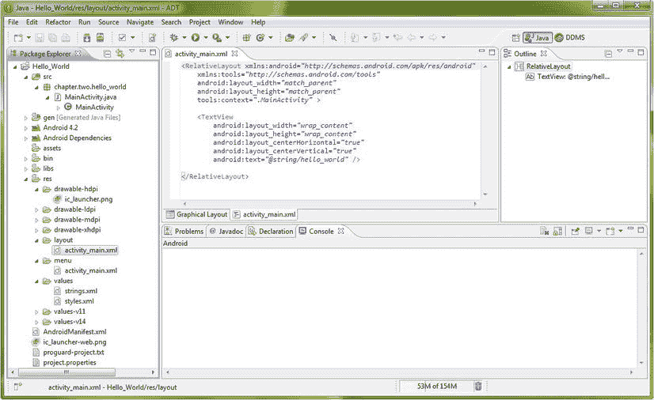

图 2-7。使用主编辑区右下方的 XML 编辑选项卡查看 activity_main 布局 XML

第一个 XML **标签**显示在 **< RelativeLayout >** 标签中，它提供了一个布局容器，用于保存我们的用户界面元素，在本例中是文本，最后是图像和按钮。在 RelativeLayout 标记中，您会发现几个参数，每个参数都遵循以下格式:

```java
`platform:feature="setting value"`
```

例如，第一个参数是 **xmlns:android** 并且引用了 XML 平台(xmlns 表示扩展标记语言命名模式)并且定义了互联网上的一个位置，在这个位置，在这个 XML 文档中使用的用于 android 的 XML 标签被公开定义并且在一个中心位置被引用。第二个参数 **xmlns:tools** 也来自 XML 平台，它定义了在互联网上公开定义这个 XML 文档中使用的 XML 工具的位置。 **tools:context** 标签告诉我们这些工具将在哪里使用，在这个例子中是在我们的 MainActivity Java 类中，通过**引用。MainActivity** 该参数内引号中的设置值。

布局 XML 文件中的其他参数都来自 Android 平台，并定义了与 Android OS 相关的参数，例如，android:layout_width 和 android:layout_height 都被设置为 **match_parent** 值，该值告诉相对布局容器扩展以填充整个显示屏。

现在让我们看看 **< TextView >** 标签中的参数，它在我们的相对布局容器中设置我们的文本。我们再次看到 **android:layout_width** 和 **android:layout_height** 参数，但是这一次它们引用了 **wrap_content** 设置，这实质上与 match_parent 设置完全相反。不是扩展标签来填充它的容器，而是“收缩包装”容器，或者在这个例子中是用户界面元素，围绕它的内容！接下来让我们看看 android:text 参数引用的布局居中参数和 string.xml 文件值。

**Android:layout _ center horizontal**和**Android:layout _ center vertical**参数都被设置为 **true，**这表示我们希望将 TextView UI 元素水平和垂直居中，以便 TextView UI 元素位于活动屏幕的中心，而不管用户设备当时使用的屏幕密度、方向或分辨率如何。

TextView UI 元素的最后也是最重要的参数是该 UI 元素要包含的实际文本内容，这可以通过参数 **android:text** 来访问。引号中包含的设置值被设置为 **@string/hello_world** ，这是 Android OS 特定的符号表示法，用于:

```java
C:\Users\Username\workspace\Hello_World\res\values\strings.xml <string> tag named: hello_world

```

使用 XML 在 Android 中创建选项菜单

我们将在本章后面的**值**文件夹中查看 **strings.xml** 文件，看看这个文本值是如何设置的。首先，我们来看看**菜单**文件夹中包含的另一个 **activity_main.xml** 文件，分析一下 ADT 为我们编写的菜单 xml 代码。在你的包资源管理器中右键点击**菜单**文件夹中的 **activity_main.xml** 文件(如图图 2-6 所示)，选择**打开**或者直接选择文件，用键盘上的 **F3** 键打开。第二个标签在 Eclipse 的中央编辑区打开，标签为 **activity_main.xml** ，你会看到 xml 标记定义了你的菜单设置条目，如图 2-8 所示。

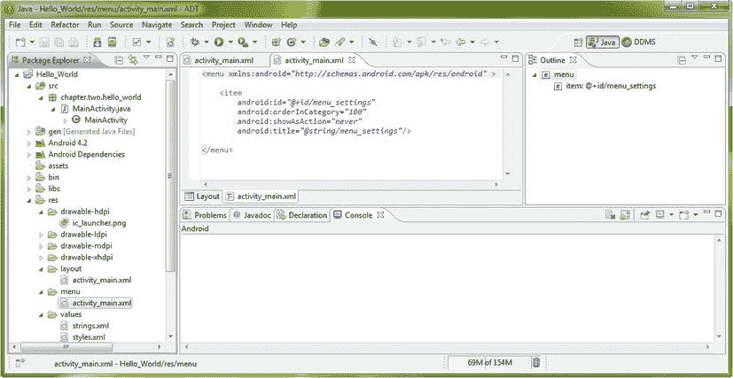

图 2-8。在 Eclipse 中央代码编辑区的第二个(菜单)activity_main.xml 选项卡中显示的菜单 XML 文件

Android 中的菜单 XML 文件也使用名为**标签**的标记结构，通过 **<菜单>** 标签容器和其中每个菜单项的 **<项目>** 标签来定义菜单项。在这种情况下，只有一个名为 **Settings** 的菜单项，但是，稍后我们会添加更多的菜单项并激活它们，这样你就可以完全理解如何在你的应用中实现菜单项。

值得注意的是，当你运行你的应用时，当你在 Android 模拟器中使用菜单键(按钮)时，菜单会弹出，即使菜单项被点击时不会做任何事情。这允许您定义活动菜单用户界面，并在编写代码实现它实际做什么之前测试它。现在让我们一行一行地看看 Android 为我们创建的菜单 XML 代码:

```java
<menu xmlns:android="http://schemas.android.com/apk/res/android" >

    <item
        android:id="@+id/menu_settings"
        android:orderInCategory="100"
        android:showAsAction="never"
        android:title="@string/menu_settings"/>

</menu>
```

正如您所看到的，任何 XML 文件中的开始标记，在本例中是“parent”**<菜单>** 标记，包含对 Android XML 命名模式的 HTTP 引用，就像我们前面看到的 **activity_main.xml** 文件的 **< RelativeLayout >** 文件夹版本中的**布局**标记一样。在<菜单>标签中，我们“嵌套”了定义每个菜单项的<项目>标签，而每个<项目>标签又有自己的参数，这些参数定义每个菜单项的名称、它在菜单上显示的内容、它出现的顺序，以及它是否在 Android 3.x、4.x 或 5.x 操作系统中显示为动作图标。让我们检查一下每个参数。

第一个 **android:id** 参数将这个菜单项命名为 **menu_settings** ，以便我们可以在 Java 代码中引用它。第二个 **android:orderInCategory** 参数设置菜单项在包含多个菜单项的菜单中的顺序，大多数菜单都是这样。当我们稍后添加菜单项时，我们将把这个参数设置为 200(以此类推),以确定我们添加的每个菜单项功能的重要性。

第三个 **android:showAsAction** 参数决定了你的菜单是否显示在 Android OS 版本 3.x 和 4.x(以及即将推出的 5.x)设备的动作图标栏上。在这种情况下，我们使用 **none** 设置，因为我们希望向后兼容 Android 1.6 和 2.x 设备，如亚马逊 Kindle Fire (2.3.7)。一个**无**设置会在屏幕底部弹出菜单，当你稍后在 4.2 模拟器中运行 Hello_World 应用时就会看到。如果你是单独为 Android 3.x 和更高版本开发应用，你可以使用 **ifRoom** 参数作为设置，你的菜单项将出现在 Android 操作栏中，如果有空间的话。

最后一个 **android:title** 参数是弹出菜单中菜单项本身的标题或标签。因为这个菜单标题是一个字符串常量，所以它被设置在 **strings.xml** 文件的**值**文件夹中。事实上，现在让我们通过右键单击 **values** 文件夹中的 **strings.xml** 文件并选择 **Open** 命令来查看一下！

使用 XML 为 Android 应用设置常量值

如图图 2-9 所示， **strings.xml 文件**在 Eclipse 的中央区域打开它自己的编辑标签，如果你想直观地看到编辑过的字符串，点击左边底部的**资源**标签或者使用右边的 xml 视图标签，标签为文件名 **strings.xml** 。

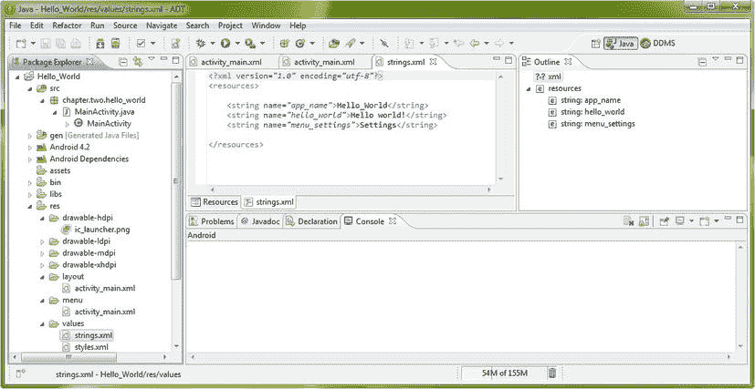

图 2-9。XML 编码模式下 Eclipse central 编辑窗格中显示的 strings.xml 文件(位于 values 文件夹中)

因为我们在本章的这一节学习 XML 代码，所以我选择在 Eclipse ADT 编辑器中显示 XML 标记视图窗格，如图 2-9 所示。

现在让我们看看 XML 标记代码，看看我们是如何定义常量的:

```java
<?xml version="1.0" encoding="utf-8"?>
<resources>
    <string name="app_name">Hello_World</string>
    <string name="hello_world">Hello world!</string>
    <string name="menu_settings">Settings</string>
</resources>
```

第一个 XML 标记声明我们使用的是 XML 1.0 版，并且我们使用的是文本(字体)编码范式 UTF-8，它支持跨越许多常见语言的相当大的字符集。第二个“parent”标签是保存嵌套在资源容器中的<string>资源的<resources>标签。第一个 **<字符串>** 标签被命名为 **app_name** ，它的值保存应用的名称 **Hello_World** ，当我们运行它时，它出现在模拟器中应用的顶部。第二个 **<字符串>** 标记名为 **hello_world** ，它的值保存 TextView UI 元素中使用的文本，该元素显示: **Hello world！**当我们运行它时，它出现在模拟器的应用活动屏幕的中间。第三个 **<字符串>** 标记名为 **menu_settings** ，其值包含第一个菜单选项标题的名称: **Settings** ，当我们运行它并单击模拟器屏幕右侧的菜单按钮或图标时，它会出现在模拟器中应用的底部。</resources></string>

既然我们已经介绍了可以通过 Android 应用中的 XML 标记设置的大量选项和值，那么让我们看看 Java 如何通过各种 onCreate()方法调用、启动和膨胀所有这些 XML 素材。

Android 应用项目:Java 编码

现在让我们来看看 Android 应用 Java 代码素材本身，它们位于我们在本章前面详细讨论过的项目浏览器层次结构中。我们将再次从项目文件夹层次结构的最顶层开始，查看 **src** 文件夹，在我们的包文件夹下，我们将找到包含 MainActivity 类和 onCreate()方法的 MainActivity.java Java 源代码文件。

假设您的 **src** 和 package-name 文件夹已经打开，您可以看到 MainActivity.java 文件，单击**MainActivity.java**文件将其选中，并按下键盘上的 F3 键，或者您可以右键单击文件名，并从出现的上下文菜单中选择**打开**菜单项。第四个选项卡在 Eclipse central 编辑窗格的顶部打开，您应该会看到类似于图 2-10 中所示的内容。

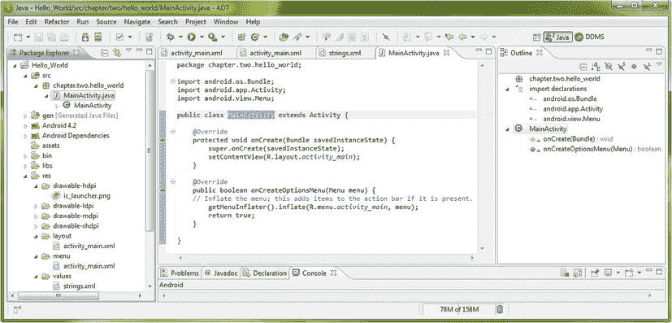

图 2-10。MainActivity.java 文件显示在 Eclipse central 编辑窗格中，准备进行进一步编辑

请注意，在 Eclipse 的中间部分打开了一个标签，在顶部写着**MainActivity.java**，并包含该文件中的 Java 代码。Eclipse 的核心部分是代码编辑窗格，可以同时打开多个选项卡，正如我们在打开布局和菜单 XML 文件进行查看和编辑时看到的那样。所以，现在让我们来看看我们的 Java 代码。

通过导入语句定义 Android 类

顶部有三个 **import** 语句，它们引用了我们将在 Java 类及其下面的方法中使用的其他 Java 代码。注意我们将在下一章更详细地讨论所有这些 Java 术语。要查看所有的**导入**语句，点击第一个**导入**语句旁边的 **+** UI 符号，就可以看到所有三个导入语句。

第一个 **onCreate( )** 方法使用第一个 **Bundle** 类，第二个 **Activity** 类扩展我们的 MainActivity 类，第三个 **Menu** 类通过 **onCreateOptionsMenu( )** 方法创建一个菜单。所有这些 Android 类在本书的前两部分都有更详细的讨论。下面是为 Hello_World 应用创建活动(用户界面)和菜单的 Java 代码，正如在 ADT New Android Application Project helper 中为我们创建的一样:

```java
package chapter.two.hello_world;

import android.os.Bundle;
import android.app.Activity;
import android.view.Menu;

public class MainActivity extends Activity {
        @Override
        public void onCreate(Bundle savedInstanceState) {
                super.onCreate(savedInstanceState);
                setContentView(R.layout.activity_main);
       }
        @Override
        public boolean onCreateOptionsMenu(Menu menu) {
                getMenuInflater().inflate(R.menu.activity_main, menu);
                return true;
       }
}

```

使用 onCreate()方法创建我们的应用基础结构

接下来，让我们看看 Java 类的 **MainActivity** 和位于其中的 **onCreate( )** 方法。在 Java 中，在类名前使用 **class** 关键字来声明一个类。在这种情况下，我们的类被称为 MainActivity，它可以被任何其他代码访问，因此它也被声明为 public，在 class 关键字之前使用 **public** 关键字。这个 MainActivity 类**扩展了**(或从其借用方法)Android 应用活动“超级类”，我们之前在代码顶部使用 **import android.app.Activity 导入了该类；**行代码。我们完整的 MainActivity 类声明如下所示:

```java
public class MainActivity extends Activity { ... }
```

我们类中的第一个方法也是 **public** ，也声明为 **void，**，这意味着它不返回任何值给调用函数(在本例中是 Android OS)，它只是做一些事情，在本例中是通过 **onCreate( )** 方法创建我们的初始活动或用户界面屏幕。Android 操作系统向 onCreate()方法传递了一个名为 **saveInstanceState** 的 **Bundle** 对象，它包含了我们活动中用户界面元素的状态(设置),以值和设置捆绑的形式。

onCreate()方法内部有两个方法调用。第一个方法调用使用 **super** 关键字将 **saveInstanceState** Bundle 对象向上传递给 **android.app.Activity** 超类及其 onCreate()方法。第二个方法调用通过 **setContentView( )** 方法为应用设置内容视图(活动屏幕),同时引用本章前面提到的 **layout** 文件夹中的 **activity_main.xml** 文件。那看起来是这样的:**setContentView(r . layout . activity _ main)；**其中 **R** 等同于 Hello_World 项目路径，向下到 **layout** 文件夹，或者 C:\ Users \ Username \ workspace \ Hello _ World \ RES \因此您可以从这些信息中进行推断， **R.layout.activity_main** 实际上转化为(意味着 Android):

```java
C:\Users\Username\workspace\Hello_World\res\layout\activity_main.xml
```

这用于通过**活动**子类中的 Java **setContentView( )** 方法加载您的 XML **布局**定义(记住我们的类声明的扩展活动部分)。接下来，让我们看看第二个方法 **onCreateOptionsMenu( )** ，它同样用于从 activity_main.xml 菜单 xml 文件创建您的活动的选项菜单，使用的 **getMenuInflater( )** 方法通过我们前面看到的**Android . view . Menu**class**import**语句访问。

getMenuInflater()方法调用一个**。inflate( )** 方法有两个参数，一个是通过 onCreateOptionsMenu(菜单菜单)传入该方法的名为**菜单**的**菜单**对象，另一个是通过我们现在熟悉的 **R.menu.activity_main** 传入菜单文件夹中 activity_main.xml 文件的路径，相当于:

**??`C:\Users\Username\workspace\Hello_World\res\menu\activity_main.xml`**

所以基本上。inflate()方法获取名为**菜单**的**菜单**对象，并用 **R.menu.activity_main** 中引用的 XML 菜单定义对其进行膨胀。注意，Android 使用文件名的第一部分(不是。xml 部分，它不使用文件扩展名)来引用 XML 和图形(可绘制)文件。一旦菜单对象 Menu 膨胀并准备好使用，它就向操作系统返回一个**真**值。

在 Android 4.2 模拟器中运行你的 Hello World 应用

现在让我们编译并运行所有这些 XML 和 Java 代码，看看它在我们在第一章为 Nexus S 智能手机创建的 Android 4.2 模拟器中做了什么。要启动模拟器，只需在 Eclipse Package Explorer 中右键单击 **Hello_World** 项目顶层文件夹，并选择**Run AsAndroid Application**菜单项。当 Nexus S 智能手机的 Android 4.2 模拟器出现时，您将看到 Hello_World 应用及其 Hello world！仿真器屏幕上的感叹号如图图 2-11  所示。

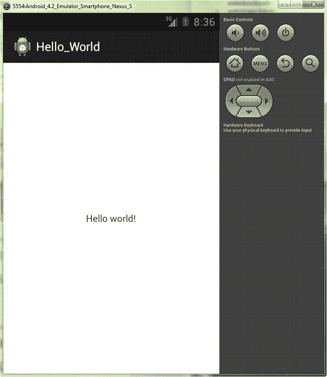

图 2-11。在 Android 4.2 Nexus S 智能手机模拟器中运行 Hello_World Android 应用

我们可以在新的 Android 应用项目系列对话框中看到我们指定的应用名称，以及我们选择的启动图标和我们在 strings.xml 文件中设置的文本消息。我们的 XML 布局标记完美地将文本居中，现在我们准备单击右上角的 X 并退出模拟器。

在第一次 Android 4.2 仿真后设置 Logcat

一旦您第一次退出 Android 4.2 Nexus S Smartphone 模拟器，您会注意到出现一个错误对话框，通知您没有为您的 Eclipse Android 开发环境设置 Logcat，并提供为您设置它。该**自动监控 Logcat** 对话框如图图 2-12 所示。

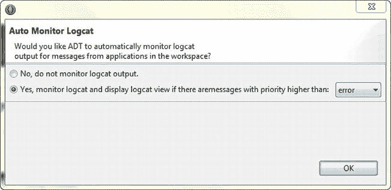

图 2-12。在 ADT 中首次启动任何仿真器后出现的自动监视 Logcat 对话框

Android 的 Logcat 代表 Log Catalog，是一个自动日志记录系统，为您提供了一种方便的方法来收集和查看所有 Android 系统调试器输出。来自各种应用和操作系统各部分的详细日志被收集在一系列循环缓冲区中，然后可以通过 Eclipse IDE 中的 Logcat 窗格查看甚至过滤这些日志。

一旦您成为更高级的 Android 开发人员，您也可以从 ADB shell 使用 Logcat 来查看日志消息。更多信息可在以下网址找到:

```java
[`developer.android.com/tools/help/logcat.html`](http://developer.android.com/tools/help/logcat.html)
```

您会发现 Logcat 实用程序有助于研究应用开发过程中可能出现的错误。如果您将 Eclipse Logcat 窗格中的错误消息剪切并粘贴到 Google 搜索栏中，然后按 Return 或单击 search，您可以很快找到其他开发人员，他们的应用中也出现了同样的错误消息，并查看他们是如何解决的。

摘要

在这一章中，你创建了你的第一个 Android Hello World 应用，在 Android Developer Tools (ADT)新的 Android 应用项目“helper”系列对话框的帮助下。在接下来的章节中，我们将修改这个基本代码来构建一个更令人印象深刻的 Hello World 应用，这样您就可以将您对 Eclipse、XML 标记和 Android 中的 Java 编码的了解提升到一个新的水平。

我们首先关注的是通过一些对话框创建新的 Android 应用项目的工作流程，这些对话框允许开发人员设置无数选项来创建“引导”应用外壳，然后他们可以修改并变形为他们想要开发的应用。这包括命名应用、Java 类和 XML 文件、确定 Android OS 版本支持、选择应用启动图标、命名和选择活动类型以及选择导航模式。

接下来，我们查看了 Eclipse IDE 及其非常有用的 Package Explorer 窗格，并使用该实用程序检查了新的 Android 应用项目助手为我们创建的 Android Hello_World 应用结构的剖析。我们查看了源代码和资源文件夹层次结构，以及图形素材、XML 定义和 Java 代码的文件保存位置。

接下来，我们打开了用于 Hello_World 应用项目的布局、菜单和字符串常量定义的关键 XML 文件，并研究了它们的功能:标记和参数。我们了解了 Eclipse center 代码编辑窗格以及顶部和底部选项卡区域，这些区域允许我们选择正在工作的文件和编辑模式。

接下来，我们打开了我们的主 Java 类文件，看了看 Java 代码如何将我们的用户界面、菜单和内容的 XML 定义组合在一起，并了解了一些核心 Android 类，如 Activity、Bundle 和 Menu 类。最后，我们第一次在我们在第一章中设置的 Android 4.2 Nexus S 模拟器中运行了我们的 Hello_World 应用，并允许 ADT 在我们退出模拟器时为我们设置 Logcat。

在下一章中，我们将通过添加和更改 ADT 为我们创建的初始代码，并添加我们自己的内容、用户界面元素、图标和菜单选项，将我们的 Hello_World 应用提升到一个新的水平，以了解如何使用 ADT 为我们创建的引导应用，并将其转化为定制的东西，以实现我们自己的 Prime 指令。与此同时，我们将了解更多关于 Java、XML、图标和其他在前两章中没有揭示的 Android 秘密。