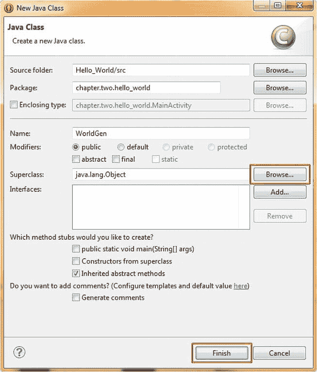
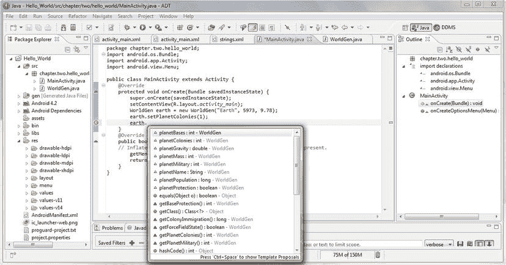

# 三、面向 Android 入门的 Java：增强我们的 Hello World 应用

在这一章中，我们将使用新的 Android 应用项目助手，使用我们在上一章中创建的 Hello World 应用，并添加我们自己的 Java 代码，使它更有趣。同时，我们也将利用这一章，通过 Java 编程语言及其对象、变量、方法、类、包、修饰符等等，向那些不是 Java 程序员的读者提供本书中使用的各种代码结构的高层次概述。

我将尝试无缝地融合这两个目标，增强我们的 Hello World 应用，并在一个高层次上总结 Java 概念，形成一个有凝聚力的章节，在我们的 Hello World 应用的上下文中定义 Java 的方法和功能。使用 Java 代码，我们将为我们的 Hello World 应用添加功能，以便它生成新的世界，并开拓和保护它们。

Java 的最高层次:应用编程接口

与任何编程语言一样，该语言的最高级别被称为 **API** ，或**应用编程接口** ，这是整个编程语言本身的总和，在其最新修订版中，都在一个集合或位置中。众所周知，如果您想使用任何给定的编程语言进行开发，您必须去获取(并最终学习)该编程语言的 API，以便使用其开发范式在该编程语言下开发应用。

在这方面，Java 和其他编程语言没有什么不同。在本章的剩余部分，我们将讨论 Java 的行话，以及它的各种编程结构，就像我们在前一章讨论 Android 中各种模块使用的行话一样。通过这种方式，你将在概念上了解我们在本书剩余部分所讨论的内容。

组织 Java API:包

Java 提供了一种将编程项目中的代码组织成逻辑模块或代码集合的方法，称为**包**。在 Java 编程语言中，一个**包**是 Java **类**的集合，我们将在本章的下一节更详细地了解它。

我们已经在 Eclipse 中为我们的 Hello_World 项目创建了一个**包**，在我们在[第二章](02.html)中使用的新的 Android 应用项目系列助手对话框中。这五个对话框用于帮助创建 Hello World 应用的基本 Java 和 XML 代码基础。

因为我们在本书的第二章中创建了 Hello_World 应用，所以我们在逻辑上将我们的 Java 包命名为: **chapter.two.hello_world** ，然后在我们的**MainActivity.java**文件的顶部声明它，Java 代码如下:

```java
package chapter.two.hello_world;
```

包是在每个 Java 代码模块的顶部被声明的，这些 Java 代码模块利用了包含在这些包中的**类**和**方法**(稍后会有更多的介绍)。包总是使用 Java 的**包**关键字来声明。

项目包名称通常使用小写字符，并告诉用户包中的代码是做什么的。由于这个原因，我们需要使用逻辑包命名约定来告诉我们包的其他用户这个包是什么，如果可能的话，它是做什么的。

注意，包含功能类的包，尤其是在 Android 中，有时会在包中的姓氏上使用大写字母。你会在 Android 操作系统中经常看到这种情况，因为类是用大写字母命名的，比如 **String、View、Activity、Object、Bundle、**等等。

我们之前在[第 2 章](02.html)中创建的 **chapter.two.hello_world** 包目前包含一个名为 **MainActivity** 的类，其 Java 源代码位于我们项目的源代码文件夹(名为 src)下的一个名为**MainActivity.java**的文件中。在这一章中，我们将从头开始创建另一个全新的类，名为 **WorldGen** ，它将允许我们为 Hello World 应用创建新的世界(行星)，同时也教授您基本的 Java 概念，以防您不是 Java 程序员。

随着您使用越来越多的 Android 操作系统特性，您会发现 Android 中的包名总是逻辑地反映出该包是什么，它做什么，以及该包在 Java 和 Android 操作系统层次结构中的位置。

让我们更仔细地看看这个，例如，使用 Android 包，我们已经用 Java **导入**语句将这些包带入到我们的[第 2 章](02.html) Java 代码中。这些导入语句位于我们的 MainActivity Java 代码文件中，就在我们的**包**声明语句下面:

```java
import android.os.Bundle;
import android.app.Activity;
import android.view.Menu;
```

Java 中的**导入**命令用来`—`你猜对了`—`导入其他 Java 包。导入的包是逻辑上捆绑在一起的功能类的集合，这些功能类已经为您编写和测试过，并且当前可以在您的应用中用于商业用途。

在 Android OS 应用开发的情况下，import 语句允许我们使用预先存在的 Java 代码(保存在包中),这些代码是专门为支持 Android OS 功能而编写的，这些代码是为在我们的 Android 应用中使用而提供的，随着我们越来越多地使用这些包，我们将在本书中更详细地了解这些功能。

Java 最强大的一点是，我们可以导入已经编写和测试过的代码的整个库或包，然后在我们自己的 Android 应用中为我们自己的利益(甚至是利润)使用它们，而不必为该软件的(代码)开发支付一分钱。如果你仔细想想，这是一个相当惊人的开源软件开发商业提议。

让我们仔细看看这三个引用核心 Android 包及其类的导入语句，它们是在 Eclipse ADTNew Android Application Project 系列对话框期间在我们的 MainActivity.java 文件中为我们创建的，我们在[第 2 章](02.html)中使用了这些对话框。

查看 Java 导入语句

第一个， **android.os.Bundle** 引用了 Android OS。中间的引用告诉我们代码与操作系统相关，包名最后部分的 Bundle 告诉我们这个包是与 Android 中的 **Bundle** 特性相关的 Java 类和方法的集合。

第二个导入语句， **android.app.Activity** 也是 android 相关的。第二部分告诉我们它与 **app** 的应用功能有关，包名的最后一部分告诉我们这个包包含了一个类和方法的集合，用于提供 Android 中的**活动**功能。这个包是一个重要的包，在所有的 Android 应用中都有使用。接下来的几章将特别关注活动。

最后的导入语句， **android.view.Menu** 是一个与视图(屏幕相关)android 功能相关的 Android 包。它支持大量的**视图**类(以及叫做**小部件**的子类，我们将在接下来的几章中学习)。Android View 类与 Android **View** (屏幕布局和用户界面小部件)特性相关，我们将利用其中的许多特性来增强我们的 Hello_World 用户界面设计和用户体验功能。但是首先我们需要学习一点关于 Java 编程语言和 Java 对象的知识。在这种情况下，我们从 *android.view* 包中导入 *Menu* 类和方法，这样我们就可以实现我们的菜单系统。

Java 的基础:对象

Java 是一种**面向对象编程** 语言。像 C++一样，Java 使用被称为**对象**的编程结构来建模其编程逻辑中使用的数据和函数。Java 对象就像是你在日常生活中看到的现实生活中的对象的描述。

就像您每天遇到的现实生活中的对象一样，如汽车、电器、计算机、建筑物、船只、飞机等等，Java 对象也具有独特的属性和用途(即，可以增强您日常生活的功能)，与您每天使用的那些现实生活中的对象非常相似。

在 Java 中，为了“建模”或创建一个对象，您将创建一个 Java **类**，它保存该对象的**状态**和**行为**。我们将在本章的下一节学习更多关于**类**的知识，但是要理解类，我们必须首先理解对象，所以让我们在这里更详细地讨论对象。

一个对象的功能可以通过它的**行为**来描述；也就是对象可以做或执行的那些事情。对象通过被称为**方法、**的编程结构获得这种功能，我们将很快在本章后面的 Hello World 应用中了解和使用这些方法。

对象的每个特征可以通过**状态**来定义；即描述任何给定时刻的对象属性的数据。对象通过被称为**实例变量、**的编程结构获得这些属性，我们将在本章后面的应用中学习和使用它们。

让我们以 Hello World 应用为例，定义一些世界或星球，每个世界或星球都将被表示为一个对象，这样您就可以看到这些概念在起作用。

首先，让我们定义一些我们的世界对象的属性或状态:

*   **行星名称** `—`一个**字符串**数据类型或文本值，例如，“地球”
*   **行星质量** `—`一个代表 Yottagrams 的**整数**值；地球是 5973 YG
*   **行星重力** `—`一个真实的或**浮动的**重力值；地球=9.78 米/秒的平方
*   **行星**殖民地`—`一个**整数**数据值，代表一个殖民地的数量
*   **行星人口** `—`一个 64 位的**双**值，代表一个人的数量
*   **行星基地**T0**整数**值，代表军事基地的数量
*   **星球军事** `—`一个**整数**值，代表军事人员的数量
*   **行星保护** `—`一个**布尔**值，告诉我们行星力场是否开启

接下来，让我们定义至少十几个可以归因于这些新世界对象的对象行为或功能:

*   **WorldGen** `—`构造新的世界，即生成一个新的世界对象
*   **设定行星殖民地** `—`在行星表面增加任意数量的新殖民地
*   **获取行星殖民地** `—`返回行星表面的殖民地数量
*   **设定星球军事** `—`在星球表面增加任意数量的军事基地
*   **获取星球军事** `—`返回星球表面的多个军事基地
*   **开启力场** `—`开启力场保护星球大气)
*   **关闭力场** `—`关闭力场保护行星大气层
*   **获取力场状态** `—`返回力场状态开/真或关/假
*   **设定殖民地移民** `—`将人添加到星球表面的每个殖民地)
*   **获得殖民地移民** `—`返回当前星球表面的人口
*   **设置基地保护** `—`增加军事来保护星球上的军事基地
*   **获得基地保护** `—`返回一个星球上的军事人员数量

正如你所看到的，这些是每个新的世界对象可以做的，或者可以改变的关于它的存在和状态或特征的行为或事情。

正如你将在本书后面看到的，在对象层次结构中，对象也可以包含其他对象。例如，这类似于系统硬盘上的文件夹层次结构。这允许更复杂的对象以更有组织和逻辑的方式模块化地构建。

在我们的 Hello World 应用示例中，这个概念的一个例子是 WorldGen 对象(我们在本章中定义和创建它)与 **java.lang.Object** 顶级对象一起使用，并增加了它的复杂性，我们将在本章的下一节中了解更多。

面向对象编程(OOP)的核心概念之一是**数据封装、**的概念，其中对象的状态或其**实例变量**只能通过其自身的函数或**方法**来改变。

数据封装的原因是，对象是自包含的，可以在真空中创建和测试，而不受正在创建的整个软件包中任何其他内容的影响。

这允许实现模块化代码开发过程，通常被称为**代码模块化**。在自包含代码**模块**中编写代码使得 bug 和其他问题更容易被隔离，在逻辑上有组织的功能中，每个功能在整个软件开发项目中单独开发。

这种代码模块化非常适合于最大化代码重用，因此允许软件开发团队在整个软件包开发过程中专注于开发他们自己的模块和功能。这样，一旦代码模块被编写、测试、调试，并最终发布供所有其他团队成员使用，每个人的编码工作就可以被其他团队成员使用。

Java 对象的蓝图:类

Java 中为 Java 对象编写蓝图的主要工具被称为**类**，一旦 Java 类或 Java 包形式的类集合被发布使用，甚至更复杂的类或包也可以通过称为**子类化**的过程使用这些代码来创建。

在 Java 中，这是被称为**继承**的 OOP 概念的一个例子，其中一个现有的 Java 类可以在以后被用来创建那个原始类的一个更详细或更复杂的版本。子类的其他常用术语有:**子**类、**派生**类和**扩展**类。T9】

从原始类的**派生**(或从原始类的**派生**)的新类被称为**子类**，原始的“父”类被称为**超类**。超类可以通过 **super** 关键字在它们的子类中被引用，这一点我们将在本书中看到。超类的其他常用术语有:**父类**或**基类**。T15】

这个类**层次结构**可以在 Android 开发者网站上的任何给定 Android 类描述网页的顶部看到，其中显示了每个 Android 类起源的层次结构，从顶级 **java.lang.Object** 超类开始，向下通过子类的层次结构，每个子类都是为了向其上的超类添加一些附加特性和功能而创建的。

```java
java.lang.Object > Object Subclass > Subclass Subclass > etcetera
```

因此，如果您想查看每个类级别的特性添加到了哪里，从 java.lang.Object(对象特性的来源)开始，沿着树向下查看每个级别的子类。

让我们看一个 Java **String** 数据类型类的 Android 类层次的例子。这个类起源于 java.lang.Object 类，因此 Android **java.lang.String** 类继承了 **Object** 类，为 java 和 Android 增加了字符串数据类型功能。我们将使用 String 数据类型为我们将要创建的 WorldGen 对象定义 planetName 实例变量。

**String** 对象允许通过 **char** (character) **原始数据类型**创建文本的**数组**(集合)。因此，字符串数据类型对象实际上是字符的集合(通过数组)(通过 **char** 数据类型)，而 Java 中所有其他常见的数据类型被称为**原语**或原语数据类型。代码中的小写字符串不会代表 Java 的字符串数据类型，而会被认为是一个对象或变量名，所以如果您使用大量文本，这是需要注意的。T13】

总而言之，只要记住顶级的 java.lang.Object 或 java 语言对象类是所有 Java 类的母体，因为它为 Java 中的所有对象提供了基础，无论它们是大是小。现在，让我们继续学习如何编写这些 Java 类，这样我们就可以用它们来产生或创建或**实例化**一些新的 Java 对象！

正如蓝图定义了任何给定的结构将如何构造一样，Java **类**也定义了一个对象将如何构造。一个 Java 类由保存对象状态值的**实例变量**、构造每个新对象的**构造器**以及操作其变量的**方法**组成，这样对象就可以拥有一些功能。同样重要的是要注意，在方法内部定义的变量被称为**局部变量，**而在方法外部但在类结构内部定义的变量被称为实例变量。

你可能会想，如何用一个类创建一个对象呢？在定义了对象的状态(实例变量)和它的功能(方法)的类被编码之后，我们可以利用这个类定义来创建一个对象的**实例**。一个实例是该对象的单个出现，并且该 Java 对象的每个**实例化**或出现可以是该特定对象的状态或属性的唯一且不同的集合。

使用上一章的 Hello World 应用示例，让我们创建一个新的类，为现有的 Hello World 应用生成新的 World 对象。为了声明这个我们称之为 **WorldGen** 的类，我们将使用下面的 Java 语法:

```java
public class WorldGen { instance variables and methods go between curly brackets }
```

就像在任何其他编程语言中一样，我们首先要在 Java 类的顶部声明的是实例变量，我们将用它来保存我们的 WorldGen 对象的属性或状态。在 Java 中，这是通过使用以下通用格式来完成的:

```java
<data type> then <variable name> then = then <set variable value> then;
```

因此，对于我们在上一节中描述的对象状态实例变量，我们将编写如下的变量描述代码行:

```java
String planetName = "Earth"; (shown only to demonstrate how to set a default value)
int planetMass;
double planetGravity;
int planetColonies;
long planetPopulation;
int planetBases;
int planetMilitary;
boolean planetProtection;
```

我们在上面为 planetName 字符串变量使用了一个默认值，该值将应用于 planet **Earth** 向您展示如何在您的类变量声明中包含一个默认初始值。当你包含一个缺省值时，就像任何编程语言一样，它被称为**初始化**那个变量。通常，你可以声明变量，然后通过你的**构造函数**方法来设置它们，我们将在下一节看到。

如果您是一名程序员(我们假设您是)，您已经熟悉了**字符串**(文本)**整数**(非十进制整数)**双精度**(最多 64 位值实数，或十进制数) **long** (最多 64 位值高精度数) **char** 和 **boolean** (真/假值)**数据类型**。

现在我们已经定义了对象的状态或实例变量，接下来让我们继续定义对象的行为，使用一些 Java **方法**。

定义 Java 对象的函数:方法

为了在你的 Java 类中定义一个函数或者方法，你可以使用下面的格式在你的 Java 代码中命名并且**声明**那个方法:

```java
<Modifiers> <Return Data Types> <Method Name> (parameters) {Java code}
```

方法通常在类中的实例变量声明之后(虽然它们不是绝对必须的，但对于代码的其他查看者来说，这只是为了更好的代码组织和可读性的一个约定)。

对于我们之前描述的行为或函数，一个 WorldGen 构造函数和 11 个方法将声明如下(接下来我们将编写它们的功能):

```java
public WorldGen            (String name, int mass, double gravity) {...}
void setPlanetColonies     (int numColonies) {...}
int  getPlanetColonies     () {...}
void setPlanetMilitary     (int numBases) {...}
int  getPlanetMilitary     () {...}
void turnForceFieldOn      () {...}
void turnForceFieldOff     () {...}
boolean getForceFieldState () {...}
void setColonyImmigration  (int numColonists) {...}
long getColonyImmigration  () {...}
void setBaseProtection     (int numForces) {...}
int  getBaseProtection     () {...}
```

在 Java 中，直接放在方法名前面的关键字叫做**修饰符**。Java 中的修饰符可以和类、方法或变量一起使用。如果需要，可以有多个修饰符来定义类、方法或变量的特征。有两种类型的修饰符，**访问控制**修饰符，以及不定义任何访问控制的修饰符。

有四个级别的访问控制修改: **no modifier** (见所有前面的方法，除了构造函数方法)其中方法或变量对包含它的整个包是可见的； **public** 修饰符，这意味着任何 Java 类，甚至是包外的类，都可以使用该方法或变量；**私有**修饰符，这意味着只有定义了方法或变量的类才能使用该方法或变量；和 **protected** 修饰符，这意味着该方法或变量对包以及所有可能从该类创建的子类都是可见的。

还有其他几种不影响访问控制的修饰符，比如:**静态**、**最终**、**摘要、**和**同步**修饰符。

除了修饰符之外，还有在 Java 方法之前声明的返回数据类型。我们在许多方法中使用的 **void** 数据返回类型表示，当调用 void 方法时，所有这些方法都不会向调用实体返回任何数据值。我们正在使用的其他返回数据类型， **int** ， **long，**和 **boolean** ，分别将数据返回给精确原始数据类型的调用实体。

现在让我们看看如何通过花括号中的代码为这些方法添加一些功能，花括号定义了每个方法的开始和结束。第一个 **WorldGen( )** 方法是一种特殊类型的方法，称为**构造函数**，这个方法代码编写如下:

```java
public WorldGen (String name, int mass, double gravity) {
        planetName = name;
        planetMass = mass;
        planetGravity = gravity;
        planetColonies = 0;
        planetPopulation = 0;
        planetBases = 0;
        planetMilitary = 0;
        planetProtection = false;
}
```

Java 构造函数与方法有许多不同之处。首先，它不使用任何数据返回类型，比如 **void** 和 **int** ，因为它是用来创建一个对象，而不是执行一个函数。事实上，这就是为什么它首先被称为构造函数；因为它的功能仅仅是构造或创建新的对象。

注意，每个创建 Java 对象的类都有一个与类同名的构造函数，所以构造函数是一种方法类型，它的名字可以(并且总是)以大写字母开头。

构造函数和方法的另一个区别是构造函数不能有非访问控制修饰符，所以一定不要将构造函数声明为:**静态**、**最终**、**抽象**或**同步**。

在这个 WorldGen()构造函数中，我们为新行星的名称、质量和重力获取三个重要的参数**并在构造函数方法中设置它们。我们还将初始化其他对象实例变量为零，以创建一个干净，处女，无保护的世界。**

接下来，让我们编写另外六个方法，它们执行那些修改我们世界状态的功能。这为 Hello_World 应用的用户提供了许多有用的构建世界的功能。

第一个 **setPlanetColonies( )** 方法比我们的 WorldGen()构造函数方法简单得多，它允许我们向我们的世界对象添加新的殖民地。这个方法的 Java 代码编写如下:

```java
void setPlanetColonies (int numColonies) {
        planetColonies += numColonies;
}
```

在我们的 setPlanetColonies()方法名之前声明的 **void** 数据返回类型声明了该方法将返回什么类型的值。在这种情况下，这个方法根本不返回任何数据值，所以我们将它声明为 void(或者没有任何数据返回类型或数据值)。

还要注意，我们的方法名以小写字母开头，对于方法名内部的单词使用大写字母。在计算机编程行业，这种命名约定被称为 **CamelCase** 。

在我们的 **setPlanetColonies( )** 方法**主体**中，我们将利用一个**赋值操作符**，它将 numColonies 整数参数添加到该对象的 PlanetColonies 实例变量中。作为程序员，我们知道这是将传入方法的菌落数参数添加到 Planet Colonies 实例变量中保存的行星菌落总数的一种快捷方式，我们在 WorldGen 类的开头声明了该变量。

我们将使用 **setPlanetMilitary( )** 方法做一些非常类似的事情，一旦我们用 Eclipse 对其进行编码，它将看起来像这样**，**:

```java
void setPlanetMilitary (int numBases) {
        planetBases += numBases;
}
```

接下来**，**让**，** s 写 **turnForceFieldOn( )** 和 **turnForceFieldOff( )** 方法，设置布尔参数**，**表示一个星球的保护力场是开还是关。默认情况下**，**正如我们从 **WorldGen( )** 构造函数方法**，**的主体中可以看到的，我们在行星最初被创建(实例化)**，**时将它的 planetProtection 变量初始化为 false，这样行星最初不会受到任何力场的保护。

```java
void turnForceFieldOn () {
        planetProtection = true;
}
void turnForceFieldOff () {
        planetProtection = false;
}
```

现在让我们编写我们的**setcolonimigration()**方法，它允许我们将殖民者添加到我们世界的殖民地中。该方法使用加法赋值运算符将传递给该方法的殖民者数量参数添加到 planetPopulation count 实例变量中。

```java
void setColonyImmigration (int numColonists) {
        planetPopulation += numColonists;
}
```

最后，让我们编写我们的 **setBaseProtection( )** 方法，它允许我们将军事力量添加到我们的世界军事基地中。这个方法使用加法赋值操作符将传递给它的部队数量参数添加到 planetMilitary count 变量中。

```java
void setBaseProtection (int numForces) {
        planetMilitary += numForces;
}
```

现在我们准备在 Eclipse ADT 中打开我们的项目，并创建我们新的 WorldGen Java 类。我们将把之前开发的所有代码都写入 Eclipse central 文本编辑器窗格，这样我们以后就可以在我们的应用中使用它来创建、填充和保护新世界。

在 Eclipse 中编写 Java 类:创建 WorldGen 类

首先，我们需要通过单击我们在第 1 章中设置的快速启动图标来启动 Eclipse ADT，并接受我们项目的默认工作区文件夹位置，它应该是 C:/Users/YourName/workspace/或类似的位置，当然，除非您已经将其设置为不同的位置。

一旦 Eclipse ADT 打开其主 IDE 窗口，您将看到我们在第 2 章中创建的 Hello World 项目。对于我们在[第 2 章](02.html)中使用的 Java 和 XML 编辑窗格，标签页应该仍然是打开的。

因为我们创建的 MainActivity 类包含用于启动应用主活动窗口的 Java 代码(以及它的名字)，所以我们将利用 Java 的模块化特性，创建我们自己单独的 WorldGen 类来生成(衍生)世界对象。

创建我们新的 WorldGen Java 类

Java 是模块化的一个主要原因是允许我们通过其逻辑功能来组织代码，这样我们就可以编写类来创建我们的新世界对象，并拥有启动和定义我们的用户界面和内容活动屏幕的其他类。

要在 Eclipse ADT 中创建一个新的 Java 类，使用**文件新建类**菜单序列，这将打开**新建 Java 类**对话框，如图 3-1 中的[所示。](#Fig1)

这个新的 Java 类对话框包含大约十几个字段、复选框和单选按钮，允许我们以类似于新的 Android 应用项目对话框允许我们在配置新的 Android 应用项目设置时所做的方式来配置新的 Java 类。



[图 3-1。](#_Fig1)使用新的 Java 类对话框创建我们的 WorldGen 类

当对话框打开时，您会看到它已经自动填充了几个字段；前两个设置是正确的，包括您的包名和 Hello_World 源代码文件夹位置。**超类**字段被设置为您的 MainActivity 类(该对话框将假设一个现有的 Java 类将被用作超类)，因此我们希望将其设置为 **java.lang.Object** 类，因为我们的 WorldGen()类将生成世界对象，而不是活动。

首先，使用**名称:**字段将您的类命名为 **WorldGen** ，然后单击**浏览。。。**按钮，位于**超类**字段的右侧，这样我们可以浏览 Android 中所有可用的类，找到我们想要从中继承 WorldGen 类的 Java **Object** 类。

这将打开**超类选择**对话框，在这里我们开始在对话框顶部的**选择类型:**字段中输入单词**对象**，如图[图 3-2](#Fig2) 所示。在我们键入“o”字符后，对话框中间的**匹配项目:**部分填充，然后我们可以选择(单击)对象项目，如图所示。最后点击底部的 **OK** ，我们的 java.lang.Object 超类就定义好了。


[图 3-2。](#_Fig2)使用超类选择对话框浏览 java.lang.Object 类

在你点击 **OK** 之后，你将返回到 **New Java Class** 对话框，在这里你可以点击 **Finish** 来创建你的新的 WorldGen( ) Java 类。Eclipse 将新的 Java 类文件、代码和信息添加到它的三个主要窗格中:左边的 Package Explorer 窗格、中间的代码编辑窗格和右边的代码大纲窗格，如图 3-3 所示。


[图 3-3。](#_Fig3) Eclipse ADT IDE 具有通过“新建 Java 类”对话框创建的空 WorldGen 类代码结构

注意在代码编辑窗格的顶部，新的 Java 类对话框也为您编写了您的**包** Java 语句，以及您的 WorldGen 公共类声明，这意味着我们已经准备好添加我们在本章的上一节中编写的 Java 代码。

请注意，我们将我们的 WorldGen 类**公开**，这样任何 Java 类，甚至是没有包含在我们的包中的 Java 类，都可以调用或**调用**我们的 WorldGen 对象构造函数，以及我们的 WorldGen 方法，这允许其他 Java 包也为它们的应用创建新的世界。

我们也可以将 **public** 修饰符完全从这个类声明中去掉，这将向 Java 编译器表明只有我们的 chapter.two.hello_world 包中的类才能生成新的世界。在这种特殊的情况下，这对于我们的应用来说同样适用，因为 MainActivity 类也在我们的包中。事实上，你可能会有兴趣在以后的某个时候尝试一下(去掉 public 修饰符)来获得更多的经验。

现在，让我们在 IDE 中央的 Eclipse ADT 编辑窗格中输入我们在本章前两节中创建的所有 Java 代码。或者，作为一种快捷方式，您可以剪切并粘贴它。确保所有内容都在定义 WorldGen 类边界的两个花括号(也称为大括号)内。

结果显示在[图 3-4](#Fig4) 中，正如您所见，Eclipse ADT 在我们的代码中没有发现任何错误，并且在右边的 outline 窗格中方便地总结了我们所有的实例变量、构造函数和方法。


[图 3-4。](#_Fig4)进入 Eclipse ADT 集成开发环境的 WorldGen 类的 Java 代码

现在我们已经编写了我们的 WorldGen 类，我们可以让其他类中的代码利用该类来创建 WorldGen (World)对象。

使用 WorldGen 类创建 WorldGen 对象

我们将(暂时)在 MainActivity 类中做这件事，只是为了向您展示它是如何完成的，然后在后面的章节中，我们将通过其他 Java 方法和类调用这段代码，可能会从一些新的 XML 用户界面元素中调用，比如菜单、按钮、文本字段等等。

单击 Eclipse central 编辑窗格中的 MainActivity.java 顶部选项卡，这样我们就可以切换到查看主要活动的 Java 代码。我们将使用 Java **new( )** 方法添加一个对象声明，这允许我们创建新的 Java 对象。

我们将在我们的 **onCreate( )** 方法中这样做，紧接在通过 **super.onCreate( )** 方法调用创建我们的主活动的语句之后，以及在 **setContentView( )** 方法调用之后，因为在我们可以做任何其他事情之前，我们需要已经创建了我们的活动，并且已经设置了它的内容视图。

使用构造函数方法调用创建 Java 对象的格式如下

```java
<Declare Constructor Method> <Object Name> = new <Constructor Method Call>
```

所以，要创建一个 WorldGen 对象，我们声明它(WorldGen)，然后命名它(earth)，最后通过 **new** 关键字调用我们的构造函数方法，如图[图 3-5](#Fig5) 所示，像这样:

```java
WorldGen earth = new WorldGen("Earth", 5973, 9.78);
```


[图 3-5。](#_Fig5)向我们的 MainActivity 类添加 Java 代码，通过我们的 WorldGen 类生成一个新的 World 对象

基本上，这一行代码应该是这样的:我想声明一个名为**地球**的 **WorldGen** 对象，它将是一个**新**对象，它需要使用名为 **WorldGen** 的构造函数方法，传递给它三个参数**("地球"，5973，9.78)** ，这些参数是在它的方法中定义的。

注意在图 3-5 中，当我们输入代码来创建新的**地球** WorldGen 对象后，单词**地球**下面会加一条黄色波浪线。在 Eclipse 中，这是一个关于代码中那个单词的**警告**，为了让 Eclipse 告诉您它警告您什么，您只需将鼠标放在带下划线的单词上，就会弹出一个黄色对话框，告诉您 Eclipse 认为问题出在哪里。这也适用于该行代码左边的黄色警告图标。

在这种情况下，警告显示:**没有使用局部变量 earth 的值**，这是因为我们刚刚声明了它，甚至还没有时间使用我们的新 earth 对象。因此，在这种情况下，我们忽略警告，键入使用地球对象的第二行代码。

我们这样做是为了向您展示一个对象如何调用或**调用**它的方法，而且(只是一点点)我们这样做是为了去掉 Eclipse 中讨厌的黄色警告图标和波浪下划线。在我们创建了新的 earth WorldGen 对象之后，让我们使用这个 WorldGen 对象来调用一个 WorldGen 方法，以便将殖民地添加到我们的世界中。

为了从一个对象或在一个对象上调用一个方法，我们使用了一种叫做**点符号**的东西。最简单的形式是，这种符号采用以下格式:

```java
<Object Name>.<Method Name>(Method Parameter List)
```

在这种情况下，我们将通过一行相当简单的 Java 代码向新的 WorldGen 对象 earth 添加一个新的 colony，如下所示:

```java
earth.setPlanetColonies(1);
```

正如你在[图 3-6](#Fig6) 中看到的，这消除了地球对象声明中的 Eclipse 警告，因为该对象现在正在使用中，通过 setPlanetColonies()方法创建新的殖民地。咻！现在，我们的 IDE 中显示了干净的代码。真是松了一口气！


[图 3-6。](#_Fig6)在 Eclipse ADT 中对我们新创建的 earth WorldGen 对象调用 setPlanetColonies()方法

现在，让我们利用其他与设置属性相关的方法来添加其他对象配置设置，这些设置将为我们的新世界设置殖民地、军事基地、居民和士兵，并打开力场来保护地球免受外部攻击。

在设置行星殖民地的行后添加一行，并再次输入对象名称**地球**。请注意，Eclipse 用红色给该行加了下划线(因为它还没有被使用)，并且一旦您按下句点字符来添加方法调用的点标记附件，Eclipse 将打开一个对话框，其中包含所有方法、变量以及您可以通过点标记从地球对象进行的其他调用。

这在[图 3-7](#Fig7) 中显示，是一个非常有用的功能，因为 Eclipse 现在在自己的用户界面助手对话框中引用自己的代码。



[图 3-7。](#_Fig7)使用 Eclipse 对象方法帮助器弹出来设置我们的其他新对象特征

在列表中找到 **setPlanetMilitary( )** 方法，然后双击将其添加为下一个对象方法调用，然后在参数列表括号内输入一个 **1** 为新世界对象创建(添加)一个新的军事基地。

接下来，在那一行之后添加另一行，再次键入地球对象名称和句点字符，然后从出现的弹出列表中选择**setcolonymigration()**方法，并将移民设置为 **1000** 移民。

注意你也可以简单的输入**earth . setcolonymigration(1000)；**您可以完全忽略 Eclipse 提供的弹出对话框，因为在您开始键入您想要通过 object dot 符号引用的方法名之后，它就消失了。

接下来，让我们引入 100 名士兵来管理我们之前添加到我们的世界对象中的军事基地。在下一行，输入:**earth . setbase protection(100)；**或通过键入**接地**然后一个句号，并从对话框中选择 **setBaseProtection** 方法。

最后，在那之后再加一行，打开行星的力场，使用**earth . setforcefieldon()；** object 方法调用，这样我们新形成的星球现在就被保护在它的大气层外面了。

注意，最后一个方法调用不需要传递任何参数，所以括号是空的，不包含任何值。这是因为这种方法是一种开关，简单地通过调用它，我们就打开了地球保护力场的开关。

图 3-8 显示了 MainActivity 类中所有新的 Java 代码，用于创建新的 WorldGen 对象，以及在 Eclipse central editing 窗格中设置它的方法(无错误)。


[图 3-8。](#_Fig8)用 MainActivity.java 的 Java 代码创建一个新的名为 earth 的 WorldGen 对象并调用它的 set 方法

ADT Eclipse 内部的注释、警告和错误

注意在图 3-8 的中，我们已经**注释了**我们的 Java 代码，使用了**双正斜杠**字符序列来创建我们新的 WorldGen 对象。

这就是我们如何在 Java 中的每行代码后添加单行注释，正如你在我们最终的对象实例化代码的[图 3-8](#Fig8) 中看到的屏幕截图。

让你的注释文本尽可能的易读是很重要的，所以试着把你的注释排成一行，并且清楚的把它们和你的代码分开。让你的注释尽可能的简洁明了，这样他们会让其他程序员受益，他们以后会试着阅读你的代码，破译你在用它做什么。

同样重要的是要注意，Eclipse 将您的注释涂成绿色，以使它们在查看者面前更加突出。还要注意，为了可读性，Eclipse 还将其他关键的 Java 代码涂上了颜色，比如将 Java 关键字涂上紫色，变量名涂上蓝色，所有其他代码涂上黑色。

警告用黄色下划线标出，潜在的编译器错误用红色下划线标出。要查看 Eclipse 认为可能出错的地方，请将鼠标放在带下划线的文本上，或者在 Eclipse 代码编辑中心窗口主窗格中单击该行代码两侧的警告或错误图标。

现在我们已经了解了 Java 对象、类、方法和变量，让我们来看看最后一个 Java 构造，叫做接口，它允许我们定义供公共使用的 Java 类并公开定义它的方法。

为公众创建一个 Java 接口:IntWorldGen 接口

我想在本章介绍的最后一个 Java 概念是 Java **公共接口**，尽管我们不会在 Hello World Android 应用中具体实现它。T3】

Java 接口有很多规则，并且引入了一些我们在本章中还没有涉及到的新概念，比如**抽象**和**静态**修饰符，所以最好最后讨论接口。此外，在我们为任何给定的类开发公共接口之前，我们将需要对我们所有的方法进行编码，因为我们现在已经完成了这一点，所以它一直工作得很好。你可能会想，接口是用来做什么的。

Java 接口为我们的 WorldGen 类做了什么

如果我们要将我们在本章中创建的 WorldGen Java 类发布到它自己的包中，供全世界的人用作他们自己的 World Generation Toolkit，并创建他们自己定制的 Hello World Planet Creation 应用，那么我们就要为他们定义 Java **公共接口**。

这个 Java **接口**将精确地定义如何与我们的 WorldGen 类接口(使用什么方法以及如何利用它们)。我们将在本章的这一部分继续实际操作，向您展示这是如何完成的，但我们不会对我们在本章前面编写的代码实际执行(添加)这些更改。这是因为我们的 WorldGen 类是专门为我们自己的 Hello World Android 应用编写的，不会向公众发布。

如果您想对代码进行这些更改(将所有方法都变成公共的，就像构造函数一样),并实现这个接口，代码仍然可以工作，所以如果您愿意，您可以将此作为一个额外的练习。

在 Java 中，一个类的**公共接口**最常用于给你的类的用户一个关于它的所有方法的快照，以及这些方法操作(或使用)什么类型的数据值。这样做是为了让用户知道你的类方法做什么，以及通过什么样的变量数据类型来完成这些事情。Java 接口编码的一般格式如下:

```java
<Access Control Modifier List> interface <Interface Name> { ... }
```

接口内声明的所有方法根据定义都是**抽象**，也就是说，它们不能直接使用，而必须被子类化才能使用，这就是**抽象**修饰符所表示的。

简而言之，**抽象**类是被编写(意味着)为子类的类，但不能用于直接创建对象。为了能够从一个抽象类中创建一个对象，你将该抽象类子类化，这使它成为一个**具体的**类(只要子类类在子类的类声明中没有在单词 class 之前用 abstract 修饰符声明)。如果我们把 WorldGen 抽象成这样:

```java
public abstract class WorldGen { ... }
```

然后，为了创建 WorldGen 对象，我们必须从现在抽象的 WorldGen 类中继承一个具体的类，现在被设计为 WorldGen 模板:

```java
public class WorldGenPlanets extends WorldGen { ... }
```

注意关键字**扩展了**，用于从 WorldGen 子类化 WorldGenPlanets。因为在 WorldGenPlanets 中没有抽象的修饰符，它是一个具体的类，只要它实现了所有的 WorldGen **超类**方法，那么它就可以用来创建 WorldGenPlanet 对象。

因为在一个接口中声明的所有**方法**本质上都是抽象的，所以它们不需要使用 Java 抽象修饰符来声明。类似地，因为一个接口旨在(再一次，本质上)让**向公众公开**这些方法，所以 **public** 访问控制修饰符也是隐式假定的，因此也不必显式声明。

最后(没有双关的意思)，所有在 Java 接口中声明的方法都被固有地声明为 **final** ，所以 Java **final** 修饰符也不必被显式包含。 **final** 修改器使某个东西，嗯，成为最终的，这样以后就不能修改了，有点像锁定功能。

定义为 **final** 的变量本质上是一个**常数**，并且只被**初始化**一次，然后从那时起就被固定了。任何修改代码中最终变量的尝试都会触发编译器错误(或者编译前 Eclipse 内部的错误通知)。最终变量与常量的不同之处在于，常量值在编译时是已知的，而最终变量的值在编译时可能是未知的。

为我们的 WorldGen 类创建一个 Java 接口

下面是一个简单的例子。假设我们已经用 final 修改器为 WorldGen 类集创建了 planetName、planetMass 和 planetGravity 实例变量。

如果我们以这种方式设置它，那么一旦这些变量被设置，通过我们的 WorldGen()构造函数方法的任何给定实例，这三个实例变量将被设置为 final 然而，它们不会在编译时被设置为常量值，而是在运行时通过我们的公共 WorldGen()构造函数方法由唯一的 WorldGen 对象的每次创建来设置。

声明为 final 的类不能被子类化；声明为 final 的 Java 类的例子是 **java.lang.String** 和 **java.lang.System** 。因此，如果我们将 WorldGen 类声明为:

```java
public final class WorldGen { ... }
```

那么我们在本页前面所做的代码语句将不被允许:

```java
public class WorldGenPlanets extends WorldGen { ... } // This will generate an error!
```

声明为 final 的方法不能在任何子类中被**覆盖**(也就是说，它的代码不能被更改、替换或增强)，本质上锁定了该方法及其功能，因此以后不能被更改。

用 final 修饰符声明一个方法的原因是，它可能包含一些关键的功能，出于多种原因，包括代码稳定性、函数保留或一致性维护，这些功能不应该更改。不用说，final 修饰符在 Java 语言中确实是一个有用的工具，可以确保代码得到正确使用。在任何情况下，只要记住在 Java 接口内部声明的所有方法本质上都是公共的、抽象的和最终的。

当前存在的 **WorldGen** 的接口将被编码如下:

```java
public interface IntWorldGen {
        void setPlanetColonies(int numColonies);
        int  getPlanetColonies();
        void setPlanetMilitary(int numBases);
        int  getPlanetMilitary();
        void turnForceFieldOn();
        void turnForceFieldOff();
        boolean getForceFieldState();
        void setColonyImmigration(int numColonists);
        long getColonyImmigration();
        void setBaseProtection(int numForces);
        int  getBaseProtection();
}
```

注意，我们在接口定义中不需要构造函数方法，只包括方法。您**使用以下语法实现**一个 Java 接口:

```java
public class WorldGen implements IntWorldGen { ... }
```

**implements** 关键字将类的构造函数方法传递给新的接口实现，因此，在这种情况下，类名或接口名都可以用来创建新的对象，如下所示:

```java
IntWorldGen earth = new IntWorldGen("Earth", 5793, 9.78);
```

和这样做是一样的:

```java
WorldGen earth = new WorldGen("Earth", 5793, 9.78);
```

换句话说，一旦 WorldGen 实现了 IntWorldGen 接口，这两个对象实例化都将调用 WorldGen 构造函数方法。

摘要

在本章中，我们仔细研究了 Java 编程语言中一些更重要的面向对象编程(OOP)概念。同时，为了练习在 Hello_World 应用代码中实现这些概念，我们应用这些概念创建了 **WorldGen** World Generation 类。

我们可以使用这个 Java 类将在第 2 章中创建的 Hello_World Android 应用提升到一个新的水平，只要我们编写一些 XML 标记，在接下来的几章中添加一些很酷的屏幕布局、菜单、文本、按钮、用户界面设计、图形图像和动画。

我们首先查看了最高级别的 Java 构造，即 **API** 或**应用编程接口**，然后我们查看了 Java **包**以及它如何组织我们的项目代码。然后，我们看了 Android 中的包如何包含有用的 Android 类，我们可能希望将这些类**导入**并在我们自己的 Hello_World Android 应用以及其他应用中加以利用。

接下来，我们看了 Java **对象**的概念，它是 OOP 的基础，也是 Java 编程语言中的核心编码结构。我们了解到 Java 对象对现实世界的对象进行建模，包括属性(实例变量)和功能(方法)。

下一个逻辑步骤是让我们看看如何使用 Java **类**创建 Java 对象，Java 类是允许我们定义实例变量和包含局部变量的方法的代码构造。

深入到类结构的下一层，我们看了 Java **方法**，以及这些方法是如何创建的。我们写了十几个方法，所以我们现在有了 Hello_World Android 应用的世界生成工具包。我希望你不要以为我们只是要做普通的印刷“你好，世界！”在本书中的 Hello World 应用屏幕上，因为我们实际上要做的正好相反，创建有史以来最棒的 Hello World 示例应用实现！

在我们学习了一些 Java OOP 理论和行话之后，是时候启动 Eclipse ADT 并真正编写我们的 WorldGen 类了。我们学习了 Eclipse 如何在其 IDE 中为我们标记警告和错误，以及如何鼠标悬停和鼠标点击这些来找出 Eclipse 认为我们的代码有什么问题。我们还学习了当我们键入对象名并按下句点键时，如何让 Eclipse 收集我们的方法和变量，以及如何注释我们的代码以增强可读性。

最后，我们看了一下 Java 公共接口，以及如果我们决定为我们的任何类实现一个接口，它们是如何定义我们应该使用什么方法的，在本书的后面我们将对一些 Android 类这样做。

在下一章中，我们将开始为 Hello_World Android 应用构建屏幕布局、菜单和用户界面，但这一次我们将使用 XML 标记代码(大部分)来定义这些元素。