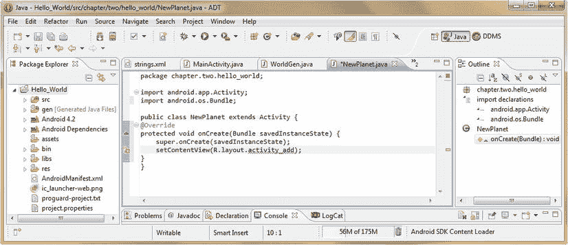
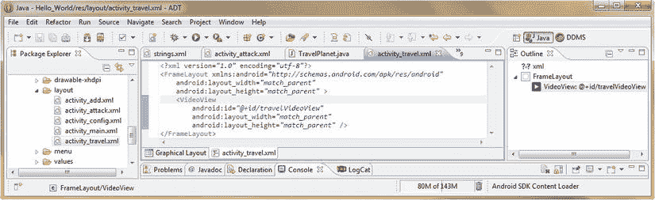

# 四、布局和活动：使用`ViewGroup`类

既然我们已经在第 3 章中创建了 Java 代码，为我们的 Hello_World 应用生成了健壮的新世界(WorldGen)，我们需要开始为我们的 Android 应用构建**前端**，我喜欢称之为**用户界面设计**。

用户界面 (UI)设计、用户体验(UX)以及应用内容都是通过 Android 消费电子设备的主屏幕交付的，您的目标最终用户或客户正在使用该设备查看您的 Android 应用。用户体验(UX)是用户界面设计、可用性和内容感知影响的总和。

在这一章中，我们将仔细看看最底层，实际上是 Android 中任何屏幕设计的基础。这被称为 Android **布局容器**，它是使用**视图组**类在 Android 中实现的。Android **ViewGroup** 类是 Android **View** 类的子类，后者本身是我们在第 3 章中了解到的 Java **Object** 类的子类。幸运的是，我们已经了解了 Java 类的层次结构。

我将再次尝试在这一章中无缝地融合两个目标；通过添加布局容器和菜单来再次增强我们的 Hello World 应用，并教你如何同时使用 **XML** 和所有关于 Android **视图**和**视图组**类概念来编写菜单和屏幕布局。

我们将在我们的 Hello_World 应用中定义一些不同类型的屏幕布局容器，并为它们提供基本的用户界面元素，稍后，我们将在本书的第 2 部分中用更高级的用户界面元素、图形、视频和动画来替换(升级)。我们还将学习如何创建 Android **活动**，我们将使用它来保存我们的布局容器，并在 Hello_World 应用中定义逻辑区域。

Android 屏幕布局容器:ViewGroup 类

在 Android 中，屏幕布局是通过 Android **ViewGroup** 类创建、定义和组织的，该类是从更一般化的 **View** 类继承而来的。View 类必须通过大家熟悉的 **import android.view.View 导入到每一个 Android 应用中；**声明。

因为 Android **视图**类以各种方式管理我们的屏幕界面，所以它最终有大量的子类，而大多数**视图**子类本身有更专门的子类，正如你将在本章中看到的，以及在下一章涵盖用户界面设计中看到的，一般来说，贯穿本书的其余部分。

不用说，视图在 Android 中很重要，因为它们提供了你的应用和最终用户之间的接口。Android View 包用于在新的 Android 应用项目对话框中创建的 bootstrap (basic) Android 应用，因为要使用应用的屏幕，您必须导入 View 类才能做到这一点。

Android View 类有大量专门的子类，其中许多我们会在第 5 章中详细讨论。本章致力于一个非常特殊的视图子类，叫做**视图组**，它允许以**小部件**子类(用户界面元素)的形式无缝地组织视图子类。

**ViewGroup** 是`View`的子类，因为 Android `View`类提供了那些顶级的屏幕管理特征(大小、尺寸、方向和类似的屏幕属性)以及功能(事件处理、焦点等)。)我们将在[第 5 章](05.html)中详细介绍。

`ViewGroup`子类增加了全局屏幕布局属性和方法，允许开发人员定义和微调屏幕布局组织特征和顶级功能。

就像 Android View 类为其`ViewGroup`子类提供更高级别的属性和功能一样，`ViewGroup` **base** 类为其自身的子类提供更高级别的屏幕布局参数属性和屏幕布局创建功能。

我在这里提到这个的原因是因为在 Android 中没有直接使用`ViewGroup`类来实现任何特定的布局容器；因此，它可以被定义或归类为它的许多子类中的一个**基本**类。

所以，请记住，Android 开发人员目前可以使用的所有不同类型的屏幕布局容器类来创建用户界面设计，实际上是 Android `ViewGroup`基类的子类。

Android 视图组子类:布局容器类型

Android 提供了几种主流的布局容器类型作为 ViewGroup 类的子类。这些类是你将在大多数项目中使用的，也是我们将在本书中涉及的。

这些 ViewGroup 子类被命名为: **RelativeLayout** (默认布局类型，在新的 Android 应用项目对话框中创建)、 **FrameLayout** (用于单项布局)和 **LinearLayout** (用于需要符合行或列格式的用户界面元素，如内嵌按钮条和自顶向下列表)。

还有一些其他的布局容器类型被**弃用了**，我们不会讨论这些，因为它们已经停止使用了。弃用意味着停止使用，但仍支持(但不推荐)使用，以便使用此弃用代码的旧代码仍能运行。Android 中被弃用的布局容器和被弃用时的 API 等级包括 **AbsoluteLayout** (等级 3)和 **SlidingDrawer** (等级 17)。

还有一些布局容器类型本质上与 deprecated 正好相反，也就是说，它们太新了(API 级别 13 和更高)，以至于 Google 还没有完成它们的代码实现，如果使用它们，当所有的功能最终就绪时，您可能需要在以后更改代码。此外，它们只能在 API 级别 13 到 17 下工作，不支持 API 级别 3 到 12，而传统的消费电子产品仍然支持 API 级别 3 到 12。在本书中，我们想要关注的是适用于所有 Android 设备的布局容器。

API 级(蜂巢)及以后的布局容器有**网格布局**、 **ViewPager、**和 **PagerTitleStrip** ，这些我们就不赘述了。

注意，我们也不讨论 **FragmentBreadCrumbs** 布局容器，因为它的复杂性超出了学习 Android 应用开发的入门书籍的范围。

我们看到的第一个布局容器是最常用的容器之一，也是 Android 操作系统的默认容器: **RelativeLayout** 。因为`RelativeLayout`已经在您的引导 Hello_World activity_main.xml 文件中设置好了，我们将继续向您展示如何正确使用它。

相对布局定位:Android RelativeLayout 类

我们将从 **RelativeLayout** 类开始，因为这是 Eclipse ADT 在我们新的 Android 应用项目系列对话框中为我们设置的默认布局容器。我们将使用它，并首先了解 RelativeLayouts，因为它们是最常用的。

`RelativeLayout`容器被恰当地命名，因为它使用**相对定位**来排列用户界面元素(UI 窗口小部件，使用 Android `View`类对其进行子类化，我们将在下一章中学习)。

在本章的下一节中，当我们开始使用 Android XML 标记语言编写 Hello_World 应用启动屏幕用户界面元素时，您将看到如何创建相对布局，用参数填充，然后进行微调。

我们将使用当前的 **主活动**屏幕活动作为我们的启动屏幕。因为我们已经定义了一个“默认”或初始地球世界，我们将在我们的应用主屏幕上使用它来向我们的最终用户显示他们当前所在的位置`—`地球。这样，我们就不用重写任何代码了！

我们还将向您展示如何定义菜单，以便您可以调用其他屏幕(活动)定义。我们在这些活动中使用不同类型的屏幕布局容器，以便您可以了解每种容器是如何实现的。我们在本章中介绍菜单，因为菜单代码已经在第 2 章中写好了，所以尽可能早地实现我们的菜单是合理的，这样你就可以学习如何为你的活动屏幕实现菜单。另外，菜单也是 UI 设计的一部分，对吧？

创建启动屏幕:通过 XML 定义我们的 relative layout

我们定义的第一个屏幕(活动)布局容器是我们的 Hello World 应用启动屏幕，它是在第 2 章中定义的。Java 代码位于 MainActivity.java 的**中，XML 标记位于**的 activity_main.xml** 中，目前它是一个带有 Hello World 的 RelativeLayout 容器！里面有短信。**

我们希望将这个当前的启动屏幕转化为一个信息图表，显示我们的应用最终用户当前所处世界的当前属性。我们使用一些 Java 代码和 XML 标记更改(相当小的更改)。当应用首次启动时，这是我们在第 3 章中定义的地球物体。我们将让我们的用户在世界之间旅行，所以我们必须从一开始就让这个屏幕访问**变量**内容(而不是固定的文本值)，这让它变得有点困难。让我们设计我们的屏幕输出如下:

```java
Planet Name:            Earth           <planetName instance variable>
Planet Mass:            5,973 YG        <planetMass instance variable>
Planet Gravity:         9.78 m/s        <planetGravity instance variable>
Planet Colonies:        1               <planetColonies instance variable>
Planet Population:      1,000           <planetPopulation instance variable>
Planet Military:        100             <planetMilitary instance variable>
Planet Bases:           1               <planetBases instance variable>
Planet Forcefield:      On              <getForceFieldState() method call>
```

这在我们的相对布局容器中转化为八个文本字段(在左边)，包含八个字符串常量**和八个右边的文本字段，它们访问我们的 WorldGen 对象方法和变量，当我们的用户旅行到另一个世界时，可以通过 Java 代码设置。**

尽管我们将在下一章详细介绍用户界面元素，但我们至少要介绍一个视图子类(TextView)来创建这个当前世界信息启动屏幕。所以，让我们点击 Eclipse 快速启动图标，开始吧！

Eclipse 打开我们的 Hello_World 应用，正如我们在第 2 章和第 3 章中对它的配置一样。顶部应该有已经为 activity_main.xml (res/layout 文件夹)、activity_main.xml (res/menu 文件夹)、strings.xml (res/values 文件夹)、MainActivity.java(src/chapter . two . hello _ world 文件夹)和 WorldGen.java(src/chapter . two . hello _ world 文件夹)打开的编辑选项卡。让我们从单击 strings.xml edit 选项卡开始。

为启动屏幕创建字符串常量

让我们先添加我们的启动屏幕信息文本标签常量，因为我们的 RelativeLayout 容器中的 TextView 小部件将访问它们。正如您所看到的，在这个 XML 文件中已经为我们的应用名称(Hello_World)和 Hello_World 问候消息定义了字符串常量，还为一个菜单标签(设置)定义了字符串常量，我们稍后将对其进行一些更改。

单击 **strings.xml** 的编辑选项卡，并为我们在本节前面定义的八个世界信息字段标签添加 **< string >** XML 标签。XML 标签应该看起来像这样，也显示在[图 4-1](#Fig1) : 中

```java
<string name="planet_name_label">Planet Name: </string>
<string name="planet_mass_label">Planet Mass: </string>
<string name="planet_gravity_label">Planet Gravity: </string>
<string name="planet_colonies_label">Planet Colonies: </string>
<string name="planet_population_label">Planet Population: </string>
<string name="planet_military_label">Planet Military: </string>
<string name="planet_bases_label">Planet Bases: </string>
<string name="planet_forcefield_label">Planet Forcefield: </string>

```


[图 4-1。](#_Fig1)在 Eclipse 的 strings.xml 文件中添加我们的八个启动屏幕文本常量

请注意，我们在每个分号后添加了一个空格，这样我们稍后添加的变量数据就不会接触到我们的标签文本常量。作为程序员，我们必须总是提前考虑像这样的 UX 问题。

通过<textview>向我们的启动屏幕用户界面添加文本</textview>

现在点击包含了 xml 容器的 **activity_main.xml** 标签，图 4-1 中最左边的编辑标签。我们不需要(或不想)将这些新的 TextView 元素垂直或水平居中，所以我们想做的第一件事是删除这两个 XML 参数。

接下来，让我们向第一个 TextView UI 元素添加一个 **android:id** 参数，就在开始的 **< TextView >** 标签之后。这样，一旦我们复制并粘贴了所有的 TextView 标签，我们就可以根据我们如何配置第一个标签，通过名称来识别我们的 RelativeLayout 中的每个 TextView 标签。

这个 ID 还被用来从 Java 以及我们的 XML 标记中引用每个 UI 元素 ，这是使用我们现在熟悉的 **android:id** XML 参数来完成的。参数是这样写的:

```java
android:id="@+id/textView1"
```

最后，更改文本视图中的最后一个参数， **android:text** 指向我们之前在 strings.xml 文件中创建的**@ string/planet _ name _ label**。完成的 TextView UI 元素 XML 标记如图[图 4-2](#Fig2) 所示。


[图 4-2。](#_Fig2)在 Eclipse 中添加 TextView XML 标签，并通过弹出对话框配置相关布局参数

因为我们的活动屏幕上只有一个 UI 元素，这里仍然没有相对的布局定位，所以让我们复制并粘贴第一个 TextView UI 元素到它本身的下面，这样我们就有了两个，然后可以探索它们相对于彼此的定位。

通过编辑 **android:id** 参数，将第二个标签命名为 **textView2** ，如图[图 4-2](#Fig2) 所示，然后记得同时更改标签的 **android:text** 参数，以指向我们之前在 values 文件夹的 strings.xml 文件中定义的 **planet_mass_label** 字符串常量。

接下来，我们通过在 android:id 参数下添加一行并键入单词 **android** 来添加我们的相对定位参数。注意，在你按下参数名的 **android** 部分之后的**冒号**字符之后，在参数名的**布局**部分之前，你触发了一个 Eclipse 参数助手对话框，如图[图 4-2](#Fig2) 所示。

XML 参数选择器助手对话框总是弹出参数建议，就像我们在定义 Java 对象时按下句点键后在第 2 章中观察到的一样。

在你按下冒号键之后，继续输入单词**布局**，注意，当你输入的时候，Eclipse 会根据它认为你正在寻找的内容，提炼弹出帮助器的内容，再次显示在[图 4-2](#Fig2) 中。

在输入完 *android:layout* 之后，你就列出了所有可以用于 relative layout 容器的相关布局参数。

正如你在[图 4-2](#Fig2) 中看到的，大约有三打(显示了一打，因为滚动条是高度跨度的三分之一，我估计是三倍)，你需要选择列表中的第五个。

双击 **android:layout_below** 参数以选择它的用法(因为我们希望我们的 TextView UI 元素一个在另一个下面)。一旦这个相对布局参数被添加到 Eclipse XML 编辑窗格中，在 helper 实用程序提供给您的两个引号字符内键入 **@+id/textView1** 引用，这是对直接位于它上面的第一个 TextView UI 元素的引用。

注意，例如，如果你在一个 **LinearLayout** 容器中，这个参数弹出帮助对话框将包含与安卓布局容器的 **LinearLayout** 类型兼容的参数。

接下来，我们将使用第一个 TextView XML 标记创建的第二个 TextView XML 构造复制并粘贴六次，这样我们就不必再键入六次所有的 TextView 标记及其参数。

对于六个复制的 TextView 标签中的每一个，让我们编辑每个复制的 TextView 标签的' **android:text** 参数中的 **@string** 变量，以便它们与最后六个< string >标签常量名称相匹配，这些名称是我们之前在 values 文件夹中的 strings.xml 文件中定义的。

最后，让我们为六个复制的 TextView 标签中的每一个编辑 **android:layout_below** 参数，这样每一个都指向，或者说**引用**，TextView UI 元素的 **android:id** 参数，它直接位于每一个标签之上。

Hello_World 应用启动屏幕的文本标签常量的八个 XML 标签现在定义在我们的**activity _ main**relative layout XML 容器中，应该看起来像图 4-3 中所示的屏幕。


[图 4-3。](#_Fig3)我们配置了相对布局(layout_below)参数的八个基本 TextView XML 标签

注意，有两种不同的方法来关闭 XML 标签。一种方法是在标签参数后用一个 **/ >** 符号来结束每个 TextView 标签。这是关闭没有任何其他标签**嵌套在其中**的标签的方法。

另一种在 XML 标记内嵌套有其他标记的情况下关闭 XML 标记的方法是，只使用一个 **>** 符号来关闭开始标记，然后在该标记内的任何嵌套项后让标记名以/ >符号结尾。我们这里的 **< RelativeLayout >** 标签就是这种情况。

在图 4-3 中，我们可以看到这两种不同的标签关闭方法，我们当前的相对布局标签和嵌套在其中的文本视图标签。

现在让我们编译并运行我们的 Hello_World Android 应用，看看我们的启动屏幕到目前为止是什么样子。确保你写的所有代码都保存好了(你可以在任何标签页使用 **CTRL-S** 随时**保存**，然后你可以在左边的包浏览器窗格中右键点击项目文件夹，然后选择**运行为 Android 应用**菜单选项。

正如你在[图 4-4](#Fig4) 中看到的，我们的启动屏幕的文本标签彼此完美地排列在一起，所以我们的相对布局参数工作良好。为了完善我们的用户体验，我们唯一需要做的就是将我们的八个文本标签向右移动一点，这样它们就不会碰到用户屏幕的左边缘。


[图 4-4。](#_Fig4)在 Nexus S 模拟器中运行我们的 RelativeLayout，看看相对定位是如何工作的

我们将通过使用 RelativeLayout 容器左边距参数**Android:layout _ margin left**来实现这一点。这要求我们为八个 TextView 标记中的每一个添加一行 XML 标记，如下所示:

```java
android:layout_marginLeft="5dip"
```

这将我们的文本常量标签向右移动五个**设备独立像素** ( **倾斜**或 **DP** )，为我们的新启动屏幕创建一个直的左边距。将这一行 XML 标记添加到每个 TextView，就在 android:id 参数之后，然后使用 **Run As Android App** 命令检查结果。

通过<textview>向我们的启动屏幕用户界面添加数据</textview>

现在我们已经准备好添加 TextView UI 元素，它将保存我们的 WorldGen 对象的实际数据值。我们将使用一些新的相对布局参数，类似于我们刚刚用来完成这个屏幕的用户界面设计的左半部分。

让我们再次采用另一种快捷方式，复制第一个 textView 标记，将其 ID 从 textView1 重命名为 **dataView1** ，并进行一些其他更改，以创建我们的对象数据变量 TextView 用户界面元素标记，如下所示:

```java
<TextView
        android:id="@+id/dataView1"
        android:layout_toRightOf="@+id/textView1"
        android:layout_marginLeft="36dip"
        android:layout_width="wrap_content"
        android:layout_height="wrap_content"
        android:text="@string/planet_name_label" />
```

我们添加的第一个东西是一个 **android:layout_toRightOf** 参数，它告诉我们这个将保存我们的星球名称变量数据值的第一个 TextView UI 元素被放置在 **toRightOf** (在我们的相对布局容器中的第一个星球名称标签常量的右边)。

我们需要修改的第二件事是**Android:layout _ margin left**参数，它用于将变量数据推出，远离标签常量。现在，我保留了 **android:text** 参数(我们稍后将在工作过程中删除它)，这样我们可以在屏幕中间将变量数据排成一条直线，这样看起来更专业。

让我们通过将`marginLeft`设置为 **36dip** 来推出可变数据文本(现在使用行星名称“虚拟”文本)，以便它比屏幕左侧的最长标签常数(行星数量)稍微远一点。这为我们排列其他可变数据文本 UI 元素提供了一个基线。XML 代码如[图 4-5](#Fig5) 所示。


[图 4-5。](#_Fig5)使用 android:layout_toRightOf 参数添加变量数据 TextView

现在，我将向您展示我是如何精确地获得这个 36°倾角设置值的，而不是在我优化该参数时连续多次使用作为 Android 应用运行的(仿真器)，因为这个工作过程可能非常耗时！

Eclipse XML 标记编辑窗格中有一个新特性叫做**图形布局编辑器**(我经常称之为 **GLE** ，简称，可以通过一个小标签在 XML 编辑窗格的左下方访问，如图 4-6 中用红色圈出的[所示。](#Fig6)


[图 4-6。](#_Fig6)使用 Eclipse 图形化布局编辑器来预览我们的相对布局参数设置

单击这个 GLE 选项卡“呈现”您在模拟器中编写的 XML 代码，当您通过 MainActivity Java 代码运行该 UI 设计时，模拟器将向您显示这些代码。注意，这个 GLE 也可以用来为您编写 XML 代码，使用拖放功能，您可以在它的周围看到。因为我们都是程序员，所以我将严格从代码编写的角度来看这本书，并主要使用这个 GLE 特性作为渲染设计预览的捷径，以节省我们 UI 设计过程中及时的仿真器启动周期。

同样，让我们复制第二个 textView 标签，将其 ID 从 textView2 重命名为 **dataView2** ，并做一些其他更改来创建我们的下一个对象数据变量 TextView 用户界面元素标签，如下:

```java
<TextView
        android:id="@+id/dataView2"
        android:layout_toRightOf="@+id/textView2"
        android:layout_alignStart="@+id/dataView1"
        android:layout_alignBelow="@+id/dataView1"
        android:layout_width="wrap_content"
        android:layout_height="wrap_content"
        android:text="@string/planet_mass_label" />
```

我们将 **ID** 重命名为 dataView2，确保它是 textView2 的**to right，将 **alignBelow** 参数设置为低于 dataView1，还将 **marginLeft** 参数替换为**Android:layout _ align start**参数。**

我们使用的这个新的相对布局参数对齐 UI 元素的起始(像素)位置，我们将它设置为引用我们刚刚创建的 dataView1，以便 dataView1 和 dataView2 完美地对齐。

现在，我们将 android:text 引用设置为我们在 textView2 标签中使用的相同的 planet mass 字符串，尽管稍后我们可以删除它，因为最终我们的 Java 代码将设置这个值，并且我们将不需要它来检查对齐(这就是为什么我们现在将它留在这里)。

一旦我们做了这些改变，如图 4-7 所示，我们可以使用 dataView2 作为模板，复制并稍作修改，创建 dataViews 3 到 8。


[图 4-7。](#_Fig7)使用 android:layout_alignStart 参数将 dataView2 与 dataView1 的左侧对齐

在我们复制并粘贴了 dataView3 到 dataView8 的 TextView 标签后，我们可以点击屏幕底部的图形布局编辑器选项卡，并看到我们的虚拟文本变量完全对齐，如图 4-8 中的[所示。](#Fig8)


[图 4-8。](#_Fig8)使用 layout_alignStart 参数在图形布局视图中排列的虚拟数据文本变量

注意，当我们复制它时，唯一可以灵活改变其值的相对布局参数是**Android:layout _ align start**参数。它可以被设置为引用 dataView1 或它上面的数据视图。我在它上面使用了 dataView，因为从我复制的前一个 dataView 标记的每个副本中为每个数字加 1 更容易。这就是我复制这些数据视图标签的工作流程。

使用 Java 将数据写入我们的启动屏幕 UI

现在我们需要让我们的 Java 代码用实际的对象变量数据值替换这些虚拟实例变量(这将在运行时完成)。这要求我们在我们的`MainActivity`类中编写一些方法。

我们编写第一个方法将用于巩固我们的`onCreate()`方法，通过把我们放在那里的所有对象创建代码，回到第二章的[，并创建一个 **setStartUpWorldValues( )** 方法](02.html)来以有序的方式设置我们的初始(默认)世界对象和位置的值。

因为我们也在编写一个 **setStartUpScreenText( )** 方法来访问我们的`earth WorldGen`对象，我们需要将创建我们的`WorldGen`对象的代码行移到我们的`MainActivity`类的顶部，如图[图 4-9](#Fig9) 所示，这样该类中的所有方法都可以访问它。这一行 Java 代码如下所示:

```java
WorldGen earth = new WorldGen("Earth", 5973, 9.78);

```


[图 4-9。](#_Fig9)将 WorldGen 对象创建和配置代码重写为 setStartUpWorldValues()方法

用实例变量数据设置填充我们的`earth WorldGen`对象的其余 `WorldGen`方法调用现在放在我们的**保护的 void setStartUpWorldValues( )** 方法的花括号内，如图 4-9 所示。这个方法被**保护**，这样这个类(和子类)中的其他方法，比如`onCreate()`就可以访问(调用)它。它也被声明为 **void** ，因为它执行一个不返回值的任务。还要注意，我们已经将注释与代码一起复制并对齐了。

现在是时候编写我们的第二个 **setStartUpScreenText( )** 方法了，该方法将使用来自名为 **earth** 的`WorldGen`对象的数据填充 dataView TextView UI 元素。对于每个 dataView TextView 对象，这需要两行 Java 代码；一个用于创建、命名和引用 TextView UI 元素，另一个用于将其 **android:text** 参数值设置为每个 earth WorldGen 对象实例变量数据字段的值。

为了声明和命名我们的第一个 TextView 对象，我们使用这行代码:

```java
TextView planetNameValue = (TextView)findViewById(R.id.dataView1);
```

这将对象声明为 TextView 类型，将其命名，并引用我们在 activity_main.xml 文件中设计的 dataView1 标记。

请注意图 4-10 中的，当我们键入文本视图对象类型时，Eclipse 使用红色波浪下划线，当我们将鼠标悬停在下划线对象类型上以了解原因时，Eclipse 通知我们**文本视图无法解析为类型**，并给我们一些潜在的解决方案，其中最明显的是第一个**导入文本视图**，因为我们从[第 2 章](02.html)中知道，在我们自己的代码中使用对象类之前，我们必须导入它。


[图 4-10。](#_Fig10)编码 setStartUpScreenText()方法，添加 dataView TextView 及其 import 语句

所以点击**Import TextView(Android . widget package)**选项，让 Eclipse 为您编写我们的 Import 语句，正如您将在[图 4-11](#Fig11) 中看到的，它现在已经就绪，可以使用了。


[图 4-11。](#_Fig11)使用 Java。setText()方法调用来为 dataView1 设置我们的 planetNameValue TextView 对象

我们需要编写的第二行代码获取我们刚刚声明的名为 **planetNameValue** 的 TextView 对象，并使用它来调用 TextView 类的一个用于设置文本值的方法。毫无疑问，这个方法被称为**【setText()】**方法。您会注意到，在您键入 **planetNameValue** 对象名称，并键入句点字符后，Eclipse 将弹出其对象方法选择帮助器对话框，如图 4-11 所示。向下滚动到列出的**setText(char sequence text)**方法，双击它将对该方法的点调用添加到您的对象中。

在圆括号内输入对 **earth.planetName** 对象和实例变量数据值的引用，用于方法调用，如图[图 4-12](#Fig12) 所示。现在让我们为行星质量数据编写第二两行代码。


[图 4-12。【setStartUpScreenText()的 Java 代码，用地球对象数据填充 dataView UI 元素](#_Fig12)

复制 TextView planetNameValue 行代码，将 planetNameValue 改为 **planetMassValue** ，然后在 **findViewById( )** 方法调用中引用 **dataView2** 而不是 dataView1。然后复制 planetNameValue.setText()代码行，并更改 planetNameValue 对象名，以匹配在前面一行 Java 代码中创建的 planetMassValue 对象名。

因为 planetMass 是一个整数数据值，我们将不得不在我们的**中嵌套**一个方法。setText( ) 将整数值转换成字符串值的方法。这是通过**完成的。字符串类的 valueOf( )** 方法，由**嵌套调用****String . value of()**方法调用如下:

```java
planetMassValue.setText(String.valueOf(earth.planetMass));
```

这一行 Java 代码嵌套了两个方法调用，将**String . value of(earth . planet mass)**方法调用的返回值(将整数值转换为字符串值)传递给**planet mass value . settext()**方法调用(需要一个字符串值作为输入)，所有这些都在一个非常紧凑(嵌套)的代码语句中。

接下来的六行与这两行非常相似，所以让我们走编码者的捷径，复制最后两行代码六次，并相应地替换我们的 dataView 和 planetVariableValue 命名约定。所有这些艰巨的 Java 编码工作的结果如图 4-12 所示。

现在让我们在 Nexus S 模拟器中运行我们的 Hello_World Android 应用，看看这个启动屏幕结出了我们的劳动果实。右键单击项目文件夹，并选择 **Run As Android Application** ，您将看到我们的 XML 和 Java 编码工作已经生成了一个完美的应用 UI 屏幕，它为我们之前创建的 earth WorldGen 对象创建了一个数据信息屏幕，并将作为我们 Hello_World 应用的初始主世界。如图 4-13 中的[所示。](#Fig13)


[图 4-13。](#_Fig13)使用填充了对象数据的 dataView TextView UI 元素运行 Hello_World 应用

接下来，让我们在主页(启动)屏幕的底部添加一个菜单系统！

向我们的活动添加菜单:菜单展开器和菜单 XML

我们需要做的第一件事是定义我们的启动屏幕菜单。Android 中的菜单通常只有五个或更少的条目，所以让我们挑选五个主要功能，我们需要在本章的后面定义布局屏幕(活动)。毕竟这是版面设计章节。

我们的 Hello_World 行星生成器需要有屏幕，允许其用户选择一个新世界，设置其属性，访问该行星(和平时期)，攻击该行星(战争时期)，并返回到主屏幕(启动屏幕)，我们称之为**显示主行星**，以防用户离开地球，并前往他们创建的其他行星之一。

因此，逻辑启动(主页)屏幕菜单选择，以及当菜单项被选择时它们将调用的 Java 活动、XML 标记文件名和布局容器类型如下:

```java
Add a New Planet       Call NewActivity.java, activity_new.xml             RelativeLayout
Configure Planet       Call ConfigActivity.java, activity_config.xml       LinearLayout
Travel to Planet       Call TravelActivity.java, activity_travel.xml       FrameLayout
Attack on Planet       Call AttackActivity.java, activity_attack.xml       LinearLayout
Show Home Planet       Stay in MainActivity.java, activity_main.xml        RelativeLayout
```

请注意，我们已经将菜单**标签**设计为均匀间隔(文本排列整齐)。这是为了让我们的菜单看起来尽可能吸引我们的终端用户，增强我们应用的**用户体验**或 UX。

为了向我们的主活动屏幕添加菜单项，我们将使用 XML 标记在名为 **activity_main.xml** 的文件中定义我们的菜单项，该文件位于我们的 res (resources)文件夹中的**菜单**文件夹中。但是，我们已经在**布局**文件夹中有一个 activity_main.xml 文件，你正在聪明地思考。这是正确的；然而，该文件在**布局**文件夹中，因此是与同样在**菜单**文件夹中的 activity_main.xml 文件不同的**文件，尽管它具有完全相同的文件名。**

每个布局容器 XML 定义和每个活动屏幕的菜单 XML 定义应该具有相同的文件名，如果您稍微考虑一下，这确实非常符合逻辑，因为您的应用(如果是高级应用)中的每个屏幕(活动)都将定义复杂的用户界面或内容元素(布局 XML)，以及为每个活动(功能应用区域和屏幕)定义的菜单选择(菜单 XML)。

请注意，我正在交换这些屏幕/活动术语，至少是一小会儿，这样你就会习惯 Android 的行话。在我们向您展示如何为我们的菜单将要调用的这些屏幕编写单独的活动类之前，让我们修改新的 Android 应用项目系列对话框为我们创建的当前 activity_main.xml 文件，以便它包含我们的五个菜单标签，而不仅仅是一个设置标签。

从我们在[第 2 章](02.html)中的工作来看，您仍然应该在 Eclipse IDE 中打开 activity_main.xml 的菜单文件夹版本，如果它没有在 IDE 中打开，只需打开菜单文件夹并右键单击 activity_main.xml 文件，然后从上下文相关菜单中选择**打开**选项。然后点击 XML 编辑选项卡，再复制四次<条目>标签，创建我们五个条目的菜单。在我们复制现有的<项目>标签之前，让我们先编辑它，使它与我们之前设计的第一个菜单项匹配。

将 **android:id** 从 menu_settings 更改为 **menu_add** ，将 **android:title** 更改为 **menu_add_planet** ，然后在第一个标签下复制< item >标签四次。将 menu_add 的 android:id 参数分别更改为:menu_config、menu_travel、menu_attack 和 menu_home。

然后将**Android:orderin category**值分别改为:200、300、400、500，将 **android:title** 参数分别改为:menu_config_planet、menu_travel_planet、menu_attack_planet、menu_home_planet。

因此，每个<item>标签应该具有相同的基本格式，如下所示:</item>

```java
<item android:id="@+id/menu_function"
        android:orderInCategory="Number Value for Order in Menu"
        android:showAsAction="never"
        android:title="@string/menu_string_constant" />
```

该工作过程的结果显示在图 4-14 中[的最终 XML 菜单标记中。](#Fig14)


[图 4-14。](#_Fig14)将我们的五个菜单项添加到菜单文件夹中现有的 activity_main.xml 菜单定义文件中

现在我们需要将菜单标签文本常量添加到我们的 strings.xml 文件中，所以接下来单击 Eclipse 顶部的 strings.xml 选项卡，并编辑已经存在的用于名为 menu_settings 的<string>的标签，将其转换为标签值为 **Add a New Planet 的**menu _ Add _ Planet**T5】string>标签。**</string>

一旦你完成了这些，复制<string>标签四次，编辑<string>标签来创建四个新的 menu_config_planet，menu_travel_planet，menu_attack_planet 和 menu_home_planet 字符串常量，如图[图 4-15](#Fig15) 所示。每个<字符串>标签应该遵循相同的基本格式:</string></string>

```java
<string name="menu_add_planet">Add a New Planet</string>

```


[图 4-15。](#_Fig15)将我们的五个菜单标签字符串常量添加到 values 文件夹中的 strings.xml 文件中

我们不需要编写 Menu Inflater 代码来创建菜单，因为新的 Android 应用项目助手已经为我们完成了这项工作，但是，因为我们在这里使用它来创建我们的菜单，所以现在让我们更仔细地看看它，并把它处理好。以下是菜单增压泵代码:

```java
public boolean onCreateOptionsMenu(Menu menu) {
        getMenuInflater().inflate(R.menu.activity_main, menu);
        return true;
}
```

**onCreateOptionsMenu( )** 方法是 Android Activity 类的一部分，它用于为任何给定的活动创建**选项菜单**。在这个特例中，它是我们的 **android.app.Activity** 的 **MainActivity** 子类，它被导入到我们的 MainActivity.java 文件的顶部。

该方法将一个名为 Menu 的 Menu 对象传递给该方法，在该方法中，它通过一个 **inflate( )** 方法填充了您的 menu XML 参数，该方法通过 **R.menu.activity_main** 方法中的第一个(inflate from)参数引用您的**\ resource \ Menu \ activity _ main . XML**文件，然后将该数据膨胀到第二个(inflate to object)参数中，该参数是声明并传递给 onCreateOptionsMenu()方法的 **menu** 对象。

**getMenuInflater( )** 方法调用 inflate()方法，并使用它来填充活动的 MenuInflater 对象。 **MenuInflater** 类是 android.view 包(**Android . view . MenuInflater**)的一个成员，它使用那些 **<菜单>** 和<项目> 标签及其参数，获取您的菜单 XML 定义和**实例化**膨胀的**菜单**对象。

一旦 **getMenuInflater()。inflate( )** 过程已经完成，没有任何失败， **onCreateOptionsMenu( )** 方法退出，并返回一个 **true** 值，表示菜单资源已经被正确实现。

我们现在可以右键单击我们的项目文件夹，并选择 Run As Android Application 命令来编译和运行我们的 Java 和 XML 代码。让我们来看看我们的菜单在模拟器中的效果，如图 4-16 所示。


[图 4-16。](#_Fig16)带有功能菜单的主活动启动屏幕

在我们可以在 Java 代码中实际实现这些菜单选项之前，我们需要为每个菜单选项创建布局容器(通过 XML 标记)和活动(通过 Java 代码)。这是因为选择这些菜单项中的每一个都会将应用切换到这些活动中的每一个。

因此，让我们为前四个菜单选项创建四个新的 Activity Java 类，每个类都有自己的自定义布局容器 XML 定义，如图 4-16 所示，包含了我们的 Hello_World Android 应用的主要功能区域。

这些新的活动及其布局容器为我们提供了大量的应用功能屏幕，在本书的接下来几章中，我们将学习 Android 中的事件、意图、UI 小部件、图形设计和动画。

定义添加新星球屏幕:创建 Android 活动

我们需要做的第一件事是为我们的 Add a New Planet 菜单项创建一个 **NewPlanet 类**，所以右击你的 Hello_World 项目文件夹并选择 **New  Class** 菜单项。我们将使用与我们在第 2 章中创建 WorldGen 类时相同的工作流程，除了这一次，我们将子类化 **android.app.Activity** 类，因为我们正在创建一个活动，而不是一个世界对象生成器。

这两种类型的类的主要区别在于，Activity 类没有构造函数方法，而生成对象的类有。这是因为活动不是在运行时生成的，需要在 AndroidManifest.xml 文件中定义。

在 **新建 Java 类**对话框中点击**浏览。。。**按钮位于**包**区旁边。选择 **chapter.two.hello_world** 包，然后在 **Name:** 字段中输入 **NewPlanet** 来命名我们的新活动类。这个活动类是以它将允许我们的最终用户在一个新的星球上添加什么来命名的。

接下来点击**浏览。。。旁边的**按钮**超类**字段，输入**活动**(只输入**行为**会得到相同的结果)将所有与活动相关的类带入选择区域。

选择 **Activity - android.app** 包选项，然后点击 **OK** 按钮。保留对话框中的其他默认设置，点击**完成**按钮。瞧，您的**NewPlanet.java**类被创建并在 Eclipse 中央编辑窗格区域内打开进行编辑。

接下来，我们添加一个 **onCreate( )** 方法，最简单的方法是单击新类中的空白行(在两个花括号之间)来选择它(它变成浅蓝色)并按住 **Control** (Ctrl)键，同时按下**空格键、**，这是调出 Eclipse ADT 方法选择器助手对话框所需的击键序列。

在对话框中向下滚动一半，找到**onCreate(Bundle saveInstanceState):void**方法，如图[图 4-17](#Fig17) 所示，双击该方法，将需要的 onCreate()方法添加到我们的 NewPlanet (class) Activity 子类中。您创建的每个活动都需要实现一个 onCreate()方法，以便它可以在系统内存中创建活动。完成后，您可以定义一个区域来查看您的应用内容，这是我们接下来要做的。


[图 4-17。](#_Fig17)ctrl-空格键击键序列调用方法选择器助手对话框

在 **super.onCreate( )** 方法调用之后，我们需要添加一行调用 **setContentView( )** 方法的代码，类似于我们的 MainActivity.java 文件中的代码。事实上，您可以采用程序员的快捷方式，剪切并粘贴那行代码，然后修改它以引用我们接下来要创建的 **activity_add.xml** 文件。代码应如下所示:

```java
setContentView(R.layout.activity_add);
```

请注意，当您这样做时，Eclipse 使用红色波浪下划线来标记 **activity_add** 引用，如图[图 4-18](#Fig18) 所示，我们已经知道这是因为引用的文件还不存在，所以我们现在忽略这个错误，因为我们将在这个活动创建工作流程的下一步创建这个布局 XML 文件。



[图 4-18。](#_Fig18)将 setContentView()方法调用和引用添加到尚未创建的 activity_add.xml 文件

在包浏览器中再次右键单击 Hello_World 项目文件夹，然后选择 **New  Android XML File** 菜单选项。从下拉列表中选择布局 XML 类型(如果还没有这样设置的话)并指定 **Hello_World** 项目。接下来添加 **activity_add** 文件名(仅第一部分，对话框添加。xml extension for you ),从对话框中间的选择区域选择 **RelativeLayout** 布局类型，如图[图 4-19](#Fig19) 所示。然后点击**完成**按钮，在布局文件夹中创建 XML 文件，并在 Eclipse 的中央编辑窗格中打开。


[图 4-19。](#_Fig19)通过新的 Android XML 文件对话框创建一个 RelativeLayout 布局 XML 文件

现在，让我们将一些 **ImageView** 用户界面元素添加到相对布局容器中，这样我们可以稍后(在图形设计的章节中)添加一些行星图片作为视觉选择用户界面设计。

这次我们将使用图形布局编辑器(GLE)添加第一个 **< ImageView >** 标签，这样您就可以看到它的拖放功能是如何工作的。因为这是一本面向程序员的书，所以我们不会像在 Apress Absolute 初学者系列中关于如何创建 Android 应用的书中那样充分利用 GLE，但是您应该看看它是如何工作的，以防万一您想在自己的工作过程中使用它(而不是作为 XML 代码预览工具或快捷方式)。

单击中央编辑窗格左下方的选项卡，并选择图形布局编辑器模式。找到并点击左边的 **Images & Media** 抽屉，这样我们就可以访问 **ImageView** 用户界面元素，或者 **widgets** ，我们将在以后的 UI 设计[第 6 章](06.html)中更详细地了解它们。抓取 ImageView，如图[图 4-20](#Fig20) 所示，并将其拖动到模拟应用屏幕上，放在中央附近。


[图 4-20。](#_Fig20)使用图形布局编辑器窗格创建初始 ImageView 标签和参数

请注意，在拖放操作过程中，当您在屏幕上拖动 UI 元素时，工具提示会实时提供参数和位置信息。一定要尝试这个特性，因为它是一个很好的学习工具，可以帮助你了解哪些参数是可用的。放下 ImageView UI 元素后，单击屏幕底部的 xml 编辑选项卡(标记为 activity_add.xml ),查看为您生成的 XML 代码。它应该是这样的:

```java
<?xml version="1.0" encoding="utf-8"?>
<RelativeLayout xmlns:android="http://schemas.android.com/apk/res/android"
  android:layout_width="match_parent" android:layout_height="match_parent" >
    <ImageView
        android:id="@+id/imageView1"
        android:layout_width="wrap_content"
        android:layout_height="wrap_content"
        android:layout_alignParentLeft="true"
        android:layout_alignParentTop="true"
        android:layout_marginLeft="146dp"
        android:layout_marginTop="164dp"
        android:src="@drawable/ic_launcher" />
</RelativeLayout>
```

注意，ImageView 标签下面有一条黄色波浪线，如果你将鼠标放在上面，它会告诉你缺少一个内容描述标签，Android 希望看到包含这个标签以帮助残疾人。添加新的一行，输入 android，然后输入冒号，在弹出的对话框中找到**Android:content description**参数。XML 标记应该是这样的，引用了一个字符串变量:

```java
android:contentDescription="@string/content_desc_earth"
```

接下来，在我们复制它来创建我们的六世界选择器 UI 之前，让我们对这个 ImageView 标记做一些小的修改。将 **android:id** 更改为 imageEarth，并将 marginLeft 和 marginTop 更改为 5dp(或 5dip)值。事实上，因为两个边距值都是 5，所以让我们节省一行标记，简单地使用**Android:layout _ margin = " 5dp "**在我们的行星图像周围给我们均匀的间距。注意，现在，我们使用 drawable 文件夹中的启动器图标作为**占位符图形**，直到稍后我们在图形设计[第 6 章](06.html)中创建不同的世界图像。

因为我们在 ImageView 标签中引用了针对视障人士的内容描述字符串,所以接下来让我们添加六个星球内容描述字符串，然后结束。每个<字符串>标签的格式是

```java
<string name="content_desc_planet">Planet Name</string>
```

让我们使用六个最常见的行星名称作为我们的字符串常量:地球、火星、金星、木星、土星和海王星。参见图 4-21 。


[图 4-21。](#_Fig21)将六个星球内容描述字符串标签添加到 values 文件夹中的 strings.xml 文件中

现在复制第一个 ImageView 标签并粘贴到下面，并将 ID 更改为 **imageMars。**让我们也删除 alignParentLeft 和 alignParentTop，因为它们仅用于左上角的 ImageView，以确保此 RelativeLayout 从布局(父容器)的左上角开始对齐。接下来，让我们添加一个引用 imageEarth ID 的 **android:align_toRightOf** 参数，因为我们希望的第二个 ImageView 与第一个 ImageView 对齐。还要更改 contentDescription 以引用**@ string/content _ desc _ 火星**。

复制第二个 ImageView 标记并再次粘贴到下面。接下来将 ID 更改为 **imageVenus** 并将 layout_toRightOf 参数更改为 **layout_below** 并引用 imageEarth ID，因为我们希望第三个 ImageView 在第一个 ImageView 的下方对齐。另外，记得修改 contentDescription 标签来引用**@ string/content _ desc _ 维纳斯**。

复制第三个 ImageView 标记并再次粘贴到下面。将 ID 更改为 **imageJupiter** 并将 layout_below 参数更改为引用 imageMars，并添加一个引用 **imageVenus** 的 **android:layout_toRightOf** 参数，以便 imageJupiter 位于 imageMars 的下方和 imageVenus 的右侧。编辑内容描述并指向**@ string/content _ desc _ 朱庇特**。

第一个<imageview>标签相对于父容器对齐，其 XML 标记代码如下所示:</imageview>

```java
<ImageView android:id="@+id/imageEarth"
        android:layout_width="wrap_content"
        android:layout_height="wrap_content"
        android:layout_alignParentLeft="true"
        android:layout_alignParentTop="true"
        android:layout_margin="5dp"
        android:contentDescription="@string/content_desc_earth"
        android:src="@drawable/ic_launcher" />
```

请注意，一旦您复制了这个 XML 标记来创建其他所需的五个<imageview>标签，您将不得不更改某些 **android:layout** 参数来正确对齐每个 ImageView UI 元素，相对于它周围的其他 UI 元素。如图[图 4-22](#Fig22) 所示。</imageview>


[图 4-22。](#_Fig22) RelativeLayout XML 标记定义添加一个新的带有占位符图形的 Planet screen 用户界面

最后，复制 imageVenus 和 imageJupiter 的最后两个 ImageView 标记，并将它们粘贴到 imageJupiter 下面，并将它们的 id 分别更改为 imageSaturn 和 imageNeptune。将它们的 contentDescription 引用更改为**content _ desc _ 土星**和**content _ desc _ 海王星**，并将它们的 layout_below 参数分别更改为引用 imageVenus 和 imageJupiter。确保 imageNeptune ImageView 也有一个 **android:layout_toRightOf** 参数，该参数强制它与 imageSaturn 的右边对齐。六个完整的 ImageView 标签如[图 4-22](#Fig22) 所示。

定义配置行星活动:LinearLayout 容器

接下来，我们将创建我们的 Configure Planet UI 屏幕，这涉及到创建另一个名为**ConfigActivity.java**的活动子类，它带有一个在 **activity_config.xml** 文件中定义的 LinearLayout 容器。因为你已经这样做过一次，我将放弃截图和数字，因为如果需要的话，你可以参考前面的部分。

首先，右键单击 Hello_World 项目文件夹，选择 **New  Class** ，为 chapter.two.hello_world 包创建一个 Java 类，该类子类化 android.app.Activity，命名为 **ConfigPlanet** 。保留其他默认选项设置，点击**完成**。

接下来，添加一个 **onCreate( )** 方法到中，在 Android 中创建活动，使其存在。当您引用(访问)活动时，会调用此方法，并在系统内存中创建活动(在运行时为其分配内存)。这就是为什么每个活动都需要一个 onCreate()方法**实现**。

接下来，添加一个 **setContentView( )** 方法，该方法引用我们接下来创建的 **activity_config.xml** 来保存我们的 LinearLayout 定义，如下所示:

```java
setContentView(R.layout.activity_config);
```

接下来，再次右键单击 Hello_World 项目文件夹，选择新的 Android XML 文件，并创建一个 LinearLayout XML 文件来定义 LinearLayout 用户界面设计。在此对话框中选择资源类型:**布局**，项目: **Hello_World** ，文件名: **activity_config** ，根元素: **LinearLayout** (参考[图 4-19](#Fig19) ，点击**完成**。

接下来，在我们的 LinearLayout 容器中添加一些按钮标签，这样您就可以看到 LinearLayout 做了什么。在后面的[第 5 章](05.html)中，我们将把它们连接起来，以便它们执行它们应该执行的任务，但是现在，我们只关心 XML 布局文件定义。单击 XML 编辑窗格底部的图形布局编辑器选项卡(窗格顶部的 **activity_config.xml** 选项卡应该是活动的)，并将一个**按钮** UI 元素从**表单小部件**抽屉中拖到模拟的应用屏幕上。然后切换到 XML 编辑窗格，将按钮标签的 **android:id** 值更改为 **coloniesButton** ，然后将 **android:text** 参数更改为引用我们接下来将创建的**@ strings/Button _ name _ colonies**值。这可以在图 4-23 中看到。


[图 4-23。](#_Fig23)用按钮 UI 元素填充 LinearLayout，以用于世界配置 UI 屏幕

每个<button>标签应具有以下参数标记结构:</button>

```java
<Button android:id="@+id/coloniesButton"
        android:layout_width="wrap_content"
        android:layout_height="wrap_content"
        android:text="@string/button_name_colonies" />

```

接下来，在第一个标记下再复制五次按钮标记，并编辑 ID 和文本参数值，以匹配每个按钮 UI 元素将要做的事情。因此，我们将殖民地分别改为殖民者、基地、军事、ffon(力场开启)和 ffoff(力场关闭)。

接下来，添加六个字符串标签，它们定义了每个按钮的文本标签，并通过 **android:text** 按钮标签参数引用，如下所示:

```java
<string name="button_name_colonies">Add Colonies</string>
<string name="button_name_colonists">Add Colonists</string>
<string name="button_name_bases">Add Bases</string>
<string name="button_name_military">Add Military</string>
<string name="button_name_ffon">Forcefield On</string>
<string name="button_name_ffoff">Forcefield Off</string>
```

这里我将省略额外的截图，但是这些<string>标签可以在稍后的[图 4-25](#Fig25) 中看到(以及我们需要为 AttackPlanet 类和 Activity 子类添加攻击方法的字符串标签)。</string>

接下来，让我们继续创建我们的 TravelPlanet 类 Activity 子类，以及一个 FrameLayout 容器，以便稍后我们可以在我们的应用中添加星系间旅行的数字视频。

定义去行星旅行活动:框架布局容器

接下来，我们创建我们的 Travel to Planet UI 屏幕，这涉及到创建另一个名为**TravelActivity.java**的活动子类，它具有一个在 **activity_travel.xml** 文件中定义的 FrameLayout 容器。因为你以前做过这个，我将跳过大部分数字，因为你可以参考 NewPlanet.java 部分，如果你需要，它回到定义一个新的行星活动屏幕部分。

首先，右键单击 Hello_World 项目文件夹并选择 **New  Class** 并为 chapter.two.hello_world 包创建一个 Java 类，该类子类化 android.app.Activity 并命名为 **TravelPlanet** 。保留其他默认选项设置，然后点击**完成**。

接下来，添加一个 **onCreate( )** 方法来在 Android 中创建活动，以便它存在。当您引用(访问)活动时，会调用此方法，并在系统内存中创建活动(在运行时为其分配内存)。这就是为什么每个活动都需要一个 onCreate()方法**实现**。

接下来，添加一个引用 **activity_travel.xml、**的 **setContentView( )** 方法，我们接下来创建它来保存我们的 LinearLayout 定义，如下所示:

```java
setContentView(R.layout.activity_travel);
```

接下来，再次右键单击 Hello_World 项目文件夹，选择 **New  Android XML 文件**，创建 **FrameLayout** XML 文件，用于定义 FrameLayout 用户界面设计。在此对话框中选择资源类型:**布局**，项目: **Hello_World** ，文件名: **activity_travel** ，根元素:**框架布局**(参考[图 4-19](#Fig19) ，点击**完成**。

接下来，在 FrameLayout 容器中添加一个 **VideoView** 标签。FrameLayout 是用于全屏数字视频的完美布局，因为 FrameLayout 只包含一个 UI 元素。在后面的章节中，我们将添加数字视频素材，但是现在，我们只关心我们的 XML 布局文件定义。

基本的 **<视频视图>** 标签 XML 标记实现如下:

```java
<VideoView android:id="@+id/travelVideoView"
                android:layout_width="match_parent"
                android:layout_height="match_parent" />
```

这个 <videoview>XML 标记嵌套在<framelayout>标签中，如图[图 4-24](#Fig24) 所示。</framelayout></videoview>



[图 4-24。](#_Fig24)向 Eclipse 中的 activity_travel.xml 文件添加 FrameLayout 容器和 VideoView UI 元素

单击 XML 编辑窗格底部的图形布局编辑器选项卡( **activity_travel.xml** 选项卡现在应该在编辑窗格的顶部处于活动状态)，并将一个 **VideoView** UI 元素从 **Images & Media** 抽屉中拖到模拟的应用屏幕上。

接下来，切换到 XML 编辑窗格，将 VideoView 标签的 **android:id** 值更改为 **travelVideoView** 。这可以在图 4.24 中看到。

最后，我们添加了 AttackPlanet.java 类活动子类，以及另一个包含 ImageButton 标签的 LinearLayout。现在，我们已经为 Hello_World 应用建立了一个五屏幕框架，供本书剩余部分使用。

定义对行星活动的攻击:我们的第二个线性布局

接下来，我们在 Planet UI 屏幕上创建我们的 Attack，这涉及到创建另一个名为**AttackActivity.java**的活动子类，它具有一个在 **activity_attack.xml** 文件中定义的 LinearLayout 容器。因为你已经经历过了，我将放弃截图和数字，因为你可以参考定义添加一个新的行星屏幕部分，如果需要的话。

首先，右键单击 Hello_World 项目文件夹，选择 **New  Class** ，为 chapter.two.hello_world 包创建一个 Java 类，该类子类化 android.app.Activity，名为 **AttackPlanet** 。保留其他默认选项，点击**完成**。

接下来，添加一个 **onCreate( )** 方法来在 Android 中创建活动，以便它存在。当您引用(访问)活动时，会调用此方法，并在系统内存中创建活动(在运行时为其分配内存)。这就是为什么每个活动都需要一个 onCreate()方法**实现**。

接下来，添加一个 **setContentView( )** 方法，该方法引用: **activity_attack.xml，**，我们创建它来保存我们的 LinearLayout 定义，如下所示:

```java
setContentView(R.layout.activity_attack);
```

接下来，再次右键单击 Hello_World 项目文件夹，选择 **New  Android XML 文件**，创建一个 LinearLayout XML 文件，用于定义 LinearLayout 用户界面设计。在此对话框中选择资源类型:**布局**，项目: **Hello_World** ，文件名: **activity_attack** ，根元素: **LinearLayout** (参考[图 4-19](#Fig19) ，点击**完成**。

接下来，在 LinearLayout 容器中添加一些 **ImageButton** 标签，这样我们就可以在我们的 Hello_World(或者我们应该命名为 Goodbye_World) Android 应用中添加一些攻击图标和功能。

请注意，在后面的章节中，我们将把它们连接起来，以便它们执行它们应该执行的任务，但是现在，我们只关心我们的 XML 布局文件定义。

在添加 ImageButton 标签之前，让我们首先定义它们将引用的四个<string>标签。这些显示在截图底部的[图 4-25](#Fig25) 中。它们是在<资源>父标签容器中列出的最后四个<字符串>标签，其名称参数以:content_desc 开始。</string>


[图 4-25。](#_Fig25)为我们的 activity_config.xml 和 activity_attack.xml 布局字符串引用添加字符串标签

有四个图形(图像或图标)按钮可以让我们对一个星球发起四种不同类型的攻击:轰炸、入侵、感染和激光。

因为 Android 中的图形(ImageView 和 ImageButton UI 元素)需要一个内容描述标记来帮助视觉障碍者，所以让我们在通过 android:contentDescription 引用的 strings.xml 文件(values 文件夹)中添加四个反映这些攻击模式的字符串常量，如下所示:

```java
<string name="content_desc_bomb">Bomb the Planet</string>
<string name="content_desc_invade">Invade the Planet</string>
<string name="content_desc_virus">Infect Planet with Virus</string>
<string name="content_desc_laser">Fire Laser at Planet</string>
```

接下来，单击顶部的 **activity_attack.xml** 选项卡和底部的**图形布局**选项卡，并拖出一个 **ImageButton** UI 元素(参见 Images & Media)并选择应用启动器图标作为占位符图形以供使用。然后进入 XML 编辑模式，将其 ID 更改为 **bombButton** ，并添加字符串引用**@ string/content _ desc _ bomb**，指向刚刚添加的字符串标签。标签的<图像按钮>标记应如下所示:

```java
<ImageButton android:id="@+id/bombButton
             android:layout_width="wrap_content"
             android:layout_height="wrap_content"
             android:contentDescription="@string/content_desc_bomb"
             android:src="@drawable/ic_launcher" />
```

将它复制并粘贴到标签下方三次，并将炸弹 ID 参考更改为入侵、感染和激光，如[图 4-26](#Fig26) 所示，并将内容描述参考分别更改为入侵、病毒和激光。


[图 4-26。](#_Fig26)AttackPlanet.java 活动类的 activity_attack.xml 文件的 LinearLayout XML 定义

既然我们所有的活动和它们的布局容器都已经定义好了，我们要做的最后一件事就是在 AndroidManifest.xml 文件中使用<activity>标签向 Android OS 声明这四个新的活动屏幕。</activity>

将我们的应用活动添加到我们的 XML: AndroidManifest.xml

我们需要做的最后一件事是 100%确定我们在这一章中所做的一切都可以干净地编译和运行，那就是将我们对这些活动的使用声明添加到 **AndroidManifest.xml** 文件中。这是通过添加 **<活动>** 标签来实现的，每个标签定义一个活动的使用，并通过特定的命名约定为 Android OS 提供活动的名称。

<activity>标签和所需活动子类名称的格式如下</activity>

```java
<activity android:name="chapter.two.hello_world.NewPlanet" />
<activity android:name="chapter.two.hello_world.ConfigPlanet" />
<activity android:name="chapter.two.hello_world.TravelPlanet" />
<activity android:name="chapter.two.hello_world.AttackPlanet" />
```

这里是所有四个<activity>标签，所以你可以看到在[第 2 章](02.html)中创建的 MainActivity 类<activity>标签之后，需要添加到 AndroidManifest.xml 文件中的内容。您可以看到对类名的完整引用包括包和类名。</activity></activity>

正如您在[图 4-27](#Fig27) 中看到的，我们新的<活动>标签在 Eclipse 中没有“抛出”任何错误或警告。我的 **android:targetSDKVersion** 上有一个警告，说它不是最新版本，所以我将新的 android 应用项目助手放入此 **< uses-sdk >** 标签的 **16** API 级别 Android 4.1.2 JellyBean 版本的值更改为当前的 **17** API 级别 Android 4 . 2 . 2**Jelly Bean+**版本。正如我前面提到的，Eclipse ADT 可能会犯一些错误，您可能需要在以后修复这些错误！


[图 4-27。](#_Fig27)在 Hello_World AndroidManifest.xml 文件中添加四个< activity >标签来定义每个 activity 子类

为了确保我们在这一章中创建的一切都处于完美的工作状态(我们添加了许多令人印象深刻的 Java 代码和 XML 标记)，我现在将在 Eclipse Package Explorer 中右键单击 Hello_World 项目文件夹，并选择 Run As Android Application 菜单序列来启动我们可信赖的 Nexus S 模拟器，并查看我们的应用是否可以运行。

在加载模拟器及其用户界面几分钟后，然后替换之前的应用屏幕，这个应用运行完美，我看到了与我们之前在[图 4-4](#Fig4) 中看到的完全相同的屏幕。

有时，如果新的应用版本没有出现，你可以在模拟器中单击**运行上一个箭头**(一个向左的、上下翻飞的箭头)(在右上角的按钮排上，第二行，左起第三个按钮)，它会为你重新启动 Hello_World 应用(或者至少会加快一点速度)。咻！在这一章中，我们真的得到了一个*吨*的关键应用基础设施(活动屏幕，功能类，布局 XML)。拍拍自己的背！

摘要

在这一章中，我们学习了所有关于 Android 布局容器的知识，包括那些已经**废弃**(不再使用)的布局类型，以及那些最近为 API 14 到 17 (Android 4.x)开发使用而添加的布局类型。

然后，我们利用了三个最常用的屏幕布局容器，它们是当前可用的，并推荐用于所有 Android API 级别(API 3 到 17)的应用开发:容器 **RelativeLayout** 、容器 **LinearLayout** 和容器 **FrameLayout** 。

为了在我们不断发展的 Hello_World Android 应用中使用 XML 标记实现这些主流 Android 屏幕布局容器，我们为我们的应用设计并创建了四个新的 **Activity** 屏幕。然后，我们在这四个新的 Android Activity 子类中实现了三种不同类型的布局容器。

为了创建所有这些新的应用活动类，我们再次使用我们可信赖的**新的类**菜单序列来创建四个 Java 类，我们使用它们来通过 Android 活动支持我们的布局容器，Android 活动是 Android 应用的功能屏幕区域。

我们将这些新的 Java 类命名为:NewPlanet.java、ConfigPlanet.java、TravelPlanet.java 和 AttackPlanet.java，它们是 **android.app.Activity** 类的子类。我们现在已经从头开始创建了少数(五个)我们自己的定制 Java 类，我们只在[第四章](04.html)中！

我们学习了如何创建一个 Android Activity 子类，以及如何**实现**必要的 **onCreate( )** 和 **setContentView( )** 方法，这是为我们的每个 Hello_World 活动定义内存和屏幕区域所需要的。

当我们进行所有这些 Java 编码和 XML 标记时，我们还学习了 Eclipse IDE，以及它如何标记我们的错误，警告我们它希望看到实现的约定，并为我们提供帮助对话框，使我们的类、方法和变量选择更加容易。

我们学习了如何使用**图形布局编辑器(GLE)** ，以及 Eclipse central 编辑窗格底部的选项卡如何为我们提供不同的数据视图，而编辑窗格顶部的编辑窗格选项卡允许我们选择正在处理的代码或标记。

最后，我们将几个 **<活动>** 标签添加到我们的 **AndroidManifest.xml** 文件中，这样我们的四个新活动将被声明供 Android 操作系统使用(并且可见)。我们运行了新的应用代码，它成功了！

在下一章中，我们将开始把我们在本章中学到并创建的新屏幕布局、UI 元素和活动“连接”到我们在第 3 章中创建的 WorldGen 类和对象。我们将使用 Android **意图**和**事件**，两者都允许 Android 的活动和用户界面元素相互对话。