# 五、Android 意图和事件：增加交互性

在这一章中， 我们将使用我们在前三章中创建的 Hello World Android 应用，并添加更多的 Java 代码来开始使它具有交互性和可用性的过程。

现在我们已经创建了 Android 应用项目(在第二章)，定义了我们的`WorldGen`对象结构(在第三章)，创建了我们的五个用户界面布局容器、四个活动屏幕和一个应用菜单结构(第四章)，是时候将所有这些连接在一起，以便用户可以使用主菜单在应用的功能屏幕中导航，以体验当他们单击一些(占位符)用户界面元素时的实际结果。

同时，我们也将利用这一章来教授 Android 编程中两个非常重要的概念:**意图**和**事件**。这些甚至以一种奇怪的方式押韵！意图和事件都允许应用内部的通信，这就是它们允许实现交互性的原因。

**Intents** 允许在 Android 应用内进行更全局层次的通信，允许 Android 应用的组件，例如我们在上一章中创建的 functional Activity 子类，在最终用户需要时被调用和访问(通过 Java 代码)。

**事件**允许在 Android 应用中进行更本地化的通信，因为它们使应用的最底层组件，通常是用户界面元素，或**小部件**，能够与您的 Java 和 XML 编程逻辑对话，或更准确地说是**回调**。

因为你已经是一个程序员了，所以你可能很熟悉**事件处理**的概念。在本章的后半部分，我们将详细介绍 Java 和 Android 是如何做到这一点的，以及 Android 支持哪些事件，以及它们是如何被处理的。我们开始吧！

Android 高层通信:Android 意图对象

Android `Intent`实际上是一个对象，所以包 **android.content** 中的 Android `Intent`类是 **java.lang.Object** 类的子类。它在 Android Content Provider**Android . Content**包中，因为 Intents 可以用来快速访问数据库记录，这一点我们将在本书后面了解。一个`Intent`对象可以(通常是)非常简单，然而，它也可以很复杂，因为一个`Intent`对象可以有多达七个不同的部分或组件。我们在本书的结尾(在第十六章中)更详细地介绍了意图，但现阶段需要在我们的应用中使用它们，所以我们将在本章中以先驱的水平介绍它们。

`Intent`被恰当地命名，因为它实际上是一个描述需要完成的事情的对象，并从应用的一个组件发送到另一个组件。这类似于现实生活中传达个人执行或完成某事的意图。

Android 应用可以处理`Intent`对象的主要领域包括活动，我们已经创建了这些活动；服务，用于后台处理，我们将在后面介绍；和广播接收器，用于向 Android 终端用户发送消息。

Android 的这三个不同的功能领域都有自己的`Intent`对象，该对象针对这些领域的独特属性进行了优化。毕竟，活动被优化为显示屏幕界面、用于执行繁重后台处理的服务以及用于广播通信消息的广播接收器，因此这些应用组件中的每一个都必须具有不同的意图对象处理结构，以便彼此最佳且无缝地工作。

那么这些`Intent`对象在应用组件之间传递什么类型的信息呢？意图对象的功能区域包括:

*   需要处理意图的组件(类)的**组件名**
*   需要执行的**动作**
*   动作需要操作的**数据**
*   正在处理的数据的类型(MIME 类型)
*   该处理所属的**类别**
*   进一步定义需要执行的处理所需的任何**标志**和**附加标志**

组件名称

`Intent`对象中最重要的字段是**组件名**，每个`Intent`对象的实例变量包含一个**引用**到完整的**路径**到意图对象是**目标**的类。包含组件名的意图被称为**显式**意图，而不*而*指定组件名的意图被称为**隐式**意图。

类名的完整路径包括**包名**和**类名**，如果这个类在另一个包中的话。所以如果你要从另一个包中启动我们的`NewPlanet` Activity 类，你可以使用 **chapter.two.hello_world。NewPlanet.class** 作为类的完整路径名。如果您在 chapter.two.hello_world 包中(在本章后面的 Intent 示例中，我们就是这样)，您将使用 **NewPlanet.class** 作为对我们的`NewPlanet.java`类代码的**运行时引用**。

动作

意图对象中下一个最重要的变量是**动作**，Android OS 中有许多**预定义的动作常量**，可以通过意图对象访问。如果你想全部复习，去 **`http://developer.android.com/reference/android/content/Intent.html`** **。**

Android 操作系统的 **Activity** 类常用动作的一些例子包括:

*   `ACTION_DIAL`(显示要拨打的电话号码)
*   `ACTION_CALL`(打电话)
*   `ACTION_MAIN`(启动应用的主活动)
*   `ACTION_EDIT`(编辑数据库)

使用**广播接收器**的一些常用动作包括:

*   `ACTION_TIMEZONE_CHANGED`(用户进入了一个新的时区)
*   `ACTION_POWER_CONNECTED`(用户已插入设备)
*   `ACTION_SHUTDOWN`(用户关闭了 Android 设备)

数据参考

Intent 中下一个最重要的引用是**数据**引用，它指向动作要操作的数据。每一个动作都需要一些操作(一些使用或改变的数据值)，每一个数据值都需要一些指定的动作(对数据做什么)。因此，意图动作和数据是携手并进的，数据通常使用一种叫做 **URI** 或**通用资源标识符**的东西来指定。

类型参考

Intent 中下一个最重要的引用是**类型**引用，它引用了一个 **MIME 类型**，这是一个在互联网 1.0 (HTTP)和 2.0(移动或消费电子)平台中使用的标准数据分类。

MIME 最初代表**多用途互联网邮件扩展**，最初创建它是为了定义电子邮件服务器支持的电子邮件(附件)数据类型，但 MIME 已经被许多不同类型的数据服务器采用，现在，甚至在客户端，也被 Android 操作系统本身采用。

这里需要注意的是，如果意向对象参数分类的七个区域中的任何一个被遗漏，Android 将**推断**什么应该在那个参数槽中。对于一个被省略的 MIME 类型来说，这可能是最容易的，因为这比 MP3 音频数据文件的 MIME 类型应该是:**内容类型:音频/mp3** 或者 MP4 视频数据文件的正确 MIME 类型应该是:**内容类型:视频/mp4** 更容易推断。

Android 类别常量

意图对象中下一个最重要的引用是 Android **类别**常量，用于定义意图指向的 Android OS 的特定区域。一些更受欢迎的**类别常量**包括:

*   **类别 _ 默认**
*   **类别 _ 可浏览**
*   **类别 _ 标签页**
*   **类别 _ 启动器**
*   **类别信息**
*   **分类 _ 首页**
*   **类别 _ 偏好**
*   **类别 _ 汽车 _ 码头**
*   **类别 _ 桌面 _ 码头**
*   **类别 _ 汽车 _ 模式**
*   **类别 _ 应用 _ 市场**

类别常量都在 **`http://developer.android.com/reference/android/content/Intent.html`** **列出并描述(通过链接)。**

举例来说，如何将类别与意图动作一起使用:为了启动用户的 Android 设备主屏幕，您将利用预先加载了 **ACTION_MAIN** 动作常量以及 **CATEGORY_HOME** 类别常量的意图对象。

旗帜和额外物品

可以添加到更复杂的意图对象结构中的最后两种引用类型是 **标志**和**附加**。正如您从编程经验中了解到的，标志是布尔值，就像选项开关一样，可以通过 Intent 对象传递。 Extras 是需要的其他类型的数据，如文本或其他对象结构。

因为我们不会在本书中讨论高级意图，所以我们不会在我们的意图对象中使用标志和额外功能，但我想让您知道，它们包含在意图对象层次中，如果您的高级意图对象设计需要它们，它们是可用的。

隐式意图:定义隐式意图处理的意图过滤器

正如我前面提到的，**隐式意图**是`Intent`对象，它不指定意图对象本身内的任何**组件说明符**，也就是说，意图对象不指定(不引导意图)它需要去哪里得到**处理**或处理到它的分辨率。

在这种情况下，Android 操作系统必须**通过使用其他`Intent`对象参数来推断**它需要将`Intent`对象传递到操作系统中的什么区域(或者更准确地说，当前正在系统内存中执行什么代码),以便成功处理该意图或**解析**。

Android 基于对所有各种动作、数据、MIME 类型以及实际上在`Intent`对象中定义的类别的仔细比较来执行这个推理过程，使用系统内存中当前可用的代码组件来处理这个意图。

您还可以使用**意图过滤器**创建自己的推理引擎，这可以使用应用 **AndroidManifest.xml** 文件中的 **XML 标签**来定义。您可以在 **`developer.android.com/reference/android/content/IntentFilter.html`** **找到更多关于意图过滤器的详细信息。**

设计处理隐式意图和利用意图过滤器 XML 的 Android 应用超出了学习 Android 应用编程的入门书籍的范围；然而，我们将在这里讨论这个概念，给你一个大概的概念，用它们可以完成什么，在什么情况下你会想要使用隐式意图和意图过滤器。

通过使用 **<意图过滤器>** 标签，意图过滤器结构在`AndroidManifest.xml`文件中声明。它们基于意图对象的七个属性中的三个来过滤隐含的意图；意图**动作**，其**数据**，可能还有其**类别**，如果包括且适用的话。

意图过滤器标签可以包含(嵌套)在 **< activity >** 和**<activity-alias>**XML 标签内，以及 **< service >** 和 **< receiver >** 标签内。这是因为，正如我们在本章前面所了解到的，这三个独特的 Android 领域中的每一个都有不同类型的意图对象:活动、服务和广播接收器。

如果您想查看关于使用 **<意图过滤器>** 标签实现意图过滤器结构定义的更多详细信息，请访问**意图过滤器元素** Android 开发者页面，位于 **`developer.android.com/guide/topics/manifest/intent-filter-element.html`** **。**

意图过滤器标签结构用于定义需要匹配的`Intent`对象配置的描述。如果遇到不止一个匹配，它们还允许实现一个**优先级**属性。

首先测试意图过滤器的**动作**匹配，然后测试**数据**匹配**、**，最后测试**类别**匹配。如果没有指定动作意图过滤器，则根本不会测试意图的动作参数，将测试过程向下移动以测试意图的数据参数。同样，如果没有指定数据意图过滤器，那么只匹配不包含数据的意图。

对于包含数据特征的意图过滤器，数据参数分为四类，包括**数据类型** (MIME 类型)**数据方案**(例如 http://)**数据授权**(服务器主机和服务器端口，指定为 host:port) **、**以及最后的**数据路径**。

到您的 strings.xml 文件**、**的**数据路径**例如**、**将被指定为**C:/Users/UserName/workspace/Hello _ World/RES/values/strings . XML .**

比如下面的意图过滤数据参数规范**content://com . a press . projects:500/project _ files/Android/file _ number _ 2，t** 数据方案为 **content://** ，数据权限(主机先指定)为 **com.apress.projects:500** (端口后指定)**，**，数据路径分别为**/project _ files/Android/file _ number _ 2，**。

下面是一个意图过滤数据定义的简单示例，它(从应用`AndroidManifest.xml`文件内部)指定视频 **(** MPEG4 H.264 格式数据)和音频 **(** MPEG3 格式数据)将使用 HTTP 数据方案从互联网**、**远程访问:

```java
<intent-filter>
<data android:mimeType="video/mp4" android:scheme="http" />
<data android:mimeType="audio/mp3" android:scheme="http" />
</intent-filter>
```

隐式意图和意图过滤器通常用在更高级的应用开发场景中，当应用被设计为由其他开发人员使用或者与其他开发人员事先不知道使用方法的应用一起使用时。在这种情况下，需要构建意图过滤器结构来处理外部开发人员对应用功能集的不可预见的访问，这些开发人员没有接受过如何访问应用数据结构和功能的培训。

在本书中，我们将关注应用开发的**明确意图**结构，因为我们知道我们将针对哪些应用组件。

使用明确的意图:让我们的 Hello_World 菜单起作用

现在是时候使用明确的意图，通过使我们的应用菜单功能化，将我们的`Hello_World` Android 应用提升到一个新的水平。

在过去的三章中，我们已经将定制的 Java 程序逻辑编码成六个不同的类，其中五个是我们 100%从头开始创建的。到目前为止，我们已经创建了 Java 代码，允许我们的用户创建新的世界，殖民这些世界，到每个世界旅行，军事化一个世界，使用力场保护一个世界，甚至对另一个世界发动攻击。

我们已经编写了 Java 代码来创建`WorldGen`对象，并编写了 XML 标签标记来定义屏幕布局，这些布局包含用户界面元素、菜单和按钮，它们可以访问我们 Android 应用的不同功能。我们在前一章中编写的四个新类利用活动将所有这些 UI 元素保存在它们自己的功能屏幕中。

然而，如果没有明确的意图，这些都只是孤立的组件，不能一起使用来做任何有意义的事情。当然，每个人都会自己做一些事情，比如创造新的星球(`NewPlanet.java`)，给一个给定的星球配置殖民地、殖民者、基地和军队(`ConfigPlanet.java`)，旅行到一个星球(`TravelPlanet.java`，或者攻击一个星球(`AttackPlanet.java`)。但是为了使应用成为其组成部分的有用总和，我们需要通过我们的主屏幕选项菜单系统访问所有这些功能屏幕模块(活动)，这要求我们使用意图对象来调用和**启动**这些活动。

因此，我们需要做的下一件事是利用显式的`Intent`对象来使我们的四个主菜单项调用我们已经创建的用于保存应用的这些不同功能区域的`Activity`子类。现在让我们设置菜单功能，这样我们就可以使用明确的意图来调用我们创建的这些活动。

膨胀我们的菜单

菜单创建涉及到 **onCreateOptionsMenu( )** 方法，该方法包含我们的应用选项菜单**展开**例程，我们已经利用该例程通过**展开**我们的菜单 XML 定义来创建我们的主应用菜单。

要使这个选项菜单起作用，我们需要向我们的`MainActivity.java`类添加第二个方法。 **onOptionsItemSelected( )** 方法与`onCreateOptionsMenu()`方法一起使用，它包含了所有允许根据具体情况选择和执行各种菜单选项的代码。这是通过 Java **switch** 代码构造完成的，你们中的一些程序员可能也称之为 **case** 语句。

让我们现在编写这段代码，这样我们就可以看到它们是如何协同工作的。首先，使用我们的`MainActivity.java`类中每个方法左边的小减号来关闭所有这些 Java 方法的代码视图，在编辑窗格中给我们更多的代码编辑空间。

接下来让我们在`onCreateOptionsMenu()`方法后添加一行空格(通过按回车键)，然后按下**Ctrl-空格键**击键组合，这是我们在前一章中学到的。这将打开方法选择器帮助器对话框，在这里我们可以找到 **onOptionsItemSelected( )** 方法，双击它在当前的`MainActivity.java`类(Activity 子类)内部实现它。

请注意，它有**公共**访问控制，因此所有代码都可以访问菜单选项，还有一个**布尔**返回类型，因此可以将处理状态(true 表示已处理，false 表示未处理)返回给调用实体。该方法将一个名为 **item** 的 **MenuItem** 对象作为其参数。

在`onOptionsItemSelected()`方法中，我们将使用一个 **switch** 语句在五个菜单选项或案例之间进行选择，在`switch`语句中的每个 **case** 分支内都有代码，这些代码将在案例出现时执行。`switch`语句本身需要 **MenuItem** 对象的 **ID** 作为它的参数，因为名为 **item** 的`MenuItem`对象作为它的参数被传入了`onOptionsItemSelected()`方法，我们也可以使用**。switch 语句参数区域内名为 **item** 的 MenuItem 对象上的 getItemId( )** 方法，我们用一行代码对其进行了编码，如下所示:

```java
switch(item.getItemId()) { the case statements will go inside of these brackets }
```

因此，让我们将它输入到我们的方法中，然后添加我们的第一个 case 分支，使用我们在前一章中为我们的 Add a Planet 菜单项创建的 **menu_add** ID 参数，如下所示:

```java
case R.id.menu_add:
```

这些都显示在图 5-1 中，还有下一步，我们添加显式意图对象，该对象调用我们的`NewPlanet`活动类。

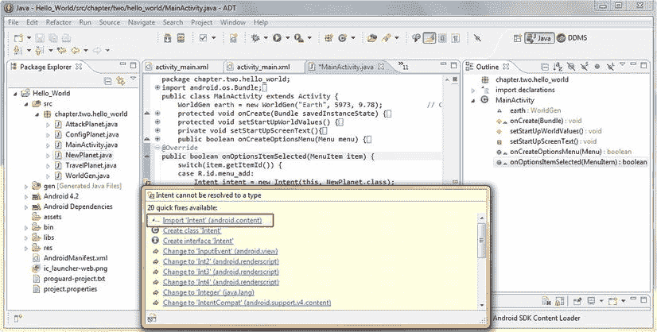

图 5-1。添加一个 onOptionsItemSelected()方法来处理我们的菜单选项并导入意图类

添加新行星意向

在下一行代码中，我们创建了第一个显式 Intent 对象，我们用它来调用我们在上一章中编写的 **NewPlanet** Activity 子类。这与我们在第三章中声明我们的 WorldGen 对象的方式类似，使用 **new** 关键字，就像这样:

```java
Intent intent = new Intent(this, NewPlanet.class);
```

注意图 5-1 中的【Eclipse 用红色错误波浪线给我们的 Intent 对象声明加了下划线，我们现在意识到这是因为 Intent 类没有通过使用 **import** 语句在我们的代码中正确声明。让我们将鼠标悬停在红色下划线的 Intent 关键字上，当助手对话框弹出时，选择选项从包含 Intent 类的 **android.content** 包中**导入 Intent** 。

现在您已经熟悉了这个对象声明过程，您意识到上面的代码行声明了一个名为 **intent** 的 **Intent** 对象，并使用 **this** 的当前上下文用一个 **new** Intent 对象加载它，然后通过一个 **NewPlanet.class** 运行时类引用将它指向`NewPlanet` Activity 类。由于我们稍后将向这个`switch`结构添加更多的意图对象，我们将把这个意图对象命名为 **intent_add** ，以便更清楚地反映它是哪个意图对象。

```java
Intent intent_add = new Intent(this, NewPlanet.class);
```

接下来添加一行调用意图对象的**的代码。startActivity( )** 方法，它使用我们刚刚创建的 Intent 对象来启动我们刚刚在前面的代码行中定义的活动子类 NewPlanet.class，并使用代码从当前上下文对象(this)中调用它:

```java
this.startActivity(intent_add);
```

最后，我们添加一个**break；**语句，这样我们就可以在需要执行的代码处理完之后退出`switch case`语句的这一部分。

这显示在图 5-2 中，以及我们将在接下来的几段中添加的其余`case`语句。Java **switch** 容器中的每个单独的 **case** 语句都需要像这样构造:

```java
case R.id.menu_add:
        Intent intent_add = new Intent(this, NewPlanet.class);
        this.startActivity(intent_add);
        break;
```

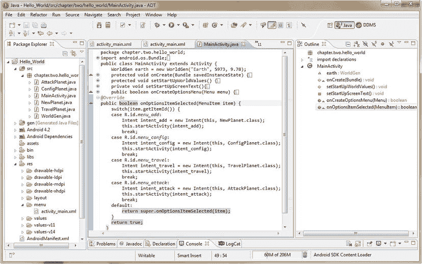

图 5-2。添加五个发送意图对象的 case 语句，调用我们的 Hello_World 功能活动屏幕

在本章的下一节，我们将在 Java switch 容器中添加菜单选项的 case 语句。

添加其余的意图

接下来，让我们采用程序员的快捷方式，复制并粘贴第一个`case`语句到它的下面，并进行必要的修改，使它调用我们的`ConfigPlanet.java`活动子类。将`R.id`引用更改为 **R.id.menu_config** ，将意图对象的名称更改为 **intent_config** ，并将活动类设置为 **ConfigPlanet.class** ，以便在选择配置行星菜单选项时打开正确的屏幕。

我们一半的 Activity 子类现在都是通过选项菜单中的 Intent 对象来调用的；让我们使用刚才使用的相同的复制和粘贴方法添加另外两个。在第二个 case 语句下复制我们的 switch 代码结构中的第一个或第二个 case 语句，以添加第三个 case 语句，然后将 R.id 引用更改为 **R.id.menu_travel** ，将第三个 Intent 对象的名称更改为 **intent_travel** ，并将第三个 Activity 类 call 设置为 **TravelPlanet.class** ，以便在选择 Travel to Planet 菜单选项时打开 Travel to a Planet 屏幕。

让我们在下一个 case 语句中调用第四个 AttackPlanet 活动子类，通过再次粘贴 case 语句，在第三个 case 语句下创建第四个 case 语句，然后将 R.id 引用更改为指向 **R.id.menu_attack** ，并将第四个也是最后一个意图对象的名称更改为 **intent_attack** ，同时将第四个活动类 call 设置为 **AttackPlanet.class** ，这样，当选择 Attack on Planet 菜单选项时，我们将打开我们的应用攻击行星功能屏幕。

最后，在每个`switch`或`case`语句的底部，我们可以有一个**偶发事件**语句，它处理一些代码，这些代码只有在 switch 构造中没有 case 语句与执行这些 case 语句的任何参数相匹配时才被执行。

在 Android **switch** 语句中，这被称为**默认** case 语句，在这种情况下，它通过一行代码将控制权返回给超类，该代码如下所示:

```java
default: return super.onOptionsItemSelected(item);
```

这本质上与为整个`switch`语句返回一个 false 值是一样的，并将控制权传递回超类的`onOptionsItemSelected()`方法。让我们右键单击我们的项目文件夹，然后**作为 Android 应用**运行，并运行我们的代码，看看它是否工作。菜单项现在调用我们在前一章中设计的每个活动类和布局容器(查看图 4-16)。

启用我们的新星球活动的用户界面:事件处理

既然我们可以从我们的`MainActivity`类选项菜单中启动我们的 Activity 子类，我们需要能够使用这些 Activity 子类来执行它们各自的功能，然后将用户返回到我们的`MainActivity`主屏幕。这是通过 **android.app.Activity** 类(或我们的子类) **finish( )** 方法完成的，该方法在我们使用完一个活动后关闭它。

让我们编写部分**NewPlanet.java**类(Activity 子类)，向您展示如何实现 **finish( )** 方法，以及如何使用 **onClick( )** 事件处理方法来处理对我们的一个新行星图像(或者现在，对我们的一个占位符图像)的点击。

首先，我们将在创建类时创建的`onCreate()`和`setContentView()`方法之后添加一行代码，并创建一个 **ImageView** 对象，用于引用我们之前在 **activity_add.xml** 文件中定义的 **imageMars** UI 元素。这是通过声明一个名为 **marsImage** 的 ImageView 对象，并使用引用 XML **android:id** 参数的 **findViewById( )** 方法将其引用到 XML UI 元素定义来实现的，如下所示:

```java
ImageView marsImage = (ImageView)findViewById(R.id.imageMars);
```

请注意，当我们将这一行代码输入 Eclipse 时，它会在这个 ImageView 类引用下面加红色下划线，因为我们还没有导入它以供使用。让我们将鼠标悬停在这个突出显示的代码元素上，选择**Import ImageView(`android.widget`package)**初始选项，并让 Eclipse ADT 为我们编写导入代码语句，如图图 5-3 所示。

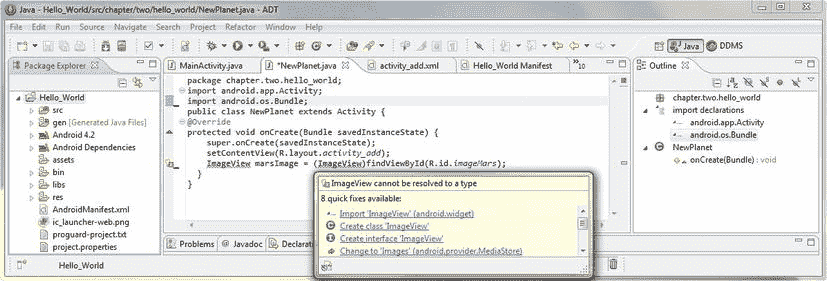

图 5-3。在 NewPlanet.java 创建一个名为 marsImage 的 ImageView 对象，它引用了 XML UI 定义

既然我们已经定义了在 Java 中使用的 marsImage UI 对象，我们想通过使用点符号为它附加一个方法，允许它处理用户的点击(或者触摸，如果使用了触摸屏设备的话)。这是使用**完成的。来自`View`类的 setOnClickListener( )** 方法。

让我们使用**新的**关键字和`setOnClickListener()`方法为我们的`marsImage` ImageView UI 对象设置一个`OnClickListener()`方法，如下所示:

```java
marsImage.setOnClickListener(new View.OnClickListener() { code goes in here } );
```

这一行简洁的代码所做的是在**视图**类中声明一个新的 **OnClickListener( )** 方法，该方法位于一个 **setOnClickListener( )** 方法内，该方法附加到一个 **marsImage** ImageView 对象，我们在前面的一行代码中创建了该对象。

注意，Eclipse 再次给我们的 Java 代码加了红色下划线，因为我们使用的方法来自一个视图类，该视图类还没有导入到我们的`NewPlanet.java`代码中。现在让我们将鼠标悬停在代码中的视图类引用上，以获得如图图 5-4 所示的帮助器对话框，该对话框将**为我们导入视图** ( `android.view`包)，这样我们就不必自己编写导入代码了。

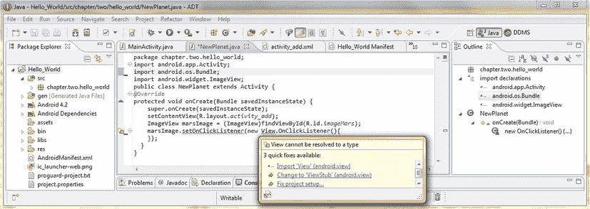

图 5-4。将 setOnClickListener 方法添加到 marsImage ImageView 对象并创建新的 OnClickListener( )

一旦我们的**导入 Android . view . view；语句已经为我们准备好了，Eclipse 会重新评估我们的代码，并且只在 **OnClickListener( )** 方法下面加上红色下划线。**

这个新的错误高亮显示出现是因为，至少现在，这个监听器方法目前是一个空的或者**未实现的**方法，因为我们还没有在两个花括号内添加任何事件处理代码。

让我们借此机会让 Eclipse 为我们多写一些代码，再次将鼠标悬停在红色下划线的代码上，并选择**添加未实现的方法**选项，如图图 5-5 所示。瞧啊。Eclipse 编写了这个方法:

```java
@Override
public void onClick(View v) {
  //Add Code To Process Here
}
```

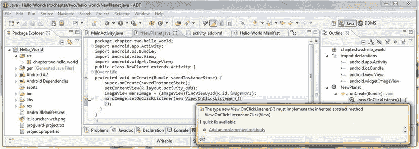

图 5-5。实现继承的抽象方法视图。OnClickListener.onClick(View)通过 Eclipse 助手

接下来，我们在这个 **onClick( )** 方法中添加代码来处理我们想要发生的事情(当用户单击一个`marsImage` ImageView UI 元素时)，这个方法被传递了一个需要处理的视图对象(名为`v`)。

因为这是`NewPlanet`类，我们希望在火星图像上单击(或触摸)来创建一个新的 WorldGen 对象，该对象配置有火星的属性。这是通过调用我们的 **WorldGen( )** 构造函数方法来完成的，就像我们之前对 MainActivity.java 类中的 **earth** 对象所做的那样。

我们在 **onClick( )** 事件处理程序中的第一行代码创建了一个名为**火星**的新`WorldGen`行星对象，然后通过传递给`WorldGen()`构造函数的参数配置其名称、质量和重力:

```java
WorldGen mars = new WorldGen("Mars", 642, 3.7);
```

注意，一旦我们输入这个新的对象创建代码行，Eclipse 黄色会在 **mars** 对象下面加下划线，因为它还没有被使用。我们可以忽略这个警告，如图 5-6 中的所示，但是为了清晰的代码编辑视图，我们将添加一个殖民地到火星，以满足 Eclipse。

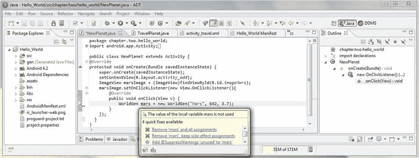

图 5-6。添加 WorldGen()构造函数方法调用 onClick(View)事件处理程序方法创建 mars 对象

为了给火星添加一个殖民地，我们将调用来自**火星**对象的`.setPlanetColonies(1)`方法，我们只是使用如下的点符号**实例化**:

```java
mars.setPlanetColonists(1);
```

接下来，我们需要告诉`NewPlanet` Activity 我们已经使用完了，并希望返回到我们应用的主 Activity 主屏幕。这是使用 **finish( )** 方法完成的，这是我们在`onClick()`事件处理方法中的下一行代码，如这里和图 5-7 所示:

```java
finish();

```

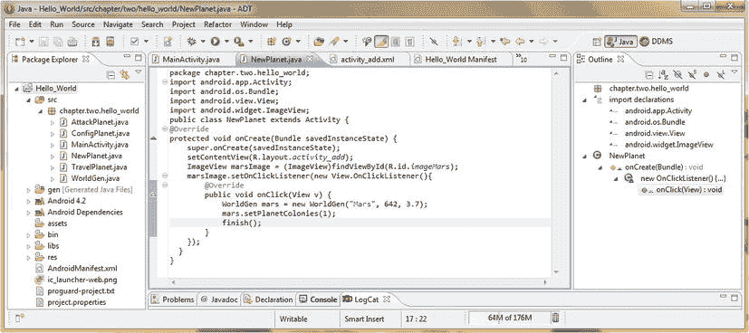

图 5-7。通话。对 mars 对象的 setPlanetColonies()方法使用本地 mars 变量；调用 finish()意向方法

现在，让我们右键单击`Hello_World`项目文件夹，并选择**作为 Android 应用**，它会保存我们所有的代码更改(如果我们没有通过 CTRL-S 保存它们的话)，并启动 Nexus S 模拟器，使用我们新的意图和事件处理代码运行我们的`Hello_World`应用。

当你点击模拟器菜单按钮时，屏幕再次看起来如图 4-16 所示。接下来，单击**添加新行星**菜单项，Intent 将引用并打开新行星活动屏幕及其添加行星布局，这是我们在布局文件夹的 activity_add.xml 文件中创建的。

现在，让我们看看我们的事件处理代码是否工作正常。单击右上角的(火星)图像占位符图标，`onClick()`事件处理程序创建一个新的火星星球和一个殖民地，然后通过我们的`onClick()`方法代码语句末尾的`finish()`方法调用，将您返回到应用的主屏幕。

接下来，让我们将事件处理添加到我们的其他应用功能活动屏幕，以便我们的应用选项菜单结构可用于在应用的各个区域之间导航。这样，当我们完成本书的第一部分(第一部分)时，我们已经有了应用的基本结构。

启用我们的 ConfigPlanet 活动用户界面:事件处理

接下来，让我们准备我们的 **ConfigPlanet** 活动和 UI 布局，以便在用户完成当前星球的配置后将他们返回到主屏幕。我们通过向 activity_config.xml 添加一个**Done configuration**按钮和向 strings.xml 文件添加一个匹配的 **button_name_done** 字符串常量来实现这一点。然后，我们将使用 Java 代码连接这个 XML Done 按钮，允许用户在单击 Done 按钮时返回到 Hello_World 主屏幕。我不会在这一部分使用很多屏幕截图，因为你之前已经看到了工作流程，所以不需要它们。

在你的 Eclipse 编辑标签的右上方的中央窗格中有一个数字(在图 5-7 中是一个 10)；单击此处可下拉包含所有打开的编辑选项卡的菜单。选择 **activity_config.xml** 编辑选项卡，这样我们可以添加完成配置按钮 xml 标记。

将这个 XML 布局定义中的最后一个按钮复制并粘贴到它自己的下面，并将 **android:id** 标记更改为 **doneButton** 并将 **android:text** 标记字符串常量引用更改为 **button_name_done** 并按 Ctrl-S 保存 XML 文件。然后再次点击“选项卡未显示数字”下拉菜单，选择 **strings.xml** 编辑选项卡，通过复制粘贴 button _ name _ ffoff string 标签，添加新的**button _ name _ Done**string 标签以及**Done configuration**的值，然后更改其名称和数据值。

既然我们的 XML 标记编辑已经完成，我们可以转向在**ConfigActivity.java**类中编辑 Java 代码了。这里我们需要添加一个**按钮**对象，在其上附加我们对完成按钮的`onClick()`事件处理，就像我们在上一节中对 ImageView UI 元素所做的那样。

让我们经历一个与我们在`NewPlanet`类中所做的类似的工作过程，并添加一个名为 **doneButton** 的按钮对象，它引用我们刚刚编辑完的 XML 文件中的 doneButton ID。我们通过使用 **findViewById( )** 方法，使用一行代码来实现这一点，如下所示:

```java
Button doneButton = (Button)findViewById(R.id.doneButton);
```

接下来，我们将使用这个刚刚创建的 doneButton 按钮 UI 对象，并通过熟悉的**将一个 **OnClickListener( )** 方法附加到这个 UI 对象。setOnClickListener( )** 方法创建一个新的`OnClickListener`如下:

```java
doneButton.setOnClickListener(new OnClickListener() { our code goes in here } );
```

我们用于将用户返回到主屏幕(`MainActivity`)的 Done Configuring 按钮的 Java 事件处理代码再次涉及到在 **onClick( )** 事件处理程序中使用 Activity 类的 **finish( )** 方法，如图 5-8 中我们修改过的`ConfigPlanet`类所示。

```java
@Override
public void onClick(View v) {
    finish();
}

```

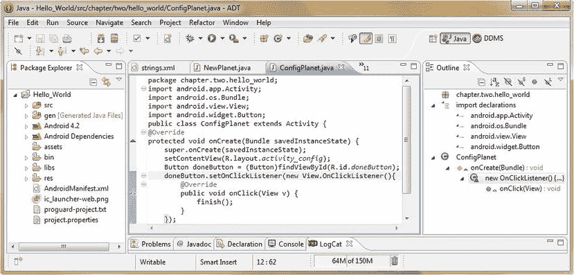

图 5-8。添加一个。OnClickListener()方法添加到 ConfigPlanet.java 类中的 doneButton 按钮对象

接下来，我们将修改我们的`TravelPlanet.java`类，这样就可以从主选项菜单中调用它，并在稍后将用户返回到主屏幕。

启用我们的 TravelPlanet 活动用户界面:事件处理

正如我们为 ConfigPlanet 类所做的那样，现在让我们准备我们的 **TravelPlanet** 活动和 UI 布局，以便当用户完成当前活动星球的旅行时，将他们返回到他们的主屏幕。

我们通过向我们的 **activity_travel.xml** 添加一个 **Return Home** 按钮，并向我们的 strings.xml 文件添加一个匹配的 **button_name_return** 字符串常量来实现这一点。然后，我们将使用一些 Java 事件处理代码连接 XML 返回按钮 UI 元素，每当用户单击返回按钮时，这些代码允许用户返回到他们的 Hello_World 主屏幕。

在你的 Eclipse 编辑标签的右上方的中央窗格是一个数字(在图 5-8 中，是 11)；再次单击此按钮，下拉包含所有打开的代码模块的选择菜单。选择 **activity_travel.xml** 编辑选项卡，这样我们可以添加 Java 事件处理程序代码将要引用的返回主页按钮 xml 标记。

让我们采取一个快捷方式，复制并粘贴我们在您的`activity_config.xml`布局定义中使用的最后一个按钮，并在我们的 **< VideoView >** UI 元素标签下使用，这样我们就有一个按钮可以在这个布局容器中使用，如图图 5-9 所示。<按钮> XML 标记应该是这样的:

```java
<Button android:id="@+id/returnButton"
        android:layout_width="wrap_content"
        android:layout_height="wrap_content"
        android:text="@string/button_name_return" />

```

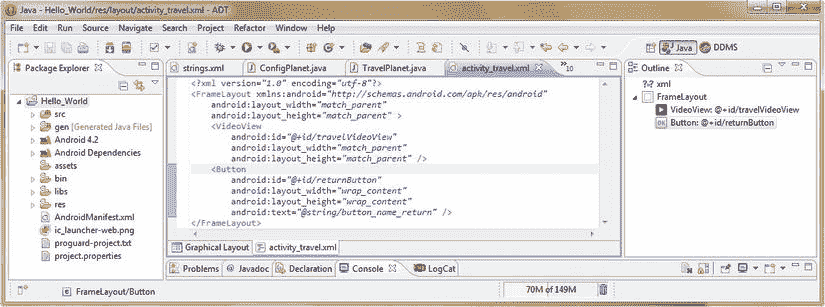

图 5-9。在 Eclipse 中向 activity_travel.xml 布局容器 xml 定义添加一个返回主页按钮标签

接下来，让我们将 **android:id** 标签更改为 **returnButton** ，将 **android:text** 标签字符串常量引用更改为 **button_name_return** ，然后按 Ctrl-S 保存我们修改后的 XML 布局容器定义。

再次单击 tabs-not-displayed-number 下拉菜单，这一次，选择 **strings.xml** 编辑选项卡，这样我们可以将字符串常量添加到我们的新按钮 UI 对象引用中。添加新的 **button_name_return** 字符串标签，以及 **return Home** 的值，方法是再次复制并粘贴`button_name_done`字符串标签，然后将值从 done 更改为 Return，并从 Done 配置更改为 Return Home。

现在我们的 XML 标记编辑已经完成，我们可以转向在**TravelActivity.java**类中的 Java 代码编辑，在这里我们需要添加另一个**按钮**对象，将我们下一个 **onClick( )** 返回主页按钮的事件处理方法附加到该对象，就像我们在上一节中在`ConfigActivity.java`类中所做的一样。

让我们完成一个与 ConfigPlanet 类类似的工作过程，并添加一个名为 **returnButton** 的按钮对象，它将引用我们刚刚编辑完的 XML 文件中的 returnButton ID。我们通过使用一个 **findViewById( )** 方法来实现这一点，使用一行代码，如下所示:

```java
Button returnButton = (Button)findViewById(R.id.returnButton);
```

接下来使用我们刚刚创建的 returnButton 按钮 UI 对象，并通过熟悉的**将一个 **OnClickListener( )** 方法附加到这个 UI 对象。setOnClickListener( )** 方法创建一个**新的** OnClickListener，如下所示:

```java
returnButton.setOnClickListener(new OnClickListener() { your code goes in here } );
```

我们用于将用户返回到主屏幕 (MainActivity)的 Done Configuring 按钮的 Java 事件处理代码再次涉及在 **onClick( )** 事件处理程序内使用 Activity 类的 **finish( )** 方法，如下面的 Java 代码所示:

```java
@Override
public void onClick(View v) {
        finish();
}
```

图 5-10 中的显示了我们修改后的`TravelPlanet`类。

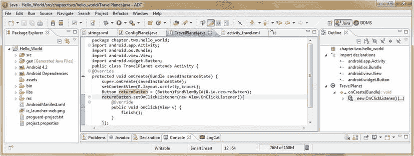

图 5-10。将 returnButton 按钮 UI 对象和事件处理代码添加到我们的 TravelPlanet.java 类

我们越来越近了！一旦我们修改了我们的**AttackPlanet.java**类以返回到我们的应用的主屏幕，我们的整个 Hello_World 用户界面导航基础设施将拥有它的高级导航，允许我们的最终用户通过我们的主选项菜单在我们的应用的功能活动屏幕之间移动(没有双关语),然后从每个应用屏幕返回到主应用主屏幕。

启用我们的攻击星球活动用户界面:事件处理

就像我们为 TravelPlanet 类所做的一样，现在让我们准备我们的 **AttackPlanet** 活动和 UI 布局，这样我们就可以在用户完成了对其他星球的有趣攻击后将他们返回到他们的应用主屏幕。

我们通过向我们的 **activity_attack.xml** 布局规范添加一个**退出攻击模式** ImageButton UI 小部件来实现这一点。请注意，因为我们使用的是 ImageButton UI 元素，所以我们*而不是*需要向我们的`strings.xml`文件添加一个 **button_name_exit** 字符串常量。稍后，我们将使用事件处理程序代码连接 Exit ImageButton 元素，该代码允许用户在单击 Exit ImageButton 时返回 Hello_World 主屏幕。

在你的 Eclipse 编辑标签的右上方的中央窗格中有一个数字(在图 5-10 中，是 10)；再次单击此按钮，下拉包含所有打开的代码模块的选择菜单。选择 **activity_attack.xml** 编辑选项卡，这样我们可以添加 Java 事件处理程序代码将要引用的退出攻击模式按钮 xml 标记。

让我们走捷径，复制并粘贴我们最初在`activity_attack.xml`布局定义中定义的最后一个`ImageButton`标签，并将其用作我们的第五个`ImageButton` UI 元素，这样我们就有了另一个匹配的图像按钮用于这个布局容器，如图图 5-11 所示。第五个< ImageButton >标签及其参数应该类似于以下 XML 标记:

```java
<ImageButton
    android:id="@+id/exitButton"
    android:layout_width="wrap_content"
    android:layout_height="wrap_content"
    android:contentDescription="@string/content_desc_exit"
    android:src="@drawable/ic_launcher" />

Make sure that you add a <string> tag to your strings.xml file for your Exit button content description parameter that says Exit to Home Planet using the following XML mark-up:

<string name="content_desc_exit">Exit to Home Planet</string>

```

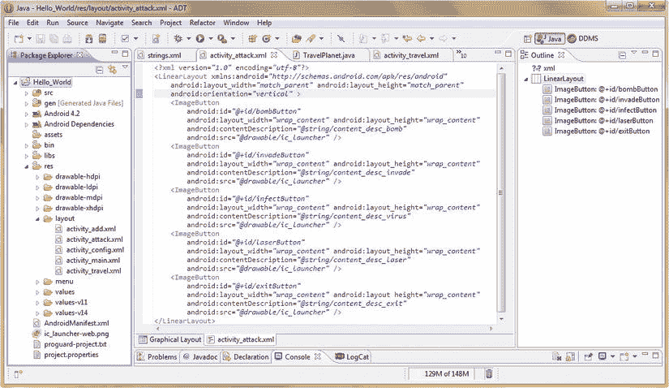

图 5-11。向我们的 activity_attack.xml 布局标记添加第五个退出攻击模式 ImageButton UI 元素标签

还要注意在图 5-11 的中，我们将 LinearLayout 容器标签的 **android:orientation** 参数从**水平**改为**垂直**。这是为了让我们的五个图像按钮(目前是图标占位符图像，直到我们到达第七章)更容易地在屏幕上上下移动，而不是沿着顶部移动，现在已经有五个了。

现在我们的 XML 标记编辑已经完成，我们可以在**AttackActivity.java**类中编辑 Java 代码了。这里我们需要添加一个 **ImageButton** 对象，在其上附加下一个 **onClick( )** 事件处理方法，使我们的退出攻击模式按钮具有交互性，就像我们在上一节中在`TravelActivity.java`类内部所做的一样。

让我们进行一个与我们在`ConfigPlanet`类中所做的类似的工作过程，并添加一个名为 **exitButton** 的`ImageButton`对象，该对象引用我们刚刚编辑完的 XML 文件中的 exitButton ID。我们将使用一个 **findViewById( )** 方法，通过一行代码来实现，如下所示:

```java
ImageButton exitButton = (ImageButton)findViewById(R.id.exitButton);
```

接下来，我们将使用刚刚创建的`exitButton ImageButton`对象，并通过熟悉的**将一个 **OnClickListener( )** 方法附加到这个 UI 对象。setOnClickListener( )** 方法创建一个**新的** `OnClickListener`，如下所示:

```java
exitButton.setOnClickListener(new OnClickListener() { the code will go in here } );
```

我们将用于让用户返回主屏幕(MainActivity)的 Exit Attack Mode 按钮的 Java 事件处理代码涉及到再次使用 Activity 类的 **finish( )** 方法，在 **onClick( )** 事件处理程序内部，如我们在图 5-12 中修改的`AttackPlanet`类所示。

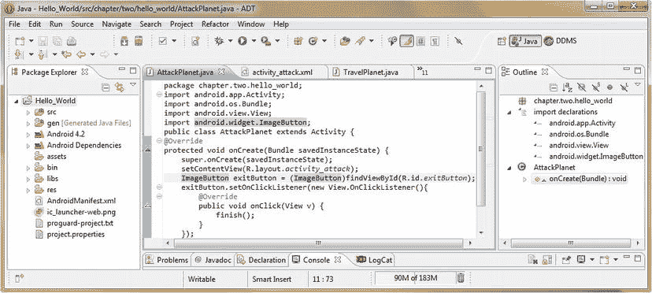

图 5-12。将名为 exitButton 的 ImageButton UI 对象添加到 AttackPlanet.java 类来处理事件& finish( )

现在右键单击`Hello_World`项目文件夹，并选择**运行为 Android 应用**，这将再次启动我们的 Nexus S 模拟器，这样我们就可以使用新的意图和事件处理代码来测试我们的应用。

当你点击模拟器菜单按钮时，屏幕再次看起来如图 4-16 所示。接下来，点击**配置行星**菜单项和意向参考，打开我们在`activity_config.xml`文件中创建的配置行星活动屏幕及其配置行星布局。现在让我们看看我们的事件处理程序代码是否在工作。点击**完成配置**按钮，`onClick()`事件处理程序调用`finish()`方法并返回主屏幕。

接下来，点击 **Travel to Planet** 菜单项，查看 Intent 是否引用并打开我们在 activity_travel.xml 文件中创建的 TravelPlanet 活动屏幕及其 Travel to Planet 布局。要查看我们的事件处理程序代码是否正常工作，请单击**返回主页**按钮。那个`onClick()`事件处理程序也应该调用我们的`finish()`方法并返回我们的家。

最后，点击**攻击行星**菜单项，意图引用并打开我们在`activity_attack.xml`文件中创建的攻击行星活动画面及其攻击行星布局。让我们也测试一下 ImageButton UI 元素的事件处理程序代码是否工作正常。点击左下方的图标**退出攻击模式** ImageButton，查看我们的`onClick()`事件处理程序是否调用了`finish()`方法。

现在，在 Hello_World 应用的功能屏幕上导航一切正常，让我们来看看事件处理`—`键**中更重要的一个方面。**因为现在很大比例的 Android 设备都有这样或那样的键，我们接下来将看看 **onKey( )** 事件处理方法，这样我们就涵盖了本章中的所有“主要”内容！

小键盘或键盘的事件处理:OnKey 事件处理器

到目前为止，我们已经使用了`onClick()`事件处理程序来捕获用户触摸我们的活动屏幕 UI 元素，或者使用许多 Android 设备上的导航箭头板和中心选择按钮进行导航。

到目前为止，我们的大部分报道都集中在`onClick()`处理程序方法上，因为`onClick()`事件处理程序是 Android 开发中最常用的。这是因为`onClick()`事件处理程序涵盖了触摸屏的使用，以及任何导航硬件(导航键、轨迹球等)。)使用一个单一的事件处理方法。

随着 GoogleTV 或 Android iTVs 的出现，我们还需要考虑更多的键盘(或小键盘)将可供我们的最终用户使用。市场上也有带滑出式或可连接迷你键盘的智能手机(甚至平板电脑)型号，所以我也将在本章中介绍 **onKey( )** 事件处理方法。

让我们为我们的应用添加一个键盘快捷键，使用通用的 **X** 键退出我们的每个活动屏幕功能区域，表示单词**退出**。

为此，我们需要在每个 Activity 子类中编写方法，使用 Android **onKeyDown( )** 事件处理程序监听被按下的 **X** 键。按下一个 **X** 键会让我们的用户回到主屏幕。

`onKeyDown()`方法接受两个参数，一个整数和一个对象，然后对它们求值。第一个参数包含**键码，**，它是一个**整数**值，代表被按下的键的指定数值(常数)。第二个参数是一个名为 Event 的 **KeyEvent** 对象，它是正在处理的键事件。

`onKeyDown()`方法是**公共的**，所以任何东西都可以访问它，而**布尔的**，当它返回一个**真**(已处理)或一个**假**(未处理)**返回数据值**。

将传入该事件处理程序的**键码**与字母 X 的 **KeyEvent** 类常量(**键码 _X** )进行比较的代码使用了 **onKeyDown( )** 事件处理方法中的基本 **if 循环**。代码如下所示:

```java
public boolean onKeyDown(int keyCode, KeyEvent event) {
        if (keyCode == KeyEvent.KEYCODE_X) {
               finish();
               return true;
       }
       return false;
}
```

让我们将这段代码输入到我们的`ConfigActivity.java`类中，就在`onCreate()`方法之后，因为我们希望我们的活动屏幕“捕获”用户在任何时候按下 **X** 键返回主屏幕。

注意，当我们输入这段代码时，Eclipse 发现我们没有通过 **import** 语句声明使用的 Android **KeyEvent** 类。一旦您完成了方法的输入，将鼠标悬停在 KeyEvent 关键字上，让 Eclipse 为我们添加我们的`import`语句，如图图 5-13 所示。

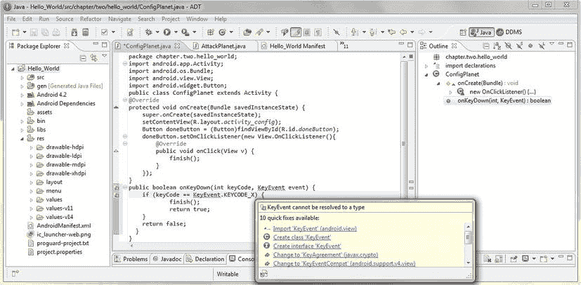

图 5-13。添加一个 onKeyDown 方法，并通过选择:Import KeyEvent 来删除错误突出显示

Java 代码在`onKeyDown()`方法中所做的事情是相当基本的，但是我将在这里为那些不熟悉 Java 的人讲述它。我们在 if 循环中使用了一个`==`数字**比较运算符**，或者在这种情况下，它更多地被用作 if 语句，将代表用户所按下的键的 keycode 整数与 KeyEvent 类中的`KEYCODE_X`常量进行比较，以查看用户是否按下了 X。

如果按下了 X 键(如果两个值相等)，那么执行 If 结构中的语句，并执行**finish()；执行**代码语句，从被调用的方法返回一个 **true** 值，表示它已经成功完成了它的事件处理。

如果按下任何其他键(如果两个值不相等)，那么这个 If 构造中的语句将被执行*而不是*，并且该方法将返回一个**假值**，表示该事件没有被处理。请注意，我们可能创建的任何其他事件处理程序仍然可以对该事件进行操作；事件从一个处理程序到下一个处理程序被称为**气泡**，直到它被处理(或者如果我们不指定那个键，就永远不会被处理)。

图 5-14 显示了我们完成的 ConfigActivity.java**类事件处理代码，我们现在将在其他三个 Hello_World Activity 子类中复制它(如果我们真的聪明的话，可能通过剪切和粘贴)。**

 **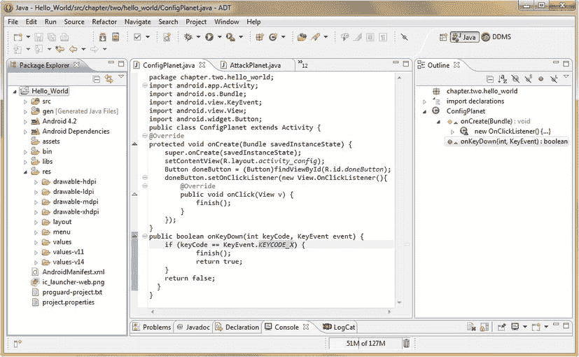

图 5-14。【ConfigPlanet 类的最终 Java 代码，用于处理我们应用导航的点击和按键事件

我们这样做是为了让用户在错误地进入应用的错误区域时，只需按下 **X** 键，就可以轻松退出我们的每个应用功能屏幕。您可能知道，键盘快捷键在大多数流行的软件应用中都很常见。

让我们先做我们的代码复制工作流程，在我们利用现在熟悉的 **Run As Android Application** 功能最后一次测试我们的应用之前，在我们继续攻克本书的用户界面设计和用户体验设计部分之前。

选择完整的`onKeyDown()`方法，按下 **Ctrl-C** 键将其复制到你的系统剪贴板，然后点击标签区右边的数字(在图 5-14 中，是 12)下拉**活动标签菜单**。接下来，选择您的**TravelPlanet.java**文件，并使用 **Ctrl-V** 键盘序列将`onKeyDown()`方法代码块粘贴到 TravelPlanet 类的底部，就在最后一个花括号之前。

我们还需要为我们的**NewPlanet.java**和**AttackPlanet.java**类做同样的事情，这样我们应用的所有四个 Activity 子类都实现了我们新的 **X 键用于退出**键快捷特性。现在复制这个工作流程，以便`onKeyDown()`事件处理出现在我们所有四个功能屏幕活动子类中。

最后，我们需要测试我们在本章中完整添加的应用导航。右键单击我们的项目文件夹，选择 **Run As Android Application** 菜单选项，启动 Nexus S emulator，这样我们就可以看到我们实现的所有东西是否都工作正常。

要在应用运行后对其进行测试，请调用选项菜单，并单击四个应用区域中的每一个，然后按下计算机键盘上的 **X** 键(仿真器使用计算机的键盘来模拟设备键盘)，并确保您的应用将最终用户返回到他们的主屏幕。

您会发现，如果您在此时测试`onClick()`事件处理，这两种类型的事件可以完美地并行处理。我们的应用现在可以添加实际的功能了！

其他事件处理方法:OnFocusChange 和 OnLongClick

还有另外四种主要的 Android 事件处理方法，我们不打算在本章中介绍，但我们将在本书的后面实现它们，因为我们会在应用中添加更复杂的用户界面元素、图形设计、动画以及新的媒体素材和功能。

第一个是 **OnLongClick( )** 事件处理方法，它相当于使用鼠标在计算机或其他设备上右键单击的 Android 方法。通过触摸并按住屏幕、轨迹球或任何 Android 设备上的中心选择按钮来调用**长点击**。

就像 onClick()事件处理程序一样，在 Java 代码中实现了一个`onLongClick()`事件处理程序。

第二种类型的事件处理程序是一个 **OnCreateContextMenu( )** 事件处理程序方法，它创建用于 Android 的**上下文菜单**。上下文菜单也类似于 PC 操作系统中的菜单，通过右键单击软件的对象或区域来获得该对象专用的**上下文相关**选项菜单。

第三种类型的事件处理程序是 **OnFocusChange( )** 事件处理程序方法，用于处理当用户从一个元素前进到下一个元素时，用户界面元素发出的**焦点**事件。

当最终用户正在应用屏幕上使用给定的用户界面元素时，该 UI 元素被称为具有**焦点**，当用户停止使用该 UI 元素，并开始使用另一个 UI 元素时，焦点被称为已经**改变**。

当焦点从一个 UI 元素转移到另一个元素时，Android OS 会发出一个 **FocusChanged** 事件，该事件可以被`OnFocusChanged()`事件处理方法捕获。这对于**微调**您的应用 UI 控件，以及精确跟踪用户如何访问您的 UI 元素，以及用户如何使用您的应用非常有用。

最后，Android 中还有一个 **OnTouch( )** 事件处理程序，它只处理触摸屏事件。我建议对触摸屏设备(以及非触摸屏设备)使用`onClick()`事件处理程序，用最少的代码覆盖最广泛的 Android 设备。

但是，如果您确定所有用户都将拥有并使用触摸屏 Android 设备，那么您可以使用`onTouch()`事件处理方法以及`onClick()`方法，或者代替它们。

`OnTouch()`事件处理程序也用于只能使用触摸屏的 Android 操作系统功能，最好的例子是一个名为**手势**的 Android 功能，其实现超出了本书的介绍范围。

摘要

在这一章中，我们学习了 Android 编程语言中两个最强大和最有用的代码结构:意图**和事件**??。****

可以说，意图和事件允许我们“连接”我们的 Android 应用，以便当我们的最终用户点击我们的用户界面元素时，如我们的选项菜单项、图像按钮、文本按钮或图像视图，我们的应用能够处理这些点击(或触摸)，并前往应用需要去的地方(意图调用活动屏幕)，并做它需要做的事情(事件调用程序逻辑来实现某些东西)。

首先，我们了解了一个**意图对象**的结构，以及一个意图对象可以包含的**七个**主要功能区域(组件、动作、数据、类型、类别、标志、附加功能)。我们了解了为什么这些区域都很重要，为什么需要它们来处理意图对象，以及这些区域在意图处理请求中的作用。

我们了解了 **AndroidManifest.xml** 文件中的**隐式意图**和 **<意图过滤>** 标签，它们实现了这些意图推理引擎，可以由高级开发人员自定义构建。我们了解到意图过滤器将处理动作，然后是数据，然后是类别，以确定开发人员希望他们的意图如何被处理和执行。

然后，我们了解并在 Hello_World 应用中实现了**显式意图**，以实现我们在前面章节中创建的选项菜单结构，并让我们的菜单调用我们之前创建的四个自定义活动子类，以保存我们的应用功能屏幕。

一旦我们的菜单导航开始工作，我们需要学习事件处理，以便在每个应用功能屏幕中使用我们的用户界面元素，让我们返回到应用的主屏幕。

我们学习了`onClick()`事件处理程序，以及如何在我们的 Java 代码中实现它来捕获各种 UI 元素(小部件)上的点击事件，以便我们的用户可以调用 Activity finish()方法并返回到主应用活动(主屏幕)。

然后，我们为各种流行的 Android 用户界面小部件编写了`onClick()`事件处理程序，包括 **ImageView** 对象、 **Button** 对象和 **ImageButton** 对象。通过这样做，我们实现了应用中每个主要功能屏幕(活动)之间的无缝导航。

接下来，我们学习了 onKey()事件处理程序，并设置了 onKeyDown()处理程序，允许我们捕获点击 **X** 键的用户，这样我们就可以为我们的应用实现一个**退出**键盘快捷键。在那之后，我们回顾了其他一些 Android 事件处理程序，我们将在本书的其他三个部分中实现它们。

在本书的其余部分，我们将经常利用这些**意图**和**事件**能力；我只是觉得我们需要在这本书的第一部分，很早就注意到这些基本的意图和事件概念和原则。你是编码员`—`你能处理好它。当然，没有双关语的意思。

在本书的第二部分(用户界面设计)中，在我们开始让应用看起来更原始之前，我在前面介绍了这个主题材质，因为这些 Intent 和 Event Java 对象和方法对于让我们的应用在更高级的层次上工作是非常重要的。

在本书的第二部分中，我们将采用我们在本书第一部分中创建的应用基础架构，并开始专注于我们的 Hello_World 应用的用户界面设计和图形设计，增强我们的用户体验(UX)并使 Hello_World 看起来更像一个专业的 Android 应用。

在下一章中，我们将学习 Android UI 设计小部件，并开始为 Hello_World Android 应用中的五个主要屏幕区域微调用户界面设计。然而，在第六章中，我们将主要使用 XML 标记(大部分)来精炼和增强我们的 UI 元素。

此外，在第六章中，我们将探索这些主要 UI 元素选项(作为 XML 参数)中的许多选项，用于微调我们的用户界面“外观”，以及探索我们的 UI 元素在我们的 Android 应用屏幕上的精确像素位置。**