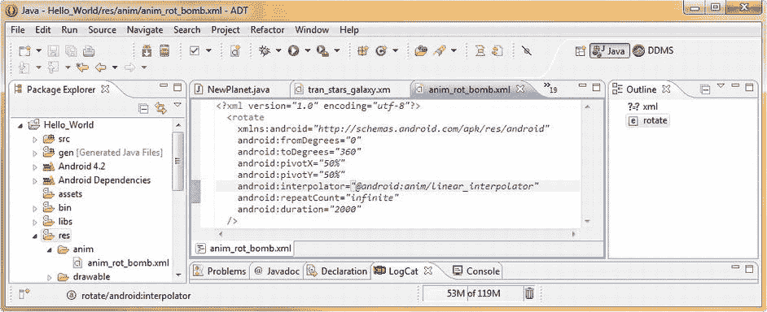
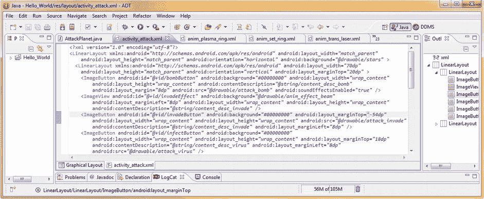

# 十、Android 矢量动画：通过 XML 结构的程序动画

在这第二章中，我们将学习Android 中的“其他”类型的动画，这种类型使用**代码**，而不是**像素**，来产生它的魔力。这种基于代码的动画通常被称为**程序动画**，涉及到**范围**和**枢轴点**等内容。

业内使用了几个程序动画术语。如果你听到术语**补间动画** ，它指的是一种创建动画的程序方式。这是因为**补间**实际上是**插值**，或者划分你想要你的动画跨越的帧数，在开始和结束值之间，或者范围，用于动画的计算。

我们将在下一节讨论插值和其他程序动画概念的数学问题，比如枢轴点。另一个你可能听说过的程序动画术语是**矢量动画**。矢量是一条**射线**或直线，但一般概念是动画是通过使用数学构造而不是使用栅格(像素)集合来创建的。

矢量和栅格是两种完全不同的方法；栅格是**数据密集型**，而矢量是**数据密集型**。这是因为文本(数学)可以很好地压缩，而像素(和帧)的数组就不行。矢量使用更多的 CPU 资源(在进行计算时)，而栅格使用更多的存储或带宽资源(传输数据)。这是因为一个数学向量需要被**渲染**到显示屏上，这意味着数学被转化为图形元素，通常是运动图形，或 2D 动画。

因此，Adobe Illustrator(或 InkScape)是一个矢量成像软件包，而 Adobe Photoshop(或 GIMP 2)是一个光栅成像软件包。

程序动画概念:旋转、缩放和平移

让我们从学习矢量图像和动画的一些概念开始。首先，有两种主要类型的矢量平台， **2D** 或**二维**(平面)矢量图形，如我们在 Illustrator 或 InkScape 中发现的，以及 **3D** 或**三维**(体积)矢量图形，如我们在 Blender 3D 等 3D 建模软件中发现的。

**注意**我们将在本章的这一节介绍的概念适用于 2D 和 3D 成像和动画。两者都使用向量；2D 的 2D 矢量，3D 的 3D 矢量，2D 和 3D 都涉及到核心概念**平移**(移动)**旋转**、**缩放**。在 2D，这些概念涉及 **X** 和 **Y** 轴，在 3D 中，这些概念涉及 **X** 、 **Y** 和 **Z** 轴。

2D 动画中有一个 Z 概念，但它不是 Z 轴，而是 Z 顺序。 **Z 顺序**在 2D 更像是数字成像中的图层，它涉及到每个 2D(平面)图层处于什么图层顺序，是在其他 2D 图层的前面还是后面。z 顺序是对 2D 合成中的层进行排序的数字，并且定义了给定 2D 层的前面和后面。实时更改 Z 顺序可以创建翻书特效。

**2D 中的平移**涉及到沿 X 轴和 Y 轴的移动，它是 2D 动画中可以完成的三个**变换**中最基本的。平移由移动的**起点**、移动的**量**(以像素或百分比表示)和移动的**方向**(沿着 **X** 或 **Y** 轴，或两者的某种相对组合)来定义。

**2D 中的旋转**是指绕给定的**支点**旋转，由该旋转的**度数**、方向**(正或负)、旋转的**支点**(中心)**位置**定义。因为一整圈有 **360** 度，所以旋转数学专门涉及这个 360 的数字，就像 FPS 计算涉及数字 1000(一秒中的毫秒数)。**

 ****2D 的比例**涉及给定形状的**大小**，由相对于该形状当前大小的十进制数定义。例如， **0.5** 的比例将是当前形状大小的一半**，而 **2.0** 的比例将是当前形状大小的两倍**。像平移一样，缩放也有 X 和 Y 分量，如果值相同，缩放可以说是**均匀缩放**，如果不相同，缩放可以说是**非均匀缩放**。****

 **有趣的是，你也可以在你的缩放操作中定义一个**枢轴点**，这允许**倾斜缩放**，其中你的缩放操作会受到枢轴点位置的**影响。对于不规则的形状，这可以更精确地控制缩放操作产生的形状扭曲效果。假设有时被缩放的 2D 形状是位图图像，使用不在图像中心点的枢轴点放置可以获得一些非常有趣的结果。**

实现旋转动画:攻击炸弹 UI 图标

让我们开始实现程序动画，在我们的攻击星球用户界面屏幕上制作一个静态图像的动画，使它看起来像一个动画图标。我们将旋转我们的 bomb ImageButton UI 元素，这样它就和我们的 virus ImageButton 一起被动画化了，我们在前一章中已经将 virus ImageButton 动画化了。因为我们为炸弹图像创建了一个 alpha 通道，这给了我们一个与空间图像背景无缝的 2D 效果。

右键单击您的项目资源文件夹，然后选择**新建**T3】Android XML 文件菜单选项序列。在**项目中选择**补间动画**的一个**资源类型:**设置 **Hello_World** 然后将文件命名为 **anim_rot_bomb** ，动画旋转炸弹图像的简称。接下来选择**的**根元素**旋转>最后点击**完成**按钮，如图[图 10-1](#Fig1) 所示。****


[图 10-1。](#_Fig1)用于补间动画(旋转)的新 Android XML 文件

这将打开一个带有 **< rotate >** 标签的空白 XML 文件，我们使用参数 填充该文件，以实现我们希望的旋转过程。

首先删除 **< /rotate >** 结束标签，因为这不会是一个父(容器)标签。将 **<旋转>** 开始标记拆分成一行 **<旋转**，然后在下一行添加一个**结束**或**结束**标记符号 **/ >** ，如图[图 10-2](#Fig2) 所示。


[图 10-2。](#_Fig2)通过 Eclipse 中的 android: parameter helper 对话框添加旋转动画参数

完成旋转标签

图 10-2 中还显示了我们输入 **android:** 的小技巧，以获得一个**参数助手对话框**，其中有一个可在 **< rotate >** 标签中使用的参数列表。在使用标记之前，您应该总是利用这种技术来调用和研究可用的参数，我们将在这个示例中尝试使用尽可能多的这些参数，向您展示它们都将做什么。

我们需要添加的第一件事是一个引用 **`http://schemas.android.com/apk/res/android`** URL 的 **xmlns:android** 参数，这样我们添加的任何参数都可以通过位于 android 网站上的当前规范进行验证。在添加这个初始的 XML 命名模式(XMLNS)引用之前，您添加的任何参数都将被标记为红色 X 错误，因为它不能被验证为正确的参数。这是因为附加在每个参数前的 android:等同于这里定义的 URL。

在旋转动画中定义最重要的事情是旋转参数本身，以度为单位，使用 **android:fromDegrees** 和 **android:toDegrees** 参数。因为我们想要攻击炸弹图标的完整圆形无缝动画，我们将在这些设置中使用 0 到 360 度来获得炸弹图像的完整无缝旋转。

我们添加的下两个设置使用 X 和 Y **坐标**建立了这个旋转的中心点，或**枢轴点**。在 Android 中，你的枢轴点是使用一个**百分比**建立的，从图像左上角的 **0%** 到 **100%** 进入 2D 图像。通过设定这个百分比，我们的图像有多少像素并不重要，因此这适应了我们需要支持目前市场上许多类型的 Android 设备的各种分辨率图像。

因为我们希望图像围绕其中心点旋转，所以我们将使用设置为 **50%** 的 **android:pivotX** 参数，以及设置为 **50%** 的 **android:pivotY** 参数。如果图像(和 alpha)没有完全位于像素中心，可能会有一些抖动。请注意，与返回到 GIMP 并计算炸弹图像上方和侧面的边框像素相比，这在这个 XML 标记中更容易解决(即，通过使用 49%和 51%的设置来稍微对角移动枢轴)。

接下来我们需要做的是通过使用一个 **android:interpolator** 参数，用一个在 Android OS 内部资源 **R.** 路径中定义的**插值器常数**，为我们的 2D 动画设置一个**插值方法**。

目前，Android OS 支持 **13** 插值器常量。每个插值器常量访问 Android 中的一个**插值器**类子类。

每个插值器子类都将数学曲线应用于动画帧速率，调整每个动画帧之间的过渡速度，以实现更复杂和逼真的运动效果。

如果您想详细研究这些**插值器方法**，Android 开发者网站上有一整页专门介绍这些方法，网址为:

```java
http://developer.android.com/reference/android/view/animation/Interpolator.html
```

这里我们需要使用的插值器是一个**线性插值器**，它给我们一个很好的**均匀移动**沿着我们动画的所有部分。我们将在本章使用其他插值常量，所以你可以看到他们做什么，当他们应用到你的 2D 动画设置时看起来如何。如果您想在一个地方看到所有的 **R .插补器**常数，请访问:

```java
http://developer.android.com/reference/android/R.interpolator.html
```

为了应用插值器常量，我们将使用 **@android** (操作系统)以及 **:anim** (动画资源)和 **/linear_interpolator** (常量的路径)从 Android 操作系统**资源(R)** 桶中引用它，如下所示:

```java
android:interpolator="@android:anim/linear_interpolator"
```

接下来我们需要为动画定义 **重复计数**。这是通过一个 **android:repeatCount** 参数来完成的，该参数要么接受一个**整数值**(完成值的循环数)，要么接受一个预定义的**无限**常数。

infinite 常量仅在存在需要永久动画的 UI 元素(如用户界面按钮或 UI 设计元素)时使用。

因为我们的攻击炸弹 ImageButton 图像图标属于这一类，所以我们将使用一个**Android:repeat count = " infinite "**参数来实现这个最终结果。

最后，我们需要定义动画的**循环持续时间**，也就是程序动画的循环发生的时间。

动画循环持续时间使用 **android:duration** 参数定义，动画的每个循环的确切时间(动画速度)以毫秒为单位定义。让我们从快速值 **2000** 毫秒开始，或每旋转 180 度一秒，稍后，如果这太快，我们可以将其值增加到 **8000** 毫秒或更多。

现在我们已经实现了 **<旋转>** 标签参数，我们需要这些参数来定义我们的炸弹旋转 2D 动画(使用大约一半的可用参数，如图[图 10-2](#Fig2) 所示)，接下来我们可以用 Java 实现动画。XML 标记及其参数应该包含以下标记:

```java
<?xml version="1.0" encoding="utf-8"?>
  <rotate
    xmlns:android="http://schemas.android.com/apk/res/android"
    android:fromDegrees="0"
    android:toDegrees="360"
    android:pivotX="50%"
    android:pivotY="50%"
    android:interpolator="@android:anim/linear_interpolator"
    android:repeatCount="infinite"
    android:duration="2000"
  />
```

[图 10-3](#Fig3) 显示了在 Eclipse 中完成的 anim_rot_bomb.xml 文件。



[图 10-3。](#_Fig3)为 Eclipse 中的 anim_rot_bomb.xml 文件配置< rotate >标签的旋转定义参数

为旋转添加 Java 代码

我们的动画触发器的 Java 代码逻辑上定义在 AttackPlanet.java 文件中，因为该类控制攻击功能的活动屏幕。单击 Eclipse 编辑窗格右上角的数字，下拉打开文件菜单，然后选择:AttackPlanet.java。

在 Java 代码中，我们需要做的第一件事是在我们的`.setContentView()`方法调用下添加一行空格，这样我们就可以使用 Android `Animation`类声明一个`Animation`对象。将这个`Animation`对象命名为`rotateBomb` ，并像这样引用`anim_rot_bomb` XML:

```java
Animation rotateBomb = AnimationUtils.loadAnimation(this, R.anim.anim_rot_bomb);
```

注意，声明一个动画和加载一个过程化的 XML 定义有一点不同，在等号的左边声明和命名动画对象，并调用**。loadAnimation( )** 方法通过从 **AnimationUtils** 类中取出点标记法。AnimationUtils 类使用其 loadAnimation 方法在其第二个参数中引用当前上下文( **this** )和 **anim_rot_bomb.xml** 中的动画 XML 定义。

当您键入这一行代码时，Eclipse red 会为您需要定义导入语句的类加下划线，如果您愿意，您可以单击这些并选择让 IDE 为您做这件事的链接。

现在我们已经设置了一个动画对象来为我们执行这个动画，我们所要做的就是将它连接到我们的 bombButton UI 对象并启动动画，这也是我们在一行紧凑的 Java 代码中完成的。

```java
bombButton.startAnimation(rotateBomb);
```

这让我们的`bombButton ImageButton`对象调用它的`startAnimation` 方法，并将它传递给我们刚刚在它上面的代码行中创建的`rotateBomb Animation`对象。正如你在[图 10-4](#Fig4) 中看到的，实现一个程序化的动画只需要两行非常密集的 Java 代码，因为所有定义我们想要动画做什么的繁重工作都被卸载到 XML 中了。这使得设计人员可以专注于 UI 和动画设计，而 Java 编码人员则不必如此。相当天才的东西！


[图 10-4。](#_Fig4)添加一个名为 rotateBomb 的动画对象，并通过。start animation()T3】

接下来，让我们变得更复杂一点，在我们的攻击病毒图标 ImageButton UI 元素中，将一些程序性(矢量)动画与我们现有的基于帧的(光栅)动画相结合。通过这种方式，您可以看到如何使用矢量和光栅动画世界的最佳组合，使用相对少量的 Java 和 XML 代码以及半打数字图像素材(帧)来获得高级的最终结果。

实现标量动画:脉冲攻击病毒 UI 图标

我们开始创建另一个程序动画 XML 文件，就像我们在[图 10-1](#Fig1) 中所做的一样，只是这次我们为我们的 XML 文件选择了 **<缩放>** 根元素，而不是<旋转>元素。这是因为我们将使我们的攻击病毒脉冲或伸缩，除了其目前基于帧的病毒运动。让我们把这个 XML 文件命名为 **anim_scale_virus** 。

现在我们再次将<scale>标签分成 **<比例**和 **/ >** ，并删除</比例>结束标签，以及添加我们的 **xmlns:android** 参数，以通过通常的 URL 在线引用 **DTD** (文档类型定义)。</scale>

完成刻度标签

现在我们使用 **android:** 工作流程来打开 Eclipse 助手对话框，列出所有的 **< scale >** 元素标签参数，这样我们就可以仔细研究这个标签可以(并将)为我们做什么。这都显示在[图 10-5](#Fig5) 中。


[图 10-5。](#_Fig5)创建我们的 anim_scale_virus.xml 并使用 android: parameter helper 对话框和< scale >参数

我们将在<scale>标签中设置的第一个和主要参数是 **android:fromXScale** 和 **android:toXScale** 参数。因为我们想让我们的病毒脉动，我们将把它从 100%(其默认或当前大小)降低到 75%，然后再降回来。因此，我们需要将 fromXScale 参数设置为 **1.0** (或者以十进制表示的 100%)，将 toXScale 参数设置为 **0.75** (或者以十进制表示的 75%)。</scale>

因为我们想在 X 轴和 Y 轴上均匀地缩放我们的病毒，我们用完全相同的数值设置我们的 T2 Android:fromy scale 和 T4 Android:toYScale 参数。

正如我在本章早些时候提到的，通过设置枢轴点 X 和 Y 值(我们在这里设置这些值是为了让您熟悉这个参数),可以使用方向**倾斜**来缩放比例，但是因为我们希望病毒在其中心均匀弯曲，所以我们使用 X 和 Y 枢轴参数中的 50%值来使我们的枢轴点居中。

现在是使用 **android:interpolator** 设置动画插值器的时候了，我们将在这里使用一个 **accelerate_decelerate** 插值器，以获得更多的花哨，并给我们的病毒的伸缩运动赋予一点特性。

接下来，我们使用设置为 3000 毫秒或 3 秒的 **android:duration 参数**来设置我们的缩放动画的单个循环的长度。我们需要一个平滑缓慢的缩放，所以这应该是一个很好的起始值，如果需要，我们可以在以后调整(增加)以获得更真实的效果。

现在我们所要做的就是设置我们的**重复参数**，我们将准备在我们的 Java 代码中实现缩放动画定义。有两个重复参数，我们将用于这个比例动画， **android:repeatCount** ，我们以前见过，我们将再次设置为 **infinite** ，以及 **android:repeatMode** ，这对我们来说是新的，我们将设置为 **reverse** 。

RepeatMode 在 Android 中有两个常量，我们在这里使用的**反向**常量，它导致了 **pong** 动画效果，并使我们的病毒伸缩，**重启**常量，它创建了一个无缝循环，是默认值或设置。因此，如果您将 android:repeatMode 参数去掉或未声明，您的动画将无缝循环，前提是您已经将 android:repeatCount 参数设置为 infinite。您的 XML 标记应该如下所示:

```java
<?xml version="1.0" encoding="utf-8"?>
   <scale
      xmlns:android="http://schemas.android.com/apk/res/android"
      android:fromXScale="1.0"
      android:toXScale="0.75"
      android:fromYScale="1.0"
      android:toYScale="0.75"
      android:pivotX="50%"
      android:pivotY="50%"
      android:interpolator="@android:anim/accelerate_decelerate_interpolator"
      android:duration="3000"
      android:repeatCount="infinite"
      android:repeatMode="reverse"
   />
```

[图 10-6](#Fig6) 显示了完成的标签。


[图 10-6。](#_Fig6)为 Eclipse 中的 anim_scale_virus.xml 文件配置< scale >标签的缩放定义参数

添加用于缩放的 Java 代码

现在是时候在我们的 AttackPlanet Java 代码中实现 scale 动画对象了。在 infectButton ImageButton 对象声明下添加一行空格，并复制它上面的两行代码，Animation rotateBomb 和 bombButton.startAnimation()并将它们粘贴到该空格中。

接下来将动画名称更改为 **scaleVirus** ，并设置 infectButton startAnimation()方法来调用这个 scaleVirus 动画对象，使用下面两行 Java 代码:

```java
Animation scaleVirus = AnimationUtils.loadAnimation(this, R.anim.anim_scale_virus);
infectButton.startAnimation(scaleVirus);
```

实现 scaleVirus 的 Java 代码如图 10-7 所示。


[图 10-7。](#_Fig7)添加一个名为 scaleVirus 的动画对象，通过。startAnimation()

最后，我们将使用**作为 Android 应用运行**工作流程来查看我们的攻击病毒 ImageButton 的新级别动画细节，它现在在大小上可以伸缩，也可以制作帧动画。尝试插值器设置并改变病毒的弯曲方式，因此您开始熟悉 Android 中的 13 个不同的插值器常数，以及它们在动画中的运动曲线上提供的不同效果。

接下来，我们将为我们的士兵设置阿尔法通道的动画，这样我们就可以把他传送到星球表面来入侵星球。

实现阿尔法通道动画:把我传送到一个星球上

接下来，让我们使用补间动画 XML 对话框中显示的 **< alpha >** 根元素将我们的士兵部队传送到一个星球表面，如图[图 10-1](#Fig1) 所示。右击你的 Hello_World 项目文件夹，选择**新建**  ** Android XML 文件**对话框，在从资源类型:下拉菜单中选择**补间动画**并设置 **Hello_World** 项目，然后选择< ** alpha >根元素**后，将新的 XML 文件命名为:**anim _ alpha _ invasive**。

完成阿尔法标签

一旦设置好一切，点击 **Finish** 按钮，您将在 Eclipse 中获得打开的 XML 文件，并且您可以设置您的< alpha >标签。就像我们之前对<旋转>和<缩放>标签所做的一样，让我们通过将标签拆分为 **< alpha** 和 **/ >** 组件，并添加您的 **xmlns:android** 参数和 URL 来设置标签以获取我们的参数，如图[图 10-8](#Fig8) 所示。然后，要查看< alpha >标签为我们提供了哪些参数，键入 **android:** 并弹出参数帮助器对话框。


[图 10-8。](#_Fig8)用< alpha >参数创建我们的 anim _ alpha _ invasive . XML 和 android: parameter helper 对话框

我们要添加的第一个 alpha 参数是 **android:fromAlpha** 参数，它取 1 (100%，或不透明)和 0 (0%，或完全透明)之间的一个整数值。因为我们想让士兵的可见性从不透明变为透明，我们将初始值设为 **1.0** 。

接下来，我们将添加 **android:toAlpha** 参数，该参数指定我们想要动画到的 Alpha 值。我们将把它设置为 0，这表示完全透明，就像 A 通道中的**# aarggbb**设置为 0 一样。

接下来，我们需要指定一种帧运动插值的方法，使用现在熟悉的 **android:interpolator** 参数，我们也将该参数设置为 **accelerate_decelerate** 设置，以实现逼真的淡出传送器效果。如果您愿意，您可以尝试其他 12 种运动曲线常量设置，以便更好地熟悉它们。

接下来，让我们将 **android:duration** 参数设置为 **4000** 毫秒(或 4 秒)，给我们一个不错的缓慢淡出效果。由于我们不希望士兵不断淡入淡出，我们将尝试一个新参数，即 **android:startOffset** 参数，设置为 **5000** 毫秒，在每个动画周期中添加 5 秒钟的延迟，以便士兵保持可见(实心)，时间比他透明(传送到星球)的时间长。您可以根据个人喜好设置这两个参数，以微调效果定时。

接下来，我们设置我们的 alpha 通道动画**重复**参数，将 **android:repeatCount** 再次设置为 **infinite** ，将 **android:repeatMode** 设置为 **reverse** ，这样士兵淡入(从星球返回)与淡出的方式非常相似，如下面的标记所示:

```java
<?xml version="1.0" encoding="utf-8"?>
  <alpha
    xmlns:android="http://schemas.android.com/apk/res/android"
    android:fromAlpha="1.0"
    android:toAlpha="0.0"
    android:interpolator="@android:anim/accelerate_decelerate_interpolator"
    android:duration="4000"
    android:startOffset="5000"
    android:repeatCount="infinite"
    android:repeatMode="reverse"
  />
```

这也显示在 Eclipse IDE 代码编辑器的[图 10-9](#Fig9) 中。


[图 10-9。](#_Fig9)在 Eclipse 中为 anim _ alpha _ invasive . XML 文件配置< alpha >标签的 alpha fade 定义参数

为 Alpha 动画添加 Java 代码

现在是时候添加 Java 代码了，该代码创建所需的**alpha invasive**动画对象，并通过. startAnimation 方法将其连接到 invadeButton。这是通过以下代码行完成的:

```java
Animation alphaInvade = AnimationUtils.loadAnimation(this, R.anim.anim_alpha_invade);
```

正如我们之前看到的，这一行密集的 Java 代码声明了一个**动画**对象，将其命名为**alpha invasive**，然后通过调用**来加载我们的**anim _ alpha _ invasive**XML<alpha>动画定义。使用点符号从 **AnimationUtils** 对象访问的 loadAnimation( )** 方法。

现在我们要做的就是通过和**将 alphaInvade 动画对象连接到 invadeButton UI 对象中。startAnimation( )** 方法，现在使用下面一行简单但功能强大的 Java 编程代码就完成了:

```java
invadeButton.startAnimation(alphaInvade);
```

请注意，您也可以通过在两行代码上使用复制和粘贴操作来完成所有这些编码，这两行代码是我们已经为另一个攻击图标 UI 元素和上面的动画对象调用编写的。

既然我们所有的 XML 标记都已经被吸收到我们的 Java 编码中，如图[图 10-10](#Fig10) 所示，是时候使用我们的**运行为 Android 应用**的工作进程了，看看我们的攻击士兵消失在太空中又回来了。


[图 10-10。](#_Fig10)添加名为 alphaInvade 的动画对象，并将其分配给 invadeButton via。startAnimation()

虽然这本身很酷，但我并不满意，因为没有光束部分，什么是传送光束效果？因此，我们需要将这种效果提升到一个新的水平，这意味着通过将位图(帧或光栅)和程序(矢量或基于代码)动画结合在一起，创建一个更强大的效果，就像我们对攻击病毒所做的那样。

结合位图和程序动画

为了制作一个令人信服的动画(其中重复或循环的部分不容易被观众注意到),我们需要使用大约 12 个帧位图，我通过 beam64frame11.png 命名为 beam64frame0.png，并优化为 PNG8 索引颜色，这样所有 48 分辨率 DPI 版本的帧总共只有 190KB，或者平均每帧不到 4KB。

我们在动画的两侧留了一个 alpha 通道，这样光束动画可以在士兵的后面播放(最好在 ImageButton UI 元素的背景层内)，而不会通过士兵图像的 alpha 通道(透明区域)显示，士兵图像将保存在前景层(android:src)内。这样，当我们对士兵的图像进行 alpha 淡出时，这种光束动画特效会显示出来，这既是士兵淡出过程的一部分，也是士兵图像消失后(当士兵图像不在时)它自己的效果。

我们需要做的第一件事是将我们所有的 44 个光束帧动画素材复制到它们各自的/res/drawable-dpi/ project 文件夹中，如图[图 10-11](#Fig11) 所示。


[图 10-11。](#_Fig11)将我们的 transporter 特效动画帧复制到我们的 drawable-dpi 文件夹并重命名

现在您应该对这个工作过程很熟悉了，所以让我们再多练习一下，将 96 像素的光束帧复制到/drawable-xhdpi 中，将 80 像素的光束帧复制到/drawable-hdpi 中，将 64 像素的光束帧复制到/drawable-mdpi 中，将 48 像素的光束帧复制到/drawable-ldpi 中。

接下来，我们将把这些文件重命名为**beam0.png**到**beam11.png**，这样我们在 XML 中引用时就有了一个更简单的文件名。为此，我们删除了 48 个文件(每个分辨率密度文件夹中有 12 个)中每个文件的分辨率指示器编号和字框。

接下来，我们需要右键单击项目资源的 drawable 文件夹，并使用我们的 New > Android XML File helper 对话框工作流程，如前面章节中的[图 10-1](#Fig1) 以及[第 9 章](09.html)图 9-1 所示。一旦在 Eclipse 环境之外添加了这些文件，不要忘记使用 F5 或 Refresh 工作流程，以便您的项目可以“看到”它们。

将您的**资源类型:**设置为 **Drawable** ，然后选择 **<动画列表>** 的**根元素:**，最后将文件命名为 **anim_effect_beam** ，就像它将要成为的那样，一个动画效果命名为 beam，点击**完成**。

接下来，将这个传送器光束效果的帧添加到为我们创建的 XML 文件中。

在 XML 中配置动画

我们希望效果是无缝的，所以我们将使用 pong 动画效果，并在第 0 帧和第 11 帧之间来回反弹，因此第 1 帧到第 10 帧将在 XML 代码中使用两次。

请注意，我们没有复制第 0 帧或第 11 帧，因为这将导致动画暂停，并在无缝动画循环期间通过播放暂停向观众泄露其帧边界。我们想利用一个相当慢的**帧速率****8 FPS**来获得一个缓慢的闪烁效果，由于 8 除以 1000 共 125 次，我们的 android:duration 值将是 125 毫秒，在 XML 中表示为 **android:duration="125"** 。

这里显示了一个<item>标签的 XML 标记。XML 标记的所有 22 个<item>标记行将遵循如下相同的格式:</item></item>

```java
<item android:drawable="@drawable/beam0" android:duration="125" />
```

配置我们的光束动画帧访问和顺序的 XML 代码如图 10-12 所示。我们从波束 0 开始，经过波束 11，然后回到波束 1，每个波束使用 8 FPS 设置。这个设置给了我们一个很好的，均匀的，无缝的传送器光束乒乓动画特效。


[图 10-12。](#_Fig12)在 pong 配置中添加传送器光束特效帧到 anim_effect_beam.xml

接下来，我们需要引用 anim_effect_beam.xml 文件，通过我们的 attack invasive ImageButton 的参数 **android:background** 中其名称的第一部分，这样它就可以在 UI 元素中的前景源图像后面制作动画。因为我们已经精心制作了我们的阿尔法通道，背景效果只有在前景图像淡出时才可见，在由<阿尔法>创建的淡入淡出期间也是如此。这创造了一个我们正在寻找的传输效果，通过结合 Android 中这两种关键类型的动画，以及最少量的数字图像素材。

记住，前景源图像实际上是一个多态图像 XML 定义文件，我们将其命名为**attack _ invasive . XML**，在 **android:src** 参数中引用。这表明我们正在变得非常复杂，在我们的 UI 元素背景板中使用基于 XML 的帧动画合成特效，在我们的 UI 元素前景板中使用基于 XML 的多态图像按钮定义，如图[图 10-13](#Fig13) 所示。以下是图中所示的 invadeButton 的 XML 标记:

```java
<ImageButton
  android:id="@+id/invadeButton"
  android:background="@drawable/anim_effect_beam"
  android:layout_width="wrap_content"
  android:layout_height="wrap_content"
  android:contentDescription="@string/content_desc_invade"
  android:layout_margin="8dp"
  android:src="@drawable/attack_invade" />
```


[图 10-13。](#_Fig13)将 anim_effect_beam 引用插入到 ImageButton 的 android:background 元素中

如果由于某种原因，这种使用单个 UI 元素的特效设置对于 Android 来说太复杂，或者不被支持，或者由于某种原因不工作，我们将使用位于同一屏幕区域的两个用户界面元素来设置这种特效，以向您展示 Z 顺序的概念。

让我们来看看我们使用 **Run As Android Application** 工作流程的效果。一旦应用启动，点击菜单按钮，并选择攻击一个星球的活动屏幕，然后观察入侵图标。

请注意，士兵像以前一样渐隐为黑色，但背景动画不可见，因此要么是不支持，要么更有可能是 alpha 渐隐应用于整个用户界面元素，而不仅仅是其前景图像组件。

在淡入淡出后实现背景

接下来我们应该尝试使用 **android:background** 参数，它是< alpha >标签参数的一部分，如图[图 10-8](#Fig8) 所示。这个参数应该允许我们在我们的渐变后面实现一个背景，所以将这个参数添加到我们在[图 10-9](#Fig9) 中显示的参数中，并将其设置为引用 anim_effect_beam，并从[图 10-13](#Fig13) 中显示的 ImageButton 标签参数中移除 android:background 参数。

再次使用*运行 Android 应用*的工作流程，并在攻击星球活动屏幕中再次测试效果。因为背景效果在士兵淡出后不再保留，所以我们需要通过一个单独的 UI 元素来实现它，一个 ImageView，它就是为了这个目的用来保存图像的。

在 invadeButton ImageButton 标签之前添加一个 ImageView 标签，并将其设置为 **invadeEffect** 的一个 **android:id** ，并将其 **android:background** 参数设置为 **anim_effect_beam** 来引用我们的帧动画特效。确保将 **android:layout_width** 和 **android:layout_height** 参数设置为 **wrap content** 并将**Android:layout _ margin left**设置为 **8dp** 进行对齐。

8dp 左边距将你的背景图像推到 invadeButton UI 元素后面的位置，因此效果与士兵一致。确保包含一个**Android:content description**参数集来引用**@ string/content _ desc _ invasive**常量，否则 Eclipse 会给你一个警告。

一旦您在前两个 ImageButton 之间添加了这个 ImageView 标记，我们就必须在 invadeButton 中更改并添加几个参数，因为您可能还记得，LinearLayout 是按行或列排列的，因此，这个 ImageView 会将我们的 ImageButton UI 元素向下移动一个等级，除非我们为此进行参数更改。

这些 UI 参数更改的另一个选项是将整个屏幕布局容器重新编码为一个 **RelativeLayout** 容器，正如您将在下一节中看到的，这使得 Z 排序 alpha 通道兼容的 UI 元素更加容易。现在，我们用两种方法中比较容易的一种。

我们需要调整的最重要的事情是入侵图标 ImageButton 的像素间距，这样它就可以覆盖入侵效果 ImageView。我们这样做是为了让我们的 transporter 效应在我们的多态 ImageButton 后面发挥作用。

删除在我们的按钮周围放置 8dp 像素间距的**Android:layout _ margin = " 8dp "**，并添加一个**Android:layout _ margin left = " 8dp "**将 ImageButton 从屏幕一侧推出，使其与其他 ImageButton 图标对齐。

接下来添加一个 **android:layout_marginTop** 参数，设置为`—` 54，`—`没错，就是**负**五十四如图[图 10-14](#Fig14) 所示。这将把我们的入侵图标 ImageButton 向上推到我们的 invadeEffect ImageView 的顶部，它包含了我们的传送光束特效动画。下面是此时这个< ImageButton >标记的 XML 标记的样子:

```java
<ImageButton
  android:id="@+id/invadeButton"
  android:background="#00000000"
  android:layout_marginTop="-54dp"
  android:layout_width="wrap_content"
  android:layout_height="wrap_content"
  android:src="@drawable/attack_invade"
  android:contentDescription="@string/content_desc_invade"
  android:layout_marginLeft="8dp" />
```



[图 10-14。](#_Fig14)向我们的 activity_attack.xml 添加 ImageView UI 元素，以保持我们的 transporter beam 效果

新的 <imagebutton>XML 标记的最终 Eclipse 编辑窗格内容如图 10-14 所示。</imagebutton>

要将其余的 ImageButton 图标向上拉，并放回原位，请从 invadeButton 正下方的 infectButton ImageButton 标记中删除 android:layout_margin="8dp "，并添加一个**Android:layout _ margin top = " 18dp "**，以向下分隔其他图标，以及一个**Android:layout _ margin left = " 8dp "**。

为动画添加 Java 代码

现在是时候在 Java 代码中实现 ImageView 对象和 AnimationDrawable 对象了，这样我们就可以实现 transporter 效果了。

声明一个名为 **invadeEffect** 的 ImageView 对象，通过使用 **findViewById( )** 方法，使用下面一行 Java 代码，将它设置为我们的 XML 文件中定义的 invadeEffect UI 标签，如图[图 10-15](#Fig15) 所示:

```java
ImageView invadeEffect = (ImageView)findViewById(R.id.invadeEffect);
```


[图 10-15。](#_Fig15)为 AttackPlanet.java 添加入侵效果 ImageView 和运输效果 AnimationDrawable

然后使用**声明一个名为 **transporterEffect** 的 **AnimationDrawable** 对象。getbackground( )** 方法使用下面一行 Java 代码:

```java
AnimationDrawable transporterEffect = (AnimationDrawable) invadeEffect.getBackground();
```

接下来，调用**。使用下面一行 Java 代码为**transporter effect**animation drawable 对象提供 start( )** 方法:

```java
transporterEffect.start();
```

现在，我们已经准备好看到我们的应用中实现的最终效果，通过使用作为 Android 应用运行的**工作流程。启动 Nexus S 模拟器，点击菜单按钮，选择攻击一个星球菜单选项，进入我们的活动界面。**

正如你所看到的，当我们的士兵现在淡出时，通过我们的<alpha>程序动画，有一个传送器光束帧动画被合并到这个特殊效果中，使它成为一个更加真实的传送器光束空间旅行效果。</alpha>

请注意，我们只用了 190KB 的总素材、几行 Java 代码和几十行 XML 标记就完成了这项工作。如果我们必须单独通过数字视频或帧动画来实现这种效果，那么要达到类似的质量，需要十倍多的数据占用空间。

实现复杂动画:XML <set>参数分组</set>

接下来我们要做的是通过在一个单独的**动画集**中一起使用旋转、缩放和阿尔法标签来创建一个**复杂动画**。这是使用 **< set >** 标签完成的，您可能已经猜到了，因为您已经在之前的几个屏幕截图中看到过这个< set >根元素选项。

一个动画集就像一个**组**，所以这些<集>标签允许你将动画类型分组在一起，如果需要，甚至可以通过在其他集内嵌套集来对它们进行分组，从而创建越来越复杂的动画或特殊效果的子集。

我们将围绕我们的星球实现一个简单得多的力场动画，仅使用三帧 2D 图像动画，然后旋转、缩放和淡化这些光栅动画数据，以产生一个更复杂、数据更紧凑的星球力场效果。

为此，我们必须首先将 ring320frame0.png 到 ring320frame2.png 的文件(以及其他分辨率密度版本)复制并重命名到 drawable-dpi 文件夹中，并使用[图 10-11](#Fig11) 所示的常用工作流程将它们重命名为 ring0.png 到 ring2.png。复制完所有 12 个文件后，右击 drawable 文件夹，选择**新建> Android XML 文件**对话框，创建一个 **Drawable** XML 容器，带有 **< animation-list >** 根元素，命名为 **anim_plasma_ring** ，最后点击**完成**按钮。不要忘记利用 F5 或刷新工作流程，以便 Eclipse 可以看到您的可绘制素材。

添加三个引用 ring0、ring1 和 ring2 素材的 **< item >** 标签，并为每个 **166** 毫秒设置一个**持续时间**，这将每秒钟为你的力场环设置两次动画(6 乘以 166 等于 1000)。您添加的每个<项目>标记应该具有以下 XML 标记格式:

```java
<item android:drawable="@drawable/ring0" android:duration="166" />
```

最终的 XML 标记显示在图 10-16 中的[Eclipse XML 编辑窗格中。](#Fig16)


[图 10-16。](#_Fig16)创建 anim_plasma_ring 帧动画 XML 定义，用于我们的复杂动画

然后进入您的 **activity_main.xml** 文件，将您的 ImageView 标签 android:background 参数更改为 reference @ drawable/anim _ plasma _ ring，如以下 xml 标记所示:

```java
<ImageView
  android:id="@+id/imageEarth"
  android:src="@drawable/earth"
  android:padding="24dp"
  android:background="@drawable/anim_plasma_ring"
  android:layout_width="wrap_content"
  android:layout_height="wrap_content"
  android:layout_below="@+id/textView8"
  android:contentDescription="@string/content_desc_invade" />
```

这显示在图 10-17 中，一旦你修改了你的 XML 标记，加入了新的 android:background 参数，引用了你新的 anim_plasma_ring drawable，我们将准备好实现我们的动画集，它将在动画制作时进一步旋转你的背景，并在地球上缩放它，同时整个动画会稍微淡入淡出。


[图 10-17。](#_Fig17)引用我们 activity_main.xml 文件 ImageView 中的新 anim_plasma_ring 帧动画

现在我们可以右击可绘制文件夹，选择我们新的 Android XML 文件菜单序列，创建一个**补间动画** XML 资源类型，命名为 **anim_set_ring** ，然后选择 **< set >** 根元素，点击 **Finish** 按钮，如图[图 10-18](#Fig18) 所示。


[图 10-18。](#_Fig18)使用新的 Android XML 文件对话框创建一个 anim_set_ring < set >复杂动画结构

配置设置标签

接下来，进入空的<set>动画文件，键入 **<** 角色，如图[图 10-19](#Fig19) 所示。这将打开**标签选择器对话框**，然后我们可以选择 **<旋转>** 标签将其包含在我们的动画<集合>中，因为我们将首先设置我们的旋转动画参数。顺序并不重要，因为<集合>用于将动画组合在一起，以便它们在**并行**中处理，或者彼此同时处理，而不是按顺序，这将被称为**串行**动画(或一个接一个)。</set>


[图 10-19。](#_Fig19)使用通过<键访问的助手对话框，向我们的< set >父标签添加一个< rotate >子标签

确保将 **xmlns:android** 参数添加到您的< set >标签中，以引用`http://schemas.android.com/apk/res/android` URL，这样我们放在<set>标签中的所有这些标签和参数都会生效，并且</set> **不会在 Eclipse XML 编辑窗格中抛出** Red-X 错误。

让我们将我们的旋转 **android:fromDegrees** 参数设置为 **0(零)**，将我们的 **android:toDegrees** 参数设置为 **360** ，这样我们就得到一个无缝的环旋转。

接下来，让我们将我们的 **android:pivotX** 和 **android:pivotY** 参数设置为 **50%** ，以动画环形元素的中心为中心进行旋转。我们将使用一个很好的均匀线性插值，因为我们正在循环动画，以及 10，000 毫秒的缓慢持续时间，或 10 秒的总旋转。

对于我们的重复参数，我们将使用**Android:repeat count = " infinite "**和**Android:repeat mode = " restart "**参数，以便我们可以实现一个无缝循环，永远持续下去。

我们可以在稍后的 Java 代码中使用 **visibility** 参数来打开和关闭这个力场效果，所以我们希望我们的力场永远保持动画效果，只要所有这些动画设置参数都是相关的。父<集>标签内的<旋转>标签的 XML 标记应该如下所示:

```java
<?xml version="1.0" encoding="utf-8"?>
<set xmlns:android="http://schemas.android.com/apk/res/android">
  <rotate android:fromDegrees="0"
          android:toDegrees="360"
          android:pivotX="50%"
          android:pivotY="50%"
          android:interpolator="@android:anim/linear_interpolator"
          android:duration="10000"
          android:repeatCount="infinite"
          android:repeatMode="restart"  />
</set>
```

你可以看到我们完成的<rotate>标签参数如图[图 10-20](#Fig20) 所示。</rotate>


[图 10-20。](#_Fig20)使用通过<键访问的助手对话框，向我们的<集合>父标签添加一个<比例>子标签

正如您在[图 10-20](#Fig20) 中看到的，我们再次利用 **<** 键调出标签选择器对话框，我们现在选择一个 **<缩放>** 标签添加到我们的缩放参数中，以添加图像缩放这个复杂的动画集。

添加图像缩放比例

我们将从最重要的 **android:fromXScale="1.0"** 或全比例(原始位图图形元素像素尺寸)开始，然后缩小到一个 **android:toXScale="0.75"** 或原始大小的四分之三比例。

因为我们想要一个**统一的**(纵横比保持不变)缩放，我们将对 **android:fromYScale** 和 **android:toYScale** 参数使用相同的参数。正如我们在本书前面所学的，通过在 X 轴和 Y 轴或维度(H & W 边)上等量缩放图像或动画帧，可以保持纵横比，减少空间失真。

由于我们希望均匀地缩放力场环，我们将 **android:pivotX** 和 **android:pivotY** 参数设置为 50%的值，这将缩放原点直接放在我们正在缩小的位图图像(或在本例中，基于帧的光栅动画)的中心，然后使用我们将要添加的接下来的四个参数再次返回。

因为我们希望平滑均匀地缩放，所以我们希望通过**Android:interpolator = " @ Android:anim/linear _ interpolator "**参数添加一个线性插值器。为了获得缓慢的缩放效果，我们将我们的 **android:duration** 参数设置为**10000 毫秒** (10 秒)，以获得更真实的效果。

最后，我们设置我们的重复参数来定义我们的缩放将如何随着时间的推移而执行。我们希望效果永远持续下去，所以我们将 **android:repeatCount** 参数设置为 **infinite** 。因为我们希望缩放效果在每个星球周围缓慢地进出，所以我们将 **android:repeatMode** 设置为 **reverse** ，这样缩放会自动反转。

到目前为止，XML 标记应该看起来像下面显示的标签和参数:

```java
<?xml version="1.0" encoding="utf-8"?>
<set xmlns:android="http://schemas.android.com/apk/res/android">
  <rotate android:fromDegrees="0"
          android:toDegrees="360"
          android:pivotX="50%"
          android:pivotY="50%"
          android:interpolator="@android:anim/linear_interpolator"
          android:duration="10000"
          android:repeatCount="infinite"
          android:repeatMode="restart"  />
  <scale  android:fromXScale="1.0"
          android:toXScale="0.8"
          android:fromYScale="1.0"
          android:toYScale="0.8"
          android:pivotX="50%"
          android:pivotY="50%"
          android:interpolator="@android:anim/linear_interpolator"
          android:duration="10000"
          android:repeatCount="infinite"
          android:repeatMode="reverse"  />
</set>
```

最终的刻度标签如[图 10-21](#Fig21) 所示。


[图 10-21。](#_Fig21)使用通过<键访问的助手对话框，将< alpha >子标签添加到我们的< set >父标签

最后，我们使用 **<** 键添加我们的 **< alpha >** 程序动画标签，如图[图 10-21](#Fig21) 所示，以及我们完成的< scale >标签参数。

添加 Alpha 程序动画

标签有最少的总参数，因为它只是控制一个渐变效果，在这种情况下，从 100%不透明到 50%透明或一半透明，以显示一些恒星或星系背景图像。既然力场通常是透明的，为什么要打破常规呢？

首先使用 **android:fromAlpha** 参数，通过使用 **1.0** 的值将我们的源图像(或本例中的动画)透明度级别设置为 100%。接下来使用 **android:toAlpha** 设置值为 **0.5** 或 50%透明，为我们的力场环动画获得一个真实的半透明效果。

接下来让我们设置我们的 **android:interpolator** 参数为 **linear** ，为我们的渐变(混合)alpha 值提供一个平滑的线性插值。这是一个参数，您可以使用插值器常量来尝试获得更动态的透明度变化效果。

因为我们希望将这个效果的持续时间与其他两个缩放和旋转效果相匹配，所以我们将使用一个 **android:duration** 参数，并将其设置为 **10000** 毫秒。同样，由于渐变效果不需要与旋转和缩放效果同步，您也可以使用该数值，以获得更真实的力场脉冲效果。

最后，我们设置我们的重复参数，将 **android:repeatCount** 参数设置为 **infinite** ，将 **android:repeatMode** 参数设置为 **reverse** ，这样，这个淡出在动画周期结束后转变为淡入。XML 标记应该如下所示:

```java
<?xml version="1.0" encoding="utf-8"?>
<set xmlns:android="http://schemas.android.com/apk/res/android">
  <rotate android:fromDegrees="0"
          android:toDegrees="360"
          android:pivotX="50%"
          android:pivotY="50%"
          android:interpolator="@android:anim/linear_interpolator"
          android:duration="10000"
          android:repeatCount="infinite"
          android:repeatMode="restart"  />
  <scale  android:fromXScale="1.0"
          android:toXScale="0.8"
          android:fromYScale="1.0"
          android:toYScale="0.8"
          android:pivotX="50%"
          android:pivotY="50%"
          android:interpolator="@android:anim/linear_interpolator"
          android:duration="10000"
          android:repeatCount="infinite"
          android:repeatMode="reverse"  />
  <alpha  android:fromAlpha="1.0"
          android:toAlpha="0.5"
          android:interpolator="@android:anim/linear_interpolator"
          android:duration="10000"
          android:repeatCount="infinite"
          android:repeatMode="reverse"  />
</set>
```

Eclipse 中的 XML 编辑窗格应该看起来像图 10-22 所示的屏幕。


[图 10-22。](#_Fig22)完成我们的<集合>父标签，包含旋转、缩放、阿尔法的复杂动画参数

接下来，我们需要通过当前的 XML RelativeLayout 容器将这个新的 forcefield 动画实现到我们的主屏幕用户界面屏幕中。我们使用一个设置为 **planetEffect** 的 **android:id** 参数，给这个动画用户界面元素一个自己的 ImageView 标签。

我们以这种方式设置它，因为如果我们将这个缩放动画应用到我们的原始 imageEarth ImageView，并将 anim_plasma_ring.xml 引用为其背景组件，整个 UI 元素将被旋转、缩放和混合，在这种情况下，我们希望行星图像保持不变。

事实上，我们在本书的前一部分看到了同样的考虑，我们需要分离我们的程序动画效果来处理它自己的 UI 元素容器，原因大致相同。

接下来，包含必需的 **android:layout_height** 和 **android:layout_width** 参数，这两个参数都被设置为 **wrap_content** ，以及**android:content description**参数，这也是 Android 对于任何图像相关标签所必需的。

接下来，我们将添加我们的相对定位标签， **android:layout_below** ，我们将引用我们的 imageEarth ImageView 引用的 **@+id/textView8** ，因为我们希望这个 planetEffect ImageView 位于 imageEarth ImageView 占据的确切屏幕位置。还要确保您的 **android:src** 参数引用了包含我们的< set >复杂程序动画定义的**@ drawable/anim _ plasma _ ring**XML 文件。XML 标记如下所示:

```java
<ImageView
         android:id="@+id/planetEffect"
         android:src="@drawable/anim_plasma_ring"
         android:layout_width="wrap_content"
         android:layout_height="wrap_content"
         android:layout_below="@+id/textView8"
         android:contentDescription="@string/content_desc_earth"
/>
```

最终的 XML 如[图 10-23](#Fig23) 所示。


[图 10-23。](#_Fig23)添加带有 planetEffect and 和 anim_plasma_ring 源引用的 ImageView XML 标记

现在，让我们调整我们的 imageEarth ImageView 标记参数，以确保行星图像与 planetEffect ImageView UI 元素中包含的程序动画对齐并合成。将您的 **android:padding** 设置为 **24dp** ，并使用您的**Android:layout _ margin left**参数设置为 **1dp** 来微调效果中行星图像的居中。使用设置为**# 0000000**的 **android:background** 参数，确保 ImageView 是透明的，如以下 XML 标记所示:

```java
<ImageView
         android:id="@+id/imageEarth"
         android:src="@drawable/earth"
         android:background="#00000000"
         android:padding="24dp"         android:layout_marginLeft="1dp"
         android:layout_width="wrap_content"
         android:layout_height="wrap_content"
         android:layout_below="@+id/textView8"
         android:contentDescription="@string/content_desc_earth"
/>
```

结果如[图 10-23](#Fig23) 所示，我们将准备好编写 Java 代码来实现这些 ImageView UI 元素，以创建一个仅使用 200KB 数字图像数据的 planet forcefield 效果。

为动画添加 Java 代码

现在，我们要实现这个新的力场动画场景所要做的就是改变我们的 Java 代码来实现保存我们力场环动画的新 ImageView，并删除保存旧力场动画的 ImageView 对象，如图[图 10-24](#Fig24) 所示。


[图 10-24。](#_Fig24)添加 effectPlanet ImageView，将其设置为通过引用 animSetRing 动画对象。startAnimation( )

正如你在图 10-24 的旧 Java 代码中看到的，我使用了双斜线注释功能，以消除编译器对这些代码行的考虑，但也保留给我们自己使用(这个功能的一个方便的用法，你可以考虑自己使用)作为学习参考，这样你就可以比较 Java 代码前后的情况。

第一行代码本质上和之前一样；声明 **effectPlanet** ImageView 对象，然后使用 **findViewById( )** 方法将其设置为 XML 定义。Java 代码应该如下所示:

```java
Imageview effectPlanet = (ImageView)findViewById(R.id.planetEffect);
```

剩下的我们只用两行代码就完成了，一行声明了程序动画对象，另一行将它连接到 effectPlanet ImageView 并启动动画运行。

为了声明一个程序动画对象，我们将使用 Android **Animation** 类，实例化一个动画对象，并在使用**加载 XML 动画定义的同一行代码中命名它。loadAnimation( )** 方法，通过使用点标记法从 **AnimationUtils** 对象调用该方法。这可以在一行 Java 代码中完成，如下所示:

```java
Animation animSetRing = AnimationUtils.loadAnimation(this,R.anim.anim_set_ring);
```

这是对 Android 操作系统和编译器的暗示:我想创建一个名为 animSetRing 的动画对象，并在当前上下文中，使用 AnimationUtils 类加载我在 anim_set_ring.xml 文件中定义的动画数据。一旦完成，我们开始动画。

**。startAnimation( )** 方法是从 **effectPlanet** ImageView 对象调用的，我们在前面设置了两行 Java 代码，该方法被传递给一个动画对象，这个动画对象也是我们刚刚创建的，使用了一小段代码:

```java
effectPlanet.startAnimation(animSetRing);
```

现在是时候看看我们新的行星力场在起作用了。右键单击项目文件夹，使用 **Run As Android Application** 工作流程在 Nexus S 模拟器中启动 Hello World Android 应用。

一旦应用运行，你可以在主屏幕的底部看到行星地球图像视图，以及新的力场动画用户界面元素，如图[图 10-25](#Fig25) 所示。forcefield 动画用户界面元素现在可以在三个不同的图像合成帧之间制作动画，同时还可以旋转、缩放和淡入淡出，使用我们编写的程序动画 XML 标记来控制该用户界面元素的许多属性。


[图 10-25。](#_Fig25)运行我们的新主屏幕和特效

接下来，我们将为最后一个攻击星球的图像按钮图标实现程序动画:致命但美丽的激光加农炮。

实现运动动画:XML <translate>参数</translate>

最后，为了确保本章中使用的动手操作示例涵盖了 Android 中用于程序动画的所有根元素，我们现在将在攻击星球活动用户界面中为我们的 LaserCannon ImageButton 图标创建一个逼真的**发射反冲脉冲**。

让我们右键单击我们的 drawable 文件夹，选择 **New**  ** Android XML 文件**，创建一个新的**补间动画** XML 容器，名为 **anim_trans_laser** ，然后选择一个 translate 选项，这样它就包含了一个 **< translate >** 根元素。

由于 XML 文件只有一个标签，请遵循以下工作流程:删除结束标签，然后将<translate>开始标签转换为 **<翻译**和 **/ >** ，为添加配置翻译动画操作的参数做准备。</translate>

如果你愿意，你可以输入 **android:** 来查看<translate>标签的所有 15 个可能的参数选项，如图[图 10-26](#Fig26) 所示。


[图 10-26。](#_Fig26)添加一个<平移>根元素到我们的动画 _ 平移 _ 激光并调用参数助手对话框

配置翻译标签

我们最重要的参数是那些告诉我们的动画如何在屏幕上移动对象的参数:参数 **android:fromXDelta** 和 **android:toXDelta** 。这些 Delta 参数采用百分比值，因为我们只是要为我们的激光炮模拟一个短暂的脉冲逆火，我们将这两个参数设置为从 0%(定义它们当前的位置)到`—` 10%(沿负 X 轴向后一小段距离)。

因为我们希望我们的运动是沿着一条对角线，所以我们还会将 Y 轴参数设置为 0%和 10%，这样运动量就会相等，而且是完美的对角线(45 度，就像我们的激光炮一样)。

您可以使用这四个值来调整效果的大小和方向，并感受一下参数是如何操作的。

接下来，我们要设置我们的插值器，对于脉冲激光炮来说，反冲是一个重要的属性。幸运的是，对于这种效果应用，有一个完美的**反弹**插值器，所以让我们添加我们的**Android:interpolator = " @ Android:anim/bounce _ interpolator "**，以便我们可以将这种逼真的运动曲线效果放置到位。

因为这个动画的特点是一个短而快的运动能量爆发，我们将使用一个只有 **80** 毫秒的 **android:duration** 参数，这样运动就快速而锐利。另一方面，我们不希望激光加农炮经常发射，所以我们将使用 **android:startOffset** 参数设置为 **8000** 毫秒，这样激光加农炮就不会过于频繁地发出脉冲，最终在视觉上干扰我们的最终用户。

最后，我们需要设置我们的重复参数，所以让我们设置 **android:repeatCount** 到 **infinite** 和 **android:repeatMode** 到 **restart** ，这样激光炮每次都会以相同的方式发出反冲脉冲。标签的 XML 标记应该如下所示:

```java
<?xml version="1.0" encoding="utf-8"?>
<translate
    xmlns:android="http://schemas.android.com/apk/res/android"
    android:fromXDelta="0%"
    android:toXDelta="-10%"
    android:fromYDelta="0%"
    android:toYDelta="10%"
    android:interpolator="@android:anim/bounce_interpolator"
    android:duration="80"
    android:startOffset="8000"
    android:repeatCount="infinite"
    android:repeatMode="restart"
/>
```

最终标签如[图 10-27](#Fig27) 所示。


[图 10-27。](#_Fig27)将翻译动画参数添加到我们的 XML 文件中，使激光炮脉冲发射

最后，我们需要进入我们的 AttackPlanet.java 活动类，并添加 Java 代码来启动所有这些(没有双关语)。

为翻译添加 Java 代码

现在大家应该都很熟悉了，毕竟熟能生巧，所以让我们首先实例化我们的动画对象并将其命名为 translateLaser，然后通过下面一行 Java 代码使用 AnimationUtils 类 loadAnimation()方法从名为 anim_trans_laser.xml 的 XML 文件加载我们的动画，如图[图 10-28](#Fig28) 所示:

```java
Animation translateLaser = AnimationUtils.loadAnimation(this,R.anim.anim_trans_laser);
```


[图 10-28。](#_Fig28)编码 translateLaser 动画对象并使用。startAnimation()方法将其连接到 laserButton

然后我们可以调用**。startAnimation( )** 方法，使用下面一行 Java 代码将 **laserButton** ImageButton 对象的 **translateLaser** 关闭:

```java
laserButton.startAnimation(translateLaser);
```

一旦这一切就绪(见[图 10-28](#Fig28) )，我们就可以使用我们的**作为 Android 应用运行**工作流程，启动我们的 Nexus S 模拟器，看看我们的激光加农炮脉冲！

一旦应用启动，点击菜单按钮，选择攻击一个星球菜单选项，进入你的用户界面屏幕，观察激光加农炮反冲，从它的激光发射序列反冲。请记住，由于 **startOffset** 参数的原因，您必须等待 8 秒钟，第一个平移动画才会“启动！”现在，我们的《攻击星球》UI 屏幕已经完全动画化，可以供最终用户使用了。

摘要

在本章中，我们学习了如何在 Android 中实现**程序动画**。我们了解到这种类型的动画使用代码和算法，而不是位图，就像基于帧的动画一样，我们还了解了**矢量动画**的主要概念和组件，以及矢量图像、**旋转**、**平移**和**缩放**。我们还看了一下如何制作 **alpha 通道**值的动画。

然后，我们继续(没有双关语)在当前 Hello World 应用中为静态和动画位图图像添加程序动画，添加比例以使我们的病毒脉冲更真实，旋转我们的炸弹图像以使其动画化，alpha 通道混合到我们的入侵士兵以实现令人印象深刻的传输光束效果，并转换到我们的激光炮以使其反冲，就像它射出了一个激光脉冲一样。

我们还研究了如何创建更复杂的动画集，通过使用 **< set >** 标签将各种类型的程序动画标签分组，以形成更复杂的动画定义，其中所有这些组件都由 Android 同时并行处理。

在本书的下一部分中，我们将了解并在 Hello_World 应用中实现更复杂的新媒体元素，如数字音频和数字视频。在下一章，我们将学习数字视频概念、数字视频编辑和数字视频压缩。****