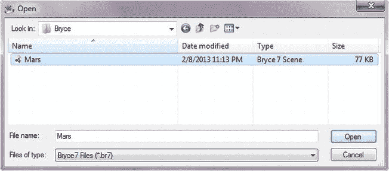
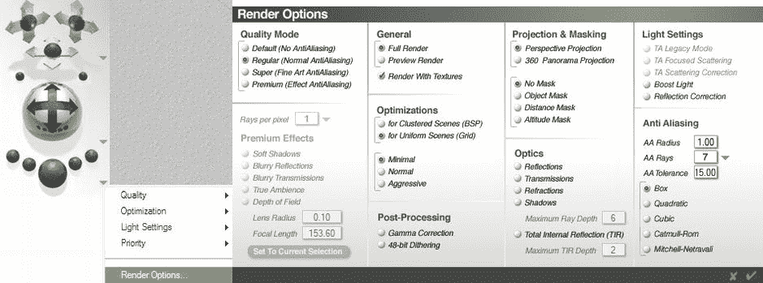
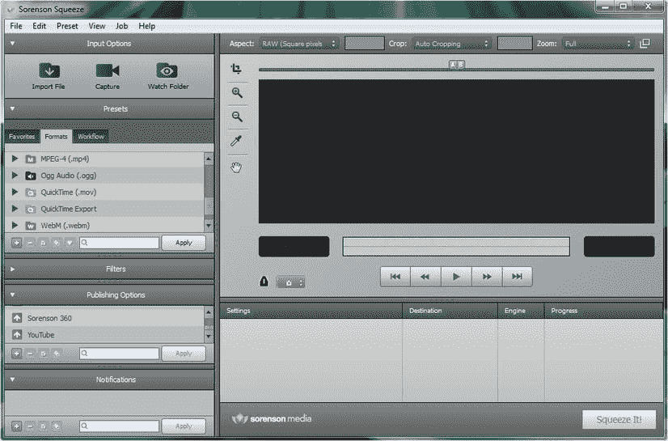
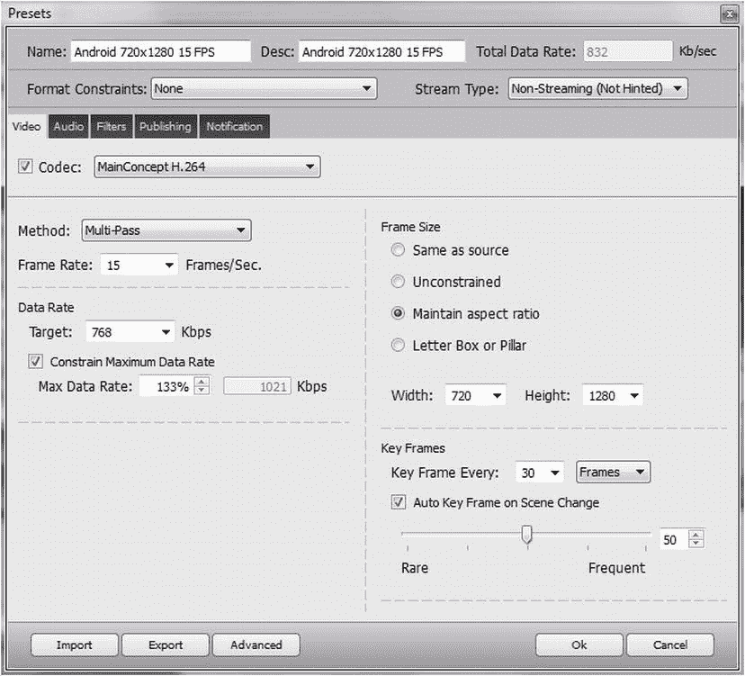

第十一章

视频介绍:概念和优化

在这一章中，我们将为提供一些基础知识，帮助你了解数字视频的工作原理，以及如何在你的 Android 应用中处理数字视频。

本章包括许多高级概念，这些概念将建立在你在第 7 章和第 8 章中学到的所有关于数字成像概念和技术的知识之上。

这种新媒体素材更难理解和优化，因为数字视频本质上是静态数字图像的移动集合。因为数字视频总是在移动，所以它引入了第四维度，或者说时间。这一点，加上当今强大而复杂的数字视频编码和解码算法所带来的复杂性，使得数字视频在本质上比数字成像更难学习，甚至比程序动画更难学习。

优化数字视频也很复杂，主要是因为数字视频对视频中的所有帧进行压缩，这需要更高级的数学知识，因此需要更高级的知识来了解压缩过程中到底发生了什么，才能有效地实施这些压缩算法。

我们将在如何应用于为您的 Android 应用最终用户创建最佳用户体验的背景下审视所有这些。

这意味着不仅要了解数字视频编辑的基本原理及其数据占用优化，还要了解哪些数字视频格式最适合用于 Android，以及在何种分辨率下使用它们。这些主题是如此先进，我们将利用两个章节来有效地彻底涵盖一切，这样你就可以很好地处理数字视频，以及如何针对 Android 进行优化。

数字视频的基础:像素，帧 ，FPS ，编解码器

您在第 7 章中了解到的所有适用于您的数字影像的概念(像素、分辨率、纵横比、颜色深度、alpha 通道、图层、混合和合成)同样适用于数字视频，并且当您处理数字视频时，它们对您来说同样重要，甚至更重要。

你在第 9 章中学到的一些关于基于帧的动画的概念也适用于数字视频。这是因为数字视频和光栅动画一样，是基于帧的内容，可以随着时间的推移快速显示。由于这个原因，帧率的概念，表示为每秒帧数，或 FPS，在您的数字视频数据足迹优化工作过程中也非常重要。

数字视频文件是用一种叫做数字视频编解码器的软件创建的，这是 T2 公司的缩写。DV 编解码器是一个复杂算法的集合，既可以对装满数字视频帧的容器(文件)进行编码，也可以进行解码，以便最终用户可以存储、传输和查看。请注意，您的最终用户必须能够访问对视频帧进行编码的同一编解码器才能对其进行解码；这通常是通过操作系统(Android)或浏览器(Chrome 或 Firefox)完成的。

因为编码任何给定数字视频数据文件的相同编解码器(算法)也必须用于解码该数字视频数据，所以这证明了每个数字视频编解码器都具有编码组件或编码侧，以及解码组件或解码侧，其可以解密其编码器所写的内容。

因此，MPEG4 H.264 编码的数字视频文件只能使用 MPEG4 H.264 编解码器读取(解码)，这是您的 Android 操作系统的一部分。类似地，由 VP8 编解码器编码的数字视频帧只能使用 VP8 编解码器播放(解码)，Android 操作系统也支持 VP8 编解码器。

数字视频文件有不同类型的**文件扩展名**，告诉开发者和 Android OS 该文件中的数字视频数据是什么类型，以及使用哪种类型的编解码器(解码器)来读取(解码)该类型的视频数据。我们之前提到的 **MPEG4 H.264** 文件具有 **.mp4** 文件扩展名，因此如果我们使用这种特定的视频编解码器来编码视频数据，我们的火星旅行视频将被称为**mars.mp4**。

不同类型的数字视频编解码器具有不同的功能和性能规格。因此，我们想要查看的关键是任何给定编解码器提供的**质量与文件大小的比率**。一些数字视频编解码器(如 MPEG4 的 H.263 编解码器)质量较低，适用于低分辨率视频会议等应用，而其他编解码器(如 MPEG4 的 H.264 和 VP8)则更适合于高质量的内容，如电影和电视节目。在写这本书的时候，MPEG4 的 H.268 编解码器也已经发布，但是还没有被采用。为什么？因为:H.268 编解码器必须存在才能解码 H.268 内容！

重要的数字视频属性:标清、高清、流媒体和比特率

所以，现在我们知道视频编解码器将帧中的像素转化为数学；分辨率在哪里起作用，视频是如何存储和访问的？

存储视频:分辨率

高清普及之前使用的原始视频分辨率被称为 **SD** ，或 **标清**数字视频。在美国，SD 视频最初在高度上使用 **480** 行分辨率，因此 4:3 纵横比为 VGA 分辨率或 640 乘 480，宽屏纵横比 SD 视频为 720 乘 480。在欧洲，标清视频在高度上使用 576 行分辨率，因此欧盟的 4:3 标清视频将为 768×576，而欧洲的宽屏幕宽高比标清视频将为 1024×576。

最近**高清** 数字视频已经变得流行，并且使用宽屏 **16:9** 宽高比。高清分辨率有两种，第一种是 **1280 乘 720** 像素，我称之为**伪高清**分辨率，第二种，也是现在比较常见的高清分辨率，是 **1920 乘 1080** 像素，视频行业称之为**真高清**。

有趣的是，所有这些分辨率都非常接近 Android 消费电子设备上常见的屏幕尺寸。有 640×480 VGA 屏幕的入门级安卓手机，也有 800×480 WVGA 屏幕的主流安卓手机，接近 720×480 宽 SD 标准分辨率。还有 1024×600 的入门级(更小的外形)Android 平板电脑，接近欧洲范围内 1024×576 的标清分辨率。

较新的 Android 高清手机是 1280×720，或伪高清，最新的 Android 平板电脑是真高清 1920×1080。这非常方便，因为我们可以对视频内容使用广播分辨率标准，并且仍然可以达到大多数流行的 Android 屏幕分辨率。

访问数字视频数据:捕获和流式传输

那么，Android 设备首先是如何访问数字视频数据的呢？这可以通过两种方式之一来实现。数字视频数据(文件)可以被 **捕获**在您的应用本身中，在这种情况下，它是您的资源文件夹中的新媒体素材，就像您的图像和动画数据一样。

第二种访问数字视频的方式是通过一种叫做“T2”的概念，从你的安卓设备和应用之外的外部视频服务器“T4”解码(播放)数字视频文件。

流式传输数字视频数据的好处是它可以大大减少应用的数据占用量。这是因为您不必在您的中包含所有繁重的新媒体数字视频数据。APK 档案。

流式数字视频的缺点是，如果您的用户连接(或视频服务器)中断，您的视频文件可能无法始终呈现给最终用户播放和欣赏；因此，视频内容的可靠性和可用性是另一个需要考虑的因素。

流式数字视频的核心概念之一是数字视频数据的**比特率**。比特率是在压缩过程中定义的，因此我们将在本章的后续章节中更详细地讨论这个问题，但让我们在这里定义它，因为它是一个重要的视频概念。

比特率本质上定义了你的数字视频数据将被压缩到什么程度。比特率是在数字视频压缩过程中定义的，这就是为什么我将在本章关于数据占用优化的章节中更详细地介绍它。

比特率较低(数量较少)的数字视频文件将对数据进行更多的压缩，这将导致质量水平较低，但在更多的消费电子设备上播放会更流畅。

这是因为比特率是每秒**比特**或 **BPS** 的度量，可以有效地处理或传输。随着计算机处理器越来越快，它每秒可以处理更多的位，同样，随着数据带宽连接越来越快，它每秒也可以轻松地发送或接收更多的位。

正如你所看到的，位/秒不仅对流式数字视频内容很重要，因为它适合带宽，而且一旦它到达 Android 设备，它还会影响哪些内容可以足够快地处理(解码)，以允许 Android 设备内的处理器顺利播放。因此，比特率之所以重要，有两个原因，一是因为流媒体视频，二是因为它只在一个方面(解码器处理速度)对 Android 应用中的捕获(嵌入)视频文件重要。

因此，在 Android 应用中嵌入了**受控**或**嵌入**的视频，视频资源的比特率越低，就有越多的 Android 设备可以顺利解码该视频资源(不会丢帧)。

原因很明显，每秒处理的数字视频数据位数越少，处理器的处理负荷就越轻。这不仅为视频播放带来了卓越的性能，也为整个 Android 应用带来了卓越的性能，同时也为 Android 设备内部的其他一切带来了卓越的性能。

因此，我们针对数字视频的数据占用优化非常重要，以较低的比特率获得良好的视频图像质量成为我们的最终目标，这也是我们希望使用最佳编解码器的原因。

在视频行业中，每秒一比特被写为:**比特/秒**，它通常包括一个大小修饰符，如前面的**kbit/秒**。这个 **k** 将表示**千比特每秒**，这意味着每秒几千比特。大多数视频压缩比特率设置在**256 kbit/s**(**256 kbps**)和 **768 kbit/s** 之间，尽管我们将尝试为我们的 Android 应用优化我们的数字视频数据到更低的范围，在 192 kbit/s 和 384 kbit/s 之间，但仍然可以获得出色的图像质量。如果我们能做到这一点，我们的数字视频将播放流畅，在所有不同类型的 Android 消费电子设备上看起来都很棒。这就是本章非常重要的原因。

数字视频格式:支持 Android 中的数字视频编解码器

Android 中支持的三种主要的数字视频数据格式: **MPEG4 H.263** ，是质量最低(性能最差)的编解码器，可以有 **.3gp** 或 **.mp4** 文件扩展名； **MPEG4 H.264 AVC** ，可以有 **.3gp** 或 **.mp4** 文件扩展名；还有 **VP8** ，可以有一个**。webm** 或 an **。mkv** 文件扩展名，在 Android 2.3.3(及以后版本)中支持**捕获**播放，在 Android 4.0(及以后版本)中支持视频**流**播放。

第一个编解码器 MPEG4 H.263 主要用于视频会议，因此我们将更多地关注更高质量、更常见和更广泛的编解码器，MPEG4 H.264 AVC 和 VP8。 AVC 代表:**高级视频编码**。

这两种流行的编解码器在 HTML5 中都得到了很好的支持，因此在所有流行的浏览器中都得到了支持。MPEG4 H.264 AVC 在所有版本的 Android 中都支持回放，并且在 Android 3.0(和更高版本)中支持使用数码相机硬件对视频进行编码，如果 Android 设备包括一个的话。

VP8，也称为 WebM ，包含在 Android 2.3.3 中，用于播放受控数字视频文件，包含在 Android 4.0 和更高版本中，用于播放流式数字视频文件。当前版本的 Android 不支持将相机数据编码为 VP8 格式，但也许该功能将成为 Android 5.0 的一部分，这应该很有意思。

因为我们专注于 Hello World 应用的数字视频解码，并且我们正在项目资源文件夹中优化和使用捕获或嵌入的数字视频文件，所以本章我们将专注于 MPEG4 H.264 AVC 和 VP8 的优化，因为这些是目前我们可用的优秀编解码器。

这两种编解码器中最常见的数字视频编解码器是 MPEG4 H.264 AVC 编解码器，因此市场上的大多数数字视频编辑软件，如 Final Cut Pro 或 After Effects，都可以将数字视频编码成这种格式。这是因为目前互联网上几乎每个人都在使用 HTML5 制作数字视频，因此大多数流行的数字视频编辑包中都包含了 H.264 编解码器支持。

我将使用英国伦敦 EditShare 的开源 Lightworks 数字视频编辑软件包。几年前，EditShare 慷慨地将他们以前的六位数非线性数字视频编辑软件包开源，新版本 11 应该会在本书发布时发布，他们刚刚在我最近下载的版本 11.1 中添加了 H.264 支持。我们还将使用流行的 Sorenson Squeeze Pro 软件来了解数字视频编码，这是互联网 2.0 视频编码的行业标准。

VP8 编解码器支持稍微更新一些，目前在 Lightworks 中没有，所以我将在本书中使用流行的 Sorenson Squeeze 视频编码软件包，以便您可以看到一个支持 Android 中当前支持的所有格式的编码包。

数字视频优化:跨设备和分辨率播放

既然我们已经决定了 Android 操作系统中支持的哪些数字视频编解码器最适合我们在 Hello World 应用中的使用，我们现在需要确定我们将为不同密度级别的 Android 设备屏幕支持哪些分辨率。

我们需要选择三到四个关键分辨率，这些分辨率分布得足够远，以完美地适应各种屏幕尺寸，从入门级的 320 x 480 预付费 El-cheap 手机，一直到支持真正的 HD 1920 x 1080 或更高分辨率的新型大型平板电脑和 ITV。

如果我们要以 1920×1080 的原生 **XXHDPI** 分辨率支持**真高清**，那么我们应该有四种不同的分辨率(和比特率)，其中之一就是那个。在这种情况下，我会使用 **VP8** ，因为视频的每一帧都有 1920(宽)乘以 1080(高)乘以 3 (R，G，B)或 **6** 、 **220** 、 **800** 个像素值要压缩。如果我们想要一个快速的， **30 FPS** 的帧速率，我们需要将该值乘以 30，这样我们每秒要压缩的像素数据总量为 186，624，000 像素。

符合逻辑的下一个支持的分辨率级别是**伪高清**1280×720**XHDPI**分辨率级别，用于高清智能手机、大多数平板电脑和一些 ITV。如果你只打算使用三个目标分辨率，这一个将成为最高级别，并且可以**放大**以适应 1920×1080 的显示器，并且看起来仍然相对不错，因为你在编解码器设置方面做得很好。如果你知道你在做什么，使用 VP8 这实际上是很可能的，它可以以低比特率产生惊人的质量水平和巨大的数据足迹。

合乎逻辑地支持的下一个目标分辨率水平也是一种流行的广播分辨率，美国的宽 SD 格式，或者 T2 HDPI T3 屏幕的 720×480 像素。到目前为止，我们的四个目标分辨率中有三个也是非常常见的目标视频广播分辨率，因此您在为 Android 应用支持准备数字视频文件的工作过程中，也可以方便地为其他媒体和目的提供优化的数字视频素材，一切都不费吹灰之力。这一目标分辨率将适用于 800 x480 和 854 x480 屏幕分辨率的 Android 设备，主要是中级智能手机和迷你平板电脑。

符合逻辑的最终目标分辨率是**四分之一高清，**为 **MDPI** 屏幕的 480×270 像素。这符合原始智能手机 480 x320 的分辨率，因为仍有廉价的预付费智能手机在生产中使用这种分辨率。

请注意，480 乘 270 正好是高清的四分之一(因此 QHD 或四分之一高清)，将分辨率缩小 1/2 或 1/4 可获得最佳质量结果。只要我们在视频压缩优化方面做得很好，我们应该能够将 MPDI 的比特率提高到 192 kbps。那么我们将为 HDPI 设定 384 kbps 的比特率，为 XHDPI 设定 768 kbps 的比特率。

数字视频创作:创造我们的火星表面飞越

在我们真正能够进入视频压缩软件包之前，比如 **Sorenson Squeeze Pro** ，我们需要创建一个我们星球表面的飞越。由于火星最近很受欢迎，我们将使用名为**布莱斯 7 专业版**的流行地形编辑软件包来创建 900 帧视频内容。我们将以每秒 15 帧的速度创建该视频内容，让我们有一分钟的时间飞越红色星球表面，我们可以用它来学习一些数字视频优化的概念。

如果你还没有，去 DAZ 3D 网站下载 Bryce 7.1 或谷歌“Bryce 7 Download ”,然后去下载该软件的网站。安装软件并启动，你会看到如图[图 11-1](#Fig1) 所示的 Bryce 7 Pro 启动画面。

[图 11-1](#_Fig1) 。来自 DAZ 的 Bryce 7 Pro 是地形生成软件

转到参考资料中的 Bryce 文件夹。zip 文件，并在那里打开 Mars.br7 文件。这是一个简单的表面地形，用类似火星的材质绘制，有一些薄薄的橙色云，地平线上的薄雾，和一个黄色的太阳。我在地表附近放置了一个摄像机，显示了地面、天空和太阳，并制作了一个直线摄像机的动画来模拟在行星表面快速飞行。

生成未压缩的帧

在下一章中，我们将通过 Java 代码使用一些更高级的媒体播放器控件，我们可以调整我们的播放速度。现在，我们将在一个。AVI 文件格式压缩可以阅读练习视频压缩。

1.  Once Bryce has launched, use the **File**  **Open** menu sequence, and locate the book resources folder and the Bryce sub-folder, and then open the **Mars.br7** file, as shown in [Figure 11-2](#Fig2). Notice the 3D data is only 77 KB.

    

    [图 11-2](#_Fig2) 。使用 Bryce 7.1 中的文件打开菜单序列打开 Mars 文件

2.  一旦这个文件被打开，你会看到一个平坦的陆地地形网格和地平线；在你**渲染**这个 3D 场景之前，你不会看到这个将会生成的图像。如果您想要渲染 3D 火星场景的第一帧，您可以在左侧 UI 面板中单击较大的(最低居中的)绿色球体。
3.  接下来，我们使用**文件**  **进行动画设置。。。**菜单序列，用于设置我们的 3D 动画参数，包括当前开始时间或帧数、持续时间或结束时间或帧数、我们使用 FPS 的帧速率、我们的回放参数和帧显示类型(帧数或 SMPTE 时间)。
4.  Set the **Current** time to **0:00:00.00** Frame Number **0** and the **Duration** time to **0:01:00.00** Frame Number **900** and set the **FPS** to **15** as shown in [Figure 11-3](#Fig3).

    

    [图 11-3](#_Fig3) 。设置动画参数

    **注意**注意布莱斯用术语描述 Pong 动画:**钟摆**动画！

5.  我猜钟摆动画是对 Pong 动画描述的巧妙改进，但我们打算将我们的动画设置为**播放一次**，并控制 Android 中的任何其他播放参数。此外，将**显示**参数设置为**帧数**，这样一旦您实际渲染了这个火星动画，您将能够看到哪个帧当前正在 Bryce 中渲染。首先，我们必须配置我们的渲染引擎。

配置渲染引擎

接下来让我们设置我们的渲染选项。这些控制 3D 特征，决定每一帧视频渲染需要多长时间，如图 11-4 所示。

[图 11-4](#_Fig4) 。为火星表面飞越动画设置我们的火星 3D 动画渲染选项

1.  通过单击渲染球体旁边的向下箭头，打开一个菜单，并选择**渲染选项**来访问渲染选项对话框。
2.  我们的火星动画在每个分辨率级别的渲染时间(或帧渲染速度)的主要决定因素是使用质量模式设置来设置的。我们对每一帧进行的反走样**越多，渲染的时间就越长。为了获得最高质量的视频和合理的渲染时间，使用对话框左上角显示的**常规**设置。**
***   我们在每一帧上做了一个完整的渲染，用纹理渲染 T2，这样我们的火星表面看起来就像红色的岩石。我们还优化了**统一场景**和**最小优化**来节省每帧渲染时间。*   我们关闭所有的**后处理**选项**关闭**，因为我们不需要**伽马校正**，我们不希望额外的**噪声**通过 **48 位抖动**引入每一帧，因为那个选项会使我们的文件变大，正如本书前面所学的。*   我们使用**透视投影**(一个普通的相机镜头)和**无遮蔽**，因为我们没有使用任何阿尔法通道。最后，我们将关闭**光学**和**灯光设置**下所有“昂贵”的计算密集型选项，因为这些对于这个简单的行星表面飞越来说是不需要的，并且大多涉及有水的场景，而且火星上没有太多的水。*   对话框右下角的最后一部分控制着**反走样**设置，以及用于在我们正在创建的 3D 动画视频的每一帧上执行反走样功能的**算法的类型**。算法从上到下变得越来越复杂(和耗时)，但提供了更好的结果，代价是处理周期。*   最后， **AA 半径**定义了每个像素周围需要抗锯齿的像素数量。把这一套留给: **1.0** 。 **AA 射线**决定渲染引擎用于反走样的射线数量或射线跟踪计算的数量。较高的 AA 光线值会产生较长的渲染时间。最后，将 **AA 公差**设置为 **15** ，将**算法**设置为**盒**算法，因为其他算法会使用更多的处理时间并增加渲染时间。**

 **渲染动画

现在，我们准备渲染我们的火星表面飞越 3D 动画，所以下拉**文件**  **渲染动画**菜单序列，输入动画的持续时间，并指定输出参数和文件位置。参考图 11-5 中的[了解我们将要经历的序列。](#Fig5)

[图 11-5](#_Fig5) 。渲染动画对话框和编辑按钮(中间)和设置按钮(右边)的子对话框

1.  选择整个持续时间选项，显示我们在动画设置对话框中输入的信息，如图 11-3 所示。
2.  接下来点击编辑按钮，并选择我们的视频数据的全帧(未压缩)设置，并将其存储在 AVI(音频视频交错)容器。这意味着我们不必使用带编号的文件，正如你可以想象的那样，900 帧的文件会有点乏味。
3.  接下来单击 Set 按钮，并在 Documents 下的用户文件夹中为 Mars.avi 文件指定一个文件位置。创建一个名为 Android 的文件夹(如果还没有的话),然后在其中创建一个 Hello_World 子文件夹，用于这个特定应用的正在进行的数据文件。
4.  如果您设置了网络，并希望在网络上的所有机器上进行渲染，则需要在所有工作站上安装 Bryce 7.1 Pro。一旦完成，你可以使用对话框底部的**配置**按钮来配置你的**渲染农场**。然后，你所要做的就是选择**渲染网络**单选按钮来启用这个功能。
5.  一旦这个对话框中的一切都配置好了，如图[图 11-5](#Fig5) 所示，你可以点击对话框右下角的复选标记，900 帧火星表面动画视频的渲染就开始了。在六核 64 位工作站上，分辨率为 1080×1920，耗时 8 小时。

创建解析文件

工作流程的下一步是为 270×480(MDPI)、480×854(HDPI)和 720×1280(XHDPI)Android 设备分辨率密度创建其他三个分辨率源文件。这是在**文档设置**对话框中完成的，正如你已经知道的，双击绿色 Bryce 渲染球体可以进入该对话框，如图 11-4 左侧[所示。](#Fig4)

1.  For each of our target DPI resolutions, we need to enter our desired target resolution into a Document Resolution field in this Document Setup (see [Figure 11-6](#Fig6)).

    

    [图 11-6](#_Fig6) 。在 Bryce 中设置文档分辨率、纵横比、抗锯齿和报告渲染时间选项

2.  确保您的文档宽高比为 9:16 宽屏(在这种情况下，我们的应用在纵向模式下使用，或使用垂直方向)，并使用上面显示的精确 Android 设备屏幕分辨率。
3.  如果您的分辨率差了一个像素，取消选中“约束比例”选项(这将使您的纵横比保持锁定)，并将像素更改一个像素，然后重新选中相同的“约束比例”单选按钮，以便在完成更改后再次打开它。如你所知，当我们全屏播放视频时，我们试图逐个像素地达到这些主流(常见)Android 设备屏幕分辨率，以获得最佳质量，而不需要 Android 为我们缩放数据，这可能会引入伪像。Android 目前不擅长的一件事是缩放图像和视频。
4.  当您每次设置一个目标分辨率时，单击对话框底部的复选标记，如图 11-6 所示，您会注意到 Bryce 7 将视口缩放到该分辨率的像素数。

接下来，重复[图 11-3](#Fig3) 到 [11-5](#Fig5) 所示的工作过程，渲染三个较小的分辨率，并分别将文件命名为 **Mars270.avi** 、 **Mars480.avi** 和 **Mars720.avi** 。

请注意，在[图 11-5](#Fig5) 中， **Mars.avi** 高清数字视频文件(1080×1920 分辨率)已经渲染完成，我们正在该屏幕截图右侧的对话框中为我们的 **Mars270.avi** 文件设置文件名。还要注意，我们选择了一个选项**来报告渲染时间**，这样我们就可以从数学的角度来看渲染引擎在做什么。这在图 11-7 中显示，我把它包括在内，这样我们就能明白为什么我们的 3D 渲染过程在我们生成的 900 帧数字视频中的每一帧上花费了这么多时间。

[图 11-7](#_Fig7) 。渲染报告信息

我在 480 乘 854 渲染时生成了这个截图，因为我们知道 480 乘 854 是 409，920，所以我们已经知道第一个数字是如何计算的。第二个数字是抗锯齿的像素数量，我们已经知道这意味着图像中有 149，699 个像素在两个像素之间存在剧烈的颜色变化(这简单地等同于图像中不同对象或颜色之间的**边缘**)。

渲染引擎投射出 146 万条光线来定义该图像中每个像素的颜色值，即平均每个像素 3.55 条光线。如果你想要确切的数字，3.55 乘以 409，920 等于 1，455，216。

因为我们关闭了阴影，所以渲染引擎没有投射阴影光线；你可以想象，这为我们节省了一些渲染时间！在投射的 146 万条光线中，有 125 万条击中了什么东西，206，376 条没有击中任何东西，因此没有用于创建像素数据值。

数字视频压缩:关键概念和技术

现在我们有了一个 3D 渲染的源星球(火星)飞越动画数据，我们可以用它来创建数字视频文件，我们可以在下一章中使用，在那里我们将学习如何实现这个数字视频内容，以及如何通过 Android VideoView 和 MediaPlayer 类在我们的 Android Hello World 应用中控制它。

在我们这样做之前，我们必须优化我们在上一节中渲染的这些文件，因为它们的文件大小从 400MB 到 4GB 不等，并且我们的。APK 文件只能是 50MB，所以我们必须了解数字视频编解码器的设置和数字视频压缩的概念，设置和技术。

用于优化数字视频的最佳软件叫做 Sorenson Squeeze。如果你曾经为 Adobe Flash 平台开发过，你可能会对这个软件包很熟悉，现在它已经是第九版了。

我们要做的第一件事就是推出 **Sorenson Squeeze Pro** ，版本 8.5.1。当你这样做时，你会看到一个如图[图 11-8](#Fig8) 所示的启动屏幕。

[图 11-8](#_Fig8) 。启动 Sorenson Squeeze Pro 来压缩和优化我们的 MPEG4 和 WebM 视频文件

这个视频压缩软件工具有七个主要区域，如上面的[图 11-8](#Fig8) 所示，包括输入选项、编解码器预设、效果过滤器、发布平台、通知、序列器窗口(右下角)和视频编辑窗口(右上角)。

导入视频

我们需要做的第一件事是导入我们的数字视频 AVI 全帧未压缩格式文件。

1.  This is done by clicking the icon on the upper right labeled **Import File**. This opens a file navigation dialog window, shown in [Figure 11-9](#Fig9), which allows us to navigate through the hard disk drive, and find the 3D **Mars.avi** source digital video files that we created earlier in Bryce 7.1 Pro.

    

    [图 11-9](#_Fig9) 。使用导入文件对话框定位我们的 Mars.avi 源文件

2.  找到你的 **My Documents** 文件夹(应该在你的 Users 文件夹下)和它下面的 **Android** 文件夹，里面包含了你的 Android 相关工作素材。找到您之前为您的 **Hello_World** 应用新媒体资源创建的子文件夹，选择 Mars.avi 文件并单击打开按钮。一旦你这样做了，你将在 Sorenson Squeeze 的视频编辑部分看到火星视频的第一帧(见[图 11-11](#Fig11) )。
3.  Locate the **+** icon on the left at the bottom of the Presets Pane, and click it to open a new presets dialog, so that we can develop a codec that is Android specific, as shown in [Figure 11-10](#Fig10). Type **Android 1080x1920 15 FPS** in the **Name:** and **Desc:** fields, to label our custom settings, which will be saved for future use with other digital video. The **Format Constraints** are set to **None**, and the **Stream Type** is set to **Non-Streaming** as we are optimizing to a .MP4 file. The best **Codec** to use for H.264 is **MainConcept**.

    

    [图 11-10](#_Fig10) 。创建 1080×1920 Android 视频压缩设置，预设为 15 FPS 和 1 Mbps 数据速率

4.  我们使用 **MainConcept H.264 编解码器**的原因是因为它是最先进的，并且具有一种**多遍方法**，该方法使视频数据多次通过，以尽可能实现最佳的质量与文件大小之比。这需要更多的时间，但我在这里假设您至少有一个四核工作站(如果不是八核的话)，并且质量是您最终关心的问题。一旦选择了**多遍**，设置**帧速率:**到 **15 FPS** ，并设置**目标数据速率**为 **1024 Kbps** (也是 1 Mbps)。
5.  选择**约束最大数据速率**，将**最大数据速率**设置为 1024 Kbps 的 **150%** ，即 **1536** Kbps。这为我们的数据突发留出了一些回旋空间，如果在任何给定的帧上需要多一点空间的话。
6.  将**帧尺寸**设置为 1920 年的**1080**以防止缩放，**保持纵横比**，让我们确保编解码器每 **40** 帧查看**关键帧**。最后，选择**场景变化时的自动关键帧**，并选择一个平均关键帧频率 50 作为该压缩设置预设的开始。
7.  Once everything is set click the OK button shown in [Figure 11-10](#Fig10) and you will be returned to the main Squeeze Pro program screen where you can now click the Apply button in the top left panel to apply these settings (see [Figure 11-11](#Fig11)).

    

    [图 11-11](#_Fig11) 。将 Android 1080×1920 15 FPS 视频压缩预设应用到导入的 Mars.avi 文件

8.  最后，我们可以点击**挤压它！软件屏幕右下方的**按钮，开始我们的视频压缩过程。

当您的视频数据正在压缩时，我们将稍微讨论一下什么是**关键帧**，以及它们在整个视频压缩过程中的确切作用。

关键帧是您的动画数据的一帧，编解码器会查看该帧以存储视频在该确切帧的完整图像，这也是它被称为“关键帧”的原因

编解码器为您的视频节省空间(减少数据足迹)的方式是不必保存数字视频中的每一帧，在这种情况下，它是一个飞越火星表面的 3D 动画。

这是通过当今新媒体算法中一些最复杂的数学来完成的，并且肯定超出了一本*学习 Android* 书的范围。它本质上是进入第四维(时间)并查看它编码的每个关键帧之后的帧，以查看下一帧相对于它刚刚**采样的**关键帧**发生了什么变化。**

然后，编解码器只对帧与帧之间发生变化的数据进行编码，这可以在许多视频场景中节省大量编码数据。这方面的一个很好的例子就是**正在说话的头部**视频，例如教师或政治家。如果这个人保持冷静，静止，固定在一个地方，那么只有他们的嘴部(说话)动作会随着画面的变化而变化。

在这种情况下，因为包含嘴的像素区域只占整个视频帧像素的很小一部分，编解码器可能会逐帧编码这些像素，而不是整个图像。在这种情况下，视频帧的许多像素会随着时间的推移而冻结，这就是编解码器可以减少数据占用量的原因，这就是编解码器所关注的游戏名称。

因此，一个非常安静(零头部运动)的说话人编码得非常好，只要他们背后的背景不是太嘈杂或者没有编解码器需要解决的大量快节奏运动。因此，在一个繁忙的新闻编辑室中，一个正在说话的头的编码效果不如在一个具有纯色、均匀照明背景的特殊设置中的一个正在说话的头。

编解码器不能 **很好地转码**(跨帧编码)的东西是噪声，就像静态图像编解码器一样，以及全帧运动。全帧移动是指视频帧中的每个像素改变其在视频的每个帧中的位置。这样的例子包括非常快速的相机摇摄，例如在赛车的拍摄中使用的；镜头拉近或拉远，例如用于拍摄自然纪录片的镜头；以及像动作片和火星飞越中所用的摄像机飞越。

现在，您的数字视频应该已经完成编码，您将在软件屏幕右下角的 Squeeze Pro 工作区底部看到一个可播放的视频图标，如图[图 11-12](#Fig12) 所示。

[图 11-12](#_Fig12) 。完成视频压缩(仅屏幕截图的底部区域)显示 MP4 视频准备播放

压缩视频

接下来，我们需要压缩我们的 MDPI 分辨率 Android 屏幕的视频素材:

1.  Use **File**  **Save** to save your Squeeze Pro environment as it sits now. Next use **File**  **New** to set out a new blank canvas, so we can use the **Import File** button to bring in our **Mars270.avi** raw video data file to compress into H.264 MPEG-4 data, as shown in [Figure 11-13](#Fig13).

    

    [图 11-13](#_Fig13) 。使用 192 Kbps 多通道 H.264 在 Squeeze 中以 15FPS 压缩 270×480 数字视频源

2.  Follow the same work process that we did for the 1080 version and click the + button in the Presets Panel and set up a preset for our 270 by 480 resolution video that uses a **Target Data Rate** of **192 Kbps** and a **Max Data Rate** of **256 Kbps**, or a 133% burst data rate ceiling. Keep **KeyFrames** every **30** frames (30 total per 900 frames), and be sure to lock in the resolution by specifying it, and then using **Maintain Aspect Ratio**, or **Same as Source**, as shown in [Figure 11-14](#Fig14).

    

    [图 11-14](#_Fig14) 。为我们的 270×480 视频文件输出设置编解码器设置

3.  请确保使用顶部的“名称”和“Desc”字段来标记您的新 MDPI 编解码器设置；我使用了 Android 270×480 15 FPS 的标签，因为它很短并且具有描述性，非常适合预置面板。一旦一切都配置好了，点击 **OK** 按钮，然后在预置面板中选择新的编解码器定义，点击 **Apply** 按钮将其应用到你的 Mars 项目设置窗口。现在，你可以点击**挤压它了！**按钮，压缩你的全帧未压缩。AVI 转换成 MP4 文件。

创建的 MPEG-4 文件只有 1.3 兆字节，所以我们用这些设置获得了惊人的压缩，因为我们的源(原始)数据在。AVI 文件接近 342 兆字节。正如我们之前所了解的，这为我们提供了 263:1 的压缩率，它将 Android 设备必须处理的数据量从一分钟几百兆字节减少到一分钟内处理不超过一兆字节，这是 Android 设备处理器应该能够处理的。

值得注意的是，优化视频绝不是一次性的过程，如果您发现视频可以在所有设备上流畅播放，您可以通过指定更高的数据速率来提高质量。例如，256 Kbps**和 384 Kbps 上限的**将是您尝试的下一个设置，更多的关键帧，比如说，每 **20** 帧使用关键帧，而不是 30 帧(这相当于采样和存储 45 个关键帧，而不是总共 900 帧中的 30 个)。文件大小会增加，视频数据的视觉质量也会提高，并且将有更多的视频数据供处理器解码和显示。

接下来，我们需要压缩我们的 HDPI 分辨率 Android 屏幕视频素材:

1.  Use **File**  **Save** to save your Squeeze Pro environment as it sits now. Next use **File**  **New** to set out a new blank canvas, so we can use the **Import File** button to bring in our **Mars480.avi** raw video data file to compress into H.264 MPEG-4 data, as shown in [Figure 11-15](#Fig15).

    

    [图 11-15](#_Fig15) 。使用 384 Kbps 多通道 H.264 在 Squeeze 中以 15FPS 压缩 480×854 数字视频源

2.  Follow the same work process that we did for the 1080 version, and click the + button in the Presets Panel, and set up a preset for our 480 by 854 resolution video that uses the **Target Data Rate** of **384 Kbps** and a **Max Data Rate** of **512 Kbps**, or a **133%** burst data rate ceiling. Keep **KeyFrames** every **30** frames (a total of 30 per 900 frames), and be sure you lock in the resolution, by either specifying it and using **Maintain Aspect Ratio**, or by using the **Same as Source option** instead, as shown in [Figure 11-16](#Fig16).

    

    [图 11-16](#_Fig16) 。为 480×854 视频文件输出设置编解码器设置

3.  Finally, we need to compress our XHDPI target resolution Android screen’s video asset, so again, use **File**  **Save** to save your previous Squeeze Pro environment. Next use **File**  **New** to set out a new blank canvas, so we can use the **Import File** button to bring in our **Mars720.avi** raw video data file to compress into an H.264 MPEG-4 MP4 data file, as shown in [Figure 11-17](#Fig17).

    

    [图 11-17](#_Fig17) 。通过 768 Kbps 多通道 H.264 在 Squeeze 中以 15 FPS 压缩 720×1280 数字视频源

遵循我们为 1080 版本所做的相同工作流程，并单击预设面板中的+按钮，为您的 720 x 1280 分辨率视频设置一个预设，该预设使用 **192 Kbps** 的**目标数据速率**和 **256 Kbps** 的**最大数据速率**，或 133%突发数据速率上限。每隔 **30** 帧保留**关键帧**(每 900 帧总共 30 帧)，并确保通过在对话框 UI 中指定并使用**保持宽高比**或使用**与源**相同选项来锁定分辨率，如图[图 11-18](#Fig18) 所示。

[图 11-18](#_Fig18) 。为 720×1280 视频文件输出设置编解码器设置

接下来我们需要将我们创建的 MPEG-4 H.264 视频素材放入适当的 Hello_World 项目资源文件夹，或者对于已经优化的 raw 视频数据文件，放入 **Hello_World/res/raw** 中，不需要 Android 进一步优化。这是我们在本书前面提到的一个概念，我们将在本书的下一部分详细讨论。一旦完成，我们的视频数据就可以使用了。

在 Android 中使用数字视频资源:资源的原始文件夹

现在我们已经创建了四个分辨率密度(DPI)目标分辨率视频文件，我们可以将它们复制到相应的资源子文件夹中，然后我们可以通过 XML 标记和 Java 代码在第 12 章中访问它们。

1.  Open your OS file manager utility, for Windows 7 or Windows 8 it’s Windows Explorer, and go to your C:/Users/YourName/workspace/Hello_World/res resource folder and right-click it to get a context-sensitive menu, shown in [Figure 11-19](#Fig19).

    

    [图 11-19](#_Fig19) 。在 Hello_World resources (res)文件夹下新建一个名为/raw 的 文件夹来存放视频文件

2.  At the bottom of this menu, select the **New**  **Folder** sub-menu sequence to create a new folder under the res (resource) folder and name it **raw**. Once created, the folder shows up under your menu sub-folder (see [Figure 11-20](#Fig20)).

    

    [图 11-20](#_Fig20) 。拖放四个 DPI 分辨率的版本的火星表面飞越到/raw

    **注意**正如我在本书前面提到的，这个原始资源子文件夹在 Android 中用于包含已经由开发人员优化的新媒体素材，并且不需要 Android 操作系统的任何进一步优化或其他干预。本质上来说,/raw 文件夹中的新媒体素材是我们告诉 Android 存储在。APK 文件，并在应用代码中按原样访问和使用它们，无需任何进一步的修改。

3.  创建/raw 文件夹并显示在文件管理实用程序的左窗格中后，选择四个文件中的第一个，然后按住 Shift 键并选择该组中的最后一个文件。这用于分组选择整组文件，然后你可以将所有四个文件拖放到 **/res/raw** 文件夹中，如图[图 11-17](#Fig17) 所示。
4.  Next, we need to go into the **/res/raw** folder, and use the file manager to rename all the files from the detailed names assigned by Squeeze Pro to use simpler filenames, as we’ve been doing previously in this book. This process is shown in [Figure 11-21](#Fig21) showing our new lower-case names and the raw folder.

    

    [图 11-21](#_Fig21) 。将火星视频的四个分辨率版本重命名为:mars270、mars480、mars720、mars1080

    **注意**正如我们过去所做的，我们将遵循 Android 的小写字母和数字素材命名约定，使用行星名称(在本例中为火星)和数字视频的水平分辨率(以像素为单位)作为我们的视频文件命名约定。

5.  Now let’s launch our Eclipse ADT IDE, and make sure that we did everything correctly and that our digital video assets are in place and ready for use in our next chapter covering how to code Java and XML mark-up to implement digital video in our Android application. As you can see in [Figure 11-22](#Fig22), we now have our /raw folder in our Android Hello_World project resource folder and it has four MPEG-4 files inside it that we can use to play video in our Travel to Planet Activity screen. If you already had Eclipse running, be sure and use the F5 (or Refresh) work process.

    

    [图 11-22](#_Fig22) 。查看项目的/res/raw/文件夹中的四种分辨率版本的数字视频 MPEG-4 文件

接下来，我们将简单介绍一下 Android VideoView 类，我们将在[第 12 章](12.html)中使用该类来保存和播放我们的数字视频素材，然后我们将了解将数字视频素材编码到 Hello_World Android 应用中所需的基础知识。

在 UI 设计中播放数字视频:Android 的 VideoView 类

Android 设计了一个用户界面小部件，使我们的应用中的数字视频播放变得相当简单。

它被称为 **VideoView** 类，它使用 XML 中的 **< VideoView >** 标签来通过各种参数实现其 UI 属性，正如我们在本书前面的章节中用 Java 和 XML 实现 TravelPlanet 活动类时已经看到的那样。

Android VideoView 类是 **SurfaceView** 类的子类，后者本身是 **View** 类的子类，我们知道，后者是 Java **Object** 类的子类。

VideoView 类实现了 **MediaPlayerControl** 接口，这样我们就可以访问与控制数字视频播放相关的方法。

这个接口是由**Android . widget . media controller**包提供的，所以它的完整路径是**Android . widget . media controller . media player control**，这样我们就能够在 Java 代码中**播放**或**暂停**我们的视频，如果我们愿意的话。

事实上，在 XML 和 Java 中实现 VideoView 和 MediaPlayer 功能是我们下一章关于 Android 中数字视频的内容，现在我们已经有了基础知识，知道我们到底在谈论什么数字视频概念、编解码器、功能和回放。

摘要

在这一章中，我们为理解数字视频新媒体素材打下了坚实的基础，这样我们就可以在 Android 应用中实现它们。

我们了解了像素、它们所在的视频帧以及将它们压缩和解压缩为可用文件的编解码器如何协同工作，以使大量移动数字图像数据更易于管理和使用。

然后，我们了解了数字视频领域的一些重要概念和标准，例如标准分辨率标清视频及其原生分辨率，以及更新的高清视频及其两种常见分辨率规范。我们了解到 Android 中的数字视频可以被捕获，或者保存在一个资源文件夹中，并包含在我们的应用中。APK 文件，或者它可以是**流视频**，并通过视频服务器远程提供。

我们讨论了比特率和每秒位数的重要概念，以及这种测量方法如何用于数字视频的数据占用优化过程。我们还了解到，比特率不仅决定了什么类型的带宽速度环境可以容纳数字视频，还决定了什么类型的 Android 设备数据处理(CPU)功能可以在视频流实际通过该带宽时对其进行解码。

我们发现即使机器人内部有视频文件。APK 容器，比特率和质量水平是获得清晰视频的关键组成部分，播放流畅，没有丢帧，以试图跟上数字视频文件所需的帧速率。

接下来，我们了解了 Android 支持的数字视频编解码器和格式，如 MPEG4 H.263 和 H.264 编解码器，以及 VP8，以及这些编解码器在 Android 操作系统内部和外部的支持级别有何不同，以及它们是 HTML5 规范的一部分。

我们还研究了我们需要在所有 Android 消费电子设备上支持的最佳数字视频分辨率，发现美国和欧洲 SD 和 HD 数字视频的主要广播分辨率与当前大多数 Android 设备的屏幕分辨率非常匹配。

我们学习了如何使用 Bryce 7 Pro，并创建了基本的火星表面动画。我们练习了使用 3D 地形生成软件为一些关键的 Android 设备分辨率实现数字视频文件素材生成。我们还学习了一些关于 3D 渲染的基本概念。

接下来，我们讨论了数字视频优化中的关键概念，并了解了除分辨率之外影响视频压缩的其他因素，如平移和缩放，以及将噪声引入帧图像数据的因素，如之前的压缩伪像。

我们通过在 Sorenson Squeeze Pro 内的 MainConcept H.264 编解码器中实际使用这些设置来了解关键帧和比特率，从而将我们的数字视频从原始、未压缩的原始数据状态优化为高度压缩的数字视频素材，以便在我们的 Hello_World 应用中使用。

我们通过优化四个目标分辨率密度级别的视频素材来实践这一压缩流程，从中等分辨率(MDPI) 480 像素屏幕、高分辨率(HDPI) 800 像素屏幕、超高分辨率(XHDPI)伪高清 1280 像素屏幕，一直到超高分辨率(XXHDPI)真高清 1920 像素屏幕密度。

然后，我们将这四个优化的数字视频素材复制到 resource 文件夹中，复制到我们创建的/raw 子文件夹中，以便在 Hello_World 项目文件夹中保存这些数字视频素材。我们重命名了这些文件，以便在代码中更容易访问，然后进入 Eclipse ADT，以确保一切就绪，我们可以开始在应用中编码、实现和测试这些数字视频素材。

为了了解如何在我们的 Hello World Android 应用中实现数字视频，我们学习了用户界面小部件 VideoView，这是我们在本书前面的 TravelPlanet 活动屏幕用户界面中最初实现的。

我们学习了 Android VideoView 类的层次结构，以及 XML 中相应的<videoview>标签元素。我们了解到 VideoView 实际上是一个连接到 MediaPlayer 类的 SurfaceView 容器，接下来我们将学习如何在我们的 TravelPlanet.java 活动类中实现它。</videoview>

在下一章中，我们将深入研究使用 Android VideoView 和 MediaPlayer 类及其方法实现数字视频所需的 XML 和 Java 编码，从而进一步了解数字视频新媒体元素。我们还将构建 Java 代码来控制我们的 VideoView XML UI 定义，并最终控制用户体验。**