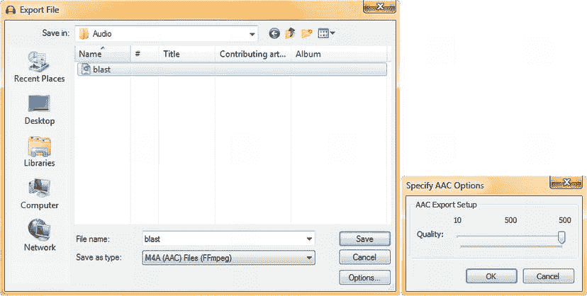

第十三章

音频简介:概念和优化

在这一章中，我们将为您提供理解数字音频工作原理所需的基础知识，并让您能够在 Android 应用中胜任数字音频工作。

数字音频是更难理解和优化的新媒体资产之一，因为数字音频本质上是数字采样声波的集合，而且，它们是肉眼不可见的。因此，我们不得不依靠我们的耳朵而不是我们的眼睛，我们大多数人都不习惯使用我们的耳朵来制作，除非我们是音频工程师，作曲家，音乐家或歌剧歌手！

因为数字音频数据是实时回放的，所以它像数字视频一样，在等式中引入了第四维度，即时间。这一点，再加上当今功能强大但复杂的数字音频编辑软件以及编码和解码算法所带来的复杂性，使得数字音频像数字视频一样难以理解。

我们将在如何应用于为您的 Android 应用最终用户创建最佳用户体验的背景下审视所有这些。

这意味着不仅要了解数字音频编辑的基本原理及其数据占用优化，还要了解哪些数字音频格式最适合用于 Android，以及使用哪些采样率。这些主题是高级的，所以我们将利用三个章节来有效地彻底涵盖一切，以便您能够很好地处理数字音频，以及如何针对 Android 进行优化。

模拟音频的基础:声波和空气

正如你们这些立体声发烧友已经知道的，声音是由声波在空气中脉动产生的，这就是为什么超低音扬声器是巨大的 12 英寸到 24 英寸的锥体，通过磁脉冲快速推出，将主要声波扔向摇滚音乐会上的 10 万名观众。

在数字音频出现之前，模拟音频是主要的消费电子行业。事实上，今天仍然如此，声波由复杂的模拟电子设备控制，包括电容器、电阻器、振荡器、晶体、电子管、电路板、扬声器锥体、心形麦克风和类似的模拟技术。正如我所说的，数字音频是复杂的，这种复杂性的一部分来自于需要将模拟音频和数字音频技术联系起来。

正如声音是由各种尺寸的扬声器锥体产生的，扬声器锥体本质上只是由一种或另一种材质制成的薄膜，通过脉冲或振动产生声波，因此我们的耳朵也可以接收并听到这些声波，通过接收空气或振动的脉冲并将它们转化为我们大脑可以处理的数据。

声波产生不同的**音调**，这取决于声波的**频率**。宽的或不常见的(长)波产生较低的(低音)音调，而更频繁的(短)波长产生较高的(高音)音调。有趣的是，不同频率的光会产生不同的颜色，所以模拟声音(音频或音乐)和模拟光(颜色或摄影)之间有着非常密切的联系，这种联系一直延续到数字领域。

声波的**音量**将根据该声波的**振幅**或高度(或大小)来预测。因此，频率是沿着 2D 的 **X 轴**的波的间隔有多近，振幅是沿着 Y 轴**测量的波有多高。**

声波本身可以有不同的形状，以承载不同的声音效果；基线类型的波被称为**正弦波**，我们在高中数学中学习过正弦、余弦和正切数学函数。

精通音频合成的人都知道，在声音设计中还有其他类型的核心声波，例如看起来像锯子边缘的 **saw wave** (因此得名)，或者使用直角整形的 **pulse wave** (产生即时的开和关声音或脉冲)。

甚至随机波形，如**噪音**，也被用于声音设计，以获得尖锐的声音效果。您可能已经从本书中有关数据占用优化的内容中猜到，声波中出现的混乱或噪声越多，编解码器就越难压缩，特定声音的数字音频文件也就越大。接下来，我们将进一步了解这些模拟音频声波如何通过称为**采样**的过程转化为数字音频数据，这是声音设计和音乐合成的核心工具。

数字音频的基础:采样、采样分辨率和采样频率

将模拟音频声波转化为数字音频数据的过程称为**采样**。如果你在音乐行业，你可能听说过一种键盘或机架安装设备，它被称为**采样器**。

采样是一个过程，它将音频波(通常是复杂的正弦波)分割成段并以数字格式(0 和 1)存储它们的形状和任何其他波形属性(即噪声)。

音频声波的这些数字片段被称为**样本**，因为它们在任何给定的时间点对声波进行采样。样本的精度取决于定义每个波切片所用的数据量，与数字成像一样，这种精度被称为分辨率，或**采样分辨率**，通常定义为 8 位、16 位或 24 位。

在数字成像(和数字视频)中，分辨率用颜色的数量来量化，而在数字音频中，分辨率用多少位数据来定义每个音频样本来量化。

正如您可能已经猜到的那样，更高的采样分辨率，或者再现给定声波样本所需的更多数据，将产生更高的音频回放分辨率，从而产生更高的声音质量。这就是为什么 16 位(也称为: **CD 质量**)音频听起来远远好于 8 位音频的原因，就像 24 位彩色图像比 8 位彩色图像看起来更好一样。

在数字音频领域，我们现在有 24 位数据采样，在数字音频领域称为: **HD 数字音频**。高清数字广播电台使用 24 位样本分辨率，因此每个音频样本或声波片段包含 16，777，216 个样本分辨率单位。一些较新的 Android 设备也将支持高清音频，如你在广告中看到的那些智能手机，具有超高质量(高清)音频，这意味着它们具有 24 位音频硬件支持。

除了数字音频采样分辨率，我们还有数字音频**采样频率**、或在一秒钟内以该特定分辨率采集多少样本。在数字成像中，采样频率类似于我们使用的图像中的像素数。

采样频率也可以称为**采样率**，您可能熟悉 CD 音质音频，它被定义为使用 **16 位**采样分辨率和 **44.1 kHz** 采样率，它需要 **44 个**、 **100 个**样本，每个样本将包含 16 位数据，即每个样本中的总数据量为 65，536 个单位。

让我们计算一下，看看有多少数据样本用于提供一秒钟的**原始**(未压缩)数字音频数据。这是通过将 65，536 个单位乘以 44，100 个样本来实现的，以获得用于表示一秒 CD 质量音频的 **2** 、 **890** 、 **137** 、 **600** 个样本的数据值。

因此，要计算出音频文件中的原始数据，你需要将采样比特率的十进制值乘以采样频率，再乘以音频片段中的秒数。请放心，这将是一个很大的数字，但放松；音频编解码器在优化这些数据方面非常出色，数据占用空间非常小，质量损失非常小(听得见)。

因此，我们在数字成像和数字视频中的完全相同的权衡也存在于数字音频中。我们包含的数据越多，得到的结果就越(高)质量，但代价是数据占用空间更大。在视觉媒体中，这是使用色深、像素和(数字视频)帧来定义的，而在听觉媒体中，它是通过**采样分辨率**结合**采样率**来定义的。

数字音频行业常见的采样速率包括:22 kHz、32 kHz、44.1 kHz、48 kHz、96 kHz、192 kHz 以及最近的 384 kHz。较低的采样率，例如 22 kHz 或 32 kHz，将足以对基于语音的数字音频进行采样，例如电影对话或电子书的旁白轨道。

较高的采样速率更适合音乐和其他需要高动态范围(高保真度)的声音效果，这样可以再现出出色的“高保真”音质。

一些声音效果，例如我们将在 Hello World 应用中使用的，可以使用较低的 32 kHz 采样速率，只要使用的采样分辨率是 16 位质量。

关键数字音频属性:CD 音频、HD 音频、音频流和音频比特率

正如我们已经提到的，卓越音频质量的**行业基准**被称为 **CD 音频标准，**被定义为在 **44.1 kHz** 数据采样频率下的 **16 位**数据采样分辨率。这是 20 世纪用来制作音频 CD-r om 的材质，至今仍在使用。

还有一个更近的 **高清音频标准****24 位**数据采样，采样频率为 **48 kHz** (甚至 96 kHz)，目前用于高清收音机和高清音频兼容的 Android 设备，如高保真智能手机。

如果您打算在 Android 应用中使用高清音频，您需要确保您的目标最终用户将拥有高清音频标准兼容硬件，这将需要利用这一更高水平的音频保真度。

就像您的数字视频数据一样，您的数字音频数据既可以在您的应用中被**捕获**(/ raw 文件夹中的数据文件)，也可以从远程数字音频文件流数据服务器中流出。

流式数字音频数据的好处是，它可以减少应用的数据占用，就像流式数字视频数据一样。许多相同的概念同样适用于音频和视频。

流式音频节省了数据空间，因为您不必在中包含所有繁重的新媒体数字音频数据。APK 文件，所以如果你正计划编码一个自动点唱机应用，你可能要考虑你的数字音频数据流。否则，请尝试优化您的数字音频数据，以便您可以将它包含在。APK 档案。这样，当应用的用户需要它时，它总是可用的。

流式数字音频的缺点是，如果您的用户连接(或音频服务器)中断，您的音频文件可能无法始终供最终用户播放和收听！您的数字音频数据的可靠性和可用性是流式音频相对于专属数字音频数据的另一方面需要考虑的关键因素。

就像数字视频一样，数字音频流的一个主要概念是数字音频数据的比特率。

正如我们之前所了解的，比特率是在压缩过程中定义的，我们将在本章后面的章节中详细讨论这一点，因为它与数字音频有关。不过，让我们在这里重温一下，只是为了确保你理解它，因为它是一个基本概念。

比特率定义了您的数字音频数据将被压缩到什么程度。比特率将在数字音频文件压缩过程中定义，这就是为什么我将在本章后面的数字音频数据占用优化部分详细介绍它。

比特率较低(数量较少)的数字音频文件将对数据进行更多的压缩，这将导致较低的质量水平，但在更多的消费电子设备上播放更流畅。

如你所知，比特率是每秒比特数(BPS)的量度，可以被有效地处理或传输。随着计算机处理器变得更快，它可以处理更多的 BPS 同样，随着数据带宽连接变得更快，它可以更舒适地每秒发送或接收更多的比特。

因此，重申一下，位/秒不仅对流式数字音频内容很重要，因为它将适合带宽，而且一旦它到达您的 Android 设备，位速率会影响哪些内容可以足够快地处理(解码)，以允许 Android 设备内的处理器顺利播放。

出于这个原因，比特率之所以重要，有两个原因:一是因为流音频，二是因为捕获(嵌入)数字音频文件(作为捕获文件保存在 Android 应用资源/raw 文件夹中)的一个原因(解码 CPU 的处理速度)。

因此，在 Android 应用中使用捕获或嵌入的音频，音频资源的比特率越低，越多的 Android 设备可以平滑地解码该音频资源(而不会丢失音频样本)。接下来，我们需要了解 Android 支持的数字音频文件格式和编解码器，并了解使用哪些格式和何时使用它们。

数字音频格式:支持 Android 中流行的数字音频编解码器

Android 中的数字音频编解码器远远多于数字视频编解码器(MPEG-4 和 VP8)。Android 支持 **.MP3** (MPEG-3)文件，Wave (PCM 或脉码调制)**。WAV** 文件、 **.MP4** (或. M4A) MPEG-4 音频、OGG Vorbis ( **)。OGG** 的音频文件，马特罗斯卡**。MKS** 音频文件，FLAC ( **)。FLAC** )音频文件，甚至 MIDI(。MID，。MXMF 和。XMF)文件，从技术上来说，这根本不是真正的数字音频数据。让我们先把 MIDI 去掉，因为我们不会在 Hello World 应用中使用它。

**MIDI** 代表代表**乐器数据接口** ，它是数字音频和计算机最早合作的方式之一，可以追溯到 20 世纪 80 年代。第一台具有 MIDI 端口的计算机是 Atari ST-1040，它允许你将**键盘合成器**，如雅马哈 DX-7，插入该 MIDI 端口，并使用称为 **MIDI 音序器**的音频软件将 MIDI 数据播放和记录到计算机中。

MIDI 文件不包含样本数据，也就是说，它不包含音频，只包含**演奏数据**。MIDI 跟踪键盘上的哪些键被按下、何时被按下、按键持续时间、按键被按下的力度(称为:后触摸)以及类似的性能特征。当通过合成器回放 MIDI 文件时，它会复制播放器的性能，即使播放器不再播放那个**轨道**。

在音乐制作行话中，曲目是歌曲创作或表演的一个片段或一部分。在录音棚里，不同的乐器和声乐表演被保存在不同的音轨上，这样在后期制作中，工程师可以更精确地对它们进行“混音”。

这在 MIDI 序列软件中的使用方式是，您可以弹奏一个乐器轨道，将其录制为 MIDI 数据，当您弹奏它旁边的另一个乐器轨道时，序列器会为您回放它。这使得数字歌曲作者能够通过使用计算机来组合复杂的安排，而不是一个充满音乐家的工作室。

Android 支持 MIDI 文件的回放，但没有实现 MIDI 类，所以为 Android 编写 MIDI 音序器并不是一件容易的事情，尽管代码论坛上有人在谈论它。由于这个原因，它超出了本书的范围，我在这里提到它只是为了让你了解数字音频的历史和范围，因为 MIDI 在数字音频的发展中发挥了重要作用。

Android 支持的最常见的格式是 **MP3** 数字音频文件格式。由于 Napster 等音乐下载网站，我们大多数人都熟悉 MP3 文件，我们大多数人收集这种格式的歌曲，以便在流行的 MP3 播放器上使用，并通过 CD-ROM 和 DVD-ROM 收集音乐。

MP3 数字音频文件格式如此受欢迎的原因是因为它具有良好的压缩比和质量比，并且因为播放它所需的编解码器几乎可以在任何地方找到，甚至在 Android 操作系统中。只要你通过使用最佳的编码工作过程获得最佳的质量水平，MP3 将是 Android 应用中可以接受的格式。

值得注意的是，MP3 是一种**有损**音频文件格式，就像 JPEG 用于成像一样，其中一些音频数据(以及质量)在压缩过程中被丢弃，并且以后无法恢复。因此，如果您要使用 MP3 音频，请确保保存原始的未压缩音频数据文件。

Android 确实有一个**无损**音频压缩编解码器，叫做: **FLAC** ，代表 **免费无损音频编解码器** 。FLAC 是一个开源音频编解码器，由于软件解码器的免费性质，它的支持几乎和 MP3 一样广泛。因此，使用 PNG32 和 FLAC，在您的 Android 应用中使用完全无损的新媒体资产是可能的。

FLAC 也非常快(编码非常紧密)，支持 HD (24 位)音频，使用它没有专利问题。如果您需要在合理的数据占用范围内获得高质量的音频，这是一个很好的音频编解码器。

FLAC 支持大范围的样本分辨率，从每个样本 4 位到每个样本 32 位。它还支持非常宽的采样频率范围，从 1Hz 到 655350Hz (65 kHz)，增量为 1Hz，因此非常灵活。从音频回放硬件的角度来看，我建议使用 16 位采样分辨率和 44.1 kHz 或 48 kHz 采样频率。

Android 3.1 和更高版本支持 FLAC，因此如果您的最终用户使用现代 Android 设备，您应该能够安全地使用 FLAC 编解码器。

Android 支持的另一个开源数字音频编解码器是 **Vorbis** 编解码器，一个来自`Xiph.Org` **基金会**的**有损**音频编解码器。Vorbis 编解码器数据通常保存在**中。OGG** 数据文件容器，因而 Vorbis 通常被称为 **Ogg Vorbis** 数字音频数据格式。

Ogg Vorbis 支持从 **8 kHz** 到 **192 kHz** 的采样速率，以及到 **255** 的数字音频离散通道(正如我们现在所知，这代表 8 位音频通道)。所有版本的 Android 都支持 Vorbis。

Vorbis 正在迅速接近 HE-AAC 和 WMA(Windows Media Audio)Professional 的质量，并且在质量上优于 MP3、AAC-LC 和 WMA。这是一种有损格式，因此 FLAC 仍然比 Ogg Vorbis 具有更高的质量水平，因为它包含所有原始的数字音频样本数据。

Android 支持最流行的 MPEG4 **AAC** ，或**高级音频编码** ，编解码器，包括 **AAC-LC** ， **HE-AAC** ，和 **AAC-ELD** 。这些都可以包含在 MPEG4 容器(. 3gp、. mp4、. m4a)中，并且可以在所有版本的 Android 中回放，只有 AAC-ELD 除外，它只在 Android 4.1 以后才受支持。 **ELD** 代表**增强型低延迟**，该编解码器旨在用于实时双向通信应用，如数字对讲机。

最简单的 AAC 编解码器是 AAC-LC 或**低复杂度**编解码器，这是使用最广泛的编解码器，应该足以满足大多数应用。与 MP3 相比，AAC-LC 应该以更低的数据占用量产生更高质量的结果。

下一个最复杂的 AAC 编解码器是 HE-AAC 或**高效** AAC 编解码器。该编解码器支持 8 kHz 至 48 kHz 的采样速率，以及立体声和杜比 5.1 声道编码。Android 支持解码该编解码器的 v1 和 v2 级别，并且还在 4.1 版(Jelly Bean)之后的 Android 设备中以 HE-AAC v1 编解码器编码音频。

对于通常以不同于音乐的声波类型为特征的编码语音，还有两种其他 **AMR** 或**自适应多速率** 音频编解码器，它们对于编码语音或不需要高质量再现的短脉冲音效(如炸弹爆炸音效)等非常有效。

Android 中有一个 **AMR-WB** ，或**自适应多速率宽带**标准，它支持从 **6.6 到 23.85 kbps** 的 9 个离散设置，音频比特率以 16 kHz 采样，这对于语音来说是一个高采样率。例如，如果您正在创建一个交互式电子书应用，这将是用于旁白轨道的编解码器。

Android 中还有一个 **AMR-NB** 或**自适应多速率窄带**标准，它支持从 **4.75 到 12.2 kbps** 的 8 种离散设置，以 8 kHz 采样音频比特率，这是一个足够的采样率，如果进入编解码器的数据是高质量的，或者由于其噪声性质(炸弹爆炸)导致的音频样本不需要高质量。

最后，我们有 **PCM** 或**脉码调制** 音频，俗称**波**或**。WAV** 音频格式。你们中的许多人都熟悉这种格式，因为它是用于 Windows 操作系统的原始音频格式。

PCM 音频通常也用于 CD-ROM 和 DVD-ROM 内容，以及电话应用。这是因为 PCM Wave audio 是一种**未压缩的**数字音频格式，它没有应用于其数据流的计算密集型压缩算法，因此解码(CPU 开销)对于电话设备或 CD-ROM 或 DVD-ROM 播放器来说不是问题。

因此，正如您很快会看到的，当我们开始将数字音频资产压缩成各种格式时，我们可以使用 PCM 作为基线，但可能不会将其放入我们的。APK 文件，因为有其他格式，像 FLAC 和 AAC，它会给我们同样的质量，使用数量级更少的数据。

最终，真正找出 Android 中哪种音频格式对于任何给定的音频数据实例具有最佳数字音频编解码器的唯一方法是，实际上用我们知道支持良好且高效的主要编解码器对您的数字音频进行编码，并观察数据足迹结果，然后听听音频回放质量，以做出我们的最终决定。

数字音频优化:跨设备播放

优化我们的数字音频资产，以便在市场上的各种 Android 设备上播放，将比优化我们的数字视频甚至我们的数字图像更容易。

这是因为在 Android 设备之间，屏幕分辨率和显示器纵横比的差异要比数字音频播放硬件支持的差异大得多。这是因为用户的耳朵无法像眼睛一样感知视频中的音频质量差异。

一般来说，所有 Android 设备都有三个主要的数字音频支持“最佳点”,我们应该为我们的高质量音频提供支持。较低质量的音频(如旁白轨道或简短的声音效果)可以使用 8 位、12 位或 16 位分辨率的 22 kHz 或 32 kHz 采样。

这些高质量音频目标包括 CD 质量音频，也称为 44.1 kHz 的 16 位数据采样，HD 质量音频位于该音频频谱的另一端，也称为**48 kHz**采样率的**24 位**数据采样，以及未命名的“中间某处”规范，使用 48 kHz 采样率的 16 位数据采样。右手的最后一个选项可以产生类似于剧院中使用的 THX 质量音频的效果。

因此，我们在所有 Android 设备上优化数字音频资产的工作流程将是创建 44.1 kHz 和 48 kHz 的 16 位资产，然后以 Android 支持的不同格式对其进行优化(压缩)，并查看哪些资产能够以最低的数据占用量提供最高质量的音频播放。

我们将使用最近发布的 **Audacity 2.0.3** 数字音频编辑和工程软件包来完成这项工作。这个软件包是开源的，因此我们所有的读者都可以访问，并且可以在所有流行的操作系统平台上使用，包括 Windows、Macintosh 和 Linux。

用插件和编解码器库设置 Audacity 2

如果你还没有下载 Audacity 的最新版本(在撰写本书时是 2.0.3 ),现在就去**audacity.sourceforge.net**下载你的免费版本并安装它。

请确保您还安装了最新的 Audacity 2 插件、FF-MPEG 和 LAME 编解码器，这样您就可以为数字音频文件格式导出最新的数字音频编码算法。

重要的是要注意，在不改变编解码器的解码器侧的情况下，编解码器的编码器侧可以变得更有效；因此，在任何给定的时间获得最新的编码器并不意味着 Android 需要更新其 OS API 库中的解码器支持，以便您能够从任何特定的编解码器中获得质量到文件大小的好处。

一旦你下载并安装了最新的 Audacity，你可以通过进入 Audacity 的**下载**选项卡(页面)并点击**插件和库**链接，用所有新的插件和编解码器来增强它。

要安装 90 多个免费的 LADSPA 插件，找到并点击链接“90 多个 LADSPA 插件”这会触发上的下载。如[图 13-1](#Fig1) 中 LADSPA 插件设置对话框的**选择目标位置**阶段所示。如果您没有将这些插件放在正确的文件夹中，它们将不会加载到 Audacity 中。


[图 13-1。](#_Fig1)为 LADSPA 插件选择目标位置设置对话框，指定\Audacity\Plug-Ins 文件夹

如果你愿意，你也可以安装奈奎斯特和 VST 插件，也列在这一页，虽然他们不是本书所需要的，因为我们不打算深入到数字音频工程在这个时候！

接下来滚动到页面底部，右键单击 **LAME FAQ** 链接，打开 LAME MP3 编码器页面，然后单击顶部的**下载页面**链接。向下滚动一半并单击文本链接。EXE 文件读取**Lame _ v . 3 . 99 . 3 _ for _ windows . EXE**并下载安装。EXE 文件复制到其默认目录位置。

接下来，滚动到页面底部，右键点击 **FFmpeg FAQ** 链接，打开 FFmpeg 导入导出库页面，然后点击顶部的**下载页面**链接。向下滚动 LAME 链接下面的两个链接，然后单击。EXE 文件**FFmpeg _ v 0 . 6 . 2 _ for _ Audacity _ on _ windows . EXE**并下载安装。EXE 文件复制到它的默认目录位置。

一旦您将所有这些插件和编解码器安装到您的内容制作工作站上，您就可以启动 Audacity，它将在其启动初始化例程中找到并安装最新的数字音频编解码器库支持和插件。

数字音频创作:寻找 Hello World 音效

为了找到一些用于商业用途的免费音频样本，我将使用**谷歌搜索引擎**，并键入一个查询，以获得免费音频样本，或免费数字工作室样本，或免费音频文件，或免费数字音频文件，以及类似的谷歌搜索术语组合。

请注意，由于在提供这些数字音频资产的不同网站中使用了**关键字**，每一次谷歌搜索都会出现完全不同的结果。

有几十个好的网站都符合我们的需求，所以当你有空的时候，一定要深入调查这些网站。确保您用于应用开发的那些软件是**免费用于商业用途的**，并且没有任何版税、使用或版权限制。

我们要寻找的是最高质量的**未压缩 PCM** (波或。wav 音频文件格式)样本，使用 16 位或更好的(24 位或 32 位)格式，并且希望有 44.1 kHz 或 48 kHz 的采样频率。

请注意，如果您下载并使用. MP3 文件(大多数也提供),它们将已经被压缩，并可以使用，但您将无法控制压缩和优化过程，因为许多原始数据在压缩过程中已经被丢弃。

数字音频压缩:关键概念和格式

首先你需要通过点击任务栏上的快速启动图标来启动 Audacity 2.0 ，并使用**文件打开**菜单命令序列来打开我们从免费音频样本网站下载的 battle003.wav 文件。

第一次打开 Wave 文件时，你会看到如图[图 13-2](#Fig2) 所示的警告对话框。选择**制作副本**单选按钮选项，选中**不再警告**复选框，最后点击**确定**按钮将音频样本加载到 Audacity 中。


[图 13-2。](#_Fig2)导入音频文件的警告和适当的复制设置

使用这些音频文件导入设置(使用文件的副本，而不是实际文件本身)被称为**无损音频编辑**，是数字音频编辑和效果行业的常见做法。

这样做的原因是，如果您在音频**加甜**和特效应用中出错，并损坏了音频数据，您可以通过返回并加载原始音频数据来从头开始。

一旦 battle003.wav 样本数据被加载到 Audacity 2 中，您将会看到一个与图 13-3 中显示的屏幕一模一样的屏幕。左上角包含音频传输控制，包括暂停、播放、停止、后退、前进和录制。紧挨着它的是编辑工具，最右边是电平指示器，当您的音频正在播放时，它会显示绿色、黄色和红色信号峰值指示器。下面是扬声器和麦克风音量的设置，以及系统音频设置选择器下拉菜单。在 Audacity 窗口的底部，您会发现以 Hz 为单位的项目采样率，以及用于选择开始、结束或长度的小时、分钟、秒和毫秒显示，以及用于微调的音频位置。


[图 13-3。](#_Fig3) Audacity 2.0 主编辑屏幕显示了 battle003 的 32 位浮点 11 kHz 样本数据

我们首先要做的是，在开始导出到我们所学的各种数字音频格式之前，确保我们的采样分辨率和采样速率设置正确，这样我们就可以看到每个音频编解码器可以为我们的 Android 项目提供的实际压缩结果。

在 Audacity 中设置采样率和采样分辨率

在位于音频样本可视显示左侧的蓝灰色控制面板中，您会看到 **battle003** 样本(文件)名称，以及旁边一个朝下的箭头。点击此箭头，下拉一个选项菜单，选择**设置样本格式**选项，然后从其子菜单中选择 **16 位 PCM** 选项，如图[图 13-4](#Fig4) 所示。这确保了我们导出到 Android 支持的 16 位样本分辨率。


[图 13-4。](#_Fig4)在导出为各种格式之前，将音频样本分辨率设置为 16 位 PCM(未压缩)

现在我们可以导出我们的**基线** 16 位未压缩 Wave 音频。wav 文件格式，用于查看 2.5 秒炸弹爆炸的 16 位 11.025 kHz 音频样本的最大文件大小。

它的文件大小应该与我们在 Audacity 2 软件中打开(导入)的原始文件非常相似，但我们将把它命名为 **blast.wav** ，因为这是我们将为这个音频资产使用的更简单的名称(在我们的 Android Java 代码中，我们将在下一章中编写)。

导出未压缩的 PCM 基线。WAV 格式文件

为了在 Audacity 中导出文件，我们将使用**文件导出**菜单序列来打开**导出文件**对话框，如图 13-5 中的[所示。这个对话框有几个关键区域，包括**保存在:**文件夹说明符，它指向我们的**音频**资源文件夹，**文件列表窗格**，它显示我们的原始 battle003.wav 文件，**文件名:**数据输入字段，我们将在其中命名我们的文件，在这个例子中是 **blast** ，在它下面是**保存类型:**下拉选择器，它包含所有注意我们在**中设置了导出 **blast.wav** 的对话框。wav 16 位 PCM** 格式，这就是为什么我们**不需要指定**的原因。文件名的一部分。](#Fig5)


[图 13-5。](#_Fig5)导出我们的基准 16 位 PCM。wav 格式文件，并在导出时显示编辑元数据对话框

如果您单击显示在导出文件对话框右下角的**选项**按钮，您将看到对于 Wave 音频文件格式，您将得到一个对话框，通知您没有 PCM 格式的编码选项。

仔细想想，这是合乎逻辑的，因为 PCM 波是一种未压缩的音频格式，因此数据根本没有编码，因此没有音频编码参数或选项。

点击**保存**按钮后，会出现另一个**编辑元数据**对话框，如[图 13-5](#Fig5) 右图所示。该对话框包含艺术家姓名、曲目标题、专辑标题、曲目编号、年份、流派和注释的文本值数据字段。

因为我在这里进行了优化，以尽可能减少数据占用，而且我们的应用不需要音频元数据，所以我现在将这些字段留空，这样我们就可以准确读取音频数据的压缩情况。

如果你想知道 Android 是否能够读取和支持元数据，即使我们将这些数据放入我们的音频文件，答案是响亮的**是的！**事实上，Android 甚至有一个**MediaMetadataRetriever**类，开发者可以准确地利用它来实现这个特定的目的。

如果出于某种原因，您的音频应用需要利用元数据，您可以使用“编辑元数据”对话框，每当您在 Audacity 中保存任何类型的音频文件格式时，该对话框都会显示出来，此外还有 Android MediaMetadataRetriever 类，您可以通过以下 URL 研究和了解所有相关内容:

```java
http://developer.android.com/reference/android/media/MediaMetadataRetriever.html
```

如果您查看我们刚刚保存的 blast.wav 16 位 PCM 文件，您会发现文件大小与原始的 battle003.wav 文件相同。

我们从中可以推断出，即使 Audacity 告诉我们这是以 11.025 kHzi 的 32 位采样分辨率编码的，但实际上它实际上是 32 位数据容器(或大量未使用的余量)中的 16 位数据，因为文件大小完全相同，直到最后一个字节。

因此，对于这个 2.5 秒的炸弹爆炸样本，我们的基线未压缩数据足迹是 **50** ， **380 字节**，我们可以使用这个数字来确定使用 Android 支持的所有主要格式将获得的压缩量。

导出无损的。FLAC 开源音频格式文件

我要尝试的第一种格式是 FLAC 音频编解码器，因为它使用无损压缩。这将使我们了解使用不丢弃任何原始音频数据的压缩可以减少什么样的数据占用空间，从而为我们提供与 16 位 PCM Wave audio 一样完美的结果。

再次使用**文件导出**菜单序列，这次我们将下拉**另存为类型:**菜单并选择 **FLAC 文件**格式，如图[图 13-6](#Fig6) 所示。再次将文件命名为 **blast** 并放入 **Audio** 文件夹。


[图 13-6。](#_Fig6)导出名为 blast.flac 的 FLAC 音频文件，具有 8 级(最佳)质量和 16 位样本位深度

请注意，在此对话框的中心区域没有列出其他文件；这是因为现在我们已经选择了 FLAC 文件格式类型，该区域仅显示 FLAC 文件，而音频文件夹中目前没有 FLAC 文件。这是**模态软件操作**的另一个好例子，只是这次是在我们的音频工程软件中，而不是在数字成像软件中。

要设置我们的 FLAC 编解码器选项，请单击选项按钮，并将质量级别设置为 **8(最佳)**，并将位深度设置为 **16 位**。请注意，在“位深度”下拉列表中，我们也可以使用 FLAC 来获得无损的 24 位高清音频。

一旦你输出了你的 **blast.flac** 音频资产，进入你的文件管理器，看看文件大小。你会看到是 **33** 、 **537** 字节，或者减少**三分之一**(33537 除以 50380 就是 0.66568 或者三分之二)。

接下来让我们看看另一种开源格式，Vorbis，看看它是否能给我们带来更小的数据占用空间。由于 Ogg Vorbis 是一种有损文件格式，它应该给我们一个比 FLAC 更小的文件。

出口有损 Ogg Vorbis 开源。OGG 格式文件

使用**文件导出**工作流程，如前打开导出文件对话框，从**保存类型:**下拉菜单中选择 **Ogg Vorbis 文件**。将文件命名为: **blast** (这将产生一个 blast.ogg 文件名)并将其放入 **Audio** 文件夹中。

点击**选项**按钮，在 0 到 10 之间选择一个**质量**设置等级。我使用默认设置 5 开始；在实际的数据占用优化过程中，您将尝试几种设置，以查看数据占用对质量折衷的影响。


图 13-7。以 5 级(默认)质量和 16 位采样导出名为 blast.ogg 的 Ogg Vorbis 音频文件

一旦你输出了你的 **blast.ogg** 音频资产，进入你的文件管理器，看看文件大小。你会看到是 **12** 、 **995** 字节，或者减少**四分之三**(12995 除以 50380 是 0.25794，或者等于四分之一)。这是一个重大的尺寸减少，音频听起来和以前一样(然后再一次，这只是一个基本的爆炸)压缩。

接下来，我们来看看市面上最常见的有损音频格式 MP3。看看 MP3 是否能给我们比 Ogg Vorbis 开源编解码器更小的数据足迹应该是很有趣的。

导出到一个有损 MPEG-3 格式的. MP3 音频文件

再次使用**文件导出**工作流程，调出 Audacity 导出文件对话框，将另存为类型:下拉选择器设置为 **MP3 文件**。

将文件命名为 **blast** 并选择**音频**文件夹，然后点击 MP3 选项按钮打开**指定 MP3 选项**对话框，如[图 13-8](#Fig8) 右侧所示。我使用了默认的质量比特率设置 **128 kbps** ，这对于音频数据来说是相当高的，以及一个**恒定比特率模式**设置和一个**联合立体声通道模式**，因为文件是单声道的。


[图 13-8。](#_Fig8)以 128 kbps 恒定速率(比特率模式)编码导出名为 blast.mp3 的 MP3 音频文件

如果您愿意，您可以尝试几种不同的质量位速率设置，以及可变和平均位速率模式，以查看它们如何影响您的音频文件数据占用空间。

如果这样做，只需用文件名中的设置来命名文件。因此，例如，具有 128 kbps 质量设置和可变比特率模式的文件将被命名为 **blast128vbr.mp3** 。

通过这种方式，您可以比较您的音频文件大小，并进行简单的数学运算来计算您的数据占用减少百分比，正如我们接下来将对我们的 **blast.mp3** (或 blast128cbr.mp3，如果我们遵循我们的命名约定)文件所做的那样，您只需单击 Save 按钮即可生成该文件。

blast.mp3 文件大小为 19，643 字节，表示数据占用空间减少了 61%。为了解决这个问题，19，643 除以 50，380 等于 **0.3898** ，这是原始未压缩文件大小的 39%。100%减去 39%等于文件大小减少 61%。

既然我们已经看到我们的. MP3 文件大小并不令人印象深刻，甚至不如 Ogg Vorbis，让我们看看 MPEG4，或 MP4，数据压缩如何改善 MPEG3。因为 MPEG-4 是一种更新更先进的编解码技术，它应该为我们提供更好的文件大小质量比。

导出到有损的 MPEG-4 格式. M4A 音频文件

按照之前的**文件导出**工作流程调用 Audacity 导出文件对话框，从**保存类型:**下拉菜单选择器中选择 **M4A (AAC)文件(FFmpeg)** 。照常将音频目录中的文件**命名为 blast** (点击保存后导出器将命名为 blast.m4a)，然后点击**选项**按钮打开**指定 AAC 选项**对话框，如图[图 13-9](#Fig9) 所示。我选择将质量设置提升到 500，看看当使用最高质量级别设置时，MPEG4 文件的大小是多少。单击“保存”按钮，立即导出 blast.m4a 文件。



[图 13-9。](#_Fig9)导出名为 blast.m4a 的 MP4 AAC 音频文件，最高质量设置为 500

blast.m4a 文件大小为 10，513 字节，表示数据占用空间减少了 **79%** 。为了解决这个问题，10，513 除以 50，380 等于 **0.2087** ，这是原始未压缩文件大小的 21%。100%减去 21%等于文件大小减少 79%。

现在，我们已经看到我们的 M4A AAC 文件大小是迄今为止最令人印象深刻的，让我们看看更专业的 AMR-NB 窄带数据压缩编解码器是否会比 MPEG4 AAC 进一步改善数据占用空间。

尽管 MPEG-4 AMR-NB 编解码器和格式是专门为语音应用而设计和优化的，但可能还有一些其他应用，如某些短脉冲声音效果，可能会从该编解码器获得良好的效果。

毕竟，任何编解码器都只是一个作为软件实现的复杂的数学方程，并不区分，所以真正找出答案的唯一方法是通过编解码器运行原始的未压缩音频数据，看看会发生什么。让我们接下来这样做；然后我们将完成对 Android 中支持的音频编解码器和 Audacity 中提供的音频编解码器的比较。

导出窄带 MPEG-4 格式。AMR 音频文件

按照**文件导出**工作流程调用 Audacity 导出文件对话框，从**保存类型:**下拉菜单选择器中选择 **AMR(窄带)文件(FFmpeg)** 。

像往常一样，我们将**音频**目录下的文件**命名为 blast** (点击保存按钮后，导出器会将其命名为 blast.amr)，然后点击**选项**按钮，打开 **AMR-NB 导出设置**对话框，如图[图 13-10](#Fig10) 所示。


[图 13-10。](#_Fig10)导出名为 blast.3gp 的 AMR(窄带)音频文件，最大比特率设置为 12.20 kbps

我选择使用 **12.20 kbps 比特率**设置，以获得这种编解码器和数据格式可能的最高质量结果。这个工作过程让我可以看到当使用最大质量级别设置时，AMR-NB 文件的大小。

让我们点击**保存**按钮，现在导出我们的 **blast.amr** 音频文件。如您所见，这是我们迄今为止获得的最小数据足迹，然而当我们回放它时，它听起来仍然非常像炸弹爆炸。

blast.amr 文件大小为 3，686 字节，表示数据占用空间减少了 **93%** 。为了解决这个问题，3686 除以 50380 等于 **0.0732** ，这是原始未压缩文件大小的 7%。100%减去 7%等于文件大小减少 93%。

我们现在唯一的问题，幸运的是只有最后一个非常合适的编解码器和文件格式，是 Audacity 想要输出 AMR-NB 文件。AMR 文件扩展名，而 Android 希望看到使用. 3GP 文件扩展名的 AMR-NB 音频文件。总是有事，不是吗？让我们希望在未来版本的 Android 操作系统中，也许是 5.0，Android 决定友好地接受。amr 文件扩展名！

所以我们回到绘图板，看看 Audacity 文档。

Audacity 手动文件导出对话框部分告诉我们，我们应该能够指定某些非标准的文件扩展名，并且能够成功，所以让我们回到 Audacity 并尝试一下！

按照通常的**文件导出**工作流程调用 Audacity 导出文件对话框，并从**保存类型:**下拉菜单选择器中选择 **AMR(窄带)文件(FFmpeg)** 。

这次，我们将**音频**目录中的文件 **blast.3gp** 命名，然后点击**选项**按钮，在 **AMR-NB 导出设置**对话框中设置 12.20 kbps 质量选项，如图[图 13-10](#Fig10) 所示。

点击保存按钮后，您将看到如图[图 13-11](#Fig11) 所示的警告对话框。点击**是**按钮，将文件保存为 blast.3gp，我们将很快确定(在下一章)blast.3gp 文件是否会在我们的 Android 应用中播放。


[图 13-11。](#_Fig11)Audacity on 文件中显示的警告对话框导出文件扩展名为. 3GP 的 blast AMR-NB 文件

接下来，我们将把这些优化的数字音频资产放入我们的 Android 项目资源文件夹层次结构中的适当资产位置，以便我们可以在下一章的 Java 代码中访问它们。

在 Android 中使用数字音频资源:项目资源原始文件夹

现在，让我们打开操作系统的文件管理软件，将目前已经优化的六种数字音频文件格式复制到 Android Hello_World 项目文件夹的 **/res/raw** 子文件夹中。

进入您的数字音频资产制作文件夹，在我的情况下，它在我的一个四核工作站上，在 MindTaffyDesign 文件夹中的 Users 文件夹下的一个 **Book  Audio** 文件夹中，如图 13-12 顶部的[所示。](#Fig12)


[图 13-12。](#_Fig12)选择我们的六个优化的 blast 数字音频文件，并将它们拖到/res/raw 文件夹中

按住 Control 键的同时，点击选择我们优化过的六个文件，拖动到你的 Hello_World Android 项目文件夹中的/res/raw 子文件夹，也如[图 13-12](#Fig12) 所示。

一旦这些都在/res/raw 文件夹中，如图[图 13-13](#Fig13) 所示，我们可以重命名它们，这样当我们在 Java 代码中引用 **blast** 时，Android 就知道使用哪个了。


[图 13-13。](#_Fig13)我们的 blast 文件显示在/res/raw 文件夹中

如果我们在启动 Eclipse 之前不重命名这些文件，我们将在 Eclipse ADT 中位于主编辑窗格左下方的 **Problems** 选项卡中看到许多错误。

如果您想实际查看这些错误是什么，只是为了体验，那么现在就启动 Eclipse。请确保在重命名所有这些数字音频资产文件之前启动 Eclipse，否则您将看不到这些错误。如果你选择**问题**标签，你会看到十几个左右的 blast 错误，用红色文本标出。Eclipse 中的错误消息总是很难看！

这些错误将告诉您已经有一个 blast 资产，因此 Android 将把它找到的第一个 blast 数字音频资产作为要实现的资产，然后为其他资产生成错误。

这些错误将指定 Android 已经有一个 blast 音频资产可以利用，因此您必须删除以主文件名 blast 开头的任何其他音频资产，这是我们接下来要做的。

现在，让我们进入您的操作系统文件管理实用程序，我们将重命名所有这些音频资产，以便只有一个 blast.flac 可以被 Android 操作系统看到，我们将在下一章的代码中开始使用它。

图 13-14 显示了这个过程，正如你所看到的，我们已经将 blast.3gp 重命名为 blast_3gp.3gp，将 blast.m4a 重命名为 blast_m4a.m4a，将 blast.ogg 重命名为 blast_ogg.ogg，将 blast.wav 重命名为 blast_wav.wav，最后将 blast.mp3 重命名为 blast_mp3.mp3，依此类推，这是根据我们在 Android 中避免这些错误的数字音频资产占位符命名惯例。


[图 13-14。](#_Fig14)重命名 blast 数字音频文件及其编解码器类型，以便只有一个名为 blast 的文件

稍后，当我们想要在 Android 中实现任何给定的数字音频文件格式时，我们会将 blast.flac 重命名为 blast_flac.flac，然后将我们想要使用的编解码器重命名为 blast_m4a.m4a，这样 Android 就可以看到音频资产 blast 的 MPEG4 AAC 编解码器版本。最后，记住在文件名中只使用小写字母和数字；这是 Android 中需要遵守的文件名**约定**。

现在让我们启动 Eclipse，或者如果你已经启动它来查看所有那些有趣的错误，那么使用右键单击项目文件夹并**刷新**工作流程，这样我们可以看到我们现在有了一个干净、无错误的 IDE 软件开发工作环境，如图[图 13-15](#Fig15) 所示。


[图 13-15。](#_Fig15)我们的 blast 数字音频资产显示在 Eclipse ADT IDE 内的/res/raw 文件夹中

您现在可以看到，我们所有优化的(在 Android 之外压缩的)音频和视频资源都在一起，位于/res/raw 文件夹中，左侧显示的是我们首先要访问的 blast.flac 文件，该文件突出显示。

播放数字音频:Android MediaPlayer 类

使用 Android**media player**class在你的应用中回放 Android 中的数字音频资产。毫不奇怪，MediaPlayer 类是 Android 的 **media** 包的一部分，因此它将使用熟悉的 import**Android . media . media player**代码语句导入。

如您所知，MediaPlayer 类是 java.lang.Object 类的一个子类，因为它是自己的专用类，用于播放音频和视频新媒体资源，因此它没有专用的超类，它是从 java 中的 Object 类(将所有内容都定义为对象)派生出来的。

这是因为 MediaPlayer 在被实例化时，是在 Java 代码的一个对象中，你很快就会在第 14 章中看到。我们还将在[第 15 章](15.html)中看到一个更加强大的 Android **音频排序**类，称为 **SoundPool** 类，因此在接下来的几章中有很多音频资产编码要学习，这应该是一个**爆炸！**

摘要

在这一章中，我们了解了数字音频的概念、技术、流行的编解码器以及 Android 操作系统对它们的支持。

我们从模拟音频和声波的基础知识开始，我们了解了核心音频概念**频率**和**振幅**，以及音调和波形以及噪声在**音频采样**中的作用。

接下来，我们了解了数字音频**样本**和采样过程，以及数字音频样本回放质量的核心决定因素，即以位为单位确定的**样本分辨率**(就像图像和视频一样)，使用的主要样本分辨率为: **8 位**(低质量，用于语音或声音效果)、 **12 位**(中等质量)、 **16 位**(高质量)和 **24 位**(高清质量)。很少需要 32 位采样分辨率。

我们还了解了**采样频率**，或者需要多少时间片来定义一个给定的模拟波形，以将其转换为数字数据。

常见的采样频率包括 8 kHz、11 kHz、22 kHz、32 kHz、44.1 kHz、48 kHz、96 kHz、192 kHz 和 384 kHz。我们了解到，对于我们的 Android 开发，我们应该使用合理的质量范围，因此使用 11 kHz(中等质量)和 48 kHz(高清质量)之间的采样率。

接下来，我们学习了如何使用 Audacity 2 优化我们的数字音频炸弹爆炸资产(在我们确保正确安装了最新版本的软件及其插件之后)。我们看了一下 Android 支持的所有主要数字音频格式，也在 Audacity **文件导出**对话框**另存为类型:**下拉菜单中，幸运的是，这几乎是所有的格式。

我们将我们的**基线** PCM 未压缩 Wave 音频导出到所有这些主要的 Android 支持的音频格式和编解码器，我们进行了数学计算，以找出哪些给了我们最小的数据足迹，同时仍然再现了我们正在寻找的音频效果。我们发现我们的无损 FLAC 格式使我们的数据占用空间减少了 33%,质量没有任何损失，而有损编解码器使我们的数据开销减少了 61%到 93%。

然后，我们将我们创建的六个优化文件复制到我们的 Android 项目中的 **/raw** 文件夹，并重命名这些文件，以便只有一个 **blast.flac** 音频资产对 Eclipse 可见，这样我们的 Eclipse ADT IDE 中就不会有任何**重复音频资产错误**。

最后，我们看了一下 Android MediaPlayer 类，我们将在接下来的几章中使用它来回放我们的数字音频资产。我们知道 MediaPlayer 在**Android . media . media player**包中，是 **java.lang.Object** master 类的子类。在 Android MediaPlayer 的下一章中，我们将学习如何用 Java 代码实现所有这些数字音频资产，这些代码目前存在于你的 Hello_World Android 应用中。那将是非常令人兴奋的！