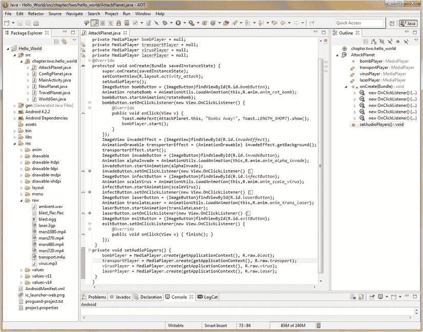

第十四章

在 Android 中播放音频:MediaPlayer 类

在本章中，我们将采用在前一章中优化的数字音频资产，并教您如何在 Hello _ World AttackPlanet.java 活动事件处理代码中实现这些资产以供回放。

我们将在攻击一个星球用户界面的 ImageButton 元素中添加音效,这样当用户点击这些动画按钮时，数字音频将会播放，增加了我们在之前的图形设计和动画章节中已经创建的令人印象深刻的视觉效果。

现在你知道了如何优化 Android 中的音频，我们还将使用一些来自世界知名的声音设计师和音乐作曲家弗兰克·塞拉芬的高质量音频，他是我的一个朋友，他很慷慨地给了我一些音频样本供我们在本书中使用。

这些声音效果、背景音乐和周围环境声音将允许我们极大地增强我们的其他活动屏幕，再次将我们的用户界面和用户体验带到一个全新的水平。

我们还将了解数字音频回放中的更多概念，这些概念与我们在数字视频以及帧和矢量动画章节中观察到的概念非常相似，例如无缝音频循环，在这种情况下，您无法判断背景音频循环(seam)在音频回放循环中的位置。

由于我们已经在上一章中讲述了 Android MediaPlayer 类的基本起源，我们现在将继续讲述这个高级类中可用的各种 Java 方法。我们将在本章的第一部分做这件事，然后我们将开始写一些实现这些核心 MediaPlayer 功能的代码。一旦我们做到这一点，我们将能够给我们的一些用户界面元素和我们的活动屏幕一些非常酷的数字音频功能，这要感谢 Serafine 先生。

Android 媒体播放器:方法和状态引擎

在 Android 中，MediaPlayer 类可以被称为**状态机**，也就是说，一个数字文件回放实体，它在任何给定时间都具有某些**状态**。我已经大方地在本节中包含了来自`developer.android.com`网站的**状态机图**(参见[图 14-1](#Fig1) )，以便您可以在此处参考，以及本节中详细讨论它的文本。您可以在开发者网站上找到它:

```java
http://developer.android.com/reference/android/media/MediaPlayer.html
```


[图 14-1。](#_Fig1)MediaPlayer 状态机示意图(来自【developer.android.com】的[的 MediaPlayer 类页面](http://developer.android.com))[T5】1T7】](#Fn1)

当我们回顾我们的 Java 编程原则时，我们在本书最早的一章中学习了**状态**。您的 Android MediaPlayer 将始终处于以下状态之一:**空闲**、**初始化**(加载您的音频或视频数据)、**准备**、**准备**、**开始**(播放)、**暂停**、**完成**(播放已完成)、以及**停止**。

还有**结束**和**错误** MediaPlayer 状态。让我们先覆盖这两个特殊的状态，并把它们去掉。一旦 MediaPlayer 对象从最初需要使用它的内存中释放出来，就会发生 End，而 Error 则用于媒体播放过程出错时。

当 Java 方法**出现时，MediaPlayer 结束状态出现。释放()**被称为。因此，如果我们的 MediaPlayer 对象被命名为 **bombPlayer** ，在本章的下一节中，我们的 bombButton ImageButton 对象也将被命名为，您可以使用以下代码语句从内存中释放 MediaPlayer:

```java
bombPlayer.release( );
```

这将从主内存中清除名为 bombPlayer 的 MediaPlayer 对象,以便该内存可用于其他目的。

当 **OnErrorListener** 接口**时，出现 MediaPlayer **错误**状态。onError( )** 方法通过下面的 Java 回调构造**公共抽象布尔 onError (MediaPlayer mp，int what，int extra)** 调用

.

**mp** 参数包含 MediaPlayer 对象的**名称**，例如 bombPlayer， **what** 参数包含**类型的错误常数**，而 **extra** 参数包含**错误特定代码常数**。

哪些常量包括 MEDIA_ERROR_UNKNOWN 和 MEDIA_ERROR_SERVER_DIED，而额外的常量可以包括 MEDIA_ERROR_IO、MEDIA_ERROR_MALFORMED、MEDIA_ERROR_TIMED_OUT 和 MEDIA_ERROR_UNSUPPORTED。

关于 **OnErrorListener** 公共静态接口的信息位于:

```java
developer.android.com/reference/android/media/MediaPlayer.OnErrorListener.html
```

现在让我们从 MediaPlayer 状态引擎图的顶部开始，如图[14-1](#Fig1)所示，一次一个状态地沿着状态树逻辑图向下，从**空闲**状态和它的 **reset( )** Java 方法开始。

如果你用**。reset( )** 方法通过一个**bombplayer . reset()；**代码行，MediaPlayer 对象重置自身(模拟其初始启动)并进入空闲状态或模式。空闲后的下一个模式是**初始化的**状态或模式；这是通过使用**实现的。setDataSource( )** 方法来设置数据源引用到您想要使用的媒体文件。

对于 **/res/raw** 文件夹中的数据资源，应该使用**。onCreate( )** 方法(我们将在下一节中实现)，并使用格式为 **R.raw.filename** 的第二个参数指定数据文件资源路径。

**准备**状态是从外部服务器访问数据文件时使用的，与外部服务器 URL 结合使用，由熟悉的 **Uri.parse( )** 方法解析。尽管我们在应用中使用了内部媒体数据资产，但我将在这里向您展示这样做的代码，以完成我对这个 MediaPlayer 状态图的介绍。

你会用一个**。setOnPreparedListener( )** 调用 **new OnPreparedListener()，**的 Java 代码块使用 **onPrepared( )** 方法，如下所示:

```java
MediaPlayer mp = MediaPlayer.create(this,Uri.parse("http://www.url.com/file.mp3"));
     player.setOnPreparedListener(new OnPreparedListener() {
          @Override
          public void onPrepared(MediaPlayer mp) {
               mp.start();
          }
     });
```

一旦媒体播放器达到**准备好的**状态，通过使用**。onCreate( )** 方法或类似于上面指定的代码块，你可以接着调用**。start( )** 方法将 MediaPlayer 状态设置为 **Started** 状态(或者 mode，如果您更愿意以模态的方式来看的话)。

请注意，这些状态类似于我们在本书前面讨论的模式，除了我们讨论的模式，在使用 GIMP 2 时需要同时考虑多个数字成像模式。

图中的下一层是**暂停**和**停止**状态，这取决于**是否。pause( )** 方法是否被调用或者**。调用 stop( )** 方法。正如你在状态图中看到的，一旦 MediaPlayer 对象被**暂停**，你就可以使用**。start( )** 方法重新开始你的媒体播放。

当您的媒体文件完成播放时，将达到(或设置)播放完成状态。如果**循环**标志被设置为**假**(其默认值)，那么 **OnCompletionListener** 将调用 **onCompletion( )** 方法(如果您在其中定义了代码)，然后这些任务将被执行。

注意，一旦你的 MediaPlayer 达到**初始化**或**停止**状态，那一个**。prepareAsync( )** 方法可用于将您的 MediaPlayer 对象置于**准备**状态。

这种准备状态通常发生在从远程位置获取(传输)媒体数据文件时，通常是某种媒体服务器，如亚马逊 S3 或 Akamai 或您自己的自定义数据服务器。

请注意，如果您打算将应用功能集中在 MediaPlayer 类上，而不仅仅是使用它来播放音频或视频资源，那么您应该查看本节开头提到的 MediaPlayer 开发人员页面。

使用 MediaPlayer 类来创建您自己的高级媒体播放器超出了像本书这样的 Android 入门书籍的范围，因为 Android 中的 Media Player 功能非常复杂，足以编写一本关于它的书籍。

Android 中还有另一个**数字音频排序** 类，称为 **SoundPool** 类，如果你的应用使用大量声音，并且这些声音需要实时混合和匹配，就像你在游戏或动画电子书或类似的强大新媒体应用中所做的那样，它实际上可能更适合使用。

这个 Android SoundPool 类将在下一章中介绍，所以请放心，您将在本书的这一部分中接触到 Android 中的关键、主要数字音频类和工作流程。

设置 MediaPlayer 对象并加载数字音频数据

在实现我们的 MediaPlayer 对象时，我们需要做的第一件事是在 AttackPlanet.java 活动子类的顶部声明它，在一行代码中将它声明为一个**私有**访问对象，并通过下面的代码将其设置为一个**空值**(直到我们稍后使用它):

```java
private MediaPlayer bombPlayer = null;
```

您会注意到 Eclipse ADT red 在 MediaPlayer 下面用波浪线给代码加下划线。这是因为我们还没有在代码顶部导入它的库。将鼠标放在红色波浪下划线上，选择**Import Android . media . media player**包引用链接，让 Eclipse 为我们编写这段代码。

这个导入语句和 MediaPlayer 对象声明可以在图 14-2 中看到。


[图 14-2。](#_Fig2)声明一个名为 bombPlayer 的 MediaPlayer 对象，并将其值设置为空

接下来，我们需要编写一个方法来设置我们的 MediaPlayer 对象，以便在我们的攻击星球用户界面 ImageButton 图标中使用。我们将这样做，以便在单击每个按钮时播放不同的声音效果。

编写我们自定义的 setAudioPlayers( ) Java 方法

让我们调用这个定制的 Java 方法**setaudiopayers()**并添加我们的第一个 bombPlayer MediaPlayer 对象，它回放我们的 **blast** 音频资产。

首先，让我们使用下面的 Java 方法调用语句，将调用我们的新方法的代码行添加到 AttackPlanet 活动的顶部，就在 setContentView()方法之后:

```java
setAudioPlayers();
```

接下来，我们需要编写 setAudioPlayers()方法本身，我们将在编辑屏幕的最底部完成，就在所有其他 ImageView、ImageButton、Animation 和 AnimationDrawawble 对象代码之后。

我们将 setAudioPlayers()方法声明为 **private** ，因为它仅由该类用来为我们的数字音频样本设置所有 MediaPlayer 对象，并且声明为 **void** ，因为它在被调用时不返回任何值。

在两个花括号内，我们使用**添加了 MediaPlayer 对象创建代码。MediaPlayer 类的 create( )** 方法。此方法需要当前上下文，可以写成如下形式:

```java
AttackPlanet.this
```

或者，您也可以利用 **getApplicationContext( )** 方法，我们将在这里实现它，这样您也可以看到这个方法的使用。所需的第二个参数。create()方法是资产文件引用，我们知道它是 **R.raw.blast** ，因此我们创建 bombPlayer MediaPlayer 对象并加载数字音频数据的代码行应该编写如下:

```java
bombPlayer = MediaPlayer.create(getApplicationContext( ), R.raw.blast);
```

当我们添加其他音效数字音频资产时，我们在这个方法中为每个资产添加类似的代码行。这样，当我们的 Activity 启动时调用这个方法，MediaPlayer 对象将被预先创建，并准备好供使用。

然后，在我们单独的 UI 按钮代码中，我们所要做的就是在最终用户点击相应的按钮时，从我们的事件处理代码中调用每个 MediaPlayer 对象(数字音频样本)。新的方法调用和方法体及其第一个 MediaPlayer 对象已经编码，如图[图 14-3](#Fig3) 所示。


[图 14-3。](#_Fig3)创建一个 setAudioPlayers()方法来设置和创建用于声音效果的 MediaPlayer 对象

接下来，我们将添加启动 MediaPlayer 对象所需的编程逻辑。该 Java 代码存在于每个 ImageButton 对象的每个 onClick()事件处理程序例程中。接下来，让我们为 bombButton ImageButton 对象编写代码，这样您就可以知道它的基本格式是如何编码的，以及使用什么方法。

使用我们的媒体播放器对象:使用。start()方法

在 Eclipse 中点击 **+图标**(在左边，bombButton 对象的旁边)并展开该 Java 代码块(如果它还没有展开以供查看)。在这个代码块中，您有 onClick()事件处理方法，它包含您的 Toast 对象，很快我们将添加当按钮被单击时触发音频示例的代码。

在你的 Toast.makeText()方法调用的下面添加一行代码(如果你愿意，也可以在它的上面)，引用我们在 setAudioPlayers()方法中创建的 bombPlayer MediaPlayer 对象，它显示在图 14-4 的最底部。使用 Java 点标记法将。start()方法调用 bombPlayer MediaPlayer 对象，方法是使用下面一行 Java 代码:

```java
bombPlayer.start();
```


[图 14-4。](#_Fig4)添加 bombPlayer MediaPlayer 对象 start()方法调用 bombButton onClick()事件处理方法

这个**开始**，或者更准确的说，**播放**，你的**爆破**数字音频样本，在你的**中引用。在 **setAudioPlayers( )** 方法中调用 create( )** 方法。

现在我们已经创建了 MediaPlayer 对象，它包含了我们的 blast 数字音频示例，我们已经将它连接到音频数据文件，该文件在上一章中放在 Hello_World 项目的/res/raw 文件夹中，最后在我们的 onClick()事件处理方法中触发音频示例以播放我们想要播放的音频音效的炸弹按钮。

我们已经导入了 Android MediaPlayer 库和类，编写了一个自定义的 setaudiopayers()Java 方法，将 MediaPlayer 对象连接到我们的数字音频示例，并使用了六行 Java 代码触发它进行回放。

现在，我们要为其他三个声音效果做的就是将它们添加到我们的 setAudioPlayers()方法中，然后在我们的 onClick()处理程序方法中使用 start()方法，在我们的每个 UI 按钮被单击时开始音频播放。

编码其他特效音频媒体播放器对象

复制**private media player bombPlayer = null；位于 AttackPlanet 类顶部的一行代码，将它粘贴到自己下面三次。将您的 MediaPlayer 对象名称从 bombPlayer 分别更改为 **transportPlayer** 、 **virusPlayer** 和 **laserPlayer** ，如图 14-5 顶部所示。**



[图 14-5。](#_Fig5)完成我们的 setAudioPlayers()方法并声明我们的其他音效 MediaPlayer 对象

接下来，从您的 **setAudioPlayers( )** 方法的第一行复制 **bombPlayer** 对象和 **MediaPlayer.create( )** 方法调用，然后再将它粘贴到自身下面三次。再次将对象名称从 bombPlayer 分别更改为 transportPlayer、virusPlayer 和 laserPlayer。

现在我们准备添加一个 MediaPlayer 对象**。start( )** 方法在每个 ImageButton onClick()事件处理代码块中调用，如图[图 14-6](#Fig6) 所示。


[图 14-6。](#_Fig6)添加 MediaPlayer。start()方法调用我们的其他三个 ImageButton UI 元素

接下来，我们需要看看如何将无缝循环音频添加到我们的主屏幕 MainActivity.java 活动子类中。在这种情况下，我们可以简单地编写一个 setStartUpScreenAudio()方法来完成活动启动时的所有工作，比如声明一个对象、设置循环参数和启动。

循环播放我们主要活动的背景环境音频

在 MainActivity 类的顶部添加一行代码，在 **onCreate( )** 方法中，这样您的音频 MediaPlayer 对象就与您的 World 对象值、屏幕文本和屏幕动画一起初始化了。

让我们调用我们的新方法 **setStartUpScreenAudio( )** ，注意当您键入 setStartUpScreenAudio()时；Eclipse 用红色波浪线给它加下划线的代码行。将鼠标放在红色下划线的文本上，Eclipse 助手对话框就会弹出，并提供为您编写新方法的功能。选择显示的三个链接中的最后一个，创建方法 setStartUpScreenAudio()和 voila instant 方法(参见[图 14-7](#Fig7) )！


[图 14-7。](#_Fig7)为我们的 MainActivity.java 主屏幕创建 setStartUpAudio()方法来播放音频循环

接下来，我们将用三个语句填充 setStartUpScreenAudio()方法的内部。第一个将实例化、命名和。创建( )我们新的 **audioPlayer** MediaPlayer 对象，第二个将使用新对象来调用**。setLooping( )** 方法设置为 true(循环)状态，第三个方法将调用循环音频以使用。start()方法，我们也将在新的 audioPlayer 对象中调用它。这三行新的 Java 代码如下所示:

```java
MediaPlayer audioPlayer=MediaPlayer.create(getApplicationContext(), R.raw.ambient);
audioPlayer.setLooping(true);
audioPlayer.start();
```

Eclipse IDE 内部的最终代码可以在下面的[图 14-8](#Fig8) 中看到。请注意，我们将。在 media player 被实例化之后，将 Looping()方法设置为 true **的值，但是在**之前的**它是通过。开始()。**


[图 14-8。](#_Fig8)编码 audioPlayer MediaPlayer 对象和。setLooping()和。setStartUpScreenAudio()中的 start()方法

接下来，我们需要添加一个很酷的外星人的声音到我们的添加一个行星活动中，这样当用户点击火星来创建它时，就可以得到一些音频反馈。我们通过使用一个流行的开源语音合成软件包 **eSpeak** 来完成这项工作，然后将它与 Audacity 结合使用，在不到 60KB 的数据中创建一个陌生短语。

为我们的 NewPlanet.java 创建语音合成添加一个星球活动

让我们去 SourceForge 下载 eSpeak 语音合成器，或 TTS(文本到语音)技术软件。它位于以下 URL:

```java
[http://espeak.sourceforge.net/](http://espeak.sourceforge.net/)
```

一旦你下载完操作系统所需的版本，安装软件，然后启动它，这样我们就可以创建我们的外星人画外音了。

在 eSpeak 对话框的顶部中间区域，输入您想要语音合成器朗读或合成的文本。我们希望我们的外星人说“**火星创造了**”，所以在文本字段区域输入(不带引号)，如图 14-9 中用蓝色突出显示的[所示。](#Fig9)


[图 14-9。](#_Fig9)运行 eSpeak 开源应用生成外星画外音

要测试你的外星声音，使用 **Speak** 按钮，它位于 eSpeak 对话框的右上角，第二个按钮。如果您想将当前的语音合成**声音字体**更改为不同的声音，请使用文本输入区正下方的**声音**下拉菜单。您可以使用此菜单来选择和测试不同的声音字体，方法是更改声音字体，然后使用“朗读”按钮来测试每种声音字体。

同样，如果你想微调你的声音，在 eSpeak 对话框的底部中间有滑块，用于调节**语速**和**音量**(振幅)。

现在我们已经微调了所有设置，让我们生成一个数字音频数据文件。在 eSpeak 对话框的最底部，有一个下拉选择器，我们将使用它来选择我们的目标音频采样速率和目标音频采样频率。

我选择了可能的最高质量， **48kHz 16 位立体声**，这样我们就可以进入 Audacity，看看在全 16 位分辨率和 48kHz 专业级采样率下使用立体声(双声道)音频可以减少什么样的数据占用空间。

最后，我们需要点击**保存到。wav** 按钮，以 48 kHz 未压缩的 16 位 PCM 波形样本格式保存我们的 alien voiceover 音频样本。

当保存对话框出现时，导航到我们一直用于音频资源的同一个音频文件夹，并用文件名 **mars.wav** 保存文件。接下来，我们将使用我们的 Audacity 音频编辑和优化软件，将样本大小从近 300KB 降低到不到 60KB，同时仍然保持我们应用的最高质量。

使用 Audacity 2.0 优化我们的 Alien Voiceover 音频样本

现在让我们启动 Audacity，使用**文件打开**菜单序列找到并打开我们的 **mars.wav** 数字音频文件，这是我们之前使用 eSpeak 创建的。在[图 14-10](#Fig10) 中可以看到，有两个音频样本。


[图 14-10。](#_Fig10)在 Audacity 中打开我们的合成语音样本来优化 MPEG-4 AAC 数据文件

之所以有两个样本，是因为这是一个**立体声**音频样本，这意味着我们现在有**左声道**和**右声道**音频样本。

这也意味着有两倍多的音频数据，因此，如果您可以使用**单声道**样本，就像我们在音效中使用的一样，您最终将获得更紧凑的数据足迹。

让我们看看在这个外星人画外音上我们能得到什么样的数据足迹优化。正如我们在上一章中所记得的，MPEG-4 AAC 为我们提供了最佳的数据占用减少，即使当我们使用最高(500)质量设置时也是如此，所以让我们在这里使用它，看看会发生什么。

如果您在操作系统文件管理实用程序中查看我们的 mars.wav 未压缩音频示例，您会发现原始数据大小为 293，894 字节的数据，或接近 300 千字节的原始音频数据。

让我们使用 Audacity **File  Export** 菜单序列打开 **Export File** 对话框，如图[图 14-11](#Fig11) 所示，选择下拉到: **M4A AAC FFmpeg** 编解码器选择。然后点击**选项**按钮，选择最高质量级别的 **500** ，让我们看看这款 MPEG-4 编解码器在压缩专业质量 48 kHz 16 位立体声音频样本方面的效率如何。


[图 14-11。](#_Fig11)导出我们的 MPEG-4 AAC mars.m4a 音频数据文件，最高质量设置为 500(59KB)

再次进入文件管理实用程序，查看我们刚刚保存的 mars.m4a 文件。文件大小为 60，638 字节，即 59.2 千字节。这意味着数据占用空间减少了 80%,而质量没有任何损失，这是一个了不起的成绩。

如果你想知道我是怎么算出来的，用 60，638 除以 293，894，你会得到 0.206326，这意味着 60，638 大约是 293，894 的 20%。100%减去 20%会使该音频文件的数据占用空间减少 80%。

我们需要做的下一件事是将这个新的 **mars.m4a** 音频资产实现到我们的 NewPlanet.java 活动子类的 Java 代码中。

启动 Eclipse，如果它还没有打开的话，在中央编辑窗格中打开 NewPlanet.java 选项卡。在 Activity 类的顶部，添加一行代码，将 MediaPlayer 对象声明为 **private** ，还将其命名为 **marsPlayer** ，并将其设置为 **null** 。该行代码应该如下所示:

```java
private MediaPlayer marsPlayer = null;
```

接下来，我们需要在 Activity 类的 **onCreate( )** 方法中创建 MediaPlayer，以便为 marsPlayer MediaPlayer 对象创建 MediaPlayer 功能。那行代码看起来像这样:

```java
marsPlayer = MediaPlayer.create(this, R.raw.mars);
```

请注意，在本例中，我使用了 **this** 来引用当前上下文，只是为了向您展示引用上下文的两种方式，要么使用关键字 **this** ，要么使用 **getApplicationContext( )** 方法。


图 14-12。在 onClick() 中创建 Java 代码来实现我们的合成语音说出“行星火星已创建”

接下来，我们将进入 marsImage ImageView 对象的 onClick()事件处理方法，并添加启动 marsPlayer MediaPlayer 对象的代码行。这一行 Java 代码将如下所示:

```java
marsPlayer.start();
```

现在我们应该准备好使用**作为 Android 应用运行**工作流程，并在 Android Nexus S 模拟器中测试我们在本章中已经完成的所有音频工作。

模拟器启动后，您应该可以在主屏幕上听到环境背景音频循环。接下来，单击模拟器上的菜单按钮，进入“攻击一个星球”活动，单击每个 ImageButton 图标按钮，聆听每个按钮触发的酷炫音效。

退出攻击行星屏幕，返回主屏幕，再次使用模拟器中的菜单按钮，转到添加新行星活动，并单击行星火星，听我们的外星人画外音说“行星火星已创建”，正如您所见，我们所有的音频资产都已实现！

为我们的“配置一个星球”活动创建按钮点击音频特效

接下来让我们添加一个用户界面按钮反馈音效；因此，在本章中，你会有实现所有不同类型音频的经验，因为所有不同的原因，你会在你的用户界面设计或用户体验设计中使用音频，用于你的 Hello World Android 应用开发或任何其他应用。

让我们首先声明一个**私有** MediaPlayer 对象，将其命名为 **clickPlayer** ，并暂时将其设置为一个 **null** 值，使用下面一行 Java 代码:

```java
private MediaPlayer clickPlayer = null;
```

接下来，我们需要使用。使用我们的上下文和数据资源引用创建( )方法，如下所示:

```java
clickPlayer = MediaPlayer.create(getApplicationContext(), R.raw.click);
```

正如您在[图 14-13](#Fig13) 中看到的，我们在 ConfigPlanet 活动的最顶端(第一行)创建了 clickPlayer MediaPlayer 对象，并使用。在我们使用 setContentView( )方法设置活动内容视图之后，立即创建()方法。


[图 14-13。](#_Fig13)将 clickPlayer MediaPlayer 对象添加到我们的 ConfigPlanet.java 活动并调用。创造()

接下来，我们需要使用下面一行 Java 代码，在每个用户界面按钮对象 onClick()事件处理方法代码块中添加启动 MediaPlayer 对象的代码:

```java
clickPlayer.start();
```

我们需要为所有七个按钮对象添加这一行 Java 代码，如图 14-14 所示。一旦我们完成了这些，我们就可以在 Nexus S 模拟器中测试我们的 Hello_World Android 应用，然后我们将完成在每个主要活动中实现音频。


[图 14-14。](#_Fig14)向按钮 UI 元素 onClick()事件处理方法中添加 clickPlayer.start()方法

这种代码设置比我们在本章中介绍的其他代码设置更加优化，因为我们只需创建一个对象并初始化它，但是我们的七个用户界面元素可以通过事件处理方法中的一小段 Java 代码来利用对象和 MediaPlayer 功能。

使用 **Run As Android Application** 工作流程启动您的 Android ADT Nexus S 模拟器，然后单击菜单按钮，选择您的 Configure a Planet 菜单选项，并单击每个用户界面按钮以确保它们正常工作。

摘要

在这一章中，我们仔细研究了 Android MediaPlayer 类，它可以用来回放音频样本，为我们的用户界面按钮实现声音效果，以及播放循环环境背景音频或循环背景音乐。

我们仔细查看了 Android 开发人员网站上的 MediaPlayer **状态引擎图**，我们从上到下、一个状态一个状态、一种方法一种方法地浏览了一遍，以便更好地了解 MediaPlayer 的确切功能。

我们了解到，在**初始化**之前，MediaPlayer 处于**空闲状态**，需要通过使用**让**准备好**。prepareAsync( )** (流)或**。create( )** 方法(受控)，在从远程服务器流式传输期间，它将处于**准备**状态，并且一旦准备好，它可以处于**开始**、**停止、**或**暂停**状态。

我们看了一下实现了哪些**方法**、**接口、**和**回调**来控制 MediaPlayer 的各种状态，或者播放/res/raw 文件夹中的强制音频数据文件，或者将音频从某种远程音频媒体服务器流式传输到您的应用中。

然后，我们为我们的 Attack a Planet Activity 子类编写了一个名为 **setAudioPlayers( )** 的自定义方法，这样我们就可以为我们的用户界面按钮实现几个短脉冲音频音效。我们这样做是为了当我们的用户点击一个动画按钮时，会有一个动画对象实际声音的音频表示。

然后，我们编写了一个名为 **setStartUpScreenAudio( )** 的自定义方法，用于我们的主活动主屏幕，并设置了**。将 Looping( )** 方法设置为 **true** ，这样我们就可以循环播放环境空间背景音频以获得特殊的音频效果。

接下来，我们利用一个名为 **eSpeak** 的开源 TTS 技术语音合成器软件包，为我们的“添加行星活动”子类中的 NewPlanet.java 行星火星创建任务创建一个外星人语音。

然后，我们学习了如何使用 eSpeak 来合成和微调我们的外星人声音样本，然后我们优化了使用 Audacity 创建的音频数据。最后，我们在 Add a Planet 活动中编写了实现这个很酷的外星人画外音所需的 Java 代码。

最后，我们在 Configure a Planet Activity 用户界面中添加了一个点击按钮声音效果，以便在用户点击数据输入按钮时提供音频反馈。在这个例子中，我们利用一个 MediaPlayer 对象为七个用户界面元素提供数字音频效果。

因此，我们在 Hello World Android 应用中添加了音效、点击、背景环境音频和合成外星人画外音。我认为这很好地涵盖了数字音频的使用范围。

在下一章，我们将看看一个更高级的音频播放类，叫做 **SoundPool** ，它可以被用作**音频序列器**。音频排序和实时混合相当于我们在本书前面的数字成像、位图(基于帧)和程序矢量动画以及数字视频章节中了解的合成。

Android SoundPool 可以实时存储、触发和混合大量的音频样本(不尽然，因为音频并不太重)。这个音频类用于更高级的应用，例如游戏。它还可以用于其他高级音频应用，这些应用可能需要对大量样本进行更精细的管理，而不必为每个样本创建一个 Android MediaPlayer 对象，正如我们所看到的，如果有大量数字音频样本，这可能会变得难以处理。

[<sup>1</sup>](#_Fn1) 本页部分内容转载自 Android 开源项目创建和共享的作品，并根据知识共享 2.5 归属许可中描述的条款使用。

```java
http://developer.android.com/reference/android/media/MediaPlayer.html
```