# 十五、音频排序：Android `SoundPool`类

在本章中，我们将了解 Android 中一个更专业的音频播放类，名为: **SoundPool** 。这个类明显不同于 Android MediaPlayer 类，以至于我决定在本书中专门辟出一章来介绍这个有用的音频类。

本章深入探讨了 Android SoundPool，并定义了它与 MediaPlayer 的不同之处，以及在什么类型的情况下，这些类中的每一个都应该用于数字音频素材播放。

简而言之，SoundPool 的特别之处在于它允许图像合成的音频等价物(分层和混合)。这意味着，像图像合成一样，与音频相关的新媒体素材可以被分解成它们的组成部分并单独控制。

使用 SoundPool，这些组件可以附加到 Java 代码上，甚至可以用 Java 代码进行操作。这使得开发人员可以将这些富媒体数字素材组件作为一个完整的作品呈现给用户，而实际上它们是由您的应用无缝合成的(或者用流行的音频术语来说:混音、移调和排序)。

这使得 Android 开发人员能够将交互性注入到他们的新媒体素材中，而在过去，传统媒体素材(如音乐、电影或电视)只是一个漫长的线性表演；可重复但总是相同的，因此最终用户会厌倦他们的用户体验。

在本章中，我们将首先介绍**音频合成**和**序列**的基本原理，然后我们将回顾 SoundPool 类及其功能，就像我们在前一章中对 MediaPlayer 类所做的那样。然后，我们将在 Hello_World 应用中实现 SoundPool 类，看看它如何让我们的声音播放得更快，并让我们能够灵活地组合它们并改变它们的声音方式。

MIDI 和音频序列:概念和原理

音频序列的最早形式利用了 MIDI，我们在前一章中了解到它代表乐器数字接口，允许通过计算机记录和回放演奏数据。

实现这一功能的早期计算机是 Amiga、Atari ST-1040 和 Apple Macintosh，它们运行的软件包名为 **MIDI sequencers** ，来自 Opcode (Vision)、Steinberg (CuBase)、Cakewalk (Sonar)、Mark of the Unicorn (Performer)、PropellerHead (Reason)和 eMagic (Logic)等软件公司。

这些 MIDI 音序器软件包中的大部分仍然存在(有几个也被其他公司收购了),并且直到今天仍然非常受全球数字音乐人的欢迎。

MIDI 音序器允许**演奏数据排序**，其中一名作曲家可以使用合成器将每个乐器部分播放到计算机中，合成器设置为给定的乐器样本，比如吉他或钢琴样本，然后计算机会在作曲家为其演奏的计算机回放版本伴奏时回放这些演奏数据。

当电脑**播放出**到目前为止创作的作曲**曲目**时，作曲家**会在**中演奏下一个**声部**或曲目，使用该歌曲、乐谱或叮当声安排中需要的下一种乐器。

最终，随着计算机处理能力的提高以及专用数字音频适配器(如 Creative Labs 的 SoundBlaster 和 X-Fi)以可承受的价格广泛上市，MIDI 音序器增加了数字音频功能和 MIDI 回放功能。

事实证明，**音频序列**的概念同样适用于由计算机直接处理的数字音频样本，就像它适用于 MIDI 演奏数据序列一样。随着电脑变得更加强大，更多的数字音频可以被采样和回放，尽管不像 MIDI 那么容易，因为 MIDI 只是演奏数据(音符开，音符关)。

计算机的功能越来越强大，内存越来越大，可以容纳更多的样本(SoundPool 的一个问题，我们很快就会看到)，增加了更多的处理器(64 位多核处理器现在允许每个处理器有 4/6/8/16 个 CPU 内核)和更快的处理速度，64 位音频适配器和多核 DSP(数字信号处理器)功能现在都可以买到，而且价格合理。

由于这个原因，音频序列器现在允许的选项比 20 世纪 80 年代早期的 MIDI 序列器多一千倍，尽管它们仍然支持 MIDI 演奏数据，并与音频采样数据一起播放。这是因为 MIDI 非常高效，如果作曲家喜欢这样工作，它允许使用合成器键盘回放样本。音频音序器增加了通常只有合成器才有的过多功能；接下来我们将讨论这些特性、术语和概念。

数字音频合成:基本概念和原理

最初的一些 MIDI 键盘实际上只是数字音频采样器，它使用各种采样速率和采样频率来录制和回放数字音频样本。我们在本书的前几章中学习了样本，因此我们在这里要关注的是如何通过这些样本的进一步**音频合成**,甚至只是原始波形，如正弦波或锯齿波，将这些样本带到下一个层次。

合成器接收波形音频，无论是消费电子设备中电路板上的**振荡器**产生的波形，还是更复杂的采样波形，例如弹拨乐器弦的样本，然后对该波形进行进一步的波形处理，以创建新的不同音调、声音甚至特殊效果。我们都熟悉当今流行音乐中新的合成乐器声音；所有这些都是用数学和代码完成的！

可以应用于数字音频领域内音频波形的核心数学操作之一是称为**音高移动**的，它可以将声音或音调向上或向下移动一个**八度音程**(或一个八度音程的一小部分，称为**音高**或**键**)，为我们提供该样本的一个**范围**，就像我们在合成器键盘的按键上上下弹奏一样。

正如我们之前所了解的，波形的**音调**可以由该波形本身的**频率**来确定，因此，通过将波长减半，或者通过将波长加倍，将音调(波)精确地上移一个八度，这就变成了一个相当简单的数学计算。其中的任何部分都会改变音高，这就是我们如何使用单个采样波形在键盘上获得不同的音符。数字音频合成是相当惊人的东西！

SoundPool 可以做到这一点(这就是为什么我们首先在这里学习这些概念),所以它确实有一些音频合成功能，可能会在未来的 Android 操作系统版本中添加更多功能。你需要知道这些概念，以有效和优化地利用它的功能，这就是为什么我们在这里详细讨论所有这些，这样如果你需要使用 SoundPool，你就知道如何正确地使用它，以及为什么你首先需要这样做。

另一个核心的音频合成数学操作是将两个波形的**组合** ( **合成**)在一起，即从单个**振荡器**硬件(扬声器)场景中同时播放两个声音。与数字成像或视频合成一样，这里我们将两个不同的样本数据值相加，以获得最终的听觉效果。

今天的音频硬件确实有相当令人印象深刻的多声道支持，并且可能有能力播放**立体声**(两个声道)或 **四声道**(四个声道)单个声音(效果、音乐、音轨等)。)直接从消费电子设备内部的音频硬件中分离出来。

如果我们想要像音序器一样实时组合 8 或 16 个轨道的数字音频，会怎么样？这就是 SoundPool 可以在您的应用中为您提供数字音频排序功能的地方。

重要的是，如果你打算尝试 8 到 16 个音频样本的实时音频合成，这些样本中的每一个都是非常好的优化。这使得我们在第 13 章中学到的关于数字音频数据优化的知识在使用 Android SoundPool 时变得极其重要。所以你看，我的疯狂是有方法的！

例如，如果您并不真的需要 HD (24 位采样分辨率)音频来获得 CD (16 位)音频的质量效果，那么您可以节省大量内存，同时获得相同的最终效果。

同样，如果您可以使用 32 kHz 采样速率而不是 48 kHz 采样速率获得相同的音频质量，那么您可以少使用 50%的样本(内存)来实现这一点。对于画外音或声音效果，内存节省是显而易见的，因为通常您可以通过使用 8 位分辨率和 11 kHz 采样率来有效地对炸弹或激光爆炸进行采样，而您将无法检测到 16 位 48 kHz 声音效果的任何差异，但您将使用 8.7 倍的内存(16 乘以 48 除以 8 乘以 11)。

就像数字成像和数字视频播放一样，优化您的数字音频素材非常重要，这有两个完全不同但相关的原因。对于数字音频样本，尤其是在使用 Android SoundPool 的情况下，一旦样本被编解码器解压缩，并以原始的未压缩状态放入 Android 设备的内存中，就需要系统内存来容纳每个样本。

优化音频之所以重要的第二个原因是等式的处理部分。很明显，处理的音频越少，即使只是将音频发送到音频硬件，使用的 CPU 周期也就越少。因此，如果您可以使用更低的采样分辨率(每个音频片段更少的位)或更低的采样频率(每秒更少的波形片段)获得相同的基本音频质量结果，您将节省系统内存资源和 CPU 处理周期资源。

对于 SoundPool 而言，这变得越来越重要，因为您的应用中需要使用的数字音频样本的数量在增加。这同样适用于系统内存和系统处理周期的使用情况，因为随着样本的增加，这两种资源的利用率会越来越高，而且不要忘记您的应用还在做其他事情，例如用户界面渲染、成像、视频，甚至可能还有 3D。

高度优化的数字音频样本在使用 SoundPool 类时如此重要的另一个原因是，目前在使用 SoundPool 时，数字音频样本数据有一个**一兆字节**的限制。虽然这个限制可能会在这个音频类的未来 Android API 版本中增加，但它仍然是有效和高效地优化任何数字音频素材的最佳实践。

SoundPool 介绍:类规则和方法

Android SoundPool 类是 **java.lang.Object** 类的直接子类，而不是 MediaPlayer 类的子类。

与 MediaPlayer 类一样，它也是 **android.media** 包的一部分，因此该类的完整路径(在导入语句中使用)应该是: **android.media.SoundPool** 。

因为 SoundPool 是 java.lang.Object 的子类，所以我们可以推断它是自己的临时代码创建的。还需要注意的是，如果需要，可以同时使用 SoundPool 对象(即 SoundPool 类)和 MediaPlayer 对象(即 MediaPlayer 类)。

事实上，这两种音频播放类有不同的应用。MediaPlayer 最适合用于**长格式**的音频和视频数据，如歌曲、专辑或电影。SoundPool 最适合用于大量的**短格式**音频片段，尤其是当它们需要快速连续播放和(或)组合时，比如在游戏或游戏化应用中。

样本的 SoundPool 集合可以从两个位置之一加载到内存中。第一个也是最常见的是来自。APK 文件，我称之为受控新媒体素材，在这种情况下，它们将位于您的/res/raw 项目文件夹中。第二个可以加载样本的地方是 SD 卡或类似的静态内存存储位置(人们称之为 Android OS 文件系统)。

SoundPool 内部使用 Android MediaPlayer 服务将音频素材解码到内存中。它使用未压缩的 16 位 PCM 单声道或立体声音频流来实现这一点。出于这个原因，请确保使用 16 位采样分辨率来优化您的音频，因为，如果您使用 8 位，而 Android 将其上采样到 16 位，您最终会浪费空间。所以好好优化你的采样频率，不到万不得已不要用立体声采样。让您的工作流程符合 SoundPool 的工作方式，以在最大数量的 Android 消费电子设备上获得最佳结果，这一点非常重要。

当 SoundPool 对象用 Java 构建时，正如我们将在本章后面所做的，开发人员可以设置一个 **maxStreams** 整数参数。此参数确定可以同时合成或渲染多少音频流。使用数字图像合成类比，这将等同于数字图像合成中允许的图像层的数量。

将这个最大流数参数设置为尽可能小的值是一个很好的标准做法。这是因为这样做将有助于最大限度地减少用于处理音频的 CPU 周期，从而降低 SoundPool 音频混合影响应用性能的其他方面(如 3D、图像视觉或 UI 性能)的可能性。

SoundPool 引擎跟踪活动流的数量，以确保它不超过 maxStreams 设置。如果超过了音频流的最大数量，SoundPool 将中止先前播放的音频流。它主要基于您可以为每个音频样本设置的样本优先级值。

如果 SoundPool 找到两个或更多具有相同优先级值的音频样本，它将根据样本年龄决定停止播放哪个样本，这意味着播放时间最长的样本将被删除。我喜欢称之为洛根运行原则。

优先级值从低到高进行评估。这意味着较高(较大)的数字代表较高的优先级。当调用 SoundPool **时，评估优先级。play( )** 方法导致活动流的数量超过创建 SoundPool 对象时设置的 **maxStreams** 参数所确定的值。

在这种情况下，SoundPool **流分配器**停止最低优先级的音频流。正如我提到的，如果有多个流具有相同的低优先级，SoundPool 会选择最早的流停止。在新流的优先级低于所有活动流的情况下，新声音**将不会播放**，play()函数将返回为零的 **streamID** ，因此请确保您的应用 Java 代码始终准确跟踪您的音频样本优先级设置。

通过设置任何非零循环值，样本在 SoundPool 中循环。例外情况是， **-1** 的值会导致样本永远循环，在这种情况下，您的应用代码必须调用 SoundPool。stop()方法来停止循环样本。因此，非零整数值会导致样本重复指定的次数，因此值 7 会导致样本总共回放 8 次，因为计算机开始使用数字 0 而不是 1 来计数。

每个样本回放速率可以通过 SoundPool 来改变，正如前面提到的，sound pool 将这个类变成了一个音频合成工具。因此，等于 **1.0** 的样本回放速率会导致您的样本以原始频率水平播放(如有必要，会重新采样以匹配硬件输出频率)。

样本回放速率为 **2.0** 会导致样本以其原始频率的两倍播放，如果是乐器音符，听起来会高出一个全八度。类似地，将样本回放速率设置为 **0.5** 会导致 SoundPool 以其原始频率的一半播放该样本，听起来好像低了整整一个八度。

SoundPool 的样本回放速率范围目前被限制在 0.5 到 2.0，但这可以在未来的 API 版本中升级到 0.25 到 4，这将为开发人员提供四个八度的样本回放范围。

接下来，我们将回顾一些关于 SoundPool 使用的注意事项，或者更确切地说，如何使用 SoundPool**而不是**，然后我们将深入一些相当健壮的 Java 编码，以便我们可以在 Hello World Android 应用中实现这个 sound pool 音频引擎，在我们的 Attack a Planet Activity 子类中。

Android 数字音频合成和排序注意事项

在 Android 应用中使用 SoundPool 进行数字音频合成和排序是一个平衡的行为，无论是在您目前测试它的设备中，还是在您的应用将在其上运行的所有设备中。如果给定的硬件平台(智能手机、平板电脑、电子阅读器、iTV)无法处理播放给定的音频数据负载，那么它就无法播放。

到目前为止，我们已经了解到，数字音频合成、排序和合成在很大程度上取决于处理器的速度、可用处理器内核的数量以及可用于存储所有未压缩格式的数字音频样本的内存量。

因此，底线是，你需要非常聪明地处理 SoundPool 中的事情。不在于如何编写代码，虽然这当然很重要，但也在于如何设置音频样本，以便它们使用更少的内存，并可以在应用中进一步利用。

Android 开发者在 SoundPool 方面犯的主要错误是试图将其更多地用作音频音序器，而不是音频合成器。

用户关注 SoundPool 加载多个音频文件波形的能力，但没有利用其通过使用 SoundPool 音高移位功能创建无数新波形的能力。

如果您将 SoundPool 用作音频音序器，系统内存可能会过载，这可能会关闭 SoundPool 的功能。因此，Android 开发人员必须以最佳方式利用 SoundPool 功能，并优化他们的样本。

这里有一个很好的例子。SoundPool 允许在两个完整的八度音程之间进行音高变换，从设置 **0.5** (向下一个完整的八度音程，或原始样本波形的一半)到设置 **2.0** (向上一个完整的八度音程，或原始波形宽度的两倍)。记住波形宽度等于频率或音高。

大多数用户甚至不使用这种音高变换功能，而是使用不同的样本来实现不同的音符，这将填满内存，结果是该应用在旧设备上的工作越来越差。

使用 SoundPool 的正确方法是获取样本，比如从吉他弹拨一根弦、从萨克斯管吹一次号、一次钢琴击键和一次鼓声，仅使用四个 16 位 32 kHz 高质量样本，您就可以制作一个包含四种基本乐器的基本合成器。

使用这个基本的合成器设置，您的用户可以上下弹奏两个完整的八度音阶。这个应用将只使用兆字节的内存来保存这些 16 位 32 kHz 的未压缩样本。如果您使用高质量麦克风进行采样，您会惊讶于如今使用 16 位 32 kHz 采样格式可以获得的高质量结果。尝试一下，看看你是否能听出 16 位 44 kHz CD 质量音频和 16 位 32 kHz 音频之间的任何真正差异。

使用 SoundPool 进行我们的攻击星球活动

在我们的 Hello_World 应用中，利用 Android SoundPool 的逻辑区域是在我们的 Attack a Planet 活动内部，因为这使用了许多音频样本，当我们的用户单击图标图像按钮时，这些样本应该会快速触发，以提供最专业的用户体验。

我们需要做的第一件事是打开 Eclipse，然后在编辑选项卡中打开我们的 AttackPlanet.java 类，这样我们就可以添加新代码了。

让我们删除在前一章中编写的声明、创建和启动 MediaPlayer 对象的代码。所以，删除类顶部声明四个特效 MediaPlayer 对象的语句，然后删除我们编写的**setaudiopayers()**方法及其方法调用，这样我们又回到了这个 Activity 类中没有音频实现的情况。

现在，我们准备添加所有新的音频处理 Java 代码，使用一个 SoundPool 类加载我们所有的音效样本，而不是使用四个 MediaPlayer 对象。由于我们需要在动画用户界面 ImageButton 元素中实现大量的声音效果，因此对于这个特定的 Activity 类来说，这样做应该更有效。

设置 sound pool:sound pool 对象

为了准备 SoundPool 音频引擎的使用，我们需要在 AttackPlanet Activity 类的顶部做的第一件事是实例化 SoundPool 对象。我们将通过类名声明它，将其命名为 **soundPoolFX** ，并使用下面的单行 Java 代码应用 **private** 访问控制:

```java
private SoundPool soundPoolFX;
```

正如你在[图 15-1](#Fig1) 中看到的，当我们在我们的类声明代码行下面写这一行代码时，Eclipse 用红色波浪线给 SoundPool 对象加下划线。

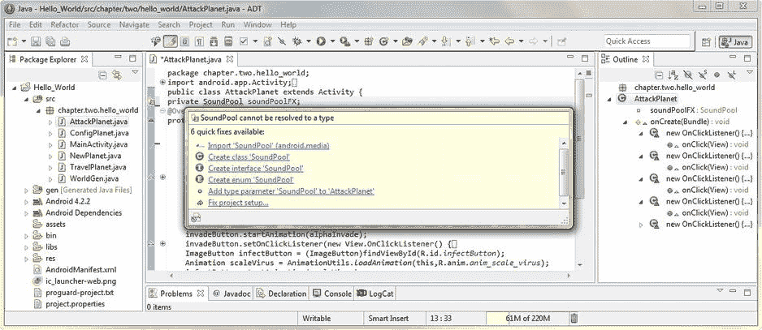

[图 15-1。](#_Fig1)声明一个名为 soundPoolFX 的私有 SoundPool 对象，并使用 Eclipse helper 添加导入 T3】

将鼠标放在这个突出显示的错误上，弹出 Eclipse ADT 助手对话框。这个对话框为我们提供了几个选项来删除代码中的这个错误标志。

选择第一个选项，**导入“sound pool”(Android . media 包)**作为您想要选择的解决方案，然后 Eclipse 为我们写入导入语句。

打开位于编辑窗格顶部的 import 语句代码块，在类声明的上方，但在包声明的下方，确保**导入 Android . media . media player；**代码语句已被删除。我们不需要显式声明(导入)MediaPlayer 类来与 SoundPool 一起使用，即使我们知道 SoundPool 引擎在幕后使用 Android 的 MediaPlayer 服务，也就是说，来播放我们的数字音频样本。

现在我们已经导入了 SoundPool 库供使用，您会注意到 Eclipse 在我们的 SoundPool 对象名 soundPoolFX 下用黄色下划线标出了一个警告。让我们把鼠标放在上面，看看 Eclipse 认为我们的代码现在有什么问题。

正如你在图 15-2 中看到的，Eclipse 弹出一个帮助对话框，告诉我们名为 **soundPoolFX** 的新 SoundPool 对象没有被使用。当然，我们知道这一点，所以我们现在不会担心这个警告界限，我们将继续声明我们的其他类和音频样本实例整数变量，我们将需要在 Java 代码中为我们的 AttackPlanet.java 活动子类实现这个新的 SoundPool 音频排序引擎。

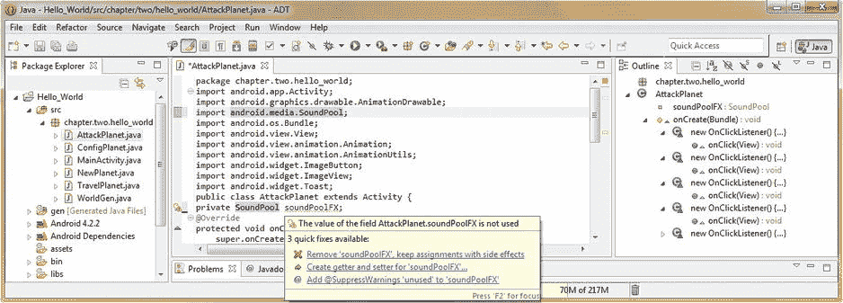

[图 15-2。](#_Fig2)检查我们的 Eclipse 警告消息并显示一条导入 android.media.SoundPool 语句

接下来，我们需要声明并实现一个名为**散列表**的 Android **实用程序类**，我们用它来保存我们的数据值对，代表我们的音频样本和它们的文件引用 URI 数据。这样做是为了让 Android 操作系统能够快速轻松地找到并预加载这些音频素材。

SoundPool 使用更复杂的数据结构来加载音频内容；这样可以在运行时快速找到并加载您的样本，因为 SoundPool 的游戏名称就是执行速度。

如果您想更详细地研究 HashMap 实用程序类，您可以在下面的 Android 开发人员网站 URL 找到专门介绍它的整个网页:

```java
http://developer.android.com/reference/java/util/HashMap.html
```

现在让我们看看如何在 SoundPool 代码中实现 HashMap。

加载 SoundPool 数据:Android HashMap 类

为了准备使用 HashMap 实用程序，我们需要在 AttackPlanet 活动的顶部做的第一件事是实例化一个 HashMap 对象。我们将通过 classname 声明它，将其命名为 **soundPoolMap** ，并使用下面一小段 Java 代码对 HashMap 应用一个**私有**访问控制:

```java
private HashMap<Integer, Integer> soundPoolMap;
```

正如你在[图 15-3](#Fig3) 中看到的，当我们在我们的类声明代码行下面写这一行代码时，Eclipse 用红色波浪线给这个 HashMap 对象加下划线。将鼠标放在突出显示的错误上，弹出 Eclipse ADT 助手对话框。这个对话框为我们提供了几个选项来删除代码中的这个错误标志。

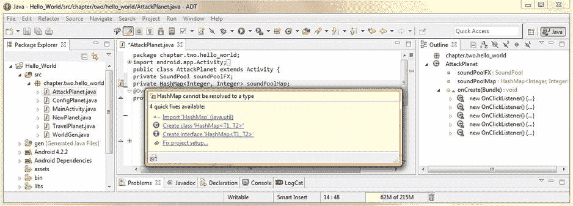

[图 15-3。](#_Fig3)声明一个名为 soundPoolMap 的私有 HashMap 对象，并使用 Eclipse helper 添加导入语句

选择第一个快速修复选项，**导入“HashMap”(Java . util 包)**，作为您想要选择的解决方案，Eclipse 继续写入我们的**导入 Java . util . HashMap；** Java 代码为我们导入语句。

接下来，我们需要通过使用以下几行 Java 代码声明四个整数变量来保存我们将在 SoundPool 中使用的样本数:

```java
int sample1 = 1;
int sample2 = 2;
int sample3 = 3;
int sample4 = 4;
```

现在我们已经在活动的顶部声明了 SoundPool 对象、HashMap 对象和样本整数，在 onCreate()方法之前，如图 15-4 所示。现在我们准备使用 new 关键字并创建一个新的 SoundPool 对象，以便在我们的活动中对音频进行排序。

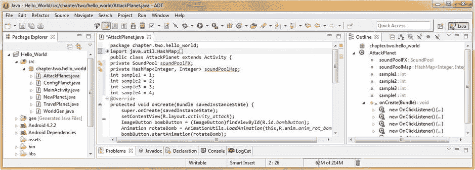

[图 15-4。](#_Fig4)声明并设置四个样本整数，并显示 import java.util.HashMap 语句

接下来我们将学习 Android **AudioManager** 类，你可能已经猜到了，它用于在你的 Android 应用中访问**音量**，以及**铃声模式**控制。AudioManager 也是 **java.lang.Object** 的子类，是 Android Media 包的一部分，其导入语句路径为**Android . Media . audio manager**，我们将在本章下一节创建新的 SoundPool 对象时看到。

AudioManager 是 Android 操作系统常量的集合，这些常量与 Android 操作系统中不同音频相关功能的状态相关。该类还包含一个名为**audio manager . onaudiofocuschangelistener**的接口，这是一个回调的 Java 接口定义，当操作系统的**音频焦点**在任何时候被更改或更新时，都会调用该回调。

如果您想更详细地研究 AudioManager 类，并亲自查看 AudioManager SCO、Vibrate 和 Bluetooth 常量中的哪些常量已被弃用，以及它们在哪个 API 级别被弃用，Android 开发者网站有一个专门针对它的网页，网址为:

```java
http://developer.android.com/reference/android/media/AudioManager.html
```

配置音池:使用 Android AudioManager

我们需要在活动的 onCreate()方法中创建 SoundPool 对象的新实例，该实例指定可以同时播放的声音数量，以及音频的类型和质量级别。这是通过 SoundPool 构造函数完成的，它采用以下格式:

```java
public SoundPool (int maxStreams, int streamType, int srcQuality);
```

因此，让我们在我们的 setContentView()方法调用后添加一行空格，并使用以下单行 Java 代码,**构造**一个**新的** SoundPool 对象，命名为 **soundPoolFX** :

```java
soundPoolFX = new SoundPool(4, AudioManager.STREAM_MUSIC, 100);
```

注意，一旦您在 Eclipse 编辑窗格中键入这一行代码，Eclipse 红色会在 AudioManager 类引用下面加下划线。因此，让我们通过将鼠标放在错误突出显示上并选择**导入“audio manager”(Android . media 包)**选项来消除这个错误，这样 Eclipse 就会为您编写所需的导入 android.media.AudioManager 语句，如图[图 15-5](#Fig5) 所示。

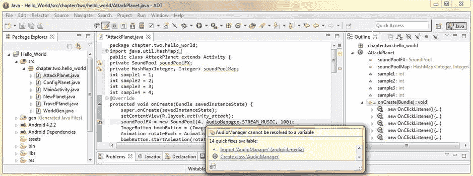

[图 15-5。](#_Fig5)配置 SoundPool 对象并使用 Eclipse 助手导入 AudioManager 包

接下来，我们需要对 HashMap 对象做同样的工作过程，并调用它的构造函数方法，使用 **new** 关键字。如果您已经忘记了什么是哈希表或哈希表，这里有一个简短的概述。

**哈希表**，也称为**哈希表**，是二维数据结构。这些专门的数据结构用于实现关联数组，这是一种可以快速将键映射到值的数据结构。哈希表利用一个**哈希函数**来计算一个**索引**到一个数据条目槽数组中，从中可以快速找到正确的值。

配置 HashMap:使用。put()方法

让我们在刚刚编写的 soundPoolFX 构造函数下添加一行空格，接下来我们将编写 soundPoolMap HashMap 构造函数 Java 代码。

创建空哈希表的构造函数代码行采用一个整数键和一个整数数据值对，编码如下:

```java
soundPoolMap = new HashMap<Integer, Integer>();
```

现在我们已经定义并创建了一个空的哈希表结构，是时候用我们将在 SoundPool 引擎中使用的音频数据加载它了。这是通过 HashMap 类**完成的。put( )** 方法，该方法允许我们将数据对放入(插入)空哈希表结构中，我们现在需要**用音频素材数据填充**，如图[图 15-6](#Fig6) 所示。

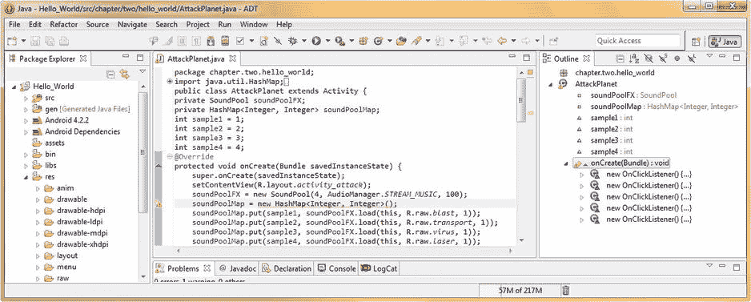

[图 15-6。](#_Fig6)使用。put()方法来填充 soundPoolMap HashMap 对象

我们将在 HashMap 构造函数下使用四行 Java 代码，这些代码将利用点符号来调用。来自 soundPoolMap HashMap 对象的 put()方法。

的。put()方法传递整数变量 sample1 到 sample4，以及。对我们的 soundPoolFX SoundPool 对象的 load()函数调用，它将传递到我们的每个数字音频素材文件的当前上下文、R.raw 参考数据路径和样本优先级值。

这四个 soundPoolMap.put()方法调用应该类似于以下四行 Java 代码:

```java
soundPoolMap.put(sample1, soundPoolFX.load(this, R.raw.blast, 1));
soundPoolMap.put(sample1, soundPoolFX.load(this, R.raw.blast, 1));
soundPoolMap.put(sample1, soundPoolFX.load(this, R.raw.blast, 1));
soundPoolMap.put(sample1, soundPoolFX.load(this, R.raw.blast, 1));
```

现在，我们已经创建了 soundPoolFX SoundPool 对象和 soundPoolMap HashMap 对象，并为四个示例中的每一个将这两个对象连接在一起，这四个示例现在已加载到 HashMap 中，并准备好供 Android SoundPool 音频引擎快速访问。

接下来，我们将编写一个方法，它将允许我们使用一个方法和两个参数来配置和播放 SoundPool 音频引擎，这两个参数指定要播放的样本和移动音高的音高移动值。

编码 playSample()方法:使用 SoundPool。play( )

接下来，我们将编写一个名为 playSample()的方法，用于控制 SoundPool 引擎的使用。此方法创建一个 manageAudio AudioManager 对象来获取 AUDIO_SERVICE 系统服务，并使用此对象从操作系统获取当前和最大音量设置，然后使用这些数据值来设置我们的音量设置。play()方法调用我们的 soundPoolFX SoundPool 对象，如图[图 15-7](#Fig7) 所示。

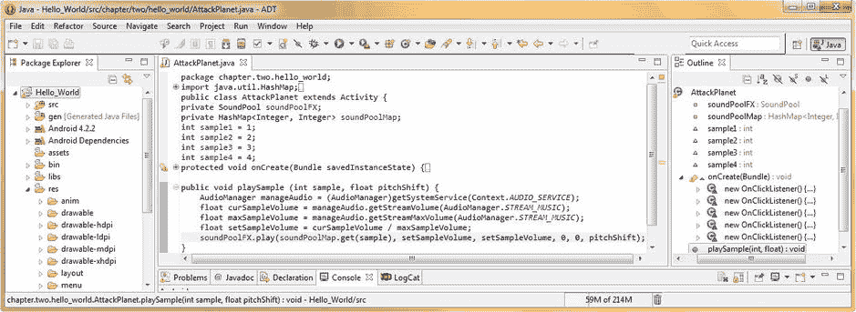

[图 15-7。](#_Fig7)编写一个 playSample()方法来设置并调用我们的 SoundPool 对象。play()方法

playSample()方法中的第一行 Java 代码创建了一个名为 **manageAudio** 的 AudioManager 对象，并将其设置为通过**上下文调用 **getSystemService( )** 方法。AUDIO_SERVICE** 常量。这是使用下面一行 Java 代码完成的:

```java
AudioManager manageAudio = (AudioManager)getSystemService(Context.AUDIO_SERVICE);
```

接下来的三行代码创建了**浮点**变量。我们将前两个浮点变量 **curSampleVolume** 和 **maxSampleVolume** 设置为当前音频流音量和最大音频流音量数据值，这是通过我们在第一行代码中创建的 manageAudio AudioManager 对象获得的。这两个浮点变量是使用以下 Java 代码设置的:

```java
float curSampleVolume = manageAudio.getStreamVolume(AudioManager.STREAM_MUSIC);
float maxSampleVolume = manageAudio.getStreamMaxVolume(AudioManager.STREAM_MUSIC);
```

然后，我们使用这两个浮点变量数据值来计算我们的第三个浮点变量数据值，使用下面的 Java 代码行，它通过将当前音量除以最大音量来计算我们需要传递给 SoundPool 引擎的 **setSampleVolume** 音量设置:

```java
float setSampleVolume = curSampleVolume / maxSampleVolume;
```

最后，我们将把称为音池**。play( )** 方法，并用这些 float volume 变量以及我们传递给 playSample()方法的数据对其进行配置，最后一行代码包含在该方法中。这一行 Java 代码应该如下所示:

```java
soundPoolFX.play(soundPoolMap.get(sample),setSampleVolume,setSampleVolume,0,0,pitchShift);
```

因此，现在从我们的 soundPoolFX SoundPool 对象调用. play()方法，并传递从 soundPoolMap HashMap 对象中提取的 sample **soundID** ，这是基于在方法参数列表中传递的样本变量(样本编号是用于索引我们想要的样本数据的关键字)。

其他参数是左右声道的浮点**音量水平**，由保存在 **setSampleVolume** 变量中的最终浮点计算指定。也在。play()参数列表是**播放优先级**，播放次数**循环值**，最后是**变调系数**，从 0.5 到 2.0，浮点格式。

注意，在我们的代码中，我们忽略的这个音高移位因子是用每个数字后的小写字母 f 指定的。在我们目前的代码中，这被写成 **1.0f** 。这个 f 代表**浮点**并将十进制数指定为浮点值。

当我们讨论我们的 **pitchShift** 变量的浮点值时，请确保在您的代码中试验这个值，因为您在 Nexus S 模拟器中执行了测试这个代码的下一步工作。

使用**作为 Android 应用运行**工作流程启动 Nexus S 模拟器，并使用菜单键进入攻击星球活动，单击 ImageButton 图标并触发您的一些示例。请注意，它们播放起来既快又流畅，几乎就像你的用户界面是一个视频游戏。这就是业内所说的 UI **游戏化**。

我们需要做的最后一件事是解决 Eclipse 编辑器中的一个警告亮点，即有一个比 HashMap 类更好的类用于存储和访问数据对。我们将解决这个警告，现在我们已经向您展示了如何使用 HashMap，尽管我们的 IDE 编辑器中有一个警告消息，我们的代码仍然可以工作。我们将在下一节详细研究这个警告，因为它要求我们更改 Java 代码。

Android SparseIntArrays:使用 SparseIntArray 类

打开**。单击 IDE 编辑窗格左边的 **+** 符号，onCreate( )** 方法内容，注意仍然有一条黄色波浪下划线突出显示您的**新 HashMap < Integer，Integer>()；构建 soundPoolMap HashMap 对象的 Java 代码语句的一部分。将鼠标放在这个警告高亮上，在 Eclipse 中弹出助手对话框，如图[图 15-8](#Fig8) 所示。**

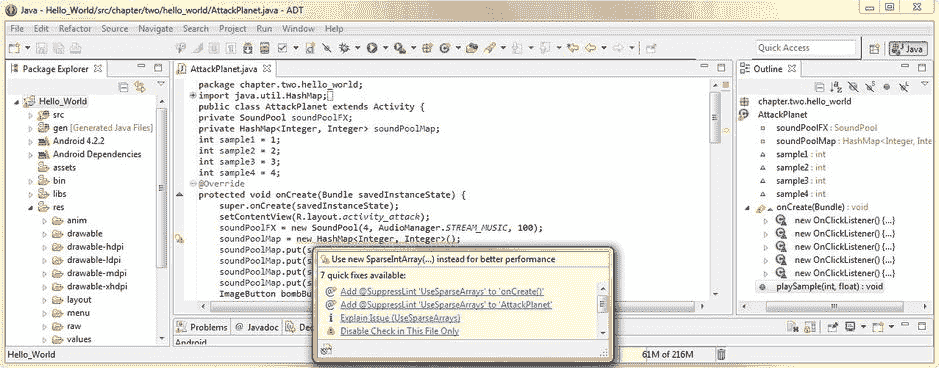

[图 15-8。](#_Fig8)检查 Eclipse 中关于 HashMap 的警告消息，并选择解释问题选项

注意，其中一个选项是:**解释问题(使用稀疏数组)**。看起来 Eclipse 正在提供给我们一些它所知道的关于在这个特定的实现中使用稀疏数组而不是散列表的东西。

让我们点击这个选项，看看 Eclipse ADT 能为我们提供什么信息。请注意，这一特定信息更多地来自 Eclipse 的 Android ADT 插件部分，而不是来自核心 Eclipse IDE 本身。我们知道这一点，因为对话框中的信息与 Android 类的使用有关，而与 IDE 函数本身的使用无关。

一旦我们点击这个**解释问题**链接，就会打开另一个对话框，名为**更多信息**。这个对话框告诉我们，有一个替代 HashMap 的类叫做 **SparseIntArray** ，对于我们存储和访问 SoundPool 音频引擎的整数键值来说，这个类会更有效。

**问题解释**本质上是说 Android SparseArray API 比 Android HashMap API 更有效，因为 HashMap 自动将 int 值从 int 装箱为 Integer，而 SparseArray 没有。你可以在[图 15-9](#Fig9) 中看到这个问题的所有解释文本。

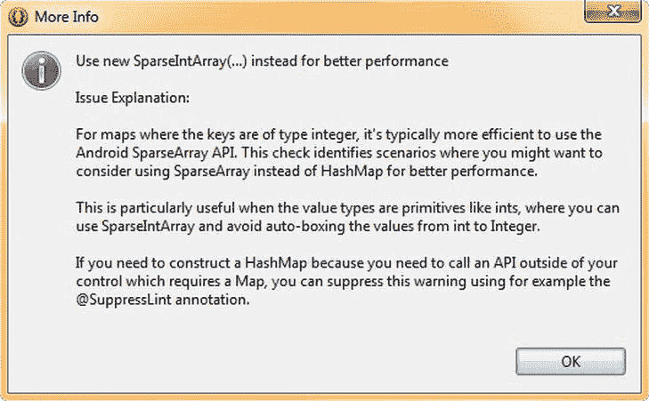

[图 15-9。](#_Fig9)在更多信息对话框中查看稀疏数组问题的解释

根据 Android 开发者网站上找到的更详细的信息，在使用更大的阵列时，这种开关可以节省处理时间。为此，为了向您展示 SparseArrays API，我们将继续升级我们的 Attack a Planet Activity 子类 Java 代码，以利用 SparseIntArray 类，而不是使用 HashMap 类。

如果您想在 Android 开发人员网站上阅读关于这个 SparseIntArray 类的更多详细信息，它有自己的专门页面，可以在以下 URL 找到:

```java
[http://developer.android.com/reference/android/util/SparseIntArray.html](http://developer.android.com/reference/android/util/SparseIntArray.html)
```

要在我们当前的 Java 代码中进行这种更改，我们需要删除当前构建 HashMap 对象的代码行，并代之以构建 SparseIntArray 对象的新代码行。

让我们也将我们的 SparseIntArray soundPoolMap 命名为，并使用下面一行 Java 代码，使用 **new** 关键字调用它的构造函数方法:

```java
soundPoolMap = new SparseIntArray(4);
```

请注意，我们在该表中指定了索引值的数量，使得该表是硬编码的，从而提高了内存和处理效率。

根据开发者网站的说法，这是因为有两种方法来构造稀疏数组。一种是简单构造 **SparseIntArray( )** 另一种是构造**SparseIntArray(int initial capacity)**。

第二种构造方法将创建一个 **new** SparseIntArray()，它最初不包含任何映射，但是它不需要任何额外的内存分配来存储这个指定数量的映射，因为通过指定这个数量，API 确切地知道要分配多少内存。

在我们的例子中，我们确切地知道 SoundPool 引擎将使用多少数字音频样本，因此我们在 Java 代码中为 soundPoolMap SparseIntArray 对象构造选择了更有效的选项。

一旦我们通过 new 关键字输入构造函数方法调用，我们会看到 Eclipse 在我们的 SparseIntArray 下给了我们一个错误的红色波浪下划线，我们知道这是让 Eclipse 为我们编写更多代码的一个途径。

因此，让我们将鼠标放在这个突出显示的错误上，弹出助手对话框，选择**Import SparseIntArray(Android . util package)**选项，让代码中的突出显示错误永远消失。

既然我们的 soundPoolMap 被构造为一个 SparseIntArray，正如 Android 所希望的那样，我们可以修改接下来的四行代码，以使用需要用于 SparseIntArray 对象的正确方法调用。

这意味着改变**。将()**方法调用(与 HashMap 对象一起使用，如图[图 15-10](#Fig10) 所示)交给一个**。append( )** 方法调用，这是用于 SparseIntArray 对象的正确方法调用。

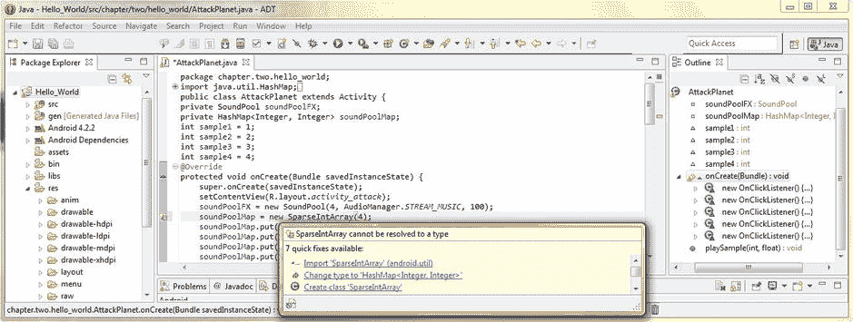

[图 15-10。](#_Fig10)将 HashMap 对象改为 SparseIntArray 对象，并使用 Eclipse helper 添加导入语句

幸运的是，这是对我们现有 Java 代码的一个相当简单的修改，所以我们修改后的四行 Java 代码如下所示:

```java
soundPoolMap.append(sample1, soundPoolFX.load(this, R.raw.blast, 1));
soundPoolMap.append(sample1, soundPoolFX.load(this, R.raw.blast, 1));
soundPoolMap.append(sample1, soundPoolFX.load(this, R.raw.blast, 1));
soundPoolMap.append(sample1, soundPoolFX.load(this, R.raw.blast, 1));
```

新的 soundPoolMap SparseIntArray 对象现在完全在我们的 SoundPool 引擎逻辑中实现，我们的 IDE 显示零错误或警告，如图 15-11 所示。

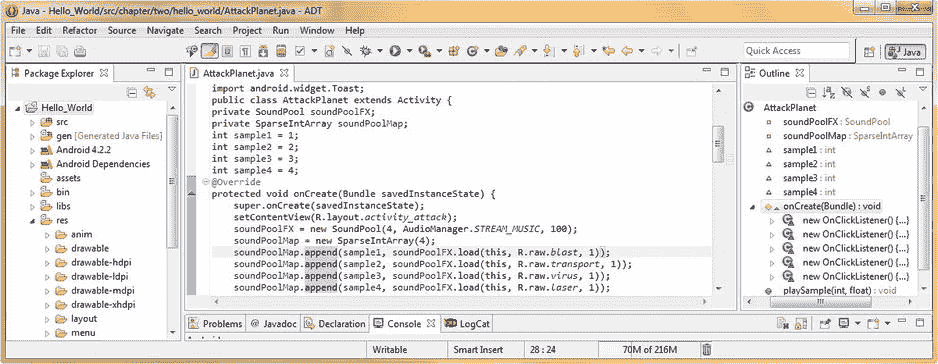

[图 15-11。](#_Fig11)将我们的 soundPoolMap.put( ) HashMap 方法调用改为 soundpoolmap . append()SparseIntArray 方法调用

最后，我们准备在 ImageButton onClick()事件处理逻辑结构(代码块)中调用 SoundPool 引擎，这样我们就可以触发我们选择的样本，如果愿意，甚至可以改变它的音调。

调用 SoundPool 对象:使用 playSample()方法

接下来，让我们在每个 ImageButton onClick()事件处理程序方法内部调用我们在本章前面编写的 **playSample(int sample，float pitchShift)** 方法、。

这包括一行相当简单的代码，分别放在四个 ImageButton onClick()事件处理程序方法中，就在 Toast.makeToast()对象和方法调用之后(或者之前，如果您愿意的话)。

将以下代码行添加到 bombButton、invadeButton、infectButton 和 laserButton 中。setOnClickListener()方法，如下面四行代码所示(每个处理程序一行):

```java
playSample (sample1, 1.0f);
playSample (sample2, 1.0f);
playSample (sample3, 1.0f);
playSample (sample4, 1.0f);
```

这四行代码在每个 ImageButton onClick()事件处理方法代码块中的位置如图 15-12 所示。

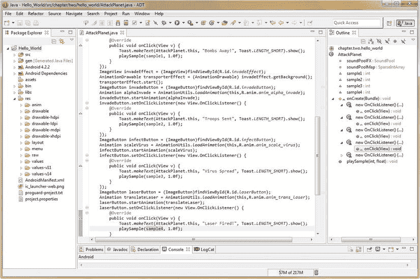

[图 15-12。](#_Fig12)使用样本名称和音高移位参数调用我们的 playSample()方法来播放 SoundPool 样本

现在，在我们的 AttackPlanet.java 活动子类中实现 soundPoolFX SoundPool 对象音频引擎所需的所有 Java 代码构造都已就绪，是时候利用我们的**作为 Android 应用**运行工作流程，并在 Nexus S 模拟器中测试我们的所有代码了。

一旦 Nexus S 模拟器启动，点击菜单按钮，并选择攻击一个星球菜单选项，并启动我们刚刚在 SoundPool 中实现的 Activity 子类。单击动画 ImageButton 用户界面元素，并触发一些数字音频样本。很酷。

现在请注意，您的示例会立即触发，因为 SoundPool 已经将它们预加载到内存中。另请注意，您现在可以快速连续点击按钮，以更像游戏的方式触发音频。响应性反馈对于这种类型的多媒体用户界面设计很重要，我们在过去几章的活动中已经实现了这一点。

这项活动现在实现了过多的“技巧”新媒体用户界面元素，包括:3D 多态图像按钮、基于帧的动画、矢量或程序动画、数字图像和动画合成以及音频样本引擎，所有这些都无缝集成，效果非常好。

摘要

在这最后一章介绍 Android 中的数字音频时，我们仔细研究了音频排序和音频合成概念，因为它们与强大的 Android SoundPool 数字音频引擎类和 API 相关。

我们从学习 MIDI 和音频序列器的概念开始，这是 Android SoundPool 类的核心。我们还了解了排序是如何产生的，如今在哪里使用，以及与之相关的概念，包括曲目、声部和演奏数据。

接下来，我们进一步了解了数字音频合成，包括波形、音调、音高、八度音程、振荡器、音高移位的基本概念，以及将 SoundPool 类 API 转变为音频合成引擎所需了解的许多基本概念。

接下来，我们专门研究了 SoundPool 类和 API，考察了它的工作原理、方法和内存需求。我们仔细查看了 SoundPool **maxStreams** 参数，以及当超过 maxStreams 样本流数量时，它如何处理**优先级**。

下一个合乎逻辑的步骤是让我们了解一些关于使用数字音频排序和合成引擎的**注意事项**,该引擎会占用大量内存和处理资源，因此，如果我们要在应用中实现这一点，我们必须在代码和新媒体素材中考虑并优化某些因素。

最后，我们准备在 Hello_World Android 应用的 Activity 子类中实现 SoundPool 音频引擎。我们设置了 SoundPool 对象，加载了我们的音频样本数据，并了解了 Android **HashMap** 类 API，它允许我们创建哈希表。

然后，我们学习了 Android **AudioManager** 类和 API，它允许我们在 Android 应用和设备中管理音频焦点，然后我们使用这些知识来构建 SoundPool 对象。

接下来，我们编写了一个定制的 **playSample( )** 方法，这样我们就可以将样本数据参数传递给我们的 SoundPool，比如我们想要播放的样本以及我们想要对这些样本进行多大程度的音高移动。

为了消除 Eclipse 中令人讨厌的警告标志，我们用一个 **SparseIntArray** 对象替换了 HashMap，并了解了两个 Android 实用程序之间的差异。然后，我们在 ImageButton onClick()事件处理程序中实现了对 playSample()方法的调用，并且实现了 SoundPool。

在下一章中，我们将开始了解 Android **服务**，并使用后台处理来卸载计算密集型任务，以便它们不会以任何方式影响我们的用户界面设计或应用用户体验的响应。