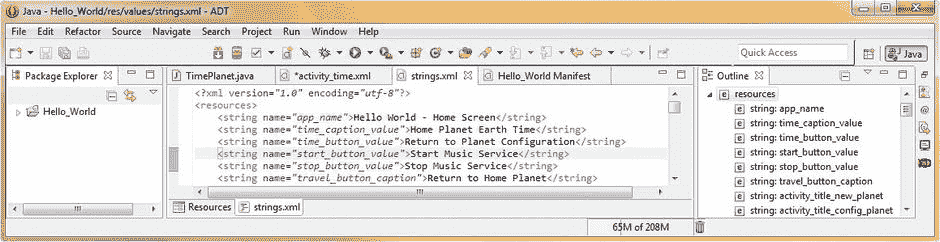

第十七章

Android 服务:使用后台处理

在这一章中，我们将深入研究 Android **服务**、，开发人员利用这些服务来执行后台**异步**操作，这些服务可以自行处理数据流或计算，而无需**将**与应用用户界面设计同步，或者以任何方式与应用内容(持续的用户体验)同步。

服务通常被用来处理需要在你的应用用户体验的**背景**中进行的事情，与安卓用户对你的应用的实时使用并行**，但不与该应用的用户体验设计直接同步或实时连接。**

Android 服务的使用示例包括:在用户使用您的应用时播放长格式数字音频(比如专辑音乐曲目)，在后台与某种服务器或数据库对话，下载数据，管理文件输入输出流，流式传输新媒体内容，如数字视频流或数字音频流，处理网络(SMTP 或 HTTP)协议交易，处理支付网关交易，GPS 数据的实时处理，以及类似的复杂任务。

通常委托给 Android 服务类的任务是那些不应该与用户界面和用户体验联系在一起的任务，因为强制并发(同步)处理可能会导致用户体验变得不自然或不平稳(即，不能描绘平滑的用户界面响应，从而不能描绘平滑和愉快的用户体验)。

委派给 Android 服务的任务也是处理器密集型的，所以在开发处理器密集型应用时，要考虑终端用户的电池寿命。正如你可能猜到的那样，Android 电池的两个主要功耗是长时间处理和长时间保持显示屏亮着(我们在前面的视频章节中提到过)。

在这一章中，我们将仔细研究 Android 服务类，Android 服务的各种特性，以及这些特性、功能、设置、常量和类似的特性是如何在您的 Android 应用中声明使用的。您可能已经猜到了，声明要使用的服务是在一个 **AndroidManifest.xml** 文件中完成的。

这是 Android 中比较复杂的主题之一，因为它本质上涉及绑定、同步、进程、处理器周期、线程、访问控制、权限以及类似的高级操作系统主题。

Android 服务基础:规则和特征

服务被定义为可以在后台执行处理密集型功能的 Android 应用组件，而不需要任何用户界面设计或任何活动显示屏幕，并且不需要用户与需要完成的处理进行任何交互。

Android 应用组件可以使用 Intent 对象启动服务类，服务将继续在后台处理，即使该 Android 设备用户切换到不同的 Android 应用。

一个 Android 应用组件可以**将**绑定到一个服务上与之交互，甚至执行**进程间通信**，你也可能知道这就是 **IPC** 。在对 Android 服务的概述之后，我们将在本章的下一节更仔细地研究进程和线程。

**绑定**是一种高级编程概念，涉及在两个独立的应用组件进程之间建立实时连接，当发生变化以及需要在它们的逻辑**绑定**连接之间进行更新时，这些进程会相互提醒。

一个 Android 服务通常采用两种格式之一，**绑定**或**开始**。当一个应用组件(比如一个活动)通过调用**来启动服务时，一个 Android 服务就变成了**启动的**。startService( )** 方法。

一旦启动，服务可以无限期地在后台运行，即使在启动该服务的组件随后被应用逻辑或 Android 操作系统破坏的情况下。

一个**启动的**服务执行一个单独的操作，并且不向调用实体返回结果，这很像一个被声明为 void 的方法。

例如，已启动的服务可能会通过网络下载或上传数据文件。最佳实践表明，当启动的服务操作完成时，该服务应该自动停止，以帮助优化 Android 操作系统资源，如处理器周期或内存使用。

当一个 Android 应用组件**将**绑定到一个服务时，一个**绑定的**服务被创建。这是通过调用**来完成的。bindService( )** 方法。绑定服务提供了一个客户端-服务器接口，该接口允许组件通过使用进程间通信(IPC)与绑定服务进行交互、发送请求、获取结果，甚至跨进程进行这些操作。

绑定服务只在任何其他 Android 应用组件绑定到它时存在于 Android 系统内存中。多个应用组件可以同时绑定到该服务，但是，当所有这些**解除绑定**时，该服务就会被**销毁**(从系统内存中移除)。

我们将看看这两种类型的服务格式，以及一种**混合**方法，其中您的服务可以同时以这两种方式工作。这意味着您可以启动您的服务(这样它就是一个由**启动的**服务，并且可以无限期运行)并且允许**绑定**。

Android 服务是被指定为**启动的服务**还是被指定为**绑定的服务**取决于您是否实现了一些更有用的服务类回调方法。例如，服务类**。onStartCommand( )** 方法允许组件启动一个服务，而**。onBind( )** 方法允许绑定到那个服务。我们将在本章的后面部分详细介绍服务类的方法。

无论应用的服务是已启动、已绑定还是既已启动又已绑定，任何其他应用组件都可以使用服务，即使是来自单独的应用。这类似于任何应用组件都可以通过有目的地启动来启动活动。我们在前一章中详细介绍了使用意图对象，我们将在本章中介绍如何将意图对象用于服务。

值得注意的是，服务运行的优先级**比不活动的活动优先级**高，因此 Android 操作系统终止服务类的可能性比终止活动类的可能性小。

同样需要注意的是，您可以在清单 XML 文件中将您的服务声明为 **private** ，并阻止来自其他应用的访问，这通常是单个开发人员对他们的应用所做的事情。

默认情况下，服务将总是在主机应用的主**进程**的**主线程**中运行。在应用的这个主要进程内部运行的服务通常被称为**本地服务**。

程序员中一个常见的误解是，Android 服务总是运行在它自己独立的线程上。虽然如果你这样设置的话，这当然是可能的，但是默认情况下，服务会**而不是**创建自己的线程，因此除非你另外指定，否则服务不会在单独的线程中运行。我们将在本章的下一节讨论进程和线程，因为这是一个非常密切相关的主题。

这意味着，如果您的服务要执行任何 CPU 密集型工作(例如实时解码流数据)或阻塞操作(例如通过繁忙的网络协议进行实时网络访问)，您应该在服务中额外创建一个新线程来执行这种类型的处理。

值得注意的是，除了服务类所在的线程(已经使用)，您可能不需要为服务类使用另一个线程，例如，在本章的示例中，我们使用服务中的 MediaPlayer 播放音乐文件，而不需要生成另一个线程。

真正确定是否需要这样做的唯一方法是，首先尝试使用一个服务类进行后台处理，然后，如果它影响您的用户体验，则考虑在需要时实现一个线程类和对象。

进程或线程:有价值的基础信息

当你的 Android 应用的一个组件，比如说你的 MainActivity 类启动时，并且你的应用当前没有任何组件在运行，Android 操作系统将为你的应用启动一个全新的 Linux **进程**，使用一个执行的**线程**，称为 **UI 线程**。一个**进程**可以生成或启动(或**衍生**)多个**线程**。

通常，所有 Android 应用组件都将在相同的初始进程和线程中运行。这通常被称为主线程。

如果您的一个 Android 应用组件启动，并且 Android 发现您的应用已经存在一个进程，由于您的应用中的另一个组件已经存在，那么该组件也将在相同的应用进程中启动，并且也将使用相同的线程。因此，本质上，要启动自己的线程，必须在 Java 代码中明确地这样做。

但是，您可以安排应用中的不同组件在单独的进程中运行，并且可以为任何进程创建额外的线程。正如我们将看到的，这是 Android 服务通常会做的事情。

如何指定流程:使用 android:process XML 参数

作为 Android 操作系统的默认设置，所有的应用组件都将在相同的进程中运行，大多数基本的 Android 应用不需要改变这种设置，除非有非常令人信服的理由。

对于高级应用(我们没有在本书中讨论，但是我们将在这里讨论这个概念，以彻底了解 Android 进程),如果您发现自己处于绝对需要控制某个应用组件属于哪个 Android 进程的情况，您可以在您的 AndroidManifest.xml 文件中指定这一点。

您的 AndroidManifest.xml 组件标签针对每种主要类型的应用组件，无论是活动<activity>标签、服务<service>标签、广播接收器<receiver>标签还是内容提供者<provider>标签，都将包含一个可选的 **android:process** 参数。</provider></receiver></service></activity>

这个进程参数可用于指定应用组件需要运行的进程。您可以设置 process 参数，使每个应用组件都在自己的进程中运行，或者混合和匹配，使一些应用组件共享一个进程，而其他组件不共享该进程。

如果您想变得非常复杂，您还可以设置这些 android:process 参数，以便来自完全不同的 android 应用的组件可以在同一个 Android 进程中一起执行。

只有当这些特定的应用共享相同的 Linux 用户 ID，并且使用相同的证书签名时，才能实现这一点。

有趣的是，您的 AndroidManifest XML 文件中的全局 **<应用>** 标记也将接受 android:process 参数。

在您的<application>标签中使用 android:process 参数将为您的应用设置一个默认的进程值，该值随后将应用于您的 XML 应用组件定义(嵌套)层次结构中的所有应用组件。当然，这不包括那些没有利用 android:process 参数为特定应用组件指定不同进程的应用组件，而不是您通过您的<application>标记中的 android:process 参数设置为应用使用的默认进程。</application></application>

值得注意的是，Android 可以选择在任何时候关闭一个进程，例如，当内存不足时，或者如果您的进程所使用的内存被其他具有更高优先级的进程所需要，或者从最终用户那里获得了更多的使用(注意)。

在进程内部运行的应用组件在**终止**后会被**销毁**，或者从内存中删除。不要担心，因为这些进程中的任何一个都可以在以后重新启动，用于那些需要为用户完成某些事情的应用组件。

当决定终止哪些进程时，Android 系统会权衡它们对用户的相对重要性。例如，与托管可见活动的进程相比，它更容易关闭托管屏幕上不再可见的活动的进程。因此，决定是否终止一个进程取决于该进程中运行的组件的状态。接下来将讨论用于决定终止哪些进程的规则。

Android 进程寿命:如何让你的进程保持活力

Android 试图尽可能长时间地将应用进程保存在系统内存中，但有时需要销毁运行在操作系统中的旧进程。这样做是为了为更新或更高优先级的进程回收系统内存资源。

毕竟，今天大多数 Android 设备只配备了 1 或 2gb 的主系统内存，当用户玩游戏、启动应用、阅读电子书、播放音乐、打电话等时，这可能会很快填满。

即使设备开始配备 3gb 的主内存，您仍然会遇到内存管理问题，而使用进程和线程是这些内存管理问题的核心，因此我们了解 Android 操作系统中如何处理进程非常重要。

Android 操作系统通过*优先级层次*来决定保留哪个进程和终止哪个进程。Android 将每个正在运行的进程放入这个优先级层次结构中，这是基于进程队列中运行的每个组件，以及当前状态(运行、空闲、停止等。)的那些组件。

从 Android 设备中清除内存的方式是，首先终止优先级(重要性)最低的进程，然后终止下一个优先级最低的进程，以此类推，直到较高优先级进程所需的系统资源被回收使用。

在这个优先级层次结构中有五个流程优先级。一旦您看到它们是什么，您将意识到这个流程优先级层次结构是如何逻辑地建立的，并且您还将很好地了解服务(异步处理或重载)和活动(用户界面屏幕)如何适应这个整体流程优先级模式，这对于理解非常重要。准备好一些啊哈时刻吧！

最高优先级的进程级别是**前台进程**，它是当前正在运行(处理)的主进程，因此是用户当前参与的应用任务所需要的。

如果一个流程包含用户当前正在交互的活动(用户界面屏幕)，或者如果它托管当前**绑定**到用户正在交互的活动的服务，则该流程被认为处于前台。

如果一个进程当前正在执行一个在前台运行的服务，它也被认为是一个前台进程，这意味着服务对象已经调用了**。startForeground( )** 方法。

如果一个服务当前正在执行它的 onCreate()、onDestroy()或 onStart( ) **服务生命周期回调**，我们将在本章中学习，或者当前正在广播一个 BroadcastReceiver 对象，它恰好调用它的**【on receive()**方法，它也将被 Android 操作系统赋予一个前台进程优先级状态。

在一个最佳的 Android 操作场景中，在任何给定的时间都只有少数前台进程在运行。这些进程只有在万不得已的情况下才会终止，例如，如果系统内存不足，以致操作系统或其应用无法继续有效运行。

下一个最高优先级的进程是**可见进程**，该进程不包含任何前台进程组件，但仍会影响用户在设备显示屏上看到的内容。

如果一个流程包含一个不在前台的活动，但在用户的显示屏上仍然可见，则该流程被认为是可见的，例如一个活动的**。onPause( )** 方法已被调用。

一个很好的例子是前台流程活动启动了一个允许在后台看到调用活动的对话框。

包含已绑定到可见活动的服务类的流程也将获得可见流程优先级。可见进程被认为几乎和前台进程一样重要，因此它们不会被终止，除非绝对需要保持所有前台进程在系统内存中运行。

五个级别中的中间优先级进程级别是**服务进程**，它是包含已经使用**启动的服务的进程。startService( )** 方法，但是 Android 没有将它归类到两个最高进程优先级类别中的任何一个。

因为服务进程没有用户界面屏幕，并且在后台进程中异步运行，所以与用户在显示器上看到的任何内容都没有直接联系。但是，服务仍在执行最终用户希望继续执行的任务(例如在后台播放音乐专辑或通过网络下载数据)。出于这个原因，Android 让它们继续处理，除非没有足够的内存来支持它们以及前台和可见的进程。

第二个最低优先级的流程级别是**后台流程**，该流程包含一个终端用户当前不可见的活动，例如活动**。**【onStop()】方法被调用。

因为这些后台进程对用户体验没有可察觉的影响，每当有必要为更高优先级(前台、可见或服务)的进程回收系统内存时，Android 就会终止它们。

经常有相当多的后台进程在运行，Android 将后台进程保存在一个被称为 LRU(最近最少使用)的列表中。这用于保证具有用户最近使用的活动的进程是最后终止的进程。

值得注意的是，如果您的活动正确地实现了它们的生命周期方法，并保存了它们的当前状态，那么终止该活动的过程将不会对您的最终用户体验产生任何影响。

这是因为当您的用户导航回活动的用户界面屏幕时，活动会恢复其所有可见状态(记住您的 Bundle savedInstanceState 代码)。

最低优先级的进程级别是**空进程**，它不包含任何当前活动的应用组件。如果您想知道为什么一个空进程会被保存在系统内存中，那么让一个空进程保持活动状态的战略原因是为了 **缓存**优化，这将在下一次组件需要在该进程中运行时缩短启动时间。

Android 操作系统经常终止这些空进程，试图在各种进程缓存之间以及与其底层 Linux 内核缓存之间平衡整体系统内存资源。

最后，由于另一个进程依赖于某个进程，因此该进程的优先级可能会增加。任何当前服务于另一个进程的 Android 进程都不会比它当前服务的进程排名更低。

假设进程 01 中包含的内容提供者(数据库或数据存储)正忙于服务进程 02 中的用户界面活动，或者，如果进程 01 中的服务被绑定到进程 02 中的应用组件，则进程 01 总是被认为至少与进程 02 一样重要。

接下来，我们将看看**线程**，它是更低级的线程，用于在进程中调度处理器密集型和用户界面任务。

关于线程的一些警告:不要干扰 UI 线程

在 Android 操作系统通过你的 AndroidManifest.xml 文件启动你的应用后，它的操作系统**会产生一个执行**的**线程，通常被称为**主线程**。主线程负责操作系统和用户界面小部件之间的**调度**和管理事件，这一点我们在本书的前一章已经了解过。**

主线程还控制**绘制**您的图形、视频和动画(可绘制)资产到活动显示屏，因此它立即执行大量繁重的工作，这就是为什么您可能需要生成自己的线程，如果您想对您的 Android 应用执行的某些操作可能会使主(或主要)线程上已经繁重的工作负载过载，主线程实际上运行您的整个应用。

主线程通常也被称为 **UI 线程**，或**用户界面线程**，因为它是应用组件与 Android UI 工具包中的组件进行交互的线程。Android UI Toolkit 包括来自 **android.widget** 和 **android.view** 包的所有组件(类)，我们在本书的前三部分已经广泛了解了这些组件。

在主进程中运行的所有 Android UI 工具包组件都在这个 UI 线程中实例化，并且对每个所需组件的操作系统调用都从这个 UI 线程中分派。

因此，响应系统回调的方法，比如**。onKeyDown( )** 事件处理程序，用于报告用户界面交互，或生命周期回调方法之一，如**。开始()**法，或者说是一个**。pause( )** 方法，甚至是一个**。destroy( )** 方法，总是在 Android 应用的主进程中包含的 UI 线程内运行。

当应用为响应用户界面交互而分派密集型处理时，单线程模型会导致用户体验性能降低，这就是为什么您必须正确利用线程的原因。

原因是显而易见的；如果 UI 线程中正在进行大量的处理，那么执行冗长的操作，如网络访问、复杂的计算或 SQL 数据库查询，将会阻塞整个用户界面的响应，因为这些处理周期和基本上**阻塞了**UI 相关事件的顺利(快速)处理。

当一个线程以这种方式被**阻塞**时，UI 事件不能被调度处理，这包括将图形(drawable)元素绘制到屏幕上。从用户体验的角度来看，您的应用似乎“挂起”或暂停了一段不期望的时间。

需要注意的是，如果你的应用阻塞 UI 线程超过几秒钟(超过五秒钟)，你的用户将会看到一个对话框，其中包含非常不希望的(至少从用户体验的角度来看)“应用没有响应”(或 ANR)对话框。

同样需要注意的是，Android UI 工具包目前并不是所谓的“**线程安全的**”由于这个原因，任何时候你都不能从**工作线程**中操纵你的应用用户界面元素。

工作线程是任何非 UI 线程，通常也称为**后台线程**。换句话说，它是您在应用 Java 代码中产生的一个线程，用来卸载密集的“工人”后台处理，以便您的 UI 将继续平稳运行。

所以请记住，Android 线程处理的第一个关键规则是，您必须从 UI 线程内部对用户界面元素进行所有操作，记住 UI 线程是您的 Android 应用的主要线程。

第二条规则更一般化，就是不要因为任何原因在任何时候阻塞 UI 线程。这就是为什么要有工作线程的原因，这样，如果您需要做一些会导致 UI 线程被阻塞的事情，您可以在代码中生成一个工作线程来执行处理、流式传输、数据库访问或其他需要大量使用处理器的任务，也可能是高级应用编程。

我的 Android 应用应该使用服务还是线程？

Android 服务只是一个可以在后台运行的组件，即使用户没有与你的应用交互。如果你需要在主 UI 线程之外执行工作，但只是在用户与你的应用的用户界面交互时，那么你应该在你的应用的那个类中创建一个新的 Android 线程对象，使用一个 **HandlerThread** 对象或一个 **AsyncTask** 对象，而不是麻烦地编码(并在清单中声明)一个完整的 Android 服务子类。

假设您想在活动运行时从音乐服务中流式传输一些音乐。你想要做的是使用**来**创建**一个线程。onCreate( )** 方法，使用**启动它运行。onStart( )** 方法，最后使用一个**将其停止。onStop( )** 方法。

正如我之前提到的，至少在你成为一名更高级的 Android 程序员之前，你可能会想要使用更精细的 Android Thread 子类，即名为 **AsyncTask** 和(or) **HandlerThread** 而不是更通用的 Thread 类。

所以，你可能想知道，什么时候会希望使用服务子类而不是在现有类中生成线程对象。如果您还记得上一节，包含服务子类的 Android 进程总是比利用后台处理活动(线程)的进程优先级更高。

如果您的应用要承担大量的处理、访问或流操作，您可能希望为此操作启动一个服务组件(类)，而不是简单地创建一个工作线程。

如果后台功能很可能比您的活动持续时间长，这是一个特别重要的考虑因素。例如，将您使用 Android Camera 类创建的视频上传到 web 服务器的活动会希望利用服务类来执行此上传，以便此上传过程能够在后台继续，即使您的用户离开当前活动。

因此，您希望使用服务类而不是线程对象的原因是，使用服务组件将保证您的处理操作至少有一个服务流程优先级，而不管您的 Activity 子类发生了什么。

接下来，让我们学习如何编写我们的服务子类，以及如何使用 Intent 对象调用它。我们将使用 TimePlanet.java 活动子类来实现这一点，它是我们在前一章意图中创建的。

我们将通过创建一个名为 MusicService.java 的音乐播放器后台服务组件来实现我们的 Android 服务类生命周期。这将是一个服务子类，它将利用类声明中的 **extends** 关键字来子类化 Android 服务类。

在我们设置了访问这些服务生命周期方法所需的新用户界面元素后，我们将使用 Java 代码编写服务类生命周期方法，包括 **onCreate( )** 、 **onStart( )** 和 **onDestroy( )** 方法。我们甚至将利用其中一个 Android Intent 对象来启动我们的后台服务，该服务将为我们的星球时间原子钟活动播放背景音乐，该活动是我们在本书涵盖 Intent 的前一章中创建的。

最后，我们还将了解如何将 **<服务>** 标签添加到我们的 AndroidManifest.xml 文件中，并且我们将在我们的 Nexus S 模拟器中测试我们的背景音乐服务子类，只是为了绝对确保一切都按照预期的方式工作。

在我们的 TimePlanet 活动中实现音乐服务

我们需要做的第一件事是创建启动音乐服务和停止音乐服务用户界面按钮对象，它们将控制我们的音乐服务。这些放在我们的 TimePlanet.java 活动类和 XML 定义文件中。为此，我们需要设置的第一件事是按钮 UI 元素标签所需的字符串常量，因此，通过使用以下 xml 标记，在/res/values 文件夹的项目的 strings.xml 文件中添加两个<字符串>常量定义:

```java
<string name="start_button_value">Start Music Service</string>
<string name="stop_button_value">Stop Music Service</string>
```

如图 17-1 中的[所示。现在我们准备添加两个按钮标签](#Fig1)，它们将两个用户界面元素添加到我们现有的 UI 设计中。这些控制我们的音乐服务背景音乐组件。



[图 17-1。](#_Fig1)将 start_button_value 和 stop_button_value 字符串常量添加到 strings.xml 文件中

在 Eclipse 编辑区域打开您的 **activity_time.xml** 文件，并复制我们在上一章中创建的 **timeButton** 用户界面组件，在其下复制两次。将第三个(底部)按钮标签保留为 timeButton，将第一个按钮 android:id 参数改为 **startServiceButton** ，将第二个按钮 android:id 参数改为 **stopServiceButton** ，如图[图 17-2](#Fig2) 所示。


[图 17-2。](#_Fig2)向 activity_time.xml 添加 startServiceButton 和 stopServiceButton 按钮用户界面元素

接下来，让我们将这两个新按钮对象的 **android:textColor** 参数更改为 **#FFAAAA** ，或者一种漂亮的明亮的**黄色**颜色，以区分音乐服务按钮元素和返回配置按钮元素，后者是一种浅橙色，以匹配等离子背景。

接下来，更改 **android:text** 参数，使其指向我们在[图 17-1](#Fig1) 中设置的正确的字符串常量值；因此，对于第一个按钮标记，将 time_button_value 更改为 start_button_value，对于第二个按钮标记，将 stop_button_value。我们几乎完成了新按钮的参数化！

接下来，让我们更改两个按钮标签中的 **android:marginTop** 参数，使它们相互靠近，并与其他 UI 元素分开。

为此，我们将 startServiceButton marginTop 参数设置为 24 DIP (24dp ),该参数将启动音乐服务按钮元素从 AnalogClock UI 元素推开。然后将 stopServiceButton UI 元素 marginTop 参数设置为 6 DIP (6dp ),将停止音乐服务按钮元素放置在开始音乐服务按钮元素的正下方。

最后，因为我们的 startServiceButton 在 AnalogClock 下面 24 DIP，所以将 timeButton UI 元素的 marginTop 参数设置为相同的精确值。这导致音乐服务按钮 UI 元素在我们在前一章创建的现有用户界面设计中引人注目地居中。最终的标记如[图 17-2](#Fig2) 所示。

```java
<Button android:id="@+id/startServiceButton"
        android:textColor="#FFFFAA"
        android:text="@string/start_button_value"
        android:layout_marginTop="24dp"
        android:layout_gravity="center"
        android:layout_width="wrap_content"
        android:layout_height="wrap_content" />
<Button android:id="@+id/stopServiceButton"
        android:textColor="#FFFFAA"
        android:text="@string/stop_button_value"
        android:layout_marginTop="6dp"
        android:layout_gravity="center"
        android:layout_width="wrap_content"
        android:layout_height="wrap_content" />
```

为了更好地了解这个新的 TimePlanet.java 活动屏幕用户界面设计的外观，单击 XML 编辑窗格左下方的**图形布局编辑器**选项卡。如您所见，屏幕 UI 设计均匀分布，音乐服务按钮按功能分组。

要查看用户界面设计的真实外观，您需要使用 **Run As Android Application** 工作流程，因为我们从过去的经验中知道，Eclipse 中的图形布局编辑器工具并不总是以 Android 设备屏幕上呈现的方式显示边距参数。

既然我们的 Planet Time 用户界面屏幕上有了我们的音乐服务用户界面元素，那么是时候编辑我们的 AndroidManifest.xml 文件了。

配置我们的 AndroidManifest 文件以添加一个<service>组件</service>

当您将 Android 活动、服务或广播接收器组件添加到您的 Android 应用中时，您必须在您的 AndroidManifest XML 文件中声明它，该文件用于启动您的应用。

现在让我们通过在 Eclipse 的中央编辑窗格中打开您的 AndroidManifest.xml 文件来做到这一点。在现有 XML 标记的底部，添加一个 **<服务>** 标签，该标签位于结束</应用>标签之前，但位于我们在上一章中添加的时间表的最后一个<活动>标签之后。

这个<service>标签应该实现一个 **android:enabled="true"** 参数，这将使这个服务组件能够在您的应用内部使用，以及一个 **android:name= "。MusicService"** 参数，用来引用 MusicService.java 类名。我们将在本章的下一节创建这个服务类。标签标记应该如下所示:</service>

```java
<service android:enabled="true" android:name=".MusicService" />
```

完成的 AndroidManifest.xml 文件和标记如[图 17-3](#Fig3) 所示。


[图 17-3。](#_Fig3)将我们的<服务>标签和参数添加到我们的音乐服务类的 AndroidManifest.xml 文件中

现在我们准备编写 Java 代码，实现我们在本章前一节中创建的用户界面设计元素。

在我们的 TimePlanet 活动中编写 Java 代码来启动服务

在 Eclipse 的中央编辑窗格中打开**TimePlanet.java**活动类，并在其自身下再复制两次 **returnFromTimeButton** 按钮对象的按钮实例化和事件处理方法 Java 代码结构。我们这样做是为了不需要从头开始重新编写所有的 Java 代码，因为我们实现了两个非常相似的按钮对象，以及它们的事件处理基础设施。

命名(重命名)第一个复制的按钮对象**startmusicebutton**，引用其 ID 为 **startButton** 。删除 onClick(View view)方法调用内部的 Java 代码语句，这样我们就可以添加我们的新服务类相关的方法调用了。

接下来，重命名第二个复制的按钮对象:**stopmusicebutton**，引用其 ID 为: **stopButton** 。删除 onClick(View view)方法调用内部的 Java 代码语句，这样我们就可以添加我们的新服务类相关的方法调用了。

在我们的 startMusicServiceButton onClick()事件处理程序方法中，让我们添加一个 **startService( )** 方法调用，以使用一个 Intent 对象启动我们的音乐服务组件，该对象引用我们当前的类上下文，代码如下:

```java
startService(new Intent(this, MusicService.class));
```

这个方法调用使用一个 Intent 对象启动我们的服务，该对象是我们在 startService()方法调用中使用 Java **new** 关键字创建的，该关键字使用当前上下文和我们的 MusicService 类名引用作为参数来构造一个新的 Intent 对象，如前面一行 Java 代码所示。

接下来，在我们的 stopMusicServiceButton onClick()事件处理程序方法中，让我们添加 **stopService( )** 方法调用，该方法调用使用一个 Intent 对象来停止和销毁我们的 MusicService 组件，该对象使用以下代码引用我们的当前类上下文:

```java
stopService(new Intent(this, MusicService.class));
```

这个方法调用使用一个 Intent 对象来破坏我们的服务，这个 Intent 对象是我们使用 Java **new** 关键字在 stopService()方法调用本身内部创建的，这个关键字使用当前上下文和我们的 MusicService 类名引用作为参数来构造一个新的 Intent 对象，如前面一行 Java 代码所示。

请注意，在 Eclipse 编辑器中，我们放在两个 onClick()事件处理方法中的这两个 MusicService 子类方法调用都使用红色波浪下划线突出显示进行了错误标记，如图 17-4 所示。


[图 17-4。](#_Fig4)将呼叫添加到。startService()和。stopService()和 TimePlanet.java 的新意向对象

红色波浪下划线的原因是因为我们还没有创建我们的 MusicService.java 服务子类，正如您所看到的，它在一个 Intent 对象参数中被引用，作为这个 Intent 对象需要传递到的类。

现在让我们创建 MusicService 服务子类，这样我们就可以在 Eclipse 中消除这个错误，更重要的是，因为这是我们实现这个服务组件的工作流程中的下一步！

为我们的 MusicService.java 类创建新的服务子类

让我们来看看在 Eclipse 中创建新 Java 类的另一种方法，将鼠标放在我们当前编辑窗格中看到的 TimePlanet.java 活动子类的红色波浪下划线上，然后选择弹出的助手对话框中显示的选项:**Create Class " music service "**在 Eclipse 中启动新 Java 类对话框。

这个助手对话框如图 17-5 所示，是我们调用新 Java 类对话框和超类选择对话框的另一种方式。


[图 17-5。](#_Fig5)使用 Eclipse 错误对话框来调用一个新的>类对话框，这样我们就可以创建音乐服务类

我们看到的完成相同工作过程的另一种方法是右键单击 Eclipse Package Explorer 窗格中的 package name 子文件夹，然后选择我们现在熟悉的 **New  Class** 菜单序列，它将为我们访问这些相同的新 Java 类创建对话框。

接下来，让我们填写新的 Java 类和超类选择对话框，将名为 MusicService.java 的新服务子类指定为 Hello_World/src 源代码文件夹中的 chapter.two.hello_world 包中的公共类。

正如你在[图 17-6](#Fig6) 中看到的，前五个字段已经为我们填写好了，所以只需点击**浏览**按钮打开一个超类选择对话框，键入一个“s”字符并选择 android.app.Service 类。


[图 17-6。](#_Fig6)使用新的 Java 类对话框和超类选择对话框来指定我们的音乐服务类

在这两个对话框中点击 **OK** 和 **Finish** 按钮后，你将会看到 Eclipse 为你编写的**公共类 MusicService extends Service** (子类)Java 代码，如下面的代码和[图 17-7](#Fig7) 所示。


[图 17-7。](#_Fig7)使用 IBinder()方法的新服务子类 MusicService】和为我们编码的导入语句

```java
public class MusicService extends Service {
    @Override
    public IBinder onBind(Intent arg0) {
        // TO DO: Auto-generated method stub
        return null;
    }
}
```

现在，我们所要做的就是添加我们的服务类生命周期方法调用，以实现我们基于 MediaPlayer 的音乐播放服务，我们将准备好在 Nexus S 模拟器中测试我们的应用。

用 Java 编写我们的音乐服务类服务生命周期方法

既然我们的 MusicService.java 类已经创建并打开以供编辑，让我们从在类的顶部添加一个名为 musicPlayer 的 MediaPlayer 对象开始，我们可以在我们的三个生命周期回调方法中使用它，接下来我们将编写代码。这将涉及下面一行 Java 代码:

```java
MediaPlayer musicPlayer;
```

我们编写的第一个方法是调用服务类时第一个被访问的方法，那就是 **onCreate( )** 方法。该方法创建一个 MediaPlayer 对象，并设置其使用，以及设置任何参数，在本例中为循环参数，如图[图 17-8](#Fig8) 所示。


[图 17-8。](#_Fig8)编写 onCreate()、onStart()和 onDestroy 服务生命周期方法来控制 MediaPlayer

我们还使用一个 Toast 对象和一个**。makeText( )** 方法调用向我们展示了操作系统在为我们创建服务方面所做的工作。onCreate()方法将被声明为 public，因此任何类都可以访问它，并且因为它不返回值而无效，我们需要将方法声明和三行 Java 代码放入该方法中，以完成 MediaPlayer 的设置和配置，如下所示:

```java
@Override
public void onCreate( ) {
    Toast.makeText(this, "Music Service has been Created", Toast.LENGTH_SHORT).show( );
    musicPlayer = MediaPlayer.create(this, R.raw.music);
    musicPlayer.setLooping(true);
}
```

接下来，我们将编写我们的 **onStart( )** 方法，因为当我们的服务启动时，这将是生命周期中的下一个方法。请记住，当调用服务时，会调用 onCreate()方法来创建和设置服务，然后调用 onStart()方法来启动它的运行。因此，我们将利用 onStart()方法启动 MediaPlayer 对象来播放音乐，同样，还包括另一条 Toast 消息，让我们了解服务流程的具体情况。因此，onStart()方法的代码如下所示:

```java
@Override
public void onStart( ) {
    Toast.makeText(this, "Music Service is Started", Toast.LENGTH_SHORT).show( );
    musicPlayer.start( );
}
```

最后，我们使用我们的 **onDestroy( )** 方法来停止 MediaPlayer 对象，并且还包含一个 Toast 消息，让我们了解关于服务的情况。因此，我们的 onDestroy()方法的代码如下所示:

```java
@Override
public void onDestroy( ) {
    Toast.makeText(this, "Music Service has been Stopped", Toast.LENGTH_SHORT).show( );
    musicPlayer.stop( );
}
```

既然我们的 MusicService.java 服务子类已经被编码了，让我们通过点击 Eclipse 顶部标签为 TimePlanet.java 的标签回到我们的 TimePlanet.java 活动子类，如图[图 17-8](#Fig8) 所示。

使用 TimePlanet.this 细化我们的 TimePlanet 类上下文引用

当您进入 TimePlanet.java 编辑选项卡时，您会注意到您的 startService()和 stopService()方法调用仍然使用 Eclipse 错误级别突出显示元素以红色波浪下划线标出。这是因为 Intent 对象的第一个(上下文)参数需要引用 TimePlanet 类上下文，并且它当前引用的是它所在的**视图**类，而不是位于我们当前类食物链顶端的**活动**类。

因此，我们需要修改这段代码，以允许这个上下文一直“看到”我们类的顶部。为此，我们需要在 startService()和 stopService()方法中修改 Intent 对象中的第一个 **this** 参数，并将该参数改为: **TimePlanet.this** ，以便 Intent 对象引用 TimePlanet 类的当前上下文。正如你在[图 17-9](#Fig9) 中看到的，这消除了我们 Java 代码中的所有错误，我们现在准备在 Nexus S 模拟器中编译和运行我们的服务组件智能应用，这样我们就可以测试它，看看它工作得如何。


[图 17-9。](#_Fig9)一旦音乐播放器类就位且添加了 TimePlanet.this reference，无错误 TimePlanet 代码

右键点击你的项目文件夹，使用 **Run As Android Application** 工作流程启动 Nexus S 模拟器，当应用启动后，点击菜单按钮，选择配置行星活动，一旦出现在屏幕上，点击原子钟按钮，进入行星地球时间活动屏幕，如图[图 17-10](#Fig10) 所示。


[图 17-10。](#_Fig10)带有音乐服务按钮的 Nexus S 模拟器中运行的 TimePlanet 活动

测试音乐服务组件

现在是时候测试我们的新 MusicService 组件了，它继承了 Android Service 类，看看它的工作效果如何。点击开始音乐服务按钮，无缝聆听美妙的音乐回放。屏幕上会出现一条提示消息，告诉您服务是何时创建的以及何时启动的。

在任何时候，点按“停止音乐服务”按钮，您会注意到音乐停止播放，并且屏幕上会出现一条提示消息，告诉您音乐服务已经停止。继续点击每个按钮几次，以确保应用没有错误，并且服务和 MediaPlayer 对象可以随时启动和停止。

摘要

在本章中，我们仔细研究了一些更复杂的 Android 操作系统特性和概念，包括服务、进程和线程。我们了解了它们之间的关系，它们之间的区别，以及在我们的应用中何时使用它们。

首先我们看了一下 Android 服务及其基本形式和规则，包括**启动的**服务和**绑定的**服务之间的区别。我们查看了一些关键方法，如 startService()、stopService()和 bindService()，稍后我们在自己的服务类中实现了这些方法。我们了解了服务类生命周期及其运作方式。

然后，我们仔细研究了 Android 进程和线程，因为这个主题与服务密切相关，对于 Android 开发人员来说，理解这个主题非常重要。我们研究了如何在 Android Manifest XML 文件中指定一个流程，以及流程的生命周期。

我们了解了不同类型的流程，以及 Android 操作系统如何按照重要性对它们进行排序，我们还了解了不同类型的 Android 组件(如活动和服务)如何适应 Android 流程使用的优先级排序系统。

我们研究了在现有类中使用线程和创建一个新的服务子类来进行后台处理之间的权衡。我们还学习了 HandlerThread 和 AsyncTask 类，如果您决定在 Android 编程中获得更高的水平，并在应用组件中利用线程，您可以使用这些类。

最后，我们从零开始编写了自己的服务子类，名为 MusicService.java。我们将用户界面元素添加到 TimePlanet 活动中，这样我们就可以从我们的原子钟显示屏上控制音乐服务，无论如何它都需要一些背景音乐。

我们学习了如何在 AndroidManifest.xml 文件中添加一个 <service>XML 标签来声明我们要使用的服务组件，然后编写 Java 代码来实现服务类生命周期方法，这些方法是实现我们的 MediaPlayer 对象及其生命周期方法所需要的，我们使用这些方法来控制我们的背景音乐播放引擎。</service>

在下一章中，我们将学习所有关于广播接收器的知识，它可以用来向您的 Android 应用组件以及其他组件发送重要的应用和系统相关消息。