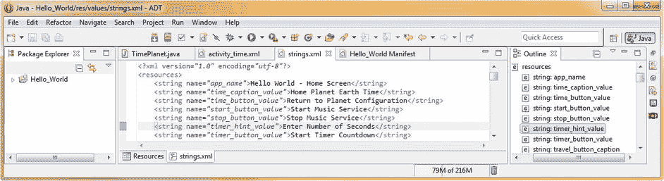
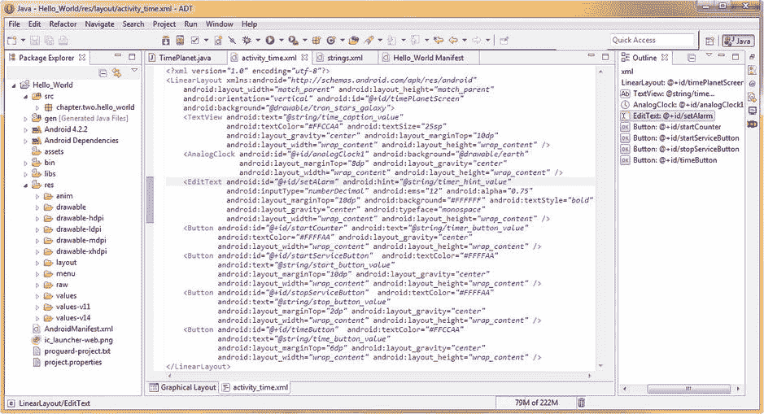
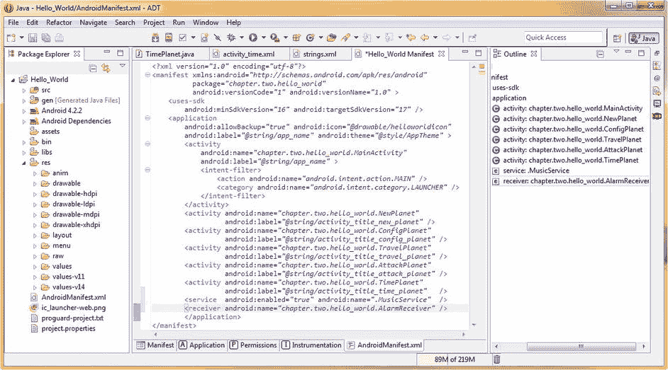
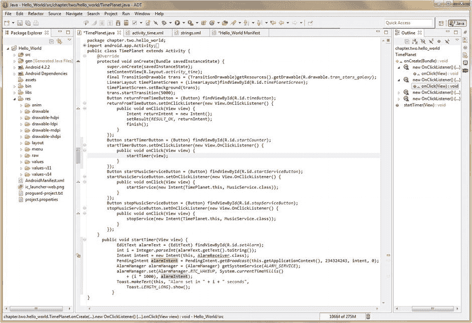
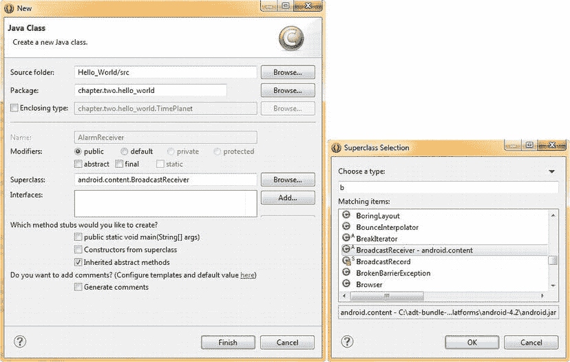
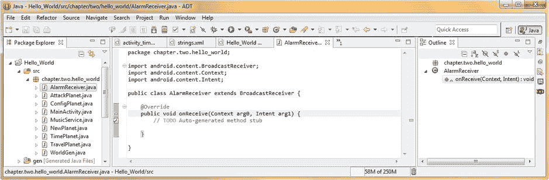
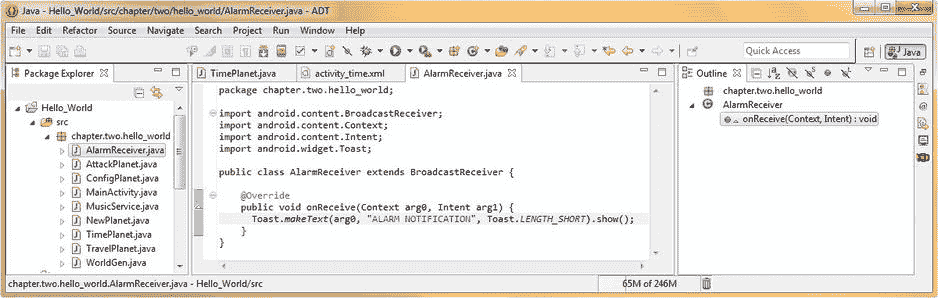
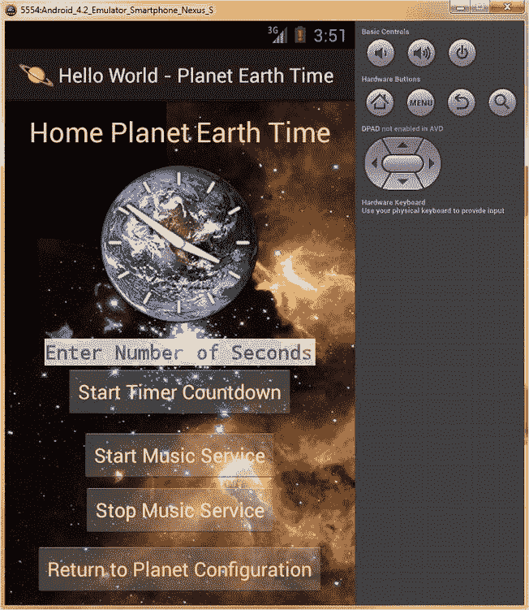

第十八章

广播接收器:Android 应用间通信

在这一章中，我们 将仔细看看 Android 的**广播接收器**类。这个类专门用于 Android 组件之间的通信，每个组件都是主要 Android 类(Activity、Service、BroadcastReceiver 等)的子类。)正如我们在本书的 Java 编码经验中所看到的。

这可以包括您自己的应用组件之间的通信，但更广泛地用于不相关的应用组件之间的通信。这意味着与其他应用的通信。事实上，它更常用于在您的应用和 Android 操作系统中包含的组件之间进行通信。

想想看，任何人的 Android 手机上最常用的组件(应用)都是手机自带的组件，因此是 Android 操作系统不可或缺的一部分。没有人可以否认，人们在日常使用他们的 Android 设备时会在很大程度上使用他们的 Android 设备的电话拨号器、日历、闹钟、定时器、电子邮件客户端、浏览器、屏幕保护程序、壁纸、铃声等等，无论是智能手机、平板电脑、电子阅读器、手表、机顶盒还是 iTV 电视机。

在这一章中，我将尝试向您展示在您的 Android 应用中实现广播接收器(通常简称为接收器)的各种方法，在本例中是在我们的 Hello World 应用中。也就是说，这个特定的 Android 主题在某种程度上超出了所包含的系统(Eclipse IDE 及其仿真器),我们需要保持在该系统中，以确保我们的每个读者都可以同步跟进。

这是因为我们的每个读者都有不同的 Android 设备硬件，一旦我们开始在不同的 Android 设备功能和不同的外部应用之间进行广播(使用 BroadcastReceivers ),他们就会与不同的开发人员和应用合作。

出于这个原因，我必须非常小心地为本章选择我的 Java 代码示例，因为它们需要支持市场上每种类型和型号的 Android 设备都保证支持的设备特性。

幸运的是，这是一本关于 Android 的介绍性书籍，所以我可以在本章中介绍 BroadcastReceiver 类的理论和规则。

我们将学习如何实现广播接收器方法(Java)和标签(XML ),这样您将大致了解如何在自己的 Android 应用中实现广播接收器，以及从哪里开始。

Android 广播接收机:基本概念和类型

Android 的 BroadcastReceiver 类是 java.lang.Object 的直接子类，这意味着它位于 Android 类层次结构的顶部，这可能是主要操作系统功能所期望的。

它是 **android.content** 包的一部分，所以它在 import 语句中的完整使用路径是**Android . content . broadcast receiver**，我们将在本章后面的 Java 代码中看到。

就像有两种不同类型的 Android 服务(启动和绑定)一样，也有不同类型的可以接收的广播:**正常广播**和**有序广播**。

正常的广播是异步的，因此是自由浮动的，不与操作系统环境中的任何东西绑定(同步)。订阅普通广播的任何接收器方法都可以以任何未定义的顺序自由运行。

因为 Android 是一个多线程的多任务操作系统，这也意味着正常的广播可以通过它们的接收器方法在完全相同的时间(并行)被处理。

这意味着正常的广播本质上更有效，因为它们不基于任何其他系统事件，并且操作系统具有以最佳方式处理它们的自由。

然而，这也意味着正常的广播不能利用任何返回的结果(任何类型的返回值)，或者终止任何 API 或组件。

正常的广播是通过使用 **Context.sendBroadcast( )** 方法发送的，我们将在本章的后面看到，当我们开始为添加到 Hello World 应用基础结构中的广播接收器编写 Java 代码时。

另一方面，有序广播按顺序传送**，一次传送给一个接收器。当每个接收器执行有序广播时，它可以将结果传播给下一个接收器。或者，它也可以选择在任何给定的接收器对象上中止广播，这样广播就不会传递到任何其他接收器。作为程序员，你可能会看到事件是如何在处理链中“冒泡”的。**

可以使用 AndroidManifest.xml 中的< receiver >标签内的<意图过滤器>的 **android:priority** 属性来控制广播接收器的处理顺序，您将在该标签中定义广播接收器。在这一点上，您可能不会感到惊讶，因为大多数组件关键的应用基础设施将在您的 AndroidManifest 中定义，以便 Android OS 可以在启动您的应用时设置这些进程和内存空间。

值得注意的是，指定完全相同优先级的<receiver>标签和<intent-filter>标签将以任意顺序运行。</intent-filter></receiver>

通过使用**context . sendorderedbroadcast()**方法发送有序广播。

值得注意的是，即使在某些涉及正常广播的场景中，Android 操作系统也可能会恢复为一次一个接收器地传送您的正常广播，就像它是一个有序的广播一样。如果 Android 操作系统认为这种广播方法将为当前操作环境配置提供更多的处理或内存优化结果，则可能会发生这种情况。

另一个重要的考虑因素是可能需要创建进程的广播接收器。一次只应运行这些广播接收器中的一个，以便操作系统可以避免新进程使操作系统过载，每个新进程都会占用内存和处理资源。

在这种情况下，那些无序的(正常接收器)广播语义将总是成立的；这些创建进程的广播接收器将不能返回任何结果，也不能中止它们的广播组件。

总之，当你的 BroadcastReceiver 类通过你的 AndroidManifest.xml <receiver>标签作为一个应用组件启动后，它将成为你的 Android 应用整个生命周期的重要组成部分。</receiver>

如果您需要随时查看 Android 应用的基本生命周期和相关信息(当您正在学习 Android 操作系统及其运行方式时，偶尔这样做是个好主意)，您可以在 Android 开发者网站上找到这些信息，网址如下:

```java
http://developer.android.com/guide/components/fundamentals.html
```

接下来，我们将回顾为什么我们需要将我们的 Activity Intent 对象和我们的 BroadcastReceiver Intent 对象分开，然后，我们将探讨 Android 操作系统基础架构中的安全性、广播接收器生命周期和广播接收器处理(流程)等问题。一旦我们了解了所有这些事情，我们就可以开始编码了！

广播你的意图:活动与广播接收者意图

我们使用 Intent 类和 Intent 对象来发送和接收这些广播。正如我在关于意图的第 16 章中提到的，意图广播接收器引擎完全独立于使用 Context.startActivity()方法启动活动的意图。

因此，广播接收机无法处理与**一起使用的意图。startActivity( )** 方法。事实上，你的广播接收机甚至没有察觉到一个活动意图的存在！类似地，当您广播您的 BroadcastReceiver 意图时，那些意图对象将永远不会遇到任何 Activity 子类，因此永远无法启动任何 Activity 子类。

Android 操作系统需要将这些类型的意图分开的主要原因是因为这两种类型的组件和它们调用的操作利用了两种非常不同类型的 Android 进程。

正如我们所知，启动一个有意图的活动是一个前台流程操作，它发生在主要的 UI 流程和线程中。这种类型的 Android 进程直接修改用户当前实时交互的内容。

另一方面，接收意向的广播是一个后台进程操作，用户并不知道，因此在我们在前一章中了解的进程优先级排序中，它没有那么高的优先级。正如你所看到的，我有一个很好的理由进入所有关于进程和线程的技术信息，因为它不仅仅适用于利用 Android 中的服务。

安全广播:广播接收机安全考虑

您可能已经注意到，广播接收器是通过 Android 上下文类 API 使用的，例如，要调用广播接收器，您可以使用它们的方法调用上下文对象/类，如下所示: **Context.sendBroadcast( )** 或**Context . sendorderedbroadcast()**。

因此，广播接收机的核心访问是一个跨应用的实现，因此，您应该非常明智地考虑您自己的应用之外的其他应用如何滥用您的 Android 广播接收机的实现。本节有效地概述了在 Android 应用中使用广播接收器时，您可能需要记住的一些主要问题。

首先，Android Intent 命名空间是全局的。出于这个原因，您需要确保您的 Intent **动作名称**以及其他字符串常量都封装在您自己的名称空间中。如果不遵守这条规则，可能会无意中与其他应用发生冲突。

每当实现. register receiver(BroadcastReceiver，IntentFilter)方法时，请注意任何其他 Android 应用都可以向该注册的 broadcast receiver 发送广播。事实上，通过使用 BroadcastReceiver 权限，您可以准确地控制谁可以向您注册的 Receiver 对象发送广播，我们将很快介绍这一点。

当您在您的应用 AndroidManifest.xml 文件定义中发布一个<receiver>，然后在其中额外指定<intent-filter>结构时，您需要认识到任何其他 Android 应用都可以将广播发送到该结构中，而不管您可能指定的<intent-filter>结构如何。</intent-filter></intent-filter></receiver>

有一种方法可以防止其他应用向您的应用的<receiver>标签中的<intent-filter>结构发送广播。做到这一点的方法是通过在你的<接收器>标签中使用一个 **android:exported="false"** 参数来使你的广播接收器对他们不可用。注意，该参数也可以在<服务>和<活动>标签中使用。</intent-filter></receiver>

如果你决定使用**。sendBroadcast(Intent)** 方法或其相关方法，请注意任何其他应用都可以接收这些广播。

您可以通过使用**权限**来控制谁可以接收广播。如果您使用的是 Android 4(冰激凌三明治)或更高版本，您还可以通过使用**intent . set package()**方法调用将您的广播限制到任何单个应用。

这里需要注意的是，当您使用 **LocalBroadcastManager** 时，这些安全问题都不存在，我们将在本章的下一节中讨论这个问题，因为使用这个类的意图广播永远不会超出您当前的进程。

可以在广播的发送方或接收方实施广播访问权限。在等式的发送端实施权限的方法是使用**提供一个**非空权限参数**。sendBroadcast(Intent，String)** 或者，如果您使用的是有序广播，请使用以下命令:**。sendOrderedBroadcast(Intent，String，BroadcastReceiver，android.os.Handler，int，String，Bundle)** 方法调用。

只有通过在其 AndroidManifest.xml 文件中的 **< uses-permission >** 标签请求获得该许可常数的广播接收机，才能接收您的安全许可广播。

在接收广播时实施权限的方法是，在注册接收者时，再次提供一个非空权限。

这是在调用 Java **时完成的。register receiver(broadcast receiver，IntentFilter，String，android.os.Handler)** 方法，或者，在 AndroidManifest.xml 文件中的静态 **< receiver >** 标记中。

只有先前被授予此权限的 BroadcastReceivers 才能向该 receiver 对象发送 Intent 对象。可以通过使用 Android 应用的 AndroidManifest.xml 文件中的 **< uses-permission >** 标记选项请求那些权限来授予权限。

广播接收机生命周期:规则和条例

BroadcastReceiver 对象只在接收者调用**期间有效。【上下文，意图】on receive**方法。一旦 Java 代码从这里返回。在 Receive()方法功能上，操作系统将认为该对象已经完成，它将不再是活动的。

这个广播接收器处理周期对于您在**中究竟能做什么有着重要的意义。onReceive(Context，Intent)** 方法调用实现。

您编写的任何需要异步操作的 Java 代码都是不允许的。这是因为您需要从函数返回来处理异步操作。但是，此时，您的 BroadcastReceiver 将不再是活动的，因此系统可以在异步操作完成之前终止该进程。

此外，您将无法显示任何对话框，也无法从 BroadcastReceiver 中绑定到任何服务类。

如果你需要在这种情况下显示一个对话框，你仍然可以通过使用 android.app 包中的 Android**notification manager**类 来实现这个目标。Android . app . notification manager 是 java.lang.Object 的子类，这个类通知您的用户后台发生的事件。通知可以有三种不同的格式:一种是存在于状态栏中的持久图标，可以通过你的启动器访问；第二种方法是打开或闪烁用户 Android 设备上的 LED 灯；最后，通过闪烁背光、播放声音甚至振动设备来提醒用户。有关 Android 通知管理器类的更多信息可以在以下 URL 找到:

```java
http://developer.android.com/reference/android/app/NotificationManager.html
```

如果您需要启动一个服务类，正如我们在上一章中看到的，您必须利用 **Context.startService( )** 方法调用向服务子类发送一个命令。

处理广播:广播如何影响 Android 进程

当前正在执行 BroadcastReceiver 对象的 Android 进程将运行 BroadcastReceiver 对象内部的 Java 代码。onReceive(上下文，意图)方法。Android 操作系统认为这是一个高优先级的前台进程，因此它将由操作系统保持活动和处理，除非可能在内存资源极度短缺的情况下。

一旦您的 Java 代码完成。调用 Receive()方法时，该广播接收器不再是活动的，它的宿主进程等级被重新校准，以便它与该进程中运行的其他应用组件一样重要，但不是更重要。

这一点尤其值得注意，因为如果该进程只是为了托管 BroadcastReceiver 而创建的(通常情况下)，对于用户从未交互过或者甚至最近没有交互过的应用，那么当从。在 Receive()方法执行时，操作系统会将该进程视为一个**空的**进程优先级。

正如我们在前一章中了解到的空进程优先级，这意味着 Android 操作系统很可能会主动终止该进程，以便操作系统资源可用于其他更重要的进程。

这意味着，对于长时间运行的操作，您应该经常将服务与 BroadcastReceiver 结合使用，以在函数操作的整个过程中保持包含该服务的进程处于活动状态。

应用内部的广播:LocalBroadcastManager

如果您不需要在两个不同的 Android 应用之间发送 BroadcastReceiver，那么您最好使用 **LocalBroadcastManager** 类来利用 broadcast receiver 函数，而不是使用前面章节中描述的全局方法。请注意，如果您需要支持 3.0 之前的 Android 操作系统(例如最初的 Amazon Kindle Fire 的 2.3.7)，这些操作系统不支持 LocalBroadcastManager 类。

LocalBroadcastManager 类提供了更有效的本地广播实现，因为不需要进程间通信。这也让你不用考虑其他 Android 应用接收或发送你的广播的各种安全问题。

这样做的原因是，通过使用这个 LocalBroadcastManager 类，您将知道您在应用中广播的数据不会离开应用的范围，因此，您不需要担心任何私人数据的泄漏。

第二，通过使用 LocalBroadcastManager，其他应用就不可能向你的应用发送任何广播，所以你也不必担心你的应用中有任何安全窗口会被其他程序员利用。

最后，就内存和处理而言，使用 LocalBroadcastManager 类比在整个 Android 操作系统中发送全局广播要高效得多。

注册广播接收器:动态与静态注册

有两种完全不同的方法来注册您的 Android BroadcastReceiver 对象，以便在您的 Android 应用中使用。

一种注册形式称为广播接收器注册的**静态**方法，这种方法是您最熟悉的格式，它涉及到使用 **<接收器>** 标签在您的 AndroidManifest.xml 文件中“预先”注册广播接收器以供使用(这就是为什么它被称为**静态注册**)。

另一种方法叫做动态广播接收器注册，这是使用 Java 代码而不是 XML 标记完成的。之所以称之为动态，是因为它是在 Java 代码中完成的，与此同时，您正在执行与 BroadcastReceiver 类相关的所有操作，而不是预先(静态)在 AndroidManifest.xml 应用引导文件中完成。

如果您想利用动态 BroadcastReceiver 注册，动态注册 BroadcastReceiver 类实例的方法是利用**context . register receiver()**方法调用。

需要注意的是，如果你在你的 **Activity.onResume( )** 方法代码中注册了一个 BroadcastReceiver，你也应该记得在你的 **Activity.onPause( )** 方法代码中取消**对**的注册。

这样做的原因是为了减少系统资源的浪费，因为您不希望在活动暂停时接收任何 Intent 对象，所以您添加了一个 onPause()方法并注销了接收者，这样您就不会让操作系统尝试将 Intent 对象发送到一个当前没有使用的活动。

确保不要犯在 Activity.onSaveInstanceState()方法中注销 BroadcastReceivers 的常见错误，因为如果用户在历史堆栈中向后移动，将不会调用此方法。

现在是时候尝试在我们自己的 Hello World Android 应用中实现 BroadcastReceiver 类和方法了。

在我们的应用中实现广播接收器

我们需要做的第一件事是为在 Hello World 应用中实现 BroadcastReceiver 打下一些基础，例如:创建字符串常量、XML 用户界面设计、AndroidManifest 条目等等。

当我们将添加到 TimePlanet.java 活动中的警报功能被触发并且警报响起时，我们的 BroadcastReceiver 将发送一条消息。因为计时器是与时间相关的，我们将把这个功能添加到 UI 屏幕上，在那里添加它是最符合逻辑的`—`我们的星球时间 UI 屏幕！

现在让我们添加新的字符串常量，这样我们就可以标记将启动闹钟倒计时的按钮 UI 元素和文本编辑字段，这样它就会有一个提示，告诉我们的最终用户我们希望他们在这个数据字段中输入什么类型的信息。

我们将为按钮对象贴上标签:**启动计时器倒计时**，并通过编写以下 XML 标记，使我们的提示为:**输入秒数**:

```java
<string name="timer_hint_value">Enter Number of Seconds</string>
<string name="timer_button_value">Start Timer Countdown</string>
```

这两个新的字符串常量进入我们的 strings.xml 文件，该文件在我们的项目文件夹下的/res/values 文件夹中，如[图 18-1](#Fig1) 所示。



[图 18-1](#_Fig1) 。添加我们的按钮 UI 元素标签字符串常量和编辑文本 UI 元素提示字符串常量

既然我们可以在 TimePlanet.java 活动的新 UI 设计中引用这些字符串常量，那么是时候将这些新 UI 元素添加到 activity_time.xml 文件中了。

使用 XML 设计我们的警报广播接收器用户界面

在 Eclipse 中心区域的编辑窗格中打开 **activity_time.xml** 文件，右键单击/res/layout 文件夹中的文件名，并选择 Open(如果愿意，也可以使用 F3 功能键)。

我们将把我们的 **setAlarm** EditText 用户界面小部件放在我们的模拟时钟的正下方，这样屏幕上所有的按钮 UI 元素将保持组合在一起。在< AnalogClock >标签下添加一个 **< EditText >** 标签，并添加参数，这些参数将对其进行配置，类似于我们为 activity_config.xml 用户界面屏幕创建的 EditText 字段。

让我们使用透明度为 0.75 的 alpha 值， **12 ems 的文本大小，**白色或 **#FFFFFF，**的背景颜色和**粗体**字体的文本样式。

使用**Android:layout _ gravity = " center "**在 UI 设计中将数据输入字段居中，使用**Android:layout _ margin top = " 10dp "**将我们的数据字段与 AnalogClock UI 元素隔开一点。

最后，让我们将我们的 **android:typeface** 参数指定为**等宽**，并将 **numberDecimal** 的 **android:inputType** 指定为计时器倒计时的秒数。

最终的 EditText XML 标记应该包含以下参数:

```java
<EditText      android:id="@+id/setAlarm"
               android:hint="@string/timer_hint_value"
               android:inputType="numberDecimal"
               android:ems="12"
               android:alpha="0.75"
               android:layout_marginTop="10dp"
               android:background="#FFFFFF"
               android:textStyle="bold"
               android:layout_gravity="center"
               android:typeface="monospace"
               android:layout_width="wrap_content"
               android:layout_height="wrap_content"
/>
```

在 Eclipse XML 编辑器中，我们在每行放置两到三个参数以节省空间，这样我们可以在一个屏幕上看到我们用户界面屏幕定义的所有 XML 代码，如图 18-2 所示。



[图 18-2](#_Fig2) 。添加我们的按钮和编辑文本标签，并配置它们的参数用于用户界面设计

接下来，我们需要在 setAlarm EditText 元素下添加我们的 **startCounter** Button 对象，这样，一旦用户添加了持续时间值，用户单击以启动计时器运行的按钮元素就在它的正下方。

在< EditText >标签下添加一个 **<按钮>** 标签，并添加将配置该按钮的参数，类似于我们已经在当前用户界面屏幕下创建的三个按钮字段。

让我们将 android:id 参数设置为我们将在 Java 代码中引用的 **startCounter** ，并将 android:text 参数设置为引用我们之前创建的名为 **timer_button_value** 的字符串常量。

让我们使用黄色或 **#FFFFAA** 的背景颜色和**Android:layout _ gravity = " center "**的居中参数来将 UI 设计中的数据输入字段居中，并确保所需的 android:layout_width 和 android:layout_height 参数被包括在内并被设置为 **wrap_content** 。

最终的按钮标签 XML 标记应包含以下参数:

```java
<Button android:id="@+id/startCounter"
        android:text="@string/timer_button_value"
        android:textColor="#FFFFAA"
        android:layout_gravity="center"
        android:layout_width="wrap_content"
        android:layout_height="wrap_content"
/>
```

既然我们已经为计时器用户界面元素实现了 XML 标记，那么让我们也实现 XML 标记，我们将需要这些标记来声明我们的 BroadcastReceiver 组件子类，以便在我们的应用中使用。如您所知，这是在 AndroidManifest.xml 文件中完成的，所以现在让我们开始吧。

添加我们的 alarm receiver broadcast receiver Android 清单 XML

在 Eclipse 中心区域的编辑窗格中打开您的 **Androidmanifest.xml** 文件，方法是右键单击 Hello_World 项目文件夹底部的文件名，并选择**打开**菜单选项(如果您愿意，也可以使用 F3 功能键)。

让我们在清单底部的<service>标签下添加一行，正好在 XML 标记的应用组件定义块的结束标签上方。</service>

为我们新的 BroadcastReceiver 子类添加一个 **< receiver >** 标记，我们接下来将用 Java 对其进行编码，并使用一个 **name** 参数引用应用组件名称的完整路径名，使用以下标记:

```java
<receiver name="chapter.two.hello_world.AlarmReceiver" />
```

完整的 AndroidManifest.xml 文件声明了我们最新的 Hello World 应用组件，包括六个 Activity 组件，以及一个服务和一个 BroadcastReceiver 组件，如图 18-3 所示。



[图 18-3](#_Fig3) 。为我们的 AlarmReceiver BroadcastReceiver 子类添加一个< receiver >标签到 AndroidManifest.xml

现在，我们已经设计了警报用户界面元素，并在清单中声明了广播接收器，是时候使用 Java 代码在我们的 TimePlanet.java 活动子类中编写警报控制用户界面元素和方法了，它们将在该子类中显示。

使用 Java 编写 startTimerButton 和 startTimer()方法的代码

让我们走一条程序员的捷径，用最简单的方法实现我们的**startTimerButton**Button UI 对象！复制并粘贴 startMusicServiceButton 代码行(全部六行)到它们下面。

接下来将 startTimerButton 名称改为 startTimerButton，UI XML ID 引用由 R.id.startServiceButton 改为 R.id.startCounter，最后将 startService(new Intent(this，class))方法调用改为**startTimer(view)；**方法调用。

现在，Eclipse 将红色错误突出显示我们正在使用的这个新方法名，至少直到我们对这个新方法进行编码，这是我们下一步要做的，在我们活动的底部。startTimerButton 按钮用户界面元素的新事件处理代码如图 18-4 所示，还有**public void start timer(View View)**方法 Java 代码，我们接下来将详细讨论这些代码。startTimerButton Java 代码块应如下所示:

```java
startTimerButton.setOnClickListener(new View.OnClickListener() {
      public void onClick(View view) {
            startTimer(view);
      }
}

```



[图 18-4](#_Fig4) 。在 TimePlanet.java 活动子类中编写用户界面按钮和 startTimer()方法

我们将使用 **public** 访问来声明我们的 startTimer()方法，因此它可供公共使用，并使用 **void** 返回值，因为它不向调用实体返回任何内容，在本例中，单击 startTimerButton UI 对象。

编写我们的 startTimer( ) Java 方法

接下来，我们将声明我们的 EditText 用户界面元素以供使用，我们将它命名为 **alarmText** ，并使用 **findViewById( )** 方法来引用它，以通过 **R.id.setAlarm** 指向我们的 **setAlarm** EditText 标签 XML 定义。

请注意，如果您还没有导入 EditText 类来使用，这段代码将会有红色下划线突出显示，您可以将鼠标悬停在它上面，让 Eclipse 为您编写这段 import 语句 Java 代码。

接下来，我们声明一个名为 **i** 的整型变量，并将其设置为一个整型对象，我们称之为**。parseInt( )** 方法。这个方法通过调用**解析一个整数值。toString( )** 转换方法，关闭**。getText( )** 方法，从 **alarmText** EditText 对象中调用该方法，以检索用户输入到数据字段中的文本值。所有这些都是在一行 Java 代码中完成的，如下所示:

```java
int i = Integer.parseInt(alarmText.getText().toString());
```

接下来，我们声明一个名为 **intent** 的 intent 对象，并构造一个新的 Intent 对象，使用 **new** 关键字，使用当前上下文 **this** 和 **AlarmReceiver.class** 的一个目标组件，我们将在下一节中对其进行编码。现在，Eclipse 红色下划线突出显示了这个引用，因为我们还没有创建和编码这个 BroadcastReceiver 子类。

接下来，我们将创建一个 Android **挂起内容**对象，命名为**告警内容**，并通过调用**来加载 Android 告警功能。getBroadcast( )** 方法 off ofof**pending Intent**类使用参数配置我们的 **alarmIntent** 与**当前上下文**，一个报警**请求代码**，我们的 **intent** Intent 对象，我们刚刚在前面的代码行中创建，以及一个**零**值用于**标志**参数，因为此时我们没有将标志值传递给 getBroadcast( ) 方法调用。

请注意，如果您还没有导入 PendingIntent 类来使用，这段代码将会有红色下划线突出显示，您应该将鼠标悬停在它上面，让 Eclipse 为您编写导入语句 Java 代码。如果您想更详细地研究这个 PendingIntent 类，可以在 Android 开发者网站上找到信息，网址是:

```java
http://developer.android.com/reference/android/app/PendingIntent.html
```

接下来，我们将创建一个 Android **AlarmManager** 对象，我们将其命名为 **alarmManager** ，并使用 **getSystemService( )** 方法加载该对象，该方法从 AlarmManager 类中调用，并将 **ALARM_SERVICE** 常量值作为参数传递。这为我们设置了一个警报功能，这是我们可以调用的许多 Android 操作系统功能之一，在这种情况下，通过使用 AlarmManager API。

请注意，如果您还没有导入 AlarmManager 类来使用，这段代码将会有红色下划线突出显示，您应该将鼠标悬停在它上面，让 Eclipse 为您编写导入语句 Java 代码。如果您想更详细地研究这个 AlarmManager 类，可以在 Android 开发者网站上找到信息，网址如下:

```java
http://developer.android.com/reference/android/app/AlarmManager.html
```

接下来，我们需要使用 alarmManager 类的**来配置我们刚刚创建的 **alarmManager** 对象。**方法设置()。我们将通过。set()方法需要三个参数，一个整数(在这种情况下是系统常数)，它表示报警的**类型**，一个以毫秒为单位的**触发时间**，它由一个**长**值表示，以及一个**挂起内容**操作，在我们的情况下是我们在此之前创建的两行 Java 代码的**告警内容**。

```java
AlarmManager.set(AlarmManager.RTC_WAKEUP, System.currentTimeMillis() + (I * 1000), alarmIntent);
```

注意，我们在。set()方法调用，使用**system . current time millis()**方法，该方法获得以毫秒为单位的**当前系统时间**，并将其与用户在我们的 EditText UI 元素中输入的秒数相加，乘以 1000，将该秒值转换为毫秒，从而得到触发时间！

startTimer()方法中的最后一行 Java 代码使用一个 Android Toast 对象和一个. makeText()方法调用，通过以下 Java 代码将我们的警报设置确认消息发布到活动屏幕:

```java
Toast.makeText(this, "Alarm set in " + i + "seconds", Toast.LENGTH_SHORT).show();
```

同样，我们使用字符串值和我们的整数值 I 连接来显示一条 Toast 消息，告诉用户在 X 秒内用他们输入的值设置警报，然后在最后使用方法链接将. show()方法调用附加到。makeText()方法调用，使整个 Toast 对象构造只使用一行 Java 代码。

我们已经准备好创建并编写我们的 **AlarmReceiver** 类，它将实现我们的**on receive()**broadcast receiver 方法，以使一切协同工作。

创建 AlarmReceiver BroadcastReceiver 子类

将鼠标放在图 18-4 中红色波浪下划线突出显示的地方，然后选择**创建 AlarmReceiver 类**选项，让 Eclipse 创建如图[图 18-5](#Fig5) 所示的新 Java 类对话框。



[图 18-5。](#_Fig5)让 Eclipse 使用超类选择对话框创建一个名为 AlarmReceiver 的新 Java 类

因为 Source folder:，Package:，and Name: data 字段已经为我们填写好了，只需点击 **Browse** 按钮，在**中输入 a " **b** ，选择位于**超类选择**对话框顶部的**字段，然后向下滚动到**broadcast receiver-Android . content**选择，在对话框的**匹配项:**部分找到，并选择它，如图[所示](#Fig5)

最后，点击 **OK** 按钮，返回**新建 Java 类**对话框，然后点击**完成**按钮，创建你的 AlarmReceiver BroadcastReceiver 子类，如图[图 18-6](#Fig6) 所示。



[图 18-6。](#_Fig6)我们的 AlarmReceiver.java broadcast receiver 子类基础设施展示了一个 onReceive()方法

请注意，已经为我们创建了**on receive()**BroadcastReceiver 方法，其中包含了适当的访问控制和参数，我们可以编写 Java 代码来实现我们的 broadcast receiver 方法的警报相关功能。

接下来，我们将用我们的代码替换图 18-6 中显示的 TODO 自动生成方法存根，以便在接收到我们的广播时向屏幕发送消息。

编码我们的 alarmreceiver broadcastreceiver 子类

让我们使用 Android Toast 类在调用 onReceive()方法并接收到广播给它的 Intent 对象时向屏幕发送一条消息。

使用烤面包片**。makeText( )** ，方法使用传入 onReceive()方法的上下文对象作为其第一个参数，然后指定文本消息警报通知，最后是 Toast。LENGTH_SHORT 为方法参数的持续时间常数，然后链一个**。show( )** 方法调用在 java 代码语句的末尾使用下面单行 Java 代码:

```java
Toast.makeText(arg0, "ALARM NOTIFICATION", Toast.LENGTH_SHORT).show();
```

完整的 AlarmReceiver BroadcastReceiver 子类及其 onReceive()方法如图[图 18-7](#Fig7) 所示。



[图 18-7。](#_Fig7)编写我们的 onReceive()方法，在 AlarmReceiver.java 类中显示我们的警报消息

AlarmReceiver BroadcastReceiver 子类的 Java 代码如下所示:

```java
package chapter.two.hello_world;
import android.content.BroadcastReceiver;
import android.content.Context;
import android.content.Intent;
import android.widget.Toast;
public class AlarmReceiver extends BroadcastReceiver  {
      @Override
      public void onReceive(Context arg0, Intent arg1) {
          Toast.makeText(arg0, "ALARM NOTIFICATION", Toast.LENGTH_SHORT).show();
      }
}
```

现在是时候在 Android Nexus S 模拟器中测试我们的广播接收器实现了，看看我们在本章中编写的所有 XML 和 Java 代码是否能正常工作。

右键单击 Hello_World 项目文件夹，选择 **Run As Android Application** 菜单序列启动 Nexus S 模拟器，这样我们就可以测试我们最新的应用版本。

当主屏幕出现时，单击菜单按钮以启动选项菜单，然后选择配置行星菜单选项以启动配置行星活动屏幕。

在屏幕的右下角，单击原子钟按钮启动您的 TimePlanet.java 活动用户界面屏幕，并在行星地球模拟时钟用户界面元素下的文本数据字段中输入以秒为单位的计时器持续时间值。

接下来，单击位于输入秒数数据输入字段下方的**启动计时器倒计时**按钮，发送广播并启动 AlarmManager 对象。该屏幕的用户界面如图[图 18-8](#Fig8) 所示。



[图 18-8。](#_Fig8)测试运行在 Nexus S 仿真器上的 AlarmReceiver BroadcastReceiver 子类

正如您所看到的，我们现在实现的 BroadcastReceiver 应用组件运行良好，在指定倒计时秒数的 Toast 消息出现后，我们的警报通知 Toast 消息随后出现在屏幕上，当然，这是在我们为警报功能指定的秒数过后。

恭喜你！您已经成功实现了三种主要类型的 Android 组件:活动、服务和广播接收器！酷！休息一下，喝杯冷饮，放松一下！

现在，我们已经成功地在我们的 Android 应用中实现了一个广播接收器，我们需要学习如何实现的唯一组件类型是一个内容提供者，我们将在下一章向我们的 Hello World Android 应用添加内容提供者功能时了解它！

摘要

在本章中，我们仔细观察了 Android**broadcast receiver**类及其 **onReceive( )** 方法。

我们研究了两种不同类型的广播接收器广播，即正常广播和有序广播，了解了它们之间的区别，以及何时需要实施每种类型的广播。

接下来，我们研究了广播接收器的安全性考虑，这些考虑源于广播接收器被发送到您的应用之外，并且也允许其他开发人员的代码进入您的应用。

然后我们看了 BroadcastReceiver 生命周期，以及关于如何允许您使用 onReceive()方法调用和 Java 代码函数来处理各种类型的 Java 编程目标的基本规则和规定。

接下来，我们仔细研究了 Android 操作系统如何处理广播接收器，以及您对它们的使用将如何影响您的应用处理优先级，我们在第 17 章中了解到了这一点。

我们仔细研究了用于封闭应用环境中本地化广播的 LocalBroadcastManager 类，以及如何在 Android 操作系统中动态(在 Java 方法调用中)和静态(在我们的 Android Manifest XML 标记中)注册广播。

最后，我们冒险在自己的 Hello World 应用中实现了一个广播接收器，以便在 TimePlanet 活动中实现一个计时器功能。我们在 activity_time.xml 文件中添加了 UI 元素，在 AndroidMainfest.xml 文件中添加了一个新的<receiver>标记，最后实现了一个 AlarmReceiver BroadcastReceiver 子类和一个 onReceive()方法。</receiver>

在下一章中，我们将学习 Android 中所有的内容提供者，以及 SQLite 数据库引擎。我们把最复杂的主题留到了最后，这样在我们深入到像使用 Android 的内容提供者 API 构建 DBMS 引擎这样复杂的事情之前，您就可以最大限度地体验 Android 了。抓紧你的帽子！开始了。