第十九章

Android 内容提供商:访问数据存储

在这一章中，我们将学习关于 Android 操作系统的一个更高级的话题:内容提供商。内容提供者是指:数据存储。我们已经熟悉了 **android.content** 包，之前已经使用过它的类，我们将会更加熟悉 **android.database** 包，以及 **android.provider** 包。

Android 操作系统中最丰富的内容提供者之一是数据库 API**SQLite**，它是 Android 不可或缺的一部分。因此，本章还将涵盖 SQLite 数据库引擎的内在高级主题、设计原则和 Android 内容提供商 API 实现概述。

本章的主题比我们在前面章节中学习的其他主题更高级的原因是，本章包含两个不同高级主题的信息。

第一个是 SQL 和 SQLite 数据库设计概念，Android 的内部 ContentProvider 基于此，第二个涵盖了 Android 中当前可用的所有不同类型的内容提供者。

首先，我们将在一个相当高的层次上介绍数据库设计概念，这样你就有了关于我们将在本章的其余部分做什么的基础知识。

然后，我们将讨论不同类型的 Android 内容提供商，以及它们的概念和技术，以及如何通过统一资源标识符(URI)路径构造来访问它们。

接下来，我们将看看 SQL 数据库引擎和 Android SQLite 数据库包和 API。最后，我们将在 Hello World 应用中实现一个 Android 内容提供者，看看它们是如何协同工作的。

数据库基础:概念和术语

正如大多数程序员已经知道的那样，**数据库管理系统**，或 **DBMS** ，是一个高度结构化的数据存储系统，或“引擎”，它可以以表格格式存储有价值的数据，可以很容易地访问和更新。世界上最流行的开源 DBMS 数据库编程语言之一叫做 **SQL** ，代表**结构化查询语言**。

**结构化**部分来自于数据库被安排成表格格式的事实，而**查询**部分来自于这些数据表被设计成对某个数据值进行**搜索**的事实。**语言**部分来自于这样一个事实:SQL 已经发展成为一种如此复杂的数据库编程语言，以至于关于这个永恒的 RDBMS(关系数据库管理系统)主题的书籍可能比 Android 操作系统上的书籍要多得多。

对于那些从未使用过数据库技术的读者，我将在这里回顾一下基础知识，这样我们就可以使用相同的知识库。您可能熟悉的流行数据库软件包包括 Access 和 FileMaker，并且许多人可能使用过 Excel 以表格格式存储数据，这与数据库非常相似，只是更加直观。

MySQL 等关系数据库中的数据使用**表**存储，这些表支持数据的**行**和**列**。这类似于 Excel 这样的电子表格，除了数据库通常不会像在电子表格中一样一次全部可见，尽管一旦我们学习了所有相关的编程，如果您愿意，您可以生成报告来实现这一最终结果！

每个关系数据库表**列**在你的数据库记录结构中总是包含相似的数据类型和数据分类，这通常被称为数据库**字段**。

这意味着相反，数据库表中的每一个**行**将代表一个完整的数据**记录**。因此，一般来说，当您写入数据库记录时，当您第一次添加该记录时，您将写入一整行或一条完整的数据记录，但是当您搜索数据库信息时，您通常是通过某一列或字段来查找特定的数据或信息。

如果您的数据库表中有大量的数据字段(列),那么在数据库设计方法中，您可能希望有不止一个数据库(数据表)。

在现实世界的数据库设计中，其理论很大程度上超出了入门书籍的范围，出于访问(搜索)性能和组织的原因，您将希望有多个单一的数据库结构。事实上，Android 操作系统使用不止一种数据库结构来存储和访问终端用户的信息，这一点我们将在本章后面很快看到。

拥有多个数据库的方法是让每个数据库(表)中的每个记录都有一个唯一的**键**(唯一索引)。这样，使用该键，单个数据记录的信息可以跨越多个数据库表。在 Android 中，这个键被称为 **ID** ，并且总是通过 Android 的 SQLite 数据库中的常量 **"_ID"** 来指定。例如，如果您的 key 或 _ID 值为 137，您的电子邮件信息和电话信息可能在两个不同的表中，但存储在相同的 key (index)值下，因此与您的 Android 用户帐户准确关联。

MySQL 和 SQLite:开源数据库引擎

**MySQL** 是目前世界上最流行的开源关系数据库管理系统(RDBMS)引擎之一。如果你拥有自己的服务器硬件，你可以使用`MySQL.com`网站下载并安装 MySQL，然后你就可以用很少的软件购买费用托管大量的信息数据库。

SQLite 是 MySQL RDBMS 引擎的一个小得多的版本，设计用于嵌入式硬件，如平板电脑、智能手机、电子书阅读器、iTV 电视机、手表、汽车仪表盘、机顶盒、家庭媒体中心和其他通常称为互联网 2.0 的消费电子设备。有趣的是，所有的 HTML5 浏览器中都有 SQLite。

**SQLite** 代表**结构化查询语言 Lite** ，是作为 Android 操作系统一部分的开源数据库引擎。Android 中有一个 SQLite API(包),它包含了实现 SQLite API 所需的所有 RDBMS 函数。这些包含在 **android.database.sqlite** 包中的一系列类和方法中。

SQLite 是专门为嵌入式系统设计的，类似于 JavaME (Micro Edition)，因此只有 256KB 的内存，用于托管关系数据库引擎实现。

SQLite 支持最小的、标准的关系数据库功能和特性集，如通用 SQL 语法、数据库事务和预处理语句，这足以为 Android 提供强大的数据库支持。

SQLite 支持三种不同的数据类型:**TEXT**(Java 中称为**字符串**值)、**INTEGER**(Java 中称为 **long** 值)和**REAL**(Java 中称为 **double** 值)数据类型。

使用 SQLite 时，所有其他数据类型在保存到数据库字段之前必须转换为这些兼容的数据类型之一。

值得注意的是，SQLite 本身并不验证任何可能写入其字段(表列)的数据类型是否实际上是已定义的数据类型。这意味着您可以将一个整数写入字符串列，反之亦然。如果您想更详细地研究 SQLite，可以访问 SQLite 站点，该站点位于以下 URL:

```java
http://www.sqlite.org/
```

要在 Android 中使用 SQLite，您需要构建 SQLite 语句来创建和更新数据库，然后由 Android 为您管理。当您的应用创建数据库时，数据库将保存在一个目录中，该目录将始终使用以下 Android OS 数据库路径地址:

```java
DATA/data/YOUR_APPLICATION_NAME/databases/YOUR_DATABASE_FILE_NAME
```

接下来，我们将看看许多不同类型的 Android 内容提供商，以及如何通过 Android 操作系统及其 **android.content** 包及其类和方法来访问它们。

Android 内容提供商和内容解析器:简介

Android 内容提供者对象管理应用的数据访问。如果你想在不同的 Android 应用之间共享数据，Android 内容提供商是你想要使用的。

这通常是在系统内存中的**数据库**或**文件**中，或者在设备的 **SD 卡**数据存储设备上，或者在**偏好设置**(名称-值对)中，甚至在外部网络**服务器**上的某种结构化数据集。

Android 内容提供商的一般目的是以标准化的方式封装数据，同时为 Android 开发者提供某种机制来加强他们的数据安全性。

内容提供者是标准的 Android 接口，它将一个系统进程中的数据与另一个进程中运行的 Java 代码连接起来。如果您想访问内容提供者内部的数据，您可以使用当前应用**上下文**中的 **ContentResolver** 对象作为数据库客户机与该内容提供者通信。

ContentResolver 类是从 **java.lang.Object** 子类化而来，它是 **android.content** 包的一部分。如果您想研究关于这个类及其常数、构造函数和方法的更详细的信息，您可以在 Android 开发人员网站的以下 URL 找到专门介绍这些信息的整个网页:

```java
http://developer.android.com/reference/android/content/ContentResolver.html
```

Android ContentResolver 对象与 ContentProvider 对象进行通信，正如我们所知，它是实现 Android 的 Content Provider 超类的一个类的实例。

内容提供者对象有点像 Android，它有自己的自定义数据库引擎，从应用组件客户端接收数据请求，然后在自己的进程中执行请求的数据解析操作，如果可以找到请求的数据，则返回结果。

值得注意的是，如果开发人员不需要在他们的应用之外共享他们的数据，他们就不需要编写他们自己的内容提供者子类，大多数应用都不需要这样做。

您需要创建自己的内容提供者的子类的场景包括在应用中提供自定义搜索建议，或者如果您需要在您的应用和其他 Android 应用之间复制或粘贴复杂的数据。

Android 包括特定于应用的操作系统内容提供商，这些提供商管理常见类型的新媒体数据，如音频、视频、图像以及文本数据，如个人联系信息。

你可以看看开发者网页上的 Android 预定义内容提供者类，它提供了 **android.provider** 包的参考文档。它位于以下 URL:

```java
http://developer.android.com/reference/android/provider/package-summary.html
```

Android 操作系统预装了这些内容提供商数据库。这些通过存储日常数据来帮助 Android 用户，例如最终用户的联系信息、日历、电话号码和多媒体文件。

这些特定于应用的内容提供程序类为开发人员提供了预构建的方法，用于向这些定制的内容提供程序写入数据值或从中读取数据值。

与往常一样，AndroidManifest.xml 文件中列出了一些限制，Android 应用开发人员可以轻松访问这些预构建的内容提供者类，以便在他们的应用特性或功能中使用。

寻址内容提供商:使用内容 URI

如果你想告诉 Android 操作系统你想访问哪个内容提供商，理解**内容 URI** 的概念是很重要的。我们以前使用过 URI 对象，所以你应该熟悉它们在 Android 应用中准确引用数据(内容)路径的功能。内容提供者有一种特殊的路径格式，就像 HTTP 有一种特殊的格式 HTTP://内容也有一种非常相似的特殊格式(因此我们很容易记住)，这就是:

```java
content://
```

Android 内容提供商的完整 URI 遵循以下格式:

```java
content://Authority/Path/ID
```

作为一个例子，这里有一个(假想的)Hello World 内容 URI:

```java
content://com.helloworld.universedatabase/planets/earth/1337
```

在这个 URI 中，**com . hello world . universe database**是数据权威，**行星/地球/** 是数据路径， **1337** 是数据记录的 ID。

一个内容 URI 总是包含四个必要的部分:要使用的模式，在本例中是**Content://；**权威；数据的可选路径；以及您想要访问的数据记录的 ID。

内容提供者的模式总是单词" **content** "，冒号和双正斜杠" **://** "总是附加在 URI 的前面，用于将数据模式与数据授权机构分开。

URI 的下一部分被称为内容提供商的**权限**。如您所料，每个内容提供商的授权必须是唯一的。权威命名约定通常遵循 Java 包命名约定。

许多组织选择使用他们组织的反向. com 域名，加上您可能发布的每个内容提供商的数据限定符，因此我们前面的示例假设我们拥有`helloworld.com`域名，当然，我们并不拥有。

因为 Android 开发人员文档建议您使用 ContentProvider 子类的完全限定类名，如果我们遵循这个示例内容 URI，那么我们可以将 ContentProvider 子类命名为 UniverseDatabase.java。

URI 标准的第三部分是数据的**路径**，虽然是可选的，但出于组织的目的，使用它是一种相当标准的做法。我们不会将数据放在服务器的根文件夹中，而是放在一个**行星**文件夹中，为每个行星数据库使用子文件夹。在我们的例子中，一个子文件夹是**地球**。

例如，Android 的 **MediaStore** 数据库(我们接下来将会看到)的内容提供商使用不同的路径名来确保音频、图像和视频文件保存在不同的数据类型位置。

通过使用不同的路径名，单个内容提供商可以容纳许多不同类型的以某种方式相关的数据，例如保存在 MediaStore 内容提供商中的新媒体内容类型。

对于完全不相关的数据类型，标准的编程实践是希望为每个数据库使用不同的内容提供者子类，以及不同的数据权限(和路径)。

最后一个 URI 参考规范组件是 **ID** ，您可能已经猜到了，它需要是数字。这个 ID，或 Android 中的 **_ID** ，在您想要访问单个数据库记录时会用到。如您所见，URI 参考规范从最通用或最高级(content://)的规范开始，经过授权机构(服务器名)，向下经过数据路径(目录路径)，最终到达数据记录本身(ID)。这是首先建立任何数据路径的逻辑方法，所以我不认为您在理解 URI 参考规范及其构造方面有任何问题。

Android 操作系统内容提供商:作为操作系统一部分的数据库

android 提供了一个 **android.provider** 包，其中包含了 Android 操作系统中标准的所有主要数据库类型的 Java **接口**。

这些包括 Android 用户最常使用的数据库，如**联系人**数据库、**日历**数据库和**媒体商店**数据库。我们将在这一节中讨论这些及其组成部分。

这些功能用于个人管理、时间管理和多媒体管理，这是 Android 设备上最常访问的三项任务，无论是智能手机、平板电脑、电子书阅读器还是独立电视设备。

正如我们在数据库设计一节中了解到的，这些数据库被分割成多个逻辑子数据库，并通过使用一个键或索引 **_ID** 值来引用，就像它们是一个单独的数据存储一样。我们知道，这样做是为了系统性能(内存使用)，以及数据访问速度和数据库访问的方便性的原因。

Android MediaStore 数据库

**MediaStore** 数据库包含 9 个不同的新媒体资产数据库， **CalendarContract** 数据库包含 11 个不同的日历组件数据库， **ContactsContract** 数据库包含的数据库最多，有 21 个功能数据库。

媒体商店数据库包括五个音频数据相关数据库以及一个图像和一个视频相关数据库。[表 19-1](#Tab1) 显示了媒体商店数据提供者接口，以及它们访问的数据类型(参考)。

[表 19-1](#_Tab1) 。Android 提供商包中的 MediaStore 数据库及其包含的数据类型

| 数据库ˌ资料库 | 描述 |
| --- | --- |
| 媒体商店。音频.白蛋白列 | 代表相册的数据库列 |
| MediaStore。音频.艺术专栏 | 代表艺术家的数据库列 |
| 媒体商店。音频。音频列 | 代表跨越多个数据库的音频文件的数据库列 |
| 媒体商店。Audio.GenresColumns | 代表流派的数据库列 |
| 媒体商店。音频.播放列表栏 | 代表播放列表的数据库列 |
| 媒体商店。图像。图像列 | 代表图像的数据库列 |
| MediaStore。视频，视频专栏 | 代表视频的数据库列 |
| 媒体商店。文件.文件列 | 所有媒体的主表的列 |
| MediaStore。MediaColumns | MediaProvider 表的公共列 |

Android 日历合同数据库

**日历合同**数据库包括 11 个日历相关数据库，每个数据库支持各种日历功能，例如事件、与会者、提醒、提醒以及其他类似的日历相关数据支持功能。

android 操作系统通过其 android.provider 包为 Android 日历数据库访问提供预建支持的原因是，对于希望访问这些日历功能的应用来说，能够向现有的 Android 日历功能集添加很酷的新功能是合乎逻辑的。

[表 19-2](#Tab2) 显示了 CalendarContract 数据提供程序接口，以及它们访问的不同类型的日历函数数据(因此，它们将允许您使用内容提供程序直接引用这些数据)。

[表 19-2](#_Tab2) 。Android Provider 包中的 CalendarContract 数据库及其包含的数据类型

| 数据库ˌ资料库 | 描述 |
| --- | --- |
| 日历合同。日历栏栏 | 用于日历提醒功能的数据 |
| CalendarContract。CalendarCacheColumns | 用于日历缓存功能的数据 |
| CalendarContract。日历栏 | 其他 URI 可以查询的日历列 |
| CalendarContract。CalendarSyncColumns | 供同步适配器使用的通用列 |
| CalendarContract。颜色列 | 用于日历颜色功能的数据 |
| CalendarContract。EventDaysColumns 列 | 用于日历事件日功能的数据 |
| 日历合同。事件列 | 事件数据库中的列(联接) |
| 日历合同。扩展属性列 | 日历扩展属性中使用的数据 |
| CalendarContract。提醒栏 | 用于日历提醒功能的数据 |
| CalendarContract。同步列 | 其他数据库使用的同步信息列 |

接下来，我们将看看新的 Android Contacts 数据库结构，从 Android 2.1(éclair)操作系统版本开始，它现在通过 ContactsContract 名字引用(而不仅仅是使用 Contacts)。

Android 联系人联系数据库

**contacts Contact**数据库包括多达 21 个与联系人数据相关的数据库表，这并不令人惊讶，因为如今联系人管理包括大量信息，如姓名、电话号码、电子邮件地址、社交媒体存在、状态、显示名称等。[表 19-3](#Tab3) 显示了 ContactsContract 数据提供者接口，以及它们访问的数据类型(以及它们将引用的数据类型)。

[表 19-3](#_Tab3) 。联系人联系 Android 供应商包中的数据库以及它们包含的数据类型

| 数据库ˌ资料库 | 描述 |
| --- | --- |
| 联系人联系人。CommonDataKinds.BaseTypes | 支持所有类型化数据类型 |
| 联系人联系人。CommonDataKinds.CommonColumns | 跨特定类型的公共列 |
| 联系我们。ContactNameColumns(联系名称列) | 原始联系人数据库中的联系人姓名和联系人姓名元数据列 |
| 联系我们。ContactOptionsColumns(联系人选项列) | ContactsContract 列。跟踪用户对联系人的偏好或与联系人的交互的联系人 |
| 联系我们。联系我们 | ContactsContract 列。接触是指固有的接触属性 |
| 联系我们。ContactStatusColumns(联系状态列) | 用于联系人状态信息的数据 |
| 联系人联系人。数据列 | 数据表中的列(连接) |
| 联系我们。DataColumnsWithJoins(数据列移动联接) | 组合 ContactsContract 返回的所有联接列。数据表查询 |
| 联系人联系人。显示名称来源 | 用于产生显示名称的数据类型 |
| 联络人协定。FullNameStyle | 用于组合成全名的常数 |
| 联系人联系人。组列 | 用于联系人分组信息的数据 |
| 联系我们。PhoneLookupColumns(语音查找列) | 用于联系人电话查找的数据 |
| 联系人联系人。PhoneticNameStyle | 姓名发音的常数 |
| 联系我们。PresenceColumns(存在列) | 附加数据链接返回 ID 条目 |
| 联系我们。拉瓦连络我们 | 用于 RawContact 数据库的数据 |
| 联系人合同。设置列 | 用于联系人操作系统设置的数据 |
| 联络人协定. status column | 用于社会地位更新的数据 |
| 联系我们。streamitemphotoscolumns | StreamItemPhotos 表中的列 |
| 联系人联系人。StreamItemsColumns | StreamItems 表中的数据列 |
| 联系人联系人。同步列 | 当表的每一行属于特定帐户时出现的列 |

接下来，我们将了解弃用的概念，因为它与 Android 数据库有关，因为你们中的一些人可能需要使用旧的 Contacts 数据结构来支持 Android 2.0，甚至 1.5 和 1.6 的古代用户。

过时的内容提供者:过时的数据库结构

作为一名 Android(以及任何其他类型，就此而言)开发者，你需要高度意识到**弃用**的概念。正如您现在可能已经知道的，当编程语言(以及操作系统)中的特性(包括类、方法、接口、常量，或者在这种情况下的数据库)已经停止使用，以支持新的特性和编程环境的特性集(以及随后的开发能力)的长期发展时，就会发生弃用。

Contacts 数据库是弃用的一个很好的例子，所以我将在它自己的部分中讨论这个主题，只是为了确保您理解在您的编程工作过程中容纳弃用的特性是多么重要。

如果您在上一节中查看了 Android Provider 包的链接，那么在查看所有这些信息时，您可能已经注意到，在 API Level 5 之后，原始的 Android Contacts 数据库结构被彻底修改了。

在 API 5 之后，组成原始 Android Contacts 数据库结构的九个数据库被替换为一个新的数据库结构，称为 **ContactsContract** ，我们在上一节中已经介绍过。

请注意，如果您的 Android 应用操作系统支持足够早，您仍然可以使用这些数据库，因为 API Level 5 相当于 Android 2。在 Android 开发者网站上有一个非常有用的部分，叫做**仪表盘**。这向您显示了**的 API 级别**、**的操作系统版本**，甚至每个版本的当前市场份额的**百分比，所以请务必在有空时查看一下，它位于以下 URL:**

```java
http://developer.android.com/about/dashboards/index.html
```

这一切意味着，如果您支持任何早于 Android 2.1 的 Android 设备，即任何 Android 2.0、1.6 或 1.5 设备，那么您将需要自动检测您的最终用户的操作系统版本，并提供使用 9 个联系人数据库而不是 21 个联系人数据库的代码。

如果您查看前一个链接中的仪表板，您还会注意到这种支持只占当前市场份额的 0 . 2 %,这很可能不值得花费编码时间和精力！

内容提供者访问:在清单中添加权限

其余的 Android 内容提供商信息我们将在 Hello World 项目的上下文中学习，因为这更有趣、更高效，并且让我们在 Eclipse 中工作，而不仅仅是阅读一本书。

在 Eclipse 中打开你的 Hello_World Android 项目，右键单击并打开 **AndroidManifest.xml** 文件，该文件位于你的包浏览器窗格的底部附近，如图 19-1 中突出显示的[所示。在中央 XML 编辑区点击底部的**权限**标签，打开 **Android 清单权限可视化编辑器**，如图](#Fig1)[图 19-1](#Fig1) 所示，然后我们添加权限。

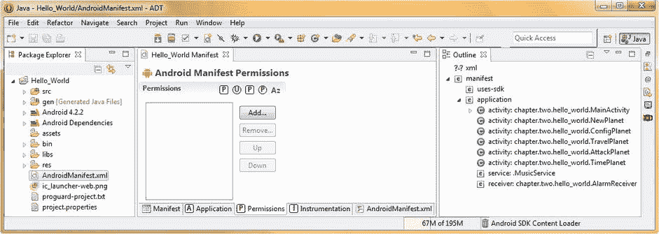

[图 19-1](#_Fig1) 。使用 Eclipse 权限编辑器的选项卡来访问 Android 清单权限编辑器

点击 **Add…** 按钮打开如图[图 19-2](#Fig2) 所示的对话框，允许您选择要添加到 AndroidManifest.xml 文件中的权限标签的类型。选择**使用权限**选项，点击**确定**按钮关闭对话框，返回**权限编辑器**。

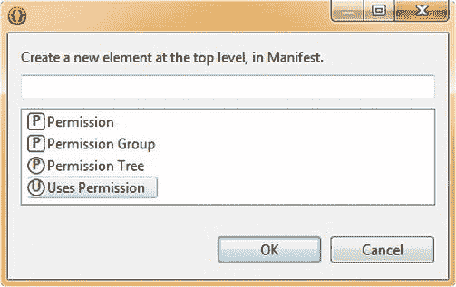

[图 19-2](#_Fig2) 。权限类型为的添加权限对话框

现在我们已经有了显示在权限栏中的使用权限标签，如图[图 19-3](#Fig3) 所示，我们想使用右侧使用权限栏的**属性来配置使用权限标签。找到**名称**下拉菜单，点击向下箭头，找到并选择**Android . permission . read _ CONTACTS**常量，如图[图 19-3](#Fig3) 所示。**

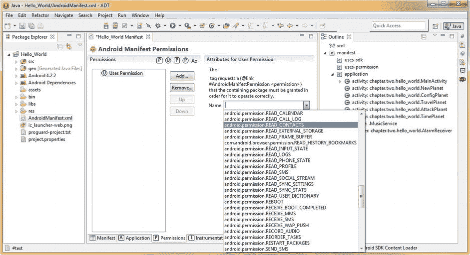

[图 19-3](#_Fig3) 。通过下拉菜单添加 READ_CONTACTS 使用权限属性到使用权限标签

一旦您选择了**Android . permission . read _ CONTACTS**常量，您将会看到屏幕左侧权限栏中的条目将会发生变化，以反映 **<用途-权限>** 标签的新**名称参数**。通过单击中央 xml 编辑窗格底部的 AndroidManifest.xml 选项卡，您可以随时看到为您编写的 XML 代码。

我们刚刚添加的 **READ_CONTACTS** 权限允许我们对 Android CONTACTS 数据库执行读取访问，您可能已经猜到了。

对数据库表的读操作在业内被称为**非破坏性**数据库访问操作。这是因为读操作不会改变数据库中的任何数据，它只是“查看”数据(读取数据)，并可能获取读取的数据并将其显示在用户界面中，这取决于所涉及的 Java 代码。

接下来，我们想要添加一个 **WRITE_CONTACTS** 数据库权限，所以再次点击 **Add…** 按钮，并从我们在图 19-2 中看到的同一个对话框中选择另一个**<uses-permission>**标签。一旦你点击 OK 按钮，你会看到一个使用权限标签出现在权限栏中，就在 Android . Permission . read _ CONTACTS 的正下方，如图[图 19-4](#Fig4) 所示。

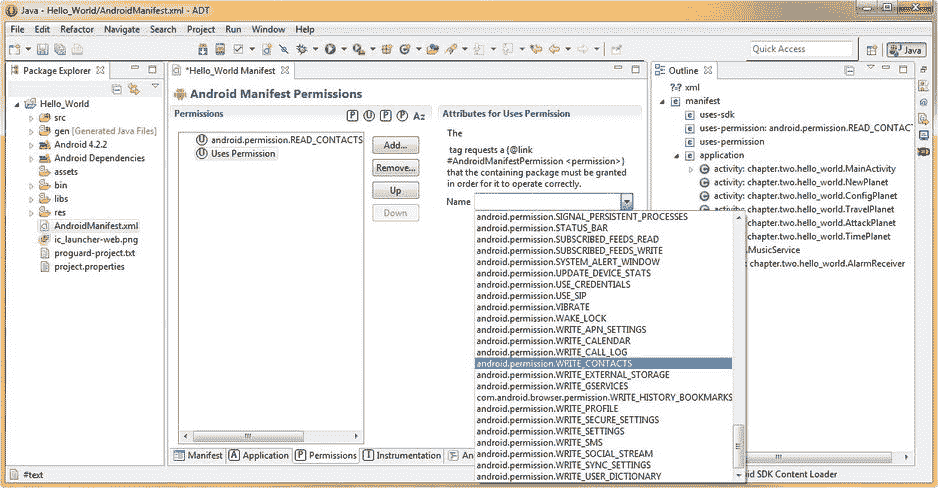

[图 19-4](#_Fig4) 。通过名称下拉菜单添加第二个 WRITE_CONTACTS 使用权限属性

接下来下拉名称菜单，找到一个**Android . permission . write _ CONTACTS**参数，选择它作为你的第二个< uses-permission >标签。要查看为你编写的 XML 代码，点击如图[图 19-5](#Fig5) 所示的 AndroidManifest.xml 选项卡。

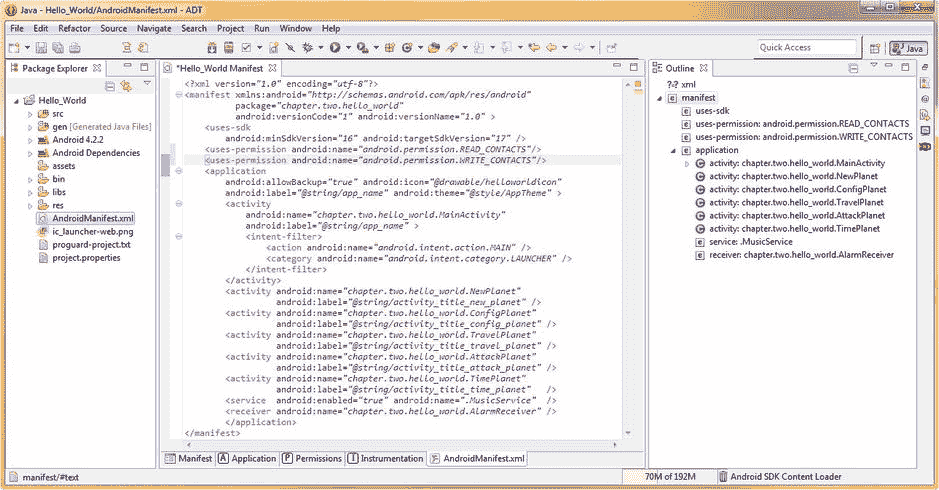

[图 19-5](#_Fig5) 。AndroidManifest.xml 文件标签显示了两个使用许可标签的 xml 标记

需要注意的是，要使权限列从使用权限图标更新到 WRITE_CONTACTS 参数，您必须点击添加…按钮(如果您正在添加更多权限),或者点击 AndroidManifest.xml 选项卡，然后再次点击权限选项卡以刷新权限编辑器可视编辑器，并在左侧的权限列中显示正确的条目，如图[图 19-6](#Fig6) 所示。

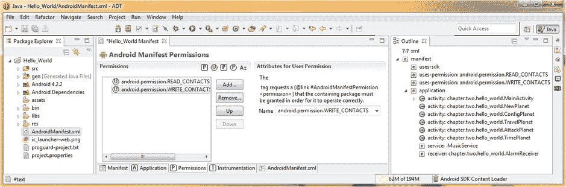

[图 19-6](#_Fig6) 。Eclipse Android 清单权限可视化编辑器显示 twp 数据库访问权限

现在我们已经设置了对联系人数据库的读写权限，我们可以创建我们的 AlienContact.java 活动子类，它将保存我们的用户界面设计和我们的 Make Alien Contact 功能。

内容提供者活动:创建 AlienContact 类

让我们在 Hello_World Android 应用中创建我们的第十个(也是最后一个) Java 类，右键单击项目源(/src)文件夹，选择 **New  Class** 菜单序列，在 Eclipse 中调出熟悉的 New Java Class helper 对话框，如图[图 19-7](#Fig7) 所示。

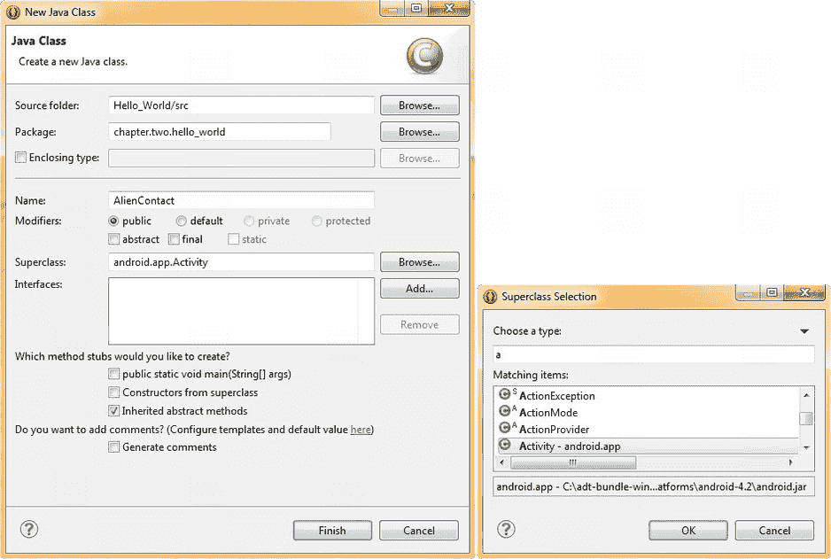

[图 19-7](#_Fig7) 。创建一个名为 AlienContact.java 的新 Java 类，其超类类型为 android.app.Activity

使用您当前的 Android 项目信息，源文件夹和包数据字段应该已经为您填写好了，所以让我们将这个新的 Java 类命名为 **AlienContact** ，因为它将使用 Contacts 数据库来允许我们在我们遇到的任何新世界中跟踪我们的外星人联系人。

接下来单击超类字段旁边的 **Browse…** 按钮，这样我们就可以为我们的 AlienContact.java 活动子类指定一个活动超类类型。一旦超类选择对话框出现，你可以在顶部的**选择类型**字段中键入一个**一个**字符，然后在对话框的**匹配项**部分找到 **Activity - android.app** 条目。

一旦你点击 **OK** 按钮，你的超类字段应该被设置为 **android.app.Activity** 包类，它在你的新 Java 类中实现了所有这些 Android Activity 特性。设置完成后，您可以单击**完成**按钮在 Eclipse 中生成代码。

接下来我们将添加我们的。 **onCreate( )** 方法创建活动的基本代码，并使用**。setContentView( )** 方法来定义一个新的 **activity_contact.xml** 用户界面 xml 定义我们将编写来定义我们的活动屏幕。

我们还将在我们的 **AndroidManifest.xml** 文件中定义我们的活动，并给它一个 **android:label** 参数，以便它有一个活动屏幕标题。

内容提供者活动:准备 AlienContact 类

添加您常用的**受保护的 void onCreate(Bundle savedInstanceState)**方法，并调用**super . onCreate(savedInstanceState)；**正如我们在前面章节中所做的那样，然后还添加一个引用 activity_contact.xml 文件的 setContentView()方法，我们接下来将创建该文件。代码如下:

```java
@Override
protected void onCreate(Bundle savedInstanceState) {
    super.onCreate(savedInstanceState);
    setContentView(R.layout.activity_contact);
}
```

新的 AlienContact.java 活动子类和 onCreate()方法如图[图 19-8](#Fig8) 所示。请注意，对我们的 activity_contact.xml UI 定义的引用(我们接下来将创建它)以红色错误突出显示。因为我们知道这个引用很快就会被定义并放置到位，所以我们现在可以安全地忽略 Eclipse 中 Java 代码中的这个错误。

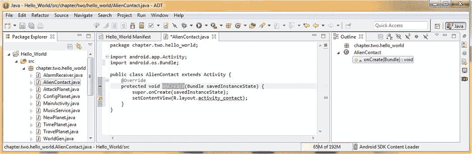

[图 19-8](#_Fig8) 。创建 onCreate()方法并引用 activity_contact.xml UI 布局容器定义

接下来，我们需要在我们的 Android Manifest XML 文件中定义我们的 AlienContact 活动，使用一个 **< activity >** 标签和 **android:label** 参数，就像我们之前做的那样给我们的 UI 屏幕一个标题，如图[图 19-9](#Fig9) 所示。下面是我们将添加到 AndroidManifest.xml 文件底部的 XML 标记:

```java
<activity android:name="chapter.two.hello_world.AlienContact"
          android:label="@string/activity_title_alien_contact"  />

```

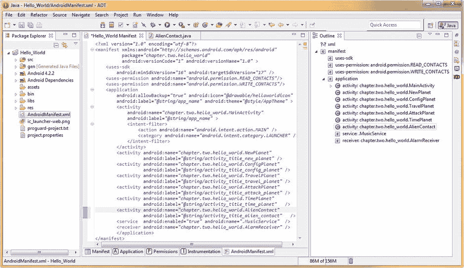

[图 19-9](#_Fig9) 。添加 XML 标记，向我们的 AndroidManifest.xml 添加一个新的 AlienContact 活动子类

现在，我们准备创建我们的活动用户界面屏幕 XML 文件，我们将按照 Android 惯例将其命名为 **activity_contact.xml** 。

内容提供商用户界面:创建 activity_contact.xml

在 Eclipse 的 Package Explorer 窗格中右键单击项目层次结构中的/res/layout 文件夹，并选择 **New  Android XML File** 菜单序列。这将启动新的 Android XML 文件助手对话框，如图[图 19-10](#Fig10) 所示。

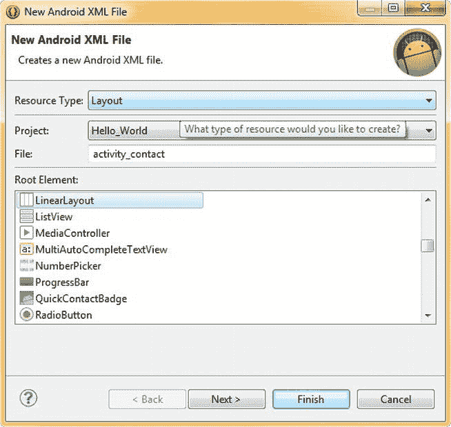

[图 19-10](#_Fig10) 。使用一个新的 Android XML 文件对话框来创建我们的 activity_contact.xml 文件

选择**布局**的资源类型和 **Hello_World** 的项目设置，然后将文件命名为 **activity_contact** ，最后为你的用户界面设计容器选择根元素类型 **LinearLayout** 。

接下来我们需要做的是使用<string>标签向 strings.xml 文件添加一些字符串常量。首先，让我们使用以下 XML 标记添加活动屏幕标题(标签)字符串标记:</string>

```java
<string name="activity_title_alien_contact">Hello World - Alien Contacts</string>
```

接下来，让我们添加三个外来的联系人 UI 按钮标签，我们需要在我们接下来要编写的 XML UI 标记中引用它们。这些将按如下方式编写，并显示在图 19-11 的[顶部。](#Fig11)

```java
<string name="find_alien_button_value">List Aliens in this Galaxy</string>
<string name="add_spock_button_value">Add Spock to my Alliance</string>
<string name="add_worf_button_value">Add Worf to my Alliance</string>

```

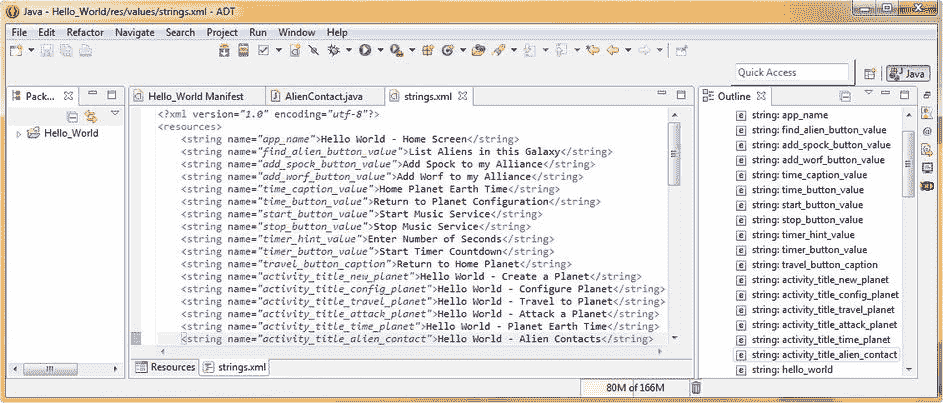

[图 19-11](#_Fig11) 。在 strings.xml 文件中添加活动屏幕标题和用户界面按钮元素 <字符串>标签

接下来，我们需要在父 LinearLayout 容器标记中添加 Button 标记元素，并向 LinearLayout 添加参数以添加背景空间图像，这样我们的用户界面看起来更专业，并与我们迄今为止使用的应用设计的其余部分相匹配。

第一个用户界面按钮标签利用了一个设置为 **findAliens** 的 **android:id** 参数，其文本颜色为黄色或 **#FFFFAA** ，并引用了我们之前创建的字符串常量。

此外，我们利用一个设置为 **40dp** 的 **android:layout_marginTop** 参数来将我们的 UI 元素从 UI 屏幕设计的顶部向下推一点，并利用一个设置为 **center** 的 **android:layout_gravity** 参数来使我们的 UI 元素很好地位于屏幕设计的中间。

最后，确保将默认的 **android:layout_width** 和 **height** 参数设置为 **wrap_content** 。您的按钮 XML 如下所示:

```java
<Button android:id="@+id/findAliens"
        android:text="@string/find_alien_button_value"
        android:textColor="#FFFFAA"
        android:layout_marginTop="40dp"
        android:layout_gravity="center"
        android:layout_width="wrap_content"
        android:layout_height="wrap_content" />
```

第一个用户界面按钮元素，以及接下来的三个，我们将使用复制和粘贴操作来生成，以快速创建该用户界面设计的 XML 标记的剩余部分，如图[图 19-12](#Fig12) 所示。一旦我们复制了这个 XML 定义，并在它下面粘贴了三次，我们就可以修改参数，为我们的按钮创建新的 UI 元素标签，这些标签将添加外星人并退出活动。

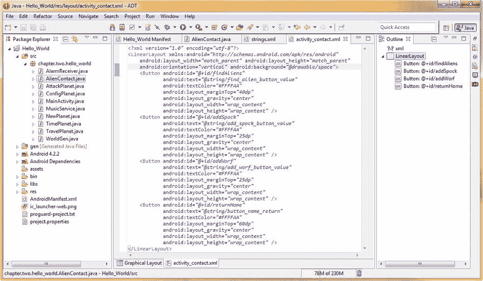

[图 19-12](#_Fig12) 。编写 XML 标记，将四个按钮用户界面元素添加到我们的 LinearLayout 容器中

让我们现在就这样做；将 **findAliens** (ID)按钮标签再复制粘贴三次到其下，并将 **android:id** 参数从 findAliens 分别更改为 **addSpock** 、 **addWorf** 和 **returnHome** 。

接下来，将 **android:layout_marginTop** 参数更改为用于 addSpock 和 addWorf 按钮标签的 **25dp** ，用于 returnHome 按钮的 **60dp** 。

我们将把 **android:textColor** 参数设置为 **#FFFFAA** 或黄色，将 **android:layout_gravity** 参数设置为 **center** ，最后，将 android:layout_width 和 height 参数设置为 **wrap_content** ，这样我们所有的按钮用户界面元素都被统一格式化。

接下来，让我们使用 XML 编辑窗格底部的**图形布局编辑器**选项卡，看看我们的新用户界面设计是什么样子的。因为我们编辑的最后一个按钮元素是 returnHome 按钮，所以它应该在视图中被选中，因为它是 XML 文本编辑选项卡中光标所在的位置。

视觉效果可以在[图 19-13](#Fig13) 中看到，我们的设计看起来相当专业，并且与我们的其他五个活动屏幕设计匹配良好。这意味着我们已经完成了 XML 用户界面设计标记，我们可以继续编写 Java 代码来实现用户界面设计的功能。我们将使用按钮对象及其事件处理方法，这些方法最终将包含我们的 Java 代码，这些代码将访问存储在 Android 操作系统中的联系人数据库结构。

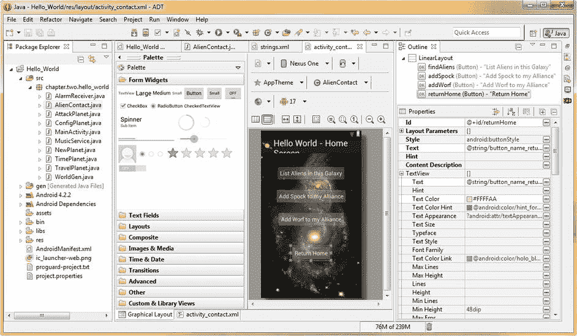

[图 19-13](#_Fig13) 。在 Eclipse 图形布局编辑器中预览我们的 activity_contact.xml 用户界面设计

接下来，让我们回到 Eclipse 中的 AlienContacts.java 编辑选项卡，添加代码行来实例化每个按钮对象，然后将事件处理逻辑附加到它，这样我们就有了一个框架来触发我们的数据库操作。

在 AlienContact 类中编码用户界面元素

首先，我们需要为对象创建和事件处理编写第一个 aliensButton Button 对象 Java 代码，然后我们可以在其下复制三次，并创建其他三个用户界面按钮。

完成此任务的 Java 代码如图 19-14 所示，并已被复制，以使用以下 Java 代码块为我们的 aliensButton、spockButton、worfButton 和 homeButton 用户界面元素创建按钮对象:

```java
Button aliensButton = (Button)findViewById(R.id.findAliens);
aliensButton.setOnClickListener(new View.OnClickListener() {
   @Override
   public void onClick(View v) {
      finish();
   }
}
```

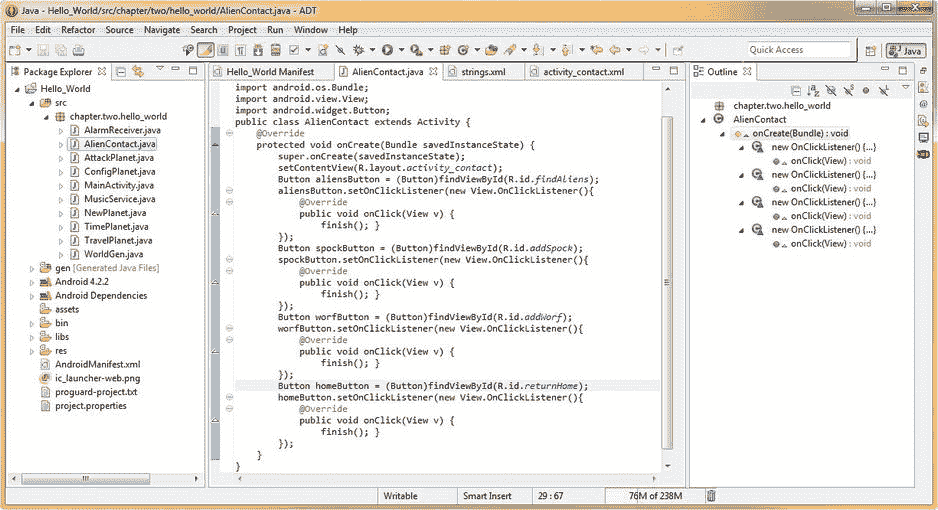

[图 19-14](#_Fig14) 。为我们的按钮 UI 元素及其 onClick()事件处理方法添加 Java 代码

我们在 onClick()事件处理代码块中使用了 finish()方法调用，这样每个按钮都有一个功能(返回到主屏幕),直到我们在本章后面用数据库相关代码替换它。这使得测试 Java 代码变得更加容易，并且不会出错。

如果您愿意，您可以使用您的**运行 Android 应用**工作流程来启动 Nexus S 模拟器，并查看其用户界面屏幕，点击每个按钮返回应用主屏幕。

接下来，我们将编写 aliensButton 对象的代码，以便它调用一个 **listAliens( )** 方法，该方法使用 Toast 类列出我们星系中的所有外星人，以便所有外星人的名字都广播到我们的用户界面屏幕上。

使用 ContentResolver:编写 listAliens()方法

我们需要做的第一件事是用 listAliens()方法调用替换 aliensButton 事件处理代码块中的 finish()方法调用。当你这样做时，Eclipse 会使用红色波浪下划线来突出这个方法不存在的事实，如图 19-15 所示。

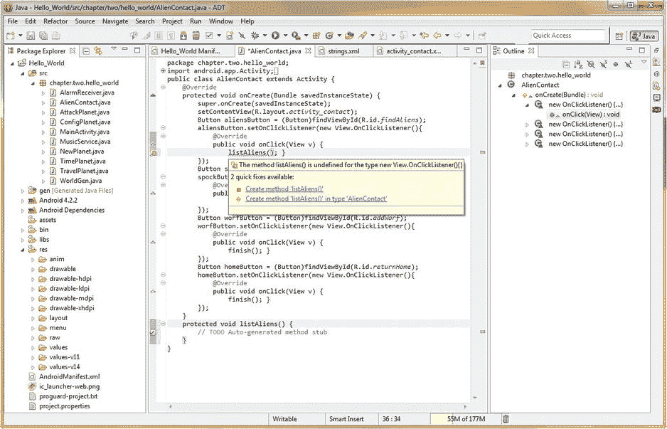

[图 19-15](#_Fig15) 。在 type 'AlienContact' helper 选项中添加 listAliens()方法调用和 Create 方法' list aliens()'

图 19-15 中还显示了当你的鼠标停留在这个突出显示的错误上时出现的帮助器对话框，以及当你选择第二个名为**的选项时 Eclipse 为你编写的空方法，在类型‘alien contact’**中创建方法‘find aliens()’，瞧！看看你的编辑屏幕的底部:空的 **listAliens( )** 方法出现了！

现在是时候编写第一个与数据库相关的 Java 代码来访问 Contacts 数据库了，我们已经请求允许在 Android Manifest XML 文件中使用该数据库。在这种情况下，我们最初将使用 **READ_CONTACTS** 权限，因为我们将读取联系人数据库，然后在用户界面屏幕上列出我们银河联盟中的所有外星人。

首先，我们使用 Android Cursor 类，用于在数据库表中导航，并创建一个名为 AlienCur 的游标对象(我很想将该对象命名为 alienCurse，但没有这样做)。在同一行代码中，我们可以使用下面一行 Java 代码，通过使用 **getContentResolver( )** 方法，用我们想要遍历的数据库表加载这个游标对象:

```java
Cursor alienCur = getContentResolver().query(ContactsContract.Contacts.CONTENT_URI, null, null, null, null);
```

这调用了 ContentResolver 类 **getContentResolver()。query( )** 方法，该方法接受您想要查询的数据库 URI的参数，以及**投影**、**选择**、**参数**和**排序顺序**。因为我们只是通读整个 Contacts 数据库，所以我们不打算使用任何其他数据库访问说明符参数，因此我们在该参数槽中使用了空值**和空值**(作为一个未使用的指示器)。

现在我们已经创建了 alienCur 游标对象，并加载了我们希望它遍历和读取的数据库内容，我们可以构造一个 Java **while 语句**来读取这个数据库表中的所有记录(字段)。因为我们希望光标指向**。moveToNext( )** 或者在 while 循环仍然有效时移动到下一条记录，我们从以下内容开始:

```java
while (alienCur.moveToNext()) { our while loop processing Java code goes in here }
```

在 while 循环内部，我们有两个 Java 语句，它们在 while 循环运行期间处理数据库内容(有效)。这是由 while 循环的**条件**定义的，该条件指定 while 循环的内容应该在该循环仍然可以移动到 Next 时执行(此时数据库表中还有另一个记录要读取)。

第一行代码创建一个名为 alienName 的字符串对象来保存我们将要读取的数据，然后将它设置为使用我们在第一行代码中创建的游标对象从数据库表中实际读取数据的操作。完成此任务的 Java 代码如下:

```java
String alienName =
alienCur.getString(alienCur.getColumnIndex (ContactsContract.Contacts.DISPLAY_NAME_PRIMARY));
```

我们将我们的 **alienName** String 对象设置为来自**的结果。getString( )** 方法，在 **alienCur** 光标对象上调用，该对象从**获取其结果。在 alienCur 游标对象上调用的 getColumnIndex( )** 方法。

如您所见，赋予光标对象的参数。getColumnIndex()方法调用指定主显示名称数据库记录中保存的数据列(字段)。这通过使用 **DISPLAY_NAME_PRIMARY** 常量来引用，该常量本身通过**Contacts contact**数据库来引用，并且位于 **Contacts** 表中。如图 19-16 中的[所示。](#Fig16)

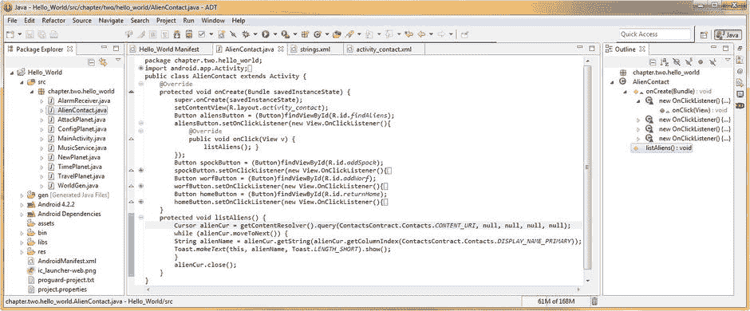

[图 19-16](#_Fig16) 。编写使用 getContentResolver()访问 ContactContracts 数据库的 listAliens()方法

现在我们有了想要显示的数据，以我们需要的字符串格式，我们可以简单地调用 Toast 对象，通过它的。makeText()方法，并将数据显示到新的用户界面屏幕上。

我们将通过使用下面一行熟悉的 Java 代码来做到这一点，这些代码**链接了**和**。makeText( )** 和**。show( )** 方法一个接一个地关闭 Toast 对象。像这样:

```java
Toast.makeText(this, alienName, Toast.LENGTH_SHORT).show();
```

进入结束 while 循环定义的右括号后，我们最终需要**关闭**(从系统内存中移除光标对象)alienCur 光标对象，它当前保存着我们的数据库数据。

顺便说一下，这个 Cursor 对象可能会占用大量的系统内存，所以当我们完成时，使用 Cursor 类的**非常重要。close( )** 方法将我们已经定义的光标对象清除出系统内存。

这是通过调用 alienCur 对象的一个简单方法来完成的。这是使用 Java 点符号完成的，如以下 Java 代码所示:

```java
alienCur.close();
```

现在，我们准备将外星人添加到我们的 Android 模拟器的联系人数据库中，这样我们就可以测试我们刚刚在前面几节中编写的权限、Java 代码和 XML 标记。

向 ContactsContract 数据库添加外来联系人

假设您仍然打开 Eclipse，通过使用**窗口 Android 虚拟设备管理器**菜单序列启动 Android 模拟器。该工作流程启动 Nexus S 模拟器，而不需要模拟器自动加载和运行 Hello World 应用。

这里还需要注意的是，如果由于某种原因一个作为 Android 应用运行的**工作进程由于某种原因没有启动 Android 的仿真器功能，那这就是用**的方式硬启动**Android 仿真器。**

当 **Android 虚拟设备管理器**对话框出现时，从我们在本书前面设置的模拟器列表中选择 Nexus S 模拟器选项，并点击**开始…** 按钮。

当**启动选项**对话框出现时，**取消**从快照启动，以及保存到快照选项，点击**启动**按钮。

这将打开**启动 Android 模拟器**对话框以及一个进度条，显示模拟器正在加载和启动。一旦它启动，你就可以关闭 Android 虚拟设备管理器对话框。

当 Nexus S 模拟器启动时，您将看到一个智能手机开始屏幕模拟器，如截图左侧的[图 19-17](#Fig17) 所示。

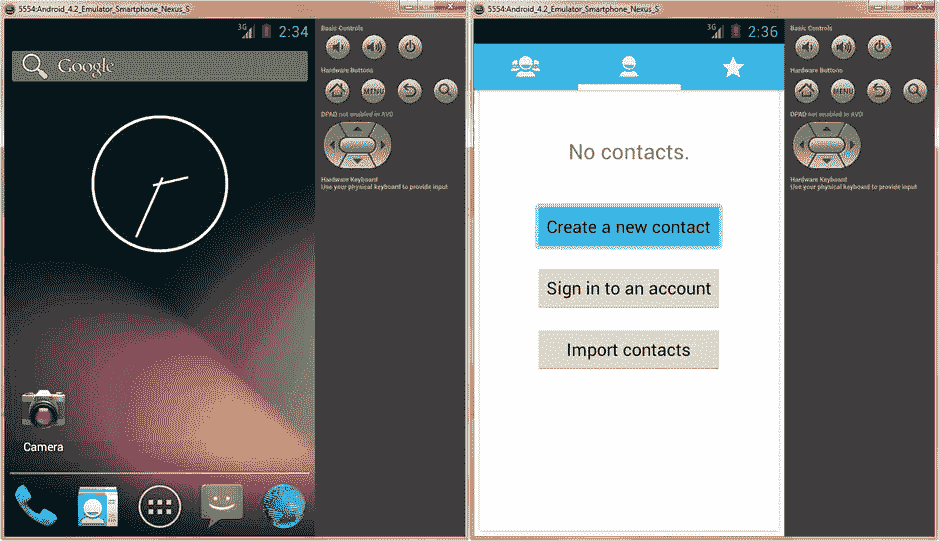

[图 19-17](#_Fig17) 。使用联系人数据库图标(左下方第二个图标)创建新联系人

管理联系人数据库的工具非常重要，它就在智能手机开始屏幕的左下角，由蓝色联系人表图标模拟中的一个小对话头指示。

点击此图标启动仿真器的联系人管理实用程序，该程序显示在图 19-17 的右侧。

点击顶部按钮**在您的智能手机(模拟器)联系人数据库中创建一个新的联系人**。这将弹出一个对话框，通知您由于您使用的是模拟器，您将要输入的新联系信息将不会被备份，因为您使用的不是真正的电话。

如果你想使用模拟器创建真实的联系人数据库信息，可以通过真实的 Android 智能手机帐户访问，对话框会询问你是否要添加一个帐户来备份你在模拟器上在线输入的联系人。

因为我们只是将它用作本章中学习的联系人数据库代码的测试应用，所以我们将选择左边的按钮选项“ **Keep Local，**”，这样我们输入的信息就存储在我们工作站的硬盘驱动器上，而不是像以前那样“在云中”。

该保持本地对话框如图 19-18 所示，一旦我们选择保持本地选项，我们将看到联系人管理用户界面。

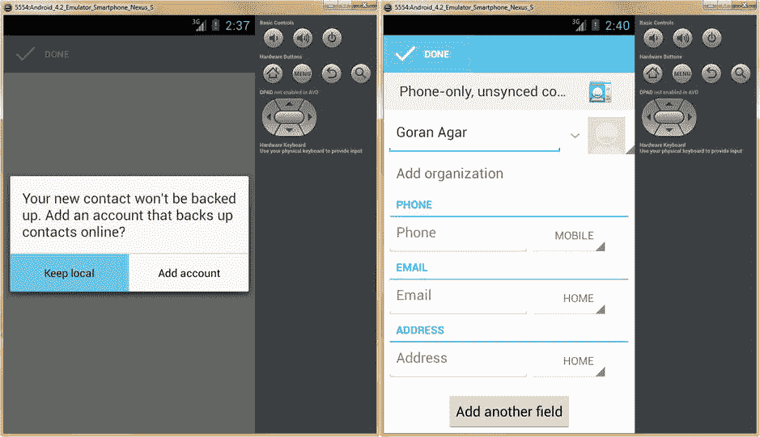

[图 19-18](#_Fig18) 。保持我们的联系人数据库在本地，并在数据库中添加一个名为 Goran Agar 的新外星人

一旦联系人管理界面出现，如[图 19-18](#Fig18) 右侧所示，我们将输入我们的第一个外星人名字，戈兰·阿加尔，杰姆·哈达尔种族之一，出现在流行的*星际迷航*系列中。

一旦在位于用户界面屏幕顶部的深蓝色线上输入 Goran Agar 的名称，点击位于文本输入字段右上方和左侧的浅蓝色 **Done** 按钮，如图[图 19-18](#Fig18) 所示。

要查看您刚刚在联系人数据库中输入的条目，单击屏幕顶部的向左箭头，您将被带到联系人数据库列表屏幕，如左侧的[图 19-19](#Fig19) 所示。

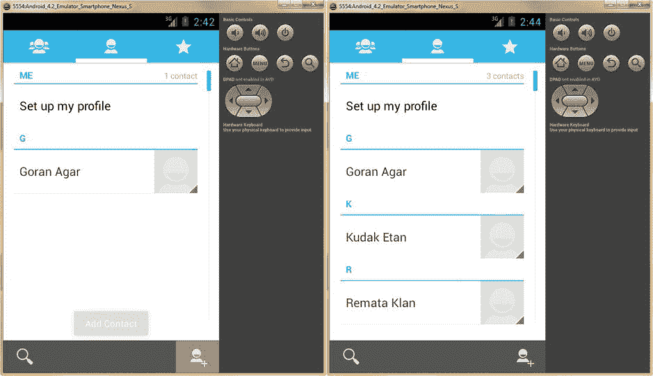

[图 19-19](#_Fig19) 。查看添加的外星人联系人，并重复添加库达克·艾坦和雷玛塔·柯兰的工作过程

在联系人数据库列表屏幕的右下角，在这个时间点上，只显示了我们的外星朋友 Goran Agar，如果你仔细看，你会看到一个方形的灰色头像图标，旁边有一个+符号。这允许你添加另一个联系人到你的联系人数据库，所以现在点击这个图标，我们将添加更多的外星人到我们的银河联盟。

添加另外两个来自 Jem Hadar 种族的外星人，名为 Remata Klan 和 Kudak Etan，使用与前面概述的相同的工作流程。一旦你这样做了，联系人数据库列表屏幕应该看起来像在图 19-19 中的截图的右边。

现在，我们的外星人联系人数据库中有足够多的外星人来测试我们的应用！

在测试我们的 AlienContact.java 活动之前，我们需要能够从我们的主屏幕选项菜单访问它，所以让我们接下来这样做，以便我们可以测试我们的 listAliens()方法，现在我们已经有了(Alien)联系人数据库中的数据来这样做。

将 AlienContact 活动添加到主屏幕菜单

要添加新的选项菜单项，我们需要做的第一件事是在 strings.xml 文件中为菜单标签创建一个<string>常量。</string>

按照我们其他菜单字符串常量的格式，让我们创建一个名为< string >标签的 **menu_contact_planet** ，菜单标签值为 **Make Alien Contact** ，并将其放在我们其他菜单字符串常量下的 strings.xml 文件中，如图[图 19-20](#Fig20) 所示。您的<字符串>标记的 XML 标记应该如下所示:

```java
<string name="menu_contact_planet">Make Alien Contact</string>
```

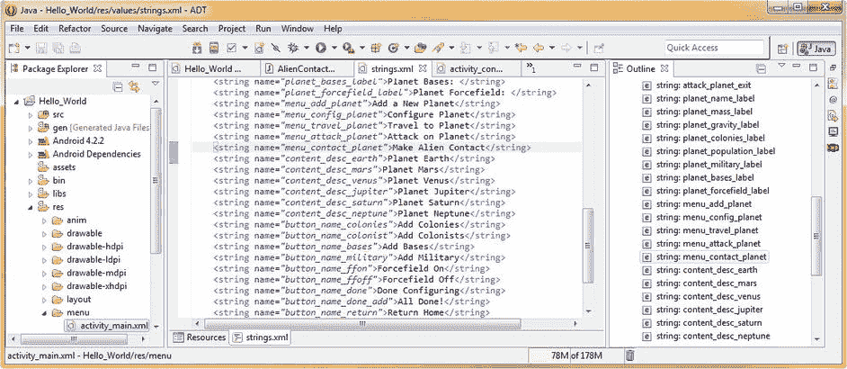

[图 19-20](#_Fig20) 。将名为 menu_contact_planet 的第五个菜单项标签 Make Alien Contact 添加到我们的 strings.xml 中

完成后，我们将准备好更改 **activity_main.xml** 文件中的占位符第五个菜单项，该文件位于 **/res/menu** 子文件夹中，带有“创建外国人联系人”菜单选项，该选项将调用我们的 AlienContact.java 活动子类。记住我们的应用有两个 activity_main.xml 文件，一个在用于 UI 的**/布局**中，一个在用于菜单设计的**/菜单**中。

右键单击 **/res/menu** 文件夹中的 **activity_main.xml** 文件，选择**打开**选项(或者在包浏览器中选择文件名，然后点击 **F3** )。编辑文件中最后一个占位符项，使 android:id 设置为 **menu_contact** ，编辑 android:title 参数引用**@ string/menu _ contact _ planet**，如图[图 19-21](#Fig21) 所示。

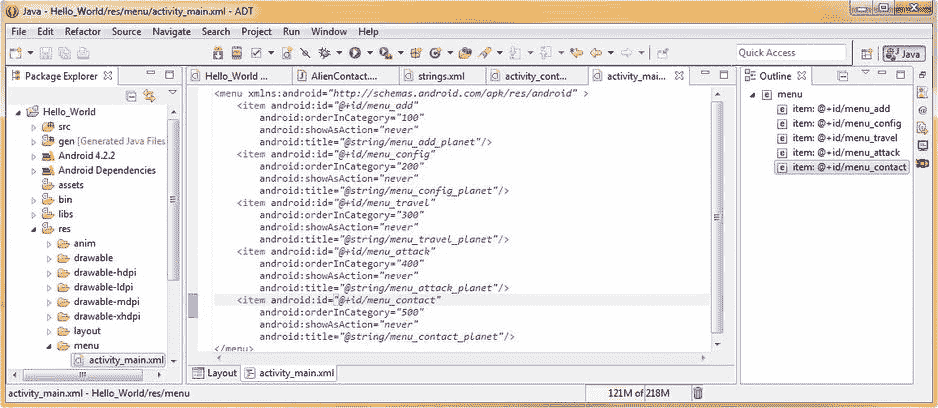

[图 19-21](#_Fig21) 。将我们的第五个菜单<项目>占位符标签更改为 menu_contact 以访问创建外星人联系人

因为我们的 **onCreateOptionsMenu( )** 方法已经扩展了我们的菜单 XML 文件定义，所以我们接下来逻辑上需要做的是修改我们的 **onOptionsItemsSelected( )** 方法，并添加一个 **case 语句**，它处理 **menu_contact** ID 并启动我们的**AlienContact.java**活动子类。

在 Eclipse central 编辑窗格中打开您的 MainActivity.java 活动，并关闭除 onOptionsItemSelected()之外的所有方法，如图 19-22 所示。然后，添加一个 **case R.id.menu_contact:** 语句，创建一个 **intent_contact** Intent 对象，并将其设置为调用新的 **AlienContact** 类。最后，调用**。startActivity( )** 方法，使用这个 Intent 对象，然后使用**break；**退出本节的 case 语句。

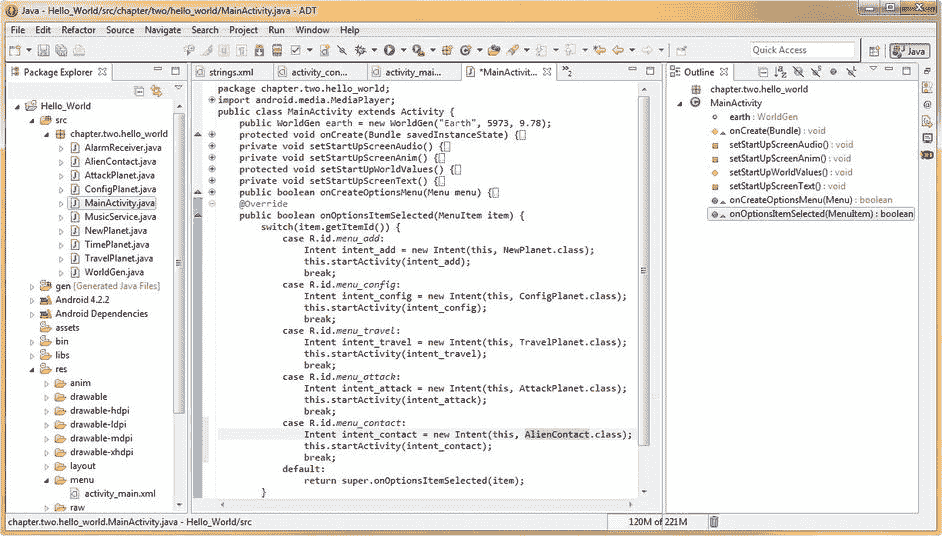

[图 19-22](#_Fig22) 。在 switch()方法 case 语句中添加 menu_contact 条目，打开 AlienContact 活动

第五个菜单项 case 语句代码应如下所示:

```java
case R.id.menu_contact:
    Intent intent_contact = new Intent(this, AlienContact.class);
    this.startActivity(intent_contact);
    break;
```

既然我们已经使我们的用户(和我们自己)能够启动 AlienContact.java Activity 子类，我们可以测试我们的 activity_contact.xml 用户界面设计和实现它的 Java 代码，以及将读取我们在上一节中刚刚创建的 Alien Contacts 数据库条目的 ContentResolver。

右键单击你的 Hello_World 项目文件夹，然后选择 **Run As Android Application** 菜单序列，或者，如果你喜欢，利用**窗口 Android 虚拟设备管理器**工作进程，我们在本章前面使用它来启动模拟器。

测试 AlienContact 活动中的 listAliens()方法

一旦 Nexus S 模拟器启动，找到 Hello_World 图标(土星)并启动应用。如果您使用了“作为 Android 应用运行”菜单序列，这将为您自动完成。

一旦 Hello_World 主屏幕出现，点击模拟器右上角的菜单按钮，调出我们刚刚创建的选项菜单，如[图 19-23](#Fig23) 左侧所示。

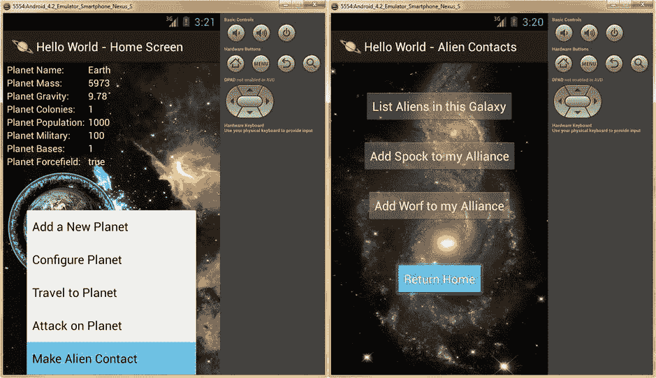

[图 19-23](#_Fig23) 。选择创建外国人联系人菜单项，启动外国人联系人活动测试返回主页按钮

选择菜单底部的创建外来联系人菜单项，打开[图 19-23](#Fig23) 右侧显示的外来联系人活动用户界面屏幕。

单击“返回主页”按钮以及“添加 Spock”和“添加 Worf”按钮，并确保它们调用 finish()方法，将您带回 Hello_World 应用的主页屏幕。

一旦你完成了测试，再次点击模拟器中的菜单按钮，进入 AlienContact.java 活动子类，这样我们就可以测试**列出这个星系中的外星人**按钮，并确保它遍历我们的外星人联系数据库，使用光标对象，并列出精英杰姆·哈达尔星系间种族的所有外星人联系。

当你点击[图 19-24](#Fig24) 左侧所示的“列出这个星系中的外星人”按钮时，你会看到在用户界面屏幕的底部出现 Toast 消息，列出了你的外星人联系数据库中的所有三个 Jem Hadar 种族成员。

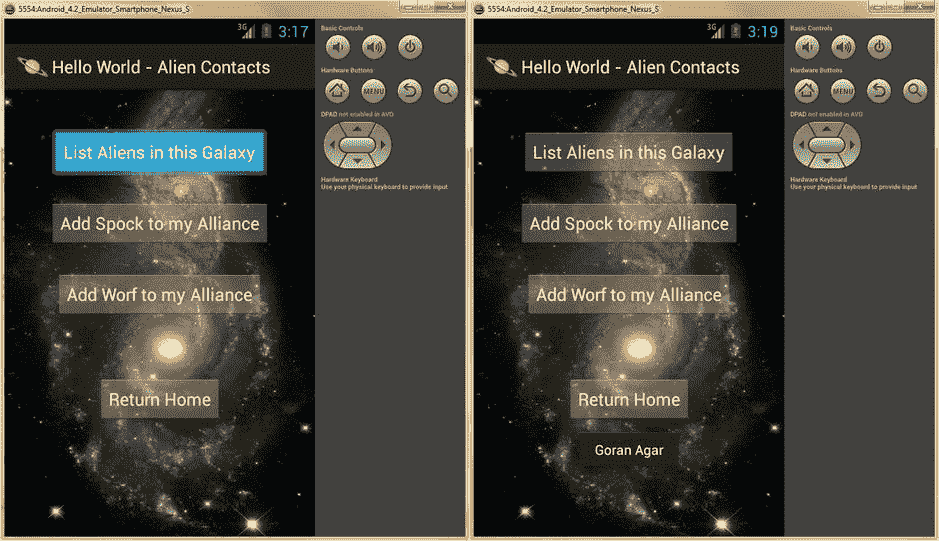

[图 19-24](#_Fig24) 。使用列出银河系中的外星人按钮及其 Toast 消息测试列出外星人方法

Goran Agar 的 Toast 消息显示在图 19-24 中截图的右下方，因此我们的 ContentResolver Java 代码运行良好。接下来，让我们编写另一个名为 **addToAlliance( )** 的 Java 方法，它向我们展示了如何使用 Android **ContentValues** 类，通过使用我们自己的定制 Java 代码，而不是必须使用 Android 操作系统的联系人管理实用程序，来使我们能够向我们的联盟数据库添加新的外星人联系人。

Android ContentValues:编写一个 addToAlliance()方法

打开 Eclipse 中的 AlienContact.java编辑选项卡，用对我们将要编写的新 **addToAlliance( )** 方法的方法调用替换 onClick()事件处理程序中对 **spockButton** 和 **worfButton** 代码块的 finish()方法调用。该方法调用的格式传递一个类似于 addToAlliance(字符串值)的字符串参数，因此 Java 代码行如下所示:

```java
addToAlliance("Spock");
```

一旦为 Spock 和 Worf 添加了 addToAlliance()方法调用，我们就需要编写**protected void addto alliance(String new alien)**方法。

我们在 addToAlliance()方法中做的第一件事是使用 Java new 关键字构造一个名为 **alienContact** 的 ContentValues 对象，使用下面一行 Java 代码:

```java
ContentValues alienContact = new ContentValues();
```

之后，我们可以用传递到方法中的 newAlien 参数字符串数据加载 alienContact ContentValues 对象。我们通过使用**来做到这一点。put( )** 方法，从 alienContact ContentValues 对象调用，第一个参数指示我们希望将数据放在哪里，第二个参数是要放入该字段的数据本身。这显示在屏幕底部附近的[图 19-25](#Fig25) 中。

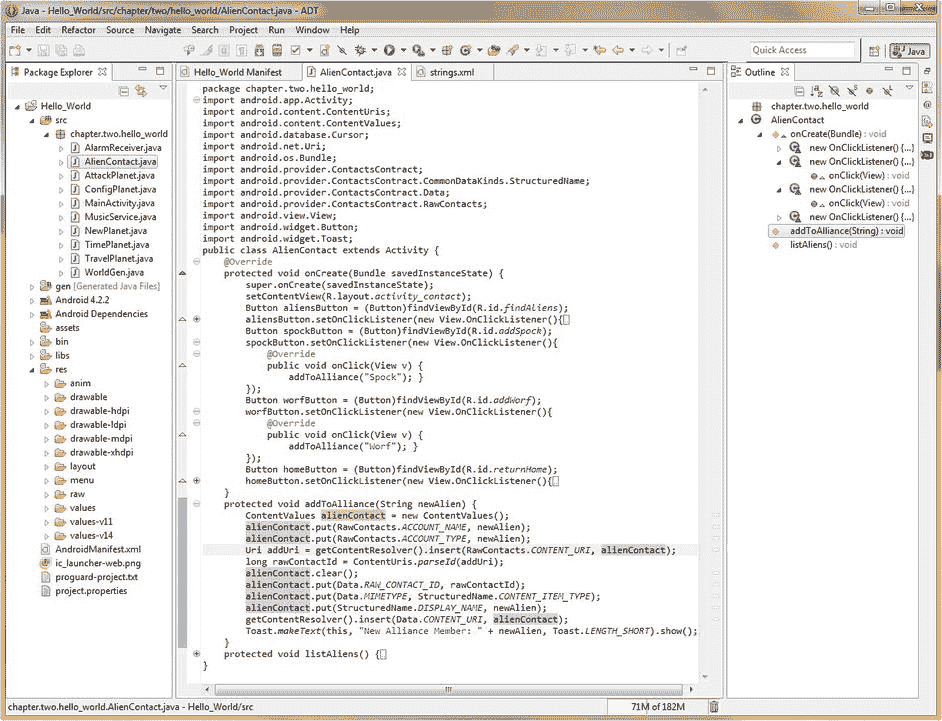

[图 19-25](#_Fig25) 。编写我们的 addToAlliance()方法来访问 ContentValues 类，通过它来添加外星人。放( )

如您所见，这是通过使用下面两行 Java 代码为我们希望在 ContentValues 对象中指定的数据库表 **RawContacts** 中的 ACCOUNT_NAME 和 ACCOUNT_TYPE 列(数据字段)完成的:

```java
alienContact.put(RawContacts.ACCOUNT_NAME, newAlien);
alienContact.put(RawContacts.ACCOUNT_TYPE, newAlien);
```

然后我们创建一个名为 **addUri** 的 **Uri** 对象，并将其设置为等于一个**getcontentresolver . insert()**方法调用的结果，使用数据库要写入的参数(插入数据)和要写入的数据。这是 RawContacts 数据库，使用 **RawContacts 指定。CONTENT_URI** 常量和**alien contact**CONTENT values 对象，现在加载了我们的 **newAlien** 字符串数据。这是使用以下单行 Java 代码完成的:

```java
Uri addUri = getContentResolver().insert(RawContacts.CONTENT_URI, alienContact);
```

接下来我们创建一个名为 **rawContactId** 的 **long** 变量，并将其设置为等于一个**content URIs . parseid(addUri)**方法调用的结果，这将把 **addUri** Uri 对象转换为与**兼容的 long 值格式。put( )** 我们即将调用的方法。这是使用以下单行 Java 代码完成的:

```java
long rawContactId = ContentUris.parseId(addUri);
```

请记住，当您键入这个新的数据库写操作 Java 代码时，您调用或使用的任何 Android 类，比如尚未导入的 ContentValues、ContentUris 或 ContentResolver，也就是说，在类的顶部为它编写的 import 语句(正如您已经看到的，Eclipse 将很容易为您完成)将在有问题的方法调用下面用红色波浪线突出显示。

既然我们在变量 **rawContactId** 中有了正确(长)数字格式的数据库 ID，我们现在可以使用**。clear( )** 方法来**清除**我们的 alienContact ContentValues 对象，以便我们可以再次使用它，将更多的数据值写入与 Android Contacts 数据库相关的其他数据库中。这一行 Java 代码应该如下所示:

```java
alienContact.clear();
```

这就是 Android 中数据库编码难的原因；正如我在本章开始时提到的，与用于访问(或写入)数据的 Java 代码相比，它更多地涉及如何建立数据库层次结构的复杂性。您将在这里看到这一点，因为我们将讨论如何使用 rawContactId 将您写入 RawContacts 数据库表的相同数据写入相关的 data 和 StructuredName 数据库表。

首先，我们需要将 **rawContactId** 值放入**数据中。RAW_CONTACT_ID** 数据库表，使用。put()方法，只需一行 Java 代码:

```java
alienContact.put(Data.RAW_CONTACT_ID, rawContactId);
```

然后，我们需要使用下面一行 Java 代码，将 StructuredName 数据库表的 **CONTENT_ITEM_TYPE** 数据列中的数据值放入 data 数据库表的 **MIME_TYPE** 数据列中:

```java
alienContact.put(Data.MIME_TYPE, StructuredName.CONTENT_ITEM_TYPE);
```

然后我们需要将我们的 **newAlien** String 对象(别名)放入 **StructuredName** 数据库表的 **DISPLAY_NAME** 数据列中，如下所示:

```java
alienContact.put(StructuredName.DISPLAY_NAME, newAlien);
```

最后，我们可以使用我们在过去几行代码中构建的 **CONTENT_URI** 和**alien contact**CONTENT values 对象，将所有这些与我们已经建立的 RawContacts 数据库相关的数据插入到**数据**数据库表中。我们将再次通过使用我们可信的 **getContentResolver()来实现这一点。insert( )** 方法调用，使用下面的 Java 代码:

```java
getContentResolver.insert(Data.CONTENT_URI, alienContact);
```

现在，我们准备向最终用户敬酒，并告诉他们我们刚刚做了什么，以便他们知道 newAlien 已经作为新联盟成员添加到 RawContacts(和 Data)数据库表中。这是使用下面一行代码完成的，它将两个方法链接在一起:

```java
Toast.makeText(this, "New Alliance Member: " + newAlien, Toast.LENGTH_SHORT).show();
```

让我们通过 Android Nexus S 模拟器中的 AlienContact.java 活动来测试我们的新 **addToAlliance( )** Java 方法，看看我们的新联盟成员 Spock 和 Worf 是否被添加到外星人联系人数据库中。

启动 Nexus S 模拟器，当 Hello_World 主屏幕出现时，点击菜单按钮，选择**与外星人联系**菜单选项。

一旦活动屏幕出现，点击你的**添加史巴克到我的联盟**和**添加武夫到我的联盟**按钮，并确保吐司消息出现在用户界面屏幕的底部。目前看起来很棒！

现在，我们剩下要做的就是确认外星人的联系人数据确实已经正确地添加到 Android 联系人数据库中，就像我们已经使用之前使用的联系人管理实用程序完成的一样。

如果我们正确编写了数据库代码，那么当我们下一次输入 Android 联系人管理实用程序时，我们的新外星人联系人数据将会出现在该实用程序中，就像我们使用该实用程序直接添加它一样。如果我们没有正确地编写数据库结构，数据就不会出现在那里。

退出 Hello_World 应用，返回到 Smartphone 模拟器主屏幕，并像我们在本章前面所做的那样，单击屏幕左下角的联系人管理图标。当你的(外星人)联系人列表出现时，当你向下滚动时，你会看到斯波克和沃夫现在出现在你的联系人数据库列表中，并且按字母顺序排列正确！

请注意，如果您愿意，您也可以使用应用中的“列出外星人”按钮进行测试，以确保这两个外星人也已添加。

摘要

在这最后一章中，我们仔细研究了 Android 操作系统中最复杂和详细的领域之一:数据访问、内容提供者和 SQL 数据库管理系统。这是一个确实需要单独的书来讨论的话题，所以，为你出色完成的学习工作而自我表扬一下吧。

我们首先看了一下数据库术语和基础知识，这样我们就在同一页上了。我们学习了 SQL 和数据库表、数据行(记录)和数据列(字段)，以及如何通过 ID、键或索引访问数据。

然后我们看了一下开源 MySQL 数据库技术，以及这个开源 DBMS 引擎的内存高效版本，它是 Android 操作系统 SQLite 的一部分。我们学习了 SQLite 数据类型以及在 Android 操作系统中使用 SQLite 的注意事项。

接下来，我们概述了 Android 内容提供商和 Android 内容解析器，以及 Android 操作系统可以访问存储数据的不同位置，包括首选项、内存、SD 卡、内部文件系统、内部 SQLite 数据库和远程数据服务器。

然后，我们看了看如何使用内容 URI 访问数据库表中的数据。我们查看了内容 URI 结构的不同部分，将一些样本 URIs 放在一起，最后看一下在 Android 操作系统中使用内容 URI 的约定。

接下来，我们看了一下最著名的内容提供商 Java 接口，这些接口是 Android 操作系统的一部分，用于用户经常使用的联系人、日历和媒体商店功能。我们列出了这些数据库的各种子表，然后查看了 Android 2.1 之前使用的废弃数据库。

最后，是时候为我们自己的 Hello World Android 应用添加内容提供商功能了。我们使用 Eclipse 中的可视化权限编辑器向 AndroidManifest.xml 文件添加了权限，然后创建了一个 AlienContact.java 活动和所有字符串常量、用户界面设计、菜单设计和方法，这些都是实现对内置 Android Contacts 数据库结构进行读写所需要的。

最后，我们学习了 Android 联系人管理实用程序，这样我们就可以测试我们的数据库代码，并创建读取我们的外星人联系人数据库并将新的外星人写入我们的外星人联系人数据库的方法。

恭喜你，你已经完成了对 Android 操作系统及其许多关键特性、包、方法和类的全面介绍。现在，请确保并实践您在这里学到的知识，并通过查看 Android 开发者网站上的所有最新信息来建立这些知识。