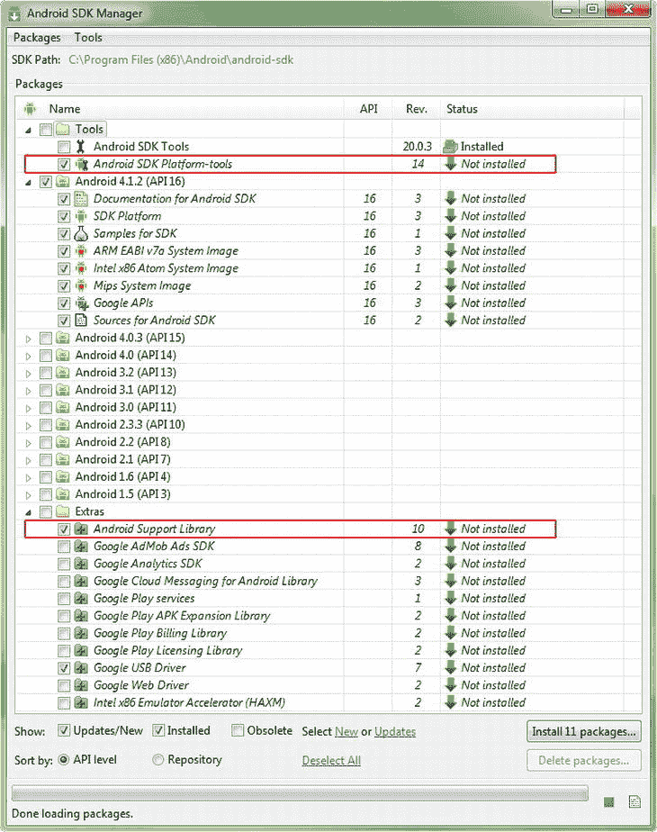

# 二十、附录 A：为 4.12 版和更早版本构建 Android IDE:获取、安装和配置 Android 开发环境

这个附录与这本书的第一章紧密匹配，事实上，这本书的第一章是我在 Android OS 处于 4.1.2 版本时写的，没有 ADT 捆绑包，因此 Android 开发环境必须在开发人员这边从头开始构建。随着 Android 4.2 的出现，谷歌将所有东西都放在了他们这边，并允许开发人员只需下载一个 400MB 的“ADT 捆绑包”，从而从工作流程中删除了几十个步骤。这些步骤包含在本附录中，以便您可以了解它们是(曾经是)什么。

通读本附录将使您对 Eclipse IDE 和 Android SDK 如何通过 ADT 插件和 Eclipse 4.2 的 Google 插件联系在一起有所了解。

因此，本附录中的某些内容与第一章中的内容相同或相似。

对我们这些 Android 应用开发者来说，幸运的是，只需几百美元就能买到非常强大的 64 位电脑。如果你有一台 32 位的电脑，这对于 Android 应用开发来说同样适用，因为 Android 4.1 操作系统目前也是 32 位的。Android 4.2 还增加了跨 Eclipse 和 ADT 运行 64 位开发环境的选项，因此从 4.2 版本开始，使用 64 位系统的用户现在可以使用 64 位软件进行 Android 开发。

此外，我们在本书中用于应用开发的大多数软件都是免费的商业用途，也称为开源软件，因此，现在启动自己的 Android 应用软件开发业务的成本确实很低。

我们的攻击计划

在本附录中，我们确保我们的系统拥有最新版本的 Oracle Java 6 软件开发套件(Java SDK，也称为 JDK 或 Java 开发套件)编程环境以及 Android 软件开发套件(Android SDK)。在下载并安装了我们的 JDK 之后，我们将下载并安装一个名为 Eclipse 的集成开发环境(IDE)。

Eclipse 通过提供一个灵活的图形用户界面(GUI)使开发 Android 应用变得更加容易，我们可以用它来编写、运行、测试和调试我们的 Android 应用代码。Eclipse 运行在 Java 运行时环境(JRE)之上，因为 Eclipse 是用 Java 编写的，因此使用 Java 平台运行自己的代码，这些代码构成了 Eclipse IDE 用户界面和特性集。这是我们首先下载并安装 Java 6 JDK 的主要原因，以便 Java SDK 和 JRE 在我们的工作站上就位，以便当我们开始安装 Eclipse 时，它可以找到 Java 运行时环境(以便 Eclipse 可以启动或运行)，并且它可以使用 Java SDK 为我们的 Android 开发环境构建编程代码基础。

一旦我们在 Java 6 上安装了 Eclipse 并顺利运行，我们将下载 Google Android 软件开发工具包(SDK ),并将其与 Java 6 SDK 和 Eclipse Juno 4.2 for Java EE 一起安装。一旦正确安装和配置了 Android SDK 和 ADT 插件，它们将使用额外的 Android 相关工具和特性来修改(增强)Eclipse IDE，所有这些将从本质上把 Eclipse Juno 4.2 for Java EE IDE 变成一个高度定制的 Android 应用 IDE。

作为 Android SDK 安装过程(第二部分)的一部分，我们将安装 Android Developer Toolkit (ADT)插件，这些插件将驻留在 Eclipse 内部(插件),用于将 Android SDK 和 Java 6 SDK“桥接”到一个统一的 Android 软件开发环境中。作为 ADT 安装过程的一部分，您需要连接到互联网才能执行，您的工作站与 Google 服务器上的 Android 软件存储库进行对话，并检索更多的 Android 软件 API，以完善您的 Android 开发环境。

从鸟瞰图来看，如果这个过程被公式化为一个方程，它看起来会像这样:

**JDK 6(Java 6 SDK)+Eclipse 4.2 IDE+Android SDK+ADT Eclipse 插件=自定义 Android IDE**

让我们现在就开始这个漫长而复杂的过程，这样我们就可以完成它并开发应用了！

Android 编程基础:Java 6

从编程和集成开发环境(IDE)的角度来看，Android 应用开发的基础是 Java 6。Android 应用是使用 Java 编程语言编写的(也使用 XML，我们将在第二章中更详细地讨论)，Android 应用是在 Eclipse IDE 中开发的，Eclipse IDE 也是用 Java 编程语言编写的，并且运行在 Java 6 运行时环境(JRE)之上。委婉地说，你设置组成你的 Android 开发环境的软件组件的确切顺序是非常重要的！

因此，我们既有 Java 编程语言(我们可以通过 Java 开发工具包(JDK)获得)又有 Java 运行时环境(JRE )(它是 JDK 的一部分) ,我们将转到 Oracle TechNetwork，下载最新的 JDK6 安装软件并将其安装在我们的计算机上。我们这样做首先是因为 Eclipse 需要 Java 来运行，也就是说，Eclipse 可以说是在 Java 平台和语言的“顶部”运行。Android 的 Android 开发工具(ADT)插件也需要 Java 和 Eclipse，所以我们首先安装 Java 平台和环境，然后是 Eclipse，最后是 Android。

安装 JDK

我们必须做的第一件事是进入 Java SDK 下载页面。有两种方法可以做到这一点；一个是通用的，一个是精确的。即使 Oracle 更改了其 Java SDK 下载页面的位置(很可能不会更改),通用的方法仍然有效，那就是使用带有关键字短语“Java SDK Download”的 Google 搜索，这将显示 Oracle TechNetwork Java 下载 URL。第二种方法是直接在浏览器中键入页面的 URL。这是:

```java
[`www.oracle.com/technetwork/java/javase/downloads/index.html`](http://www.oracle.com/technetwork/java/javase/downloads/index.html)
```

这指向 Internet (HTTP)和 Oracle 网站，它们位于 Java 区域(子文件夹)中的技术网络区域(文件夹)或下载区域(子子子文件夹)中的 Java SE 或“标准版”区域(子子文件夹)。Java 有三个主要版本:面向个人用户的 SE 或标准版，面向大量用户的 ee 或企业版，以及面向移动翻盖手机的 ME 或 Micro 版。如今，大多数现代智能手机都使用 Android 和 Java SE，而不是 Java ME。Android 非常酷的一点是它像 PC 一样使用 Java 的完整标准版。这是因为 Android 运行在完整版本的 Linux 操作系统内核之上，所以对于所有实际用途来说，Android 消费电子设备本质上是一台计算机。

在你输入这个 URL 之后，你就到达了 Java 6 JDK 下载页面，你需要找到页面的 Java 6 JDK 下载部分，它看起来就像图 A-1 所示的(部分)页面部分。


图 A-1。Oracle TechNetwork Java SE 网页的 Java SE 6 JDK 下载部分

点击图所示 JDK 下的蓝色**下载**按钮(记住，JDK 是*同时是*JDK 和 JRE)进入 Java 6 JDK 下载页面，在这里您将接受软件许可协议并下载 Java 6 的 Windows 32 位版本。因为 Android SDK 和 ADT 目前都是 32 位软件，所以 Java EE 我们会用 32 位版本的 Java 6 和 Eclipse 4.2，这样一切都是 100%兼容的。

请记住，32 位软件在 64 位操作系统和工作站上运行良好，因此不会有任何问题。一旦 Android SDK 和 ADT 出现 64 位版本，我们最终可能能够拼凑出一个 64 位的 Android 开发环境(相信我，我已经尝试过了)。也许 Android 4.2 将使用 64 位 Java 6 和 Eclipse，如果是这样，我将包括一章关于组装 64 位 Android IDE 的内容，我保证。

才能下载 x86 Windows 32 位。exe 文件，必须点击网页部分顶部“接受许可协议”选项旁边的单选按钮选择器，如图图 A-2 所示。


图 A-2。接受 Java 6 SE 许可协议，下载 Windows x86 32 位版本。exe 文件

一旦你这样做了，右边的下载链接就会变成粗体，你可以点击它们来下载安装文件。点击**jdk-6u37-windows-i586.exe**链接(或者任何最新的更新版本)，然后下载到你工作站上的下载文件夹。

在我们安装当前的 Java 6 JDK 之前，我们应该检查我们的系统，以确保我们的工作站上没有安装现有的(旧的)Java 版本。这是在 Windows 中通过控制面板完成的，控制面板可通过 Windows 开始菜单访问。现在启动控制面板，找到标记为“程序和功能”的图标，启动如图图 A-3 所示的程序和功能对话框。


图 A-3。右键单击现有的 Java 安装，选择卸载选项将其从系统中移除

注意，在我的工作站上，我已经安装了 Java 6 Update 31。因为我想在这个安装过程中安装最新的开发软件，所以我将使用完全相同的工作过程卸载以前的 Java 6 Update 31 安装，以及任何旧版本的 Eclipse 和 Android(如果它们存在，但它们不在这个特定的工作站上)。要做到这一点，你可以选择旧版本的 Java，右击它，选择**卸载**选项，如图图 A-3 所示。然后，Windows 将从您的系统中删除旧版本的 Java(如果需要，还有 Eclipse 和 Android)。

现在进入你的下载文件夹(或者你的桌面，或者任何你放下载的地方)，双击**jdk-6u37-windows-i586.exe**文件开始 Java 6 的安装。接受安装的默认设置，如果您有一个配有高速硬盘和至少 3GB 内存的现代工作站，安装过程应该会很快。一旦 Java 6 安装完成，您就可以下载并安装 Eclipse Juno 4.2 for Java EE 了。接下来让我们这样做，这样我们就有了一个用于 Android 开发的 IDE。

安装集成开发环境:Eclipse

Android 的开发环境基于一个独特而强大的开源软件 Eclipse。Eclipse 是一个 IDE，或集成开发环境，它非常类似于一个字处理器，但它不是发布文档，而是用于编写、测试和调试编程逻辑。Eclipse 支持许多不同的编程语言，其中最流行的(您将很快从 Eclipse 下载页面中看到)是 Java。对我们来说幸运的是，Java 是 Android 用于其开发环境的东西，因此这也是我们将要下载和安装的东西。

我们必须做的第一件事是访问 Eclipse IDE 网页，有两种方法可以做到这一点；一个普通，另一个精确。即使 Eclipse 改变了其网页的位置(它很可能不会改变),通用的方法是使用 Google 搜索，关键字短语“Eclipse IDE”会显示 Eclipse 网站的 URL。第二种方法是在浏览器中直接输入网页的 Eclipse 网站 URL。这是:

```java
[`www.eclipse.org/`](http://www.eclipse.org/)
```

一旦你输入这个 URL，你就到达了 Eclipse 网站的主页，你需要找到 Eclipse IDE 下载横幅，它看起来像图 A-4 。


图 A-4。下载 Eclipse 主页上的 Eclipse 按钮

单击 Download Eclipse 按钮后，就会转到下载页面，在这里选择第一个也是最受欢迎的下载，Eclipse for Java EE。图 A-5 显示了 Eclipse 下载页面的相关(顶部)部分，并显示了在哪里点击 32 位版本下载链接。


图 A-5。Eclipse Juno 4.2 IDE for Java EE 开发者下载 32 位 Windows 版本链接

点击**Eclipse IDE for Java EE Developers**for Windows 32-bit 链接后，您将被带到该 IDE 版本的下载页面(Eclipse Juno 4.2 Service Release 1 for Java EE 32-bit Windows XP、Vista、7 或 8 版本是本书撰写时的最新版本)。在那里，您可以从附近的一个镜像站点下载 Eclipse Juno JEE 软件。

226MB 下载完成后，打开 Windows 资源管理器文件导航和文件管理实用程序，找到。系统下载文件夹中的 zip 文件。如果找不到，请输入。zip 文件(如图 A-6 所示，用于此下载和安装),并在左侧选择您的计算机或 C:\ drive，Windows 资源管理器会为您找到该文件。


图 A-6。从一个镜像站点选择下载 Eclipse JEE Juno Service Release 1 for Windows 32 位 ZIP 文件

找到 Eclipse Juno for Java EE 安装程序文件后，右键单击它以获得一个上下文相关的菜单，其中包含可以对该文件执行的所有操作，然后选择 **Extract All。。。**选项提取里面的所有文件和文件夹。压缩档案到你的硬盘上。这显示在图中，A-7 用红色圈出。


图 A-7。从 Eclipse 中提取所有文件。在下载文件夹中右键单击下载的文件

接下来，您会看到一个提取压缩文件夹对话框，要求您选择一个目标目录，将 Eclipse 文件和文件夹层次结构提取到其中。如图 A-8 的顶部对话框所示，存档提取实用程序将文件的当前位置放入您的下载文件夹中作为其目标路径，这并不奇怪，因为它确实不知道您想将它放在哪里，所以它将自己放在。可以说，zip 文件目前是“立着的”。


图 A-8。将解压压缩文件夹路径从下载目录更改到更高的配置文件 C:/(根)位置

因为我们并不真的希望我们的 Eclipse 4.2 for Java EE IDE 安装在我们的 Downloads 文件夹中(我们主要用它来保存文件下载)，所以将它移到 C:\ primary hard disk drive 的顶部或“根目录”的最简单的工作过程是在文件名中单击 Eclipse 前面的光标，然后退格到 Users(这里是您的名字)，并下载自动生成的路径名的各个部分。

这样，在 eclipse 前面就有了 C:\ hard drive 说明符。您刚刚下载的 zip 文件名作为您的文件夹名称。这将把 Eclipse JEE Juno 安装在您的 C:\驱动器的根目录(顶部),在您的主硬盘分区上，您可以在任何需要的时候方便地看到和找到它。产生的路径如图 A-8 中屏幕截图的下部所示。

一旦你点击提取，你会得到一个小的进度对话框，显示所有的 3，427 个项目(250 兆字节)，正在迅速复制到您的硬盘驱动器。完成后，打开您的 Windows 资源管理器文件查看工具，并找到 eclipse.exe 可执行文件。

为此，打开左边的 C:驱动器，找到您下载并安装的 eclipse-jee-juno 文件名，在该文件名下，您将找到 eclipse 文件夹及其子文件夹，如图 A-9 所示。


图 A-9。找到 eclipse.exe 可执行文件，右键单击访问“固定到任务栏”选项，创建启动图标

在单词 eclipse 旁边寻找一个带有应用文件类型的紫色球体，这就是您的 Eclipse IDE 软件可执行文件。接下来，右键单击 Eclipse 应用文件以获得命令的上下文相关菜单，然后选择 **Pin to Taskbar** 命令。这将 Eclipse 作为一个快速启动图标安装在任务栏程序启动区域。该工作过程也如图图 A-9 所示。

从右键菜单中选择“固定到任务栏”命令后，Eclipse Juno 紫色球体启动图标会出现在 Windows 任务栏上，它通常位于屏幕底部，但也可以停靠在屏幕的顶部、左侧或右侧(通过拖动)。图 A-10 显示了我的系统上的 Eclipse for Java EE 启动图标以及其他开源软件(Gimp、Blender 3D、Audacity、Lightworks、OpenOffice、Chrome)，其中一些我们将在后面的附录中安装。


图 A-10。 Eclipse Juno 4.2 for Java EE 启动图标显示在 Windows 任务栏的左侧

单击一次 Eclipse 启动图标，确保 Eclipse 启动；如果是的话，这意味着您已经正确安装了 Java 6，并且 Eclipse 已经成功地找到了 Java，并且正在使用它来运行它的集成 Java 开发环境。现在我们有了用于 Java 开发的 Eclipse 4.2.1，让我们去获取 Google Android SDK，我们将使用它来定制 Eclipse，使 Eclipse 成为一个定制的 Android 开发环境以及 Java SE 和 Java EE 开发环境。

Android SDK 和 Android 开发者工具

Android Software Development Kit，或 Android SDK，本质上是需要安装在 Eclipse 中的所有代码和实用程序，这样 Eclipse IDE 不仅可以用于 Java 开发，还可以用于更专业的 Android 应用开发。

让 Android SDK 和 Android Developer Tools 插件成为 Eclipse Juno 4.2 for Java EE 的无缝组成部分实际上是一个六步流程:

1.  下载 70MB Android SDK 安装文件。
2.  运行安装程序，将 110MB 文件解压到硬盘上。
3.  运行 Android SDK 管理器，从 Google Android 软件仓库中获取更多 API 文件。
4.  安装 Android 开发工具和 Google Eclipse 4.2 插件。
5.  一旦 Android“接入”Eclipse，就可以在 Eclipse 中查看更多的软件更新。
6.  启动 Eclipse，看看能否创建一个新的 Android 应用项目。

如果您可以创建一个新的 Android 应用项目文件，那么您已经成功地使 Android 成为 Eclipse IDE 的一个无缝的、不可分割的部分，本质上使它成为一个 Android IDE。至此，您可以通过定制您的配置、检查最新的文件版本并安装一个模拟器来完成本书中对您的应用的测试。

首先，进入 Android 开发者网页。同样有两种方法可以做到这一点；一个普通，另一个精确。即使谷歌改变了其 Android 开发者网页的位置(它很可能不会改变)，通用的方法总是有效的，那就是使用谷歌搜索关键词短语“Android Developer Website”，这应该会显示出`Developer.Android.com`网站 URL。第二种方法是在浏览器中直接输入 Android 开发者网页的 URL。在这里(我建议你记住这个):

```java
[`developer.android.com/index.html`](http://developer.android.com/index.html)
```

一旦你输入这个网址，你就到达了 Android 开发者网站主页，你需要找到页面底部的**Get SDK**按钮，它看起来像图 A-11 。


图 A-11。选择获取 SDK 按钮，转到`Developer.Android.com`站点上的 Android SDK 下载页面

一旦你点击**获取 SDK** 按钮，你就会被带到**获取 Android SDK** 页面，在那里你会看到一个蓝色的大按钮，上面写着:**下载 Windows SDK**(或者 Linux 或 Macintosh，如果你正在使用这些操作系统的话)。单击此按钮下载 SDK 安装程序。exe 文件，如图图 A-12 所示。


图 A-12。在`Developer.Android.com`网站的获取 Android SDK 页面上，点击下载 Windows 按钮

下载文件后，使用 Windows 资源管理器在下载文件夹中找到它，就像我们对 Java 和 Eclipse 所做的那样，然后双击。exe 文件来运行安装程序(或使用右键单击并打开)。

一旦您启动 Android SDK 工具安装程序，您将看到选择安装位置对话框，如图图 A-13 所示。接受 Android SDK 工具设置实用程序建议的默认 Windows 程序文件文件夹，谷歌希望看到它被命名为 **Android** ，并在它下面有一个名为 **android-sdk** 的子文件夹。在 64 位工作站上，比如我正在使用的工作站，完整路径将是:**C:\ Program Files(x86)\ Android \ Android-SDK**，而在 32 位操作系统上，它将改为**C:\ Program Files \ Android \ Android-SDK**。


图 A-13。选择 Android SDK 工具安装过程的安装位置对话框显示默认的 Android 文件夹位置，点击下一步

这个对话框还显示了安装所需的空间，110MB，以及硬盘上的可用空间(我有一个 1TB 的硬盘，还有 867GB 的可用空间)。请注意，您将需要比这大得多的空间来安装其余的 Android APIs 和文档，因此请确保您的硬盘驱动器上有足够的 GB 可用空间。

一旦你点击下一步，你会看到选择开始菜单文件夹对话框，我也建议你接受 Android 为你选择的默认文件夹名称，即 **Android SDK Tools** ，如图图 A-14 所示。现在，您可以点击安装按钮，开始安装 Google Android SDK 了。


图 A-14。在 Android SDK 工具设置过程中选择开始菜单文件夹对话框，显示默认的 Android SDK 工具文件夹

一旦 110MB 的 Android SDK 文件在您的系统上安装完毕，就会出现一个名为**的对话框，完成 Android SDK 工具安装向导**，如图图 A-15 所示。确保选中 **Start SDK Manager** 复选框，这样一旦你点击 **Finish** 按钮，Android Developer Tools (ADT)插件和 Google Eclipse 4.2 插件就可以安装了。


图 A-15。在 Android SDK 工具设置过程中启动 SDK 管理器对话框(保持选中状态并点击完成按钮)

这可能有点令人困惑，因为您正在单击一个完成按钮，但您甚至还没有接近完成！谷歌完成了为 Android SDK 安装下载的“引导”文件，但 SDK 管理器接下来要做真正的繁重工作，通过互联网从位于硅谷的大型服务器农场上的谷歌 Android 存储库中安装更多文件。

无论如何，继续点击**完成**按钮，并启动如图图 A-16 所示的 Android SDK 管理器实用程序窗口。请注意，Android SDK 管理器预先选择了当前 Android 4.1 OS API 级文件进行自动安装。Android 开发者网站还推荐安装该屏幕上列出的另外两个软件包(我不确定为什么它们没有被检查为默认安装)，在图 A-16 中用圆圈标出(实际上是红色方块)。



图 A-16。 Android SDK 管理器自动选择 Android 4.1.2 并选择 Android 支持库和 SDK 平台工具

这些选项代表 Android SDK 平台工具和 Android 支持库。所以你也应该检查这些选项，一旦安装按钮显示“**安装 11 个包**”，然后点击它，现在在你的系统上再安装 11 个 Android 相关的包。这可能需要一些时间，尤其是如果你有一个较慢的互联网连接。

点击安装按钮后，您会看到**选择要安装的包** 对话框，您会发现有一个简单的**接受所有**单选按钮，您可以使用它来安装所有这些包，这样您就可以针对所有这些 Android 硬件设备技术(ARM、Intel、Mips 等)进行开发。)支持 Android 4.1 API Level 16。接下来，选择**接受全部**单选按钮，点击**安装**按钮继续，如图图 A-17 所示。


图 A-17。选择要安装的软件包对话框(选择全部接受选项，然后单击安装按钮)

单击 Install 后，您会在 Android SDK 管理器的底部看到一个进度条，类似于图 A-18 中所示的内容，它会实时(如果您有足够的兴趣观看)向您显示当前正在下载哪个包，以及该包的 API 级别、修订号、完成传输的百分比、数据传输速率和下载该包的剩余时间。


图 A-18。从谷歌 Android 服务器仓库下载 SDK 平台 Android 4 . 1 . 2 API Level 16 revision 3

还要注意在图 A-18 中，在最右上角有一个图标，该图标打开一个 Android SDK 管理器日志窗口，该窗口实际上实时显示了正在进行的更详细的操作。


图 A-19。Android SDK 管理器日志窗口(通过图 A-18 最右侧显示的日志窗口图标打开)

一旦你的 Android 4.1 API 安装完毕，你就可以返回去安装你需要为你想要在 Android 市场上支持的设备开发的任何其他 API 级别。例如，最初的 Kindle Fire 使用 API 级别 10(目前为 2.3.7)，新的 Kindle Fire HD 使用 API 级别 15(目前为 4.0.4)。根据所销售的支持 API 的设备数量，这是两个更受欢迎的 API 级别。

请注意，您选择安装的每一个其他(以前的)API 级别都需要一些时间来下载，并且会在您的硬盘驱动器上安装数百兆字节的额外 Android 开发文件，因此在这样做之前，请绝对确保您需要为这些旧设备进行开发。

Eclipse 的 Android 开发工具插件

构建可靠的 Android 开发环境的工作流程的下一步是向 Eclipse 展示 Android SDK 素材所在的位置，并开始巩固 Eclipse 的 IDE 功能和 Android 的软件开发功能之间的“桥梁”。这是在 Eclipse 中通过您可能熟悉的插件完成的，插件是几十年前由软件开发人员发明的，他们希望让第三方开发人员在他们的软件中添加他们没有时间或资源自己编码的功能。插件在数字成像软件包中尤其普遍，如 Photoshop 和 GIMP，并允许将软件开发功能添加到 Eclipse 中，如能够将 Eclipse 从 Java 开发环境转变为 Android 开发环境。让我们通过任务栏启动 Eclipse，并插入 Android SDK 功能。

一旦 Eclipse 启动，接受 Users 文件夹中的默认工作区位置，然后单击 IDE 右上角的 Help 菜单，并选择菜单底部附近的“Install New Software”选项。在出现的**安装可用软件**对话框中，点击右上角的“Add…”按钮，向 Eclipse 添加一个新的软件库网址；在这种情况下，它将是谷歌的 Android 仓库之一。在出现的**添加存储库**对话框中，在第一个数据输入字段中输入:**Google Plug-In for Eclipse 4.2**，并在第二个数据输入字段中输入以下确切的 URL 位置:

```java
[`dl.google.com/eclipse.plugin/4.2`](http://dl.google.com/eclipse.plugin/4.2)
```

接下来，点击**确定**按钮。如果你想知道，`google.com`前的 **dl** 代表下载。

现在，您将看到 Eclipse 转到 Google 软件存储库，获取 Eclipse 中用于 Android 开发的插件，并用它们填充 Install Available Software 对话框的中心。选择**开发者工具**复选框和**Eclipse Google 插件**复选框，然后点击**下一步**按钮继续安装。一个**安装细节**对话框将很快出现，它将详细概述 Android 开发者工具(ADT)插件集合的内容，以及 Eclipse 4.2 的 Google 插件，该插件将新的 Eclipse 4.2 IDE 与 ADT 插件套件联系起来。

再次单击**下一个**按钮，出现一个对话框，允许您查看并接受与您正在使用的所有软件包相关的软件许可协议。选择**“我接受许可协议条款”**单选按钮选项，点击**完成**按钮进入安装软件(进度条)对话框，安装通过 Eclipse 将 Android SDK 连接到 Java SDK 的插件软件。

安装过程完成后，会弹出一个对话框，要求您重启 Eclipse，以便将新的更改(Android 插件)安装到内存中。重新启动的原因是，尽管软件已经安装到您硬盘上的 Eclipse 中，但是软件需要重新启动，以便将这些更改实际加载到您的系统内存中，这样它们就可以在运行时在 Eclipse IDE 中使用。

重启后进入 Eclipse，使用**文件新建项目。。。**菜单顺序查看您是否已经通过刚刚安装的 ADT 插件将 Android 开发功能正确安装到 Eclipse 中。

如果您在**新项目**对话框中看到一个名为**“Android”**的文件夹，并且它有用于创建 Android 应用、示例和测试项目的子文件夹，那么您已经成功地将 Eclipse 变成了一个可工作的 Android 软件开发环境！这里是命令链，可以这么说，关于什么与什么对话(连接或插入)，从 Java 到 Android，在这一点上:

**Java  Eclipse 用于 Eclipse 4.2 的谷歌插件 Android 开发者工具 Android SDK  Android App**

因此，您的 Android 应用使用来自 Android SDK 的函数，它将这些函数传递给 Android Developer Tools 插件，后者通过 Eclipse 4.2 的 Google 插件在 Eclipse 中实现这些函数，所有这些函数都运行在 Java SDK (Java 语言函数)和 JRE (Eclipse 运行在 Java 运行时环境之上，以便运行/运行)之上。咻！难怪它不是在公园散步设置和配置！

配置 Android 开发环境

最后，在我们进入本书其余部分的应用开发之前，让我们确保我们的 Android 开发环境得到了优化配置。这是在 Eclipse 中通过**窗口首选项**菜单序列完成的，它会打开 Eclipse 首选项对话框。在对话框的左窗格中，您会看到一个左侧带有箭头的 Android 部分，它打开了一个子部分，显示所有 Android 首选项配置区域。选择顶部的主窗口(单词“Android”)，你将得到主要的 Android 首选项设置区域，在顶部显示 **SDK 位置**，以及下面所有安装的 Android SDK API 级别。

您可能还会遇到**感谢使用 Android SDK** 对话框，要求您在 Eclipse 中与 Google 共享您的 Android 使用统计数据，以便 Google 可以改进他们的 ADT 插件产品。为了开发人员社区的利益，我选择允许这样做，因为正如 Enterprise First Officer Spock 曾经说过的那样:“许多人的需求超过了一个人的需求。”

确保 Eclipse 找到了 Android SDK 并将其设置到正确的安装位置，并且您安装的所有 API 级别都存在，然后单击底部的 **OK** 按钮。只是为了绝对确保你正在想尽一切办法，进入 Eclipse **Help** 菜单，并选择 **Check for Updates** 菜单项。我们这样做是为了确保您已经安装的所有软件都是最新版本。如果 Eclipse 发现了您最近安装的几十个包的更新，请不要惊讶，每当我在新的开发工作站上安装新的 Android IDE 环境时，它总是会发现更新的版本。

如果 Eclipse 确实找到了 Eclipse、Android 开发工具、Eclipse 4.2 的 Google 插件或任何 Android API 级别的包的任何可用更新，它会给你一个**可用更新**对话框。如果您看到此对话框，通过勾选每个更新旁边的框来选择要安装的可用更新，然后单击**下一个**按钮继续。

然后你会看到一个**更新细节**对话框，它会给你关于每个软件更新的更多细节。同样在该对话框中点击**下一步**，然后查看并接受最后一个**查看许可**对话框中显示的软件许可，并点击**完成**按钮开始安装过程。当软件更新下载时，您应该会看到一个**更新软件**进度条对话框，然后当软件下载并准备安装时，会出现一个**安全警告**对话框，告诉您将要安装未签名的内容。单击 **OK** 安装更新，然后当要求您重启 Eclipse 时，单击 **Yes** ，以便将更改加载到系统内存中，这样您现在就可以运行 Eclipse 的最新更新版本。咻！我们现在必须完成这个过程，对吗？！差不多！

配置您的 Android 虚拟设备

为本书的其余部分准备好您的 Android 开发环境的过程的最后一步是设置 Android 虚拟设备(AVD ),这是我们在本附录中预先做的，这样我们以后就不必再担心它了。AVD 是一个仿真器，允许您使用模拟 Android 智能手机或平板电脑的软件设备仿真器在工作站上测试您的 Android 应用。

这是可取的，因为将你的应用上传到实际的物理 Android 设备(硬件)上的工作过程比右键单击你的项目并选择运行要繁琐得多，我们将在第二章中看到这一点。这并不是说你不应该偶尔在真正的 Android 硬件设备上测试你的应用，而是 AVD 允许你以更高的速度和频率进行测试。

因为你刚刚最后一次重启 Eclipse，进入**窗口**菜单，选择底部附近的 **AVD 管理器**选项。这将打开 **Android 虚拟设备管理器**对话框，其中列出了您的 AVD，目前没有 AVD 设置，因此在对话框的中心区域显示:**没有可用的 AVD**。要向 Eclipse 环境添加新的 AVD，单击对话框右上角的 **New…** 按钮，打开**Create New Android Virtual Device**对话框。

首先要做的是命名模拟器，因此在**名称**字段中输入 **API_16_Emulator** 。然后为仿真器选择**目标**，这是仿真器的 API 级别，是 Android 4.1.2 或者 API 级别 16。从下拉选择菜单中选择:**Android 4.1–API Level 16**。接下来设置 SD 卡为普通 512MB SD 卡配置，勾选**快照启用**选项。接下来，设置默认的内置皮肤 **WVGA 800x480** ，因为大多数智能手机和平板电脑至少使用这个分辨率。

最后，你已经准备好创建你的第一个 Android 4.1 模拟器了，点击 **Create AVD** 按钮。如果您正在为其他一些流行的 API 级别进行开发，如果您需要测试您的应用在这些硬件平台上的交付，请利用相同的工作流程，并为 Kindle Fire (Android 2.3.7 API 级别 10)或 Kindle Fire HD (Android 4.0.4 API 级别 15)添加其他模拟器。