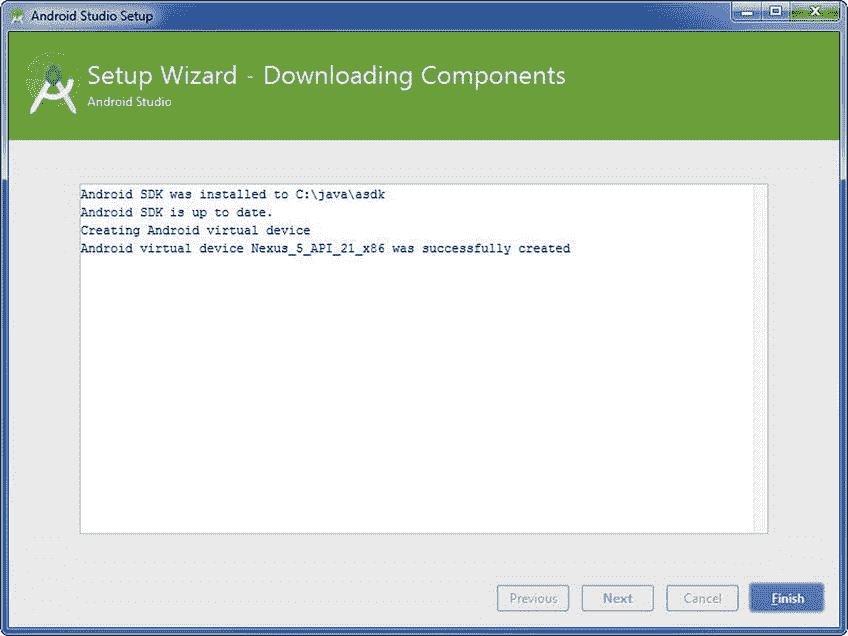
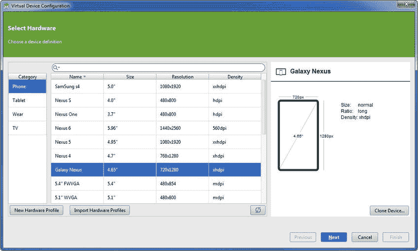
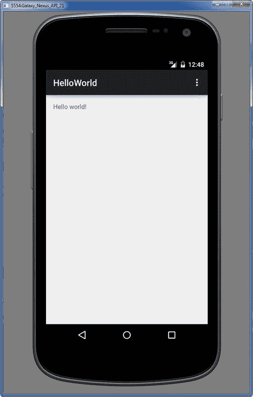
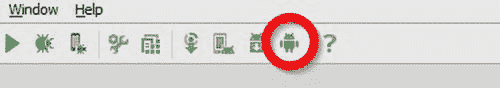

# 一、Android Studio 简介

本章将引导您安装和设置您的开发环境，以便您可以遵循本书中的示例和实验。首先，您将安装一个名为 Java 开发工具包(JDK)的必备组件。然后，您将下载并安装 Android Studio 以及 Android 软件开发工具包(SDK)，这是构建 Android 应用所需的一套软件工具。我们将向您展示如何使用 New Project 向导来创建一个名为 HelloWorld 的简单项目。最后，我们将向您展示如何建立到 Android 虚拟设备(AVD)和物理 Android 设备的连接。本章结束时，你将拥有在 Android Studio 中开始开发应用所需的一切。

## 在 Windows 上安装 Java 开发工具包

本节适用于 Windows 用户。如果您是 Mac 用户，请跳到“在 Mac 上安装 Java 开发工具包”一节 Android Studio 使用 Java 工具链进行构建，因此在开始使用 Android Studio 之前，您需要确保您的计算机上安装了 Java 开发工具包(JDK)。很有可能你的电脑上已经安装了 JDK，尤其是如果你是一个经验丰富的 Android 或 Java 开发人员。如果您的计算机上已经安装了 JDK，并且运行的是 1.6 版或更高版本，那么您可以跳过这一部分。但是，您可能还是想下载、安装和配置最新的 JDK。您可以从以下 Oracle 站点下载 JDK:

[T2`www.oracle.com/technetwork/java/javase/downloads/index.html`](http://www.oracle.com/technetwork/java/javase/downloads/index.html)

当你登陆这个页面时，点击 Java 下载按钮，如图 [1-1](#Fig1) 所示。

图 1-1。

The Java Download button on the Java Downloads page

### 在 Windows 上下载 JDK

如图 [1-2](#Fig2) 所示，安装的下一步要求您通过单击 Accept License Agreement 单选按钮接受许可协议。然后，您必须为您的操作系统选择合适的 JDK。如果你运行的是 Windows 7 或 Windows 8，你应该点击 Windows x64 标签右边的文件链接，也如图 [1-2](#Fig2) 所示。Oracle 经常对 JDK 进行版本更新。到本书付印时，几乎可以肯定的是，JDK 的新版本将会推出，所以请务必下载最新版本。等待安装文件下载。这个文件通常在 125MB 左右，所以下载不会花很长时间。

图 1-2。

Accept the license agreement and click the appropriate link for Windows

### 在 Windows 上执行 JDK 向导

在安装 JDK 之前，在您的`C:`驱动器的根目录下创建一个名为`Java`的目录。这个目录的名字是任意的，尽管我们称它为`Java`，因为我们要在这里安装的许多工具都与 Java 相关，包括 JDK、Android Studio 和 Android SDK。将与 Android Studio 相关的工具一致地安装在`C:\Java`目录中也可以让您的开发环境保持有序。

导航到浏览器下载安装文件的位置，双击该文件执行安装。安装开始后，会出现安装向导，如图 [1-3](#Fig3) 所示。在 Windows 中，JDK 安装程序默认为`C:\Program Files\Java\`。要更改安装目录位置，请单击“更改”按钮。我们建议将您的 JDK 安装在`C:\Java`目录中，因为它的路径名中不包含空格，而且容易记忆。见图 [1-4](#Fig4) 。

图 1-4。

Select the JDK installation directory

图 1-3。

Installation Wizard for the JDK on Windows

记下您安装 JDK 的位置。按照提示操作，直到安装完成。如果提示安装 Java Runtime Edition (JRE ),请选择安装 JDK 的目录。

### 在 Windows 上配置环境变量

本节将向您展示如何配置 Windows，以便 Android Studio 可以找到 JDK。在运行 Windows 的计算机上，按住 Windows 键并按下 Pause 键打开系统窗口。点击高级系统设置选项，如图 [1-5](#Fig5) 所示。

图 1-5。

Windows System window

点击环境变量按钮，如图 [1-6](#Fig6) 所示。在底部的系统变量列表中，如图 [1-7](#Fig7) 所示，导航到`JAVA_HOME`项。如果`JAVA_HOME`项不存在，单击新建创建它。否则，单击编辑。

图 1-7。

Environmental variables

图 1-6。

System properties

点击新建或编辑显示类似图 [1-8](#Fig8) 的对话框。确保在变量名字段中输入`JAVA_HOME`。在变量值字段中，输入之前安装 JDK 的位置(去掉任何尾随斜线)，如图 [1-4](#Fig4) 所示。现在点击确定。

图 1-8。

Edit the JAVA_HOME environmental variable

正如您对`JAVA_HOME`环境变量所做的一样，您将需要编辑`PATH`环境变量。见图 [1-9](#Fig9) 。将光标放在变量值字段的末尾，并键入以下内容:

图 1-9。

Edit the PATH environmental variable

`;%JAVA_HOME%\bin`

现在，单击确定、确定、确定接受这些更改并退出系统属性。

要测试新的 JDK 是否已正确安装，请单击开始按钮，键入 cmd，然后按 Enter 键。

在命令行窗口中，发出以下命令并按 Enter 键:

`java –version`

如果您得到如图 [1-10](#Fig10) 所示的响应，那么恭喜您。您刚刚正确安装了 JDK。

图 1-10。

Confirm the proper JDK installation

## 在 Mac 上安装 Java 开发工具包

安装 Mac 版和 Windows 版 JDK 的前两步是相同的。将您的浏览器指向以下站点:

[T2`www.oracle.com/technetwork/java/javase/downloads/index.html`](http://www.oracle.com/technetwork/java/javase/downloads/index.html)

当你登陆这个页面时，点击 Java 下载按钮，如图 [1-11](#Fig11) 所示。

图 1-11。

The Java Download button on the Java Downloads page

### 在 Mac 上下载 JDK

点击接受许可协议单选按钮，接受许可协议，如图 [1-12](#Fig12) 所示。然后，您必须为您的操作系统选择合适的 JDK。如果你运行的是 64 位版本的 OS X，你应该点击 Mac OS X64 标签右边的文件链接，也如图 [1-12](#Fig12) 所示。Oracle 经常对 JDK 进行版本更新。到本书付印时，几乎可以肯定的是，JDK 的新版本将会推出，所以请务必下载最新版本。等待安装文件下载。

图 1-12。

Accept the license agreement and click the appropriate link for Mac

### 在 Mac 上执行 JDK 向导

双击`.dmg`文件执行它。现在点击`.pkg`文件开始向导，根据需要点击继续，如图 [1-13](#Fig13) 到 [1-15](#Fig15) 所示。

图 1-15。

Installation success

图 1-14。

Installation Wizard

图 1-13。

JDK 8 Update 25.pkg

### 在 Mac 上配置 JDK 版本

要配置 Mac 以便 Android Studio 可以找到正确的 JDK，请打开 Finder 窗口并选取“应用”“➤实用工具”。在那里，打开 Java Preferences，并按照指示将新版本拖到列表的顶部，以便它被识别为首选版本。

## 安装 Android Studio

在开始下载 Android Studio 之前，为您将在本书中创建的 Lab 创建一个 Lab 父目录。我们在整本书中使用`C:\androidBook\`作为我们 Lab 的父目录，但是你可以选择或创建任何你认为合适的目录。因此，我们简单地称它为 labs 父目录。

下载 Android Studio 很简单。将您的浏览器指向此站点:

`developer.android.com/sdk/installing/studio.html`

现在点击绿色的下载 Android Studio for your OS 按钮，如图 [1-16](#Fig16) 所示。接下来，选中标记为“我已阅读并同意上述条款和条件”的复选框。再次单击 Download Android Studio for your OS，您的安装文件应该开始下载。下载完成后，执行刚刚下载的文件。

图 1-16。

Download Android Studio

安装向导开始后，通过单击“下一步”按钮浏览其屏幕，直到到达“选择组件”屏幕。在那里，选中所有组件复选框，如图 [1-17](#Fig17) 所示。然后单击下一步。再次同意条款和条件。当你进入配置设置:安装位置屏幕，如图 [1-18](#Fig18) 所示，选择 Android Studio 和 Android SDK 的位置。为了保持一致，我们选择在`C:\Java\astudio\`安装 Android Studio，在`C:\Java\asdk\`安装 Android SDK。

图 1-18。

Select locations for Android Studio and the SDK

图 1-17。

Choose components

安装 Android Studio 和 Android SDK 时，点击几个后续按钮。你应该最终到达完成 Android Studio 设置屏幕，如图 [1-19](#Fig19) 所示。“启动 Android Studio”复选框使 Android Studio 能够在您单击“完成”后启动。确保复选框被选中，然后点击 Finish，Android Studio 将启动。请注意，从现在开始，您需要导航到桌面图标或开始菜单来启动 Android Studio。

图 1-19。

Completing the Android Studio setup

当 Android Studio 第一次启动时，如图 [1-20](#Fig20) 所示，设置向导将分析您的系统，寻找现有的 JDK(如您之前安装的那个)，以及 Android SDK 的位置。设置向导应该下载你在 Android Studio 中开始开发应用所需的一切。单击“完成”按钮退出安装向导。

图 1-20。

Setup Wizard – Downloading Components

## 创建您的第一个项目:HelloWorld

一旦设置向导完成，欢迎使用 Android Studio 对话框出现，如图 [1-21](#Fig21) 所示。单击开始新的 Android 项目选项。

图 1-21。

Welcome to Android Studio

在出现的新建项目向导中(见图 [1-22](#Fig22) ，在应用名称字段中键入 HelloWorld，在公司域字段中键入 gerber.apress.com。请注意，包名是反向公司域加上项目名。将 HelloWorld 项目安装在 labs 父目录的根目录下。如前所述，如果你运行 Windows，我们使用`C:\androidBook\`。如果您运行的是 Mac 或 Linux，您的 Lab 父目录名称不会以字母开头，而是以正斜杠开头。

图 1-22。

Configure your new project

Android 操作系统可以在许多平台上运行，包括游戏机、电视、手表、眼镜、智能手机和平板电脑。默认情况下，手机和平板电脑复选框将被选中，API-8 将被选为最低 SDK。接受这些设置，点击下一步，如图 [1-23](#Fig23) 所示。

图 1-23。

Select the form factors your app will run on

新建项目向导中的后续屏幕提示您选择布局。选择空白活动，然后单击下一步按钮。接受默认名称，如图 [1-24](#Fig24) 所示。它们应该如下:

*   活动名称:主活动
*   布局名称:活动 _ 主要
*   标题:MainActivity
*   菜单资源名称:menu_main

图 1-24。

Choose options for your new file

## 使用 Android 虚拟设备管理器

Android 虚拟设备管理器允许您创建 Android 虚拟设备(avd)，然后您可以运行它来模拟您计算机上的设备。模拟和仿真之间有一个重要但微妙的区别。模拟意味着虚拟设备只是模拟实际物理设备行为的一个门面，但并不运行目标操作系统。iOS 开发环境使用模拟，考虑到该平台可用的设备数量有限，这可能是 iOS 的一个好选择。

但是，使用仿真时，您的计算机会留出一块内存来再现仿真器正在仿真的设备上的环境。Android Studio 使用模拟，这意味着 Android 虚拟设备管理器启动 Linux 内核和整个 Android 堆栈的沙盒版本，以便模拟物理 Android 设备上的环境。尽管仿真提供了一个比模拟更可靠的环境来测试你的应用，但是启动 AVD 可能需要几分钟，这取决于你的电脑速度。好消息是，当您的模拟器在内存中激活后，它仍然可以响应。然而，如果你有安卓手机或平板电脑，我们建议使用物理设备来测试你的应用，而不是使用 AVD。也就是说，让我们首先使用 Android 虚拟设备管理器设置一个 AVD，在本章的后面，我们将向您展示如何连接您的物理设备，如果您有物理设备的话。

点击图 [1-25](#Fig25) 中圈出的 Android 虚拟设备管理器图标。在 Andriod 虚拟设备管理器向导的第一个屏幕上，单击创建虚拟设备按钮。在下一个屏幕上，如图 [1-26](#Fig26) 所示，选择 Galaxy Nexus 并点击下一步。下一个屏幕如图 [1-27](#Fig27) 所示，允许您选择系统图像。为 ABI 为 x86_64 的 Lollipop(或最新的 API)选择第一个选项。单击下一步。在下一个屏幕上，单击完成按钮验证您的 AVD 设置。恭喜你，你刚刚创建了一个新的 AVD。

图 1-27。

Select the x86_64 system image

图 1-26。

Select the Galaxy Nexus hardware

图 1-25。

AVD icon Note

x86_64 版本需要英特尔硬件加速，它只能在有限数量的英特尔芯片组上运行。如果您尝试安装 x86_64 并且失败，请尝试 armeabi-vxx 版本。

Tip

如果您想要为 Android Studio 还没有设备定义的设备创建 AVD，我们建议您前往 [`phonearena.com`](http://phonearena.com) 并搜索您的型号。在那里你可以找到技术规范，你可以用它来创建一个新的设备定义。创建新的设备定义后，使用相同的步骤创建新的 AVD。

市面上有一款优秀的第三方 Android 模拟器，叫做 Genymotion。Genymotion 模拟器是免费的，用于非商业目的，性能非常好。解释如何设置和使用 Genymotion 超出了本书的范围，但是你可以从 [`genymotion.com`](http://genymotion.com) 下载 Genymotion 模拟器。

## 在 AVD 上运行 HelloWorld

要在新创建的 AVD 上运行你的 HelloWorld 应用，点击工具栏上绿色的 run 按钮，如图 [1-28](#Fig28) 所示。

图 1-28。

Run button

确保选择了 Launch Emulator 单选按钮，然后在组合框中选择 Galaxy Nexus API 21。点击确定，如图 [1-29](#Fig29) 所示。请耐心等待，因为启动 AVD 可能需要几分钟时间。你现在应该看到你的 HelloWorld 应用在你电脑的一个窗口中运行，如图 [1-30](#Fig30) 所示。

图 1-30。

Emulator screenshot

图 1-29。

Choosing a device and launching the emulator

## 在 Android 设备上运行 HelloWorld

如前所述，虽然 avd 对于模拟特定设备很有用，尤其是那些你手头没有的设备，但在物理 Android 设备上开发应用更受欢迎。如果当您通过 USB 电缆将 Android 设备连接到您的电脑时，您的电脑无法识别您的 Android 设备，您可能需要 USB 驱动程序。如果您的计算机最初识别您的 Android 设备，您可能应该放弃安装不同或更新版本的 USB 驱动程序，因为这可能会导致 USB 连接失败。

Note

Mac 和 Linux 用户通常不需要下载 USB 驱动程序来在其 Android 设备和计算机之间建立 USB 连接。

您可以使用`developer.android.com/tools/extras/oem-usb.html#Drivers`处的表格来查找合适的 USB 驱动程序，或者使用您喜欢的搜索引擎来查找适用于您的型号的 USB 驱动程序。下载驱动程序并安装在您的计算机上。在 Android 设备上，点击设置，然后点击开发者选项。确保选中了 USB 调试复选框。有些设备(如 Samsung 设备)需要密码才能启用 USB 调试，因此您可能希望使用您最喜欢的搜索引擎来研究如何在您的设备上启用 USB 调试。如果这个过程不是很明显的话，YouTube 也是一个很好的视频来源，可以教你如何在你的特定设备上启用 USB 调试。

大多数 Android 设备都配有一根电缆，一端有一个 USB 插头，另一端有一个微型 USB 插头。使用此电缆将您的 Android 设备连接到电脑。点击图 [1-31](#Fig31) 中圈出的 Android 设备监控按钮。如果驱动程序安装正确，你应该看到设备在那里列出并连接，如图 [1-32](#Fig32) 所示。

图 1-32。

Android Device Monitor screen showing the connected physical device

图 1-31。

Android Device Monitor button Note

请记住，您的计算机和 Android 设备之间的连接是通过使用一个名为 Android Debug Bridge (ADB)的服务器建立的。如果看不到该设备，请单击 IDE 左下角的终端按钮，并发出以下命令:

`adb start-server`

如果重新启动 ADB 服务器后，您仍然看不到该设备，虽然可能性不大，但 USB 驱动程序需要重新启动系统才能生效。

现在点击绿色的运行按钮(如之前图 [1-28](#Fig28) 所示)。选择连接的 Android 设备。在图 [1-33](#Fig33) 中，连接的设备是 HTC One X Android 智能手机。点击 OK，等待几秒钟，你会看到 HelloWorld 在你的 Android 设备上运行。

图 1-33。

The Choose Device screen with the physical Android device listed

## 摘要

在这一章中，你安装了 Java 开发工具包，或 JDK，你也安装了 Android Studio 和 Android SDK。您使用新建项目向导创建了一个名为 HelloWorld 的简单应用。然后你创建了一个 Android 虚拟设备，或 AVD。我们向您展示了如何安装任何所需的 USB 驱动程序。最后，我们向您展示了如何在 AVD 和物理 Android 设备上启动 HelloWorld。现在，您应该已经拥有了在 Android Studio 中开发 Android 应用所需的所有软件。