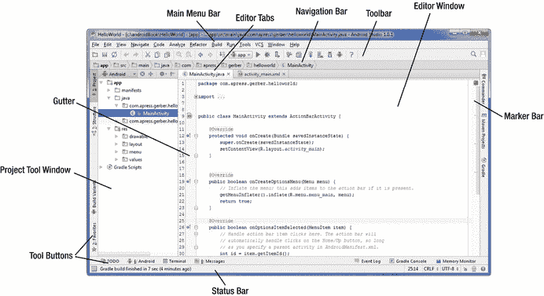
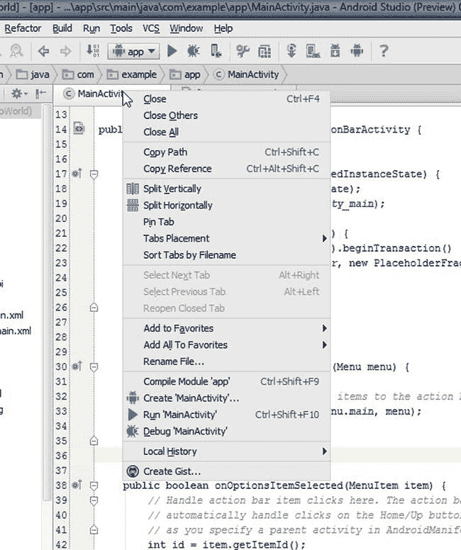
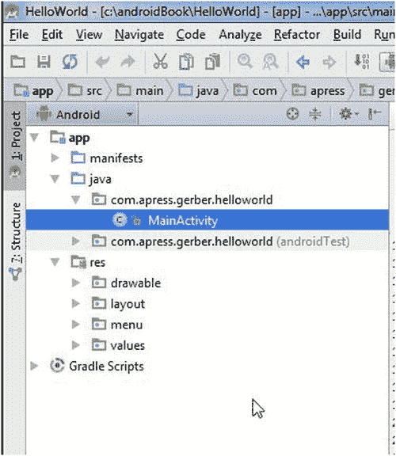
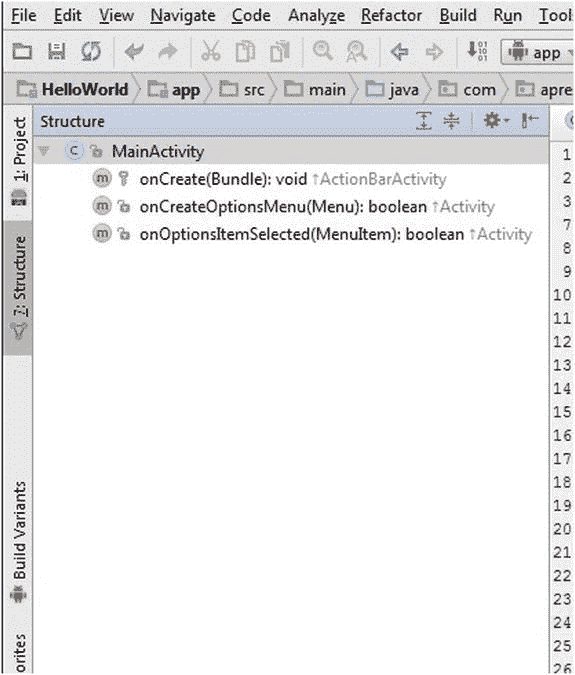
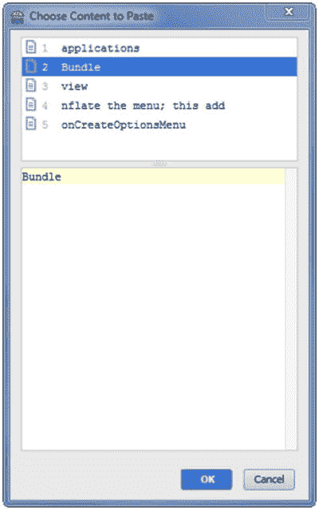

# 2.导航 Android Studio

Android Studio 是一个窗口环境。为了最大限度地利用有限的屏幕空间，并防止你不知所措，Android Studio 在任何时候都只显示一小部分可用窗口。其中一些窗口是上下文相关的，只有在上下文合适时才会出现，而其他窗口则保持隐藏，直到您决定显示它们，或者相反，保持可见，直到您决定隐藏它们。为了充分利用 Android Studio，您需要了解这些窗口的功能，以及如何和何时显示它们。在这一章中，我们将向你展示如何在 Android Studio 中管理窗口。

任何集成开发环境(IDE)的基本功能之一就是导航。Android 项目通常由许多包、目录和文件组成，一个中等复杂程度的 Android 项目可能包含数百个这样的资产。您使用 Android Studio 的效率将在很大程度上取决于您在这些资产中导航的舒适程度。在本章中，我们还将向您展示如何在 Android Studio 中导航。

最后，我们将向您展示如何使用 Android Studio 中的帮助系统。为了充分利用本章，打开我们在第 1 章中创建的 HelloWorld 项目。如果这个项目已经在 Android Studio 中打开，您就可以开始了。当我们讨论以下导航功能时，请参考图 [2-1](#Fig1) 。

图 2-1。

Android Studio’s integrated development environment

## 编辑

任何 IDE 的主要目的都是编辑文件。正如所料，允许用户在 Android Studio 中编辑文件的窗口位于 IDE 的中央窗格。编辑器窗口在窗口中是唯一的，因为它总是可见的，并且总是位于中心窗格。事实上，编辑器窗口是 Android Studio 的一个非常普遍的特性，从现在开始，我们将它简称为编辑器。Android Studio 中的所有其他窗口被称为工具窗口，聚集在编辑器周围的侧窗格(左侧、底部和右侧)中。

编辑器是一个选项卡式窗口，在这方面，它类似于当代的 web 浏览器。当您从其中一个工具窗口、键盘快捷方式或上下文菜单中打开文件时，该文件将显示为编辑器的一个选项卡。正如您在构建第一个项目 HelloWorld 时已经发现的那样，`MainActivity.java`和`activity_main.xml`文件会作为标签自动加载到编辑器中。Android Studio 试图预测您可能会开始编辑哪些文件，然后在完成新建项目向导后，自动在编辑器中以标签形式打开它们。几乎任何文件都可以在编辑器中打开，尽管原始图像和声音文件还不能在 Android Studio 中编辑。您也可以将文件从工具窗口拖放到编辑器上；这样做可以在编辑器中将文件作为选项卡打开。

编辑器顶部是编辑器标签。沿着编辑器的左边界是装订线，沿着编辑器的右边界是标记栏。让我们依次检查每一个。

### 编辑器选项卡

要在 Android Studio 的编辑器选项卡中导航，请使用 Alt+右箭头键| Ctrl+右箭头键或 Alt+左箭头键| Ctrl+左箭头键。当然，你可以用鼠标选择一个编辑器标签。编辑器选项卡的选项位于➤编辑器选项卡窗口的主菜单栏中。从该菜单中选择的任何操作都适用于当前选定的选项卡。将鼠标滚动到`MainActivity.java`选项卡上，右键单击(在 Mac 上按住 Ctrl 键单击)它。在产生的上下文菜单中，如图 [2-2](#Fig2) 所示，您会注意到许多与您在窗口➤编辑器选项卡中发现的选项相同的选项。从该上下文菜单中，选择选项卡放置子菜单。菜单选项“上”、“下”、“左”和“右”允许您移动标签栏。向右或向左移动标签栏可以容纳更多可见的标签，尽管这是以牺牲屏幕空间为代价的。

图 2-2。

Editor tab context menu

编辑器选项卡上下文菜单的关闭和关闭所有操作非常简单。当您想要关闭除活动标签之外的所有标签时，可以使用“关闭其他标签”操作。“垂直拆分”和“水平拆分”操作用于将编辑器细分为多个窗格。如果您想并排比较两个文件，垂直拆分特别有用。您可以无限分割窗格，尽管这种嵌套分割的效用会很快减少。您还可以将文件从其他窗口拖放到编辑器的任何窗格，或者从一个窗格拖放到另一个窗格。关闭窗格的最后一个选项卡会导致整个窗格消失。

### 阴沟

装订线用于传达关于代码的信息。也许 gutter 最明显的特征是小色板和图像图标显示在引用这些视觉资源的相应代码行旁边。装订线还用于设置断点、方便代码折叠和显示范围指示器。所有这些特性将在随后的章节中详细介绍。

### 标记栏

编辑器右侧是标记栏。标记栏用于指示源文件中重要行的位置。例如，标记栏突出显示 Java 或 XML 文件中的警告和编译时错误。标记栏还显示未提交的更改、搜索结果和书签的位置。

标记栏不会像装订线那样滚动；相反，标记栏上的彩色记号是相对于文件的长度定位的。单击标记栏中的彩色勾号会立即跳转到文件中的该位置。现在，通过单击标记栏上的一些彩色标记来练习使用标记栏。

### 工具按钮

您已经看到了默认情况下显示在左侧窗格中的项目工具窗口。要查看所有工具窗口的列表，请从主菜单栏中选择查看➤工具窗口。现在仔细观察 IDE 的左、右和下边缘。在那里，您可以找到与许多工具窗口相对应的工具按钮。请注意，其中一些工具按钮还标有数字，该数字与 Alt(Mac 上的 Cmd)键结合使用，以打开/关闭该工具按钮对应的工具窗口。现在尝试单击工具按钮来练习这项技能。还要练习使用快捷键 Alt+1 | Cmd+1、Alt+2 | Cmd+2、Alt+3 | Cmd+3 等等来切换工具窗口的打开/关闭。

当工具窗口打开时，相应的工具按钮是暗灰色的，表示它被按下。请注意，工具按钮位于页边距的角上。例如,“项目”工具按钮的默认位置在左边距的右上角，而“个人收藏”工具按钮默认位于左边距的左下角。

侧窗格(左侧、底部和右侧)一次最多可以由两个工具窗口共享。要查看如何共享侧窗格，请同时打开收藏夹和项目工具窗口。请注意,“个人收藏”和“项目”工具按钮位于同一页边空白的对角。如果两个工具窗口的对应工具按钮位于同一角落，则尝试在这两个工具窗口之间共享侧窗格将不起作用。例如，项目和结构工具窗口不能同时显示——至少在 Android Studio 的默认配置中不能。

### 默认布局

不要混淆 Android Studio 中的默认布局和 Android SDK 中的布局。默认布局是聚集在编辑器周围的一组特定的工具窗口。Android Studio 配置为开箱即用，默认布局在左侧窗格中显示项目工具窗口。这是之前在图 [2-1](#Fig1) 中显示的布局。

让我们来看看主菜单栏中的窗口菜单。前两个菜单项是将当前布局存储为默认布局和恢复默认布局。“恢复默认布局”操作通常在 IDE 变得过于拥挤时使用，或者您只想清除白板并返回到熟悉的布局。您也可以自定义默认布局，方法是打开和关闭您喜欢的任何工具窗口，调整它们的大小和/或位置，然后通过选择“将当前布局存储为默认值”将该新布局设置为默认布局。

Repositioning Tool Buttons

如上所述，项目和结构工具窗口不能同时显示，因为它们对应的工具按钮位于同一角落。但是，您可以将任何工具按钮移动到您想要的任何角落。将“结构”工具按钮拖放到左边距的左下角。现在，通过使用键盘快捷键 Alt+1 | Cmd+1 和 Alt+7 | Cmd+7 或通过单击它们的工具按钮来切换项目和结构工具窗口打开。因为我们将它们的工具按钮移动到对角，所以项目和结构工具窗口现在可以共享同一个侧窗格并同时显示。

## 导航工具窗口

本节讨论专门用于导航的工具窗口:项目、结构、收藏夹、待办事项和命令。表 [2-1](#Tab1) 列出了每个导航工具窗口的功能。后续章节涵盖了许多其他工具窗口。

表 2-1。

Navigation Tool Windows

<colgroup><col> <col> <col> <col></colgroup> 
| 工具窗口 | 电脑钥匙 | Mac 密钥 | 功能 |
| --- | --- | --- | --- |
| 项目 | Alt+1 | Cmd+1 | 允许您在项目中导航文件和资源 |
| 收藏夹 | Alt+2 | Cmd+2 | 显示收藏夹、书签和断点 |
| 结构 | Alt+7 | Cmd+7 | 显示当前文件中对象或元素的分层树 |
| 指挥官 |   |   | 类似于项目工具窗口，但允许轻松管理文件 |
| 待办事项 |   |   | 显示项目中所有活动待办事项的列表 |

### 项目工具窗口

我们发现项目工具窗口是最有用的导航工具窗口，因为它结合了广泛的范围和相对容易的访问。要了解项目工具窗口的功能和范围，您可能需要将窗口的模式设定为项目。有三种模式；项目、包和 Android。默认情况下，Android Studio 会将模式设置为 Android。Android 和 Project 是最有用的模式，尽管 Android 模式可能会对你隐藏某些目录。模式设置组合框位于 90 度角，靠近 IDE 左上角的项目工具按钮。项目工具窗口提供了一个简单的树状界面，其中包含可以切换的文件和嵌套目录。“项目工具”窗口提供了项目中所有包、目录和文件的概述。如果在“项目工具”窗口中右键单击(在 Mac 上按住 Ctrl 键单击)某个文件，将会出现一个上下文菜单。此上下文菜单中有三个重要的菜单项:复制路径、文件路径和在资源管理器中显示。单击复制路径将操作系统到该文件的绝对路径复制到剪贴板。单击文件路径会将路径显示为一堆目录，文件位于顶部，单击这些目录中的任何一个都会在操作系统中打开它们。单击“在资源管理器中显示”会在操作系统的新窗口中显示该文件。参见图 [2-3](#Fig3) 。

图 2-3。

The Project tool window

### 结构工具窗口

“结构工具”窗口显示文件中元素的层次结构。当编辑器显示一个 Java 源文件如`MainActivity.java`时，结构工具窗口显示一个元素树，如字段、方法和内部类。当编辑器显示一个 XML 文件(如`activity_main.xml`)时，结构工具窗口会显示一个 XML 元素树。单击结构工具窗口中的任何元素都会立即将光标移动到编辑器中的该元素。结构工具窗口对于在大型源文件中的元素间导航特别有用。通过打开结构工具窗口并在`MainActivity.java`和`activity_main.xml`的元素间导航来练习这项技能。见图 [2-4](#Fig4) 。

图 2-4。

The Structure tool window

### 收藏夹工具窗口

在 Android 中开发一个特性(或调试一个 bug)时，您可能会创建或修改几个相关的文件。中等复杂程度的 Android 项目可能包含数百个单独的文件，因此将相关文件分组的能力确实很有用。“收藏夹”工具窗口包含收藏夹，这些收藏夹允许您对相关文件的引用进行逻辑分组，否则这些文件可能位于项目中完全不同的部分。

确保`MainActivity.java`和`activity_main.xml`文件都作为标签加载到编辑器中。现在右键单击(在 Mac 上按住 Ctrl 键)编辑器中的任一选项卡，并从上下文菜单中选择“全部添加到收藏夹”。在输入新的收藏夹列表名称字段中，键入 main，然后按确定。如果收藏夹工具窗口未打开，请通过切换 Alt+2 | Cmd+2 来激活它。展开名为 main 的收藏夹项目，双击其中列出的一个文件将其打开/激活。

就像“收藏夹”窗口允许您立即导航到任何特定的文件或文件组一样，书签允许您立即导航到文件中的任何特定行。将光标定位在`MainActivity.java`中的任意一行。现在按 F11(在 Mac 上按 F3)。这项动作会在任何来源档案(包括 XML 档案)中建立或移除书签。请注意槽中的勾号和标记栏中指示新书签的黑色勾号。要查看刚刚创建的书签，请在收藏夹工具窗口中切换打开书签。

Note

在 PC 上，如果 F11 似乎没有响应，请检查以确保键盘上的 F-Lock 键已被激活。

断点用于调试。与可以在任何文件中设置的书签不同，您需要在 Java 源文件中设置断点。打开`MainActivity.java`并点击下一行代码旁边的空白处:

`setContentView(R.layout.activity_main);`

您会注意到一个红色的圆圈现在占据了檐槽，并且这条线也被突出显示为红色。只能在可执行代码行上设置断点；例如，试图在注释行上设置断点是行不通的。若要查看新创建的断点，请在收藏夹工具窗口中切换打开断点树。你可以用断点做几件更有趣的事情，我们在专门讨论调试的第 12 章中详细讨论了断点。

### 待办事项工具窗口

TODO 的意思当然是做。TODOs 本质上是向程序员和他们的合作者表明还有工作要做的注释。TODO 的写法类似于注释，以两个正斜杠、全大写的 TODO 和一个空格开始。例如:

`//TODO inflate the layout here.`

在`MainActivity.java`中创建一个待办事项，打开待办事项工具窗口查看。单击 TODO 工具窗口中的 TODO 会立即跳转到源代码中的该 TODO。

### 管理器工具窗口

“管理器工具”窗口是一个导航辅助工具，有左右两个窗格。这些窗格的功能与项目和结构工具窗口非常相似。Commander 工具窗口与其他导航窗口的不同之处在于，它一次只显示一个目录级别，而不是显示嵌套的目录树。如果您更喜欢 Windows 风格的导航，或者您发现项目工具窗口太大，那么 Commander 工具窗口可能是一个不错的导航选择。

## 主菜单栏

主菜单栏是 Android Studio 中最上面的栏，你可以通过浏览它的菜单和子菜单来执行几乎任何操作。与 Android Studio 中的其他栏不同，主菜单栏无法隐藏。不要被主菜单栏及其子菜单中包含的众多操作所淹没。即使是最有经验的 Android 开发人员每天也只会使用这些操作中的一小部分，而且大多数操作都有相应的键盘快捷键和/或上下文菜单项。我们将在后续章节中讨论主菜单栏中包含的许多操作。

## 工具栏

工具栏包含常用文本操作的按钮，如剪切、复制、粘贴、撤消和重做。正如你已经在第 1 章中看到的，工具栏还包含了 Android Studio 中各种管理器的按钮，包括 SDK 管理器和 Android 虚拟设备管理器。工具栏还有用于设置和帮助的按钮，以及用于运行和调试应用的按钮。工具栏中的所有按钮都有相应的菜单项和键盘快捷键。高级用户可能希望通过取消选中“查看➤工具栏”菜单项来隐藏工具栏，以节省屏幕空间。

## 导航栏

导航栏显示一系列水平箭头框，代表从项目根目录(左侧)到编辑器中当前选定选项卡(右侧)的路径。导航栏可用于导航项目资源，而无需求助于项目或管理器工具窗口。

## 状态栏

状态栏如图 [2-5](#Fig5) (之前在图 [2-1](#Fig1) 中)所示，显示相关的和上下文敏感的反馈，例如关于任何运行的进程或者你的项目的 Git 库的状态的信息。现在让我们更详细地研究一下状态栏。

图 2-5。

Status bar

状态栏的最左边是“切换边距”按钮。单击此按钮可切换隐藏和显示页边距。此外，当您将鼠标悬停在此按钮上时，会出现一个上下文菜单，允许您激活任何工具窗口。

消息区域用于提供反馈并显示有关并发运行进程的任何信息。当您将鼠标滚动到 UI 元素(如工具栏中的菜单项或按钮)上时，该区域也会显示提示。单击此区域将打开事件日志。

编辑器光标位置以行:列格式显示光标在编辑器中的位置。单击此区域会激活一个对话框，允许您直接导航到代码中的特定行。

行分隔符区域显示文本文件中使用的回车格式。在 Windows 上，默认为 CRLF，代表回车换行。LF 是 Unix 和 Mac 机器上使用的标准格式，在 Git 中也是如此。如果您在 Windows 计算机上进行开发，当您将代码提交到存储库时，Git 通常会从 CRLF 转换到 LF。

文本格式区域描述用于源文件的文本编码。缺省值是 UTF-8，它是 ASCII 的超集，包含大多数西方字母，包括标准 Java 或 XML 文件中的任何字符。

文件访问指示器区域允许您在读/写和只读之间切换。未锁定的图标意味着编辑器中的当前文件具有读/写权限。锁图标表示编辑器中的当前文件是只读的。您可以通过单击指示器图标来切换这些设置。

“突出显示级别”按钮激活一个带有滑块的对话框，该对话框允许您设置希望在代码中看到的突出显示级别。

默认设置是 Inspections，它对应于皱眉的检查经理的图标。这个设置表明你应该准备好一些严厉的爱，因为检查经理将严格识别语法错误和代码中可能的问题，称为警告。您可以在标记栏中看到由 Inspections Manager 生成的一些黄色标记。

滑块上的下一个设置是语法，它对应于配置文件中检查管理器的图标。对于这种设置，检查经理对警告视而不见。语法模式没有检查模式严格，但仍然会突出显示会阻止代码编译的语法问题。

滑块上的最后一个突出显示模式是 None，它对应于一个微笑的检查经理的图标。这个图标让我觉得检查经理很开心，他根本不关心你的代码。在这种模式下，即使是最严重的语法错误也会被忽略，尽管当您试图构建时，编译器仍然会被它们卡住。我建议把重点放在检查上，并学会欣赏检查经理的严厉的爱。

## 常见操作

本节回顾 Android Studio 中使用的各种常见操作。如果您使用过像 Microsoft Word 这样的文本编辑器，您可能会对本节中介绍的功能很熟悉。

### 选择文本

正如您对任何优秀的文本编辑器所期望的那样，双击源文件中的任何单词都会选中它。此外，在字母或单词上单击并拖动光标会选择这些文本元素。将光标放在源文件中的任意位置，然后按 Shift+下箭头键或 Shift+上箭头键选择从光标处开始的文本行。在一行文本的任意位置连按三次会选择整行。按 Ctrl+A | Cmd+A 选择文件中的所有文本。

如果将光标放在任何单词内并按 Ctrl+W | Alt+向上键，则整个单词都将被选中。如果您继续按 Ctrl+W | Alt+向上箭头键，所选内容将无限扩大，以包括相邻的文本。如果您现在按 Ctrl+Shift+W | Alt+向下箭头键，选择范围将缩小。这种增长/收缩选择功能在 Android Studio 中被称为结构化选择。

### 使用撤消和重做

“撤消”和“重做”命令对于回滚和前滚有限数量的编辑操作非常有用。更改由特定的 UI 事件来限定，例如按 Enter 键或重新定位光标。撤消和恢复的键盘快捷键分别是 Ctrl+Z | Cmd+Z 和 Ctrl+Shift+Z | Cmd+Shift+Z。在工具栏的左边有紫色的左右箭头也可以做到这一点。Android Studio 的默认设置是记住你上次保存的所有步骤，或者最多 300 步。撤销和重做一次只应用于一个文件，所以回滚更改最有效的方法是使用 Git，这在第 7 章中讨论。

### 查找最近的文件

Android Studio 最好的特性之一是它能记住你最近处理过的所有文件。要激活此命令，请选择“查看➤最近的文件”或按 Ctrl+E | Cmd+E。出现的对话框允许您选择任何最近的文件，并在编辑器中将其作为选项卡打开。默认限制是最多记忆 50 个以前的文件。您可以通过导航到文件➤设置➤限制➤编辑器➤最近的文件限制来更改这些限制。

### 遍历最近的导航操作

Android Studio 还会记住你最近的导航操作。导航操作包括光标移动、选项卡更改和文件激活。若要遍历导航操作历史记录，请按 Ctrl+Alt+左箭头键| Cmd+Alt+左箭头键或 Ctrl+Alt+右箭头键| Cmd+Alt+右箭头键。请记住，导航操作不同于编辑操作；如果你想遍历你的编辑操作，你应该使用撤销和重做。

### 剪切、复制和粘贴

如果你使用过任何文本编辑器或文字处理器，你应该熟悉剪切、复制和粘贴。表 [2-2](#Tab2) 列出了这些基本命令，以及一些扩展的剪贴板命令。

表 2-2。

Cut, Copy, and Paste

<colgroup><col> <col> <col></colgroup> 
| 命令 | 电脑钥匙 | Mac 密钥 |
| --- | --- | --- |
| 切口 | Ctrl+X | Cmd+X |
| 复制 | Ctrl+C | Cmd+C |
| 粘贴 | Ctrl+V | Cmd+V |
| 扩展粘贴 | Ctrl+Shift+V | Cmd+Shift+V |
| 复制路径 | Ctrl+Shift+C | Cmd+Shift+C |
| 复制参考 | Ctrl+Alt+Shift+C | Cmd+Alt+Shift+C |

除了操作系统剪贴板提供的简单剪切、复制和粘贴功能，Android Studio 还有一个扩展的剪贴板，可以记住最近五次剪切和复制操作。当你从 Android Studio 中剪切或复制文本时——或者在 Android Studio 运行时从几乎任何其他应用中剪切或复制文本时——Android Studio 会将这些文本放到一个堆栈中。要查看扩展的剪贴板堆栈，请按 Ctrl+Shift+V | Cmd+Shift+V。出现的对话框允许您选择要粘贴的项目。参见图 [2-6](#Fig6) 。

图 2-6。

Extended clipboard

您还可以通过导航到文件➤设置➤限制➤编辑器➤剪贴板中保留的最大内容数来更改扩展剪贴板堆栈的大小。您也可以通过右键单击所选内容并选择“与剪贴板比较”菜单项，将任何当前选定的文本与扩展剪贴板中最新元素的文本进行比较。

“复制路径”命令 Ctrl+Shift+C | Cmd+Shift+C 复制在“项目”或“管理器”工具窗口或编辑器的任何选项卡中选择的任何文件或目录的完全限定的操作系统路径。复制路径对于终端会话中的操作特别有用。

使用复制引用 Ctrl+Alt+Shift+C | Cmd+Alt+Shift+C，Android Studio 允许您复制对方法、变量或类的逻辑引用。当您将这个引用粘贴到另一个源文件中时，Android Studio 会自动包含任何必需的包限定符和导入。您还可以在“项目”和“管理器”工具窗口中对包、目录和文件使用通用的剪切、复制和粘贴来代替鼠标操作(如拖放)，以便重新组织资源在项目中的位置。

## 上下文菜单

在 IDE 上右键单击(在 Mac 上按住 Ctrl 键单击)可以激活许多上下文菜单。您已经在上一节中探索了编辑器选项卡上下文菜单。Android Studio 中的大多数窗格、图标和栏都会生成一个上下文菜单，如果你右击它(在 Mac 上是 Ctrl-click)。Android Studio 最大的特点之一是动作可以用多种方式执行。这种冗余意味着你可以根据自己的喜好自由发展自己的技能和习惯。我发现对最频繁的操作使用键盘快捷键，对不太频繁的操作使用菜单和上下文菜单操作是与 Android Studio 交互的最有效方式。现在，通过右键单击(在 Mac 上按住 Ctrl 键单击)IDE 中的栏、选项卡、窗格和文件来浏览上下文菜单。

## 获得帮助

Android Studio 中的帮助菜单有几个有用的菜单项。find Action(Ctrl+Shift+A | Cmd+Shift+A)是你在 Android Studio 中获取帮助最常用的命令。该命令会激活一个对话框，允许您在 Android Studio 中搜索任何功能。按 Ctrl+Shift+A | Cmd+Shift+A 并在搜索框中键入显示行号。现在使用箭头键选择设置，并按下回车键。在设置窗口中，选择编辑器➤外观。您应该看到“显示行号”复选框。

选择帮助➤在线文档是你的所有 Android Studio 技术规范的来源。这是 Android Studio 最全面的文档。此外，帮助➤默认键映射参考菜单项是一个有用的参考。当你学习使用 Android Studio 时，你可以考虑打印这个 PDF 文件并把它放在附近。

## 使用键盘导航

键盘可能是在 Android Studio 中导航的最强大的方式。从主菜单栏中选择导航菜单以检查其内容。本节讨论导航菜单中最重要的菜单项(如表 [2-3](#Tab3) 所示)及其相应的键盘快捷键。后续章节讨论其他菜单项。

表 2-3。

Keyboard Navigation

<colgroup><col> <col> <col></colgroup> 
| 命令 | 电脑钥匙 | Mac 密钥 |
| --- | --- | --- |
| 在中选择 | Alt+F1 | Alt+F1 |
| 班级 | Ctrl+N | Cmd+O |
| 文件 | Ctrl+Shift+N | Cmd+Shift+O |
| 线条 | Ctrl+G | Cmd+L |
| 相关文件 | Ctrl+Alt+Home | alt+Cmd+向上箭头 |
| 上次编辑位置 | ctrl+Shift+退格键 | cmd+Shift+退格键 |
| 类型层次结构 | Ctrl+H | Ctrl+H |
| 申报 | Ctrl+B | Cmd+B |

### 在中选择

Android Studio 最好的一个特性就是导航是双向的。您已经看到了如何从各种工具窗口中打开/激活作为编辑器选项卡的文件。现在，您将学习如何从编辑器导航到各种工具窗口。

按 Alt+F1。这将激活“在上下文中选择”菜单，该菜单包含几个菜单项，包括“项目视图”、“收藏夹”和“文件结构”。单击“项目视图”选项。项目工具窗口被激活，对应于编辑器的活动选项卡的文件被突出显示，并且该文件的任何父目录被切换打开。Android 项目往往有很多文件资产；因此，在中使用 Select 是您将掌握的最重要的技能之一。

### 班级

类操作允许您导航到特定的 Java 类。值得注意的是，这个操作只搜索 Java 源文件，或者 Java 源文件的内部类。按 Ctrl+N | Cmd+O，开始输入 act。Android Studio 已经为你的所有文件建立了索引，所以它会为你提供一个可能匹配的列表，最可能匹配的会高亮显示。你所需要做的就是按回车键打开`MainActivity.java`。

### 文件

文件操作允许您导航到项目中的任何文件。如果您正在项目中寻找一个 XML 文件，这就是您想要使用的操作。按 Ctrl+Shift+N | Cmd+Shift+O，开始输入 act。我们特意使用了相同的搜索术语 act 来说明“导航➤”文件的更大范围。注意，搜索结果包括 Java 源文件`MainActivity.java`以及任何其他文件，比如`activity_main.xml`。使用箭头键选择`activity_main.xml`并按 Enter 键打开它。

### 线条

行操作 Ctrl+G | Cmd+L 激活一个对话框，允许您导航到源文件的特定行:列。如果你在弹出的“转到第一行”对话框中输入一个简单的整数，然后按“确定”, Android Studio 会跳到那一行，而不考虑第几列。

### 相关文件

相关的文件动作 Ctrl+Alt+Home | Alt+Cmd+向上箭头是 Android Studio 中最有用的命令之一。Android 项目通常有很多相关文件。例如，一个简单的 Android 活动通常至少有一个相应的 XML 布局文件来呈现活动的布局，还有一个相应的 XML 菜单文件来呈现活动的菜单。当您处理片段时，这种复杂性只会增加。您已经看到了如何使用收藏夹将相关文件分组在一起。通过导航➤相关文件，你可以查询 Android Studio 来显示相关文件。激活`MainActivity.java`标签后，按 Ctrl+Alt+Home | Alt+Cmd+上箭头键。您应该会看到`activity_main.xml`列在那里。使用箭头键选择它，然后按 Enter 键。

### 上次编辑位置

最后一次编辑位置操作 Ctrl+Shift+back space | Cmd+Shift+back space 允许您导航到最后一次编辑。如果您继续激活此命令，光标将移动到您上次编辑的文件/位置，依此类推。

### 类型层次结构

Android 使用 Java，一种面向对象的编程语言。任何面向对象语言的标志之一是继承，这有利于代码重用和多态。当编辑器中的`MainActivity.java`文件处于活动状态时，按 Ctrl+H 切换打开层次工具窗口。在那里你会看到一系列层叠的对象，所有这些对象都可以追溯到 Java 中所有对象的祖先`Object`。请记住，只有当编辑器中的活动选项卡是 Java 源文件时，导航➤类型层次结构操作才有效。

### 申报

声明操作允许您跳转到方法、变量和资源的原始定义。激活此操作的另一种方法是按住 Ctrl|Cmd 键，同时将鼠标滚动到文件中的方法、变量或资源上。如果元素带有下划线，您可以通过在按住 Ctrl|Cmd 键的同时左键单击该元素来导航到它的声明。在`MainActivity.java`中，点击方法`setContentView(...)`中的任意位置，然后按 Ctrl+B | Cmd+B。您将立即被带到这个方法的声明，它位于`MainActivity`的一个超类`ActionBarActivity.java`中。

## 查找和替换文本

查找和替换文本是编程的一个重要部分，Android Studio 有一套强大的工具来帮助你做到这一点。本节涵盖了一些最重要的工具。表 [2-4](#Tab4) 为你列出。

表 2-4。

Find and Replace

<colgroup><col> <col> <col></colgroup> 
| 命令 | 电脑钥匙 | Mac 密钥 |
| --- | --- | --- |
| 发现 | Ctrl+F | Cmd+F |
| 在路径中查找 | Ctrl+Shift+F | Cmd+Shift+F |
| 替换 | Ctrl+R | Cmd+R |
| 在路径中替换 | Ctrl+Shift+R | Cmd+Shift+R |

### 发现

Find 动作用于查找单个文件中出现的文本。在`MainActivity.java`中，按 Ctrl+F | Cmd+F 调出一个出现在编辑器顶部的搜索栏。在搜索栏的搜索框中键入 action。您会注意到`action`在整个文件中立即以黄色突出显示。您还会注意到标记栏中的绿色小记号，指示找到的文本的位置。将鼠标滚动到查找栏上的双右箭头上会显示高级搜索选项。

### 在路径中查找

“在路径中查找”动作允许您在比前面描述的“查找”动作更大的范围内进行搜索。您也可以使用正则表达式，并用文件掩码分隔结果。按 Ctrl+Shift+F | Cmd+Shift+F，并在编辑器顶部搜索栏的搜索框中键入 hello。默认情况下,“查找路径”中的搜索范围设置为“整个项目”,尽管您可以将搜索范围限制为特定的目录或模块。接受缺省值“整个项目”,然后单击“查找”按钮。结果显示在“查找工具”窗口中。在“查找工具”窗口中单击一个条目会立即将包含的文件作为编辑器的一个新选项卡打开，并跳转到该事件。

### 替换

替换操作 Ctrl+R | Cmd+R 用于替换单个文件中的文本，替换功能是查找的超集。替换文本的更安全的方法是使用重构➤重命名命令，我们将在后面介绍。

### 在路径中替换

“在路径中替换”操作 Ctrl+Shift+R | Cmd+Shift+R 是“在路径中查找”的超集。然而，使用重构➤重命名几乎总是比在路径中使用替换更好，所以使用这个命令要非常小心，因为你可能会引入错误。

## 摘要

在本章中，我们已经讨论了编辑器和聚集在编辑器周围的工具窗口。我们已经讨论了如何使用工具按钮和重新定位它们。我们还讨论了用于导航的工具窗口和 IDE 的主要 UI 元素，包括主菜单栏、工具栏、状态栏、装订线和标记栏。我们还讨论了如何使用菜单和键盘快捷键，以及使用查找和替换来搜索和导航。最后，我们讨论了如何使用 Android Studio 中的帮助系统。最重要的是，我们已经在 Android Studio 中建立了一个 UI 元素词典，我们将在后续章节中引用它。