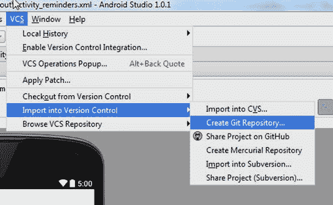

# 5.提醒实验室:第 1 部分

到目前为止，您已经熟悉了创建新项目、编程和重构的基础知识。是时候创建一个 Android 应用了，也就是所谓的 app。本章介绍四个实验项目中的第一个。这些实验旨在让您熟悉在开发应用的背景下使用 Android Studio。在这个项目中，您将开发一个应用来管理您想要记住的项目列表。核心功能将允许您创建和删除提醒，并将某些提醒标记为重要。提醒文本左侧的橙色标签会强调一个重要项目。该应用将包含一个动作栏菜单，上下文菜单，一个持久化的本地数据库，以及支持多重选择的设备上的多重选择。

图 [5-1](#Fig1) 展示了在仿真器上运行的完整应用。这个例子向您介绍了 Android 的基础知识，您还将学习如何通过使用内置的 SQLite 数据库来持久化数据。如果有些题目不熟悉也不用担心；后面的章节将更详细地介绍这些主题。

图 5-1。

The completed app interface Note

我们邀请您使用 Git 克隆这个项目，以便跟进，尽管您将从头开始使用它自己的 Git 库重新创建这个项目。如果你的电脑上没有安装 Git，参见[第 7 章](07.html)。在 Windows 中打开一个 Git-bash 会话(或者在 Mac 或 Linux 中打开一个终端)并导航到`C:\androidBook\reference\`(如果您没有参考目录，请创建一个。在 Mac 上，导航到/your-labs-parent-dir/reference/)并发出以下 git 命令:git clone [`https://bitbucket.org/csgerber/reminders.git`](https://bitbucket.org/csgerber/reminders.git) Reminders。

要操作提醒应用，您可以使用操作栏的溢出菜单。点击溢出按钮，它看起来像菜单栏右侧的三个垂直点，打开一个有两个选项的菜单，如图 [5-2](#Fig2) 所示:新提醒和退出。点击新建提醒打开如图 [5-3](#Fig3) 所示的对话框。在对话框中，您可以为新提醒添加文本，然后点击提交将其添加到列表中。轻按“退出”即可退出应用。

图 5-3。

New Reminder dialog box

图 5-2。

App interface with overflow menu activated

点击列表中的任一提醒会打开一个带有两个选项的上下文菜单，如图 [5-4](#Fig4) 所示:编辑提醒和删除提醒。点击上下文菜单中的编辑提醒打开编辑提醒弹出对话框，如图 [5-5](#Fig5) 所示，在此可以更改提醒的文本。点击上下文菜单中的删除提醒可从列表中删除提醒。

图 5-5。

Edit Reminder dialog box

图 5-4。

Context menu

## 开始一个新项目

按照第 1 章中的[说明，使用新建项目向导在 Android Studio 中启动一个新项目。输入提醒作为应用名称，设置公司域为](01.html) [`gerber.apress.com`](http://gerber.apress.com/) ，选择空白活动模板。将该项目保存在路径`C:\androidBook\Reminders`下。为了与我们的示例保持一致，最好将您的所有实验室项目保存在一个公共文件夹中，例如`C:\androidBook`(或者对于 Mac/Linux 使用`∼/androidBook`)。在向导的下一页，选择 Phone and Tablet，将最低 SDK 设置为 API 8: Android 2.2 (Froyo)。通过将你的最小 API 等级设置为 8，你的应用可以被超过 99%的 Android 市场使用。单击 Next 按钮，从可用模板中选择空白活动，然后再次单击 Next。将活动名称设置为`RemindersActivity`，然后点击完成，如图 [5-6](#Fig6) 所示。

图 5-6。

Entering an activity name

Android Studio 在设计模式下显示`activity_reminders.xml`。`activity_reminders.xml`文件是你的主活动的布局，如图 [5-7](#Fig7) 所示。正如在[第 1 章](01.html)中所讨论的，项目应该在模拟器或者设备上运行。请随意连接您的设备或启动您的仿真器，并运行该项目进行测试。

图 5-7。

Design mode for activity_reminders

## 初始化 Git 储存库

创建新项目后的第一步应该是使用版本控制来管理源代码。这本书的所有实验都使用 Git，这是一个流行的版本控制系统，可以与 Android Studio 无缝协作，并且可以在网上免费获得。第 7 章更彻底地探讨了 Git 和版本控制。

如果您的计算机上尚未安装 Git，请参考第 7 章中标题为[安装 Git 的章节。从主菜单中选择 VCS ➤导入到版本控制➤创建 Git 存储库。(在 Apple OS 中，选择 VCS ➤ VCS Operations ➤创建 Git 存储库。)图](07.html) [5-8](#Fig8) 和 [5-9](#Fig9) 展示了这一流程。

图 5-9。

Selecting the root directory for the Git repository

图 5-8。

Creating the Git repository

当提示为 Git init 选择目录时，确保 Git 项目将在根项目目录中初始化(在本例中也称为`Reminders`)。单击确定。

您会注意到位于项目工具窗口中的大多数文件都变成了棕色，这意味着它们正在被 Git 跟踪，但是还没有被添加到 Git 存储库中，也没有被计划添加。一旦你的项目在 Git 的控制之下，Android Studio 就使用一种颜色方案来指示文件在创建、修改或删除时的状态。随着我们的进展，我们会更详细地解释这个着色方案，不过你可以在这里更详细地研究这个主题:jetbrains.com/idea/help/file-status-highlights.html.

单击位于底部空白处的“更改工具”按钮，切换打开“更改工具”窗口，并展开标记为“未版本化的文件”的叶。这将显示所有被跟踪的文件。要添加它们，请选择未版本化文件叶，然后按 Ctrl+Alt+A | Cmd+Alt+A，或者右键单击未版本化文件叶，然后选择“Git ➤添加”。棕色文件应该已经变成绿色，这意味着它们已经在 Git 中暂存，现在可以提交了。

按 Ctrl+K | Cmd+K 调用提交更改对话框。提交文件是将项目变更记录到 Git 版本控制系统的过程。如图 [5-10](#Fig10) 所示，作者下拉菜单用于覆盖当前默认提交者。您应该将 Author 字段留空，Android Studio 将简单地使用您在 Git 安装期间最初设置的默认值。取消选择“提交前”部分中的所有复选框选项。将以下消息放入提交消息字段:使用新建项目向导进行初始提交。单击提交按钮，并从下拉项目中再次选择提交。

图 5-10。

Committing changes to Git

默认情况下，项目工具窗口应处于打开状态。“项目工具”窗口以不同的方式组织您的项目，这取决于在窗口顶部的“模式”下拉菜单中选择的视图。默认情况下，下拉菜单设置为 Android view，它根据文件的用途来组织文件，与文件在计算机操作系统上的组织方式无关。在浏览项目工具窗口时，您会注意到 app 文件夹下有三个文件夹:`manifests`、`java`和`res`。在`manifests`文件夹中可以找到您的 Android 清单文件。在`java`文件夹中可以找到你的 Java 源文件。`res`文件夹保存了你所有的 Android 资源文件。位于`res`目录下的资源可能是 XML 文件、图像、声音和其他有助于定义应用外观和 UI 体验的资源。一旦你有机会探索 Android 视图，我们建议切换到更直观的项目视图，因为它直接映射到您计算机上的文件结构。

Note

如果您使用过其他 ide 或旧的 Android Studio 测试版本，您会注意到自从 Android Studio 发布以来，在项目工具窗口中引入了 Android 和包视图。

## 构建用户界面

默认情况下，Android Studio 在编辑器的新选项卡中打开与主活动相关联的 XML 布局文件，并将其模式设置为 Design，因此可视化设计器通常是您在新项目中看到的第一个东西。可视化设计器允许您编辑应用的可视化布局。屏幕中间是预览窗格。预览窗格显示 Android 设备的可视化表示，同时呈现您当前编辑的布局的结果。这种表示可以通过使用屏幕顶部的预览布局控件来控制。这些控件可以调整预览，并可用于选择不同(或多种)风格的 Android 设备，从智能手机到平板电脑或可穿戴设备。您还可以更改与布局描述相关联的主题。在屏幕的左侧，您会发现控制面板。它包含各种控件和小部件，可以拖放到舞台上，舞台是设备的可视化表示。ide 的右侧包含一个组件树，显示布局中描述的组件的层次结构。布局使用 XML。当您在可视设计器中进行更改时，这些更改会在 XML 中更新。您可以单击“设计”和“文本”选项卡，在可视和文本编辑模式之间切换。图 [5-11](#Fig11) 指出了视觉设计者的几个关键领域。

图 5-11。

The Visual Designer layout

### 使用可视化设计器

让我们从创建一个提醒列表开始。单击舞台上的 Hello World `TextView`控件，然后按 Delete 键删除它。在调色板中找到`ListView`控件，并将其拖到舞台上。拖动时，IDE 将显示各种度量和对齐参考线，以帮助您定位控件，当您拖动控件靠近边缘时，这些参考线往往会与边缘对齐。放下`ListView`，使其与屏幕顶部对齐。您可以将它放置在左上角或中上方。定位后，在编辑器的右下方找到 Properties 视图。将`id`属性设置为`reminders_list_view`。`id`属性是一个可以赋予控件的名称，允许您在 Java 代码中以编程方式引用它们；这就是我们以后修改 Java 源代码时引用`ListView`的方式。在属性窗口中更改`layout:width`属性，并将其设置为`match_parent`。这将扩展控件，使其占据与其所在的父控件一样多的空间。你将在第 8 章中了解更多关于设计布局的细节。现在，你的布局应该如图 [5-12](#Fig12) 所示。

图 5-12。

The activity_reminders layout with a ListView

在 Android 中，一个活动定义了控制用户与应用交互的逻辑。当第一次学习 Android 时，将一个活动想象成应用中的一个屏幕会有所帮助，尽管活动可能比这更复杂。这些活动通常会扩大一个布局，该布局定义了事物在屏幕上出现的位置。布局文件被定义为 XML，但可以使用可视化设计器进行可视化编辑，如前所述。

### 编辑布局的原始 XML

单击底部的文本选项卡，从可视编辑切换到文本编辑。这将显示布局的原始 XML 视图，以及右侧的实时预览。对 XML 所做的更改会立即反映在预览窗格中。通过在显示`android:layout_height="match_parent"`的行下面插入`android:background="#181818"`，将相对布局的背景颜色更改为深灰色。颜色以十六进制值表示。关于十六进制颜色值的更多信息，参见[第 9 章](09.html)。请注意，现在有一个深灰色样本出现在您插入的设置根视图组背景颜色的行旁边的 gutter 中。如果您切换回设计模式，您会发现整个布局现在是深灰色的。

直接在 XML 布局文件中硬编码颜色值不是最好的方法。更好的选择是在 values resource 文件夹下定义一个`colors.xml`文件，并在那里定义您的颜色。我们将值外部化到 XML 文件(如 colors.xml)的原因是，这些资源保存在一个地方并可以在一个地方编辑，在整个项目中可以很容易地引用它们。

选择十六进制值`#181818`并使用 Ctrl+X | Cmd+X 或选择编辑➤剪切将其剪切到剪贴板。在其位置键入@color/dark_grey。这个值使用特殊的语法来引用名为`dark_grey`的 Android 颜色值。这个值应该在一个名为`colors.xml`的 Android 资源文件中定义，但是因为这个文件在你的项目中还不存在，Android Studio 用红色突出显示了这个错误。按 Alt+Enter，系统会提示您改正错误的选项。选择第二个选项，创建颜色值资源`dark_grey`，然后将该值粘贴到出现的下一个对话框的资源值:字段中，并单击确定。

新的颜色值资源对话框将创建 Android 资源文件`colors.xml`并用十六进制值填充它。单击“确定”,然后在“将文件添加到 Git”对话框中单击“确定”,将此新文件添加到版本控制中，并确保选中“记住，不要再询问”复选框，这样您就不会再受到此消息的困扰。图 [5-13](#Fig13) 展示了这一流程。

 

图 5-13。

Extracting the hard-coded color value as a resource value

预览模式中的`ListView`包含的行布局与我们选择的背景颜色没有足够的对比度。要更改这些项目的显示方式，您需要在单独的布局文件中为该行定义一个布局。右键单击`res`文件夹下的`layout`文件夹，选择新建➤布局资源文件。在“新建资源文件”对话框中输入 reminders_row。使用`LinearLayout`作为根视图组，保留其余的默认设置，如图 [5-14](#Fig14) 所示。

图 5-14。

New Resource File dialog box

现在，您将为单个列表项行创建布局。`LinearLayout`根视图组是布局中最外面的元素。使用预览窗格顶部工具栏中的控件将其方向设置为`vertical`。使用此控件时要小心，因为水平线表示垂直方向，反之亦然。图 [5-15](#Fig15) 突出显示了改变方向按钮。

图 5-15。

Change Orientation button

在预览窗格的右下角找到属性视图。找到`layout:height`属性并将其设置为`50dp`。此属性控制控件的高度，dp 后缀是指与密度无关的像素度量。这是 Android 使用的一个指标，允许布局适当缩放，而不管呈现它们的屏幕密度如何。您可以单击此视图中的任何属性，并开始键入内容以增量方式搜索属性，然后按向上或向下箭头继续搜索。

将一个水平`LinearLayout`拖放到垂直`LinearLayout`内。将一个`CustomView`控件拖放到水平`LinearLayout`中，并将其 class 属性设置为`android.view.View`，以创建一个通用的空视图，并赋予它一个`row_tab`的`id`属性。在撰写本文时，Android Studio 中有一个限制，不允许您从面板中拖动通用视图。一旦你点击`CustomView`，你会得到一个有不同选项的对话框，没有一个选项包含通用视图类。从对话框中选择任意一个类，并将其放置在布局中。使用 properties 窗格右侧的 properties 窗口找到刚才放置的视图的 class 属性，并将其更改为`android.view.View`以解决此限制。参考清单 [5-1](#FPar1) 来查看这是如何完成的。

您将使用此通用视图选项卡将某些提醒标记为重要。在编辑模式仍然设置为文本的情况下，将自定义视图的`layout:width`属性更改为`10dp`，将其`layout:height`属性设置为`match_parent`。在这里使用`match_parent`值将使这个`View`控件与其父容器一样高。切换到设计模式，在组件树的水平`LinearLayout`中拖放一个`Large Text`控件，并将其`width`和`height`属性设置为`match_parent`。验证大文本组件是否位于自定义视图控件的右侧。在组件树中，标记为 textView 的组件应该嵌套在 LinearLayout (horizontal)组件中，并位于 View 组件之下。如果“文本视图”出现在“视图”上方，请用鼠标向下拖动它，使它吸附到第二个(也是最后一个)位置。给你的 TextView 控件一个`id`值`row_text`，并将其`textSize`属性设置为`18sp`。sp 后缀指的是与比例无关的像素测量，其表现类似于`dp`，但也尊重用户的文本大小设置，例如，如果用户视力不好，并希望其手机上的文本显示较大，`sp`会尊重此设置，而`dp`则不会。因此，对`textSize`使用`sp`总是一个好主意。你将在第 8 章中了解更多关于屏幕尺寸的信息。

最后，将 TextView 控件的`text`属性设置为`Reminder Text`。切换到文本模式，对 XML 进行额外的修改，使您的代码类似于清单 [5-1](#FPar1) 。

Listing 5-1\. The reminders_row Layout XML Code

`<?xml version="1.0" encoding="utf-8"?>`

`<LinearLayout xmlns:android="``http://schemas.android.com/apk/res/android`T2】

`android:layout_width="match_parent"`

`android:layout_height="50dp"`

`android:orientation="vertical">`

`<LinearLayout`

`android:orientation="horizontal"`

`android:layout_width="match_parent"`

`android:layout_height="48dp">`

`<view`

`android:layout_width="10dp"`

`android:layout_height="match_parent"`

`class="android.view.View"`

`android:id="@+id/row_tab" />`

`<TextView`

`android:layout_width="match_parent"`

`android:layout_height="50dp"`

`android:textAppearance="?`

`android:attr/textAppearanceLarge"`

`android:text="Reminder Text"`

`android:id="@+id/row_text"`

`android:textSize="18sp" />`

`</LinearLayout>`

`</LinearLayout>`

现在，您将创建一些自定义颜色。切换到设计模式。在组件树中选择根 LinearLayout (vertical)。将其 android:background 属性设置为`@color/dark_grey`以重用我们之前定义的颜色。在组件树中选择 row_tab 组件，并将其`android:background`属性设置为`@color/green`。选择 row_text 组件，并将其`android:textColor`属性设置为`@color/white`。与之前一样，这些颜色没有在`colors.xml`文件中定义，您需要使用与之前相同的过程来定义它们。切换到文本模式。重复按 F2 键在这两个附加错误之间来回跳转，然后按 Alt+Enter 键调出 IntelliSense 建议。在两种情况下选择第二个建议，并在弹出的对话框中填入值`#ffffff`以固定白色，填入值`#003300`以固定绿色。在使用建议对话框修复这些错误后，您可以按住 Ctrl 键并左键单击这些颜色中的任何一种，这将把您带到`colors.xml`文件，看起来应该如清单 [5-2](#FPar2) 所示。

Listing 5-2\. The colors.xml File

`<resources>`

`<color name="dark_grey">#181818</color>`

`<color name="white">#ffffff</color>`

`<color name="green">#003300</color>`

`</resources>`

返回到`activity_reminders.xml`布局文件。现在你可以将新的`reminders_row`布局连接到这个布局中的`ListView`。切换到文本模式，给`ListView`元素添加如下属性:`tools:listitem="@layout/reminders_row"`，如图 [5-16](#Fig16) 所示。

图 5-16。

The preview pane is now rendering a custom ListView layout

添加此属性不会更改布局运行时的呈现方式；它只是改变了预览窗格对列表视图中每个项目的使用。要使用新的布局，您必须使用 Java 代码来扩展它，我们将在后续步骤中向您展示如何操作。

### 添加视觉增强

您已经完成了 ListView 行的自定义布局，但是您不应该就此止步。添加一些视觉增强会让你的应用与众不同。看看文本是如何在屏幕上呈现的。细心的人会发现它稍微偏离了中心，碰到了左边的绿色标签。打开`reminders_row`布局进行一些小的调整。您希望文本向行的垂直中心移动，并提供一些填充，以便从侧边提供一些视觉分离。用清单 [5-3](#FPar1) 中的代码替换您的`TextView`元素。

Listing 5-3\. TextView Additional Attributes

`<TextView`

`android:layout_width="match_parent"`

`android:layout_height="50dp"`

`android:text="Reminder Text"`

`android:id="@+id/row_text"`

`android:textColor="@color/white"`

`android:textSize="18sp"`

`android:gravity="center_vertical"`

`android:padding="10dp"`

`android:ellipsize="end"`

`android:maxLines="1"`

`/>`

附加的`ellipsize`属性将截断太长的文本，使其不适合末尾带有省略号的行，而`maxLines`属性将每行的行数限制为 1。最后，从清单 [5-4](#FPar4) 中添加两个通用视图对象，在内部`LinearLayout`之后，外部`LinearLayout`的结束标记之前，在该行下面创建一个水平标尺。外`LinearLayout`设置为高度`50dp`，内`LinearLayout`设置为高度`48dp`。两个通用视图对象将占据布局内剩余的垂直 2dp，从而创建一个斜边。这显示在清单 [5-4](#FPar1) 中。

Listing 5-4\. Extra Generic Views for beveled edge

`</LinearLayout>`

`<view`

`class="android.view.View"`

`android:layout_width="fill_parent"`

`android:layout_height="1dp"`

`android:background="#000"/>`

`<view`

`class="android.view.View"`

`android:layout_width="fill_parent"`

`android:layout_height="1dp"`

`android:background="#333"/>`

`</LinearLayout>`

### 向 ListView 添加项目

现在，您将对使用您刚刚修改的布局的活动进行更改。打开项目工具窗口，在您的`java`源文件夹下找到`RemindersActivity`文件。它将位于`com.apress.gerber.reminders`包下。在这个文件中找到`onCreate()`方法。它应该是您的类中定义的第一个方法。声明一个名为 mListView 的 ListView 成员，并将`onCreate()`方法修改成清单 [5-5](#FPar5) 中的代码。您将需要解析导入 ListView 和 ArrayAdapter。

Listing 5-5\. Add List Items to the ListView

`public class RemindersActivity extends ActionBarActivity {`

`private ListView mListView;`

`@Override`

`protected void onCreate(Bundle savedInstanceState) {`

`super.onCreate(savedInstanceState);`

`setContentView(R.layout.activity_reminders);`

`mListView = (ListView) findViewById(R.id.reminders_list_view);`

`//The arrayAdatper is the controller in our`

`//model-view-controller relationship. (controller)`

`ArrayAdapter<String> arrayAdapter = new ArrayAdapter<String>(`

`//context`

`this,`

`//layout (view)`

`R.layout.reminders_row,`

`//row (view)`

`R.id.row_text,`

`//data (model) with bogus data to test our listview`

`new String[]{"first record", "second record", "third record"});`

`mListView.setAdapter(arrayAdapter);`

`}`

`//Remainder of the class listing omitted for brevity`

`}`

这段代码通过使用您之前定义的`id`属性来查找`ListView`,并删除默认的列表分隔线，以便我们之前创建的定制斜面分隔线能够正确呈现。该代码还创建了一个带有几个示例列表项的适配器。`Adapter`是一个特殊的 Java 类，被定义为 Android SDK 的一部分，在 SQLite 数据库(模型)、ListView(视图)和适配器(控制器)之间的模型-视图-控制器关系中充当控制器。适配器将模型绑定到视图，并处理更新和刷新。Adapter 是 ArrayAdapter 的超类，它将数组的元素绑定到视图。在我们的例子中，这个视图是一个 ListView。`ArrayAdapter`在其三参数构造函数中接受三个参数。第一个参数是由当前活动表示的一个`Context`对象。适配器还需要知道应该使用哪个布局和布局中的哪个或哪些字段来显示行数据。为了满足这个需求，您传递布局和布局中的`TextView`项的 id。最后一个参数是用于列表中每一项的字符串数组。如果此时运行项目，您将会看到列表视图中显示的`ArrayAdapter`构造函数中给出的值，如图 [5-17](#Fig17) 所示。

图 5-17。

ListView example

按 Ctrl+K | Cmd+K 提交对 Git 的更改，并使用带有自定义颜色的 Adds ListView 作为提交消息。当您完成一个项目时，最好对 Git 执行增量提交，同时使用提交消息来描述每次提交添加/删除/更改的特性。保持这种习惯使得识别单个提交和为将来的合作者和用户构建发布说明变得容易。

### 设置操作栏溢出菜单

Android 使用一种常见的视觉元素，称为动作栏。操作栏是许多应用定位导航和其他允许用户执行重要任务的选项的地方。此时运行应用时，您可能会注意到一个看起来像三个垂直点的菜单图标。这些点被称为溢出菜单。单击溢出菜单图标会产生一个菜单，其中有一个名为`settings`的菜单项。该菜单项作为新建项目向导模板的一部分放在那里，本质上是一个不执行任何操作的占位符。`RemindersActivity`加载`menu_reminders.xml`文件，该文件位于`res/menu`文件夹下。对这个文件进行修改，向活动添加新的菜单项，如清单 [5-6](#FPar6) 所示。

Listing 5-6\. New Menu Items

`<menu xmlns:android="``http://schemas.android.com/apk/res/android`T2】

`xmlns:app="``http://schemas.android.com/apk/res-auto`T2】

`xmlns:tools="``http://schemas.android.com/tools`T2】

`tools:context="com.apress.gerber.reminders.app.RemindersActivity" >`

`<item android:id="@+id/action_new"`

`android:title="new Reminder"`

`android:orderInCategory="100"`

`app:showAsAction="never" />`

`<item android:id="@+id/action_exit"`

`android:title="exit"`

`android:orderInCategory="200"`

`app:showAsAction="never" />`

`</menu>`

在前面的代码清单中，`title`属性对应于菜单项中显示的文本。由于我们已经对这些属性进行了硬编码，Android Studio 会将这些值标记为警告。按 F2 在这些警告之间跳转，按 Alt+Enter 调出 IntelliSense 建议。您只需按 Enter 键接受第一个建议，为新的字符串资源键入一个名称，当对话框弹出时，再次按 Enter 键接受命名的资源。使用`new_reminder`作为第一个项目的名称，使用`exit`作为第二个项目的名称。

打开`RemindersActivity`并用清单 [5-7](#FPar7) 中的文本替换`onOptionsItemSelected()`方法。您需要解决日志类的导入问题。当你点击应用中的一个菜单项时，运行时会调用这个方法，传入一个被点击的`MenuItem`的引用。`switch`语句接受`MenuItem`的`itemId`，并根据点击的项目执行日志语句或终止活动。这个例子使用了将文本写入 Android 调试日志的`Log.d()`方法。如果您的应用包含多个活动，并且这些活动是在当前活动之前查看的，那么调用`finish()`将简单地从 backstack 中弹出当前活动，控制权将传递给下一个底层活动。因为 RemindersActivity 是这个应用中唯一的活动，`finish()`方法从 backstack 中弹出唯一的活动，并导致您的应用终止。

Listing 5-7\. onOptionsItemSelected( ) Method Definition

`@Override`

`public boolean onOptionsItemSelected(MenuItem item) {`

`switch (item.getItemId()) {`

`case R.id.action_new:`

`//create new Reminder`

`Log.d(getLocalClassName(),"create new Reminder");`

`return true;`

`case R.id.action_exit:`

`finish();`

`return true;`

`default:`

`return false;`

`}`

`}`

运行应用并测试新的菜单选项。轻按新的提醒菜单选项，并观看 Android 日志以查看消息出现。在仿真器或设备上运行应用时，将会打开 Android DDMS(Dalvik 调试监控服务)窗口，您需要选择日志级别下的调试选项来查看调试日志。运行您的应用并与菜单项交互。点击新的提醒菜单项时，请注意 Android DDMS 窗口中的日志。最后，按 Ctrl+K | Cmd+K，使用添加新的提醒和退出菜单选项作为提交消息，将代码提交给 Git。

## 持续提醒

因为提醒应用需要维护一个提醒列表，所以你需要一个持久性策略。Android SDK 和运行时提供了一个名为 SQLite 的嵌入式数据库引擎，该引擎旨在在内存受限的环境中运行，非常适合移动设备。本节介绍 SQLite 数据库，并探讨如何维护提醒列表。我们的策略将包括一个数据模型、一个数据库代理类和一个`CursorAdapter`。该模型将保存从数据库读取和写入数据库的数据。代理将是一个适配器类，它将把来自应用的简单调用转换成对 SQLite 数据库的 API 调用。最后，`CursorAdapter`将扩展一个标准的 Android 类，以抽象的方式处理数据访问。

### 数据模型

让我们从创建数据模型开始。右键单击 com.apress.gerber.reminders 包并选择 New ➤ Java Class。命名您的课堂提醒，然后按回车键。用清单 [5-8](#FPar8) 中的代码装饰你的类。这个类是一个简单的 POJO (Plain Old Java Object ),它定义了一些实例变量和相应的 getter 和 setter 方法。`Reminder`类包括一个整数 ID、一个字符串值和一个数字重要性值。ID 是用于识别每个提醒的唯一号码。字符串值保存提醒的文本。重要性值是一个数字指示器，将单个提醒标记为重要(1 =重要，0 =不重要)。我们在这里使用了`int`而不是`boolean`,因为 SQLite 数据库没有`boolean`数据类型。

Listing 5-8\. Reminder Class Definition

`public class Reminder {`

`private int mId;`

`private String mContent;`

`private int mImportant;`

`public Reminder(int id, String content, int important) {`

`mId = id;`

`mImportant = important;`

`mContent = content;`

`}`

`public int getId() {`

`return mId;`

`}`

`public void setId(int id) {`

`mId = id;`

`}`

`public int getImportant() {`

`return mImportant;`

`}`

`public void setImportant(int important) {`

`mImportant = important;`

`}`

`public String getContent() {`

`return mContent;`

`}`

`public void setContent(String content) {`

`mContent = content;`

`}`

`}`

现在，您将创建一个数据库代理。同样，这个代理将把简单的应用调用转换成较低级别的 SQLite API 调用。在 com.apress.gerber.reminders 包中创建一个名为`RemindersDbAdapter`的新类。将清单 [5-9](#FPar9) 中的代码直接放在新创建的 RemindersDbAdapter 类中。当您解析导入时，您会注意到在 Android SDK 中找不到 DatabaseHelper。我们将在后续步骤中定义 DatabaseHelper 类。此代码定义了列名和索引；一个`TAG`用于测井；两个数据库 API 对象；数据库名称、版本和主表名称的一些常量；上下文对象；和用于创建数据库的 SQL 语句。

Listing 5-9\. Code to be placed inside the RemindersDbAdapter class

`//these are the column names`

`public static final String COL_ID = "_id";`

`public static final String COL_CONTENT = "content";`

`public static final String COL_IMPORTANT = "important";`

`//these are the corresponding indices`

`public static final int INDEX_ID = 0;`

`public static final int INDEX_CONTENT = INDEX_ID + 1;`

`public static final int INDEX_IMPORTANT = INDEX_ID + 2;`

`//used for logging`

`private static final String TAG = "RemindersDbAdapter";`

`private DatabaseHelper mDbHelper;`

`private SQLiteDatabase mDb;`

`private static final String DATABASE_NAME = "dba_remdrs";`

`private static final String TABLE_NAME = "tbl_remdrs";`

`private static final int DATABASE_VERSION = 1;`

`private final Context mCtx;`

`//SQL statement used to create the database`

`private static final String DATABASE_CREATE =`

`"CREATE TABLE if not exists " + TABLE_NAME + " ( " +`

`COL_ID + " INTEGER PRIMARY KEY autoincrement, " +`

`COL_CONTENT + " TEXT, " +`

`COL_IMPORTANT + " INTEGER );";`

### SQLite API

`DatabaseHelper`是一个 SQLite API 类，用于打开和关闭数据库。它使用了`Context`，这是一个抽象的 Android 类，提供对 Android 操作系统的访问。`DatabaseHelper`是一个自定义类，必须由你定义。使用清单 [5-10](#FPar10) 中的代码将`DatabaseHelper`实现为`RemindersDbAdapter`的内部类。将此代码放在 RemindersDbAdapters 的末尾，但仍在 RemindersDbAdapters 的大括号内。

Listing 5-10\. RemindersDbAdapter

`private static class DatabaseHelper extends SQLiteOpenHelper {`

`DatabaseHelper(Context context) {`

`super(context, DATABASE_NAME, null, DATABASE_VERSION);`

`}`

`@Override`

`public void onCreate(SQLiteDatabase db) {`

`Log.w(TAG, DATABASE_CREATE);`

`db.execSQL(DATABASE_CREATE);`

`}`

`@Override`

`public void onUpgrade(SQLiteDatabase db, int oldVersion, int newVersion) {`

`Log.w(TAG, "Upgrading database from version " + oldVersion + " to "`

`+ newVersion + ", which will destroy all old data");`

`db.execSQL("DROP TABLE IF EXISTS " + TABLE_NAME);`

`onCreate(db);`

`}`

`}`

`DatabaseHelper`扩展了`SQLiteOpenHelper`，这有助于用特殊的回调方法维护数据库。回调方法是运行时环境将在应用的整个生命周期中调用的方法，它们使用提供的`SQLiteDatabase db`变量来执行 SQL 命令。构造函数是初始化数据库的地方。构造函数将数据库名称和版本传递给它的超类；然后超类做建立数据库的艰苦工作。当运行时需要创建数据库时，会自动调用`onCreate()`方法。此操作仅运行一次，即应用首次启动且数据库尚未创建时。每当数据库需要升级时，就会调用`onUpgrade()`方法，例如，如果开发人员更改了模式。如果您确实更改了数据库模式，请确保将`DATABASE_VERSION`加 1，然后`onUpgrade()`将管理剩余的部分。如果你忘记增加`DATABASE_VERSION`，即使在调试构建模式下，你的程序也会崩溃。在前面的代码中，我们运行一个 SQL 命令来删除数据库中唯一的一个表，然后运行`onCreate()`方法来重新创建该表。

清单 [5-11](#FPar11) 中的代码演示了如何使用`DatabaseHelper`打开和关闭数据库。构造函数保存了一个`Context`的实例，该实例被传递给`DatabaseHelper`。`open()`方法初始化助手并使用它来获取数据库的实例，而`close()`方法使用助手来关闭数据库。在 RemindersDbAdapter 类中所有成员变量定义之后和`DatabaseHelper`内部类定义之前添加此代码。当您解析导入时，使用`android.database.SQLException`类。

Listing 5-11\. Database Open and Close Methods

`public RemindersDbAdapter(Context ctx) {`

`this.mCtx = ctx;`

`}`

`//open`

`public void open() throws SQLException {`

`mDbHelper = new DatabaseHelper(mCtx);`

`mDb = mDbHelper.getWritableDatabase();`

`}`

`//close`

`public void close() {`

`if (mDbHelper != null) {`

`mDbHelper.close();`

`}`

`}`

清单 [5-12](#FPar12) 包含了处理`tbl_remdrs`表中`Reminder`对象的创建、读取、更新和删除的所有逻辑。这些通常被称为 CRUD 操作；CRUD 代表创建、读取、更新和删除。在 RemindersDbAdapter 类中的`close()`方法之后添加下面的代码。

Listing 5-12\. Database CRUD Operations

`//CREATE`

`//note that the id will be created for you automatically`

`public void createReminder(String name, boolean important) {`

`ContentValues values = new ContentValues();`

`values.put(COL_CONTENT, name);`

`values.put(COL_IMPORTANT, important ? 1 : 0);`

`mDb.insert(TABLE_NAME, null, values);`

`}`

`//overloaded to take a reminder`

`public long createReminder(Reminder reminder) {`

`ContentValues values = new ContentValues();`

`values.put(COL_CONTENT, reminder.getContent()); // Contact Name`

`values.put(COL_IMPORTANT, reminder.getImportant()); // Contact Phone Number`

`// Inserting Row`

`return mDb.insert(TABLE_NAME, null, values);`

`}`

`//READ`

`public Reminder fetchReminderById(int id) {`

`Cursor cursor = mDb.query(TABLE_NAME, new String[]{COL_ID,`

`COL_CONTENT, COL_IMPORTANT}, COL_ID + "=?",`

`new String[]{String.valueOf(id)}, null, null, null, null`

`);`

`if (cursor != null)`

`cursor.moveToFirst();`

`return new Reminder(`

`cursor.getInt(INDEX_ID),`

`cursor.getString(INDEX_CONTENT),`

`cursor.getInt(INDEX_IMPORTANT)`

`);`

`}`

`public Cursor fetchAllReminders() {`

`Cursor mCursor = mDb.query(TABLE_NAME, new String[]{COL_ID,`

`COL_CONTENT, COL_IMPORTANT},`

`null, null, null, null, null`

`);`

`if (mCursor != null) {`

`mCursor.moveToFirst();`

`}`

`return mCursor;`

`}`

`//UPDATE`

`public void updateReminder(Reminder reminder) {`

`ContentValues values = new ContentValues();`

`values.put(COL_CONTENT, reminder.getContent());`

`values.put(COL_IMPORTANT, reminder.getImportant());`

`mDb.update(TABLE_NAME, values,`

`COL_ID + "=?", new String[]{String.valueOf(reminder.getId())});`

`}`

`//DELETE`

`public void deleteReminderById(int nId) {`

`mDb.delete(TABLE_NAME, COL_ID + "=?", new String[]{String.valueOf(nId)});`

`}`

`public void deleteAllReminders() {`

`mDb.delete(TABLE_NAME, null, null);`

`}`

这些方法都使用`SQLiteDatabase mDb`变量来生成和执行 SQL 语句。如果您熟悉 SQL，您可能会猜测这些 SQL 语句将采用`INSERT`、`SELECT`、`UPDATE`或`DELETE`的形式。

这两个创建方法使用一个特殊的`ContentValues`对象，它是一个数据穿梭器，用于将数据值传递给数据库对象的`insert`方法。数据库最终会将这些对象转换成 SQL `insert`语句并执行它们。有两个`read`方法，一个用于获取单个提醒，另一个用于获取光标来迭代所有提醒。您将在稍后的特殊`Adapter`课程中使用`Cursor`。

`update`方法类似于第二个创建方法。然而，这个方法调用了低级数据库对象上的一个`update`方法，该方法将生成并执行一个`update` SQL 语句，而不是一个`insert`。

最后，有两个`delete`方法。第一个使用一个`id`参数，并使用数据库对象为特定的提醒生成并执行一个`delete`语句。第二种方法要求数据库生成并执行一个`delete`语句，从表中删除所有提醒。

此时，您需要一种方法将提醒从数据库中取出并放入`ListView`。清单 [5-13](#FPar13) 展示了通过扩展您之前看到的特殊的`Adapter` Android 类将数据库值绑定到单个行对象的必要逻辑。在 com.apress.gerber.reminders 包中创建一个名为 RemindersSimpleCursorAdapter 的新类，并用下面的代码修饰它。在解析导入时，使用 Android . support . v4 . widget . simplecursoradapter 类。

Listing 5-13\. RemindersSimpleCursorAdapter Code

`public class RemindersSimpleCursorAdapter extends SimpleCursorAdapter {`

`public RemindersSimpleCursorAdapter(Context context, int layout, Cursor c, String[] from, int[] to, int flags) {`

`super(context, layout, c, from, to, flags);`

`}`

`//to use a viewholder, you must override the following two methods and define a ViewHolder class`

`@Override`

`public View newView(Context context, Cursor cursor, ViewGroup parent) {`

`return super.newView(context, cursor, parent);`

`}`

`@Override`

`public void bindView(View view, Context context, Cursor cursor) {`

`super.bindView(view, context, cursor);`

`ViewHolder holder = (ViewHolder) view.getTag();`

`if (holder == null) {`

`holder = new ViewHolder();`

`holder.colImp = cursor.getColumnIndexOrThrow(RemindersDbAdapter.COL_IMPORTANT);`

`holder.listTab =  view.findViewById(R.id.row_tab);`

`view.setTag(holder);`

`}`

`if (cursor.getInt(holder.colImp) > 0) {`

`holder.listTab.setBackgroundColor(context.getResources().getColor(R.color.orange));`

`} else {`

`holder.listTab.setBackgroundColor(context.getResources().getColor(R.color.green));`

`}`

`}`

`static class ViewHolder {`

`//store the column index`

`int colImp;`

`//store the view`

`View listTab;`

`}`

`}`

我们用`ListView`注册`Adapter`来填充提醒。在运行时，当用户加载和滚动列表时，`ListView`将重复调用`Adapter`上的`bindView()`方法和屏幕上的`View`对象。用列表项填充这些视图是`Adapter`的工作。在这个代码示例中，我们使用了名为`SimpleCursorAdapter`的`Adapter`的子类。这个类使用一个`Cursor`对象，它跟踪表中的行。

这里你可以看到一个`ViewHolder`模式的例子。这是一个众所周知的 Android 模式，其中一个小的`ViewHolder`对象作为标签附加在每个视图上。这个对象通过使用来自数据源的值为列表中的`View`对象添加装饰，在这个例子中是`Cursor`。`ViewHolder`被定义为具有两个实例变量的静态内部类，一个用于重要表列的索引，另一个用于您在布局中定义的`row_tab`视图。

`bindView()`方法首先调用超类方法，该方法将光标的值映射到视图中的元素。然后，它检查是否有一个持有者被附加到标签上，如果需要，创建一个新的持有者。然后，`bindView()`方法通过使用重要的列索引和您之前定义的`row_tab`来配置 holder 的实例变量。找到或配置持有者后，它使用当前提醒中的`COL_IMPORTANT`常量的值来决定对`row_tab`使用哪种颜色。该示例使用了新的橙色，您需要将它添加到您的`colors.xml: <color name="orange">#ffff381a</color>`中。

之前您使用了一个`ArrayAdapter`来管理模型和视图之间的关系。`SimpleCursorAdapter`遵循相同的模式，尽管它的模型是 SQLite 数据库。对清单 [5-14](#FPar14) 进行更改，以使用新的 RemindersDbAdapter 和 RemindersSimpleCursorAdapter。

Listing 5-14\. RemindersActivity Code

`public class RemindersActivity extends ActionBarActivity {`

`private ListView mListView;`

`private RemindersDbAdapter mDbAdapter;`

`private RemindersSimpleCursorAdapter mCursorAdapter;`

`@Override`

`protected void onCreate(Bundle savedInstanceState) {`

`super.onCreate(savedInstanceState);`

`setContentView(R.layout.activity_reminders);`

`mListView = (ListView) findViewById(R.id.reminders_list_view);`

`mListView.setDivider(null);`

`mDbAdapter = new RemindersDbAdapter(this);`

`mDbAdapter.open();`

`Cursor cursor = mDbAdapter.fetchAllReminders();`

`//from columns defined in the db`

`String[] from = new String[]{`

`RemindersDbAdapter.COL_CONTENT`

`};`

`//to the ids of views in the layout`

`int[] to = new int[]{`

`R.id.row_text`

`};`

`mCursorAdapter = new RemindersSimpleCursorAdapter(`

`//context`

`RemindersActivity.this,`

`//the layout of the row`

`R.layout.reminders_row,`

`//cursor`

`cursor,`

`//from columns defined in the db`

`from,`

`//to the ids of views in the layout`

`to,`

`//flag - not used`

`0);`

`//the cursorAdapter (controller) is now updating the listView (view)`

`//with data from the db (model)`

`mListView.setAdapter(mCursorAdapter);`

`}`

`//Abbreviated for brevity`

`}`

如果此时运行应用，您将不会在列表中看到任何内容；该屏幕将完全是空的，因为您的最后一次更改插入了 SQLite 功能来代替示例数据。按 Ctrl+K | Cmd+K 并提交您的更改，同时显示消息“为提醒添加 SQLite 数据库持久性并为重要提醒添加新颜色”。作为一项挑战，您可能会尝试找出如何通过使用新的`RemindersDbAdapter`来添加示例项。这将在下一章讨论，所以你可以向前看并检查你的工作。

## 摘要

至此，你有了一个成熟的 Android 应用。在这一章中，你学习了如何建立你的第一个 Android 项目，并使用 Git 控制它的源代码。您还探索了如何在设计和文本模式下编辑 Android 布局。您已经看到了在操作栏中创建溢出菜单的演示。本章最后探讨了`ListViews`和`Adapters`，并将数据绑定到内置的 SQLite 数据库。在下一章中，您将通过添加创建和编辑提醒的功能来完善应用。