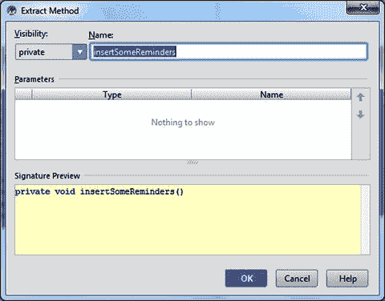

# 6.提醒实验室:第 2 部分

本章介绍如何通过使用自定义对话框来捕获用户输入。我们还将继续演示适配器和 SQLite 数据库的使用。在本章中，我们将完成从第 5 章开始的实验。

## 添加/删除提醒

第 5 章中的例子让屏幕空着，没有任何提醒。要查看带有提醒列表的应用布局，在应用启动时添加一些示例提醒很有用。如果您试图对前一章的挑战提出一个解决方案，将您的代码与清单 [6-1](#FPar1) 中的变化进行比较。清单 [6-1](#FPar1) 中的代码检查实例是否有任何保存的状态，如果没有，它继续设置示例数据。为此，代码调用了`DatabaseAdapter`上的一些方法；一个用于清除所有提醒，另一个用于插入一些提醒。

Listing 6-1\. Add Some Example Reminders

`public class RemindersActivity extends ActionBarActivity {`

`private ListView mListView;`

`private RemindersDbAdapter mDbAdapter;`

`private RemindersSimpleCursorAdapter mCursorAdapter;`

`@Override`

`protected void onCreate(Bundle savedInstanceState) {`

`super.onCreate(savedInstanceState);`

`setContentView(R.layout.activity_reminders);`

`mListView = (ListView) findViewById(R.id.reminders_list_view);`

`mListView.setDivider(null);`

`mDbAdapter = new RemindersDbAdapter(this);`

`mDbAdapter.open();`

`if (savedInstanceState == null) {`

`//Clear all data`

`mDbAdapter.deleteAllReminders();`

`//Add some data`

`mDbAdapter.createReminder("Buy Learn Android Studio", true);`

`mDbAdapter.createReminder("Send Dad birthday gift", false);`

`mDbAdapter.createReminder("Dinner at the Gage on Friday", false);`

`mDbAdapter.createReminder("String squash racket", false);`

`mDbAdapter.createReminder("Shovel and salt walkways", false);`

`mDbAdapter.createReminder("Prepare Advanced Android syllabus", true);`

`mDbAdapter.createReminder("Buy new office chair", false);`

`mDbAdapter.createReminder("Call Auto-body shop for quote", false);`

`mDbAdapter.createReminder("Renew membership to club", false);`

`mDbAdapter.createReminder("Buy new Galaxy Android phone", true);`

`mDbAdapter.createReminder("Sell old Android phone - auction", false);`

`mDbAdapter.createReminder("Buy new paddles for kayaks", false);`

`mDbAdapter.createReminder("Call accountant about tax returns", false);`

`mDbAdapter.createReminder("Buy 300,000 shares of Google", false);`

`mDbAdapter.createReminder("Call the Dalai Lama back", true);`

`}`

`//Removed remaining method code for brevity...`

`}`

`//Removed remaining method code for brevity...`

`}`

有几个对`createReminder()`方法的调用，每个调用都接受一个带有提醒文本的字符串值和一个将提醒标记为重要的布尔值。我们为`true`设置了几个值，以提供良好的视觉效果。在所有的`createReminder()`调用周围单击并拖动选择，然后按 Ctrl+Alt+M | Cmd+Alt+M，弹出提取方法对话框，如图 [6-1](#Fig1) 所示。这是通过“重构”菜单和快捷键组合可用的许多重构操作之一。输入 insertSomeReminders 作为新方法的名称，然后按 Enter 键。`RemindersActivity`中的代码将被替换为对您在提取方法对话框中命名的新方法的调用，并且代码将被移动到该方法的主体中。

图 6-1。

Extract Method dialog box, create insertSomeReminders( ) method

运行应用，查看界面的外观和使用示例提醒的行为。你的应用应该看起来像图 [6-2](#Fig2) 中的截图。一些提醒应该用绿色的行标签显示，而那些标记为重要的会用橙色标签显示。使用消息“添加示例提醒”提交您的更改。

图 6-2。

Runtime with example reminders inserted

## 响应用户交互

任何应用都没有多大用处，除非它对输入做出响应。在本节中，您将添加逻辑来响应触摸事件，并最终允许用户编辑各个提醒。应用中的主要组件是 Android `View`对象的子类`ListView`。到目前为止，除了将`View`对象放置在布局中，你还没有对它们做什么。`android.view.View`对象是所有绘制到屏幕上的组件的超类。

将清单 [6-2](#FPar2) 中的代码添加到`RemindersActivity`中`onCreate()`方法的底部，就在右花括号之前，然后解析 imports。这是一个匿名的内部类实现`OnItemClickListener`，它只有一个方法`onItemClicked()`。当您与它所附加的`ListView`组件交互时，运行时将使用这个对象。每当你点击`ListView`时，匿名内部类的`onCreate()`方法将被调用。我们定义的方法使用了`Toast`，Android SDK 中的一个类。对`Toast.makeText()`的调用会在屏幕上显示一个小弹出窗口，显示传递给该方法的任何文本。您可以使用`Toast`作为方法被正确调用的快速指示器，如清单 [6-2](#FPar2) 所示。

Note

某些设备可能会隐藏信息。另一种方法是使用 Android logger 记录消息，这在第 12 章中有详细介绍。

Listing 6-2\. Set an OnItemClickListener with a Toast

`//when we click an individual item in the listview`

`mListView.setOnItemClickListener(new AdapterView.OnItemClickListener() {`

`@Override`

`public void onItemClick(AdapterView<?> parent, View view, int position, long id) {`

`Toast.makeText(RemindersActivity.this, "clicked " + position,`

`Toast.LENGTH_SHORT).show();`

`}`

`});`

单击列表中的第一项会调用`onItemClick()`方法，该方法的位置值为 0，因为列表中的元素从 0 开始进行索引。然后逻辑弹出一个带有点击文本和位置的祝酒词，如图 [6-3](#Fig3) 所示。

图 6-3。

Toast message after tapping the first reminder

### 用户对话框

熟悉了触摸事件之后，您现在可以增强 click listener 来显示对话框。用清单 [6-3](#FPar3) 中的代码替换整个`onItemClick()`方法。当你解析导入时，请使用`android.support.v7.app.AlertDialog`类。

Listing 6-3\. onItemClick( ) Modifications to Allow Edit/Delete

`public void onItemClick(AdapterView<?> parent, View view, final int masterListPosition, long id) {`

`AlertDialog.Builder builder = new AlertDialog.Builder(RemindersActivity.this);`

`ListView modeListView = new ListView(RemindersActivity.this);`

`String[] modes = new String[] { "Edit Reminder", "Delete Reminder" };`

`ArrayAdapter<String> modeAdapter = new ArrayAdapter<>(RemindersActivity.this,`

`android.R.layout.simple_list_item_1, android.R.id.text1, modes);`

`modeListView.setAdapter(modeAdapter);`

`builder.setView(modeListView);`

`final Dialog dialog = builder.create();`

`dialog.show();`

`modeListView.setOnItemClickListener(new AdapterView.OnItemClickListener() {`

`@Override`

`public void onItemClick(AdapterView<?> parent, View view, int position, long id) {`

`//edit reminder`

`if (position == 0) {`

`Toast.makeText(RemindersActivity.this, "edit "`

`+ masterListPosition, Toast.LENGTH_SHORT).show();`

`//delete reminder`

`} else {`

`Toast.makeText(RemindersActivity.this, "delete "`

`+ masterListPosition, Toast.LENGTH_SHORT).show();`

`}`

`dialog.dismiss();`

`}`

`});`

`}`

在前面的代码中，您看到了另一个正在工作的 Android 类，`AlertDialog.Builder`。类`Builder`是嵌套在`AlertDialog`类中的静态类，它用于构建`AlertDialog`。

到目前为止，这个实验室中的代码创建了一个`ListView`和一个`ArrayAdapter`来向一个`ListView`提供项目。你可能还记得第五章中的这个模式。在传递给`ListView`之前，该适配器由两个潜在选项组成的数组创建，编辑提醒和删除提醒，然后传递给`AlertDialog.Builder`。然后使用生成器创建并显示一个带有选项列表的对话框。

请特别注意清单 [6-3](#FPar3) 中的最后一段代码。它类似于前面添加的`OnItemClickListener()`代码；然而，我们在当前的`OnItemClickListener`中创建的`modeListView`上附加了一个点击监听器。您看到的是一个带有`OnItemClickListener`的`ListView`，它创建了另一个`modeListView`和另一个嵌套的`OnItemClickListener`来响应`modeListView`的点击事件。

嵌套的 click 侦听器弹出一条 toast 消息，指示是否点击了编辑或删除项。它还将外层`OnItemClickListener`的位置参数重命名为`masterListPosition`，以区别于嵌套`OnItemClickListener`中的`position`参数。这个主位置在 toast 中用于指示哪个提醒可能被编辑或删除。最后，从点击监听器中调用`dialog.dismiss()`方法，这将完全删除对话框。

通过在您的设备或仿真器上运行来测试图 [6-4](#Fig4) 中所示的新功能。点击提醒事项，然后在新弹出对话框中点击编辑提醒事项或删除提醒事项。如果 toast 中报告的提醒位置与您点击的提醒不匹配，请仔细检查您是否将`masterListPosition`值附加到了 toast 中的文本，并且没有使用`position`。按 Ctrl+K | Cmd+K 提交此逻辑，并使用消息为单个列表项添加一个 ListView 对话框。

图 6-4。

Simulating the deletion of a reminder

## 提供多选上下文菜单

随着应用开始成形，你现在将攻击一个允许在一次操作中编辑多个提醒的功能。此功能仅在运行 API 11 和更高版本的设备上可用。您将通过使用资源加载约定，使该特性在应用中有条件地可用。这一过程将在本章稍后解释，并在第 8 章中详细说明。您还需要在运行时进行检查，以决定是否启用该特性。

首先为提醒行项目创建一个备用布局。打开项目工具窗口，右键单击`res`文件夹，弹出上下文菜单。从菜单中选择新建 Android 资源文件，在对话框中输入 reminders_row 作为名称，如图 [6-5](#Fig5) 所示。

 

图 6-5。

New resource file for reminders_row

选择 Layout 作为资源类型，这将自动将目录名更改为`layout`。在可用限定词部分下选择版本，然后单击双 v 形(> >)按钮将版本添加到所选限定词列表中。输入 11 作为平台 API 级别，注意目录名已经更新，以反映所选的限定符。这些被称为资源限定符，它们在运行时被询问，以允许您为特定的设备和平台版本定制用户界面。按 Enter 键(或单击 OK)接受这个新的资源限定目录并继续。如果你打开项目工具窗口，并将其视图设置为 Android，如图 [6-6](#Fig6) 所示，你会看到两个`reminders_row`布局文件被分组在`layout`文件夹下。同样，项目窗口的 Android 视图将相关文件分组在一起，让您可以有效地管理它们。

图 6-6。

Grouped layouts

复制整个原始`reminders_row`布局并粘贴到版本 11 新创建的布局中。现在使用下面的代码改变内部水平`LinearLayout`的`background`属性:

`android:background="?android:attr/activatedBackgroundIndicator"`

这个赋给背景属性的值以`?android:attr/`为前缀，它指的是 Android SDK 中定义的一种样式。Android SDK 提供了许多这样的预定义属性，你可以在你的应用中使用它们。属性使用系统定义的颜色作为多选模式下激活的项目的背景。

### 针对早期的 SDK

现在您将学习如何引入一个平台相关的特性。打开项目工具窗口，并打开 Gradle 脚本部分下的`app`模块的`build.gradle`文件(这将是第二个条目)。这些 Gradle 文件包含编译和打包应用的构建逻辑。所有关于你的应用支持哪些平台的配置都位于这些特殊的文件中([第 13 章](13.html)深入探讨了 Gradle build 系统)。请注意，minSdkVersion 设置为 8，这允许您的应用在 99%以上的 Android 设备上运行。我们将要创建的特性需要最低版本为 11 的 SDK (aka API)。我们在本节中介绍的代码和特性将允许运行 SDK 11 或更高版本的用户利用一个称为上下文动作模式的特性。此外，那些运行 SDK 版本低于 11 的人将不会看到这个功能，但更重要的是，他们的应用不会崩溃。

### 添加上下文操作模式

下一个特性在多选模式下引入了一个上下文动作菜单，这是一个动作列表，可以应用于所有选中项目的上下文。通过右键单击 res/menu 目录并选择 New ➤菜单资源文件来添加一个新的菜单资源，并将其命名为`cam_menu`。用下面的代码来修饰它:

`<?xml version="1.0" encoding="utf-8"?>`

`<menu xmlns:android="``http://schemas.android.com/apk/res/android`T2】

`<item android:id="@+id/menu_item_delete_reminder"`

`android:icon="@android:drawable/ic_menu_delete"`

`android:title="delete" />`

`</menu>`

这个资源文件为上下文菜单定义了一个单独的`delete`动作项。这里您也使用了稍微不同的属性值。这些特殊值类似于您之前在`background`属性中使用的值，因为它们允许您访问内置的 Android 默认值。然而，`?android:attr/`前缀仅在引用样式属性时使用。这些属性中使用的语法遵循稍微不同的形式。使用 at 符号(`@`)触发资源值的名称空间查找。您可以通过这种方式访问各种名称空间。`android`名称空间是所有内置 Android 值所在的位置。在这个名称空间中有各种资源位置，例如`drawable`、`string`和`layout`。当您使用特殊的`@+id`前缀时，它会在项目的 R.java 文件中创建一个新的 ID，当您使用`@id`前缀时，它会在 Android SDK 的 R.java 文件中查找一个现有的 ID。这个例子定义了一个新的 ID 名`menu_item_delete_reminder`，它与菜单选项相关联。它还从名称空间`android:drawable`中取出一个图标，用作它的图标。

使用新的上下文菜单和运行 API 11 或更高版本的设备的备用布局，您可以添加一个复选标记，以有条件地启用带有上下文操作菜单的多选模式。打开`RemindersActivity`并在`onCreate`方法的末尾添加以下`if`块:

`if (Build.VERSION.SDK_INT >= Build.VERSION_CODES.HONEYCOMB) {`

`}`

`Build`类是从`android.os`包中导入的，它让您可以访问一组常数值，这些常数值可以用来匹配具有特定 API 级别的设备。在这种情况下，您希望 API 级别等于或高于包含整数值 11 的`HONEYCOMB`。将清单 [6-4](#FPar4) 中的代码插入刚刚定义的 if 块中。if 块保护运行低于 Honeycomb 的操作系统的设备，如果没有 Honeycomb，应用将会崩溃。

Listing 6-4\. MultiChoiceModeListener Example

`mListView.setChoiceMode(ListView.CHOICE_MODE_MULTIPLE_MODAL);`

`mListView.setMultiChoiceModeListener(new AbsListView.MultiChoiceModeListener() {`

`@Override`

`public void onItemCheckedStateChanged(ActionMode mode, int position, long id, boolean checked) { }`

`@Override`

`public boolean onCreateActionMode(ActionMode mode, Menu menu) {`

`MenuInflater inflater = mode.getMenuInflater();`

`inflater.inflate(R.menu.cam_menu, menu);`

`return true;`

`}`

`@Override`

`public boolean onPrepareActionMode(ActionMode mode, Menu menu) {`

`return false;`

`}`

`@Override`

`public boolean onActionItemClicked(ActionMode mode, MenuItem item) {`

`switch (item.getItemId()) {`

`case R.id.menu_item_delete_reminder:`

`for (int nC = mCursorAdapter.getCount() - 1; nC >= 0; nC--) {`

`if (mListView.isItemChecked(nC)) {`

`mDbAdapter.deleteReminderById(getIdFromPosition(nC));`

`}`

`}`

`mode.finish();`

`mCursorAdapter.changeCursor(mDbAdapter.fetchAllReminders());`

`return true;`

`}`

`return false;`

`}`

`@Override`

`public void onDestroyActionMode(ActionMode mode) { }`

`});`

解决任何导入。您会注意到 getIdFromPositon()没有被定义，并且被标记为红色。将光标放在方法上，按 Alt+Enter 调用`IntelliSense`并选择创建方法。选择 RemindersActivity 作为目标类。选择`int`作为返回值。装饰方法如清单 [6-5](#FPar5) 所示。

Listing 6-5\. getIdFromPosition() method

`private int getIdFromPosition(int nC) {`

`return (int)mCursorAdapter.getItemId(nC);`

`}`

前面的逻辑定义了一个`MultiChoiceModeListener`并将它附加到`ListView`上。每当您长按`ListView`中的一个项目时，运行时就会调用`MultiChoiceModeListener`上的`onCreateActionMode()`方法。如果方法返回布尔值`true`，则进入多选操作模式。在这种模式下，这里被重写的方法中的逻辑会展开一个显示在操作栏中的上下文菜单。使用多选操作模式的好处是可以选择多行。一次点击选择项目，随后的点击取消选择项目。当您点击上下文菜单中的每一项时，运行时将使用被点击的菜单项调用`onActionItemClicked()`方法。

在这个方法中，通过比较添加到菜单项的删除元素的`itemId`和`id`来检查删除项是否被点击。(有关删除项 ID 的描述，请参见本节开头的 XML 清单。)如果项目被选中，您循环遍历每个列表项目，并请求`mDbAdapter`删除它们。删除选中的项目后，逻辑调用`ActionMode`对象上的`finish()`，这将禁用多选操作模式，并将`ListView`返回到正常状态。接下来，调用`fetchAllReminders()`从数据库中重新加载所有提醒，并将调用返回的光标传递给`mCursorAdapter`对象上的`changeCursor`方法。最后，该方法返回`true`来指示该动作已经被正确处理。在不处理逻辑的所有其他情况下，该方法返回`false`，表明其他一些事件侦听器可以处理 tap 事件。

Android Studio 将突出显示几个错误语句，因为您使用的 API 在比 Honeycomb 更老的平台上不可用。这个错误是由 Lint 生成的，Lint 是一个内置于 Android SDK 中的静态分析工具，并完全集成到 Android Studio 中。您需要在`@Override`注释的上方或下方向`RemindersActivity.onCreate()`方法添加以下注释，并解析 TargetApi 的导入:

`@TargetApi(Build.VERSION_CODES.HONEYCOMB)`

这个特殊的注释告诉 Lint，无论构建配置指定什么，都要将方法调用视为针对所提供的 API 级别。将您的更改提交给 Git，并显示消息“使用上下文操作菜单添加上下文操作模式”。图 [6-7](#Fig7) 描绘了当您构建并运行应用来测试新功能时可能会看到的情况。

图 6-7。

Multichoice mode enabled

## 实现添加、编辑和删除

到目前为止，您已经添加了从列表中删除提醒的逻辑。该逻辑仅在上下文动作模式下可用。您目前无法插入新的提醒或修改现有的提醒。但是，现在您将创建一个自定义对话框来添加提醒，并创建另一个对话框来编辑现有的提醒。最终，您会将这些对话框绑定到`RemindersDbAdapter`。

在继续之前，您需要定义一些额外的颜色。将以下颜色定义添加到您的`colors.xml`文件中:

`<color name="light_grey">#bababa</color>`

`<color name="black">#000000</color>`

`<color name="blue">#ff1118ff</color>`

Note

通常，你的应用会有一个整体的颜色主题，这将确保所有屏幕和对话框之间的一致性。然而，颜色主题超出了这个简单实验的范围。

### 规划自定义对话框

要养成的一个好习惯是，在实现 UI 之前，先用简单的工具画出草图。这样做可以让您在编写任何代码之前，直观地了解元素在屏幕上的位置。你可以使用跨平台的编辑器，比如 Inkscape，或者你可以使用像笔记本纸和铅笔这样简单的东西。在移动业务中，这些草图被称为线框。

图 [6-8](#Fig8) 是用 Inkscape 完成的自定义对话框的图示。线框是有意非正式的，强调组件的位置，而不是特定的外观和感觉。

图 6-8。

Wireframe sketch of the custom dialog box Note

本书中的一些自定义插图和线框是使用多平台矢量图形编辑器 Inkscape 创建的。可在 [`www.inkscape.org`](http://www.inkscape.org/) 免费获取。

有了线框，你可以开始计划如何在屏幕上排列组件。因为大多数组件从上到下流动，所以对最外层的容器使用垂直的`LinearLayout`是一个明显的选择。但是，底部的两个按钮是并排的。对于这些你可以使用一个水平的`LinearLayout`并将其嵌套在包含垂直的`LinearLayout`中。图 [6-9](#Fig9) 向图纸添加注释并突出显示该嵌套组件。

图 6-9。

Wireframe sketch with widget labels

### 从计划到代码

有了这些线框之后，尝试使用可视化设计器来设计布局。首先右键单击项目工具窗口中的`res`目录，选择创建新的 Android 资源文件选项，将资源文件命名为 dialog_custom，然后选择 Layout 作为资源类型。使用`LinearLayout`作为根元素完成对话框。为了重现我们的线框，从面板拖放视图到舞台上。清单 [6-6](#FPar6) 包含了完整的布局 XML 定义，以及您将在 Java 代码中使用的 ID 值。

Listing 6-6\. Completed dialog_custom.xml

`<?xml version="1.0" encoding="utf-8"?>`

`<LinearLayout xmlns:android="``http://schemas.android.com/apk/res/android`T2】

`android:id="@+id/custom_root_layout"`

`android:layout_width="300dp"`

`android:layout_height="fill_parent"`

`android:background="@color/green"`

`android:orientation="vertical"`

`>`

`<TextView`

`android:id="@+id/custom_title"`

`android:layout_width="fill_parent"`

`android:layout_height="60dp"`

`android:gravity="center_vertical"`

`android:padding="10dp"`

`android:text="New Reminder:"`

`android:textColor="@color/white"`

`android:textSize="24sp" />`

`<EditText`

`android:id="@+id/custom_edit_reminder"`

`android:layout_width="fill_parent"`

`android:layout_height="100dp"`

`android:layout_margin="4dp"`

`android:background="@color/light_grey"`

`android:gravity="start"`

`android:textColor="@color/black">`

`<requestFocus />`

`</EditText>`

`<CheckBox`

`android:id="@+id/custom_check_box"`

`android:layout_width="fill_parent"`

`android:layout_height="30dp"`

`android:layout_margin="4dp"`

`android:background="@color/black"`

`android:paddingLeft="32dp"`

`android:text="Important"`

`android:textColor="@color/white" />`

`<LinearLayout`

`android:layout_width="fill_parent"`

`android:layout_height="fill_parent"`

`android:orientation="horizontal">`

`<Button`

`android:id="@+id/custom_button_cancel"`

`android:layout_width="0dp"`

`android:layout_height="60dp"`

`android:layout_weight="50"`

`android:text="Cancel"`

`android:textColor="@color/white"`

`/>`

`<Button`

`android:id="@+id/custom_button_commit"`

`android:layout_width="0dp"`

`android:layout_height="60dp"`

`android:layout_weight="50"`

`android:text="Commit"`

`android:textColor="@color/white"`

`/>`

`</LinearLayout>`

`</LinearLayout>`

### 创建自定义对话框

您现在将使用`RemindersActivity`中已完成的对话框布局。清单 [6-7](#FPar7) 是一个新`fireCustomDialog()`方法的实现。将这段代码放在`RemindersActivity.java`文件中，就在`onCreateOptionsMenu()`方法的上面，并解析导入。

Listing 6-7\. The fireCustomDialog( ) Method

`private void fireCustomDialog(final Reminder reminder){`

`// custom dialog`

`final Dialog dialog = new Dialog(this);`

`dialog.requestWindowFeature(Window.FEATURE_NO_TITLE);`

`dialog.setContentView(R.layout.dialog_custom);`

`TextView titleView = (TextView) dialog.findViewById(R.id.custom_title);`

`final EditText editCustom = (EditText) dialog.findViewById(R.id.custom_edit_reminder);`

`Button commitButton = (Button) dialog.findViewById(R.id.custom_button_commit);`

`final CheckBox checkBox = (CheckBox) dialog.findViewById(R.id.custom_check_box);`

`LinearLayout rootLayout = (LinearLayout) dialog.findViewById(R.id.custom_root_layout);`

`final boolean isEditOperation = (reminder != null);`

`//this is for an edit`

`if (isEditOperation){`

`titleView.setText("Edit Reminder");`

`checkBox.setChecked(reminder.getImportant() == 1);`

`editCustom.setText(reminder.getContent());`

`rootLayout.setBackgroundColor(getResources().getColor(R.color.blue));`

`}`

`commitButton.setOnClickListener(new View.OnClickListener() {`

`@Override`

`public void onClick(View v) {`

`String reminderText = editCustom.getText().toString();`

`if (isEditOperation) {`

`Reminder reminderEdited = new Reminder(reminder.getId(),`

`reminderText, checkBox.isChecked() ? 1 : 0);`

`mDbAdapter.updateReminder(reminderEdited);`

`//this is for new reminder`

`} else {`

`mDbAdapter.createReminder(reminderText, checkBox.isChecked());`

`}`

`mCursorAdapter.changeCursor(mDbAdapter.fetchAllReminders());`

`dialog.dismiss();`

`}`

`});`

`Button buttonCancel = (Button) dialog.findViewById(R.id.custom_button_cancel);`

`buttonCancel.setOnClickListener(new View.OnClickListener() {`

`@Override`

`public void onClick(View v) {`

`dialog.dismiss();`

`}`

`});`

`dialog.show();`

`}`

fireCustomDialog()方法将用于插入和编辑，因为这两种操作之间几乎没有区别。该方法的前三行创建了一个没有标题的 Android 对话框，并扩展了清单 [6-6](#FPar6) 中的布局。然后，fireCustomDialog()方法从这个布局中找到所有重要的元素，并将它们存储在局部变量中。然后，该方法通过检查提醒参数是否为空来设置一个`isEditOperation`布尔变量。如果有一个提醒被传入(或者如果值不为空)，该方法假定这不是一个编辑操作，并且变量被设置为`false`；否则，设置为`true`。如果对 fireCustomDialog()的调用是一个编辑操作，则标题被设置为编辑提醒，而`CheckBox`和`EditText`则使用来自提醒参数的值进行设置。该方法还将最外层容器布局的背景设置为蓝色，以便在视觉上区分编辑对话框和插入对话框。

接下来的几行代码组成了一个代码块，它为提交按钮设置并定义了一个`OnClickListener`。这个侦听器通过更新数据库来响应提交按钮上的 click 事件。再次检查`isEditOperation()`,如果正在进行编辑操作，则使用来自提醒参数的 ID 和来自`EditText`的值以及屏幕上的复选框值创建一个新的提醒。这个提醒通过使用`updateReminder()`方法传递给`mDbAdapter`。

如果没有进行编辑，逻辑会要求`mDbAdapter`使用来自`EditText`的值和屏幕复选框值在数据库中创建一个新的提醒。在更新或创建调用被调用后，通过使用`mCursorAdapter.changeCursor()`方法重新加载提醒。这个逻辑类似于您之前在清单 [6-5](#FPar5) 中添加的逻辑。提醒重新加载后，点击监听器关闭对话框。

在配置了“提交”按钮的单击行为之后，该示例为“取消”按钮设置了另一个单击侦听器。这个监听器简单地关闭对话框。指定了这两个按钮的行为后，该示例以显示自定义对话框结束。

现在你可以在`OnItemClickListener`中使用这个新方法来代替`onCreate()`方法中的`modeListView`。找到这个监听器的`onItemClick()`方法，并用下面的代码替换整个方法:

`public void onItemClick(AdapterView<?> parent, View view, int position, long id) {`

`//edit reminder`

`if (position == 0) {`

`int nId = getIdFromPosition(masterListPosition);`

`Reminder reminder = mDbAdapter.fetchReminderById(nId);`

`fireCustomDialog(reminder);`

`//delete reminder`

`} else {`

`mDbAdapter.deleteReminderById(getIdFromPosition(masterListPosition));`

`mCursorAdapter.changeCursor(mDbAdapter.fetchAllReminders());`

`}`

`dialog.dismiss();`

`}`

要编辑一个提醒，您可以使用`ListView`位置，用一个查找提醒的调用替换`Toast.makeText()`调用。这个提醒然后被传递给`fireCustomDialog()`方法来触发编辑行为。要删除提醒，您可以使用与在多选模式下添加到清单 [6-5](#FPar5) 中的逻辑相同的逻辑。同样，`mDbAdapter.deleteReminderById()`用于删除提醒，`changeCursor()`方法用于从`mDbAdapter.fetchAllReminders()`调用返回的光标。

在`RemindersActivity.java`文件的最底部找到`onOptionsItemSelected()`方法，并修改它，看起来像清单 [6-8](#FPar8) 。

Listing 6-8\. onOptionsItemSelected Definition

`public boolean onOptionsItemSelected(MenuItem item) {`

`switch (item.getItemId()) {`

`case R.id.action_new:`

`//create new Reminder`

`fireCustomDialog(null);`

`return true;`

`case R.id.action_exit:`

`finish();`

`return true;`

`default:`

`return false;`

`}`

`}`

这里，当选择的菜单项是`action_new item`时，您只需添加对`fireCustomDialog()`的调用。您将`null`传递给该方法，因为前面的逻辑会检查 null 值并将`isEditOperation`设置为`false`，从而调用一个新的提醒对话框。运行应用并测试新功能。您应该能够看到新的自定义对话框。创建提醒时会看到绿色对话框，编辑提醒时会看到蓝色对话框，分别如图 [6-10](#Fig10) 和图 [6-11](#Fig10) 所示。测试菜单项以确保创建和删除操作正常运行。使用 Commit 消息将您的更改提交到 Git，该消息通过自定义对话框添加了数据库创建、读取、更新和删除支持。

图 6-11。

Edit Reminder dialog box

图 6-10。

New Reminder dialog box

### 添加自定义图标

有了所有的功能，您可以添加一个自定义图标作为点睛之笔。您可以使用任何图像编辑器来创建图标，或者，如果您不喜欢图形，可以在网上找到一些免版税的剪贴画。我们的示例用在 Inkscape 中创建的自定义图稿替换了`ic_launcher`图标。打开项目工具窗口，右键单击 res/mipmap 目录。现在选择新的➤图像素材。你会看到如图 [6-12](#Fig12) 所示的对话框。单击位于`Image file:`字段最右侧的省略号按钮，导航至您创建的图像素材的位置。保留其余的设置，如图 [6-13](#Fig13) 所示。现在单击下一步，并在随后的对话框中单击完成。

图 6-13。

Custom icon in action bar

图 6-12。

New Image Asset dialog box

有许多名为`mipmap`的文件夹。这些文件夹都有指定为屏幕大小限定符的后缀。Android 运行时将从特定的文件夹中提取资源，这取决于运行该应用的设备的屏幕分辨率。资源文件夹及其后缀在第 8 章中有更详细的介绍。

将以下代码行插入 RemindersActivity 的 onCreate()方法中，在展开布局的代码行之后，`setContentView`(`R.layout.activity_reminders`)；。这段代码在您的操作栏中显示一个自定义图标:

`ActionBar actionBar = getSupportActionBar();`

`actionBar.setHomeButtonEnabled(true);`

`actionBar.setDisplayShowHomeEnabled(true);`

`actionBar.setIcon(R.mipmap.ic_launcher);`

当您运行代码时，您将在操作栏中看到您的自定义图标。图 [6-13](#Fig13) 显示了使用自定义图标运行的应用示例。

按 Ctrl+K | Cmd+K 并提交您的更改，同时显示消息“添加自定义图标”。

## 摘要

恭喜你！您已经使用 Android Studio 实现了您的第一个 Android 应用。在此过程中，您学习了如何使用可视化设计器编辑 XML 布局。您还了解了如何使用文本模式编辑原始 XML。本章向您展示了如何在支持该特性的平台上有条件地实现上下文动作模式。最后，您看到了如何为各种屏幕密度添加自定义图标。