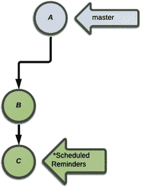
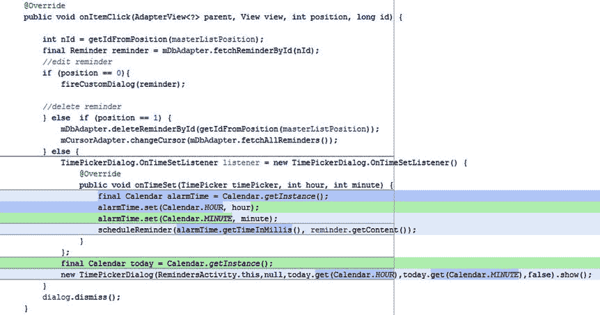
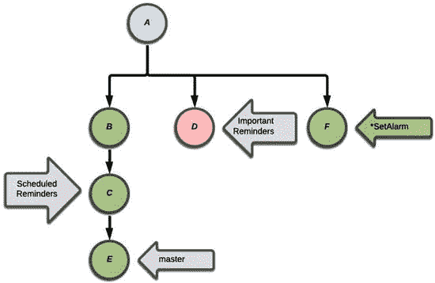

# 7.Git 简介

Git 版本控制系统(VCS)正在迅速成为事实上的标准，不仅在 Android 应用程序开发中，而且在一般的软件编程中。与需要使用中央服务器的早期版本控制系统不同，Git 是分布式的，这意味着存储库的每个副本都包含项目的整个历史，任何贡献者都没有特权。Git 是由 Linux fame 的 Linus Torvalds 开发的，目的是管理 Linux 操作系统的开发。就像开源运动本身一样，Git 是系统化的非层级结构，鼓励协作。

虽然 Git 从命令行提供了丰富的特性，但本章主要关注在 Android Studio 中使用 Git。多年来，支撑 Android Studio 的 IntelliJ 平台为包括 Git 在内的几个 VCS 系统提供了出色的支持。不同支持系统的一致性以一种使新手和专业人员都容易精通的方式呈现。然而，理解从 Android Studio 内部使用 Git 和从命令行使用 Git 之间的区别是很重要的。本章非常详细地解释了你开始使用 Git 所需要的一切。您将重用在前面章节中开始的 Reminders 应用程序来学习提交、分支、推送和获取等重要命令的基础知识。您将使用本地和远程 Git 存储库，并了解如何在协作环境中使用 Git 和 Android Studio。

打开你在[第 1 章](01.html)中创建的 HelloWorld 项目。如果您跳过了这一章，从头开始创建一个名为 HelloWorld 的新项目。在向导过程中，使用所有默认设置。您将简要地使用这个项目来理解 Git 设置的基础。

## 安装 Git

在开始使用 Git 之前，您需要安装它。将浏览器指向 [`http://git-scm.com/downloads`](http://git-scm.com/downloads) 。点击您的操作系统的下载按钮，如图 [7-1](#Fig1) 所示。

图 7-1。

Git download page

我们建议将 Git 安装在 Windows 上的`C:\java\ directory`目录中，或者 Mac 或 Linux 上的`∼/java`目录中。无论您决定在哪里安装它，都要确保整个路径没有空格。例如，不要在`C:\Program Files`目录中安装 Git，因为在`Program`和`Files`之间有一个空格。像 Git 这样的面向命令行的工具可能会遇到名称中有空格的目录的问题。一旦安装完成，您必须确保`C:\java\git\bin\`目录是您的`PATH`环境变量的一部分。关于如何给`PATH`环境变量添加路径的详细说明，参见[第 1 章](01.html)。

通过单击 Git Bash 图标启动 Git Bash 终端。如果你运行的是 Mac 或 Linux，只需打开一个终端。您需要用您的姓名和电子邮件配置 Git，以便您的提交将有一个作者。从 Git Bash 发出以下命令，用您自己的名字和电子邮件地址替换 John Doe 的名字和电子邮件地址。图 [7-2](#Fig2) 显示了一个例子。

图 7-2。

Adding your name and e-mail to Git

`$ git config --global user.name "John Doe"`

`$ git config --global user.email` `johndoe@example.com`

返回 Android Studio 继续设置 Git 与 Android Studio 的集成。导航到文件➤设置，然后在左窗格的版本控制部分找到 Git。单击省略号按钮并导航到刚刚安装的 Git 二进制文件。单击 Test 按钮以确保您的 Git 环境是可操作的。您应该看到一个弹出窗口，表明 Git 执行成功，以及您安装的 Git 版本。

导航到 VCS ➤导入到版本控制➤创建 Git 存储库。当对话框提示您选择将创建新 Git 存储库的目录时，确保您选择了项目根目录`HelloWorld`。你可以选择在目录选择器对话框中点击小小的 Android Studio 图标。该图标将导航到项目的根目录，如图 [7-3](#Fig3) 所示。单击 OK 按钮，您的本地 Git 存储库将被创建。

图 7-3。

Selecting the directory for your Git repository

您会注意到项目工具窗口中的大多数文件名都变成了棕色。这意味着这些文件被 Git 在本地识别，但是没有被 Git 跟踪，也没有被计划添加。Git 以两阶段的方式管理提交(这不同于 Subversion 和 Perforce 等其他 VCS 工具使用的方式)。登台区是 Git 在提交之前组织更改的地方。进行中的变更、临时区域变更和提交的变更之间的差异是显著的，可能会使新用户不知所措。因此，Android Studio 不会暴露这些差异。取而代之的是一个简单的 changes 界面，允许您轻松地管理和提交修改后的文件。

## 忽略文件

当您创建本地存储库时，Android Studio 会生成特殊的`.gitignore`文件，防止某些路径被跟踪。除非您另外指定，否则 Git 将继续跟踪这个目录及其子目录中的所有文件。然而，`.gitignore`文件可以告诉 Git 忽略某些文件或整个目录。

通常，根目录有一个`.gitingore`文件，每个项目有一个`.gitignore`文件。在 HelloWorld 中，一个`.gitignore`位于 HelloWorld 的根目录，一个`.gitignore`位于 app 文件夹的根目录。打开位于 HelloWorld 根目录下的`.gitignore`文件并检查其内容。图 [7-4](#Fig4) 展示了项目根目录下生成的`.gitignore`文件。默认情况下，Android Studio 会将某些文件从您的 Git 存储库中排除。该列表包括由项目生成或特定于本地计算机的控制设置生成的文件。例如，`/.idea/workspace.xml`文件控制 Android Studio 本地配置的设置。虽然可以在 Git 中跟踪这一点，但它不一定是您正在构建的项目的一部分，事实上可能会造成问题，因为该文件对于每个工作空间(例如计算机)都是唯一的。注意`.gitignore`中的一个条目是`/local.properties`。像 workspace.xml 一样，local.properties 对于每台计算机都是唯一的。

图 7-4。

The root .gitignore file contents

注意列表中的`/build`条目。在第十三章中深入讨论的 Android Studio 构建系统 Gradle，在你编译和运行你的项目时，把它所有的输出放在这里。因为该文件夹将包含来自。类文件到`.dex`文件再到最终的可安装 Android 包，而且因为它的内容是不断变化的，所以用 Git 跟踪它意义不大。在项目工具窗口中找到`local.properties`文件。你会注意到它是黑色的，而其他文件是棕色的。

Android Studio 使用一种配色方案，允许您在工作时轻松识别您的版本控制系统将会看到什么。正如我们已经说过的，brown 表示 Git 在本地识别了 a 文件，但是 Git 没有跟踪它，也没有计划添加它。蓝色表示 Git 正在跟踪的文件已经被更改。绿色用于 Git 正在跟踪的全新文件。黑色表示文件未被更改或未被跟踪。Android Studio 不断跟踪添加到项目中的文件，并在必要时提示您将这些文件与 Git 保持同步。

## 添加文件

打开屏幕底部的更改视图。它包括两个部分:默认和未版本化的文件。默认部分最初为空，表示活动的变更列表。当您修改和创建文件时，它们将属于此部分，因为它保存了准备提交到您的 VCS 的文件。未版本化文件部分包含所有不被 VCS 跟踪的内容。

因为尚未跟踪所有项目文件，所以它们属于未版本化文件部分。您需要将这些添加到您的存储库中。“变更”视图的左侧是两列图标。在右栏中，单击顶部第三个图标(文件夹图标)；参见图 [7-5](#Fig5) 中的圆圈图标。这是一种切换方式，使您可以按文件夹对文件进行分组，以便更好地了解它们在项目中的相对位置。右键单击未版本化文件部分标题，然后从上下文菜单中单击添加到 VCS，将这些文件添加到 Git 索引中。或者，您可以单击并拖动整个部分到粗体默认部分。

图 7-5。

Group files by folders

添加完所有文件后，单击带有向上绿色箭头的 VCS 图标。这将打开你在第 5 章中开始使用的熟悉的提交对话框。单击 Commit 记录您的更改，默认部分最终会清空。您也可以按 Ctrl+K | Cmd+K 来执行相同的操作。从现在开始，你在 Android Studio 中接触的每个文件都将在 Git 下被跟踪。

## 克隆参考应用程序:提醒

本节扩展了您在第 [5](05.html) 和 [6](06.html) 章节中创建的提醒应用程序。我们邀请您使用 Git 克隆这个项目，以便跟进，尽管您将使用从第 [5](05.html) 和 [6](06.html) 章中使用的资源库派生的新 Git 资源库重新创建这个项目。如果您的计算机上没有安装 Git，请参见[第 7 章](07.html)。在 Windows 中打开一个 Git-bash 会话(或者在 Mac 或 Linux 中打开一个终端)并导航到 C:\androidBook\reference\(如果没有参考目录，请创建一个。在 Mac 上，导航到/your-labs-parent-dir/reference/)并发出以下 git 命令:git clone[`https://bitbucket.org/csgerber/reminders-git.git`](https://bitbucket.org/csgerber/reminders-git.git)reminders git。您将使用 Git 特性来修改项目，就像您在一个团队中工作一样。通过这个过程，您将学习如何派生和克隆一个项目，并在开发特性时设置和维护分支。在开始本练习之前，将您在第 6 章中完成的提醒项目重命名为 RemindersChapter6，因为您将很快重新创建该文件夹。在 windows 中，您可以右键单击资源管理器中的文件夹，然后选择重命名。在 Linux 或 Mac 上运行以下命令:mv∽/Android book/Reminders∽/Android book/Reminders chapter 6。

### 分叉和克隆

派生远程存储库包括在单个 web 托管服务上从一个远程帐户/分区克隆到另一个远程帐户/分区。Fork 不是 Git 命令；这是一个网站托管服务的操作，如 Bitbucket 或 GitHub。据我们所知，两个更受欢迎的网络托管服务，Bitbucket 和 GitHub，不允许它们的服务器之间有分叉。派生一个项目是将一个项目从它原来的远程存储库复制到您自己的远程 Git 存储库的过程，目的是为了改变它或者制作衍生作品。

从历史上看，分叉具有某种负面的含义，因为它通常是不同的最终目标或项目成员之间的分歧的结果。这些差异经常导致来自多个团队的看似相同的软件的替代版本，并且没有用户社区可以依赖的明确的官方版本。然而，现在由于 Git 的出现，分叉得到了强烈的鼓励。分叉现在是协作的自然组成部分。许多开源项目使用 forks 作为改进整个源代码库的手段。成员鼓励其他人派生并改进代码。这些改进通过拉请求的方式被拉回到原始项目中，或者通过个人的请求将 bug 修复或特性拉回到主线中。因为 Git 的合并和分支非常灵活，所以您可以将任何东西放入您的存储库，从单个提交到整个分支。

本章并没有涵盖拉请求和开源协作的全部，但是涵盖了推动这种强大协作形式的特性。登录您的 Bitbucket 帐户，在 Bitbucket 上查找案例研究。如果你还没有一个比特币账户，请在浏览器中导航到 Bitbucket 并注册。注册大约需要 30 秒。登录 Bitbucket 后，您可以使用 Bitbucket web 界面右上角的搜索框找到提醒存储库。在搜索框中，键入 csgerber/reminders。同样，不要将其与您之前作为参考克隆的 reminders-git 存储库混淆。要分叉这个项目，点击左边的分叉按钮，如图 [7-6](#Fig6) 所示。当随后的窗口提示时，接受默认设置并点击如图 [7-7](#Fig7) 所示的 Fork repository 按钮。

图 7-7。

Click the Fork repository button

图 7-6。

Click Fork in the Reminders repository left margin controls

现在，我们将克隆您刚刚分叉的存储库。在 Git 中，克隆是从另一个位置复制整个 Git 项目的过程，通常是从远程复制到本地。找到项目的分支并复制 URL。您可以通过在 Bitbucket web 界面的搜索框中键入 your-bit bucket-username/reminders 来完成此操作。在搜索框的正下方，沿着 Bitbucket web 界面的右上方，您会发现克隆框，其中会有一个类似于`git@bitbucket.org:csgerber/reminders.git`或`https://your-bitbucket-username@bitbucket.org/your-bitbucket-username/reminders.git`的 URL。如果你没有 http URL，那么点击 URL 旁边的按钮，它应该被标记为 SSH，如图 [7-8](#Fig8) 所示。这将显示一个下拉菜单，允许您选择一个 http URL。从版本控制> Git 导航到 VCS > Checkout。图 [7-9](#Fig9) 所示的对话框打开，提示您输入 VCS 存储库 URL、父目录和目录名。VCS 存储库 URL 是前面克隆框中的 URL，父目录和目录名的组合是您希望在本地计算机上放置副本的位置。默认情况下，目录名称中的项目名称是小写的。我们建议您用大写字母命名您的项目，因此请根据图 [7-9](#Fig9) 进行更改。

图 7-9。

Cloning the repository with the Git GUI

图 7-8。

The Bitbucket Share URL

点击克隆，源代码将被复制到本地。

### 使用 Git 日志

Git 日志是一个强大的特性，它让您能够探索项目的提交历史。通过单击工具按钮或按 Alt+9 | Cmd+9 打开“更改”工具窗口，然后选择“日志”选项卡以显示日志。图 [7-10](#Fig10) 说明了在[第 6 章](06.html)结束时通过最终提交的提醒项目的历史。这个视图显示了与存储库中各个分支相关联的时间线。

图 7-10。

Exploring the Git log

单击时间轴中的单个条目会在右侧显示更改列表中的文件；这些是在提交过程中更改的文件。单击来自任何特定提交的文件，然后按 Ctrl+D | Cmd+D(或者简单地双击它们)来获得可视文本 diff，这是一个并排的比较，突出显示对文件的更改。您可以使用更改列表上方的工具栏按钮来编辑源文件，打开文件的存储库版本，或者恢复选定的更改。您还可以使用日志下面的窗口来查看提交作者、日期、时间和哈希代码 ID。这些散列码是唯一的 id，在使用 Git 的一些更高级的特性时，可以用来识别单个提交。

### 分支

到目前为止，您已经在一个名为`master`的分支上进行了所有的提交，这是默认的分支名称。但是，你不需要停留在`master`上。Git 允许您创建任意多的分支，分支在 Git 中有多种用途。这里有一个可能的场景。假设您正在与一个开发团队一起工作，并且在一个开发周期中，您每个人都被分配了特定的任务。这些任务中有些是特性，有些是错误修复。处理这项工作的一个合乎逻辑的方法是将每个任务变成一个分支。开发人员都同意，当一个任务完成并测试后，开发人员会将该任务分支合并成一个名为`dev`的分支，然后删除该任务分支。在开发周期结束时，`dev`分支由 QA 团队测试，QA 团队要么拒绝变更并将项目踢回给开发团队，要么签署周期并将`dev`合并到`master`。这个过程被称为 Git 流，这是用 Git 在团队中开发软件的推荐方式。你可以在这里阅读更多关于 Git 流的内容:

[T2`https://guides.github.com/introduction/flow/index.html`](https://guides.github.com/introduction/flow/index.html)

Git Flow 非常适合大型团队，但是如果你是单独开发或者只和一两个其他开发人员一起工作，你可能需要同意一个不同的工作流程。无论您的工作流是什么样的，Git 中的分支功能都是灵活的，它将允许您调整您的工作流以适应 Git。在本节中，我们将假设您正在进行一个团队项目，并被分配了在提醒应用程序中添加一个功能的任务，该功能允许用户在一天中的特定时间安排提醒。

## 在树枝上生长

选择“文件”“➤导入项目”,打开之前克隆的 Reminders-Git 项目。右键单击项目视图中的 Reminders-Git 根文件夹，并选择 Git ➤存储库➤分支，以打开分支提示窗口。这个提示允许您浏览所有可用的分支。从提示中单击新建分支。将您的分支命名为 ScheduledReminders，如图 [7-11](#Fig11) 所示。

图 7-11。

Creating a new branch with Git

新的分支将被创建并签出，供您使用。打开 Changes 视图并点击绿色加号按钮来创建一个新的 changelist。将其命名为 ScheduledReminders，就像您的新分支一样，因为下一轮的更改将引入安排提醒的功能。确保选中激活该变更列表复选框，如图 [7-12](#Fig12) 所示。

图 7-12。

Creating a new changelist for the branch work

要开始您的新功能，您需要向对话框添加一个新选项，当单击提醒时会显示该选项。打开`RemindersActivity.java`并转到附加到 mListViewvariable 的第一个`OnItemClickListener`嵌套类中的`onItemClick()`方法的顶部。在`String`数组中添加日程提醒作为第三个条目，构建可点击选项，如图 [7-13](#Fig13) 的第 92 行所示。接下来，您需要允许用户设置当您的新选项被点击时的提醒时间。找到第二个嵌套的`OnItemClickListener`，它附加到`modeListView`上，当单个提醒被点击时，它会创建一个对话框。这将发生在 dialog.show()方法调用之后。查看其`onItemClick()`方法内部，如第 101 行所示，并进行如图 [7-13](#Fig13) 所示的更改。您需要解决日期类的导入问题。

图 7-13。

Changes for scheduled reminders

这里，您将删除提醒的`else`块更改为`else if`块，它检查索引 1 处的位置。您添加了一个在第三个新选项被点击时运行的`else`块。这个块创建一个新的代表今天的`Date`，并用它来构建一个`TimePickerDialog`。立即运行应用程序，测试新选项。图 [7-14](#Fig14) 显示了新功能的运行情况。

图 7-14。

Trying the Schedule Reminder option

现在，新功能的一部分已经开始工作，按 Ctrl+K | Cmd+K 确认消息添加新的计划时间选取器选项。回到 IDE，将找到提醒的两行移到`position==0`条件之外。将`reminder`变量标记为`final`。示例见图 [7-15](#Fig15) 。

图 7-15。

Move the reminder variable outside the if block

接下来转到您刚刚添加的`else`块，在那里您构造并显示时间选择器对话框。在显示与图 [7-13](#Fig13) 中第 113 行对应的对话框的行前添加以下代码:

`final Date today = new Date();`

`TimePickerDialog.OnTimeSetListener listener = new TimePickerDialog.OnTimeSetListener() {`

`@Override`

`public void onTimeSet(TimePicker timePicker, int hour, int minute) {`

`Date alarm = new Date(today.getYear(), today.getMonth(), today.getDate(), hour, minute);`

`scheduleReminder(alarm.getTime(), reminder.getContent());`

`}`

`};`

这将为时间选取器对话框创建一个侦听器。在这个监听器中，您使用今天的日期作为闹钟的基准时间。然后包括从对话框中选择的小时和分钟，为您的提醒创建闹钟日期变量。你在一个新的`scheduleReminder()`方法中使用了闹钟时间和提醒的内容。Android Studio 会将 TimePicker 标记为未解析的类，并将 scheduleReminder()方法标记为未解析的方法。按 Alt+Enter 解决 TimePicker 类的导入问题。再次按 F2 和 Alt+Enter 打开智能感知对话框，然后按 Enter 让 Android Studio 为您生成方法，如图 [7-16](#Fig16) 所示。

图 7-16。

Generate method using IntelliSense

选择`RemindersActivity`类，如图 [7-17](#Fig17) 所示。

图 7-17。

Selecting the RemindersActivity as the target class

将以下代码添加到新的方法体中:

`AlarmManager alarmManager = (AlarmManager) getSystemService(Context.ALARM_SERVICE);`

`Intent alarmIntent = new Intent(this, ReminderAlarmReceiver.class);`

`alarmIntent.putExtra(ReminderAlarmReceiver.REMINDER_TEXT, content);`

`PendingIntent broadcast = PendingIntent.getBroadcast(this, 0, alarmIntent, 0);`

`alarmManager.set(AlarmManager.RTC_WAKEUP, time, broadcast);`

同样，Android Studio 会为代码中缺失的导入标记一系列错误。按 F2，然后按 Alt+Enter 打开快速修复提示并修复每个错误。快速修复选项最终会提示您`ReminderAlarmReceiver`不存在。按 Alt+Enter 并选择第一个选项来生成类。在第一个弹出对话框中按 Enter 键使用建议的包，然后在第二个弹出对话框中再次按 Enter 键将这个新的类文件添加到 Git。让类扩展`BroadcastReceiver`并实现`onReceive()`方法。您的`ReminderReceiver.java`文件应该如下所示:

`package com.apress.gerber.reminders;`

`import android.content.BroadcastReceiver;`

`import android.content.Context;`

`import android.content.Intent;`

`public class ReminderAlarmReceiver extends BroadcastReceiver {`

`@Override`

`public void onReceive(Context context, Intent intent) {`

`}`

`}`

Tip

重复按 F2(下一个突出显示的错误)和 Alt+Enter(快速修复)来让 Android Studio 修复许多从清单中复制代码时出现的错误，如图 [7-16](#Fig16) 。它将添加缺失的导入，并为未定义的方法、常量和类生成代码。

返回到`RemindersActivity.java`文件。通过按 F2 然后 Alt+Enter 找到并修复最后一个错误，并选择第二个建议来编码生成一个`String`常量，如图 [7-18](#Fig18) 所示。将此文本的值设置为“REMINDER_TEXT”。

图 7-18。

Generate a Constant field .

最后，打开你的 AndroidManifest.xml 文件，添加一个 receiver 标签来定义新的`BroadcastReceiver`，如图 [7-19](#Fig19) 所示。

图 7-19。

BroadcastReceiver manifest entry

运行应用程序进行测试。您应该能够点击一个提醒，选择日程提醒，并设置它的触发时间。选择时间不会有任何作用，因为我们还没有涉及到`BroadcastReceivers`的细节。现在按 Ctrl+K | Cmd+K 调用提交更改对话框。请花些时间在“提交更改”对话框中确认您到目前为止所做的更改。请注意，该对话框保留了您之前提交的消息，您应该更新该消息，如图 [7-20](#Fig20) 所示。

图 7-20。

Git’s Commit Changes dialog box

选择`RemindersActivity`后，点击显示差异按钮(如图 [7-20](#Fig20) 所示)以显示所有变更的并排差异。点按左上角的向上和向下箭头，或者按下 F7 键，在文件的早期和晚期差异之间移动。这些控制出现在图 [7-21](#Fig21) 中。使用向下箭头移动到您的`onItemClickListener`中有趣的变化。

图 7-21。

Visual text diff view

到目前为止，您已经设法包含了一个当前没有使用的`OnTimeSetListener`。(`listener`变量的浅灰色表示它不在代码中使用。)当您在这个视图中移动代码时，不仅会提醒您已经做出的更改，还会提醒您可能错过的更改，这给了您在提交之前修复问题的另一个机会。diff 视图也是一个具有一些语法感知特性的编辑器。如果您选择进行小的调整，您可以利用诸如自动完成之类的东西。

按 Escape 键关闭 diff 视图，并在提交更改之前更改提交消息。点击提交，让 Android Studio 有机会执行代码分析。您将看到另一个对话框，告诉您某些文件包含问题。对话框将提示代码中有警告。此时，您可以单击 Review 按钮取消提交，并生成所有潜在问题的列表。尽管忽略警告不是好的做法，但是您可以有意地暂时不理会这些警告，继续下一步。

### Git 提交和分支

分支上提交的 Git 风格是相似的，但是如果您来自使用 Perforce 或 Subversion 等工具的传统 VCS 背景，可能会感觉与您所习惯的有些不同。您将希望理解 Git 如何管理提交和分支的细微差别。这些差异可能会让新手感到困惑，但它们是 Git 强大和灵活的核心。

Git 中的提交被视为项目历史中的一级实体，可以通过特殊的提交哈希代码来识别。虽然您不需要了解 Git 如何实现单个提交和版本控制的细节，但是将提交视为存在于代表存储库整个状态的历史时间线中的对象或实体是很重要的。提交作为一个原子工作单元存在，它发生在 Git 历史中的某一时刻，用描述工作的提交消息进行注释。每个提交都有一个父提交，它前面有一个或多个提交。您可以将分支视为历史中指向单个提交的标签。当您创建一个分支时，会在历史记录中的该点创建一个标签，当您对该分支进行提交时，标签会跟随提交的历史记录。下图从图 [7-22](#Fig22) 开始，展示了 Git 当前看到的 Reminders 项目历史。

图 7-22。

Git history showing ScheduledReminders branch Note

Android Studio 提交日志是自下而上的，而我们的图是自上而下的。

主分支由指向来自克隆项目的最后一个 commit A 的灰色箭头表示。(与 Git 日志视图相比，您将会注意到还有其他提交在进行，但是为了简洁起见，我们省略了它们。)ScheduledReminders 分支是绿色箭头，指向实现新特性的一系列提交 B 和 C 中的最新一个。为了简单起见，我们使用单个字母作为标签，但是 Git 使用提交哈希代码，其中包括更长的十六进制名称，例如`c04ee425eb5068e95c1e5758f6b36c6bb96f6938`。您可以通过仅使用其散列的前几个字符来引用特定的提交，只要它们是唯一的或者不与任何其他散列的前几个字母相似。

### Revert 在哪里？

当人们第一次尝试 Git 时，最大的障碍之一就是适应 Git reverts，因为他们不能像其他 VCS 客户那样工作。Git revert 是一个撤销早期提交的提交(工作单元)。理解的最好方法是看它的实际操作。让我们做一个修改，修复您在`RemindersActivity.java`中的反对警告。引入`Calendar`物体，移除`Date`物体，如图 [7-23](#Fig23) 所示。

图 7-23。

Fix the deprecation warnings

构建并运行代码以验证它是否有效，然后提交此更改并显示消息 Fixes deprecation warnings。注意，对于未使用的变量，仍然会有一个警告，这将在后面的“重定基时解决冲突”一节中解决。Android Studio 中的 revert 命令与 Git revert 命令有很大不同。在这里，您将使用命令行 git revert 命令来理解其中的区别。找到“修复不推荐使用的警告”提交在“更改工具”窗口的 Git 历史记录中，右键单击它并选择“复制哈希”,将提交哈希代码复制到您的系统剪贴板。现在，通过单击底部空白处的终端窗口按钮打开终端，输入 git revert 并粘贴提交散列作为命令的最后一部分。你的命令应该如图 7-24 所示。按 enter 键，Git 将在您的终端中启动一个提交消息编辑会话，如图 [7-25](#Fig25) 所示。键入“:q”退出编辑会话，该会话保存默认提交消息并执行提交。

图 7-25。

Commit message edit. Exit by typing :q.

图 7-24。

Issuing the git revert command from the terminal

git 恢复会导致执行新的提交，从而取消之前的提交。切换回 Android Studio，看看有什么变化。所有的弃用警告都随着展开的更改返回。您的 Git 历史将反映提交。Git 应用前一次提交的所有更改的反转，并立即执行一次带有这些更改的提交，并显示一条与前一次提交相同的带有 Revert 前缀的消息。相比之下，其他工具会跟踪您对文件的本地修改，并允许您在提交之前撤消修改。尽管这种撤销更改的新风格有所不同，但 Android Studio 为您提供了一个与经典的、更熟悉的版本控制工具一致的恢复界面。在撰写本文时，还没有 IDE 命令或菜单动作触发 Git revert 的等效操作。但是，一个内置选项允许您在本地应用来自本地历史、Git 历史甚至补丁文件的反向更改。Git revert 自动化了应用反向更改和执行提交这两个步骤。图 [7-26](#Fig26) 展示了 Git 的历史，提交 D 引入了修改弃用的变更，提交 D 代表了恢复弃用的对`Date`对象的调用的撤销变更。

图 7-26。

Git history after revert

撤销已提交更改的另一种方法是使用 reset 命令，它的工作方式类似于 revert，但有一个细微的区别。将图 [7-23](#Fig23) 中的更改添加回源代码，并再次提交。你的 Git 历史将在-D 后面有一个额外的 E 提交，如图 [7-27](#Fig27) 所示。这次选择风投➤ Git ➤重置头。在弹出的对话框中输入 HEAD 1，如图 [7-28](#Fig28) 所示，点击复位。

图 7-28。

The Git Reset Head dialog box

图 7-27。

Git history after reapplying the deprecation fix

Git 会在您最后一次提交之前将您的存储库与提交同步，这相当于对该提交的撤销——使您的历史看起来如图 [7-26](#Fig26) 所示。Android Studio 通过使用当前的更改列表重新应用您的更改来增强 Git 重置。这为您提供了第二次机会，以便在意外执行重置时收回提交。在大多数情况下，您会希望在重置后完全放弃更改。单击更改工具窗口中的恢复更改按钮以完全放弃更改。在图 [7-29](#Fig29) 中，恢复更改按钮被圈起来。

图 7-29。

Click the revert changes button

让我们更进一步地重置，以删除您在不赞成使用的方法调用上的所有工作痕迹。选择 VCS ➤ Git ➤重置头。然后在弹出的对话框中输入 HEAD 2，如图 [7-28](#Fig28) 所示，点击 Reset。记得之后点按“还原更改”按钮。这将成为你每次在 Android Studio 中使用 Git Reset 的习惯。你的历史将会反映出图 [7-22](#Fig21) 的历史。

Revert Vs. Reset

还原和重置之间的区别是微妙但重要的。revert 添加了一个提交，该提交反转了上次提交的更改，而 reset 取消了一个提交。重置本质上是通过给定数量的提交来备份您的分支标签。如果您不小心提交了某个东西，您通常会想要撤销或删除某个提交。在这种情况下使用重置是合理的，因为这是最简单的选择，并且不会增加您的历史记录。但是，在某些情况下，您可能希望您的历史记录能够反映撤销提交的工作—例如，如果您从项目中提取一个特性，并且希望向用户社区记录该特性的删除。revert 的另一个重要用途是远程存储库，我们将在本章后面讨论。因为您只能向远程存储库添加提交，所以删除或撤销远程存储库上的提交的唯一方法是使用 revert，它将反转的更改作为提交追加。

### 合并

合并是将两个独立分支的工作结合起来的一种方式。历史上，由于分支之间的冲突，合并需要额外的努力。由于 Git 实现了更改，合并变得不那么痛苦了。

您将从在主分支上为极端拖延者添加一个新特性开始。这个新功能会将所有提醒的默认值设置为重要，因为我们知道你会忽略除了最重要的提醒之外的任何事情。单击文件➤ VCS ➤ Git ➤分支机构调出分支机构列表。选择主分支，然后选择签出。请注意，基础源代码已经更改，支持新功能的所有更改都已删除，并且您的项目已恢复到您开始处理计划提醒之前的状态。创建一个名为的新变更列表，并将其设置为活动。出现提示时，删除空的 ScheduledReminders 更改列表。图 [7-30](#Fig30) 和 [7-31](#Fig31) 演示了该流程。

图 7-31。

A confirmation dialog box appears when deleting the old changelist

图 7-30。

New changelist dialog box

查看`fireCustomDialog()`方法，找到从对话框布局中检索复选框的行。新增一行调用`checkBox.setChecked(true)`，将设置新的默认值，如图 [7-32](#Fig32) 第 200 行所示。

图 7-32。

Set the check box default to checked

构建并运行应用程序以测试新功能，然后使用 Ctrl+K | Cmd+K 提交。Git 将看到图 [7-33](#Fig33) 中记录的历史，它代表您在分支的初始克隆之后的最新提交。

图 7-33。

Commit history after adding a feature to the master branch

在这里，你把你的头转向主，并作出了 D 的承诺。此最新提交遵循与 ScheduledReminders 功能的提交不同的历史路径，因为此提交不在同一分支上。

Note

如果您在 Git 日志视图中跟踪历史，您会注意到有另一个 origin/master 分支指向我们没有显示的提交。这是稍后讨论的远程分支。

您已经在 master 分支上做了一些工作，并提交了一些内容，以便在 ScheduledReminders 分支上添加一个新特性，所以现在您将把这些更改一起放到主线或 master 分支中，以便其他人可以看到它们。再次单击文件➤ VCS ➤ Git ➤分支机构，调出分支机构列表。选择 ScheduledReminders 分支，然后单击“合并”。该分支的所有更改和历史记录都将合并到主分支中。构建并运行应用程序来测试这两个特性。从“选项”菜单中单击“新建提醒”将打开一个选中“重要提示”复选框的“新建提醒”对话框，而单击列表中的任何提醒将提供在特定时间安排提醒的选项。图 7-34 展示了 Git 是如何管理你的变更的。

图 7-34。

Commit history after merging the ScheduledReminders feature

自动执行新的 E 提交，包括来自 C 和 D (E 的父代)的更改。还要注意，HEAD 指向包含最新提交的主分支的头。

### Git 重置更改历史

如果你想把你的重要提醒功能作为一个分支呢？您从未为此功能创建分支。相反，你就在主分支的顶端发展。您可以强制您的主分支进行备份，并指向您的 D commit，所以我们现在就开始吧。单击文件➤ VCS ➤ Git，然后单击重置头。“提交”字段将被设置为“标题”。设置为 HEAD∾1 点击重置按钮如图 [7-35](#Fig35) 再次重置你的主分支，更像是一个标签。记得恢复从 Git 重置保存的更改。然后它将指向先前的提交。Git 现在将会看到如图 [7-33](#Fig33) 中之前的图表所示的存储库。

图 7-35。

Git reset dialog box

由于最后一次提交包含了合并的更改，重置使得合并从未发生，您现在位于提交之上，这引入了 ImportantReminders 特性。这让您可以自由地改变历史，使它看起来好像这个新特性是在一个分支上开发的。单击文件➤ VCS ➤ Git，然后单击分支打开分支对话框。单击新建分支。将该分支命名为 ImportantReminders，然后单击 OK 创建它。你现在有了图 [7-36](#Fig36) 中描述的历史。

图 7-36。

Git history showing the new branch

master 和 ImportantReminders 分支都指向同一个提交。使用“分支”对话框检查主分支，可以通过单击状态栏右上角的“分支”部分或选择“文件”“➤VCS”“➤git”“➤分支”来调用该对话框。再次重置该分支，使其指向最初从 Bitbucket 克隆项目的位置，然后签出 ImportantReminders 分支。历史现在反映了仍在开发中的两个实验性特性分支，而工作副本(您在 IDE 中看到的)反映了项目在您第一次克隆它时的存在。你可以在图 [7-37](#Fig37) 中看到这一点。

图 7-37。

Git history after resetting master to the beginning

现在，您想要进一步更改历史并重新排序您的特性提交，以便它们看起来像是连续开发的，并且在开发期间没有使用分支。在此之前，签出 master 分支，并将其与 ImportantReminders 分支合并。合并将导致一个特殊的快进操作:Git 只是在历史中将主分支向前移动到由 ImportantReminders 分支共享的同一个提交。这与前面的合并分支示例不同，因为一个分支是另一个分支的后代。如果您足够仔细地观察，您会注意到创建一个将来自 ImportantReminders 分支的更改合并到主服务器上的提交与这个分支已经指向的 D 提交是相同的。因此，Git 优化了操作，只是将主分支向前移动，这将您带回到类似于图 [7-36](#Fig36) 所示的历史。不同之处在于，您签出的是 master 而不是 ImportantReminders 分支。

现在你会让你的历史更有趣。您将在应用程序中添加一个“关于”对话框，以便您的用户了解更多关于开发者的信息。“关于”对话框也是放置所用技术和艺术作品属性的好地方。你的会相对简单。如果尚未删除 ImportantReminders 更改列表，请将其删除，并使用标题为 AboutScreen 的新更改列表。在`app` ➤ `src` ➤ `main` ➤ `res` ➤ `layout`下新建一个名为 dialog_about.xml 的资源 XML 文件，并用清单 [7-1](#FPar1) 中的代码填充。

Listing 7-1\. dialog_about.xml

`<?xml version="1.0" encoding="utf-8"?>`

`<RelativeLayout xmlns:android="``http://schemas.android.com/apk/res/android`T2】

`android:layout_width="match_parent" android:layout_height="match_parent">`

`<TextView`

`android:layout_width="wrap_content"`

`android:layout_height="wrap_content"`

`android:textAppearance="?android:attr/textAppearanceLarge"`

`android:text="Reminders!"`

`android:id="@+id/textView2"`

`android:layout_alignParentTop="true"`

`android:layout_centerHorizontal="true" />`

`<TextView`

`android:layout_width="wrap_content"`

`android:layout_height="wrap_content"`

`android:textAppearance="?android:attr/textAppearanceMedium"`

`android:text="Version 1.0\nAll rights reserved\nDeveloped by yours truly!"`

`android:id="@+id/textView3"`

`android:layout_marginTop="34dp"`

`android:layout_below="@+id/imageView"`

`android:layout_centerHorizontal="true"`

`android:gravity="center" />`

`<ImageView`

`android:layout_width="wrap_content"`

`android:layout_height="wrap_content"`

`android:id="@+id/imageView"`

`android:layout_below="@+id/textView2"`

`android:layout_centerHorizontal="true"`

`android:src="@drawable/ic_launcher" />`

`</RelativeLayout>`

此布局定义了一个“关于”对话框，其中包含标题的文本视图、正文的文本视图，并在两者之间放置提醒启动图标。您需要一个新的菜单项来触发对话框。打开`menu_reminders.xml`并在第一个和第二个项目标签之间添加以下 XML 片段:

`<item android:id="@+id/action_about"`

`android:title="About"`

`android:orderInCategory="200"`

`app:showAsAction="never" />`

将退出菜单项的`orderInCategory`从 200 更改为 300，以便它可以在新的“关于”项之后排序。

现在打开`RemindersActivity.java`，为调用新`fireAboutDialog`方法的新菜单项添加一个用例，如图 [7-38](#Fig38) 所示。

图 7-38。

Add an About screen

方法使用你的新布局构建一个对话框并显示它。构建并运行新特性来测试它。最后，按 Ctrl+K | Cmd+K 并提交消息“添加一个关于屏幕”。Git 历史现在在重要的提醒特性之后多了一个 commit，它现在由一个分支指向。图 [7-39](#Fig39) 中您最新的 E commit 包含了关于对话框功能。

图 7-39。

Git history after adding the About screen

### 吉特·福克斯

重设基础是一种基于另一个分支或一系列提交创建分支的方法。它类似于合并，因为它合并了分支之间的更改，但它以一种没有多个父级的方式创建提交历史。最好用现在的历史作为例子。单击文件➤ VCS ➤ Git ➤重设基础以打开重设基础分支对话框。告诉该对话框，您想通过从“到”下拉菜单中选择主分支来将主分支重置到 ScheduledReminders 分支，如图 [7-40](#Fig40) 所示。保持选择交互式选项，这样您可以更好地控制组合内容。

图 7-40。

The Git Rebase branch dialog box

这将带您进入交互式重设基础模式，显示图 [7-41](#Fig41) 中的对话框。交互式重定基础是 Git 更强大的特性之一。在这里，您可以删除和更改提交历史中的单个提交。“重设提交基准”对话框列出了所选分支历史记录中发生的所有提交，直到您“基于”的分支的第一个共同祖先。首先要注意的是每个提交的 Action 列下的选项。该对话框提供了拾取、编辑、跳过或挤压选项。然而，Android Studio 默认选择每个提交。

图 7-41。

The Git Rebase commits dialog box

假设您不再需要这个分支的 ImportantReminders 特性，但是您仍然对 About 屏幕感兴趣。选择 Skip 操作从列表中删除这个提交，当您完成 rebase 和合并分支时，这些更改都不会出现。单击开始重置基础选项以完成操作。你的 Git 历史现在看起来如图 7-42 所示。

图 7-42。

After rebasing and skipping the ImportantReminders branch

### 分离头

让我们假设当您最初克隆这个项目时，有另一个开发人员正在开发一个报警功能。再进一步说，你想最终融合在这个作品里。要模拟这种情况，您需要在历史中回到 A commit 并启动新特性。到目前为止，您一直在针对一个特定的分支进行工作和提交。这可以是自定义命名的分支，也可以是初始导入时创建的主分支。

我们现在将演示 Git 中的另一种工作方式，即分离头模式。如果您签出一个特定的提交而不是一个分支，那么这个头将从您正在处理的分支中分离出来并被暴露。首先，您需要检查 ImportantReminders 分支的父提交。为此，打开分支对话框，点击签出标签或修订，如图 [7-43](#Fig43) 所示。

 

图 7-43。

Checking out the change prior to the last change in the ImportantReminders branch

在结帐提示中输入 important reminders 1。您现在将处于分离模式，您的头分支和项目状态将反映您最初克隆项目时所做的最后一次提交，如图 [7-44](#Fig44) 所示。

图 7-44。

git_diagram8

请注意，Git 现在公开了一个新的 HEAD，它与开发过程中创建的任何分支都是分离的。负责人已经正式跟踪了你检查过的任何一个分支。当您提交时，签出的分支将随着头部移动到最近的提交。您输入的 important reminders 1 文本是您希望从何处开始结帐的相对参考。您可以给大多数需要分支或提交散列的操作一个相对引用。相对引用使用以下两种格式之一:

`BranchOrCommitHash^`

`BranchOrCommitHash∼NumberOfStepsBack`

单插入符号形式从左侧指定的分支或提交在历史中后退一步，而波浪号形式在历史中后退的步数等于波浪号右侧给出的步数。

### 相对引用

相对引用是 Git 表达式，用于引用 Git 历史中的特定点。他们使用一个起点或参考点，以及一个目标，该目标是从参考点开始的步数。虽然引用经常作为 HEAD 给出，但它也可以是分支的名称或特定提交的哈希代码(或缩写的哈希代码)。您可以使用相对引用来完成任务，比如将分支移动到 Git 历史中的任意位置，选择特定的提交，或者将头移动到历史中的特定点。在任何可以给出分支名或提交散列的地方，相对引用都可以作为参数给出。虽然我们已经看到了一些在 IDE 中使用它们的例子，但是它们最好在命令行中与 Git 一起使用。

创建一个新的分支来开始下一个特性，并将其命名为 SetAlarm。为新分支创建一个变更列表，并删除任何旧的空变更列表。在`com.apress.gerber.reminders`包中添加一个名为 RemindersAlarmReceiver 的新类，并用下面的代码填充它:

`public class ReminderAlarmReceiver extends BroadcastReceiver{`

`public static final String REMINDER_TEXT = "REMINDER TEXT";`

`@TargetApi(Build.VERSION_CODES.JELLY_BEAN)`

`@Override`

`public void onReceive(Context context, Intent intent) {`

`String reminderText = intent.getStringExtra(REMINDER_TEXT);`

`Intent intentAction = new Intent(context, RemindersActivity.class);`

`PendingIntent pi = PendingIntent.getActivity(context, 0, intentAction, 0);`

`Notification notification = new Notification.Builder(context)`

`.setSmallIcon(R.drawable.ic_launcher)`

`.setTicker("Reminder!")`

`.setWhen(new Date().getTime())`

`.setContentText(reminderText)`

`.setContentIntent(pi)`

`.build();`

`NotificationManager notificationManager = (NotificationManager)`

`context.getSystemService(Context.NOTIFICATION_SERVICE);`

`notificationManager.notify(1, notification);`

`}`

`}`

这里我们有一个`BroadcastReceiver`，它期望`REMINDER_TEXT`作为额外的意图给出。它使用该文本并创建一个动作意图，用它来构建一个通知以发布到通知栏中。接下来，在`AndroidManifest.xml`中，在`activity`标签之后，在结束的`application`标签之前添加以下条目，以定义`BroadcastReceiver`:

`<receiver android:name="com.apress.gerber.reminders.ReminderAlarmReceiver"/>`

按 Ctrl+K | Cmd+K 并提交带有消息“添加警报广播接收器”的设置警报更改列表。您的 Git 历史将类似于图 [7-45](#Fig45) ,其中第三次提交在您的初始起点 a 处挂起。

图 7-45。

Git history after committing to the SetAlarm branch

这个特性本身不会做太多事情。它需要与 ScheduledReminders 特性合并，后者存在于它自己的分支上。为了完成您的工作，您需要将这两个特性结合起来，并将它们推送到您的远程 Bitbucket 主机，但是您希望以一种方式完成这项工作，使它看起来像是由一个人或一个团队在主分支上完成的，并清理您的所有其他分支。前面您已经看到了 Git 合并如何创建一个提交，其中包含来自合并所涉及的两个分支的两个父提交。您还了解了 Git rebase 通过单个父提交以线性方式组合了两个分支，这正是您所需要的。打开“分支”对话框并签出主分支。点击文件➤ VCS ➤ Git ➤ Rebase。选择 SetAlarm 作为您所基于的分支，并取消选择 Interactive 复选框，因为您现在想要包含来自主干的所有更改。单击开始重置基础。您应该会看到如图 [7-46](#Fig46) 所示的错误弹出窗口。

图 7-46。

Rebase conflict pop-up

### 重置基础时解决冲突

这个弹出窗口不应该让您惊慌，因为它指出 Git 已经发现了一些冲突。Git 用冲突状态标记它不能自动合并的文件。在重定基数可以继续之前，由您来解决这些冲突。传统上，解决冲突是许多合作努力的祸根。当你遇到错误或冲突时，感到不舒服是很自然的，尤其是在合并期间。然而，让自己熟悉不那么愉快的合作之路，让合并和冲突解决成为一种习惯，会增加你协调团队和个人之间变化的能力。此外，Android Studio 使解决这种冲突变得不那么痛苦。记住，作为 ScheduledReminders 特性的一部分，您在主分支中启动了`BroadcastReceiver`。这种冲突是由包含相似或相同更改的两个分支中的代码引起的。通过查找红色突出显示的文件，在变更视图中找到冲突，如图 [7-47](#Fig47) 所示。

图 7-47。

Merge conflicts in the Changes view

右键单击并从上下文菜单中选择 Git ➤解决冲突，如图 [7-48](#Fig48) 所示。这将启动“合并有冲突的文件”对话框。传统上，解决冲突需要双方提供两种输入来源；您的本地更改或您的更改，以及他们的传入更改或他们的更改。

图 7-48。

Select the Resolve Conflicts option

图 [7-49](#Fig49) 所示的 Android Studio 文件合并冲突对话框是一个强大的合并工具，用于执行三向文件合并和解决文本冲突。它从传统的合并场景中借用了你的和他们的术语，引导你完成合并。合并工具将您正在重置的 SetAlarm 分支视为他们的分支，或者接收服务器发生了变化。您重新设置基础的主分支被认为是您的，或者是本地工作副本。“合并有冲突的文件”对话框首先出现一个对话框，允许您接受自己的文件、接受他们的文件或进行合并。“接受您的”选项完全忽略来自您正在重置基础的分支的传入服务器文件更新，而支持来自您正在重置基础的本地工作副本分支的更改，并将文件标记为已解决。“接受他们的”选项将当前分支的本地工作副本完全替换为来自分支的传入服务器文件更新，同时将文件标记为已解析。Merge 选项将带您进入三向合并编辑器，在这里您可以将来自传入服务器和工作副本的单个行更改拉入基本合并副本，同时仅自定义合并您需要的内容。基本合并副本是合并的输出或结果。

图 7-49。

Merge the ReminderAlarmReceiver

点按“合并”按钮来查看这是如何工作的。图 [7-50](#Fig50) 所示的合并编辑器打开。

图 7-50。

The Merge editor

合并编辑器将您的工作副本和传入副本排列在合并结果的两侧，这是屏幕的可编辑部分。它支持语法和导入，这意味着在编辑本地副本时，可以使用自动完成、快速修复和其他键盘快捷键。这为您提供了某些外部 VCS 合并工具所没有的优势。编辑器显示了本地工作副本和传入的更新，后者被标记为来自服务器的更改。这些是您要重置基础的 SetAlarm 分支的更改。沿着边栏，您会看到在更改的行旁边有小的双 v 形和 x。单击任一侧的双 v 形图标将在合并结果中包含该特定更改。单击 X 将忽略该特定更改。这些更改也用颜色编码，红色表示冲突，绿色表示附加行，蓝色表示更改的行。在这种情况下，文件的大部分是相互冲突的。

由于您在左侧的本地副本中只有一个类的存根，所以从右侧传入的更改中接受整个完整的实现更有意义。单击 Cancel 并对询问您是否要退出而不应用更改的提示回答 Yes。在“合并有冲突的文件”对话框中，单击“接受他们的”以接受所有传入的服务器更改。接下来，对话框将排列最主要的文件。如果您单击“合并”，您将看到本地工作副本与传入的服务器副本具有完全相同的修改，因此您可以选择您的或他们的。单击本地工作副本中的双 v 形符号接受您的更改，单击传入副本窗格中的 X 拒绝他们的更改。在弹出的提示中单击 Save and Finish 完成合并。对于 Git，这两个文件都将被标记为冲突已解决。如果您在更改工具窗口中查看，您会在默认的更改列表中看到您合并的文件。Git 在向 ScheduleAlarm 分支重放一系列更改的过程中暂停了，正在等待您继续。

进入主菜单，找到风险投资公司➤➤git continue rebase 选项，如图 [7-51](#Fig51) 所示。注意，您还可以选择中止重设基础或者在重设基础时跳过此提交。如果您正在进行一个复杂的合并，并意识到有些事情是灾难性的错误，您可以单击 Abort Rebasing 并将所有内容恢复到开始 rebase 之前的状态。如果您不小心包含了一个有几个冲突的提交，您还可以选择跳过。单击“继续重设基础”以完成重设基础。

图 7-51。

Click the Continue Rebasing menu option

重置将完成，并执行新的提交。Git 历史将反映时间线中 SetAlarm 提交之后主服务器的所有更改的副本。如图 [7-52](#Fig52) 所示。

图 7-52。

Git history after rebasing and fixing conflicts

主包含提交 B 和 C，支持 ScheduledReminders 提交 E，增加了关于屏幕；并从 SetAlarm 分支提交 F。您还决定不再需要之前的 rebase 中的 ImportantReminders 特性。

设置闹钟和实现实际的`BroadcastReceiver`的任务是在一个单独的分支上完成的，但现在它看起来像是你的时间线中的一个标记或里程碑。为了完成您的特性，您需要将您的工作从 ScheduleReminders 分支绑定到 SetAlarm 分支中的实际`BroadcastReceiver`。进行以下更改，将调用`BroadcastReceiver`的监听器连接到`TimePickerDialog`。您将在 else 块的末尾、我们用于编辑提醒的对话框之前插入以下代码片段。

`new TimePickerDialog(RemindersActivity.this,listener,today.getHours(),today.getMinutes(),false).show();`

在设备上运行您的项目，并验证该功能是否有效。现在，当您安排提醒时，您应该会收到设备通知，如图 [7-53](#Fig53) 所示。

图 7-53。

Notification from a reminder

现在，您可以将主分支推送到远程 Bitbucket 主机。从“文件”菜单中，选择“VCS ➤ Git ➤推送”。图 [7-54](#Fig54) 中的对话框打开，您可以将更改从本地主分支推送到 Bitbucket 存储库的远程主分支。单击推送按钮执行推送。

图 7-54。

Push your changes to Bitbucket

由于您已经完成了 ScheduledReminders 和 ImportantReminders 分支，因此可以删除它们。打开“分支”对话框，依次选择这两个分支；单击删除以删除它们。

### Git Remotes

Git 远程只是存储在远程服务器上的 Git 存储库的副本，可以通过网络访问。虽然您可以像使用 Subversion 这样的传统客户端/服务器模型的 VCS 一样使用它们，但是最好将它们视为您的作品的可公开访问的副本。在 Git 工作流中，您没有提交到共享的中央服务器；相反，你通过拉请求来分享你的工作。

pull 请求是来自一个开发人员的请求，从该开发人员概要文件下的公共存储库中获取变更。其他人可以根据自己的判断自由地包含个人提交或您的整个工作。您通常会发现一个主分支，有一个或多个主要开发人员负责用最新的和最有价值的特性和提交来更新该分支。领导通过使用 Git 的整个特性集从不同的贡献者那里引入变更，Git 允许选择、删除、重新排序、合并、压缩和修改单个提交。

然而，拉请求是针对高级 Git 用户的。人们开始使用 Git 最常见的方式是从 Git 托管服务器克隆一个项目——下载 Git 存储库的完整副本以便在本地使用。您继续进行更改并在本地提交它们，然后最终将这些更改推回到远程存储库。您还可以获取和合并其他人上传到远程的更改。

另一种选择是从本地的一个空存储库开始，然后构建一个项目。然后，您将项目推送到一个 Git 托管服务(如 Bitbucket 或 GitHub ),并公布与他人共享，或者您可以将其设为私有，并自行邀请他人。开发像普通方法一样继续，本地提交推送到远程。最终，当您工作时，贡献者会分支并添加到他们的远程项目副本中，您将获取并合并这些变更。

#### 拉模式与推模式

传统的 VCS 系统依赖于一种推送模式，在这种模式下，功能由几个开发人员开发，最终被推送到一个中央服务器。虽然这种模型已经工作了多年，但是它受到主分支的单个副本被破坏的限制，因为贡献者试图通过使用 diffs 和补丁文件来合并他们的更改。补丁文件是更改源文件所采取的单个操作的文本表示；例如，指示添加这些行、移除这些行或改变这些行。大多数遵循这种模型的 VCS 系统随着时间的推移，通过应用一系列差异来管理变更。

Git 遵循分布式拉模型，将项目视为共享实体。因为 Git 允许主分支的分布式副本，所以任何人都可以在任何时候提交和更新本地副本，这降低了贡献者之间合并工作的复杂性。Git 还提升了单个提交的重要性，将它们视为存储库随时间变化的快照。这使得该工具更擅长管理变更。它还增加了分别管理对单个源文件的多个更改的灵活性。合并更加精确和易于管理，合并工作的复杂性大大降低。例如，一个项目负责人可以将您在多个分支之间通过大约 10 次提交实现的功能提取出来，将它们全部压缩到一个分支中，修改消息，并在主分支中的其他提交之前将其组织到该负责人的个人历史中，最后在与项目相关联的远程设备上推送并公布它。

## 摘要

这涵盖了在 Android Studio 中使用 Git 的基础知识。在本章中，你已经看到了如何安装 Git 并使用它来跟踪变化。我们演示了如何将源代码添加到 Git 中，并使用 Git 日志特性来查看提交历史的摘要。您已经看到了分支如何像指向单个提交的标签一样工作的深入示例。可以通过使用相对引用在提交之间移动分支，甚至完全删除分支。我们已经展示了 Git history 如何修改并行提交的更改，并按顺序排列它们。我们展示了几个涉及多个分支同时成熟的协作场景。