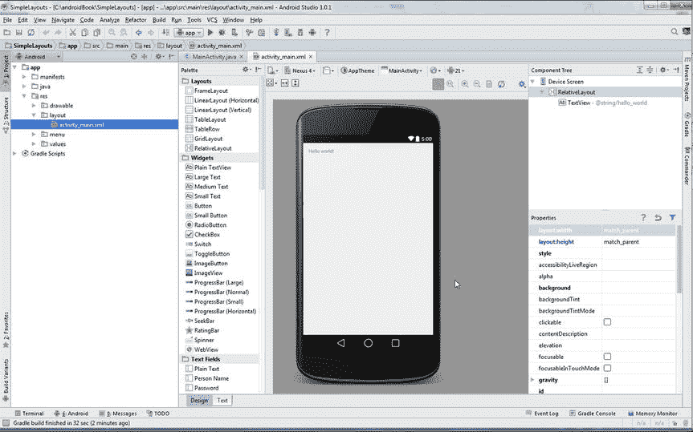
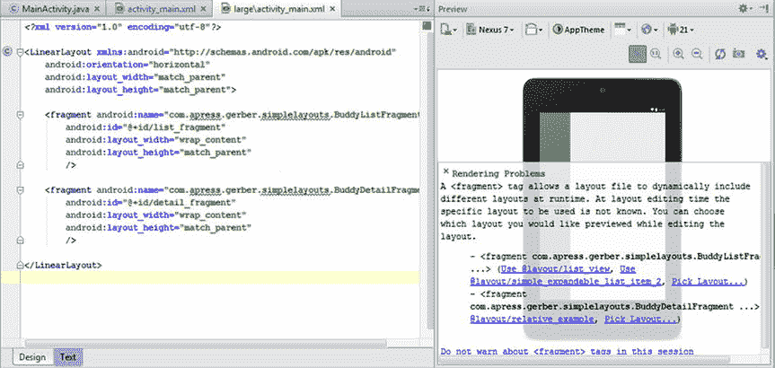

# 8.设计布局

充分利用你的应用程序通常意味着给它合适的视觉吸引力来取悦你的目标受众。虽然 Android 使得启动和运行各种模板项目变得很简单，但有时您可能需要对应用程序的外观和感觉有更多的控制。也许你想调整一个单选按钮在另一个控件旁边的位置，或者你需要创建你自己的自定义控件。本章介绍了设计布局和组织控件的基础知识，以便它们能在各种 Android 设备上正确显示。

Android 布局设计基于三个核心 Android 类，`Views`、`ViewGroups`和`Activities`。当画屏幕时，这些是你的基本构件。虽然用户界面包有更多的类，但大多数都是这些核心类的子类，利用这些核心类，或者是这些核心类的组件。另一个重要的组件 fragment 是在 Android 3.0 蜂巢(API 11)中引入的。片段解决了设计用户界面的模块化部分的关键需求，允许跨多种形式的重用，特别是平板电脑。本章从核心用户界面类开始，然后在后面的章节中继续讨论。

## 活动

Android activity 代表一个用户可以与之交互的屏幕。`Activity`类本身不画任何东西；相反，它是根容器，负责编排绘制的每个组件。任何被绘制到屏幕上的组件都存在于活动的边界内。`Activity`类也用于响应用户输入。当用户在屏幕之间导航时，一个活动可以转换到另一个活动。活动有一个众所周知的生命周期，详见表 [8-1](#Tab1) 。我们将在本章后面提到活动生命周期。

表 8-1。

Activity Life-Cycle Methods

<colgroup><col> <col> <col> <col></colgroup> 
| 方法 | 描述 | 之后杀死 | 然后 |
| --- | --- | --- | --- |
| `onCreate()` | 这在最初创建活动时被调用。它负责构造视图、将数据绑定到控件，以及管理或恢复给定包的状态。 | 不 | `onStart()` |
| `onRestart()` | 该方法在活动停止后、再次启动前调用。这种情况发生在一些情况下，比如在打完电话后继续或者将应用程序带回前台。 | 不 | `onStart()` |
| `onStart()` | 在屏幕上显示活动之前，立即调用此方法。如果活动被置于前台，则随后调用`onResume()`，如果活动被隐藏，则调用`onStop()`。 | 不 | `onResume()`或`onStop()` |
| `onResume()` | 当活动被创建、启动并准备好接收用户输入时，触发`onResume()`方法。该活动将在此方法完成后运行。 | 不 | `onPause()` |
| `onPause()` | 每当系统准备好恢复活动时，就会触发此方法。当系统准备转换到另一个活动时，可以在当前活动正在执行时调用它，或者当当前活动被中断并发送到后台时调用它。 | 是 | `onStop()`或`onResume()` |
| `onStop()` | 当活动不可见时，调用此方法。 | 是 | `onRestart()``or`T2】 |
| `onDestroy()` | 活动就在被销毁之前得到这个调用。这通常是从活动内部显式调用`finish()`的结果，或者是因为`WatchDog`需要终止活动来回收内存或者因为它变得没有响应。这是活动将收到的最后一个呼叫。 | 是 | 不适用的 |

## 视图和视图组

尽管活动是根组件，但它通常包含几个`View`和`ViewGroup`对象的集合。视图是屏幕上所有可见元素的超类，包括`view-group`。这些元素包括按钮、文本字段、文本输入控件、复选框等等。一个视图通常包含在一个或多个视图组中。视图组代表一个或多个视图对象的集合。一个视图组可以嵌套在 n 层的其他视图组中，以创建复杂的布局。视图组的主要职责是控制一个或多个嵌套的`View`或`ViewGroup`对象的布局。各种类型的专用视图组控制它们的子组件如何定位。这些是布局容器对象。每个布局对象的行为不同，并使用唯一的位置属性。`LinearLayout`、`RelativeLayout`、`FrameLayout`、`TableLayout`、`GridLayout`为核心布局容器。

为了更好地理解各个布局是如何工作的，让我们来看几个例子。使用新建项目向导启动一个名为 SimpleLayouts 的新项目。选择至少符合 API 14 (IceCreamSandwich)标准的手机和平板电脑外形，并使用空白活动模板。保留默认的活动名称`MainActivity`和布局名称字段的名称`activity_main.xml`，然后继续创建项目。你应该进入主活动布局的编辑模式，如图 [8-1](#Fig1) 所示。

图 8-1。

Starting with the main activity’s layout

### 预览窗格

对于新项目，您将在文本编辑模式下开始主活动的布局 XML。如果您的项目不在此模式下，请按 Ctrl+Shift+N | Cmd+Shift+O 打开文件搜索对话框，并键入名称`activity_main`以找到您的主布局。Android Studio 支持文本和设计两种模式来设计布局，你应该熟悉这两种模式。可以使用编辑器窗口左下角的选项卡来切换这些模式。默认情况下，文本模式允许您像编辑任何其他源文件一样直接编辑 XML 文件。

编辑器右侧的预览面板在您进行更改时，为您提供布局外观的实时预览。您还可以通过选择“配置渲染”菜单下的“预览所有屏幕尺寸”选项来预览您的布局在多个设备上的外观。虚拟设备下拉菜单中有一个相同的选项。这两个菜单都位于预览窗格的左上角。您可以打开和关闭预览选项，看看它是如何工作的。

预览窗格顶部有几个控件，允许您更改预览的呈现方式。您可以在定义了 AVD 的任何特定设备中渲染预览。您可以同时在多台设备上预览。您还可以更改用于渲染预览的 API 级别和主题。表 [8-2](#Tab2) 描述了图 [8-2](#Fig2) 中突出显示的预览窗格的注释部分。

表 8-2。

Description of the Preview Pane

<colgroup><col> <col></colgroup> 
| 部分 | 描述 |
| --- | --- |
| 答:预览切换 | 这是一个预览开关。它可以选择特定的 Android 版本或选择所有的屏幕尺寸。它可用于根据当前布局快速创建特定屏幕尺寸的布局。 |
| B: AVD 渲染 | 此菜单允许您在特定设备上预览布局。它也可以用来切换所有屏幕尺寸作为优先菜单。 |
| C: UI 模式 | 在这里，您可以找到在横向、纵向和各种 UI 模式之间切换预览器的选项，以及汽车、桌面和电视对接模式。它还包括电器模式和夜间模式。 |
| 主题控制 | 主题切换允许您预览带有特定主题的布局。它默认为 AppTheme，但是您可以从 SDK 中的各种主题中选择，或者从您的项目中选择任何主题。 |
| 活动协会 | 活动关联菜单允许您将当前布局与特定活动相关联。 |
| f:本地控制 | 此菜单将预览设置为使用特定的翻译。 |
| g:安卓版本 | API 菜单允许您将预览设置为特定的 API 级别。您可以使用它来查看您的布局如何响应各种 API 级别。 |

图 8-2。

The Preview pane in detail

在文本模式下，选择`RelativeLayout`标签并将其开始和结束标签更改为`FrameLayout`。请注意预览窗格中没有任何变化，因为您只更改了根布局标记，还没有触及其中的任何内容。稍后您将了解到这些布局之间的更多区别。

选择嵌套的`TextView`中的`Hello World`文本，它会自动展开为`@string/hello_world`，这是对外部`strings.xml`文件中文本的引用。Android Studio 的代码折叠功能默认隐藏外部字符串引用。按 Ctrl+- | Cmd+-将属性收拢或折叠回其呈现形式，然后按 Ctrl+= | Cmd+=将其展开以查看实际属性值。在 Android 中，将字符串值硬编码到你的布局中被认为是不好的做法，因为它们作为字符串引用会更好地处理。在一个简单的例子中，比如我们在这里创建的例子，硬编码字符串并不重要，但一个商业应用程序可能需要以几种语言推出，外部化的字符串使这个过程变得非常简单。所以，养成字符串外化的习惯是个好主意。

引用是在资源文件中编码的特殊属性值，它引用在别处定义的实际值。在这种情况下，特殊字符串“`@string/hello_world`”指的是在`strings.xml`资源文件中定义的值。Ctrl+click | Cmd+click 文本导航到`"Hello World"`字符串定义，如下所示:

`<string name="hello_world">Hello world!</string>`

将值更改为“Hello Android Studio！”按 Ctrl+Alt+左箭头键| Cmd+Alt+左箭头键导航回布局，并在预览窗格中查看更新的新值。现在将文本改为一个随机的硬编码值，比如“再见，拉斯维加斯！”，预览将再次更新，但在这种情况下，您已经直接覆盖了字符串。当您更改`TextView`时，预览窗格将会更新。

### 宽度和高度

文本视图是您可以添加到布局中的许多视图之一。每个视图都有控制其大小的宽度和高度属性。您可以设置绝对像素值，如`250px`或使用各种相对值之一，如`250dp`。最好使用一个带有`dp`后缀的相对值，因为这使得组件能够根据呈现它的设备的像素密度来调整大小。相对尺寸将在后面的“覆盖各种显示尺寸”一节中解释。将`TextView`标签改为`Button tag`，然后将`android:layout_width`属性改为`match_parent`。文本视图将变成一个按钮，横跨整个屏幕。将`android:layout_height`属性更改为`match_parent`。该按钮将占据整个屏幕。将`android:layout_width`属性更改为`wrap_content`，按钮宽度会变窄，但仍然占据屏幕的整个高度。`match_parent`值是一个特殊的相对值，它根据父容器调整视图的大小。图 [8-3](#Fig3) 描述了使用`match_parent`测量部件宽度和/或高度的可能变化。`wrap_content`是另一个广泛使用的相对值，它以一种紧密围绕其内容的方式来调整视图的大小。将`Button`标签改回`TextView`标签，将其宽度和高度设置为`match_parent`，并向我们的布局添加几个其他组件，如`Button`和`CheckBox`，如清单 [8-1](#FPar1) 中所定义。

图 8-3。

Variations of the match_parent size value Listing 8-1\. Add More Components to the Layout

`<FrameLayout xmlns:android="``http://schemas.android.com/apk/res/android`T2】

`xmlns:tools="``http://schemas.android.com/tools`T2】

`android:layout_width="match_parent"`

`android:layout_height="match_parent"`

`android:paddingLeft="@dimen/activity_horizontal_margin"`

`android:paddingRight="@dimen/activity_horizontal_margin"`

`android:paddingTop="@dimen/activity_vertical_margin"`

`android:paddingBottom="@dimen/activity_vertical_margin"`

`tools:context=".MainActivity">`

`<TextView`

`android:text="Goodbye, Las Vegas!"`

`android:layout_width="wrap_content"`

`android:layout_height="wrap_content" />`

`<Button`

`android:text="Push Me"`

`android:layout_width="wrap_content"`

`android:layout_height="wrap_content" />`

`<CheckBox`

`android:text="Click Me"`

`android:layout_width="wrap_content"`

`android:layout_height="wrap_content" />`

`</FrameLayout>`

请注意这些组件是如何一个接一个地绘制的。图 [8-4](#Fig4) 说明了这个问题。`FrameLayout`的行为是按照定义的顺序堆叠组件。暂时删除额外堆叠的组件，以便您可以探索设计器模式并了解如何可视化地布局组件。

图 8-4。

Widgets are stacked on top of one another

让我们检查一下`FrameLayout`容器标签。这个标签定义了两个属性，`android:layout_width`和`android:layout_height`，它们都指定了`match_parent`。这意味着框架的宽度和高度将与其包含的父级的宽度和高度相匹配。因为`FrameLayout`是最外层的元素，或者说根元素，所以它是所有其他组件的父元素。因此，它的宽度和高度将覆盖设备屏幕的整个可视区域。

### 设计师模式

点击编辑器左下方的设计选项卡(如图 [8-5](#Fig5) 所示)调出设计模式。在本节中，您将探索如何使用可视化设计器来定位控件。

图 8-5。

The designer and text view tabs

设计模式与文本模式具有相同的实时预览窗格，但添加了一个小部件调色板。在可视化设计布局时，您可以将组件从组件面板拖放到预览窗格中。可视化设计器为您生成 XML，同时允许您专注于布局的外观。设计模式还在右上角显示一个组件树窗格，在其下方显示一个属性窗格。组件树提供了当前布局中所有视图和视图组组件的分层视图。顶部是根组件，在我们的例子中是`FrameLayout`。

### 框架布局

正如您所看到的，`FrameLayout`按照定义的顺序堆叠组件。但是，它也将您的屏幕分成九个特殊部分。单击`TextView in the component tree`并按 Delete 键将其删除。执行相同的操作来移除复选框和按钮小部件，并完全清除显示。在左侧面板中找到`Button`小部件，并单击它。在预览窗格中移动鼠标，注意鼠标移动时显示的突出显示部分。屏幕被分成由每个特殊`FrameLayout`部分指示的区域(参见图 [8-6](#Fig6) )。单击左上部分以放下按钮。双击按钮并将其文本更改为左上角以指示其位置。继续拖放其他八个部分中的小部件，并相应地标记它们。当您拖放每个按钮时，在文本模式和设计模式之间来回切换，以查看 XML 是如何生成的。当你完成时，你应该有类似图 [8-7](#Fig7) 的东西。参见清单 [8-2](#FPar2) 中创建该布局的代码。

图 8-7。

Layout demonstrating FrameLayout

图 8-6。

Preview pane is divided into nine drop sections Listing 8-2\. Code That Creates the Figure [8-7](#Fig7) Layout

`<FrameLayout`

`android:layout_width="fill_parent"`

`android:layout_height="fill_parent"`

`xmlns:android="``http://schemas.android.com/apk/res/android`T2】

`<Button`

`android:layout_width="wrap_content"`

`android:layout_height="wrap_content"`

`android:text="Center"`

`android:id="@+id/button"`

`android:layout_gravity="center" />`

`<Button`

`android:layout_width="wrap_content"`

`android:layout_height="wrap_content"`

`android:text="Top Left"`

`android:id="@+id/button2"`

`android:layout_gravity="left|top" />`

`<Button`

`android:layout_width="wrap_content"`

`android:layout_height="wrap_content"`

`android:text="Top Center"`

`android:id="@+id/button3"`

`android:layout_gravity="center_horizontal|top" />`

`<Button`

`android:layout_width="wrap_content"`

`android:layout_height="wrap_content"`

`android:text="Top Right"`

`android:id="@+id/button4"`

`android:layout_gravity="right|top" />`

`<Button`

`android:layout_width="wrap_content"`

`android:layout_height="wrap_content"`

`android:text="Center Left"`

`android:id="@+id/button5"`

`android:layout_gravity="center|left" />`

`<Button`

`android:layout_width="wrap_content"`

`android:layout_height="wrap_content"`

`android:text="Center Right"`

`android:id="@+id/button6"`

`android:layout_gravity="center|right" />`

`<Button`

`android:layout_width="wrap_content"`

`android:layout_height="wrap_content"`

`android:text="Bottom Left"`

`android:id="@+id/button7"`

`android:layout_gravity="bottom|left" />`

`<Button`

`android:layout_width="wrap_content"`

`android:layout_height="wrap_content"`

`android:text="Bottom Center"`

`android:id="@+id/button8"`

`android:layout_gravity="bottom|center" />`

`<Button`

`android:layout_width="wrap_content"`

`android:layout_height="wrap_content"`

`android:text="Bottom Right"`

`android:id="@+id/button9"`

`android:layout_gravity="bottom|right" />`

`</FrameLayout>`

设计者生成这个 XML，它以一个`FrameLayout`标签开始。它的宽度和高度被设置为占据屏幕的整个可视区域。每个嵌套的按钮都指定了一个`layout_gravity`,它决定了按钮落入屏幕的哪个区域。

### 线性布局

`LinearLayout`水平或垂直地组织相邻的子节点。打开左侧的项目窗格。在`res`文件夹下找到`layout`文件夹，右键打开右键菜单。单击“新建➤ XML ➤ XML 布局文件”创建一个新的布局资源文件，并将其命名为 three_button。单击并将三个按钮放置到预览中，每个按钮都位于“上一个”按钮的下方。你的布局应该看起来像图 [8-8](#Fig8) 的左侧。在预览的左上方，点按“转换方向”按钮(在第二行按钮中)。屏幕上的按钮会从垂直对齐切换到水平对齐，如图 [8-8](#Fig8) 右图所示。

图 8-8。

Vertical LinearLayout vs. a Horizontal LinearLayout

下面的 XML(如清单 [8-3](#FPar3) 所示)以一个`LinearLayout`根标签开始，它指定了一个方向属性。方向可以设置为垂直或水平。嵌套在`LinearLayout`中的`Button`标签根据方向从上到下或从左到右排列。

Listing 8-3\. A Three-Button LinearLayout Example

`<?xml version="1.0" encoding="utf-8"?>`

`<LinearLayout xmlns:android="``http://schemas.android.com/apk/res/android`T2】

`android:orientation="horizontal" android:layout_width="match_parent"`

`android:layout_height="match_parent">`

`<Button`

`android:layout_width="wrap_content"`

`android:layout_height="wrap_content"`

`android:text="New Button"`

`android:id="@+id/button1" />`

`<Button`

`android:layout_width="wrap_content"`

`android:layout_height="wrap_content"`

`android:text="New Button"`

`android:id="@+id/button2" />`

`<Button`

`android:layout_width="wrap_content"`

`android:layout_height="wrap_content"`

`android:text="New Button"`

`android:id="@+id/button3" />`

`</LinearLayout>`

### 相对布局

通过使用相对属性来组织它的子节点。使用这些类型的布局时，您可以创建更复杂的设计，因为您可以更好地控制每个子视图的放置位置。在本例中，您将假装创建一个个人资料视图，类似于您在社交网络应用程序中找到的内容。

创建一个名为 relative_example 的新布局 XML 文件，并将`RelativeLayout`指定为根元素。将一个`ImageView`拖放到预览的左上角。拖动时您会看到辅助线，它应该会吸附到左上角。不要惊慌，这个控件在放下时会消失，因为我们没有给它维度或内容。在屏幕右侧的属性窗格中找到`src`属性，并单击省略号以打开资源对话框。(您可能需要滚动属性才能找到`src`。)选择系统页签，然后选择名为`sym_def_app_icon`的资源，如图 [8-9](#Fig9) 所示。

图 8-9。

Select the sym_def_app_icon

图标将呈现在添加到预览窗格的`ImageView`中。从调色板中点击`PlainTextView`，然后点击`ImageView`的右上方，将`PlainTextView`放置在相对于该组件的右侧，并与其父组件的顶部对齐。当您在图像的右边缘移动鼠标时，会出现一个工具提示，指示当前的放置位置。操纵直至刀尖同时提示`toRightOf=imageView`和`alignParentTop`，如图 [8-10](#Fig10) 所示。

图 8-10。

Tool tips show as you move around the view

将另外两个`PlainTextView`组件拖到预览上，将每个组件排在前面组件的下方和`ImageView`的右侧。使用指南来帮助你。双击顶部的`TextView`,并更改其文本以包含一个名称。更改中间`TextView`的文本，以包含一个著名的城市。最后，改变底部`TextView`的文本以包含一个网站。当您在 designer 视图中工作时，来回切换到 text 视图以查看生成的 XML。你应该有类似图 [8-11](#Fig11) 的东西。请参见清单 [8-4](#FPar4) 了解该布局背后的代码。

图 8-11。

The relative layout for the profile Listing 8-4\. The Code Behind the Layout in Figure [8-11](#Fig11)

`<?xml version="1.0" encoding="utf-8"?>`

`<RelativeLayout xmlns:android="``http://schemas.android.com/apk/res/android`T2】

`android:layout_width="match_parent" android:layout_height="match_parent">`

`<ImageView`

`android:layout_width="wrap_content"`

`android:layout_height="wrap_content"`

`android:id="@+id/imageView"`

`android:layout_alignParentTop="true"`

`android:layout_alignParentLeft="true"`

`android:layout_alignParentStart="true"`

`android:src="@android:drawable/sym_def_app_icon" />`

`<TextView`

`android:layout_width="wrap_content"`

`android:layout_height="wrap_content"`

`android:text="Clifton Craig"`

`android:id="@+id/textView1"`

`android:layout_alignParentTop="true"`

`android:layout_toRightOf="@+id/imageView" />`

`<TextView`

`android:layout_width="wrap_content"`

`android:layout_height="wrap_content"`

`android:text="California"`

`android:id="@+id/textView2"`

`android:layout_below="@+id/textView1"`

`android:layout_toRightOf="@+id/imageView" />`

`<TextView`

`android:layout_width="wrap_content"`

`android:layout_height="wrap_content"`

`android:text="``http://codeforfun.wordpress.com`T2】

`android:id="@+id/textView3"`

`android:layout_below="@+id/textView2"`

`android:layout_toRightOf="@+id/imageView" />`

`</RelativeLayout>`

生成的 XML 包含作为根元素的`RelativeLayout`。这个布局包含一个具有两个属性的`ImageView`，`layout_alignParentTop`和`layout_alignParentLeft`。这些属性使`ImageView`固定在布局的左上方。`layout_alignParentStart`属性用于支持从右到左的语言，不会产生歧义。`ImageView`也指定了我们之前研究过的高度和宽度属性。最后，它定义了一个指向`sym_def_app_icon`资源的`src`属性，这是一个由 Android 运行时预定义的内置资源。

每个小部件都包含一个值以`@+id/`开始的`android:id`属性。这些 ID 属性是在运行时定位单个小部件的一种方式。对于`RelativeLayouts`，它们变得尤其重要，因为它们被用来指定一个小部件相对于另一个小部件的位置。注意剩余的`TextView`组件如何使用`layout_below`和`layout_toRightOf`属性中的这些值。它们各自指定了`layout_toRightOf=@+id/imageView`，这将它们直接放置在图像视图的右边缘。最后两个`TextView`小部件指定了一个`layout_below`属性，该属性指向紧接在它前面的`TextView`。

### 嵌套布局

布局可以相互嵌套，以创建复杂的设计。如果您想改进前面的概要视图，您可以利用在您的`RelativeLayout`中嵌套一个`LinearLayout`的优势。该布局可以包括在线状态标签和描述字段。

在调色板中单击垂直的`LinearLayout`，并在预览窗格中单击`ImageView`的正下方以放置它。确保刀尖指示`alignParentLeft`和`below=imageView`。在调色板中点击`Plain TextView`，然后在新添加的`LinearLayout`内点击放置该组件。这将是您的在线状态指示器。接下来找到`Large Text`小部件；在组件面板中点击它，这一次在右边的组件树中找到另一个新的`TextView`,试着在它下面点击来放置组件。将鼠标悬停在`LinearLayout`中的`TextView`下方，会出现一个粗下划线的拖放目标指示器，如图 [8-12](#Fig12) 所示。

图 8-12。

Mouse under the TextView to see a drop-target indicator, and click to add the widget

使用 properties 窗格，将第一个`TextView`的 text 属性更改为 online，并向它下面的`TextView`的 text 属性添加一个伪描述。接下来单击预览中的任意位置，并按 Ctrl+A | Cmd+A 选择所有组件。找到`layout:margin`属性，展开，设置 all 为`5dp`，给每个组件一个 5 像素的边距，如图 [8-13](#Fig13) 所示。

图 8-13。

Give all widgets a 5-pixel margin

边距控制组件边缘和任何相邻组件之间的间距。为组件提供边距是减少界面混乱的好方法。尽管我们在所有组件的所有边上都设置了相同的边距，但是您可以尝试在某些边上设置不同的边距。

`layout:margin`分组包含四个边的设置:左、上、右和下。再次选择所有组件，展开`layout:margin`设置，找到全部选项。删除`5dp`值，改为将`5dp`值设置到左侧设置。组件将紧密地组合在一起，但是左边距在水平边缘之间留出足够的空间。选择在线的`TextView`,设置它的上边距为`5dp`,让它和上面的图片之间有更多的空间。图 [8-14](#Fig14) 显示了此时的结果。清单 [8-5](#FPar5) 显示了这个布局背后的代码。

图 8-14。

The results of adding left and top margins Listing 8-5\. The Code for relative_example.xml

`<?xml version="1.0" encoding="utf-8"?>`

`<RelativeLayout xmlns:android="``http://schemas.android.com/apk/res/android`T2】

`android:layout_width="match_parent"`

`android:layout_height="match_parent">`

`<ImageView`

`android:layout_width="wrap_content"`

`android:layout_height="wrap_content"`

`android:id="@+id/imageView"`

`android:layout_alignParentTop="true"`

`android:layout_alignParentLeft="true"`

`android:layout_alignParentStart="true"`

`android:src="@android:drawable/sym_def_app_icon"`

`android:layout_marginLeft="5dp" />`

`<TextView`

`android:layout_width="wrap_content"`

`android:layout_height="wrap_content"`

`android:text="Clifton Craig"`

`android:id="@+id/textView1"`

`android:layout_alignParentTop="true"`

`android:layout_toRightOf="@+id/imageView"`

`android:layout_marginLeft="5dp" />`

`<TextView`

`android:layout_width="wrap_content"`

`android:layout_height="wrap_content"`

`android:text="California"`

`android:id="@+id/textView2"`

`android:layout_below="@+id/textView1"`

`android:layout_toRightOf="@+id/imageView"`

`android:layout_marginLeft="5dp" />`

`<TextView`

`android:layout_width="wrap_content"`

`android:layout_height="wrap_content"`

`android:text="``http://codeforfun.wordpress.com`T2】

`android:id="@+id/textView3"`

`android:layout_below="@+id/textView2"`

`android:layout_toRightOf="@+id/imageView"`

`android:layout_marginLeft="5dp" />`

`<LinearLayout`

`android:orientation="vertical"`

`android:layout_width="match_parent"`

`android:layout_height="match_parent"`

`android:layout_below="@+id/imageView"`

`android:layout_alignParentLeft="true"`

`android:layout_alignParentStart="true"`

`android:layout_marginLeft="5dp">`

`<TextView`

`android:layout_width="wrap_content"`

`android:layout_height="wrap_content"`

`android:text="Online"`

`android:id="@+id/textView"`

`android:layout_marginLeft="5dp"`

`android:layout_marginTop="5dp" />`

`<EditText`

`android:layout_width="match_parent"`

`android:layout_height="wrap_content"`

`android:id="@+id/editText"`

`android:text="Likes biking, reads tech manuals and loves to code in Java"`

`android:layout_marginLeft="5dp" />`

`</LinearLayout>`

`</RelativeLayout>`

嵌套布局的另一种方法是用 includes 间接引用它们。找到`LinearLayout`，更改其属性，使其包含一个值为`details`的`id`属性，并确保其高度设置为`wrap_content`。同时更改设置`layout_below`属性，使其属于`textView3`。这显示在以下代码中:

`<LinearLayout`

`android:id="@+id/details"`

`android:orientation="vertical"`

`android:layout_width="match_parent"`

`android:layout_height="wrap_content"`

`android:layout_below="@+id/textView3"`

`android:layout_alignParentLeft="true"`

`android:layout_alignParentStart="true"`

`android:layout_marginLeft="5dp">`

接下来，在最后一个`TextView`标签下，但就在结束`LinearLayout`标签之前，添加下面的`include`标签:

`<include layout="@layout/three_button"`

`android:layout_width="match_parent"`

`android:layout_height="wrap_content"`

`android:layout_below="@id/details"/>`

特殊的`include`标签将任何预定义的布局添加到当前布局。在前面的示例中，您在当前布局中包含了我们之前的三按钮示例。您将宽度声明为`match_parent`，它扩展了布局的整个宽度，并将高度设置为`wrap_content`。您还将按钮布局设置在`details`组件的下面，这是相对布局的名称。

按住 Ctrl 键并单击| Cmd 键并单击布局属性的值`@layout/three_button`，导航到其定义。在定义中，您将更改每个按钮的文本，以反映社交网络应用程序中可用的典型操作。更改每个按钮的文本属性，依次添加好友、关注和消息。您可以在文本或设计模式下完成此操作。图 [8-15](#Fig15) 展示了这在设计模式下的样子。

图 8-15。

Add labels to the buttons

完成后，导航回`relative_example.xml`查看集成按钮。图 [8-16](#Fig16) 显示了完成的结果。

图 8-16。

The relative_example.xml with integrated buttons

### 列表视图

`ListView`小部件是一个容器控件，它提供了一个项目列表，每个项目都是可操作的。这些列表项被组织在一个位于可滚动视图中的布局中。单个列表项的内容由适配器以编程方式提供，适配器从数据源提取内容。适配器将数据映射到布局中的各个视图。在这个例子中，您将探索一个`ListView`组件的简单用法。

在 res ➤布局文件夹下创建一个名为`list_view`的新布局。指定`FrameLayout`作为根元素。在`FrameLayout`的中心添加一个`ListView`。预览窗格将显示使用默认布局的`ListView`,称为简单的 2 行列表项。切换到文本编辑模式，向根元素标签添加一个`xmlns:tools`属性。将其值设置为 [`http://schemas.android.com/tools`](http://schemas.android.com/tools) 。这使得 tools:前缀属性可用，其中一个属性将用于更改预览渲染的方式。向`ListView`标签添加一个`tools:listitem`属性，并将其值设置为`"@android:layout/simple_list_item_1"`。如下面的代码片段所示:

`<FrameLayout xmlns:android="``http://schemas.android.com/apk/res/android`T2】

`android:layout_width="match_parent" android:layout_height="match_parent"`

`xmlns:tools="``http://schemas.android.com/tools`T2】

`>`

`<ListView`

`android:layout_width="wrap_content"`

`android:layout_height="match_parent"`

`android:id="@+id/listView"`

`android:layout_gravity="center"`

`tools:listitem="@android:layout/simple_list_item_1"`

`/>`

`</FrameLayout>`

在 Android Studio 的早期版本中，可以在设计模式下右键单击预览窗格中的`ListView`，从菜单中选择预览列表内容➤简单列表项，如图 [8-17](#Fig17) 所示。1.0 版本中删除了此功能。

图 8-17。

List Preview Layout option feature from Android Studio 0.8 beta

打开`MainActivity`类，将其改为扩展`ListActivity`，然后在`onCreate()`方法中输入以下内容:

`public class MainActivity extends ListActivity {`

`@Override`

`protected void onCreate(Bundle savedInstanceState) {`

`super.onCreate(savedInstanceState);`

`setContentView(R.layout.list_view);`

`String[] listItems = new String[]{"Mary","Joseph","Leah", "Mark"};`

`setListAdapter(new ArrayAdapter<String>(this,`

`android.R.layout.simple_list_item_1,`

`listItems));`

`}`

`//...`

`}`

`ListActivity`是一个特殊的基类，旨在提供处理`ListView`的通用功能。在我们的例子中，我们使用提供的`setListAdapter`方法，它将一个适配器与列表视图关联起来。我们创建一个`ArrayAdapter`，并给它一个上下文(当前正在执行的活动)、一个列表项布局和一个填充`ListView`的项目数组。现在构建并运行应用程序，它会崩溃！这是因为`ListActivity`的常见误用。这个特殊的活动寻找一个 id 为`@android:id/list`的`ListView`。这些是由系统定义的特殊的 Android ids，这个特殊的 id 让`ListActivity`找到它的`ListView`，并自动将其连接到给定的`ListAdapter`。按如下方式更改`list_view`布局中的`ListView`标签:

`<ListView`

`android:layout_width="wrap_content"`

`android:layout_height="match_parent"`

`android:id="@android:id/list"`

`android:layout_gravity="center"`

`tools:listitem="@android:layout/simple_list_item_1"`

`/>`

构建并测试应用程序，您应该会看到如图 [8-18](#Fig18) 所示的名称列表。

图 8-18。

Screenshot of a simple ListView

通过为列表项提供自定义布局，可以进一步自定义列表视图的外观。要想知道最终结果会是什么样子，打开`list_view.xml`。右键单击预览窗格中的`ListView`,将其预览列表内容设置回简单的两行列表项。这种布局使用一个大文本视图和一个小文本视图来显示多个值。切换到文本视图查看生成的 XML，如清单 [8-6](#FPar6) 所示。

Listing 8-6\. Custom Layout for list items

`<?xml version="1.0" encoding="utf-8"?>`

`<FrameLayout xmlns:android="``http://schemas.android.com/apk/res/android`T2】

`xmlns:tools="``http://schemas.android.com/tools`T2】

`android:layout_width="match_parent" android:layout_height="match_parent">`

`<ListView`

`android:layout_width="wrap_content"`

`android:layout_height="match_parent"`

`android:id="@android:id/list"`

`android:layout_gravity="center"`

`tools:listitem="@android:layout/simple_list_item_2" />`

`</FrameLayout>`

在`ListView`元素中添加了一个特殊的`tools:listitem`属性来控制预览窗格中的布局。这个属性是在 tools XML 名称空间中定义的，它被添加到了`FrameLayout`根元素中。ctrl+click | Cmd+单击`listitem`属性的值，导航到其定义。该布局包括两个子视图，其`id`值为`@android:id/text1`和`@android:id/text2`。我们之前的例子包括一个数组适配器，它知道如何向`simple_list_item_1`布局添加值。使用这种新布局，您需要定制逻辑来为这两个子视图设置值。回到`MainActivity`类。在最顶层定义一个内部的`Person`类，为列表中的每个人保存一个额外的 web 站点值，并更改`onCreate()`方法，如清单 [8-7](#FPar7) 所示。

Listing 8-7\. Create Person Class and Modify onCreate( )

`public class MainActivity extends ListActivity {`

`class Person {`

`public String name;`

`public String website;`

`public Person(String name, String website) {`

`this.name = name;`

`this.website = website;`

`}`

`}`

`@Override`

`protected void onCreate(Bundle savedInstanceState) {`

`super.onCreate(savedInstanceState);`

`setContentView(R.layout.list_view);`

`Person[] listItems = new Person[]{`

`new Person("Mary", "`[`www.allmybuddies.com/mary`](http://www.allmybuddies.com/mary)T2】

`new Person("Joseph", "``www.allmybuddies.com/joeseph`T2】

`new Person("Leah", "``www.allmybuddies.com/leah`T2】

`new Person("Mark", "``www.allmybuddies.com/mark`T2】

`};`

`setListAdapter(new PersonAdapter(this,`

`android.R.layout.simple_expandable_list_item_2,`

`listItems)`

`);`

`}`

`//...`

`}`

在这些修订中，您创建了一个由`Person`对象组成的数组，每个对象都在构造函数中接受名称和网站字符串值。这些值缓存在公共变量中。(尽管我们强烈主张在常规实践中使用 getters 和 setters 而不是 public 变量，但为了简洁起见，我们在我们设计的示例中使用了后者。)然后你将列表和相同的`simple_expandable_list_item_2`布局传递给一个自定义的`PersonAdapter`，我们还没有定义它。按 Alt+Enter 激活 IntelliSense，这将给你机会为`PersonAdapter`创建一个存根内部类。见图 [8-19](#Fig19) 。

图 8-19。

Add PesonAdapter inside onCreate( ) method

选择 Create Inner Class 选项，将在当前类中为您生成一个类存根。使用 Tab 键浏览构造函数参数。随着您的推进，将每个构造函数参数更改为`Context context`、`int layout`和`Person[] listItems respectively`。让这个类扩展`BaseAdapter`而不是实现`ListItem`，然后使用清单 [8-8](#FPar8) 中的代码完成它的定义。因为我们在 PersonAdapter 中使用了`Person`类，所以需要将它移到 MainActivity 之外。将光标放在`Person`类定义上，按下 F6 将其移动到更高的级别。您将看到如图 [8-20](#Fig20) 所示的对话框。单击“重构”移动该类。

图 8-20。

Add PesonAdapter inside onCreate( ) method Listing 8-8\. PersonAdapter Class

`public class PersonAdapter extends BaseAdapter {`

`private final Context context;`

`private final int layout;`

`private Person[] listItems;`

`public PersonAdapter(Context context, int layout, Person[] listItems) {`

`this.context = context;`

`this.layout = layout;`

`this.listItems = listItems;`

`}`

`@Override`

`public int getCount() {`

`return listItems.length;`

`}`

`@Override`

`public Object getItem(int i) {`

`return listItems[i];`

`}`

`@Override`

`public long getItemId(int i) {`

`return i;`

`}`

`@Override`

`public View getView(int position, View convertView, ViewGroup parent) {`

`View view = convertView;`

`if (view==null) {`

`LayoutInflater inflater = (LayoutInflater) context`

`.getSystemService(Context.LAYOUT_INFLATER_SERVICE);`

`view = inflater.inflate(layout, parent, false);`

`}`

`TextView text1 = (TextView) view.findViewById(android.R.id.text1);`

`TextView text2 = (TextView) view.findViewById(android.R.id.text2);`

`text1.setText(listItems[position].name);`

`text2.setText(listItems[position].website);`

`return view;`

`}`

`}`

这个基本示例说明了适配器如何创建单个列表项进行显示。定义从缓存上下文、布局资源 ID 和列表项作为成员变量开始，这些变量稍后用于创建单独的列表项视图。扩展`BaseAdapter`为您提供了适配器接口中一些方法的默认实现。否则，这些方法将被要求显式定义。然而，您有义务为`getCount()`、`getItem()`、`getItemId()`和`getView()`抽象方法提供一个实现。运行时调用`getCount()`方法，以便知道需要呈现多少视图。对于需要在给定位置检索项目的调用者来说，`getItem()`是必需的。`getItemId()`必须返回给定位置的项目的唯一编号。在我们的示例中，您可以只返回作为参数给出的位置，因为它是唯一的。最后，`getView()`包含了组装每个列表项视图的所有逻辑。它用一个位置、一个可能为空也可能不为空的`convertView()`以及包含它的`ViewGroup`父对象被重复调用。如果`convertView()`为空，您必须使用从构造函数缓存的布局 ID 和父视图组作为其目的地，来扩展一个新视图以保存列表项细节。您使用`LAYOUT_INFLATER_SERVICE`系统服务进行膨胀。展开视图后，找到`text1`和`text2`子视图，并分别用给定位置的人的姓名和 web 站点值填充它们。运行这个示例，看看每个 person 对象是如何映射到新的布局的。图 [8-21](#Fig21) 显示了您的屏幕外观。

图 8-21。

List showing new list item layout and use of PersonAdapter

## 布局设计指南

市场上有如此多的 Android 设备，每一个都有不同的屏幕尺寸和密度，布局设计可能具有挑战性。设计布局时，你需要注意几点。你也可以遵循一些规则来跟上快速发展的形势。一般来说，你要注意屏幕分辨率和像素密度。

屏幕分辨率是屏幕在水平和垂直方向上可以容纳的像素总数，以二维数字的形式给出。分辨率通常以标准 VGA 测量值给出。VGA 代表视频图形阵列，是 640×480 的台式机和笔记本电脑的标准。这意味着 640 像素宽和 480 像素高。这年头能找到半 VGA (HVGA)、480×320 等移动变种；四分之一 VGA (QVGA)，320×240；宽 VGA (WVGA)，800×480；扩展图形阵列(XGA)；宽 XGA(WXGA)；以及更多。这些仅仅是一些可能的解决方案。

像素密度表示在给定的测量单位内可以压缩的像素总数。这种测量与屏幕大小无关，尽管它会受到屏幕大小的影响。例如，想象一下，20 英寸显示器的分辨率为 1024×768 像素，而 5 英寸显示器的分辨率为 1024×768 像素。两种情况下使用的像素数量相同，但后一种屏幕将这些像素压缩到一个更小的区域，从而增加了它们的密度。像素密度以每英寸点数(dpi)来衡量，它表示 1 英寸区域中可以容纳的点数或像素。在 Android 屏幕上，密度通常以一种称为密度无关像素(dp)的单位来测量。它是基于 160dpi 屏幕上相当于 1 个像素的基线测量。使用差压作为测量单位可使您的布局在不同密度的设备上适当缩放。

Android 包括了另一种隔离不同屏幕尺寸的方法:资源限定符。在我们之前的例子中，我们将一个图像复制到了`drawable`文件夹中，这是任何可绘制资源被提取的默认位置。可绘制资源通常是图像，但也可以包括定义形状定义、轮廓和边框的资源 XML 文件。为了定位可绘制资源，Android 运行时首先考虑当前设备的屏幕尺寸。如果它属于主要类别列表中的一个，运行时将在带有资源限定符后缀的`drawable`文件夹下查找。这些是后缀，比如`ldpi`、`mdpi`、`hdpi`和`xhdpi`。`ldpi`后缀是低密度屏幕，大约 120dpi(每英寸 120 点)。中密度屏幕，160dpi，使用`mdpi`后缀。高密度屏幕，320dpi，使用`hdpi`后缀。超高密度屏幕使用`xhdpi`后缀。这不是一个详尽的列表，但它代表了更常见的后缀。当您在 Android Studio 中启动一个项目时，会在`res`文件夹下创建无数特定于分辨率的子文件夹。在下一个例子中，您将研究如何以实用的方式使用这些文件夹。

### 覆盖各种显示器尺寸

在本练习中，您将找到一个 200×200 像素的配置文件图像，并将其交换到您已经构建的`RelativeLayout`示例中。您可以选择使用本书源代码下载中的图片。这将是您在最高分辨率显示器上使用的图像。

将图像命名为 my_profile.png，并将其保存到硬盘上。打开项目窗口，展开`res`文件夹。您的项目应该有带有`mdpi`、`hdpi`、`xhdpi`和`xxhdpi`后缀的`drawable`文件夹。您需要为不同的屏幕尺寸创建原始图像的缩小版本。您将遵循 3:4:6:8 的缩放比例进行调整。您可以使用 Microsoft Paint 或任何其他工具来调整大小。(一个名为 Image Resizer for Windows 的开源项目可在`imageresizer.codeplex.com`获得，它可以使这项任务变得简单，并与 Windows 资源管理器很好地集成。)参考表 [8-3](#Tab3) 了解如何按照我们的比例指南在单个文件夹中创建缩放尺寸。将图像的每个版本保存在表格所示的文件夹中，并对每个版本使用相同的`my_profile.png`名称。

表 8-3。

Various Image Asset Sizes and Descriptions

<colgroup><col> <col> <col> <col> <col></colgroup> 
| 文件夹 | 原始大小 | 比例 | 缩放尺寸 | 图像 |
| --- | --- | --- | --- | --- |
| `drawable-xxhdpi` | 200×200 | 不适用的 | 200×200 |  |
| `drawable-xhdpi` | 200×200 | 3:4 | 150×150 |  |
| `drawable-hdpi` | 150×150 | 4:6 | 100×100 |  |
| `drawable-mdpi` | 100×100 | 6:8 | 75×75 |  |

添加这些图像后，在设计器模式下打开`relative_example.xml`布局并找到图像视图。点击该组件的`src`属性旁边的省略号，在资源对话框中找到`my_profile`图像，如图 [8-22](#Fig22) 所示。

图 8-22。

Resources dialog box with image of Clifton Craig

更新图片后，点击预览窗口中的 Android 虚拟设备按钮，尝试各种屏幕渲染选项，如图 [8-23](#Fig23) 所示。选择 Preview All Screen Sizes(预览所有屏幕尺寸),可以同时在多个设备上查看模拟轮廓，如图 [8-24](#Fig24) 所示。

图 8-24。

Layout previewed on various devices

图 8-23。

Preview All Screen Sizes from Design mode in Visual Designer

### 把这一切放在一起

现在，您将使用 Java 加载布局，并探索如何在运行时进行细微的更改。在开始之前，您需要向将要使用的组件添加描述性 id。在设计模式下打开`relative_example.xml`布局，并将以下 id 添加到这些嵌套在`LinearLayout`中的组件中:

*   `imageView: profile_image`
*   `textView1: name`
*   `textView2: location`
*   `textView3: website`
*   `textView4: online_status`
*   `editText: description`

通过单击每个小部件，然后在右窗格的属性编辑器中更改其`id`属性来进行这些更改。当您进行更改时，您将看到一个弹出对话框，要求更新使用情况。见图 [8-25](#Fig25) 。

图 8-25。

Android Studio will update usages while you work

选中复选框并单击是，允许 Android Studio 在您工作时更新每个小部件的所有用法。切换到文本模式查看最终结果，如清单 [8-9](#FPar9) 所示。

Listing 8-9\. New Layout with Components Placed Inside

`<?xml version="1.0" encoding="utf-8"?>`

`<RelativeLayout xmlns:android="``http://schemas.android.com/apk/res/android`T2】

`android:layout_width="match_parent"`

`android:layout_height="match_parent">`

`<ImageView`

`android:layout_width="wrap_content"`

`android:layout_height="wrap_content"`

`android:id="@+id/profile_image"`

`android:layout_alignParentTop="true"`

`android:layout_alignParentLeft="true"`

`android:layout_alignParentStart="true"`

`android:src="@drawable/my_profile"`

`android:layout_marginLeft="5dp" />`

`<TextView`

`android:layout_width="wrap_content"`

`android:layout_height="wrap_content"`

`android:text="Clifton Craig"`

`android:id="@+id/name"`

`android:layout_alignParentTop="true"`

`android:layout_toRightOf="@+id/profile_image"`

`android:layout_marginLeft="5dp" />`

`<TextView`

`android:layout_width="wrap_content"`

`android:layout_height="wrap_content"`

`android:text="California"`

`android:id="@+id/location"`

`android:layout_below="@+id/name"`

`android:layout_toRightOf="@+id/profile_image"`

`android:layout_marginLeft="5dp" />`

`<TextView`

`android:layout_width="wrap_content"`

`android:layout_height="wrap_content"`

`android:text="``http://codeforfun.wordpress.com`T2】

`android:id="@+id/website"`

`android:layout_below="@+id/location"`

`android:layout_toRightOf="@+id/profile_image"`

`android:layout_marginLeft="5dp" />`

`<LinearLayout`

`android:id="@+id/details"`

`android:orientation="vertical"`

`android:layout_width="match_parent"`

`android:layout_height="wrap_content"`

`android:layout_below="@+id/profile_image"`

`android:layout_alignParentLeft="true"`

`android:layout_alignParentStart="true"`

`android:layout_marginLeft="5dp">`

`<TextView`

`android:layout_width="wrap_content"`

`android:layout_height="wrap_content"`

`android:text="Online"`

`android:id="@+id/online_status"`

`android:layout_marginLeft="5dp"`

`android:layout_marginTop="5dp" />`

`<EditText`

`android:layout_width="match_parent"`

`android:layout_height="wrap_content"`

`android:id="@+id/description"`

`android:text="Likes biking, reads tech manuals and loves to code in Java"`

`android:layout_marginLeft="5dp" />`

`</LinearLayout>`

`<include`

`android:id="@+id/buttons"`

`layout="@layout/three_button"`

`android:layout_width="match_parent"`

`android:layout_height="wrap_content"`

`android:layout_below="@id/details"/>`

`</RelativeLayout>`

注意 Android Studio 不仅更新了 id 定义，还更新了每个 id 的每次使用，以保持组件彼此相邻对齐，就像以前一样。创建一个名为`ProfileActivity`的新类，并将其修改为清单 [8-10](#FPar10) 。

Listing 8-10\. ProfileActivity Class

`public class ProfileActivity extends Activity {`

`private TextView name;`

`private TextView location;`

`private TextView website;`

`private TextView onlineStatus;`

`private EditText description;`

`@Override`

`protected void onCreate(Bundle savedInstanceState) {`

`super.onCreate(savedInstanceState);`

`setContentView(R.layout.relative_example);`

`name = (TextView) findViewById(R.id.name);`

`location = (TextView) findViewById(R.id.location);`

`website = (TextView) findViewById(R.id.website);`

`onlineStatus = (TextView) findViewById(R.id.online_status);`

`description = (EditText) findViewById(R.id.description);`

`View parent = (View) name.getParent();`

`parent.setBackgroundColor(getResources().getColor(android.R.color.holo_blue_light));`

`name.setTextAppearance(this,android.R.style.TextAppearance_DeviceDefault_Large);`

`location.setTextAppearance(this, android.R.style.TextAppearance_DeviceDefault_Medium);`

`location.setTextAppearance(this, android.R.style.TextAppearance_DeviceDefault_Inverse);`

`website.setTextAppearance(this, android.R.style.TextAppearance_DeviceDefault_Inverse);`

`onlineStatus.setTextAppearance(this, android.R.style.TextAppearance_DeviceDefault_Inverse);`

`description.setEnabled(false);`

`description.setBackgroundColor(getResources().getColor(android.R.color.white));`

`description.setTextColor(getResources().getColor(android.R.color.black));`

`}`

`}`

这里您已经为每个`TextView`和`EditText`组件添加了成员字段。`onCreate()`方法首先找到每个视图组件，并将它们保存在单独的成员变量中。接下来，您找到名称标签的父标签，并将其背景颜色更改为浅蓝色。Android Studio 有一个独特的功能，用一个正方形装饰左边的槽，说明这一行引用的颜色。这些方块也出现在引用颜色资源的其他行上。然后更改每个`TextView`的文本外观，使名称以大的外观突出出来。您正在使用来自`android.R`类的预定义样式，该类包含对 Android SDK 中所有可用资源的引用。每个剩余的`TextView`也被更新以使用中等或相反的外观。最后，禁用描述`EditText`以防止修改其内容。您还可以将其背景设置为白色，同时将文本颜色更改为黑色。

要尝试我们新的`ProfileActivity`和布局，你必须在`AndroidManifest.xml`中定义它，并将其链接到`MainActivity`。打开清单，在`MainActivity`定义下为我们的`ProfileActivity`添加一个标签:

`<activity`

`android:name=".ProfileActivity"`

`android:label="@string/app_name" />`

接下来返回到`MainActivity`，用下面的代码覆盖`onListItemClick()`方法，围绕`ProfileActivity`类创建一个新的意图，并开始活动。运行该示例，并尝试单击任何列表项以显示其配置文件。参见图 [8-26](#Fig26) 。

图 8-26。

New layout with buttons and EditText

`@Override`

`protected void onListItemClick(ListView l, View v, int position, long id) {`

`super.onListItemClick(l, v, position, id);`

`Intent intent = new Intent(this, ProfileActivity.class);`

`startActivity(intent);`

`}`

现在您将学习如何将值从列表视图带入下一个活动。使用清单 [8-11](#FPar11) 中的代码更改`MainActivity`类中的`onCreate()`方法。

Listing 8-11\. Modifications to MainActivity

`protected void onCreate(Bundle savedInstanceState) {`

`super.onCreate(savedInstanceState);`

`setContentView(R.layout.list_view);`

`Person[] listItems = new Person[]{`

`new Person(R.drawable.mary, "Mary", "New York",`

`"``www.allmybuddies.com/mary`T2】

`"Avid cook, writes poetry."),`

`new Person(R.drawable.joseph,"Joseph", "Virginia",`

`"``www.allmybuddies.com/joeseph`T2】

`"Author of several novels."),`

`new Person(R.drawable.leah, "Leah", "North Carolina",`

`"``www.allmybuddies.com/leah`T2】

`"Basketball superstar. Rock climber."),`

`new Person(R.drawable.mark, "Mark", "Denver",`

`"``www.allmybuddies.com/mark`T2】

`"Established chemical scientist with several patents.")`

`};`

`setListAdapter(new PersonAdapter(this,`

`android.R.layout.simple_expandable_list_item_2,`

`listItems)`

`);`

`}`

您正在向构造函数调用添加名称、位置和描述字段。现在使用清单 [8-12](#FPar12) 中的代码将 Person 类更改为接受并保存这些新值。

Listing 8-12\. Modifications to the Person Class

`class Person {`

`public int image;`

`public String name;`

`public String location;`

`public String website;`

`public String descr;`

`Person(int image, String name, String location, String website, String descr) {`

`this.image = image;`

`this.name = name;`

`this.location = location;`

`this.website = website;`

`this.descr = descr;`

`}`

`}`

`Next change the onListItemClick() as follows:`

`@Override`

`protected void onListItemClick(ListView l, View v, int position, long id) {`

`super.onListItemClick(l, v, position, id);`

`Person person = (Person) l.getItemAtPosition(position);`

`Intent intent = new Intent(this, ProfileActivity.class);`

`intent.putExtra(ProfileActivity.IMAGE, person.image);`

`intent.putExtra(ProfileActivity.NAME, person.name);`

`intent.putExtra(ProfileActivity.LOCATION, person.location);`

`intent.putExtra(ProfileActivity.WEBSITE, person.website);`

`intent.putExtra(ProfileActivity.DESCRIPTION, person.descr);`

`startActivity(intent);`

`}`

在这里，您检索被单击的`Person`对象，并将它的每个成员变量作为额外的值传递给下一个活动。这些额外的值被映射到`ProfileActivity`常量，我们在`ProfileActivity`类的顶部定义了这些常量:

`public class ProfileActivity extends Activity {`

`public static final String IMAGE = "IMAGE";`

`public static final String NAME = "NAME";`

`public static final String LOCATION = "LOCATION";`

`public static final String WEBSITE = "WEBSITE";`

`public static final String DESCRIPTION = "DESCRIPTION";`

`//...`

`}`

现在对清单 [8-13](#FPar13) 和`ProfileActivity`进行如下修改，以定义一个`profileImage ImageView`成员变量，并将所有额外的意图读入缓存的视图组件。

Listing 8-13\. Modifications to the PersonActivity Class

`private ImageView proflieImage;`

`@Override`

`protected void onCreate(Bundle savedInstanceState) {`

`super.onCreate(savedInstanceState);`

`setContentView(R.layout.relative_example);`

`name = (TextView) findViewById(R.id.name);`

`location = (TextView) findViewById(R.id.location);`

`website = (TextView) findViewById(R.id.website);`

`onlineStatus = (TextView) findViewById(R.id.online_status);`

`description = (EditText) findViewById(R.id.description);`

`proflieImage = (ImageView) findViewById(R.id.profile_image);`

`int profileImageId = getIntent().getIntExtra(IMAGE, -1);`

`proflieImage.setImageDrawable(getResources().getDrawable(profileImageId));`

`name.setText(getIntent().getStringExtra(NAME));`

`location.setText(getIntent().getStringExtra(LOCATION));`

`website.setText(getIntent().getStringExtra(WEBSITE));`

`description.setText(getIntent().getStringExtra(DESCRIPTION));`

运行应用程序，尝试点击列表视图中的项目，调出相应的配置文件。您可以点击后退键导航回列表视图并选择不同的项目。参见图 [8-27](#Fig27) 。

图 8-27。

Layout with ImageView

## 碎片

片段是您之前检查的活动和可包含文件之间的一个步骤。片段是可重用的 XML 片段，类似于包含布局。然而，像活动一样，它们有包含业务逻辑的额外好处。片段用于使你的用户界面适应不同的外形。考虑一下我们之前的例子，我们开发的时候考虑到了智能手机，在 10 英寸的平板电脑上会是什么样子。更大的显示屏所提供的额外空间会让一个简单列表视图的屏幕看起来很笨拙。使用片段，您可以智能地组合两个屏幕，这样您的显示就像当前在较小的屏幕上一样，但在较大的屏幕上包含列表和细节视图。要完成这项任务，您必须将所有的 UI 更新逻辑从活动中移出，放到新的片段类中。从`MainActivity`中的`ListView`逻辑开始，您需要将嵌套类作为外部顶级类取出。点击`MainActivity`顶部的`Person`类，然后按 F6。弹出的 Move Refactor 对话框询问您希望将类移动到哪个包和目录中。您可以在这里接受默认值。对底层的`PersonAdapter`类做同样的事情。

创建一个名为`BuddyListFragment`的新类，它扩展了`ListFragment`并包含了`MainActivity`中的`ListView`的初始化，如清单 [8-14](#FPar14) 所示。

Listing 8-14\. BuddyListFragment Class Which Extends ListFragment

`import android.app.Activity;`

`import android.os.Bundle;`

`import android.support.v4.app.ListFragment;`

`import android.view.LayoutInflater;`

`import android.view.View;`

`import android.view.ViewGroup;`

`import android.widget.ListView;`

`public class BuddyListFragment extends ListFragment {`

`private OnListItemSelectedListener onListItemSelectedListener;`

`public interface OnListItemSelectedListener {`

`void onListItemSelected(Person selectedPerson);`

`}`

`@Override`

`public void onCreate(Bundle savedInstanceState) {`

`super.onCreate(savedInstanceState);`

`Person[] listItems = new Person[]{`

`new Person(R.drawable.mary, "Mary",`

`"``www.allmybuddies.com/mary`T2】

`"New York","Avid cook, writes poetry."),`

`new Person(R.drawable.joseph, "Joseph",`

`"``www.allmybuddies.com/joeseph`T2】

`"Virginia","Author of several novels"),`

`new Person(R.drawable.leah, "Leah",`

`"``www.allmybuddies.com/leah`T2】

`"North Carolina",`

`"Basketball superstar. Rock climber."),`

`new Person(R.drawable.mark,"Mark",`

`"``www.allmybuddies.com/mark`T2】

`"Denver",`

`"Established chemical scientist with several patents.")`

`};`

`setListAdapter(new PersonAdapter(getActivity(),`

`android.R.layout.simple_expandable_list_item_2,`

`listItems)`

`);`

`}`

`@Override`

`public void onAttach(Activity activity) {`

`super.onAttach(activity);`

`if(!(activity instanceof OnListItemSelectedListener)) {`

`throw new ClassCastException(`

`"Activity should implement OnListItemSelectedListener");`

`}`

`//Save the attached activity as an onListItemSelectedListener`

`this.onListItemSelectedListener = (OnListItemSelectedListener) activity;`

`}`

`@Override`

`public void onListItemClick(ListView l, View v, int position, long id) {`

`Person selectedPerson = (Person) l.getItemAtPosition(position);`

`this.onListItemSelectedListener.onListItemSelected(selectedPerson);`

`}`

`@Override`

`public View onCreateView(LayoutInflater inflater, ViewGroup container,`

`Bundle savedInstanceState) {`

`return inflater.inflate(R.layout.list_view, container, false);`

`}`

`}`

这个片段镜像了`MainActivity`中的`onCreate()`方法，但是增加了两个生命周期方法。`onAttach()`方法捕获必须实现在类顶部声明的`OnListItemSelectedListener()`的附加活动。`ListFragment`超类定义了一个在这里被覆盖的`onListItemClick()`回调方法。在我们的自定义版本中，您可以引用缓存的`onListItemSelectedListener()`并将选择的人传递到它上面。最后，您覆盖了扩展我们的`list_view`布局的`onCreateView()`生命周期方法，并将其返回到运行时。

创建一个扩展`Fragment`的`BuddyDetailFragment`类，并用清单 [8-15](#FPar15) 中所示的代码填充它。

Listing 8-15\. BuddyDetailFragment Code

`import android.os.Bundle;`

`import android.support.v4.app.Fragment;`

`import android.support.v4.app.FragmentActivity;`

`import android.view.LayoutInflater;`

`import android.view.View;`

`import android.view.ViewGroup;`

`import android.widget.EditText;`

`import android.widget.ImageView;`

`import android.widget.TextView;`

`public class BuddyDetailFragment extends Fragment {`

`public static final String IMAGE = "IMAGE";`

`public static final String NAME = "NAME";`

`public static final String LOCATION = "LOCATION";`

`public static final String WEBSITE = "WEBSITE";`

`public static final String DESCRIPTION = "DESCRIPTION";`

`private Person person;`

`@Override`

`public View onCreateView(LayoutInflater inflater, ViewGroup container, Bundle bundle) {`

`updatePersonDetail(bundle);`

`return inflater.inflate(R.layout.relative_example, container, false);`

`}`

`@Override`

`public void onStart() {`

`super.onStart();`

`updatePersonDetail(getArguments());`

`}`

`private void updatePersonDetail(Bundle bundle) {`

`//if bundle arguments were passed, we use them`

`if (bundle != null) {`

`this.person = new Person(`

`bundle.getInt(IMAGE),`

`bundle.getString(NAME),`

`bundle.getString(LOCATION),`

`bundle.getString(WEBSITE),`

`bundle.getString(DESCRIPTION)`

`);`

`}`

`//if we have a valid person from the bundle`

`//or from restored state then update the screen`

`if(this.person !=null){`

`updateDetailView(this.person);`

`}`

`}`

`public void updateDetailView(Person person) {`

`FragmentActivity activity = getActivity();`

`ImageView profileImage = (ImageView) activity.findViewById(R.id.profile_image);`

`TextView name = (TextView) activity.findViewById(R.id.name);`

`TextView location = (TextView) activity.findViewById(R.id.location);`

`TextView website = (TextView) activity.findViewById(R.id.website);`

`EditText description = (EditText) activity.findViewById(R.id.description);`

`profileImage.setImageDrawable(getResources().getDrawable(person.image));`

`name.setText(person.name);`

`location.setText(person.location);`

`website.setText(person.website);`

`description.setText(person.descr);`

`}`

`}`

这个思路和之前创造的`ProfileActivity`差不多。但是，现在您有了一个内部的`Person`成员变量，用于保存包值。您这样做是因为您现在从两个地方读取包中的值，`onCreate()`和`onStart()`。您还创建了一个公共方法，允许外部调用者用给定的人更新片段。另一件要注意的事情是，您覆盖了`onCreateView()`生命周期方法，并要求充气机通过使用资源 ID 来膨胀适当的视图。

我们的主屏幕将被更改以反映单个片段，它将像以前一样具有列表视图。简化`activity_main`布局，由一个`FrameLayout`组成:

`<FrameLayout xmlns:android="``http://schemas.android.com/apk/res/android`T2】

`android:id="@+id/empty_fragment_container"`

`android:layout_width="match_parent"`

`android:layout_height="match_parent"`

`android:paddingLeft="@dimen/activity_horizontal_margin"`

`android:paddingRight="@dimen/activity_horizontal_margin"`

`android:paddingTop="@dimen/activity_vertical_margin"`

`android:paddingBottom="@dimen/activity_vertical_margin"`

`>`

`</FrameLayout>`

这个空布局有一个适当命名的 ID，值为`empty_fragment_container`。稍后，您将向该布局动态添加一个片段。重新访问您的`res`目录，使用特殊资源限定符`large`创建另一个布局文件。右键单击`res`文件夹，选择新建➤ Android 资源文件，添加新的资源文件。将名称设置为`activity_main`，与之前使用的名称相同。将资源类型设置为布局。从可用限定符列表中选择大小；从屏幕尺寸下拉菜单中选择大。参见图 [8-28](#Fig28) 进行指导。这与我们前面的例子相似，在前面的例子中，您为不同的屏幕密度添加了图像。布局文件将位于`layout-large`目录中。此文件夹中的布局将在分类为大型的设备上选择，例如 7 英寸及以上的平板电脑。

图 8-28。

Select layout-large from New Resource Directory

打开新创建的`activity_main`布局，切换到文本模式并输入以下 XML:

`<?xml version="1.0" encoding="utf-8"?>`

`<LinearLayout xmlns:android="``http://schemas.android.com/apk/res/android`T2】

`android:orientation="horizontal"`

`android:layout_width="match_parent"`

`android:layout_height="match_parent">`

`<fragment android:name="com.apress.gerber.simplelayouts.BuddyListFragment"`

`android:id="@+id/list_fragment"`

`android:layout_width="wrap_content"`

`android:layout_height="match_parent"`

`/>`

`<fragment android:name="com.apress.gerber.simplelayouts.BuddyDetailFragment"`

`android:id="@+id/detail_fragment"`

`android:layout_width="wrap_content"`

`android:layout_height="match_parent"`

`/>`

`</LinearLayout>`

请注意，它在平板电脑 AVD 上呈现布局。预览窗格会抱怨在设计时没有足够的信息来呈现您的布局。它将建议几个布局与预览相关联，并给你一个选项来选择你的项目布局。使用“选择布局”超链接为您的项目选择布局。选择第一个片段的`list_view`布局，第二个片段的`relative_example`布局，如图 [8-29](#Fig29) 所示。

图 8-29。

Linear layout containing fragments

此时，列表视图将占据整个屏幕。您需要稍微调整宽度和重量，以便为查看两个片段留出空间。诀窍是将宽度设置为 0dp，并使用 weight 属性来适当调整小部件的大小。将两个片段的宽度都更改为 0dp。将`BuddyListFragment`重量设置为 1，将`BuddyDetailFragment`重量设置为 2。weight 属性允许您根据可用空间的比率来调整组件的大小。系统将布局中所有组件的重量相加，并用该总和除以可用空间。每个组件占据的空间部分相当于其重量。在我们的例子中，细节片段将占据屏幕的 2/3，而列表将占据 1/3。您的更改应该类似于清单 [8-16](#FPar16) 。

Listing 8-16\. Linear Layout Containing Fragments with Changes

`<?xml version="1.0" encoding="utf-8"?>`

`<LinearLayout xmlns:android="``http://schemas.android.com/apk/res/android`T2】

`xmlns:tools="``http://schemas.android.com/tools`T2】

`android:orientation="horizontal"`

`android:layout_width="match_parent"`

`android:layout_height="match_parent">`

`<fragment android:name="com.apress.gerber.simplelayouts.BuddyListFragment"`

`android:id="@+id/list_fragment"`

`android:layout_weight="1"`

`android:layout_width="0dp"`

`android:layout_height="match_parent"`

`tools:layout="@layout/list_view" />`

`<fragment android:name="com.apress.gerber.simplelayouts.BuddyDetailFragment"`

`android:id="@+id/detail_fragment"`

`android:layout_weight="2"`

`android:layout_width="0dp"`

`android:layout_height="match_parent"`

`tools:layout="@layout/relative_example" />`

`</LinearLayout>`

尝试预览窗格。使用工具栏中的控制将方向更改为横向或选取不同的 avd。图 [8-30](#Fig30) 展示了 Nexus 10 的横向布局。

图 8-30。

View the fragment in landscape on a Nexus 10

有了这两个片段，你就可以打开`MainActivity`并简化它了。Make it extend `FragmentActivity. FragmentActivity`是一个特殊的类，它允许您在视图层次结构中查找片段，并通过一个`FragmentManager`类执行片段事务。您将在我们的示例中使用事务来添加和替换屏幕上的片段。在小屏幕设备上，运行时将使用`empty_fragment_container`选择布局。您将使用`FragmentManager`将我们的`BuddyListFragment`添加到屏幕上。您还将在用一个片段替换另一个片段时创建一个事务，并将其添加到后台堆栈，以便用户可以通过单击 back 按钮来展开操作。

简化清单 [8-17](#FPar17) 中所示的`onCreate()`方法。

Listing 8-17\. Simplified onCreate( ) Method

`@Override`

`protected void onCreate(Bundle savedInstanceState) {`

`super.onCreate(savedInstanceState);`

`setContentView(R.layout.activity_main);`

`if(findViewById(R.id.empty_fragment_container)!=null) {`

`// We should return if we're being restored from a previous state`

`// to avoid overlapping fragments.`

`if (savedInstanceState != null) {`

`return;`

`}`

`BuddyListFragment buddyListFragment = new BuddyListFragment();`

`// Pass any Intent extras to the fragment as arguments`

`buddyListFragment.setArguments(getIntent().getExtras());`

`FragmentTransaction transaction =`

`getSupportFragmentManager().beginTransaction();`

`transaction.add(R.id.empty_fragment_container, buddyListFragment);`

`transaction.commit();`

`}`

`}`

通过将内容视图设置为`activity_main`布局来开始这个方法，这是您简化的。然后，检查如果应用程序正在从先前的状态恢复，是否应该提前返回。然后实例化`BuddyListFragment`,并将任何额外的意图作为参数传递给它。接下来创建一个`FragmentTransaction`，向其中添加片段并提交事务。您只有在找到`empty_fragment_container`的情况下才执行此操作。

更改类声明，使其也实现`BuddyListFragment.OnListItemSelectedListener`接口。它应该如下所示:

`public class MainActivity extends FragmentActivity`

`implements BuddyListFragment.OnListItemSelectedListener {`

IntelliSense 将标记错误的类，因为它没有定义所需的方法。按 Alt+Enter 并选择提示来生成方法存根。使用清单 [8-18](#FPar18) 中所示的示例进行填写。

Listing 8-18\. Code Showing FragmentManager Transaction

`@Override`

`public void onListItemSelected(Person selectedPerson) {`

`BuddyDetailFragment buddyDetailFragment = (BuddyDetailFragment)`

`getSupportFragmentManager().findFragmentById(R.id.detail_fragment);`

`if (buddyDetailFragment != null) {`

`buddyDetailFragment.updateDetailView(selectedPerson);`

`} else {`

`buddyDetailFragment = new BuddyDetailFragment();`

`Bundle args = new Bundle();`

`args.putInt(BuddyDetailFragment.IMAGE, selectedPerson.image);`

`args.putString(BuddyDetailFragment.NAME, selectedPerson.name);`

`args.putString(BuddyDetailFragment.LOCATION, selectedPerson.location);`

`args.putString(BuddyDetailFragment.WEBSITE, selectedPerson.website);`

`args.putString(BuddyDetailFragment.DESCRIPTION, selectedPerson.descr);`

`buddyDetailFragment.setArguments(args);`

`//Start a fragment transaction to record changes in the fragments.`

`FragmentTransaction transaction =`

`getSupportFragmentManager().beginTransaction();`

`// Replace whatever is in the fragment_container view with this fragment,`

`// and add the transaction to the back stack so the user can navigate back`

`transaction.replace(R.id.empty_fragment_container, buddyDetailFragment);`

`transaction.addToBackStack(null);`

`// Commit the transaction`

`transaction.commit();`

`}`

`}`

移除`onListItemSelected()`方法，因为这段代码替换了它。在这里，您检查`buddyDetailFragment`是否已经在视图层次结构中。如果有，你找到它并更新它。否则，您可以重新创建它，并通过使用您在`BuddyDetailFragment`中定义的键，将所选的人作为一个包中的单个值传递进来。最后，创建并提交一个片段事务，用细节片段替换列表片段，并将事务添加到后台堆栈。在平板电脑和智能手机上运行代码(分别为图 [8-31](#Fig31) 和图 [8-32](#Fig32) )，查看不同的行为。您可以创建一个 Nexus 10 平板电脑 AVD，用于大屏幕测试。

图 8-32。

Layout rendered on a phone

图 8-31。

Layout rendered on a tablet

## 摘要

在本章中，你学习了在 Android Studio 中设计用户界面的基础知识。您使用了可视化设计器和文本编辑器来创建和修改布局。您了解了如何使用各种容器和属性来对齐用户界面中的元素，以及如何嵌套容器来创建复杂的界面。我们解释了如何针对不同的屏幕尺寸和设备类型调整布局中的元素，并举例说明了如何在多个设备上同时查看布局。我们谈到了碎片。每个主题都有更多的细节。Android 包括丰富的定制，允许您构建和调整用户界面来满足您的需求。参见 [`https://developer.android.com`](https://developer.android.com/) 了解更多可用的高级特性和 API。