# 9.货币实验室:第 1 部分

这一章，以及下一章，将向你展示如何在构建一个名为货币的应用的环境中使用 Android Studio。货币的目的是提供一种在外币和用户本国货币之间进行转换的便捷方式。典型的用例是用户在国外旅行，需要用外币兑换货币或购买一些东西。货币汇率总是在波动，甚至可能一分钟一分钟地变化，所以用户能够获得最新的数据是很重要的。货币应用从由`openexchangerates.org`托管的网络服务中获取最新的汇率。

不仅货币会波动，交易所上市的活跃货币代码也会变化。例如，比特币(BTC)最近被添加到`openexchangerates.org`的交易货币列表中。如果我们不久前开发了货币应用并硬编码了活跃的货币代码，我们可能会错过比特币，或者更糟的是，为用户提供了从不再交易的失败国家选择货币的选项。为了解决这个问题，我们需要在填充主活动布局中使用的微调器之前，获取由`openexchangerates.org`发布的活动货币代码。如果你把浏览器指向 [`openexchangerates.org/api/currencies.json`](http://openexchangerates.org/api/currencies.json) ，你就能看到 JSON 格式的现行货币代码，谢天谢地，这些代码是机器可读和人工可读的。货币应用涵盖的 Android 功能和技术包括高级布局、资产、共享偏好、风格、web 服务、并发性和对话框。

Note

我们邀请您使用 Git 克隆这个项目，以便跟进，尽管您将从头开始使用它自己的 Git 库重新创建这个项目。如果你的电脑上没有安装 Git，参见[第 7 章](07.html)。在 Windows 中打开一个 Git-bash 会话(或者在 Mac 或 Linux 中打开一个终端)，发出以下 Git 命令:`git clone` [`https://bitbucket.org/csgerber/currencies.git_Currencies`](https://bitbucket.org/csgerber/currencies.git_Currencies)

## 货币规格

为了解决前面描述的活动货币代码问题，我们将使用一个典型的 Android 惯例，称为闪屏。当应用 firsts 启动时(见图 [9-1](#Fig1) ，用户会看到一个活动，其中只包含一张各种货币的照片。当这个闪屏活动可见时，后台线程获取活动货币代码。当后台线程成功终止时，闪屏活动调用主活动并将活动货币代码传递给它。然后，主活动使用活动货币代码来填充其微调器。即使假设连接性相对较差，闪屏活动也只能在大约一秒钟内可见。

图 9-1。

Currency splash screen

如果用户先前选择了本币和外币，则从用户的共享首选项中获取这些值，并将适当的值应用于微调器(参见图 [9-2](#Fig2) )。例如，如果上次使用的货币组合是 HKD 作为外币，美元作为本币，那么下次用户启动应用时，这些相同的值将应用于微调器。在极端情况下，存储在共享首选项中的本币和/或外币值中的一个或两个不再交易。在这种情况下，受影响的微调器将只显示列出的第一个货币代码。

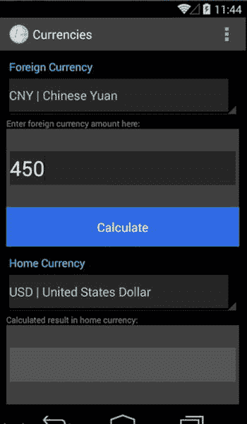

图 9-2。

The input currency amount

一旦主活动可见，焦点就被设置到位于主活动顶层的`EditText`控件上。此`EditText`控件仅接受数字数据，并代表要转换的外币金额。在从微调器中选择外币和本币，并输入想要转换的金额之后，用户单击 Calculate 按钮，这将触发一个后台线程来获取当前汇率。当后台线程激活时，用户看到一个对话框显示“请稍等”(见图[9-3](#Fig3))；此对话框允许用户通过单击取消按钮来中止操作。一旦后台线程成功终止，就会从`openexchangerates.org`返回一个 JSON 对象，其中包含所有活动货币代码相对于美元的汇率。然后提取适当的值，并计算结果。结果格式化为五位小数，并显示在主活动底层的`TextView`控件中，如图 [9-4](#Fig4) 所示。

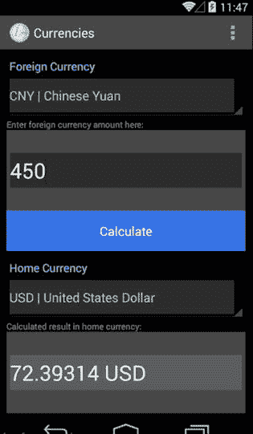

图 9-4。

Returning the result

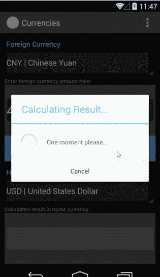

图 9-3。

Calculating the result

货币应用的操作栏有一个带有三个选项的菜单:查看活动代码、反转代码和退出(见图 [9-5](#Fig5) )。查看活动代码选项启动浏览器并指向 [`openexchangerates.org/api/currencies.json`](http://openexchangerates.org/api/currencies.json) 。“反转代码”选项将微调器中显示的值转换为本币和外币。例如，如果外币是 CNY，本币是美元，则在激活反转代码菜单选项后，外币将是美元，本币将是 CNY。退出选项只是退出应用。图 [9-4](#Fig4) 和 [9-5](#Fig5) 中获得的结果(72.39314 美元和 72.44116 美元)略有不同，尽管我们使用了相同的输入值 450。这种差异的有趣原因是`openexchangerates.org`上的汇率每分钟都在波动，我们计算这两张截图的结果只相差几分钟。

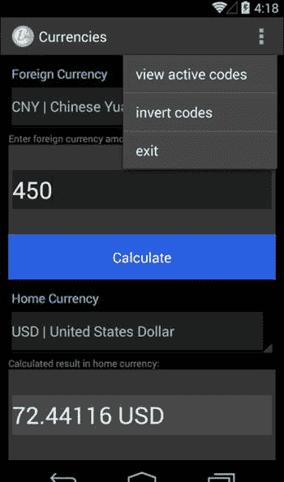

图 9-5。

The Options menuUsing the New Project Wizard

现在，您已经了解了货币应用应该如何运行，让我们通过选择文件➤新建项目来创建一个新项目。(新项目向导及其屏幕包含在[第 1 章](01.html)中。)说出你的应用货币。我们选择使用 [`gerber.apress.com`](http://gerber.apress.com/) 作为域名，但是你可以输入你喜欢的域名。Android(和 Java)中的约定是反域名为包名。您会注意到包名是反向域名加上全部小写字母的项目。与本书中的其他实验和练习一样，您可以将该实验存储在`C:\androidBook\Currencies`目录中。如果您运行的是 Mac，请将货币应用放在 labs 的父目录中。单击下一步。

向导的下一步是选择一个目标 API 级别。在使你的应用兼容尽可能多的设备(通过将你的目标 API 设置得较低)和增加你作为开发者可用的特性数量(通过将你的目标 API 设置得较高)之间有一个权衡。然而，这种权衡严重偏向于将您的目标 API 级别设置得较低，因为 Google 提供了优秀的兼容性库，这些库提供了您将在以后的 API 中找到的大多数功能。在 Android 中开发商业应用的最佳实践是选择最高的目标 API 级别，该级别仍然允许您的应用在大约 100%的设备上运行。目前，目标 API 级别是 API 8。请注意，Android Studio 会自动为您导入适当的兼容性库(也称为支持库)。API 8:默认应该选择 Android 2.2 (Froyo)。如果尚未选择，请选择 API 8: Android 2.2 (Froyo)，然后单击下一步。

向导的下一步是选择将为您生成的活动类型。选择空白活动，然后单击下一步。如果默认值与图 [9-6](#Fig6) 中显示的不同，则按此设置。点击 Finish，Android Studio 会为你生成一个新的项目。grad le(Android Studio 附带的构建工具，在[第 13 章](13.html)中有介绍)将开始下载任何依赖项，比如兼容性库。请留意状态栏以查看这些进程的状态。一旦这些过程完成，您应该有一个没有错误的新项目。

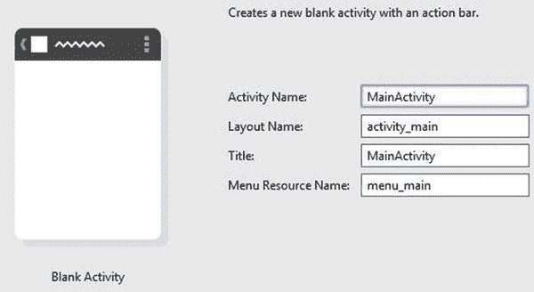

图 9-6。

The Create New Project dialog box

## 初始化 Git 储存库

Git 已经成为 Android 应用开发不可或缺的工具，这向您展示了如何为您的 Android 项目初始化 Git 存储库。关于如何使用 Git 的更全面的教程，请参见第 7 章。选择 VCS ➤导入到版本控制➤创建 Git 资源库，如图 [9-7](#Fig7) 所示。当提示选择将创建新 Git 存储库的目录时，确保 Git 项目将在根项目目录中初始化，该目录名为`Currencies`，在本例中位于`C:\androidBook\Currencies`，如图 [9-8](#Fig8) 所示。如果你运行的是 Mac 电脑，在你的实验室父目录中选择`Currencies`目录。单击确定。

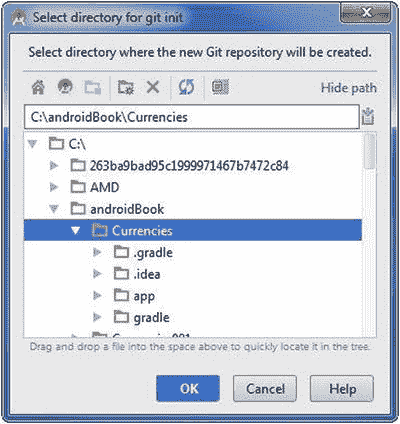

图 9-8。

Selecting the directory for Git initialization

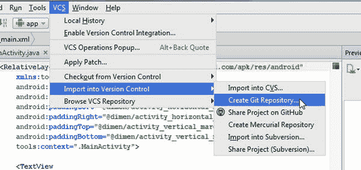

图 9-7。

Initializing the Git repository

请确保将项目工具窗口切换到项目视图。视图组合框位于项目工具窗口的顶部，默认设置为 Android。如果您在 Project tool 窗口中检查这些文件，您将会注意到这些文件中的大部分都变成了棕色，这意味着它们正在被 Git 跟踪，但是没有被计划添加到存储库中。要添加它们，在项目工具窗口中选择`Currencies`目录并按 Ctrl+Alt+A | Cmd+Alt+A 或选择 Git ➤添加。棕色文件应该变成绿色，这意味着它们已经被添加到 Git 中的 staging 索引中，现在可以提交了。如果这个添加然后转移资产的过程看起来很乏味，请记住，您只需要这样做一次；从现在开始，Android Studio 将自动为您管理文件的添加和升级。

按 Ctrl+K | Cmd+K 调用提交修改对话框，如图 [9-9](#Fig9) 所示。作者组合框用于覆盖当前的默认提交者。您应该将作者组合框留空，Android Studio 将简单地使用您在 Git 安装期间最初设置的默认值。在“提交前”部分，取消选择所有复选框选项。在提交消息字段中键入以下消息:使用新建项目向导进行初始提交。单击提交按钮两次。通过按 Alt+9 | Cmd+9 检查“更改”工具窗口，以查看您的提交。

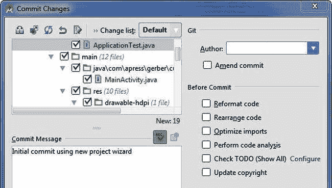

图 9-9。

Committing initial changes with the Commit Changes dialog box

## 修改主活动的布局

在本节中，我们将修改`MainActivity`的布局。新建项目向导为我们创建了一个名为`activity_main.xml`的文件。打开该文件，参考图 [9-2](#Fig2) (之前显示)和清单 [9-1](#FPar1) 。图 [9-2](#Fig2) 中的视图是垂直排列的，所以垂直方向的`LinearLayout`对于我们的根`ViewGroup`来说似乎是个不错的选择。我们视图的宽度将填充父视图`ViewGroup`，所以只要有可能`layout_width`就应该设置为`fill_parent`。`fill_parent`和`match_parent`设置可以互换使用。为了在我们的布局中表达视图的高度，我们希望尽可能避免硬编码`dp`(与密度无关的像素)值。相反，我们将使用一个名为`layout_weight`的属性来指示 Android Studio 以其父视图`ViewGroup`的百分比来呈现视图的高度。

`layout_weight`属性被计算为任何给定父`ViewGroup`的子视图的`layout_weight`值总和的一部分。例如，假设我们有一个`TextView`和一个`Button`嵌套在一个方向为垂直的`LinearLayout`中。如果`TextView`的`layout_weight`为 30，而`Button`的`layout_weight`为 70，那么`TextView`将占据其父布局高度的 30%，而`Button`将占据其父布局高度的 70%。为了使我们的任务更容易，让我们假设 100 为`layout_weight`总和，这样每个`layout_weight`值将表示为百分比。使用这种技术的唯一问题是`layout_height`是 Android 视图中的一个必需属性，所以我们必须将`layout_height`的值设置为`0dp`。通过将`layout_height`设置为`0dp`，你实际上是在告诉 Android 忽略`layout_height`而使用`layout_weight`。

当您检查这个布局中包含的视图时，请注意其中一些视图有 ID，而另一些没有。只有在 Java 代码中引用视图时，为视图分配 ID 才有用。如果一个视图在整个用户体验中保持静态，就没有理由给它分配一个 ID。当你从清单 [9-1](#FPar1) 重新创建布局时，注意`id`的使用，以及`layout_weight`和`layout_height`的使用。选择 activity_main.xml 选项卡后，您会在底部看到另外两个选项卡，Design 和 Text。点击文本选项卡，然后键入清单 [9-1](#FPar1) 中包含的代码，或者如果你正在阅读这本书的电子版，复制并粘贴。确保完全替换`activity_main.xml`中任何现有的 XML 代码。

Listing 9-1\. activity_main.xml Code

`<?xml version="1.0" encoding="utf-8"?>`

`<LinearLayout xmlns:android="``http://schemas.android.com/apk/res/android`T2】

`android:layout_width="fill_parent"`

`android:layout_height="fill_parent"`

`android:background="#000"`

`android:orientation="vertical">`

`<LinearLayout`

`android:layout_width="fill_parent"`

`android:layout_height="0dp"`

`android:layout_weight="20"`

`android:orientation="vertical">`

`<TextView`

`android:layout_width="fill_parent"`

`android:layout_height="0dp"`

`android:layout_marginLeft="10dp"`

`android:layout_marginRight="10dp"`

`android:layout_weight="30"`

`android:gravity="bottom"`

`android:text="Foreign Currency"`

`android:textColor="#ff22e9ff"/>`

`<Spinner`

`android:id="@+id/spn_for"`

`android:layout_width="fill_parent"`

`android:layout_height="0dp"`

`android:layout_marginLeft="10dp"`

`android:layout_marginRight="10dp"`

`android:layout_weight="55"`

`android:gravity="top"/>`

`<TextView`

`android:layout_width="fill_parent"`

`android:layout_height="0dp"`

`android:layout_marginLeft="10dp"`

`android:layout_marginRight="10dp"`

`android:layout_weight="15"`

`android:gravity="bottom"`

`android:text="Enter foreign currency amount here:"`

`android:textColor="#666"`

`android:textSize="12sp"/>`

`</LinearLayout>`

`<LinearLayout`

`android:layout_width="fill_parent"`

`android:layout_height="0dp"`

`android:layout_marginLeft="10dp"`

`android:layout_marginRight="10dp"`

`android:layout_weight="20"`

`android:background="#222">`

`<EditText`

`android:id="@+id/edt_amount"`

`android:layout_width="fill_parent"`

`android:layout_height="50dp"`

`android:layout_gravity="center_vertical"`

`android:layout_marginLeft="5dp"`

`android:layout_marginRight="5dp"`

`android:background="#111"`

`android:digits="0123456789."`

`android:gravity="center_vertical"`

`android:inputType="numberDecimal"`

`android:textColor="#FFF"`

`android:textSize="30sp">`

`<requestFocus/>`

`</EditText>`

`</LinearLayout>`

`<Button`

`android:id="@+id/btn_calc"`

`android:layout_width="fill_parent"`

`android:layout_height="0dp"`

`android:layout_marginLeft="10dp"`

`android:layout_marginRight="10dp"`

`android:layout_weight="10"`

`android:text="Calculate"`

`android:textColor="#AAA"/>`

`<LinearLayout`

`android:layout_width="fill_parent"`

`android:layout_height="0dp"`

`android:layout_weight="20"`

`android:orientation="vertical">`

`<TextView`

`android:layout_width="fill_parent"`

`android:layout_height="0dp"`

`android:layout_marginLeft="10dp"`

`android:layout_marginRight="10dp"`

`android:layout_weight="30"`

`android:gravity="bottom"`

`android:text="Home Currency"`

`android:textColor="#ff22e9ff"/>`

`<Spinner`

`android:id="@+id/spn_hom"`

`android:layout_width="fill_parent"`

`android:layout_height="0dp"`

`android:layout_marginLeft="10dp"`

`android:layout_marginRight="10dp"`

`android:layout_weight="55"`

`android:gravity="top"/>`

`<TextView`

`android:layout_width="fill_parent"`

`android:layout_height="0dp"`

`android:layout_marginLeft="10dp"`

`android:layout_marginRight="10dp"`

`android:layout_weight="15"`

`android:gravity="bottom"`

`android:text="Calculated result in home currency:"`

`android:textColor="#666"`

`android:textSize="12sp"/>`

`</LinearLayout>`

`<LinearLayout`

`android:layout_width="fill_parent"`

`android:layout_height="0dp"`

`android:layout_marginLeft="10dp"`

`android:layout_marginRight="10dp"`

`android:layout_weight="20"`

`android:background="#222">`

`<TextView`

`android:id="@+id/txt_converted"`

`android:layout_width="fill_parent"`

`android:layout_height="50dp"`

`android:layout_gravity="center_vertical"`

`android:layout_marginLeft="5dp"`

`android:layout_marginRight="5dp"`

`android:background="#333"`

`android:gravity="center_vertical"`

`android:textSize="30sp"`

`android:typeface="normal"/>`

`</LinearLayout>`

`</LinearLayout>`

一旦创建了这个布局，按 Ctrl+K | Cmd+K 并提交一条修改 activity_main 布局的消息。

## 定义颜色

当您检查清单 [9-1](#FPar1) 中的 XML 源代码时，请注意我们已经硬编码了像`textColor`和`background`这样的属性。将颜色值外部化到资源文件是一个好主意，特别是当颜色重复时。一旦您将一种颜色具体化，您就可以通过简单地改变资源文件中的一个值来改变整个应用中的颜色。在第 5 章中，我们展示了如何使用`IntelliSense`创建颜色定义。这里，我们将从颜色定义开始，替换硬编码的值。使用对你来说最容易的方法。右键单击(在 Mac 上按住 Ctrl 键)目录并选择“新➤值资源文件”。命名文件颜色，然后单击确定。如果提示将文件添加到 Git，选择记住，不要再问复选框，并选择是。修改清单 [9-2](#FPar2) 中的`colors`文件。

Listing 9-2\. Define Some Colors in colors.xml

`<?xml version="1.0" encoding="utf-8"?>`

`<resources>`

`<color name="white">#FFF</color>`

`<color name="black">#000</color>`

`<color name="grey_very_dark">#111</color>`

`<color name="grey_dark">#222</color>`

`<color name="grey_med_dark">#333</color>`

`<color name="grey_med">#666</color>`

`<color name="grey_light">#AAA</color>`

`<color name="turquoise">#ff22e9ff</color>`

`<color name="flat_blue">#ff1a51f4</color>`

`</resources>`

在 Android 中，颜色用十六进制数字表示。十六进制数字可以使用以下字母数字值:0、1、2、3、4、5、6、7、8、9、A、B、C、D、E 和 F。从 0 到 9 的十进制和十六进制数字是相同的，但要用十六进制表示 10、11、12、13、14 和 15，则分别使用 A、B、C、D、E 和 F。十六进制数字不区分大小写，所以 F 与 F 相同。

在 Android 中，你可以用四种格式中的一种来表达颜色:#ARGB、#RGB、# AARRGGBB 或# RRGGBB 每个字母是一个十六进制数字。#ARGB 格式代表 Alpha，红色，绿色，蓝色通道，Alpha 是透明通道。该配色方案中可能的颜色数量是 16 个可能的透明度值乘以 16×16×16 个可能的颜色组合。#RGB 格式代表红色、绿色、蓝色，Alpha 通道自动设置为完全不透明。# AARRGGBB 和#RRGGBB 格式使用 8 位通道，而不是#ARGB 和#RGB 格式中使用的 4 位通道。# AARRGGBB 格式中可能的颜色组合数量是 256 个可能的透明度级别乘以 256×256×256 个可能的颜色组合。#RRGGBB 格式类似于前者，只是透明度级别自动设置为完全不透明。

我们的`colors.xml`文件中的`<color name="grey_med">#666</color>`条目使用#RGB 格式。显然，具有等量红色、绿色和蓝色的颜色将是灰色。我们的`colors.xml`文件中的`<color name="turquoise">#ff22e9ff</color>`条目使用# AARRGGBB 格式。我们可以看到，我们的绿松石被定义为大量的蓝色和绿色，很少红色。如果我们在任何 XML 文件的装订线中单击任何颜色样本，我们可以看到一个对话框，允许我们定义我们想要的任何颜色，尽管从“选择颜色”对话框返回的字符串总是采用最精确的格式#AARRGGBB。见图 [9-10](#Fig10) 。一旦你定义了你的颜色，按 Ctrl+K | Cmd+K 提交一条定义一些颜色的消息。

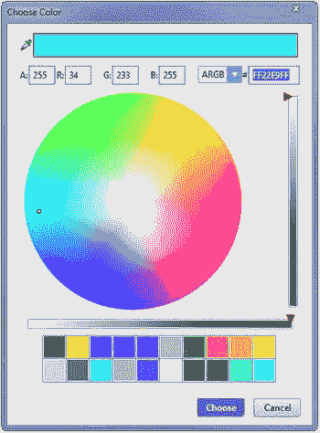

图 9-10。

The Choose Color dialog box

## 将颜色应用于布局

现在您已经在`colors.xml`文件中定义了您的颜色，您可以将它们应用到您的布局中。一种方法是使用 Android Studio 的查找/替换功能。参见[第 5 章](05.html)了解创建颜色值的另一种方法。在编辑器中将`activity_main.xml`和 colors.xml 文件作为选项卡打开。右键单击(在 Mac 上按住 Ctrl 键)T2 标签并选择向右移动，这样你就可以并排看到两个文件。将光标置于 activity_main.xml 选项卡中，然后按 Ctrl+R | Cmd+R。在查找字段中键入#FFF，在替换字段中键入@color/white。选中单词复选框，然后单击全部替换。对我们定义的所有颜色重复这个步骤，除了`flat_blue`，我们稍后会用到它。你可以在图 [9-11](#Fig11) 中看到这个过程。一旦你应用了你的颜色，按 Ctrl+K | Cmd+K 确认并显示一条消息“应用颜色到布局”。然后关闭`colors.xml`选项卡。

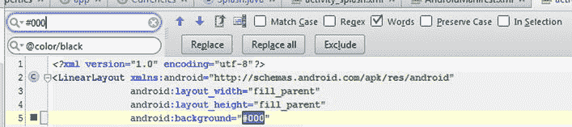

图 9-11。

Replacing hard-coded color values with named references in the colors.xml file

## 创建和应用样式

风格可以大大提高你的生产力。短期内对创建风格的少量投资可能会在长期内为您节省大量时间，并且提供很大的灵活性。在这一节中，我们将为`activity_main.xml`布局中的一些视图创建样式，并向您展示如何应用它们。

我们使用的布局适合样式，因为许多属性在视图中是重复的。例如，两个蓝绿色的`TextView`控件共享除文本之外的所有相同属性。我们可以将这些复制的属性提取到一个样式中，然后将该样式应用于适当的`TextView`元素。如果我们以后想改变样式，我们只需简单地改变一次样式，所有使用该样式的视图也会改变。样式是有用的，但是没有理由对样式感到高兴，并把样式应用到你所有的视图中。例如，为 Calculate 按钮创建一个样式没有多大意义，因为只有一个样式。

我们的第一个任务是为在`activity_main.xml`布局中使用的标签(`TextViews`)创建样式。将您的光标放在我们的第一个`TextView`的定义内的任何地方，这个定义具有文本属性`Foreign Currency`。从主菜单中，选择重构➤提取➤风格。

在提取 Android 样式对话框中，选择如图 [9-12](#Fig12) 所示的复选框。在样式名称字段中输入 label。确保选中启动复选框，然后单击确定。在随后的可能使用样式对话框中，如图 [9-13](#Fig13) 所示，选择文件单选按钮，然后点击确定。现在，在“查找工具”窗口中单击“执行重构”(位于 IDE 底部),将该样式应用于共享这些属性的其他三个视图。

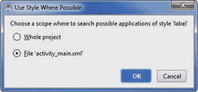

图 9-13。

The Use Style Where Possible dialog box

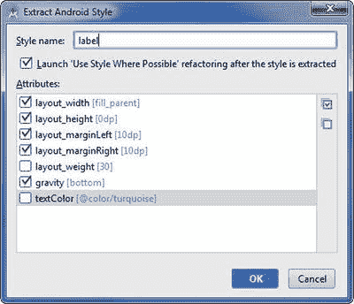

图 9-12。

Extracting the style called label

样式最好的属性之一是它们可以从你或 Android SDK 定义的父样式继承。将光标放在同一个`TextView`控件的同一个定义中，再次选择重构➤提取➤风格。

您会注意到提供给您的样式名称以`label.`开头。`label`后面的圆点表示这种新样式将继承其父样式`label`。将样式命名为 label.curr，如图 [9-14](#Fig14) 所示，点击确定。再次单击“执行重构”。

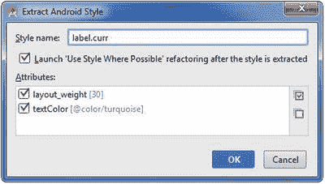

图 9-14。

Extracting the style called label.curr

在`activity_main.xml`文件中，导航到标签为`Enter foreign currency amount here:`的`TextView`。将光标放在该视图定义的括号内的任意位置，并从主菜单中选择“重构➤提取➤样式”。Android Studio 足够智能，能够意识到文本可能不会重复，并从提取 Android 样式对话框中将其忽略。将该样式重命名为 label.desc，点击确定，如图 [9-15](#Fig15) 所示。再次单击 IDE 底部的 Do Refactor，将样式应用于第二次出现的这个`TextView`。

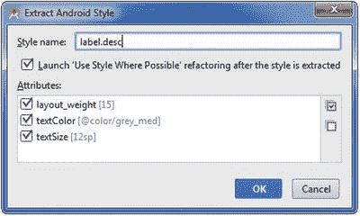

图 9-15。

Extracting the style called label.desc

让我们为布局再创建一种样式，为输入字段和输出字段提供灰色背景。将光标放在背景为`@color/grey_dark`的`LinearLayout`的定义内的任何地方。从主菜单中，选择重构➤提取➤风格。调用你的新样式 layout_back，如图 [9-16](#Fig16) 所示，点击确定。

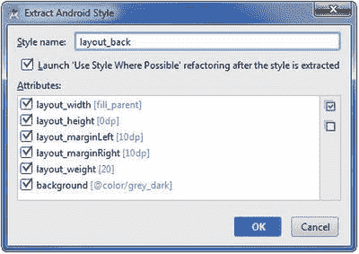

图 9-16。

Extracting the style called layout_back

从“尽可能使用样式”对话框中选择“文件”单选按钮，然后单击“确定”。现在单击 Do Refactor 将样式应用到第二次出现的布局。

按 Ctrl+Shift+N | Cmd+Shift+O，键入 styles，选择`res/values/styles.xml`文件，在编辑器中将其作为选项卡打开。你应该会得到一些看起来很像图 9-17 的东西。按 Ctrl-K | Cmd+K 提交，并显示创建样式并将样式应用于布局的消息。

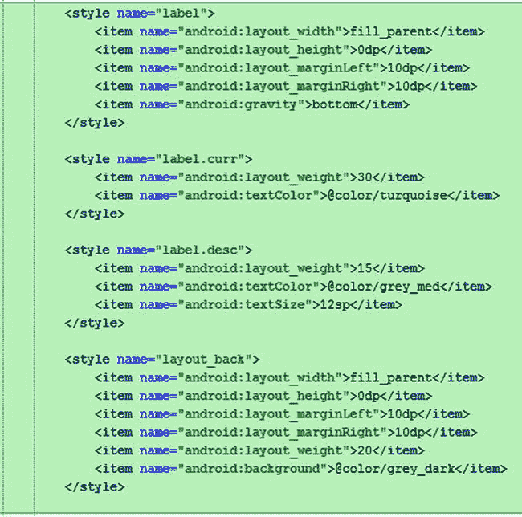

图 9-17。

Styles created automatically for you in the styles.xml file

## 创建 JSONParser 类

为了从`openexchangerates.org` web 服务中读取数据，我们需要一种解析 JSON 的方法。JSON 代表 JavaScript 对象符号，已经成为 web 服务事实上的标准格式。我们已经创建了自己的 JSON 解析器，名为`JSONParser`。这个类使用`DefaultHttpClient`填充`InputStream`，使用`BufferedReader`解析数据，使用`JSONObject`构造并返回`JSONObject`。虽然这听起来很复杂，但却非常简单。顺便说一下，我们不是唯一提出 JSON 解析器的人；如果在您最喜欢的搜索引擎中搜索 JSON parser，您会发现这种基本模式的许多实现。

详细解释`JSONParser`如何工作超出了本书的范围。尽管如此，请将这个类添加到您的项目中，因为我们将需要它的全部功能。右键单击(在 Mac 上按住 Ctrl 键单击)这个`com.apress.gerber.currencies`包，然后选择 New ➤ Java Class。将您的类命名为 JSONParser。将清单 [9-3](#FPar3) 中的代码键入(或者复制粘贴)到这个类中。

Listing 9-3\. The JSONParser.java Code

`package com.apress.gerber.currencies;`

`import android.util.Log;`

`import org.apache.http.HttpEntity;`

`import org.apache.http.HttpResponse;`

`import org.apache.http.client.ClientProtocolException;`

`import org.apache.http.client.methods.HttpPost;`

`import org.apache.http.impl.client.DefaultHttpClient;`

`import org.json.JSONException;`

`import org.json.JSONObject;`

`import java.io.BufferedReader;`

`import java.io.IOException;`

`import java.io.InputStream;`

`import java.io.InputStreamReader;`

`import java.io.UnsupportedEncodingException;`

`public class JSONParser {`

`static InputStream sInputStream = null;`

`static JSONObject sReturnJsonObject = null;`

`static String sRawJsonString = "";`

`public JSONParser() {}`

`public JSONObject getJSONFromUrl(String url) {`

`//attempt to get response from server`

`try {`

`DefaultHttpClient httpClient = new DefaultHttpClient();`

`HttpPost httpPost = new HttpPost(url);`

`HttpResponse httpResponse = httpClient.execute(httpPost);`

`HttpEntity httpEntity = httpResponse.getEntity();`

`sInputStream = httpEntity.getContent();`

`} catch (UnsupportedEncodingException e) {`

`e.printStackTrace();`

`} catch (ClientProtocolException e) {`

`e.printStackTrace();`

`} catch (IOException e) {`

`e.printStackTrace();`

`}`

`//read stream into string-builder`

`try {`

`BufferedReader reader = new BufferedReader(new InputStreamReader(`

`sInputStream, "iso-8859-1"), 8);`

`StringBuilder stringBuilder = new StringBuilder();`

`String line = null;`

`while ((line = reader.readLine()) != null) {`

`stringBuilder.append(line + "\n");`

`}`

`sInputStream.close();`

`sRawJsonString = stringBuilder.toString();`

`} catch (Exception e) {`

`Log.e("Error reading from Buffer: " + e.toString(), this.getClass().getSimpleName());`

`}`

`try {`

`sReturnJsonObject = new JSONObject(sRawJsonString);`

`} catch (JSONException e) {`

`Log.e("Parser", "Error when parsing data " + e.toString());`

`}`

`//return json object`

`return sReturnJsonObject;`

`}`

`}`

在您键入或粘贴了前面的代码之后，按 Ctrl+K | Cmd+K 提交您的更改，并显示一条“创建 JSONParser 类”的提交消息。

## 创建 Splash 活动

在本节中，我们将创建 splash 活动。这项活动的功能是为我们争取大约一秒钟的时间，以便获取有效的货币代码。当后台线程正在工作时，我们将显示一张货币的照片。如果这是一个商业应用，我们可能会显示一个带有公司标志的图像，也许还有应用的名称。

右键单击(在 Mac 上按住 Ctrl 并单击)该`com.apress.gerber.currencies`包，然后选择“新建➤活动”“➤空白活动”。将您的`Activity`命名为 SplashActivity，并选中启动器活动复选框，如图 [9-18](#Fig18) 所示。

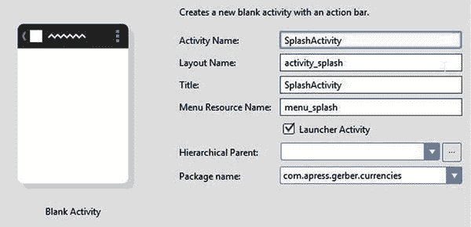

图 9-18。

New ➤ Activity ➤ Blank Activity to create SplashActivity

在新创建的`SplashActivity.java file`中，修改类定义，使`SplashActivity`扩展`Activity`而不是`ActionBarActivity`。同样在`onCreate()`方法中插入`this.requestWindowFeature(Window.FEATURE_NO_TITLE);`，如清单 [9-4](#FPar4) 所示，并解析导入。

Listing 9-4\. Modify the SplashActivity Class to Extend Activity and Remove the Title Bar

`public class SplashActivity extends``Activity`T2】

`@Override`

`protected void onCreate(Bundle savedInstanceState) {`

`super.onCreate(savedInstanceState);`

`this.requestWindowFeature(Window.FEATURE_NO_TITLE);`

`setContentView(R.layout.activity_splash);`

`}`

`...`

按 Ctrl+Shift+N | Cmd+Shift+O，然后键入和。选择并打开`app/src/main/AndroidManifest.xml`文件。修改文件，使其看起来如清单 [9-5](#FPar5) 所示。

Listing 9-5\. Modified AndroidManifest.xml File

`<?xml version="1.0" encoding="utf-8"?>`

`<manifest xmlns:android="``http://schemas.android.com/apk/res/android`T2】

`package="com.apress.gerber.currencies" >`

`<uses-permission android:name="android.permission.INTERNET"></uses-permission>`

`<application`

`android:allowBackup="true"`

`android:icon="@android:color/transparent"`

`android:label="@string/app_name"`

`android:theme="@style/AppTheme" >`

`<activity`

`android:icon="@mipmap/ic_launcher"`

`android:name=".MainActivity"`

`android:label="@string/app_name" >`

`</activity>`

`<activity`

`android:name=".SplashActivity"`

`android:label="@string/title_activity_splash">`

`<intent-filter>`

`<action android:name="android.intent.action.MAIN" />`

`<category android:name="android.intent.category.LAUNCHER" />`

`</intent-filter>`

`</activity>`

`</application>`

`</manifest>`

我们添加到`AndroidManifest.xml`文件中的`uses-permission`行允许应用访问互联网。此外，我们已经将应用本身的`icon`属性设置为`transparent`，以确保在`SplashActivity`之前不显示任何内容。注意`SplashActivity`现在包含了主/启动器意图过滤器，而不是`MainActivity`。main/launcher intent-filter 告诉 Android OS 哪个活动将首先启动。

我们需要一些免版税的作品来显示在我们的闪屏上。将浏览器指向 [`google.com/advanced_image_search`](http://www.google.com/advanced_image_search) 。在所有这些单词字段中，键入货币。在“使用权”字段中，选择“免费使用、共享或修改，甚至商业使用”。单击高级搜索。找到一张你喜欢的图片并下载下来。将图像命名为 world_currencies.jpg(如果文件是 png，则命名为 world_currencies.png)。将`world_currencies.jpg`复制并粘贴到项目工具窗口中的`res/drawable`目录中。修改`activity_splash.xml`文件，结果如清单 [9-6](#FPar6) 所示。

Listing 9-6\. Modified activity_splash.xml File to Display world_currencies as Background

`<?xml version="1.0" encoding="utf-8"?>`

`<LinearLayout xmlns:android="http://schemas.android.com/apk/res/android"`

`android:layout_width="fill_parent"`

`android:layout_height="fill_parent"`

`android:background="@drawable/world_currencies"`

`android:orientation="vertical">`

`</LinearLayout>`

按 Ctrl+K | Cmd+K 提交一条创建 splash 活动的消息，并使其成为已启动的活动。

## 以 JSON 形式提取活动货币代码

在上一节中，您使`SplashActivity`成为首先启动的活动，并修改了它的布局以显示`world_currencies`图像。在本节中，您将修改`SplashActivity`来触发一个后台线程，以便从 [`openexchangerates.org/api/currencies.json`](http://openexchangerates.org/api/currencies.json) 获取活动货币代码。

按 Ctrl+N | Cmd+O，键入 Spl，选择`SplashActivity.java`文件。在我们的`SplashActivity`中没有菜单，所以我们可以移除那些引用菜单的方法。移除`onCreateOptionsMenu()`和`onOptionsItemSelected()`方法。

我们需要创建一个`AsyncTask`，我们称之为`FetchCodesTask`，因为`SplashActivity.java. AsyncTask`的私有内部类是一个专门设计用于在 Android 中促进并发(线程)操作的类。我们在第 10 章的[中讨论了`AsyncTask`的架构，所以在此期间只要相信`AsyncTask`是可行的。](10.html)

首先将`FetchCodesTask`定义为`onCreate()`方法下`SplashActivity.java`类的私有内部类，如下所示:

`private class FetchCodesTask extends AsyncTask<String, Void, JSONObject> {`

`}`

通过将光标放在红色文本上，然后按 Alt+Enter 并选择 Import Class 来解决任何导入，如图 [9-19](#Fig19) 所示。

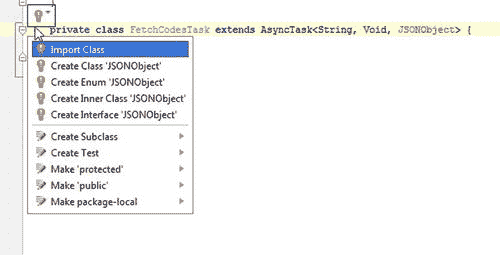

图 9-19。

Resolving JSONObject and AsyncTask imports

即使在解决了这些导入之后，类定义也应该用红色下划线标出，表明存在编译时错误。将光标放在这个新的内部类定义中，按 Alt+Insert | Cmd+N，然后选择 Override Methods。在弹出的对话框中，按住 Ctrl 键(Mac 上为 Cmd 键)并点击 OK，选择`doInBackground()`和`onPostExecute()`两种方法，如图 [9-20](#Fig20) 所示。

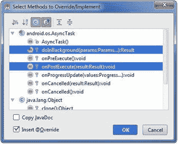

图 9-20。

Selecting doInBackground and onPostExecute methods

请注意，您的方法参数是根据包含在内部类定义中的泛型定义的。修改您的`SplashActivity.java`类，使其最终如清单 [9-7](#FPar7) 所示，并解析任何导入。

Listing 9-7\. Modify the SplashActivity.java file

`public class SplashActivity extends Activity {`

`//url to currency codes used in this application`

`public static final String URL_CODES = "``http://openexchangerates.org/api/currencies.json`T2】

`//ArrayList of currencies that will be fetched and passed into MainActivity`

`private ArrayList<String> mCurrencies;`

`@Override`

`protected void onCreate(Bundle savedInstanceState) {`

`super.onCreate(savedInstanceState);`

`this.requestWindowFeature(Window.FEATURE_NO_TITLE);`

`setContentView(R.layout.activity_splash);`

`new FetchCodesTask().execute(URL_CODES);`

`}`

`private class FetchCodesTask extends AsyncTask<String, Void, JSONObject> {`

`@Override`

`protected JSONObject doInBackground(String... params) {`

`return new JSONParser().getJSONFromUrl(params[0]);`

`}`

`@Override`

`protected void onPostExecute(JSONObject jsonObject) {`

`try {`

`if (jsonObject == null) {`

`throw new JSONException("no data available.");`

`}`

`Iterator iterator = jsonObject.keys();`

`String key = "";`

`mCurrencies = new ArrayList<String>();`

`while (iterator.hasNext()) {`

`key = (String)iterator.next();`

`mCurrencies.add(key + " | " + jsonObject.getString(key));`

`}`

`finish();`

`} catch (JSONException e) {`

`Toast.makeText(`

`SplashActivity.this,`

`"There's been a JSON exception: " + e.getMessage(),`

`Toast.LENGTH_LONG`

`).show();`

`e.printStackTrace();`

`finish();`

`}`

`}`

`}`

`}`

通过点击该行旁边的装订线，在第`mCurrencies.add(key + " | " + jsonObject.getString(key));`行设置断点。点按工具栏中的“调试”按钮(看起来像 bug 的按钮)。等待项目在调试器中生成和加载。当遇到断点时，单击几次 Resume 按钮(调试工具窗口中的绿色右箭头)。如果您在调试窗口中打开`mCurrencies`，您会注意到这些值并没有按照特定的顺序获取。见图 [9-21](#Fig21) 。在调试器窗口中，单击看起来像红色正方形的“停止”按钮。既然我们对正确获取值感到满意，那么按 Ctrl+K | Cmd+K 提交一条从 openexchangerates.org 获取 json 代码的消息。

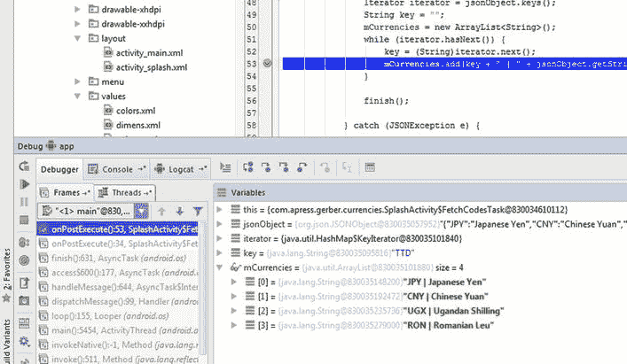

图 9-21。

Debug window inspecting mCurrencies frame by frame

## 启动主活动

在上一节中，您通过使用一个`AsyncTask`成功地获取了活动货币代码。现在您需要启动`MainActivity`并向它传递当前的货币代码。

Android 的软件架构极其开放和模块化。模块化是一种福气，因为我们可以将任意数量的第三方应用集成到我们自己的应用中。然而，模块化也是一个诅咒，因为这些其他应用不共享相同的内存空间，因此我们不能简单地传递对象引用。Android 通过在每个活动周围创建一堵中国墙来加强这种模块化，任何对象引用都不能通过这堵墙。仅按值传递规则同样适用于应用间通信和应用内通信。即使我们的`SplashActivity`和`MainActivity`位于同一个应用的同一个包中，我们仍然必须序列化这两个组件之间的任何通信，就好像每个活动位于不同的服务器上一样；这是我们为开发一个开放的模块化软件架构所付出的代价。

通过使用 Android 中一个名为`Intent`的专门类，可以方便地通过值传递数据。意图是发送给 Android 操作系统的消息。您不能将意图从一个活动直接发送到另一个活动；Android 操作系统必须总是调解活动之间的通信，这就是为什么您的活动必须总是列在您的`AndroidManifest.xml`文件中。一个意向也可能有一个称为 bundle 的有效负载。bundle 是键/值对的映射，其中键是字符串，值是 Java 原语或序列化对象。一旦 intent 的包完全装载了数据，就可以将 intent 分派给 Android OS，后者将 intent 及其有效负载传递给目的地活动。

我们想要从`SplashActivity`传递到`MainActivity`的数据只是一个字符串列表。幸运的是，`ArrayList<String>`已经实现了`Serializable`接口，所以我们可以将`mCurrencies`对象放入目的地为`MainActivity`的意图的`bundle`中，并将该意图分派给 Android 操作系统。打开`SplashActivity.java`文件。在`while`循环块之后，放置如图 [9-22](#Fig22) 所示的三行代码。

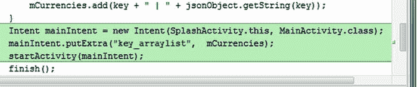

图 9-22。

Create and dispatch Intent

根据需要解决导入问题。在图 [9-22](#Fig22) 的第一行新代码中，我们正在构建一个意图，并传递一个上下文(`SplashActivity.this`)和一个目的地活动(`MainActivity.class`)。下一行用关键字`"key_arraylist"`将`mCurrencies`对象添加到我们的 intent 包中。最后一行，`startActivity(mainIntent);`，将意图发送给 Android 操作系统，后者负责找到目的地并交付有效载荷。

将光标放在`key_arraylist`上，按 Ctrl+Alt+C | Cmd+Alt+C 提取一个常数。选择`SplashActivity`作为将要定义常量的类，如图 [9-23](#Fig23) 所示，从建议列表中选择`KEY_ARRAYLIST`，按回车键在该类中创建一个常量。

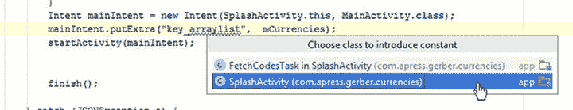

图 9-23。

Select SplashActivity to be the class in which constant will be defined

按 Ctrl+K | Cmd+K 并提交一条带有意图的 Fires-up MainActivity 消息，然后将 ArrayList 传递给 Bundle。

## 摘要

在这一章中，我们描述了货币应用规范，并着手实现它的一些特性。我们定义了布局，提取了颜色，创建并应用了样式。我们还介绍了 JSON，并创建了一个闪屏来获取活动货币代码，这些代码是填充主活动的微调器所必需的。我们引入了`AsyncTask`并从 web 服务中获取 JSON 数据。我们还使用意图在活动之间进行交流。在下一章中，我们将完成货币应用。